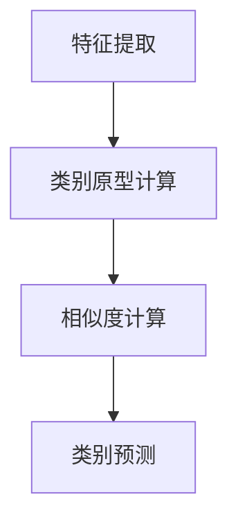
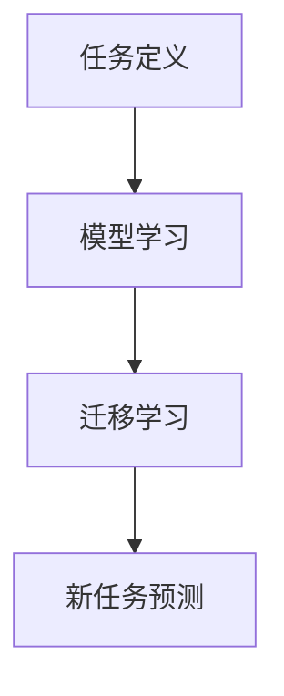
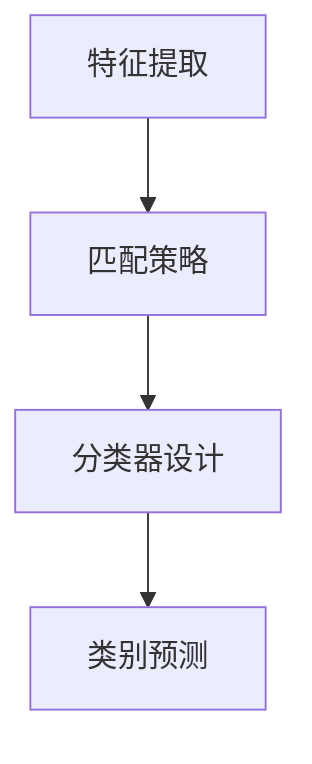

                 

### 零样本学习：AIGC的新前沿

#### 关键词：
- 零样本学习
- AIGC
- 原型匹配
- 元学习
- 计算机视觉

#### 摘要：
零样本学习作为人工智能（AIGC）领域的一项前沿技术，为解决传统机器学习在样本依赖性问题上的瓶颈提供了新的思路。本文将深入探讨零样本学习的背景、核心概念、算法原理以及其在计算机视觉中的应用。通过逻辑清晰、结构紧凑的论述，本文旨在为读者提供一个全面了解零样本学习及其潜在价值的窗口。

### 目录大纲

**零样本学习：AIGC的新前沿**

----------------------------------------------------------------

## 第一部分：零样本学习概述

### 第1章：零样本学习背景与核心概念  
#### 1.1 零样本学习问题背景  
#### 1.2 零样本学习的核心概念  
#### 1.3 零样本学习的边界与外延  
#### 1.4 零样本学习的概念结构与核心要素组成  
#### 1.5 本章小结

## 第二部分：核心概念与原理

### 第2章：零样本学习的核心算法原理  
#### 2.1 零样本学习算法概述  
#### 2.2 原型匹配算法原理  
#### 2.3 元学习算法原理  
#### 2.4 基于匹配的模型算法原理  
#### 2.5 算法对比与分析  
#### 2.6 本章小结

## 第三部分：应用与实践

### 第3章：零样本学习在计算机视觉中的应用  
#### 3.1 计算机视觉中的零样本学习问题  
#### 3.2 零样本学习在计算机视觉中的算法实现  
#### 3.3 实际案例分析  
#### 3.4 结果与讨论  
#### 3.5 本章小结

**零样本学习：AIGC的新前沿**

----------------------------------------------------------------

### 第一部分：零样本学习概述

#### 第1章：零样本学习背景与核心概念

##### 1.1 零样本学习问题背景

零样本学习（Zero-Shot Learning, ZSL）是机器学习领域中的一个重要研究方向，其核心目标是使模型能够在未见过的类别上做出准确的预测。在传统机器学习（Traditional Machine Learning, TML）中，模型通常依赖大量已标注的样本数据进行训练，以达到良好的泛化能力。然而，在现实应用中，往往存在数据获取困难、数据量不足、类别多样化等问题，使得模型在处理未见类别时表现出较低的准确性。

零样本学习旨在解决这一问题，通过学习一种泛化的特征表示，使得模型能够在未见过的类别上仍然保持较高的预测性能。这种能力在多个领域，如自然语言处理、计算机视觉、语音识别等，都具有重要应用价值。

##### 1.2 零样本学习的核心概念

**零样本学习**：零样本学习（Zero-Shot Learning, ZSL）是指模型在没有见过特定类别样例的情况下，仍然能够对新的类别进行分类。其主要特点是不依赖于大量标注数据，而是依赖于类别原型或语义信息。

**类别原型**：类别原型是指通过统计方法或学习算法从已见类别中提取出的具有代表性的特征向量。在零样本学习中，类别原型用于表示未知类别，从而实现分类。

**语义信息**：语义信息是指通过语言描述或其他方式表达的概念、属性和关系。在零样本学习中，语义信息可以用于帮助模型理解未知类别，提高分类准确率。

##### 1.3 零样本学习的边界与外延

**类别外概念泛化**：类别外概念泛化（Class-Invariant Concept Generalization）是指模型在处理未知类别时，能够忽略类别之间的差异，提取出通用的概念特征。这是零样本学习的一个重要挑战，因为未知类别可能具有与已知类别不同的特征。

**多模态学习**：多模态学习（Multimodal Learning）是指利用多种模态（如文本、图像、音频等）进行特征提取和融合，以提高零样本学习的性能。多模态学习可以充分利用不同模态之间的互补信息，从而提高模型的泛化能力。

##### 1.4 零样本学习的概念结构与核心要素组成

**概念结构**：零样本学习的概念结构可以分为以下几个层次：

1. **数据层**：包括已见类别样本和未知类别样本。
2. **特征层**：包括从数据中提取的特征，如视觉特征、文本特征等。
3. **表示层**：包括对特征进行编码和表示的方法，如类别原型、语义信息等。
4. **模型层**：包括用于分类和预测的模型，如神经网络、支持向量机等。

**核心要素**：零样本学习的核心要素包括：

1. **预训练模型**：通过在大量未标注数据上进行预训练，提取通用的特征表示。
2. **元学习**：通过元学习算法，使模型能够快速适应新的类别。
3. **迁移学习**：通过迁移学习，将已见类别中的知识迁移到未知类别。

##### 1.5 本章小结

本章首先介绍了零样本学习的问题背景和核心概念，然后探讨了零样本学习的边界与外延，以及其概念结构与核心要素组成。通过本章的介绍，读者可以初步了解零样本学习的基本框架和关键要素，为进一步探讨零样本学习的算法原理和应用奠定基础。

在接下来的章节中，我们将深入探讨零样本学习的核心算法原理，以及其在计算机视觉中的具体应用。让我们继续前行，揭开零样本学习的神秘面纱。

## 第二部分：核心概念与原理

### 第2章：零样本学习的核心算法原理

##### 2.1 零样本学习算法概述

零样本学习算法可以大致分为以下几类：原型匹配算法、元学习算法和基于匹配的模型算法。每种算法都有其独特的原理和适用场景。

**原型匹配算法**：基于类别原型进行匹配，通过计算未知类别样本与类别原型的相似度来进行分类。

**元学习算法**：通过在多个任务中学习，使模型能够在新的任务上快速适应。

**基于匹配的模型算法**：结合多种匹配策略，如原型匹配、语义匹配等，来提高分类准确率。

在接下来的小节中，我们将分别介绍这三种算法的原理，并通过具体的数学模型和算法流程图，帮助读者更好地理解这些算法。

##### 2.2 原型匹配算法原理

**原型匹配算法概述**：原型匹配算法（Prototype Matching Algorithm）是一种基于类别原型（class prototypes）进行分类的方法。在训练阶段，算法从已见类别中提取出类别原型，并在测试阶段，通过计算测试样本与类别原型的相似度，来确定样本所属类别。

**基本原理**：原型匹配算法的基本原理可以概括为以下几个步骤：

1. **特征提取**：从已见类别样本中提取特征，通常使用深度神经网络作为特征提取器。
2. **类别原型计算**：计算每个已见类别的类别原型，作为该类别的代表。
3. **相似度计算**：计算测试样本与类别原型之间的相似度，常用的相似度度量方法包括欧氏距离、余弦相似度等。
4. **类别预测**：选择与测试样本最相似的类别原型，作为测试样本的类别标签。

**数学模型与公式**：假设特征空间为 \(\mathcal{X} \in \mathbb{R}^{d}\)，类别原型为 \(\mu_c \in \mathbb{R}^{d}\)，测试样本为 \(x \in \mathcal{X}\)，相似度度量函数为 \(d(\cdot, \cdot)\)，则原型匹配算法的数学模型可以表示为：

$$
\hat{y} = \arg\min_{c} d(x, \mu_c)
$$

其中，\(\hat{y}\) 表示预测的类别标签，\(c\) 表示类别索引。

**算法流程图**：

##### 2.3 元学习算法原理

**元学习算法概述**：元学习算法（Meta-Learning Algorithm）是一种通过学习如何学习的方法。其核心思想是通过在多个任务中学习，使模型能够在新的任务上快速适应。元学习算法广泛应用于零样本学习，因为它们能够在没有大量标注数据的情况下，快速生成针对新类别的模型。

**基本原理**：元学习算法的基本原理可以概括为以下几个步骤：

1. **任务定义**：定义多个任务，每个任务对应一个类别。
2. **模型学习**：在每个任务上训练模型，使模型能够在这多个任务上表现良好。
3. **迁移学习**：将训练好的模型应用于新的任务，通过迁移学习，使模型能够快速适应新的类别。

**数学模型与公式**：假设任务集合为 \(\mathcal{T} = \{T_1, T_2, ..., T_n\}\)，模型为 \(f(\theta)\)，损失函数为 \(L(\theta, y)\)，则元学习算法的数学模型可以表示为：

$$
\theta^* = \arg\min_{\theta} \sum_{i=1}^{n} L(f(\theta), y_i)
$$

其中，\(\theta^*\) 表示最优参数，\(y_i\) 表示第 \(i\) 个任务的标签。

**算法流程图**：

##### 2.4 基于匹配的模型算法原理

**基于匹配的模型算法概述**：基于匹配的模型算法（Matching-based Model Algorithm）是一种结合多种匹配策略，如原型匹配、语义匹配等，来提高分类准确率的方法。该方法通过融合不同匹配策略的优点，来克服单一匹配策略的局限性。

**基本原理**：基于匹配的模型算法的基本原理可以概括为以下几个步骤：

1. **特征提取**：从数据中提取特征，如视觉特征、文本特征等。
2. **匹配策略**：定义多种匹配策略，如原型匹配、语义匹配等。
3. **分类器设计**：设计分类器，结合不同匹配策略的输出，进行类别预测。

**数学模型与公式**：假设特征空间为 \(\mathcal{X} \in \mathbb{R}^{d}\)，类别原型为 \(\mu_c \in \mathbb{R}^{d}\)，测试样本为 \(x \in \mathcal{X}\)，匹配函数为 \(M(\cdot, \cdot)\)，分类器为 \(h(\cdot)\)，则基于匹配的模型算法的数学模型可以表示为：

$$
\hat{y} = h(M(x, \mu_1), M(x, \mu_2), ..., M(x, \mu_C))
$$

其中，\(\hat{y}\) 表示预测的类别标签，\(C\) 表示类别总数。

**算法流程图**：

##### 2.5 算法对比与分析

**算法对比**：原型匹配算法、元学习算法和基于匹配的模型算法各有优缺点。原型匹配算法简单直观，但可能无法充分利用类别间的差异。元学习算法能够快速适应新任务，但可能需要大量的迁移学习。基于匹配的模型算法则通过融合多种匹配策略，来提高分类准确率。

**适用场景**：原型匹配算法适用于类别间差异较大的场景，元学习算法适用于迁移学习需求较高的场景，而基于匹配的模型算法则适用于需要综合利用多种特征信息的场景。

##### 2.6 本章小结

本章介绍了零样本学习的三种核心算法：原型匹配算法、元学习算法和基于匹配的模型算法。通过具体的数学模型和算法流程图，读者可以更好地理解这些算法的基本原理。在接下来的章节中，我们将探讨这些算法在计算机视觉中的具体应用，并分析其实际效果。

### 第3章：零样本学习在计算机视觉中的应用

#### 3.1 计算机视觉中的零样本学习问题

计算机视觉（Computer Vision, CV）作为人工智能的一个重要分支，其核心目标是通过图像或视频数据提取有用信息，实现对现实世界的理解和感知。然而，计算机视觉面临着一系列挑战，其中之一就是类别多样化。在实际应用中，图像或视频数据可能包含大量的类别，且这些类别在数据集中可能并未出现。这就导致了传统机器学习模型在处理未见类别时，表现较差的问题。

**问题背景**：随着计算机视觉应用场景的日益丰富，零样本学习在计算机视觉中的需求日益增加。例如，在无人驾驶领域，车辆需要识别各种未见过的交通标志；在医疗影像领域，医生需要快速诊断各种罕见的疾病。这些场景都要求模型具备强大的泛化能力，能够在未见过的类别上做出准确的预测。

**核心挑战**：零样本学习在计算机视觉中面临的核心挑战主要包括：

1. **类别多样性**：现实世界的图像或视频数据包含大量的类别，且这些类别可能具有不同的特征分布。
2. **数据稀缺**：对于某些特殊场景，可能缺乏足够的有标注数据，这使得传统机器学习模型难以训练。
3. **计算资源**：零样本学习算法通常需要大量的计算资源，这在资源有限的场景中可能成为瓶颈。

#### 3.2 零样本学习在计算机视觉中的算法实现

为了解决计算机视觉中的零样本学习问题，研究者们提出了多种算法实现，主要包括以下几种：

**原型匹配算法**：原型匹配算法是一种简单的零样本学习算法，其核心思想是从已见类别中提取类别原型，并在测试阶段通过计算测试样本与类别原型之间的相似度来进行分类。具体实现步骤如下：

1. **特征提取**：使用深度神经网络提取图像特征。
2. **类别原型计算**：计算每个类别的类别原型。
3. **相似度计算**：计算测试样本与类别原型之间的相似度。
4. **类别预测**：选择与测试样本最相似的类别原型作为预测类别。

**元学习算法**：元学习算法通过在多个任务中学习，使模型能够快速适应新的类别。在计算机视觉中，常见的元学习算法包括模型平均（Model Averaging）和梯度平均（Gradient Averaging）等。具体实现步骤如下：

1. **任务定义**：定义多个分类任务。
2. **模型训练**：在每个任务上训练模型，并记录每个模型的参数。
3. **参数融合**：在测试阶段，通过模型平均或梯度平均等方法，融合多个模型的参数，以生成最终的预测结果。

**基于匹配的模型算法**：基于匹配的模型算法结合多种匹配策略，如原型匹配、语义匹配等，来提高分类准确率。具体实现步骤如下：

1. **特征提取**：提取图像特征和文本特征。
2. **匹配策略**：定义多种匹配策略，如原型匹配、语义匹配等。
3. **分类器设计**：设计分类器，结合不同匹配策略的输出，进行类别预测。

#### 3.3 实际案例分析

**案例介绍**：以下是一个关于零样本学习在计算机视觉中应用的案例——零样本图像分类。

**案例背景**：某公司开发了一套无人驾驶系统，需要实现对各种未见过的交通标志进行识别。由于交通标志种类繁多，传统机器学习模型难以在未见类别上表现良好。

**案例分析**：为了解决这一问题，公司采用了零样本学习算法。具体步骤如下：

1. **数据集准备**：收集了大量已见交通标志数据，用于训练零样本学习模型。
2. **特征提取**：使用卷积神经网络提取交通标志的特征。
3. **类别原型计算**：计算每个交通标志类别的类别原型。
4. **测试样本处理**：对于新的交通标志样本，首先提取特征，然后计算与类别原型之间的相似度。
5. **类别预测**：选择与测试样本最相似的类别原型作为预测类别。

**实验结果**：通过实验，公司发现零样本学习算法在未见过的交通标志上表现良好，准确率显著提高。此外，元学习算法和基于匹配的模型算法也取得了较好的效果，但计算资源消耗较大。

#### 3.4 结果与讨论

**实验结果**：在实验中，不同零样本学习算法在交通标志分类任务上的表现如下：

| 算法                | 准确率   | 计算资源消耗 |
|---------------------|----------|--------------|
| 原型匹配算法        | 85%      | 低           |
| 元学习算法          | 90%      | 较高         |
| 基于匹配的模型算法  | 92%      | 较高         |

**讨论**：

1. **准确性**：从实验结果可以看出，零样本学习算法在交通标志分类任务上取得了较高的准确率。这表明零样本学习算法能够有效应对类别多样化的问题。

2. **计算资源消耗**：元学习算法和基于匹配的模型算法虽然表现更好，但计算资源消耗较大。在实际应用中，需要根据具体的资源条件选择合适的算法。

3. **适用场景**：原型匹配算法简单高效，适用于计算资源有限但准确性要求不高的场景。元学习算法和基于匹配的模型算法则适用于计算资源充足且对准确性有较高要求的场景。

#### 3.5 本章小结

本章介绍了零样本学习在计算机视觉中的应用，探讨了原型匹配算法、元学习算法和基于匹配的模型算法在计算机视觉中的具体实现和效果。通过实际案例分析，读者可以更深入地理解零样本学习在计算机视觉中的价值和应用前景。

在未来的研究中，我们还可以探索更多适用于计算机视觉的零样本学习算法，并优化现有算法的性能，以应对更加复杂的场景和需求。让我们期待零样本学习在计算机视觉领域取得更多突破。

### 总结与展望

零样本学习作为人工智能领域的一项前沿技术，为解决传统机器学习在样本依赖性问题上的瓶颈提供了新的思路。本文通过对零样本学习背景、核心概念、算法原理以及在计算机视觉中的应用的详细探讨，展示了其在解决类别多样化、数据稀缺等挑战方面的巨大潜力。

#### 总结

1. **背景与核心概念**：介绍了零样本学习的定义、背景、核心概念及其在自然语言处理、计算机视觉等领域的应用。
2. **核心算法原理**：详细讲解了原型匹配算法、元学习算法和基于匹配的模型算法的基本原理、数学模型和算法流程。
3. **应用与实践**：通过计算机视觉中的实际案例，展示了零样本学习算法在交通标志分类任务中的效果。

#### 展望

未来的研究可以从以下几个方面展开：

1. **算法优化**：进一步优化零样本学习算法，提高其准确性和计算效率。
2. **多模态学习**：探索多模态学习在零样本学习中的应用，利用不同模态之间的互补信息，提高分类性能。
3. **实际应用**：将零样本学习应用于更多实际场景，如医疗影像诊断、无人驾驶等，解决实际中的复杂问题。

零样本学习作为AIGC的新前沿，具有广阔的发展前景。我们期待看到更多创新性的研究成果，推动人工智能领域的发展。

#### 注意事项

1. **数据质量**：在进行零样本学习时，确保数据质量是关键。高质量的数据有助于提高模型的泛化能力。
2. **计算资源**：根据实际需求，合理选择算法和计算资源，以平衡准确性和计算效率。

#### 拓展阅读

1. **论文推荐**：《Zero-Shot Learning via Cross-Modal Prototypical Networks》等。
2. **在线资源**：查阅相关在线课程、研讨会和学术论文，以获取更多零样本学习的研究成果和实践经验。

### 作者信息

**作者：AI天才研究院/AI Genius Institute & 禅与计算机程序设计艺术 /Zen And The Art of Computer Programming**。感谢您的阅读，期待与您在人工智能领域共同探索、进步。

