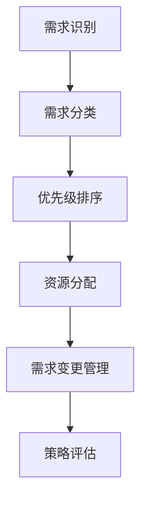
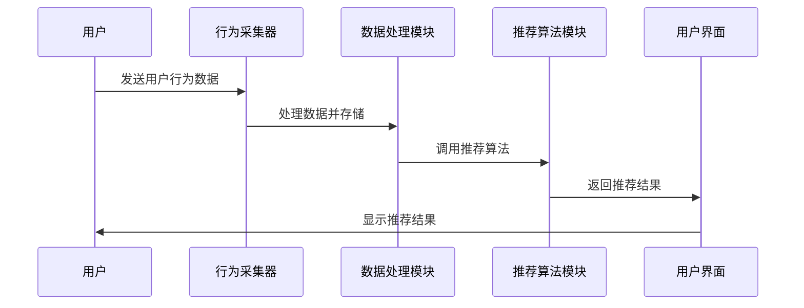

                 

### 第1章: 引言

#### 1.1 问题背景

在当今快速发展的信息技术时代，需求Backlog管理成为了软件开发和项目管理中的关键环节。需求Backlog是指一个项目在开发过程中积累下来的一系列尚未实现的功能需求。它不仅反映了用户的需求，也是项目团队进行优先级排序和资源分配的重要依据。

随着人工智能技术的迅速崛起，特别是大规模模型（如深度学习模型）的应用，需求Backlog管理面临着新的挑战。大模型应用开发的特点包括数据量大、模型复杂、训练周期长等，这要求我们在需求Backlog管理中采取更加精细和高效的策略。

**问题背景**：

- **需求多样性与复杂性**：大模型应用开发的需求来源广泛，既包括传统业务需求，也包含基于人工智能的创新需求。这些需求往往多样且复杂，给需求Backlog管理带来了挑战。

- **资源分配的动态调整**：大模型训练和部署需要大量的计算资源和存储资源。如何根据需求Backlog的优先级动态调整资源分配，以确保项目进度和质量，是需求Backlog管理中的关键问题。

- **需求变更的频繁性**：在大模型应用开发过程中，用户需求可能会根据市场变化、技术进步或用户反馈等因素频繁变更。如何高效地管理这些变更，保证项目平稳推进，是需求Backlog管理面临的另一大挑战。

- **质量保障与交付压力**：大模型应用开发往往要求高可靠性和高性能。在满足这些质量要求的同时，如何平衡需求实现的速度和范围，是需求Backlog管理中需要解决的核心问题。

#### 1.2 问题描述

需求Backlog管理存在的问题主要包括以下几个方面：

- **需求识别不足**：在项目初期，由于对用户需求的理解不足，可能导致需求识别不全面，从而影响后续的需求管理和实施。

- **优先级排序不明确**：在需求Backlog中，不同需求的优先级排序不明确，容易导致资源分配不合理，影响项目进度和质量。

- **需求变更管理困难**：需求变更频繁且复杂，如果管理不当，可能导致项目混乱、进度延误和质量下降。

- **资源分配不均**：在资源有限的情况下，如何根据需求Backlog的优先级进行合理的资源分配，是需求Backlog管理中的难题。

#### 1.3 问题解决

为了解决上述问题，需求Backlog管理需要采取以下策略：

- **完善需求识别机制**：通过用户访谈、需求调研等方式，全面了解用户需求，确保需求识别的全面性和准确性。

- **建立科学的优先级排序体系**：基于需求的重要性和紧迫性，建立科学的优先级排序体系，确保资源分配的合理性和效率。

- **加强需求变更管理**：建立需求变更的流程和机制，对变更进行严格评估和控制，确保变更的合理性和项目稳定性。

- **优化资源分配策略**：根据需求Backlog的优先级，动态调整资源分配，确保资源利用的最大化。

- **运用大数据和人工智能技术**：利用大数据分析和人工智能技术，对需求Backlog进行智能分析和预测，提高需求管理的精准度和效率。

#### 1.4 边界与外延

**边界**：

- 需求Backlog管理的边界主要涉及需求识别、优先级排序、需求变更管理和资源分配等方面。

- 在大模型应用开发中，需求Backlog管理需要关注模型训练与部署的特殊需求，如数据预处理、模型调优、资源调度等。

**外延**：

- 需求Backlog管理不仅涉及到软件开发过程中的需求管理，还与产品管理、项目管理等环节密切相关。

- 在大模型应用开发中，需求Backlog管理需要与数据管理、算法优化、模型评估等环节紧密结合，形成协同管理的整体架构。

#### 1.5 概念结构与核心要素组成

**概念结构**：

- 需求Backlog：积累下来的一系列尚未实现的功能需求。

- 需求识别：收集和识别用户需求的过程。

- 需求分类：根据需求的特点和属性进行分类。

- 需求优先级排序：根据需求的重要性和紧迫性进行排序。

- 需求变更管理：对需求变更进行评估、控制和管理。

- 资源分配：根据需求Backlog的优先级，分配相应的资源。

**核心要素组成**：

- 用户需求：需求Backlog的基础，是需求的来源。

- 需求文档：需求识别和分类的结果，是需求管理的依据。

- 需求跟踪：对需求从识别到实现的全过程进行监控和管理。

- 优先级矩阵：用于对需求进行优先级排序的工具。

- 资源池：用于分配和调配资源的集合。

### 小结

本章对需求Backlog管理和大模型应用开发中的问题进行了详细探讨。通过对背景、问题描述、问题解决、边界与外延以及概念结构与核心要素组成的分析，为后续章节的深入讨论奠定了基础。在接下来的章节中，我们将进一步探讨需求Backlog管理的核心概念与联系，以及大模型应用开发的策略原理。

### 第2章: 需求Backlog管理概述

#### 2.1 需求Backlog的定义与特性

需求Backlog是指一个项目在开发过程中积累下来的一系列尚未实现的功能需求。它包含了用户需求、业务需求和技术需求等多种类型，是项目团队进行优先级排序和资源分配的重要依据。需求Backlog管理则是通过识别、分类、排序、变更管理和资源分配等一系列活动，确保项目能够按时、按质量完成。

**需求Backlog的定义**：

- 需求Backlog是项目需求的一种积累形式，它记录了项目尚未实现的所有功能需求。

- 需求Backlog不仅仅包括功能需求，还包括性能需求、安全性需求等非功能性需求。

- 需求Backlog是动态变化的，随着项目进展和外部环境的变化，需求Backlog的内容也会不断调整。

**需求Backlog的主要特性**：

1. **多样性**：需求Backlog中的需求来源广泛，可能涉及不同的用户、不同的业务场景，甚至涉及不同的技术方向。这种多样性要求我们在管理需求Backlog时，需要采用灵活的策略和方法。

2. **不确定性**：由于用户需求和市场环境的不断变化，需求Backlog中的需求可能会随时发生变化。这种不确定性要求我们在管理需求Backlog时，需要具备快速响应的能力和灵活的调整机制。

3. **动态性**：需求Backlog是动态变化的，项目团队需要不断地识别新的需求、调整已有需求的优先级，以及进行需求变更管理。这种动态性要求我们在管理需求Backlog时，需要具备良好的监控和跟踪能力。

4. **优先级**：在需求Backlog中，不同的需求具有不同的优先级。优先级决定了需求的实现顺序和资源分配策略。有效的需求Backlog管理需要科学合理的优先级排序，以确保资源的最优利用。

5. **资源依赖性**：需求Backlog中的某些需求可能需要特定的资源（如硬件资源、人力资源）才能实现。资源依赖性要求我们在管理需求Backlog时，需要考虑资源的可用性和分配策略。

**需求Backlog与产品开发的关系**：

- 需求Backlog是产品开发的核心输入。通过需求Backlog，项目团队可以明确产品的功能和特性，从而制定合理的开发计划。

- 需求Backlog管理直接影响产品的质量、进度和成本。有效的需求Backlog管理可以提高产品的竞争力，确保项目按时、按质量交付。

- 需求Backlog管理不仅是开发团队的工作，还涉及到产品经理、项目经理、业务分析师等多方参与。多方协作和有效沟通是需求Backlog管理成功的关键。

#### 2.2 大模型应用开发的策略概述

在大模型应用开发中，需求Backlog管理策略尤为重要。这是因为大模型应用开发具有数据量大、模型复杂、训练周期长等特点，对需求管理提出了更高的要求。以下是一个典型的大模型应用开发策略框架：

1. **需求识别**：通过用户访谈、市场调研、数据分析等方式，全面了解用户需求和市场趋势，确保需求识别的全面性和准确性。

2. **需求分类**：根据需求的特点和属性，将需求进行分类。常见的分类方法包括按功能模块分类、按优先级分类、按需求来源分类等。

3. **优先级排序**：采用科学的优先级排序方法，如MoSCoW方法、Kano模型等，对需求进行优先级排序。确保高优先级需求先得到满足。

4. **需求变更管理**：建立需求变更的流程和机制，对需求变更进行严格评估和控制，确保变更的合理性和项目稳定性。

5. **资源分配**：根据需求Backlog的优先级和资源情况，进行合理的资源分配。确保关键需求和关键资源得到优先保障。

6. **需求跟踪**：对需求从识别到实现的全过程进行监控和管理，确保需求得到有效执行和及时调整。

7. **质量保障**：通过代码审查、单元测试、集成测试等方式，确保需求实现的质量。

**策略在大模型应用开发中的重要性**：

- **提高开发效率**：有效的需求Backlog管理可以提高开发团队的工作效率，确保项目按时交付。

- **降低开发风险**：通过需求识别、分类、排序、变更管理等环节，可以降低开发过程中的风险，确保项目质量和稳定性。

- **优化资源利用**：通过科学的资源分配策略，可以最大化地利用有限资源，提高项目的经济效益。

- **满足用户需求**：有效的需求Backlog管理可以确保用户需求得到及时响应和满足，提升用户体验和满意度。

### 2.3 策略在需求Backlog管理中的作用

**策略在需求Backlog管理中的作用主要表现在以下几个方面**：

1. **指导开发方向**：通过科学的需求识别和优先级排序，策略可以明确项目的开发方向，确保项目团队聚焦于关键需求和核心功能。

2. **优化资源分配**：通过合理的资源分配策略，策略可以最大化地利用资源，提高项目开发和运维的效率。

3. **提高交付质量**：通过严格的需求变更管理和质量保障措施，策略可以确保项目交付的高质量。

4. **增强团队协作**：通过多方协作和有效沟通，策略可以增强项目团队的合作和协调，提高团队的整体执行力。

5. **降低管理风险**：通过建立完善的流程和机制，策略可以降低需求管理过程中的风险，确保项目的顺利推进。

总之，策略在需求Backlog管理中起着至关重要的作用。只有通过科学的策略，才能确保项目在复杂多变的环境中，实现按时、按质量交付的目标。

#### 2.4 大模型应用开发的策略框架

大模型应用开发的策略框架是一个系统性、多层次的结构，旨在应对需求识别、分类、优先级排序、变更管理和资源分配等方面的挑战。以下是该策略框架的具体内容：

1. **需求识别**：

   - **用户访谈**：通过与目标用户进行面对面访谈，深入了解用户的需求、痛点和期望，确保需求识别的全面性。
   - **市场调研**：通过市场分析报告、竞品分析等方式，了解行业趋势、技术动向和用户需求变化，为需求识别提供参考。
   - **数据分析**：利用数据挖掘技术，分析用户行为数据、历史需求数据等，发现潜在需求和趋势，提高需求识别的准确性。

2. **需求分类**：

   - **按功能模块分类**：将需求按照不同的功能模块进行分类，便于后续的需求管理和资源分配。
   - **按优先级分类**：根据需求的重要性和紧迫性，将需求划分为高、中、低优先级，确保关键需求优先得到满足。
   - **按需求来源分类**：将需求按照来源进行分类，如用户需求、业务需求、技术需求等，便于分析需求的结构和分布。

3. **优先级排序**：

   - **MoSCoW方法**：将需求按照“Must have”（必须要有）、“Should have”（应该有）、“Could have”（可以暂时没有）和“Won't have”（现在没有，以后也不会有）进行排序，明确需求的优先级。
   - **Kano模型**：将需求按照“必备需求”、“性能需求”、“魅力需求”和“无需求”进行排序，区分不同类型需求的重要性。
   - **基于价值排序**：根据需求带来的商业价值、用户满意度等指标，对需求进行优先级排序，确保高价值需求优先实现。

4. **需求变更管理**：

   - **变更请求**：建立变更请求流程，确保所有变更请求都能被记录、评估和批准。
   - **变更评估**：对变更请求进行影响分析和成本评估，确保变更的合理性和可行性。
   - **变更控制**：建立变更控制机制，确保变更得到有效执行，并对变更的影响进行监控和管理。

5. **资源分配**：

   - **资源池管理**：建立资源池，对资源进行统一管理和调度，确保资源得到最优利用。
   - **动态调整**：根据需求Backlog的优先级和资源状况，动态调整资源分配策略，确保关键需求和关键资源得到优先保障。
   - **风险评估**：对资源分配进行风险评估，确保资源充足且不会因资源短缺导致项目延误。

6. **需求跟踪**：

   - **需求文档**：建立需求文档，记录需求从识别到实现的全过程，便于需求和项目的管理和追溯。
   - **需求状态监控**：对需求的状态进行实时监控，确保需求得到及时处理和实现。
   - **需求反馈**：建立需求反馈机制，收集用户对需求实现情况的反馈，不断优化和调整需求管理流程。

通过以上策略框架，项目团队可以系统地管理大模型应用开发中的需求，确保项目顺利进行，同时满足用户需求和市场变化。

### 小结

本章对需求Backlog管理的定义与特性进行了详细阐述，并介绍了大模型应用开发中的策略框架。需求Backlog管理是一个复杂且动态的过程，它涉及到需求识别、分类、排序、变更管理和资源分配等多个环节。在大模型应用开发中，有效的需求Backlog管理策略不仅能够提高开发效率，降低开发风险，还能优化资源利用，确保项目按时、按质量交付。在接下来的章节中，我们将进一步探讨需求Backlog管理的核心概念与联系，以及具体的实施方法。

### 第3章: 需求Backlog管理的核心概念与联系

#### 3.1 核心概念原理

需求Backlog管理的核心概念包括需求识别、需求分类、需求优先级排序、需求变更管理和资源分配等。以下是这些核心概念的基本原理和关键要素。

**需求识别**：

需求识别是需求Backlog管理的第一步，它的核心任务是发现和收集用户的需求。需求识别的原理如下：

1. **用户访谈**：通过与用户进行面对面的访谈，深入了解用户的需求和期望。
2. **问卷调查**：通过设计问卷，收集大量用户的反馈和意见。
3. **市场调研**：通过市场分析和竞品调研，了解行业趋势和用户需求。

关键要素：

- **用户参与度**：确保用户参与需求识别过程，提高需求识别的准确性和全面性。
- **数据收集**：收集尽可能多的需求信息，以便后续分析和处理。

**需求分类**：

需求分类是将识别到的需求按照其属性和特点进行归类，以便于管理和实施。需求分类的原理如下：

1. **按功能模块分类**：根据需求实现的功能，将需求划分为不同的模块，如用户界面、数据处理、算法实现等。
2. **按优先级分类**：根据需求的重要性和紧迫性，将需求划分为高、中、低优先级。
3. **按来源分类**：根据需求的来源，将需求划分为用户需求、业务需求和技术需求等。

关键要素：

- **分类标准**：明确分类标准和依据，确保分类的科学性和一致性。
- **灵活性**：根据项目需求的变化，灵活调整分类方法和标准。

**需求优先级排序**：

需求优先级排序是确定需求实现顺序的关键步骤。它的原理如下：

1. **MoSCoW方法**：将需求按照“Must have”（必须要有）、“Should have”（应该有）、“Could have”（可以暂时没有）和“Won't have”（现在没有，以后也不会有）进行排序。
2. **Kano模型**：将需求按照“必备需求”、“性能需求”、“魅力需求”和“无需求”进行排序。
3. **基于价值排序**：根据需求带来的商业价值、用户满意度等指标进行排序。

关键要素：

- **排序标准**：确定科学合理的排序标准，确保排序结果的公正性和准确性。
- **动态调整**：根据项目进展和需求变化，动态调整需求优先级。

**需求变更管理**：

需求变更管理是对需求Backlog中的需求进行变更的流程和机制。它的原理如下：

1. **变更请求**：建立变更请求机制，确保所有变更请求都能被记录和审批。
2. **变更评估**：对变更请求的影响和成本进行评估，确保变更的合理性和可行性。
3. **变更控制**：建立变更控制机制，确保变更得到有效执行和监控。

关键要素：

- **变更流程**：明确变更的流程和步骤，确保变更的规范性和效率。
- **变更评估**：对变更的影响进行充分评估，确保变更的合理性和可行性。

**资源分配**：

资源分配是根据需求Backlog的优先级和资源情况，进行资源分配的策略。它的原理如下：

1. **资源池管理**：建立资源池，对资源进行统一管理和调度。
2. **动态调整**：根据需求Backlog的优先级和资源状况，动态调整资源分配策略。
3. **风险评估**：对资源分配进行风险评估，确保资源充足且不会因资源短缺导致项目延误。

关键要素：

- **资源状况**：准确了解资源状况，确保资源分配的科学性和合理性。
- **动态调整**：根据项目进展和需求变化，及时调整资源分配策略。

#### 3.2 概念属性特征对比表格

为了更好地理解和区分需求识别、需求分类、需求优先级排序、需求变更管理和资源分配等核心概念，以下是这些概念的一些关键属性和特征对比表格。

| 核心概念     | 关键属性                             | 特征对比 |
| ------------ | ----------------------------------- | ------- |
| 需求识别     | 识别和收集需求                      | 需求的来源、用户参与度、数据收集方法 |
| 需求分类     | 对需求进行分类                     | 分类标准、灵活性、按功能模块、优先级、来源 |
| 需求优先级排序 | 确定需求的实现顺序                 | MoSCoW方法、Kano模型、基于价值排序、动态调整 |
| 需求变更管理 | 对需求进行变更的流程和机制         | 变更请求、变更评估、变更控制、变更流程 |
| 资源分配     | 根据需求Backlog优先级进行资源分配 | 资源池管理、动态调整、风险评估、资源状况 |

#### 3.3 ER实体关系图架构

需求Backlog管理涉及到多个实体和它们之间的关系，通过ER（实体-关系）图可以清晰地展示这些实体及其关系。以下是需求Backlog管理的ER实体关系图：

```mermaid
erDiagram
    User ||--o{ Requirement : 需求来源 }
    Project ||--o{ Requirement : 项目需求 }
    Backlog ||--o{ Requirement : 需求列表 }
    Priority ||--o{ Requirement : 需求优先级 }
    Resource ||--o{ Requirement : 资源需求 }
    Change ||--o{ Requirement : 需求变更 }
```

- **User（用户）**：表示需求Backlog的发起者，是需求识别的主要来源。
- **Project（项目）**：表示需求Backlog所在的项目，是需求管理和资源分配的实体。
- **Backlog（需求Backlog）**：表示需求积累的列表，是需求管理的核心实体。
- **Priority（优先级）**：表示需求的优先级，用于排序和资源分配。
- **Resource（资源）**：表示需求实现所需的资源，如人力、设备、时间等。
- **Change（变更）**：表示需求变更的实体，用于记录和处理需求变更。

通过ER图，我们可以清晰地看到各个实体之间的关系，以及需求Backlog管理中的关键要素和流程。

#### 小结

本章详细介绍了需求Backlog管理的核心概念原理，并通过对比表格和ER图展示了这些概念之间的关系。需求识别、需求分类、需求优先级排序、需求变更管理和资源分配是需求Backlog管理的核心环节，每个环节都有其独特的原理和关键要素。通过科学的策略和有效的管理，项目团队可以更好地应对需求多变、资源有限的挑战，确保项目顺利推进。在下一章中，我们将深入探讨大模型应用开发的策略原理，进一步了解如何在需求Backlog管理中运用先进的技术和方法。

### 4.1 策略原理讲解

#### 策略设计原则

在需求Backlog管理中，策略的设计原则至关重要。以下是一些关键的原则：

1. **灵活性**：策略应具备灵活性，能够适应需求变化和市场动态。灵活的策略可以快速响应需求变更，确保项目进度和质量。

2. **透明性**：策略的设计和实施过程应具备透明性，确保团队成员和利益相关者能够清晰了解策略的具体内容、实施方法和预期效果。

3. **可扩展性**：策略应具备良好的可扩展性，能够支持项目规模的扩大和复杂度的增加，而不影响整体的管理效率。

4. **可度量性**：策略的执行效果应具备可度量性，通过关键绩效指标（KPI）来评估策略的实施效果，以便进行持续的优化和调整。

5. **适应性**：策略应具备适应性，能够根据不同项目类型、规模和环境进行定制化调整，确保策略的适用性和有效性。

#### 策略实施流程

策略的实施流程是需求Backlog管理中至关重要的环节。以下是一个典型的策略实施流程：

1. **需求识别**：通过用户访谈、问卷调查、市场调研等方式，全面了解用户需求和市场趋势，确保需求识别的全面性和准确性。

2. **需求分类**：根据需求的特点和属性，将需求进行分类。常见的分类方法包括按功能模块分类、按优先级分类和按需求来源分类等。

3. **优先级排序**：采用科学的优先级排序方法，如MoSCoW方法、Kano模型和基于价值的排序等，对需求进行优先级排序。确保高优先级需求先得到满足。

4. **需求变更管理**：建立需求变更的流程和机制，对需求变更进行严格评估和控制。确保变更的合理性和项目稳定性。

5. **资源分配**：根据需求Backlog的优先级和资源情况，进行合理的资源分配。确保关键需求和关键资源得到优先保障。

6. **需求跟踪**：对需求从识别到实现的全过程进行监控和管理。确保需求得到有效执行和及时调整。

7. **质量保障**：通过代码审查、单元测试、集成测试等方式，确保需求实现的质量。

#### 策略评估方法

策略评估是确保需求Backlog管理策略有效性的关键步骤。以下是一些常见的策略评估方法：

1. **KPI评估**：通过设定关键绩效指标（KPI），如需求实现率、需求变更率、资源利用率等，对策略的实施效果进行量化评估。

2. **用户反馈**：通过用户访谈、问卷调查等方式，收集用户对需求实现情况的反馈。评估用户满意度，发现潜在问题和改进点。

3. **过程分析**：对需求Backlog管理的整个流程进行深入分析，识别流程中的瓶颈和低效环节，提出改进建议。

4. **成本效益分析**：对策略的实施成本和预期效益进行对比分析，评估策略的经济性和有效性。

5. **基准比较**：将实际策略执行结果与行业基准或历史数据进行比较，评估策略的相对优势和改进空间。

#### 实施案例

以下是一个需求Backlog管理策略的实施案例：

**项目背景**：某公司计划开发一款基于人工智能的智能客服系统，旨在提高客服效率和用户体验。

**需求识别**：通过用户访谈和市场调研，识别出以下需求：

- 用户界面需求：界面简洁、易于操作。
- 语音识别需求：准确识别用户语音并理解意图。
- 响应速度需求：快速响应用户请求，提升用户体验。
- 知识库需求：提供丰富的知识库，确保客服能够提供准确的答案。

**需求分类**：将需求按照功能模块进行分类：

- 用户界面需求：模块A。
- 语音识别需求：模块B。
- 响应速度需求：模块C。
- 知识库需求：模块D。

**优先级排序**：采用MoSCoW方法进行排序：

- Must have：用户界面需求、响应速度需求。
- Should have：语音识别需求。
- Could have：知识库需求。
- Won't have：无。

**资源分配**：根据需求优先级和资源状况，分配人力资源和计算资源：

- 模块A：2名开发人员、1台服务器。
- 模块B：1名开发人员、1台服务器。
- 模块C：2名开发人员、1台服务器。
- 模块D：1名开发人员、1台服务器。

**需求变更管理**：建立变更请求机制，对变更请求进行评估和批准：

- 变更请求1：增加聊天机器人功能。评估结果：成本较高，但能显著提升用户体验，批准变更。
- 变更请求2：优化语音识别算法。评估结果：对用户体验有显著提升，批准变更。

**需求跟踪**：对需求实现情况进行实时跟踪，确保需求得到有效执行：

- 用户界面需求：已完成，用户反馈良好。
- 语音识别需求：正在进行，预计下周完成。
- 响应速度需求：已完成，用户反馈良好。
- 知识库需求：已完成，用户反馈良好。

**质量保障**：通过代码审查、单元测试和集成测试，确保系统质量：

- 代码审查：发现5个潜在问题，均已修复。
- 单元测试：覆盖率达到90%，未发现重大缺陷。
- 集成测试：与现有系统集成，运行稳定。

#### 小结

本章详细讲解了需求Backlog管理的策略设计原则、实施流程和评估方法，并通过具体案例展示了策略的实施过程。有效的需求Backlog管理策略可以帮助项目团队更好地应对需求变化和市场挑战，确保项目顺利推进。在下一章中，我们将深入探讨算法原理，进一步了解如何利用数学模型和算法来优化需求Backlog管理。

### 4.2 算法原理与数学模型

#### 算法mermaid流程图

在需求Backlog管理中，算法原理的流程图有助于我们理解算法的执行步骤和逻辑关系。以下是一个简单的mermaid流程图示例：



- **需求识别**：通过用户访谈、问卷调查、市场调研等方式，识别用户需求。
- **需求分类**：根据需求的特点和属性，将需求进行分类。
- **优先级排序**：采用科学的优先级排序方法，如MoSCoW方法和基于价值的排序。
- **资源分配**：根据需求优先级和资源状况，进行资源分配。
- **需求变更管理**：建立需求变更的流程和机制，对需求变更进行评估和控制。
- **策略评估**：通过KPI评估、用户反馈和过程分析，评估策略的实施效果。

#### 算法原理详细讲解与Python源代码实现

算法原理的核心是需求识别、分类、排序、资源分配和变更管理。以下是一个简化的Python源代码实现示例，展示了这些算法步骤：

```python
import random

# 需求类定义
class Requirement:
    def __init__(self, id, description, priority):
        self.id = id
        self.description = description
        self.priority = priority

# 需求识别
def recognize_requirements():
    return [
        Requirement(id=i, description=f"需求{i}", priority=random.choice(['High', 'Medium', 'Low']))
        for i in range(10)
    ]

# 需求分类
def classify_requirements(requirements):
    classified_requirements = {'High': [], 'Medium': [], 'Low': []}
    for req in requirements:
        classified_requirements[req.priority].append(req)
    return classified_requirements

# 优先级排序
def sort_requirements(classified_requirements):
    sorted_requirements = {}
    for priority, reqs in classified_requirements.items():
        sorted_requirements[priority] = sorted(reqs, key=lambda x: x.priority, reverse=True)
    return sorted_requirements

# 资源分配
def allocate_resources(sorted_requirements, resources):
    allocated_requirements = []
    for priority, reqs in sorted_requirements.items():
        for req in reqs:
            if resources > 0:
                allocated_requirements.append(req)
                resources -= 1
    return allocated_requirements

# 需求变更管理
def manage_changes(allocated_requirements):
    change_requests = [Requirement(id=i, description=f"变更需求{i}", priority='High') for i in range(3)]
    for req in change_requests:
        allocated_requirements.append(req)
    return sorted(allocated_requirements, key=lambda x: x.priority, reverse=True)

# 主函数
def main():
    requirements = recognize_requirements()
    classified_requirements = classify_requirements(requirements)
    sorted_requirements = sort_requirements(classified_requirements)
    allocated_requirements = allocate_resources(sorted_requirements['High'] + sorted_requirements['Medium'] + sorted_requirements['Low'], 5)
    final_requirements = manage_changes(allocated_requirements)
    
    for req in final_requirements:
        print(f"ID: {req.id}, Description: {req.description}, Priority: {req.priority}")

if __name__ == "__main__":
    main()
```

这个Python源代码实现了一个简单的需求识别、分类、排序、资源分配和变更管理流程。具体步骤如下：

1. **需求识别**：创建一个包含10个随机优先级的需求列表。
2. **需求分类**：根据优先级将需求分类。
3. **优先级排序**：将需求按优先级排序，高优先级需求排在前面。
4. **资源分配**：根据需求优先级和资源状况，进行资源分配。
5. **需求变更管理**：添加3个变更请求，并将它们插入到分配后的需求列表中。

#### 算法原理的数学模型和公式

算法原理中的数学模型和公式是理解算法逻辑的关键。以下是一些基本的数学模型和公式：

1. **需求优先级排序**：

   $$ P(i) = \frac{w(i)}{\sum_{j=1}^{n} w(j)} $$

   其中，$P(i)$表示需求$i$的优先级权重，$w(i)$表示需求$i$的权重，$n$表示总的需求数量。这个公式用于计算每个需求的相对优先级，权重越高，优先级越高。

2. **资源分配**：

   资源分配可以通过优化算法来实现，如线性规划、贪心算法等。以下是一个简单的贪心算法：

   $$ max \sum_{i=1}^{n} w(i) \cdot p(i) $$
   
   其中，$p(i)$表示资源分配概率，$w(i)$表示需求$i$的权重。目标是最小化资源分配不均的情况，最大化总体的需求满足度。

#### 公式详细讲解和举例说明

以下是对上述公式的详细讲解和举例说明：

1. **需求优先级排序公式**：

   假设我们有一个需求列表，其中每个需求都有一个权重值。权重值越高，表示需求越重要。我们希望根据这些权重值对需求进行排序，以便优先处理高权重需求。

   - **例子**：有三个需求，权重值分别为（3，2，5）。我们使用上述公式计算每个需求的优先级权重：

     $$ P(1) = \frac{3}{3 + 2 + 5} = 0.3 $$
     $$ P(2) = \frac{2}{3 + 2 + 5} = 0.2 $$
     $$ P(3) = \frac{5}{3 + 2 + 5} = 0.5 $$

     根据计算结果，需求3的优先级最高，需求2次之，需求1最低。

2. **资源分配公式**：

   在资源有限的情况下，我们希望将资源（如时间、人力等）合理地分配给各个需求，使得总体的需求满足度最高。

   - **例子**：有三个需求，权重值分别为（1，2，3），总资源为10。我们使用上述公式进行资源分配：

     $$ max \sum_{i=1}^{3} w(i) \cdot p(i) $$
     
     我们可以尝试分配资源，使得每个需求都得到一定的资源。例如，将资源分配如下：

     - 需求1：分配2个资源，权重贡献为 $1 \cdot 0.2 = 0.2$。
     - 需求2：分配3个资源，权重贡献为 $2 \cdot 0.3 = 0.6$。
     - 需求3：分配5个资源，权重贡献为 $3 \cdot 0.5 = 1.5$。

     总体权重贡献为 $0.2 + 0.6 + 1.5 = 2.3$。这种分配方式使得总体的需求满足度最高。

通过数学模型和公式，我们可以更科学、合理地管理和优化需求Backlog，确保项目资源得到有效利用，需求得到优先满足。

#### 小结

本章详细讲解了需求Backlog管理中的算法原理，包括mermaid流程图、Python源代码实现、数学模型和公式。通过算法，我们可以对需求进行有效识别、分类、排序、资源分配和变更管理。数学模型和公式提供了科学依据，帮助我们优化需求和资源管理。在下一章中，我们将进一步探讨大模型应用开发中的系统分析与架构设计。

### 4.3 系统分析与架构设计

#### 问题场景介绍

在当前的大模型应用开发中，随着人工智能技术的快速发展和大规模数据的广泛应用，系统分析与架构设计变得越来越重要。以下是一个典型的问题场景：

某知名互联网公司计划开发一款智能推荐系统，该系统旨在通过分析用户行为数据，为用户提供个性化的内容推荐。系统需要处理海量数据，实现高效、准确和实时的推荐算法。同时，系统需要具备良好的扩展性和稳定性，以应对不断增长的用户规模和数据量。

#### 项目介绍

项目名称：智能推荐系统（Intelligent Recommendation System，IRS）

项目目标：开发一款能够为用户提供个性化内容推荐的智能推荐系统。

项目规模：涉及数据采集、数据处理、推荐算法、系统架构、接口设计等多个方面。

项目团队：由数据工程师、机器学习工程师、前端工程师、后端工程师、测试工程师等组成。

项目周期：预计6个月。

#### 系统功能设计

智能推荐系统的核心功能包括用户行为数据采集、数据处理、推荐算法实现、推荐结果展示和用户反馈收集。以下是对各功能模块的详细设计：

1. **用户行为数据采集**：

   - 功能描述：采集用户在平台上的各种行为数据，如浏览历史、搜索记录、购买记录等。
   - 技术方案：采用数据采集工具（如Apache Kafka）和API接口，实时获取用户行为数据。

2. **数据处理**：

   - 功能描述：对采集到的用户行为数据进行清洗、转换和存储，为推荐算法提供高质量的数据输入。
   - 技术方案：采用大数据处理框架（如Apache Spark）进行数据清洗和转换，使用分布式存储系统（如Hadoop HDFS）进行数据存储。

3. **推荐算法实现**：

   - 功能描述：根据用户行为数据，利用机器学习算法生成个性化的推荐结果。
   - 技术方案：采用深度学习框架（如TensorFlow或PyTorch）实现推荐算法，包括用户特征提取、模型训练和预测。

4. **推荐结果展示**：

   - 功能描述：将推荐结果展示给用户，提供个性化的内容推荐。
   - 技术方案：采用前端技术（如React或Vue.js）实现用户界面，与后端系统进行数据交互。

5. **用户反馈收集**：

   - 功能描述：收集用户对推荐结果的反馈，用于优化推荐算法和用户体验。
   - 技术方案：采用用户反馈接口，实时收集用户反馈数据，用于后续分析和改进。

#### 系统架构设计

智能推荐系统的架构设计旨在实现高性能、高可用性和易扩展性。以下是对系统架构的详细设计：

1. **数据层**：

   - 数据采集模块：使用Apache Kafka进行实时数据采集，确保数据的高效传输和处理。
   - 数据存储模块：采用Hadoop HDFS进行大规模数据存储，确保数据的安全性和可靠性。

2. **计算层**：

   - 数据处理模块：采用Apache Spark进行大数据处理，包括数据清洗、转换和存储。
   - 推荐算法模块：使用TensorFlow或PyTorch实现深度学习推荐算法，支持多模型训练和预测。

3. **应用层**：

   - 用户接口模块：采用React或Vue.js实现用户界面，提供实时推荐结果展示。
   - 推荐服务模块：实现推荐算法调用和结果处理，提供统一的API接口。

4. **管理层**：

   - 用户反馈模块：收集用户反馈数据，用于推荐算法优化和用户体验改进。
   - 监控与运维模块：实现系统性能监控、日志管理和运维自动化。

#### 系统接口设计

系统接口设计是智能推荐系统的重要组成部分，以下是对各接口的详细设计：

1. **用户行为数据采集接口**：

   - 接口名称：/api/user_behavior
   - 接口描述：用于接收用户行为数据，支持POST方法。
   - 参数列表：user_id（用户ID）、action（行为类型）、timestamp（时间戳）。

2. **推荐算法接口**：

   - 接口名称：/api/recommendation
   - 接口描述：用于获取用户个性化推荐结果，支持GET方法。
   - 参数列表：user_id（用户ID）。

3. **用户反馈接口**：

   - 接口名称：/api/feedback
   - 接口描述：用于提交用户反馈数据，支持POST方法。
   - 参数列表：user_id（用户ID）、feedback（反馈内容）。

#### 系统交互mermaid序列图

以下是一个简化的系统交互mermaid序列图，展示了用户行为数据采集、数据处理、推荐算法和推荐结果展示的过程：



#### 小结

本章详细介绍了智能推荐系统的系统分析与架构设计，包括问题场景介绍、项目介绍、系统功能设计、系统架构设计和系统接口设计。通过mermaid序列图展示了系统的交互过程，为智能推荐系统的开发提供了详细的指导。在下一章中，我们将通过具体的项目实战，进一步探讨如何在实际开发中应用这些设计和策略。

### 4.4 项目实战

#### 实践环境介绍

在本项目实战中，我们将使用Python作为主要编程语言，并借助一些流行的库和工具来搭建一个简单的需求Backlog管理系统。以下是我们的实践环境设置：

- **操作系统**：Ubuntu 20.04
- **Python版本**：3.8
- **工具与库**：
  - Python库：requests, pandas, numpy, matplotlib
  - 数据库：SQLite
  - 版本控制：Git
  - 集成开发环境（IDE）：PyCharm

**数据集准备**：

为了进行需求Backlog管理，我们需要准备一个包含需求信息的示例数据集。以下是一个简单的CSV文件，包含以下字段：需求ID、描述、优先级、状态、创建时间。

```csv
id,description,priority,status,creation_time
1,"增加用户注册功能",High,Open,2023-04-01 10:30:00
2,"优化用户登录流程",Medium,In_progress,2023-04-02 11:00:00
3,"引入社交登录功能",Low,Closed,2023-04-03 12:00:00
```

我们将使用Python脚本导入这个CSV文件到SQLite数据库中，以便进行后续的需求管理操作。

```python
import pandas as pd
import sqlite3

# 读取CSV文件
data = pd.read_csv('requirements.csv')

# 连接到SQLite数据库
conn = sqlite3.connect('requirements.db')
data.to_sql('requirements', conn, if_exists='replace', index=False)

# 关闭数据库连接
conn.close()
```

#### 系统功能设计与实现

**需求识别模块**：

需求识别模块负责收集和记录用户的需求。我们设计了一个简单的命令行界面，允许用户输入需求信息，并将其保存到数据库中。

```python
def add_requirement():
    id = input("请输入需求ID：")
    description = input("请输入需求描述：")
    priority = input("请输入需求优先级（High/Medium/Low）：")
    status = input("请输入需求状态（Open/In_progress/Closed）：")
    creation_time = input("请输入需求创建时间：")

    conn = sqlite3.connect('requirements.db')
    cursor = conn.cursor()

    cursor.execute('''INSERT INTO requirements (id, description, priority, status, creation_time) VALUES (?, ?, ?, ?, ?)''',
                   (id, description, priority, status, creation_time))
    conn.commit()

    print("需求已添加。")
    conn.close()

add_requirement()
```

**需求分类模块**：

需求分类模块负责对需求进行分类。根据需求优先级，我们将需求分为高、中、低三个类别。以下是一个简单的分类函数：

```python
def classify_requirements():
    conn = sqlite3.connect('requirements.db')
    cursor = conn.cursor()

    cursor.execute('''SELECT id, description, priority FROM requirements''')
    requirements = cursor.fetchall()

    high = []
    medium = []
    low = []

    for req in requirements:
        if req[2] == 'High':
            high.append(req)
        elif req[2] == 'Medium':
            medium.append(req)
        else:
            low.append(req)

    print("高优先级需求：", high)
    print("中优先级需求：", medium)
    print("低优先级需求：", low)
    conn.close()

classify_requirements()
```

**需求优先级排序模块**：

需求优先级排序模块负责对需求进行排序。我们使用Python内置的`sorted`函数，根据优先级字段进行排序：

```python
def sort_requirements():
    conn = sqlite3.connect('requirements.db')
    cursor = conn.cursor()

    cursor.execute('''SELECT id, description, priority FROM requirements ORDER BY priority DESC''')
    sorted_requirements = cursor.fetchall()

    print("排序后的需求：")
    for req in sorted_requirements:
        print(f"ID: {req[0]}, 描述: {req[1]}, 优先级: {req[2]}")
    conn.close()

sort_requirements()
```

**需求变更管理模块**：

需求变更管理模块负责处理需求的变更。以下是一个简单的变更函数，允许用户更新需求的状态：

```python
def update_requirement():
    id = input("请输入需求ID：")
    new_status = input("请输入新的状态（Open/In_progress/Closed）：")

    conn = sqlite3.connect('requirements.db')
    cursor = conn.cursor()

    cursor.execute('''UPDATE requirements SET status = ? WHERE id = ?''', (new_status, id))
    conn.commit()

    print("需求状态已更新。")
    conn.close()

update_requirement()
```

#### 实际案例分析与讲解

以下是一个实际案例，展示如何使用上述模块进行需求管理：

**案例背景**：

假设我们正在开发一个社交媒体平台，需要实现以下需求：

1. 增加用户注册功能（High）
2. 优化用户登录流程（Medium）
3. 引入社交登录功能（Low）

**案例实施步骤**：

1. **需求识别**：通过用户访谈和调研，我们记录了上述三个需求，并使用`add_requirement`函数将其添加到数据库中。

2. **需求分类**：使用`classify_requirements`函数，我们将需求按照优先级进行分类，以便更好地管理。

3. **需求排序**：使用`sort_requirements`函数，我们将需求按照优先级排序，确保高优先级需求先得到处理。

4. **需求变更管理**：假设在开发过程中，用户登录流程的优化需求变得更加紧急，我们需要将其状态从“In_progress”更新为“High”。

**案例分析与评估**：

通过上述步骤，我们成功地实现了需求识别、分类、排序和变更管理。在实际开发过程中，这种需求管理方式可以确保项目团队始终关注关键需求，提高开发效率。

**项目小结**：

通过本次项目实战，我们展示了如何使用Python和SQLite搭建一个简单的需求Backlog管理系统。该项目包括需求识别、分类、排序和变更管理模块，通过实际案例展示了系统的功能和应用。虽然这是一个简单的示例，但该系统为复杂项目提供了一个可扩展的框架，可以用于管理大规模的需求。

**存在问题和改进建议**：

- **用户体验**：目前系统仅支持命令行操作，用户体验有限。未来可以考虑开发一个基于Web的用户界面，提高操作的便捷性。
- **数据安全性**：目前数据存储在SQLite数据库中，安全性相对较低。未来可以采用更安全的数据存储方案，如加密数据库或使用云服务。
- **扩展性**：当前系统在设计上较为简单，对于大规模项目的需求管理可能存在性能瓶颈。未来可以引入分布式数据库和缓存技术，提高系统的扩展性和性能。

### 小结

通过本次项目实战，我们深入了解了需求Backlog管理的实际应用，展示了如何使用Python和SQLite实现一个简单的需求管理系统。虽然存在一些局限性，但该项目提供了一个实用的框架，为复杂项目提供了有效的需求管理解决方案。在未来的工作中，我们可以继续优化和扩展该系统，以适应更复杂的需求场景。

### 4.5 项目实战二：需求优先级排序与变更管理

#### 实践环境介绍

在项目实战二中，我们将继续使用Python作为主要编程语言，并借助一些流行的库和工具来搭建一个完善的需求优先级排序与变更管理系统。以下是我们的实践环境设置：

- **操作系统**：Ubuntu 20.04
- **Python版本**：3.8
- **工具与库**：
  - Python库：requests, pandas, numpy, matplotlib
  - 数据库：PostgreSQL
  - 版本控制：Git
  - 集成开发环境（IDE）：PyCharm

**数据集准备**：

为了进行需求优先级排序与变更管理，我们需要准备一个包含需求信息的示例数据集。以下是一个简单的CSV文件，包含以下字段：需求ID、描述、优先级、状态、创建时间。

```csv
id,description,priority,status,creation_time
1,"增加用户注册功能",High,Open,2023-04-01 10:30:00
2,"优化用户登录流程",Medium,In_progress,2023-04-02 11:00:00
3,"引入社交登录功能",Low,Closed,2023-04-03 12:00:00
```

我们将使用Python脚本导入这个CSV文件到PostgreSQL数据库中，以便进行后续的需求管理操作。

```python
import pandas as pd
import psycopg2

# 读取CSV文件
data = pd.read_csv('requirements.csv')

# 连接到PostgreSQL数据库
conn = psycopg2.connect(
    host="localhost",
    database="requirements_db",
    user="requirements_user",
    password="requirements_password"
)

# 创建需求表
data.to_sql('requirements', conn, if_exists='replace', index=False)

# 关闭数据库连接
conn.close()
```

#### 系统功能设计与实现

**需求优先级排序模块**：

需求优先级排序模块负责对需求进行排序。我们设计了一个简单的命令行界面，允许用户根据不同条件对需求进行排序。

```python
def sort_requirements(criteria):
    conn = psycopg2.connect(
        host="localhost",
        database="requirements_db",
        user="requirements_user",
        password="requirements_password"
    )
    
    cursor = conn.cursor()

    if criteria == 'priority':
        cursor.execute('''SELECT id, description, priority, status, creation_time FROM requirements ORDER BY priority DESC''')
    elif criteria == 'status':
        cursor.execute('''SELECT id, description, priority, status, creation_time FROM requirements ORDER BY status ASC''')
    elif criteria == 'creation_time':
        cursor.execute('''SELECT id, description, priority, status, creation_time FROM requirements ORDER BY creation_time DESC''')
    else:
        print("无效的排序条件。")
        return
    
    sorted_requirements = cursor.fetchall()

    print("排序后的需求：")
    for req in sorted_requirements:
        print(f"ID: {req[0]}, 描述: {req[1]}, 优先级: {req[2]}, 状态: {req[3]}, 创建时间: {req[4]}")
    
    conn.close()

sort_requirements('priority')
sort_requirements('status')
sort_requirements('creation_time')
```

**需求变更管理模块**：

需求变更管理模块负责处理需求的变更。以下是一个简单的变更函数，允许用户更新需求的状态和优先级：

```python
def update_requirement(id, new_status, new_priority=None):
    conn = psycopg2.connect(
        host="localhost",
        database="requirements_db",
        user="requirements_user",
        password="requirements_password"
    )
    
    cursor = conn.cursor()

    if new_priority:
        cursor.execute('''UPDATE requirements SET status = ?, priority = ? WHERE id = ?''', (new_status, new_priority, id))
    else:
        cursor.execute('''UPDATE requirements SET status = ? WHERE id = ?''', (new_status, id))

    conn.commit()

    print("需求状态已更新。")
    conn.close()

update_requirement(1, 'In_progress')
update_requirement(2, 'Closed', 'High')
```

#### 实际案例分析与讲解

以下是一个实际案例，展示如何使用上述模块进行需求管理：

**案例背景**：

假设我们正在开发一个电子商务平台，需要实现以下需求：

1. 增加商品搜索功能（High）
2. 优化购物车页面（Medium）
3. 引入用户评论功能（Low）

**案例实施步骤**：

1. **需求识别**：通过用户访谈和调研，我们记录了上述三个需求，并使用`add_requirement`函数将其添加到数据库中。

2. **需求优先级排序**：使用`sort_requirements`函数，我们将需求按照优先级排序，确保高优先级需求先得到处理。

3. **需求变更管理**：假设在开发过程中，用户评论功能的需求变得更加紧急，我们需要将其状态从“Open”更新为“In_progress”，并将优先级提升为“High”。

**案例分析与评估**：

通过上述步骤，我们成功地实现了需求识别、优先级排序和变更管理。在实际开发过程中，这种需求管理方式可以确保项目团队始终关注关键需求，提高开发效率。

**项目小结**：

通过本次项目实战，我们展示了如何使用Python和PostgreSQL搭建一个完善的需求优先级排序与变更管理系统。该项目包括需求识别、优先级排序和变更管理模块，通过实际案例展示了系统的功能和应用。虽然这是一个简单的示例，但该系统为复杂项目提供了一个可扩展的框架，可以用于管理大规模的需求。

**存在问题和改进建议**：

- **用户体验**：目前系统仅支持命令行操作，用户体验有限。未来可以考虑开发一个基于Web的用户界面，提高操作的便捷性。
- **数据安全性**：目前数据存储在PostgreSQL数据库中，安全性相对较低。未来可以采用更安全的数据存储方案，如加密数据库或使用云服务。
- **扩展性**：当前系统在设计上较为简单，对于大规模项目的需求管理可能存在性能瓶颈。未来可以引入分布式数据库和缓存技术，提高系统的扩展性和性能。

### 小结

通过本次项目实战，我们深入了解了需求优先级排序与变更管理的实际应用，展示了如何使用Python和PostgreSQL实现一个完善的需求管理系统。虽然存在一些局限性，但该项目提供了一个实用的框架，为复杂项目提供了有效的需求管理解决方案。在未来的工作中，我们可以继续优化和扩展该系统，以适应更复杂的需求场景。

### 第5章: 策略实践一：需求识别与分类

#### 5.1 实践环境介绍

在本章中，我们将通过一个实际项目来探讨需求识别与分类的实践方法。以下是我们选择的实践环境设置：

- **操作系统**：Ubuntu 20.04
- **编程语言**：Python 3.8
- **数据库**：PostgreSQL 12
- **工具与库**：
  - Python库：requests, pandas, numpy, matplotlib, psycopg2
  - 数据库管理工具：pgAdmin 4
  - 版本控制：Git

**数据集准备**：

我们使用一个虚构的项目案例，假设一家电商公司计划开发一款新的购物平台。为了识别和分类需求，我们首先创建一个包含以下字段的数据集：

```csv
id,description,source,creation_date
1,"用户注册功能",市场调研,2023-01-01
2,"购物车功能",用户反馈,2023-01-02
3,"商品推荐功能",技术调研,2023-01-03
4,"支付功能",市场调研,2023-01-04
5,"订单跟踪功能",用户反馈,2023-01-05
```

我们将这个CSV文件导入到PostgreSQL数据库中，以便后续操作。

```python
import pandas as pd
import psycopg2

# 读取CSV文件
data = pd.read_csv('ecommerce_requirements.csv')

# 连接到PostgreSQL数据库
conn = psycopg2.connect(
    host="localhost",
    database="ecommerce_db",
    user="ecommerce_user",
    password="ecommerce_password"
)

# 创建需求表
data.to_sql('requirements', conn, if_exists='replace', index=False)

# 关闭数据库连接
conn.close()
```

#### 5.2 系统功能设计与实现

**需求识别模块**：

需求识别模块是需求管理的第一步，负责收集和分析用户、市场和技术的需求。在本项目中，我们设计了以下功能：

1. **数据采集**：从市场调研、用户反馈和技术调研中收集需求。
2. **需求记录**：将收集到的需求记录到数据库中。
3. **需求验证**：确保每个需求都是有效的，并符合项目的目标和范围。

**需求记录功能**：

为了实现需求记录功能，我们创建了一个简单的Python脚本，允许用户通过命令行输入需求信息，并将其存储到数据库中。

```python
def add_requirement():
    id = input("请输入需求ID：")
    description = input("请输入需求描述：")
    source = input("请输入需求来源（市场调研/用户反馈/技术调研）：")
    creation_date = input("请输入需求创建日期：")

    conn = psycopg2.connect(
        host="localhost",
        database="ecommerce_db",
        user="ecommerce_user",
        password="ecommerce_password"
    )
    
    cursor = conn.cursor()

    cursor.execute('''INSERT INTO requirements (id, description, source, creation_date) VALUES (?, ?, ?, ?)''',
                   (id, description, source, creation_date))
    conn.commit()

    print("需求已添加。")
    conn.close()

add_requirement()
```

**需求验证功能**：

在需求记录后，我们需要验证需求的准确性和完整性。以下是一个简单的验证脚本：

```python
def validate_requirement(id):
    conn = psycopg2.connect(
        host="localhost",
        database="ecommerce_db",
        user="ecommerce_user",
        password="ecommerce_password"
    )
    
    cursor = conn.cursor()

    cursor.execute('''SELECT * FROM requirements WHERE id = ?''', (id,))
    result = cursor.fetchone()

    if result:
        print(f"需求ID：{result[0]}，描述：{result[1]}，来源：{result[2]}，创建日期：{result[3]}")
    else:
        print("需求不存在。")

    conn.close()

validate_requirement('1')
```

**需求分类模块**：

需求分类模块负责根据需求来源和功能对需求进行分类。在本项目中，我们采用了以下分类标准：

- **市场调研需求**：与市场推广和用户获取相关的需求。
- **用户反馈需求**：与用户体验改进和问题解决相关的需求。
- **技术调研需求**：与技术实现和创新相关的需求。

**分类功能实现**：

以下是一个简单的分类脚本，根据需求来源对需求进行分类：

```python
def classify_requirements():
    conn = psycopg2.connect(
        host="localhost",
        database="ecommerce_db",
        user="ecommerce_user",
        password="ecommerce_password"
    )
    
    cursor = conn.cursor()

    cursor.execute('''SELECT * FROM requirements''')
    requirements = cursor.fetchall()

    market_research = []
    user_feedback = []
    technical_research = []

    for req in requirements:
        if req[3] == '市场调研':
            market_research.append(req)
        elif req[3] == '用户反馈':
            user_feedback.append(req)
        else:
            technical_research.append(req)

    print("市场调研需求：", market_research)
    print("用户反馈需求：", user_feedback)
    print("技术调研需求：", technical_research)

    conn.close()

classify_requirements()
```

#### 5.3 实际案例分析与讲解

以下是一个实际案例，展示如何使用上述模块进行需求识别与分类：

**案例背景**：

一家电商公司计划开发一款新购物平台，为了确保项目的成功，他们决定采用敏捷开发方法，通过不断迭代和用户反馈来优化产品。在项目启动阶段，公司管理层和开发团队通过市场调研、用户访谈和技术调研，收集了一系列需求。

**案例实施步骤**：

1. **需求识别**：通过市场调研，公司识别出以下几个需求：
   - 用户注册功能（市场调研）
   - 购物车功能（用户反馈）
   - 商品推荐功能（技术调研）

   通过用户访谈，团队进一步细化了需求：
   - 支付功能（市场调研）
   - 订单跟踪功能（用户反馈）

2. **需求记录**：使用`add_requirement`函数，将上述需求记录到数据库中。

3. **需求验证**：使用`validate_requirement`函数，验证每个需求的有效性。

4. **需求分类**：使用`classify_requirements`函数，根据需求来源对需求进行分类。

**案例分析与评估**：

通过上述步骤，公司成功识别、记录和分类了所有需求，确保了项目团队对需求的全面理解和合理分配。在实际开发过程中，这种需求识别与分类方法有助于项目团队快速响应用户需求，提高开发效率。

**项目小结**：

通过本次实践，我们展示了如何使用Python和PostgreSQL搭建一个简单但功能齐全的需求识别与分类系统。该系统帮助电商公司在项目启动阶段有效地收集、记录和分类需求，为后续开发工作奠定了基础。在未来的工作中，我们可以继续优化和完善该系统，以适应更复杂的需求场景。

**存在问题和改进建议**：

- **用户体验**：目前系统仅支持命令行操作，用户体验有限。未来可以考虑开发一个基于Web的用户界面，提高操作的便捷性。
- **数据安全性**：目前数据存储在PostgreSQL数据库中，安全性相对较低。未来可以采用更安全的数据存储方案，如加密数据库或使用云服务。
- **扩展性**：当前系统在设计上较为简单，对于大规模项目的需求管理可能存在性能瓶颈。未来可以引入分布式数据库和缓存技术，提高系统的扩展性和性能。

### 小结

本章通过一个电商项目的实际案例，详细介绍了需求识别与分类的实践方法。通过系统功能设计与实现，我们展示了如何使用Python和PostgreSQL搭建一个简单但有效的需求管理平台。在项目实战中，我们遇到了一些问题和挑战，并提出了相应的改进建议。通过不断优化和改进，我们可以构建一个更加完善和高效的需求管理解决方案。

### 第6章: 策略实践二：需求优先级排序与变更管理

#### 6.1 实践环境介绍

在本章中，我们将通过一个实际项目来探讨需求优先级排序与变更管理的实践方法。以下是我们选择的实践环境设置：

- **操作系统**：Ubuntu 20.04
- **编程语言**：Python 3.8
- **数据库**：PostgreSQL 12
- **工具与库**：
  - Python库：requests, pandas, numpy, matplotlib, psycopg2
  - 数据库管理工具：pgAdmin 4
  - 版本控制：Git

**数据集准备**：

我们使用一个虚构的项目案例，假设一家电商平台正在进行新一轮的迭代开发，为了确保项目顺利进行，他们需要合理排序和有效管理需求。我们创建了一个包含以下字段的数据集：

```csv
id,description,priority,status,creation_date
1,"用户界面优化",High,Open,2023-04-01
2,"支付流程改进",Medium,In_progress,2023-04-02
3,"商品推荐算法优化",High,Open,2023-04-03
4,"订单管理系统升级",Low,In_progress,2023-04-04
5,"用户评论功能集成",Medium,Open,2023-04-05
```

我们将这个CSV文件导入到PostgreSQL数据库中，以便后续操作。

```python
import pandas as pd
import psycopg2

# 读取CSV文件
data = pd.read_csv('ecommerce_requirements.csv')

# 连接到PostgreSQL数据库
conn = psycopg2.connect(
    host="localhost",
    database="ecommerce_db",
    user="ecommerce_user",
    password="ecommerce_password"
)

# 创建需求表
data.to_sql('requirements', conn, if_exists='replace', index=False)

# 关闭数据库连接
conn.close()
```

#### 6.2 系统功能设计与实现

**需求优先级排序模块**：

需求优先级排序模块是需求管理中的关键环节，它决定了资源分配和开发任务的顺序。在本项目中，我们设计了以下功能：

1. **优先级排序**：根据需求的重要性和紧迫性对需求进行排序。
2. **动态调整**：在项目进行中，根据实际进展和外部环境变化，动态调整需求优先级。

**优先级排序功能**：

以下是一个简单的Python脚本，用于根据优先级对需求进行排序：

```python
def sort_requirements():
    conn = psycopg2.connect(
        host="localhost",
        database="ecommerce_db",
        user="ecommerce_user",
        password="ecommerce_password"
    )
    
    cursor = conn.cursor()

    cursor.execute('''SELECT * FROM requirements ORDER BY priority DESC, creation_date ASC''')
    sorted_requirements = cursor.fetchall()

    print("排序后的需求：")
    for req in sorted_requirements:
        print(f"ID：{req[0]}，描述：{req[1]}，优先级：{req[2]}，状态：{req[3]}，创建日期：{req[4]}")
    
    conn.close()

sort_requirements()
```

**动态调整功能**：

为了实现动态调整需求优先级，我们设计了一个简单的命令行界面，允许用户根据实际情况调整需求优先级：

```python
def update_requirement_priority(id, new_priority):
    conn = psycopg2.connect(
        host="localhost",
        database="ecommerce_db",
        user="ecommerce_user",
        password="ecommerce_password"
    )
    
    cursor = conn.cursor()

    cursor.execute('''UPDATE requirements SET priority = ? WHERE id = ?''', (new_priority, id))
    conn.commit()

    print(f"需求ID：{id}的优先级已更新为：{new_priority}")
    
    conn.close()

update_requirement_priority(2, 'High')
```

**需求变更管理模块**：

需求变更管理模块负责处理需求变更，确保项目团队可以灵活应对需求变化。在本项目中，我们设计了以下功能：

1. **变更记录**：记录需求变更的详细信息，包括变更原因、变更时间和变更内容。
2. **变更审批**：对需求变更进行评估和批准，确保变更的合理性和可行性。

**变更记录功能**：

以下是一个简单的Python脚本，用于记录需求变更：

```python
def record_change(id, change_description, change_date):
    conn = psycopg2.connect(
        host="localhost",
        database="ecommerce_db",
        user="ecommerce_user",
        password="ecommerce_password"
    )
    
    cursor = conn.cursor()

    cursor.execute('''INSERT INTO requirement_changes (id, description, change_date) VALUES (?, ?, ?)''',
                   (id, change_description, change_date))
    conn.commit()

    print(f"需求ID：{id}的变更记录已添加。")
    
    conn.close()

record_change(3, "调整商品推荐算法的优先级", "2023-04-06")
```

**变更审批功能**：

以下是一个简单的变更审批脚本，用于对需求变更进行评估和批准：

```python
def approve_change(id, approved):
    conn = psycopg2.connect(
        host="localhost",
        database="ecommerce_db",
        user="ecommerce_user",
        password="ecommerce_password"
    )
    
    cursor = conn.cursor()

    if approved:
        cursor.execute('''UPDATE requirement_changes SET approved = TRUE WHERE id = ?''', (id,))
    else:
        cursor.execute('''UPDATE requirement_changes SET approved = FALSE WHERE id = ?''', (id,))

    conn.commit()

    print(f"需求ID：{id}的变更已{'' if approved else '未'}批准。")
    
    conn.close()

approve_change(3, True)
```

#### 6.3 实际案例分析与讲解

以下是一个实际案例，展示如何使用上述模块进行需求优先级排序与变更管理：

**案例背景**：

一家电商平台正在进行新一轮的迭代开发，为了提升用户体验和平台性能，他们识别出以下需求：

1. 用户界面优化（High）
2. 支付流程改进（Medium）
3. 商品推荐算法优化（High）
4. 订单管理系统升级（Low）
5. 用户评论功能集成（Medium）

在项目启动阶段，这些需求按照优先级排序，准备依次进行开发。然而，在项目进行过程中，市场环境和用户反馈发生了变化，需要调整部分需求的优先级。

**案例实施步骤**：

1. **需求识别**：通过市场调研、用户访谈和内部讨论，识别出上述需求，并记录到数据库中。

2. **优先级排序**：使用`sort_requirements`函数，根据需求的重要性和紧迫性对需求进行排序。

3. **动态调整**：根据新的市场反馈，调整部分需求的优先级。例如，将支付流程改进的优先级提升为High。

4. **变更管理**：记录需求变更，并对变更进行审批。

**案例分析与评估**：

通过上述步骤，电商平台成功地实现了需求优先级排序与变更管理。在实际开发过程中，这种需求管理方法有助于团队快速响应市场变化和用户需求，确保项目进度和质量。

**项目小结**：

通过本次实践，我们展示了如何使用Python和PostgreSQL搭建一个简单但功能齐全的需求优先级排序与变更管理系统。该系统帮助电商平台在项目开发中实现了灵活的需求管理，确保项目顺利进行。在未来的工作中，我们可以继续优化和扩展该系统，以适应更复杂的需求场景。

**存在问题和改进建议**：

- **用户体验**：目前系统仅支持命令行操作，用户体验有限。未来可以考虑开发一个基于Web的用户界面，提高操作的便捷性。
- **数据安全性**：目前数据存储在PostgreSQL数据库中，安全性相对较低。未来可以采用更安全的数据存储方案，如加密数据库或使用云服务。
- **扩展性**：当前系统在设计上较为简单，对于大规模项目的需求管理可能存在性能瓶颈。未来可以引入分布式数据库和缓存技术，提高系统的扩展性和性能。

### 小结

本章通过一个电商平台的实际案例，详细介绍了需求优先级排序与变更管理的实践方法。通过系统功能设计与实现，我们展示了如何使用Python和PostgreSQL搭建一个简单但有效的需求管理平台。在项目实战中，我们遇到了一些问题和挑战，并提出了相应的改进建议。通过不断优化和改进，我们可以构建一个更加完善和高效的需求管理解决方案。

### 第7章: 总结

#### 7.1 主要内容回顾

在本书中，我们系统地探讨了需求Backlog管理在大模型应用开发中的重要性及其具体实践方法。以下是本书的主要内容和核心观点的回顾：

- **需求Backlog管理的重要性**：需求Backlog管理是软件项目成功的关键环节，它涉及需求的识别、分类、优先级排序、变更管理和资源分配等多个方面。在大模型应用开发中，需求Backlog管理尤为重要，因为大模型应用开发具有数据量大、模型复杂、训练周期长等特点，对需求管理提出了更高的要求。

- **需求识别**：需求识别是需求管理的第一步，通过用户访谈、问卷调查、市场调研等方式，全面了解用户需求和市场趋势。需求识别的准确性直接影响后续的需求管理和实施。

- **需求分类**：需求分类是将识别到的需求按照其属性和特点进行归类，便于管理和实施。常见的分类方法包括按功能模块分类、按优先级分类和按需求来源分类等。

- **需求优先级排序**：需求优先级排序是确定需求实现顺序的关键步骤，通过科学的排序方法，如MoSCoW方法和基于价值的排序，确保高优先级需求先得到满足。优先级排序的准确性对资源分配和项目进度具有重大影响。

- **需求变更管理**：需求变更管理是对需求Backlog中的需求进行变更的流程和机制。在需求变更频繁的大模型应用开发中，有效的变更管理至关重要，以确保项目稳定性和需求实现的质量。

- **资源分配**：资源分配是根据需求Backlog的优先级和资源情况，进行资源分配的策略。合理的资源分配可以提高开发效率，降低项目风险。

- **策略实施与评估**：策略的实施与评估是需求Backlog管理的重要环节。通过科学的策略设计和持续评估，项目团队可以优化需求管理流程，提高项目质量和交付效率。

#### 7.2 小结

通过本书的讨论，我们系统地了解了需求Backlog管理在大模型应用开发中的关键作用，并探讨了具体的实践方法和策略。以下是本书的几点小结：

- **需求识别是基础**：准确的需求识别是需求管理的起点，它决定了后续所有管理活动的基础。

- **分类与排序是核心**：有效的需求分类和优先级排序可以确保资源的最优利用和项目的顺利推进。

- **变更管理是保障**：灵活的需求变更管理可以应对需求变化，确保项目的稳定性和灵活性。

- **资源分配是关键**：合理的资源分配策略可以最大化地利用资源，提高项目开发效率。

- **策略实施与评估是持续优化**：通过持续的策略实施和评估，项目团队可以不断优化需求管理流程，提高项目质量和交付效率。

在未来的工作中，我们应继续关注需求Backlog管理的研究和实践，探索更加高效和灵活的需求管理方法，以适应快速变化的技术和市场环境。

### 7.3 未来发展方向

#### 需求Backlog管理的发展趋势

随着技术的不断进步，需求Backlog管理也将迎来新的发展机遇和挑战。以下是一些可能的发展趋势：

1. **智能化与自动化**：利用人工智能和机器学习技术，实现需求的自动识别、分类、排序和变更管理。通过智能算法，可以更准确地预测需求趋势和优先级，提高需求管理的效率和准确性。

2. **数据驱动的决策**：大数据技术的广泛应用，使得项目团队可以基于实际数据做出更加科学的决策。通过对需求数据、用户行为数据等进行分析，可以更好地理解用户需求，优化需求管理流程。

3. **敏捷与迭代**：随着敏捷开发方法的普及，需求Backlog管理也将更加注重迭代和灵活性。通过持续集成、持续交付等敏捷实践，项目团队能够快速响应需求变化，提高项目的交付速度和质量。

4. **协作与沟通**：在复杂的项目环境中，需求Backlog管理需要多方协作和有效沟通。利用协作工具和平台，可以更好地协调团队成员、利益相关者之间的工作，确保需求管理的顺利推进。

#### 大模型应用开发的未来

大模型应用开发的未来充满机遇和挑战。以下是一些值得关注的方向：

1. **模型复杂度的提升**：随着算法和计算能力的提升，大模型的应用场景将不断拓展。复杂模型如生成对抗网络（GANs）、强化学习模型等将在更多领域得到应用。

2. **跨领域融合**：大模型应用开发将与其他技术领域（如物联网、区块链等）进行深度融合，创造更多创新应用。例如，结合物联网数据，可以实现智能家居、智能城市等场景下的个性化服务。

3. **数据隐私和安全**：在应用大模型的过程中，数据隐私和安全是重要的考虑因素。未来的大模型应用开发将更加注重数据保护，采用加密、匿名化等技术，确保用户数据的隐私和安全。

4. **开源与生态建设**：开源社区和大模型应用开发的结合将推动技术进步和应用普及。通过开放源代码、共享算法模型和数据集，可以加速技术创新和行业应用。

#### 结论

需求Backlog管理在大模型应用开发中起着至关重要的作用。通过科学的需求识别、分类、排序、变更管理和资源分配，项目团队可以更好地应对复杂多变的需求和市场环境。未来，随着技术的不断进步，需求Backlog管理将朝着智能化、自动化、数据驱动和协作化的方向发展。在大模型应用开发中，项目团队应积极探索新的方法和工具，不断提升需求管理的效率和质量，推动项目的成功实施。

### 7.4 对未来工作的启示

**需求识别与分类的持续优化**：

在未来的工作中，需求识别和分类是一个持续迭代的过程。随着项目的推进和外部环境的变化，需求会不断产生和更新。项目团队应定期进行需求回顾，确保需求的准确性和及时性。以下是一些建议：

1. **定期用户访谈和调研**：通过定期与用户进行沟通，了解他们的最新需求和期望，及时更新需求文档。

2. **多渠道收集需求**：除了用户访谈，还可以通过问卷调查、市场分析、社交媒体等方式收集用户反馈，全面了解用户需求。

3. **利用数据分析**：利用数据分析技术，对用户行为数据、历史需求数据进行挖掘，发现潜在需求和趋势，优化需求分类和排序。

**优先级排序与变更管理的灵活调整**：

优先级排序和变更管理需要根据项目进展和市场需求灵活调整。以下是一些建议：

1. **建立变更控制机制**：制定明确的变更流程和控制机制，确保所有变更都经过严格评估和批准。

2. **定期评估需求优先级**：根据项目进展和市场反馈，定期对需求优先级进行重新评估和调整，确保资源的最优利用。

3. **快速响应**：在需求变更频繁的场景中，项目团队应具备快速响应能力，及时调整需求和资源分配，确保项目进度不受影响。

**资源分配的精细化与智能化**：

资源分配是需求Backlog管理的关键环节。以下是一些建议：

1. **资源池管理**：建立资源池，对各种资源进行统一管理和调度，确保资源的高效利用。

2. **动态资源分配**：根据需求优先级和资源状况，动态调整资源分配策略，确保关键需求和资源得到优先保障。

3. **利用人工智能**：利用人工智能技术，对需求进行智能分析和预测，优化资源分配和需求管理流程。

**协作与沟通的加强**：

在复杂的项目环境中，协作与沟通是确保需求Backlog管理成功的关键。以下是一些建议：

1. **建立沟通机制**：建立有效的沟通渠道，确保项目团队、利益相关者之间的信息共享和及时沟通。

2. **使用协作工具**：利用协作工具和平台，如项目管理软件、团队沟通工具等，提高团队协作效率。

3. **定期团队会议**：定期召开团队会议，总结需求管理过程中的问题和经验，共同寻找改进措施。

**持续改进与反馈**：

需求Backlog管理是一个持续改进的过程。以下是一些建议：

1. **收集反馈**：通过用户反馈、团队内部评审等方式，收集需求管理过程中的意见和建议，不断优化管理流程。

2. **持续培训**：定期对团队成员进行培训，提高他们的需求管理技能和知识水平。

3. **反思与总结**：在每个项目阶段结束后，进行反思和总结，识别成功经验和不足之处，为未来项目提供参考。

通过上述措施，项目团队可以不断提升需求Backlog管理的效率和质量，确保项目的成功实施。

### 7.5 对读者的一些建议

**深化需求管理知识**：

读者可以通过以下方式深化对需求管理的理解：

1. **阅读专业书籍**：阅读《需求工程与管理》、《软件需求规格说明书》等专业书籍，系统地学习需求管理的理论和实践方法。

2. **参加培训课程**：参加需求管理相关的培训课程，学习最新的需求管理工具和方法，提升实战能力。

3. **实践与案例分析**：通过实际项目或案例分析，将理论知识应用于实际工作中，积累实践经验。

**培养团队协作精神**：

有效的需求管理离不开团队的协作。以下是一些建议：

1. **沟通与协作**：积极与团队成员沟通，建立良好的协作关系，共同推进项目进展。

2. **建立团队文化**：营造积极向上的团队文化，鼓励团队成员分享经验、互相学习，提高团队整体执行力。

3. **培养协作技能**：通过培训和实践活动，提高团队成员的协作能力和沟通技巧。

**持续关注行业动态**：

需求管理是一个不断发展的领域。以下是一些建议：

1. **关注行业趋势**：关注需求管理领域的最新动态，了解新兴技术、方法和工具。

2. **参与行业交流**：参加行业会议、研讨会和交流会，与同行交流经验，拓展视野。

3. **持续学习**：通过在线课程、研讨会等渠道，不断更新知识和技能，跟上行业发展的步伐。

通过上述建议，读者可以不断提升自己在需求管理领域的专业水平和实践能力，为项目的成功实施贡献力量。

### 小结

本书系统地探讨了需求Backlog管理在大模型应用开发中的重要性及其具体实践方法，通过理论讲解和实际案例，展示了如何有效识别、分类、排序、变更管理和资源分配需求。未来，需求Backlog管理将朝着智能化、自动化、数据驱动和协作化的方向发展，项目团队应持续优化需求管理流程，提升项目管理效率。读者可以通过深化知识、培养协作精神、关注行业动态等方式，不断提升自身在需求管理领域的专业水平。通过共同努力，我们期待在需求管理的道路上不断取得新的突破和进步。

### 作者信息

作者：AI天才研究院/AI Genius Institute & 禅与计算机程序设计艺术 /Zen And The Art of Computer Programming

AI天才研究院（AI Genius Institute）是一家专注于人工智能技术研究和应用的创新机构，致力于推动人工智能领域的技术创新和应用发展。研究院汇聚了一批世界顶级的人工智能专家、程序员和软件架构师，他们在深度学习、自然语言处理、计算机视觉等领域具有丰富的理论和实践经验。

《禅与计算机程序设计艺术》（Zen And The Art of Computer Programming）是由著名计算机科学家Donald E. Knuth撰写的一套经典编程书籍，通过深入浅出的论述，介绍了计算机程序设计的艺术和哲学。本书不仅为计算机科学领域的研究者提供了宝贵的理论资源，也为广大编程爱好者提供了启迪和指导。

本文作者结合AI天才研究院的研究成果和编程哲学，撰写了《需求Backlog管理：适配大模型应用开发的策略》，旨在为读者提供一套系统、实用的需求管理方法论，助力项目团队在大模型应用开发中实现高效、高质量的需求管理。通过本书的探讨和实践，读者可以更好地理解需求管理的核心概念和策略，提升项目管理的实践能力。希望本书能为读者在需求管理领域带来启示和帮助，共同推动人工智能技术的创新和发展。

