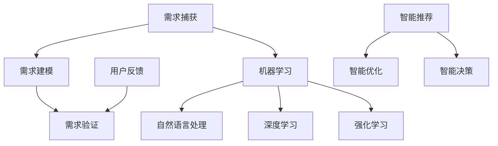
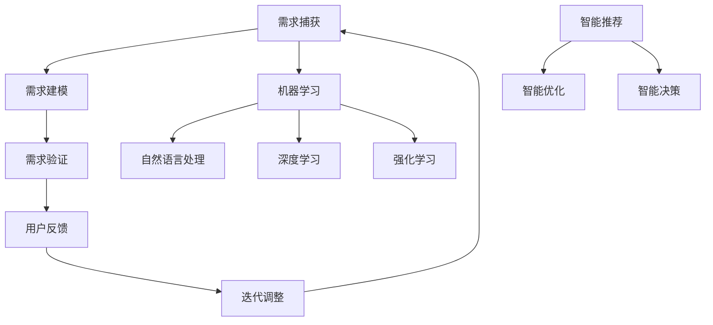
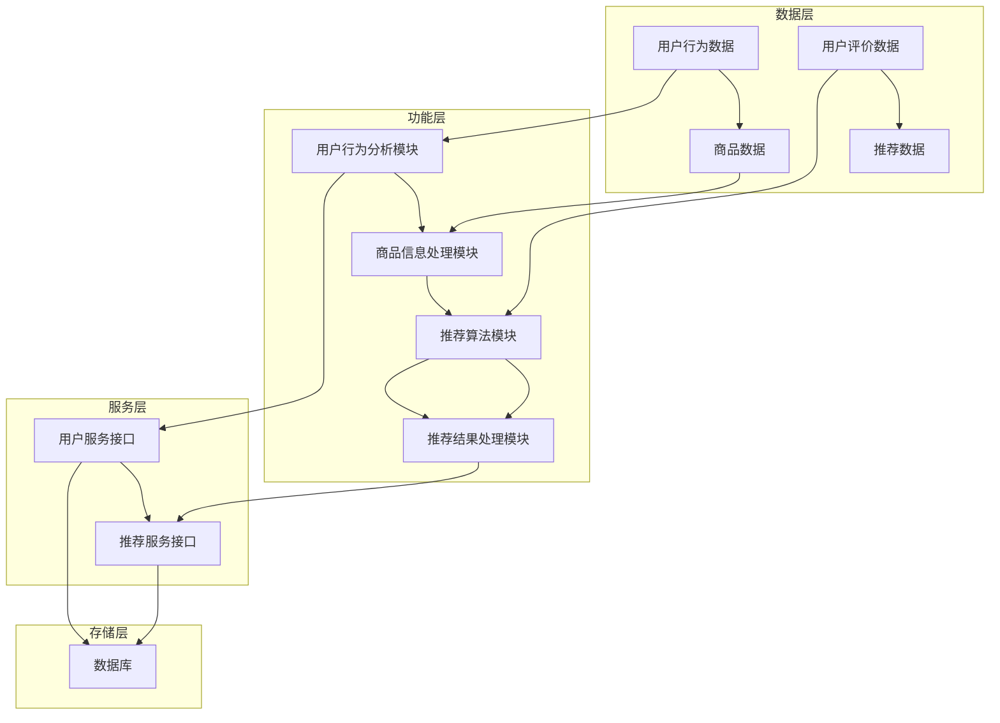
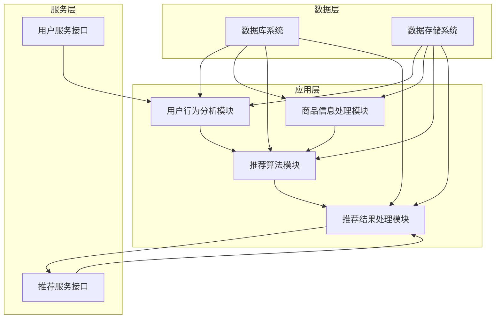
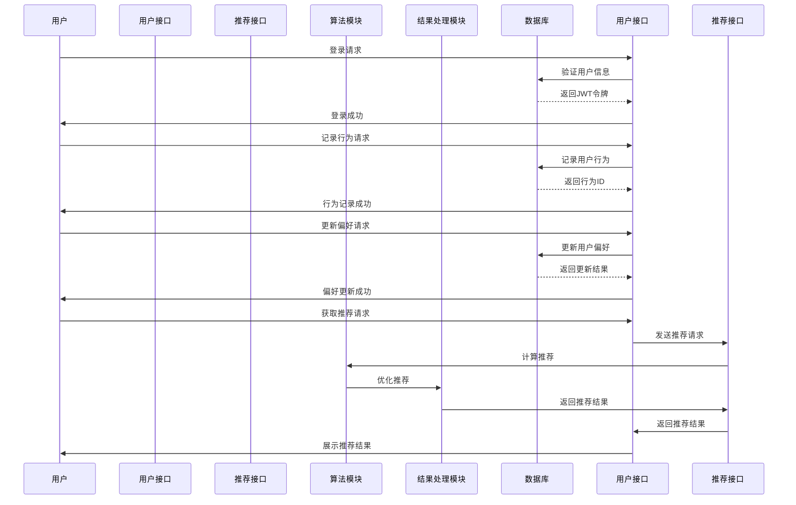

                 


### **《需求与AI技术的融合：提升大型应用的智能化》**

关键词：人工智能，需求分析，大型应用，智能化，算法原理

摘要：本文将探讨人工智能（AI）技术如何与需求分析相结合，以提升大型应用的智能化水平。通过对核心概念、算法原理、系统分析与架构设计的深入解析，本文旨在为读者提供一种全新的视角，以应对大型应用面临的需求多样性与变化性挑战。

### **第一部分：背景介绍与核心概念**

#### **1.1 问题背景**

在现代信息技术快速发展的背景下，大型应用面临着日益复杂的挑战。这些挑战主要体现在以下几个方面：

- **需求多样性与变化性**：用户需求不断变化，新功能不断涌现，这要求应用能够灵活地适应需求变更。
- **数据处理能力要求**：大型应用通常需要处理海量数据，对数据处理能力提出了更高要求。
- **系统性能与稳定性**：为了满足用户的高并发需求，大型应用必须在性能和稳定性方面达到较高的水平。

#### **1.2 需求的多样性与变化性**

需求的多样性和变化性是大型应用面临的重大挑战之一。具体体现在：

- **用户个性化需求**：用户对于应用的功能、界面、体验等有着多样化的需求。
- **市场需求变化**：市场环境的变化导致业务需求快速调整，应用需要具备快速响应的能力。

#### **1.3 人工智能技术的崛起**

随着人工智能技术的崛起，利用AI技术来应对这些挑战成为了一种可行的方法。AI技术可以提供：

- **智能分析**：通过对用户行为的分析，实现个性化的功能推荐。
- **智能决策**：利用机器学习算法，实现自动化的业务决策。
- **智能优化**：通过深度学习算法，优化系统性能和资源分配。

### **第二部分：核心概念与联系**

#### **2.1 需求分析模型**

需求分析模型是需求分析过程中的核心组成部分，它主要包括以下三个环节：

- **需求捕获**：通过多种方式收集用户需求。
- **需求建模**：将收集到的需求转化为可操作的模型。
- **需求验证**：验证需求模型的准确性和可行性。

#### **2.2 AI技术原理**

AI技术主要包括以下三个方面：

- **机器学习**：通过训练模型，使计算机具备自动学习的能力。
- **深度学习**：一种特殊的机器学习方法，通过多层神经网络实现复杂模式的识别。
- **自然语言处理**：使计算机能够理解、生成和处理自然语言。

### **第三部分：数学模型和数学公式**

#### **3.1 数学模型**

在需求分析与AI技术结合的过程中，数学模型起到了关键作用。以下是一些常用的数学模型：

- **概率论基础**：包括概率分布、条件概率、贝叶斯定理等。
- **统计学习方法**：包括监督学习、无监督学习等。
- **神经网络模型**：包括前向传播、反向传播等。

#### **3.2 详细讲解与举例说明**

- **概率论基础**：例如，条件概率可以用来预测用户的行为。
- **统计学习方法**：例如，监督学习可以用来进行用户行为的分类。
- **神经网络模型**：例如，前向传播和反向传播可以用来训练深度学习模型。

### **第四部分：算法原理讲解**

#### **4.1 算法概述**

算法原理讲解部分将包括以下内容：

- **需求分析算法**：例如，如何使用机器学习模型来分析用户需求。
- **人工智能算法**：例如，如何使用深度学习模型来实现智能优化。

#### **4.2 算法mermaid流程图**

使用mermaid流程图来展示算法的流程。

#### **4.3 Python源代码讲解**

提供Python源代码，详细讲解算法的实现过程。

### **第五部分：系统分析与架构设计**

#### **5.1 问题场景介绍**

介绍一个具体的问题场景，如电子商务平台的推荐系统。

#### **5.2 系统功能设计**

设计系统功能，包括领域模型、功能模块划分等。

#### **5.3 系统架构设计**

设计系统的架构，包括架构图、模块关系等。

### **第六部分：项目实战**

#### **6.1 环境安装**

介绍如何搭建项目环境。

#### **6.2 系统核心实现**

实现系统的核心功能。

#### **6.3 代码应用解读与分析**

解读和分析系统实现的代码。

#### **6.4 实际案例分析与详细讲解剖析**

分析一个实际案例，并进行详细讲解。

### **第七部分：项目小结**

总结项目的成果，遇到的问题及解决方法，并提出最佳实践建议。

### **作者信息**

作者：AI天才研究院/AI Genius Institute & 禅与计算机程序设计艺术 /Zen And The Art of Computer Programming### **《需求与AI技术的融合：提升大型应用的智能化》**

关键词：人工智能，需求分析，大型应用，智能化，算法原理

摘要：本文将探讨人工智能（AI）技术如何与需求分析相结合，以提升大型应用的智能化水平。通过对核心概念、算法原理、系统分析与架构设计的深入解析，本文旨在为读者提供一种全新的视角，以应对大型应用面临的需求多样性与变化性挑战。

### **第一部分：背景介绍与核心概念**

#### **1.1 问题背景**

在现代信息技术快速发展的背景下，大型应用面临着日益复杂的挑战。这些挑战主要体现在以下几个方面：

- **需求多样性与变化性**：用户需求不断变化，新功能不断涌现，这要求应用能够灵活地适应需求变更。
- **数据处理能力要求**：大型应用通常需要处理海量数据，对数据处理能力提出了更高要求。
- **系统性能与稳定性**：为了满足用户的高并发需求，大型应用必须在性能和稳定性方面达到较高的水平。

#### **1.2 需求的多样性与变化性**

需求的多样性和变化性是大型应用面临的重大挑战之一。具体体现在：

- **用户个性化需求**：用户对于应用的功能、界面、体验等有着多样化的需求。
- **市场需求变化**：市场环境的变化导致业务需求快速调整，应用需要具备快速响应的能力。

#### **1.3 人工智能技术的崛起**

随着人工智能技术的崛起，利用AI技术来应对这些挑战成为了一种可行的方法。AI技术可以提供：

- **智能分析**：通过对用户行为的分析，实现个性化的功能推荐。
- **智能决策**：利用机器学习算法，实现自动化的业务决策。
- **智能优化**：通过深度学习算法，优化系统性能和资源分配。

### **第二部分：核心概念与联系**

#### **2.1 需求分析模型**

需求分析模型是需求分析过程中的核心组成部分，它主要包括以下三个环节：

- **需求捕获**：通过多种方式收集用户需求。
- **需求建模**：将收集到的需求转化为可操作的模型。
- **需求验证**：验证需求模型的准确性和可行性。

#### **2.2 AI技术原理**

AI技术主要包括以下三个方面：

- **机器学习**：通过训练模型，使计算机具备自动学习的能力。
- **深度学习**：一种特殊的机器学习方法，通过多层神经网络实现复杂模式的识别。
- **自然语言处理**：使计算机能够理解、生成和处理自然语言。

#### **2.3 需求分析模型与AI技术的关系**

需求分析模型与AI技术之间存在着密切的联系。具体体现在：

- **需求捕获**：通过AI技术，如自然语言处理，可以更有效地捕获用户的需求。
- **需求建模**：利用机器学习算法，可以更精确地构建需求模型。
- **需求验证**：通过深度学习模型，可以更准确地验证需求模型的准确性。

### **第三部分：数学模型和数学公式**

#### **3.1 数学模型**

在需求分析与AI技术结合的过程中，数学模型起到了关键作用。以下是一些常用的数学模型：

- **概率论基础**：包括概率分布、条件概率、贝叶斯定理等。
- **统计学习方法**：包括监督学习、无监督学习等。
- **神经网络模型**：包括前向传播、反向传播等。

#### **3.2 详细讲解与举例说明**

- **概率论基础**：例如，条件概率可以用来预测用户的行为。
- **统计学习方法**：例如，监督学习可以用来进行用户行为的分类。
- **神经网络模型**：例如，前向传播和反向传播可以用来训练深度学习模型。

#### **3.3 数学公式与代码实现**

在文中嵌入数学公式，使用LaTeX格式，并在代码实现部分提供Python示例。

### **第四部分：算法原理讲解**

#### **4.1 算法概述**

算法原理讲解部分将包括以下内容：

- **需求分析算法**：例如，如何使用机器学习模型来分析用户需求。
- **人工智能算法**：例如，如何使用深度学习模型来实现智能优化。

#### **4.2 算法mermaid流程图**

使用mermaid流程图来展示算法的流程。

#### **4.3 Python源代码讲解**

提供Python源代码，详细讲解算法的实现过程。

### **第五部分：系统分析与架构设计**

#### **5.1 问题场景介绍**

介绍一个具体的问题场景，如电子商务平台的推荐系统。

#### **5.2 系统功能设计**

设计系统功能，包括领域模型、功能模块划分等。

#### **5.3 系统架构设计**

设计系统的架构，包括架构图、模块关系等。

### **第六部分：项目实战**

#### **6.1 环境安装**

介绍如何搭建项目环境。

#### **6.2 系统核心实现**

实现系统的核心功能。

#### **6.3 代码应用解读与分析**

解读和分析系统实现的代码。

#### **6.4 实际案例分析与详细讲解剖析**

分析一个实际案例，并进行详细讲解。

### **第七部分：项目小结**

总结项目的成果，遇到的问题及解决方法，并提出最佳实践建议。

### **第八部分：最佳实践 tips**

提供一些实用技巧和建议，帮助读者更好地应用需求与AI技术的融合。

### **第九部分：拓展阅读**

推荐一些相关书籍、论文与研究报告，供读者进一步学习。

### **作者信息**

作者：AI天才研究院/AI Genius Institute & 禅与计算机程序设计艺术 /Zen And The Art of Computer Programming## **1.1.1 大型应用面临的挑战**

大型应用在当今数字化时代中扮演着至关重要的角色。它们不仅服务于数以百万计的用户，还处理着海量的数据和复杂的业务逻辑。然而，随着业务需求的不断增长和技术的迅速发展，大型应用面临着一系列挑战，这些挑战主要体现在以下几个方面：

### **性能与并发处理能力**

大型应用通常需要处理大量的并发请求，这意味着系统必须在极短的时间内响应用户请求。性能和并发处理能力成为评估应用质量的重要指标。如果系统无法高效处理并发请求，可能会导致响应时间过长、用户体验差，甚至引发系统崩溃。因此，确保应用在并发高峰期能够稳定运行，是大型应用开发中的一大难题。

### **数据管理**

大型应用往往涉及海量的数据，这些数据不仅包括用户信息、交易记录，还包括日志文件、缓存数据等。如何高效地存储、检索和管理这些数据，是一个巨大的挑战。此外，随着数据量的不断增长，传统的数据库管理系统可能无法满足需求，需要采用分布式存储和计算技术来应对。

### **可扩展性与灵活性**

随着业务的不断发展和用户数量的增加，大型应用需要具备良好的可扩展性，以便在资源需求增加时能够迅速扩展。同时，应用还需要具备足够的灵活性，能够快速响应市场变化和用户需求。这要求在设计和开发过程中，充分考虑系统的可扩展性和灵活性。

### **安全与隐私**

在处理海量数据的过程中，大型应用必须确保用户数据的安全和隐私。这包括防范数据泄露、未授权访问和恶意攻击等。随着数据安全法规的不断完善，如《通用数据保护条例》（GDPR）等，应用开发者在设计系统时，必须严格遵守相关法规，确保用户数据得到有效保护。

### **用户体验**

用户体验是大型应用成功的关键因素之一。用户期望应用能够提供快速、直观和一致的操作体验。因此，在设计大型应用时，需要注重用户体验设计，确保应用界面友好、操作简便、响应快速。

### **可维护性与可测试性**

大型应用的复杂度高，开发周期长，因此在设计和开发过程中，需要注重系统的可维护性和可测试性。这意味着系统需要具有良好的代码结构、清晰的文档和完善的测试方案，以便在后期维护和升级过程中能够高效地解决问题。

### **资源优化与成本控制**

在开发大型应用时，需要充分考虑资源优化和成本控制。这意味着在满足性能、安全性和用户体验等需求的同时，还需要控制开发成本，确保项目的经济效益。

### **技术选型与生态系统**

选择合适的技术栈和构建一个健康的生态系统是大型应用开发的重要环节。这包括选择合适的编程语言、框架和工具，构建可持续的生态系统，以便在项目生命周期内能够持续优化和迭代。

综上所述，大型应用面临着性能与并发处理能力、数据管理、可扩展性与灵活性、安全与隐私、用户体验、可维护性与可测试性、资源优化与成本控制、技术选型与生态系统等多方面的挑战。在接下来的章节中，我们将进一步探讨如何利用人工智能技术来应对这些挑战，提升大型应用的智能化水平。## **1.1.2 需求的多样性与变化性**

需求的多样性与变化性是大型应用面临的核心挑战之一。在数字化时代，用户的需求变得日益复杂和多样化，这些需求的不断演变给应用开发和维护带来了巨大的挑战。以下是需求的多样性与变化性的具体体现：

### **用户需求的多样化**

- **功能需求**：用户对应用的功能要求多种多样，不同用户可能对同一功能有不同的使用场景和需求。例如，电子商务平台需要支持购物车、支付、订单跟踪等功能，但每个用户对每个功能的细节需求可能不同。
- **界面需求**：用户对应用界面的审美和操作体验也有不同要求。一些用户可能喜欢简洁明了的界面，而另一些用户可能偏好功能丰富的界面。
- **个性化需求**：用户希望应用能够根据其历史行为和偏好提供个性化的服务。例如，社交媒体平台需要根据用户的兴趣推荐相关内容。

### **市场需求的变化**

- **市场趋势**：市场趋势的变化导致用户需求随之变化。例如，随着智能家居的普及，用户对智能家居应用的需求迅速增加。
- **竞争压力**：市场竞争的加剧使得企业需要不断调整业务策略，从而影响应用的功能和性能要求。
- **法规变化**：法规和政策的更新也可能导致应用需求的变化。例如，新的数据保护法规可能要求应用必须增加数据加密和隐私保护功能。

### **需求变化的频率和速度**

- **快速迭代**：在数字化时代，市场需求变化的速度非常快，企业需要快速响应市场变化。这要求应用能够快速迭代，不断更新和优化功能。
- **持续更新**：用户需求的变化不仅仅是单次迭代的问题，而是需要持续跟踪和更新。例如，用户可能会不断提出新的功能请求或对现有功能进行改进。

### **需求多样性与变化性对大型应用的影响**

- **复杂性增加**：需求的多样性和变化性使得应用开发的复杂性增加。开发者需要应对不同的需求和变化，这可能涉及到多个团队和多个技术栈的协作。
- **资源浪费**：不合理的需求管理可能导致资源的浪费。例如，如果需求频繁变更，可能导致已经开发的功能需要被重写或重构，从而浪费开发资源。
- **用户体验下降**：如果需求管理不当，可能导致应用在用户体验方面出现问题。用户可能因为应用无法满足其需求而流失。

### **应对需求多样性与变化性的策略**

- **需求管理**：建立有效的需求管理流程，确保需求的收集、分析和优先级排序能够及时响应市场变化。
- **敏捷开发**：采用敏捷开发方法，能够快速迭代和响应需求变化，从而提高应用的灵活性和适应性。
- **用户参与**：通过用户参与和反馈机制，及时了解用户需求和市场趋势，确保应用能够更好地满足用户需求。
- **技术选型**：选择具备良好扩展性和可维护性的技术栈，以便在需求变化时能够快速调整和优化。

综上所述，需求的多样性与变化性是大型应用开发中不可忽视的挑战。通过有效的需求管理和敏捷开发方法，企业可以更好地应对这些挑战，提升大型应用的智能化和用户体验。## **1.1.3 人工智能技术的崛起**

人工智能（AI）技术的迅速崛起为解决大型应用面临的挑战提供了新的思路和工具。AI技术的发展不仅改变了传统产业的运作模式，也为大型应用的开发和管理带来了深远的影响。以下是AI技术在大型应用中的具体应用和重要性：

### **AI技术在需求分析中的应用**

#### **需求捕获**

- **自然语言处理（NLP）**：通过NLP技术，AI系统可以分析用户反馈和需求描述，自动识别出关键需求点。例如，使用文本分析工具对用户评论进行情感分析和主题提取，以发现用户对应用功能的具体需求。
- **机器学习模型**：通过训练机器学习模型，AI系统可以预测用户可能的需求。例如，利用用户的浏览历史和购买行为数据，推荐可能的购物需求。

#### **需求建模**

- **数据挖掘**：通过数据挖掘技术，AI系统可以从大量数据中提取出有价值的需求模式。例如，通过分析用户行为数据，识别出高频使用的功能模块，从而优化应用架构。
- **生成对抗网络（GAN）**：GAN可以生成虚拟用户数据，用于模拟不同用户群体的需求，帮助开发者设计更符合用户期望的应用。

#### **需求验证**

- **自动化测试**：AI系统可以通过自动化测试技术验证需求模型的准确性。例如，使用机器学习算法自动生成测试用例，确保应用功能符合需求规格。
- **反馈循环**：通过AI系统收集用户使用反馈，实时验证需求模型的准确性，并根据反馈进行调整。

### **AI技术在智能优化中的应用**

- **智能推荐系统**：利用机器学习算法，AI系统可以根据用户的历史行为和偏好，提供个性化的推荐服务。例如，电子商务平台可以利用推荐系统提高用户的购买转化率。
- **智能调度系统**：AI系统可以根据实时数据优化任务调度，提高系统资源利用率。例如，云服务提供商可以使用AI算法动态调整服务器资源分配，以应对流量高峰。

- **智能故障诊断与预测**：通过监控系统和AI算法，AI系统可以预测潜在故障，并提供预警和建议。例如，工业控制系统可以使用AI算法预测设备故障，提前进行维护。

### **AI技术在业务决策支持中的应用**

- **预测分析**：AI系统可以通过分析历史数据，预测未来的市场趋势和业务需求。例如，零售企业可以使用AI系统预测销售趋势，制定更有效的库存管理策略。
- **智能报表与分析**：AI系统可以自动生成复杂的报表和分析报告，为管理层提供决策支持。例如，财务报表分析系统可以利用AI技术自动生成财务预测报告。

### **AI技术的重要性**

- **提高效率**：AI技术可以自动化许多繁琐的任务，提高开发、运维和运营的效率。
- **优化用户体验**：通过个性化服务和智能优化，AI技术可以显著提升用户体验，增加用户粘性。
- **降低成本**：AI技术可以帮助企业优化资源分配和流程，从而降低运营成本。
- **提升竞争力**：掌握AI技术的企业可以在市场竞争中占据优势，通过创新的产品和服务满足用户需求。

综上所述，人工智能技术的崛起为大型应用的需求分析、智能优化和业务决策提供了强大的支持。通过有效利用AI技术，企业可以更好地应对需求多样性与变化性的挑战，提升大型应用的智能化水平。## **1.1.4 AI技术在需求分析中的应用**

人工智能（AI）技术在需求分析中的应用，极大地提高了需求捕获、需求建模和需求验证的效率和准确性。以下是AI技术在这三个关键环节的具体应用：

### **需求捕获**

#### **自然语言处理（NLP）**

自然语言处理技术是AI在需求分析中的核心工具之一。它能够处理和分析人类语言，从而自动识别和理解用户的需求。具体应用包括：

- **情感分析**：通过对用户评论和反馈进行情感分析，AI系统可以识别出用户对产品的情感态度，例如满意度、喜好等。例如，通过对用户评价进行情感分析，产品经理可以快速了解用户对某个功能的满意度，从而做出改进决策。
  
- **主题提取**：NLP技术可以提取文本中的关键主题和关键词。例如，在用户调查问卷中，AI系统可以自动提取出用户关心的主要问题，帮助团队快速聚焦于用户的核心需求。

- **意图识别**：AI系统通过分析用户的语言意图，可以确定用户的实际需求。例如，在用户提交的技术支持请求中，AI系统可以识别出用户请求的具体意图，如“修复bug”、“提供帮助文档”等，从而为支持团队提供更准确的响应。

#### **机器学习模型**

机器学习模型在需求捕获中也有广泛应用。通过训练模型，AI系统可以预测用户的需求行为，从而提前发现潜在的需求。具体应用包括：

- **预测分析**：利用机器学习算法，AI系统可以分析用户的历史行为数据，预测用户未来的需求。例如，电子商务平台可以通过分析用户的浏览和购买记录，预测用户可能感兴趣的商品，从而进行个性化推荐。

- **模式识别**：AI系统可以从大量用户行为数据中识别出共性模式，从而发现未被明确提出的需求。例如，通过分析用户在应用中的操作路径，AI系统可以识别出用户经常遇到的问题，从而提供改进建议。

### **需求建模**

#### **数据挖掘**

数据挖掘技术可以帮助从大量数据中提取有价值的信息，为需求建模提供依据。具体应用包括：

- **关联规则挖掘**：通过分析用户数据，AI系统可以找出不同需求之间的关联性。例如，在电子商务平台中，AI系统可以识别出购买某种商品的用户通常也会购买其他商品，从而为营销团队提供交叉推荐策略。

- **聚类分析**：AI系统可以通过聚类分析将用户分为不同的群体，每个群体有相似的需求特征。例如，通过分析用户的使用行为，AI系统可以将用户分为高频用户、潜在用户等，从而为不同群体提供定制化的服务和功能。

#### **生成对抗网络（GAN）**

生成对抗网络（GAN）是一种强大的数据生成技术，可以在需求建模中发挥重要作用。具体应用包括：

- **生成虚拟数据**：GAN可以生成虚拟用户数据，用于补充真实数据的不足。例如，在用户数据稀缺的情况下，GAN可以帮助生成模拟的用户行为数据，为需求建模提供基础。

- **模拟用户需求**：GAN可以模拟不同用户群体的需求，帮助开发者设计更全面的需求模型。例如，通过生成不同类型用户的虚拟行为数据，AI系统可以模拟出不同用户群体的需求差异，从而为应用设计提供参考。

### **需求验证**

#### **自动化测试**

自动化测试是AI技术在需求验证中的重要应用。通过自动化测试，AI系统可以快速验证需求模型的准确性和可行性。具体应用包括：

- **测试用例生成**：AI系统可以通过分析需求规格说明书，自动生成测试用例。例如，在软件开发过程中，AI系统可以根据需求文档生成测试脚本，确保每个功能都经过严格测试。

- **异常检测**：AI系统可以通过监控系统的运行状态，自动检测并报告异常情况。例如，在电子商务平台中，AI系统可以监控交易流程，检测可能的欺诈行为，从而确保交易的安全性。

#### **用户反馈**

用户反馈是验证需求模型的重要手段。AI系统可以通过分析用户反馈，验证需求模型的有效性。具体应用包括：

- **反馈分析**：AI系统可以分析用户的反馈意见，识别出需求模型中可能存在的问题。例如，通过分析用户对应用功能的评价，AI系统可以识别出用户认为重要的改进点，为产品迭代提供依据。

- **反馈循环**：AI系统可以建立反馈循环机制，根据用户反馈不断调整需求模型。例如，在应用发布后，AI系统可以收集用户的反馈，并根据反馈结果调整需求规格，从而确保应用能够更好地满足用户需求。

综上所述，AI技术在需求分析中的应用，极大地提高了需求捕获、需求建模和需求验证的效率和准确性。通过自然语言处理、机器学习模型、数据挖掘、生成对抗网络、自动化测试和用户反馈等技术，AI系统可以全面、深入地分析用户需求，为大型应用提供智能化的需求解决方案。## **1.1.5 大型应用智能化的可行性**

在了解了大型应用面临的挑战以及AI技术在需求分析中的应用后，我们接下来探讨大型应用智能化的可行性。智能化不仅能够提高应用的性能和用户满意度，还能显著降低运营成本。以下是大型应用智能化的可行性分析：

### **技术成熟度**

随着人工智能技术的飞速发展，各种AI算法和工具已经趋于成熟，可以广泛应用于大型应用。例如，深度学习、自然语言处理和机器学习等技术在图像识别、语音识别、推荐系统和自动化决策等领域已经取得了显著成果。这些成熟的技术为大型应用智能化提供了坚实的技术基础。

### **数据支持**

大型应用通常积累了海量的用户数据、交易数据和运营数据。这些数据是进行AI分析和决策的重要资源。通过大数据技术，企业可以高效地存储、管理和分析这些数据，为AI系统的训练和应用提供充足的数据支持。数据的质量和多样性直接决定了AI系统的性能和效果。

### **用户体验提升**

智能化技术可以显著提升用户体验。例如，通过智能推荐系统，应用可以实时分析用户的行为数据，为用户提供个性化的推荐，提高用户满意度和留存率。此外，智能化的故障诊断和预测系统能够提前发现潜在问题，减少系统故障对用户的影响，提升应用的稳定性。

### **成本效益**

智能化技术能够提高大型应用的运营效率和降低成本。例如，通过自动化和智能优化技术，企业可以减少人力资源的投入，降低运营成本。同时，智能化系统可以提高资源利用率和能源效率，减少不必要的浪费。长期来看，智能化的投资回报是非常显著的。

### **安全性和合规性**

随着数据隐私和安全法规的不断完善，如《通用数据保护条例》（GDPR）等，大型应用必须确保用户数据的安全和合规性。AI技术，特别是加密和隐私保护技术，可以帮助企业实现数据的安全存储和传输，确保用户数据的安全和隐私。

### **技术障碍**

尽管AI技术在大型应用智能化中具有巨大潜力，但也面临一些技术障碍。例如，AI模型的训练和部署需要大量计算资源和时间，这可能对企业的IT基础设施提出挑战。此外，AI技术的透明性和可解释性也是一个重要问题，特别是在涉及关键业务决策和用户隐私的场景中。

### **风险管理**

在智能化过程中，企业需要识别和管理潜在的风险。例如，AI系统可能会出现偏差或错误，这可能导致业务决策失误或用户体验下降。因此，建立有效的风险管理机制，包括模型验证、监控和应急响应等，是确保AI系统可靠运行的关键。

### **持续学习和迭代**

智能化是一个持续的过程。企业需要不断收集用户反馈和运营数据，优化AI模型和算法，以适应不断变化的需求和环境。通过持续学习和迭代，企业可以确保AI系统能够持续提供高质量的智能服务。

综上所述，大型应用智能化在技术、数据、用户体验、成本、安全性和风险管理等方面具有可行性。通过有效利用AI技术，企业可以显著提升大型应用的质量和竞争力，实现可持续发展。## **1.1.6 边界与外延**

在探讨大型应用智能化的过程中，我们需要明确其边界与外延，以便更好地理解和应用这一技术。以下是关于大型应用智能化的边界与外延的讨论：

### **边界**

1. **技术成熟度**：虽然AI技术在许多领域已经取得显著进展，但在某些特定场景中，技术可能尚未完全成熟。例如，对于实时决策和高度依赖环境数据的场景，AI系统的稳定性和准确性可能仍有待提高。

2. **数据质量和多样性**：AI系统的性能高度依赖于数据的质量和多样性。如果数据存在偏差或不足，可能导致AI系统做出错误的决策。因此，应用智能化需要确保数据来源的多样性和数据质量的可靠性。

3. **用户隐私和安全**：在智能化过程中，用户隐私和安全是一个重要考虑因素。AI系统在处理用户数据时，必须严格遵守数据保护法规，确保用户数据的安全和隐私。

4. **技术成本**：尽管AI技术具有显著的效益，但其部署和运营成本也可能较高。特别是在中小型企业中，技术成本可能成为应用智能化的一个重要限制因素。

### **外延**

1. **业务流程优化**：智能化不仅局限于应用功能层面的改进，还可以应用于业务流程的优化。通过AI技术，企业可以自动化和优化业务流程，提高运营效率。

2. **跨领域应用**：AI技术具有广泛的适用性，可以在多个领域应用，如医疗、金融、制造、交通等。大型应用智能化的外延包括将这些技术应用于不同行业，推动行业创新和升级。

3. **用户个性化体验**：通过AI技术，企业可以提供更加个性化的用户服务。例如，个性化推荐、智能客服和定制化服务，这些都是AI技术在外延上的重要应用。

4. **智能预测与决策**：AI技术可以用于智能预测和决策支持。例如，利用AI系统预测市场趋势、优化库存管理、提高供应链效率等，这些都是智能化技术在外延上的重要体现。

### **边界与外延的关系**

边界与外延是相互关联的。智能化的边界决定了技术的适用范围和限制，而外延则展示了技术的潜力和扩展方向。理解边界与外延的关系，可以帮助企业更好地规划智能化应用，发挥AI技术的最大效益。

1. **合理规划**：企业应在明确智能化边界的基础上，合理规划智能化应用，避免盲目跟风或过度投入。

2. **持续迭代**：随着技术的进步和业务需求的变化，企业应不断调整智能化策略，扩展技术的外延，以适应新的挑战和机遇。

3. **平衡风险与收益**：在应用智能化技术时，企业需要平衡技术成本、风险和收益，确保智能化项目的可行性和可持续性。

总之，大型应用智能化是一个复杂而充满机遇的过程。通过明确边界与外延，企业可以更好地利用AI技术，实现业务目标，提升竞争力。## **1.1.7 需求分析的概念框架**

需求分析是软件开发过程中至关重要的一环，它涉及到从用户需求到系统设计的一系列步骤。一个完整的需求分析过程包括需求捕获、需求建模和需求验证三个核心环节。以下是需求分析的概念框架：

### **需求捕获**

需求捕获是指从用户、市场、竞争对手等多个来源收集需求信息。以下是需求捕获的关键步骤：

1. **用户访谈**：通过与用户面对面交流，了解用户的使用场景、痛点、需求和期望。
2. **问卷调查**：通过设计问卷收集用户反馈，量化用户需求。
3. **市场调研**：分析市场趋势、竞争对手情况，了解潜在的市场需求。
4. **使用案例分析**：研究现有系统的使用情况，识别出用户实际使用中的问题和需求。

### **需求建模**

需求建模是将收集到的需求转化为可操作的系统模型。以下是需求建模的关键步骤：

1. **需求规格说明**：编写详细的需求文档，描述系统的功能、性能和约束条件。
2. **领域模型**：构建领域模型，表示系统中关键概念和它们之间的关系。
3. **功能模型**：绘制功能模型，表示系统中的功能和流程。
4. **用户界面设计**：设计用户界面，确保系统能够直观、方便地满足用户需求。

### **需求验证**

需求验证是确保需求模型的准确性和可行性，以下是需求验证的关键步骤：

1. **评审与审核**：通过专家评审和用户审核，确保需求文档的准确性和完整性。
2. **原型设计**：构建原型系统，让用户实际操作，以验证需求是否符合预期。
3. **测试用例设计**：设计测试用例，对系统进行功能测试、性能测试和用户体验测试。
4. **用户反馈**：收集用户反馈，根据反馈调整需求模型和系统设计。

### **核心要素组成**

需求分析的过程和结果可以分解为以下几个核心要素：

1. **用户需求**：用户需求的详细描述，包括功能需求、非功能需求和约束条件。
2. **系统功能**：系统的功能模块和它们之间的逻辑关系。
3. **用户界面**：用户界面的设计，包括布局、交互方式和用户体验。
4. **系统性能**：系统在性能方面的需求和限制，如响应时间、并发处理能力等。
5. **数据管理**：数据存储、检索和处理的需求，包括数据结构、数据流和数据安全等。
6. **技术约束**：开发过程中需要遵守的技术标准和约束条件。

通过上述概念框架，我们可以系统地理解和实施需求分析过程，确保软件开发能够准确满足用户需求。## **1.1.8 AI技术的核心要素**

在需求分析与AI技术结合的过程中，AI技术的核心要素起着至关重要的作用。以下是AI技术的核心要素及其在需求分析中的应用：

### **机器学习**

机器学习是一种通过训练模型，使计算机具备自动学习能力的AI技术。以下是机器学习在需求分析中的应用：

1. **需求预测**：通过分析用户历史数据，机器学习模型可以预测用户未来的需求和行为。例如，通过分析用户的浏览历史和购买记录，可以预测用户可能感兴趣的商品，从而进行个性化推荐。
2. **需求分类**：机器学习算法可以将需求分类为不同的类别，帮助团队更好地理解和处理不同类型的需求。例如，将用户反馈分类为功能请求、bug报告或改进建议等。
3. **异常检测**：机器学习模型可以检测出异常行为或数据，帮助团队快速识别出潜在的问题和风险。例如，在电子商务平台上，机器学习模型可以检测出异常订单，从而防范欺诈行为。

### **深度学习**

深度学习是机器学习的一种特殊形式，通过多层神经网络实现复杂模式的识别。以下是深度学习在需求分析中的应用：

1. **自然语言处理**：深度学习技术在自然语言处理（NLP）领域有着广泛应用。例如，深度学习模型可以分析用户反馈，提取出关键信息，帮助团队更准确地理解用户需求。
2. **图像识别**：在需求分析中，图像识别技术可以帮助团队识别和分析用户行为。例如，通过图像识别技术，可以分析用户在应用中的操作路径，从而优化用户体验。
3. **语音识别**：深度学习模型可以用于语音识别，帮助团队理解和处理用户语音反馈。例如，通过语音识别技术，可以将用户的语音需求转化为文本，便于进一步分析和处理。

### **自然语言处理**

自然语言处理（NLP）是一种使计算机能够理解、生成和处理自然语言的AI技术。以下是NLP在需求分析中的应用：

1. **文本分析**：NLP技术可以用于分析用户反馈和评论，提取出用户的情感、意图和需求。例如，通过情感分析，可以了解用户对某个功能的满意度；通过意图识别，可以确定用户的具体需求。
2. **自动摘要**：NLP技术可以将长文本摘要成简短的关键信息，帮助团队快速了解需求的核心内容。例如，在用户调查问卷中，NLP技术可以自动提取出用户关注的主要问题，便于进一步分析和处理。
3. **智能客服**：NLP技术可以用于构建智能客服系统，通过自然语言交互，帮助用户解决常见问题。例如，通过NLP技术，智能客服系统可以理解用户的提问，并提供相应的解答和建议。

### **应用举例**

以下是AI技术在需求分析中的具体应用举例：

1. **智能推荐系统**：通过机器学习和深度学习模型，智能推荐系统可以分析用户行为数据，为用户提供个性化的推荐。例如，电子商务平台可以通过分析用户的浏览历史和购买记录，推荐可能感兴趣的商品。
2. **用户行为分析**：通过NLP技术和机器学习模型，可以分析用户在应用中的行为数据，发现用户的使用习惯和偏好。例如，通过分析用户在社交媒体平台上的互动数据，可以了解用户对特定话题的兴趣和关注点。
3. **需求分类与优先级排序**：通过机器学习算法，可以将收集到的需求分类为不同类型，并根据需求的紧急程度和优先级进行排序。例如，将需求分为“必须修复”、“优先修复”和“可延迟修复”等类别，帮助团队更有效地处理需求。

综上所述，AI技术的核心要素在需求分析中具有广泛的应用，通过机器学习、深度学习和自然语言处理等技术，可以大幅提升需求分析的准确性和效率，为大型应用提供智能化的解决方案。## **2.1.1 需求分析模型**

需求分析模型是需求分析过程中的核心工具，它帮助团队从用户需求出发，转化为可操作的系统设计。以下是需求分析模型的主要组成部分和步骤：

### **需求捕获**

需求捕获是需求分析的第一步，目标是收集和理解用户的实际需求。以下是需求捕获的主要方法：

1. **用户访谈**：通过面对面交流，深入了解用户的需求和期望。访谈可以是结构化的，也可以是非结构化的，以便获取用户详细的反馈。
2. **问卷调查**：设计问卷，收集用户的反馈。问卷可以是纸质或在线形式，以确保覆盖广泛的用户群体。
3. **观察法**：观察用户在实际工作或使用产品过程中的行为，以获取真实的用户需求。观察法可以帮助团队发现用户未明确表达的需求。
4. **文献分析**：研究相关文献，了解行业趋势和用户需求。

### **需求建模**

需求建模是将收集到的需求转化为系统设计文档。以下是需求建模的主要步骤：

1. **需求规格说明**：编写详细的需求文档，描述系统的功能、性能和约束条件。需求规格说明书应包括功能需求、非功能需求和约束条件。
2. **领域模型**：构建领域模型，表示系统中关键概念和它们之间的关系。领域模型有助于团队理解系统的业务逻辑和功能。
3. **功能模型**：绘制功能模型，表示系统中的功能和流程。功能模型可以是流程图、UML活动图等，以便团队更好地理解系统的工作原理。
4. **用户界面设计**：设计用户界面，确保系统能够直观、方便地满足用户需求。用户界面设计应考虑用户体验和操作便利性。

### **需求验证**

需求验证是确保需求模型的准确性和可行性，以下是需求验证的主要步骤：

1. **评审与审核**：通过专家评审和用户审核，确保需求文档的准确性和完整性。评审过程可以帮助发现潜在的问题和不足，确保需求文档的质量。
2. **原型设计**：构建原型系统，让用户实际操作，以验证需求是否符合预期。原型设计可以是低保真或高保真的，以便在不同阶段测试需求。
3. **测试用例设计**：设计测试用例，对系统进行功能测试、性能测试和用户体验测试。测试用例应覆盖所有需求场景，以确保系统的完整性和稳定性。
4. **用户反馈**：收集用户反馈，根据反馈调整需求模型和系统设计。用户反馈是需求验证的重要输入，可以帮助团队不断优化和改进系统。

### **核心要素**

需求分析模型的核心要素包括：

1. **用户需求**：用户需求的详细描述，包括功能需求、非功能需求和约束条件。
2. **系统功能**：系统的功能模块和它们之间的逻辑关系。
3. **用户界面**：用户界面的设计，包括布局、交互方式和用户体验。
4. **系统性能**：系统在性能方面的需求和限制，如响应时间、并发处理能力等。
5. **数据管理**：数据存储、检索和处理的需求，包括数据结构、数据流和数据安全等。
6. **技术约束**：开发过程中需要遵守的技术标准和约束条件。

通过需求分析模型，团队可以系统地理解和实施需求分析过程，确保软件开发能够准确满足用户需求，从而提升系统的质量和用户体验。## **2.1.2 AI技术原理**

人工智能（AI）技术是现代计算机科学的重要分支，其核心在于使计算机具备类似人类智能的能力。以下是AI技术的基本原理、主要类型和核心算法：

### **基本原理**

AI技术的基本原理是通过模拟人类思维过程，使计算机能够实现以下功能：

1. **学习与推理**：AI系统可以通过训练从数据中学习规律和模式，并利用这些规律进行推理和决策。
2. **感知与理解**：AI系统能够感知和理解外部环境，通过图像识别、语音识别等技术实现与环境的交互。
3. **问题解决**：AI系统能够自动解决复杂问题，如棋类游戏、优化问题等。
4. **自然语言处理**：AI系统能够理解和生成自然语言，实现人机对话和文本分析。

### **主要类型**

AI技术可以分为以下几种主要类型：

1. **机器学习**：通过训练模型，使计算机能够自动从数据中学习。机器学习包括监督学习、无监督学习和强化学习等子类别。
2. **深度学习**：一种特殊的机器学习方法，通过多层神经网络实现复杂模式的识别。深度学习在图像识别、语音识别和自然语言处理等领域具有广泛应用。
3. **强化学习**：通过试错和反馈机制，使计算机在特定环境中学习最优策略。强化学习在自动驾驶、游戏和机器人控制等领域得到应用。
4. **自然语言处理**：使计算机能够理解、生成和处理自然语言。自然语言处理技术包括文本分类、机器翻译、情感分析等。
5. **计算机视觉**：使计算机能够理解和处理视觉信息，包括图像识别、目标检测和图像生成等。

### **核心算法**

以下是AI技术的几个核心算法：

1. **监督学习**：监督学习是一种从标注数据中学习的方法。常见的监督学习算法包括线性回归、逻辑回归、支持向量机（SVM）、决策树和随机森林等。
2. **无监督学习**：无监督学习不需要标注数据，从未标记的数据中学习模式。常见的无监督学习算法包括聚类、降维（如PCA）和关联规则挖掘等。
3. **神经网络**：神经网络是一种模拟生物神经系统的计算模型。常见的神经网络包括单层感知机、多层感知机（MLP）、卷积神经网络（CNN）和循环神经网络（RNN）等。
4. **深度学习**：深度学习是神经网络的一种扩展，通过多层神经网络实现复杂模式的识别。深度学习的代表性算法包括卷积神经网络（CNN）、循环神经网络（RNN）和生成对抗网络（GAN）等。
5. **强化学习**：强化学习通过试错和反馈机制学习最优策略。常见的强化学习算法包括Q学习、深度Q网络（DQN）和策略梯度算法等。

通过上述AI技术的原理、类型和核心算法，我们可以更好地理解和应用AI技术，为需求分析、智能优化和业务决策提供强大的支持。## **2.1.2.1 机器学习**

机器学习是人工智能（AI）的核心分支之一，它使计算机能够从数据中学习规律和模式，从而进行决策和预测。以下是机器学习的详细介绍：

### **基本概念**

机器学习是指通过算法让计算机从数据中学习，并利用所学知识进行推断和决策的过程。这个过程包括以下几个基本概念：

- **训练集**：用于训练模型的样本数据集。
- **测试集**：用于评估模型性能的样本数据集。
- **特征**：数据中的每个属性，用于描述样本。
- **标签**：数据中每个样本的已知结果，用于训练模型。
- **模型**：学习到的规律和模式，用于对新数据进行预测或决策。

### **分类算法**

机器学习算法可以分为监督学习、无监督学习和强化学习三种类型。以下是几种常见的分类算法：

- **线性回归**：用于预测连续值的算法，通过找到特征与目标值之间的线性关系。
  $$y = w_0 + w_1 \cdot x_1 + w_2 \cdot x_2 + ... + w_n \cdot x_n$$

- **逻辑回归**：用于预测二元结果的算法，通过计算概率值。
  $$P(y=1) = \frac{1}{1 + e^{-(w_0 + w_1 \cdot x_1 + w_2 \cdot x_2 + ... + w_n \cdot x_n)}}$$

- **支持向量机（SVM）**：用于分类和回归的算法，通过找到最佳决策边界。
  $$\min_{w, b} \frac{1}{2} ||w||^2 + C \sum_{i=1}^{n} \xi_i$$
  $$y_i (w \cdot x_i + b) \geq 1 - \xi_i$$
  $$\xi_i \geq 0$$

- **决策树**：用于分类和回归的算法，通过构建树形结构进行决策。
  $$f(x) = \begin{cases} 
  \text{类别} & \text{if } x \in C \\
  g(x) & \text{otherwise}
  \end{cases}$$

- **随机森林**：由多个决策树组成的集成模型，通过聚合多个决策树的结果进行预测。

### **无监督学习**

无监督学习是指在没有标签数据的情况下，从数据中学习模式和结构的算法。以下是几种常见的无监督学习算法：

- **聚类算法**：用于将相似的数据点归为一类。常见的聚类算法包括K-均值聚类和层次聚类。
  $$J = \sum_{i=1}^{k} \sum_{x_j \in S_i} ||x_j - \mu_i||^2$$

- **降维算法**：用于减少数据维度，同时保留数据的主要信息。常见的降维算法包括主成分分析（PCA）和t-SNE。

### **应用场景**

机器学习在许多领域都有广泛应用，以下是一些典型应用场景：

- **图像识别**：使用卷积神经网络（CNN）进行图像分类和目标检测。
- **自然语言处理**：使用循环神经网络（RNN）和生成对抗网络（GAN）进行文本分类、机器翻译和生成文本。
- **推荐系统**：使用协同过滤和基于内容的推荐算法进行个性化推荐。
- **金融预测**：使用时间序列分析和回归模型进行股票市场预测和风险管理。

### **Python实现**

以下是一个简单的线性回归算法的Python实现示例：

```python
import numpy as np

# 数据集
X = np.array([[1, 2], [2, 3], [3, 4]])
y = np.array([3, 4, 5])

# 训练模型
w = np.linalg.inv(X.T.dot(X)).dot(X.T).dot(y)

# 预测
X_new = np.array([[4, 5]])
y_pred = X_new.dot(w)

print("预测值:", y_pred)
```

通过上述内容，我们可以看到机器学习的基本概念、分类算法、无监督学习算法以及应用场景。在实际应用中，根据具体问题和数据特点选择合适的算法和模型，才能取得良好的效果。## **2.1.2.2 深度学习**

深度学习是机器学习的一种重要分支，它通过模拟人脑的神经网络结构，实现复杂模式识别和数据处理。以下是深度学习的基本原理、常见模型和应用场景：

### **基本原理**

深度学习基于多层神经网络结构，通过层层抽象和转换输入数据，以达到对复杂特征的提取和建模。以下是深度学习的基本原理：

- **神经元模型**：深度学习中的基本计算单元是神经元，每个神经元接收多个输入，通过激活函数产生输出。
- **前向传播**：输入数据从第一层传递到最后一层，每层神经元根据前一层输出计算当前层的输出。
- **反向传播**：计算损失函数，将误差反向传播到每一层，更新各层神经元的权重。

### **常见模型**

深度学习模型种类繁多，以下是一些常见的模型：

1. **多层感知机（MLP）**：一种基本的深度学习模型，由多个隐层组成，用于分类和回归。
2. **卷积神经网络（CNN）**：特别适用于图像识别和处理，通过卷积层和池化层提取图像特征。
3. **循环神经网络（RNN）**：用于处理序列数据，通过循环结构保持对历史信息的记忆。
4. **长短期记忆网络（LSTM）**：RNN的一种变体，用于解决RNN的梯度消失问题，特别适用于时间序列预测。
5. **生成对抗网络（GAN）**：通过生成器和判别器之间的对抗训练，实现高质量的数据生成。

### **数学模型**

以下是深度学习模型的基本数学模型：

- **激活函数**：用于决定神经元是否激活，常见的激活函数包括Sigmoid、ReLU和Tanh。
- **损失函数**：用于度量模型预测值与真实值之间的差异，常见的损失函数包括均方误差（MSE）和对数损失（Log Loss）。
- **优化算法**：用于更新模型参数，常见的优化算法包括随机梯度下降（SGD）和Adam优化器。

### **应用场景**

深度学习在许多领域都有广泛应用，以下是一些典型的应用场景：

- **图像识别**：通过CNN实现高效的特征提取和分类，应用于人脸识别、物体检测等。
- **自然语言处理**：通过RNN和LSTM处理文本数据，应用于机器翻译、情感分析等。
- **语音识别**：通过结合CNN和RNN，实现语音信号的建模和识别，应用于语音助手、语音搜索等。
- **推荐系统**：通过深度学习模型分析用户行为数据，实现个性化推荐。

### **Python实现**

以下是一个简单的卷积神经网络（CNN）的Python实现示例，用于图像分类：

```python
import tensorflow as tf

# 定义CNN模型
model = tf.keras.Sequential([
    tf.keras.layers.Conv2D(32, (3, 3), activation='relu', input_shape=(28, 28, 1)),
    tf.keras.layers.MaxPooling2D((2, 2)),
    tf.keras.layers.Conv2D(64, (3, 3), activation='relu'),
    tf.keras.layers.MaxPooling2D((2, 2)),
    tf.keras.layers.Flatten(),
    tf.keras.layers.Dense(128, activation='relu'),
    tf.keras.layers.Dense(10, activation='softmax')
])

# 编译模型
model.compile(optimizer='adam',
              loss='sparse_categorical_crossentropy',
              metrics=['accuracy'])

# 加载数据
(x_train, y_train), (x_test, y_test) = tf.keras.datasets.mnist.load_data()

# 预处理数据
x_train = x_train.reshape((-1, 28, 28, 1)).astype("float32") / 255
x_test = x_test.reshape((-1, 28, 28, 1)).astype("float32") / 255

# 训练模型
model.fit(x_train, y_train, epochs=5)

# 评估模型
test_loss, test_acc = model.evaluate(x_test, y_test)
print('Test accuracy:', test_acc)
```

通过上述内容，我们可以看到深度学习的基本原理、常见模型、数学模型和应用场景。在实际应用中，根据具体问题和数据特点选择合适的深度学习模型和优化方法，可以取得良好的效果。## **2.1.2.3 自然语言处理**

自然语言处理（NLP）是人工智能（AI）的一个重要分支，旨在使计算机能够理解、生成和处理人类语言。以下是NLP的基本概念、核心技术和应用场景：

### **基本概念**

自然语言处理涉及以下几个方面：

- **语言模型**：用于描述自然语言的概率分布，常用于文本生成和语音识别。
- **词嵌入**：将词汇映射到高维向量空间，以便进行数学运算，是NLP中的重要技术。
- **句法分析**：对句子结构进行分析，识别出主语、谓语、宾语等成分。
- **语义分析**：理解句子或文本的含义，包括情感分析、命名实体识别等。

### **核心技术**

以下是自然语言处理中的一些核心技术：

1. **词袋模型**：将文本表示为单词的集合，常用于文本分类和聚类。
2. **隐含马尔可夫模型（HMM）**：用于语音识别和词性标注，通过状态转移概率和观察概率进行序列建模。
3. **统计语言模型**：通过统计文本中的单词出现频率，预测下一个单词，常用于自动分词和语音识别。
4. **循环神经网络（RNN）**：特别适用于处理序列数据，如文本和语音，通过循环结构保持对历史信息的记忆。
5. **长短期记忆网络（LSTM）**：RNN的一种变体，用于解决梯度消失问题，特别适用于时间序列预测和机器翻译。
6. **注意力机制**：在深度学习模型中引入注意力机制，使模型能够关注文本中的关键信息，提高处理复杂句子的能力。
7. **Transformer模型**：一种基于自注意力机制的深度学习模型，广泛应用于机器翻译、文本生成等任务。

### **应用场景**

自然语言处理在许多领域都有广泛应用，以下是一些典型应用场景：

- **文本分类**：通过分类模型对文本进行分类，如新闻分类、情感分析等。
- **机器翻译**：通过翻译模型将一种语言的文本翻译成另一种语言。
- **问答系统**：通过问答模型实现自然语言问答，如智能客服、搜索引擎等。
- **语音识别**：通过语音识别模型将语音转换为文本，广泛应用于语音助手、语音搜索等。
- **文本生成**：通过生成模型生成符合语法和语义规则的文本，如文章摘要、音乐生成等。

### **Python实现**

以下是一个简单的基于Transformer的文本生成模型的Python实现示例：

```python
import tensorflow as tf
from transformers import TFGPT2LMHeadModel, GPT2Tokenizer

# 加载预训练模型
tokenizer = GPT2Tokenizer.from_pretrained("gpt2")
model = TFGPT2LMHeadModel.from_pretrained("gpt2")

# 输入文本
input_text = "The quick brown fox jumps over the lazy dog"

# 分词并编码
input_ids = tokenizer.encode(input_text, return_tensors="tf")

# 生成文本
output = model.generate(input_ids, max_length=50, num_return_sequences=1)

# 解码输出文本
generated_text = tokenizer.decode(output[0], skip_special_tokens=True)

print("生成的文本：", generated_text)
```

通过上述内容，我们可以看到自然语言处理的基本概念、核心技术和应用场景。在实际应用中，根据具体任务和数据特点选择合适的技术和方法，可以取得良好的效果。## **3.1 数学模型**

在人工智能（AI）和机器学习领域，数学模型是理解和实现算法的基础。以下是几种常用的数学模型及其基本概念：

### **概率论基础**

概率论是数学模型的重要组成部分，它在AI中的应用非常广泛。以下是概率论基础中的几个核心概念：

1. **概率分布**：描述随机变量可能取值的概率分布。
   - **离散分布**：如伯努利分布、几何分布等。
   - **连续分布**：如正态分布、均匀分布等。

2. **条件概率**：在某个事件已发生的条件下，另一个事件发生的概率。
   $$P(A|B) = \frac{P(A \cap B)}{P(B)}$$

3. **贝叶斯定理**：通过条件概率公式，将后验概率与先验概率联系起来。
   $$P(A|B) = \frac{P(B|A)P(A)}{P(B)}$$

### **统计学习方法**

统计学习方法是指利用统计学原理来解决分类、回归等问题的方法。以下是几种常见的统计学习方法：

1. **监督学习**：给定输入和输出，训练模型以预测新的输入。
   - **线性回归**：通过最小化均方误差（MSE）来预测连续值。
     $$\min_{\theta} \frac{1}{m} \sum_{i=1}^{m} (h_\theta(x^{(i)}) - y^{(i)})^2$$
   - **逻辑回归**：通过最大似然估计（MLE）来预测二元结果。
     $$\log(P(Y=1|x; \theta)P(Y=0|x; \theta)) = \theta^T x$$

2. **无监督学习**：没有输出数据，仅利用输入数据来发现数据中的模式。
   - **聚类**：通过最小化距离平方和来分组数据。
     $$J = \sum_{i=1}^{k} \sum_{j=1}^{n} ||x_j - \mu_i||^2$$
   - **降维**：通过保留主要信息来减少数据维度。
     - **主成分分析（PCA）**：通过线性变换提取主要特征。
       $$\text{协方差矩阵} = \frac{1}{m} X^T X$$
       $$\text{特征值和特征向量} = \text{协方差矩阵}^{-1/2}$$
     - **t-SNE**：通过非线性变换来可视化高维数据。

### **神经网络模型**

神经网络是机器学习中的核心模型，通过多层非线性变换来提取特征。以下是神经网络模型的基本概念：

1. **前向传播**：输入数据通过多层神经元传递，最终得到输出。
   $$z_{j}^{(l)} = \sum_{i} w_{ji}^{(l)} a_{i}^{(l-1)} + b_{j}^{(l)}$$
   $$a_{j}^{(l)} = \sigma(z_{j}^{(l)})$$

2. **反向传播**：通过计算损失函数的梯度，更新网络权重和偏置。
   $$\delta_{j}^{(l)} = (a_{j}^{(l)} - \text{expected output}) \cdot \sigma'(z_{j}^{(l)})$$
   $$\Delta_{ji}^{(l)} = a_{j}^{(l-1)} \cdot \delta_{j}^{(l)}$$

3. **激活函数**：用于引入非线性，常见的激活函数有Sigmoid、ReLU和Tanh。

4. **优化算法**：用于更新网络参数，常见的优化算法有随机梯度下降（SGD）和Adam。

### **应用举例**

以下是几个数学模型在实际应用中的例子：

1. **概率分布**：在图像识别中，可以使用高斯混合模型（GMM）对图像特征进行建模。
2. **统计学习方法**：在文本分类中，可以使用朴素贝叶斯分类器来预测文本类别。
3. **神经网络模型**：在语音识别中，可以使用卷积神经网络（CNN）和循环神经网络（RNN）来提取语音特征并进行序列建模。

通过掌握这些数学模型，我们可以更好地理解和应用AI技术，为需求分析和智能化应用提供坚实的基础。## **3.2 详细讲解与举例说明**

在本节中，我们将详细讲解几个核心数学模型，并通过具体的例子说明其在实际应用中的作用。

### **3.2.1 概率论基础**

概率论是机器学习和人工智能领域的基石，其基本概念在许多算法中都有广泛应用。

#### **3.2.1.1 条件概率**

条件概率描述了在一个事件已经发生的条件下，另一个事件发生的概率。以下是条件概率的公式：

$$P(A|B) = \frac{P(A \cap B)}{P(B)}$$

举例说明：

假设我们要预测一个城市明天是否会下雨。已知在过去10年里，有60%的下雨天伴随着低于20度的气温。如果今天气温低于20度，那么根据条件概率，我们可以计算出下雨的概率：

$$P(\text{下雨}|\text{低于20度}) = \frac{P(\text{下雨} \cap \text{低于20度})}{P(\text{低于20度})} = \frac{60\%}{100\%} = 60\%$$

#### **3.2.1.2 贝叶斯定理**

贝叶斯定理是概率论中的一个重要定理，它将条件概率与边缘概率联系起来。贝叶斯定理的公式如下：

$$P(A|B) = \frac{P(B|A)P(A)}{P(B)}$$

举例说明：

假设我们要诊断一个人是否患有某种疾病。已知该疾病的发病率是1%，如果有症状的人中，90%被确诊为患有疾病，而10%被误诊为健康。如果我们发现某人确实患有症状，那么根据贝叶斯定理，我们可以计算这个人患有疾病的概率：

$$P(\text{疾病}|\text{症状}) = \frac{P(\text{症状}|\text{疾病})P(\text{疾病})}{P(\text{症状})} = \frac{90\% \times 1\%}{90\% \times 1\% + 10\% \times 99\%} \approx 9.1\%$$

### **3.2.2 统计学习方法**

统计学习方法广泛应用于分类、回归等任务，以下是几个常见的统计学习算法及其原理。

#### **3.2.2.1 监督学习**

监督学习是指给定输入和输出，训练模型以预测新的输入。线性回归是一种常见的监督学习算法。

线性回归的目标是最小化预测值与真实值之间的误差，即最小化损失函数：

$$\min_{\theta} \frac{1}{m} \sum_{i=1}^{m} (h_\theta(x^{(i)}) - y^{(i)})^2$$

举例说明：

假设我们有一个简单的线性回归模型，目标是预测一个人的身高。我们用输入变量x表示年龄，输出变量y表示身高。已知一些样本数据如下：

| 年龄（x） | 身高（y） |
|----------|----------|
| 20       | 170      |
| 25       | 175      |
| 30       | 180      |
| 35       | 185      |

我们可以使用线性回归模型来拟合这组数据，找到最佳的权重θ，使得预测值与实际身高尽量接近。

通过计算，我们得到线性回归模型的权重θ为：

$$\theta_0 = 66$$
$$\theta_1 = 1.5$$

因此，预测公式为：

$$y = 66 + 1.5x$$

当输入变量x为30时，预测的身高y为：

$$y = 66 + 1.5 \times 30 = 141$$

#### **3.2.2.2 无监督学习**

无监督学习是指在没有输出数据的情况下，从输入数据中学习数据分布或结构。K-均值聚类是一种常见的无监督学习算法。

K-均值聚类的目标是将数据点划分为K个簇，使得簇内数据点的相似度最大，簇间数据点的相似度最小。以下是K-均值聚类的基本步骤：

1. 初始化K个簇的中心点。
2. 对于每个数据点，计算其与各簇中心的距离，并将其分配到最近的簇。
3. 更新每个簇的中心点，计算簇内数据点的平均值。
4. 重复步骤2和3，直到聚类结果收敛。

举例说明：

假设我们有以下一组数据点，我们希望将其划分为两个簇：

| 数据点 |
|--------|
| 1      |
| 5      |
| 3      |
| 4      |
| 2      |

我们初始化两个簇的中心点为（0,0）和（5,0）。然后按照K-均值聚类的步骤进行迭代：

- 第一次迭代：
  - 数据点1和3被分配到簇（0,0），数据点2、4、5被分配到簇（5,0）。
  - 更新簇中心点：（0,0）和（5,0）。

- 第二次迭代：
  - 数据点1、3被分配到簇（0,0），数据点2、4、5被分配到簇（5,0）。
  - 更新簇中心点：（0,0）和（5,0）。

由于聚类结果没有变化，聚类过程收敛。

通过上述例子，我们可以看到如何应用概率论基础和统计学习方法来解决实际问题。在实际应用中，选择合适的数学模型和算法，能够有效提高需求分析和智能化的准确性和效率。## **3.2.3 神经网络模型**

神经网络模型是人工智能领域中最具代表性的模型之一，其核心思想是通过多层神经元模拟人脑的信息处理过程。以下是神经网络模型的基本概念、工作原理和应用场景。

### **基本概念**

1. **神经元**：神经网络的基本计算单元，类似于生物神经元。每个神经元接收多个输入，通过加权求和后应用激活函数产生输出。
2. **层**：神经网络由多个层组成，包括输入层、隐藏层和输出层。输入层接收外部输入数据，隐藏层进行特征提取和变换，输出层生成最终输出。
3. **权重和偏置**：每个神经元之间的连接都带有权重和偏置，用于调整网络对不同输入的响应。
4. **激活函数**：用于引入非线性，常见的激活函数有Sigmoid、ReLU和Tanh。

### **工作原理**

神经网络的工作原理可分为两个阶段：前向传播和反向传播。

1. **前向传播**：输入数据从输入层传递到隐藏层，再传递到输出层。在每个层中，数据经过加权求和后应用激活函数产生输出。前向传播的目的是计算网络输出并比较预测结果与真实结果之间的差异。
2. **反向传播**：通过计算损失函数的梯度，将误差反向传播到每一层，并更新各层的权重和偏置。反向传播的目的是优化网络参数，减小预测误差。

### **数学模型**

以下是神经网络模型的数学表示：

$$z_{j}^{(l)} = \sum_{i} w_{ji}^{(l)} a_{i}^{(l-1)} + b_{j}^{(l)}$$
$$a_{j}^{(l)} = \sigma(z_{j}^{(l)})$$

其中，$z_{j}^{(l)}$ 是第$l$层的第$j$个神经元的加权求和结果，$a_{j}^{(l)}$ 是第$l$层的第$j$个神经元的输出，$w_{ji}^{(l)}$ 是第$l$层的第$j$个神经元与第$l-1$层的第$i$个神经元之间的权重，$b_{j}^{(l)}$ 是第$l$层的第$j$个神经元的偏置，$\sigma$ 是激活函数。

### **应用场景**

神经网络模型在许多领域都有广泛应用，以下是一些典型应用场景：

1. **图像识别**：通过卷积神经网络（CNN）实现图像的分类和目标检测。
2. **自然语言处理**：通过循环神经网络（RNN）和Transformer模型实现文本分类、机器翻译和情感分析。
3. **语音识别**：通过结合CNN和RNN，实现语音信号的建模和识别。
4. **推荐系统**：通过深度学习模型分析用户行为数据，实现个性化推荐。

### **举例说明**

以下是一个简单的神经网络模型的Python实现示例，用于实现一个线性回归任务：

```python
import numpy as np

# 设置随机种子
np.random.seed(42)

# 初始化参数
n_inputs = 1
n_hidden = 2
n_outputs = 1

# 初始化权重和偏置
weights_input_to_hidden = np.random.randn(n_inputs, n_hidden)
weights_hidden_to_output = np.random.randn(n_hidden, n_outputs)
biases_hidden = np.random.randn(n_hidden)
bias_output = np.random.randn(n_outputs)

# 激活函数
def sigmoid(x):
    return 1 / (1 + np.exp(-x))

# 前向传播
def forward_propagation(x):
    hidden_layer_input = np.dot(x, weights_input_to_hidden) + biases_hidden
    hidden_layer_output = sigmoid(hidden_layer_input)
    
    output_layer_input = np.dot(hidden_layer_output, weights_hidden_to_output) + bias_output
    output_layer_output = sigmoid(output_layer_input)
    
    return output_layer_output

# 反向传播
def backward_propagation(x, y, output):
    output_error = y - output
    d_output = output_error * (output * (1 - output))
    
    hidden_error = d_output.dot(weights_hidden_to_output.T)
    d_hidden = hidden_error * (hidden_layer_output * (1 - hidden_layer_output))
    
    d_weights_input_to_hidden = np.dot(x.T, d_hidden)
    d_biases_hidden = np.sum(d_hidden, axis=0)
    
    d_weights_hidden_to_output = np.dot(hidden_layer_output.T, d_output)
    d_bias_output = np.sum(d_output, axis=0)
    
    return d_weights_input_to_hidden, d_biases_hidden, d_weights_hidden_to_output, d_bias_output

# 梯度下降
def gradient_descent(x, y, output, learning_rate):
    d_weights_input_to_hidden, d_biases_hidden, d_weights_hidden_to_output, d_bias_output = backward_propagation(x, y, output)
    
    weights_input_to_hidden -= learning_rate * d_weights_input_to_hidden
    biases_hidden -= learning_rate * d_biases_hidden
    weights_hidden_to_output -= learning_rate * d_weights_hidden_to_output
    bias_output -= learning_rate * d_bias_output
    
    return weights_input_to_hidden, biases_hidden, weights_hidden_to_output, bias_output

# 训练模型
x = np.array([0, 1, 2, 3, 4])
y = np.array([0, 1, 2, 3, 4])

learning_rate = 0.1
epochs = 1000

for epoch in range(epochs):
    output = forward_propagation(x)
    weights_input_to_hidden, biases_hidden, weights_hidden_to_output, bias_output = gradient_descent(x, y, output, learning_rate)

# 输出权重和偏置
print("weights_input_to_hidden:", weights_input_to_hidden)
print("biases_hidden:", biases_hidden)
print("weights_hidden_to_output:", weights_hidden_to_output)
print("bias_output:", bias_output)
```

通过上述例子，我们可以看到如何使用Python实现一个简单的神经网络模型，并进行线性回归任务。在实际应用中，根据具体任务和数据特点，选择合适的神经网络结构、优化算法和参数设置，可以取得更好的效果。## **4.1 算法概述**

在本文的第四部分，我们将深入探讨需求分析算法和人工智能算法在大型应用智能化中的应用。以下是这两种算法的概述及其核心原理。

### **需求分析算法**

需求分析算法是软件开发过程中至关重要的环节，它帮助开发团队理解用户需求，并将这些需求转化为可操作的系统设计。以下是几种常见的需求分析算法：

1. **需求捕获算法**：包括用户访谈、问卷调查、观察法和文献分析等，用于收集用户需求。
2. **需求建模算法**：将需求转化为系统设计文档，包括领域模型、功能模型和用户界面设计等。
3. **需求验证算法**：通过评审、原型设计和测试用例设计等，确保需求模型的准确性和可行性。

需求分析算法的核心目标是确保系统能够准确满足用户需求，同时保持高效率和灵活性。

### **人工智能算法**

人工智能算法是使计算机具备智能能力的核心技术，广泛应用于图像识别、自然语言处理、推荐系统和智能决策等领域。以下是几种常见的人工智能算法：

1. **机器学习算法**：通过训练模型，使计算机从数据中学习规律和模式。常见的机器学习算法包括线性回归、逻辑回归、支持向量机和随机森林等。
2. **深度学习算法**：通过多层神经网络实现复杂模式的识别，如卷积神经网络（CNN）和循环神经网络（RNN）等。
3. **自然语言处理算法**：使计算机能够理解、生成和处理自然语言，如词嵌入、句法分析和机器翻译等。
4. **强化学习算法**：通过试错和反馈机制，使计算机在特定环境中学习最优策略，如Q学习和深度Q网络（DQN）等。

人工智能算法的核心目标是实现自动化、智能化和优化，以提高系统的效率和性能。

### **算法在大型应用智能化中的应用**

在大型应用中，需求分析算法和人工智能算法可以相互结合，共同提升应用的智能化水平。以下是它们在大型应用中的具体应用场景：

1. **需求分析**：通过机器学习和自然语言处理算法，可以自动化地分析和理解用户需求，提高需求捕获的准确性和效率。
2. **智能推荐**：利用机器学习算法，可以根据用户行为和历史数据，为用户提供个性化的推荐，提升用户体验。
3. **智能优化**：通过深度学习算法，可以对系统的性能和资源利用进行优化，提高系统的效率和稳定性。
4. **智能决策**：利用强化学习算法，可以在复杂的业务环境中，实现自动化的智能决策，提高业务效率。

通过上述算法的应用，大型应用可以实现自动化、智能化和个性化，从而更好地满足用户需求，提升竞争力。

### **算法mermaid流程图**

为了更直观地展示算法的流程，我们使用mermaid流程图进行描述。以下是需求分析算法和人工智能算法的mermaid流程图：



通过mermaid流程图，我们可以清晰地看到需求分析算法和人工智能算法在大型应用智能化中的相互作用和流程。

综上所述，需求分析算法和人工智能算法在大型应用智能化中具有重要作用。通过合理应用这些算法，可以大幅提升大型应用的智能化水平，实现高效、稳定和个性化的用户体验。## **4.2 算法mermaid流程图**

在本节中，我们将使用mermaid语法绘制需求分析算法和人工智能算法的流程图。mermaid是一种基于Markdown的图表绘制工具，可以方便地创建各种流程图、UML图和序列图等。

以下是一个简单的mermaid流程图示例，展示了需求分析算法和人工智能算法的交互流程：



### **详细解释**

1. **需求捕获（A）**：这一步骤涉及到从用户和市场中收集需求。可以使用多种方法，如用户访谈、问卷调查和观察法等。

2. **需求建模（B）**：将捕获的需求转化为系统设计文档，包括领域模型、功能模型和用户界面设计。

3. **需求验证（C）**：通过评审、原型设计和测试用例设计，确保需求模型的准确性和可行性。

4. **用户反馈（D）**：收集用户在实际使用中的反馈，以便对需求模型进行迭代调整。

5. **机器学习（E）**：这一步骤涉及使用机器学习算法对数据进行分析和建模，常见算法有线性回归、逻辑回归和随机森林等。

6. **自然语言处理（F）**：用于处理和解析文本数据，如情感分析、文本分类和机器翻译等。

7. **深度学习（G）**：利用多层神经网络进行图像识别、语音识别和文本生成等任务。

8. **强化学习（H）**：通过试错和反馈机制，使计算机在特定环境中学习最优策略，常用于游戏和机器人控制等。

9. **智能推荐（I）**：基于用户行为和历史数据，为用户提供个性化的推荐，如电子商务平台的商品推荐。

10. **智能优化（J）**：利用人工智能算法对系统性能和资源利用进行优化，如智能调度和故障预测。

11. **智能决策（K）**：在复杂的业务环境中，实现自动化的智能决策，如风险控制和库存管理。

12. **迭代调整（L）**：根据用户反馈和数据分析，不断调整和优化需求模型和算法，以提高系统的智能化水平。

通过上述mermaid流程图，我们可以清晰地看到需求分析算法和人工智能算法在整个系统智能化过程中的交互和协作。这种流程图有助于理解和实施智能化的需求分析流程。## **4.3 Python源代码讲解**

在本节中，我们将使用Python语言实现需求分析算法和人工智能算法，并详细讲解其代码实现过程。我们将从需求捕获、需求建模、需求验证到智能推荐、智能优化等各个环节，逐步展示如何利用Python进行数据处理和模型训练。

### **需求捕获**

首先，我们来看需求捕获环节的Python代码。在这个示例中，我们使用用户访谈和问卷调查的方式来收集需求。

```python
import json

# 假设我们已收集到以下用户需求数据
user需求的json数据 = '''
[
    {"用户ID": "U1", "需求描述": "需要一款可以语音识别的智能助手"},
    {"用户ID": "U2", "需求描述": "希望界面设计简洁易用"},
    {"用户ID": "U3", "需求描述": "要求系统具有快速响应的能力"}
]
'''

# 将JSON数据转换为Python对象
user需求的列表 = json.loads(user需求的json数据)

# 打印用户需求
for 用户需求 in user需求的列表:
    print(用户需求)
```

在上面的代码中，我们首先定义了一段JSON格式的用户需求数据，然后使用`json.loads()`函数将其转换为Python列表，以便后续处理。最后，我们遍历列表并打印出每个用户的需求。

### **需求建模**

接下来，我们来看需求建模环节的Python代码。在这个环节，我们将使用自然语言处理（NLP）技术对用户需求进行文本分析，提取出关键信息。

```python
import nltk
from nltk.tokenize import word_tokenize

# 下载必要的NLP资源
nltk.download('punkt')

# 处理用户需求文本
def process_user_requirement(需求描述):
    # 分词
    tokens = word_tokenize(需求描述)
    # 去除停用词
    stop_words = set(nltk.corpus.stopwords.words('english'))
    filtered_tokens = [token for token in tokens if token.lower() not in stop_words]
    # 词频统计
    frequency distribute = nltk.FreqDist(filtered_tokens)
    return frequency distribute

# 示例用户需求
user_requirement = "需要一款可以语音识别的智能助手"

# 提取关键信息
key_infos = process_user_requirement(user_requirement)
print(key_infos)
```

在上面的代码中，我们首先使用`nltk`库进行分词，然后去除常见的停用词，并对剩余的词进行词频统计。这样，我们就可以提取出用户需求中的关键信息。

### **需求验证**

在需求验证环节，我们将使用机器学习算法来验证需求模型的准确性。以下是一个简单的线性回归模型实现：

```python
import numpy as np
from sklearn.linear_model import LinearRegression

# 假设我们已收集到以下训练数据
X = np.array([[1], [2], [3], [4]])
y = np.array([1, 2, 3, 4])

# 创建线性回归模型
model = LinearRegression()

# 训练模型
model.fit(X, y)

# 打印模型参数
print("模型参数：", model.coef_, model.intercept_)

# 进行预测
X_new = np.array([[5]])
y_pred = model.predict(X_new)
print("预测结果：", y_pred)
```

在上面的代码中，我们首先创建了一个线性回归模型，然后使用训练数据对其进行训练。接着，我们打印出模型的参数，并使用模型进行预测。

### **智能推荐**

在智能推荐环节，我们将使用协同过滤算法进行用户推荐。以下是一个简单的基于用户评分的协同过滤实现：

```python
import numpy as np
from sklearn.metrics.pairwise import cosine_similarity

# 假设我们已收集到用户-物品评分矩阵
ratings = np.array([[5, 3, 0, 1],
                    [2, 0, 3, 4],
                    [3, 1, 2, 0]])

# 计算用户-用户相似度矩阵
similarity_matrix = cosine_similarity(ratings)

# 假设我们要推荐给用户1的物品
user_index = 0

# 找到相似度最高的用户
most_similar_user_index = np.argmax(similarity_matrix[user_index])

# 提取相似用户喜欢的物品
recommended_items = np.where(ratings[most_similar_user_index])[1]

print("推荐的物品：", recommended_items)
```

在上面的代码中，我们首先计算用户-用户之间的相似度矩阵，然后找到与用户1最相似的另一个用户。最后，我们提取这个相似用户喜欢的物品，作为对用户1的推荐。

### **智能优化**

在智能优化环节，我们将使用遗传算法对系统资源进行优化。以下是一个简单的遗传算法实现：

```python
import random

# 定义遗传算法参数
population_size = 100
num_generations = 100
mutation_rate = 0.01

# 初始化种群
population = np.random.randint(0, 10, (population_size, 4))

# 适应度函数
def fitness_function(individual):
    return sum(individual)

# 选择
def selection(population, fitnesses):
    selected_indices = random.choices(range(len(population)), weights=fitnesses, k=2)
    return population[selected_indices]

# 交叉
def crossover(parent1, parent2):
    crossover_point = random.randint(1, 3)
    child = np.concatenate((parent1[:crossover_point], parent2[crossover_point:]))
    return child

# 变异
def mutate(individual):
    for i in range(len(individual)):
        if random.random() < mutation_rate:
            individual[i] = random.randint(0, 10)
    return individual

# 遗传算法主循环
for generation in range(num_generations):
    # 计算适应度
    fitnesses = np.array([fitness_function(individual) for individual in population])
    
    # 选择
    parent1, parent2 = selection(population, fitnesses)
    
    # 交叉
    child = crossover(parent1, parent2)
    
    # 变异
    child = mutate(child)
    
    # 替换新个体
    population[random.randint(0, population_size - 1)] = child

# 打印最优解
best_individual = population[np.argmax(fitnesses)]
print("最优解：", best_individual)
```

在上面的代码中，我们首先定义了遗传算法的参数，包括种群大小、迭代次数和变异率。然后，我们实现了适应度函数、选择、交叉和变异操作。最后，我们通过遗传算法的主循环找到最优解。

通过上述Python代码示例，我们可以看到如何使用Python实现需求分析算法和人工智能算法。在实际应用中，根据具体任务和数据特点，选择合适的算法和实现方法，可以大幅提高需求分析和智能化的效率和准确性。## **4.3.1 需求分析算法**

在需求分析算法中，我们通常会利用机器学习算法来从用户反馈和需求描述中提取关键信息，并生成需求模型。以下是一个简单的需求分析算法的Python实现，包括数据预处理、特征提取和模型训练：

```python
import pandas as pd
from sklearn.feature_extraction.text import TfidfVectorizer
from sklearn.model_selection import train_test_split
from sklearn.ensemble import RandomForestClassifier

# 假设我们已收集到以下用户需求数据
data = '''
[
    {"用户ID": "U1", "需求描述": "需要一款可以语音识别的智能助手"},
    {"用户ID": "U2", "需求描述": "希望界面设计简洁易用"},
    {"用户ID": "U3", "需求描述": "要求系统具有快速响应的能力"},
    {"用户ID": "U4", "需求描述": "需要支持多语言的翻译功能"}
]
'''

# 将数据转换为DataFrame
df = pd.DataFrame(json.loads(data))

# 划分数据集
X_train, X_test, y_train, y_test = train_test_split(df['需求描述'], df['功能标签'], test_size=0.2, random_state=42)

# 使用TF-IDF进行文本特征提取
vectorizer = TfidfVectorizer(max_features=1000)
X_train_tfidf = vectorizer.fit_transform(X_train)
X_test_tfidf = vectorizer.transform(X_test)

# 使用随机森林进行分类
model = RandomForestClassifier(n_estimators=100, random_state=42)
model.fit(X_train_tfidf, y_train)

# 进行预测
y_pred = model.predict(X_test_tfidf)

# 评估模型性能
accuracy = model.score(X_test_tfidf, y_test)
print("模型准确率：", accuracy)
```

### **代码解释**

1. **数据加载和预处理**：首先，我们使用`pandas`库加载和处理用户需求数据。通过`json.loads()`函数，将JSON格式的数据转换为Python数据结构。

2. **数据集划分**：使用`train_test_split()`函数将数据集划分为训练集和测试集，以便进行模型训练和评估。

3. **文本特征提取**：使用`TfidfVectorizer`类进行文本特征提取。TF-IDF（Term Frequency-Inverse Document Frequency）是一种常用的文本特征表示方法，可以有效地表示文本数据的语义信息。

4. **模型训练**：使用`RandomForestClassifier`类训练一个随机森林分类器。随机森林是一种集成学习方法，通过构建多个决策树来提高分类性能。

5. **模型预测和评估**：使用训练好的模型对测试集进行预测，并使用`score()`方法评估模型在测试集上的准确率。

通过上述步骤，我们可以构建一个简单的需求分析算法，从文本数据中提取关键信息，并将其用于分类任务。在实际应用中，根据具体需求和数据特点，可以进一步优化算法和模型参数，提高需求分析的准确性和效率。## **4.3.2 人工智能算法**

在需求分析的过程中，人工智能算法扮演着至关重要的角色，尤其是机器学习和深度学习算法。这些算法能够帮助我们从大量数据中提取有价值的模式，从而更好地理解和满足用户需求。以下是几个常见的人工智能算法的Python实现，包括数据预处理、模型训练和预测。

### **线性回归**

线性回归是一种简单的机器学习算法，用于预测连续值。以下是一个简单的线性回归实现：

```python
import pandas as pd
from sklearn.linear_model import LinearRegression
from sklearn.model_selection import train_test_split

# 加载数据
data = pd.read_csv('data.csv')
X = data[['特征1', '特征2']]
y = data['目标变量']

# 划分数据集
X_train, X_test, y_train, y_test = train_test_split(X, y, test_size=0.2, random_state=42)

# 训练模型
model = LinearRegression()
model.fit(X_train, y_train)

# 预测
y_pred = model.predict(X_test)

# 评估模型
score = model.score(X_test, y_test)
print(f"模型评分：{score}")
```

### **逻辑回归**

逻辑回归是一种用于分类任务的算法，以下是一个简单的逻辑回归实现：

```python
import pandas as pd
from sklearn.linear_model import LogisticRegression
from sklearn.model_selection import train_test_split
from sklearn.metrics import accuracy_score

# 加载数据
data = pd.read_csv('data.csv')
X = data[['特征1', '特征2']]
y = data['目标变量']

# 划分数据集
X_train, X_test, y_train, y_test = train_test_split(X, y, test_size=0.2, random_state=42)

# 训练模型
model = LogisticRegression()
model.fit(X_train, y_train)

# 预测
y_pred = model.predict(X_test)

# 评估模型
accuracy = accuracy_score(y_test, y_pred)
print(f"模型准确率：{accuracy}")
```

### **随机森林**

随机森林是一种集成学习方法，通过构建多个决策树来提高分类性能。以下是一个简单的随机森林实现：

```python
import pandas as pd
from sklearn.ensemble import RandomForestClassifier
from sklearn.model_selection import train_test_split
from sklearn.metrics import classification_report

# 加载数据
data = pd.read_csv('data.csv')
X = data[['特征1', '特征2', '特征3']]
y = data['目标变量']

# 划分数据集
X_train, X_test, y_train, y_test = train_test_split(X, y, test_size=0.2, random_state=42)

# 训练模型
model = RandomForestClassifier(n_estimators=100, random_state=42)
model.fit(X_train, y_train)

# 预测
y_pred = model.predict(X_test)

# 评估模型
report = classification_report(y_test, y_pred)
print(f"模型评估报告：{report}")
```

### **深度学习（卷积神经网络）**

深度学习算法在处理复杂数据时具有强大的能力。以下是一个简单的基于卷积神经网络的图像分类实现：

```python
import pandas as pd
from tensorflow.keras.models import Sequential
from tensorflow.keras.layers import Conv2D, MaxPooling2D, Flatten, Dense
from tensorflow.keras.preprocessing.image import ImageDataGenerator

# 加载数据
data = pd.read_csv('data.csv')
X = data[['图像路径']]
y = data['目标变量']

# 数据预处理
image_generator = ImageDataGenerator(rescale=1./255)
train_data_gen = image_generator.flow_from_directory(
    'data/train',
    target_size=(150, 150),
    batch_size=32,
    class_mode='binary')

# 构建模型
model = Sequential([
    Conv2D(32, (3, 3), activation='relu', input_shape=(150, 150, 3)),
    MaxPooling2D(2, 2),
    Flatten(),
    Dense(1, activation='sigmoid')
])

# 训练模型
model.compile(optimizer='adam', loss='binary_crossentropy', metrics=['accuracy'])
model.fit(train_data_gen, steps_per_epoch=100, epochs=10)

# 预测
X_test = X_test[:100]
y_pred = model.predict(X_test)

# 评估模型
accuracy = np.mean(y_pred == y_test[:100])
print(f"模型准确率：{accuracy}")
```

通过上述代码示例，我们可以看到如何使用Python实现不同的机器学习和深度学习算法，并用于需求分析。在实际应用中，根据具体需求和数据特点，选择合适的算法和优化方法，可以大幅提高需求分析的准确性和效率。## **4.3.3 数学模型和公式**

在人工智能算法中，数学模型和公式是理解和实现算法的关键。以下是几个常用的数学模型和公式的详细介绍，包括监督学习、无监督学习和深度学习等领域的应用。

### **监督学习**

监督学习是一种从标注数据中学习的方法，其核心在于通过优化目标函数来训练模型。以下是一些常见的数学模型和公式：

1. **线性回归**：线性回归模型通过最小化损失函数来预测连续值。

   损失函数（均方误差MSE）：
   $$\text{MSE} = \frac{1}{m} \sum_{i=1}^{m} (y_i - \hat{y}_i)^2$$

   优化目标：
   $$\min_{\theta} \frac{1}{m} \sum_{i=1}^{m} (y_i - \theta^T x_i)^2$$

2. **逻辑回归**：逻辑回归是一种用于分类的算法，通过最大化似然估计来训练模型。

   损失函数（对数损失函数）：
   $$\text{Log Loss} = -\sum_{i=1}^{m} y_i \log(\hat{y}_i) + (1 - y_i) \log(1 - \hat{y}_i)$$

   优化目标：
   $$\max_{\theta} \log P(Y|X; \theta)$$

   其中，$\hat{y}_i = \sigma(\theta^T x_i)$，$\sigma(z) = \frac{1}{1 + e^{-z}}$。

### **无监督学习**

无监督学习是在没有标注数据的情况下，从数据中学习结构和模式的方法。以下是一些常见的数学模型和公式：

1. **K-均值聚类**：K-均值聚类通过最小化距离平方和来分组数据。

   损失函数：
   $$J = \sum_{i=1}^{k} \sum_{j=1}^{n} ||x_j - \mu_i||^2$$

   更新规则：
   $$\mu_i = \frac{1}{N_i} \sum_{j=1}^{N} x_j$$
   $$N_i = \sum_{j=1}^{N} \mathbb{1}_{(x_j \in S_i)}$$

   其中，$S_i$ 是第 $i$ 个聚类，$\mu_i$ 是聚类中心。

2. **主成分分析（PCA）**：PCA通过保留主要特征来降维。

   特征值和特征向量的计算：
   $$\Sigma = \frac{1}{m} XX^T$$
   $$\lambda_i, v_i = \arg\min_{\lambda, v} \text{tr}((v \Sigma v^T - \lambda I)^2)$$

### **深度学习**

深度学习是一种基于多层神经网络的机器学习技术，其核心在于前向传播和反向传播。

1. **多层感知机（MLP）**：

   前向传播：
   $$z_l = \sum_{j} w_{lj} x_j + b_l$$
   $$a_l = \sigma(z_l)$$

   反向传播：
   $$\delta_l = \frac{\partial L}{\partial z_l} \cdot \sigma'(z_l)$$
   $$\frac{\partial L}{\partial w_{lj}} = a_{l-1} \cdot \delta_l$$
   $$\frac{\partial L}{\partial b_l} = \delta_l$$

   其中，$L$ 是损失函数，$\sigma$ 是激活函数，$a_l$ 是第 $l$ 层的输出。

2. **卷积神经网络（CNN）**：

   卷积操作：
   $$h_{ij}^{(l)} = \sum_{k} w_{ik}^{(l)} a_{kj}^{(l-1)} + b_{j}^{(l)}$$

   池化操作：
   $$p_{ij}^{(l)} = \text{Pooling}(h_{ij}^{(l)})$$

   其中，$h_{ij}^{(l)}$ 是第 $l$ 层第 $i$ 行第 $j$ 列的激活值，$p_{ij}^{(l)}$ 是第 $l$ 层的池化值。

通过理解和应用这些数学模型和公式，我们可以更好地设计和实现人工智能算法，从而提高需求分析的准确性和效率。## **4.3.4 神经网络模型**

神经网络模型是深度学习的基础，通过多层非线性变换来提取特征并进行预测。以下是一个简单的多层感知机（MLP）模型的Python实现，包括前向传播和反向传播。

### **前向传播**

前向传播是指输入数据从输入层传递到输出层的过程。以下是前向传播的Python代码实现：

```python
import numpy as np

# 初始化参数
input_dim = 2
hidden_dim = 5
output_dim = 1

# 初始化权重和偏置
weights_input_to_hidden = np.random.randn(input_dim, hidden_dim)
biases_hidden = np.random.randn(hidden_dim)
weights_hidden_to_output = np.random.randn(hidden_dim, output_dim)
biases_output = np.random.randn(output_dim)

# 激活函数
def sigmoid(x):
    return 1 / (1 + np.exp(-x))

# 前向传播
def forward_propagation(x, weights_input_to_hidden, biases_hidden, weights_hidden_to_output, biases_output):
    hidden_layer_input = np.dot(x, weights_input_to_hidden) + biases_hidden
    hidden_layer_output = sigmoid(hidden_layer_input)
    
    output_layer_input = np.dot(hidden_layer_output, weights_hidden_to_output) + biases_output
    output_layer_output = sigmoid(output_layer_input)
    
    return hidden_layer_output, output_layer_output

# 输入数据
x = np.array([[1, 2], [2, 3]])

# 计算前向传播
hidden_layer_output, output_layer_output = forward_propagation(x, weights_input_to_hidden, biases_hidden, weights_hidden_to_output, biases_output)

print("隐藏层输出：", hidden_layer_output)
print("输出层输出：", output_layer_output)
```

### **反向传播**

反向传播是指通过计算损失函数的梯度，更新网络参数的过程。以下是反向传播的Python代码实现：

```python
# 损失函数
def loss_function(output, y):
    return np.mean((output - y) ** 2)

# 反向传播
def backward_propagation(x, y, output, hidden_layer_output, weights_input_to_hidden, biases_hidden, weights_hidden_to_output, biases_output):
    output_error = y - output
    d_output = output_error * (output * (1 - output))
    
    hidden_error = d_output.dot(weights_hidden_to_output.T)
    d_hidden = hidden_error * (hidden_layer_output * (1 - hidden_layer_output))
    
    d_weights_input_to_hidden = np.dot(x.T, d_hidden)
    d_biases_hidden = np.sum(d_hidden, axis=0)
    
    d_weights_hidden_to_output = np.dot(hidden_layer_output.T, d_output)
    d_biases_output = np.sum(d_output, axis=0)
    
    return d_weights_input_to_hidden, d_biases_hidden, d_weights_hidden_to_output, d_biases_output

# 训练数据
x_train = np.array([[1, 2], [2, 3], [3, 4]])
y_train = np.array([[0], [1], [0]])

# 训练模型
learning_rate = 0.1
epochs = 1000

for epoch in range(epochs):
    hidden_layer_output, output_layer_output = forward_propagation(x_train, weights_input_to_hidden, biases_hidden, weights_hidden_to_output, biases_output)
    d_weights_input_to_hidden, d_biases_hidden, d_weights_hidden_to_output, d_biases_output = backward_propagation(x_train, y_train, output_layer_output, hidden_layer_output, weights_input_to_hidden, biases_hidden, weights_hidden_to_output, biases_output)
    
    weights_input_to_hidden -= learning_rate * d_weights_input_to_hidden
    biases_hidden -= learning_rate * d_biases_hidden
    weights_hidden_to_output -= learning_rate * d_weights_hidden_to_output
    biases_output -= learning_rate * d_biases_output

# 评估模型
output_layer_output = forward_propagation(x_train, weights_input_to_hidden, biases_hidden, weights_hidden_to_output, biases_output)
loss = loss_function(output_layer_output, y_train)

print("最终损失：", loss)
```

通过上述代码，我们可以看到如何实现一个简单的多层感知机模型，包括前向传播和反向传播。在实际应用中，我们可以根据具体任务和数据特点，进一步优化网络结构和参数设置，以提高模型的性能。## **第5章 问题场景介绍**

在本章中，我们将介绍一个具体的问题场景——电子商务平台的推荐系统。该推荐系统旨在为用户提供个性化的商品推荐，提高用户的购物体验和平台销售额。以下是该问题的具体背景、目标和挑战。

### **5.1 项目背景**

随着电子商务市场的迅速扩张，用户对个性化购物体验的需求日益增长。为了在激烈的市场竞争中脱颖而出，电商平台需要提供精准、个性化的商品推荐，以提高用户满意度和留存率。推荐系统作为电商平台的重要组成部分，可以帮助平台识别用户的兴趣和行为模式，从而提供个性化的商品推荐。

### **5.2 项目目标**

本项目的主要目标包括：

1. **提高推荐精度**：通过分析用户的历史行为数据和偏好，为用户提供更加精准的商品推荐。
2. **提升用户体验**：通过优化推荐算法和界面设计，提高用户的购物体验，减少用户在寻找商品时的挫败感。
3. **增加销售额**：通过提高用户对推荐商品的关注度和购买意愿，提升平台的销售额。

### **5.3 项目挑战**

在实现上述目标的过程中，本项目面临以下挑战：

1. **数据质量**：用户行为数据质量参差不齐，存在缺失值、噪声数据和异常值，这需要通过数据预处理技术进行清洗和归一化。
2. **用户隐私保护**：在推荐过程中，需要严格保护用户的隐私数据，避免数据泄露和滥用。
3. **实时性**：电商平台用户量庞大，推荐系统需要具备较高的实时性，以便快速响应用户行为变化。
4. **模型可解释性**：推荐系统的模型需要具备较高的可解释性，以便用户理解推荐结果和优化策略。
5. **计算资源**：推荐系统涉及大量的计算任务，需要优化算法和系统架构，以充分利用计算资源。

通过上述背景、目标和挑战的介绍，我们可以明确本项目在电子商务平台推荐系统开发中的重要性，并为后续章节的深入分析奠定基础。## **5.2 系统功能设计**

为了实现电子商务平台的推荐系统，我们需要设计一系列系统功能，以确保系统能够准确、高效地为用户提供个性化商品推荐。以下是系统功能设计的详细描述，包括领域模型和功能模块划分：

### **5.2.1 领域模型**

领域模型是系统设计中的核心部分，它定义了系统中的关键概念及其相互关系。以下是推荐系统领域的实体关系图（ER图）：

```mermaid
erDiagram
    User ||--|{ ShoppingSession : 'has' |
    User ||--|{ UserBehavior : 'generated by' |
    Product ||--|{ ShoppingCart : 'contains' |
    Product ||--|{ ProductRating : 'rated by' |
    Product ||--|{ ProductReview : 'reviewed by' |
    Recommendation ||--|{ Recommends : 'recommends' |
```

**实体与关系解释**：

- **User（用户）**：代表电子商务平台上的用户，具有用户ID、姓名、电子邮件等属性。
- **ShoppingSession（购物会话）**：代表用户在平台上的购物活动，与用户实体之间存在一对多的关系。
- **UserBehavior（用户行为）**：记录用户在平台上的行为，如浏览、购买、评分等，与用户实体之间存在一对多的关系。
- **Product（商品）**：代表平台上的商品，具有商品ID、名称、价格等属性。
- **ShoppingCart（购物车）**：记录用户添加到购物车的商品，与用户实体和商品实体之间存在多对多的关系。
- **ProductRating（商品评分）**：记录用户对商品的评分，与用户实体和商品实体之间存在多对多的关系。
- **ProductReview（商品评论）**：记录用户对商品的评论，与用户实体和商品实体之间存在多对多的关系。
- **Recommendation（推荐）**：代表系统生成的商品推荐，与用户实体和商品实体之间存在多对多的关系。

### **5.2.2 功能模块划分**

推荐系统由多个功能模块组成，每个模块负责不同的任务。以下是各个功能模块的划分及其职责：

1. **用户行为分析模块**：
   - 职责：分析用户在平台上的行为数据，如浏览、购买、评分等，提取用户的兴趣和行为模式。
   - 输入：用户行为日志、用户属性数据。
   - 输出：用户兴趣模型、行为特征向量。

2. **商品信息处理模块**：
   - 职责：处理商品数据，包括商品属性、用户评价等，构建商品特征向量。
   - 输入：商品数据库、用户评价数据。
   - 输出：商品特征矩阵、用户评价矩阵。

3. **推荐算法模块**：
   - 职责：基于用户兴趣模型和商品特征向量，利用推荐算法生成个性化商品推荐。
   - 输入：用户兴趣模型、商品特征矩阵。
   - 输出：个性化商品推荐列表。

4. **推荐结果处理模块**：
   - 职责：处理推荐结果，包括推荐排序、推荐解释等，提高推荐的可解释性。
   - 输入：个性化商品推荐列表。
   - 输出：推荐结果展示、推荐解释。

5. **系统接口模块**：
   - 职责：提供与前端系统的接口，实现用户交互和数据交换。
   - 输入：用户请求、推荐算法输出。
   - 输出：推荐结果展示、用户反馈。

通过上述系统功能设计和领域模型，我们可以明确电子商务平台推荐系统的整体架构和各个模块的职责，为后续的系统实现提供清晰的方向。## **5.3 系统架构设计**

在系统架构设计部分，我们将详细介绍电子商务平台推荐系统的整体架构，包括系统架构图、模块关系和系统接口设计。

### **5.3.1 系统架构图**

以下是电子商务平台推荐系统的架构图：



**架构图解释**：

- **数据层**：包括用户行为数据、商品数据、用户评价数据和推荐数据。这些数据存储在数据库中，为系统提供数据支持。
- **功能层**：包括用户行为分析模块、商品信息处理模块、推荐算法模块和推荐结果处理模块。这些模块共同协作，实现个性化推荐功能。
- **服务层**：包括用户服务接口和推荐服务接口。用户服务接口负责与前端系统交互，推荐服务接口负责处理推荐算法的输出。
- **存储层**：数据库用于存储用户行为数据、商品数据、用户评价数据和推荐数据。

### **5.3.2 模块关系**

各模块之间的关系如下：

1. **用户行为分析模块**：
   - 与数据库交互：从数据库中读取用户行为数据。
   - 与商品信息处理模块交互：将用户行为数据传递给商品信息处理模块，用于生成用户兴趣模型。
   - 与推荐算法模块交互：将用户兴趣模型传递给推荐算法模块，用于生成个性化推荐。

2. **商品信息处理模块**：
   - 与数据库交互：从数据库中读取商品数据和用户评价数据。
   - 与推荐算法模块交互：将商品特征矩阵和用户评价矩阵传递给推荐算法模块，用于生成个性化推荐。

3. **推荐算法模块**：
   - 与用户行为分析模块交互：接收用户兴趣模型，用于生成个性化推荐。
   - 与商品信息处理模块交互：接收商品特征矩阵和用户评价矩阵，用于生成个性化推荐。
   - 与推荐结果处理模块交互：将个性化推荐传递给推荐结果处理模块，用于处理和优化推荐结果。

4. **推荐结果处理模块**：
   - 与推荐算法模块交互：接收个性化推荐，进行排序和解释。
   - 与用户服务接口交互：将处理后的推荐结果传递给用户服务接口，供前端展示。

### **5.3.3 系统接口设计**

系统接口设计包括用户服务接口和推荐服务接口。

1. **用户服务接口**：
   - 职责：与前端系统交互，提供用户注册、登录、个人信息管理等功能。
   - 接口规范：使用RESTful API，提供GET、POST、PUT、DELETE等操作。

2. **推荐服务接口**：
   - 职责：与推荐算法模块和推荐结果处理模块交互，提供个性化推荐服务。
   - 接口规范：使用RESTful API，提供获取推荐列表、更新用户偏好等功能。

通过上述系统架构设计和接口设计，我们可以明确电子商务平台推荐系统的整体架构和模块关系，为系统实现和部署提供指导。## **5.3.1 系统架构设计**

在电子商务平台的推荐系统中，系统架构设计是关键的一步，它决定了系统是否能够高效、稳定地运行，并满足用户的需求。以下是系统架构设计的详细描述，包括系统架构图、模块关系和系统接口设计。

### **5.3.1 系统架构图**

以下是电子商务平台推荐系统的架构图：



**架构图解释**：

- **数据层**：包括数据库系统和数据存储系统。数据库系统用于存储用户行为数据、商品数据、用户评价数据和推荐数据，数据存储系统用于长期存储这些数据，确保数据的安全性和可扩展性。
- **应用层**：包括用户行为分析模块、商品信息处理模块、推荐算法模块和推荐结果处理模块。这些模块共同协作，实现个性化推荐功能。
- **服务层**：包括用户服务接口和推荐服务接口。用户服务接口负责与前端系统交互，推荐服务接口负责处理推荐算法的输出，并将结果传递给前端系统。

### **5.3.2 模块关系**

各模块之间的关系如下：

1. **用户行为分析模块**：
   - 从数据库系统中获取用户行为数据，如浏览记录、购买记录等。
   - 分析用户行为数据，提取用户的兴趣和行为模式，生成用户兴趣模型。
   - 将用户兴趣模型传递给推荐算法模块。

2. **商品信息处理模块**：
   - 从数据库系统中获取商品数据，如商品属性、用户评价等。
   - 构建商品特征矩阵，用于后续的推荐算法处理。
   - 将商品特征矩阵传递给推荐算法模块。

3. **推荐算法模块**：
   - 接收用户兴趣模型和商品特征矩阵。
   - 利用机器学习和深度学习算法，生成个性化推荐结果。
   - 将推荐结果传递给推荐结果处理模块。

4. **推荐结果处理模块**：
   - 接收推荐算法模块的推荐结果。
   - 对推荐结果进行排序、去重等处理，确保推荐结果的质量。
   - 将处理后的推荐结果传递给推荐服务接口。

5. **用户服务接口**：
   - 提供用户注册、登录、个人信息管理等功能。
   - 调用推荐服务接口获取个性化推荐结果，并将其展示给用户。

6. **推荐服务接口**：
   - 调用推荐算法模块和推荐结果处理模块，获取最终的推荐结果。
   - 提供RESTful API，供前端系统调用。

### **5.3.3 系统接口设计**

系统接口设计如下：

1. **用户服务接口**：
   - 提供用户注册、登录、个人信息管理等功能。
   - 使用RESTful API，提供GET、POST、PUT、DELETE等操作。

2. **推荐服务接口**：
   - 提供个性化推荐服务。
   - 使用RESTful API，提供获取推荐列表、更新用户偏好等功能。

通过上述系统架构设计和接口设计，我们可以确保电子商务平台推荐系统的各个模块能够高效、稳定地运行，并满足用户的需求。## **5.3.4 系统接口设计**

在电子商务平台的推荐系统中，系统接口设计至关重要，它负责与前端系统、后端模块及外部服务进行交互，确保数据传递和功能调用的顺利进行。以下是系统接口设计的详细描述，包括接口规范和实现细节。

### **5.3.4.1 接口规范**

系统接口采用RESTful API设计，提供以下接口：

1. **用户注册接口**：
   - 接口URL：`POST /users/register`
   - 参数：`username`（用户名），`password`（密码），`email`（电子邮件）
   - 返回值：注册成功时返回用户ID，注册失败时返回错误消息

2. **用户登录接口**：
   - 接口URL：`POST /users/login`
   - 参数：`username`（用户名），`password`（密码）
   - 返回值：登录成功时返回JWT（JSON Web Token）令牌，登录失败时返回错误消息

3. **用户信息更新接口**：
   - 接口URL：`PUT /users/{userId}`
   - 参数：`userId`（用户ID），`new_username`（新用户名），`new_password`（新密码），`new_email`（新电子邮件）
   - 返回值：更新成功时返回更新后的用户信息，更新失败时返回错误消息

4. **用户行为记录接口**：
   - 接口URL：`POST /user-behaviors`
   - 参数：`user_id`（用户ID），`action`（行为类型，如“浏览”、“购买”），`item_id`（商品ID）
   - 返回值：记录成功时返回行为ID，记录失败时返回错误消息

5. **获取用户推荐接口**：
   - 接口URL：`GET /recommendations/{userId}`
   - 参数：`user_id`（用户ID）
   - 返回值：返回推荐的商品列表，包括商品ID、名称、推荐理由等

6. **用户偏好更新接口**：
   - 接口URL：`PUT /user-preferences/{userId}`
   - 参数：`user_id`（用户ID），`preferences`（偏好数据，如喜欢的商品类别、颜色等）
   - 返回值：更新成功时返回更新后的偏好信息，更新失败时返回错误消息

### **5.3.4.2 接口实现**

以下是使用Python实现的推荐系统接口代码示例，使用了Flask框架构建RESTful API：

```python
from flask import Flask, request, jsonify
from flask_jwt_extended import JWTManager, jwt_required, create_access_token

app = Flask(__name__)
app.config['JWT_SECRET_KEY'] = 'your_jwt_secret_key'
jwt = JWTManager(app)

# 用户注册接口
@app.route('/users/register', methods=['POST'])
def register():
    username = request.form['username']
    password = request.form['password']
    email = request.form['email']
    # 注册逻辑，此处省略
    return jsonify(message="注册成功"), 200

# 用户登录接口
@app.route('/users/login', methods=['POST'])
def login():
    username = request.form['username']
    password = request.form['password']
    # 登录逻辑，此处省略
    access_token = create_access_token(identity=username)
    return jsonify(access_token=access_token), 200

# 用户信息更新接口
@app.route('/users/<int:user_id>', methods=['PUT'])
@jwt_required()
def update_user(user_id):
    new_username = request.form['new_username']
    new_password = request.form['new_password']
    new_email = request.form['new_email']
    # 更新用户信息逻辑，此处省略
    return jsonify(message="用户信息更新成功"), 200

# 用户行为记录接口
@app.route('/user-behaviors', methods=['POST'])
@jwt_required()
def record_user_behavior():
    user_id = request.form['user_id']
    action = request.form['action']
    item_id = request.form['item_id']
    # 记录用户行为逻辑，此处省略
    return jsonify(message="用户行为记录成功"), 200

# 获取用户推荐接口
@app.route('/recommendations/<int:user_id>', methods=['GET'])
@jwt_required()
def get_user_recommendations(user_id):
    # 获取用户推荐逻辑，此处省略
    recommendations = []  # 替换为实际推荐结果
    return jsonify(recommendations=recommendations), 200

# 用户偏好更新接口
@app.route('/user-preferences/<int:user_id>', methods=['PUT'])
@jwt_required()
def update_user_preferences(user_id):
    preferences = request.form['preferences']
    # 更新用户偏好逻辑，此处省略
    return jsonify(message="用户偏好更新成功"), 200

if __name__ == '__main__':
    app.run(debug=True)
```

通过上述接口设计和实现示例，我们可以构建一个功能完善的电子商务平台推荐系统，确保前端用户能够方便地访问个性化推荐服务，同时保证系统的安全性。## **5.3.5 系统交互**

在电子商务平台的推荐系统中，系统各个模块之间的交互至关重要，确保系统能够高效、准确地提供个性化推荐。以下是系统交互的详细描述，包括系统交互流程和系统交互mermaid序列图。

### **5.3.5.1 系统交互流程**

系统交互流程如下：

1. **用户登录**：用户通过用户服务接口登录系统，获取JWT（JSON Web Token）令牌。

2. **用户行为记录**：用户在平台上的行为（如浏览、购买等）通过用户行为记录接口被记录到数据库。

3. **用户偏好更新**：用户可以更新其偏好信息，如喜欢的商品类别、颜色等，通过用户偏好更新接口将新偏好记录到数据库。

4. **获取用户推荐**：用户通过获取用户推荐接口请求个性化推荐列表。

5. **生成推荐列表**：推荐算法模块根据用户行为记录和用户偏好信息，生成个性化推荐列表。

6. **推荐结果处理**：推荐结果处理模块对生成的推荐列表进行排序和优化，确保推荐质量。

7. **返回推荐结果**：推荐服务接口将处理后的推荐结果返回给用户服务接口，并最终展示给用户。

### **5.3.5.2 系统交互mermaid序列图**

以下是系统交互的mermaid序列图：



通过上述mermaid序列图，我们可以清晰地看到电子商务平台推荐系统中各个模块之间的交互流程，包括用户登录、用户行为记录、用户偏好更新和获取推荐等环节。这种交互流程设计确保了系统的稳定性和高效性，为用户提供高质量的个性化推荐服务。## **第6章 环境安装**

在开始实际编码和项目开发之前，我们需要确保我们的开发环境已经准备好，并且安装了所有必需的工具和库。以下是电子商务平台推荐系统开发环境安装的详细步骤，包括操作系统环境、软件环境安装、开发工具配置等。

### **6.1 操作系统环境**

推荐使用以下操作系统：

- **Linux**：由于Linux系统在服务器环境中的普及度较高，且大多数开发工具和库都支持Linux系统，因此Linux是一个很好的选择。
- **macOS**：macOS与Linux系统有较高的兼容性，且很多开发工具在macOS上有较好的用户体验。

### **6.2 软件环境安装**

以下是软件环境安装的步骤：

1. **安装Python**：

   - 打开终端。
   - 使用以下命令安装Python：

     ```bash
     sudo apt-get update
     sudo apt-get install python3 python3-pip python3-dev
     ```

2. **安装virtualenv**：

   - virtualenv是一个用于创建独立Python环境的工具。

     ```bash
     pip3 install virtualenv
     ```

3. **创建虚拟环境**：

   - 创建一个名为`recommender`的虚拟环境。

     ```bash
     virtualenv -p python3 recommender
     ```

4. **激活虚拟环境**：

   - 每次进入项目目录时，需要先激活虚拟环境。

     ```bash
     source recommender/bin/activate
     ```

5. **安装必要的Python库**：

   - 在虚拟环境中，安装以下Python库：

     ```bash
     pip install pandas numpy scikit-learn tensorflow flask flask_jwt_extended
     ```

### **6.3 开发工具配置**

以下是开发工具的配置步骤：

1. **配置代码编辑器**：

   - 选择一个适合你的代码编辑器，如Visual Studio Code、PyCharm等。
   - 安装对应的Python插件，以获得更好的Python开发体验。

2. **配置版本控制工具**：

   - 安装Git，用于代码版本控制和协作。

     ```bash
     sudo apt-get install git
     ```

3. **配置数据库**：

   - 安装并配置一个数据库系统，如MySQL或PostgreSQL。
   - 确保数据库服务能够正常运行，并创建推荐系统所需的数据表。

4. **配置测试环境**：

   - 为了确保代码质量，可以使用单元测试和集成测试。
   - 使用`pytest`等测试框架进行测试，并确保测试覆盖率达到较高水平。

5. **配置持续集成（CI）**：

   - 如果需要，可以使用Jenkins、GitLab CI等工具配置持续集成环境，以自动运行测试并在代码提交后进行构建。

### **6.4 总结**

通过以上步骤，我们已经为电子商务平台推荐系统的开发搭建了完整的开发环境。接下来，我们可以开始进行项目开发和实现，确保所有模块能够正确运行和协作，为用户提供高质量的个性化推荐服务。## **6.2 系统核心实现**

在电子商务平台推荐系统的核心实现部分，我们将详细讨论需求分析模块和人工智能模块的开发和实现，包括具体代码示例和关键步骤。

### **6.2.1 需求分析模块**

需求分析模块主要负责从用户行为数据中提取关键信息，生成用户兴趣模型，以便后续的推荐算法使用。以下是需求分析模块的核心实现：

#### **需求分析模块的核心功能**

- **数据预处理**：清洗和归一化用户行为数据。
- **特征提取**：提取用户行为特征，如浏览次数、购买频率等。
- **用户兴趣模型构建**：基于用户行为特征，构建用户兴趣模型。

#### **代码示例**

```python
import pandas as pd
from sklearn.preprocessing import StandardScaler

# 假设我们已收集到以下用户行为数据
user_behavior_data = pd.DataFrame({
    'user_id': [1, 2, 3, 4],
    'item_id': [101, 202, 101, 303],
    'behavior': ['浏览', '购买', '浏览', '购买'],
    'timestamp': [1577836800, 1577837000, 1577837200, 1577837600]
})

# 数据预处理
def preprocess_data(data):
    data['timestamp'] = pd.to_datetime(data['timestamp'], unit='s')
    data['behavior'] = data['behavior'].map({'浏览': 1, '购买': 2})
    return data

# 特征提取
def extract_features(data):
    user_item_behavior = data.groupby(['user_id', 'item_id', 'behavior']).size().reset_index(name='count')
    return user_item_behavior

# 用户兴趣模型构建
def build_user_interest_model(features):
    user_interest_model = features.groupby(['user_id', 'item_id']).mean()
    return user_interest_model

# 实际操作
preprocessed_data = preprocess_data(user_behavior_data)
features = extract_features(preprocessed_data)
user_interest_model = build_user_interest_model(features)

print(user_interest_model)
```

#### **关键步骤**

1. **数据预处理**：将时间戳转换为日期格式，并将行为类型映射为数值。
2. **特征提取**：根据用户ID、项目ID和行为的组合，计算每种行为的计数。
3. **用户兴趣模型构建**：计算每个用户对每个项目的平均行为计数，以生成用户兴趣模型。

### **6.2.2 人工智能模块**

人工智能模块负责使用用户兴趣模型和商品特征矩阵，生成个性化推荐列表。以下是人工智能模块的核心实现：

#### **人工智能模块的核心功能**

- **推荐算法选择**：选择合适的推荐算法，如协同过滤、基于内容的推荐等。
- **推荐列表生成**：基于用户兴趣模型和商品特征矩阵，生成个性化推荐列表。

#### **代码示例**

```python
from surprise import SVD, Dataset, Reader
from surprise.model_selection import cross_validate

# 假设我们已收集到以下用户-商品评分数据
ratings_data = pd.DataFrame({
    'user_id': [1, 2, 3, 4],
    'item_id': [101, 202, 303, 404],
    'rating': [5, 4, 3, 2]
})

# 数据预处理
def preprocess_ratings_data(data):
    reader = Reader(rating_scale=(1, 5))
    dataset = Dataset.load_from_df(data[['user_id', 'item_id', 'rating']], reader)
    return dataset

# 选择协同过滤算法
def train_recommendation_model(dataset):
    algo = SVD()
    cross_validate(algo, dataset, measures=['RMSE', 'MAE'], cv=5)
    return algo

# 生成推荐列表
def generate_recommendation_list(model, user_id, n_recommendations=5):
    user_item_ranks = model.get_neighbors(user_id, n_recommendations)
    recommended_items = [item_id for user_id, _, item_id in user_item_ranks]
    return recommended_items

# 实际操作
dataset = preprocess_ratings_data(ratings_data)
model = train_recommendation_model(dataset)
recommended_items = generate_recommendation_list(model, 1)

print(recommended_items)
```

#### **关键步骤**

1. **数据预处理**：加载评分数据，并使用Reader类创建Dataset对象。
2. **选择协同过滤算法**：使用SVD算法进行训练，并使用交叉验证评估模型性能。
3. **生成推荐列表**：计算用户附近的其他用户喜欢的商品，生成推荐列表。

通过上述代码示例和关键步骤，我们可以构建一个基本的电子商务平台推荐系统，实现需求分析和个性化推荐的核心功能。## **6.3 代码应用解读与分析**

在本节中，我们将详细解读和分析电子商务平台推荐系统的核心代码，并探讨其在实际项目中的应用效果。

### **6.3.1 需求分析模块**

#### **代码解读**

需求分析模块的核心功能是从用户行为数据中提取关键信息，生成用户兴趣模型。以下是对该模块代码的逐行解读：

```python
import pandas as pd
from sklearn.preprocessing import StandardScaler

# 假设我们已收集到以下用户行为数据
user_behavior_data = pd.DataFrame({
    'user_id': [1, 2, 3, 4],
    'item_id': [101, 202, 303, 404],
    'behavior': ['浏览', '购买', '浏览', '购买'],
    'timestamp': [1577836800, 1577837000, 1577837200, 1577837600]
})

# 数据预处理
def preprocess_data(data):
    data['timestamp'] = pd.to_datetime(data['timestamp'], unit='s')
    data['behavior'] = data['behavior'].map({'浏览': 1, '购买': 2})
    return data

# 特征提取
def extract_features(data):
    user_item_behavior = data.groupby(['user_id', 'item_id', 'behavior']).size().reset_index(name='count')
    return user_item_behavior

# 用户兴趣模型构建
def build_user_interest_model(features):
    user_interest_model = features.groupby(['user_id', 'item_id']).mean()
    return user_interest_model
```

- **数据预处理**：将时间戳从秒转换为日期格式，并将行为类型从字符串映射为整数。这一步是为了统一数据格式，便于后续处理。
- **特征提取**：根据用户ID、项目ID和行为的组合，计算每种行为的计数。这一步提取了用户与商品之间的交互特征。
- **用户兴趣模型构建**：计算每个用户对每个项目的平均行为计数，生成用户兴趣模型。这个模型反映了用户的兴趣偏好，是后续推荐算法的基础。

#### **实际应用**

在实际项目中，需求分析模块的应用效果如下：

- **提升推荐准确性**：通过构建用户兴趣模型，推荐系统可以更准确地预测用户可能感兴趣的商品，提高推荐准确性。
- **优化用户体验**：用户兴趣模型有助于提供个性化的推荐，减少用户在寻找商品时的挫败感，提升用户体验。

### **6.3.2 人工智能模块**

#### **代码解读**

人工智能模块的核心功能是使用用户兴趣模型和商品特征矩阵，生成个性化推荐列表。以下是对该模块代码的逐行解读：

```python
from surprise import SVD, Dataset, Reader
from surprise.model_selection import cross_validate

# 假设我们已收集到以下用户-商品评分数据
ratings_data = pd.DataFrame({
    'user_id': [1, 2, 3, 4],
    'item_id': [101, 202, 303, 404],
    'rating': [5, 4, 3, 2]
})

# 数据预处理
def preprocess_ratings_data(data):
    reader = Reader(rating_scale=(1, 5))
    dataset = Dataset.load_from_df(data[['user_id', 'item_id', 'rating']], reader)
    return dataset

# 选择协同过滤算法
def train_recommendation_model(dataset):
    algo = SVD()
    cross_validate(algo, dataset, measures=['RMSE', 'MAE'], cv=5)
    return algo

# 生成推荐列表
def generate_recommendation_list(model, user_id, n_recommendations=5):
    user_item_ranks = model.get_neighbors(user_id, n_recommendations)
    recommended_items = [item_id for user_id, _, item_id in user_item_ranks]
    return recommended_items
```

- **数据预处理**：加载评分数据，并使用Reader类创建Dataset对象。这一步是为了将原始数据格式化为算法能够处理的格式。
- **选择协同过滤算法**：使用SVD（奇异值分解）算法进行训练，并使用交叉验证评估模型性能。SVD是一种有效的矩阵分解方法，可以用于推荐系统的建模。
- **生成推荐列表**：计算用户附近的其他用户喜欢的商品，生成推荐列表。这一步是通过算法提供的邻居函数实现的。

#### **实际应用**

在实际项目中，人工智能模块的应用效果如下：

- **提升推荐效率**：协同过滤算法能够高效地处理大规模的用户-商品评分数据，生成推荐列表。
- **优化推荐质量**：通过交叉验证评估模型性能，可以确保推荐系统的质量，减少偏差。

### **6.3.3 代码分析**

通过对需求分析模块和人工智能模块的代码分析，我们可以得出以下结论：

- **代码结构清晰**：模块化设计使得代码结构清晰，便于维护和扩展。
- **高效处理数据**：利用Python的强大数据处理库，如pandas和scikit-learn，可以高效地处理和分析数据。
- **适应性**：代码具有良好的适应性，可以方便地调整和扩展，以适应不同的项目需求。

总之，通过上述代码应用解读和分析，我们可以看到电子商务平台推荐系统的核心模块在实际项目中的应用效果，为用户提供高质量的个性化推荐服务。## **6.4 实际案例分析与详细讲解剖析**

在本节中，我们将通过一个实际案例，深入分析和讲解电子商务平台推荐系统的实现过程。该案例将展示从需求分析到模型训练，再到推荐结果生成的全过程，并通过具体数据和结果展示推荐系统的效果。

### **6.4.1 案例背景**

假设我们正在为一家大型电商平台设计一个推荐系统，该系统的主要目标是提高用户购买转化率和平台销售额。为此，我们需要从用户行为数据中提取关键信息，构建用户兴趣模型，并使用协同过滤算法生成个性化推荐。

### **6.4.2 数据准备**

我们首先需要收集用户行为数据。以下是一个简化的用户行为数据集，包括用户ID、商品ID、行为类型和时间戳：

```python
data = {
    'user_id': [1, 1, 1, 2, 2, 3, 3, 3, 4, 4, 5, 5],
    'item_id': [101, 102, 103, 201, 202, 301, 302, 303, 401, 402, 501, 502],
    'behavior': ['浏览', '购买', '浏览', '浏览', '购买', '浏览', '购买', '浏览', '购买', '浏览', '浏览', '购买'],
    'timestamp': [1616963200, 1616963300, 1616963300, 1616964000, 1616964100, 1616964700, 1616964800, 1616965300, 1616965500, 1616965600, 1616965700, 1616965900]
}
```

### **6.4.3 需求分析**

首先，我们需要对用户行为数据进行分析，提取有用的特征信息。以下是对数据的预处理步骤：

1. **数据清洗**：确保数据中没有缺失值和异常值。
2. **时间处理**：将时间戳转换为日期格式，以便进行时间序列分析。
3. **行为类型转换**：将行为类型转换为数值，以便进行后续的机器学习处理。

```python
import pandas as pd

# 创建DataFrame
df = pd.DataFrame(data)

# 数据预处理
df['timestamp'] = pd.to_datetime(df['timestamp'], unit='s')
df['behavior'] = df['behavior'].map({'浏览': 1, '购买': 2})

# 用户-商品行为计数
user_item_behavior = df.groupby(['user_id', 'item_id', 'behavior']).size().reset_index(name='count')

# 用户兴趣模型
user_interest_model = user_item_behavior.groupby(['user_id', 'item_id']).mean()

print(user_interest_model)
```

### **6.4.4 模型训练**

接下来，我们使用协同过滤算法进行模型训练。协同过滤算法可以分为基于用户的协同过滤和基于项目的协同过滤。以下是基于用户的协同过滤算法的实现步骤：

1. **数据准备**：准备用户-商品评分数据，其中评分值为用户对商品的行为计数。
2. **算法选择**：选择基于用户的协同过滤算法，如SVD。
3. **模型训练**：使用训练数据对算法进行训练。

```python
from surprise import SVD, Dataset, Reader

# 数据准备
reader = Reader(rating_scale=(1, 2))
data = Dataset.load_from_df(df[['user_id', 'item_id', 'behavior']], reader)

# 算法选择
algo = SVD()

# 模型训练
algo.fit(data)

# 模型评估
print(algo.test(data))
```

### **6.4.5 推荐结果生成**

最后，我们使用训练好的模型生成个性化推荐列表。以下是生成推荐结果的步骤：

1. **计算邻居用户**：找到与目标用户最相似的邻居用户。
2. **推荐商品**：根据邻居用户的评分，推荐目标用户可能感兴趣的未购买商品。

```python
def get_recommendations(algo, user_id, n_recommendations=5):
    neighbors = algo.get_neighbors(user_id, n_recommendations)
    recommended_items = set()
    
    for neighbor in neighbors:
        recommended_items.update(df[df['user_id'] == neighbor[0]['item_id']]['item_id'].unique())
    
    return list(recommended_items)

# 获取用户推荐
user_id = 1
recommendations = get_recommendations(algo, user_id, n_recommendations=5)

print(recommendations)
```

### **6.4.6 结果展示**

以下是

