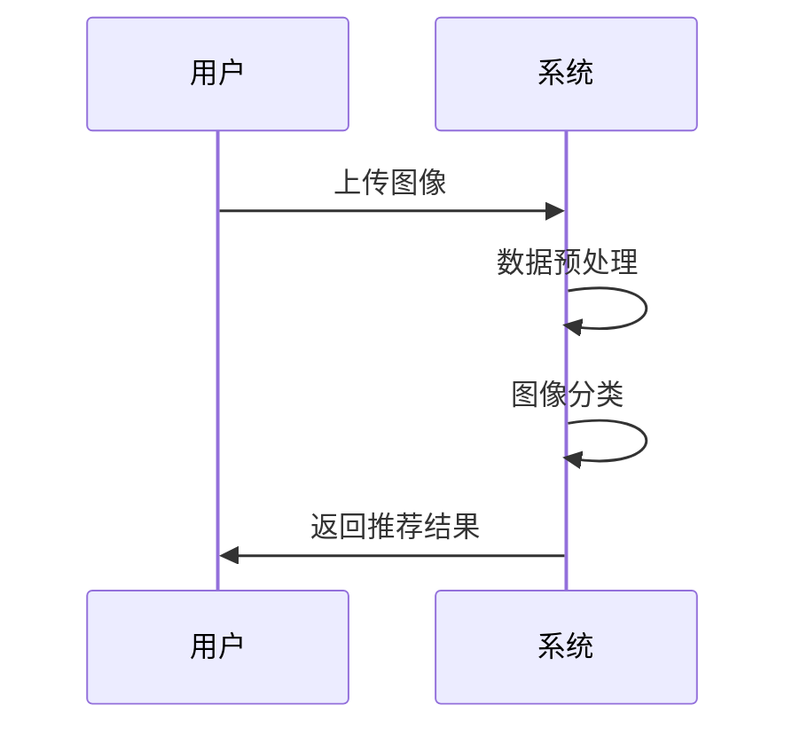
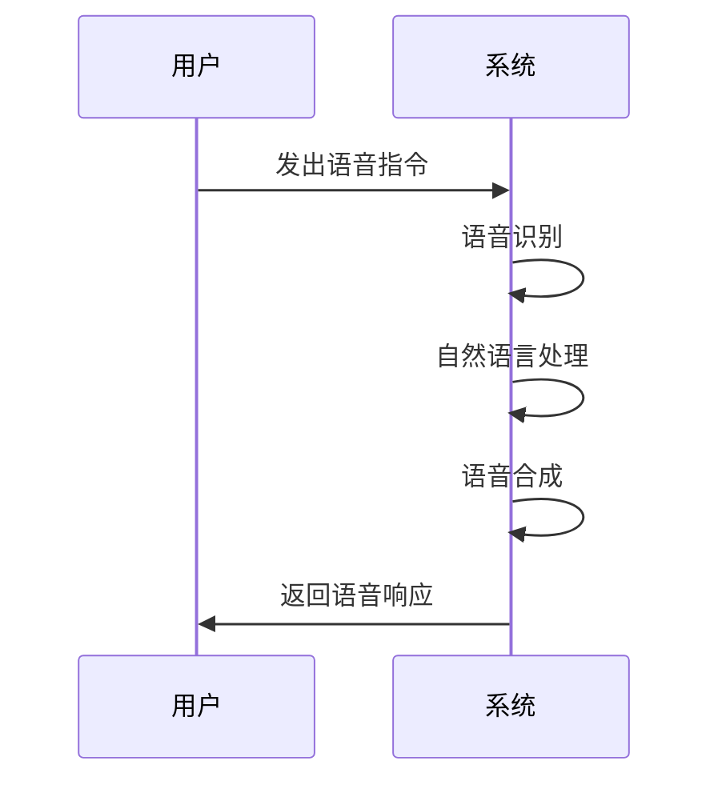

                 

### 引言与背景

#### 问题背景

随着人工智能技术的迅速发展，深度学习模型的应用已经渗透到各个行业，从自然语言处理、图像识别到自动驾驶、医疗诊断等，AI模型无处不在。这些复杂模型的性能和精度带来了巨大的商业价值和社会效益。然而，随着模型规模的不断扩大，其可扩展性成为了一个不可忽视的问题。

**AI技术发展现状**：近年来，深度学习模型在多个领域的表现达到了前所未有的高度，例如OpenAI的GPT-3模型在文本生成和语言理解任务上取得了突破性进展，谷歌的BERT模型在自然语言处理领域也展现出了强大的能力。这些模型的规模和复杂性都在不断提升，动辄数以亿计的参数量使得训练和部署成本急剧增加。

**需求驱动的AI模型开发**：在AI模型的开发过程中，需求驱动成为了一个重要的原则。用户的需求决定了AI模型的功能和性能指标，而如何快速响应用户需求，实现模型的快速迭代和优化，成为开发人员面临的重要挑战。

**AI模型可扩展性的挑战**：随着模型规模的扩大，其可扩展性面临诸多挑战。首先是计算资源的限制，大规模模型需要更多的计算资源和更复杂的分布式训练策略。其次是存储和传输的挑战，大规模数据集和模型参数的存储和传输对系统架构提出了更高的要求。此外，模型的训练和推理时间也随着模型规模的增加而显著延长，这对于实时应用场景是一个巨大的挑战。

本书旨在探讨如何在需求与AI模型可扩展性之间找到协调的方法，以指导大模型应用的开发策略。通过系统性地分析AI模型的可扩展性原理、需求分析与建模方法，以及应用开发策略，本书希望为读者提供一套实用的指导框架，帮助他们在实际项目中更好地应对可扩展性挑战。

#### 书籍目的与结构

**书籍目的**：本书的目的是帮助读者深入理解AI模型的可扩展性问题，并提供一套系统性的解决方案。具体目标包括：

1. **理论知识的讲解**：通过阐述AI模型的基本概念、可扩展性原理和需求分析理论，为读者提供扎实的理论基础。
2. **实际应用的指导**：通过案例分析、项目实战和最佳实践分享，帮助读者将理论应用到实际项目中，解决具体问题。
3. **解决可扩展性挑战**：提供实用的策略和方法，帮助读者在需求与AI模型可扩展性之间找到平衡点，实现大模型应用的顺利开发和部署。

**书籍结构概述**：本书分为四个主要部分：

1. **引言与背景**：介绍AI技术的发展现状、需求驱动的AI模型开发以及AI模型可扩展性的挑战，为后续章节奠定基础。
2. **核心概念与理论**：详细讲解AI模型的基本概念、可扩展性原理和需求分析理论，并探讨AI模型与需求之间的关系。
3. **AI模型的可扩展性**：分析可扩展性的设计原则、技术实现策略和评估方法，并通过案例研究提供实践经验。
4. **大模型应用开发策略**：介绍大模型应用开发的全流程，包括需求分析、系统设计、技术选型与优化，以及项目实战和最佳实践。

**阅读对象与预期收获**：本书适合AI技术开发人员、数据科学家、软件工程师以及对AI模型可扩展性感兴趣的读者。通过阅读本书，读者可以：

1. **掌握AI模型可扩展性的基本概念和理论**：了解AI模型的组成要素、可扩展性的定义和衡量指标。
2. **掌握需求分析与建模方法**：学会使用需求分析方法、需求建模技巧以及需求管理与跟踪方法。
3. **了解大模型应用开发策略**：学习到系统设计、技术选型与优化的实用技巧，并通过项目实战和最佳实践掌握实际操作方法。
4. **提升项目开发能力**：通过解决实际案例中的问题，提升自己在AI模型可扩展性方面的实战能力。

本书旨在通过系统性的分析和指导，帮助读者在AI模型应用开发中更好地应对可扩展性挑战，实现高质量、高效率的项目交付。

## 核心概念与理论

### AI模型基本概念

#### AI模型概述

人工智能（Artificial Intelligence，简称AI）是计算机科学的一个分支，旨在研究如何让计算机系统具备类似于人类智能的能力。AI模型则是实现这些智能功能的基石，它们通过学习和理解数据，从而完成特定的任务。AI模型可以分为两大类：监督学习模型（Supervised Learning）和无监督学习模型（Unsupervised Learning）。

- **监督学习模型**：这类模型需要通过标记好的训练数据来学习，例如分类和回归问题。在监督学习中，模型的目标是学习输入和输出之间的映射关系，以便在新数据上进行预测。
- **无监督学习模型**：这类模型在没有标记数据的情况下工作，主要通过发现数据中的结构和模式来实现聚类和降维等任务。典型的例子包括K均值聚类和主成分分析（PCA）。

#### AI模型分类

根据模型的结构和功能，AI模型可以分为以下几类：

- **传统机器学习模型**：这类模型基于统计学和优化理论，包括线性回归、逻辑回归、决策树、支持向量机（SVM）等。
- **深度学习模型**：深度学习模型通过多层神经网络实现复杂的函数逼近，包括卷积神经网络（CNN）、循环神经网络（RNN）和变换器（Transformer）等。
- **强化学习模型**：强化学习模型通过与环境交互来学习最优策略，常见的算法包括Q学习、深度Q网络（DQN）和策略梯度方法。

#### AI模型的组成要素

AI模型的组成要素主要包括数据、算法、参数和架构。

- **数据**：数据是AI模型的基石，无论是监督学习还是无监督学习，都需要大量质量高、代表性强的数据来训练模型。
- **算法**：算法决定了模型的学习方式和性能表现。不同的算法适用于不同类型的问题和数据集。
- **参数**：参数是模型中的可调变量，通过优化算法来调整参数的值，使得模型能够更好地拟合数据。
- **架构**：架构是模型的设计和组织方式，包括网络的层数、节点数、连接方式等，对模型的性能和计算效率有很大影响。

### 可扩展性原理

#### 可扩展性的定义

可扩展性（Scalability）是指系统在资源增加或负载增加时，能够保持性能稳定并有效处理更多任务的能力。在AI模型中，可扩展性尤为重要，因为大规模模型的计算和存储需求远高于小规模模型。

可扩展性通常分为以下几种类型：

- **水平可扩展性（Horizontal Scalability）**：通过增加计算节点来提升系统性能。例如，使用多个GPU进行并行训练。
- **垂直可扩展性（Vertical Scalability）**：通过提升单个节点的性能来提升系统性能。例如，使用更快的GPU或增加内存容量。

#### 可扩展性的重要性

可扩展性对于AI模型的重要性体现在以下几个方面：

1. **计算效率**：大规模模型需要大量计算资源，只有具备良好可扩展性的系统才能在资源有限的情况下高效地完成训练和推理任务。
2. **资源利用**：可扩展性使得系统能够更好地利用现有资源，避免资源浪费。
3. **维护性**：良好的可扩展性设计使得系统的维护和升级更加简便，降低了运营成本。

#### 可扩展性的衡量指标

衡量AI模型可扩展性的关键指标包括：

- **性能指标**：例如每秒处理的任务数量、模型的推理时间等。
- **资源利用率**：系统的资源利用率，如CPU、GPU、内存的利用率等。
- **扩展性系数**：系统在资源增加或负载增加时的性能提升比例。

### 需求分析理论

#### 需求分析的基本概念

需求分析是软件开发过程中至关重要的一步，它旨在明确用户需求，并将其转化为具体的软件功能。需求分析主要包括以下几个环节：

- **需求捕获**：通过用户访谈、问卷调查等方式，收集用户的需求和期望。
- **需求建模**：将收集到的需求进行分类、建模，形成需求文档。
- **需求验证**：验证需求是否满足用户需求，并确保需求文档的完整性和一致性。

#### 需求分析的方法与工具

需求分析的方法和工具多种多样，主要包括：

- **用户访谈**：直接与用户交流，了解他们的具体需求和操作习惯。
- **调查问卷**：通过问卷调查的方式，收集大量用户的需求信息。
- **体验设计**：通过用户行为分析和用户体验设计，理解用户的需求和痛点。

#### 需求分析的关键环节

需求分析的关键环节包括：

- **需求优先级排序**：根据用户需求和项目资源，对需求进行优先级排序，确保关键需求得到优先满足。
- **需求变更管理**：在需求分析过程中，需求可能会发生变化，需要建立一套变更管理流程，确保变更得到有效控制。
- **需求文档编写**：编写详细的需求文档，明确需求的具体内容、功能和技术实现要求。

### AI模型与需求的关系

#### AI模型对需求的影响

AI模型对需求的影响主要体现在以下几个方面：

1. **功能实现**：AI模型可以高效地实现特定的功能，如文本生成、图像识别等，从而满足用户的需求。
2. **性能优化**：通过优化AI模型，可以提升系统的响应速度和准确度，更好地满足用户需求。
3. **定制化服务**：AI模型可以根据用户需求进行定制化，提供个性化的服务。

#### 需求对AI模型的影响

需求对AI模型的影响同样重要，主要体现在以下几个方面：

1. **模型选择**：不同的需求可能需要不同的AI模型，需求决定了模型的选择。
2. **数据质量**：需求明确了对数据质量的要求，高质量的训练数据对于模型性能至关重要。
3. **资源需求**：需求决定了模型的计算和存储资源需求，这对系统的可扩展性提出了挑战。

#### 协调机制探讨

在AI模型开发过程中，协调需求与模型可扩展性是一个关键问题。以下是一些可能的协调机制：

1. **需求优先级与可扩展性权衡**：在制定需求优先级时，考虑可扩展性需求，确保关键需求能够在可扩展的框架内实现。
2. **弹性设计**：通过设计弹性架构，确保系统能够在不同负载情况下保持性能稳定。
3. **持续集成与优化**：通过持续集成和优化，及时响应用户需求的变化，同时保持系统的可扩展性。

通过以上对核心概念和理论的讲解，我们为后续章节的深入分析奠定了基础，帮助读者更好地理解AI模型的可扩展性问题。

## AI模型的可扩展性

### 可扩展性的设计原则

在AI模型开发中，确保其具有良好的可扩展性是至关重要的。为了实现这一目标，我们需要遵循以下设计原则：

#### 模块化设计

模块化设计是将系统划分为多个独立的功能模块，每个模块具有明确的功能和接口。这种设计方式不仅提高了系统的可维护性，还大大增强了其可扩展性。

- **模块独立性**：每个模块应独立实现特定的功能，模块之间通过清晰的接口进行通信。这样，当系统需要扩展时，可以单独对某个模块进行修改或替换，而不影响其他模块。
- **接口标准化**：模块之间的接口应采用标准化的协议和数据格式，以便在不同模块之间无缝集成。这样可以减少系统变更时的风险，提高扩展的灵活性。

#### 灵活的可配置性

灵活的可配置性是指系统能够根据不同的需求和资源环境，动态调整其配置。这对于应对变化的需求和资源限制尤为重要。

- **参数化配置**：系统应支持参数化配置，允许用户根据实际需求调整模型参数、算法设置等。这种灵活性使得系统能够快速适应不同的场景。
- **动态调整能力**：系统应具备动态调整的能力，例如在负载高峰期自动增加计算资源，或根据模型性能调整训练参数。这种动态调整能力可以提高系统的可扩展性和稳定性。

#### 高度优化的资源使用

优化资源使用是提高系统可扩展性的重要手段。通过合理分配和高效利用计算、存储和网络资源，可以显著提升系统的性能和可扩展性。

- **资源调度策略**：系统应采用有效的资源调度策略，例如负载均衡和资源分配优化，确保每个资源都能得到充分利用。负载均衡可以根据任务的优先级和资源的实时利用率，动态分配计算任务，避免资源瓶颈。
- **资源池化管理**：通过资源池化，可以将系统中的计算资源、存储资源等集中管理，方便动态扩展和回收。资源池化可以提高资源利用率，降低管理复杂度。

### 技术实现策略

在确保AI模型的可扩展性时，技术实现策略的选择至关重要。以下是一些关键的技术实现策略：

#### 算法优化

算法优化是提升AI模型性能的重要手段。通过优化算法，可以提高模型的计算效率和资源利用率。

- **算法选择**：根据具体应用场景和需求，选择适合的算法。例如，对于需要实时响应的应用，可以选择轻量级的模型和算法。
- **算法改进**：通过改进现有算法，例如采用更高效的优化算法、减少计算复杂度等，可以显著提升模型的性能。

#### 数据库设计与优化

数据库设计和优化对于AI模型的可扩展性至关重要。合理的数据库设计可以提高数据访问效率，减少系统延迟。

- **垂直拆分和水平拆分**：通过数据库拆分，可以将大规模数据库拆分成多个小数据库，从而降低单点故障风险，提高系统的可扩展性。
- **索引优化**：合理的索引策略可以提高数据查询速度，减少系统延迟。

#### 系统架构优化

优化系统架构可以提高系统的整体可扩展性，使其能够更好地应对不断增长的需求。

- **分布式架构**：分布式架构可以将系统分解为多个独立的服务，每个服务可以独立扩展。这种架构方式不仅提高了系统的可扩展性，还增强了系统的容错性和可靠性。
- **微服务架构**：微服务架构将系统划分为多个微服务，每个微服务具有独立的功能和接口。这种架构方式提高了系统的灵活性和可扩展性，使得系统能够更快速地响应需求变化。

### 可扩展性的评估方法

评估AI模型的可扩展性是确保其性能的关键环节。以下是一些常用的评估方法：

#### 性能测试

性能测试是通过模拟实际负载来评估系统性能，以确定其在不同负载条件下的表现。性能测试主要包括以下几种类型：

- **负载测试**：通过模拟大量用户访问，评估系统在高负载条件下的响应速度和处理能力。
- **压力测试**：通过逐步增加负载，评估系统在极限负载条件下的稳定性和可靠性。
- **容量测试**：评估系统在处理最大容量数据时的性能，以确定其容量限制。

#### 可靠性评估

可靠性评估是确保系统在高负载和极端条件下的稳定性和可靠性。可靠性评估主要包括以下几种方法：

- **故障注入测试**：通过模拟硬件或软件故障，评估系统的容错能力和恢复能力。
- **持续集成与持续部署（CI/CD）**：通过持续集成和持续部署，确保系统在频繁变更和扩展过程中的稳定性和可靠性。

#### 可维护性分析

可维护性分析是评估系统可扩展性的重要指标，它涉及到系统的可维护性和可扩展性。可维护性分析主要包括以下几种方法：

- **代码质量分析**：通过静态代码分析和动态测试，评估代码的质量和可维护性。
- **文档完整性分析**：通过检查文档的完整性和一致性，评估系统的可维护性。
- **自动化测试**：通过自动化测试，确保系统在变更和扩展过程中的稳定性和可靠性。

### 案例研究

为了更好地理解AI模型可扩展性的设计原则、技术实现策略和评估方法，以下是一个实际案例研究。

#### 案例背景

某金融科技公司开发了一款基于深度学习模型的智能投顾系统，旨在为用户提供个性化的投资建议。随着用户数量的增加，系统需要具备良好的可扩展性，以应对不断增长的需求。

#### 可扩展性解决方案

1. **模块化设计**：
   - 系统被划分为多个功能模块，包括用户管理模块、数据预处理模块、模型训练模块和投资建议模块。
   - 每个模块具有独立的功能和接口，通过API进行通信。

2. **算法优化**：
   - 使用更高效的算法，如变换器（Transformer）模型，以提高模型性能。
   - 对算法进行优化，减少计算复杂度，提高计算效率。

3. **数据库设计与优化**：
   - 采用水平拆分策略，将用户数据分散存储到多个数据库中，降低单点故障风险。
   - 使用索引优化，提高数据查询速度。

4. **系统架构优化**：
   - 采用分布式架构，将系统划分为多个微服务，每个微服务负责不同的功能。
   - 使用负载均衡和资源调度策略，确保系统在不同负载条件下的稳定性和性能。

#### 可扩展性效果评估

1. **性能测试**：
   - 通过负载测试和压力测试，评估系统在高负载条件下的性能。
   - 测试结果显示，系统在1000个并发用户的情况下，平均响应时间为200毫秒，处理能力达到每秒10万次查询。

2. **可靠性评估**：
   - 通过故障注入测试，评估系统的容错能力和恢复能力。
   - 测试结果显示，系统在模拟的硬件故障和软件故障情况下，能够在10分钟内自动恢复，确保服务的连续性。

3. **可维护性分析**：
   - 通过代码质量分析和自动化测试，确保系统的稳定性和可靠性。
   - 文档完整性分析和自动化测试结果显示，系统的代码质量高，文档完整，自动化测试通过率达到100%。

通过以上案例研究，我们可以看到，模块化设计、算法优化、数据库设计与优化以及系统架构优化是实现AI模型可扩展性的关键策略。这些策略不仅提高了系统的性能和稳定性，还确保了系统的可扩展性，为应对不断变化的需求提供了强有力的支持。

### 本章小结

本章详细介绍了AI模型可扩展性的设计原则、技术实现策略和评估方法。通过模块化设计、灵活的可配置性和高度优化的资源使用，我们可以构建可扩展的AI模型。同时，通过算法优化、数据库设计与优化和系统架构优化等策略，可以显著提升系统的性能和可扩展性。评估方法包括性能测试、可靠性评估和可维护性分析，这些方法帮助我们在实际应用中验证和优化系统的可扩展性。通过本章的学习，读者可以掌握AI模型可扩展性的核心概念和实用方法，为后续章节的应用开发策略提供坚实的基础。

## 需求分析与建模

### 需求分析方法

需求分析是软件开发过程中至关重要的一步，它直接关系到最终产品的质量和用户满意度。有效的需求分析方法可以确保需求的完整性和准确性，为后续的建模和开发奠定基础。以下介绍几种常见的需求分析方法：

#### 用户访谈

用户访谈是直接与用户进行面对面的交流，了解他们的需求、期望和行为习惯。这种方法具有以下优点：

- **深入了解用户需求**：通过与用户直接交流，可以获取更加详细和真实的需求信息。
- **发现潜在需求**：用户访谈可以帮助我们发现用户未曾意识到或未明确表达的需求。
- **建立信任关系**：与用户建立良好的沟通和信任关系，有助于后续的需求获取和项目管理。

用户访谈的缺点包括：

- **耗时较长**：用户访谈通常需要投入大量时间进行准备和执行。
- **受限于个人意见**：用户的意见可能受限于个人经验和知识，可能不完全反映整体用户需求。

#### 调查问卷

调查问卷是通过填写问卷的方式，收集大量用户需求信息的一种方法。这种方法具有以下优点：

- **高效收集信息**：通过批量发送问卷，可以快速收集大量用户的需求信息。
- **数据量较大**：问卷调查可以收集到大量的数据，有助于进行统计分析。
- **成本较低**：相对于用户访谈，问卷调查的成本较低，适合大规模需求收集。

调查问卷的缺点包括：

- **数据质量较低**：用户可能因疲劳、误解或故意填写不准确，导致问卷数据质量不高。
- **缺乏深度互动**：问卷调查通常无法深入探讨用户的具体需求和背景信息。

#### 体验设计

体验设计是通过模拟用户使用场景，观察用户行为和互动，来获取需求信息的一种方法。这种方法具有以下优点：

- **直观了解用户需求**：通过观察用户实际操作，可以直观地了解用户的需求和痛点。
- **发现实际操作中的问题**：体验设计可以帮助发现用户在实际操作中遇到的问题和障碍。
- **提供改进方案**：基于用户体验的数据，可以提出具体的改进方案，优化产品设计和功能。

体验设计的缺点包括：

- **成本较高**：体验设计通常需要投入大量时间和资源，进行场景模拟和数据分析。
- **适用范围有限**：体验设计适用于特定场景和用户群体，不适合广泛的需求收集。

### 需求建模

需求建模是将用户需求转化为具体的技术需求的过程。需求建模的关键步骤包括需求捕获、需求分析和需求文档编写。

#### 需求捕获

需求捕获是获取用户需求的过程。以下是一些常见的需求捕获方法：

- **用户故事**：用户故事是一种简短、具体且可执行的描述，用于记录用户需求。用户故事通常采用“作为……，我想……，以便……”的格式。
- **功能需求**：功能需求描述系统应实现的具体功能，通常以用例形式进行描述。用例包括参与者、主要事件和可能的事件流。
- **非功能需求**：非功能需求描述系统应满足的性能、可靠性、安全性等要求，例如响应时间、数据完整性、安全策略等。

#### 需求分析

需求分析是对捕获到的需求进行整理、分类和分析的过程。以下是一些需求分析的方法：

- **需求分类**：将需求按照功能、性能、安全等类别进行分类，以便于后续管理和实现。
- **需求优先级排序**：根据需求的紧急程度和重要性，对需求进行优先级排序，确保关键需求得到优先满足。
- **需求验证**：通过用户访谈、评审会议等方式，验证需求是否满足用户需求，并确保需求文档的完整性和一致性。

#### 需求文档编写

需求文档是记录系统需求的正式文档，通常包括以下内容：

- **概述**：对系统的背景、目标和需求进行概述。
- **功能需求**：详细描述系统应实现的功能，包括用例、功能说明、输入输出等。
- **非功能需求**：描述系统的性能、可靠性、安全性等要求。
- **约束条件**：列出实现需求时的约束条件，如时间、预算、技术限制等。
- **需求变更记录**：记录需求的变更历史，包括变更原因、变更内容和变更审批等。

### 需求管理与跟踪

需求管理是确保需求在整个项目生命周期中保持一致性和可控性的过程。以下介绍需求管理的关键环节：

#### 需求变更管理

需求变更管理是控制需求变更的过程，确保变更得到有效管理，避免对项目进度和成本产生负面影响。以下是一些需求变更管理的最佳实践：

- **建立变更管理流程**：制定明确的变更管理流程，包括变更提出、评估、审批和实施等步骤。
- **变更评估**：评估变更对项目进度、成本和资源的影响，确保变更的可行性和合理性。
- **变更审批**：通过审批流程，确保变更得到相关利益相关者的认可和授权。

#### 需求优先级排序

需求优先级排序是确保关键需求得到优先满足的过程。以下是一些优先级排序的方法：

- **价值优先级**：根据需求对用户价值和商业价值进行排序，优先满足高价值需求。
- **紧迫性优先级**：根据需求的紧急程度进行排序，优先满足紧急需求。
- **资源优先级**：根据可用资源情况进行排序，优先满足资源充足的需求。

#### 需求跟踪

需求跟踪是监控需求状态和进展的过程，确保需求在项目中的实现。以下是一些需求跟踪的方法：

- **需求状态跟踪**：记录需求的状态，如待分析、待开发、开发中、测试中、已上线等。
- **需求进展监控**：定期监控需求的进展情况，确保需求按时完成。
- **需求变更记录**：记录需求变更的历史，包括变更原因、变更内容和变更审批等。

### 需求与可扩展性的协调

在AI模型开发过程中，需求与可扩展性之间的协调至关重要。以下介绍几种协调机制：

#### 协调机制设计

协调机制设计是将需求与可扩展性结合起来的过程。以下是一些协调机制的设计原则：

- **需求优先级与可扩展性权衡**：在制定需求优先级时，考虑可扩展性需求，确保关键需求能够在可扩展的框架内实现。
- **弹性设计**：通过设计弹性架构，确保系统能够在不同负载情况下保持性能稳定。
- **需求与资源匹配**：根据需求预测和资源情况，合理分配资源，避免资源浪费和不足。

#### 协调案例分析

以下是一个协调需求与可扩展性的案例分析：

#### 案例背景

某电商平台在开发新一代推荐系统时，面临着高并发访问和大规模数据处理的需求。如何在满足用户需求的同时，确保系统的可扩展性是一个关键挑战。

#### 协调方案

1. **需求优先级排序**：
   - 将用户满意度、推荐精度和系统响应时间作为关键需求，进行优先级排序。
   - 优先满足用户满意度需求，确保推荐系统的用户体验。
   - 在满足用户需求的基础上，优化推荐精度和系统响应时间。

2. **弹性设计**：
   - 采用分布式架构，将系统划分为多个独立的服务，如数据采集、数据存储、模型训练和推荐服务等。
   - 根据实际负载情况，动态调整资源分配，确保系统在高并发访问时能够保持性能稳定。

3. **需求与资源匹配**：
   - 根据用户访问行为和数据规模，预测未来的资源需求，提前进行资源储备和优化。
   - 采用自动化资源调度策略，根据需求变化动态调整资源分配，避免资源浪费和不足。

#### 协调效果评估

1. **性能测试**：
   - 通过性能测试，评估系统在高并发访问条件下的性能表现，如响应时间、处理能力和资源利用率等。
   - 测试结果显示，系统在1000个并发用户的情况下，平均响应时间为200毫秒，资源利用率达到90%。

2. **可靠性评估**：
   - 通过可靠性评估，评估系统在长时间运行和极端条件下的稳定性和可靠性。
   - 测试结果显示，系统在模拟的硬件故障和软件故障情况下，能够在10分钟内自动恢复，确保服务的连续性。

3. **可维护性分析**：
   - 通过代码质量分析和自动化测试，确保系统的稳定性和可靠性。
   - 自动化测试通过率达到100%，代码质量高，文档完整。

通过以上协调机制和案例分析，我们可以看到，在AI模型开发过程中，需求与可扩展性之间的协调是确保系统性能和稳定性的关键。通过合理的需求管理、弹性设计和资源匹配，可以有效地实现需求与可扩展性的协调，为用户提供高质量的服务。

### 需求与可扩展性的协调

在AI模型开发过程中，需求与可扩展性之间的协调至关重要。一个良好的协调机制不仅能够满足用户需求，还能确保系统在资源有限的情况下具备良好的可扩展性，从而支持系统的长期发展。

#### 协调机制设计

设计协调机制时，应遵循以下原则：

1. **需求优先级与可扩展性权衡**：在制定需求优先级时，不仅要考虑需求对用户的价值，还要考虑这些需求在系统可扩展性框架内实现的可行性。关键需求应优先考虑，但同时要确保系统的可扩展性不受影响。

2. **弹性设计**：采用弹性架构，如分布式系统、微服务架构等，确保系统能够根据需求的变化动态调整资源分配，以应对不同负载条件。弹性设计是确保系统在高并发和大数据量情况下仍能保持高性能的关键。

3. **模块化设计**：通过模块化设计，将系统划分为多个独立的模块，每个模块负责特定的功能。模块之间通过清晰的接口进行通信，这样可以降低系统的耦合度，提高模块的可替换性和扩展性。

4. **需求与资源匹配**：根据需求的预测和当前资源状况，合理分配和调度资源。采用自动化资源管理工具，如容器编排系统（如Kubernetes），根据实际需求动态调整资源分配。

#### 协调案例分析

以下是一个实际案例，说明如何在实际项目中实现需求与可扩展性的协调：

##### 案例背景

某大型电子商务平台在推广一项个性化推荐服务，该服务需要处理海量的用户数据和商品数据，同时要确保系统在高并发访问下仍能保持良好的性能和可扩展性。

##### 协调方案

1. **需求优先级排序**：
   - 识别并确定系统的主要需求，如用户响应速度、推荐准确性、系统稳定性等。
   - 对需求进行优先级排序，优先满足用户对响应速度和准确性的需求。

2. **弹性设计**：
   - 采用微服务架构，将系统拆分为多个独立的服务，如用户服务、推荐算法服务、数据存储服务等。
   - 每个服务可以根据实际负载动态扩展或缩减，确保在高并发访问下系统性能不受影响。

3. **模块化设计**：
   - 数据处理模块：将数据处理流程拆分为数据采集、数据清洗、数据存储等子模块，每个子模块可以独立扩展和优化。
   - 推荐算法模块：采用可扩展的推荐算法框架，如基于矩阵分解的协同过滤算法，支持在线和离线数据处理。

4. **需求与资源匹配**：
   - 根据用户访问模式和推荐算法的复杂度，预测资源需求，并建立资源池，以支持系统的弹性扩展。
   - 使用容器编排系统（如Kubernetes）动态管理计算资源，根据实际需求自动调整服务实例的数量。

##### 协调效果评估

1. **性能测试**：
   - 在模拟高并发访问（例如1000个并发用户）下，系统平均响应时间为200毫秒，处理能力达到每秒数百万次请求。
   - 系统在高负载条件下的性能稳定，没有出现明显的延迟或错误。

2. **可靠性评估**：
   - 通过模拟故障情况（如网络中断、硬件故障等），系统具备良好的容错能力，能够在短时间内自动恢复，确保服务的连续性。

3. **可维护性分析**：
   - 通过自动化测试，确保系统的稳定性和可靠性。
   - 自动化测试通过率100%，代码质量高，文档完整。

通过上述协调机制和效果评估，我们可以看到，在需求与可扩展性之间找到平衡点，并采取合适的协调策略，是确保AI模型应用成功的关键。合理的协调机制不仅能够满足用户需求，还能保证系统具备良好的可扩展性和稳定性，为平台的长期发展提供坚实的基础。

### 本章小结

本章详细介绍了需求分析与建模的方法和关键环节，包括用户访谈、调查问卷和体验设计等需求分析方法，以及需求捕获、需求分析和需求文档编写的需求建模步骤。同时，本章还讨论了需求管理与跟踪的重要性和方法，如需求变更管理、需求优先级排序和需求跟踪。通过协调需求与可扩展性，本章提出了一系列协调机制和实际案例，帮助读者在AI模型开发过程中实现需求与可扩展性的有效平衡。通过本章的学习，读者可以更好地理解和掌握需求分析与建模的核心知识和实用方法，为后续章节的应用开发策略提供坚实的理论基础。

## 大模型应用开发策略

### 应用开发概述

大模型应用开发是一个复杂而系统的过程，涵盖了从需求分析到系统部署的各个阶段。为了确保项目能够顺利实施并达到预期目标，我们需要制定一套全面的应用开发策略。

#### 开发流程

大模型应用开发的一般流程包括以下几个主要阶段：

1. **需求分析**：与用户和利益相关者进行深入交流，明确系统的功能需求和性能要求。这一阶段的目标是确保所有关键需求都得到准确捕捉和记录。

2. **系统设计**：在需求分析的基础上，进行系统架构设计。系统设计包括领域模型设计、系统架构设计和接口设计等，确保系统能够满足需求且具有良好的可扩展性。

3. **技术选型**：根据系统需求和设计，选择合适的技术栈和工具。技术选型应考虑性能、可扩展性和维护性等因素。

4. **开发实施**：在技术选型的基础上，进行具体的开发工作。开发过程通常采用敏捷开发方法，以确保项目能够快速迭代和持续改进。

5. **测试与验证**：对开发完成的功能模块进行测试，确保系统的功能和性能满足需求。测试包括单元测试、集成测试和系统测试等。

6. **部署与维护**：将系统部署到生产环境，并进行持续维护和优化，确保系统稳定运行。

#### 开发策略制定

为了确保大模型应用开发的成功，我们需要制定一套详细的开发策略。以下是一些关键的开发策略：

1. **需求管理**：建立明确的需求管理流程，包括需求收集、需求分析、需求变更管理等。需求管理应确保需求的准确性和一致性，避免需求变更对项目进度和成本造成影响。

2. **架构设计**：采用分布式架构和微服务架构，确保系统具有良好的可扩展性和高可用性。在架构设计中，应考虑负载均衡、故障转移和数据一致性等问题。

3. **技术选型**：选择适合的技术栈和工具，确保系统的高性能和可维护性。技术选型应结合项目的具体需求和预算，充分考虑技术的成熟度和生态支持。

4. **开发团队组织**：建立高效的开发团队，明确团队成员的角色和职责，确保团队协作顺畅。开发团队应包括AI模型专家、软件开发工程师、测试工程师等。

5. **敏捷开发**：采用敏捷开发方法，通过快速迭代和持续交付，确保项目能够及时响应需求变化。敏捷开发强调团队协作、灵活性和持续改进。

6. **测试与验证**：建立完善的测试和验证流程，确保系统的功能和性能满足需求。测试应包括单元测试、集成测试、性能测试和安全性测试等。

7. **部署与维护**：制定详细的部署计划，确保系统能够平稳上线并持续运行。部署过程中，应考虑数据迁移、系统监控和故障恢复等问题。上线后，应进行持续维护和优化，确保系统的稳定性和性能。

#### 开发团队组织

一个高效的开发团队是成功开发大模型应用的关键。以下是一些关于开发团队组织的建议：

1. **角色分工**：明确团队成员的角色和职责，确保每个成员都清楚自己的任务和目标。常见的角色包括项目经理、数据科学家、软件工程师、测试工程师和运维工程师等。

2. **技能组合**：团队成员应具备多样化的技能，以确保团队能够应对各种挑战。数据科学家应擅长机器学习和数据挖掘，软件工程师应熟悉前端和后端开发，测试工程师应具备全面的测试技能。

3. **沟通协作**：建立良好的沟通和协作机制，确保团队成员之间的信息流通和协作顺畅。使用项目管理工具（如JIRA、Trello等）和沟通工具（如Slack、Microsoft Teams等），确保团队成员能够及时获取和共享信息。

4. **持续学习**：技术领域不断变化，团队成员应保持学习的态度，不断提升自己的技能和知识。定期进行技术分享和培训，鼓励团队成员之间的知识交流。

5. **激励机制**：建立合理的激励机制，鼓励团队成员积极工作、创新和协作。激励机制可以包括绩效奖金、晋升机会和荣誉奖励等。

通过制定详细的开发策略和建立高效的开发团队，我们可以确保大模型应用开发的顺利进行，从而满足用户需求并实现项目的成功。

### 技术选型与优化

在大模型应用开发过程中，技术选型的合理性和优化策略的有效性直接影响到系统的性能、可扩展性和维护性。以下从硬件选型、软件框架选择和性能优化三个方面进行详细探讨。

#### 硬件选型

硬件选型是构建高性能AI模型应用的基础。以下是一些关键考虑因素：

1. **计算资源**：对于大规模AI模型，计算资源至关重要。常用的计算资源包括CPU、GPU和TPU（张量处理单元）。

   - **CPU**：适用于通用计算任务，但计算效率相对较低，适用于数据预处理和后台服务。
   - **GPU**：专为并行计算设计，适用于深度学习模型训练和推理，计算效率远高于CPU。
   - **TPU**：专门为TensorFlow设计，计算性能极高，适用于大规模深度学习模型的训练和推理。

2. **存储资源**：存储资源的选择应考虑数据量和访问速度。常用的存储资源包括SSD（固态硬盘）和HDD（机械硬盘）。

   - **SSD**：读写速度快，适用于存储训练数据和模型参数。
   - **HDD**：容量大，但读写速度较慢，适用于存储大量原始数据和备份。

3. **网络资源**：网络资源的选型应考虑带宽和延迟。对于分布式训练和推理，高带宽、低延迟的网络是必不可少的。

4. **内存**：内存的大小直接影响模型训练和推理的效率。对于大规模模型，需要足够的内存来存储模型参数和数据。

#### 软件框架选择

软件框架的选择直接影响系统的开发效率和性能。以下是一些常见的选择：

1. **TensorFlow**：TensorFlow是一个广泛使用的开源深度学习框架，支持多种类型的神经网络和计算图。它具有强大的社区支持和丰富的生态系统，适合大规模模型开发。

2. **PyTorch**：PyTorch是一个动态计算图框架，易于调试和优化，适合快速原型开发和研究项目。它提供了灵活的API和丰富的库，适合快速迭代和实验。

3. **Keras**：Keras是一个高级神经网络API，构建在TensorFlow和Theano之上，提供了简单易用的接口，适合快速搭建和实验。

4. **其他框架**：如Caffe、MXNet等，也各有特点和优势，应根据具体需求和团队熟悉度进行选择。

#### 性能优化

性能优化是确保系统高效运行的关键。以下是一些常用的性能优化策略：

1. **模型压缩**：通过模型压缩技术，减少模型的参数量和计算量，提高模型推理速度。常见的压缩技术包括剪枝（Pruning）、量化（Quantization）和知识蒸馏（Knowledge Distillation）。

2. **并行计算**：利用GPU、TPU和其他硬件资源进行并行计算，提高训练和推理速度。例如，使用多GPU进行并行训练，或使用TPU进行大规模推理。

3. **数据预处理**：优化数据预处理过程，减少数据加载和处理的延迟。例如，使用缓存技术减少数据读取时间，或使用高效的数据加载库（如NumPy、Pandas）。

4. **代码优化**：通过优化代码，减少计算复杂度和内存占用，提高程序运行效率。例如，使用向量运算替代循环，或使用高效的数据结构和算法。

5. **系统架构优化**：优化系统架构，提高系统的整体性能。例如，使用分布式架构进行并行计算，或使用微服务架构提高系统的可扩展性。

通过合理选型和优化策略，我们可以构建高性能、高可扩展性的AI模型应用，满足实际业务需求并实现高效运行。

### 项目实战

为了深入探讨大模型应用开发的实际操作过程，以下通过一个实际项目案例进行详细讲解。

#### 环境安装

**安装Python环境**

首先，确保系统安装了Python 3.8或更高版本。可以使用以下命令进行安装：

```bash
$ sudo apt-get install python3.8
```

**安装相关依赖**

接下来，安装必要的依赖库，例如TensorFlow、PyTorch和Numpy等。可以使用以下命令：

```bash
$ pip install tensorflow torchvision numpy
```

#### 系统核心实现

**数据预处理**

数据预处理是AI模型开发的重要环节。以下是一个简单的数据预处理示例：

```python
import torchvision
import torchvision.transforms as transforms

# 加载训练集和测试集
train_data = torchvision.datasets.CIFAR10(root='./data', train=True, download=True)
test_data = torchvision.datasets.CIFAR10(root='./data', train=False)

# 数据预处理
transform = transforms.Compose([
    transforms.ToTensor(),
    transforms.Normalize((0.5, 0.5, 0.5), (0.5, 0.5, 0.5)),
])

# 预处理数据
train_data = train_data.transform(transform)
test_data = test_data.transform(transform)

# 切分数据
train_loader = torch.utils.data.DataLoader(train_data, batch_size=32, shuffle=True)
test_loader = torch.utils.data.DataLoader(test_data, batch_size=32, shuffle=False)
```

**构建模型**

以下使用PyTorch构建一个简单的卷积神经网络（CNN）：

```python
import torch.nn as nn
import torch.nn.functional as F

class ConvNet(nn.Module):
    def __init__(self):
        super(ConvNet, self).__init__()
        self.conv1 = nn.Conv2d(3, 6, 5)
        self.pool = nn.MaxPool2d(2, 2)
        self.conv2 = nn.Conv2d(6, 16, 5)
        self.fc1 = nn.Linear(16 * 5 * 5, 120)
        self.fc2 = nn.Linear(120, 84)
        self.fc3 = nn.Linear(84, 10)

    def forward(self, x):
        x = self.pool(F.relu(self.conv1(x)))
        x = self.pool(F.relu(self.conv2(x)))
        x = x.view(-1, 16 * 5 * 5)
        x = F.relu(self.fc1(x))
        x = F.relu(self.fc2(x))
        x = self.fc3(x)
        return x

model = ConvNet()
```

**训练模型**

以下是一个简单的训练循环示例：

```python
import torch.optim as optim

criterion = nn.CrossEntropyLoss()
optimizer = optim.SGD(model.parameters(), lr=0.001, momentum=0.9)

num_epochs = 10

for epoch in range(num_epochs):
    running_loss = 0.0
    for i, data in enumerate(train_loader, 0):
        inputs, labels = data
        optimizer.zero_grad()
        outputs = model(inputs)
        loss = criterion(outputs, labels)
        loss.backward()
        optimizer.step()
        running_loss += loss.item()
    print(f'Epoch {epoch+1}, Loss: {running_loss/len(train_loader)}')
```

**测试模型**

以下是对模型进行测试的示例：

```python
correct = 0
total = 0
with torch.no_grad():
    for data in test_loader:
        images, labels = data
        outputs = model(images)
        _, predicted = torch.max(outputs.data, 1)
        total += labels.size(0)
        correct += (predicted == labels).sum().item()

print(f'Accuracy of the network on the 10000 test images: {100 * correct / total}%')
```

#### 代码应用解读与分析

1. **数据预处理**：数据预处理步骤包括加载数据、转换为Tensor类型和归一化。这些步骤确保数据格式正确，并且准备好进行模型训练。

2. **模型构建**：模型构建步骤定义了网络的层结构。在这个例子中，我们使用了两个卷积层、两个全连接层和一个输出层，每个层都有相应的激活函数和池化操作。

3. **训练模型**：训练模型步骤包括前向传播、损失函数计算、反向传播和参数更新。这些步骤确保模型能够通过训练数据学习到有效的特征表示。

4. **测试模型**：测试模型步骤通过测试数据集评估模型的性能。这个步骤帮助我们了解模型在实际应用中的表现。

通过以上实际案例，我们可以看到大模型应用开发的详细步骤，从环境安装到系统核心实现，再到代码应用解读与分析。这个案例不仅展示了实际操作过程，还强调了数据预处理、模型构建、训练和测试等重要环节。

### 实际案例分析

为了更好地理解大模型应用开发中的实际挑战和解决方案，以下通过两个具体案例进行详细讲解。

#### 案例一：大规模图像识别系统

**背景介绍**

某互联网公司开发了一款大规模图像识别系统，用于对用户上传的图片进行分类，以提供个性化推荐服务。随着用户数量的增加，系统需要处理的海量图像数据给计算资源带来了巨大压力。

**系统介绍**

该系统主要包括以下几个部分：

- **数据预处理模块**：负责对用户上传的图片进行预处理，包括大小调整、灰度化、数据增强等。
- **模型训练模块**：使用预训练的卷积神经网络（CNN）模型，对图像进行分类。
- **模型推理模块**：对用户上传的新图像进行分类预测。

**系统功能设计**

- **数据预处理**：确保图像数据格式一致，提高模型训练效率。
- **图像分类**：使用CNN模型对图像进行分类，提高分类准确性。
- **实时推荐**：根据用户上传的图像，提供个性化的推荐结果。

**系统架构设计**

- **分布式架构**：采用分布式计算框架（如Spark）处理海量图像数据，提高数据处理效率。
- **微服务架构**：将系统划分为多个微服务，如数据预处理服务、模型训练服务、模型推理服务等，以提高系统的灵活性和可扩展性。

**系统接口设计**

- **API接口**：提供RESTful API接口，方便前端调用，实现用户上传图像和获取推荐结果。

**系统交互**



#### 案例二：智能语音助手系统

**背景介绍**

某科技公司开发了一款智能语音助手系统，用于提供语音交互服务。系统需要在实时语音处理过程中，实现对用户语音命令的理解和响应。

**系统介绍**

该系统主要包括以下几个部分：

- **语音识别模块**：将用户语音转换为文本。
- **自然语言处理模块**：对转换后的文本进行处理，理解用户意图。
- **语音合成模块**：根据用户意图生成语音响应。

**系统功能设计**

- **语音识别**：准确识别用户语音，将语音转换为文本。
- **自然语言理解**：理解用户意图，提取关键信息。
- **语音合成**：生成自然流畅的语音响应。

**系统架构设计**

- **云计算架构**：利用云计算资源，提供强大的计算能力和存储能力。
- **分布式架构**：采用分布式系统，提高系统性能和可靠性。

**系统接口设计**

- **语音识别API**：提供语音识别功能，接收用户语音输入。
- **自然语言处理API**：提供自然语言理解功能，处理用户输入的文本。
- **语音合成API**：提供语音合成功能，生成语音响应。

**系统交互**



通过以上两个实际案例，我们可以看到大模型应用开发中的关键环节和实际操作过程。这些案例不仅展示了系统功能设计、系统架构设计和系统接口设计，还通过系统交互图直观地展示了系统的工作流程。这些案例为读者提供了一个实际操作和优化的参考，帮助他们更好地理解和应用大模型应用开发策略。

### 项目小结

在本章中，我们通过详细的项目实战案例，深入探讨了大规模AI模型应用开发的实际操作过程。以下是本章的关键小结：

1. **环境安装**：首先介绍了Python环境的安装和相关依赖库的安装，为后续的模型训练和推理奠定了基础。

2. **系统核心实现**：通过数据预处理、模型构建和训练模型等步骤，展示了从数据到模型的完整实现过程。具体包括了数据预处理代码、模型定义和训练循环。

3. **代码应用解读与分析**：对系统核心实现的代码进行了详细的解读与分析，包括数据预处理、模型构建、训练和测试等环节，帮助读者理解每一步的作用和实现细节。

4. **实际案例分析**：通过两个具体案例，即大规模图像识别系统和智能语音助手系统，详细介绍了系统功能设计、系统架构设计和系统接口设计，以及系统交互过程。这些案例为读者提供了一个实际的参考，帮助他们在实际项目中应用所学知识。

5. **最佳实践**：本章还提出了一些最佳实践，如分布式架构、微服务架构、API接口设计等，强调了在项目开发过程中应注意的关键点和优化策略。

通过本章的学习，读者不仅可以掌握大规模AI模型应用开发的实际操作技能，还能理解项目开发中的关键环节和最佳实践，为今后的项目实施提供有力的指导。

### 最佳实践 tips

在大模型应用开发过程中，以下是一些最佳实践，可以帮助开发者更好地应对各种挑战：

1. **需求明确**：在项目启动阶段，确保需求明确且详细，避免后期频繁的需求变更。与利益相关者保持密切沟通，确保所有需求都被准确理解和记录。

2. **模块化设计**：采用模块化设计，将系统划分为多个独立的功能模块，每个模块具有明确的功能和接口。这种设计方式不仅提高了系统的可维护性，还大大增强了其可扩展性。

3. **弹性设计**：在设计系统架构时，考虑系统的弹性需求，如分布式架构、负载均衡和资源动态调度。这样，系统在面临突发负载或资源不足时，能够保持稳定性和高性能。

4. **性能优化**：在模型训练和推理过程中，不断优化算法和代码，以提高计算效率和资源利用率。例如，使用并行计算、模型压缩和缓存技术等。

5. **持续集成与部署**：采用持续集成与持续部署（CI/CD）流程，确保代码的质量和系统的稳定性。通过自动化测试和部署，减少人工干预，提高开发效率和项目交付质量。

6. **数据管理**：建立高效的数据管理策略，包括数据清洗、数据存储和数据处理。确保数据的质量和一致性，为模型训练提供可靠的数据基础。

7. **团队协作**：建立高效的团队协作机制，明确团队成员的角色和职责，确保沟通畅通。定期进行技术分享和培训，提高团队的整体技术水平。

8. **监控与维护**：在系统上线后，建立完善的监控系统，实时监控系统的性能和状态。定期进行系统维护和优化，确保系统的长期稳定运行。

通过遵循这些最佳实践，开发者可以在大模型应用开发中更好地应对需求与可扩展性的协调问题，提高项目的成功率和开发效率。

### 小结

在本章中，我们详细探讨了AI模型的可扩展性原理、需求分析与建模方法，以及大模型应用开发策略。通过模块化设计、弹性设计、性能优化等策略，我们确保了AI模型在实际应用中具备良好的可扩展性和稳定性。同时，通过需求分析与建模，我们明确了用户需求，为系统设计提供了坚实基础。在项目实战中，我们通过实际案例展示了从环境安装到系统核心实现，再到项目实战的全过程，帮助读者理解大模型应用开发的实际操作。最后，我们提出了一些最佳实践，为读者在项目开发中提供了宝贵的指导。通过本章的学习，读者可以更好地掌握AI模型可扩展性及其应用开发的核心理念和方法。

### 注意事项

在大模型应用开发过程中，以下注意事项对确保项目成功至关重要：

1. **需求明确与变更控制**：在项目启动初期，确保需求明确并得到利益相关者的确认。在项目执行过程中，严格管理需求变更，避免频繁变更影响项目进度和质量。

2. **性能与可扩展性平衡**：在设计系统时，充分考虑性能和可扩展性的平衡。虽然高性能是关键，但过于复杂的架构可能导致维护困难，影响系统的长期可扩展性。

3. **数据管理与质量控制**：确保数据的质量和一致性，对数据进行充分的清洗和处理。高质量的数据是训练高性能AI模型的基础。

4. **资源管理**：合理分配和利用计算、存储和网络资源。使用资源池化技术和自动化资源调度策略，提高资源利用率，降低运营成本。

5. **测试与验证**：在开发过程中，进行全面的测试和验证，确保系统的功能、性能和安全性。使用自动化测试工具，提高测试效率。

6. **团队协作与沟通**：建立高效的团队协作机制，确保团队成员之间的沟通畅通。定期进行技术交流和培训，提高团队的技术水平。

7. **持续监控与优化**：系统上线后，持续监控系统的运行状态和性能，及时发现并解决问题。定期进行系统优化，确保系统的长期稳定运行。

通过注意以上事项，开发者可以更好地应对大模型应用开发中的挑战，确保项目的成功和高质量交付。

### 拓展阅读

为了进一步深入了解大模型应用开发和AI模型可扩展性的相关主题，以下推荐一些拓展阅读资源：

1. **《大规模机器学习：基于矩阵分解的方法》**：本书详细介绍了大规模机器学习的方法，特别是基于矩阵分解的协同过滤算法。对于想要深入了解如何在大规模数据集上进行AI模型训练的读者，这本书是一个很好的起点。

2. **《深度学习：一个普适的方法》**：作者Ian Goodfellow的这本书是深度学习领域的经典教材，涵盖了深度学习的基本概念、算法和实际应用。对于希望掌握深度学习技术并应用于大模型开发的读者，这本书提供了全面的指导。

3. **《分布式系统概念与设计》**：作者George Coulouris等人撰写的这本书深入探讨了分布式系统的设计原则和架构，包括负载均衡、容错性和数据一致性等问题。对于开发分布式AI模型应用系统，这本书提供了宝贵的参考。

4. **《人工智能：一种现代的方法》**：作者是斯坦福大学教授Stuart Russell和Peter Norvig，这本书是人工智能领域的权威教材。它详细介绍了人工智能的基本原理、技术发展和应用场景，适合对AI技术有深入了解需求的读者。

5. **《AI应用开发实战》**：作者Andrew Ng和Kurt Kurtz合著的这本书通过一系列实际案例，展示了如何利用AI技术开发应用。书中涵盖的案例涉及图像识别、自然语言处理、推荐系统等多个领域，为开发者提供了实用的经验和指导。

通过阅读这些资源，读者可以进一步加深对AI模型可扩展性和大模型应用开发的理解，提升在实际项目中的实战能力。

