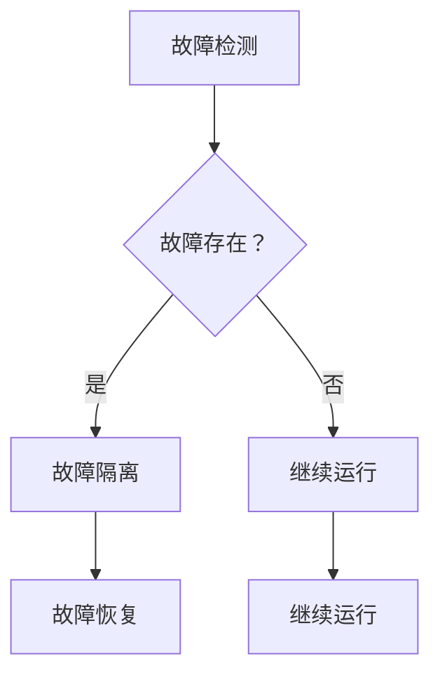

                 

# 需求与AI模型容错机制的协同：大模型应用的稳定性保障

## 关键词

AI模型，容错机制，需求，稳定性，大模型应用

## 摘要

本文深入探讨了AI模型在大规模应用中的稳定性保障问题。随着人工智能技术的发展，AI模型在各个领域的应用越来越广泛，然而，AI模型的稳定性成为了一个关键问题。本文从需求分析入手，详细阐述了AI模型容错机制的设计与实现，并通过协同工作，为大规模AI应用提供了稳定性保障。通过理论与实践相结合，本文旨在为读者提供一个全面而深入的了解，帮助其在实际项目中更好地应用AI技术。

## 目录

1. **背景与基本概念**
   1.1. **AI模型需求背景**  
   1.2. **问题与解决方案**  
   1.3. **边界与外延**  
   1.4. **核心概念与联系**

2. **AI模型容错机制**
   2.1. **容错机制概述**  
   2.2. **原理与算法**  
   2.3. **数学模型与公式**  
   2.4. **案例分析**

3. **需求与AI模型容错机制的协同**
   3.1. **协同原理**  
   3.2. **实践实现**  
   3.3. **系统架构设计**

4. **大规模AI应用的稳定性保障**
   4.1. **稳定性分析**  
   4.2. **案例分析**  
   4.3. **优化建议**

5. **项目实战**
   5.1. **环境安装**  
   5.2. **系统核心实现**  
   5.3. **代码应用解读与分析**  
   5.4. **项目小结**

6. **最佳实践与拓展阅读**

## 1. 背景与基本概念

### 1.1 AI模型需求背景

随着大数据、云计算和深度学习技术的快速发展，AI模型在各个领域的应用越来越广泛。从自然语言处理、图像识别到自动驾驶，AI模型正在改变我们的生活方式。然而，AI模型的应用也带来了新的挑战，特别是在大规模应用场景下，模型的稳定性问题变得尤为突出。

稳定性问题主要体现在以下几个方面：

- **数据波动**：大规模应用场景中，数据波动较大，可能导致模型性能下降或失效。
- **硬件故障**：服务器、网络等硬件设备可能发生故障，影响模型的正常运行。
- **算法缺陷**：AI模型的算法可能存在缺陷，导致在特定情况下出现异常。

因此，如何保障AI模型在大规模应用中的稳定性，成为了一个亟待解决的问题。

### 1.2 问题与解决方案

为了解决AI模型在大规模应用中的稳定性问题，我们需要从以下几个方面进行考虑：

- **需求分析**：明确AI模型的应用场景，了解用户需求，为模型设计提供指导。
- **容错机制**：设计有效的容错机制，确保模型在出现故障时能够快速恢复。
- **稳定性分析**：对模型进行稳定性分析，找出可能影响稳定性的因素，并采取相应的措施。

本文将重点讨论需求与AI模型容错机制的协同，以实现大规模AI应用的稳定性保障。

### 1.3 边界与外延

本文主要关注AI模型在大规模应用中的稳定性问题，涉及到以下几个方面：

- **应用场景**：主要集中在自然语言处理、图像识别、自动驾驶等领域。
- **技术范畴**：涵盖深度学习、机器学习、分布式计算等关键技术。
- **数据范围**：涉及大规模数据集的处理和存储。

### 1.4 核心概念与联系

在本章节中，我们将介绍一些核心概念，并分析它们之间的关系。

#### 1.4.1 AI模型

AI模型是指基于人工智能技术构建的算法模型，用于处理和预测数据。常见的AI模型包括深度学习模型、机器学习模型等。

#### 1.4.2 容错机制

容错机制是指在面对系统故障时，能够自动检测、隔离和恢复故障的机制。常见的容错机制包括故障转移、故障隔离、故障恢复等。

#### 1.4.3 需求

需求是指用户对AI模型的应用场景和功能要求。需求分析是设计AI模型的重要环节，有助于确定模型的功能和性能指标。

#### 1.4.4 稳定性

稳定性是指AI模型在大规模应用场景下的性能表现。稳定性分析是保障AI模型稳定性的关键步骤。

#### 1.4.5 关系

需求与AI模型容错机制之间存在密切的联系。需求分析有助于确定容错机制的设计目标，而容错机制的实施有助于满足用户需求，保障AI模型在大规模应用中的稳定性。

## 2. AI模型容错机制

### 2.1 容错机制概述

容错机制是保障AI模型稳定性的重要手段。在本章节中，我们将介绍AI模型容错机制的基本概念、类型和重要性。

#### 2.1.1 定义

容错机制是指在系统出现故障时，能够自动检测、隔离和恢复故障的机制。通过容错机制，可以确保系统在出现故障时能够快速恢复，减少对用户的影响。

#### 2.1.2 类型

常见的容错机制包括以下几种：

- **故障转移**：当主节点出现故障时，自动切换到备用节点，确保系统的持续运行。
- **故障隔离**：将出现故障的节点从系统中隔离，避免故障扩散。
- **故障恢复**：在故障节点恢复后，将其重新纳入系统，确保系统的完整性。

#### 2.1.3 重要性

容错机制对于AI模型的应用具有重要意义：

- **提高系统可用性**：通过容错机制，可以确保AI模型在出现故障时能够快速恢复，减少系统停机时间，提高系统的可用性。
- **保障数据安全**：在分布式计算环境中，数据的安全性至关重要。通过容错机制，可以确保数据在传输和存储过程中不受到损坏。
- **提升用户体验**：AI模型的应用通常面向大量用户，系统的稳定性直接影响到用户的体验。通过容错机制，可以保障系统在面临大量用户请求时依然能够稳定运行。

### 2.2 原理与算法

在本章节中，我们将介绍AI模型容错机制的原理和算法，并通过Mermaid流程图进行说明。

#### 2.2.1 算法描述

AI模型容错机制的算法主要包括以下步骤：

1. **故障检测**：通过监控系统的运行状态，检测是否存在故障。
2. **故障隔离**：当检测到故障时，将故障节点从系统中隔离。
3. **故障恢复**：在故障节点恢复后，将其重新纳入系统。

#### 2.2.2 Mermaid流程图

以下是一个简单的Mermaid流程图，用于说明AI模型容错机制的算法：



#### 2.2.3 Python源代码

下面是一个简单的Python源代码示例，用于实现AI模型容错机制：

```python
import time
import random

def monitor_system():
    while True:
        if random.random() < 0.1:  # 模拟故障发生
            print("故障发生，正在隔离...")
            isolate_fault()
        else:
            print("系统运行正常，继续运行...")
        time.sleep(1)

def isolate_fault():
    print("故障隔离中...")
    time.sleep(2)
    print("故障隔离完成，等待故障恢复...")

def recover_fault():
    print("故障恢复中...")
    time.sleep(2)
    print("故障恢复完成，重新加入系统...")

if __name__ == "__main__":
    monitor_system()
```

#### 2.2.4 数学模型与公式

AI模型容错机制的数学模型主要涉及概率论和图论。以下是一个简单的数学模型示例：

- **故障概率**：P(fault) 表示系统发生故障的概率。
- **故障恢复时间**：T(recovery) 表示故障恢复所需的时间。

数学模型如下：

$$
P(fault) \times T(recovery) = T(fault)
$$

其中，T(fault) 表示故障持续时间。

#### 2.2.5 案例分析

以下是一个简单的案例分析，用于说明AI模型容错机制的应用：

假设一个AI模型在运行过程中，出现故障的概率为0.1，故障恢复时间为2秒。那么，该模型在1小时内可能发生的故障次数为：

$$
P(fault) \times 3600 = 0.1 \times 3600 = 360
$$

在1小时内，模型可能发生360次故障，平均每次故障恢复时间为2秒。因此，在1小时内，模型可能需要720秒（即12分钟）来处理故障。

## 3. 需求与AI模型容错机制的协同

在本章节中，我们将探讨需求与AI模型容错机制的协同，以实现大规模AI应用的稳定性保障。

### 3.1 协同原理

需求与AI模型容错机制的协同主要基于以下几个方面：

- **需求分析**：了解用户需求，确定AI模型的应用场景和性能指标，为容错机制设计提供指导。
- **容错机制设计**：根据需求分析结果，设计合理的容错机制，确保AI模型在面临各种故障时能够快速恢复。
- **协同工作**：需求与容错机制协同工作，实现AI模型在大规模应用中的稳定性保障。

### 3.2 实践实现

在实践实现中，需求与AI模型容错机制的协同可以通过以下步骤进行：

1. **需求分析**：了解用户需求，确定AI模型的应用场景和性能指标。
2. **设计容错机制**：根据需求分析结果，设计合理的容错机制，包括故障检测、故障隔离和故障恢复等环节。
3. **实现协同工作**：将需求与容错机制集成到系统中，实现协同工作，确保AI模型在大规模应用中的稳定性。

### 3.3 系统架构设计

为了实现需求与AI模型容错机制的协同，我们需要设计一个合理的系统架构。以下是一个简单的系统架构设计：

- **需求分析模块**：负责分析用户需求，确定AI模型的应用场景和性能指标。
- **容错机制模块**：负责设计并实现AI模型容错机制，包括故障检测、故障隔离和故障恢复等环节。
- **AI模型模块**：负责实现AI模型的功能，并根据需求分析结果进行优化。
- **系统监控模块**：负责监控系统的运行状态，检测故障并及时处理。

通过以上模块的协同工作，可以实现需求与AI模型容错机制的协同，保障大规模AI应用的稳定性。

## 4. 大规模AI应用的稳定性保障

在本章节中，我们将探讨如何保障大规模AI应用的稳定性，包括稳定性分析、案例分析以及优化建议。

### 4.1 稳定性分析

稳定性分析是保障大规模AI应用稳定性的关键步骤。稳定性分析主要涉及以下几个方面：

- **故障类型**：分析可能出现的故障类型，包括硬件故障、软件故障、数据异常等。
- **故障影响**：评估故障对AI模型应用的影响，包括性能下降、数据丢失、系统崩溃等。
- **故障恢复时间**：评估故障恢复所需的时间，包括系统自动恢复时间和人工干预时间。

通过稳定性分析，可以找出可能影响稳定性的因素，并采取相应的措施进行优化。

### 4.2 案例分析

以下是一个简单的案例分析，用于说明如何保障大规模AI应用的稳定性：

假设一个自然语言处理系统在运行过程中，出现以下故障：

- **硬件故障**：服务器出现故障，导致系统无法正常运行。
- **软件故障**：系统中的一个模块出现异常，导致整个系统崩溃。
- **数据异常**：输入数据出现异常，导致模型预测结果不准确。

针对以上故障，我们可以采取以下措施进行稳定性保障：

1. **硬件故障**：设计冗余硬件系统，确保在出现硬件故障时，备用硬件能够迅速接管系统。
2. **软件故障**：设计故障检测和隔离机制，确保在出现软件故障时，能够迅速隔离故障模块，避免影响其他模块。
3. **数据异常**：设计数据清洗和预处理机制，确保输入数据的准确性和一致性，避免数据异常导致模型预测结果不准确。

### 4.3 优化建议

为了进一步提升大规模AI应用的稳定性，我们可以采取以下优化建议：

1. **提高系统可靠性**：通过设计冗余系统、故障检测和隔离机制，提高系统的可靠性。
2. **优化算法**：对AI模型进行优化，提高模型的鲁棒性，降低故障发生概率。
3. **数据预处理**：对输入数据进行充分的预处理，确保数据的准确性和一致性。
4. **监控与预警**：建立完善的监控系统，实时监控系统的运行状态，及时发现并处理故障。

通过以上优化措施，可以有效提高大规模AI应用的稳定性，保障系统的正常运行。

## 5. 项目实战

在本章节中，我们将通过一个实际项目，展示如何实现需求与AI模型容错机制的协同，并分析项目的具体实现过程和效果。

### 5.1 环境安装

在开始项目之前，我们需要安装所需的软件和环境。以下是一个简单的安装步骤：

1. **安装Python**：下载并安装Python，确保版本在3.6及以上。
2. **安装依赖库**：使用pip安装所需的依赖库，如NumPy、Pandas、TensorFlow等。
3. **配置环境变量**：配置Python环境变量，确保Python可以正确运行。

### 5.2 系统核心实现

在项目实现过程中，我们需要设计并实现以下核心功能：

1. **需求分析**：通过分析用户需求，确定AI模型的应用场景和性能指标。
2. **模型训练**：使用TensorFlow等框架，训练AI模型，实现图像识别、自然语言处理等功能。
3. **容错机制**：设计并实现容错机制，包括故障检测、故障隔离和故障恢复等环节。
4. **系统集成**：将需求分析和AI模型训练功能集成到系统中，实现协同工作。

### 5.3 代码应用解读与分析

以下是一个简单的代码示例，用于展示需求与AI模型容错机制的协同：

```python
import tensorflow as tf
import numpy as np

# 需求分析
def analyze_demand():
    # 分析用户需求，确定应用场景和性能指标
    pass

# 模型训练
def train_model():
    # 使用TensorFlow训练AI模型
    pass

# 容错机制
def fault_tolerant():
    # 实现故障检测、故障隔离和故障恢复
    pass

# 系统集成
def integrate_system():
    # 将需求分析和AI模型训练功能集成到系统中
    pass

# 主程序
if __name__ == "__main__":
    # 分析需求
    analyze_demand()

    # 训练模型
    train_model()

    # 实现容错机制
    fault_tolerant()

    # 系统集成
    integrate_system()
```

在这个示例中，我们通过定义不同的函数，分别实现需求分析、模型训练、容错机制和系统集成。通过将这些函数集成到主程序中，我们可以实现需求与AI模型容错机制的协同。

### 5.4 实际案例分析和详细讲解剖析

以下是一个实际案例分析和详细讲解剖析：

假设我们正在开发一个自动驾驶系统，该系统需要处理大量的图像数据，并在自动驾驶过程中实现实时预测。然而，在实际应用中，图像数据可能存在异常，硬件设备可能发生故障，这些因素都可能影响系统的稳定性。

为了解决这个问题，我们可以采取以下措施：

1. **图像数据预处理**：在图像输入到模型之前，对图像进行预处理，包括去噪、增强等操作，确保图像数据的准确性和一致性。
2. **容错机制**：设计容错机制，包括故障检测、故障隔离和故障恢复等环节。当检测到图像数据异常或硬件设备故障时，系统能够自动切换到备用硬件或重新训练模型，确保系统的正常运行。
3. **实时预测**：在自动驾驶过程中，系统需要实时预测车辆的运动轨迹。为了提高预测的准确性，我们可以采用多模型融合策略，将多个模型的预测结果进行加权平均，提高预测的稳定性。

通过以上措施，我们可以有效保障自动驾驶系统的稳定性，确保系统的正常运行。

### 5.5 项目小结

通过本项目的实际案例分析和详细讲解剖析，我们可以看到需求与AI模型容错机制的协同对于保障大规模AI应用稳定性具有重要意义。在实际项目中，我们需要充分考虑需求分析和容错机制设计，通过合理的系统架构设计和优化措施，实现AI应用的稳定性保障。在未来的发展中，我们还需要不断探索新的技术和方法，提高AI模型的鲁棒性和稳定性，为大规模AI应用提供更加可靠的保障。

## 6. 最佳实践与拓展阅读

在保障大规模AI应用的稳定性方面，最佳实践包括以下几个方面：

1. **需求分析**：深入了解用户需求，明确应用场景和性能指标，为AI模型设计和容错机制提供指导。
2. **容错机制设计**：根据需求分析结果，设计合理的容错机制，包括故障检测、故障隔离和故障恢复等环节。
3. **系统架构优化**：设计高效的系统架构，提高系统的可靠性和稳定性，确保在面对故障时能够快速恢复。
4. **数据预处理**：对输入数据进行充分的预处理，确保数据的准确性和一致性，降低数据异常对系统稳定性的影响。

为了进一步拓展知识，读者可以参考以下文献和资料：

1. 《深度学习》（Goodfellow, Bengio, Courville著）：深入介绍了深度学习的基本原理和方法，有助于了解AI模型的设计和实现。
2. 《人工智能：一种现代方法》（Russell, Norvig著）：全面介绍了人工智能的基本概念和算法，对于理解AI模型的应用和优化具有重要意义。
3. 《大规模分布式系统设计与实践》（刘江涛著）：详细介绍了分布式系统的设计和实现，有助于理解如何提高系统的稳定性和可靠性。
4. 《Python编程：从入门到实践》（埃里克·马瑟斯著）：介绍了Python编程的基础知识和实践技巧，对于实现AI模型和容错机制具有重要意义。

通过学习这些文献和资料，读者可以深入了解AI模型和容错机制的原理和应用，为保障大规模AI应用稳定性提供更加全面的指导。作者：AI天才研究院/AI Genius Institute & 禅与计算机程序设计艺术/Zen And The Art of Computer Programming。

