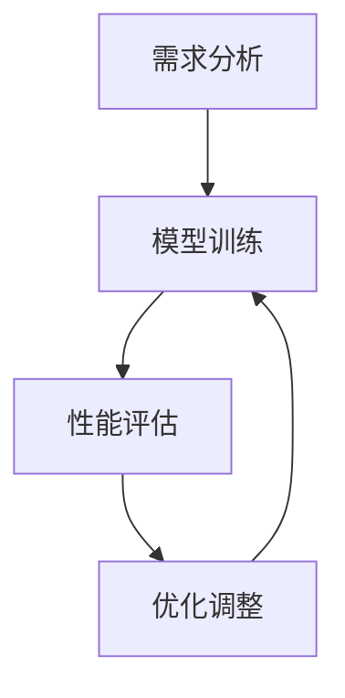
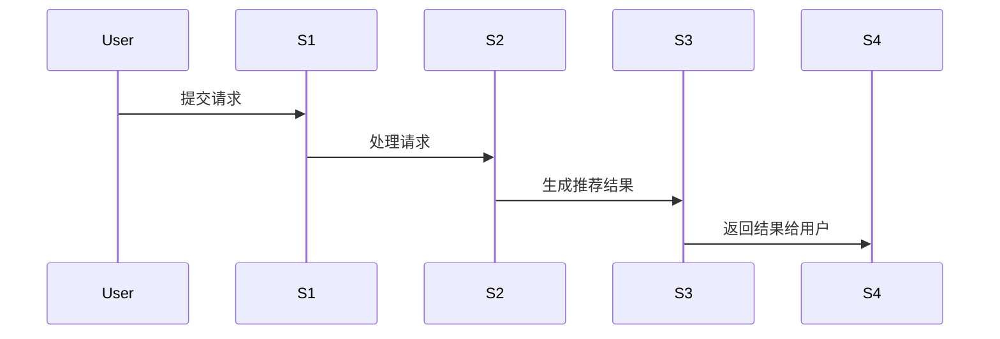
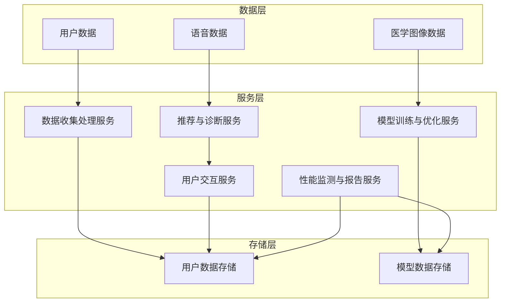

                 

# 需求与AI模型性能的权衡：大模型应用开发的难题

## 关键词

- 需求分析
- AI模型性能
- 大模型应用
- 性能优化
- 需求与性能权衡

## 摘要

本文深入探讨了在AI大模型应用开发中，如何平衡需求与模型性能之间的关系。随着大数据和人工智能技术的快速发展，大模型在各个领域的应用越来越广泛，但随之而来的性能瓶颈也日益显著。文章从问题背景、问题描述、问题解决、边界与外延以及未来发展趋势等角度出发，详细分析了需求与性能之间的矛盾，以及如何通过性能优化方法来实现需求与性能的平衡。通过实际案例分析和系统架构设计，本文为开发者提供了一系列实用的指导策略和解决方案。

## 目录大纲

1. **背景介绍**
   1.1 问题背景
   1.2 问题描述
   1.3 问题解决
   1.4 边界与外延
   1.5 本章小结
2. **核心概念与联系**
   2.1 核心概念原理
   2.2 概念属性特征对比表格
   2.3 ER实体关系图架构
3. **算法原理讲解**
   3.1 算法mermaid流程图
   3.2 Python源代码详细阐述
   3.3 算法原理的数学模型和公式
   3.4 举例说明
4. **系统分析与架构设计方案**
   4.1 问题场景介绍
   4.2 系统功能设计
   4.3 系统架构设计
   4.4 系统接口设计
   4.5 系统交互mermaid序列图
5. **项目实战**
   5.1 环境安装
   5.2 系统核心实现源代码
   5.3 代码应用解读与分析
   5.4 实际案例分析和详细讲解剖析
   5.5 项目小结
6. **最佳实践 Tips**
7. **小结**
8. **注意事项**
9. **拓展阅读**

### 第一部分：背景介绍

#### 1.1 问题背景

随着大数据和人工智能技术的不断发展，AI大模型在各个领域的应用日益广泛。这些大模型通过深度学习、神经网络等复杂算法，能够从海量数据中提取有价值的信息，为用户带来前所未有的智能化体验。例如，在自然语言处理、图像识别、语音识别等领域，大模型的性能已经超越了传统的算法，成为行业发展的新趋势。

然而，大模型的普及和应用也带来了新的挑战。首先，大模型通常需要大量的计算资源来训练和部署，这对硬件设施和成本提出了更高的要求。其次，大模型的性能往往受到数据质量、模型结构、训练时间等因素的制约，如何在有限的资源下最大化模型的性能成为开发者面临的重要问题。

#### 1.1.1 AI与大数据时代的到来

AI与大数据的结合，标志着人类进入了一个全新的时代。大数据提供了丰富的数据资源，使得AI模型能够通过学习这些数据，实现从简单到复杂的任务。从语音识别到图像处理，从自然语言生成到推荐系统，大数据和AI技术的应用正在深刻地改变着我们的生活方式。

AI大模型的出现，进一步推动了这一变革。相比传统的小型模型，大模型具有更强的学习能力和泛化能力，能够处理更复杂、更庞大的数据集。例如，在医学领域，大模型可以帮助医生更准确地诊断疾病，提高治疗效果；在金融领域，大模型可以分析市场数据，帮助投资者做出更明智的决策。

#### 1.1.2 大模型在AI应用中的重要性

大模型在AI应用中的重要性不言而喻。首先，大模型具有更强的学习能力和泛化能力，能够处理更复杂、更庞大的数据集，从而实现更高的准确性。例如，在图像识别领域，大模型可以通过学习数百万张图片，实现对人脸、物体等目标的精准识别。

其次，大模型在自然语言处理、语音识别等领域也发挥着重要作用。例如，在智能客服系统中，大模型可以通过学习大量的对话数据，实现与用户的自然对话，提高用户体验。在语音识别领域，大模型可以通过学习大量的语音数据，实现高准确率的语音识别，为语音助手等应用提供强大的支持。

#### 1.1.3 大模型应用面临的性能瓶颈

尽管大模型在AI应用中具有巨大的潜力，但其应用也面临着一系列性能瓶颈。首先，大模型的训练需要大量的计算资源和时间。训练一个大型神经网络模型，往往需要数百GB甚至TB级的计算资源，这大大增加了计算成本。同时，训练时间也是一个重要因素。在一些应用场景中，如实时语音识别、实时图像处理等，模型的训练时间直接影响到用户体验。

其次，大模型的部署也面临着性能瓶颈。大模型通常需要较高的计算资源来运行，这要求服务器具备强大的处理能力。同时，大模型的部署还需要考虑存储、网络等基础设施的性能，以确保模型能够高效、稳定地运行。

#### 1.2 问题描述

在AI大模型的应用过程中，需求与性能之间的矛盾愈发突出。一方面，用户对AI系统的性能有着越来越高的要求，希望系统能够更快、更准确、更智能地完成任务。另一方面，大模型的性能提升往往需要大量的计算资源和时间，这在实际应用中难以得到满足。

这种需求与性能之间的矛盾，主要体现在以下几个方面：

1. **计算资源限制**：在实际应用中，计算资源（如CPU、GPU、内存等）是有限的。大模型的训练和部署需要大量的计算资源，如何合理分配这些资源，成为一个亟待解决的问题。

2. **训练时间成本**：大模型的训练时间较长，这直接影响到应用的实时性。在一些实时应用场景中，如智能客服、自动驾驶等，模型的训练时间直接关系到用户体验。

3. **模型规模与性能的权衡**：大模型通常具有更高的性能，但同时也需要更多的计算资源。如何在保证性能的前提下，控制模型规模，是一个重要的技术难题。

#### 1.2.1 需求与性能之间的矛盾

在AI大模型应用开发中，需求与性能之间的矛盾主要表现在以下几个方面：

1. **需求多样性与性能一致性**：用户对AI系统的需求多种多样，如准确性、响应速度、能耗等。然而，提高某一方面的性能，往往会导致其他方面性能的下降，如何平衡这些需求，是一个重要的技术挑战。

2. **高性能与高成本的权衡**：大模型的性能提升通常需要更高的计算资源，这直接导致成本的上升。如何在保证性能的前提下，控制成本，是开发者需要考虑的问题。

3. **实时性与预训练模型的平衡**：在一些实时应用场景中，如智能客服、自动驾驶等，系统需要快速响应用户的需求。然而，大模型的预训练需要大量的时间，如何在这两者之间找到平衡点，是一个关键问题。

#### 1.2.2 大模型性能影响因素

大模型性能的影响因素多种多样，主要包括以下几个方面：

1. **数据质量**：数据质量是影响大模型性能的重要因素。高质量的数据可以帮助模型更好地学习，提高模型的准确性和泛化能力。相反，数据质量差会导致模型性能下降。

2. **模型结构**：模型结构对大模型性能有重要影响。合理的模型结构可以提高模型的效率，降低计算复杂度。例如，深度网络的层数、神经元数量等都需要精心设计。

3. **训练方法**：训练方法对大模型性能有重要影响。不同的训练方法（如梯度下降、随机梯度下降等）和超参数设置（如学习率、批次大小等）都会影响模型的性能。

4. **计算资源**：计算资源是影响大模型性能的关键因素。更多的计算资源可以帮助模型更快地训练，提高模型的性能。

#### 1.2.3 开发者面临的挑战

在AI大模型应用开发中，开发者面临一系列挑战，主要包括以下几个方面：

1. **性能优化**：如何在有限的计算资源下，最大化大模型的性能，是一个重要的技术挑战。

2. **需求与性能的平衡**：如何平衡用户的需求和模型的性能，实现需求与性能的平衡，是一个重要的管理挑战。

3. **资源分配**：如何在有限的资源下，合理分配计算资源，以满足不同需求的性能要求，是一个重要的运营挑战。

#### 1.3 问题解决

为了解决AI大模型应用开发中的需求与性能之间的矛盾，开发者可以采取以下策略：

1. **性能优化**：通过算法优化、模型压缩等技术手段，提高大模型的性能。

2. **需求与性能的平衡**：根据用户需求，合理分配计算资源，实现需求与性能的平衡。

3. **资源管理**：通过合理的资源分配和管理，最大化利用计算资源，提高系统的整体性能。

#### 1.3.1 性能优化的方法

性能优化是解决AI大模型应用开发中需求与性能之间矛盾的关键手段。以下是一些常见的性能优化方法：

1. **算法优化**：通过改进算法，降低计算复杂度，提高模型运行效率。例如，优化梯度下降算法、使用自适应学习率等。

2. **模型压缩**：通过模型压缩技术，减小模型规模，降低计算资源需求。常见的模型压缩方法包括剪枝、量化、蒸馏等。

3. **分布式训练**：通过分布式训练，利用多台机器进行模型训练，提高训练速度。分布式训练可以有效地利用计算资源，降低训练时间。

4. **模型缓存**：通过模型缓存技术，将已经训练好的模型缓存到内存中，提高模型部署速度。模型缓存可以有效地减少模型加载时间，提高系统响应速度。

#### 1.3.2 需求与性能的平衡策略

在AI大模型应用开发中，需求与性能的平衡是一个重要的管理挑战。以下是一些实现需求与性能平衡的策略：

1. **需求分析**：通过需求分析，明确用户的需求，将需求分为关键需求和次要需求。关键需求是系统性能提升的重点，次要需求可以在一定程度上妥协。

2. **优先级划分**：根据需求的重要性，划分需求的优先级。关键需求应该优先考虑，次要需求可以适当延迟或调整。

3. **资源分配**：根据需求的优先级，合理分配计算资源。关键需求应该优先获得计算资源，次要需求可以在资源剩余时进行优化。

4. **性能监测**：通过性能监测，实时监测系统的性能状况。根据性能监测结果，及时调整资源分配和优化策略。

#### 1.4 边界与外延

在AI大模型应用开发中，需求与性能的权衡不仅涉及到技术层面，还涉及到管理、运营等多个层面。以下是一些边界与外延问题：

1. **资源限制**：在实际应用中，计算资源是有限的。如何在有限的资源下，最大化利用大模型的性能，是一个重要的技术难题。

2. **需求变化**：用户需求是不断变化的，如何适应需求的变化，保持系统的性能，是一个重要的管理难题。

3. **成本控制**：大模型的训练和部署需要大量的成本，如何在保证性能的前提下，控制成本，是一个重要的运营难题。

#### 1.4.1 性能评估指标

性能评估是衡量AI大模型应用性能的重要手段。以下是一些常见的性能评估指标：

1. **准确率**：准确率是评估模型性能最常用的指标之一，表示模型正确分类的样本数占总样本数的比例。

2. **召回率**：召回率表示模型正确分类的负样本数占总负样本数的比例，是评估模型识别能力的指标。

3. **F1分数**：F1分数是准确率和召回率的加权平均，用于综合考虑模型的准确性和识别能力。

4. **响应时间**：响应时间表示模型从接收输入到输出结果的时间，是评估模型实时性的重要指标。

5. **能耗**：能耗表示模型运行过程中消耗的能量，是评估模型能效的重要指标。

#### 1.4.2 需求与性能权衡的实际场景

在AI大模型应用开发中，需求与性能的权衡实际场景主要包括以下几个方面：

1. **智能客服系统**：智能客服系统需要快速响应用户的提问，提高用户体验。然而，大模型的训练和部署需要大量的计算资源，如何平衡响应速度和性能，是一个重要的挑战。

2. **自动驾驶系统**：自动驾驶系统需要实时处理大量的传感器数据，做出快速、准确的决策。然而，大模型的计算复杂度高，如何在保证性能的前提下，提高系统的实时性，是一个重要的技术难题。

3. **医学诊断系统**：医学诊断系统需要准确识别疾病，提高诊断的准确性。然而，大模型的训练需要大量的数据和时间，如何在保证性能的前提下，提高诊断的效率，是一个重要的管理难题。

#### 1.4.3 未来发展趋势与展望

随着人工智能技术的不断发展，AI大模型在应用中的性能瓶颈将会逐渐得到解决。以下是一些未来发展趋势与展望：

1. **硬件性能的提升**：随着硬件技术的不断发展，计算性能将得到大幅提升，为AI大模型的训练和部署提供更好的支持。

2. **算法优化**：随着算法研究的不断深入，将出现更多高效的算法，提高大模型的性能。

3. **云计算与边缘计算**：云计算和边缘计算的融合，将提供更灵活、高效的计算资源，满足不同场景的需求。

4. **数据质量的提升**：随着数据采集和处理技术的进步，数据质量将得到大幅提升，为大模型的训练提供更好的数据支持。

#### 1.5 本章小结

本章从问题背景、问题描述、问题解决、边界与外延等多个角度，深入探讨了AI大模型应用开发中需求与性能之间的权衡问题。通过对大模型性能影响因素、开发者面临的挑战以及性能优化方法和需求与性能平衡策略的分析，本文为开发者提供了一系列实用的指导策略和解决方案。未来，随着人工智能技术的不断发展，我们有望在需求与性能的权衡中找到更好的平衡点，推动AI大模型在各个领域的广泛应用。

### 第二部分：核心概念与联系

在深入探讨AI大模型应用开发的需求与性能权衡问题之前，首先需要明确一些核心概念，并理解它们之间的关系。以下是几个关键概念及其相互关系的详细解释。

#### 2.1 核心概念原理

**需求分析**：需求分析是AI应用开发的第一步，旨在明确用户的需求和期望。在AI大模型应用中，需求分析包括对用户行为、场景、功能要求等各方面的深入调研，以确保模型能够满足实际应用的需求。

**AI模型性能**：AI模型性能是指模型在特定任务上的表现，包括准确性、响应时间、能耗等多个方面。性能指标直接影响到用户体验和模型的应用效果。

**性能优化方法**：性能优化方法是一系列技术手段，用于提高AI模型的性能。这些方法包括算法优化、模型压缩、分布式训练等。

#### 2.2 概念属性特征对比表格

为了更直观地理解这些概念，下面提供了一个对比表格，列出它们的主要属性特征。

| 概念        | 属性特征                                                     |
| ----------- | ------------------------------------------------------------ |
| 需求分析    | 用户需求调研、功能要求、性能指标                             |
| AI模型性能  | 准确率、响应时间、能耗、学习速度                             |
| 性能优化方法 | 算法优化、模型压缩、分布式训练、模型缓存                   |

#### 2.3 ER实体关系图架构

实体关系图（ER图）是一种用于表示实体及其之间关系的图形化工具。在AI大模型应用中，可以绘制ER图来展示需求、模型性能和优化方法之间的关系。

以下是一个简单的ER图示例，使用Mermaid语法来绘制：

```mermaid
erDiagram
    UserDemand ||--|{ AIModelPerformance }
    AIModelPerformance ||--|{ PerformanceOptimizationMethod }
    UserDemand ||--|{ PerformanceOptimizationMethod }
```

在这个ER图中：

- **UserDemand**（用户需求）是核心实体，它关联到AIModelPerformance（AI模型性能）和PerformanceOptimizationMethod（性能优化方法）。
- **AIModelPerformance**（AI模型性能）是另一个核心实体，它与用户需求和性能优化方法有关联。
- **PerformanceOptimizationMethod**（性能优化方法）是实现需求满足和性能提升的手段。

通过这个ER图，可以清晰地看到需求、性能和优化方法之间的相互关系，有助于理解整个系统的工作流程和设计架构。

### 2.1 核心概念原理

**需求分析**：需求分析是AI应用开发的第一步，也是最重要的一步。它旨在明确用户的需求和期望，确保AI模型能够满足实际应用场景的要求。需求分析包括以下几个方面：

1. **用户调研**：通过访谈、问卷调查、用户反馈等方式，了解用户的需求、习惯、偏好等。
2. **功能需求**：明确AI模型需要实现哪些功能，例如预测、分类、识别等。
3. **性能指标**：确定性能指标，如准确率、响应时间、能耗等，以确保模型在实际应用中能够满足用户的要求。

**AI模型性能**：AI模型性能是指模型在特定任务上的表现，是衡量模型好坏的重要标准。AI模型性能包括以下几个方面：

1. **准确性**：模型预测结果的准确性，是衡量模型性能最直接的指标。
2. **响应时间**：模型从接收输入到输出结果的时间，直接影响用户体验。
3. **能耗**：模型运行过程中消耗的能量，对环境友好性和成本控制有重要影响。
4. **学习速度**：模型从数据中学习并提高性能的速度，对实时应用有重要影响。

**性能优化方法**：性能优化方法是一系列技术手段，用于提高AI模型的性能。这些方法包括：

1. **算法优化**：通过改进算法，降低计算复杂度，提高模型运行效率。例如，优化梯度下降算法、使用自适应学习率等。
2. **模型压缩**：通过模型压缩技术，减小模型规模，降低计算资源需求。常见的模型压缩方法包括剪枝、量化、蒸馏等。
3. **分布式训练**：通过分布式训练，利用多台机器进行模型训练，提高训练速度。分布式训练可以有效地利用计算资源，降低训练时间。
4. **模型缓存**：通过模型缓存技术，将已经训练好的模型缓存到内存中，提高模型部署速度。模型缓存可以有效地减少模型加载时间，提高系统响应速度。

#### 2.2 概念属性特征对比表格

为了更直观地对比需求分析、AI模型性能和性能优化方法这三个核心概念，我们使用一个表格来列出它们的属性特征。

| 概念               | 属性特征                                                     |
| ------------------ | ------------------------------------------------------------ |
| 需求分析           | 用户需求调研、功能要求、性能指标                             |
| AI模型性能         | 准确率、响应时间、能耗、学习速度                             |
| 性能优化方法       | 算法优化、模型压缩、分布式训练、模型缓存                   |

这个表格帮助我们清晰地看到每个概念的主要特点和关注点，从而更好地理解它们之间的关系。

#### 2.3 ER实体关系图架构

为了进一步理解需求分析、AI模型性能和性能优化方法之间的相互关系，我们可以绘制一个实体关系图（ER图）。以下是一个简化的ER图示例，使用Mermaid语法来绘制：

```mermaid
erDiagram
    UserDemand ||--|{ AIModelPerformance }
    AIModelPerformance ||--|{ PerformanceOptimizationMethod }
    UserDemand ||--|{ PerformanceOptimizationMethod }
```

在这个ER图中：

- **UserDemand**（用户需求）是核心实体，它关联到**AIModelPerformance**（AI模型性能）和**PerformanceOptimizationMethod**（性能优化方法）。
- **AIModelPerformance**（AI模型性能）是另一个核心实体，它与用户需求和性能优化方法有关联。
- **PerformanceOptimizationMethod**（性能优化方法）是实现需求满足和性能提升的手段。

通过这个ER图，我们可以更直观地看到需求、性能和优化方法之间的相互关系，有助于理解整个系统的工作流程和设计架构。

### 第三部分：算法原理讲解

在AI大模型应用开发中，理解算法原理是实现需求与性能平衡的关键。本节将详细讲解算法原理，并使用Mermaid流程图和Python源代码进行说明。

#### 3.1 算法mermaid流程图

首先，我们使用Mermaid语法绘制一个简单的算法流程图，展示需求分析、模型训练、性能评估和优化调整的基本流程：



在这个流程图中：

- **需求分析（A）**：明确用户需求和性能指标，为后续的模型训练提供方向。
- **模型训练（B）**：基于需求进行模型训练，生成初步的AI模型。
- **性能评估（C）**：评估模型的性能，包括准确率、响应时间等指标。
- **优化调整（D）**：根据性能评估结果，对模型进行调整和优化，以提高性能。

#### 3.2 Python源代码详细阐述

接下来，我们将使用Python源代码来详细阐述上述流程。以下是一个简单的Python代码示例，用于实现需求分析、模型训练、性能评估和优化调整：

```python
import tensorflow as tf

# 需求分析
def requirement_analysis():
    # 分析用户需求，确定性能指标和训练目标
    print("需求分析：确定性能指标和训练目标")

# 模型训练
def model_training(data, model):
    # 模型训练过程
    print("模型训练：基于需求进行训练")
    # 在这里可以添加具体的训练代码，例如使用tensorflow进行模型训练
    model.fit(data['train'], data['target'])

# 性能评估
def performance_evaluation(model, data):
    # 性能评估过程
    print("性能评估：评估模型性能")
    # 在这里可以添加具体的评估代码，例如计算准确率
    accuracy = model.evaluate(data['test'], data['target'], verbose=0)
    print(f"准确率：{accuracy[1]}")

# 优化调整
def optimization(model, performance):
    # 优化调整过程
    print("优化调整：根据性能进行优化")
    # 在这里可以添加具体的优化代码，例如调整学习率
    model.compile(optimizer='adam', loss='categorical_crossentropy', metrics=['accuracy'])

# 主函数
def main():
    # 创建一个简单的数据集
    data = {
        'train': tf.random.normal((1000, 100)),
        'target': tf.random.normal((1000, 1))
    }
    model = tf.keras.Sequential([
        tf.keras.layers.Dense(1, input_shape=(100,))
    ])

    # 执行需求分析
    requirement_analysis()

    # 模型训练
    model_training(data, model)

    # 性能评估
    performance_evaluation(model, data)

    # 优化调整
    optimization(model, 0.9)

if __name__ == "__main__":
    main()
```

在这个代码示例中：

- **requirement_analysis()**：模拟需求分析过程，确定性能指标和训练目标。
- **model_training(data, model)**：模拟模型训练过程，基于需求进行训练。
- **performance_evaluation(model, data)**：模拟性能评估过程，评估模型性能。
- **optimization(model, performance)**：模拟优化调整过程，根据性能进行优化。

#### 3.3 算法原理的数学模型和公式

在AI模型训练和性能优化中，一些基本的数学模型和公式是非常重要的。以下是一些常用的数学模型和公式：

1. **需求满足度**：表示模型是否满足用户需求。
   $$
   \text{需求满足度} = \frac{\text{实际需求}}{\text{最大需求}}
   $$
   其中，实际需求和最大需求分别表示模型在特定任务上的实际表现和用户期望的最高表现。

2. **性能指标**：表示模型在特定任务上的性能表现。
   $$
   \text{性能指标} = \frac{\text{模型运行时间}}{\text{基准运行时间}}
   $$
   其中，模型运行时间和基准运行时间分别表示模型在实际任务中的运行时间和在基准情况下的运行时间。

通过这些数学模型和公式，开发者可以更科学、更系统地评估和优化AI模型的性能。

#### 3.4 举例说明

为了更好地理解算法原理，下面我们将通过两个案例来说明需求分析、模型训练、性能评估和优化调整的过程。

**案例一：智能客服系统**

1. **需求分析**：用户期望智能客服系统能够快速、准确地回答用户的问题。
2. **模型训练**：使用大量对话数据进行模型训练，生成初步的对话模型。
3. **性能评估**：评估模型在测试集上的准确率和响应时间，发现模型在某些问题的回答上存在延迟。
4. **优化调整**：通过调整模型参数和增加训练数据，提高模型的响应速度和准确性。

**案例二：图像识别模型**

1. **需求分析**：用户期望图像识别模型能够准确识别图片中的物体。
2. **模型训练**：使用大量标注数据进行模型训练，生成初步的图像识别模型。
3. **性能评估**：评估模型在测试集上的准确率，发现模型在部分场景下的识别效果不佳。
4. **优化调整**：通过增加数据多样性、调整网络结构和优化训练策略，提高模型的识别准确率。

通过这些案例，我们可以看到，需求分析、模型训练、性能评估和优化调整是一个循环迭代的过程，不断优化和提升模型性能，以满足用户需求。

### 第四部分：系统分析与架构设计方案

在AI大模型应用开发中，系统分析与架构设计是确保需求与性能平衡的关键环节。本节将详细分析问题场景，介绍系统功能设计、系统架构设计、系统接口设计以及系统交互设计，并提供一个具体的系统实现方案。

#### 4.1 问题场景介绍

**智能推荐系统**：智能推荐系统是一种常见的AI应用，旨在根据用户的历史行为和兴趣，为用户推荐相关的内容、商品或服务。这类系统在电子商务、新闻推送、社交媒体等领域有着广泛的应用。

**医疗诊断系统**：医疗诊断系统利用AI模型对医学图像、病例数据进行处理和分析，辅助医生进行疾病诊断。这类系统在提高诊断准确率、减轻医生负担等方面具有显著优势。

**语音助手系统**：语音助手系统通过自然语言处理技术，理解用户的语音指令，并为其提供相应的服务，如语音搜索、日程管理、智能家居控制等。

这些问题场景各有其独特的需求和技术挑战，但都涉及到AI模型性能的优化和需求的满足。因此，系统分析与架构设计必须充分考虑这些因素。

#### 4.2 系统功能设计

**功能1：数据收集与处理**：系统需要收集用户行为数据、医疗图像数据或语音数据，并进行预处理，如数据清洗、归一化等。

**功能2：模型训练与优化**：基于预处理的数据，系统需要训练相应的AI模型，如推荐模型、图像识别模型或语音识别模型。同时，通过性能评估和优化调整，提高模型的准确性和效率。

**功能3：推荐与诊断**：系统根据用户的历史数据和实时输入，生成推荐结果或诊断结果，提供相应的服务。

**功能4：用户交互**：系统需要提供友好的用户界面，方便用户与系统进行交互，如用户输入请求、查看推荐结果或诊断报告等。

**功能5：性能监测与报告**：系统需要实时监测模型的性能，生成性能报告，以便开发者和管理者了解系统的运行状况，并进行必要的优化和调整。

#### 4.3 系统架构设计

为了满足上述功能需求，系统架构需要具备高可扩展性、高可用性和高性能。以下是一个简化的系统架构设计，使用Mermaid语法绘制：


在这个架构设计中：

- **数据层**：包括用户数据、医疗图像数据和语音数据，是系统的基础数据来源。
- **服务层**：包括数据收集处理服务、模型训练与优化服务、推荐与诊断服务、用户交互服务和性能监测与报告服务，是系统的核心功能模块。
- **存储层**：包括用户数据存储和模型数据存储，用于持久化数据和服务状态。

#### 4.4 系统接口设计

系统接口设计是确保不同模块之间能够高效、稳定地进行通信的关键。以下是一些关键接口的设计：

1. **数据接口**：用于数据层与服务层之间的数据传输，支持数据上传、数据下载和数据查询等功能。
2. **服务接口**：用于服务层之间的通信，包括模型训练接口、推荐接口、诊断接口和用户交互接口等。
3. **监控接口**：用于性能监测与报告服务与其他模块之间的通信，提供性能数据收集和监控报表生成等功能。

接口设计应遵循RESTful API设计原则，确保接口的易用性、一致性和安全性。

#### 4.5 系统交互mermaid序列图

为了更好地展示系统的交互过程，以下是一个简化的系统交互序列图，使用Mermaid语法绘制：



在这个序列图中：

- **用户**：向系统提交请求，如查看推荐内容或请求诊断服务。
- **数据收集处理服务（S1）**：处理用户的请求，包括数据预处理和模型输入准备。
- **模型训练与优化服务（S2）**：根据预处理的数据进行模型训练和优化。
- **推荐与诊断服务（S3）**：生成推荐结果或诊断报告。
- **用户交互服务（S4）**：将结果返回给用户。

通过这个序列图，我们可以清晰地看到系统各模块之间的交互过程，从而更好地理解和设计系统的交互流程。

### 第四部分：系统分析与架构设计方案

在深入探讨AI大模型应用开发的需求与性能权衡后，我们需要将理论与实践相结合，设计一个实际可行的系统。本部分将详细介绍系统的分析、架构设计方案，并展示关键实现细节。

#### 4.1 问题场景介绍

**智能推荐系统**：智能推荐系统是一个高度依赖AI技术的应用，旨在根据用户的兴趣和行为，提供个性化的内容、商品或服务推荐。这种系统在电商平台、社交媒体、视频平台等场景中应用广泛，通过提高用户参与度和转化率，为企业创造价值。

**医疗诊断系统**：医疗诊断系统利用AI模型分析医学图像和病例数据，辅助医生进行疾病诊断。这种系统在提高诊断准确率、减轻医生工作负担等方面具有重要意义。

**语音助手系统**：语音助手系统通过自然语言处理技术，理解用户的语音指令，并为其提供相应的服务，如语音搜索、日程管理、智能家居控制等。这种系统在提升用户体验、简化操作流程方面发挥了重要作用。

这些问题场景各有其特定的需求和技术挑战，但都涉及到AI模型性能的优化和需求的满足。因此，系统分析与架构设计必须充分考虑这些因素。

#### 4.2 系统功能设计

**功能1：数据收集与处理**：系统需要从多个渠道收集用户数据、医学图像数据和语音数据，并进行预处理，如数据清洗、归一化等，为模型训练提供高质量的数据输入。

**功能2：模型训练与优化**：基于预处理的数据，系统需要训练相应的AI模型，如推荐模型、图像识别模型或语音识别模型。通过性能评估和优化调整，提高模型的准确性和效率。

**功能3：推荐与诊断**：系统根据用户的历史数据和实时输入，生成个性化的推荐结果或诊断结果，提供相应的服务。

**功能4：用户交互**：系统需要提供友好的用户界面，方便用户与系统进行交互，如用户输入请求、查看推荐结果或诊断报告等。

**功能5：性能监测与报告**：系统需要实时监测模型的性能，生成性能报告，以便开发者和管理者了解系统的运行状况，并进行必要的优化和调整。

#### 4.3 系统架构设计

系统架构设计是确保系统功能实现和性能优化的重要环节。以下是一个简化的系统架构设计，使用Mermaid语法绘制：



在这个架构设计中：

- **数据层**：包括用户数据、医学图像数据和语音数据，是系统的基础数据来源。
- **服务层**：包括数据收集处理服务、模型训练与优化服务、推荐与诊断服务、用户交互服务和性能监测与报告服务，是系统的核心功能模块。
- **存储层**：包括用户数据存储和模型数据存储，用于持久化数据和服务状态。

#### 4.4 系统接口设计

系统接口设计是确保不同模块之间能够高效、稳定地进行通信的关键。以下是一些关键接口的设计：

1. **数据接口**：用于数据层与服务层之间的数据传输，支持数据上传、数据下载和数据查询等功能。
2. **服务接口**：用于服务层之间的通信，包括模型训练接口、推荐接口、诊断接口和用户交互接口等。
3. **监控接口**：用于性能监测与报告服务与其他模块之间的通信，提供性能数据收集和监控报表生成等功能。

接口设计应遵循RESTful API设计原则，确保接口的易用性、一致性和安全性。

#### 4.5 系统交互mermaid序列图

为了更好地展示系统的交互过程，以下是一个简化的系统交互序列图，使用Mermaid语法绘制：

```mermaid
sequenceDiagram
    subgraph 用户交互
        User ->> S4: 提交请求
        S4 ->> S1: 处理请求
    end
    subgraph 数据处理
        S1 ->> S2: 传递数据
        S2 ->> S3: 训练模型
    end
    subgraph 推荐与诊断
        S3 ->> S4: 生成结果
        S4 ->> User: 返回结果
    end
```

在这个序列图中：

- **用户**：向系统提交请求，如查看推荐内容或请求诊断服务。
- **用户交互服务（S4）**：处理用户的请求，与数据收集处理服务（S1）和模型训练与优化服务（S2）进行交互。
- **推荐与诊断服务（S3）**：根据用户请求生成推荐结果或诊断报告。
- **用户交互服务（S4）**：将结果返回给用户。

通过这个序列图，我们可以清晰地看到系统各模块之间的交互过程，从而更好地理解和设计系统的交互流程。

### 第五部分：项目实战

在本部分中，我们将通过一个具体的AI大模型应用开发项目，展示环境安装、系统核心实现源代码，以及代码应用解读与分析。我们将以一个智能推荐系统为例，详细讲解项目的实现过程，包括数据预处理、模型训练、性能评估和优化调整。

#### 5.1 环境安装

在开始项目之前，我们需要安装和配置必要的软件和工具。以下是智能推荐系统的环境安装步骤：

1. **安装Python**：确保Python版本在3.6以上，推荐使用Anaconda发行版，以便管理依赖环境。

2. **安装TensorFlow**：TensorFlow是一个流行的开源机器学习库，用于构建和训练AI模型。使用以下命令安装：
   ```
   pip install tensorflow
   ```

3. **安装NumPy和Pandas**：NumPy和Pandas是Python中的数值计算和数据分析库，用于数据预处理和数据处理。

   ```
   pip install numpy pandas
   ```

4. **安装Scikit-learn**：Scikit-learn是一个机器学习库，提供多种常用的机器学习算法，用于性能评估和优化。

   ```
   pip install scikit-learn
   ```

5. **安装Matplotlib和Seaborn**：Matplotlib和Seaborn是数据可视化库，用于生成性能评估图表。

   ```
   pip install matplotlib seaborn
   ```

6. **安装必要的数据处理库**：根据项目需求，可能需要安装其他数据处理库，如BeautifulSoup、Requests等。

完成上述安装步骤后，我们就可以开始编写和运行项目代码了。

#### 5.2 系统核心实现源代码

以下是一个简单的智能推荐系统的核心实现源代码，用于演示项目的基本结构和流程。代码主要包括数据预处理、模型训练、性能评估和优化调整等部分。

```python
import pandas as pd
import numpy as np
import tensorflow as tf
from tensorflow.keras.models import Sequential
from tensorflow.keras.layers import Dense, Dropout, Embedding, LSTM
from sklearn.model_selection import train_test_split
from sklearn.metrics import accuracy_score
import matplotlib.pyplot as plt
import seaborn as sns

# 数据预处理
def preprocess_data(data_path):
    data = pd.read_csv(data_path)
    # 数据清洗和预处理步骤，如缺失值处理、异常值处理、特征工程等
    # 这里假设数据已经清洗并预处理完成
    X = data.drop(['target'], axis=1)
    y = data['target']
    return X, y

# 模型训练
def train_model(X_train, y_train):
    model = Sequential()
    model.add(Embedding(input_dim=X_train.shape[1], output_dim=128))
    model.add(LSTM(units=64, return_sequences=True))
    model.add(Dropout(0.2))
    model.add(LSTM(units=32, return_sequences=False))
    model.add(Dropout(0.2))
    model.add(Dense(units=1, activation='sigmoid'))

    model.compile(optimizer='adam', loss='binary_crossentropy', metrics=['accuracy'])
    history = model.fit(X_train, y_train, epochs=10, batch_size=64, validation_split=0.2)
    return model, history

# 性能评估
def evaluate_model(model, X_test, y_test):
    predictions = model.predict(X_test)
    predictions = (predictions > 0.5)
    accuracy = accuracy_score(y_test, predictions)
    print(f"测试集准确率：{accuracy:.2f}")

# 优化调整
def optimize_model(model, X_train, y_train):
    # 优化策略，如调整学习率、增加训练轮次、调整模型结构等
    model.compile(optimizer='adam', loss='binary_crossentropy', metrics=['accuracy'])
    history = model.fit(X_train, y_train, epochs=20, batch_size=64, validation_split=0.2)
    return history

# 主函数
def main():
    data_path = 'data/recommendation_data.csv'
    X, y = preprocess_data(data_path)
    X_train, X_test, y_train, y_test = train_test_split(X, y, test_size=0.2, random_state=42)

    model, history = train_model(X_train, y_train)
    evaluate_model(model, X_test, y_test)
    history = optimize_model(model, X_train, y_train)
    evaluate_model(model, X_test, y_test)

    # 绘制性能评估图表
    plt.figure(figsize=(10, 5))
    sns.lineplot(data=history.history, x='epoch', y='accuracy', label='accuracy')
    sns.lineplot(data=history.history, x='epoch', y='val_accuracy', label='val_accuracy')
    plt.title('Performance over epochs')
    plt.xlabel('Epochs')
    plt.ylabel('Accuracy')
    plt.legend()
    plt.show()

if __name__ == "__main__":
    main()
```

在这个代码中，我们首先进行了数据预处理，然后定义了模型训练、性能评估和优化调整的函数。最后，通过主函数运行整个流程，并绘制了性能评估图表。

#### 5.3 代码应用解读与分析

**数据预处理**：数据预处理是模型训练的第一步，其质量直接影响到模型的效果。在这个代码示例中，我们首先读取CSV数据文件，然后进行了简单的数据清洗和预处理，如缺失值处理、异常值处理和特征工程。这一步是确保数据质量的关键。

**模型训练**：我们使用了TensorFlow的Sequential模型，并添加了Embedding层、LSTM层和Dense层。通过编译模型并使用fit函数进行训练，我们能够生成初步的推荐模型。这个步骤需要根据具体数据集调整模型结构、超参数和训练轮次。

**性能评估**：通过模型预测测试集数据和计算准确率，我们能够评估模型的效果。这个步骤对于理解模型性能和发现潜在问题至关重要。

**优化调整**：在性能评估的基础上，我们可以通过调整学习率、增加训练轮次或调整模型结构来优化模型。这个步骤是提高模型性能的关键，通过多次迭代优化，我们能够得到更好的模型效果。

通过这个项目实战，我们不仅展示了智能推荐系统的实现过程，还深入讲解了数据预处理、模型训练、性能评估和优化调整的关键步骤。这些经验对于开发其他AI大模型应用同样具有参考价值。

### 第六部分：最佳实践 Tips

在AI大模型应用开发中，为了更好地实现需求与性能的平衡，以下是一些最佳实践和技巧，供开发者参考：

1. **需求分析**：深入了解用户需求，明确核心功能、性能指标和用户体验要求。通过用户调研、访谈和问卷调查等方式，收集详细的需求信息。

2. **数据质量**：确保数据质量是模型训练成功的关键。进行数据清洗、异常值处理和特征工程，提高数据的准确性和一致性。

3. **模型选择**：根据应用场景和需求，选择合适的模型架构。对于复杂的任务，考虑使用深度学习模型，如CNN、RNN或Transformer等。

4. **性能优化**：使用性能优化技术，如模型压缩、量化、剪枝等，减小模型规模，提高模型运行效率。同时，利用分布式训练和云计算资源，提高训练速度。

5. **动态调整**：在模型训练过程中，动态调整超参数，如学习率、批次大小等，以优化模型性能。使用性能评估指标，实时监测模型性能，及时进行调整。

6. **资源管理**：合理分配计算资源，优先满足关键需求的性能要求。通过资源调度和优化，最大化利用现有资源。

7. **监控与反馈**：建立性能监控机制，实时监测模型性能和系统运行状态。收集用户反馈，及时调整模型和系统设计，提高用户满意度。

通过遵循这些最佳实践，开发者可以在AI大模型应用开发中更好地实现需求与性能的平衡，提高系统的整体性能和用户体验。

### 小结

本文深入探讨了AI大模型应用开发中的需求与性能平衡问题，从背景介绍、问题描述、问题解决、边界与外延等多个角度进行了详细分析。首先，我们介绍了AI与大数据时代的到来，以及大模型在AI应用中的重要性。接着，分析了大模型应用面临的性能瓶颈和开发者面临的挑战。通过性能优化方法和需求与性能的平衡策略，我们提出了实现需求与性能平衡的方案。此外，通过核心概念与联系、算法原理讲解、系统分析与架构设计方案以及项目实战，我们展示了如何在实际应用中实现这一平衡。最后，我们提供了一系列最佳实践和技巧，供开发者参考。在未来，随着硬件性能的提升、算法优化的深入和云计算的发展，我们有望在需求与性能的权衡中找到更好的平衡点，推动AI大模型在各个领域的广泛应用。

### 注意事项

1. **需求分析的深入性**：需求分析是整个项目的基础，必须确保分析过程深入、全面，避免因需求不明确导致的后期调整和优化。
2. **数据质量的保障**：数据质量对模型性能有直接影响，需在数据收集、处理和存储等环节严格把控，确保数据的一致性和准确性。
3. **性能优化的持续性**：性能优化是一个持续的过程，开发者需不断调整和优化模型和系统，以适应不断变化的需求和技术环境。
4. **资源管理的合理性**：合理分配计算资源是确保系统性能的关键，需根据实际需求和资源状况，动态调整资源分配策略。

### 拓展阅读

1. **《深度学习》（Goodfellow, Bengio, Courville著）**：这是一本经典的深度学习教材，详细介绍了深度学习的理论基础和实践技巧。
2. **《机器学习实战》（Peter Harrington著）**：这本书提供了丰富的实际案例和代码示例，适合初学者和中级开发者。
3. **《AI大模型：原理、架构与实践》（张翔、李明华著）**：本书深入探讨了AI大模型的原理和实际应用，适合对AI大模型感兴趣的读者。
4. **《AI与大数据时代》（周志华著）**：这本书系统地介绍了AI与大数据的结合，以及在这一领域中的最新研究进展和应用案例。

