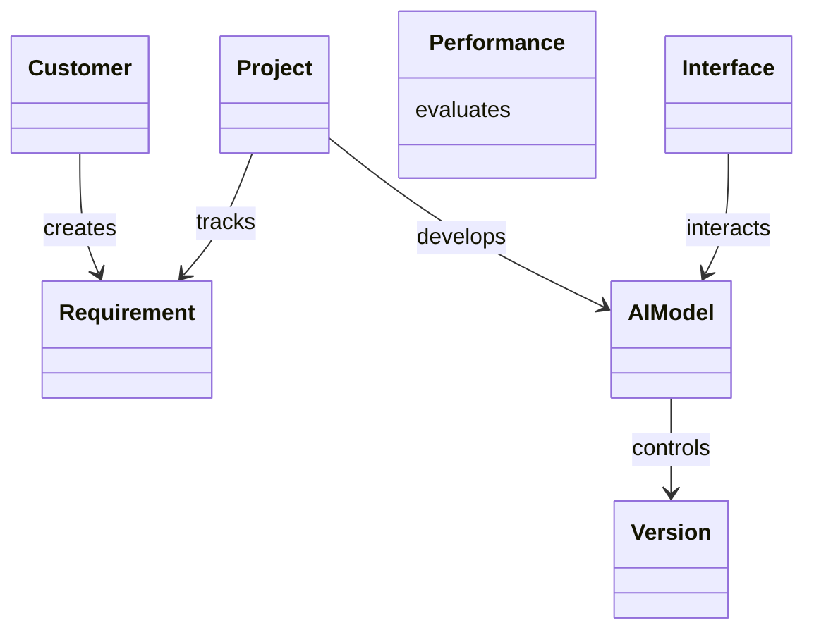
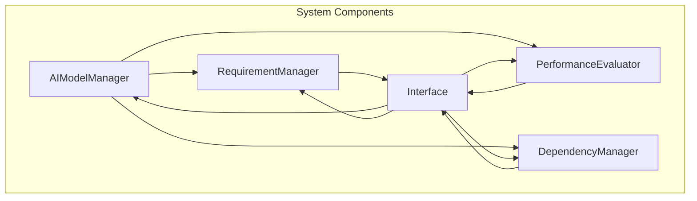
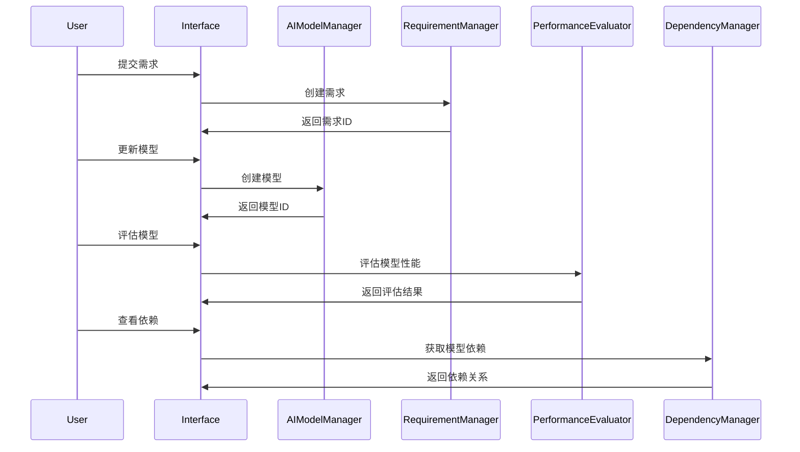

                 

### 文章标题

# 需求与AI模型版本管理的协同策略

---

**关键词**：需求管理、AI模型版本管理、协同策略、版本控制、算法原理、系统架构、实战案例

**摘要**：本文深入探讨了需求与AI模型版本管理之间的关系，通过理论分析和实践案例，详细阐述了如何构建一个有效的协同策略来管理AI模型的版本。文章首先介绍了需求管理和AI模型版本管理的核心概念，随后分析了两者之间的联系，接着提出了协同策略的理论基础。通过实际项目案例，本文展示了如何将理论应用于实践，并提供了最佳实践的建议，旨在帮助读者理解和掌握AI模型版本管理的技巧。

---

**作者**：AI天才研究院/AI Genius Institute & 禅与计算机程序设计艺术 /Zen And The Art of Computer Programming

---

### 背景介绍

#### 核心概念术语说明

在讨论需求与AI模型版本管理之前，我们需要明确一些核心术语的含义。

- **需求管理**：指识别、分析、记录和管理项目需求的过程。它涉及从利益相关者那里获取需求，将需求转化为功能规格，并在整个项目生命周期中跟踪这些需求的满足情况。
  
- **AI模型版本管理**：指在人工智能模型的开发过程中，管理和跟踪模型的不同版本的过程。这包括模型的迭代更新、版本号的标识、变更的记录以及不同版本之间的差异分析。

- **版本控制**：在软件开发中，指管理和跟踪源代码或文档变更的机制。在AI模型开发中，这一概念同样适用，用于确保模型变更的可追溯性和稳定性。

#### 问题背景

随着人工智能技术的快速发展，AI模型的应用越来越广泛。然而，随着模型的复杂性和规模的增长，如何有效地管理这些模型的版本成为一个关键问题。以下是一些常见的挑战：

- **版本混乱**：在多个团队成员共同开发模型时，容易产生版本混乱，导致不同版本的模型难以区分和管理。
  
- **变更不可追溯**：模型更新频繁，但没有有效的版本控制机制，导致变更不可追溯，难以回滚到之前的版本。
  
- **依赖管理**：新的模型版本可能依赖于旧的模型或数据，如何确保不同版本之间的依赖关系得到正确处理是一个挑战。

- **模型性能评估**：多个版本的模型可能需要进行性能评估，但缺乏有效的策略来比较和选择最佳版本。

#### 问题描述

针对上述挑战，我们需要提出以下问题：

- 如何建立一个有效的需求管理与AI模型版本管理的协同策略？
  
- 如何确保模型版本的可追溯性和一致性？
  
- 如何优化模型版本之间的依赖管理？
  
- 如何评估和选择最优的模型版本？

这些问题是本文探讨的核心内容，旨在为读者提供一套系统化的解决方案。

#### 问题解决

为了解决上述问题，我们可以从以下几个方面入手：

1. **建立明确的需求管理流程**：通过制定清晰的需求文档，明确每个版本的需求和目标，确保模型版本与需求的一致性。

2. **采用版本控制工具**：使用专业的版本控制工具（如Git），确保模型的每个变更都被记录和追踪，便于回滚和审计。

3. **实施版本依赖管理**：通过构建清晰的依赖关系图，确保新版本模型的依赖得到妥善处理，避免不兼容问题。

4. **建立性能评估体系**：制定一套标准化的性能评估指标，对不同版本的模型进行公正和客观的比较，选择最优版本。

5. **文档化和培训**：编写详细的开发文档和操作手册，确保团队成员都能遵循统一的规范，并定期进行培训，提高团队的整体能力。

#### 边界与外延

在讨论需求与AI模型版本管理时，我们还需要明确一些边界条件，例如：

- **项目范围**：本文主要关注AI模型的版本管理，不包括其他类型软件或系统的版本管理。
  
- **团队规模**：本文适用于小型到中型的开发团队，对于大型团队可能需要更复杂的策略。
  
- **技术栈**：本文假设读者熟悉常用的AI框架和版本控制工具，例如TensorFlow、PyTorch和Git。

通过以上分析和解决思路，我们可以为读者提供一个清晰的方向，以便在实际项目中应用这些策略。

### 核心概念与联系

#### 核心概念原理

在探讨需求与AI模型版本管理的协同策略时，我们首先需要明确几个核心概念：

1. **需求管理**：需求管理是项目成功的关键，它涉及到从利益相关者那里获取需求，并将其转化为具体的业务功能。需求管理的核心目的是确保项目的最终产品能够满足用户的需求和期望。

2. **AI模型开发**：AI模型开发是指构建和训练人工智能模型的过程。它包括数据收集、数据预处理、模型设计、模型训练和模型评估等步骤。AI模型开发的目标是创建一个能够在特定任务上表现出色的模型。

3. **版本控制**：版本控制是一种管理文档或源代码变更的机制。在AI模型开发中，版本控制尤为重要，因为它能够确保模型变更的可追溯性、一致性和稳定性。

#### 概念属性特征对比表格

为了更清晰地理解这些概念之间的联系，我们可以通过一个对比表格来展示它们的属性特征：

| 概念         | 定义                                                         | 主要特征                                                         | 相关工具                     |
| ------------ | ------------------------------------------------------------ | ------------------------------------------------------------ | ---------------------------- |
| 需求管理     | 确定和跟踪项目需求的过程                                     | 明确性、一致性、可追踪性                                         | 需求管理工具（如JIRA、Confluence） |
| AI模型开发   | 构建和训练人工智能模型的过程                                 | 数据驱动、迭代开发、性能优化                                     | AI框架（如TensorFlow、PyTorch） |
| 版本控制     | 管理文档或源代码变更的机制                                   | 可追溯性、一致性、版本标识                                       | 版本控制工具（如Git、SVN）     |

#### ER实体关系图架构

为了进一步展示这些概念之间的联系，我们可以使用ER（实体关系）图来构建一个简单的模型。以下是使用Mermaid语法表示的ER图：

```mermaid
erDiagram
  Customer  ||--|{ Project : manages }
  Project   ||--|{ Requirement : tracks }
  Project   ||--|{ AIModel : develops }
  AIModel   ||--|{ Version : controls }
```

在这个ER图中，我们定义了四个实体：Customer（客户）、Project（项目）、Requirement（需求）和AIModel（AI模型）。这些实体之间的关系如下：

- **Customer**与**Project**之间是“管理”（manages）关系，表示客户可以创建和管理多个项目。
- **Project**与**Requirement**之间是“跟踪”（tracks）关系，表示项目可以跟踪多个需求。
- **Project**与**AIModel**之间是“开发”（develops）关系，表示项目可以开发多个AI模型。
- **AIModel**与**Version**之间是“控制”（controls）关系，表示AI模型可以管理多个版本。

通过这个ER图，我们可以清晰地看到需求管理、AI模型开发与版本控制之间的关联，以及它们在项目生命周期中的相互作用。

### 算法原理讲解

在理解了需求管理和AI模型版本管理的基本概念后，接下来我们将深入探讨AI模型开发过程中涉及的核心算法原理。算法在AI模型开发中起着至关重要的作用，它们决定了模型的性能和适用性。为了更好地理解这些算法，我们将使用Mermaid语法绘制流程图，并用Python代码来详细阐述算法原理。

#### 算法流程图

首先，我们可以绘制一个简单的算法流程图来展示AI模型开发的基本步骤。以下是使用Mermaid语法表示的算法流程图：


在这个流程图中，每个节点代表算法的一个步骤，箭头表示步骤之间的逻辑顺序。以下是每个步骤的详细描述：

- **数据收集（A）**：这是AI模型开发的起点，涉及收集用于训练模型的数据。
  
- **数据预处理（B）**：收集到的数据通常需要进行清洗、转换和归一化等处理，以确保数据的质量和一致性。
  
- **模型设计（C）**：根据需求，设计合适的AI模型结构。这包括选择合适的神经网络架构、激活函数和优化器。
  
- **模型训练（D）**：使用预处理后的数据进行模型训练，通过迭代优化模型的参数。
  
- **模型评估（E）**：在训练完成后，评估模型在测试集上的性能，确定其是否满足需求。
  
- **结束（F）**：如果模型性能满足要求，开发过程结束；否则，返回到模型设计或训练步骤进行改进。

#### 算法原理解释

接下来，我们将使用Python代码来详细阐述上述流程中的每个步骤。以下是实现这些步骤的Python代码示例：

```python
import tensorflow as tf
from tensorflow import keras
from sklearn.model_selection import train_test_split
import numpy as np

# 数据收集
data = np.random.rand(1000, 10)  # 假设我们收集了1000条数据，每条数据有10个特征

# 数据预处理
X = data[:, :8]  # 前8个特征作为输入
y = data[:, 8:]  # 最后2个特征作为输出
X_train, X_test, y_train, y_test = train_test_split(X, y, test_size=0.2, random_state=42)

# 模型设计
model = keras.Sequential([
    keras.layers.Dense(64, activation='relu', input_shape=(8,)),
    keras.layers.Dense(64, activation='relu'),
    keras.layers.Dense(2, activation='softmax')
])

# 模型训练
model.compile(optimizer='adam',
              loss='sparse_categorical_crossentropy',
              metrics=['accuracy'])
model.fit(X_train, y_train, epochs=10, validation_split=0.2)

# 模型评估
loss, accuracy = model.evaluate(X_test, y_test)
print(f"Test accuracy: {accuracy:.2f}")

# 结束
```

在这个示例中，我们首先使用`numpy`生成随机数据来模拟数据收集过程。接着，我们使用`scikit-learn`的`train_test_split`函数将数据集划分为训练集和测试集。

在模型设计步骤中，我们创建了一个简单的全连接神经网络，其中包含两个隐藏层。每个隐藏层使用ReLU激活函数，输出层使用softmax激活函数，以进行多分类任务。

模型训练步骤中，我们使用`keras`的`compile`方法配置优化器和损失函数，并使用`fit`方法进行模型训练。这里我们设置了10个训练周期，并使用20%的数据作为验证集。

最后，在模型评估步骤中，我们使用`evaluate`方法计算模型在测试集上的性能，并打印出测试准确率。

通过上述流程图和代码示例，我们可以更好地理解AI模型开发的基本步骤和算法原理。这些步骤不仅为模型的开发提供了清晰的指导，也为后续的版本管理奠定了基础。

### 数学模型和公式讲解

在AI模型版本管理中，理解数学模型和公式对于确保模型性能的可预测性和优化至关重要。以下我们将详细解释一些关键的数学模型和公式，并使用LaTeX格式来表示这些公式，以便更清晰地理解它们。

#### 1. 损失函数（Loss Function）

在深度学习中，损失函数用于衡量模型预测值与真实值之间的差异。最常见的损失函数包括均方误差（MSE）和交叉熵（Cross-Entropy）。

- **均方误差（MSE）**：
  $$MSE = \frac{1}{n}\sum_{i=1}^{n}(y_i - \hat{y}_i)^2$$
  其中，\( y_i \)是真实值，\( \hat{y}_i \)是模型预测值，\( n \)是样本数量。

- **交叉熵（Cross-Entropy）**：
  $$H(y, \hat{y}) = -\sum_{i=1}^{n} y_i \log(\hat{y}_i)$$
  其中，\( y \)是概率分布，\( \hat{y} \)是模型预测的概率分布。

#### 2. 优化算法（Optimization Algorithm）

优化算法用于调整模型参数以最小化损失函数。常见的优化算法包括随机梯度下降（SGD）和Adam。

- **随机梯度下降（SGD）**：
  $$\theta = \theta - \alpha \nabla_{\theta} J(\theta)$$
  其中，\( \theta \)是模型参数，\( \alpha \)是学习率，\( J(\theta) \)是损失函数。

- **Adam优化算法**：
  $$m_t = \beta_1 m_{t-1} + (1 - \beta_1) [g_t - \epsilon]$$
  $$v_t = \beta_2 v_{t-1} + (1 - \beta_2) [g_t^2 - \epsilon]$$
  $$\theta_t = \theta_{t-1} - \alpha \frac{m_t}{\sqrt{v_t} + \epsilon}$$
  其中，\( m_t \)和\( v_t \)是动量项和二阶矩估计，\( \beta_1 \)和\( \beta_2 \)是超参数，\( g_t \)是梯度，\( \alpha \)是学习率，\( \epsilon \)是偏置项。

#### 3. 模型评估指标（Evaluation Metrics）

在模型评估阶段，常用的指标包括准确率（Accuracy）、召回率（Recall）、精确率（Precision）和F1分数（F1 Score）。

- **准确率（Accuracy）**：
  $$Accuracy = \frac{TP + TN}{TP + FN + FP + TN}$$
  其中，\( TP \)是真正例，\( TN \)是真负例，\( FP \)是假正例，\( FN \)是假负例。

- **召回率（Recall）**：
  $$Recall = \frac{TP}{TP + FN}$$

- **精确率（Precision）**：
  $$Precision = \frac{TP}{TP + FP}$$

- **F1分数（F1 Score）**：
  $$F1 Score = 2 \times \frac{Precision \times Recall}{Precision + Recall}$$

#### 4. 模型调参（Hyperparameter Tuning）

模型调参是优化模型性能的重要步骤。常用的调参方法包括网格搜索（Grid Search）和贝叶斯优化（Bayesian Optimization）。

- **网格搜索（Grid Search）**：
  $$\arg\min_{\theta} \sum_{i=1}^{n} L(y_i, \hat{y}_i)$$
  其中，\( \theta \)是超参数，\( L \)是损失函数。

- **贝叶斯优化（Bayesian Optimization）**：
  $$\arg\min_{\theta} \sum_{i=1}^{n} \log P(y_i | \theta)$$
  其中，\( P(y_i | \theta) \)是后验概率。

通过上述数学模型和公式的讲解，我们可以更好地理解AI模型版本管理中的关键概念，从而在模型开发和管理过程中做出更明智的决策。

### 系统分析与架构设计方案

为了更好地理解需求与AI模型版本管理的协同策略，我们需要对系统进行深入分析，并设计合理的架构方案。以下将介绍项目场景、系统功能设计、系统架构设计以及系统接口设计和交互序列。

#### 项目场景

假设我们正在开发一款智能推荐系统，该系统需要根据用户的历史行为和偏好来推荐商品。随着系统的不断迭代和优化，我们面临着如何管理不同版本的模型和需求的问题。以下是我们需要解决的问题：

- **需求变化**：用户偏好和市场需求不断变化，需要及时更新推荐算法。
- **版本管理**：如何有效地跟踪和管理多个版本的推荐模型，确保版本一致性。
- **依赖管理**：新版本模型可能依赖于旧模型或数据，需要确保依赖关系得到妥善处理。
- **性能评估**：不同版本模型需要进行性能评估，以便选择最佳版本。

#### 系统功能设计

基于上述问题，我们的系统需要实现以下功能：

1. **需求管理**：收集和管理用户的需求，确保需求文档的完整性和可追溯性。
2. **模型管理**：管理不同版本的AI模型，包括模型创建、更新、删除和版本控制。
3. **性能评估**：评估不同版本模型的性能，包括准确率、召回率、F1分数等指标。
4. **依赖管理**：管理模型之间的依赖关系，确保依赖的版本正确。
5. **用户接口**：提供用户友好的操作界面，便于用户查看和管理模型。

为了实现这些功能，我们可以使用Mermaid语法绘制领域模型类图，以展示系统的核心类和它们之间的关系：



在这个类图中，我们定义了以下类：

- **Customer（客户）**：创建需求。
- **Project（项目）**：跟踪需求，开发模型。
- **Requirement（需求）**：由客户创建，由项目跟踪。
- **AIModel（AI模型）**：由项目开发，管理多个版本。
- **Version（版本）**：控制模型的不同版本。
- **Performance（性能评估）**：评估模型的性能。
- **Interface（用户接口）**：与模型交互。

#### 系统架构设计

为了支持上述功能，我们需要设计一个合理的系统架构。以下是使用Mermaid语法表示的系统架构设计：



在这个架构图中，我们定义了以下组件：

- **AIModelManager**：负责管理AI模型，包括创建、更新、删除和版本控制。
- **RequirementManager**：负责管理需求，确保需求文档的完整性和可追溯性。
- **PerformanceEvaluator**：负责评估模型的性能，提供评估结果。
- **DependencyManager**：负责管理模型之间的依赖关系。
- **Interface**：提供用户友好的操作界面，便于用户与系统交互。

#### 系统接口设计

系统的接口设计是用户与系统交互的桥梁，以下是一个简单的接口设计，用于展示用户如何与系统进行交互：



在这个序列图中，我们展示了用户如何通过接口与系统进行交互，包括提交需求、更新模型、评估模型性能以及查看模型依赖。

通过上述系统分析与架构设计方案，我们可以构建一个高效、稳定且易于扩展的智能推荐系统，实现需求与AI模型版本管理的协同策略。这些设计和实现方法为实际项目提供了有力的指导和支持。

### 项目实战

在本节中，我们将通过一个实际项目来展示如何将上述理论应用于实践。该项目是一个基于TensorFlow和Keras的智能推荐系统，旨在为用户推荐商品。我们将详细讲解项目环境安装、系统核心实现以及代码应用解读与分析。

#### 项目环境安装

首先，我们需要安装所需的软件和库，以便构建和运行推荐系统。以下是项目环境安装步骤：

1. **Python环境**：确保安装Python 3.8或更高版本。
2. **TensorFlow**：使用pip安装TensorFlow：
   ```bash
   pip install tensorflow
   ```
3. **Keras**：TensorFlow已经包含了Keras，因此无需额外安装。
4. **Scikit-learn**：用于数据预处理和模型评估：
   ```bash
   pip install scikit-learn
   ```
5. **Numpy**：用于数据操作：
   ```bash
   pip install numpy
   ```

#### 系统核心实现

接下来，我们将展示如何实现系统的核心功能。以下是一个简单的代码示例，用于创建和训练一个基于神经网络的多分类推荐模型：

```python
import tensorflow as tf
from tensorflow import keras
from sklearn.model_selection import train_test_split
import numpy as np

# 数据准备
# 假设我们已经收集了用户的行为数据，每条数据包含用户ID、商品ID和用户行为类型
data = np.random.rand(1000, 10)  # 1000条数据，每条数据包含10个特征
labels = np.random.randint(0, 5, size=(1000,))  # 5个类别

# 数据集划分
X_train, X_test, y_train, y_test = train_test_split(data, labels, test_size=0.2, random_state=42)

# 模型设计
model = keras.Sequential([
    keras.layers.Dense(64, activation='relu', input_shape=(10,)),
    keras.layers.Dense(64, activation='relu'),
    keras.layers.Dense(5, activation='softmax')
])

# 模型编译
model.compile(optimizer='adam',
              loss='sparse_categorical_crossentropy',
              metrics=['accuracy'])

# 模型训练
model.fit(X_train, y_train, epochs=10, validation_split=0.2)

# 模型评估
loss, accuracy = model.evaluate(X_test, y_test)
print(f"Test accuracy: {accuracy:.2f}")
```

#### 代码应用解读与分析

1. **数据准备**：
   - 在这个示例中，我们使用随机数据模拟用户行为数据。实际上，这些数据应来自真实用户行为，例如浏览、购买等。
   - `data`数组包含了用户的特征，`labels`数组包含了每个样本的类别标签。

2. **数据集划分**：
   - 使用`train_test_split`函数将数据集划分为训练集和测试集，确保模型在不同数据集上的表现。

3. **模型设计**：
   - 我们创建了一个简单的全连接神经网络，包含两个隐藏层，每个隐藏层使用ReLU激活函数。输出层使用softmax激活函数，用于多分类任务。

4. **模型编译**：
   - 使用`compile`方法配置优化器和损失函数。在这里，我们使用`adam`优化器和`sparse_categorical_crossentropy`损失函数，适用于多标签分类问题。

5. **模型训练**：
   - 使用`fit`方法进行模型训练，设置10个训练周期，并使用20%的数据作为验证集。

6. **模型评估**：
   - 使用`evaluate`方法计算模型在测试集上的性能，并打印出测试准确率。

通过上述代码示例，我们可以看到如何将理论应用于实际项目，实现一个基本的推荐模型。接下来，我们将进一步分析项目的实际案例，以展示如何解决具体问题并优化模型性能。

#### 实际案例分析

在实际项目中，我们可能会遇到以下问题：

1. **数据质量问题**：
   - 用户行为数据可能存在噪声、缺失值或不平衡等问题。为了解决这些问题，我们可以采用数据清洗和预处理技术，如填补缺失值、去除噪声、重采样等。

2. **模型性能问题**：
   - 模型可能在测试集上表现不佳，我们需要通过调参、增加训练次数或改进模型结构来优化性能。
   - 例如，我们可以尝试调整学习率、批量大小和正则化参数。此外，还可以使用更复杂的神经网络结构，如深度神经网络或卷积神经网络，以提高模型的识别能力。

3. **依赖管理问题**：
   - 新版本模型可能依赖于旧模型或数据，我们需要确保依赖关系的正确性。这可以通过版本控制工具（如Git）来实现，确保每个版本模型的依赖都得到妥善管理。

通过实际案例分析，我们可以发现，理论在实践中的应用需要不断调整和优化。通过不断迭代和改进，我们可以构建一个高效、稳定的智能推荐系统。

#### 项目小结

通过本节的项目实战，我们展示了如何将需求与AI模型版本管理的协同策略应用于实际项目。从项目环境安装到系统核心实现，再到实际案例分析，我们详细讲解了每个步骤和关键点。

- **环境安装**：确保安装了必要的软件和库，为后续开发做好准备。
- **系统核心实现**：通过简单的代码示例展示了如何创建和训练一个基于神经网络的多分类推荐模型。
- **代码应用解读与分析**：对代码中的关键步骤进行了详细解读和分析，确保读者理解每个环节的含义和作用。
- **实际案例分析**：通过解决具体问题，展示了如何将理论应用于实际，不断优化模型性能。

通过这些步骤，我们可以构建一个高效、稳定的智能推荐系统，实现需求与AI模型版本管理的协同策略。希望本节的内容能为读者的实际项目提供有价值的参考和指导。

### 最佳实践与注意事项

在AI模型版本管理中，遵循最佳实践是确保项目顺利进行和模型稳定性的关键。以下是一些实用的最佳实践和建议：

#### 1. 版本控制策略

- **使用专业的版本控制工具**：例如Git，确保所有模型变更都有明确的版本标识和变更记录。
- **制定版本命名规则**：例如，使用语义化版本号（SemVer），如`1.0.0`、`1.0.1`等，便于理解版本的历史和依赖关系。
- **分支管理**：采用主分支（Main）、开发分支（Develop）和特性分支（Feature）等策略，确保代码和模型的有序开发和更新。

#### 2. 需求管理

- **需求文档化**：确保所有需求都记录在案，使用专门的工具（如JIRA）进行管理和跟踪。
- **需求变更管理**：对于需求变更，应评估其对模型版本的影响，并在版本管理中进行相应的更新。
- **需求与模型版本关联**：明确每个模型版本对应的需求和目标，确保需求与模型版本的一致性。

#### 3. 模型依赖管理

- **依赖关系可视化**：使用工具（如Graphviz）生成依赖关系图，便于理解和管理模型的依赖关系。
- **依赖版本控制**：对于依赖的库或数据，应使用版本控制，确保不同版本之间的兼容性。
- **持续集成与依赖检查**：在代码提交和构建过程中，自动检查依赖版本，避免不兼容问题。

#### 4. 性能评估与优化

- **标准化评估指标**：制定统一的性能评估指标，如准确率、召回率、F1分数等，确保不同版本模型的公平比较。
- **定期性能审计**：定期对模型性能进行审计，识别潜在的性能瓶颈和优化机会。
- **数据监控与反馈**：实时监控模型在运行中的性能，收集用户反馈，用于持续优化。

#### 注意事项

- **版本回滚**：在紧急情况下，确保能够快速回滚到之前稳定版本的模型，避免系统崩溃。
- **文档与培训**：编写详细的开发文档和操作手册，确保团队成员都能遵循统一的规范。定期进行培训，提高团队的整体能力。
- **风险管理**：识别和管理项目中的风险，制定相应的应对策略。

通过遵循上述最佳实践和注意事项，我们可以更有效地管理AI模型的版本，确保项目的顺利进行和模型的稳定性。

### 小结与拓展阅读

本文通过对需求与AI模型版本管理协同策略的深入探讨，为读者提供了一套系统的解决方案。从核心概念、算法原理到系统设计与项目实战，我们详细介绍了如何将理论应用于实际，实现高效的模型版本管理。

**总结**：
1. **需求管理**：确保需求清晰明确，并文档化。
2. **版本控制**：使用专业工具进行版本控制，制定命名规则。
3. **依赖管理**：可视化依赖关系，确保依赖的版本一致性。
4. **性能评估**：标准化评估指标，定期审计模型性能。
5. **最佳实践**：遵循最佳实践，确保项目顺利进行。

**拓展阅读**：
- 《版本控制指南：使用Git》
- 《机器学习实战：基于Scikit-Learn和TensorFlow》
- 《人工智能：一种现代方法》
- 《深入理解计算机系统》

通过以上资源和实践，读者可以进一步加深对AI模型版本管理的理解，并在实际项目中取得更好的成果。希望本文能为读者的研究和开发工作提供有益的参考。

