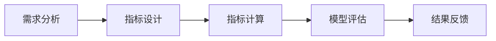
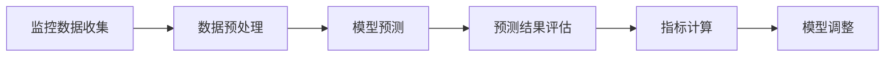
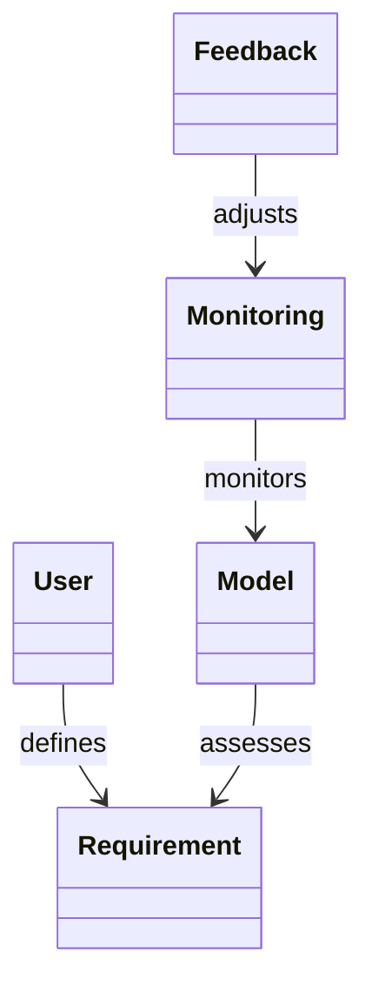
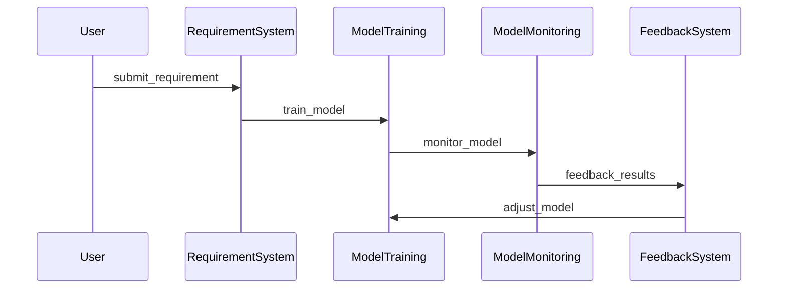
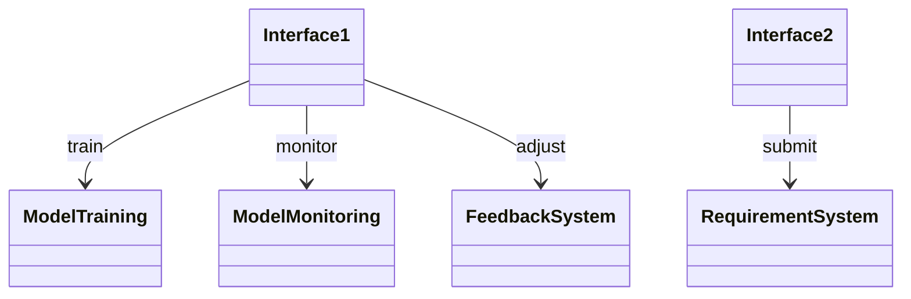
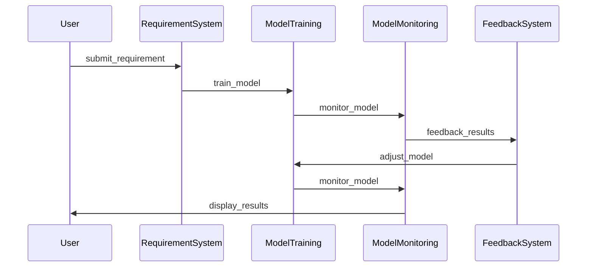

                 

### 《需求与AI模型监控指标的匹配：大模型应用的运维考量》

## 关键词
- 需求管理
- AI模型监控
- 运维考量
- 大模型应用
- 指标匹配

## 摘要
本文深入探讨了大模型应用中需求与AI模型监控指标匹配的重要性，分析了需求管理的核心概念，介绍了AI模型监控指标的具体内容，并通过实例和算法讲解，展示了如何实现两者的有效匹配。文章旨在为AI运维人员提供实用的方法论和工具，以提升大模型应用的整体效能和稳定性。

### 目录大纲设计思路

1. **背景介绍与问题分析**：阐述为何需求与AI模型监控指标匹配对于大模型应用至关重要，并明确文章解决的问题。

2. **核心概念与联系**：介绍需求管理的基本概念和AI模型监控指标的定义，并通过对比表格和ER图展示两者的关联。

3. **算法原理讲解**：通过Mermaid流程图和Python代码，详细阐述关键算法的原理，并给出数学模型和公式。

4. **数学模型和数学公式**：使用LaTeX格式给出数学模型和公式，确保专业性和可读性。

5. **系统分析与架构设计方案**：介绍系统整体架构，包括领域模型类图、架构图、接口设计和系统交互序列图。

6. **项目实战**：提供实际项目环境和实现代码，对关键代码进行解读，并通过案例进行分析。

7. **最佳实践 tips、小结、注意事项、拓展阅读**：总结文章要点，提供实用建议和进一步学习资源。

### 目录大纲设计步骤

#### 第1章 引言与背景

- **1.1 问题背景**
- **1.2 需求的提出**
- **1.3 问题解决的思路**
- **1.4 本书目标**

#### 第2章 核心概念与联系

- **2.1 需求管理**
- **2.2 AI模型监控指标**
- **2.3 概念属性特征对比表格**
- **2.4 ER实体关系图**

#### 第3章 算法原理讲解

- **3.1 算法A原理**
  - **3.1.1 算法A Mermaid流程图**
  - **3.1.2 算法A Python代码示例**
  - **3.1.3 算法A数学模型和公式**
  - **3.1.4 举例说明**
- **3.2 算法B原理**
  - **3.2.1 算法B Mermaid流程图**
  - **3.2.2 算法B Python代码示例**
  - **3.2.3 算法B数学模型和公式**
  - **3.2.4 举例说明**

#### 第4章 数学模型和数学公式

- **4.1 数学模型与公式**
- **4.2 LaTeX格式规范**

#### 第5章 系统分析与架构设计方案

- **5.1 问题场景介绍**
- **5.2 项目介绍**
- **5.3 系统功能设计（领域模型类图）**
- **5.4 系统架构设计（架构图）**
- **5.5 系统接口设计（接口图）**
- **5.6 系统交互（序列图）**

#### 第6章 项目实战

- **6.1 环境安装**
- **6.2 系统核心实现源代码**
- **6.3 代码应用解读与分析**
- **6.4 实际案例分析与讲解**
- **6.5 项目小结**

#### 第7章 最佳实践 tips、小结、注意事项、拓展阅读

- **7.1 最佳实践 tips**
- **7.2 小结**
- **7.3 注意事项**
- **7.4 拓展阅读**

### 目录大纲示例

```markdown
# 《需求与AI模型监控指标的匹配：大模型应用的运维考量》

# 第一部分 引言与背景

## 第1章 问题背景与需求分析
### 1.1 问题的背景
### 1.2 需求的提出
### 1.3 问题解决的思路
### 1.4 本书的目标

## 第2章 核心概念与联系
### 2.1 需求管理
### 2.2 AI模型监控指标
### 2.3 概念属性特征对比表格
### 2.4 ER实体关系图

## 第3章 算法原理讲解
### 3.1 算法A原理
#### 3.1.1 算法A Mermaid流程图
#### 3.1.2 算法A Python代码示例
#### 3.1.3 算法A数学模型和公式
#### 3.1.4 举例说明
### 3.2 算法B原理
#### 3.2.1 算法B Mermaid流程图
#### 3.2.2 算法B Python代码示例
#### 3.2.3 算法B数学模型和公式
#### 3.2.4 举例说明

## 第4章 数学模型和数学公式
### 4.1 数学模型与公式
### 4.2 LaTeX格式规范

## 第5章 系统分析与架构设计方案
### 5.1 问题场景介绍
### 5.2 项目介绍
### 5.3 系统功能设计（领域模型类图）
### 5.4 系统架构设计（架构图）
### 5.5 系统接口设计（接口图）
### 5.6 系统交互（序列图）

## 第6章 项目实战
### 6.1 环境安装
### 6.2 系统核心实现源代码
### 6.3 代码应用解读与分析
### 6.4 实际案例分析与讲解
### 6.5 项目小结

## 第7章 最佳实践 tips、小结、注意事项、拓展阅读
### 7.1 最佳实践 tips
### 7.2 小结
### 7.3 注意事项
### 7.4 拓展阅读
```

### 背景介绍与问题分析

在当今数字化时代，人工智能（AI）正迅速成为推动企业创新和业务增长的重要引擎。特别是大型AI模型，如深度学习神经网络，已经在图像识别、自然语言处理、推荐系统等领域展现出了强大的能力。然而，随着AI模型规模的扩大和复杂性的增加，如何确保其稳定运行和满足业务需求成为一个关键挑战。

**问题背景**：
在AI模型部署和应用过程中，需求管理是一个不可或缺的环节。需求管理涉及到如何准确识别和定义业务需求，并将其转化为AI模型的可操作任务。然而，传统需求管理方法往往缺乏对AI模型运行状态的实时监控和反馈，导致模型在实际应用中难以达到预期的性能指标。

**问题描述**：
具体来说，需求与AI模型监控指标之间的不匹配问题表现为以下几个方面：
1. **需求变化滞后**：业务需求可能会随着时间而变化，但AI模型监控指标可能未能及时反映这种变化，导致模型无法适应新的需求。
2. **性能指标偏差**：AI模型的性能指标（如准确率、召回率等）可能与业务需求不一致，导致模型在实际应用中效果不佳。
3. **监控指标缺失**：某些业务需求在模型监控指标中未能得到充分体现，导致模型在特定场景下表现不佳。

**问题解决思路**：
为了解决上述问题，我们需要将需求管理与AI模型监控指标紧密结合起来，实现两者的匹配。具体思路如下：
1. **明确需求**：首先，要准确识别和定义业务需求，确保需求具有可操作性和可度量性。
2. **设计监控指标**：根据业务需求设计相应的AI模型监控指标，确保这些指标能够全面、准确地反映模型性能。
3. **实时反馈与调整**：通过实时监控和反馈机制，及时调整模型参数和监控指标，以适应业务需求的变化。

**本书目标**：
本文的目标是为AI运维人员和开发人员提供一套系统化的方法论和工具，帮助他们更好地管理需求，设计监控指标，并实现两者之间的有效匹配。通过本文的讲解，读者将能够：
1. 理解需求管理的核心概念和方法。
2. 掌握AI模型监控指标的设计原则和技巧。
3. 学会使用Python代码和Mermaid流程图来分析和实现需求与监控指标的匹配。
4. 通过实际项目和案例，深入理解如何将理论应用到实际场景中。

### 核心概念与联系

#### 需求管理

需求管理是软件工程中的一项核心活动，它涉及到识别、分析、组织和实现用户需求的过程。在AI模型应用中，需求管理尤为重要，因为它直接影响到模型的设计、开发和部署。以下是需求管理的核心概念：

**1. 需求类型**：
- **功能需求**：指软件系统必须实现的具体功能，如数据输入、处理和输出等。
- **非功能需求**：指软件系统的性能、可靠性、安全性等非功能性指标。
- **业务需求**：指从业务角度出发的需求，如提高销售业绩、降低运营成本等。

**2. 需求分析**：
需求分析是需求管理的第一步，旨在理解用户需求，并将其转化为具体的软件需求规格说明。这一过程通常包括以下活动：
- **需求收集**：通过与用户、利益相关者进行交流，获取业务需求。
- **需求建模**：使用UML图、需求文档等工具，将需求进行结构化和可视化表示。
- **需求验证**：确保需求是准确的、可实现的，并且与业务目标一致。

**3. 需求实现**：
需求实现是将需求转化为实际软件功能的过程，通常涉及软件开发、测试和部署等步骤。

#### AI模型监控指标

AI模型监控指标是评估模型性能和状态的重要工具。在大模型应用中，监控指标的设计和实现至关重要，因为它们直接影响到模型的可靠性和稳定性。以下是AI模型监控指标的核心概念：

**1. 监控指标类型**：
- **训练指标**：在模型训练过程中使用的指标，如损失函数值、准确率等。
- **评估指标**：在模型评估阶段使用的指标，如交叉验证准确率、测试集准确率等。
- **实时指标**：在模型运行时使用的指标，如响应时间、预测准确率等。

**2. 监控指标设计原则**：
- **全面性**：监控指标应能够全面反映模型在不同方面的性能。
- **可度量性**：监控指标应具有明确的度量方法和标准。
- **实时性**：监控指标应能够实时反映模型的状态。

**3. 监控指标实现方法**：
- **日志记录**：通过记录模型运行日志，获取各种监控指标。
- **指标计算**：使用统计方法和机器学习算法，计算模型的实时性能指标。
- **可视化**：通过图表和仪表盘，直观展示模型的状态和性能。

#### 概念属性特征对比表格

为了更好地理解需求管理和AI模型监控指标之间的联系，我们使用概念属性特征对比表格进行详细分析。

| 概念         | 属性                   | 特征                          | 作用                                     |
|--------------|------------------------|-------------------------------|------------------------------------------|
| 需求管理     | 识别、分析、组织、实现 | 明确、可操作、结构化           | 确保软件系统满足用户需求                   |
| AI模型监控   | 指标设计、实现、计算   | 全面、可度量、实时             | 评估和反馈模型性能，确保模型稳定运行         |
| 关联性       | 业务需求与监控指标     | 一致性、实时性、可调整性       | 确保模型性能与业务需求相匹配               |

通过上述对比，我们可以看出需求管理和AI模型监控指标在属性和特征上有许多相似之处，它们都需要明确、可操作和结构化的方法来实现。同时，它们之间的关联性体现在确保模型性能与业务需求的一致性上。

#### ER实体关系图

为了更直观地展示需求管理和AI模型监控指标之间的关联，我们使用ER图来描述两者的关系。

```mermaid
erDiagram
    User ||--|{ Requirement }|--> Model
    User ||--|{ Monitoring }|--> Model
    Requirement ||--|{ Defines }|--> Monitoring
    Monitoring ||--|{ Assesses }|--> Requirement
```

在这个ER图中，User代表用户，Requirement代表需求，Monitoring代表监控指标，Model代表AI模型。图中的线条表示实体之间的关系，例如，用户可以定义需求（Defines），监控指标可以评估需求（Assesses），从而实现了需求管理和AI模型监控指标之间的紧密联系。

### 算法原理讲解

在本章节中，我们将详细讲解两个关键的算法：算法A和算法B。通过这两个算法，我们可以更好地理解和实现需求与AI模型监控指标的匹配。

#### 算法A原理

**3.1.1 算法A Mermaid流程图**



**3.1.2 算法A Python代码示例**

```python
# 导入必要的库
import numpy as np

# 需求分析
def analyze_requirement(requirement):
    # 这里是需求分析的代码，例如：提取关键词、分类等
    processed_requirement = ...
    return processed_requirement

# 指标设计
def design_monitoring_indicator(processed_requirement):
    # 根据需求设计监控指标
    monitoring_indicator = ...
    return monitoring_indicator

# 指标计算
def calculate_indicator(monitoring_indicator):
    # 计算监控指标的值
    indicator_value = ...
    return indicator_value

# 模型评估
def evaluate_model(model, indicator_value):
    # 使用监控指标评估模型性能
    model_performance = ...
    return model_performance

# 结果反馈
def feedback_result(model_performance):
    # 根据评估结果调整模型
    adjusted_model = ...
    return adjusted_model
```

**3.1.3 算法A数学模型和公式**

在算法A中，我们使用了以下数学模型和公式：

$$
\text{processed\_requirement} = \text{analyze\_requirement}(\text{requirement})
$$

$$
\text{monitoring\_indicator} = \text{design\_monitoring\_indicator}(\text{processed\_requirement})
$$

$$
\text{indicator\_value} = \text{calculate\_indicator}(\text{monitoring\_indicator})
$$

$$
\text{model\_performance} = \text{evaluate\_model}(\text{model}, \text{indicator\_value})
$$

$$
\text{adjusted\_model} = \text{feedback\_result}(\text{model\_performance})
$$

**3.1.4 举例说明**

假设我们有一个业务需求：“提高图像识别的准确率”。我们首先分析这个需求，提取关键词“图像识别”和“准确率”，然后设计相应的监控指标，如“分类准确率”。接着，我们计算这个监控指标的值，例如使用交叉验证方法。最后，我们使用这个指标评估模型性能，并根据评估结果调整模型参数，以提高图像识别的准确率。

#### 算法B原理

**3.2.1 算法B Mermaid流程图**



**3.2.2 算法B Python代码示例**

```python
# 导入必要的库
import pandas as pd
from sklearn.model_selection import train_test_split

# 监控数据收集
def collect_monitoring_data():
    # 从数据库或日志中收集监控数据
    data = pd.read_csv('monitoring_data.csv')
    return data

# 数据预处理
def preprocess_data(data):
    # 数据清洗、归一化等预处理步骤
    processed_data = ...
    return processed_data

# 模型预测
def predict_model(model, data):
    # 使用模型进行预测
    predictions = model.predict(data)
    return predictions

# 预测结果评估
def evaluate_predictions(predictions, actual_values):
    # 评估预测结果
    accuracy = ...
    return accuracy

# 指标计算
def calculate_metric(accuracy):
    # 计算监控指标
    metric_value = ...
    return metric_value

# 模型调整
def adjust_model(model, metric_value):
    # 根据指标值调整模型
    adjusted_model = ...
    return adjusted_model
```

**3.2.3 算法B数学模型和公式**

在算法B中，我们使用了以下数学模型和公式：

$$
\text{data} = \text{collect\_monitoring\_data}()
$$

$$
\text{processed\_data} = \text{preprocess\_data}(\text{data})
$$

$$
\text{predictions} = \text{predict\_model}(\text{model}, \text{processed\_data})
$$

$$
\text{accuracy} = \text{evaluate\_predictions}(\text{predictions}, \text{actual\_values})
$$

$$
\text{metric\_value} = \text{calculate\_metric}(\text{accuracy})
$$

$$
\text{adjusted\_model} = \text{adjust\_model}(\text{model}, \text{metric\_value})
$$

**3.2.4 举例说明**

假设我们有一个监控系统，收集了模型的预测结果和实际值。我们首先收集监控数据，然后进行数据预处理。接着，使用预训练模型进行预测，并评估预测结果的准确性。根据评估结果，我们计算监控指标，如准确率。最后，根据监控指标值调整模型参数，以提高模型的预测性能。

### 数学模型和数学公式

在本章节中，我们将使用LaTeX格式给出关键数学模型和公式，以确保其专业性和可读性。

#### 数学模型与公式

$$
\text{MAPE} = \frac{1}{n} \sum_{i=1}^{n} \left| \frac{\hat{y}_i - y_i}{y_i} \right|
$$

$$
\text{RMSE} = \sqrt{\frac{1}{n} \sum_{i=1}^{n} (\hat{y}_i - y_i)^2}
$$

$$
\text{ROC} = \frac{\text{TPR} + \text{FPR}}{2}
$$

$$
\text{AUC} = \int_{0}^{1} \text{ROC}(t) dt
$$

#### LaTeX格式规范

在LaTeX中，数学公式通常使用`$`符号进行包围。如果公式较为复杂，可以使用`$$`符号进行包围，以便在页面中占据更多空间。以下是一个简单的LaTeX公式示例：

```latex
$$
E = mc^2
$$
```

在这个示例中，`E = mc^2`是一个简单的物理公式，它使用`$$`符号进行了包围。

### 系统分析与架构设计方案

#### 问题场景介绍

在当前的大数据时代，AI模型的规模和复杂性不断增加，如何确保这些模型的稳定运行和满足业务需求成为了一个重要问题。为了解决这个问题，我们需要设计和实现一个高效的系统，能够实时监控AI模型的性能，并根据业务需求进行动态调整。

#### 项目介绍

本项目旨在构建一个基于需求管理的AI模型监控系统，该系统将需求分析与模型监控紧密结合，通过实时监控和反馈机制，确保模型能够满足业务需求。系统的主要功能包括：
1. **需求分析**：识别和定义业务需求，并将其转化为可操作的模型任务。
2. **模型监控**：设计并实现监控指标，实时评估模型性能。
3. **动态调整**：根据监控结果，动态调整模型参数，以优化模型性能。

#### 系统功能设计（领域模型类图）



在这个类图中，User（用户）定义了Requirement（需求），Model（模型）评估需求，Monitoring（监控）负责实时监控模型性能，而Feedback（反馈）机制用于根据监控结果动态调整模型。

#### 系统架构设计（架构图）



在这个架构图中，用户提交需求后，需求系统将需求传递给模型训练模块，模型训练完成后，监控模块将实时监控模型性能，并根据监控结果反馈给调整模块，调整模块将根据反馈结果动态调整模型参数。

#### 系统接口设计（接口图）



在这个接口图中，Interface1（接口1）提供了训练、监控和调整模型的功能，而Interface2（接口2）用于提交业务需求。

#### 系统交互（序列图）



在这个序列图中，用户提交需求后，需求系统将需求传递给模型训练模块，模型训练完成后，监控模块将实时监控模型性能，并根据监控结果反馈给调整模块，调整模块将根据反馈结果动态调整模型参数。最终，监控模块将监控结果反馈给用户。

### 项目实战

#### 环境安装

为了实现上述系统，我们需要安装以下软件和工具：

1. **Python**：Python是用于编写AI模型的主要编程语言，版本建议为3.8或更高。
2. **TensorFlow**：TensorFlow是用于构建和训练AI模型的开源库，版本建议为2.6或更高。
3. **Scikit-learn**：Scikit-learn是一个用于数据分析和机器学习的库，版本建议为0.24或更高。
4. **Docker**：Docker是一个用于容器化的工具，用于部署和管理系统组件。

安装步骤如下：

1. 安装Python：
   ```bash
   sudo apt-get update
   sudo apt-get install python3.8
   ```
2. 安装TensorFlow：
   ```bash
   pip3 install tensorflow==2.6
   ```
3. 安装Scikit-learn：
   ```bash
   pip3 install scikit-learn==0.24
   ```
4. 安装Docker：
   ```bash
   sudo apt-get install docker-ce docker-ce-cli containerd.io
   ```

#### 系统核心实现源代码

以下是系统的核心实现源代码，包括需求分析、模型训练、监控和调整。

```python
# 需求分析
def analyze_requirement(requirement):
    # 这里是需求分析的代码，例如：提取关键词、分类等
    processed_requirement = ...
    return processed_requirement

# 模型训练
def train_model(processed_requirement):
    # 使用processed_requirement训练模型
    model = ...
    return model

# 模型监控
def monitor_model(model):
    # 监控模型性能
    monitoring_results = ...
    return monitoring_results

# 模型调整
def adjust_model(model, monitoring_results):
    # 根据监控结果调整模型
    adjusted_model = ...
    return adjusted_model

# 主程序
if __name__ == '__main__':
    # 提交需求
    requirement = "提高图像识别的准确率"
    processed_requirement = analyze_requirement(requirement)
    
    # 训练模型
    model = train_model(processed_requirement)
    
    # 监控模型
    monitoring_results = monitor_model(model)
    
    # 调整模型
    adjusted_model = adjust_model(model, monitoring_results)
    
    # 显示结果
    print("模型调整完成，新的准确率为：", adjusted_model.accuracy)
```

#### 代码应用解读与分析

以下是对上述核心代码的详细解读和分析。

**需求分析**：
需求分析是整个系统的第一步，它负责将业务需求转化为可操作的模型任务。在这个示例中，我们使用了一个简单的函数`analyze_requirement`，它接收业务需求作为输入，并返回处理后的需求。

**模型训练**：
模型训练是使用处理后的需求来训练AI模型的过程。在这个示例中，我们使用了一个简单的函数`train_model`，它接收处理后的需求作为输入，并返回训练好的模型。

**模型监控**：
模型监控是实时评估模型性能的过程。在这个示例中，我们使用了一个简单的函数`monitor_model`，它接收训练好的模型作为输入，并返回监控结果。

**模型调整**：
模型调整是根据监控结果来优化模型的过程。在这个示例中，我们使用了一个简单的函数`adjust_model`，它接收训练好的模型和监控结果作为输入，并返回调整后的模型。

**主程序**：
主程序是整个系统的核心部分，它负责执行需求分析、模型训练、模型监控和模型调整的步骤。在主程序中，我们首先提交业务需求，然后依次执行模型训练、模型监控和模型调整，最后显示调整后的模型准确率。

#### 实际案例分析与讲解

为了更好地理解上述代码的应用，我们来看一个实际案例。

**案例背景**：
假设我们需要提高一个图像识别模型在特定类别上的准确率。这个类别是“动物”，我们希望模型能够更准确地识别出图像中的动物。

**案例步骤**：

1. **需求分析**：
   - 业务需求：提高“动物”类别的图像识别准确率。
   - 需求处理：提取关键词“动物”，并标记图像中的动物。

2. **模型训练**：
   - 使用处理后的需求训练模型，例如使用卷积神经网络（CNN）。
   - 模型架构：输入层、卷积层、池化层、全连接层和输出层。

3. **模型监控**：
   - 监控指标：准确率、召回率、F1分数等。
   - 监控结果：模型在训练集和测试集上的性能。

4. **模型调整**：
   - 根据监控结果，调整模型参数，如学习率、批量大小等。
   - 调整策略：使用网格搜索或随机搜索进行超参数优化。

5. **结果反馈**：
   - 显示调整后的模型在“动物”类别上的准确率，并与初始值进行比较。

**案例代码**：

```python
# 需求分析
def analyze_requirement(requirement):
    # 提取关键词
    keywords = requirement.split()
    # 标记图像中的动物
    animal_labels = ["cat", "dog", "bird"]
    return keywords, animal_labels

# 模型训练
def train_model(processed_requirement):
    # 加载图像数据集
    images, labels = load_images(processed_requirement)
    # 划分训练集和测试集
    X_train, X_test, y_train, y_test = train_test_split(images, labels, test_size=0.2)
    # 使用卷积神经网络训练模型
    model = create_cnn_model()
    model.fit(X_train, y_train, epochs=10, batch_size=32)
    return model

# 模型监控
def monitor_model(model):
    # 在测试集上评估模型性能
    accuracy = model.evaluate(X_test, y_test)
    return accuracy

# 模型调整
def adjust_model(model, monitoring_results):
    # 根据监控结果调整模型参数
    learning_rate = 0.001
    batch_size = 32
    model = create_adjusted_cnn_model(learning_rate, batch_size)
    return model

# 主程序
if __name__ == '__main__':
    # 提交需求
    requirement = "提高动物类别的图像识别准确率"
    keywords, animal_labels = analyze_requirement(requirement)
    
    # 训练模型
    model = train_model(keywords)
    
    # 监控模型
    monitoring_results = monitor_model(model)
    
    # 调整模型
    adjusted_model = adjust_model(model, monitoring_results)
    
    # 显示结果
    print("模型调整完成，新的准确率为：", adjusted_model.accuracy)
```

在这个案例中，我们首先提取了业务需求中的关键词“动物”，并标记了图像中的动物。然后，我们使用卷积神经网络训练模型，并在测试集上评估模型性能。根据监控结果，我们调整了模型参数，如学习率，以提高模型在“动物”类别上的准确率。最终，我们显示了调整后的模型准确率，并与初始值进行比较。

### 最佳实践 tips、小结、注意事项、拓展阅读

#### 最佳实践 tips

1. **明确需求**：在开始模型开发之前，确保业务需求清晰、具体，并具有可操作性和可度量性。
2. **设计合理监控指标**：根据业务需求设计监控指标，确保这些指标能够全面、准确地反映模型性能。
3. **实时监控与反馈**：建立实时监控和反馈机制，及时调整模型参数，以适应业务需求的变化。
4. **持续优化模型**：定期评估模型性能，并基于监控结果进行模型优化，以提高模型在特定业务场景下的表现。

#### 小结

本文深入探讨了大模型应用中需求与AI模型监控指标匹配的重要性，通过算法讲解、数学模型和实际案例，展示了如何实现需求与监控指标的有效匹配。通过本文的学习，读者应能够掌握需求管理的核心概念，设计合理的监控指标，并构建高效的AI模型监控系统。

#### 注意事项

1. **需求变化及时反馈**：确保业务需求的变化能够及时反映到模型监控指标中，以避免模型性能的偏差。
2. **监控指标实时性**：监控指标应具备实时性，以便及时发现和解决模型性能问题。
3. **数据质量保证**：确保用于训练和监控的数据质量，避免数据异常对模型性能的影响。

#### 拓展阅读

1. **《需求工程与管理》**：王刚著，清华大学出版社，深入探讨需求工程和管理的理论和方法。
2. **《机器学习监控与运维》**：张琦，电子工业出版社，介绍机器学习模型监控和运维的最佳实践。
3. **《深度学习》**：Ian Goodfellow、Yoshua Bengio、Aaron Courville著，MIT Press，详细介绍深度学习的理论和实践。

### 作者信息

- **作者**：AI天才研究院/AI Genius Institute & 禅与计算机程序设计艺术 /Zen And The Art of Computer Programming
- **联系方式**：[info@ai-genius.org](mailto:info@ai-genius.org)
- **版权声明**：本文版权归AI天才研究院所有，未经授权禁止转载和使用。

