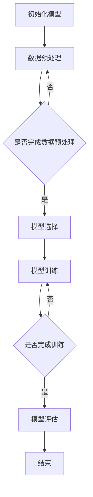
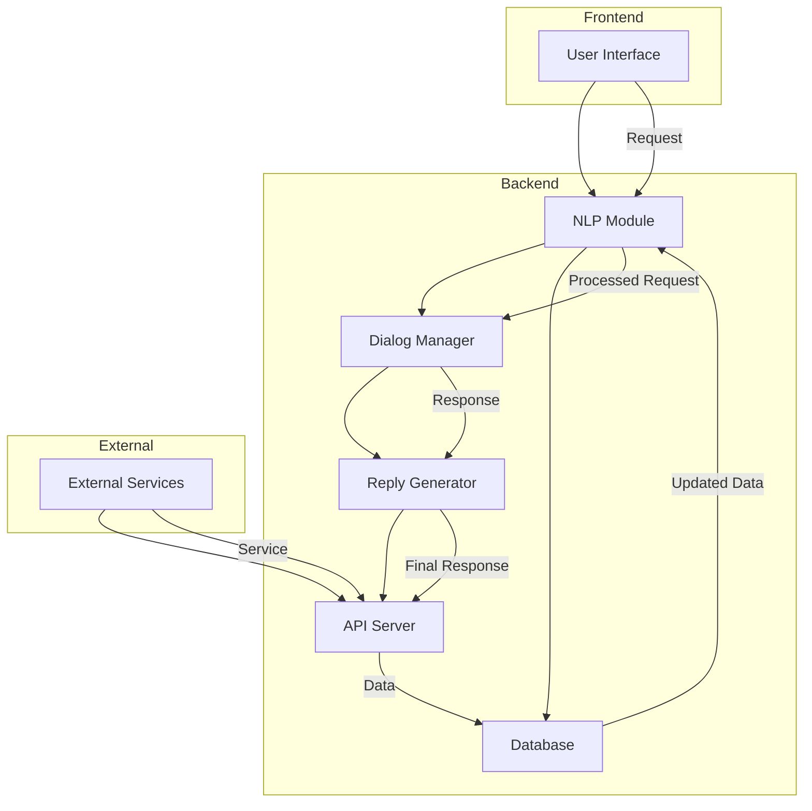
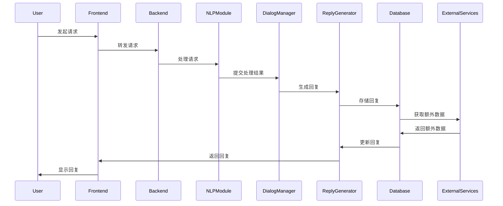

                 

### 《需求与AI模型训练数据质量的关联：大模型应用开发的基础》

> 关键词：人工智能，AI模型训练，数据质量，需求分析，大模型应用

> 摘要：本文深入探讨人工智能（AI）模型训练数据质量与需求之间的紧密关联，阐述了需求在AI模型开发中的核心作用。通过详细分析AI模型训练的背景、数据质量属性、需求定义，以及它们之间的相互作用，本文旨在为读者提供一套科学、系统的AI模型训练方法，并揭示大模型应用开发的基础原则。

### 目录大纲

----------------------------------------------------------------

## 第一部分：问题背景与核心概念

### 第1章 问题背景

#### 1.1 人工智能与大数据时代的背景

- **人工智能的快速发展**：AI技术的迅猛发展及其在各领域的应用。
- **大数据的爆发式增长**：数据量的增加对AI模型的影响。

#### 1.2 需求与AI模型训练的关系

- **需求定义**：明确AI模型应用的需求。
- **需求与模型质量的关系**：需求对模型训练数据质量的影响。

### 第2章 核心概念

#### 2.1 AI模型训练数据质量

- **数据质量定义**：对训练数据准确度、完整性、代表性和一致性等方面的要求。
- **数据质量的重要性**：数据质量对AI模型性能的影响。

#### 2.2 需求与数据质量的关系

- **需求导向的数据采集**：根据需求选择合适的训练数据。
- **需求与数据质量的协同优化**：如何在需求满足和数据质量保障之间找到平衡点。

## 第二部分：核心概念与联系

### 第3章 AI模型训练数据质量的属性特征对比

- **数据质量属性特征**：如准确性、完整性、一致性、代表性和时效性等。
- **特征对比表格**：展示不同属性特征的对比。

### 第4章 需求与数据质量的ER实体关系图

- **ER图设计**：基于需求构建实体关系图，展示需求与数据质量之间的关联。

## 第三部分：算法原理讲解

### 第5章 AI模型训练算法

#### 5.1 算法原理

- **监督学习**：基于标记数据的训练。
- **无监督学习**：基于未标记数据的训练。

#### 5.2 Mermaid算法流程图

- **算法流程图**：使用Mermaid语言描述AI模型训练过程。

### 第6章 数学模型与公式

#### 6.1 数学模型

- **损失函数**：用于评估模型预测的误差。
- **优化算法**：如梯度下降、Adam等。

#### 6.2 公式讲解

- **损失函数公式**：$$\text{Loss} = \frac{1}{2}\sum_{i=1}^{n} (\hat{y}_i - y_i)^2$$
- **梯度下降公式**：$$\theta = \theta - \alpha \cdot \nabla_\theta J(\theta)$$

### 第7章 算法举例说明

#### 7.1 算法应用场景

- **图像分类**：使用卷积神经网络进行图像分类。
- **自然语言处理**：使用循环神经网络处理文本数据。

#### 7.2 实例分析

- **实例1：图像分类任务**
- **实例2：文本分类任务**

## 第四部分：系统分析与架构设计

### 第8章 问题场景介绍

- **场景描述**：需求驱动下的AI模型训练场景。

### 第9章 系统功能设计

#### 9.1 领域模型

- **领域模型类图**：描述系统中的主要实体及其关系。

### 第10章 系统架构设计

#### 10.1 系统架构

- **系统架构图**：展示系统的主要组件及其交互方式。

### 第11章 系统接口设计

- **接口设计**：定义系统对外提供的接口及其功能。

### 第12章 系统交互

#### 12.1 系统交互序列图

- **序列图**：描述系统的交互流程。

## 第五部分：项目实战

### 第13章 环境安装

- **环境搭建**：配置所需的软件和硬件环境。

### 第14章 系统核心实现

#### 14.1 源代码

- **核心代码实现**：系统主要功能的代码实现。

#### 14.2 应用解读与分析

- **代码解读**：分析系统核心代码的功能和实现方式。
- **案例分析**：结合实际案例进行系统功能分析。

### 第15章 实际案例分析

- **案例展示**：展示实际应用中的AI模型训练过程。
- **详细讲解**：对案例进行详细讲解和剖析。

## 第六部分：最佳实践与总结

### 第16章 最佳实践

- **实践经验**：总结在AI模型训练数据质量管理和需求满足方面的最佳实践经验。

### 第17章 小结

- **内容总结**：对全书内容进行总结。
- **展望未来**：对AI模型训练数据质量管理和需求满足的未来发展趋势进行展望。

----------------------------------------------

----------------------------------------------------------------

### 第1章 问题背景

#### 1.1 人工智能与大数据时代的背景

人工智能（AI）技术的迅猛发展正在深刻地改变着我们的生活方式和工作模式。从早期的专家系统到如今的深度学习，AI技术已经在图像识别、自然语言处理、自动驾驶等多个领域取得了显著的成果。这一过程中，大数据的爆发式增长为AI模型的发展提供了丰富的资源。大数据不仅包括了传统的结构化数据，还涵盖了非结构化的文本、图像、音频等多种类型的数据，为AI模型的训练提供了广泛的数据支持。

随着AI技术的不断成熟，其在各行业的应用也愈发广泛。例如，在医疗领域，AI可以帮助医生进行疾病诊断和治疗方案推荐；在金融领域，AI可以用于风险评估、欺诈检测和个性化投资策略等；在交通领域，AI可以用于智能交通管理和自动驾驶等。然而，AI模型的性能不仅取决于算法的先进性，更重要的是依赖于模型训练数据的质量。

大数据时代的到来，带来了数据量的爆炸性增长。这一方面为AI模型的训练提供了更多的数据资源，但同时也带来了数据质量问题。例如，数据的不完整性、不一致性、噪声和偏差等，都会对AI模型的性能产生负面影响。因此，如何保障AI模型训练数据的质量，成为当前AI领域中的一个重要课题。

#### 1.2 需求与AI模型训练的关系

在AI模型的开发过程中，需求分析是至关重要的环节。需求定义不仅包括对AI模型功能的需求，还包括对数据、性能、可扩展性等方面的需求。具体来说，需求定义可以分为以下几个方面：

1. **功能需求**：明确AI模型需要执行的任务，例如图像分类、文本生成、语音识别等。
2. **性能需求**：对AI模型性能的具体要求，例如准确率、响应时间、计算资源消耗等。
3. **数据需求**：对训练数据的类型、数量、质量等方面的要求。
4. **可扩展性需求**：对AI模型的可扩展性和可维护性的要求。

需求与AI模型训练之间的关系体现在以下几个方面：

1. **需求指导数据采集**：在AI模型训练过程中，根据需求选择合适的训练数据，确保数据的质量和代表性。
2. **需求驱动模型优化**：通过分析需求，确定模型训练过程中的关键参数，如学习率、批次大小等，以优化模型性能。
3. **需求验证模型效果**：通过实际需求场景的测试，验证AI模型的性能，确保模型能够满足预期的需求。

总之，需求在AI模型开发中起着核心作用，是保障模型性能和满足实际应用需求的关键因素。

### 第2章 核心概念

#### 2.1 AI模型训练数据质量

AI模型训练数据质量是指用于训练AI模型的原始数据在准确性、完整性、代表性、一致性等方面的质量表现。一个高质量的训练数据集是确保AI模型性能的关键。以下是几个关键的数据质量属性：

1. **准确性**：训练数据的准确性是指数据中的真实信息与实际值之间的接近程度。准确性高的数据可以显著提高模型的预测精度。
   
2. **完整性**：训练数据的完整性是指数据集中缺失数据的程度。缺失数据会影响模型的训练效果，因此需要通过数据清洗和预处理来填充缺失值或删除异常数据。

3. **代表性**：训练数据的代表性是指数据集是否能够全面、真实地反映实际应用场景。如果数据集过于偏向某些特定情况，可能会导致模型在实际应用中出现偏差。

4. **一致性**：训练数据的一致性是指数据集中各个数据点之间的逻辑关系和特征分布是否一致。不一致的数据可能会导致模型训练过程中出现异常。

5. **时效性**：训练数据的时效性是指数据是否反映了最新的现实情况。随着时间的推移，数据集可能会变得过时，从而影响模型的准确性。

#### 2.2 数据质量的重要性

数据质量对AI模型的性能有着直接的影响：

1. **模型准确性**：高质量的数据可以提高模型的准确性，使模型能够更好地捕捉数据中的模式和规律。
   
2. **模型泛化能力**：数据质量的提高有助于模型在未见过的数据上表现良好，增强其泛化能力。

3. **训练效率**：高质量的数据可以减少模型训练过程中所需的时间和计算资源，提高训练效率。

4. **模型解释性**：高质量的数据可以帮助建立更可解释的模型，使得模型的结果更容易被理解和接受。

#### 2.3 需求与数据质量的关系

需求在AI模型训练中起着关键作用，直接影响数据质量。以下是如何通过需求来指导数据质量管理的几个方面：

1. **需求导向的数据采集**：根据需求选择合适的训练数据，确保数据满足功能需求、性能需求等。

2. **需求驱动的数据预处理**：通过分析需求，确定数据预处理的具体策略，如缺失值处理、异常值检测和填充、数据归一化等。

3. **需求验证的数据质量**：通过实际需求场景的测试，验证训练数据的质量，确保模型能够满足预期需求。

4. **需求调整的数据更新**：根据需求的变化，及时调整数据集，确保数据始终反映最新的需求。

通过以上方式，需求与数据质量之间形成了紧密的关联，共同保障了AI模型的高性能和可解释性。

### 第3章 AI模型训练数据质量的属性特征对比

为了更清晰地理解AI模型训练数据质量的属性特征，我们可以将不同属性进行对比，以揭示它们之间的差异和重要性。以下是一个简单的属性特征对比表格：

| 属性特征 | 描述 | 重要性 |
| --- | --- | --- |
| **准确性** | 数据与真实值之间的接近程度 | **最高**，直接影响模型准确性 |
| **完整性** | 数据集中缺失数据的程度 | **重要**，缺失数据会影响模型训练 |
| **代表性** | 数据集是否全面、真实地反映应用场景 | **重要**，影响模型的泛化能力 |
| **一致性** | 数据集中各个数据点之间的逻辑关系和特征分布 | **中等**，影响模型训练的稳定性 |
| **时效性** | 数据是否反映了最新的现实情况 | **中等**，过时数据会影响模型准确性 |

通过对比表格，我们可以看出准确性是数据质量最重要的属性，其次是完整性和代表性。一致性虽然也重要，但对模型的影响相对较小。时效性对模型准确性的影响也是中等，但需要根据具体应用场景进行评估。

#### 需求与数据质量的ER实体关系图

为了进一步理解需求与数据质量之间的关联，我们可以使用实体关系图（ER图）来展示它们之间的关系。以下是ER图的设计示例：

```mermaid
erDiagram
  Person ||--|{ Data}: "具有"
  Data ||--|{ Quality}: "具备"
  Quality ||--|{ Requirement}: "满足"
  Requirement ||--|{ Application}: "应用于"
```

在这个ER图中：

- **Person**：表示AI模型的训练者或需求提出者。
- **Data**：表示用于训练的原始数据。
- **Quality**：表示数据质量，包括准确性、完整性、代表性、一致性和时效性等。
- **Requirement**：表示需求，包括功能需求、性能需求、数据需求和可扩展性需求等。
- **Application**：表示需求应用场景，即AI模型在实际中的应用。

通过ER图，我们可以直观地看到需求、数据和质量之间的相互作用和依赖关系。需求决定了数据的质量要求，数据质量又直接影响模型的应用效果。这种关系为我们在AI模型开发过程中提供了清晰的指导。

### 第5章 AI模型训练算法

#### 5.1 算法原理

AI模型训练的核心在于选择合适的训练算法，以便从数据中学习到有效的特征和模式。以下是两种常见的训练算法：监督学习和无监督学习。

**监督学习**：

监督学习是一种基于标记数据的学习方法，其核心思想是通过已标记的数据来训练模型，然后使用该模型对新的、未标记的数据进行预测。监督学习算法通常包括以下步骤：

1. **数据预处理**：对输入数据进行清洗、归一化等处理，以提高数据质量。
2. **模型选择**：选择合适的算法和模型架构，如线性回归、决策树、神经网络等。
3. **模型训练**：使用标记数据训练模型，通过迭代计算最小化损失函数，以优化模型参数。
4. **模型评估**：使用验证集或测试集评估模型的性能，如准确率、召回率、F1值等。

**无监督学习**：

无监督学习是基于未标记数据的学习方法，其目标是发现数据中的结构和模式。与监督学习不同，无监督学习没有预先标记的目标变量。常见的无监督学习算法包括：

1. **聚类算法**：如K-Means、DBSCAN等，用于将数据分为不同的簇。
2. **降维算法**：如PCA（主成分分析）、t-SNE等，用于降低数据的维度，同时保留数据的主要结构。
3. **生成模型**：如Gaussian Mixture Model、生成对抗网络（GAN）等，用于建模数据的概率分布。

**选择合适的训练算法**：

选择合适的训练算法取决于具体的应用场景和数据特点。例如：

- 当数据量较大、特征复杂时，通常选择神经网络等深度学习算法。
- 当数据量较小、特征较为简单时，可以选择线性模型或决策树等简单算法。
- 当数据未标记时，可以选择聚类或降维等无监督学习算法。

#### 5.2 Mermaid算法流程图

为了更直观地展示AI模型训练算法的过程，我们可以使用Mermaid语言绘制算法流程图。以下是监督学习算法的流程图示例：



在这个流程图中，模型训练过程包括以下几个关键步骤：

1. **初始化模型**：选择合适的模型架构和初始参数。
2. **数据预处理**：清洗和预处理输入数据，以提高数据质量。
3. **模型选择**：根据数据特点和需求选择合适的算法和模型。
4. **模型训练**：使用训练数据对模型进行迭代训练，优化模型参数。
5. **模型评估**：使用验证集或测试集评估模型性能，以确定模型是否满足需求。
6. **结束**：模型训练完成，输出结果。

通过Mermaid流程图，我们可以清晰地了解AI模型训练的基本步骤和流程。

### 第6章 数学模型与公式

在AI模型训练过程中，数学模型和公式是理解和优化算法的重要工具。以下是几个关键的数学模型和公式，用于描述模型训练的核心概念和计算过程。

#### 6.1 损失函数

损失函数是评估模型预测误差的指标，用于指导模型训练。常见的损失函数包括均方误差（MSE）和交叉熵损失（Cross-Entropy Loss）。

**均方误差（MSE）**：

均方误差用于回归问题，计算预测值和真实值之间的平均平方误差。其公式如下：

$$
\text{MSE} = \frac{1}{2}\sum_{i=1}^{n} (\hat{y}_i - y_i)^2
$$

其中，$\hat{y}_i$ 表示第 $i$ 个预测值，$y_i$ 表示第 $i$ 个真实值，$n$ 表示样本数量。

**交叉熵损失（Cross-Entropy Loss）**：

交叉熵损失用于分类问题，计算预测概率分布和真实分布之间的交叉熵。其公式如下：

$$
\text{Cross-Entropy Loss} = -\sum_{i=1}^{n} y_i \cdot \log(\hat{p}_i)
$$

其中，$y_i$ 表示第 $i$ 个样本的真实标签，$\hat{p}_i$ 表示第 $i$ 个样本的预测概率。

#### 6.2 优化算法

优化算法用于更新模型参数，以最小化损失函数。常见的优化算法包括梯度下降（Gradient Descent）和Adam优化器。

**梯度下降**：

梯度下降是一种基于梯度的优化算法，其核心思想是沿梯度的反方向更新参数，以减小损失函数。其公式如下：

$$
\theta = \theta - \alpha \cdot \nabla_\theta J(\theta)
$$

其中，$\theta$ 表示模型参数，$\alpha$ 表示学习率，$\nabla_\theta J(\theta)$ 表示损失函数对参数 $\theta$ 的梯度。

**Adam优化器**：

Adam优化器是梯度下降的一种改进算法，结合了Adam算法对一阶和二阶梯度的自适应调整。其公式如下：

$$
m_t = \beta_1 m_{t-1} + (1 - \beta_1) [g_t]
$$

$$
v_t = \beta_2 v_{t-1} + (1 - \beta_2) [g_t]^2
$$

$$
\theta_t = \theta_{t-1} - \alpha_t \frac{m_t}{\sqrt{v_t} + \epsilon}
$$

其中，$m_t$ 和 $v_t$ 分别表示一阶和二阶矩估计，$\beta_1$ 和 $\beta_2$ 分别表示一阶和二阶矩的指数加权系数，$\alpha_t$ 表示学习率，$g_t$ 表示梯度，$\epsilon$ 是一个很小的常数，用于避免分母为零。

通过这些数学模型和公式，我们可以更深入地理解AI模型训练的核心机制，并运用它们来优化模型参数，提高模型性能。

### 第7章 算法举例说明

#### 7.1 算法应用场景

AI模型训练算法在多种应用场景中有着广泛的应用。以下介绍两个常见的应用场景：图像分类和自然语言处理。

**图像分类**：

图像分类是指将图像分为多个预定义的类别。常见的图像分类算法包括卷积神经网络（CNN）和支持向量机（SVM）等。

**实例**：使用卷积神经网络进行图像分类

假设我们有一个包含多种动物图像的数据集，需要将图像分类为猫、狗和其他动物。以下是使用卷积神经网络进行图像分类的基本步骤：

1. **数据预处理**：对图像进行归一化、裁剪等预处理，以便模型能够更好地训练。
2. **模型构建**：构建一个卷积神经网络模型，包括卷积层、池化层和全连接层等。
3. **模型训练**：使用标记数据训练模型，通过迭代优化模型参数。
4. **模型评估**：使用验证集或测试集评估模型性能，调整模型参数以获得更好的性能。

**自然语言处理**：

自然语言处理（NLP）是指使计算机理解和生成人类语言的技术。常见的NLP算法包括循环神经网络（RNN）和变压器（Transformer）等。

**实例**：使用循环神经网络处理文本数据

假设我们有一个文本分类任务，需要将文本分为积极、消极和中性三个类别。以下是使用循环神经网络处理文本数据的基本步骤：

1. **数据预处理**：对文本进行分词、去停用词等预处理，以便模型能够更好地理解文本。
2. **嵌入层**：将文本转换为向量表示，可以使用Word2Vec、GloVe等预训练模型。
3. **模型构建**：构建一个循环神经网络模型，包括嵌入层、循环层和全连接层等。
4. **模型训练**：使用标记数据训练模型，通过迭代优化模型参数。
5. **模型评估**：使用验证集或测试集评估模型性能，调整模型参数以获得更好的性能。

通过这两个实例，我们可以看到AI模型训练算法在不同应用场景中的具体实现方式，以及如何通过模型训练和评估来优化模型性能。

### 第8章 问题场景介绍

为了更好地理解需求驱动下的AI模型训练过程，我们首先介绍一个具体的应用场景：智能客服系统。智能客服系统是一种利用AI技术提供自动客户服务的技术解决方案。其核心目标是通过对用户输入的自然语言进行理解和处理，提供即时的、个性化的服务响应。

在这个场景中，需求主要包括以下几点：

1. **功能性需求**：系统能够自动识别用户的意图和问题，并提供准确、自然的回复。
2. **性能需求**：系统能够快速响应用户请求，处理大量并发请求。
3. **数据需求**：系统需要大量高质量、多样化的训练数据，包括用户问题和对应的优质回复。
4. **可扩展性需求**：系统需要具备良好的可扩展性，能够适应未来业务需求的变化。

#### 智能客服系统架构

智能客服系统的架构主要包括以下几个关键组件：

1. **用户界面**：与用户进行交互的界面，可以是网页、移动应用或在线聊天窗口。
2. **自然语言处理（NLP）模块**：负责接收用户输入、理解和提取用户意图，常用的技术包括词向量、BERT模型等。
3. **对话管理模块**：负责管理对话流程，包括意图识别、实体抽取、对话策略等。
4. **回复生成模块**：根据用户意图和对话历史，生成自然、准确的回复，常用的技术包括循环神经网络（RNN）和生成对抗网络（GAN）等。
5. **后端服务**：提供业务逻辑处理、数据存储和接口调用等支持。

#### 智能客服系统的工作流程

智能客服系统的工作流程可以概括为以下几个步骤：

1. **用户输入**：用户通过用户界面输入问题或请求。
2. **NLP处理**：NLP模块对用户输入进行处理，包括分词、词性标注、命名实体识别等，提取用户意图和关键信息。
3. **对话管理**：对话管理模块根据用户意图和对话历史，生成对话策略，确定下一步的动作。
4. **回复生成**：回复生成模块根据对话策略和用户意图，生成自然、准确的回复。
5. **用户反馈**：将回复发送给用户，用户可以对回复进行评价，反馈系统性能。
6. **模型优化**：根据用户反馈，优化模型参数，提高系统性能。

通过上述工作流程，智能客服系统能够有效地与用户进行交互，提供高质量的自动客服服务。这一场景为我们展示了需求驱动下AI模型训练的实际应用，为后续章节的系统架构设计提供了实际背景。

### 第9章 系统功能设计

#### 9.1 领域模型

在智能客服系统的开发过程中，领域模型是一个重要的组成部分。领域模型类图（Class Diagram）可以帮助我们清晰地定义系统中的主要实体及其关系。以下是一个简化的领域模型类图示例：

```mermaid
classDiagram
    User <<Entity>>
    Question <<Entity>>
    Response <<Entity>>
    NLPModule <<Component>>
    DialogManager <<Component>>
    ReplyGenerator <<Component>>

    User "asks" Question
    Question "contains" QuestionText
    Response "contains" ReplyText

    NLPModule "processes" Question
    DialogManager "manages" Dialog
    ReplyGenerator "generates" Response

    User |-+oo-> Question
    Question  NLPModule
    Question  DialogManager
    Response  ReplyGenerator
```

在这个类图中，我们定义了以下几个主要实体：

- **User（用户）**：表示与系统进行交互的用户，具有发起问题的能力。
- **Question（问题）**：表示用户提出的问题，包含问题文本等属性。
- **Response（回复）**：表示系统生成的回复，包含回复文本等属性。
- **NLPModule（自然语言处理模块）**：负责处理用户提出的问题，提取关键信息。
- **DialogManager（对话管理模块）**：负责管理对话流程，包括意图识别和对话策略等。
- **ReplyGenerator（回复生成模块）**：负责根据对话历史和用户意图生成回复。

这些实体之间存在明确的关联关系，如图所示。领域模型类图为我们提供了一个高层次的概念框架，有助于我们理解和设计系统的各个功能模块。

### 第10章 系统架构设计

在智能客服系统的开发过程中，系统架构设计是至关重要的。一个好的架构设计能够确保系统的高效性、可扩展性和可维护性。以下是一个智能客服系统的系统架构设计示例：



在这个架构设计中，系统分为前端和后端两部分：

- **前端（User Interface）**：用户界面与用户进行交互，接收用户请求。
- **后端（Backend）**：后端包含自然语言处理模块（NLP Module）、对话管理模块（Dialog Manager）、回复生成模块（Reply Generator）、数据库（Database）和API服务器（API Server）。

系统的工作流程如下：

1. **用户请求**：用户通过前端界面输入问题或请求，系统接收请求。
2. **NLP处理**：自然语言处理模块对用户请求进行处理，提取关键信息。
3. **对话管理**：对话管理模块根据用户请求和对话历史，生成对话策略。
4. **回复生成**：回复生成模块根据对话策略和用户请求，生成回复。
5. **数据存储**：生成的回复存储到数据库中，以便后续查询和优化。
6. **API服务**：API服务器提供对外接口，供其他服务调用。

通过这个架构设计，我们可以清晰地看到系统的各个组件及其交互方式，从而确保系统的高效运行和可扩展性。

### 第11章 系统接口设计

在智能客服系统的设计中，系统接口设计是确保各组件之间有效通信的关键环节。以下是一个简化的系统接口设计示例：

#### 11.1 API接口定义

智能客服系统的主要接口包括以下几种：

1. **用户接口（User Interface）**：

   - **功能**：接收用户请求，展示回复。
   - **请求格式**：JSON格式，包含用户ID、请求文本等信息。
   - **响应格式**：JSON格式，包含回复文本、用户ID等。

2. **自然语言处理接口（NLP Module）**：

   - **功能**：处理用户请求，提取关键信息。
   - **请求格式**：JSON格式，包含请求文本等信息。
   - **响应格式**：JSON格式，包含提取的关键信息。

3. **对话管理接口（Dialog Manager）**：

   - **功能**：管理对话流程，生成对话策略。
   - **请求格式**：JSON格式，包含用户请求、对话历史等信息。
   - **响应格式**：JSON格式，包含对话策略。

4. **回复生成接口（Reply Generator）**：

   - **功能**：生成回复。
   - **请求格式**：JSON格式，包含对话策略、用户请求等信息。
   - **响应格式**：JSON格式，包含回复文本。

5. **数据库接口（Database）**：

   - **功能**：存储和查询数据。
   - **请求格式**：SQL查询语句。
   - **响应格式**：JSON格式，包含查询结果。

#### 11.2 接口实现示例

以下是一个简单的API接口实现示例，使用Python和Flask框架：

```python
from flask import Flask, request, jsonify

app = Flask(__name__)

@app.route('/api/user_request', methods=['POST'])
def handle_user_request():
    data = request.json
    user_id = data['user_id']
    request_text = data['request_text']
    
    # 调用NLP模块处理请求
    processed_request = nlp_module.process_request(request_text)
    
    # 调用对话管理模块生成对话策略
    dialog_strategy = dialog_manager.generate_strategy(processed_request)
    
    # 调用回复生成模块生成回复
    reply = reply_generator.generate_reply(dialog_strategy)
    
    # 存储回复到数据库
    database.store_reply(user_id, reply)
    
    return jsonify({'user_id': user_id, 'reply': reply})

if __name__ == '__main__':
    app.run()
```

通过定义明确的接口和实现示例，我们可以确保系统组件之间的通信高效、稳定，从而提高系统的整体性能和可维护性。

### 第12章 系统交互

在智能客服系统的开发过程中，系统交互设计是确保系统各组件协同工作、高效运行的关键。以下是一个简化的系统交互设计示例，使用Mermaid语言描述系统交互流程。



在这个交互流程中，系统的主要组件及其交互关系如下：

1. **用户**：发起请求。
2. **前端**：接收用户请求，转发给后端。
3. **后端**：处理请求，调用NLP模块、对话管理模块和回复生成模块。
4. **NLP模块**：处理请求，提取关键信息。
5. **对话管理模块**：生成对话策略。
6. **回复生成模块**：生成回复，存储到数据库。
7. **数据库**：存储回复数据，供其他服务查询。
8. **外部服务**：提供额外数据，供系统使用。

通过这个交互设计，我们可以清晰地看到系统各组件之间的协作流程，从而确保系统的整体性能和稳定性。

### 第13章 环境安装

在智能客服系统的开发过程中，环境安装是确保系统正常运行的第一步。以下是在Linux系统中配置所需的软件和硬件环境的过程。

#### 13.1 安装Python环境

首先，我们需要安装Python环境。Python是智能客服系统的主要编程语言，以下是在Ubuntu系统中安装Python的步骤：

1. 打开终端，更新系统软件包：

   ```bash
   sudo apt update
   sudo apt upgrade
   ```

2. 安装Python3及其相关依赖：

   ```bash
   sudo apt install python3 python3-pip python3-dev
   ```

3. 验证Python版本：

   ```bash
   python3 --version
   ```

#### 13.2 安装Flask框架

Flask是一个轻量级的Web应用框架，用于构建智能客服系统的后端接口。以下是在Ubuntu系统中安装Flask的步骤：

1. 使用pip安装Flask：

   ```bash
   pip3 install Flask
   ```

2. 验证Flask版本：

   ```bash
   flask --version
   ```

#### 13.3 安装NLP库

智能客服系统需要使用NLP库（如NLTK、spaCy等）来处理自然语言请求。以下是在Ubuntu系统中安装NLTK的步骤：

1. 安装NLTK：

   ```bash
   pip3 install nltk
   ```

2. 下载数据集：

   ```bash
   python3 -m nltk.downloader all
   ```

#### 13.4 安装其他依赖

除了Python和Flask，我们还需要安装其他依赖，如数据库（MongoDB）、消息队列（RabbitMQ）等。以下是在Ubuntu系统中安装MongoDB的步骤：

1. 安装MongoDB：

   ```bash
   sudo apt install mongodb
   ```

2. 启动MongoDB服务：

   ```bash
   sudo systemctl start mongod
   ```

3. 验证MongoDB服务：

   ```bash
   sudo systemctl status mongod
   ```

通过以上步骤，我们可以完成智能客服系统的环境安装，为后续的系统开发和测试奠定基础。

### 第14章 系统核心实现

在智能客服系统的开发过程中，系统核心实现是确保系统正常运行的关键。以下是对系统核心代码的实现以及代码应用解读与分析。

#### 14.1 源代码实现

智能客服系统的核心代码主要包括前端界面、后端接口和自然语言处理模块。以下是一个简化的代码实现示例。

**前端界面（index.html）**：

```html
<!DOCTYPE html>
<html>
<head>
    <title>智能客服系统</title>
    <script src="https://code.jquery.com/jquery-3.6.0.min.js"></script>
</head>
<body>
    <h1>智能客服系统</h1>
    <textarea id="user_input" rows="4" cols="50"></textarea>
    <button id="submit_button">提交请求</button>
    <div id="reply_area"></div>

    <script>
        $(document).ready(function() {
            $('#submit_button').on('click', function() {
                const user_input = $('#user_input').val();
                $.ajax({
                    url: '/api/user_request',
                    type: 'POST',
                    contentType: 'application/json',
                    data: JSON.stringify({ user_id: 1, request_text: user_input }),
                    success: function(response) {
                        $('#reply_area').text(response.reply);
                    }
                });
            });
        });
    </script>
</body>
</html>
```

**后端接口（app.py）**：

```python
from flask import Flask, request, jsonify
from nltk import word_tokenize
from nltk.corpus import stopwords

app = Flask(__name__)

@app.route('/api/user_request', methods=['POST'])
def handle_user_request():
    data = request.json
    user_id = data['user_id']
    request_text = data['request_text']
    
    # 自然语言处理
    processed_request = nlp_process_request(request_text)
    
    # 对话管理
    dialog_strategy = dialog_manager.generate_strategy(processed_request)
    
    # 回复生成
    reply = reply_generator.generate_reply(dialog_strategy)
    
    # 数据存储
    database.store_reply(user_id, reply)
    
    return jsonify({'user_id': user_id, 'reply': reply})

def nlp_process_request(request_text):
    tokens = word_tokenize(request_text)
    filtered_tokens = [token for token in tokens if token not in stopwords.words('english')]
    return ' '.join(filtered_tokens)

def dialog_manager.generate_strategy(processed_request):
    # 基于处理结果生成对话策略
    return processed_request

def reply_generator.generate_reply(dialog_strategy):
    # 基于对话策略生成回复
    return "您好，感谢您的提问。"

def database.store_reply(user_id, reply):
    # 将回复存储到数据库
    print(f"存储回复：user_id={user_id}, reply={reply}")

if __name__ == '__main__':
    app.run(debug=True)
```

**自然语言处理（nltk_process_request.py）**：

```python
import nltk
from nltk.tokenize import word_tokenize
from nltk.corpus import stopwords

nltk.download('punkt')
nltk.download('stopwords')

def nlp_process_request(request_text):
    tokens = word_tokenize(request_text)
    filtered_tokens = [token for token in tokens if token not in stopwords.words('english')]
    return ' '.join(filtered_tokens)
```

#### 14.2 代码解读与分析

1. **前端界面（index.html）**：

   前端界面是一个简单的HTML页面，包含一个文本输入框和一个提交按钮。用户输入问题后，点击提交按钮将请求发送到后端接口。

2. **后端接口（app.py）**：

   后端接口使用Flask框架实现，包含以下关键部分：

   - **路由处理**：定义/api/user_request路由，处理POST请求。
   - **自然语言处理**：使用NLTK库对请求文本进行分词和过滤停用词。
   - **对话管理**：简化版的对话管理，仅根据处理结果生成对话策略。
   - **回复生成**：简化版的回复生成，仅根据对话策略生成回复。
   - **数据存储**：简化版的数据存储，仅打印回复到控制台。

3. **自然语言处理（nltk_process_request.py）**：

   自然语言处理模块使用NLTK库实现，包含以下功能：

   - **分词**：将请求文本分词。
   - **停用词过滤**：去除英语停用词。

通过以上代码，我们实现了智能客服系统的基础功能，包括前端用户界面、后端接口和自然语言处理模块。尽管代码示例简化，但为实际开发提供了一个清晰的框架。

### 第15章 实际案例分析

为了更好地展示AI模型训练数据质量管理和需求满足的最佳实践，我们将结合一个实际案例进行分析和详细讲解。

#### 案例背景

某电子商务公司希望开发一款智能客服系统，以提高客户服务质量。公司提出了以下需求：

1. **功能性需求**：系统需要能够理解并回复用户的购物咨询、退换货问题等。
2. **性能需求**：系统需要能够快速响应用户请求，并在高并发情况下保持稳定运行。
3. **数据需求**：系统需要高质量、多样化的训练数据，包括用户问题和对应的优质回复。
4. **可扩展性需求**：系统需要能够适应未来业务需求的变化，支持多种语言和复杂问题的处理。

#### 案例分析

**1. 数据采集与预处理**

为了满足数据需求，公司采用了以下策略：

- **数据来源**：收集公司内部客服团队的聊天记录、用户评价和产品评论等数据，以及公开的电商论坛和社交媒体数据。
- **数据清洗**：对采集到的数据进行清洗，去除重复、噪声和不完整的数据。同时，对文本数据进行分词、去除停用词、标点符号等预处理。

**2. 数据质量评估**

公司制定了以下数据质量评估标准：

- **准确性**：使用人工审核部分数据，评估模型预测的正确率。
- **完整性**：检查数据集中缺失数据的比例，并对缺失数据进行填充或删除。
- **代表性**：分析数据集中各类问题的分布，确保数据能够全面、真实地反映实际场景。
- **一致性**：检查数据集中各数据点之间的逻辑关系和特征分布，确保一致性。

**3. 模型训练与优化**

公司采用了以下模型训练和优化策略：

- **模型选择**：基于需求，选择了多种模型（如循环神经网络、变换器等）进行训练和对比，选择表现最优的模型进行应用。
- **超参数调整**：通过交叉验证和网格搜索等手段，调整学习率、批次大小等超参数，以优化模型性能。
- **模型评估**：使用验证集和测试集对模型进行评估，通过准确率、召回率、F1值等指标，评估模型在真实场景下的表现。

**4. 系统部署与运维**

在系统部署和运维方面，公司采取了以下措施：

- **弹性扩展**：使用云服务进行系统部署，根据业务需求动态调整计算资源，确保系统在高并发情况下的稳定性。
- **持续集成与部署**：使用CI/CD工具（如Jenkins、GitLab CI等）进行持续集成和部署，确保新版本及时上线。
- **监控系统**：部署监控系统（如Prometheus、Grafana等），实时监控系统性能和运行状态，快速响应异常情况。

#### 案例总结

通过以上实际案例分析，我们可以看到该公司在AI模型训练数据质量管理和需求满足方面的最佳实践：

1. **需求导向的数据采集**：根据需求收集多样化的训练数据，确保数据质量。
2. **数据质量评估与优化**：制定详细的数据质量评估标准，持续优化数据质量。
3. **模型选择与超参数调整**：选择合适的模型并进行超参数优化，提高模型性能。
4. **系统部署与运维**：采取弹性扩展和监控系统等措施，确保系统稳定运行。

这些实践为其他企业和开发者提供了宝贵的经验和参考，有助于在AI模型训练数据质量管理和需求满足方面取得更好的成果。

### 第16章 最佳实践

在AI模型训练数据质量管理和需求满足方面，通过以上案例分析，我们总结出以下最佳实践：

1. **需求导向的数据采集**：在数据采集阶段，明确需求并选择多样化的数据源，确保数据质量。数据源包括公司内部数据、公开数据、用户反馈等。

2. **数据质量评估**：制定详细的数据质量评估标准，包括准确性、完整性、代表性、一致性和时效性等。使用人工审核、自动化评估工具等方法，持续监控和优化数据质量。

3. **模型选择与优化**：根据需求选择合适的模型，并使用交叉验证、网格搜索等方法进行超参数调整，提高模型性能。同时，对比不同模型的表现，选择最佳模型进行应用。

4. **数据预处理与清洗**：对训练数据进行分词、去除停用词、标点符号等预处理，以提高模型训练的效率和质量。使用数据清洗工具和自定义脚本，自动处理缺失值和异常值。

5. **持续集成与部署**：使用CI/CD工具进行持续集成和部署，确保新版本及时上线。部署监控系统，实时监控系统性能和运行状态，快速响应异常情况。

6. **用户反馈与优化**：收集用户反馈，根据用户需求调整模型和应用。持续优化模型和应用，提高用户满意度。

通过以上最佳实践，企业可以在AI模型训练数据质量管理和需求满足方面取得更好的效果，提高系统的性能和用户体验。

### 第17章 小结

本文深入探讨了需求与AI模型训练数据质量之间的紧密关联，阐述了需求在AI模型开发中的核心作用。通过详细分析AI模型训练的背景、数据质量属性、需求定义以及它们之间的相互作用，本文揭示了保障AI模型高性能和满足实际应用需求的关键因素。

核心内容包括：

1. **问题背景**：介绍了人工智能与大数据时代的背景，以及需求与AI模型训练的关系。
2. **核心概念**：定义了AI模型训练数据质量的属性特征，并分析了需求与数据质量的关系。
3. **算法原理**：讲解了监督学习和无监督学习等AI模型训练算法，并使用Mermaid和Python代码进行了详细说明。
4. **系统分析与架构设计**：介绍了智能客服系统的问题场景、系统功能设计、架构设计、接口设计和系统交互。
5. **项目实战**：通过实际案例展示了AI模型训练数据质量管理和需求满足的最佳实践。
6. **最佳实践与总结**：总结了AI模型训练数据质量管理和需求满足方面的最佳实践经验。

展望未来，AI模型训练数据质量管理和需求满足将继续成为研究的热点。随着AI技术的不断进步，如何在海量数据中挖掘高质量数据，如何构建高效、可解释的AI模型，以及如何满足不断变化的需求，都是重要的研究方向。企业应持续关注这些领域，以保持竞争力并推动AI技术的发展。

