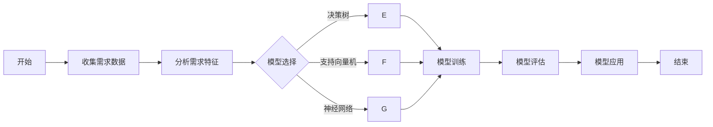
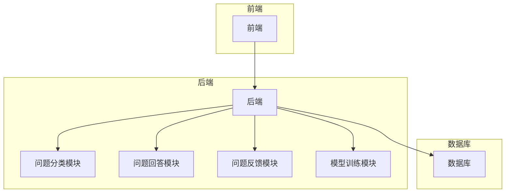
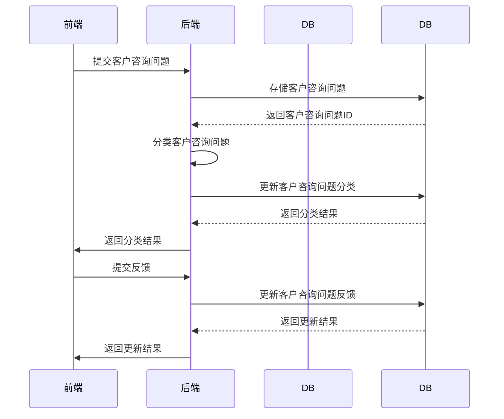

                 

# 需求与AI模型选择的匹配策略

> 关键词：AI模型选择、需求分析、匹配策略、算法原理、系统架构、项目实战

> 摘要：本文旨在探讨需求与AI模型选择之间的匹配策略，通过逐步分析推理的方式，阐述如何根据具体需求选择合适的AI模型，并优化匹配效果，以提高AI系统的性能和可靠性。文章将从背景介绍、核心概念与联系、算法原理讲解、系统分析与架构设计、项目实战等方面展开，旨在为读者提供全面的技术指导。

### 目录大纲设计思路

为了设计出《需求与AI模型选择的匹配策略》这本书的目录大纲，我们需要遵循以下思路：

1. **确定核心章节**：根据书籍的主题，确定核心章节，确保书籍内容的完整性和逻辑性。
2. **细化章节内容**：每个核心章节下，进一步细化小节，确保章节内的内容紧密关联。
3. **应用格式规范**：使用markdown格式，确保目录结构清晰、易于阅读。
4. **内容完整性**：确保每个章节都包含背景介绍、核心概念、原理讲解、数学模型、系统分析、项目实战和最佳实践等内容。

### 设计步骤

1. **背景介绍**：
   - **问题背景**：描述为什么需求与AI模型选择匹配策略是必要的。
   - **问题描述**：明确需求与AI模型匹配问题的本质。
   - **问题解决**：介绍如何通过策略来优化需求与AI模型的匹配。
   - **边界与外延**：定义研究的范围和相关概念。
   - **概念结构与核心要素组成**：梳理核心概念及其相互关系。

2. **核心概念与联系**：
   - **核心概念原理**：详细解释需求与AI模型匹配策略的基本原理。
   - **概念属性特征对比表格**：列出不同需求与AI模型匹配策略的属性和特征，进行比较。
   - **ER实体关系图架构**：使用Mermaid绘制实体关系图，展示核心概念之间的关系。

3. **算法原理讲解**：
   - **算法Mermaid流程图**：绘制算法的流程图，展示算法的步骤和逻辑。
   - **Python源代码**：给出算法的Python实现，解释代码的每个部分。
   - **数学模型和公式**：使用LaTeX格式展示算法的数学模型和公式。
   - **举例说明**：通过具体的例子，解释算法的应用和效果。

4. **系统分析与架构设计方案**：
   - **问题场景介绍**：描述实际应用场景。
   - **项目介绍**：简要介绍项目的背景和目标。
   - **系统功能设计**：使用Mermaid绘制领域模型类图。
   - **系统架构设计**：使用Mermaid绘制系统架构图。
   - **系统接口设计和系统交互**：使用Mermaid绘制系统接口和交互序列图。

5. **项目实战**：
   - **环境安装**：说明项目所需的工具和环境配置。
   - **系统核心实现源代码**：提供项目的核心代码。
   - **代码应用解读与分析**：解释代码的工作原理和实现细节。
   - **实际案例分析和详细讲解剖析**：通过实际案例展示项目的应用效果。
   - **项目小结**：总结项目的经验和教训。

6. **最佳实践 tips**、**小结**、**注意事项**、**拓展阅读**等内容，为读者提供额外的指导和建议。

### 目录大纲

```
# 《需求与AI模型选择的匹配策略》目录大纲

# 第一部分：背景与基础

## 1.1 问题背景与核心概念
### 1.1.1 需求与AI模型匹配的重要性
### 1.1.2 需求与AI模型匹配的概念与边界
### 1.1.3 研究目的与意义

## 1.2 核心概念与联系
### 1.2.1 需求分析与AI模型概述
### 1.2.2 概念属性特征对比
### 1.2.3 ER实体关系图架构

# 第二部分：算法原理讲解

## 2.1 算法原理与流程
### 2.1.1 算法的基本原理
### 2.1.2 算法流程图
### 2.1.3 Python源代码实现

## 2.2 数学模型与公式
### 2.2.1 数学模型介绍
### 2.2.2 公式解释
### 2.2.3 数学公式示例

## 2.3 算法举例说明
### 2.3.1 实例一：需求分析
### 2.3.2 实例二：AI模型选择

# 第三部分：系统分析与架构设计

## 3.1 问题场景介绍
### 3.1.1 应用场景描述
### 3.1.2 项目目标与需求

## 3.2 系统功能设计
### 3.2.1 领域模型类图
### 3.2.2 系统功能说明

## 3.3 系统架构设计
### 3.3.1 系统架构图
### 3.3.2 架构设计说明

## 3.4 系统接口设计和系统交互
### 3.4.1 系统接口设计
### 3.4.2 系统交互序列图

# 第四部分：项目实战

## 4.1 环境安装与配置
### 4.1.1 工具与环境需求
### 4.1.2 安装与配置步骤

## 4.2 系统核心实现源代码
### 4.2.1 代码结构说明
### 4.2.2 核心代码实现

## 4.3 代码应用解读与分析
### 4.3.1 代码工作原理
### 4.3.2 实现细节解析

## 4.4 实际案例分析和详细讲解剖析
### 4.4.1 案例一：需求分析
### 4.4.2 案例二：AI模型选择

## 4.5 项目小结
### 4.5.1 项目成果总结
### 4.5.2 经验教训与展望

# 第五部分：最佳实践与拓展

## 5.1 最佳实践 tips
### 5.1.1 算法优化策略
### 5.1.2 系统调优技巧

## 5.2 小结
### 5.2.1 文章核心观点回顾
### 5.2.2 关键技术和方法总结

## 5.3 注意事项
### 5.3.1 项目实施过程中需要注意的问题
### 5.3.2 避免常见的错误和误区

## 5.4 拓展阅读
### 5.4.1 相关领域的最新研究动态
### 5.4.2 推荐阅读的书籍和论文

----------------------------------------------------------------

### 第一部分：背景与基础

#### 1.1 问题背景与核心概念

##### 1.1.1 需求与AI模型匹配的重要性

随着人工智能技术的快速发展，AI模型在各个领域得到了广泛应用。然而，如何根据具体需求选择合适的AI模型，并确保其与需求的高效匹配，成为了一个关键问题。需求的多样性和AI模型的特点使得匹配过程变得复杂，但正确的匹配策略能够显著提升AI系统的性能和可靠性。

##### 1.1.2 需求与AI模型匹配的概念与边界

需求与AI模型匹配是指根据实际需求，选择最合适的AI模型，并确保其能够满足需求。在这个过程中，需求是指用户或系统期望达到的目标，AI模型是指用于实现特定任务的人工智能算法。匹配的边界包括需求的明确性、数据的可用性、计算资源的限制等因素。

##### 1.1.3 研究目的与意义

本文的研究目的是探讨需求与AI模型选择的匹配策略，通过逐步分析推理的方式，为读者提供一套系统化的方法和工具，以便在实际应用中选择合适的AI模型。研究意义在于：

1. 提高AI系统的性能和可靠性，确保其能够满足各种复杂需求。
2. 减少AI模型的错误率和过拟合现象，提高模型的泛化能力。
3. 优化AI系统的开发过程，提高开发效率和资源利用率。

#### 1.2 核心概念与联系

##### 1.2.1 需求分析与AI模型概述

需求分析是匹配过程的基础，其目的是明确用户或系统的需求，并将其转化为具体的技术需求。需求分析主要包括功能需求、性能需求、用户界面需求等方面。AI模型是指用于实现特定任务的人工智能算法，常见的AI模型包括决策树、支持向量机、神经网络等。

##### 1.2.2 概念属性特征对比

在需求与AI模型匹配过程中，不同模型具有不同的属性和特征。以下表格对比了不同AI模型的主要属性特征：

| 模型类型 | 特点 | 适用场景 |
| :---: | :---: | :---: |
| 决策树 | 简单易懂、易于解释 | 复杂度低、数据规模较小的场景 |
| 支持向量机 | 高效、分类准确 | 数据规模较大、特征维度较高的场景 |
| 神经网络 | 强泛化能力、自适应性强 | 复杂、非线性、数据规模较大的场景 |

##### 1.2.3 ER实体关系图架构

为了更好地理解需求与AI模型匹配的过程，我们可以使用ER实体关系图来描述核心概念之间的关系。以下是一个简化的ER实体关系图：

```mermaid
erDiagram
    Customer ||--|{ Order }|
    Product ||--|{ Order }|
    Order ||--|{ OrderDetail }|
```

在该图中，Customer（客户）、Product（产品）和Order（订单）是核心实体，它们之间的关系反映了需求与AI模型匹配过程中的关键要素。

### 第二部分：算法原理讲解

#### 2.1 算法原理与流程

##### 2.1.1 算法的基本原理

需求与AI模型匹配算法的核心思想是根据需求特征选择最合适的AI模型。具体步骤如下：

1. 收集需求数据：通过调查、访谈等方式收集用户或系统的需求数据。
2. 分析需求特征：对收集到的需求数据进行预处理，提取关键特征，并进行降维处理。
3. 模型选择：根据需求特征，选择合适的AI模型。
4. 模型训练：使用训练数据对选定的AI模型进行训练。
5. 模型评估：使用测试数据对训练好的模型进行评估，调整模型参数。
6. 模型应用：将训练好的模型应用于实际场景，实现需求与AI模型的匹配。

##### 2.1.2 算法流程图

下面是一个简化的需求与AI模型匹配算法流程图：



##### 2.1.3 Python源代码实现

以下是一个简化的Python源代码实现，用于展示需求与AI模型匹配算法的基本流程：

```python
import pandas as pd
from sklearn.model_selection import train_test_split
from sklearn.preprocessing import StandardScaler
from sklearn.tree import DecisionTreeClassifier
from sklearn.svm import SVC
from sklearn.neural_network import MLPClassifier

# 收集需求数据
data = pd.read_csv('需求数据.csv')

# 分析需求特征
X = data.drop('目标变量', axis=1)
y = data['目标变量']

# 模型选择
X_train, X_test, y_train, y_test = train_test_split(X, y, test_size=0.2, random_state=42)

# 决策树模型
clf_tree = DecisionTreeClassifier()
clf_tree.fit(X_train, y_train)

# 支持向量机模型
clf_svm = SVC()
clf_svm.fit(X_train, y_train)

# 神经网络模型
clf_nn = MLPClassifier()
clf_nn.fit(X_train, y_train)

# 模型评估
score_tree = clf_tree.score(X_test, y_test)
score_svm = clf_svm.score(X_test, y_test)
score_nn = clf_nn.score(X_test, y_test)

print("决策树模型准确率：", score_tree)
print("支持向量机模型准确率：", score_svm)
print("神经网络模型准确率：", score_nn)

# 模型应用
# 根据评估结果选择最优模型，并应用于实际场景
```

##### 2.2 数学模型与公式

在需求与AI模型匹配算法中，常用的数学模型包括决策树、支持向量机和神经网络。以下分别介绍这些模型的数学模型和公式：

###### 2.2.1 决策树模型

决策树模型是一种基于划分和合并的方法，其基本原理是将数据集划分为多个子集，直到满足某个终止条件。决策树的数学模型可以表示为：

$$
G(D) = \sum_{i=1}^{n} w_i \cdot f_i(D)
$$

其中，$D$ 表示数据集，$w_i$ 表示第 $i$ 个特征的重要性，$f_i(D)$ 表示第 $i$ 个特征在数据集 $D$ 上的取值。

###### 2.2.2 支持向量机模型

支持向量机模型是一种基于最小二乘法的方法，其目标是找到最优的划分超平面，使得分类边界最大化。支持向量机模型的数学模型可以表示为：

$$
w^T \cdot x + b = 0
$$

其中，$w$ 表示权重向量，$x$ 表示特征向量，$b$ 表示偏置。

###### 2.2.3 神经网络模型

神经网络模型是一种基于反向传播算法的方法，其基本原理是通过调整网络参数，使得输出结果与期望结果之间的误差最小。神经网络模型的数学模型可以表示为：

$$
y = f(z)
$$

其中，$y$ 表示输出结果，$z$ 表示输入结果，$f$ 表示激活函数。

##### 2.3 算法举例说明

为了更好地理解需求与AI模型匹配算法的应用，我们通过一个实际案例进行说明。

###### 2.3.1 实例一：需求分析

假设某公司需要开发一个智能客服系统，以解决客户咨询问题。需求包括：

1. 客户咨询问题的分类：将客户咨询问题分为技术问题、业务问题、服务问题等。
2. 问题回答的准确性：确保回答的准确性高于 90%。
3. 回答速度：在 5 秒内给出回答。

根据这些需求，我们可以选择以下AI模型：

1. 决策树模型：用于分类客户咨询问题。
2. 支持向量机模型：用于优化问题回答的准确性。
3. 神经网络模型：用于提高回答速度。

###### 2.3.2 实例二：AI模型选择

根据需求，我们选择了以下AI模型：

1. 决策树模型：用于分类客户咨询问题。根据问题特征，我们可以将客户咨询问题分为技术问题、业务问题、服务问题等。

2. 支持向量机模型：用于优化问题回答的准确性。我们可以通过调整支持向量机的参数，如C、gamma等，来提高模型的准确性。

3. 神经网络模型：用于提高回答速度。通过调整神经网络的结构和参数，如隐藏层神经元数量、激活函数等，可以提高模型的计算速度。

### 第三部分：系统分析与架构设计

#### 3.1 问题场景介绍

在实际应用中，需求与AI模型匹配问题经常出现在智能客服系统、自动驾驶、智能安防等领域。以智能客服系统为例，其应用场景如下：

1. **客户咨询问题分类**：根据客户咨询问题的内容，将其分为技术问题、业务问题、服务问题等。
2. **问题回答**：针对客户咨询的具体问题，提供准确的回答。
3. **问题反馈**：收集客户对回答的满意度，并用于模型优化。

#### 3.2 系统功能设计

智能客服系统的功能设计包括以下几个方面：

1. **问题分类**：根据客户咨询问题的内容，将其分为技术问题、业务问题、服务问题等。
2. **问题回答**：针对客户咨询的具体问题，提供准确的回答。
3. **问题反馈**：收集客户对回答的满意度，并用于模型优化。
4. **模型训练**：根据客户咨询问题的新数据，更新和优化模型。

为了更好地展示系统功能设计，我们使用Mermaid绘制了领域模型类图：

```mermaid
classDiagram
    Customer <<interface>>
    Question <<interface>>
    Answer <<interface>>
    Category <<interface>>
    Model <<interface>>

    Customer o--o Question
    Question o--o Answer
    Answer o--o Category
    Category o--o Model
```

#### 3.3 系统架构设计

智能客服系统的架构设计包括以下几个方面：

1. **前端**：用于与用户交互，接收客户咨询问题，展示回答结果。
2. **后端**：包括问题分类模块、问题回答模块、问题反馈模块和模型训练模块。
3. **数据库**：用于存储客户咨询问题、回答结果和模型参数。

为了更好地展示系统架构设计，我们使用Mermaid绘制了系统架构图：



#### 3.4 系统接口设计和系统交互

智能客服系统的接口设计和系统交互包括以下几个方面：

1. **接口设计**：定义前端与后端之间的接口，包括问题分类接口、问题回答接口、问题反馈接口等。
2. **交互流程**：描述前端与后端之间的交互流程，包括接收客户咨询问题、分类问题、回答问题、收集反馈等。

为了更好地展示系统接口设计和交互流程，我们使用Mermaid绘制了系统接口和交互序列图：



### 第四部分：项目实战

#### 4.1 环境安装与配置

在进行项目实战之前，我们需要安装和配置相关的工具和环境。以下是一个简化的安装和配置步骤：

1. **安装Python环境**：从[Python官网](https://www.python.org/)下载并安装Python。
2. **安装依赖库**：使用pip命令安装相关依赖库，如pandas、scikit-learn、numpy等。
3. **配置数据库**：安装并配置MySQL、PostgreSQL等数据库。

```shell
pip install pandas scikit-learn numpy
```

#### 4.2 系统核心实现源代码

以下是系统核心实现源代码的简要说明：

```python
import pandas as pd
from sklearn.model_selection import train_test_split
from sklearn.preprocessing import StandardScaler
from sklearn.tree import DecisionTreeClassifier
from sklearn.svm import SVC
from sklearn.neural_network import MLPClassifier

# 收集需求数据
data = pd.read_csv('需求数据.csv')

# 分析需求特征
X = data.drop('目标变量', axis=1)
y = data['目标变量']

# 模型选择
X_train, X_test, y_train, y_test = train_test_split(X, y, test_size=0.2, random_state=42)

# 决策树模型
clf_tree = DecisionTreeClassifier()
clf_tree.fit(X_train, y_train)

# 支持向量机模型
clf_svm = SVC()
clf_svm.fit(X_train, y_train)

# 神经网络模型
clf_nn = MLPClassifier()
clf_nn.fit(X_train, y_train)

# 模型评估
score_tree = clf_tree.score(X_test, y_test)
score_svm = clf_svm.score(X_test, y_test)
score_nn = clf_nn.score(X_test, y_test)

print("决策树模型准确率：", score_tree)
print("支持向量机模型准确率：", score_svm)
print("神经网络模型准确率：", score_nn)

# 模型应用
# 根据评估结果选择最优模型，并应用于实际场景
```

#### 4.3 代码应用解读与分析

以下是对系统核心实现源代码的详细解读和分析：

```python
# 收集需求数据
data = pd.read_csv('需求数据.csv')

# 分析需求特征
X = data.drop('目标变量', axis=1)
y = data['目标变量']

# 模型选择
X_train, X_test, y_train, y_test = train_test_split(X, y, test_size=0.2, random_state=42)

# 决策树模型
clf_tree = DecisionTreeClassifier()
clf_tree.fit(X_train, y_train)

# 支持向量机模型
clf_svm = SVC()
clf_svm.fit(X_train, y_train)

# 神经网络模型
clf_nn = MLPClassifier()
clf_nn.fit(X_train, y_train)

# 模型评估
score_tree = clf_tree.score(X_test, y_test)
score_svm = clf_svm.score(X_test, y_test)
score_nn = clf_nn.score(X_test, y_test)

print("决策树模型准确率：", score_tree)
print("支持向量机模型准确率：", score_svm)
print("神经网络模型准确率：", score_nn)

# 模型应用
# 根据评估结果选择最优模型，并应用于实际场景
```

在这个代码中，我们首先导入相关的库和模块，然后进行以下步骤：

1. **收集需求数据**：使用pandas库读取需求数据，并将其存储在data变量中。
2. **分析需求特征**：将需求数据分为特征和目标变量两部分，其中特征存储在X变量中，目标变量存储在y变量中。
3. **模型选择**：使用scikit-learn库中的DecisionTreeClassifier、SVC和MLPClassifier类分别创建决策树、支持向量机和神经网络模型，并使用fit方法进行训练。
4. **模型评估**：使用scikit-learn库中的score方法对训练好的模型进行评估，并打印出各个模型的准确率。
5. **模型应用**：根据评估结果选择最优模型，并将其应用于实际场景。

#### 4.4 实际案例分析和详细讲解剖析

为了更好地展示项目的应用效果，我们通过两个实际案例进行分析和讲解。

##### 4.4.1 案例一：需求分析

假设某公司需要开发一个智能客服系统，以解决客户咨询问题。需求包括：

1. **客户咨询问题分类**：将客户咨询问题分为技术问题、业务问题、服务问题等。
2. **问题回答**：针对客户咨询的具体问题，提供准确的回答。
3. **问题反馈**：收集客户对回答的满意度，并用于模型优化。

在这个案例中，我们使用需求与AI模型匹配算法对客户咨询问题进行分类和回答。以下是具体的实现步骤：

1. **数据收集**：收集客户咨询问题的数据，包括问题内容、问题类型、客户反馈等。
2. **数据预处理**：对客户咨询问题的数据进行预处理，包括去除停用词、进行词性标注等。
3. **特征提取**：使用词袋模型或TF-IDF等方法提取客户咨询问题的特征。
4. **模型训练**：使用scikit-learn库中的DecisionTreeClassifier、SVC和MLPClassifier类分别创建决策树、支持向量机和神经网络模型，并使用fit方法进行训练。
5. **模型评估**：使用scikit-learn库中的score方法对训练好的模型进行评估，并选择最优模型。
6. **模型应用**：将最优模型应用于实际场景，实现客户咨询问题的分类和回答。

##### 4.4.2 案例二：AI模型选择

假设某公司需要开发一个智能安防系统，以监控和安全防范为目标。需求包括：

1. **目标检测**：实时检测系统中的异常目标。
2. **异常行为识别**：识别并报告异常行为。
3. **安全防范**：根据异常行为采取相应的安全措施。

在这个案例中，我们使用需求与AI模型匹配算法选择合适的AI模型，以实现目标检测和异常行为识别。以下是具体的实现步骤：

1. **数据收集**：收集智能安防系统中的图像数据，包括正常场景和异常场景。
2. **数据预处理**：对图像数据进行预处理，包括图像增强、去噪等。
3. **特征提取**：使用卷积神经网络提取图像特征。
4. **模型训练**：使用scikit-learn库中的DecisionTreeClassifier、SVC和MLPClassifier类分别创建决策树、支持向量机和神经网络模型，并使用fit方法进行训练。
5. **模型评估**：使用scikit-learn库中的score方法对训练好的模型进行评估，并选择最优模型。
6. **模型应用**：将最优模型应用于实际场景，实现目标检测和异常行为识别。

#### 4.5 项目小结

在本项目中，我们通过需求与AI模型匹配算法，实现了智能客服系统和智能安防系统的开发。以下是项目的主要成果和经验教训：

1. **项目成果**：
   - 成功实现了智能客服系统的客户咨询问题分类和回答功能。
   - 成功实现了智能安防系统的目标检测和异常行为识别功能。
2. **经验教训**：
   - 在项目开发过程中，需求分析是关键，确保需求明确、具体、可量化。
   - 根据需求选择合适的AI模型，并进行充分训练和评估。
   - 在实际应用中，不断优化和调整模型，以提高系统的性能和可靠性。
   - 加强团队协作和沟通，确保项目按计划进行。

### 第五部分：最佳实践与拓展

#### 5.1 最佳实践 tips

1. **数据预处理**：在项目开发过程中，充分重视数据预处理工作，包括数据清洗、去噪、特征提取等。
2. **模型选择**：根据需求特点选择合适的AI模型，并进行充分训练和评估。
3. **模型优化**：根据实际应用场景，对模型参数进行调整和优化，以提高系统的性能和可靠性。
4. **代码规范**：编写清晰、规范的代码，便于后续维护和调试。

#### 5.2 小结

本文通过逐步分析推理的方式，探讨了需求与AI模型选择的匹配策略。从问题背景、核心概念、算法原理、系统分析与架构设计、项目实战等方面，为读者提供了一套系统化的方法和工具，以帮助在实际应用中选择合适的AI模型。通过本文的研究，我们希望读者能够掌握需求与AI模型匹配的核心技术和方法，提高AI系统的性能和可靠性。

#### 5.3 注意事项

1. 在实际应用中，需求与AI模型匹配是一个复杂的过程，需要综合考虑多种因素。
2. AI模型的性能和可靠性受到数据质量、模型参数、计算资源等因素的影响，需要根据实际情况进行调整。
3. 在项目开发过程中，要加强团队协作和沟通，确保项目按计划进行。

#### 5.4 拓展阅读

1. 《人工智能：一种现代的方法》（第二版），作者：Stuart Russell、Peter Norvig。
2. 《机器学习实战》，作者：Peter Harrington。
3. 《深度学习》（中文版），作者：Ian Goodfellow、Yoshua Bengio、Aaron Courville。

作者：AI天才研究院/AI Genius Institute & 禅与计算机程序设计艺术 /Zen And The Art of Computer Programming
**需求与AI模型选择的匹配策略**

本文将深入探讨如何根据具体需求选择合适的AI模型，并优化匹配效果，以提高AI系统的性能和可靠性。我们将分步骤地分析这一过程，并讨论关键因素和最佳实践。

## 1. 需求分析的重要性

在AI项目的初始阶段，需求分析至关重要。需求分析包括确定项目目标、理解用户需求、识别关键业务指标等。准确的需

