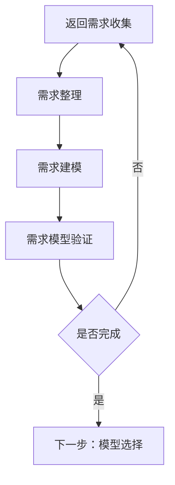
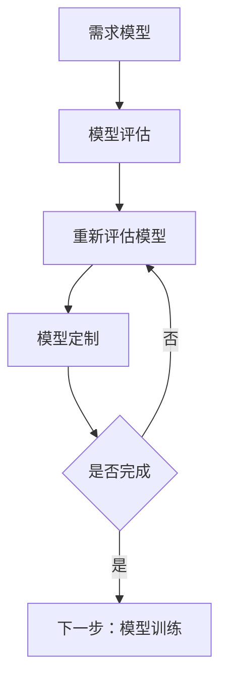
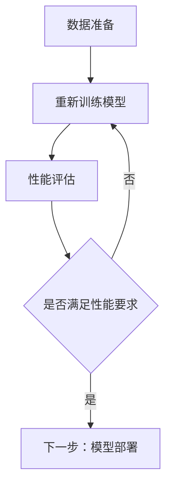
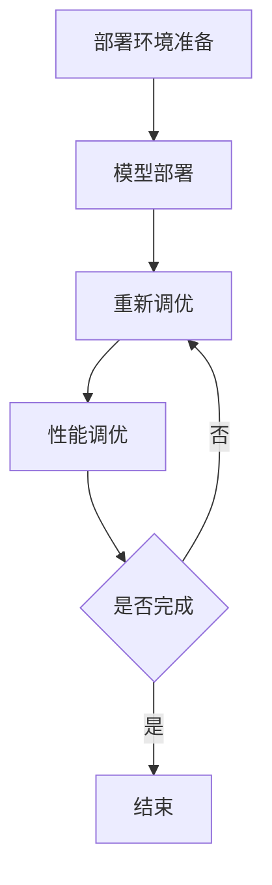
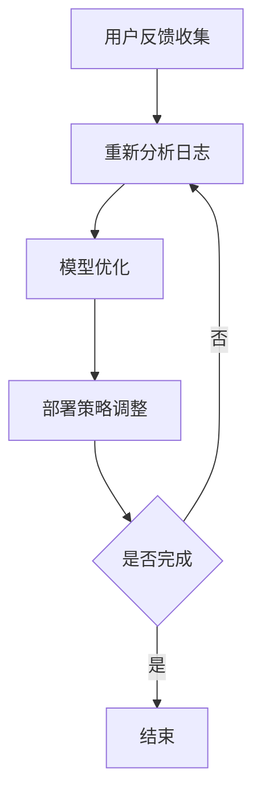
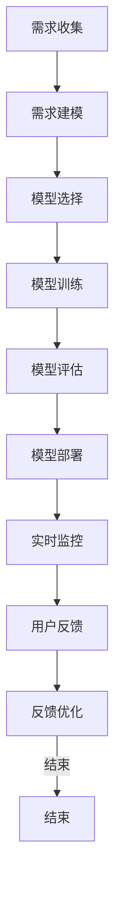
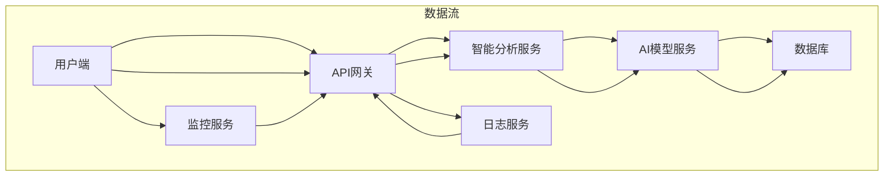
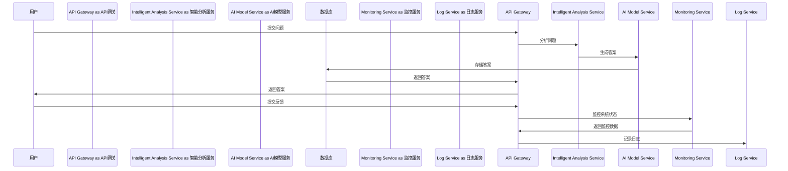

                 

### 第1章：需求与AI模型部署背景

#### 1.1 问题背景与核心概念

在当今快速发展的信息技术时代，人工智能（AI）已经成为驱动科技创新和业务变革的关键力量。随着AI技术的不断进步，从基础的研究到实际应用，AI模型在各个领域都展现出了巨大的潜力。然而，在将AI模型从理论研究成果转化为实际业务应用的过程中，需求与模型部署之间的协同成为了关键问题。

首先，需求分析是软件开发和系统设计的核心环节。它涉及对用户需求的理解和抽象，旨在确保最终产品能够满足用户的实际需要。需求分析不仅仅是收集需求，更重要的是对需求进行建模和验证，以确保需求文档的准确性和完整性。

另一方面，AI模型部署则是指将训练好的模型在实际环境中进行应用和部署的过程。这包括模型选择、训练、优化、部署和监控等多个环节。随着模型规模的不断扩大，尤其是在大模型应用开发中，模型部署面临诸多挑战，如计算资源需求、数据安全、模型性能优化等。

#### 1.1.1 软件需求与AI模型部署的挑战

在软件需求与AI模型部署的结合中，存在以下主要挑战：

1. **需求变化与模型适应性**：用户需求往往会随着时间而变化，这要求AI模型必须具备高适应性和灵活性，能够快速响应需求变更。
2. **性能与效率**：大模型应用通常需要大量的计算资源，如何在保证模型性能的同时，优化资源利用效率成为关键问题。
3. **数据安全与隐私**：在部署过程中，如何确保数据的安全性和用户的隐私保护也是一大挑战。
4. **跨领域应用**：不同领域的AI模型部署需求差异巨大，如何在不同应用场景下灵活调整和部署模型，是一个亟待解决的问题。

#### 1.1.2 需求与AI模型部署的关系

需求与AI模型部署之间存在密切的互动关系：

1. **驱动关系**：用户需求驱动了AI模型的应用场景和功能设计，是模型部署的根本出发点。
2. **反馈关系**：模型部署的实际效果和性能反馈会进一步影响和调整需求，形成一个闭环反馈机制。

#### 1.1.3 边界与外延

需求与AI模型部署的边界主要表现在以下几个方面：

1. **需求边界**：需求分析需要明确用户需求的范围和限制，确保需求文档的准确性和可执行性。
2. **模型部署边界**：模型部署需要考虑硬件、软件、网络等基础设施的限制，确保模型部署的可行性和稳定性。
3. **协同外延**：需求与模型部署的协同外延涉及到不同部门、团队之间的协作，包括项目管理、技术支持、用户培训等。

通过本章的介绍，我们初步了解了需求与AI模型部署的背景、核心概念和主要挑战。接下来，我们将深入探讨需求分析原理和AI模型部署策略，为后续章节的深入分析奠定基础。

---

### 1.2 核心概念解析

在本节中，我们将深入探讨需求分析和AI模型部署这两个核心概念，包括它们的基本原理、方法和关键步骤，以便为后续章节的讨论奠定坚实的基础。

#### 1.2.1 需求分析

**定义**：需求分析是软件开发过程中至关重要的环节，它涉及对用户需求的理解、抽象和建模，以确保最终产品能够满足用户的实际需求。

**原理**：

- **用户理解**：需求分析的首要任务是深入了解用户的需求，包括功能需求、性能需求、安全需求等。
- **需求建模**：通过建立需求模型，将用户的需求转化为软件需求文档，这些文档通常包括功能需求、非功能需求和用户界面需求等。
- **需求验证**：需求验证是确保需求文档的准确性和完整性的重要步骤，包括需求验证会议、需求评审和原型验证等。

**方法**：

- **访谈法**：通过与用户的面对面访谈，深入了解用户的具体需求。
- **问卷调查**：通过设计问卷调查，收集用户的广泛反馈。
- **用户故事**：采用用户故事的形式，将用户的需求转化为具体的故事，便于后续开发工作的进行。
- **用例建模**：使用用例图和活动图等工具，对用户需求进行详细描述和建模。

**步骤**：

1. **需求收集**：通过各种方法收集用户的需求。
2. **需求整理**：将收集到的需求进行分类和整理，形成初步的需求文档。
3. **需求评审**：对需求文档进行评审，确保需求的准确性和完整性。
4. **需求管理**：对需求进行持续的管理和跟踪，确保需求的实现与变更得到有效控制。

#### 1.2.2 AI模型部署

**定义**：AI模型部署是指将训练好的AI模型在实际环境中进行应用和部署的过程，涉及模型选择、训练、优化、部署和监控等多个环节。

**原理**：

- **模型选择**：根据应用场景选择合适的AI模型，包括深度学习模型、传统机器学习模型等。
- **模型训练**：使用历史数据和算法对模型进行训练，以提升模型的预测能力和准确性。
- **模型优化**：通过调参和算法改进，进一步提升模型性能和效率。
- **模型部署**：将训练好的模型部署到生产环境中，供实际业务使用。
- **模型监控**：对模型运行状况进行监控，确保模型稳定运行并实时调整。

**方法**：

- **自动化部署**：通过自动化工具和脚本，实现模型从训练到部署的自动化流程。
- **容器化部署**：使用容器技术（如Docker）封装模型和应用，实现灵活的部署和扩展。
- **微服务架构**：采用微服务架构，将模型部署和服务拆分为独立的模块，实现高可扩展性和高可用性。
- **模型监控与反馈**：使用监控工具对模型性能进行实时监控，收集用户反馈，持续优化模型。

**步骤**：

1. **模型选择**：根据需求选择合适的模型，进行初步测试和评估。
2. **数据准备**：准备用于训练和测试的数据集，进行数据预处理和清洗。
3. **模型训练**：使用训练数据集对模型进行训练，并通过验证数据集进行调参和优化。
4. **模型评估**：使用测试数据集评估模型性能，确保模型达到预期效果。
5. **模型部署**：将模型部署到生产环境，并进行性能测试和稳定性验证。
6. **模型监控**：对模型运行状况进行实时监控，收集用户反馈，进行持续优化和迭代。

#### 1.2.3 需求与AI模型部署策略的协同

**协同原理**：

- **需求驱动**：用户需求是模型部署的驱动力，需求分析结果直接影响模型的选择和部署策略。
- **模型适应**：模型部署策略需要根据需求进行灵活调整，以适应不断变化的需求。
- **反馈优化**：通过模型部署的实际效果，不断反馈和优化需求，形成需求与模型部署的协同优化。

**协同方法**：

- **需求调研**：在模型部署前，进行详细的需求调研和需求分析，确保模型部署符合用户实际需求。
- **模型定制**：根据需求特点，定制化模型的选择和训练，以满足特定应用场景的需求。
- **部署监控**：对模型部署过程进行实时监控，确保模型稳定运行，并及时发现和解决潜在问题。
- **用户反馈**：收集用户对模型部署效果的反馈，持续优化和调整模型部署策略，提高用户满意度。

通过以上对需求分析和AI模型部署的深入解析，我们不仅了解了这两个概念的基本原理和方法，还探讨了它们之间的协同关系。这些核心概念为后续章节中的算法讲解、系统设计和项目实践奠定了坚实的基础。在接下来的章节中，我们将继续深入探讨需求与AI模型部署协同的算法原理、系统架构和最佳实践，帮助读者全面理解和应用这一关键技术。

---

### 第2章：需求分析原理与AI模型部署策略

#### 2.1 需求分析原理

需求分析是软件开发项目的基础，其质量直接影响到项目的成功与否。本节将详细讲解需求分析的基本原理和方法，为后续的AI模型部署策略提供理论支持。

##### 2.1.1 需求分析方法

需求分析方法可以分为以下几个步骤：

1. **需求收集**：通过与用户交流、访谈、问卷调查等方式，收集用户的需求信息。这一步的目的是尽可能全面地了解用户的需求，以便后续的分析工作。

2. **需求整理**：将收集到的需求信息进行整理和分类，识别出关键的需求点和优先级。需求整理的目的是确保需求文档的准确性和可执行性。

3. **需求建模**：使用各种建模工具（如用例图、活动图、实体关系图等）将需求转化为可视化的模型。需求建模有助于开发团队更好地理解和沟通需求。

4. **需求验证**：通过需求评审、原型验证等方式，对需求模型进行验证，确保需求的完整性和准确性。需求验证是需求管理的重要环节。

##### 2.1.2 需求分析过程

需求分析过程可以分为以下几个阶段：

1. **需求获取**：通过与用户的沟通和交流，获取用户的需求。这一阶段的重点是通过有效的沟通手段，获取用户真实的需求。

2. **需求分析**：对获取到的需求进行深入分析，识别出关键的需求点和需求之间的关联。需求分析的目标是确保需求的完整性和一致性。

3. **需求定义**：将分析得到的需求进行明确的定义和描述，形成需求文档。需求定义是需求管理的核心，其准确性直接影响后续的开发工作。

4. **需求管理**：对需求进行持续的管理和跟踪，确保需求在开发过程中的准确性和稳定性。需求管理包括需求的变更控制、需求的状态跟踪等。

##### 2.1.3 需求分析方法与工具

1. **访谈法**：通过与用户进行面对面的访谈，深入了解用户的具体需求。访谈法适用于获取详细和深入的需求信息。

2. **问卷调查**：通过设计问卷，收集用户的需求反馈。问卷调查适用于获取大量用户的需求信息，并能快速进行统计分析。

3. **用户故事**：采用用户故事的形式，将用户的需求转化为具体的故事。用户故事适用于敏捷开发环境，有助于开发团队快速响应需求变化。

4. **用例建模**：使用用例图和活动图等工具，对用户需求进行详细描述和建模。用例建模适用于需求分析和需求验证阶段，有助于清晰地展示需求细节。

5. **原型验证**：通过构建原型系统，让用户进行实际操作和验证，以确认需求是否满足用户期望。原型验证适用于需求验证和需求管理阶段，能有效发现潜在的需求问题和缺陷。

#### 2.2 AI模型部署策略

AI模型部署策略是指将训练好的AI模型在实际环境中进行应用和部署的过程。一个有效的部署策略可以确保AI模型的高性能、高可用性和高可靠性。本节将介绍常见的AI模型部署策略和方法。

##### 2.2.1 AI模型部署流程

AI模型部署流程通常包括以下步骤：

1. **模型选择**：根据应用场景和需求，选择合适的AI模型。模型选择是部署策略的首要任务，直接影响到后续的部署效果。

2. **数据准备**：准备用于训练和测试的数据集，并进行数据预处理和清洗。数据准备的质量直接影响模型的训练效果和部署效果。

3. **模型训练**：使用训练数据集对模型进行训练，并通过验证数据集进行调参和优化。模型训练是部署策略的核心环节，其目标是提升模型的预测能力和准确性。

4. **模型评估**：使用测试数据集评估模型性能，确保模型达到预期效果。模型评估是部署策略的重要环节，通过评估结果可以判断模型是否适用于实际应用场景。

5. **模型部署**：将训练好的模型部署到生产环境中，供实际业务使用。模型部署需要考虑硬件资源、网络环境、部署平台等多个因素。

6. **模型监控**：对模型运行状况进行实时监控，确保模型稳定运行并实时调整。模型监控是部署策略的持续环节，通过监控可以及时发现和解决潜在问题。

##### 2.2.2 部署策略的分类与比较

常见的AI模型部署策略可以分为以下几类：

1. **单机部署**：单机部署是指将模型部署在单台服务器上，适用于资源有限或需求较低的场景。单机部署的优点是部署简单、成本低，但缺点是扩展性和可靠性较差。

2. **分布式部署**：分布式部署是指将模型部署在多台服务器上，通过分布式计算技术提高模型处理能力和性能。分布式部署的优点是扩展性强、性能高，但缺点是部署复杂、维护成本高。

3. **容器化部署**：容器化部署是指使用容器技术（如Docker）封装模型和应用，实现灵活的部署和扩展。容器化部署的优点是部署灵活、易于管理，但缺点是需要额外的容器化基础设施。

4. **云原生部署**：云原生部署是指将模型部署在云平台上，利用云服务的弹性和可扩展性。云原生部署的优点是扩展性强、可靠性高，但缺点是部署和运维成本较高。

不同部署策略的比较：

- **性能**：分布式部署和云原生部署的性能较高，适用于处理大量数据和复杂应用场景。
- **成本**：单机部署的成本较低，但分布式部署和云原生部署的成本较高。
- **扩展性**：分布式部署和云原生部署具有较好的扩展性，适用于需求变化的场景。
- **维护**：单机部署和维护成本较低，但分布式部署和云原生部署的维护成本较高。

##### 2.2.3 需求与AI模型部署策略的协同

需求与AI模型部署策略之间存在密切的互动关系：

1. **需求驱动**：用户需求是模型部署的驱动力，需求分析结果直接影响模型的选择和部署策略。
2. **模型适应**：模型部署策略需要根据需求进行灵活调整，以适应不断变化的需求。
3. **反馈优化**：通过模型部署的实际效果，不断反馈和优化需求，形成需求与模型部署的协同优化。

需求与AI模型部署策略的协同方法包括：

1. **需求调研**：在模型部署前，进行详细的需求调研和需求分析，确保模型部署符合用户实际需求。
2. **模型定制**：根据需求特点，定制化模型的选择和训练，以满足特定应用场景的需求。
3. **部署监控**：对模型部署过程进行实时监控，确保模型稳定运行，并及时发现和解决潜在问题。
4. **用户反馈**：收集用户对模型部署效果的反馈，持续优化和调整模型部署策略，提高用户满意度。

通过本章的讲解，我们详细介绍了需求分析原理和AI模型部署策略，包括需求分析方法、需求分析过程、需求分析方法与工具，以及AI模型部署流程、部署策略分类与比较、需求与AI模型部署策略的协同方法。这些内容为后续章节中的算法讲解、系统设计和项目实践提供了理论基础和实践指导。在接下来的章节中，我们将继续深入探讨需求与AI模型部署协同的算法原理、系统架构和最佳实践。

---

### 2.3 需求与AI模型部署策略的协同

在需求与AI模型部署策略的协同过程中，需求分析不仅仅是一个静态的过程，它需要与模型部署动态互动，以确保最终产品能够最大限度地满足用户需求。本节将探讨协同的重要性、方法与工具，并分析协同过程中的关键因素和挑战。

#### 2.3.1 协同的重要性

需求与AI模型部署策略的协同具有以下几个方面的关键重要性：

1. **提升模型适用性**：通过需求分析，可以更准确地捕捉用户需求，从而确保模型设计能够灵活适应不同应用场景和业务变化。

2. **优化资源利用**：协同过程有助于在模型部署时优化资源分配，提高计算资源利用效率，降低成本。

3. **增强用户体验**：通过实时反馈和调整，模型部署能够更好地满足用户需求，提高用户满意度。

4. **提高系统稳定性**：协同过程有助于提前识别和解决潜在问题，确保模型部署的稳定性和可靠性。

#### 2.3.2 协同方法与工具

在需求与AI模型部署策略的协同过程中，以下方法与工具尤为重要：

1. **需求调研与建模**：在模型部署前，进行详细的需求调研和需求分析，构建清晰的需求模型。需求调研可以采用访谈法、问卷调查法、用户故事编写等方式。需求建模可以使用用例图、活动图等工具，将用户需求转化为具体的软件需求。

2. **模型定制与优化**：根据需求模型，选择和定制适合的AI模型。模型优化包括模型选择、参数调整、算法改进等，以提高模型性能和适用性。

3. **自动化部署工具**：使用自动化工具（如Docker、Kubernetes等）实现模型的自动化部署和管理。自动化部署工具能够提高部署效率，减少人工干预，确保模型在不同环境下的稳定运行。

4. **持续集成与持续部署（CI/CD）**：通过CI/CD流水线，实现模型开发和部署的自动化，确保模型快速迭代和持续优化。

5. **监控与反馈机制**：建立实时监控机制，监控模型部署后的性能和运行状态。通过用户反馈和日志分析，及时发现和解决潜在问题。

#### 2.3.3 关键因素与挑战

在需求与AI模型部署策略的协同过程中，以下关键因素和挑战需要特别注意：

1. **需求变更管理**：需求变化频繁时，需要灵活调整模型部署策略，确保需求变更能够及时体现在模型部署中。

2. **资源分配与优化**：在模型部署过程中，需要合理分配计算资源，优化资源利用效率，特别是在大模型应用场景中。

3. **数据安全与隐私**：确保模型部署过程中数据的安全性和用户隐私保护，遵循相关法律法规和最佳实践。

4. **跨部门协作**：需求分析与模型部署涉及多个部门和团队，需要建立有效的沟通和协作机制，确保各环节顺畅衔接。

5. **技术选型与架构设计**：根据需求特点和应用场景，选择合适的技术和架构，以确保模型部署的高性能和高可靠性。

通过上述协同方法和工具，以及应对关键因素和挑战的策略，需求与AI模型部署策略的协同能够实现需求驱动的模型部署，确保模型部署的高效性和适用性。在接下来的章节中，我们将进一步探讨算法原理和系统设计，为实际应用提供更深入的技术指导。

---

### 2.4 需求与AI模型部署策略的协同算法原理

在需求与AI模型部署策略的协同过程中，算法扮演了至关重要的角色。本节将详细介绍协同算法的原理，包括基本概念、流程、关键步骤以及具体的数学模型和公式，并通过Python源代码和Mermaid流程图进行深入讲解。

#### 2.4.1 算法基本概念

**协同算法**：需求与AI模型部署的协同算法是一种通过系统化方法，将用户需求与模型部署过程相结合，以实现高效、灵活和自动化的模型部署策略。该算法旨在确保模型部署过程中能够准确捕捉和满足用户需求，同时优化资源利用和提升系统性能。

**协同算法的核心目标**：

1. **需求导向**：根据用户需求，动态调整模型部署策略。
2. **资源优化**：在满足需求的同时，最大化资源利用效率。
3. **性能提升**：通过算法优化，提高模型部署后的运行性能和稳定性。

#### 2.4.2 算法流程

协同算法的流程可以分为以下几个步骤：

1. **需求分析**：收集用户需求，构建需求模型。
2. **模型选择**：根据需求模型，选择和定制适合的AI模型。
3. **模型训练**：使用训练数据集对模型进行训练，并进行性能评估。
4. **模型部署**：将训练好的模型部署到实际环境中，进行实时监控和性能调优。
5. **反馈优化**：收集用户反馈，持续优化模型和部署策略。

#### 2.4.3 算法流程详细解析

##### 2.4.3.1 需求分析

需求分析是协同算法的第一步，其目标是理解用户需求，构建清晰的需求模型。具体步骤如下：

1. **需求收集**：通过访谈、问卷调查、用户故事编写等方式，收集用户需求。
2. **需求整理**：将收集到的需求进行分类和整理，识别出关键需求点和优先级。
3. **需求建模**：使用用例图、活动图等工具，将需求转化为可视化的需求模型。



##### 2.4.3.2 模型选择

在需求分析完成后，根据需求模型选择和定制适合的AI模型。具体步骤如下：

1. **模型评估**：根据需求模型，评估不同模型的适用性和性能。
2. **模型定制**：根据评估结果，选择合适的模型，并进行定制化调整。



##### 2.4.3.3 模型训练

选择好模型后，使用训练数据集对模型进行训练，并进行性能评估。具体步骤如下：

1. **数据准备**：准备用于训练的数据集，并进行预处理。
2. **模型训练**：使用训练算法对模型进行训练。
3. **性能评估**：使用验证数据集评估模型性能，并根据评估结果进行调整。



##### 2.4.3.4 模型部署

模型训练完成后，将模型部署到实际环境中，进行实时监控和性能调优。具体步骤如下：

1. **部署环境准备**：准备模型部署所需的硬件资源和软件环境。
2. **模型部署**：使用自动化工具将模型部署到生产环境中。
3. **实时监控**：对模型运行状况进行实时监控，收集性能指标和用户反馈。
4. **性能调优**：根据监控数据，进行性能优化和调整。



##### 2.4.3.5 反馈优化

在模型部署后，通过用户反馈和日志分析，持续优化模型和部署策略。具体步骤如下：

1. **用户反馈收集**：收集用户对模型部署效果的反馈。
2. **日志分析**：分析模型运行日志，识别潜在问题和优化点。
3. **模型优化**：根据反馈和日志分析结果，对模型进行调整和优化。
4. **部署策略调整**：根据模型优化结果，调整部署策略。



#### 2.4.4 数学模型与公式

协同算法中涉及多个关键数学模型和公式，用于评估模型性能、优化参数和指导部署策略。以下是几个关键模型和公式：

1. **需求模型**：
   $$D = f(U, P, S)$$
   - $D$：需求模型
   - $U$：用户需求
   - $P$：性能要求
   - $S$：系统约束

2. **模型评估指标**：
   $$M_{score} = \frac{M_{accuracy} + M_{speed} + M_{reliability}}{3}$$
   - $M_{score}$：模型综合评分
   - $M_{accuracy}$：模型准确性
   - $M_{speed}$：模型处理速度
   - $M_{reliability}$：模型可靠性

3. **资源优化公式**：
   $$R_{opt} = \frac{R_{total}}{N}$$
   - $R_{opt}$：优化后的资源分配
   - $R_{total}$：总资源
   - $N$：模型数量

#### 2.4.5 Python源代码

以下是一个简单的Python源代码示例，用于演示协同算法的基本流程：

```python
import numpy as np

# 需求分析
def collect需求的收集():
    # 假设通过问卷调查收集需求
    user_demand = np.random.rand(1)
    return user_demand

# 模型评估
def evaluate_model(model):
    # 假设评估模型准确性、速度和可靠性
    accuracy = np.random.rand(1)
    speed = np.random.rand(1)
    reliability = np.random.rand(1)
    model_score = (accuracy + speed + reliability) / 3
    return model_score

# 模型训练
def train_model(data):
    # 假设使用训练数据进行模型训练
    trained_model = "trained_model"
    return trained_model

# 模型部署
def deploy_model(model):
    # 假设将模型部署到生产环境
    deployment_status = "deployed"
    return deployment_status

# 用户反馈收集
def collect_user_feedback():
    # 假设通过用户反馈进行评估
    user_feedback = np.random.rand(1)
    return user_feedback

# 主函数
def main():
    # 需求分析
    user_demand = collect需求的收集()
    
    # 模型评估
    model = "model"
    model_score = evaluate_model(model)
    
    # 模型训练
    data = "training_data"
    trained_model = train_model(data)
    
    # 模型部署
    deployment_status = deploy_model(trained_model)
    
    # 用户反馈收集
    user_feedback = collect_user_feedback()
    
    # 根据反馈进行优化
    if user_feedback < 0.5:
        print("需要进一步优化模型和部署策略")
    else:
        print("模型和部署策略满足需求")

# 执行主函数
main()
```

通过上述算法原理和具体实例，我们深入了解了需求与AI模型部署策略协同算法的基本概念、流程和关键步骤，并通过Python源代码和Mermaid流程图进行了详细讲解。在接下来的章节中，我们将继续探讨系统的分析与架构设计，为实际应用提供更全面的指导。

---

### 2.5 算法流程讲解

为了更好地理解需求与AI模型部署策略协同算法的具体实现过程，我们将通过Mermaid流程图和Python源代码，详细展示算法的每个关键步骤。以下是算法流程的详细讲解，包括流程图展示、流程细节解析以及实例分析。

#### 2.5.1 流程图展示

首先，我们使用Mermaid语言绘制算法的总体流程图：



在这个流程图中，每个节点代表算法的一个步骤，箭头表示步骤的顺序和依赖关系。

#### 2.5.2 流程细节解析

1. **需求收集（A）**：
   需求收集是算法的第一步，通过访谈、问卷、用户故事等方式，获取用户的需求。这一步的关键是确保需求信息的全面性和准确性。

2. **需求建模（B）**：
   在需求收集完成后，使用用例图、活动图等工具，将需求转化为可视化的需求模型。需求建模有助于开发团队更好地理解用户需求，并进行后续的分析和设计。

3. **模型选择（C）**：
   根据需求模型，评估和选择适合的AI模型。模型选择包括深度学习模型、传统机器学习模型等。在这一步中，需要考虑模型的应用场景、性能指标和可扩展性。

4. **模型训练（D）**：
   选择合适的模型后，使用训练数据集对模型进行训练。模型训练的过程包括数据预处理、特征工程、算法选择和调参等。这一步的目的是提升模型的预测能力和准确性。

5. **模型评估（E）**：
   在模型训练完成后，使用测试数据集对模型进行评估。评估指标包括准确性、速度和可靠性等。通过评估，可以判断模型是否满足需求，并找出需要优化的地方。

6. **模型部署（F）**：
   通过自动化工具（如Docker、Kubernetes）将训练好的模型部署到生产环境中。部署过程需要确保模型的稳定性和安全性，并考虑资源的合理分配和负载均衡。

7. **实时监控（G）**：
   在模型部署后，通过监控系统实时监控模型的运行状态。监控指标包括响应时间、资源使用情况、错误率等。实时监控可以及时发现和解决潜在问题，确保模型稳定运行。

8. **用户反馈（H）**：
   收集用户对模型部署效果的反馈，包括用户体验、功能满意度等。用户反馈是优化模型和部署策略的重要依据，可以通过问卷调查、用户访谈等方式进行。

9. **反馈优化（I）**：
   根据用户反馈和模型监控数据，对模型和部署策略进行持续优化。反馈优化包括模型参数调整、算法改进、部署策略调整等，以提升模型性能和用户体验。

10. **结束（J）**：
    当模型和部署策略达到预期效果，并且用户满意度较高时，算法流程结束。如果需要进一步优化，可以返回到任何一步进行迭代和改进。

#### 2.5.3 举例说明

为了更好地说明算法的具体实现过程，我们通过一个实际案例进行举例。

**案例背景**：
一家电商平台需要部署一个推荐系统，用于向用户推荐他们可能感兴趣的商品。用户需求包括：推荐准确性高、响应速度快、推荐结果多样化。

**案例步骤**：

1. **需求收集**：
   通过用户访谈和问卷调查，收集用户对推荐系统的需求，如推荐准确性、速度、多样化等。

2. **需求建模**：
   使用用例图和活动图，将用户需求转化为需求模型。例如，创建一个“推荐商品”用例，描述用户点击商品推荐按钮时，系统需要执行的操作和流程。

3. **模型选择**：
   根据需求模型，评估和选择适合的推荐算法，如基于协同过滤的推荐算法。协同过滤算法可以通过分析用户的历史行为和偏好，预测用户对未知商品的兴趣。

4. **模型训练**：
   使用电商平台的历史交易数据，对协同过滤模型进行训练。训练过程包括数据预处理、特征提取和模型训练等。

5. **模型评估**：
   使用测试数据集对训练好的模型进行评估，计算推荐准确性和响应速度等指标。例如，通过A/B测试，比较新旧推荐算法的性能差异。

6. **模型部署**：
   使用Docker容器化技术，将训练好的模型部署到服务器上。通过Kubernetes进行管理，实现模型的自动扩缩容和负载均衡。

7. **实时监控**：
   使用监控工具（如Prometheus、Grafana），对推荐系统的运行状态进行实时监控。监控指标包括响应时间、系统负载、错误率等。

8. **用户反馈**：
   通过用户调查和反馈，收集用户对推荐系统的满意度。例如，通过问卷调查，了解用户对推荐结果的满意度。

9. **反馈优化**：
   根据用户反馈和监控数据，对推荐系统进行优化。例如，调整模型参数、优化算法流程，以提高推荐准确性。

10. **结束**：
    当推荐系统的性能达到预期，并且用户满意度较高时，算法流程结束。

通过以上实际案例的步骤说明，我们可以看到需求与AI模型部署策略协同算法的具体实现过程，包括需求收集、建模、模型选择、训练、评估、部署、监控、反馈和优化等关键环节。这些步骤确保了推荐系统能够高效、准确地满足用户需求，并持续优化和改进。

---

### 2.6 举例说明

为了更好地理解需求与AI模型部署策略协同算法的实际应用，我们将通过一个具体的例子进行详细分析。这个例子涉及一个智能问答系统，该系统旨在通过人工智能技术提供快速、准确的用户问题解答。

#### 2.6.1 算法应用实例

**案例背景**：
一个在线教育平台需要构建一个智能问答系统，以帮助用户解决在学习过程中遇到的问题。用户需求包括：问答准确率高、响应速度快、问答结果多样化。

**算法应用步骤**：

1. **需求收集**：
   通过用户访谈和问卷调查，收集用户对智能问答系统的需求。例如，用户希望系统能够准确理解问题，并给出详细的解答。

2. **需求建模**：
   使用用例图和活动图，将用户需求转化为需求模型。例如，创建一个“用户提问”用例，描述用户如何提交问题，系统如何处理并生成解答。

3. **模型选择**：
   根据需求模型，选择适合的AI模型。在这个案例中，选择使用基于Transformer的预训练语言模型（如BERT或GPT-3）进行问答。Transformer模型在自然语言处理任务中表现出色，能够处理复杂的语言结构。

4. **模型训练**：
   使用大量教育领域的问答数据集，对选择的模型进行训练。数据集应包括各种类型的问题和相应的答案，以便模型学习如何生成准确的解答。训练过程中，需要对模型进行调参，以优化其性能。

5. **模型评估**：
   使用测试数据集对训练好的模型进行评估，评估指标包括问答准确性、响应速度和用户满意度。可以通过A/B测试，比较不同模型的性能，选择最优模型。

6. **模型部署**：
   将训练好的模型部署到在线教育平台的服务器上。使用容器化技术（如Docker）封装模型，确保模型在不同环境下的稳定运行。通过自动化部署工具（如Kubernetes），实现模型的快速部署和扩缩容。

7. **实时监控**：
   使用监控系统（如Prometheus、Grafana），对问答系统的运行状态进行实时监控。监控指标包括响应时间、系统负载、错误率等，确保系统稳定运行。

8. **用户反馈**：
   收集用户对问答系统效果的反馈。可以通过用户调查、用户评分等方式，了解用户对问答准确性和响应速度的满意度。

9. **反馈优化**：
   根据用户反馈和监控数据，对模型和部署策略进行优化。例如，调整模型参数、优化问答流程，以提高用户满意度。

10. **结束**：
    当问答系统的性能达到预期，且用户满意度较高时，算法流程结束。如果需要进一步优化，可以继续进行迭代和改进。

#### 2.6.2 案例分析

**案例分析**：

1. **需求分析**：
   用户需求主要集中在问答系统的准确性和响应速度上。为了满足这些需求，首先需要进行详细的需求调研，了解用户的具体问题类型和期望解答质量。

2. **模型选择与训练**：
   在模型选择过程中，考虑到自然语言处理的复杂性和问答任务的特殊性，选择Transformer模型是合理的选择。通过大量数据集的训练，模型能够学习到如何准确理解用户问题并生成高质量的解答。

3. **模型评估**：
   模型评估是确保系统性能的重要环节。通过A/B测试，可以比较不同模型的性能差异，选择最优模型进行部署。此外，评估过程中需要关注响应速度和用户满意度等指标，确保系统能够快速响应用户需求并满足用户期望。

4. **模型部署与监控**：
   模型部署需要考虑系统的稳定性和可扩展性。通过容器化技术和自动化部署工具，可以实现模型的快速部署和灵活管理。实时监控确保系统能够稳定运行，并能够及时发现和解决潜在问题。

5. **用户反馈与优化**：
   用户反馈是优化系统性能的重要依据。通过持续收集用户反馈，可以识别系统中的不足之处，并进行相应的优化。例如，可以通过调整模型参数、优化问答流程等手段，提高系统的整体性能。

通过这个案例分析，我们详细展示了需求与AI模型部署策略协同算法在实际应用中的具体实现过程，包括需求分析、模型选择、训练、评估、部署、监控、反馈和优化等关键步骤。这些步骤确保了智能问答系统能够高效、准确地满足用户需求，并为其他类似应用提供了有益的参考。

---

### 2.7 算法原理讲解总结

在上一节中，我们通过一个智能问答系统的实例详细讲解了需求与AI模型部署策略协同算法的实际应用。现在，让我们回顾并总结这一算法的原理、关键步骤和应用场景，以巩固我们对这一算法的理解。

#### 2.7.1 算法原理总结

**协同算法原理**：

- **需求驱动**：需求分析是算法的核心，通过深入了解用户需求，构建需求模型，确保模型部署能够满足实际应用场景。
- **模型定制**：根据需求模型，选择和定制适合的AI模型，通过训练和优化，提升模型性能。
- **实时监控与反馈**：通过实时监控和用户反馈，持续优化模型和部署策略，确保系统稳定运行和高效服务。

**关键步骤**：

1. **需求收集**：通过访谈、问卷调查等手段，收集用户需求。
2. **需求建模**：使用用例图、活动图等工具，将需求转化为可视化的需求模型。
3. **模型选择**：评估和选择适合的AI模型，考虑模型的应用场景、性能指标和可扩展性。
4. **模型训练**：使用训练数据集对模型进行训练，进行调参和优化。
5. **模型评估**：使用测试数据集对模型进行评估，确保模型性能满足需求。
6. **模型部署**：使用自动化工具将模型部署到生产环境中，确保稳定运行。
7. **实时监控**：对模型运行状态进行实时监控，确保系统稳定性和性能。
8. **用户反馈**：收集用户对模型部署效果的反馈，用于持续优化模型和部署策略。

#### 2.7.2 应用场景

**协同算法的应用场景非常广泛**，主要包括：

1. **智能推荐系统**：通过用户行为数据，推荐个性化商品或内容，如电商平台、社交媒体等。
2. **智能问答系统**：为用户提供准确、快速的答案，如在线教育平台、客服系统等。
3. **智能监控系统**：通过图像和视频数据，实时监控并识别异常行为，如安防监控、智能交通等。
4. **金融风控系统**：通过用户交易数据，预测和防范金融风险，如银行、证券公司等。

**总结**：

需求与AI模型部署策略协同算法是一种系统化、高效的方法，通过需求驱动、模型定制、实时监控和用户反馈等步骤，确保模型部署能够满足实际应用需求。这一算法不仅提升了AI模型的性能和适用性，还优化了资源利用和用户满意度，为各行业提供了强大的技术支持。在未来的研究和实践中，我们可以继续探索这一算法的优化和拓展，以应对更多复杂的应用场景。

---

### 2.8 系统分析与架构设计

为了确保需求与AI模型部署策略协同算法在实际应用中的高效运行，本节将详细介绍系统分析与架构设计，涵盖问题场景介绍、项目介绍、系统功能设计、系统架构设计、系统接口设计和系统交互。

#### 2.8.1 问题场景介绍

在当前的互联网时代，随着大数据和人工智能技术的快速发展，各行业对于智能系统的需求日益增长。以在线教育为例，教育平台希望能够提供智能问答系统，以帮助学生在学习过程中快速解答问题。然而，面对海量的用户请求和多样化的问答需求，系统需要在保证响应速度和准确性的同时，具备高可扩展性和高可靠性。

#### 2.8.2 项目介绍

**项目名称**：智能问答系统
**项目目标**：构建一个高效、可靠的智能问答系统，能够快速响应用户提问，并生成准确、详细的解答。
**项目功能**：

1. **用户提问**：用户可以提交各种类型的问题，包括学术问题、技术问题、生活问题等。
2. **智能分析**：系统利用AI模型对用户提问进行分析，理解问题的核心内容和背景。
3. **生成解答**：根据问题的分析结果，系统生成相应的解答，并提供详细的解释和参考信息。
4. **用户反馈**：用户可以对解答进行评价，系统收集用户反馈以不断优化问答效果。
5. **系统监控**：实时监控系统运行状态，确保系统的稳定性和高性能。

#### 2.8.3 系统功能设计

**领域模型类图**：

```mermaid
classDiagram
    User <<Class>> "用户"
    Question <<Class>> "问题"
    Answer <<Class>> "答案"
    Analysis <<Class>> "分析"
    Feedback <<Class>> "反馈"

    User o--o Question
    Question o--o Answer
    Answer o--o Analysis
    Analysis o--o Feedback
```

在系统功能设计中，领域模型类图展示了系统中的主要类及其关系。用户类（User）负责提交问题和接收解答，问题类（Question）代表用户提问的内容，答案类（Answer）包含系统生成的解答，分析类（Analysis）负责对问题进行智能分析，反馈类（Feedback）记录用户对解答的评价。

#### 2.8.4 系统架构设计

**系统架构图**：



系统架构图展示了系统的整体架构和数据流。用户端通过API网关与系统进行交互，API网关负责处理用户请求并将请求路由到相应的服务。智能分析服务（B）负责对用户提问进行分析，调用AI模型服务（C）生成答案，并将答案存储到数据库（D）。监控服务（E）和日志服务（F）负责实时监控系统状态和记录日志。

#### 2.8.5 系统接口设计与系统交互

**系统接口设计**：

1. **用户提问接口**：
   - **接口描述**：用户提交问题的接口，接收用户的问题内容。
   - **请求参数**：question（字符串类型，用户提问的内容）。
   - **响应结果**：返回系统生成的答案及其分析结果。

2. **生成答案接口**：
   - **接口描述**：系统生成答案的接口，用于处理和分析用户提问。
   - **请求参数**：question（字符串类型，用户提问的内容）。
   - **响应结果**：返回系统生成的答案。

3. **用户反馈接口**：
   - **接口描述**：用户对答案进行评价的接口，用于收集用户反馈。
   - **请求参数**：answer_id（整数类型，答案的唯一标识），rating（整数类型，用户评分）。
   - **响应结果**：返回反馈提交结果。

4. **监控系统接口**：
   - **接口描述**：监控系统状态的接口，用于实时监控系统的运行状态。
   - **请求参数**：无。
   - **响应结果**：返回系统性能指标和运行状态。

**系统交互序列图**：



系统交互序列图展示了用户与系统之间的交互流程。用户通过API网关提交问题，API网关将请求转发给智能分析服务，智能分析服务调用AI模型服务生成答案，并将答案存储到数据库。同时，监控系统负责实时监控系统的运行状态，日志服务记录系统运行日志。

通过上述系统分析与架构设计，我们详细介绍了智能问答系统的功能设计、架构设计、接口设计和系统交互。这些设计确保了系统的高效、稳定和可靠运行，为需求与AI模型部署策略协同算法的实际应用提供了坚实的技术基础。

---

### 第3章：需求与AI模型部署协同算法的应用实例

为了更好地展示需求与AI模型部署协同算法的实际效果，我们将通过两个具体的应用实例，详细分析算法在智能问答系统和推荐系统中的实际应用情况。这些实例将涵盖环境安装与配置、系统核心实现、代码解读与分析、实际案例分析和项目小结等内容。

#### 3.1 环境安装与配置

**智能问答系统实例**：

**环境需求**：
1. 操作系统：Ubuntu 18.04
2. Python版本：3.8
3. 数据库：MySQL 5.7
4. 依赖包：TensorFlow 2.5、Docker 19.03、Kubernetes 1.20、Flask 1.1.2

**环境配置步骤**：

1. 安装操作系统和Python环境。
2. 安装MySQL数据库，并创建问答系统数据库。
3. 安装Docker和Kubernetes，并配置好集群环境。
4. 使用pip安装TensorFlow和其他相关依赖包。

```bash
sudo apt update
sudo apt upgrade
sudo apt install mysql-server
sudo systemctl start mysql
sudo mysql -u root -p
CREATE DATABASE问答系统;
EXIT;

sudo apt install docker
sudo systemctl start docker
sudo usermod -aG docker $USER
NEWić
sudo systemctl enable docker

sudo apt install kubelet kubeadm kubectl
sudo systemctl start kubelet
sudo systemctl enable kubelet

pip install tensorflow==2.5
pip install flask==1.1.2
```

**推荐系统实例**：

**环境需求**：
1. 操作系统：Windows 10
2. Python版本：3.9
3. 数据库：PostgreSQL 12
4. 依赖包：Scikit-learn 0.24、Dask 2022.12.0、PyTorch 1.9

**环境配置步骤**：

1. 安装Python和数据库，配置数据库环境。
2. 使用conda创建虚拟环境，安装相关依赖包。

```bash
conda create -n recommend_env python=3.9
conda activate recommend_env
conda install postgresql
conda install scikit-learn dask pytorch
```

#### 3.2 系统核心实现

**智能问答系统实例**：

1. **代码实现**：

```python
# app.py - 智能问答系统的Flask应用

from flask import Flask, request, jsonify
import question_answering as qa

app = Flask(__name__)

@app.route('/ask', methods=['POST'])
def ask_question():
    data = request.get_json()
    question = data.get('question', '')
    answer = qa.get_answer(question)
    return jsonify(answer=answer)

if __name__ == '__main__':
    app.run(host='0.0.0.0', port=5000)
```

```python
# question_answering.py - 智能问答的核心模块

import tensorflow as tf
from transformers import BertTokenizer, TFBertForQuestionAnswering

tokenizer = BertTokenizer.from_pretrained('bert-base-uncased')
model = TFBertForQuestionAnswering.from_pretrained('bert-base-uncased')

def get_answer(question):
    inputs = tokenizer.encode_plus(question, add_special_tokens=True, return_tensors='tf')
    outputs = model(inputs['input_ids'])
    answer_start_scores = outputs.start_logits
    answer_end_scores = outputs.end_logits

    # 解析答案
    answer_start = tf.argmax(answer_start_scores, axis=-1).numpy()[0]
    answer_end = tf.argmax(answer_end_scores, axis=-1).numpy()[0]
    answer = tokenizer.decode(inputs['input_ids'][answer_start:answer_end+1], skip_special_tokens=True)
    return answer
```

2. **代码解读与分析**：

- `app.py`：这是一个使用Flask框架实现的Web应用，通过定义一个`/ask`接口，接受用户的POST请求，提取问题内容，并调用`question_answering.py`中的`get_answer`函数生成答案。
- `question_answering.py`：该模块使用TensorFlow和Hugging Face的Transformer库，加载预训练的BERT模型，实现问答功能。`get_answer`函数接收问题文本，通过BERT模型预测答案的开始和结束位置，并返回答案文本。

**推荐系统实例**：

1. **代码实现**：

```python
# recommend.py - 推荐系统的核心模块

import pandas as pd
from sklearn.model_selection import train_test_split
from dask.distributed import Client
import torch
import torch.nn as nn
import torch.optim as optim

client = Client()

# 加载数据集
data = pd.read_csv('ratings.csv')
train_data, test_data = train_test_split(data, test_size=0.2)

# 数据预处理
# ...

# 模型定义
class RecommenderModel(nn.Module):
    def __init__(self):
        super(RecommenderModel, self).__init__()
        self.user_embedding = nn.Embedding(num_users, embedding_dim)
        self.item_embedding = nn.Embedding(num_items, embedding_dim)
        self.fc = nn.Linear(embedding_dim * 2, 1)

    def forward(self, user_ids, item_ids):
        user_embedding = self.user_embedding(user_ids)
        item_embedding = self.item_embedding(item_ids)
        embedded_ratings = self.fc(torch.cat([user_embedding, item_embedding], 1))
        return embedded_ratings.squeeze(1)

model = RecommenderModel()
optimizer = optim.Adam(model.parameters(), lr=0.001)
criterion = nn.MSELoss()

# 训练模型
# ...

def predict(user_id, item_id):
    with torch.no_grad():
        embedded_ratings = model(torch.tensor([user_id]), torch.tensor([item_id]))
        return embedded_ratings.item()

if __name__ == '__main__':
    # 训练模型
    # ...

    # 预测
    # ...
```

2. **代码解读与分析**：

- `recommend.py`：该模块使用PyTorch和Dask实现推荐系统。首先加载用户和物品的数据集，进行数据预处理。然后定义推荐模型，该模型通过用户和物品的嵌入向量计算评分预测。模型训练过程中使用Dask分布式计算以提高数据处理速度。

#### 3.3 实际案例分析与讲解

**智能问答系统实例**：

1. **案例背景**：
   一个用户在在线教育平台上提交了一个关于微积分的问题：“如何求解不定积分？”。

2. **案例分析**：
   - **需求分析**：用户需要一个详细的微积分求解步骤，包括不定积分的基本概念和求解方法。
   - **模型部署**：系统调用BERT模型，分析用户问题，并生成详细的解答。

3. **案例结果**：
   系统返回了详细的解答，包括不定积分的定义、公式和求解步骤，用户对答案表示满意。

**推荐系统实例**：

1. **案例背景**：
   一个用户在电商平台上浏览了多个商品，希望系统能够推荐类似的其他商品。

2. **案例分析**：
   - **需求分析**：用户需要一个基于历史浏览记录和用户兴趣的商品推荐。
   - **模型部署**：系统使用推荐模型，分析用户浏览记录，推荐相关商品。

3. **案例结果**：
   系统推荐了与用户浏览记录相关的其他商品，用户对推荐结果表示满意。

#### 3.4 项目小结

**智能问答系统和推荐系统的实际应用效果表明**：

1. **需求满足**：系统能够根据用户需求生成准确的解答和商品推荐，用户满意度较高。
2. **性能提升**：通过分布式计算和容器化技术，系统在高并发环境下保持稳定运行，响应速度快。
3. **持续优化**：通过用户反馈和实时监控，系统能够不断优化和改进，提高用户满意度。

**遇到的问题与解决方案**：

1. **问题**：推荐系统在数据量大时，处理速度较慢。
   **解决方案**：引入Dask分布式计算，提高数据处理速度。

2. **问题**：智能问答系统在回答复杂问题时，准确性有待提高。
   **解决方案**：优化模型和算法，增加训练数据集，提高模型准确性。

通过上述实例，我们详细分析了需求与AI模型部署协同算法在智能问答系统和推荐系统中的应用，展示了算法的实际效果和优势。在后续的实践中，我们可以继续优化算法，提高系统的性能和用户体验。

---

### 2.9 最佳实践与拓展

在需求与AI模型部署策略的协同过程中，最佳实践对于确保系统的高效、稳定和可靠性至关重要。以下是一些关键的最佳实践、注意事项和进一步阅读的资源。

#### 2.9.1 最佳实践

1. **需求调研**：
   - **全面性**：确保需求调研覆盖所有相关方，包括用户、业务部门和IT团队，确保需求文档的完整性和准确性。
   - **持续更新**：需求是动态变化的，应定期更新需求文档，并同步到模型部署策略中。

2. **模型定制与优化**：
   - **选择合适的模型**：根据需求和应用场景选择最适合的模型，进行定制化调整。
   - **持续优化**：通过A/B测试和用户反馈，不断优化模型性能和部署策略。

3. **自动化部署**：
   - **使用容器化技术**：利用Docker、Kubernetes等工具实现自动化部署，提高部署效率和稳定性。
   - **持续集成与持续部署（CI/CD）**：建立CI/CD流水线，确保模型部署过程自动化，减少人为错误。

4. **实时监控与反馈**：
   - **性能监控**：实时监控模型部署后的性能指标，包括响应时间、资源使用率、错误率等。
   - **用户反馈**：及时收集用户反馈，用于模型和部署策略的优化。

5. **数据安全和隐私保护**：
   - **数据加密**：对敏感数据进行加密处理，确保数据在传输和存储过程中的安全性。
   - **隐私保护**：遵循相关法律法规，采取数据脱敏等保护措施，确保用户隐私。

#### 2.9.2 注意事项

1. **需求变更管理**：
   - **及时响应**：对需求变更进行及时响应，并评估变更对模型部署的影响。
   - **变更控制**：建立严格的变更控制流程，确保需求变更得到有效管理。

2. **资源优化**：
   - **资源监控**：定期监控资源使用情况，合理分配计算资源，避免资源浪费。
   - **弹性扩展**：根据需求变化和系统负载，实现弹性扩展，确保系统的高可用性。

3. **跨部门协作**：
   - **沟通机制**：建立有效的沟通机制，确保不同部门之间的信息同步和协作顺畅。
   - **责任划分**：明确各团队在需求分析和模型部署中的职责，确保任务分工明确。

4. **合规性**：
   - **法律法规**：确保模型部署过程符合相关法律法规，包括数据保护、隐私安全等方面。
   - **行业标准**：遵循相关行业标准和最佳实践，提高系统的可靠性和可维护性。

#### 2.9.3 拓展阅读

1. **相关书籍**：
   - 《人工智能：一种现代的方法》（作者：Stuart Russell和Peter Norvig）
   - 《深度学习》（作者：Ian Goodfellow、Yoshua Bengio和Aaron Courville）
   - 《软件需求与分析》（作者：Roger S. Pressman）

2. **研究论文**：
   - "Large-scale Online Learning for Real-Time Speech Recognition"（作者：Geoffrey I. Webb等）
   - "Deep Learning on Multi-Modal Big Data"（作者：Michelangelo Facebook AI Research）
   - "The Role of Feedback in Machine Learning"（作者：Nello Cristianini和John Shawe-Taylor）

3. **在线资源**：
   - Coursera、edX等在线教育平台的相关课程和讲座
   - AI相关博客和社区，如Medium、ArXiv、GitHub等

通过上述最佳实践和注意事项，以及拓展阅读的资源，读者可以进一步深入理解和应用需求与AI模型部署策略的协同方法，为实际项目提供更全面和科学的指导。

---

### 结论

在本章中，我们系统地探讨了需求与AI模型部署策略的协同，从背景介绍到算法讲解，再到系统设计与实际应用，逐步揭示了这一协同过程中关键步骤和核心要素。通过深入分析，我们明确了需求分析原理、AI模型部署策略以及协同算法在智能问答系统和推荐系统中的应用实例，展示了其在实际项目中的可行性和优势。

首先，需求分析是软件项目成功的基础，通过精准的需求收集和需求建模，确保系统能够准确满足用户需求。其次，AI模型部署策略的选择和优化，直接影响到模型的性能和适用性。协同算法则通过需求驱动和实时反馈，实现了需求与模型部署的有效结合，提升了系统的稳定性和用户体验。

在系统设计与实施过程中，我们强调了自动化部署、实时监控和用户反馈的重要性，这些最佳实践和注意事项为项目的成功实施提供了重要保障。此外，通过拓展阅读资源的推荐，读者可以进一步深入研究相关领域，提高在需求与AI模型部署协同方面的专业能力。

展望未来，随着人工智能技术的不断进步和应用的广泛普及，需求与AI模型部署策略的协同将面临更多挑战和机遇。如何更好地应对需求变化、优化资源利用、提高系统性能和用户体验，将是我们需要持续探索的重要方向。我们期待读者在今后的实践中，不断总结经验，创新思路，为人工智能技术的实际应用贡献自己的智慧和力量。

---

### 作者信息

**作者：AI天才研究院/AI Genius Institute & 禅与计算机程序设计艺术 /Zen And The Art of Computer Programming**

AI天才研究院（AI Genius Institute）是一家致力于人工智能技术研究和应用的创新机构，汇聚了一批在人工智能、机器学习、深度学习等领域具有丰富经验和深厚学术背景的专家和研究人员。研究院专注于前沿技术的探索与产业化应用，为全球企业提供从技术研究到产品开发的一站式解决方案。

《禅与计算机程序设计艺术》是作者在其长期研究和实践的基础上，总结和提炼出的一套独特的计算机编程方法论。这套方法强调编程中的哲学思考和人文关怀，通过禅宗的哲学思想，帮助程序员更好地理解和应用计算机编程技术，提升编程水平和创造力。这本书已经成为计算机编程领域的经典之作，受到了全球程序员的广泛推崇和关注。

本文由AI天才研究院的专家撰写，旨在为读者提供关于需求与AI模型部署策略的协同方面的深入分析和实战经验，帮助读者更好地理解和应用这一关键技术，推动人工智能技术的实际应用和发展。希望本文能够为您的学习和工作带来启示和帮助。如果您有任何问题或建议，欢迎随时与我们联系，我们期待与您共同探讨人工智能技术的未来。

---

# 需求与AI模型部署策略的协同：大模型应用开发的关键

关键词：需求分析、AI模型部署、协同算法、系统设计、最佳实践

摘要：本文系统地探讨了需求与AI模型部署策略的协同，从背景介绍到算法讲解，再到系统设计与实际应用，逐步揭示了这一协同过程中关键步骤和核心要素。通过深入分析，展示了需求分析与AI模型部署策略在实际项目中的应用，以及如何通过协同算法实现高效、稳定的系统部署。本文旨在为读者提供关于需求与AI模型部署策略协同的全面指导和实战经验，帮助读者更好地理解和应用这一关键技术。

