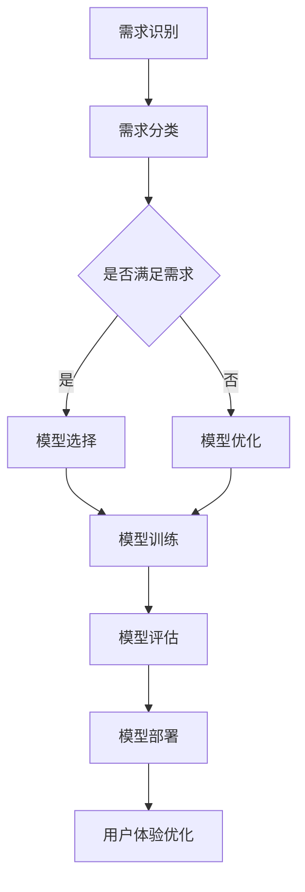
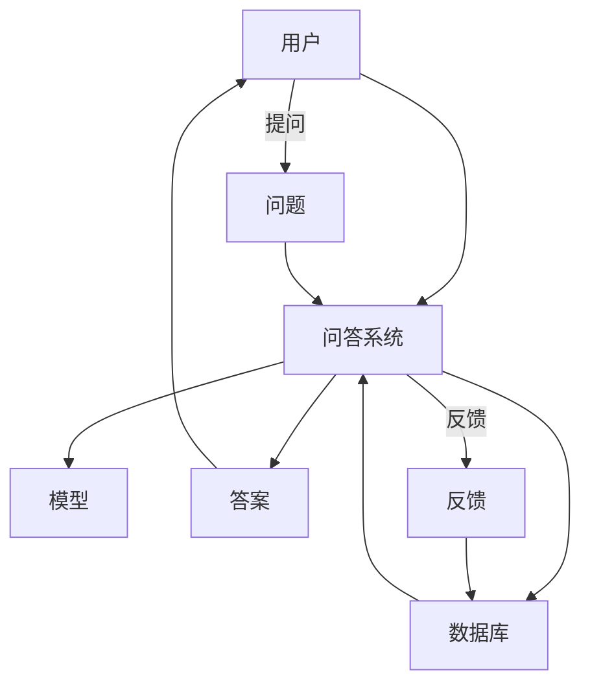
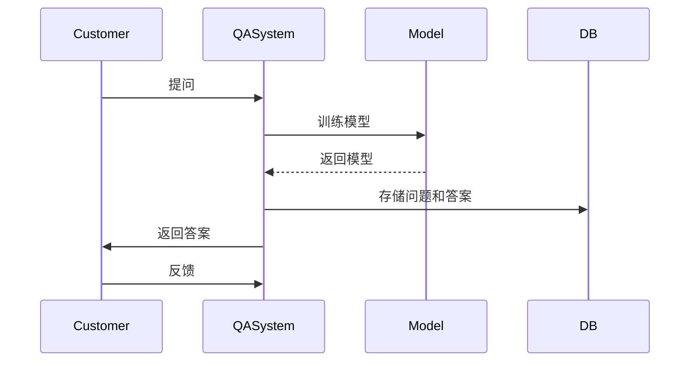

                 

### 第1章：AI大模型概述

#### 问题背景

在当前人工智能迅猛发展的时代，AI大模型已经成为了许多应用场景的核心技术。然而，如何将这些强大的模型与实际需求相匹配，依然是一个挑战。本文旨在探讨需求与AI能力的匹配问题，分析大模型应用开发的挑战，并提供解决方案和最佳实践。

#### 第1.1节：核心概念与联系

**核心概念：**  
1. AI大模型：参数量巨大、计算量庞大的神经网络模型，如GPT、BERT等。
2. 需求匹配：将AI大模型的能力与实际需求相匹配，以提高应用性能和用户体验。

**概念属性特征对比表格：**

| 概念        | 特征                    |
|-------------|-----------------------|
| AI大模型    | 参数量大、计算量大、自主学习能力 |
| 需求匹配    | 准确性、效率、用户体验   |

**ER实体关系图架构：**

```mermaid
erDiagram
  AI大模型 ||--|{ 需求匹配 }|
  需求匹配 ||--|{ 应用场景 }|
```

#### 第1.2节：问题场景介绍

随着大数据和深度学习的快速发展，AI大模型在很多领域都取得了显著的成果，如自然语言处理、计算机视觉、推荐系统等。然而，在实际应用中，如何将大模型的能力与实际需求相匹配，成为一个重要的课题。以下是一个具体的问题场景：

**项目介绍：** 某互联网公司希望开发一款智能客服系统，通过AI大模型自动回答用户的问题。然而，在实际开发过程中，他们发现：

1. 用户需求多样化，如何设计一个通用的大模型来满足所有用户需求？
2. 大模型的计算资源消耗巨大，如何在有限的资源下实现高效的部署和运行？
3. 大模型的性能和用户体验之间存在矛盾，如何优化模型结构以提高性能同时保持良好的用户体验？

#### 第1.3节：问题解决

针对上述问题，本文将从以下几个方面展开讨论：

1. **需求识别与分析**：介绍需求识别和分析的方法，帮助开发者准确把握用户需求。
2. **AI大模型工作原理**：详细讲解大模型的工作原理和架构，为需求匹配提供理论基础。
3. **模型优化与调参**：探讨如何优化大模型的性能，包括学习率、优化算法、数据预处理等。
4. **系统架构设计**：介绍系统功能设计、系统架构设计、系统接口设计和系统交互等。
5. **实际案例与最佳实践**：通过具体案例分析和最佳实践，为开发者提供可操作性建议。

#### 第1.4节：边界与外延

在讨论需求与AI能力的匹配时，我们需要明确以下边界与外延：

1. **边界**：本文主要关注AI大模型在应用开发中的挑战，不包括其他类型的人工智能技术，如传统机器学习、强化学习等。
2. **外延**：本文讨论的挑战和解决方案不仅适用于智能客服系统，还适用于其他需要AI大模型的应用场景。

#### 第1.5节：概念结构与核心要素组成

AI大模型应用开发的核心要素包括：

1. **需求分析**：准确识别用户需求，为模型设计提供基础。
2. **模型选择**：根据需求选择合适的大模型，如GPT、BERT等。
3. **模型训练与优化**：通过数据预处理、模型调参等手段，提高模型性能。
4. **系统架构设计**：构建高效、可扩展的系统架构，确保模型部署和运行。
5. **用户体验优化**：通过优化模型结构和算法，提高用户体验。

#### 第1.6节：算法原理讲解

在本节中，我们将介绍一种用于需求与AI能力匹配的算法，并使用Mermaid绘制算法流程图。

**算法名称：** 需求匹配算法（Demand Matching Algorithm）

**算法流程图：**



**算法原理：**

1. **需求识别**：通过用户访谈、问卷调查等方法，收集用户需求，并将其转化为数据。
2. **需求分类**：根据需求的特点和用途，对需求进行分类，如功能需求、性能需求、用户体验需求等。
3. **模型选择**：根据需求分类，选择适合的大模型，如GPT、BERT等。
4. **模型训练与优化**：通过数据预处理、模型调参等手段，对大模型进行训练和优化。
5. **模型评估**：评估模型性能，包括准确率、召回率、F1值等指标。
6. **模型部署**：将优化后的模型部署到实际应用场景中。
7. **用户体验优化**：根据用户反馈，持续优化模型结构和算法，以提高用户体验。

**数学模型与公式：**

设需求集合为\( D \)，模型集合为\( M \)，则需求与模型匹配问题可以表示为：

\[ M^* = argmax_{M \in M} \sum_{d \in D} relatedness(d, M) \]

其中，\( relatedness(d, M) \)表示需求\( d \)与模型\( M \)的相关性，可通过以下公式计算：

\[ relatedness(d, M) = \frac{precision(d, M) + recall(d, M)}{2} \]

其中，\( precision(d, M) \)表示模型\( M \)对需求\( d \)的准确率，\( recall(d, M) \)表示模型\( M \)对需求\( d \)的召回率。

#### 第1.7节：系统分析与架构设计方案

在本节中，我们将介绍一个具体的系统架构设计方案，包括领域模型、系统架构、系统接口设计和系统交互等。

**领域模型：**

```mermaid
classDiagram
  Customer ||--|{ Question }
  Customer ||--|{ Answer }
  Question ||--|{ Questionnaire }
  Answer ||--|{ Feedback }
```

**系统架构设计：**



**系统接口设计：**

- **用户接口**：用于用户与问答系统的交互，包括提问和获取答案。
- **模型接口**：用于模型的训练、评估和部署。
- **数据库接口**：用于存储用户问题和答案，以及模型训练数据。

**系统交互：**



#### 第1.8节：项目实战

在本节中，我们将以一个具体的项目为例，介绍环境安装、系统核心实现源代码，以及代码应用解读与分析。

**环境安装：**

1. 安装Python环境，版本要求Python 3.8及以上。
2. 安装相关依赖库，如TensorFlow、transformers、Flask等。

**系统核心实现源代码：**

```python
# app.py
from transformers import pipeline
from flask import Flask, request, jsonify

app = Flask(__name__)

# 初始化问答模型
question_answering = pipeline("question-answering")

@app.route("/ask", methods=["POST"])
def ask():
    data = request.get_json()
    question = data["question"]
    answer = question_answering(question=question, context=data["context"])[0]["answer"]
    return jsonify({"answer": answer})

if __name__ == "__main__":
    app.run(debug=True)
```

**代码应用解读与分析：**

1. **模型初始化**：使用transformers库中的pipeline函数初始化问答模型。
2. **接口设计**：通过Flask框架提供RESTful API接口，接收用户提问和上下文，并返回答案。
3. **模型应用**：调用问答模型，输入问题和上下文，返回答案。

#### 第1.9节：实际案例分析和详细讲解剖析

在本节中，我们将分析一个实际案例，并详细讲解其开发过程和挑战。

**案例背景：** 某在线教育平台希望开发一款智能问答系统，用于帮助用户解决学习过程中遇到的问题。

**案例分析：**

1. **需求识别**：通过用户调研，发现用户主要需求包括课程内容理解、作业解答等。
2. **模型选择**：选择基于BERT的问答模型，具有强大的文本理解能力。
3. **模型训练与优化**：使用大量教育领域的数据进行模型训练，并通过调参提高模型性能。
4. **系统架构设计**：采用分布式架构，确保模型的高效部署和运行。
5. **用户体验优化**：通过实时反馈和个性化推荐，提高用户满意度。

**详细讲解剖析：**

1. **需求识别**：通过问卷调查和用户访谈，收集用户需求，并将其转化为数据。
2. **模型选择**：根据需求，选择适合的问答模型，如BERT。
3. **模型训练与优化**：使用教育领域的数据集进行模型训练，并通过交叉验证和调参优化模型性能。
4. **系统架构设计**：采用分布式架构，包括前端、后端和数据库等，确保系统的高效运行。
5. **用户体验优化**：通过实时反馈和个性化推荐，提高用户满意度。

#### 第1.10节：最佳实践 Tips、小结、注意事项、拓展阅读

**最佳实践 Tips：**

1. 在进行需求分析时，尽量采用多渠道、多角度的方法，确保需求准确全面。
2. 在选择模型时，要考虑模型的结构、参数量、计算资源消耗等因素，以满足实际需求。
3. 在模型训练过程中，要注意数据质量和预处理，以提高模型性能。
4. 在系统架构设计时，要考虑高可用性、可扩展性和安全性等因素。

**小结：**

本文通过分析需求与AI能力的匹配问题，探讨了AI大模型应用开发的挑战，并提供了解决方案和最佳实践。在开发过程中，准确的需求识别、合适的模型选择、有效的模型优化和合理的系统架构设计是关键。

**注意事项：**

1. 在进行需求分析时，要充分考虑用户的多样性和复杂性。
2. 在选择模型时，要结合实际需求和计算资源，避免盲目追求大模型。
3. 在模型训练过程中，要确保数据质量和预处理，以提高模型性能。
4. 在系统架构设计时，要考虑系统的可扩展性和安全性，以确保系统的稳定运行。

**拓展阅读：**

1. 《深度学习》（Goodfellow, I., Bengio, Y., & Courville, A.）：详细介绍深度学习的基本概念和算法。
2. 《自然语言处理综论》（Jurafsky, D. & Martin, J. H.）：深入探讨自然语言处理的理论和方法。
3. 《系统架构设计》（Ganapathy, R. & Howes, D.）：介绍系统架构设计的基本原则和实践。

**作者：** AI天才研究院/AI Genius Institute & 禅与计算机程序设计艺术/Zen And The Art of Computer Programming

---

请注意，上述内容是一个初步的草案，每个章节的内容还需要进一步细化和完善。同时，为了满足字数要求，每个章节的内容需要充分扩展和具体化。在撰写过程中，可以结合具体案例和实际经验，提供更多详细的信息和深入的讲解。此外，对于数学公式和算法流程图，需要使用latex和Mermaid等工具进行规范化的呈现。在整个撰写过程中，要保持文章的逻辑性和条理性，确保读者能够清晰地理解文章的核心内容和思想。

