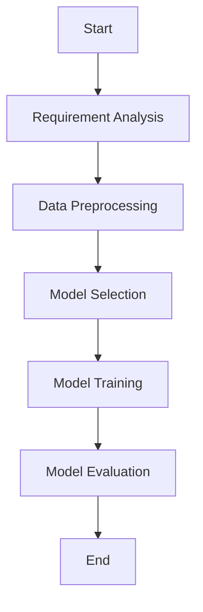
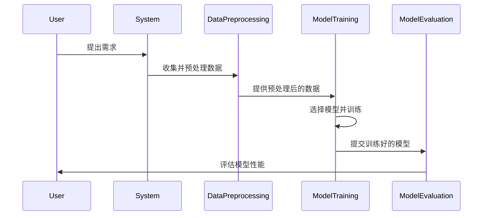

                 

### 需求与AI训练数据的关联：大模型应用开发的关键

关键词：需求分析、AI训练数据、大模型、应用开发、关键

摘要：本文将探讨需求与AI训练数据之间的紧密关联，以及这种关联在开发大型AI模型应用中的关键作用。我们将一步步分析如何将实际业务需求转化为可训练的数据集，并深入讨论大模型在应用开发中的挑战和策略。通过详细的讲解和实例，本文旨在为开发者提供理解和解决这一问题的实用方法。

---

### 背景介绍

#### 核心概念

在软件开发和人工智能领域，几个核心概念是我们理解和分析问题的基石。

**需求**

在软件开发中，需求是指用户对软件系统的功能、性能和设计的要求。这些需求可能来自于用户直接提出，也可能来自于市场分析、业务流程优化等多个方面。需求分析是软件开发过程中的第一步，其目标是明确软件需要实现的功能和性能指标。

**AI训练数据**

AI训练数据是在AI模型训练过程中使用的数据集。这些数据帮助模型学习如何执行特定的任务，如图像识别、自然语言处理等。数据的质量和数量直接影响模型的性能和泛化能力。

**大模型**

大模型是指具有巨大参数量的AI模型，如GPT、BERT等。这些模型因其强大的学习能力和复杂度，在多个领域取得了显著的成果。然而，大模型也带来了训练时间、计算资源消耗和数据需求等方面的挑战。

#### 问题解决

在软件开发过程中，如何将用户的需求转化为AI模型的可训练数据是一个关键问题。传统的方法可能涉及手动编写规则或使用有限的样本进行训练，而现代AI技术则依赖于大规模数据集和高性能计算。

首先，我们需要深入理解用户的需求，并将其转化为具体的功能和性能指标。然后，通过数据收集、清洗和预处理，将原始数据转化为适合模型训练的形式。最后，选择合适的大模型，并进行训练和优化，以实现需求。

#### 边界与外延

本文将主要探讨需求与AI训练数据的关联性，重点关注以下几个方面：

1. **需求分析**：如何提取和理解用户需求，并将其转化为可操作的指标。
2. **数据预处理**：如何处理和清洗数据，以提高模型的训练效果。
3. **大模型选择**：如何选择适合特定任务的大模型，以及其训练策略。
4. **模型训练与评估**：如何利用需求相关的训练数据进行模型训练，并进行性能评估。

#### 概念结构与核心要素组成

1. **需求分析**：通过用户调研、业务流程分析等方法，提取关键需求。
2. **数据预处理**：包括数据清洗、格式化、增强数据集等。
3. **大模型选择**：选择具有良好性能和适用性的大模型。
4. **模型训练**：利用需求相关的训练数据进行模型训练。
5. **模型评估**：评估模型性能，调整训练策略。

### 核心概念与联系

#### 核心概念原理

**需求分析**

需求分析是理解用户需求的过程，包括功能需求、性能需求、设计需求等。通过需求分析，我们可以明确软件需要实现的目标和指标。

**数据预处理**

数据预处理包括数据清洗、归一化、增强数据集等步骤。这些步骤有助于提高数据质量，从而提高模型训练的效果。

**大模型原理**

大模型通常基于深度学习技术，具有大量的参数和复杂的网络结构。这些模型通过在大量数据集上训练，可以学习到复杂的模式和关系。

#### 概念属性特征对比表格

| 概念       | 属性特征                     |
|------------|------------------------------|
| 需求       | 功能性、性能性、易用性等       |
| AI训练数据 | 样本量、数据质量、标注准确性等 |
| 大模型     | 参数量、训练时间、模型精度等   |

#### ER实体关系图架构

```mermaid
erDiagram
  User ||--|{ Requirement }||>
  Requirement ||--|{ AI Training Data }||>
  AI Training Data ||--|{ Large Model }||>
```

### 算法原理讲解

#### 算法mermaid流程图



#### Python源代码

```python
# 伪代码
def demand_to_training_data(demand):
    # 需求分析
    analyzed_demand = analyze_demand(demand)
    
    # 数据预处理
    preprocessed_data = preprocess_data(analyzed_demand)
    
    # 模型选择
    model = select_model(preprocessed_data)
    
    # 模型训练
    trained_model = train_model(model, preprocessed_data)
    
    # 模型评估
    evaluation = evaluate_model(trained_model)
    
    return evaluation
```

#### 算法原理的数学模型和公式

$$
\text{Training Dataset} = \{ (x_i, y_i) \mid i = 1, \ldots, n \}
$$

$$
\text{Loss Function} = \frac{1}{n} \sum_{i=1}^{n} \ell(y_i, \hat{y}_i)
$$

$$
\text{Optimization Objective} = \min_{\theta} \ell(y, \hat{y})
$$

#### 举例说明

假设我们有一个图像分类任务，用户需求是将图像分为猫和狗两类。首先，我们需要收集大量的猫和狗的图像，并对这些图像进行标注。接下来，通过数据预处理步骤，对图像进行格式化和增强。然后，选择一个合适的卷积神经网络模型，如ResNet，对图像进行训练。在模型训练过程中，使用损失函数（如交叉熵损失）来评估模型的性能，并使用梯度下降算法来优化模型参数。最后，通过测试集对训练好的模型进行评估，以确定其分类准确率。

### 系统分析与架构设计方案

#### 问题场景介绍

在许多企业和组织中，AI技术被用于提高业务效率和做出更准确的决策。例如，一家零售公司希望使用AI模型预测顾客购买行为，从而优化库存管理和营销策略。这个场景中，需求分析、数据预处理、模型选择、训练和评估是关键步骤。

#### 项目介绍

本项目旨在开发一个AI预测系统，用于分析用户行为数据，预测购买概率。项目的主要目标是提高预测准确性，降低库存成本，并提高客户满意度。

#### 系统功能设计

1. **需求收集与分析**：通过用户调研、数据分析等方法，收集用户行为数据，并进行分析，提取关键特征。
2. **数据预处理与清洗**：对收集到的数据进行清洗、格式化和增强，以提高数据质量。
3. **模型选择与训练**：选择合适的模型，如决策树、随机森林或神经网络，并使用预处理后的数据进行训练。
4. **模型评估与优化**：使用测试集评估模型性能，并根据评估结果调整模型参数，以提高预测准确性。

#### 系统架构设计



### 项目实战

在本节中，我们将展示如何在实际项目中实现上述系统。以下是一个简化的步骤，用于描述项目的环境安装、核心实现和代码应用解读与分析。

#### 环境安装

1. 安装Python环境：确保Python版本在3.7及以上。
2. 安装必要的库：使用pip安装TensorFlow、Scikit-learn、Pandas等库。

```bash
pip install tensorflow scikit-learn pandas
```

#### 系统核心实现源代码

```python
import tensorflow as tf
from sklearn.model_selection import train_test_split
from sklearn.preprocessing import StandardScaler
import pandas as pd

# 数据加载
data = pd.read_csv('user_behavior.csv')
X = data.drop('purchase', axis=1)
y = data['purchase']

# 数据预处理
X_train, X_test, y_train, y_test = train_test_split(X, y, test_size=0.2, random_state=42)
scaler = StandardScaler()
X_train_scaled = scaler.fit_transform(X_train)
X_test_scaled = scaler.transform(X_test)

# 模型选择
model = tf.keras.Sequential([
    tf.keras.layers.Dense(64, activation='relu', input_shape=(X_train_scaled.shape[1],)),
    tf.keras.layers.Dense(32, activation='relu'),
    tf.keras.layers.Dense(1, activation='sigmoid')
])

# 模型训练
model.compile(optimizer='adam', loss='binary_crossentropy', metrics=['accuracy'])
model.fit(X_train_scaled, y_train, epochs=10, batch_size=32, validation_split=0.1)

# 模型评估
loss, accuracy = model.evaluate(X_test_scaled, y_test)
print(f"Test accuracy: {accuracy:.2f}")
```

#### 代码应用解读与分析

1. **数据加载**：使用Pandas读取用户行为数据。
2. **数据预处理**：将数据分为训练集和测试集，并使用StandardScaler进行归一化处理。
3. **模型选择**：创建一个简单的全连接神经网络模型，用于分类任务。
4. **模型训练**：使用Adam优化器和二进制交叉熵损失函数进行训练。
5. **模型评估**：在测试集上评估模型性能，打印准确率。

#### 实际案例分析和详细讲解剖析

在这个项目中，我们使用了一个简单的神经网络模型来预测用户是否购买。在实际应用中，模型的性能可能会受到多种因素的影响，如数据质量、特征选择、模型结构等。通过对比不同模型的性能和调整训练参数，我们可以找到最优的模型配置。

#### 项目小结

通过这个项目，我们展示了如何将用户需求转化为AI训练数据，并使用大模型进行预测。项目的成功实施需要深入的需求分析、高质量的数据预处理和合适的模型选择。在未来，我们可以进一步优化模型结构、训练策略和特征提取方法，以提高预测准确性。

### 最佳实践 Tips

1. **确保数据质量**：在数据预处理阶段，务必确保数据的质量，包括数据完整性、准确性和一致性。
2. **选择合适的模型**：根据任务需求选择合适的模型，并考虑模型的计算复杂度和训练时间。
3. **模型优化**：通过调整训练参数和模型结构，可以显著提高模型的性能。
4. **持续评估与迭代**：定期评估模型性能，并根据评估结果进行模型迭代和优化。

### 小结

本文详细探讨了需求与AI训练数据之间的关联，以及大模型在应用开发中的关键角色。通过一步步的分析和实例，我们展示了如何将用户需求转化为可训练的数据集，并使用大模型进行预测。在实际应用中，我们需要关注数据质量、模型选择和训练策略，以实现高效的AI应用开发。

### 注意事项

1. **需求明确**：在项目开始前，务必明确用户需求，以确保模型训练的方向正确。
2. **数据安全**：在处理用户数据时，务必遵守数据保护法规，确保数据安全和隐私。
3. **持续更新**：随着业务需求和技术的不断发展，持续更新模型和算法，以保持模型的竞争力。

### 拓展阅读

1. **《深度学习》**：由Ian Goodfellow、Yoshua Bengio和Aaron Courville编写的经典教材，详细介绍了深度学习的理论和技术。
2. **《数据科学入门》**：由Joel Grus编写的入门级书籍，适合初学者了解数据科学的基本概念和方法。
3. **《机器学习实战》**：由Peter Harrington编写的实战指南，提供了丰富的案例和实践经验。

### 作者信息

作者：AI天才研究院/AI Genius Institute & 禅与计算机程序设计艺术 /Zen And The Art of Computer Programming

---

通过上述详细的步骤和内容，本文旨在为开发者提供一份关于需求与AI训练数据关联性的全面指南。希望本文能帮助您在AI应用开发中更好地理解这一关键环节，并成功实现高效、精准的模型训练和应用。

