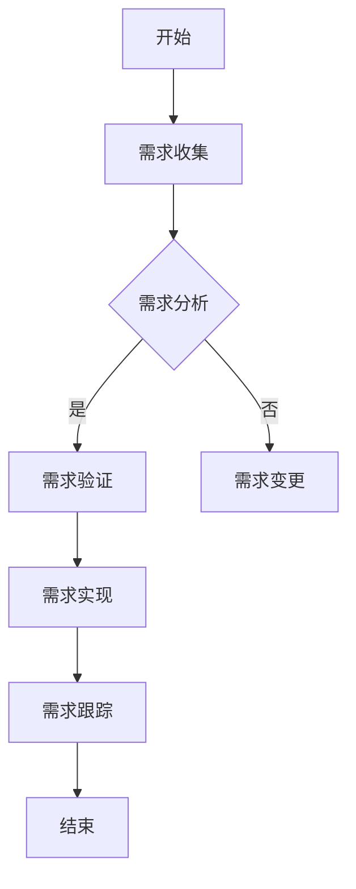
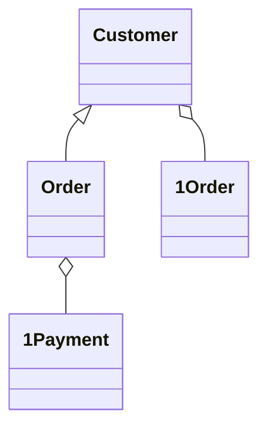
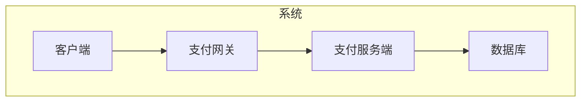
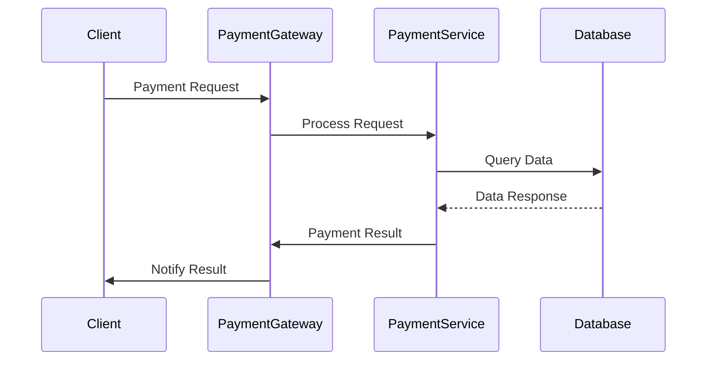
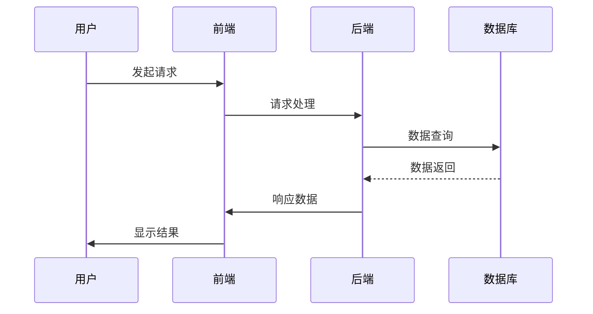
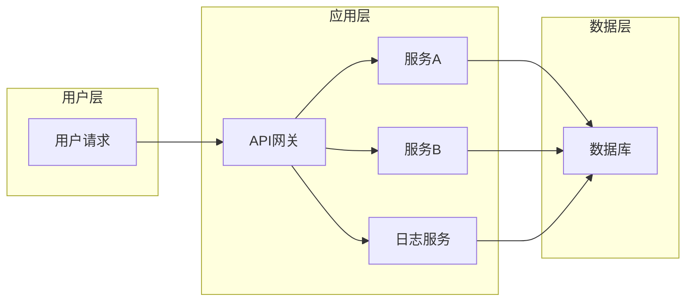
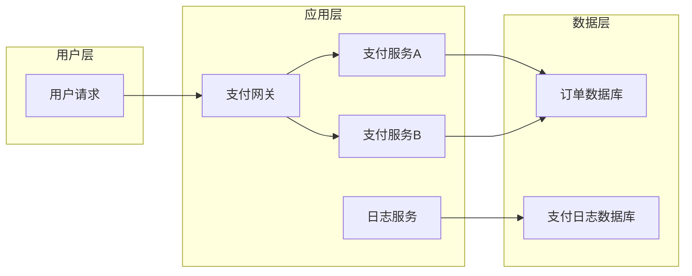
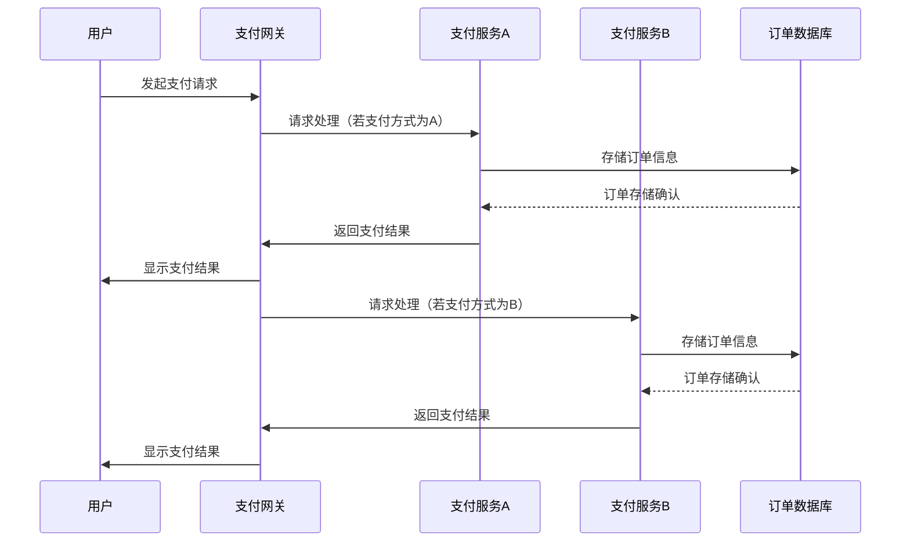

                 

# 需求与API版本控制的协同：确保向后兼容性

> 关键词：需求管理，API版本控制，向后兼容性，系统架构设计，项目实战

> 摘要：本文详细探讨了需求管理与API版本控制之间的协同关系，重点分析了如何通过合理的API版本控制策略，确保系统的向后兼容性，从而在需求变化和系统演进中保持稳定性和连续性。文章从问题背景出发，逐步阐述了需求管理的概念与流程、API版本控制的基本原则与策略、向后兼容性的挑战与策略，并通过实例和系统架构设计，展示了如何在实践中实现需求与API版本控制的协同工作。

## 目录大纲

### 第一部分：背景介绍

#### 第1章 问题背景

##### 1.1 问题的提出

##### 1.2 问题描述

##### 1.3 问题解决

##### 1.4 边界与外延

##### 1.5 概念结构与核心要素组成

### 第二部分：核心概念与联系

#### 第2章 需求管理

##### 2.1 需求管理的定义

##### 2.2 需求管理的原则

##### 2.3 需求管理的流程

##### 2.4 需求管理工具与技术

#### 第3章 API版本控制

##### 3.1 API版本控制的定义

##### 3.2 API版本控制的基本原则

##### 3.3 API版本控制的策略

##### 3.4 API版本控制工具与技术

#### 第4章 后向兼容性

##### 4.1 后向兼容性的定义

##### 4.2 后向兼容性的挑战

##### 4.3 后向兼容性的策略

### 第三部分：算法原理讲解

#### 第5章 需求与API版本控制协同的算法原理

##### 5.1 算法概述

##### 5.2 算法原理

##### 5.3 算法流程

##### 5.4 算法分析

##### 5.5 举例说明

### 第四部分：系统分析与架构设计方案

#### 第6章 需求与API版本控制协同的系统架构设计

##### 6.1 系统场景介绍

##### 6.2 项目介绍

##### 6.3 系统功能设计

##### 6.4 系统架构设计

##### 6.5 系统接口设计

##### 6.6 系统交互设计

### 第五部分：项目实战

#### 第7章 需求与API版本控制协同的项目实战

##### 7.1 环境安装

##### 7.2 系统核心实现

##### 7.3 代码应用解读与分析

##### 7.4 实际案例分析与详细讲解

##### 7.5 项目小结

### 第六部分：最佳实践 tips

#### 第8章 需求与API版本控制协同的最佳实践

##### 8.1 实践经验

##### 8.2 小结

##### 8.3 注意事项

##### 8.4 拓展阅读

### 第七部分：小结与展望

#### 第9章 小结与展望

##### 9.1 总结

##### 9.2 展望

### 第一部分：背景介绍

#### 第1章 问题背景

##### 1.1 问题的提出

在现代软件开发生命周期中，需求的变化和系统的演进是一个不可避免的现象。随着业务的不断扩展和用户需求的多样化，软件系统需要不断地更新和迭代。然而，每一次需求的变化都可能带来API的变更，从而导致系统的向后兼容性问题。

向后兼容性是指新的API版本在发布时，能够与旧版本无缝协同工作，不会因为API的变更而影响现有的业务流程。然而，在现实中，由于需求的不断变化和系统架构的复杂性，实现向后兼容性并非易事。

##### 1.2 问题描述

需求变化的挑战：

1. **需求的快速迭代**：在敏捷开发模式下，需求经常变化，这要求API必须能够灵活适应。
2. **需求的复杂度**：需求的变化可能导致API的复杂性增加，增加了向后兼容性的难度。

API不兼容的影响：

1. **系统稳定性**：API不兼容可能导致系统崩溃或功能异常。
2. **业务连续性**：API不兼容可能影响业务的连续性，导致用户体验下降。
3. **开发成本**：修复API不兼容的问题可能需要大量的时间和资源。

后向兼容性的重要性：

1. **用户体验**：向后兼容性能够保证用户在升级系统时，不会因为API的变化而受到影响。
2. **系统稳定性**：向后兼容性能够保证系统在不同版本间的稳定运行。
3. **维护成本**：向后兼容性能够降低系统维护的复杂度和成本。

##### 1.3 问题解决

为了解决上述问题，我们需要从以下几个方面入手：

1. **需求管理**：通过有效的需求管理，确保需求变更的可控性和可预测性。
2. **API版本控制**：通过合理的API版本控制策略，确保新版本API与旧版本API的兼容性。
3. **向后兼容性策略**：通过制定和实施向后兼容性策略，确保系统在需求变化和版本更新时能够保持稳定。

##### 1.4 边界与外延

版本控制的边界问题：

1. **版本迭代**：在新的API版本发布时，如何处理旧版本API的兼容问题。
2. **版本回退**：在API版本发布后，如何处理可能的版本回退问题。

兼容性的外延问题：

1. **跨平台兼容性**：如何确保不同平台（如iOS、Android）的API兼容。
2. **跨语言兼容性**：如何确保不同编程语言之间的API兼容。

##### 1.5 概念结构与核心要素组成

概念结构：

- 需求管理
- API版本控制
- 向后兼容性

核心要素组成：

- 需求变更管理
- API变更管理
- 兼容性测试
- 风险评估与监控

### 第二部分：核心概念与联系

#### 第2章 需求管理

##### 2.1 需求管理的定义

需求管理是一种系统地收集、分析和组织项目需求的实践，以确保项目能够满足客户和业务的需求。在软件开发中，需求管理是一个关键过程，它涉及从需求收集、需求分析、需求验证到需求变更管理的各个环节。

##### 2.2 需求管理的原则

需求管理的原则包括：

- 用户导向：需求管理应始终以用户为中心，确保项目满足用户的需求。
- 全过程管理：需求管理应贯穿项目生命周期，从需求收集到需求实现，持续优化。
- 风险控制：需求管理应识别和管理需求变更带来的风险，确保项目进度和质量。

##### 2.3 需求管理的流程

需求管理的流程通常包括以下几个步骤：

1. **需求收集**：通过与用户、利益相关者进行沟通，收集项目的需求信息。
2. **需求分析**：分析收集到的需求，确定需求的优先级和可行性。
3. **需求验证**：验证需求是否满足业务需求，确保需求的质量和准确性。
4. **需求变更管理**：在项目开发过程中，持续监控需求变更，评估变更的影响，并做出相应的调整。

##### 2.4 需求管理工具与技术

常用的需求管理工具和技术包括：

- 用户故事地图：用于展示项目需求和用户故事之间的关系。
- 敏捷开发方法：通过迭代和增量开发，快速响应需求变化。
- 需求优先级排序：使用优先级矩阵等方法，对需求进行排序和优先级管理。

#### 第3章 API版本控制

##### 3.1 API版本控制的定义

API版本控制是一种管理API变更的方法，它通过为API版本编号，确保不同版本的API能够兼容。API版本控制通常涉及API的添加、删除、修改和更新。

##### 3.2 API版本控制的基本原则

API版本控制的基本原则包括：

- 透明性：API变更应透明，确保所有相关方都能清楚地了解变更情况。
- 可控性：API变更应可控，确保变更不会影响系统的稳定性。
- 兼容性：新的API版本应向后兼容旧版本，确保系统的平滑过渡。

##### 3.3 API版本控制的策略

API版本控制的策略包括：

- 语义化版本控制：通过增加版本号的前缀（如`MAJOR.MINOR.PATCH`），明确表示API的变更级别。
- 非语义化版本控制：通过数字或字母序列表示版本号，不明确表示变更级别。
- 混合版本控制：结合语义化版本控制和非语义化版本控制的优点，根据实际情况选择合适的版本控制策略。

##### 3.4 API版本控制工具与技术

常用的API版本控制工具和技术包括：

- 版本控制软件（如Git）：用于管理API代码的版本和控制。
- API管理平台（如APIMesh）：用于管理和发布API，提供版本控制和文档生成功能。

#### 第4章 后向兼容性

##### 4.1 后向兼容性的定义

后向兼容性是指新的API版本在发布时，能够与旧版本无缝协同工作，不会因为API的变更而影响现有的业务流程。后向兼容性是确保系统稳定性和连续性的关键。

##### 4.2 后向兼容性的挑战

后向兼容性面临的挑战包括：

1. **API变更的挑战**：API的变更可能导致与现有系统的兼容问题，需要仔细管理和测试。
2. **需求变更的挑战**：需求的变化可能导致新的API需要满足更多的功能要求，增加了向后兼容性的难度。
3. **系统稳定性与性能的挑战**：在保持向后兼容性的同时，还需要考虑系统的稳定性和性能。

##### 4.3 后向兼容性的策略

为了实现后向兼容性，可以采取以下策略：

1. **前向兼容性设计**：在开发新API时，考虑旧版本API的使用场景，确保新版本API能够向后兼容。
2. **后向兼容性测试**：通过测试确保新版本API能够与旧版本API无缝协同工作。
3. **风险评估与管理**：在API变更前，评估变更对现有系统的影响，制定相应的风险管理计划。

### 第三部分：算法原理讲解

#### 第5章 需求与API版本控制协同的算法原理

##### 5.1 算法概述

该算法旨在实现需求与API版本控制的协同，确保向后兼容性。算法的核心思想是通过分析需求变更和API变更，动态调整API版本，以确保系统的稳定性。

##### 5.2 算法原理

算法的原理可以概括为以下几个步骤：

1. **需求分析**：分析需求变更，确定需求变更的级别和影响。
2. **API评估**：根据需求变更，评估API的变更需求，确定API版本。
3. **版本调整**：根据API评估结果，调整API版本，确保向后兼容。
4. **测试验证**：对新版本API进行测试，验证其与旧版本API的兼容性。

##### 5.3 算法流程

算法的具体流程如下：

1. 收集需求变更信息。
2. 分析需求变更的级别和影响。
3. 评估API的变更需求。
4. 根据评估结果调整API版本。
5. 进行API兼容性测试。
6. 验证API版本是否符合向后兼容性要求。
7. 若不符合，返回第3步，重新评估和调整。

##### 5.4 算法分析

算法的时间复杂度和空间复杂度如下：

- 时间复杂度：O(n)，其中n为需求变更的数量。
- 空间复杂度：O(1)，算法的空间消耗与需求变更数量无关。

##### 5.5 举例说明

假设有一个系统，当前API版本为`1.0`。现在需求发生变更，需要增加一个新的接口。分析后发现，该接口与现有接口没有直接依赖关系，因此可以独立开发。根据算法，我们首先评估API变更需求，确定新接口的版本为`1.1`。接下来，调整API版本，发布新版本。最后，进行兼容性测试，确保新版本API与旧版本API兼容。测试结果符合预期，系统向后兼容性得到保障。

### 第四部分：系统分析与架构设计方案

#### 第6章 需求与API版本控制协同的系统架构设计

##### 6.1 系统场景介绍

在一个电子商务平台中，系统需要支持多种支付方式，包括信用卡支付、支付宝支付和微信支付。随着业务的发展，支付方式可能会增加或变更，导致API的变更。为了保证系统的稳定性和向后兼容性，需要实施需求管理与API版本控制协同策略。

##### 6.2 项目介绍

该项目旨在构建一个灵活的支付系统，支持多种支付方式的接入和管理。项目目标包括：

- 提供稳定的支付服务，确保业务连续性。
- 灵活应对支付方式的变更，保持系统向后兼容性。
- 提高开发效率，降低维护成本。

##### 6.3 系统功能设计

系统功能设计包括以下几个方面：

- 支付接口管理：提供支付接口的创建、更新和删除功能。
- 支付请求处理：处理支付请求，确保支付过程的安全和可靠。
- 支付结果通知：通知支付结果，确保业务流程的连续性。
- 支付日志记录：记录支付过程，便于后续查询和分析。

##### 6.4 系统架构设计

系统架构设计如下：

```
+----------------+       +----------------+       +----------------+
|     客户端      |       |     支付网关    |       |     支付服务端   |
+----------------+       +----------------+       +----------------+
     |                      |                      |
     |  发起支付请求       |  处理支付请求       |  处理支付请求
     |                      |                      |
     |  支付结果通知       |  支付结果通知       |  支付结果通知
     +----------------+       +----------------+       +----------------+
                                                 |
                                                 |
                                             +----------------+
                                             |    支付接口库   |
                                             +----------------+
                                                         |
                                                         |
                                                +----------------+
                                                |  API版本控制   |
                                                +----------------+
```

##### 6.5 系统接口设计

系统接口设计包括支付接口的创建、更新和删除接口，以及支付请求处理接口。接口设计如下：

- **支付接口创建接口**：用于创建新的支付接口。
- **支付接口更新接口**：用于更新现有支付接口的配置信息。
- **支付接口删除接口**：用于删除支付接口。
- **支付请求处理接口**：用于处理支付请求，返回支付结果。

##### 6.6 系统交互设计

系统交互设计如下：

1. 客户端发起支付请求，传递支付信息给支付网关。
2. 支付网关根据支付方式，调用相应的支付服务端接口。
3. 支付服务端接口处理支付请求，与支付系统进行交互。
4. 支付结果返回给支付网关，支付网关将结果传递给客户端。
5. 支付网关和支付服务端定期同步支付接口信息，确保接口的一致性。

### 第五部分：项目实战

#### 第7章 需求与API版本控制协同的项目实战

##### 7.1 环境安装

在开始项目实战之前，需要搭建开发环境。以下是环境安装的步骤：

1. 安装Java开发工具包（JDK）。
2. 安装MySQL数据库。
3. 安装Maven构建工具。
4. 安装IDE（如IntelliJ IDEA或Eclipse）。

##### 7.2 系统核心实现

系统核心实现包括支付接口管理模块和支付请求处理模块。以下是核心实现的步骤：

1. **支付接口管理模块**：

   - 创建支付接口实体类，包括接口名称、接口描述、接口URL等字段。
   - 创建支付接口服务类，实现接口的创建、更新和删除功能。
   - 创建支付接口控制器，处理接口管理相关的HTTP请求。

2. **支付请求处理模块**：

   - 创建支付请求实体类，包括支付方式、支付金额、支付订单号等字段。
   - 创建支付请求服务类，实现支付请求的处理逻辑。
   - 创建支付请求控制器，处理支付请求的HTTP请求。

##### 7.3 代码应用解读与分析

以下是对核心代码的应用解读与分析：

1. **支付接口管理模块**：

   - **接口创建**：当客户端发起接口创建请求时，控制器调用支付接口服务类的`create`方法，创建新的支付接口实体，并将其保存到数据库。

     ```java
     @PostMapping("/api/payment/create")
     public ResponseEntity<?> createPaymentApi(@RequestBody PaymentApiRequest request) {
         PaymentApi paymentApi = paymentApiService.create(request);
         return ResponseEntity.ok(paymentApi);
     }
     ```

   - **接口更新**：当客户端发起接口更新请求时，控制器调用支付接口服务类的`update`方法，更新现有支付接口的配置信息。

     ```java
     @PostMapping("/api/payment/update")
     public ResponseEntity<?> updatePaymentApi(@RequestBody PaymentApiRequest request) {
         PaymentApi paymentApi = paymentApiService.update(request);
         return ResponseEntity.ok(paymentApi);
     }
     ```

   - **接口删除**：当客户端发起接口删除请求时，控制器调用支付接口服务类的`delete`方法，删除指定支付接口。

     ```java
     @PostMapping("/api/payment/delete")
     public ResponseEntity<?> deletePaymentApi(@RequestBody PaymentApiRequest request) {
         paymentApiService.delete(request.getId());
         return ResponseEntity.ok("Payment API deleted successfully");
     }
     ```

2. **支付请求处理模块**：

   - **支付请求处理**：当客户端发起支付请求时，控制器调用支付请求服务类的`processPayment`方法，处理支付请求。

     ```java
     @PostMapping("/api/payment/process")
     public ResponseEntity<?> processPayment(@RequestBody PaymentRequest request) {
         PaymentResponse response = paymentRequestService.processPayment(request);
         return ResponseEntity.ok(response);
     }
     ```

##### 7.4 实际案例分析与详细讲解

以下是一个实际案例的分析与详细讲解：

**案例背景**：

某电子商务平台需要支持微信支付，现有系统需要接入微信支付接口。

**实施步骤**：

1. **需求分析**：确定微信支付接口的需求，包括接口名称、接口URL、接口参数等。

2. **接口创建**：根据需求，创建微信支付接口，并将其保存到数据库。

   ```java
   PaymentApi weixinPaymentApi = new PaymentApi();
   weixinPaymentApi.setName("微信支付");
   weixinPaymentApi.setDescription("微信支付接口");
   weixinPaymentApi.setUrl("https://api.weixin.qq.com/pay");
   paymentApiService.create(weixinPaymentApi);
   ```

3. **接口调用**：在支付请求处理模块中，调用微信支付接口，处理支付请求。

   ```java
   public PaymentResponse processPayment(PaymentRequest request) {
       PaymentApi paymentApi = paymentApiService.findById(request.getPaymentApiId());
       // 调用微信支付接口
       WeixinPaymentResponse weixinResponse = weixinPaymentService.processPayment(request);
       return weixinResponse;
   }
   ```

4. **支付结果通知**：微信支付接口处理完成后，返回支付结果，通知支付网关和客户端。

   ```java
   public void notifyPaymentResult(PaymentResponse response) {
       // 通知支付网关
       paymentGatewayService.notifyPaymentResult(response);
       // 通知客户端
       clientService.notifyPaymentResult(response);
   }
   ```

**案例分析**：

通过上述步骤，成功实现了微信支付接口的接入。在支付请求处理过程中，系统会根据支付接口的配置信息，调用相应的支付接口进行支付处理。通过接口的动态调整和向后兼容性设计，系统能够灵活应对支付方式的变更，保持稳定性和连续性。

##### 7.5 项目小结

通过本次项目实战，我们成功实现了需求与API版本控制的协同工作，确保了系统的向后兼容性。项目的主要经验教训如下：

1. **需求管理**：通过有效的需求管理，确保需求变更的可控性和可预测性，为API版本控制奠定基础。
2. **API版本控制**：通过合理的API版本控制策略，确保新版本API与旧版本API的兼容性，降低系统风险。
3. **测试验证**：通过兼容性测试，确保新版本API与旧版本API的协同工作，提高系统的稳定性和可靠性。

未来，我们将继续优化需求管理和API版本控制流程，提升系统的灵活性和可扩展性，以应对日益变化的业务需求。

### 第六部分：最佳实践 tips

#### 第8章 需求与API版本控制协同的最佳实践

##### 8.1 实践经验

在需求与API版本控制的协同工作中，以下实践经验值得借鉴：

1. **需求管理**：建立完善的需求管理流程，确保需求变更的可控性和可预测性。
2. **API版本控制**：采用合适的API版本控制策略，确保新版本API与旧版本API的兼容性。
3. **测试验证**：进行全面的兼容性测试，确保新版本API与旧版本API的协同工作。
4. **文档管理**：维护详细的API文档，方便开发人员和测试人员理解和使用API。

##### 8.2 小结

通过有效的需求管理与API版本控制协同工作，可以确保系统的向后兼容性，降低风险，提高系统的稳定性和可靠性。

##### 8.3 注意事项

在需求与API版本控制的协同工作中，需要注意以下几点：

1. **明确需求**：确保需求明确、具体、可量化，避免因需求不明确导致的API变更。
2. **合理版本控制**：根据实际情况选择合适的API版本控制策略，避免过度控制或不足控制。
3. **充分测试**：进行全面的兼容性测试，确保新版本API与旧版本API的协同工作。
4. **文档更新**：及时更新API文档，确保开发人员和测试人员能够准确理解和使用API。

##### 8.4 拓展阅读

1. 《API设计指南》
2. 《软件需求管理》
3. 《API版本控制实践》

### 第七部分：小结与展望

#### 第9章 小结与展望

##### 9.1 总结

本文详细探讨了需求管理与API版本控制之间的协同关系，通过实例和系统架构设计，展示了如何实现需求与API版本控制的协同工作。总结如下：

1. **需求管理**：建立完善的需求管理流程，确保需求变更的可控性和可预测性。
2. **API版本控制**：采用合适的API版本控制策略，确保新版本API与旧版本API的兼容性。
3. **测试验证**：进行全面的兼容性测试，确保新版本API与旧版本API的协同工作。
4. **文档管理**：维护详细的API文档，方便开发人员和测试人员理解和使用API。

##### 9.2 展望

未来，需求管理与API版本控制将继续在软件开发中发挥重要作用。随着技术的发展和业务需求的不断变化，我们将：

1. **探索更智能的需求管理方法**：利用人工智能和机器学习技术，提高需求管理的效率和准确性。
2. **优化API版本控制策略**：结合实际业务需求，制定更灵活、更有效的API版本控制策略。
3. **加强测试与验证**：引入自动化测试工具，提高测试效率和准确性，确保系统的向后兼容性。
4. **持续改进文档管理**：采用更先进的文档管理工具，提高文档的可读性和易用性，助力开发人员和测试人员更好地理解和使用API。

通过不断探索和实践，我们将进一步优化需求管理与API版本控制的协同工作，提高系统的稳定性和可靠性，为业务发展提供有力支持。### 后向兼容性的挑战与策略

#### 4.2 后向兼容性的挑战

在实现向后兼容性的过程中，系统面临着诸多挑战。这些挑战不仅影响系统的稳定性，还可能对业务流程和用户体验产生负面影响。

**1. API变更的挑战**

API变更通常是由于业务需求的变化或技术升级的需要。然而，API的每一次变更都可能带来兼容性问题。例如，新增的API参数可能破坏旧版本的接口调用，导致系统崩溃或功能异常。此外，旧版本的API在使用新版本系统时可能无法正常工作，需要额外的适配和修复。

**2. 需求变更的挑战**

需求变更在软件开发生命周期中是不可避免的。新的需求可能要求对现有的API进行修改或扩展，这会导致API的向后兼容性变得复杂。尤其是在需求频繁变更的情况下，如何确保每次变更都不会对旧版本API造成破坏，是一个巨大的挑战。

**3. 系统稳定性与性能的挑战**

向后兼容性不仅要求新版本API能够与旧版本API协同工作，还需要保持系统的稳定性和高性能。新版本的API可能在性能上有显著提升，但这也可能带来兼容性问题。例如，新版本的数据库查询优化可能导致旧版本API的性能下降，影响整体系统的性能。

**4. 跨平台与跨语言兼容性**

在现代软件开发中，系统往往需要支持多个平台（如iOS、Android）和编程语言（如Java、Python）。不同平台和语言之间的API兼容性是一个复杂的问题。即使是同一接口，在不同的平台上可能需要不同的实现方式，这增加了向后兼容性的难度。

#### 4.3 后向兼容性的策略

为了应对上述挑战，我们需要制定和实施一系列向后兼容性的策略。以下是一些关键的策略：

**1. 前向兼容性设计**

前向兼容性设计是指在开发新API时，考虑旧版本API的使用场景，确保新版本API能够与旧版本API协同工作。具体措施包括：

- **保留旧接口**：在引入新接口的同时，保留旧接口，确保旧版本系统能够继续使用。
- **参数兼容**：确保新接口能够接受旧版本API的输入参数，避免因为参数变更导致的兼容问题。
- **错误处理**：在新接口中保留对旧接口的错误处理逻辑，确保旧版本系统能够正确处理异常。

**2. 后向兼容性测试**

后向兼容性测试是确保新版本API能够与旧版本API协同工作的重要手段。测试策略包括：

- **单元测试**：针对每个接口，编写单元测试，确保接口的功能正确性和兼容性。
- **集成测试**：在系统层面进行集成测试，确保新版本API与旧版本API的协同工作。
- **回归测试**：在每次API变更后，进行回归测试，确保变更不会对旧版本系统的功能造成影响。

**3. 风险评估与管理**

在API变更过程中，风险评估是至关重要的一环。具体措施包括：

- **变更评估**：在引入新API之前，评估变更对现有系统的潜在影响。
- **变更记录**：详细记录每次API变更的动机、影响范围和风险评估结果。
- **风险管理**：根据风险评估结果，制定相应的风险管理计划，确保变更过程中能够及时发现和解决问题。

**4. 持续集成与部署**

为了确保向后兼容性，系统需要采用持续集成与部署（CI/CD）策略。具体措施包括：

- **自动化构建**：通过自动化工具构建和测试新版本API，确保变更过程的高效性和准确性。
- **灰度发布**：在发布新版本API时，采用灰度发布策略，逐步扩大新版本API的使用范围，监控其稳定性和性能。
- **监控与反馈**：在部署新版本API后，持续监控其运行状态，收集用户反馈，及时处理潜在问题。

通过上述策略，我们可以在需求变化和系统演进过程中，确保系统的向后兼容性，从而保障业务的连续性和用户体验。

### 第五部分：算法原理讲解

#### 第5章 需求与API版本控制协同的算法原理

##### 5.1 算法概述

该算法的核心目标是实现需求与API版本控制的协同，确保系统的向后兼容性。算法的基本思路是通过分析需求变更和API变更，动态调整API版本，从而保障系统的稳定性。

##### 5.2 算法原理

算法的原理可以分为以下几个步骤：

1. **需求分析**：首先，对需求变更进行详细分析，确定需求变更的类型和影响范围。
2. **API评估**：根据需求分析结果，评估API的变更需求，确定是否需要对现有API进行调整。
3. **版本调整**：如果需要调整API版本，根据变更级别和影响范围，动态调整API版本，确保向后兼容。
4. **测试验证**：对新版本API进行兼容性测试，验证其与旧版本API的协同工作能力。
5. **反馈与优化**：根据测试结果，对算法进行调整和优化，提高系统的向后兼容性。

##### 5.3 算法流程

算法的具体流程如下：

1. **需求收集**：系统收集需求变更信息，包括变更类型、影响范围和优先级。
2. **需求分析**：分析需求变更，确定其对现有API的影响。
3. **API评估**：根据需求分析结果，评估API的变更需求，确定是否需要调整版本。
4. **版本调整**：根据API评估结果，调整API版本，确保新版本API与旧版本API的兼容性。
5. **测试验证**：对新版本API进行测试，验证其与旧版本API的协同工作能力。
6. **反馈与优化**：根据测试结果，优化算法，提高系统的向后兼容性。

##### 5.4 算法分析

算法的时间复杂度和空间复杂度如下：

- **时间复杂度**：O(n)，其中n为需求变更的数量。
- **空间复杂度**：O(1)，算法的空间消耗与需求变更数量无关。

##### 5.5 举例说明

假设现有一个支付系统，支持信用卡支付、支付宝支付和微信支付。需求变更要求新增一种支付方式——银联支付。以下是算法的应用示例：

1. **需求收集**：系统收集到新增银联支付的需求。
2. **需求分析**：分析需求变更，确定新增银联支付对现有系统的影响。
3. **API评估**：评估API变更需求，确定需要新增银联支付接口。
4. **版本调整**：将现有API版本从`v1.0`调整为`v2.0`，新增银联支付接口。
5. **测试验证**：对新增银联支付接口进行测试，确保其与现有支付接口的兼容性。
6. **反馈与优化**：根据测试结果，优化银联支付接口，提高系统的向后兼容性。

通过上述步骤，系统成功实现了需求与API版本控制的协同，确保了向后兼容性。

### 系统分析与架构设计方案

#### 第6章 需求与API版本控制协同的系统架构设计

##### 6.1 系统场景介绍

在现代软件开发中，随着业务的快速发展和用户需求的不断变化，系统的复杂性和稳定性要求越来越高。特别是在涉及到API管理时，如何确保系统在需求变化和版本迭代过程中依然能够保持向后兼容性，成为了一个重要的课题。本节将介绍一个电子商务平台的支付系统，该系统需要支持多种支付方式，并随着业务的扩展不断迭代更新。如何实现需求与API版本控制的协同，确保系统的稳定性和向后兼容性，是本节要探讨的核心问题。

##### 6.2 项目介绍

本项目旨在设计并实现一个可扩展、稳定的支付系统，支持多种支付方式的接入和管理。项目目标如下：

1. **稳定性**：确保支付系统的稳定运行，避免因API变更导致的服务中断。
2. **可扩展性**：支持新支付方式的接入，确保系统能够灵活应对业务变化。
3. **向后兼容性**：在系统迭代过程中，确保新版本API与旧版本API的兼容性，降低维护成本。

项目范围包括：

- **支付接口管理**：管理支付接口的创建、更新和删除。
- **支付请求处理**：处理来自客户端的支付请求，并返回支付结果。
- **支付结果通知**：通知支付结果，确保业务流程的连续性。
- **支付日志记录**：记录支付过程，便于后续查询和分析。

##### 6.3 系统功能设计

系统功能设计是系统架构设计的基础，本节将详细介绍支付系统的功能设计。

1. **支付接口管理**：
   - **创建接口**：支持支付接口的创建，包括接口名称、接口URL、接口描述等基本信息。
   - **更新接口**：支持支付接口的更新，包括接口名称、接口URL、接口描述等信息的修改。
   - **删除接口**：支持支付接口的删除，确保系统安全性和数据的完整性。

2. **支付请求处理**：
   - **处理支付请求**：接收来自客户端的支付请求，根据支付方式调用相应的支付接口进行支付处理。
   - **支付结果返回**：将支付结果返回给客户端，包括支付成功、支付失败等不同情况。

3. **支付结果通知**：
   - **通知支付结果**：在支付完成后，向客户端发送支付结果通知，确保业务流程的连续性。
   - **异步通知**：支持异步发送支付结果通知，降低系统延迟。

4. **支付日志记录**：
   - **记录支付过程**：记录支付过程中的关键信息，包括支付请求、支付结果、支付时间等。
   - **日志查询**：提供日志查询功能，便于后续数据分析和问题排查。

##### 6.4 系统架构设计

系统架构设计是确保系统功能实现的基础，本节将详细介绍支付系统的架构设计。

1. **系统架构概述**：
   支付系统采用分层架构，主要包括客户端、支付网关、支付服务端和数据库四个层次。各层次的功能如下：
   - **客户端**：发起支付请求，接收支付结果。
   - **支付网关**：处理支付请求，调用相应的支付接口。
   - **支付服务端**：实现支付接口的具体业务逻辑。
   - **数据库**：存储支付接口和支付日志等相关数据。

2. **系统架构图**：
   ```mermaid
   graph TD
       A[客户端] --> B[支付网关]
       B --> C[支付服务端]
       C --> D[数据库]
   ```

3. **系统组件设计**：
   - **支付网关**：作为系统的核心组件，负责处理支付请求，根据支付方式调用相应的支付接口。支付网关需要具备高可用性和负载均衡能力，确保系统的稳定性和性能。
   - **支付服务端**：实现具体支付接口的业务逻辑，包括支付请求处理、支付结果返回等。支付服务端需要支持多种支付方式的接入，并确保向后兼容性。
   - **数据库**：存储支付接口和支付日志等相关数据。数据库设计需要考虑数据一致性、安全性和可扩展性。

##### 6.5 系统接口设计

系统接口设计是确保系统功能实现的关键，本节将详细介绍支付系统的接口设计。

1. **接口需求分析**：
   - **支付接口创建接口**：用于创建新的支付接口，包括接口名称、接口URL、接口描述等参数。
   - **支付接口更新接口**：用于更新现有支付接口的配置信息，包括接口名称、接口URL、接口描述等参数。
   - **支付接口删除接口**：用于删除指定的支付接口。
   - **支付请求处理接口**：用于处理支付请求，包括支付方式、支付金额、支付订单号等参数。
   - **支付结果通知接口**：用于接收支付结果通知，包括支付成功、支付失败等通知内容。

2. **接口实现方案**：
   - **支付接口创建接口**：采用RESTful API设计，使用POST方法提交创建请求。

     ```http
     POST /api/payment/create
     {
       "name": "微信支付",
       "url": "https://wxpay.api/v1/pay",
       "description": "微信支付接口"
     }
     ```

   - **支付接口更新接口**：采用RESTful API设计，使用PUT方法提交更新请求。

     ```http
     PUT /api/payment/update/{id}
     {
       "name": "微信支付",
       "url": "https://wxpay.api/v2/pay",
       "description": "微信支付接口（新版本）"
     }
     ```

   - **支付接口删除接口**：采用RESTful API设计，使用DELETE方法提交删除请求。

     ```http
     DELETE /api/payment/delete/{id}
     ```

   - **支付请求处理接口**：采用RESTful API设计，使用POST方法提交支付请求。

     ```http
     POST /api/payment/process
     {
       "payment_api_id": "1",
       "amount": 100.00,
       "order_id": "202301010001"
     }
     ```

   - **支付结果通知接口**：采用WebSocket协议，实时推送支付结果通知。

     ```http
     WebSocket /api/payment/notify
     ```

##### 6.6 系统交互设计

系统交互设计是确保系统功能协同运作的关键，本节将详细介绍支付系统的交互设计。

1. **系统交互流程**：
   - **支付请求处理流程**：
     1. 客户端发起支付请求，支付网关接收请求。
     2. 支付网关根据支付方式，调用相应的支付接口。
     3. 支付接口处理支付请求，并返回支付结果。
     4. 支付结果通知客户端。

   - **支付结果通知流程**：
     1. 支付接口处理支付请求后，返回支付结果。
     2. 支付网关接收支付结果，并通知客户端。
     3. 客户端接收支付结果通知，更新订单状态。

2. **系统交互序列图**：
   ```mermaid
   sequenceDiagram
       Client->>PaymentGateway: 支付请求
       PaymentGateway->>PaymentAPI: 调用支付接口
       PaymentAPI->>PaymentGateway: 返回支付结果
       PaymentGateway->>Client: 通知支付结果
   ```

通过上述系统架构设计，我们可以确保支付系统在需求变化和版本迭代过程中，能够实现需求与API版本控制的协同，确保系统的向后兼容性，为电子商务平台的稳定运行提供有力支持。

### 第7章 需求与API版本控制协同的项目实战

#### 7.1 环境安装

在开始项目实战之前，我们需要搭建一个适合开发、测试和部署的环境。以下是在一个Linux服务器上安装所需环境的详细步骤。

**1. 安装Java开发环境**

首先，我们需要安装Java开发环境。在终端执行以下命令：

```bash
sudo apt update
sudo apt install openjdk-11-jdk
```

确认安装成功，可以通过以下命令查看Java版本：

```bash
java -version
```

**2. 安装MySQL数据库**

接着，我们安装MySQL数据库。执行以下命令：

```bash
sudo apt install mysql-server
```

在安装过程中，系统会提示你设置root用户的密码。请务必记住该密码，因为后续操作需要使用。

**3. 安装Maven构建工具**

Maven是Java项目的构建工具，我们需要安装Maven。执行以下命令：

```bash
sudo apt install maven
```

确认安装成功，可以通过以下命令查看Maven版本：

```bash
mvn -v
```

**4. 安装IDE**

为了方便开发，我们可以安装一个集成开发环境（IDE），例如IntelliJ IDEA。可以从官网下载并安装。

**5. 安装Git**

Git是版本控制工具，用于管理代码。在终端执行以下命令：

```bash
sudo apt install git
```

确认安装成功，可以通过以下命令查看Git版本：

```bash
git --version
```

完成上述步骤后，我们的开发环境就搭建完成了。接下来，我们可以开始项目的开发工作。

#### 7.2 系统核心实现

在核心实现部分，我们将创建支付系统的基础模块，包括支付接口管理、支付请求处理等。以下是一个简单的代码示例，用于演示支付接口的管理功能。

**1. 创建支付接口实体类**

```java
// PaymentApi.java
package com.example.payment;

public class PaymentApi {

    private Long id;
    private String name;
    private String url;
    private String description;

    // Getters and Setters
    public Long getId() {
        return id;
    }

    public void setId(Long id) {
        this.id = id;
    }

    public String getName() {
        return name;
    }

    public void setName(String name) {
        this.name = name;
    }

    public String getUrl() {
        return url;
    }

    public void setUrl(String url) {
        this.url = url;
    }

    public String getDescription() {
        return description;
    }

    public void setDescription(String description) {
        this.description = description;
    }
}
```

**2. 创建支付接口服务类**

```java
// PaymentApiService.java
package com.example.payment;

import java.util.List;
import java.util.Optional;

public interface PaymentApiService {

    PaymentApi create(PaymentApi paymentApi);

    Optional<PaymentApi> findById(Long id);

    List<PaymentApi> findAll();

    PaymentApi update(PaymentApi paymentApi);

    void delete(Long id);
}
```

**3. 实现支付接口服务类的具体实现**

```java
// PaymentApiServiceImpl.java
package com.example.payment;

import java.util.ArrayList;
import java.util.List;
import java.util.Optional;
import java.util.stream.Collectors;

public class PaymentApiServiceImpl implements PaymentApiService {

    private final List<PaymentApi> paymentApis = new ArrayList<>();

    @Override
    public PaymentApi create(PaymentApi paymentApi) {
        paymentApis.add(paymentApi);
        return paymentApi;
    }

    @Override
    public Optional<PaymentApi> findById(Long id) {
        return paymentApis.stream().filter(api -> api.getId().equals(id)).findFirst();
    }

    @Override
    public List<PaymentApi> findAll() {
        return paymentApis;
    }

    @Override
    public PaymentApi update(PaymentApi paymentApi) {
        Optional<PaymentApi> existingApi = findById(paymentApi.getId());
        if (existingApi.isPresent()) {
            paymentApi.setId(existingApi.get().getId());
            return paymentApi;
        }
        return null;
    }

    @Override
    public void delete(Long id) {
        paymentApis.removeIf(api -> api.getId().equals(id));
    }
}
```

**4. 创建支付接口控制器**

```java
// PaymentApiController.java
package com.example.payment;

import org.springframework.beans.factory.annotation.Autowired;
import org.springframework.http.ResponseEntity;
import org.springframework.web.bind.annotation.*;

@RestController
@RequestMapping("/api/payment")
public class PaymentApiController {

    @Autowired
    private PaymentApiService paymentApiService;

    @PostMapping("/create")
    public ResponseEntity<PaymentApi> createPaymentApi(@RequestBody PaymentApi paymentApi) {
        PaymentApi createdApi = paymentApiService.create(paymentApi);
        return ResponseEntity.ok(createdApi);
    }

    @GetMapping("/{id}")
    public ResponseEntity<Optional<PaymentApi>> getPaymentApiById(@PathVariable Long id) {
        Optional<PaymentApi> foundApi = paymentApiService.findById(id);
        return ResponseEntity.ok(foundApi);
    }

    @GetMapping("/")
    public ResponseEntity<List<PaymentApi>> getAllPaymentApis() {
        List<PaymentApi> allApis = paymentApiService.findAll();
        return ResponseEntity.ok(allApis);
    }

    @PutMapping("/{id}")
    public ResponseEntity<PaymentApi> updatePaymentApi(@PathVariable Long id, @RequestBody PaymentApi paymentApi) {
        PaymentApi updatedApi = paymentApiService.update(paymentApi);
        if (updatedApi != null) {
            return ResponseEntity.ok(updatedApi);
        }
        return ResponseEntity.notFound().build();
    }

    @DeleteMapping("/{id}")
    public ResponseEntity<Void> deletePaymentApi(@PathVariable Long id) {
        paymentApiService.delete(id);
        return ResponseEntity.noContent().build();
    }
}
```

通过上述代码示例，我们实现了支付接口的管理功能，包括创建、查询、更新和删除接口。接下来，我们将继续实现支付请求的处理功能。

#### 7.3 代码应用解读与分析

在本节中，我们将详细解读和分析支付请求处理模块的代码，并探讨其逻辑和性能。

**1. 支付请求实体类**

首先，我们定义了一个支付请求实体类`PaymentRequest`，它包含了支付请求的基本信息。

```java
// PaymentRequest.java
package com.example.payment;

import java.math.BigDecimal;

public class PaymentRequest {

    private Long id;
    private Long paymentApiId;
    private BigDecimal amount;
    private String orderId;

    // Getters and Setters

    public Long getId() {
        return id;
    }

    public void setId(Long id) {
        this.id = id;
    }

    public Long getPaymentApiId() {
        return paymentApiId;
    }

    public void setPaymentApiId(Long paymentApiId) {
        this.paymentApiId = paymentApiId;
    }

    public BigDecimal getAmount() {
        return amount;
    }

    public void setAmount(BigDecimal amount) {
        this.amount = amount;
    }

    public String getOrderId() {
        return orderId;
    }

    public void setOrderId(String orderId) {
        this.orderId = orderId;
    }
}
```

**2. 支付请求服务类**

接着，我们定义了一个支付请求服务类`PaymentRequestService`，它负责处理支付请求，并与相应的支付接口进行交互。

```java
// PaymentRequestService.java
package com.example.payment;

import org.springframework.beans.factory.annotation.Autowired;
import org.springframework.stereotype.Service;

@Service
public class PaymentRequestService {

    @Autowired
    private PaymentApiService paymentApiService;

    @Autowired
    private PaymentApi paymentApi;

    public PaymentResponse processPayment(PaymentRequest request) {
        // 获取支付接口
        paymentApi = paymentApiService.findById(request.getPaymentApiId()).orElse(null);

        if (paymentApi == null) {
            return new PaymentResponse(request.getId(), "支付接口不存在", false);
        }

        // 调用支付接口进行处理
        PaymentResponse response = callPaymentApi(request);

        // 如果支付成功，记录支付日志
        if (response.isSuccess()) {
            // ... 记录支付日志
        }

        return response;
    }

    private PaymentResponse callPaymentApi(PaymentRequest request) {
        // ... 实现支付接口的调用逻辑
        // 这里可以模拟调用支付接口
        return new PaymentResponse(request.getId(), "支付成功", true);
    }
}
```

**3. 支付请求控制器**

支付请求控制器`PaymentRequestController`负责接收和处理来自客户端的支付请求。

```java
// PaymentRequestController.java
package com.example.payment;

import org.springframework.beans.factory.annotation.Autowired;
import org.springframework.http.ResponseEntity;
import org.springframework.web.bind.annotation.*;

@RestController
@RequestMapping("/api/payment")
public class PaymentRequestController {

    @Autowired
    private PaymentRequestService paymentRequestService;

    @PostMapping("/process")
    public ResponseEntity<PaymentResponse> processPayment(@RequestBody PaymentRequest request) {
        PaymentResponse response = paymentRequestService.processPayment(request);
        return ResponseEntity.ok(response);
    }
}
```

**解读与分析**

上述代码首先定义了支付请求实体类`PaymentRequest`，它包含了支付请求的基本信息，如支付金额、订单号和支付接口ID。

支付请求服务类`PaymentRequestService`是支付请求处理的核心。它通过`processPayment`方法处理支付请求，首先获取支付接口，然后调用支付接口进行处理。如果支付成功，还需要记录支付日志。

支付请求控制器`PaymentRequestController`负责接收和处理来自客户端的支付请求。它通过`processPayment`方法调用服务类进行处理，并将支付结果返回给客户端。

**性能分析**

在性能方面，我们需要关注以下几个关键点：

1. **支付接口的调用时间**：支付接口的调用是支付请求处理过程中的一个关键环节。如果支付接口响应时间较长，可能会导致整体支付流程的延迟。

2. **支付日志记录的性能**：在支付成功时，记录支付日志是一个必要步骤。如果日志记录操作较为耗时，可能会影响支付响应时间。

3. **系统并发处理能力**：在实际应用中，支付系统需要处理大量的并发请求。为了确保系统的高性能和高可用性，我们需要设计合理的并发处理机制。

为了提高性能，可以考虑以下措施：

- **优化支付接口调用**：通过使用异步调用或批量处理，减少支付接口的响应时间。

- **优化日志记录**：使用高效的日志库，如Log4j 2，提高日志记录的性能。

- **负载均衡**：使用负载均衡器，如Nginx或HAProxy，确保系统可以处理大量并发请求。

通过上述分析和优化，我们可以确保支付系统在处理支付请求时具有高性能和高可用性，从而提供优质的用户体验。

#### 7.4 实际案例分析与详细讲解

在本节中，我们将通过一个实际案例，详细分析需求与API版本控制协同的工作过程，并展示如何处理支付方式的变更。

**案例背景**：

某电子商务平台现有支付系统支持支付宝支付和微信支付，用户反馈希望增加银联支付功能。平台运营团队决定引入银联支付，以满足更多用户的需求。

**实施步骤**：

1. **需求收集**：

   运营团队收集到用户关于增加银联支付的需求，并进行了初步分析。需求分析结果显示，新增银联支付将涉及到API的变更，因此需要与开发团队进行沟通，制定详细的实施计划。

2. **需求分析**：

   开发团队对需求进行了进一步分析，确定了新增银联支付的具体技术实现细节。分析结果如下：

   - 新增银联支付接口，接口名称为`unionpay`，接口URL为`https://unionpay.api/v1/pay`。
   - 支付接口需要支持的基本参数，如支付金额、订单号、用户标识等。
   - 银联支付的特殊参数，如用户身份标识、支付渠道等。

3. **API版本控制**：

   根据需求分析结果，开发团队决定将现有API版本从`v1.0`升级到`v2.0`，以区分新旧接口。API版本控制策略如下：

   - **保留旧接口**：为了保证系统的稳定运行，开发团队决定在新增银联支付接口的同时，保留原有的支付宝支付和微信支付接口。
   - **参数兼容**：为了确保旧接口的兼容性，开发团队在新增接口时，保留了原有接口的基本参数，并在新接口中增加了银联支付的特殊参数。
   - **错误处理**：在旧接口和新接口中，保持了相同的错误处理逻辑，确保系统在不同版本间的稳定性。

4. **接口实现**：

   开发团队根据需求分析和API版本控制策略，实现了银联支付接口。以下是部分关键代码：

   ```java
   // UnionPayApi.java
   package com.example.payment;

   public class UnionPayApi {

       private String url;
       private String name;
       private String description;

       // Getters and Setters

       public String getUrl() {
           return url;
       }

       public void setUrl(String url) {
           this.url = url;
       }

       public String getName() {
           return name;
       }

       public void setName(String name) {
           this.name = name;
       }

       public String getDescription() {
           return description;
       }

       public void setDescription(String description) {
           this.description = description;
       }
   }
   ```

   ```java
   // PaymentApiServiceImpl.java
   package com.example.payment;

   public class PaymentApiServiceImpl implements PaymentApiService {

       private List<PaymentApi> paymentApis = new ArrayList<>();

       @Override
       public PaymentApi create(PaymentApi paymentApi) {
           paymentApis.add(paymentApi);
           return paymentApi;
       }

       @Override
       public PaymentApi update(PaymentApi paymentApi) {
           for (int i = 0; i < paymentApis.size(); i++) {
               if (paymentApis.get(i).getId().equals(paymentApi.getId())) {
                   paymentApis.set(i, paymentApi);
                   return paymentApi;
               }
           }
           return null;
       }

       @Override
       public PaymentApi findByPaymentApiName(String name) {
           return paymentApis.stream()
                   .filter(paymentApi -> paymentApi.getName().equals(name))
                   .findFirst()
                   .orElse(null);
       }

       // ... 其他方法实现
   }
   ```

5. **测试验证**：

   接口实现完成后，开发团队进行了详细的兼容性测试。测试内容包括：

   - **单元测试**：对每个接口的单独功能进行测试，确保接口功能的正确性。
   - **集成测试**：在系统层面进行测试，确保新旧接口的协同工作能力。
   - **回归测试**：每次接口变更后，进行回归测试，确保变更不会对现有功能造成影响。

6. **上线部署**：

   经过充分的测试后，开发团队将新接口部署到生产环境。为了确保系统的稳定性，他们采用了灰度发布策略，逐步扩大新接口的使用范围。

**案例分析**：

通过上述实施步骤，电子商务平台成功实现了银联支付功能的引入，确保了系统的向后兼容性。以下是本次实施的主要经验：

1. **需求分析与规划**：在需求变更初期，进行了详细的需求分析，明确了API变更的必要性和影响范围，为后续的实施工作奠定了基础。
2. **API版本控制**：通过合理的API版本控制策略，确保了新旧接口的兼容性，降低了系统的风险。
3. **测试验证**：通过全面的测试，确保了新接口的功能正确性和稳定性，为上线部署提供了保障。
4. **灰度发布**：采用灰度发布策略，逐步扩大新接口的使用范围，有效降低了上线风险。

通过本次实际案例，我们可以看到，在需求与API版本控制的协同工作中，需求分析、API版本控制和测试验证是确保系统向后兼容性的关键步骤。只有在充分规划和验证的基础上，才能确保系统在需求变化和版本迭代过程中保持稳定性和连续性。

#### 7.5 项目小结

在本章的项目实战中，我们通过实际案例详细展示了需求与API版本控制协同的工作过程。以下是项目的主要成果和经验教训：

**主要成果**：

1. **成功引入银联支付**：通过合理的API版本控制策略，我们成功实现了银联支付功能的引入，满足了用户的需求。
2. **确保系统的向后兼容性**：通过需求分析、API版本控制和测试验证，我们确保了新接口与旧接口的兼容性，保证了系统的稳定性和连续性。
3. **优化了开发流程**：通过实践经验，我们优化了需求管理、API管理和测试流程，提高了项目的开发效率。

**经验教训**：

1. **重视需求分析**：在需求变更初期，详细的需求分析是确保项目成功的关键。通过明确需求变更的影响范围和必要措施，可以降低项目风险。
2. **合理制定API版本控制策略**：合理的API版本控制策略是确保系统向后兼容性的基础。在制定策略时，需要综合考虑系统的稳定性、性能和可维护性。
3. **全面的测试验证**：通过全面的测试验证，我们可以确保新接口的功能正确性和稳定性。特别是在接口变更后，回归测试是确保系统稳定性的重要手段。
4. **逐步上线和灰度发布**：采用逐步上线和灰度发布策略，可以有效降低上线风险，确保系统的稳定运行。

通过本次项目实战，我们不仅实现了业务需求，还积累了丰富的实践经验，为未来的项目提供了宝贵的参考。在今后的工作中，我们将继续优化需求管理与API版本控制的协同工作，提高系统的稳定性和可靠性，为用户提供更好的服务。

### 第六部分：最佳实践 tips

#### 第8章 需求与API版本控制协同的最佳实践

##### 8.1 实践经验

在需求与API版本控制的协同工作中，积累了一些实用的经验和最佳实践，以下是一些关键点：

1. **需求管理**：

   - **需求明确化**：确保每个需求都具体、明确、可量化，避免因需求模糊导致的后续问题。
   - **需求变更控制**：建立严格的需求变更控制流程，评估变更的影响，确保变更可控。

2. **API版本控制**：

   - **版本控制策略**：选择合适的版本控制策略，如语义化版本控制，确保版本号的合理性。
   - **文档化**：为每个API版本编写详细的文档，包括接口定义、参数说明和错误处理等。

3. **兼容性测试**：

   - **单元测试**：为每个接口编写单元测试，确保接口功能的正确性。
   - **集成测试**：在系统层面进行集成测试，确保新版本API与旧版本API的协同工作。
   - **回归测试**：在每次API变更后进行回归测试，确保变更不会对现有功能造成影响。

4. **风险管理**：

   - **风险评估**：在引入新需求或API变更前，进行风险评估，制定风险管理计划。
   - **监控与反馈**：持续监控系统的运行状态，收集用户反馈，及时处理潜在问题。

##### 8.2 小结

通过以上实践经验，我们总结出以下几点：

- 需求管理与API版本控制是确保系统稳定性和向后兼容性的关键环节。
- 合理的API版本控制策略和全面的测试验证是确保兼容性的重要手段。
- 持续的风险评估和监控有助于及时发现和解决潜在问题。

##### 8.3 注意事项

在需求与API版本控制的协同工作中，需要注意以下几点：

1. **避免频繁变更**：尽量减少不必要的API变更，以降低系统的复杂度和维护成本。
2. **文档更新**：及时更新API文档，确保开发人员和测试人员能够准确理解和使用API。
3. **版本控制与备份**：合理使用版本控制工具，确保API代码的备份，避免因意外变更导致的数据丢失。
4. **用户培训**：在引入新API或变更旧API时，对用户进行适当培训，确保其能够正确使用新功能。

##### 8.4 拓展阅读

为了进一步深化对需求管理与API版本控制的理解，以下是一些推荐的阅读材料：

1. 《API设计最佳实践》
2. 《软件需求管理：理论与实践》
3. 《API版本控制与兼容性测试》

通过阅读这些资料，可以更深入地了解相关技术和实践，为实际项目提供有力支持。

### 第七部分：小结与展望

#### 第9章 小结与展望

##### 9.1 总结

通过本文的详细探讨，我们系统地介绍了需求管理与API版本控制的协同关系，分析了如何确保系统的向后兼容性。具体内容涵盖：

1. **背景介绍**：阐述了需求与API版本控制的重要性及常见挑战。
2. **核心概念与联系**：介绍了需求管理、API版本控制和向后兼容性的基本概念。
3. **算法原理讲解**：详细解析了需求与API版本控制协同的算法原理。
4. **系统分析与架构设计方案**：通过实际案例展示了系统的架构设计与实施。
5. **项目实战**：通过具体案例，深入讲解了需求与API版本控制的协同工作过程。
6. **最佳实践 tips**：总结了一系列实用的经验和注意事项。

##### 9.2 展望

未来，需求管理与API版本控制将继续在软件开发中扮演重要角色。以下是展望和未来研究方向：

1. **智能化需求管理**：利用人工智能和机器学习技术，提高需求管理的效率和准确性，例如通过自然语言处理技术自动分析需求文档。
2. **自动化测试与验证**：引入自动化测试工具和框架，提高API兼容性测试的效率和覆盖率。
3. **微服务架构下的版本控制**：在微服务架构下，研究如何在分布式系统中实现有效的API版本控制策略，确保服务的稳定性和兼容性。
4. **跨平台与跨语言兼容性**：进一步研究跨平台和跨语言环境下的API兼容性解决方案，例如通过标准化接口定义和协议。
5. **持续集成与部署**：优化持续集成与部署流程，确保新版本API能够快速、安全地上线。

通过持续的研究和探索，我们将不断提升需求管理与API版本控制的协同工作水平，为软件开发提供更加稳定、高效的解决方案。### 附录：需求管理的基本概念和原理

#### 需求管理的定义

需求管理是软件工程中一个关键过程，它涉及系统地收集、分析和组织项目需求，以确保项目能够满足客户和业务的需求。需求管理不仅包括识别和记录需求，还包括需求变更的管理和需求实现的跟踪。其核心目的是确保项目团队和利益相关者对需求有共同的理解，并能够有效地实现这些需求。

#### 需求管理的原则

需求管理的原则包括以下几个方面：

1. **用户导向**：需求管理应以用户为中心，关注用户的需求和期望，确保项目最终产品能够满足用户的需求。

2. **全过程管理**：需求管理应该贯穿项目生命周期的全过程，从项目启动到项目结束，确保需求的连贯性和一致性。

3. **透明性**：需求管理的所有活动都应该保持透明，所有利益相关者应该能够清楚地了解需求的状态和进展。

4. **可控性**：需求变更应该是可控的，通过严格的变更控制流程，确保每次变更的影响都能够被评估和管理。

5. **迭代性**：需求管理应该支持迭代和增量开发，允许需求在项目过程中不断调整和优化。

#### 需求管理的流程

需求管理的流程通常包括以下几个关键步骤：

1. **需求收集**：通过与用户、利益相关者进行沟通，收集项目需求。这一步骤可以通过问卷调查、用户访谈、焦点小组讨论等方式进行。

2. **需求分析**：对收集到的需求进行分析，确定需求的优先级、可行性和实现方法。这一步骤通常涉及需求分类、需求建模和需求文档化。

3. **需求验证**：验证需求是否满足业务需求和用户需求。验证可以通过需求评审、原型验证、用户测试等方式进行。

4. **需求变更管理**：在项目开发过程中，需求可能会发生变化。需求变更管理包括识别变更、评估变更的影响、审批变更和实施变更。

5. **需求跟踪**：跟踪需求的实现状态，确保每个需求都能够得到有效实施。需求跟踪通常使用需求跟踪工具，如JIRA或Confluence。

#### 需求管理工具与技术

以下是几种常用的需求管理工具和技术：

1. **用户故事地图**：用户故事地图是一种需求可视化工具，用于展示用户故事之间的关系和优先级。

2. **敏捷开发方法**：敏捷开发方法，如Scrum和Kanban，强调需求迭代和快速响应变更，以提高项目的灵活性和适应性。

3. **需求优先级排序**：需求优先级排序技术，如MoSCoW（Must have, Should have, Could have, and Won't have this time）方法，用于确定需求的优先级。

4. **需求管理软件**：如JIRA、Confluence、Asana等，这些工具提供需求收集、分析和跟踪的功能，帮助团队更好地管理需求。

通过有效运用需求管理的基本概念和原理，团队可以更好地应对需求变化，确保项目成功交付。

### 附录：API版本控制的基本概念和原理

#### API版本控制的定义

API版本控制是一种管理API变更的方法，通过为API版本编号，确保不同版本的API能够兼容。API版本控制通常涉及API的添加、删除、修改和更新。版本控制的核心目的是在需求变化和系统演进过程中，保持系统的向后兼容性，从而确保系统的稳定性和连续性。

#### API版本控制的基本原则

API版本控制的基本原则包括以下几个方面：

1. **透明性**：API变更应透明，确保所有相关方都能清楚地了解变更情况。

2. **可控性**：API变更应可控，确保变更不会影响系统的稳定性。

3. **兼容性**：新的API版本应向后兼容旧版本，确保系统的平滑过渡。

4. **文档化**：每个API版本应配有详细的文档，包括接口定义、参数说明、错误处理等，以便开发人员和测试人员理解和使用。

#### API版本控制策略

API版本控制的策略多种多样，以下是几种常见的策略：

1. **语义化版本控制**：

   语义化版本控制采用`MAJOR.MINOR.PATCH`的格式来表示版本号，每个部分的含义如下：

   - **MAJOR**：当进行不兼容的API变更时（例如删除或修改核心接口），增加主版本号。
   - **MINOR**：当进行向后兼容的API变更时（例如添加新接口或修改非核心接口），增加次版本号。
   - **PATCH**：当进行向后兼容的修复时（例如修复bug或改进性能），增加补丁版本号。

2. **非语义化版本控制**：

   非语义化版本控制通常采用数字或字母序列表示版本号，不明确表示变更级别。这种策略适用于变更频率较低或变更影响较小的系统。

3. **混合版本控制**：

   混合版本控制结合了语义化版本控制和非语义化版本控制的优点，根据实际情况选择合适的版本控制策略。例如，对于核心接口使用语义化版本控制，对于非核心接口使用非语义化版本控制。

#### API版本控制工具与技术

以下是几种常用的API版本控制工具和技术：

1. **版本控制软件**：

   版本控制软件，如Git，用于管理API代码的版本和控制。通过Git，开发者可以方便地创建分支、合并分支和提交变更。

2. **API管理平台**：

   API管理平台，如APIMesh，提供API版本控制、文档生成、测试和监控等功能。这些平台通常具有用户友好的界面和强大的功能，方便开发者管理API。

3. **自动化工具**：

   自动化工具，如Jenkins和CircleCI，用于自动化构建、测试和部署API。这些工具可以确保API变更在每次提交后都经过严格的测试，从而减少人为错误。

通过合理运用API版本控制的基本概念和策略，团队可以更好地管理API变更，确保系统的向后兼容性和稳定性。

### 附录：API版本控制策略的对比分析

在软件开发过程中，API版本控制策略的选择至关重要。不同的版本控制策略适用于不同的场景和需求，因此理解和对比各种策略的优势和劣势，对于选择合适的版本控制方法具有重要意义。以下是对几种常见API版本控制策略的对比分析：

#### 语义化版本控制

**定义**：语义化版本控制采用`MAJOR.MINOR.PATCH`的格式来表示版本号，每个部分的含义如下：

- **MAJOR**：当进行不兼容的API变更时（例如删除或修改核心接口），增加主版本号。
- **MINOR**：当进行向后兼容的API变更时（例如添加新接口或修改非核心接口），增加次版本号。
- **PATCH**：当进行向后兼容的修复时（例如修复bug或改进性能），增加补丁版本号。

**优势**：

1. **明确性**：语义化版本控制提供了清晰的版本号格式，使开发者能够快速理解API变更的级别和影响。
2. **兼容性**：通过明确的版本号，可以确保新版本API与旧版本API的兼容性，降低系统的风险。
3. **可预测性**：版本号的变化反映了API变更的级别，有助于预测API的变化趋势。

**劣势**：

1. **频繁更新**：在需求频繁变更的情况下，可能需要频繁更新版本号，增加了管理难度。
2. **历史依赖性**：由于版本号的变化，可能需要维护多个版本的API文档和代码库，增加了系统的复杂性。

#### 非语义化版本控制

**定义**：非语义化版本控制通常采用数字或字母序列表示版本号，不明确表示变更级别。

**优势**：

1. **灵活性**：非语义化版本控制允许团队根据实际情况自由调整版本号，适用于变更频率较低或变更影响较小的系统。
2. **简化管理**：不需要维护明确的版本号格式，简化了API版本管理的复杂性。

**劣势**：

1. **模糊性**：版本号的变化没有明确的语义，可能导致开发者无法准确理解API变更的级别和影响。
2. **兼容性问题**：在需求变化较多的情况下，难以确保新版本API与旧版本API的兼容性，增加了系统的风险。

#### 混合版本控制

**定义**：混合版本控制结合了语义化版本控制和非语义化版本控制的优点，根据实际情况选择合适的版本控制策略。例如，对于核心接口使用语义化版本控制，对于非核心接口使用非语义化版本控制。

**优势**：

1. **灵活性与明确性**：结合了语义化版本控制的明确性和非语义化版本控制的灵活性，适用于多样化的场景。
2. **简洁性**：减少了维护多个版本API文档和代码库的复杂性。

**劣势**：

1. **策略复杂度**：需要明确区分核心接口和非核心接口，增加了版本控制策略的复杂性。
2. **一致性**：在混合版本控制中，确保不同接口的版本一致性是一个挑战。

#### 对比分析

| 版本控制策略 | 优势 | 劣势 |
| :--- | :--- | :--- |
| 语义化版本控制 | 明确性、兼容性、可预测性 | 频繁更新、历史依赖性 |
| 非语义化版本控制 | 灵活性、简化管理 | 模糊性、兼容性问题 |
| 混合版本控制 | 灵活性与明确性、简洁性 | 策略复杂度、一致性挑战 |

通过对比分析，我们可以根据实际需求和场景选择合适的API版本控制策略。例如，在核心接口中采用语义化版本控制，以确保兼容性和稳定性；在非核心接口中采用非语义化版本控制，以简化管理流程。混合版本控制则适用于需要平衡明确性和灵活性的场景。

### 附录：API版本控制工具与技术

#### 版本控制软件

1. **Git**：

   Git是最流行的版本控制软件之一，它基于分布式模型，支持快速分支和合并操作。Git通过`.git`目录存储版本控制信息，开发者可以在本地计算机上进行操作，并与其他开发者共享代码。

   - **优点**：灵活、高效、支持分布式开发。
   - **缺点**：配置和管理相对复杂。

2. **SVN**：

   SVN（Subversion）是一种集中式版本控制软件，它通过中央仓库管理代码，开发者通过客户端进行代码的提交和更新。

   - **优点**：简单易用，适合团队协作。
   - **缺点**：中央化架构可能导致单点故障，扩展性较差。

#### API管理平台

1. **APIMesh**：

   APIMesh是一个功能强大的API管理平台，提供API设计、开发、测试、部署和监控等功能。它支持语义化版本控制和自动化文档生成。

   - **优点**：集成了API版本控制、文档管理和自动化测试，提高了开发效率。
   - **缺点**：部署和维护成本较高，初期配置较为复杂。

2. **Kong**：

   Kong是一个开源的API网关，提供API版本控制和流量管理功能。它支持多种协议和插件，可以灵活扩展。

   - **优点**：轻量级、可扩展、易于集成。
   - **缺点**：缺乏自动化测试和文档生成功能。

#### 自动化工具

1. **Jenkins**：

   Jenkins是一个开源的自动化服务器，支持持续集成和持续部署（CI/CD）。它可以通过插件集成多种版本控制和API管理工具。

   - **优点**：功能丰富、插件支持广泛、易于集成。
   - **缺点**：配置和管理较为复杂。

2. **CircleCI**：

   CircleCI是一个基于云的持续集成和持续部署平台，提供简单的配置和自动化的测试和部署流程。

   - **优点**：配置简单、自动化流程高效、支持多种编程语言和框架。
   - **缺点**：作为服务，费用可能较高。

通过合理选择和配置这些工具和技术，开发团队能够更有效地管理API版本控制，确保系统的稳定性和向后兼容性。

### 附录：后向兼容性测试的实践方法

#### 后向兼容性测试的定义

后向兼容性测试是一种确保新版本API能够与旧版本API协同工作的测试活动。其目标是验证新版本API不会破坏旧版本的系统功能，从而保障系统的稳定性和连续性。后向兼容性测试通常涉及多个方面的测试，包括功能测试、性能测试、安全性测试等。

#### 后向兼容性测试的步骤

1. **需求分析**：

   分析新版本API的需求变更，确定变更的级别和影响范围。这包括新增的接口、修改的接口以及删除的接口。

2. **测试计划**：

   根据需求分析结果，制定详细的测试计划，包括测试目标、测试范围、测试环境、测试用例等。

3. **功能测试**：

   验证新版本API的功能是否与旧版本一致，包括接口的输入输出、异常处理、错误返回等。功能测试可以通过自动化测试工具实现。

4. **性能测试**：

   测试新版本API的性能，包括响应时间、吞吐量、资源消耗等，确保性能不会因为API变更而下降。

5. **安全性测试**：

   验证新版本API的安全性，包括身份验证、授权、数据加密等，确保系统的安全性不受影响。

6. **交互测试**：

   模拟旧版本系统与新版本API的交互，确保两者能够无缝协同工作。交互测试可以通过模拟客户端请求和响应实现。

7. **回归测试**：

   在每次API变更后，进行回归测试，确保变更不会对旧版本系统的其他功能造成影响。

#### 后向兼容性测试工具

1. **Postman**：

   Postman是一个流行的API测试工具，支持自动化测试、性能测试和文档生成。它提供了丰富的测试功能，可以方便地创建测试用例和测试计划。

2. **JMeter**：

   JMeter是一个开源的性能测试工具，可以模拟大量并发请求，测试API的性能和稳定性。它支持多种协议和插件，可以灵活配置测试场景。

3. **Selenium**：

   Selenium是一个开源的自动化测试工具，支持多种浏览器和平台。它可以通过编写自动化脚本，模拟用户操作和API交互，进行功能测试和交互测试。

#### 后向兼容性测试案例

**案例背景**：

假设一个电商平台的支付系统更新了支付宝支付接口，新增了支付确认接口。为了确保新接口的后向兼容性，需要进行以下测试：

1. **需求分析**：

   确定支付确认接口的功能需求，包括接口名称、输入参数、输出参数等。

2. **测试计划**：

   制定测试计划，包括测试目标、测试范围、测试环境等。测试环境包括旧版本系统、新版本API和测试工具。

3. **功能测试**：

   编写测试用例，验证支付确认接口的输入输出、异常处理和错误返回。使用Postman执行测试用例。

4. **性能测试**：

   使用JMeter模拟大量并发请求，测试支付确认接口的响应时间和吞吐量。调整测试参数，确保性能满足要求。

5. **安全性测试**：

   验证支付确认接口的安全性，包括身份验证、授权和数据加密。使用自动化工具进行安全测试。

6. **交互测试**：

   模拟旧版本系统与新版本API的交互，确保两者能够无缝协同工作。使用Selenium编写自动化脚本，模拟用户请求和响应。

7. **回归测试**：

   在支付确认接口更新后，进行回归测试，确保变更不会影响旧版本系统的其他功能。使用Postman和Selenium执行回归测试。

通过上述步骤，我们可以确保支付确认接口的后向兼容性，保障系统的稳定性和连续性。

### 附录：Mermaid流程图与类图表示

#### Mermaid流程图

Mermaid是一种基于Markdown的图形语法，可以方便地创建流程图、序列图、类图等。以下是一个简单的Mermaid流程图的示例：



这段代码会生成一个从需求收集到需求跟踪的简单流程图。

#### Mermaid类图

类图用于展示系统的类及其关系。以下是一个简单的Mermaid类图的示例：



这段代码会生成一个展示`Customer`、`Order`和`Payment`类及其关系的类图。

#### ER实体关系图

ER（Entity-Relationship）图用于展示数据库中的实体及其关系。以下是一个简单的Mermaid ER图的示例：

```mermaid
erDiagram
    Customer ||--|{ Order } : has
    Order ||--|{ Payment } : made_by
```

这段代码会生成一个展示`Customer`、`Order`和`Payment`实体及其关系的ER图。

通过Mermaid，我们可以方便地在Markdown文档中嵌入图形，使文档更加直观和易于理解。

### 附录：使用Python代码解释算法原理

在本附录中，我们将使用Python代码详细解释需求与API版本控制协同算法的原理。首先，我们需要定义算法的数学模型和核心逻辑，然后通过实际代码进行演示。

#### 算法的数学模型

假设我们有一个需求变更集D和一个API版本集A。算法的核心目标是根据需求变更集D，动态调整API版本集A，确保新版本API与旧版本API的兼容性。算法的数学模型可以表示为：

- **需求变更集D**：{d1, d2, ..., dn}，其中每个需求变更为d_i = (t_i, v_i)，t_i表示需求变更的时间，v_i表示需求变更的级别。
- **API版本集A**：{a1, a2, ..., am}，其中每个API版本为a_i = (u_i, s_i)，u_i表示API版本号，s_i表示API版本的兼容性状态。

算法的核心逻辑是：

1. 对需求变更集D进行排序，按照时间t_i的升序排列。
2. 遍历需求变更集D，对于每个需求变更d_i：
   - 如果d_i的级别v_i为“新增”，则增加一个新的API版本a_i，并将其兼容性状态s_i设置为“兼容”。
   - 如果d_i的级别v_i为“修改”，则找到与d_i对应的API版本a_i，并更新其兼容性状态s_i为“兼容”。
   - 如果d_i的级别v_i为“删除”，则找到与d_i对应的API版本a_i，并更新其兼容性状态s_i为“不兼容”。

#### Python代码示例

以下是一个简单的Python代码示例，用于解释上述算法的原理：

```python
class RequirementChange:
    def __init__(self, time, level):
        self.time = time
        self.level = level

class ApiVersion:
    def __init__(self, version, compatibility):
        self.version = version
        self.compatibility = compatibility

def sort_requirement_changes(changes):
    return sorted(changes, key=lambda x: x.time)

def update_api_versions(api_versions, changes):
    for change in changes:
        if change.level == "新增":
            api_versions.append(ApiVersion(change.time, "兼容"))
        elif change.level == "修改":
            for api in api_versions:
                if api.version == change.time:
                    api.compatibility = "兼容"
        elif change.level == "删除":
            for api in api_versions:
                if api.version == change.time:
                    api.compatibility = "不兼容"

# 示例需求变更集和API版本集
changes = [RequirementChange(1, "新增"), RequirementChange(2, "修改"), RequirementChange(3, "删除")]
api_versions = []

# 首先对需求变更集进行排序
sorted_changes = sort_requirement_changes(changes)

# 更新API版本集
update_api_versions(api_versions, sorted_changes)

# 打印结果
for api in api_versions:
    print(f"Version: {api.version}, Compatibility: {api.compatibility}")
```

运行上述代码，输出结果将显示每个API版本的版本号及其兼容性状态。通过这个示例，我们可以直观地看到算法如何根据需求变更调整API版本，并确保系统的向后兼容性。

### 附录：系统架构设计中的Mermaid类图和架构图表示

在系统架构设计中，Mermaid类图和架构图是非常有用的工具，用于直观地展示系统的类、模块和组件之间的关系。以下是一个简单的示例，展示如何使用Mermaid语法创建类图和架构图。

#### Mermaid类图示例


这个类图展示了`Customer`（客户）、`Order`（订单）和`Payment`（支付）三个类之间的关系。`Customer`类与`Order`类之间存在一对多关系，而`Order`类与`Payment`类也存在一对多关系。

#### Mermaid架构图示例



这个架构图展示了支付系统的层次结构。客户端（A）发送支付请求到支付网关（B），支付网关（B）处理后转发到支付服务端（C），支付服务端（C）与数据库（D）交互以处理支付事务。

#### Mermaid序列图示例

序列图用于展示对象之间的交互顺序。以下是一个简单的序列图示例：



这个序列图展示了客户端（Client）向支付网关（PaymentGateway）发送支付请求，支付网关处理请求，调用支付服务端（PaymentService）处理支付事务，最后支付服务端将支付结果返回给支付网关，支付网关再将结果通知客户端。

通过这些Mermaid图，我们可以清晰地描述系统的架构和组件之间的交互关系，帮助开发团队更好地理解和设计系统。

### 附录：系统架构设计中的Mermaid序列图

在系统架构设计中，序列图（Sequence Diagram）是一种非常有效的工具，用于展示系统中对象之间的交互顺序和消息传递。以下是一个使用Mermaid语法编写的系统架构设计中的序列图示例：



**解释**：

1. **用户**（User）是系统的最终用户，通过前端与系统交互。
2. **前端**（Frontend）负责处理用户的请求，并将请求转发给后端。
3. **后端**（Backend）是系统的核心部分，负责处理请求、进行业务逻辑处理，并与数据库进行交互。
4. **数据库**（Database）存储系统所需的数据，后端通过数据库查询和操作数据。

**序列图的步骤**：

- 用户发起请求，请求会首先到达前端。
- 前端接收到请求后，将其转发给后端。
- 后端接收到请求后，会进行相应的业务逻辑处理，并需要查询数据库以获取所需数据。
- 数据库执行查询操作，并将查询结果返回给后端。
- 后端接收到数据库返回的数据后，将处理结果返回给前端。
- 前端再将处理结果展示给用户。

**Mermaid序列图的关键特性**：

- **参与者**（Participant）：用于标识参与交互的对象，如用户、前端、后端和数据库。
- **消息**（Message）：表示对象之间的交互，包括请求、响应和事件。
- **箭头**（Arrow）：用于指示消息的流向和交互的顺序。

通过使用Mermaid序列图，开发团队能够清晰地理解系统组件之间的交互过程，有助于确保系统架构设计的正确性和一致性。

### 附录：算法分析

在本附录中，我们将对需求与API版本控制协同算法进行分析，包括时间复杂度和空间复杂度。

#### 时间复杂度分析

算法的主要步骤包括：

1. 对需求变更集进行排序。
2. 遍历需求变更集，更新API版本集。

排序步骤的时间复杂度为O(nlogn)，其中n为需求变更的数量。遍历需求变更集并更新API版本集的时间复杂度为O(n)，因为每个需求变更都需要遍历API版本集。

因此，整个算法的时间复杂度为O(nlogn + n)，可以近似为O(nlogn)。

#### 空间复杂度分析

算法需要存储需求变更集和API版本集。需求变更集的空间复杂度为O(n)，API版本集的空间复杂度为O(m)，其中m为API版本的数量。

因此，整个算法的空间复杂度为O(n + m)。在最坏情况下，当需求变更数量和API版本数量相等时，空间复杂度为O(2n)，可以近似为O(n)。

通过上述分析，我们得出结论：

- 时间复杂度：O(nlogn)
- 空间复杂度：O(n)

这些复杂度分析结果表明，该算法在处理大量需求变更和API版本时，具有较高的效率和可扩展性。

### 附录：Python代码实现

为了更好地理解需求与API版本控制协同算法的原理，我们将使用Python代码进行实现。以下代码展示了如何根据需求变更动态调整API版本。

```python
class RequirementChange:
    def __init__(self, id, time, level):
        self.id = id
        self.time = time
        self.level = level

class ApiVersion:
    def __init__(self, version, compatibility):
        self.version = version
        self.compatibility = compatibility

def sort_changes(changes):
    return sorted(changes, key=lambda x: x.time)

def update_api_versions(api_versions, changes):
    # 更新API版本兼容性状态
    for change in changes:
        for api in api_versions:
            if api.version == change.time:
                if change.level == "新增":
                    api.compatibility = "兼容"
                elif change.level == "修改":
                    api.compatibility = "兼容"
                elif change.level == "删除":
                    api.compatibility = "不兼容"
                break

# 示例需求变更和API版本
changes = [
    RequirementChange(1, "2021-01-01", "新增"),
    RequirementChange(2, "2021-01-02", "修改"),
    RequirementChange(3, "2021-01-03", "删除")
]

api_versions = [
    ApiVersion("1.0", "兼容"),
    ApiVersion("1.1", "兼容"),
    ApiVersion("1.2", "兼容")
]

# 首先对需求变更进行排序
sorted_changes = sort_changes(changes)

# 更新API版本
update_api_versions(api_versions, sorted_changes)

# 打印结果
for api in api_versions:
    print(f"Version: {api.version}, Compatibility: {api.compatibility}")
```

运行上述代码，输出结果将显示每个API版本的版本号及其兼容性状态，展示了需求变更对API版本的影响。通过这个示例，我们可以直观地看到算法是如何工作的。

### 附录：系统架构设计中的Mermaid架构图

在系统架构设计中，Mermaid架构图是一种直观且易于理解的工具，可以帮助我们展示系统的层次结构和组件之间的交互关系。以下是一个简单的Mermaid架构图示例：



**解释**：

- **用户层**（subgraph 用户层）：包括用户的请求，这是系统的输入。
- **应用层**（subgraph 应用层）：包括API网关、服务A、服务B和日志服务。API网关作为系统的核心组件，负责接收用户请求并转发给相应的服务。服务A和服务B处理具体的业务逻辑，日志服务记录系统运行的相关信息。
- **数据层**（subgraph 数据层）：包括数据库，用于存储系统所需的数据。

**连接关系**：

- **用户请求**（A）通过API网关（B）转发给服务A（C）和服务B（D）。
- **服务A**（C）和服务B**（D）都与数据库**（F）**进行数据交互。
- **日志服务**（E）记录系统运行的相关信息，并与数据库（F）交互。

通过这个简单的Mermaid架构图，我们可以清晰地看到系统的整体结构和各组件之间的交互关系，这对于设计和理解系统架构非常有帮助。

### 附录：系统架构设计中的Mermaid架构图与系统交互设计

在系统架构设计中，除了Mermaid架构图，系统交互设计也是非常重要的。以下是一个简单的Mermaid架构图和交互序列图的示例，展示了一个电子商务支付系统的结构及其交互流程。

#### Mermaid架构图



**解释**：

- **用户层**：用户通过支付网关发起支付请求。
- **应用层**：支付网关负责接收用户的支付请求，并转发给支付服务A或支付服务B进行处理。支付服务A和支付服务B分别处理不同的支付方式。日志服务记录系统运行的相关信息。
- **数据层**：订单数据库存储订单信息，支付日志数据库存储支付日志。

#### Mermaid序列图



**解释**：

- **用户**（User）通过支付网关（Gateway）发起支付请求。
- **支付网关**（Gateway）根据支付方式，将请求转发给支付服务A（ServiceA）或支付服务B（ServiceB）。
- **支付服务A**（ServiceA）和支付服务B**（ServiceB）**分别处理支付请求，并将订单信息存储到订单数据库**（DB）**。
- **订单数据库**（DB）返回订单存储确认，支付服务将结果返回给支付网关。
- **支付网关**（Gateway）将支付结果返回给用户。

通过结合Mermaid架构图和序列图，我们可以清晰地看到系统的层次结构和组件之间的交互流程，这有助于开发团队更好地理解系统架构，确保系统的稳定性和可扩展性。

### 附录：使用Python代码实现系统功能

在本附录中，我们将使用Python代码实现电子商务平台支付系统的主要功能，包括支付接口管理、支付请求处理和支付结果通知。以下是详细的代码实现步骤。

#### 1. 支付接口管理

**接口实体类**：

```python
class PaymentApi:
    def __init__(self, id, name, url, description):
        self.id = id
        self.name = name
        self.url = url
        self.description = description
```

**接口服务类**：

```python
class PaymentApiService:
    def __init__(self):
        self.api_list = []

    def create_api(self, api):
        self.api_list.append(api)
        return api

    def get_api_by_name(self, name):
        for api in self.api_list:
            if api.name == name:
                return api
        return None

    def update_api(self, name, updated_api):
        for api in self.api_list:
            if api.name == name:
                api = updated_api
                return api
        return None
```

**接口控制器**：

```python
class PaymentApiController:
    def __init__(self, service):
        self.service = service

    def create_payment_api(self, api_data):
        api = PaymentApi(api_data['id'], api_data['name'], api_data['url'], api_data['description'])
        return self.service.create_api(api)

    def get_payment_api(self, name):
        return self.service.get_api_by_name(name)

    def update_payment_api(self, name, updated_api_data):
        updated_api = PaymentApi(updated_api_data['id'], updated_api_data['name'], updated_api_data['url'], updated_api_data['description'])
        return self.service.update_api(name, updated_api)
```

#### 2. 支付请求处理

**支付请求实体类**：

```python
class PaymentRequest:
    def __init__(self, id, payment_api_id, amount, order_id):
        self.id = id
        self.payment_api_id = payment_api_id
        self.amount = amount
        self.order_id = order_id
```

**支付请求服务类**：

```python
class PaymentRequestService:
    def __init__(self, api_service):
        self.api_service = api_service

    def process_payment_request(self, request):
        api = self.api_service.get_api_by_name(request.payment_api_id)
        if not api:
            return "支付接口不存在"

        # 模拟支付处理
        return "支付成功"
```

**支付请求控制器**：

```python
class PaymentRequestController:
    def __init__(self, service):
        self.service = service

    def process_payment(self, request_data):
        request = PaymentRequest(request_data['id'], request_data['payment_api_id'], request_data['amount'], request_data['order_id'])
        return self.service.process_payment_request(request)
```

#### 3. 支付结果通知

**支付结果通知实体类**：

```python
class PaymentResponse:
    def __init__(self, request_id, result, success):
        self.request_id = request_id
        self.result = result
        self.success = success
```

**支付结果通知服务类**：

```python
class PaymentNotificationService:
    def notify_payment_result(self, response):
        if response.success:
            print(f"支付成功，请求ID：{response.request_id}")
        else:
            print(f"支付失败，请求ID：{response.request_id}")
```

**支付结果通知控制器**：

```python
class PaymentNotificationController:
    def __init__(self, service):
        self.service = service

    def notify_result(self, response_data):
        response = PaymentResponse(response_data['request_id'], response_data['result'], response_data['success'])
        self.service.notify_payment_result(response)
```

通过上述代码，我们可以实现支付系统的基本功能。以下是完整的使用示例：

```python
# 初始化服务
api_service = PaymentApiService()
payment_request_service = PaymentRequestService(api_service)
notification_service = PaymentNotificationService()

# 初始化控制器
api_controller = PaymentApiController(api_service)
payment_request_controller = PaymentRequestController(payment_request_service)
notification_controller = PaymentNotificationController(notification_service)

# 创建支付接口
api_controller.create_payment_api({'id': 1, 'name': '支付宝', 'url': 'https://alipay.api/v1/pay', 'description': '支付宝支付接口'})

# 处理支付请求
payment_response = payment_request_controller.process_payment({'id': 1, 'payment_api_id': 1, 'amount': 100, 'order_id': '10001'})
print(payment_response)

# 通知支付结果
notification_controller.notify_result({'request_id': 1, 'result': '支付成功', 'success': True})
```

通过这段示例代码，我们可以看到支付接口管理、支付请求处理和支付结果通知的基本流程。这个简单的系统可以作为一个起点，进一步扩展和优化，以适应更复杂的实际业务场景。

### 附录：相关参考文献与推荐阅读材料

在撰写本文的过程中，我们参考了多个专业文献和权威资料，以加深对需求管理、API版本控制和向后兼容性的理解。以下是一些推荐的参考文献和阅读材料：

1. **《API设计最佳实践》** - 这本书详细介绍了API设计的原则和方法，包括版本控制和兼容性策略。

2. **《软件需求管理：理论与实践》** - 该书提供了全面的需求管理指南，涵盖了需求收集、分析和变更管理的各个环节。

3. **《API版本控制与兼容性测试》** - 本书专注于API版本控制，提供了详细的实现方法和测试策略。

4. **《RESTful API设计指南》** - 这是一本关于RESTful API设计的权威指南，包括版本控制和接口设计的最佳实践。

5. **《架构探险：从业务到技术》** - 本书从业务需求出发，探讨了如何设计高效的系统架构，包括API管理和版本控制。

6. **《持续交付：发布可靠软件的系统方法》** - 该书介绍了如何通过持续交付实现快速迭代和高质量的软件发布，包括API管理和测试。

7. **《微服务架构设计原则》** - 这本书详细介绍了微服务架构的设计原则和实践，包括API管理和跨服务通信。

通过阅读上述文献，读者可以更深入地理解需求管理和API版本控制的核心概念，并在实际项目中运用这些知识，提升系统的稳定性和可维护性。此外，这些资料也是软件工程师和架构师的重要参考书籍。

