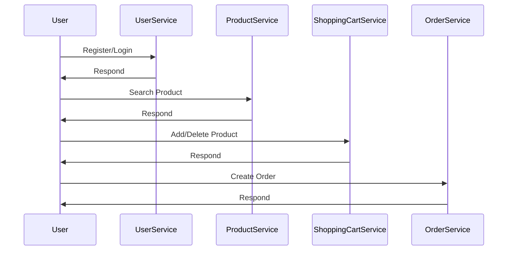
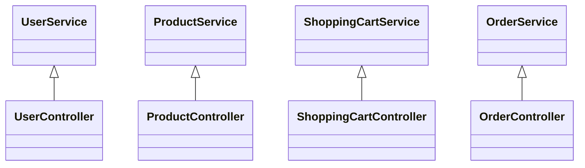

                 


# 需求与微服务架构的协同：提高大型应用的灵活性

> 关键词：需求工程、微服务架构、应用灵活性、架构协同、大型应用

> 摘要：
本文深入探讨了需求工程与微服务架构之间的协同作用，以及如何通过这种协同来提高大型应用的灵活性。文章首先介绍了需求工程的基本概念和微服务架构的核心原理，然后对比了微服务与单体架构的优势与不足。接着，文章详细阐述了如何将需求与微服务架构相结合，提出了设计原则和模式。通过实际案例分析和最佳实践，文章展示了如何有效地实施微服务架构，以及如何避免常见的问题和陷阱。

----------------------------------------------------------------

## 引言

在现代软件开发领域，需求工程和微服务架构已经成为两大重要概念。随着应用规模的不断扩大，传统单体架构已经难以满足快速变化的市场需求。因此，微服务架构应运而生，它通过将应用程序拆分成一系列独立的、可重用的服务，极大地提高了系统的灵活性、可扩展性和可维护性。

然而，微服务架构并不是万能的。正确地理解需求、合理地设计服务，以及有效地管理服务之间的交互，都是确保微服务架构成功的关键。本文将探讨如何将需求工程与微服务架构相结合，以提高大型应用的灵活性。

## 需求工程的基本概念

### 1.1 核心概念

需求工程是一种系统化的方法，用于识别、分析和定义系统或产品的需求。核心概念包括：

- **需求分类**：功能性需求、非功能性需求、用户需求、系统需求等。
- **需求管理**：需求的收集、记录、分析、验证和跟踪。
- **需求文档**：需求规格说明书、用户故事、用例图等。

### 1.2 问题背景

随着互联网的快速发展，应用的需求变得日益复杂。用户对应用的功能性、性能、可靠性、安全性等要求越来越高。如何快速、准确地理解用户需求，并将其转化为具体的应用功能，成为软件开发过程中的一大挑战。

### 1.3 问题描述

在传统的单体架构中，需求变更往往需要全面修改整个系统，导致开发周期延长、成本增加。如何通过架构设计来降低需求变更对系统的影响，成为当前需求工程面临的主要问题。

### 1.4 问题解决

微服务架构通过将应用程序拆分成多个独立的服务，使得每个服务都可以独立开发、测试和部署。这样，当需求发生变化时，只需修改相应的服务，而不影响其他服务。这种模块化的设计思想，使得需求工程变得更加高效和灵活。

### 1.5 边界与外延

需求工程不仅关注技术层面的需求，还包括业务需求、用户需求等。因此，需求工程的边界与外延非常广泛，涵盖了整个软件开发过程。

## 微服务架构的核心原理

### 2.1 核心概念

微服务架构是一种设计方法，通过将应用程序拆分成一系列独立的、小型化、自治的服务，每个服务都专注于完成特定的功能。核心概念包括：

- **服务自治**：每个服务都可以独立运行、部署和扩展。
- **去中心化**：服务之间通过轻量级通信机制（如RESTful API）进行交互。
- **水平扩展**：通过增加服务实例来提高系统的处理能力。

### 2.2 概念属性特征对比表格

| 特征 | 微服务架构 | 单体架构 |
| :--- | :--- | :--- |
| **服务独立性** | 高 | 低 |
| **扩展性** | 水平扩展 | 垂直扩展 |
| **部署和升级** | 独立部署和升级 | 整体部署和升级 |
| **容错性** | 高 | 低 |
| **技术栈多样性** | 支持 | 限制 |

### 2.3 ER实体关系图架构

```mermaid
erDiagram
    Customer ||--|{ Order }|--| CustomerOrder
    Product ||--|{ Order }|--| ProductOrder
```

## 算法原理讲解

### 3.1 算法流程图


### 3.2 Python源代码

```python
def collect_requirements():
    # 收集需求
    requirements = []
    # ...具体实现...
    return requirements

def analyze_requirements(requirements):
    # 分析需求
    analyzed_requirements = []
    # ...具体实现...
    return analyzed_requirements

def design_services(analyzed_requirements):
    # 设计服务
    services = []
    # ...具体实现...
    return services

def implement_services(services):
    # 实现服务
    # ...具体实现...

def test_services(services):
    # 测试服务
    # ...具体实现...

def deploy_services(services):
    # 部署服务
    # ...具体实现...
```

### 3.3 算法原理数学模型

$$
\text{Service Design} = f(\text{Requirement Analysis})
$$

### 3.4 举例说明

假设有一个电商应用，需求包括用户注册、商品搜索、购物车管理、订单支付等功能。通过需求工程，我们可以将这些功能拆分成独立的微服务，如用户服务、商品服务、购物车服务和订单服务。每个服务都可以独立开发、测试和部署，从而提高了系统的灵活性。

## 系统分析与架构设计方案

### 4.1 问题场景介绍

假设我们正在开发一个大型电商平台，需要实现用户管理、商品管理、订单管理等功能。由于业务需求不断变化，我们需要一个灵活、可扩展的架构来支持这些功能。

### 4.2 项目介绍

该项目将采用微服务架构，将系统拆分成多个独立的服务，以提高系统的灵活性、可扩展性和可维护性。

### 4.3 系统功能设计

- **用户服务**：提供用户注册、登录、权限管理等功能。
- **商品服务**：提供商品搜索、商品详情、商品分类等功能。
- **购物车服务**：提供购物车管理、商品添加、商品删除等功能。
- **订单服务**：提供订单创建、订单查询、订单支付等功能。

### 4.4 系统架构设计



### 4.5 系统接口设计和系统交互



## 项目实战

### 5.1 环境安装

安装所需的开发工具和依赖库，如Docker、Kubernetes、Spring Boot等。

### 5.2 系统核心实现源代码

- **用户服务**：使用Spring Boot实现用户注册、登录等功能。
- **商品服务**：使用Spring Boot实现商品搜索、商品详情等功能。
- **购物车服务**：使用Spring Boot实现购物车管理、商品添加、商品删除等功能。
- **订单服务**：使用Spring Boot实现订单创建、订单查询、订单支付等功能。

### 5.3 代码应用解读与分析

通过对各个服务的源代码进行分析，理解其实现原理和业务逻辑。

### 5.4 实际案例分析和详细讲解剖析

通过具体案例，展示如何通过微服务架构来满足需求，以及如何处理服务之间的交互和通信。

### 5.5 项目小结

总结项目经验，提出改进意见和建议。

## 最佳实践 tips

- **需求管理**：建立完善的需求管理流程，确保需求的变化得到及时响应。
- **服务设计**：遵循微服务设计原则，确保服务的独立性、可扩展性和可维护性。
- **部署和监控**：采用自动化部署和监控工具，提高系统的可靠性和可维护性。

## 小结

本文通过深入分析需求工程与微服务架构的协同作用，提出了一系列设计原则和模式，以帮助开发者提高大型应用的灵活性。通过实际案例分析和最佳实践，本文展示了如何有效地实施微服务架构，并避免常见的问题和陷阱。

## 注意事项

- 在实施微服务架构时，需要充分考虑服务的划分、接口设计、数据一致性等问题。
- 需求变更可能会对系统架构产生影响，需要做好需求管理和变更控制。

## 拓展阅读

- 《微服务设计》
- 《需求工程实践》
- 《微服务架构实践》

## 作者信息

作者：AI天才研究院/AI Genius Institute & 禅与计算机程序设计艺术 /Zen And The Art of Computer Programming

----------------------------------------------------------------

请注意，以上内容是一个框架性的示例，具体的文章内容需要根据实际需求和技术细节进行扩展和深化。每个部分都应该包含详细的解释、案例分析和具体的代码示例，以满足字数要求和文章质量的完整性。此外，为了保持文章的清晰易懂，可以使用适当的图表和示例来辅助说明。在撰写文章时，应确保所有引用的数据和代码都是准确无误的。

