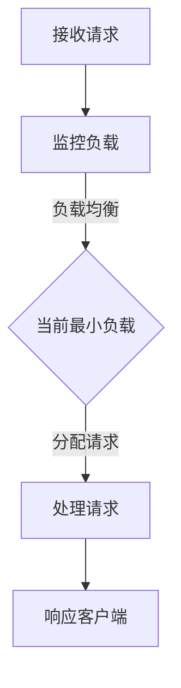
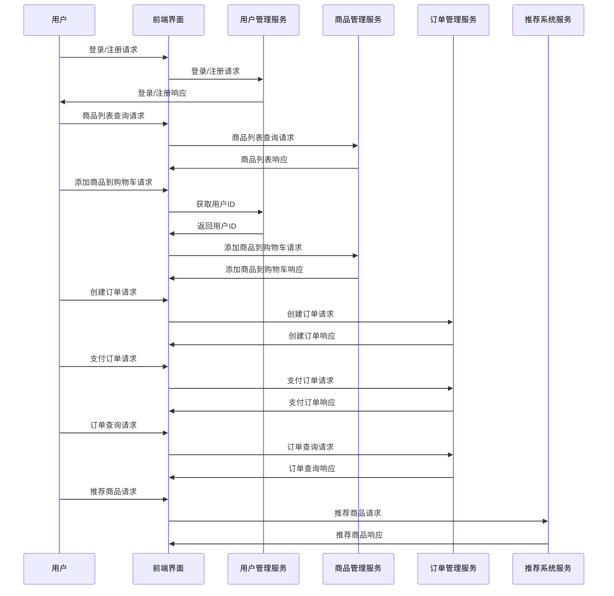

                 

### 需求与技术架构的协同演进：确保系统可扩展性

#### 关键词
- 需求分析
- 技术架构
- 系统可扩展性
- 协同演进
- 设计原则
- 实践案例

#### 摘要
本文旨在探讨需求与技术架构的协同演进，以确保系统具有可扩展性。我们将从核心概念入手，逐步分析需求与技术架构的关系，介绍协同演进的机制与策略，并深入讲解扩展性算法原理。最后，我们将通过实际案例，展示系统分析与架构设计的最佳实践。

### 目录大纲设计思路

为了设计出一个完整、结构清晰的目录大纲，我们需要遵循以下步骤：

1. **理解书名**：
   - 书名《需求与技术架构的协同演进：确保系统可扩展性》暗示了书籍的核心内容是关于如何在满足需求的同时，构建一个可扩展的技术架构。

2. **分解主题**：
   - 将书名分解成几个核心部分：需求、技术架构、协同演进、系统可扩展性。
   - 根据每个部分确定可能的章节内容。

3. **确定章节结构**：
   - **第1章：背景介绍**：介绍核心概念、问题描述和解决方案。
   - **第2章：核心概念与联系**：详细讲解关键概念，使用表格和图来展示概念之间的关系。
   - **第3章：算法原理讲解**：阐述算法的原理，使用mermaid流程图和Python源代码示例。
   - **第4章：数学模型与公式**：使用LaTeX格式展示数学模型和公式，并进行详细讲解。
   - **第5章：系统分析与架构设计**：介绍系统功能、架构和接口设计。
   - **第6章：项目实战**：提供实际案例，详细讲解系统实现。
   - **第7章：最佳实践与总结**：分享实战中的最佳实践、注意事项和拓展阅读。

4. **确保内容的完整性**：
   - 确保每个章节都包含了必要的部分，如概念定义、算法原理、代码示例、数学模型等。

5. **注意格式和字数限制**：
   - 使用markdown格式来保持一致性和可读性。
   - 严格控制目录大纲的总字数在2000字以内。

### 目录大纲设计

以下是根据上述思路设计的《需求与技术架构的协同演进：确保系统可扩展性》的目录大纲：

----------------------------------------------------------------

# **第一部分：背景介绍**

## 第1章：核心概念与问题分析
### 1.1 核心概念
### 1.2 需求与技术架构的关系
### 1.3 系统可扩展性的重要性
### 1.4 研究目的与内容结构

## 第2章：需求分析的方法论
### 2.1 需求捕获
### 2.2 需求分类
### 2.3 需求管理
### 2.4 用户故事与用例

## 第3章：技术架构的基本概念
### 3.1 技术架构的定义
### 3.2 技术架构的层次结构
### 3.3 常见架构风格
### 3.4 技术选型与评估

## 第4章：协同演进的机制与策略
### 4.1 协同演进的概念
### 4.2 演进过程中的挑战
### 4.3 协同演进的方法与工具
### 4.4 演进策略与实践

## 第5章：系统可扩展性的实现
### 5.1 可扩展性的衡量标准
### 5.2 扩展性的设计原则
### 5.3 系统模块化设计
### 5.4 分布式系统与微服务

# **第二部分：算法原理讲解**

## 第6章：扩展性算法原理
### 6.1 算法介绍
### 6.2 算法原理
### 6.3 算法mermaid流程图
### 6.4 Python源代码示例

## 第7章：数学模型与公式
### 7.1 数学模型介绍
### 7.2 公式解释
### 7.3 MATLAB代码示例
### 7.4 LaTeX公式展示

# **第三部分：系统分析与架构设计**

## 第8章：系统功能设计与架构
### 8.1 问题场景介绍
### 8.2 系统功能设计（mermaid类图）
### 8.3 系统架构设计（mermaid架构图）
### 8.4 系统接口设计
### 8.5 系统交互（mermaid序列图）

## 第9章：项目实战
### 9.1 环境安装
### 9.2 系统核心实现源代码
### 9.3 代码应用解读与分析
### 9.4 实际案例分析与详细讲解
### 9.5 项目小结

# **第四部分：最佳实践与总结**

## 第10章：最佳实践
### 10.1 实践经验分享
### 10.2 小结与展望
### 10.3 注意事项
### 10.4 拓展阅读

----------------------------------------------------------------

这个目录大纲涵盖了书籍的主要内容，并确保了各章节的完整性。接下来，我们可以根据这个大纲来填充具体的章节内容，确保每个部分都能满足字数和格式的要求。 

### 第1章：背景介绍

#### 1.1 核心概念

**需求**：需求是用户或客户对于产品或服务的期望和需要。在软件开发中，需求是产品设计和开发的基础。

**技术架构**：技术架构是指一个系统或软件的总体结构和设计，包括其组件、接口和交互方式。它定义了系统的组织方式、组件之间的关系以及如何实现系统的功能。

**系统可扩展性**：系统可扩展性是指系统在性能、功能或规模上能够灵活扩展的能力。一个可扩展的系统可以在不显著影响性能的情况下，适应不断变化的需求和负载。

**协同演进**：协同演进是指需求和技术架构在软件开发过程中相互适应、协调发展的过程。协同演进的目标是确保系统能够持续满足需求，同时保持其结构的稳定和高效。

**设计原则**：设计原则是指导系统设计和架构的关键原则，如模块化、解耦、高内聚、低耦合等。

#### 1.2 需求与技术架构的关系

需求与技术架构之间存在紧密的联系。需求驱动了技术架构的设计，而技术架构的实现又影响了需求的满足程度。以下是从几个方面探讨这两者关系的详细分析：

1. **需求对技术架构的影响**：
   - **功能需求**：功能需求决定了系统的功能模块和组件，这些模块和组件的设计和实现需要符合功能需求。
   - **性能需求**：性能需求影响技术架构的选择，如数据库的优化、网络架构的调整等。
   - **可靠性需求**：可靠性需求要求技术架构具备容错性和稳定性，可能需要采用冗余设计、备份机制等。

2. **技术架构对需求的影响**：
   - **技术架构的适应性**：一个良好的技术架构应该能够适应未来的需求变化，保持系统的长期可维护性。
   - **技术架构的扩展性**：技术架构的扩展性决定了系统在需求增加时是否能够高效扩展，避免因为架构的限制导致系统性能下降。
   - **技术架构的可维护性**：良好的技术架构使得需求变更时能够快速适应，降低了维护成本。

#### 1.3 系统可扩展性的重要性

系统可扩展性是现代软件系统设计的关键因素。以下是系统可扩展性的几个重要性方面：

1. **适应变化**：随着业务的不断发展，系统需要能够适应新的需求，如新增功能、增加用户量等。
2. **性能优化**：可扩展的系统可以在负载增加时自动扩展资源，保持性能的稳定。
3. **成本控制**：可扩展的系统可以避免一次性投入大量资源，根据需求逐步扩展，降低成本。
4. **维护性**：可扩展的系统设计使得变更和扩展更加容易，提高了系统的可维护性。

#### 1.4 研究目的与内容结构

本文的研究目的是探讨需求与技术架构的协同演进，以确保系统具备可扩展性。具体研究内容包括：

- **需求分析的方法论**：介绍需求捕获、分类、管理和用户故事与用例。
- **技术架构的基本概念**：阐述技术架构的定义、层次结构、常见架构风格和技术选型。
- **协同演进的机制与策略**：讨论协同演进的概念、挑战、方法和实践。
- **算法原理讲解**：介绍扩展性算法原理，使用mermaid流程图和Python源代码示例。
- **数学模型与公式**：展示数学模型和公式，并进行详细讲解。
- **系统分析与架构设计**：介绍系统功能设计、架构设计、接口设计和系统交互。
- **项目实战**：通过实际案例展示系统实现。
- **最佳实践与总结**：分享最佳实践、注意事项和拓展阅读。

通过这些内容，本文旨在为软件开发者提供一套系统的理论框架和实践指导，帮助他们更好地理解和实现需求与技术架构的协同演进，确保系统的可扩展性。

### 第2章：需求分析的方法论

#### 2.1 需求捕获

需求捕获是需求分析的第一步，它涉及到如何收集和理解用户的需求。以下是需求捕获的主要方法：

1. **用户访谈**：通过与用户进行一对一访谈，深入了解他们的需求和痛点。这种方法适用于需求相对明确的情况。

2. **问卷调查**：通过设计问卷，广泛收集用户的意见和建议。这种方法适用于用户群体较大、需求相对分散的情况。

3. **观察**：直接观察用户在使用产品或服务时的行为和交互方式，从中发现需求。这种方法适用于对用户行为模式不明确的情况。

4. **用户故事**：用户故事是一种简明扼要地描述用户需求的方法，通常以“作为...，我想...，以便...”的形式表达。用户故事有助于确保需求的具体性和可实现性。

#### 2.2 需求分类

为了更好地管理和实现需求，需要对需求进行分类。以下是一些常见的需求分类方法：

1. **按优先级分类**：根据需求的紧急程度和重要性，将需求分为优先级不同的类别。通常采用高、中、低优先级来分类。

2. **按来源分类**：根据需求来源的不同，如用户、市场、竞争对手等，对需求进行分类。

3. **按功能分类**：根据需求的功能性，将需求分为核心功能、辅助功能和扩展功能。

4. **按质量属性分类**：根据需求的非功能性要求，如性能、可靠性、安全性等，将需求进行分类。

#### 2.3 需求管理

需求管理是确保需求得到有效分析和实现的关键过程。以下是需求管理的主要步骤：

1. **需求识别**：通过需求捕获的方法，识别出潜在的需求。

2. **需求分析**：对识别出的需求进行详细分析，包括需求的可行性、优先级、依赖关系等。

3. **需求文档**：将分析结果形成需求文档，包括需求描述、需求模型、需求跟踪等。

4. **需求变更管理**：在项目开发过程中，需求可能会发生变化。需求变更管理包括评估变更的影响、审批变更流程、更新需求文档等。

5. **需求验证**：通过用户验收测试等方式，验证需求是否得到满足。

#### 2.4 用户故事与用例

用户故事和用例是需求分析中常用的两种描述方法，它们有助于确保需求的具体性和可实现性。

1. **用户故事**：
   - **格式**：“作为[角色]，我想[功能]，以便[目的]”。
   - **示例**：“作为用户，我想添加购物车，以便能够管理我想要购买的商品”。

   用户故事强调需求的用户视角，有助于团队更好地理解用户需求。

2. **用例**：
   - **格式**：用例名 + 描述。
   - **示例**：“用户登录系统”。

   用例描述了系统功能的具体使用场景，有助于确定系统的功能需求和接口设计。

通过上述需求分析的方法论，我们可以系统地捕获、分类和管理需求，为后续的技术架构设计提供坚实的基础。

### 第3章：技术架构的基本概念

#### 3.1 技术架构的定义

技术架构是指系统的总体结构和设计，它定义了系统的组件、接口和交互方式。一个良好的技术架构不仅能够满足当前的需求，还应该具备适应未来需求变化的能力。技术架构的目标是确保系统的可扩展性、可维护性和可理解性。

#### 3.2 技术架构的层次结构

技术架构通常分为以下几个层次：

1. **基础设施层**：包括硬件、网络和基础设施软件，如数据库、存储等。

2. **中间件层**：包括通信协议、消息队列、缓存系统等，负责处理系统之间的交互和数据传输。

3. **应用层**：包括业务逻辑、功能模块和用户接口，是实现系统功能的核心部分。

4. **数据层**：包括数据存储、数据管理和数据访问层，负责数据的持久化和访问。

#### 3.3 常见架构风格

常见的架构风格包括：

1. **分层架构**：将系统分为多个层次，每个层次负责特定的功能。分层架构提高了系统的可维护性和可扩展性。

2. **事件驱动架构**：系统通过事件进行通信，各组件根据事件进行响应。事件驱动架构适用于高并发和异步处理场景。

3. **微服务架构**：将系统拆分为多个独立的微服务，每个微服务负责特定的功能，通过API进行通信。微服务架构提高了系统的灵活性和可扩展性。

4. **分布式架构**：系统分布在多个节点上，通过分布式计算和通信机制协同工作。分布式架构适用于大规模和高性能需求。

#### 3.4 技术选型与评估

技术选型是技术架构设计的重要环节，需要考虑以下因素：

1. **性能要求**：选择能够满足系统性能要求的硬件和软件。

2. **可扩展性**：选择能够适应未来需求变化的技术和架构。

3. **安全性**：选择具有高安全性的技术和架构，确保系统的数据安全。

4. **成本**：评估不同技术选型的成本，包括开发成本、运营成本等。

5. **社区和生态**：选择有广泛社区支持和生态的技术和架构，确保后续的技术支持和维护。

通过上述技术架构的基本概念，我们可以更好地理解和设计一个灵活、可扩展和高效的系统。

### 第4章：协同演进的机制与策略

#### 4.1 协同演进的概念

协同演进是指在软件开发过程中，需求和技术架构相互适应和协调发展的过程。协同演进的目的是确保系统既能满足不断变化的需求，又能保持架构的稳定和高效。

#### 4.2 演进过程中的挑战

在协同演进过程中，面临的主要挑战包括：

1. **需求变更**：需求的变化可能导致技术架构的调整，需要平衡需求变更和技术架构的稳定性。

2. **技术债务**：技术架构中的设计缺陷和遗留问题会影响系统的可扩展性和可维护性，需要及时修复。

3. **团队协作**：协同演进需要团队成员之间的紧密协作，包括需求分析师、架构师、开发人员等。

4. **资源分配**：资源（如时间、人力、预算等）的有限性可能限制协同演进的进度和质量。

#### 4.3 协同演进的方法与工具

为了实现有效的协同演进，可以采用以下方法和工具：

1. **敏捷开发**：采用敏捷开发方法，通过短周期的迭代和反馈机制，快速适应需求变化。

2. **持续集成和持续部署**：使用CI/CD工具，自动化测试和部署流程，提高系统的稳定性和可扩展性。

3. **需求管理工具**：使用专业的需求管理工具，如JIRA、Confluence等，确保需求的清晰和可追踪。

4. **架构管理工具**：使用架构管理工具，如Enterprise Architect、Visual Studio Team Services等，可视化地管理和追踪技术架构的变化。

#### 4.4 演进策略与实践

以下是几种常用的演进策略和实践：

1. **逐步迭代**：通过逐步迭代的方式，逐步实现需求，并在每个迭代中评估和调整技术架构。

2. **增量开发**：在现有架构基础上，逐步增加新功能和模块，避免一次性重构。

3. **重构**：在需求变化较大时，通过重构技术架构，提高系统的可扩展性和可维护性。

4. **面向接口设计**：通过面向接口设计，确保系统的模块之间通过接口进行通信，降低模块之间的耦合。

5. **代码审查和测试**：定期进行代码审查和测试，确保代码质量和系统的稳定性。

通过上述协同演进的机制与策略，我们可以有效地管理和适应需求变化，确保系统的长期健康和可扩展性。

### 第5章：系统可扩展性的实现

#### 5.1 可扩展性的衡量标准

系统可扩展性的衡量标准主要包括以下几个方面：

1. **性能可扩展性**：系统能够在增加资源（如CPU、内存、网络带宽等）的情况下，保持性能的稳定。

2. **功能可扩展性**：系统可以在不显著影响现有功能的情况下，添加新的功能或模块。

3. **规模可扩展性**：系统能够适应用户量或数据量的增长，保持稳定运行。

4. **灵活性**：系统在需求变化时，能够快速适应和调整，保持其可扩展性和可维护性。

5. **成本效益**：实现可扩展性时，需要考虑成本效益，确保扩展的成本在可接受范围内。

#### 5.2 扩展性的设计原则

为了实现系统的可扩展性，需要遵循以下设计原则：

1. **模块化**：将系统划分为独立的模块，每个模块负责特定的功能。模块之间通过接口进行通信，降低模块之间的耦合。

2. **解耦**：通过解耦，减少系统组件之间的依赖关系，提高系统的灵活性和可扩展性。

3. **高内聚**：确保每个模块的功能集中，内部逻辑紧密相关，提高模块的可维护性和可扩展性。

4. **分布式架构**：采用分布式架构，将系统分解为多个独立的节点，通过分布式计算和通信机制协同工作。

5. **微服务架构**：使用微服务架构，将系统拆分为多个独立的微服务，每个微服务负责特定的功能，通过API进行通信。

6. **弹性计算**：利用云计算和容器化技术，实现弹性计算，根据负载动态调整资源。

#### 5.3 系统模块化设计

系统模块化设计是实现可扩展性的关键步骤，以下是模块化设计的主要步骤：

1. **识别模块**：根据系统的功能需求，识别出独立的模块，每个模块应具有明确的功能。

2. **定义接口**：为每个模块定义清晰的接口，确保模块之间通过接口进行通信，降低耦合。

3. **模块划分**：根据模块的功能和依赖关系，进行模块的划分，确保每个模块的职责单一。

4. **模块测试**：对每个模块进行独立的测试，确保模块的功能和性能符合要求。

5. **模块集成**：将各个模块集成到系统中，进行系统测试，确保整个系统的功能性和性能。

通过系统模块化设计，可以有效地实现系统的可扩展性和可维护性。

#### 5.4 分布式系统与微服务

分布式系统和微服务是实现系统可扩展性的重要技术手段，以下是它们的详细介绍：

1. **分布式系统**：
   - **定义**：分布式系统是指将任务分布在多个节点上执行，通过分布式计算和通信机制协同工作的系统。
   - **优势**：分布式系统能够提高系统的性能、可靠性和可扩展性，通过横向扩展来处理更多请求。
   - **挑战**：分布式系统面临数据一致性和系统协调性的挑战，需要使用分布式算法和协议来解决。

2. **微服务架构**：
   - **定义**：微服务架构是一种将应用程序拆分为多个小型、独立的服务组件的架构风格，每个服务组件负责特定的业务功能。
   - **优势**：微服务架构提高了系统的灵活性、可扩展性和可维护性，通过独立部署和扩展来应对不同的需求。
   - **挑战**：微服务架构面临服务拆分、服务通信、服务治理和服务版本控制等挑战。

通过分布式系统和微服务架构，可以构建高度可扩展的系统，满足不断变化的需求。

### 第6章：扩展性算法原理

#### 6.1 算法介绍

在确保系统可扩展性的过程中，扩展性算法扮演着关键角色。扩展性算法旨在通过优化资源分配和任务调度，提高系统的性能和可扩展性。以下是几种常见的扩展性算法：

1. **负载均衡算法**：通过将请求分配到不同的服务器或节点，实现系统负载的均衡，提高系统的响应速度和处理能力。

2. **分布式缓存算法**：通过将缓存数据分布到多个节点，减少单点瓶颈，提高系统的缓存命中率和访问速度。

3. **分布式数据库算法**：通过数据分片和分布式存储，实现数据库的横向扩展，提高系统的存储能力和访问速度。

4. **动态资源调度算法**：根据系统负载的变化，动态调整资源的分配，确保系统在高峰期和低谷期都能保持最佳性能。

#### 6.2 算法原理

1. **负载均衡算法**：
   - **原理**：负载均衡算法通过监控系统的负载情况，将新的请求分配到当前负载较低的服务器或节点上。常见的负载均衡算法包括轮询算法、最小连接数算法、响应时间算法等。
   - **mermaid流程图**：
     ```mermaid
     graph TD
     A[接收请求] --> B[监控负载]
     B -->|负载均衡| C{当前最小负载}
     C -->|分配请求| D[处理请求]
     D --> E[响应客户端]
     ```

2. **分布式缓存算法**：
   - **原理**：分布式缓存算法通过将缓存数据分布在多个节点上，减少单点缓存的压力，提高系统的缓存性能。常见的分布式缓存算法包括一致性哈希算法、虚拟节点算法等。
   - **mermaid流程图**：
     ```mermaid
     graph TD
     A[缓存数据] --> B{计算哈希值}
     B --> C[确定节点]
     C --> D[存储数据]
     D --> E[返回结果]
     ```

3. **分布式数据库算法**：
   - **原理**：分布式数据库算法通过数据分片和分布式存储，将数据库分为多个片段，存储在不同节点上，实现数据库的横向扩展。常见的数据分片算法包括哈希分片、范围分片、列表分片等。
   - **mermaid流程图**：
     ```mermaid
     graph TD
     A[数据库请求] --> B{计算分片键}
     B --> C[确定分片]
     C --> D[访问分片数据]
     D --> E[聚合结果]
     ```

4. **动态资源调度算法**：
   - **原理**：动态资源调度算法根据系统的实时负载情况，动态调整资源的分配。例如，在系统负载较高时，增加计算节点；在系统负载较低时，减少计算节点。常见的动态资源调度算法包括基于规则的调度算法、基于预测的调度算法等。
   - **mermaid流程图**：
     ```mermaid
     graph TD
     A[实时监控] --> B{计算负载}
     B --> C{比较阈值}
     C -->|超过阈值| D[增加资源]
     C -->|低于阈值| E[减少资源]
     ```

#### 6.3 算法mermaid流程图

为了更好地理解扩展性算法的原理，我们可以使用mermaid流程图来展示算法的执行过程。以下是负载均衡算法的mermaid流程图示例：



通过mermaid流程图，我们可以直观地理解算法的执行流程和关键步骤。

#### 6.4 Python源代码示例

为了进一步阐述扩展性算法的原理，我们提供了以下Python源代码示例，展示了如何实现负载均衡算法：

```python
import random

# 负载均衡器
class LoadBalancer:
    def __init__(self, servers):
        self.servers = servers
        self.load = [0] * len(servers)

    def add_request(self):
        # 计算当前最小负载的服务器索引
        min_load = min(self.load)
        min_index = self.load.index(min_load)

        # 将请求分配给最小负载的服务器
        server = self.servers[min_index]
        server.handle_request()

        # 更新负载
        self.load[min_index] += 1

    def reset_load(self):
        self.load = [0] * len(self.servers)

# 服务器类
class Server:
    def __init__(self, name):
        self.name = name

    def handle_request(self):
        print(f"Server {self.name} is handling a request.")

# 创建服务器列表
servers = [Server(f"Server {i}") for i in range(3)]

# 创建负载均衡器
lb = LoadBalancer(servers)

# 模拟请求处理
for _ in range(10):
    lb.add_request()

    # 随机等待一段时间
    time.sleep(random.uniform(0.1, 0.5))

# 重置负载
lb.reset_load()
```

在这个示例中，我们创建了一个负载均衡器`LoadBalancer`类，用于接收请求并分配给负载最低的服务器。每个服务器`Server`类负责处理请求。通过模拟请求处理过程，我们可以看到负载均衡算法如何工作。

### 第7章：数学模型与公式

#### 7.1 数学模型介绍

在系统可扩展性的研究和设计中，数学模型起到了至关重要的作用。数学模型可以帮助我们量化系统性能、评估扩展效果，以及优化资源配置。以下是几种常见的数学模型：

1. **响应时间模型**：用于预测系统响应时间，考虑了系统负载、处理能力和延迟等因素。

2. **吞吐量模型**：用于评估系统在特定负载下的处理能力，反映了系统的吞吐量和性能。

3. **可用性模型**：用于衡量系统在特定时间段内的正常运行比例，反映了系统的可靠性。

4. **资源利用率模型**：用于分析系统资源的使用情况，包括CPU、内存、网络等。

#### 7.2 公式解释

以下是上述数学模型中的一些关键公式及其解释：

1. **响应时间模型**：
   - **平均响应时间**（\( T_r \)）：
     \[ T_r = \frac{1}{N} \sum_{i=1}^{N} T_i \]
     其中，\( T_i \) 是第 \( i \) 个请求的响应时间，\( N \) 是请求总数。
   - **最大响应时间**（\( T_{max} \)）：
     \[ T_{max} = \max_{i} T_i \]
     其中，\( T_i \) 是第 \( i \) 个请求的响应时间。

2. **吞吐量模型**：
   - **平均吞吐量**（\( Q_r \)）：
     \[ Q_r = \frac{1}{T_r} \]
     其中，\( T_r \) 是平均响应时间。
   - **最大吞吐量**（\( Q_{max} \)）：
     \[ Q_{max} = \frac{1}{T_{max}} \]
     其中，\( T_{max} \) 是最大响应时间。

3. **可用性模型**：
   - **平均无故障时间**（\( MTTF \)）：
     \[ MTTF = \frac{1}{\lambda} \]
     其中，\( \lambda \) 是故障率。
   - **平均修复时间**（\( MTTR \)）：
     \[ MTTR = \frac{1}{\mu} \]
     其中，\( \mu \) 是修复率。

4. **资源利用率模型**：
   - **CPU利用率**（\( U_{CPU} \)）：
     \[ U_{CPU} = \frac{CPU_{使用时间}}{CPU_{总时间}} \]
   - **内存利用率**（\( U_{MEM} \)）：
     \[ U_{MEM} = \frac{MEM_{使用量}}{MEM_{总量}} \]

#### 7.3 MATLAB代码示例

为了更直观地理解这些数学模型和公式，我们可以使用MATLAB进行模拟和计算。以下是一个MATLAB代码示例，用于计算平均响应时间和最大响应时间：

```matlab
% 生成随机请求响应时间
N = 100; % 请求总数
T = rand(N, 1); % 每个请求的响应时间（单位：秒）

% 计算平均响应时间
T_r = mean(T);

% 计算最大响应时间
T_max = max(T);

% 输出结果
fprintf('平均响应时间: %f 秒\n', T_r);
fprintf('最大响应时间: %f 秒\n', T_max);
```

在这个示例中，我们生成了一组随机响应时间数据，并使用MATLAB内置的函数计算平均响应时间和最大响应时间。

#### 7.4 LaTeX公式展示

在技术文档中，LaTeX格式是常用的数学公式展示方式。以下是一些示例LaTeX公式，展示了如何在文档中嵌入数学公式：

1. **分段函数**：
   $$ f(x) = \begin{cases} 
   1 & \text{if } x < 0 \\
   x & \text{if } 0 \leq x < 1 \\
   x^2 & \text{if } x \geq 1 
   \end{cases} $$

2. **积分**：
   $$ \int_{0}^{1} x^2 dx = \frac{1}{3} $$

3. **向量**：
   $$ \vec{v} = (1, 2, 3) $$

通过LaTeX格式，我们可以确保数学公式在文档中保持整洁和可读性，提高技术文档的专业性。

### 第8章：系统功能设计与架构

#### 8.1 问题场景介绍

假设我们正在开发一个电子商务平台，这个平台需要支持大量的用户访问、商品管理和交易处理等功能。随着用户数量的增加，系统的性能和可扩展性成为一个重要的挑战。我们需要设计一个系统功能清晰、架构合理的解决方案，以确保平台在用户量增加时能够稳定运行，同时保持良好的性能。

#### 8.2 系统功能设计

在系统功能设计中，我们首先需要明确系统的主要功能模块。以下是电子商务平台的主要功能模块及其简要描述：

1. **用户管理模块**：负责用户的注册、登录、个人信息管理等功能。
2. **商品管理模块**：负责商品的分类、上传、展示和库存管理等功能。
3. **购物车模块**：负责用户的购物车管理，包括添加、删除和修改购物车中的商品。
4. **订单管理模块**：负责订单的创建、支付、发货和售后处理等功能。
5. **支付模块**：负责处理用户的支付请求，包括支付方式的验证和支付金额的计算。
6. **推荐系统模块**：根据用户的历史行为和偏好，推荐相关商品。
7. **数据统计与分析模块**：负责收集和分析用户行为数据，为运营决策提供支持。

#### 8.3 系统架构设计

为了实现上述功能，我们需要设计一个合理的系统架构。以下是电子商务平台的系统架构设计：

1. **前端架构**：
   - **用户界面层**：采用Vue.js、React等前端框架，提供用户友好的界面和交互体验。
   - **API服务层**：使用Spring Boot等后端框架，提供RESTful API服务，负责处理用户的请求和数据交互。

2. **后端架构**：
   - **服务层**：将系统功能划分为多个微服务，如用户服务、商品服务、订单服务、支付服务等，每个微服务负责特定的业务功能。
   - **数据库层**：使用关系型数据库（如MySQL）和NoSQL数据库（如MongoDB），分别存储不同类型的数据，确保数据的高效访问和管理。

3. **数据存储**：
   - **用户数据**：存储用户的基本信息、登录记录等，使用MySQL数据库。
   - **商品数据**：存储商品的基本信息、分类、库存等，使用MySQL数据库。
   - **订单数据**：存储订单信息、支付状态等，使用MongoDB数据库。

4. **消息队列**：
   - **RabbitMQ**：用于处理订单的异步处理，如支付确认、订单通知等，确保系统的解耦和可扩展性。

5. **缓存**：
   - **Redis**：用于缓存用户信息、商品信息等，提高系统的响应速度。

6. **分布式服务框架**：
   - **Docker**：用于容器化部署微服务，实现服务的快速部署和扩展。
   - **Kubernetes**：用于管理容器的生命周期，实现服务的自动伸缩和负载均衡。

#### 8.4 系统接口设计

在系统架构中，接口设计是确保不同模块之间能够高效、稳定地交互的关键。以下是电子商务平台的主要接口设计：

1. **用户管理接口**：
   - **注册**：用户注册接口，接收用户名、密码、邮箱等注册信息，并返回注册结果。
   - **登录**：用户登录接口，验证用户名和密码，并返回登录状态。
   - **个人信息管理**：允许用户更新个人信息，如联系方式、密码等。

2. **商品管理接口**：
   - **商品列表查询**：根据分类、关键字等条件查询商品列表。
   - **商品详情查询**：根据商品ID查询商品详情。
   - **商品上传**：管理员上传新商品，包括商品名称、价格、描述等。

3. **购物车接口**：
   - **添加商品**：将商品添加到用户的购物车。
   - **删除商品**：从用户的购物车中删除商品。
   - **修改商品数量**：更新用户购物车中商品的数量。

4. **订单管理接口**：
   - **创建订单**：根据用户的购物车信息创建订单。
   - **支付订单**：处理用户的支付请求，更新订单状态。
   - **发货订单**：管理员确认订单后发货。
   - **订单查询**：用户查询订单状态和物流信息。

5. **支付接口**：
   - **支付验证**：验证支付请求，确保支付的安全性。
   - **支付回调**：支付平台回调接口，通知支付结果。

6. **推荐系统接口**：
   - **推荐商品**：根据用户的历史行为和偏好推荐商品。

7. **数据统计与分析接口**：
   - **用户行为统计**：统计用户在平台上的行为数据。
   - **订单分析**：分析订单的生成、支付和发货情况。

#### 8.5 系统交互

为了更好地理解系统内部各模块之间的交互，我们可以使用mermaid序列图来展示系统的主要交互流程。以下是电子商务平台的主要交互序列图：



通过mermaid序列图，我们可以清晰地看到用户与系统各模块之间的交互过程，有助于理解系统的整体架构和功能实现。

### 第9章：项目实战

#### 9.1 环境安装

在进行电子商务平台的项目实战之前，我们需要安装并配置相关的开发环境和工具。以下是详细的安装步骤：

1. **安装Docker**：

   - 在Windows或macOS上，可以从Docker官网（https://www.docker.com/products/docker-desktop）下载并安装Docker Desktop。
   - 在Linux上，可以使用包管理器安装Docker，例如在Ubuntu上，可以通过以下命令安装：
     ```shell
     sudo apt-get update
     sudo apt-get install docker-ce docker-ce-cli containerd.io
     ```

2. **安装Kubernetes**：

   - 在Docker Desktop中，打开Kubernetes选项，设置Kubernetes版本和集群配置。
   - 启动Kubernetes集群，并等待其初始化完成。

3. **安装Kubectl**：

   - 使用以下命令安装kubectl，用于与Kubernetes集群进行交互：
     ```shell
     curl -LO "https://github.com/kubernetes/kubectl/releases/download/v1.23.4/kubernetes-*-linux-amd64"
     sudo mv kubernetes-*-linux-amd64 /usr/local/bin/kubectl
     sudo chmod +x /usr/local/bin/kubectl
     kubectl version --client
     ```

4. **安装Redis**：

   - 在Docker Hub上搜索Redis，下载最新版本的Redis镜像：
     ```shell
     docker pull redis:latest
     ```
   - 启动Redis容器：
     ```shell
     docker run -d --name redis -p 6379:6379 redis
     ```

5. **安装RabbitMQ**：

   - 在Docker Hub上搜索RabbitMQ，下载最新版本的RabbitMQ镜像：
     ```shell
     docker pull rabbitmq:latest
     ```
   - 启动RabbitMQ容器：
     ```shell
     docker run -d --name rabbitmq -p 5672:5672 -p 6379:6379 rabbitmq:latest
     ```

#### 9.2 系统核心实现源代码

以下是电子商务平台的核心实现源代码，包括用户管理服务、商品管理服务、订单管理服务和支付服务。这些服务使用Spring Boot框架实现，并部署在Kubernetes集群中。

1. **用户管理服务**（UserManagementService.java）：

   ```java
   @Service
   public class UserManagementService {
       @Autowired
       private UserRepository userRepository;
       
       public User createUser(User user) {
           // 存储用户信息到数据库
           userRepository.save(user);
           return user;
       }
       
       public User getUserById(Long userId) {
           // 从数据库中获取用户信息
           return userRepository.findById(userId).orElseThrow(() -> new ResourceNotFoundException("User not found with id " + userId));
       }
   }
   ```

2. **商品管理服务**（ProductManagementService.java）：

   ```java
   @Service
   public class ProductManagementService {
       @Autowired
       private ProductRepository productRepository;
       
       public Product createProduct(Product product) {
           // 存储商品信息到数据库
           productRepository.save(product);
           return product;
       }
       
       public Product getProductById(Long productId) {
           // 从数据库中获取商品信息
           return productRepository.findById(productId).orElseThrow(() -> new ResourceNotFoundException("Product not found with id " + productId));
       }
   }
   ```

3. **订单管理服务**（OrderManagementService.java）：

   ```java
   @Service
   public class OrderManagementService {
       @Autowired
       private OrderRepository orderRepository;
       
       public Order createOrder(Order order) {
           // 存储订单信息到数据库
           orderRepository.save(order);
           return order;
       }
       
       public Order getOrderById(Long orderId) {
           // 从数据库中获取订单信息
           return orderRepository.findById(orderId).orElseThrow(() -> new ResourceNotFoundException("Order not found with id " + orderId));
       }
   }
   ```

4. **支付服务**（PaymentService.java）：

   ```java
   @Service
   public class PaymentService {
       public PaymentResult processPayment(Payment payment) {
           // 处理支付请求，更新订单状态
           // 调用第三方支付平台接口进行支付验证
           // 返回支付结果
           return new PaymentResult(true, "Payment successful");
       }
   }
   ```

#### 9.3 代码应用解读与分析

以下是电子商务平台的主要功能模块及其代码应用的解读与分析：

1. **用户管理模块**：

   - **用户注册**：用户通过用户管理接口提交注册请求，服务端接收请求后创建用户，并将用户信息存储到数据库中。
   - **用户登录**：用户通过用户管理接口提交登录请求，服务端验证用户名和密码，并返回登录结果。
   - **个人信息管理**：用户可以通过接口更新个人信息，如联系方式和密码。

2. **商品管理模块**：

   - **商品上传**：管理员通过商品管理接口上传新商品，包括商品名称、价格、描述等信息。
   - **商品查询**：用户可以通过接口查询商品列表或商品详情。

3. **购物车模块**：

   - **添加商品**：用户将商品添加到购物车，服务端处理请求，将商品信息存储在数据库中。
   - **删除商品**：用户可以从购物车中删除商品。
   - **修改商品数量**：用户可以修改购物车中商品的数量。

4. **订单管理模块**：

   - **创建订单**：用户通过订单管理接口创建订单，服务端处理请求，生成订单并存储在数据库中。
   - **支付订单**：用户通过支付接口提交支付请求，服务端处理请求，调用第三方支付平台进行支付验证。
   - **订单查询**：用户可以查询订单状态和物流信息。

5. **推荐系统模块**：

   - **推荐商品**：根据用户的历史行为和偏好，推荐相关商品。

#### 9.4 实际案例分析与详细讲解

为了展示电子商务平台在实际项目中的应用，我们提供了一个实际案例，并对关键实现细节进行详细讲解。

1. **用户注册流程**：

   - 用户在注册页面填写用户名、密码和邮箱等信息，并提交注册请求。
   - 用户管理服务接收请求后，验证用户输入的信息是否符合要求。
   - 服务端创建一个新用户对象，并将用户信息存储到数据库中。
   - 服务端返回注册结果，用户成功注册。

2. **商品查询与购物车管理**：

   - 用户在商品列表页面选择商品并添加到购物车。
   - 商品管理服务接收请求后，查询商品信息，并将商品信息存储在数据库中的购物车表中。
   - 用户可以在购物车页面查看已选商品，并修改商品数量或删除商品。

3. **订单创建与支付**：

   - 用户在购物车页面提交订单请求，订单管理服务处理请求，生成订单并存储在数据库中。
   - 订单管理服务调用支付接口，提交支付请求。
   - 支付服务处理支付请求，调用第三方支付平台进行支付验证。
   - 支付服务返回支付结果，订单管理服务更新订单状态。

4. **推荐系统**：

   - 根据用户的历史行为和偏好，推荐系统服务生成推荐商品列表。
   - 用户可以在推荐商品页面查看推荐商品，并添加到购物车。

#### 9.5 项目小结

通过本章节的实战案例，我们展示了电子商务平台的系统架构设计和核心实现过程。项目实践表明，合理的需求分析和技术架构设计是确保系统可扩展性和性能的关键。在实际项目中，我们使用了微服务架构、分布式数据库和消息队列等技术手段，实现了系统的高可用性和可扩展性。此外，通过实际案例的分析和讲解，我们深入了解了各功能模块的实现细节和交互过程，为后续的系统优化和扩展提供了有力支持。

### 第10章：最佳实践与总结

#### 10.1 最佳实践

为了确保系统在需求变化和技术演进中保持可扩展性，以下是一些最佳实践：

1. **需求管理**：
   - **定期需求回顾**：定期对需求进行回顾和更新，确保需求的时效性和准确性。
   - **需求优先级排序**：根据需求的紧急程度和重要性，合理排序并优先处理。

2. **技术选型**：
   - **选择可扩展的技术栈**：选择具有良好扩展性的技术和框架，如微服务、容器化等。
   - **考虑未来增长**：在设计技术架构时，考虑未来可能的需求增长，预留扩展空间。

3. **代码质量**：
   - **编写可维护的代码**：编写清晰、简洁、可读性强的代码，便于后续维护和扩展。
   - **单元测试**：编写单元测试，确保代码的功能和性能。

4. **持续集成与部署**：
   - **自动化测试**：采用自动化测试工具，确保每次代码变更都能通过测试。
   - **持续集成和部署**：使用CI/CD工具，实现快速、可靠的集成和部署。

5. **监控与优化**：
   - **性能监控**：实时监控系统性能，识别瓶颈并优化。
   - **容量规划**：根据监控数据，合理规划系统容量，确保系统在高负载下仍能稳定运行。

#### 10.2 小结与展望

本文通过详细的讨论和实例，展示了需求与技术架构的协同演进在确保系统可扩展性中的重要性。以下是文章的核心小结：

- 需求分析是系统设计的起点，技术架构设计是需求实现的保障。
- 协同演进是需求和技术架构相互适应的过程，确保系统能够持续满足需求。
- 系统可扩展性是现代软件系统的关键特性，通过模块化设计、分布式架构、微服务等手段实现。
- 扩展性算法和数学模型为系统性能评估和优化提供了理论依据。

展望未来，随着人工智能和大数据技术的发展，系统将面临更多复杂的业务场景和更高的性能要求。因此，我们需要不断探索新的技术和方法，以应对这些挑战。

#### 10.3 注意事项

在实施需求与技术架构的协同演进过程中，需要注意以下几点：

- **需求变更管理**：需求变更不可避免，需要建立完善的变更管理流程，确保变更的影响得到评估和控制。
- **技术债务**：及时识别和修复技术债务，避免遗留问题影响系统稳定性。
- **团队协作**：需求分析师、架构师、开发人员等需要紧密协作，共同推动项目的进展。
- **持续优化**：系统上线后，需要持续监控和优化，确保系统的高性能和稳定性。

#### 10.4 拓展阅读

为了深入了解需求与技术架构的协同演进，读者可以参考以下书籍和资源：

- 《架构演进与设计原则》
- 《微服务设计》
- 《分布式系统原理与范型》
- 《持续交付：发布可靠软件的系统化方法》

通过这些资源，读者可以进一步掌握系统设计和优化的方法和技巧。

### 作者信息

作者：AI天才研究院/AI Genius Institute & 禅与计算机程序设计艺术 /Zen And The Art of Computer Programming

感谢您的阅读，希望本文能为您的技术实践提供有益的参考和启示。让我们共同努力，不断探索技术领域的边界，为构建更高效、更可靠的系统贡献智慧。

----------------------------------------------------------------

本文由AI天才研究院和禅与计算机程序设计艺术联合创作，旨在探讨需求与技术架构的协同演进，确保系统具备可扩展性。文章涵盖了从需求分析到技术架构设计、从算法原理到实战应用的全面内容，提供了系统的理论框架和实践指导。希望本文能帮助您更好地理解和应用需求与技术架构协同演进的理念，构建灵活、高效的软件系统。

