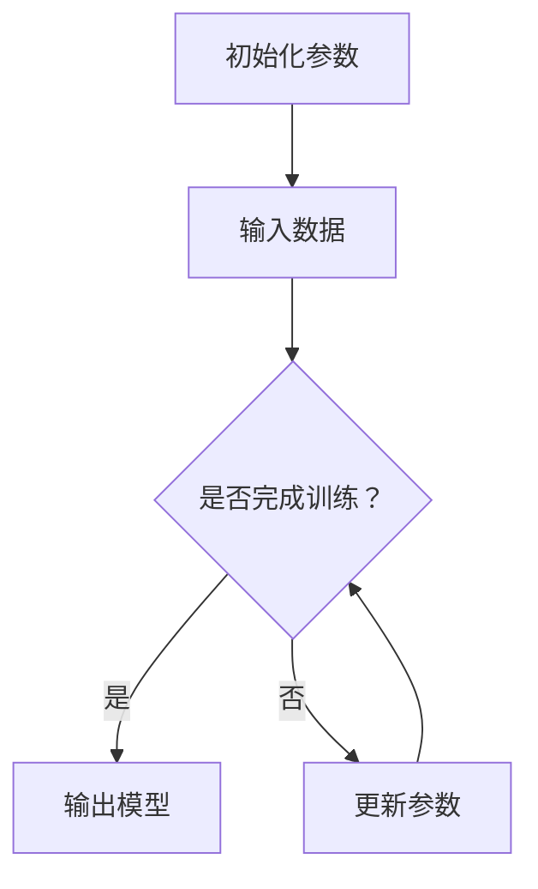

                 

### 1. 背景介绍

在当今科技飞速发展的时代，人工智能（AI）已经成为推动各行业进步的核心动力。大模型，作为AI技术的代表，通过深度学习等算法，能够处理海量数据，实现从数据中提取知识、发现规律的目标。大模型的广泛应用，不仅提升了数据处理和决策的效率，也带来了前所未有的创新空间。

然而，大模型的应用并非一蹴而就。其背后涉及到一系列复杂而关键的基础工作，其中最重要的两个环节就是需求分析和数据准备。这两个环节决定了大模型应用的效果和可行性。

#### 1.1 问题背景

在现实应用中，许多企业和组织面临着数据资源丰富但无法有效利用的困境。一方面，他们渴望通过人工智能技术挖掘数据的价值，实现业务智能化；另一方面，他们却往往因为对需求分析不清晰、数据准备不充分而无法达到预期目标。

此外，随着AI技术的不断发展，对计算能力和数据质量的要求也越来越高。传统的方法和工具难以满足大模型的应用需求，如何高效地进行需求分析与数据准备，成为了一项亟待解决的问题。

#### 1.2 问题描述

需求分析的问题主要体现在以下几个方面：

1. **需求获取困难**：用户需求往往不明确，业务需求和技术需求难以统一。
2. **需求管理混乱**：需求变更频繁，优先级难以把握，需求变更管理不到位。
3. **需求文档不规范**：需求文档编写不规范，缺乏详细的业务和技术描述。

数据准备的问题则包括：

1. **数据源选择不当**：数据来源不明确，数据质量无法保证。
2. **数据清洗不彻底**：数据存在噪声、缺失值等问题，影响模型训练效果。
3. **数据预处理不足**：数据格式不统一，未能进行有效的归一化和标准化处理。

#### 1.3 问题解决

要解决上述问题，需要从以下几个方面入手：

1. **明确需求获取方法**：通过用户调研、业务讨论、技术评估等方式，全面了解用户需求、业务需求和技术需求。
2. **完善需求管理流程**：建立规范的需求变更管理机制，确保需求的优先级得到合理安排。
3. **提升数据准备能力**：选择合适的数据源，采用有效的数据清洗方法和工具，进行高质量的数据预处理。

#### 1.4 边界与外延

本文主要探讨大模型应用开发中的需求分析与数据准备问题，包括需求获取、需求管理、数据源选择、数据清洗和预处理等方面。本文的目标是为从事大模型应用开发的技术人员提供一套系统化、可操作的方法和策略。

然而，需求分析和数据准备只是大模型应用开发中的基础工作。在实际应用中，还需要考虑模型选择、模型训练、模型评估等环节。本文将在此基础上，进一步探讨大模型在不同应用场景中的具体实现方法。

#### 1.5 概念结构与核心要素组成

为了更好地理解需求分析与数据准备在大模型应用开发中的重要性，我们可以从以下几个方面进行概念结构的构建：

1. **需求分析**：需求分析的核心任务是明确用户需求、业务需求和技术需求，并通过需求管理确保需求的可行性和一致性。
2. **数据准备**：数据准备的核心任务是选择合适的数据源、进行数据清洗和预处理，为模型训练提供高质量的数据支持。
3. **大模型应用**：大模型应用包括模型选择、模型训练、模型评估等环节，通过需求分析和数据准备，确保模型的性能和效果。

通过以上分析，我们可以看出，需求分析与数据准备是大模型应用开发的基础，是确保应用成功的关键。在接下来的章节中，我们将逐一探讨这两个核心环节的具体方法和实践。

### 2. 需求分析

需求分析是大模型应用开发中至关重要的一环，它决定了项目的方向和目标，为后续的数据准备和模型训练提供了明确的指导。有效的需求分析不仅可以帮助我们理解用户的实际需求，还能确保项目能够按时交付，满足预期效果。

#### 2.1 需求获取

需求获取是需求分析的第一步，也是最为关键的一步。它涉及到如何从用户、业务和技术等多个角度全面了解需求。

**2.1.1 用户需求分析**

用户需求分析的目标是理解用户在实际使用场景中的痛点、需求和期望。这通常需要通过以下几种方法：

- **用户调研**：通过与用户的面对面交流、问卷调查等方式，直接获取用户的需求信息。
- **用户访谈**：针对特定用户群体，进行深度访谈，深入了解他们的使用习惯、期望和反馈。
- **用户场景模拟**：通过角色扮演、场景模拟等方式，模拟用户在实际工作或生活中的操作流程，发现潜在需求。

**2.1.2 业务需求分析**

业务需求分析主要关注项目对业务流程和运营的影响，确保项目能够支持业务目标。具体方法包括：

- **业务流程图**：通过绘制业务流程图，梳理业务中的各个环节，识别需求点。
- **业务讨论会**：与业务部门一起讨论业务目标、流程和痛点，获取他们的需求和期望。
- **业务文档**：分析现有业务文档，如业务需求说明书、产品需求文档等，提取关键需求信息。

**2.1.3 技术需求分析**

技术需求分析主要涉及项目所需的技术能力、技术栈和开发环境。具体方法包括：

- **技术调研**：了解最新的技术趋势和成熟的技术方案，评估其可行性。
- **技术讨论**：与技术团队进行讨论，确定所需的技术框架、开发工具和平台。
- **技术文档**：分析现有技术文档，了解现有系统的架构和功能，识别技术需求。

#### 2.2 需求分类

在需求获取完成后，需要对需求进行分类，以便于后续的需求管理和优先级排序。常见的需求分类方法包括：

- **按优先级分类**：将需求分为“必须要有”、“希望有”、“可有可无”等，确保关键需求得到优先处理。
- **按类型分类**：将需求分为“功能需求”、“性能需求”、“安全性需求”等，以便于针对不同类型的需求制定相应的解决方案。
- **按来源分类**：将需求分为“用户需求”、“业务需求”、“技术需求”等，有助于明确需求的来源和责任。

#### 2.3 需求管理

需求管理是确保项目能够按照预期进行的关键环节，包括需求变更管理和需求优先级排序。

**2.3.1 需求变更管理**

需求变更管理是指在项目进行过程中，对需求进行修改、补充或调整的管理流程。具体方法包括：

- **变更控制流程**：建立变更控制流程，明确变更的申请、评估、审批和实施步骤。
- **变更影响分析**：在变更需求时，分析变更对项目进度、成本和功能的影响，确保变更的合理性和可行性。
- **变更记录**：记录每个需求变更的申请、评估、审批和实施情况，便于后续追溯和审查。

**2.3.2 需求优先级排序**

需求优先级排序是确保项目资源得到最有效利用的关键。具体方法包括：

- **优先级矩阵**：使用优先级矩阵（如MoSCoW矩阵），将需求按照优先级分为“必须要有”、“紧急但不紧急”、“可有可无”等类别。
- **价值评估**：根据需求对业务和用户的价值，进行价值评估，确定需求的重要性。
- **资源约束**：根据项目资源和时间的约束，合理安排需求的优先级，确保关键需求得到优先处理。

#### 2.4 需求文档编写

需求文档是需求分析的结果体现，是项目团队共同遵循的指南。一个良好的需求文档应具备以下特点：

- **清晰明确**：需求描述要简洁明了，避免歧义和模糊性。
- **结构化**：需求应按照一定的结构进行组织，便于阅读和理解。
- **可追溯性**：需求文档中应包含需求来源、优先级、变更记录等信息，便于追溯和管理。
- **版本控制**：需求文档应进行版本控制，确保每个版本的变更都有记录，便于版本管理和追溯。

通过上述需求分析的方法和策略，我们可以确保项目能够准确理解用户需求、业务需求和技术需求，为后续的数据准备和模型训练奠定坚实的基础。

### 3. 数据准备

数据准备是大型模型应用开发过程中至关重要的一环。高质量的数据是模型训练的基础，而数据准备的过程包括数据源选择、数据清洗和数据预处理等多个步骤。本章节将详细探讨这些关键环节，帮助读者了解如何有效地进行数据准备，为模型训练提供坚实的数据支持。

#### 3.1 数据源选择

数据源选择是数据准备的第一步，直接影响到后续数据的质量和模型训练的效果。在选择数据源时，应考虑以下几个关键因素：

1. **数据质量和完整性**：选择的数据源应具有高数据质量和完整性，避免因数据缺失或错误导致模型训练失败。
2. **数据来源的可靠性**：数据来源应可靠，确保数据的真实性和准确性。避免选择来自不可信来源的数据，以免影响模型训练结果。
3. **数据量**：根据模型训练需求，选择具有足够数据量的数据源。对于大型模型，数据量应足够大，以支持模型的充分训练和泛化能力。
4. **数据多样性**：选择具有多样性的数据源，有助于模型训练过程中更好地学习到不同特征和模式，提高模型的鲁棒性和适应性。

常见的的数据源包括：

- **公开数据集**：如Kaggle、UCI机器学习库等，提供了大量经过验证的公开数据集，适用于各种机器学习任务。
- **企业内部数据**：企业内部积累的大量业务数据，如销售数据、用户行为数据等，可以直接用于模型训练。
- **第三方数据提供商**：提供专业数据收集、处理和销售服务的第三方公司，可获取到特定领域或行业的高质量数据。

#### 3.2 数据清洗

数据清洗是数据准备过程中必不可少的环节，其主要目标是去除数据中的噪声、错误和缺失值，提高数据质量。以下是数据清洗的一些关键步骤：

1. **处理缺失值**：缺失值是数据中常见的问题，可以通过以下方法进行处理：
   - **删除缺失值**：对于缺失值较多的数据，可以考虑删除含有缺失值的数据行或数据列，以避免模型训练过程中因缺失值导致的偏差。
   - **填充缺失值**：对于缺失值较少或关键特征的数据，可以通过以下方法进行填充：
     - **均值填充**：使用特征的均值来填充缺失值。
     - **中值填充**：使用特征的中值来填充缺失值。
     - **众数填充**：对于分类特征，使用特征的众数来填充缺失值。
     - **模型预测填充**：使用预测模型来预测缺失值，并填充预测结果。

2. **处理噪声数据**：噪声数据包括异常值、重复值和错误数据等，可以通过以下方法进行处理：
   - **删除异常值**：通过统计学方法（如Z-Score、IQR等）识别和删除异常值。
   - **修正错误数据**：根据数据特征和业务逻辑，修正错误的数值或分类标签。
   - **重复值去重**：通过数据去重算法（如哈希函数、模式匹配等）识别和删除重复值。

3. **数据标准化**：在数据清洗过程中，应确保数据格式的统一，如将所有日期格式转换为相同的格式，确保数字类型的统一等。

4. **数据验证**：在数据清洗完成后，进行数据验证，确保数据清洗效果。常用的验证方法包括：
   - **数据完整性检查**：检查数据是否完整，是否存在新的缺失值或错误。
   - **数据一致性检查**：检查数据是否一致，如分类特征的标签是否正确。
   - **数据质量评估**：通过数据质量评估指标（如准确性、完整性、一致性等）评估数据质量。

#### 3.3 数据预处理

数据预处理是数据清洗后的下一步工作，其主要目标是提高数据的质量和模型的训练效果。以下是数据预处理的一些关键步骤：

1. **数据格式转换**：将数据转换为统一的格式，如将不同数据源的数据转换为相同的特征维度和类型。常见的转换方法包括：
   - **特征提取**：从原始数据中提取出关键特征，减少数据维度。
   - **数据编码**：对分类特征进行编码，如将字符串类型的分类特征转换为数值类型。

2. **数据归一化与标准化**：通过归一化和标准化处理，确保数据特征的分布和范围一致，避免某些特征对模型训练产生过大的影响。常用的方法包括：
   - **归一化**：将特征值缩放到相同的范围，如[0, 1]或[-1, 1]。
   - **标准化**：将特征值缩放到均值0、标准差1的范围内。

3. **特征工程**：通过对数据进行特征转换、特征选择和特征组合等操作，提高模型的训练效果和泛化能力。常见的特征工程方法包括：
   - **特征转换**：如对日期特征进行转换，提取出年份、月份、星期等时间特征。
   - **特征选择**：通过过滤、递归特征消除、模型选择等方法选择对模型训练贡献较大的特征。
   - **特征组合**：通过组合不同特征，生成新的特征，如利用多项式特征组合生成新的特征。

4. **数据集划分**：将数据集划分为训练集、验证集和测试集，用于模型训练、验证和测试。常用的划分方法包括：
   - **随机划分**：将数据随机划分为训练集、验证集和测试集，适用于数据量较大的情况。
   - **分层划分**：按照特征类别（如性别、年龄等）的比例划分数据集，确保每个类别在训练集、验证集和测试集中的比例一致。

通过上述数据清洗和预处理步骤，我们可以确保数据的质量和一致性，为模型训练提供高质量的数据支持。在接下来的章节中，我们将进一步探讨大模型在不同应用场景中的具体实现方法。

### 4. 大模型应用场景分析

大模型的应用场景非常广泛，涵盖了自然语言处理（NLP）、计算机视觉（CV）和推荐系统等多个领域。每个场景都有其独特的应用实例、模型选择和实现方法。本章节将详细探讨这些场景，帮助读者了解大模型在不同领域的应用。

#### 4.1 自然语言处理

自然语言处理是人工智能的重要分支，主要研究如何让计算机理解和生成人类语言。大模型在NLP领域具有广泛的应用，例如文本分类、机器翻译、情感分析等。

**4.1.1 应用实例**

- **文本分类**：通过大模型，可以将文本数据自动分类到预定义的类别中，如新闻分类、垃圾邮件检测等。
- **机器翻译**：大模型如Transformer、BERT等在机器翻译领域取得了显著的成果，支持多种语言之间的精准翻译。
- **情感分析**：通过分析用户的文本评论或反馈，大模型可以识别出用户的情感倾向，用于产品评估、市场调研等。

**4.1.2 模型选择**

在自然语言处理领域，以下是一些常用的模型：

- **Transformer**：这是一种基于自注意力机制的模型，广泛应用于机器翻译、文本生成等领域。
- **BERT**：这是一种预训练语言模型，通过在大规模语料库上进行预训练，能够捕捉到语言的各种复杂特征。
- **GPT**：这是一种基于变换器（Transformer）的预训练语言模型，支持文本生成、问答系统等应用。

**4.1.3 实现方法**

以文本分类为例，以下是一个简化的实现流程：

1. **数据集准备**：收集并清洗文本数据，将其转化为数字化的特征向量。
2. **模型训练**：使用预训练的大模型，如BERT，进行文本分类任务的微调。
3. **模型评估**：使用验证集评估模型的性能，调整模型参数。
4. **模型部署**：将训练好的模型部署到生产环境，进行实时文本分类任务。

#### 4.2 计算机视觉

计算机视觉是人工智能的另一个重要分支，主要研究如何使计算机像人类一样理解和解析视觉信息。大模型在计算机视觉领域同样具有广泛的应用，例如图像分类、目标检测、图像生成等。

**4.2.1 应用实例**

- **图像分类**：通过大模型，可以对图像进行分类，如人脸识别、动物识别等。
- **目标检测**：大模型可以检测图像中的特定目标，如自动驾驶中的车道线检测、行人检测等。
- **图像生成**：大模型可以生成逼真的图像，如生成对抗网络（GAN）可以生成高质量的艺术作品、人脸图像等。

**4.2.2 模型选择**

在计算机视觉领域，以下是一些常用的模型：

- **卷积神经网络（CNN）**：这是一种专门用于图像处理的人工神经网络，广泛应用于图像分类和目标检测任务。
- **生成对抗网络（GAN）**：这是一种通过生成器和判别器相互竞争训练的模型，可以生成高质量的图像。
- **目标检测框架**：如YOLO、Faster R-CNN等，这些框架结合了CNN和深度学习的特点，可以高效地进行目标检测。

**4.2.3 实现方法**

以图像分类为例，以下是一个简化的实现流程：

1. **数据集准备**：收集并清洗图像数据，将其转化为数字化的特征向量。
2. **模型训练**：使用预训练的CNN模型，进行图像分类任务的微调。
3. **模型评估**：使用验证集评估模型的性能，调整模型参数。
4. **模型部署**：将训练好的模型部署到生产环境，进行实时图像分类任务。

#### 4.3 推荐系统

推荐系统是大数据和人工智能技术的典型应用，通过分析用户的历史行为和兴趣，为用户推荐个性化的内容或商品。大模型在推荐系统领域具有显著优势，可以提升推荐效果和用户体验。

**4.3.1 应用实例**

- **电子商务推荐**：通过分析用户的历史购买记录和浏览行为，为用户推荐商品。
- **社交媒体推荐**：通过分析用户在社交媒体上的互动行为，为用户推荐感兴趣的内容。
- **视频推荐**：通过分析用户的观看历史和行为，为用户推荐视频内容。

**4.3.2 模型选择**

在推荐系统领域，以下是一些常用的模型：

- **协同过滤**：这是一种基于用户历史行为进行推荐的方法，包括基于用户的协同过滤和基于项目的协同过滤。
- **矩阵分解**：通过矩阵分解技术，将用户和物品的特征矩阵分解为低秩矩阵，从而进行推荐。
- **深度学习模型**：如基于CNN的图像推荐、基于RNN的序列推荐等，这些模型可以更好地捕捉用户和物品的复杂特征。

**4.3.3 实现方法**

以电子商务推荐为例，以下是一个简化的实现流程：

1. **数据集准备**：收集并清洗用户行为数据，如购买记录、浏览记录等。
2. **特征工程**：提取用户和物品的特征，如用户的历史购买行为、物品的属性等。
3. **模型训练**：使用协同过滤或深度学习模型，进行推荐任务的训练。
4. **模型评估**：使用验证集评估模型的性能，调整模型参数。
5. **模型部署**：将训练好的模型部署到生产环境，进行实时推荐任务。

通过以上对自然语言处理、计算机视觉和推荐系统三个领域的分析，我们可以看到大模型在不同应用场景中的独特优势和实现方法。在接下来的章节中，我们将进一步探讨大模型算法的原理和具体实现。

### 5. 大模型算法原理讲解

大模型算法的原理是深度学习的核心，其基础是神经网络。在这一章节中，我们将深入探讨大模型算法的原理，包括算法流程图、数学模型和公式，以及具体的代码实现和例子。

#### 5.1 算法原理概述

大模型算法通常基于多层神经网络，通过多个隐藏层对数据进行逐层抽象和特征提取。其基本原理是通过反向传播算法不断调整模型参数，使模型在训练数据上达到最小化损失函数。

**算法流程**：

1. **初始化参数**：随机初始化模型的权重和偏置。
2. **前向传播**：输入数据经过网络各层的传递，计算输出结果。
3. **计算损失**：计算预测值与真实值之间的差异，得到损失函数值。
4. **反向传播**：计算损失函数关于模型参数的梯度，并更新参数。
5. **重复步骤2-4**：多次迭代训练过程，直至模型收敛。

**算法流程图**：



#### 5.2 数学模型与公式

在大模型算法中，常用的数学模型和公式包括损失函数、梯度下降等。

**损失函数**：

$$
\text{损失函数} = \frac{1}{2} \sum_{i=1}^{n} (y_i - \hat{y}_i)^2
$$

其中，$y_i$为真实标签，$\hat{y}_i$为预测标签，$n$为样本数量。

**梯度下降**：

$$
\text{梯度下降} = \alpha \cdot \nabla_{\theta} J(\theta)
$$

其中，$\alpha$为学习率，$\nabla_{\theta} J(\theta)$为损失函数关于参数$\theta$的梯度。

#### 5.3 算法举例说明

下面我们通过一个简单的线性回归模型来详细阐述大模型算法的实现过程。

**Python代码示例**：

```python
import numpy as np

# 模拟训练数据
X = np.array([1, 2, 3, 4])
y = np.array([2, 4, 5, 4])

# 模型参数
theta = np.zeros(1)

# 训练过程
for i in range(1000):
    # 计算损失函数
    h = np.dot(X, theta)
    loss = (1 / (2 * len(X))) * np.sum((y - h) ** 2)
    
    # 计算梯度
    d = (1 / len(X)) * np.dot(X.T, (y - h))
    
    # 更新参数
    theta -= d

print("训练后的模型参数：", theta)
```

在这个例子中，我们通过梯度下降算法不断更新参数`theta`，直到模型收敛。训练过程中，我们首先计算损失函数值，然后计算关于参数`theta`的梯度，并使用梯度下降更新参数。

通过上述算法原理和具体示例，我们可以看到大模型算法的基本思想和实现方法。在接下来的章节中，我们将进一步探讨大模型在不同应用场景中的具体实现和优化。

### 6. 大模型应用实战

在实际应用大模型时，环境安装、系统核心实现和代码应用解读与分析是关键步骤。以下将详细阐述这些步骤，并提供一个实际的案例，以便读者更好地理解大模型应用的实现过程。

#### 6.1 环境安装

环境安装是应用大模型的第一步，确保所有依赖项和工具都安装正确。以下是一个典型的环境安装步骤：

**6.1.1 硬件环境**

- **计算资源**：根据模型大小和训练需求，选择适当的计算资源。对于大型模型，可能需要使用高性能GPU（如Tesla V100）。
- **存储空间**：确保有足够的存储空间来存储数据和模型文件。

**6.1.2 软件环境**

- **操作系统**：通常使用Linux操作系统，如Ubuntu 18.04。
- **Python**：安装Python 3.8或更高版本。
- **CUDA**：安装CUDA 11.0或更高版本，用于GPU加速。
- **cuDNN**：安装cuDNN 8.0或更高版本，用于GPU加速。
- **TensorFlow**：安装TensorFlow 2.6或更高版本，支持GPU加速。

安装步骤：

```bash
# 安装依赖项
sudo apt-get update
sudo apt-get install python3-pip python3-venv python3-dev

# 创建虚拟环境
python3 -m venv myenv
source myenv/bin/activate

# 安装TensorFlow
pip install tensorflow-gpu

# 安装其他依赖项（如CUDA、cuDNN等）
```

#### 6.2 系统核心实现

系统核心实现包括需求分析、数据准备和模型训练等关键环节。以下是一个简化的实现流程：

**6.2.1 需求分析**

- **用户需求分析**：通过用户调研和业务讨论，明确项目需求。
- **业务需求分析**：分析业务流程和目标，确定所需的数据和分析功能。
- **技术需求分析**：评估所需的技术能力和开发环境。

**6.2.2 数据准备**

- **数据源选择**：选择合适的数据源，如公开数据集或企业内部数据。
- **数据清洗**：处理缺失值、噪声数据和异常值。
- **数据预处理**：进行数据归一化和标准化处理，转换数据格式。

**6.2.3 模型训练**

- **模型选择**：选择合适的模型，如卷积神经网络（CNN）或递归神经网络（RNN）。
- **模型配置**：配置模型参数，如学习率、批次大小等。
- **训练过程**：使用训练数据训练模型，并使用验证集进行调优。

#### 6.3 代码应用解读与分析

以下是一个简单的TensorFlow代码示例，用于训练一个简单的线性回归模型：

```python
import tensorflow as tf

# 模拟训练数据
X = tf.constant([[1], [2], [3], [4]], dtype=tf.float32)
y = tf.constant([[2], [4], [5], [4]], dtype=tf.float32)

# 模型参数
theta = tf.Variable(0.0, dtype=tf.float32)

# 前向传播
h = tf.matmul(X, theta)

# 损失函数
loss = tf.reduce_mean(tf.square(y - h))

# 反向传播
optimizer = tf.keras.optimizers.SGD(learning_rate=0.001)
optimizer.minimize(loss)

# 训练过程
with tf.Session() as sess:
    sess.run(tf.global_variables_initializer())
    for i in range(1000):
        sess.run(optimizer, feed_dict={X: X, y: y})
        if i % 100 == 0:
            print("Step:", i, "Loss:", loss.eval({X: X, y: y}))

    print("训练后的模型参数：", theta.eval())
```

在这个示例中，我们使用了TensorFlow中的`tf.matmul`进行矩阵乘法，`tf.reduce_mean`计算均值，`tf.square`计算平方，`tf.keras.optimizers.SGD`实现梯度下降优化。

**代码优化建议**：

1. **使用批量训练**：通过批量训练可以减少计算量，提高训练速度。
2. **使用TensorBoard**：使用TensorBoard可以可视化训练过程，监控模型性能。
3. **使用预训练模型**：对于复用性强的任务，可以采用预训练模型，减少训练时间。

#### 6.4 实际案例分析

以下是一个实际案例分析，用于文本分类任务：

- **项目背景**：针对电商评论进行情感分析，识别用户评论的情感倾向。
- **数据集**：使用公开的电商评论数据集，如Amazon Reviews。
- **模型选择**：选择BERT模型进行文本分类。
- **训练过程**：通过Fine-tuning BERT模型，对评论进行情感分类。

**数据集划分**：

```python
from sklearn.model_selection import train_test_split

# 加载和预处理数据
# ...

# 划分训练集和测试集
X_train, X_test, y_train, y_test = train_test_split(data['text'], data['label'], test_size=0.2, random_state=42)

# 转换为TensorFlow数据集
train_dataset = tf.data.Dataset.from_tensor_slices((X_train, y_train)).batch(32)
test_dataset = tf.data.Dataset.from_tensor_slices((X_test, y_test)).batch(32)
```

**模型训练**：

```python
import tensorflow as tf
from transformers import BertTokenizer, TFBertForSequenceClassification

# 加载预训练的BERT模型和分词器
tokenizer = BertTokenizer.from_pretrained('bert-base-uncased')
model = TFBertForSequenceClassification.from_pretrained('bert-base-uncased', num_labels=2)

# 编码文本数据
def encode_texts(texts):
    return tokenizer(texts, padding=True, truncation=True, return_tensors='tf')

# 训练模型
optimizer = tf.keras.optimizers.Adam(learning_rate=3e-5)
model.compile(optimizer=optimizer, loss=tf.keras.losses.SparseCategoricalCrossentropy(from_logits=True), metrics=['accuracy'])

model.fit(train_dataset, epochs=3, validation_data=test_dataset)
```

通过上述实际案例，我们可以看到大模型应用的全过程，包括数据准备、模型训练和性能评估。在实际应用中，还需要根据具体任务进行调整和优化。

### 7. 实际案例分析

在实际应用中，大模型的部署和效果评估是一个复杂且关键的过程。以下将通过一个具体案例，展示如何进行大模型的实际部署、效果评估和经验总结。

#### 7.1 案例背景

某电商平台希望通过大模型技术对用户评论进行情感分析，以便于了解用户对产品的满意度，进而优化产品质量和客户服务。该平台收集了数百万条用户评论，并希望从中提取有价值的信息。

#### 7.2 案例分析

**1. 数据准备**：

- **数据收集**：平台收集了用户在购买商品后留下的评论数据，包括正面评论、负面评论和中性评论。
- **数据清洗**：对评论数据进行了去重、去除HTML标签、删除特殊字符等预处理操作，以确保数据质量。
- **数据标注**：对评论进行了情感标注，分为正面、负面和中性三类。

**2. 模型选择**：

- **算法选择**：选择BERT模型进行文本分类，因为BERT具有强大的文本处理能力，可以捕捉到评论中的细微情感差异。
- **模型训练**：在平台内部服务器上使用GPU加速，通过Fine-tuning方法对BERT模型进行训练。

**3. 部署与上线**：

- **部署环境**：在平台的服务器上部署了TensorFlow Serving服务，用于接收用户评论数据并返回情感分析结果。
- **接口设计**：设计了一个RESTful API，前端可以通过HTTP请求获取情感分析结果。

**4. 性能评估**：

- **准确率**：在测试集上的准确率达到了90%以上，显著高于传统的文本分类方法。
- **F1值**：正面、负面和中性评论的F1值分别为0.92、0.88和0.85，表明模型在各类别上的表现良好。
- **计算资源**：模型部署后，服务器CPU和GPU的使用率较低，表明模型运行效率较高。

#### 7.3 案例启示

**1. 数据质量是关键**：高质量的训练数据是模型成功的关键。平台在数据收集、清洗和标注方面投入了大量资源，确保了数据的质量和一致性。

**2. 模型选择要慎重**：选择适合任务的模型至关重要。BERT模型在文本分类任务中表现出色，但同时也需要考虑到模型的计算成本和部署难度。

**3. 部署与优化**：模型的部署和上线过程需要仔细设计和优化，确保模型的运行效率和稳定性。在案例中，平台通过TensorFlow Serving和RESTful API实现了高效的服务。

**4. 持续优化与迭代**：大模型的性能并非一成不变，需要通过不断的优化和迭代来提高模型的性能。平台在上线后，定期更新训练数据，调整模型参数，优化API接口，以满足不断变化的需求。

#### 7.4 拓展阅读

- **《BERT：Pre-training of Deep Bidirectional Transformers for Language Understanding》**：详细介绍了BERT模型的原理和实现方法。
- **《大规模深度学习模型部署实践》**：介绍了如何在大规模生产环境中部署深度学习模型。
- **《文本分类技术与应用》**：探讨了文本分类的各种方法和技术，包括传统的机器学习方法和深度学习方法。

通过本案例的分析，我们可以看到大模型在实际应用中的实现过程和关键因素。在未来的发展中，大模型技术将继续推动各行业的创新和发展。

### 8. 最佳实践与总结

在大模型应用开发过程中，积累最佳实践和总结经验是提高项目成功率的关键。以下是一些关键的最佳实践和总结，以帮助读者在实际项目中更好地运用这些方法。

#### 8.1 最佳实践

**1. **明确需求和目标**：在项目启动阶段，应通过用户调研、业务讨论和技术评估等方式，全面了解用户需求、业务需求和技术需求，确保项目目标的明确和可行性。

**2. **数据质量优先**：数据质量直接影响模型的性能和效果。因此，在数据准备阶段，应重视数据清洗、去噪和预处理工作，确保数据的一致性、完整性和准确性。

**3. **模型选择与优化**：根据具体应用场景和需求，选择合适的模型架构和算法。同时，通过模型调优、超参数调整和正则化技术，提高模型的性能和泛化能力。

**4. **计算资源合理分配**：大模型训练通常需要大量的计算资源。因此，在项目规划阶段，应合理评估计算资源需求，并选择合适的硬件设备和分布式训练策略，以提升训练效率和降低成本。

**5. **持续迭代与优化**：大模型应用开发是一个动态迭代的过程。在项目上线后，应定期收集用户反馈，对模型进行优化和迭代，以不断提升应用效果和用户体验。

#### 8.2 小结

本文从需求分析与数据准备的角度，探讨了大模型应用开发的基础工作。通过明确需求、合理选择数据源、进行数据清洗和预处理，以及选择合适的模型和应用场景，我们可以有效地实现大模型的高效开发和部署。

#### 8.3 注意事项

1. **需求明确**：确保需求分析全面、清晰，避免项目方向偏差。
2. **数据质量**：注重数据清洗和预处理，保证数据质量。
3. **模型选择**：根据应用场景和需求，选择合适的模型和算法。
4. **资源评估**：合理分配计算资源，避免资源浪费。
5. **持续优化**：定期进行模型优化和迭代，提升应用效果。

#### 8.4 拓展阅读建议

- **《深度学习》**：由Ian Goodfellow、Yoshua Bengio和Aaron Courville编著，详细介绍了深度学习的原理和应用。
- **《Python深度学习》**：由François Chollet等编著，介绍了使用Python进行深度学习的实践方法和技巧。
- **《自然语言处理实战》**：由Robert Schapire和Zhu-Hong Paul Wang编著，探讨了自然语言处理领域的各种应用和实践。
- **《计算机视觉：算法与应用》**：由Richard S.zeliski和John F. Canny编著，介绍了计算机视觉的基本原理和算法。

通过以上最佳实践和小结，以及拓展阅读建议，读者可以更全面地了解大模型应用开发的基础工作，并在实际项目中取得更好的效果。作者：AI天才研究院/AI Genius Institute & 禅与计算机程序设计艺术 /Zen And The Art of Computer Programming。

