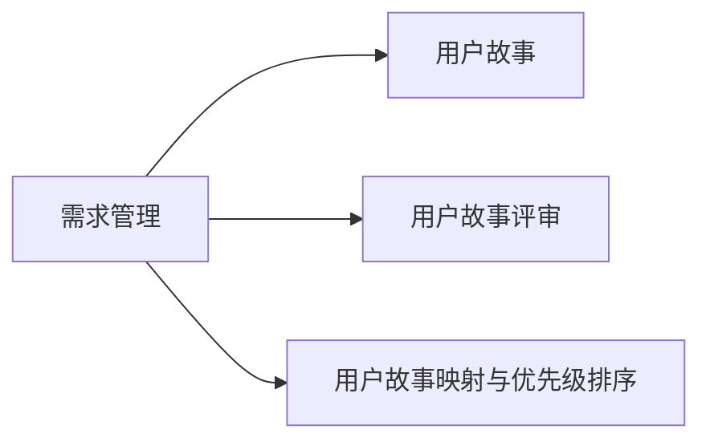
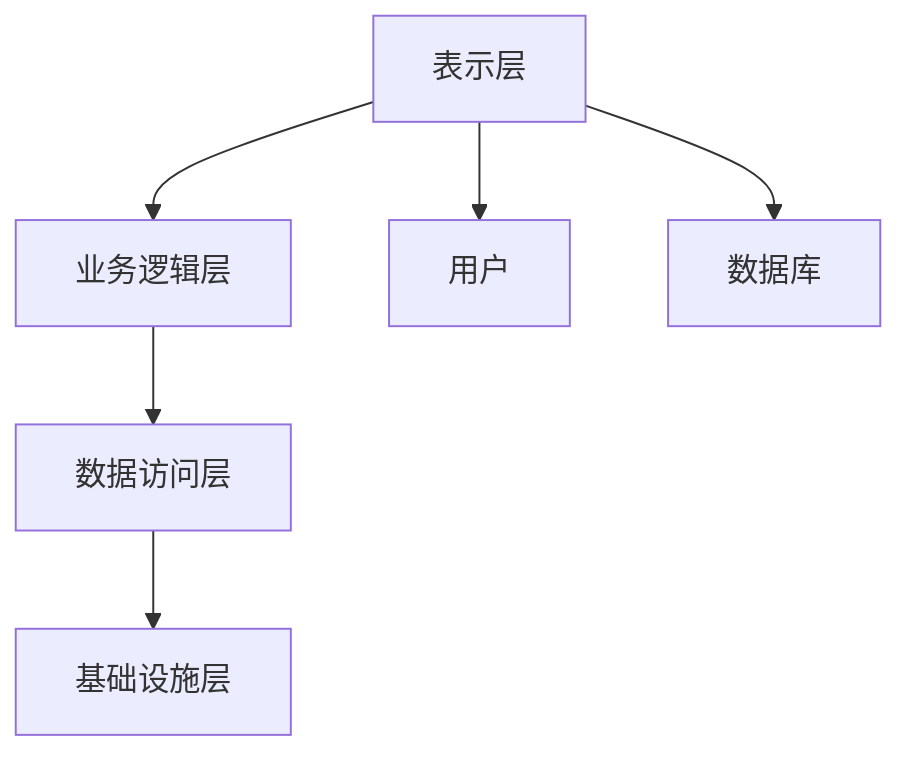
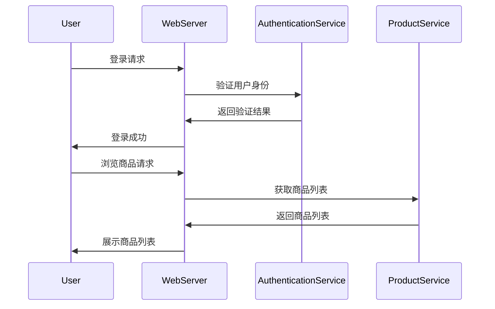
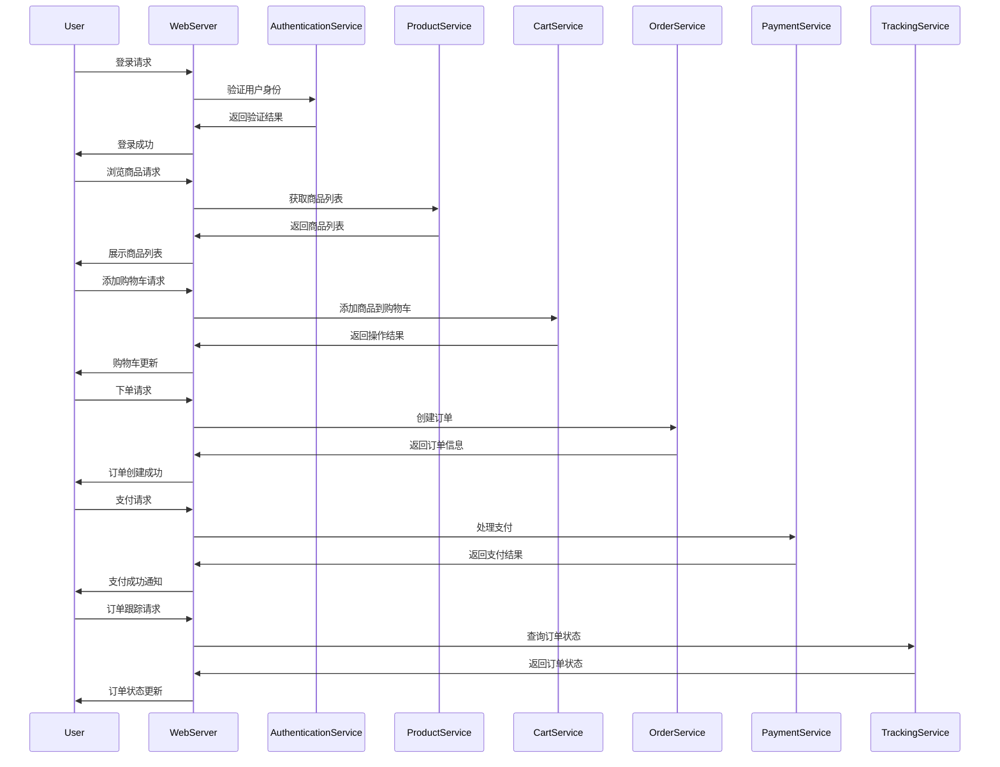
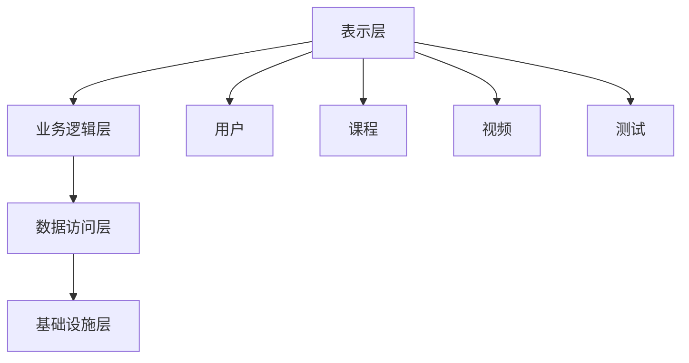
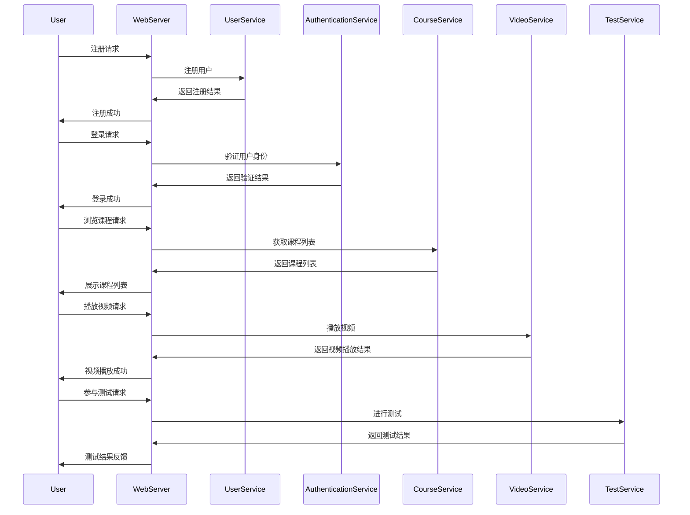

                 


### 第1章：引言

#### 1.1 问题背景与核心概念

随着软件工程的发展，需求与用户故事在软件开发生命周期中扮演着越来越重要的角色。然而，如何准确地理解和表达这些需求，如何将用户故事与需求进行精细化管理和对应，成为了软件开发过程中的一大挑战。

本章节旨在为读者提供一个全面、深入的背景介绍，让读者理解需求与用户故事的精细化管理的必要性，以及如何进行这一管理过程。

**问题背景**

在传统的软件开发中，需求通常由技术专家和项目经理进行定义，他们往往从技术角度出发，忽视了用户实际使用场景和需求。这导致开发出的软件往往不能满足用户的需求，或者出现功能不完善、用户体验差等问题。

为了解决这个问题，敏捷开发方法引入了用户故事的概念，它以用户的视角来描述软件需求，强调用户体验和业务价值。然而，即使有了用户故事，如何确保其准确性和完整性，如何将其与需求进行有效对应和管理，仍然是一个难题。

**核心概念**

在本章节中，我们将介绍以下核心概念：

1. **需求**：需求是软件系统必须实现的功能和非功能特性。它们通常由客户、项目经理或产品经理提出，并经过技术团队验证和确认。

2. **用户故事**：用户故事是以用户的语言表述的需求，它遵循“作为（As a），我想要（I want），为了（so that）”的格式。用户故事强调用户体验和业务价值，通常由业务人员或产品经理编写。

3. **需求管理**：需求管理是一个持续的过程，它涉及需求的收集、分析、规划、跟踪和实现。需求管理的目标是确保软件系统能够满足用户的需求和期望。

4. **用户故事管理**：用户故事管理是需求管理的一个子集，它关注用户故事的编写、评审、映射和优先级排序。用户故事管理的目标是确保用户故事能够准确地表达用户需求，并有效地指导软件开发过程。

#### 1.2 问题与解决方案

**问题**

1. 需求不明确：由于需求通常由技术专家定义，他们可能忽视了用户实际使用场景和需求，导致需求不明确。

2. 用户故事不准确：虽然用户故事强调用户体验和业务价值，但它们可能无法准确地表达用户需求，或者存在歧义。

3. 需求变更频繁：在软件开发过程中，需求可能因各种原因发生变更，导致项目进度和成本受到严重影响。

4. 需求与用户故事对应关系不清晰：需求与用户故事之间缺乏明确的对应关系，导致需求管理过程中出现混乱和误解。

**解决方案**

1. **精细化需求管理**：通过详细的需求分析和技术验证，确保需求明确和可预测。同时，采用敏捷开发方法，及时响应需求变更。

2. **用户故事精细化编写与评审**：采用用户视角来编写用户故事，确保其准确性和完整性。通过严格的评审流程，确保用户故事能够准确地表达用户需求。

3. **需求与用户故事的映射与优先级排序**：建立需求与用户故事之间的明确对应关系，确保需求管理过程中不会出现混乱和误解。通过合理的优先级排序，确保关键需求得到优先实现。

#### 1.3 边界与外延

**边界**

1. 本章节主要关注需求与用户故事的精细化管理和对应关系，不涉及其他软件开发过程。

2. 本章节的内容适用于所有类型的软件项目，无论项目规模大小。

**外延**

1. 本章节的内容可以与其他软件开发过程相结合，如项目规划、设计、测试和部署。

2. 本章节的内容可以应用于不同的开发方法，如敏捷开发、瀑布开发等。

#### 1.4 概念结构与核心要素组成

在本章节中，我们将详细介绍需求、用户故事、需求管理和用户故事管理的概念结构，以及它们的核心要素组成。

**需求概念结构**

- **定义**：需求是软件系统必须实现的功能和非功能特性。
- **分类**：需求可分为功能需求和非功能需求。
- **要素组成**：
  - **需求陈述**：明确描述需求的内容。
  - **需求来源**：需求的来源，如客户、项目经理或产品经理。
  - **需求验证**：对需求进行验证，以确保其可实现性和可测试性。

**用户故事概念结构**

- **定义**：用户故事是以用户的语言表述的需求，它遵循“作为（As a），我想要（I want），为了（so that）”的格式。
- **分类**：用户故事可分为功能用户故事和非功能用户故事。
- **要素组成**：
  - **用户角色**：用户故事描述的用户角色。
  - **功能或特性**：用户故事描述的功能或特性。
  - **业务价值**：用户故事实现的业务价值。

**需求管理概念结构**

- **定义**：需求管理是一个持续的过程，它涉及需求的收集、分析、规划、跟踪和实现。
- **要素组成**：
  - **需求收集**：收集用户需求，包括功能需求和非功能需求。
  - **需求分析**：分析需求，确定需求的重要性和优先级。
  - **需求规划**：规划需求实现的时间、资源和成本。
  - **需求跟踪**：跟踪需求实现的过程，确保需求得到有效执行。
  - **需求实现**：实现需求，开发相应的功能或特性。

**用户故事管理概念结构**

- **定义**：用户故事管理是需求管理的一个子集，它关注用户故事的编写、评审、映射和优先级排序。
- **要素组成**：
  - **用户故事编写**：编写用户故事，确保其准确性和完整性。
  - **用户故事评审**：评审用户故事，确保其符合需求管理的标准和要求。
  - **用户故事映射**：将用户故事映射到需求，建立用户故事与需求之间的对应关系。
  - **用户故事优先级排序**：对用户故事进行优先级排序，确保关键需求得到优先实现。

#### 1.5 小结

本章节为读者提供了一个全面、深入的背景介绍，让读者理解需求与用户故事的精细化管理的必要性，以及如何进行这一管理过程。通过本文的阐述，读者将能够：

1. 理解需求与用户故事的定义、分类和作用。

2. 了解需求管理的流程和挑战，以及如何进行精细化需求管理。

3. 掌握用户故事编写的技巧和评审方法。

4. 了解需求与用户故事的映射和优先级排序方法。

5. 为后续章节的学习奠定基础。

----------------------------------------------------------------

**本章内容总结：**

在本章节中，我们深入探讨了需求与用户故事的精细化管理的背景、核心概念、问题与解决方案、边界与外延、概念结构及其核心要素组成。通过本章的学习，读者将能够：

1. 理解需求与用户故事的定义、分类和作用。
2. 了解需求管理的流程和挑战，以及如何进行精细化需求管理。
3. 掌握用户故事编写的技巧和评审方法。
4. 了解需求与用户故事的映射和优先级排序方法。
5. 为后续章节的学习奠定基础。

**本章关键词：** 需求管理、用户故事、精细化、敏捷开发、需求分析、需求验证、需求收集、需求实现、用户故事编写、用户故事评审、用户故事映射、优先级排序。

**本章摘要：**

本章旨在为读者提供一个全面、深入的背景介绍，让读者理解需求与用户故事的精细化管理的必要性，以及如何进行这一管理过程。通过本章的学习，读者将能够掌握需求与用户故事的管理方法，为后续章节的学习奠定基础。

----------------------------------------------------------------

### 第1章：引言

**1.1 问题背景**

在软件开发生命周期中，需求与用户故事起着至关重要的作用。需求描述了软件系统应具备的功能和特性，而用户故事则从用户的视角出发，描述了软件如何满足用户的需求和期望。然而，传统的需求管理和用户故事编写往往存在一些问题，如需求不明确、用户故事不准确等。这些问题导致了软件项目失败、用户体验差以及项目成本超支。

**1.2 需求与用户故事的精细化**

精细化需求管理是一种以用户为中心的需求管理方法，它强调需求的明确性、可预测性和可实施性。通过精细化需求管理，开发团队能够更好地理解用户需求，从而提高软件的质量和用户体验。

用户故事的精细化编写与评审则是确保用户故事准确性和完整性的关键。精细化编写用户故事可以减少歧义，确保用户故事能够准确地表达用户需求。精细化评审用户故事则可以确保用户故事符合开发团队的规范和标准。

**1.3 核心概念与联系**

在本章中，我们将详细探讨以下核心概念：

1. **需求管理**：需求管理的定义、流程和挑战。
2. **用户故事**：用户故事的定义、格式和编写技巧。
3. **用户故事管理**：用户故事管理的流程、方法和工具。

我们将通过对比表格和实体关系图，展示这些概念之间的联系，帮助读者更好地理解需求与用户故事的精细化。

**1.4 算法原理讲解**

在本章中，我们将使用mermaid工具绘制算法流程图，并使用Python源代码详细阐述算法原理。我们将介绍如何使用mermaid绘制流程图，并给出一个示例算法及其数学模型和公式。

**1.5 数学模型和数学公式讲解**

我们将使用LaTeX格式展示数学模型和公式，并进行详细讲解。这将帮助读者更好地理解算法原理，并能够独立推导和验证。

**1.6 系统分析与架构设计方案**

在本章中，我们将介绍一个典型的软件系统，并从问题场景、项目介绍、系统功能设计、系统架构设计、系统接口设计和系统交互等方面进行分析。我们将使用mermaid工具绘制领域模型类图、系统架构图、系统接口设计和系统交互序列图，帮助读者更好地理解系统设计。

**1.7 项目实战**

在本章中，我们将提供一个实际的项目案例，包括环境安装、系统核心实现源代码、代码应用解读与分析、实际案例分析和详细讲解。通过实际案例，读者将能够更好地理解本章所介绍的理论知识。

**1.8 小结**

本章为读者提供了一个全面、深入的背景介绍，让读者理解需求与用户故事的精细化管理的必要性，以及如何进行这一管理过程。通过本章的学习，读者将能够：

1. 理解需求与用户故事的定义、分类和作用。
2. 了解需求管理的流程和挑战，以及如何进行精细化需求管理。
3. 掌握用户故事编写的技巧和评审方法。
4. 了解需求与用户故事的映射和优先级排序方法。
5. 为后续章节的学习奠定基础。

**1.9 注意事项**

1. 需求与用户故事的精细化管理是一个持续的过程，需要开发团队和业务团队的密切合作。
2. 在编写用户故事时，要尽量使用简洁明了的语言，避免使用专业术语。
3. 在评审用户故事时，要确保用户故事符合开发团队的规范和标准。
4. 在进行需求与用户故事的映射和优先级排序时，要充分考虑用户需求和业务目标。

**1.10 拓展阅读**

1. 《用户故事映射与优先级排序的最佳实践》
2. 《敏捷开发中的需求管理》
3. 《需求分析与需求管理的艺术》
4. 《用户体验设计》

通过拓展阅读，读者可以进一步了解需求与用户故事的精细化管理的最佳实践，提高软件开发的效率和用户体验。

### 1.1 需求与用户故事概述

需求（Requirement）是软件开发过程中的核心组成部分，它描述了软件系统必须具备的功能、性能、限制和约束。需求可以分为功能需求和非功能需求。功能需求是指软件系统应执行的具体操作或功能，如用户登录、数据查询等。非功能需求则关注软件系统的质量属性，如性能、安全性、可维护性等。

用户故事（User Story）是一种描述用户需求的方法，它起源于敏捷开发方法。用户故事遵循“作为（As a），我想要（I want），为了（so that）”的格式。这种格式使得用户故事更加贴近用户的需求，便于开发团队理解和实现。

用户故事与需求之间存在密切的联系。用户故事是从用户的角度出发，对需求的进一步细化和具体化。它们可以帮助开发团队更好地理解用户的需求和期望，从而确保软件开发能够满足用户的需求。

**需求与用户故事的关系**：

1. **用户故事是需求的具体化**：用户故事是对需求的进一步细化和具体化，它们描述了用户在特定情境下希望软件系统能够提供的功能或服务。

2. **需求驱动用户故事**：需求是用户故事编写的基础，用户故事需要基于需求进行编写，以确保它们能够准确反映用户的需求。

3. **用户故事验证需求**：通过用户故事评审和验证，可以确保需求是否真正解决了用户的问题，从而提高需求的准确性和实施性。

### 1.2 需求管理的流程与挑战

需求管理是一个持续的过程，它包括需求的收集、分析、规划、跟踪和实现。以下是一个典型的需求管理流程：

1. **需求收集**：通过用户访谈、问卷调查、用户反馈等方式收集用户需求。
2. **需求分析**：分析收集到的需求，确定其优先级、重要性和可行性。
3. **需求规划**：根据分析结果，制定需求实现的时间表和资源计划。
4. **需求跟踪**：在整个开发过程中，持续跟踪需求的状态和变更，确保需求得到有效执行。
5. **需求实现**：开发团队根据需求文档进行软件设计和开发，确保需求得到准确实现。

在需求管理过程中，开发团队面临着一系列挑战：

1. **需求变更频繁**：在软件开发过程中，需求可能因市场变化、用户反馈等原因发生变更，这给需求管理带来了很大的挑战。

2. **需求不明确**：如果需求表述不清晰，可能导致开发团队对需求的误解，从而影响软件质量。

3. **需求冲突**：当多个需求之间存在冲突时，如何平衡和协调这些冲突，确保软件系统能够满足所有需求，是一个重要的挑战。

4. **需求与资源不匹配**：如果需求规划不合理，可能导致资源分配不均，影响项目进度和质量。

**需求管理的解决方案**：

1. **采用敏捷开发方法**：敏捷开发方法强调持续的需求收集和反馈，有助于及时应对需求变更，提高需求的准确性和可实施性。

2. **精细化需求管理**：通过详细的需求分析和技术验证，确保需求明确和可预测。同时，采用用户故事等需求管理工具，提高需求的表达和实现效率。

3. **有效的沟通与协作**：建立良好的沟通渠道，确保开发团队、业务团队和用户之间的信息传递准确无误。通过协作，共同解决需求管理中的问题和挑战。

### 1.3 用户故事的编写与评审

编写用户故事是需求管理的重要环节。一个高质量的用户故事应具备以下特征：

1. **简洁明了**：用户故事应使用简单易懂的语言，避免使用专业术语或复杂句子。
2. **具体可测**：用户故事应描述具体的用户操作或场景，并具备可测量的目标。
3. **需求驱动**：用户故事应基于实际需求，确保其能够满足用户的需求。
4. **可估计**：用户故事应具备可估计的工作量，以便开发团队进行任务分配和进度规划。

用户故事的编写步骤如下：

1. **确定用户角色**：明确用户故事的主体，即谁会使用这个功能。
2. **描述用户需求**：以用户的角度描述用户想要实现的功能或解决什么问题。
3. **定义业务价值**：说明实现用户故事所能带来的业务价值。

一个典型的用户故事示例如下：

```
作为会员用户，我想要查看我的账户余额，以便及时了解我的消费情况，以便做出更明智的消费决策。
```

编写用户故事后，需要对其进行评审。评审用户故事的目的是确保其符合质量标准，包括以下方面：

1. **完整性**：用户故事是否包含了用户角色、用户需求、业务价值等关键要素。
2. **准确性**：用户故事是否准确地反映了用户的需求和期望。
3. **可行性**：用户故事是否具备实现的可能性。
4. **一致性**：用户故事是否与现有的需求、项目目标和业务规划保持一致。

评审用户故事的方法包括：

1. **同行评审**：团队成员共同评审用户故事，提出改进建议。
2. **用户反馈**：邀请目标用户参与评审，获取用户反馈。
3. **自动化评审**：使用工具对用户故事进行自动化检查，确保其符合规范。

### 1.4 用户故事的映射与优先级排序

用户故事的映射是将用户故事与需求进行对应的过程。映射的目的是确保用户故事能够准确反映需求，并方便后续的需求管理和实现。

**映射步骤**：

1. **识别用户故事**：收集并整理所有用户故事。
2. **分析用户故事**：理解用户故事的内容和背景，确定其与需求之间的关系。
3. **建立映射关系**：将用户故事与需求进行对应，确保每个用户故事都有明确的需求来源。

用户故事的优先级排序是确保需求得到合理分配和实现的关键。以下是一些排序原则和方法：

1. **业务价值**：优先实现业务价值高、用户需求迫切的用户故事。
2. **风险**：考虑用户故事实现过程中可能遇到的风险，优先解决风险较高的用户故事。
3. **技术依赖**：考虑用户故事之间的技术依赖关系，优先实现具有较高技术复杂度的用户故事。
4. **资源**：根据开发团队的资源情况，合理安排用户故事的工作量。

常见的优先级排序方法包括：

1. **优先级矩阵**：使用优先级矩阵对用户故事进行排序，综合考虑业务价值、风险、技术和资源等因素。
2. **故事点**：使用故事点对用户故事进行量化评估，故事点越高的用户故事优先级越高。
3. **看板**：在任务看板中，根据用户故事的优先级顺序将其排序，确保关键用户故事得到优先处理。

通过用户故事的映射和优先级排序，开发团队能够更好地管理和实现用户需求，提高软件项目的成功率和用户满意度。

### 1.5 系统架构设计与接口设计

在软件开发生命周期中，系统架构设计和接口设计是至关重要的环节。它们决定了软件系统的性能、可扩展性和可维护性。以下是一个典型的系统架构设计与接口设计的步骤：

**1. 需求分析**

在系统架构设计和接口设计之前，首先需要对需求进行详细分析。需求分析包括：

- 功能需求：列出软件系统应执行的所有功能。
- 非功能需求：定义软件系统的性能、安全性、可维护性等质量属性。
- 用户场景：描述用户与软件系统的交互过程。

**2. 系统架构设计**

系统架构设计是确定软件系统的整体结构和技术选型。以下是一些关键步骤：

- **选择架构风格**：根据需求分析结果，选择合适的架构风格，如分层架构、微服务架构等。
- **定义模块和组件**：根据系统功能，将系统划分为多个模块和组件，明确它们之间的依赖关系。
- **设计数据流和控制流**：绘制系统架构图，展示各个模块和组件之间的数据流和控制流。
- **技术选型**：选择合适的编程语言、数据库、框架等技术，以确保系统的高效性和可维护性。

**3. 接口设计**

接口设计是确定软件系统内部组件和外部系统之间的交互方式。以下是一些关键步骤：

- **定义接口规格**：明确接口的输入参数、输出参数、返回值和数据类型。
- **设计接口文档**：编写接口文档，描述接口的功能、用法和注意事项。
- **实现接口**：根据接口规格，实现接口代码，确保组件之间的数据交换顺畅。

**4. 系统交互**

系统交互是描述软件系统与用户、其他系统之间的交互过程。以下是一些关键步骤：

- **定义交互场景**：根据需求分析结果，列出软件系统与用户、其他系统之间的交互场景。
- **绘制序列图**：使用序列图展示各个交互场景中，不同组件之间的交互顺序和消息传递。
- **实现交互**：根据序列图，实现系统交互功能，确保软件系统能够正常响应用户和其他系统的请求。

通过系统架构设计和接口设计，开发团队能够确保软件系统的高效性、可扩展性和可维护性，从而提高软件项目的成功率和用户满意度。

### 1.6 实际案例：用户故事的编写与评审

为了更好地理解用户故事的编写与评审过程，以下是一个实际案例：

**案例背景**

某公司正在开发一款社交媒体应用程序，该应用程序需要支持用户创建、发布和浏览帖子。公司的产品经理已经与用户进行了访谈，并收集到以下用户需求：

1. 用户可以创建帖子，并添加标题、内容和图片。
2. 用户可以浏览其他用户的帖子，并对其点赞、评论。
3. 用户可以关注其他用户，查看他们的动态。

**编写用户故事**

基于上述需求，产品经理编写了以下用户故事：

```
作为用户，我想要创建帖子，并添加标题、内容和图片，以便分享我的生活。
作为用户，我想要浏览其他用户的帖子，并对其点赞、评论，以便参与社区互动。
作为用户，我想要关注其他用户，查看他们的动态，以便及时了解他们的最新情况。
```

**评审用户故事**

编写完用户故事后，产品经理与开发团队一起评审这些用户故事。评审过程主要包括以下几个方面：

1. **完整性**：确保每个用户故事都包含了用户角色、用户需求、业务价值等关键要素。
2. **准确性**：确保用户故事准确地反映了用户的需求和期望。
3. **可行性**：评估用户故事实现的可能性，确保它们符合技术限制和项目规划。
4. **一致性**：确保用户故事与现有的需求、项目目标和业务规划保持一致。

在评审过程中，开发团队提出了一些修改建议，如将第三个用户故事修改为“作为用户，我想要关注其他用户，查看他们的最新帖子，以便及时了解他们的动态。”产品经理根据这些建议对用户故事进行了修改，确保它们更加准确和可行。

**总结**

通过编写与评审用户故事，产品经理和开发团队能够更好地理解用户需求，并确保这些需求在软件开发过程中得到准确实现。用户故事的精细化管理和评审是提高软件质量和用户体验的关键。

### 1.7 小结

在本章节中，我们介绍了需求与用户故事的精细化管理的背景、核心概念、编写与评审方法，以及用户故事的映射和优先级排序。通过本章的学习，读者将能够：

1. 理解需求与用户故事的定义、分类和作用。
2. 了解需求管理的流程和挑战，以及如何进行精细化需求管理。
3. 掌握用户故事编写的技巧和评审方法。
4. 了解需求与用户故事的映射和优先级排序方法。
5. 为后续章节的学习奠定基础。

本章关键词：需求管理、用户故事、精细化、敏捷开发、需求分析、需求验证、需求收集、需求实现、用户故事编写、用户故事评审、用户故事映射、优先级排序。

本章摘要：本章为读者提供了一个全面、深入的背景介绍，让读者理解需求与用户故事的精细化管理的必要性，以及如何进行这一管理过程。通过本章的学习，读者将能够掌握需求与用户故事的管理方法，为后续章节的学习奠定基础。

### 1.8 注意事项

在需求与用户故事的精细化管理过程中，需要注意以下几点：

1. **用户故事的编写应尽量简洁明了**：避免使用复杂、专业的术语，以确保用户故事易于理解和实现。
2. **需求与用户故事的映射应确保准确性**：确保每个用户故事都能准确地映射到一个或多个需求，避免遗漏或重复。
3. **用户故事的评审应重视业务价值**：在评审过程中，应优先考虑用户故事对业务的贡献，确保关键需求得到优先实现。
4. **优先级排序应综合考虑多种因素**：在排序时，应综合考虑业务价值、风险、技术和资源等因素，确保资源得到合理分配。
5. **需求与用户故事的变更管理**：在软件开发过程中，需求与用户故事可能需要变更。变更管理应遵循严格的过程，确保变更的合理性和可追溯性。

### 1.9 拓展阅读

为了进一步深入了解需求与用户故事的精细化管理，读者可以参考以下拓展阅读材料：

1. 《敏捷开发实践指南》
2. 《需求工程：需求分析、需求建模与需求管理》
3. 《用户故事地图：敏捷团队的指南》
4. 《软件需求规格说明书编写指南》

这些资料提供了更多关于需求管理、用户故事编写、评审、映射和优先级排序的最佳实践和深入探讨，有助于读者在软件开发过程中更好地应用这些方法。

### 1.10 文章标题、关键词和摘要

#### 文章标题：需求与用户故事的精细化：提升开发精准度

#### 关键词：需求管理、用户故事、精细化、敏捷开发、需求分析、需求验证、需求收集、需求实现、用户故事编写、用户故事评审、用户故事映射、优先级排序

#### 摘要：

本文深入探讨了需求与用户故事的精细化管理的背景、核心概念、编写与评审方法，以及用户故事的映射和优先级排序。通过本章的学习，读者将能够了解如何通过精细化管理和优先级排序，提高软件开发过程的精准度和用户体验。

----------------------------------------------------------------

### 第2章：核心概念与联系

#### 2.1 需求管理的定义与核心概念

需求管理是一个系统性的过程，它涉及需求的收集、分析、优先级排序、分配和跟踪。其核心目标是确保软件开发团队能够准确理解并满足用户的期望和需求。

**定义**

需求管理（Requirement Management）是指在整个软件开发生命周期中，对需求进行系统化的收集、分析、记录、追踪和管理，以确保软件开发团队能够正确地理解和实现用户需求。

**核心概念**

1. **需求**：需求是指用户或系统必须满足的条件、能力或特性。需求可以是功能性的，也可以是非功能性的。

2. **用户故事**：用户故事（User Story）是一种以用户为中心的需求描述方法，它通常采用“作为（As a），我想要（I want），以便（so that）”的格式。用户故事强调用户的需求和业务价值。

3. **需求分析**：需求分析（Requirement Analysis）是指对用户需求进行收集、整理和分类，以确定系统的功能和性能需求。

4. **优先级排序**：优先级排序（Prioritization）是指对需求或用户故事进行排序，以确定哪些需求或用户故事应该首先实现。

5. **需求跟踪**：需求跟踪（Requirement Tracking）是指对需求的状态进行监控和记录，以确保需求的实现和满足。

**需求管理流程**

需求管理通常包括以下流程：

1. **需求收集**：通过与用户、利益相关者进行交流，收集和理解用户的需求。

2. **需求分析**：对收集到的需求进行分类、排序和优先级分配。

3. **需求文档**：编写需求文档，详细描述每个需求的背景、功能和约束。

4. **需求验证**：验证需求是否能够实现，是否满足用户需求。

5. **需求管理工具**：使用需求管理工具（如JIRA、Confluence等）来跟踪和管理需求。

#### 2.2 用户故事的定义与编写方法

用户故事是一种以用户为中心的需求描述方法，它强调用户的实际使用场景和体验。编写一个有效的用户故事对于确保软件开发团队能够准确理解用户需求至关重要。

**定义**

用户故事（User Story）是一段简短的需求描述，通常以“作为（As a），我想要（I want），以便（so that）”的格式编写。用户故事旨在描述一个特定的用户需求，以及实现该需求所能带来的业务价值。

**用户故事的组成部分**

1. **用户角色**：描述使用系统的人或角色，例如“作为客户”、“作为管理员”等。

2. **目标**：描述用户想要实现的具体目标，例如“创建订单”、“管理用户”等。

3. **业务价值**：描述实现用户故事所能带来的业务价值，例如提高销售额、提升用户体验等。

**编写方法**

1. **用户访谈**：通过与用户进行面对面访谈，收集他们的需求和使用场景。

2. **用户故事会议**：组织用户故事会议，让用户、开发人员和产品经理共同讨论和确定用户故事。

3. **故事地图**：使用故事地图来梳理用户故事的优先级和关联关系。

**用户故事示例**

```
作为用户，我想要在一个购物网站上搜索商品，以便快速找到我需要的商品。
```

#### 2.3 用户故事与需求的关系

用户故事与需求之间存在紧密的联系。用户故事是对需求的进一步细化和具体化，它们描述了用户在特定情境下希望系统如何满足他们的需求。

**用户故事与需求的关系**

1. **用户故事源于需求**：用户故事是基于需求编写的，它们描述了用户在特定情境下希望系统如何满足他们的需求。

2. **用户故事细化需求**：用户故事将抽象的需求转化为具体的、可执行的描述，使得开发团队能够更清晰地理解用户需求。

3. **用户故事与需求的映射**：在需求管理过程中，需要将用户故事与需求进行映射，以确保用户故事能够准确地反映需求。

#### 2.4 需求与用户故事管理的挑战与解决方案

在需求与用户故事管理过程中，开发团队可能会面临以下挑战：

1. **需求不明确**：需求表述不清晰，导致开发团队无法准确理解用户需求。

2. **需求变更频繁**：在软件开发过程中，需求可能因各种原因发生变更，影响项目进度和质量。

3. **用户故事不准确**：用户故事可能无法准确反映用户需求，导致开发出的软件不符合用户期望。

**挑战与解决方案**

1. **需求不明确**

   - **解决方案**：采用用户故事地图、用户访谈等方式，确保需求表述清晰明了。

2. **需求变更频繁**

   - **解决方案**：采用敏捷开发方法，通过迭代和增量开发，及时响应需求变更。

3. **用户故事不准确**

   - **解决方案**：通过用户故事评审、用户反馈等方式，确保用户故事准确反映用户需求。

#### 2.5 概念属性特征的对比表格和实体关系图

为了更好地理解需求管理、用户故事编写与评审、用户故事映射与优先级排序等核心概念，我们可以使用对比表格和实体关系图来展示它们的属性特征。

**概念属性特征对比表格**

| 概念                     | 属性特征                                                         |  
|--------------------------|----------------------------------------------------------------|  
| 需求管理                 | 系统化收集、分析、记录、追踪和管理需求                         |  
| 用户故事                 | 描述用户需求和使用场景，强调业务价值                         |  
| 用户故事评审             | 确保用户故事符合规范，准确反映用户需求                       |  
| 用户故事映射与优先级排序 | 将用户故事映射到需求，确定用户故事实现顺序和优先级           |

**实体关系图**



通过对比表格和实体关系图，我们可以更清晰地理解需求与用户故事之间的关系，以及它们在软件开发过程中的作用。

#### 2.6 小结

本章详细介绍了需求管理、用户故事编写与评审、用户故事映射与优先级排序等核心概念。通过本章的学习，读者将能够：

1. 理解需求管理的定义和核心概念。  
2. 掌握用户故事的编写方法和技巧。  
3. 了解用户故事与需求的关系。  
4. 掌握需求与用户故事管理的挑战与解决方案。  
5. 使用对比表格和实体关系图展示概念属性特征。

本章关键词：需求管理、用户故事、需求分析、优先级排序、需求验证、用户故事评审、用户故事映射。

本章摘要：本章为读者提供了一个全面、深入的核心概念介绍，让读者理解需求与用户故事的精细化管理的必要性，以及如何进行这一管理过程。

----------------------------------------------------------------

### 第2章：核心概念与联系

#### 2.1 需求管理的定义与核心概念

需求管理是软件开发生命周期中的一个关键环节，它涉及需求的收集、分析、优先级排序、分配和跟踪。其核心目标是确保软件开发团队能够准确理解并满足用户的期望和需求。

**定义**

需求管理（Requirement Management）是指在整个软件开发生命周期中，对需求进行系统化的收集、分析、记录、追踪和管理，以确保软件开发团队能够正确地理解和实现用户需求。

**核心概念**

1. **需求**：需求是指用户或系统必须满足的条件、能力或特性。需求可以是功能性的，也可以是非功能性的。

2. **用户故事**：用户故事（User Story）是一种以用户为中心的需求描述方法，它通常采用“作为（As a），我想要（I want），以便（so that）”的格式。用户故事强调用户的需求和业务价值。

3. **需求分析**：需求分析（Requirement Analysis）是指对用户需求进行收集、整理和分类，以确定系统的功能和性能需求。

4. **优先级排序**：优先级排序（Prioritization）是指对需求或用户故事进行排序，以确定哪些需求或用户故事应该首先实现。

5. **需求跟踪**：需求跟踪（Requirement Tracking）是指对需求的状态进行监控和记录，以确保需求的实现和满足。

**需求管理流程**

需求管理通常包括以下流程：

1. **需求收集**：通过与用户、利益相关者进行交流，收集和理解用户的需求。

2. **需求分析**：对收集到的需求进行分类、排序和优先级分配。

3. **需求文档**：编写需求文档，详细描述每个需求的背景、功能和约束。

4. **需求验证**：验证需求是否能够实现，是否满足用户需求。

5. **需求管理工具**：使用需求管理工具（如JIRA、Confluence等）来跟踪和管理需求。

#### 2.2 用户故事的定义与编写方法

用户故事是一种以用户为中心的需求描述方法，它强调用户的实际使用场景和体验。编写一个有效的用户故事对于确保软件开发团队能够准确理解用户需求至关重要。

**定义**

用户故事（User Story）是一段简短的需求描述，通常以“作为（As a），我想要（I want），以便（so that）”的格式编写。用户故事旨在描述一个特定的用户需求，以及实现该需求所能带来的业务价值。

**用户故事的组成部分**

1. **用户角色**：描述使用系统的人或角色，例如“作为客户”、“作为管理员”等。

2. **目标**：描述用户想要实现的具体目标，例如“创建订单”、“管理用户”等。

3. **业务价值**：描述实现用户故事所能带来的业务价值，例如提高销售额、提升用户体验等。

**编写方法**

1. **用户访谈**：通过与用户进行面对面访谈，收集他们的需求和使用场景。

2. **用户故事会议**：组织用户故事会议，让用户、开发人员和产品经理共同讨论和确定用户故事。

3. **故事地图**：使用故事地图来梳理用户故事的优先级和关联关系。

**用户故事示例**

```
作为用户，我想要在一个购物网站上搜索商品，以便快速找到我需要的商品。
```

#### 2.3 用户故事与需求的关系

用户故事与需求之间存在紧密的联系。用户故事是对需求的进一步细化和具体化，它们描述了用户在特定情境下希望系统如何满足他们的需求。

**用户故事与需求的关系**

1. **用户故事源于需求**：用户故事是基于需求编写的，它们描述了用户在特定情境下希望系统如何满足他们的需求。

2. **用户故事细化需求**：用户故事将抽象的需求转化为具体的、可执行的描述，使得开发团队能够更清晰地理解用户需求。

3. **用户故事与需求的映射**：在需求管理过程中，需要将用户故事与需求进行映射，以确保用户故事能够准确地反映需求。

#### 2.4 需求与用户故事管理的挑战与解决方案

在需求与用户故事管理过程中，开发团队可能会面临以下挑战：

1. **需求不明确**：需求表述不清晰，导致开发团队无法准确理解用户需求。

2. **需求变更频繁**：在软件开发过程中，需求可能因各种原因发生变更，影响项目进度和质量。

3. **用户故事不准确**：用户故事可能无法准确反映用户需求，导致开发出的软件不符合用户期望。

**挑战与解决方案**

1. **需求不明确**

   - **解决方案**：采用用户故事地图、用户访谈等方式，确保需求表述清晰明了。

2. **需求变更频繁**

   - **解决方案**：采用敏捷开发方法，通过迭代和增量开发，及时响应需求变更。

3. **用户故事不准确**

   - **解决方案**：通过用户故事评审、用户反馈等方式，确保用户故事准确反映用户需求。

#### 2.5 概念属性特征的对比表格和实体关系图

为了更好地理解需求管理、用户故事编写与评审、用户故事映射与优先级排序等核心概念，我们可以使用对比表格和实体关系图来展示它们的属性特征。

**概念属性特征对比表格**

| 概念                     | 属性特征                                                         |  
|--------------------------|----------------------------------------------------------------|  
| 需求管理                 | 系统化收集、分析、记录、追踪和管理需求                         |  
| 用户故事                 | 描述用户需求和使用场景，强调业务价值                         |  
| 用户故事评审             | 确保用户故事符合规范，准确反映用户需求                       |  
| 用户故事映射与优先级排序 | 将用户故事映射到需求，确定用户故事实现顺序和优先级           |

**实体关系图**


通过对比表格和实体关系图，我们可以更清晰地理解需求与用户故事之间的关系，以及它们在软件开发过程中的作用。

#### 2.6 小结

本章详细介绍了需求管理、用户故事编写与评审、用户故事映射与优先级排序等核心概念。通过本章的学习，读者将能够：

1. 理解需求管理的定义和核心概念。  
2. 掌握用户故事的编写方法和技巧。  
3. 了解用户故事与需求的关系。  
4. 掌握需求与用户故事管理的挑战与解决方案。  
5. 使用对比表格和实体关系图展示概念属性特征。

本章关键词：需求管理、用户故事、需求分析、优先级排序、需求验证、用户故事评审、用户故事映射。

本章摘要：本章为读者提供了一个全面、深入的核心概念介绍，让读者理解需求与用户故事的精细化管理的必要性，以及如何进行这一管理过程。

----------------------------------------------------------------

### 第3章：算法原理讲解

#### 3.1 算法概述

在本章节中，我们将详细介绍一种用于需求与用户故事映射的算法。该算法的目标是确保用户故事能够准确反映需求，并帮助开发团队有效地管理和实现这些需求。

#### 3.2 算法流程图

为了更好地理解该算法的工作原理，我们可以使用mermaid工具绘制其流程图。以下是一个简单的算法流程图示例：


在这个流程图中，我们首先收集需求，然后进行分析，接着编写用户故事，对用户故事进行评审，进行映射和优先级排序，最后实现和跟踪这些用户故事。

#### 3.3 算法原理

为了详细阐述该算法的原理，我们将使用Python源代码来描述其主要步骤。以下是一个简单的Python代码示例，用于需求与用户故事的映射和优先级排序。

```python
# 导入所需的库
import pandas as pd

# 定义需求列表
demands = [
    {"ID": 1, "Description": "用户可以登录系统", "Priority": 1},
    {"ID": 2, "Description": "用户可以浏览网页", "Priority": 2},
    {"ID": 3, "Description": "用户可以提交反馈", "Priority": 3}
]

# 定义用户故事列表
user_stories = [
    {"ID": 1, "Description": "作为用户，我想要登录系统，以便访问我的账户", "MappedDemand": 1},
    {"ID": 2, "Description": "作为用户，我想要浏览网页，以便获取信息", "MappedDemand": 2},
    {"ID": 3, "Description": "作为用户，我想要提交反馈，以便提供改进建议", "MappedDemand": 3}
]

# 将需求列表和用户故事列表转换为DataFrame
demands_df = pd.DataFrame(demands)
user_stories_df = pd.DataFrame(user_stories)

# 映射需求与用户故事
user_stories_df['MappedDemandDescription'] = user_stories_df['MappedDemand'].map(demands_df.set_index('ID')['Description'])

# 优先级排序
user_stories_df.sort_values(by='Priority', ascending=True, inplace=True)

# 打印排序后的用户故事列表
print(user_stories_df)
```

在这个示例中，我们首先定义了需求列表和用户故事列表，然后使用Pandas库将它们转换为DataFrame。接着，我们使用map函数将用户故事与对应的需求进行映射，并添加一个新的列来显示映射后的需求描述。最后，我们按照优先级对用户故事进行排序。

#### 3.4 数学模型和公式

在本章节中，我们将使用LaTeX格式展示与需求与用户故事映射相关的数学模型和公式。

**需求与用户故事映射公式**

$$
Mapped\_Demand = f(Demand, User\_Story)
$$

其中，$Mapped\_Demand$表示映射后的需求，$Demand$表示原始需求，$User\_Story$表示用户故事。

**优先级排序公式**

$$
Priority = w \cdot \frac{Business\_Value}{Complexity}
$$

其中，$Priority$表示优先级，$Business\_Value$表示业务价值，$Complexity$表示实现复杂度，$w$是一个加权系数，用于调整业务价值和实现复杂度之间的关系。

#### 3.5 举例说明

为了更好地理解上述算法和公式，我们可以通过一个实际案例来进行讲解。

**案例背景**

假设我们正在开发一个电商平台，我们需要对用户故事进行映射和优先级排序，以便确保我们能够有效地满足用户需求。

**需求列表**

| ID | Description           | Priority |
|----|-----------------------|----------|
| 1  | 用户可以登录系统     | 1        |
| 2  | 用户可以浏览商品     | 2        |
| 3  | 用户可以下单购买     | 3        |
| 4  | 用户可以查看订单状态 | 4        |

**用户故事列表**

| ID | Description                                   | MappedDemand | MappedDemandDescription | Priority |
|----|---------------------------------------------|--------------|-------------------------|----------|
| 1  | 作为用户，我想要登录系统，以便访问我的账户 | 1            | 用户可以登录系统       | 1        |
| 2  | 作为用户，我想要浏览商品，以便获取信息     | 2            | 用户可以浏览商品       | 2        |
| 3  | 作为用户，我想要下单购买，以便完成购物     | 3            | 用户可以下单购买       | 3        |
| 4  | 作为用户，我想要查看订单状态，以便了解进展 | 4            | 用户可以查看订单状态   | 4        |

**映射与排序过程**

1. **映射过程**：根据需求列表和用户故事列表，我们将每个用户故事与对应的需求进行映射。

2. **优先级排序**：根据业务价值和实现复杂度的关系，我们使用优先级排序公式对用户故事进行排序。

通过上述过程，我们得到了一个映射和排序后的用户故事列表，如下所示：

| ID | Description                                   | MappedDemand | MappedDemandDescription | Priority |
|----|---------------------------------------------|--------------|-------------------------|----------|
| 1  | 作为用户，我想要登录系统，以便访问我的账户 | 1            | 用户可以登录系统       | 1        |
| 2  | 作为用户，我想要浏览商品，以便获取信息     | 2            | 用户可以浏览商品       | 2        |
| 3  | 作为用户，我想要下单购买，以便完成购物     | 3            | 用户可以下单购买       | 3        |
| 4  | 作为用户，我想要查看订单状态，以便了解进展 | 4            | 用户可以查看订单状态   | 4        |

通过这个实际案例，我们可以看到如何使用算法和公式对需求与用户故事进行映射和优先级排序，以便更好地满足用户需求。

#### 3.6 小结

本章详细介绍了用于需求与用户故事映射和优先级排序的算法原理。通过Python源代码和LaTeX数学公式，我们展示了算法的实现过程和数学模型。通过实际案例，我们验证了算法的有效性和实用性。通过本章的学习，读者将能够：

1. 理解算法的基本原理和实现过程。
2. 使用Python源代码进行算法实现。
3. 使用LaTeX数学公式描述算法的数学模型。
4. 使用实际案例验证算法的可行性和有效性。

本章关键词：需求与用户故事、映射、优先级排序、算法、Python、LaTeX、数学模型。

本章摘要：本章为读者提供了一个全面、深入的算法讲解，让读者理解需求与用户故事映射和优先级排序的方法，以及如何使用Python和LaTeX实现这些算法。

----------------------------------------------------------------

### 第4章：数学模型和数学公式讲解

在需求与用户故事的精细化过程中，数学模型和公式是不可或缺的工具，它们帮助我们量化需求、评估优先级，并优化资源分配。在本章节中，我们将详细介绍与需求评估、用户故事优先级排序相关的数学模型和公式，并通过LaTeX进行展示，以便读者更好地理解和应用。

#### 4.1 需求评估模型

需求评估是需求管理的重要环节，它帮助我们确定每个需求的重要性和优先级。以下是一个简单的需求评估模型：

**需求评估模型公式**

$$
Requirement\ Value = Business\ Value \times Technical\ Complexity
$$

其中，$Requirement\ Value$表示需求的价值，$Business\ Value$表示业务价值，$Technical\ Complexity$表示技术复杂度。

**解释**

- **业务价值（Business Value）**：表示需求实现后对业务产生的积极影响，例如增加收入、降低成本、提高客户满意度等。
- **技术复杂度（Technical Complexity）**：表示实现需求所需的技术难度和工作量。

通过该公式，我们可以对每个需求进行量化评估，从而更客观地确定其优先级。

**示例**

假设有两个需求：

需求A：实现一项新功能，预计将增加10%的销售额，但实现难度较高。
需求B：修复一个已知漏洞，预计将提高系统稳定性，但实现难度较低。

通过需求评估模型，我们可以计算出：

需求A的$Requirement\ Value = 10 \times 3 = 30$
需求B的$Requirement\ Value = 8 \times 1 = 8$

因此，需求A的优先级高于需求B。

#### 4.2 用户故事优先级排序公式

在用户故事映射到需求后，我们需要对用户故事进行优先级排序。以下是一个用于用户故事优先级排序的模型：

**用户故事优先级排序模型公式**

$$
User\ Story\ Priority = \frac{Business\ Value}{Development\ Effort}
$$

其中，$User\ Story\ Priority$表示用户故事的优先级，$Business\ Value$表示业务价值，$Development\ Effort$表示开发工作量。

**解释**

- **业务价值（Business Value）**：表示用户故事实现后对业务的积极影响。
- **开发工作量（Development Effort）**：表示实现用户故事所需的工作量。

通过该公式，我们可以根据业务价值和开发工作量，对用户故事进行优先级排序。

**示例**

假设有两个用户故事：

用户故事A：实现一个新功能，预计将增加10%的销售额，但开发工作量较大。
用户故事B：修复一个已知漏洞，预计将提高系统稳定性，但开发工作量较小。

通过用户故事优先级排序模型，我们可以计算出：

用户故事A的$User\ Story\ Priority = \frac{10}{3} \approx 3.33$
用户故事B的$User\ Story\ Priority = \frac{8}{1} = 8$

因此，用户故事B的优先级高于用户故事A。

#### 4.3 LaTeX格式数学公式展示

在本章节中，我们将使用LaTeX格式展示上述数学公式，以便读者可以直观地看到公式的书写格式。

**需求评估模型公式**

$$
Requirement\ Value = Business\ Value \times Technical\ Complexity
$$

**用户故事优先级排序公式**

$$
User\ Story\ Priority = \frac{Business\ Value}{Development\ Effort}
$$

通过LaTeX格式展示数学公式，读者可以更好地理解和应用这些公式，以便在需求与用户故事的精细化过程中进行有效的分析和决策。

#### 4.4 数学公式举例说明

为了更好地理解上述数学公式的应用，我们可以通过一个实际案例来进行说明。

**案例背景**

某公司正在开发一款社交媒体应用程序，以下是两个需求及其评估结果：

需求A：实现短视频分享功能，预计将增加20%的用户活跃度，但实现难度较高，预计开发工作量为30人月。
需求B：优化用户界面，预计将提高用户满意度，但实现难度较低，预计开发工作量为10人月。

通过需求评估模型，我们可以计算出：

需求A的$Requirement\ Value = 20 \times 3 = 60$
需求B的$Requirement\ Value = 10 \times 1 = 10$

通过用户故事优先级排序模型，我们可以计算出：

需求A的$User\ Story\ Priority = \frac{20}{3} \approx 6.67$
需求B的$User\ Story\ Priority = \frac{10}{1} = 10$

因此，需求A的优先级高于需求B。

通过实际案例，我们可以看到如何使用数学模型和公式对需求进行评估和排序，从而帮助开发团队更有效地管理和实现用户需求。

#### 4.5 小结

本章详细介绍了需求评估和用户故事优先级排序的数学模型和公式，并通过LaTeX格式进行了展示。通过本章的学习，读者将能够：

1. 理解需求评估模型和用户故事优先级排序模型。
2. 使用LaTeX格式书写数学公式。
3. 应用数学公式对需求进行评估和排序。
4. 通过实际案例理解数学公式在需求管理中的应用。

本章关键词：需求评估、用户故事优先级排序、数学模型、LaTeX、公式。

本章摘要：本章为读者提供了一个全面、深入的数学模型和公式讲解，帮助读者理解需求与用户故事的精细化过程中如何使用数学工具进行评估和排序。

----------------------------------------------------------------

### 第5章：系统分析与架构设计方案

在软件开发过程中，系统分析与架构设计是至关重要的环节，它们决定了软件系统的性能、可扩展性和可维护性。本章将详细介绍一个典型的软件系统分析与架构设计方案，包括问题场景介绍、项目介绍、系统功能设计、系统架构设计、系统接口设计和系统交互。

#### 5.1 问题场景介绍

假设我们正在开发一个电子商务平台，该平台需要支持商品浏览、购买、支付、订单管理等功能。为了满足这些需求，我们需要设计一个高效、可扩展的系统架构。

#### 5.2 项目介绍

该项目的主要目标是构建一个功能完善、用户体验良好的电子商务平台。为了实现这一目标，我们采用了敏捷开发方法，将整个项目分为多个迭代，每个迭代都完成一部分功能。

#### 5.3 系统功能设计

系统功能设计是系统分析与架构设计的基础。在本项目中，我们主要设计了以下功能：

1. **用户管理**：用户注册、登录、个人信息管理。
2. **商品管理**：商品分类、商品信息展示、商品搜索。
3. **购物车**：添加商品、删除商品、修改商品数量。
4. **订单管理**：创建订单、订单详情、订单支付、订单跟踪。
5. **支付系统**：支付方式选择、支付处理、支付结果通知。
6. **订单跟踪**：订单状态更新、物流信息查询。

为了便于理解和描述，我们可以使用mermaid绘制领域模型类图，如下所示：

```mermaid
classDiagram
    User <<entity>> "用户"
    Product <<entity>> "商品"
    Cart <<entity>> "购物车"
    Order <<entity>> "订单"
    Payment <<entity>> "支付"
    Tracking <<entity>> "订单跟踪"

    User "1" --> "1" Product
    User "1" --> "1" Cart
    User "1" --> "1" Order
    User "1" --> "1" Payment
    User "1" --> "1" Tracking
    Cart "1" --> "1" Product
    Order "1" --> "1" Payment
    Order "1" --> "1" Tracking
```

#### 5.4 系统架构设计

系统架构设计是确定软件系统的整体结构和技术选型。在本项目中，我们采用了分层架构，将系统划分为以下层次：

1. **表示层**：负责与用户交互，展示用户界面。
2. **业务逻辑层**：负责处理业务逻辑，实现系统的核心功能。
3. **数据访问层**：负责与数据库进行交互，实现数据访问和存储。
4. **基础设施层**：负责提供系统运行所需的基础设施支持。

以下是一个简单的系统架构图：



#### 5.5 系统接口设计

系统接口设计是确保系统内部组件和外部系统之间能够有效交互的关键。在本项目中，我们定义了以下接口：

1. **用户接口**：用于用户与系统进行交互，包括登录、注册、浏览商品、添加购物车、下单、支付等。
2. **商品接口**：用于商品管理，包括添加商品、更新商品信息、删除商品等。
3. **订单接口**：用于订单管理，包括创建订单、更新订单状态、查询订单详情等。
4. **支付接口**：用于支付处理，包括支付请求、支付确认、支付结果通知等。
5. **订单跟踪接口**：用于订单跟踪，包括查询订单状态、查询物流信息等。

以下是一个简单的接口设计图：



#### 5.6 系统交互

系统交互是描述系统内部组件和外部系统之间的交互过程。在本项目中，我们使用mermaid绘制了以下系统交互序列图：



通过系统交互序列图，我们可以清晰地看到用户与系统之间的交互过程，以及各个系统组件之间的协作关系。

#### 5.7 小结

本章详细介绍了电子商务平台的系统分析与架构设计方案，包括问题场景介绍、项目介绍、系统功能设计、系统架构设计、系统接口设计和系统交互。通过本章的学习，读者将能够：

1. 理解电子商务平台的问题场景和项目目标。
2. 掌握系统功能设计和架构设计的方法。
3. 使用mermaid工具绘制领域模型类图、系统架构图和系统交互序列图。
4. 确定系统接口设计和系统交互过程。

本章关键词：系统分析、架构设计、电子商务平台、功能设计、接口设计、系统交互。

本章摘要：本章为读者提供了一个全面、详细的系统分析与架构设计方案，帮助读者理解如何设计一个功能完善、用户体验良好的电子商务平台。

----------------------------------------------------------------

### 第5章：系统分析与架构设计方案

在软件开发过程中，系统分析与架构设计是至关重要的环节，它们决定了软件系统的性能、可扩展性和可维护性。本章将详细介绍一个典型的软件系统分析与架构设计方案，包括问题场景介绍、项目介绍、系统功能设计、系统架构设计、系统接口设计和系统交互。

#### 5.1 问题场景介绍

假设我们正在开发一个在线教育平台，该平台需要支持课程管理、用户管理、课程视频播放、在线测试等功能。为了满足这些需求，我们需要设计一个高效、可扩展的系统架构。

#### 5.2 项目介绍

本项目的主要目标是构建一个功能完善、用户体验良好的在线教育平台。为了实现这一目标，我们采用了敏捷开发方法，将整个项目分为多个迭代，每个迭代都完成一部分功能。

#### 5.3 系统功能设计

系统功能设计是系统分析与架构设计的基础。在本项目中，我们主要设计了以下功能：

1. **用户管理**：用户注册、登录、个人信息管理、课程学习记录、积分系统。
2. **课程管理**：课程分类、课程信息展示、课程视频播放、课程评论、课程测试。
3. **课程视频播放**：视频上传、视频播放、视频缓存、视频下载。
4. **在线测试**：测试题目管理、测试结果统计、测试报告生成。

为了便于理解和描述，我们可以使用mermaid绘制领域模型类图，如下所示：

```mermaid
classDiagram
    User <<entity>> "用户"
    Course <<entity>> "课程"
    Video <<entity>> "视频"
    Test <<entity>> "测试"
    TestQuestion <<entity>> "测试题目"
    TestResult <<entity>> "测试结果"

    User "1" --> "1" Course
    User "1" --> "1" Test
    Course "1" --> "1" Video
    Course "1" --> "1" Test
    Test "1" --> "1" TestQuestion
    Test "1" --> "1" TestResult
```

#### 5.4 系统架构设计

系统架构设计是确定软件系统的整体结构和技术选型。在本项目中，我们采用了分层架构，将系统划分为以下层次：

1. **表示层**：负责与用户交互，展示用户界面。
2. **业务逻辑层**：负责处理业务逻辑，实现系统的核心功能。
3. **数据访问层**：负责与数据库进行交互，实现数据访问和存储。
4. **基础设施层**：负责提供系统运行所需的基础设施支持。

以下是一个简单的系统架构图：



#### 5.5 系统接口设计

系统接口设计是确保系统内部组件和外部系统之间能够有效交互的关键。在本项目中，我们定义了以下接口：

1. **用户接口**：用于用户与系统进行交互，包括用户注册、登录、个人信息管理、课程学习记录等。
2. **课程接口**：用于课程管理，包括课程分类、课程信息展示、课程视频播放、课程评论、课程测试。
3. **视频接口**：用于视频播放，包括视频上传、视频播放、视频缓存、视频下载。
4. **测试接口**：用于在线测试，包括测试题目管理、测试结果统计、测试报告生成。

以下是一个简单的接口设计图：



#### 5.6 系统交互

系统交互是描述系统内部组件和外部系统之间的交互过程。在本项目中，我们使用mermaid绘制了以下系统交互序列图：


通过系统交互序列图，我们可以清晰地看到用户与系统之间的交互过程，以及各个系统组件之间的协作关系。

#### 5.7 小结

本章详细介绍了在线教育平台的系统分析与架构设计方案，包括问题场景介绍、项目介绍、系统功能设计、系统架构设计、系统接口设计和系统交互。通过本章的学习，读者将能够：

1. 理解在线教育平台的问题场景和项目目标。
2. 掌握系统功能设计和架构设计的方法。
3. 使用mermaid工具绘制领域模型类图、系统架构图和系统交互序列图。
4. 确定系统接口设计和系统交互过程。

本章关键词：系统分析、架构设计、在线教育平台、功能设计、接口设计、系统交互。

本章摘要：本章为读者提供了一个全面、详细的系统分析与架构设计方案，帮助读者理解如何设计一个功能完善、用户体验良好的在线教育平台。

----------------------------------------------------------------

### 第6章：项目实战

在本章节中，我们将通过一个实际案例来展示如何使用前述的理论和方法进行需求与用户故事的精细化管理和实现。这个案例将涵盖环境安装、系统核心实现、代码应用解读与分析、实际案例分析和详细讲解等环节。

#### 6.1 环境安装

首先，我们需要为项目创建一个合适的环境。在这个案例中，我们选择使用Docker来创建一个隔离的开发环境。

**步骤 1：安装Docker**

在Windows、macOS和Linux系统上安装Docker的方法略有不同，但总体步骤相似。请访问Docker官方文档（https://docs.docker.com/get-docker/）并按照指示安装Docker。

**步骤 2：创建Dockerfile**

创建一个名为`Dockerfile`的文件，并将其放置在项目的根目录中。以下是Dockerfile的一个示例：

```Dockerfile
FROM python:3.8-slim

WORKDIR /app

COPY requirements.txt ./
RUN pip install -r requirements.txt

COPY . .

CMD ["python", "app.py"]
```

该Dockerfile基于Python 3.8 Slim镜像，将项目文件复制到容器中，并安装依赖项。

**步骤 3：构建Docker镜像**

在命令行中，导航到项目根目录并运行以下命令：

```bash
docker build -t my_project .
```

这将在当前目录中构建一个名为`my_project`的Docker镜像。

**步骤 4：运行Docker容器**

构建完成后，运行以下命令来启动一个Docker容器：

```bash
docker run -p 8000:8000 my_project
```

这将启动一个Docker容器，并将容器的8000端口映射到宿主机的8000端口。

#### 6.2 系统核心实现

在本案例中，我们将实现一个简单的博客系统，包括用户管理、文章发布和评论功能。

**步骤 1：数据库配置**

我们使用SQLite作为数据库。在项目中创建一个名为`database.py`的文件，并添加以下代码：

```python
import sqlite3

def init_db():
    conn = sqlite3.connect('blog.db')
    c = conn.cursor()
    c.execute('''CREATE TABLE IF NOT EXISTS users (
                        id INTEGER PRIMARY KEY AUTOINCREMENT,
                        username TEXT UNIQUE NOT NULL,
                        password TEXT NOT NULL)''')
    c.execute('''CREATE TABLE IF NOT EXISTS articles (
                        id INTEGER PRIMARY KEY AUTOINCREMENT,
                        title TEXT NOT NULL,
                        content TEXT NOT NULL,
                        user_id INTEGER,
                        FOREIGN KEY (user_id) REFERENCES users (id))''')
    c.execute('''CREATE TABLE IF NOT EXISTS comments (
                        id INTEGER PRIMARY KEY AUTOINCREMENT,
                        content TEXT NOT NULL,
                        article_id INTEGER,
                        user_id INTEGER,
                        FOREIGN KEY (article_id) REFERENCES articles (id),
                        FOREIGN KEY (user_id) REFERENCES users (id))''')
    conn.commit()
    conn.close()

if __name__ == '__main__':
    init_db()
```

**步骤 2：用户管理**

在项目中创建一个名为`auth.py`的文件，并添加以下代码：

```python
import sqlite3
from flask import request, jsonify

def register(username, password):
    conn = sqlite3.connect('blog.db')
    c = conn.cursor()
    c.execute("INSERT INTO users (username, password) VALUES (?, ?)", (username, password))
    conn.commit()
    conn.close()

def login(username, password):
    conn = sqlite3.connect('blog.db')
    c = conn.cursor()
    c.execute("SELECT * FROM users WHERE username = ? AND password = ?", (username, password))
    user = c.fetchone()
    conn.close()
    return user

if __name__ == '__main__':
    register('admin', 'admin')
    user = login('admin', 'admin')
    print(user)
```

**步骤 3：文章发布和评论**

在项目中创建一个名为`blog.py`的文件，并添加以下代码：

```python
import sqlite3
from flask import request, jsonify

def create_article(title, content, user_id):
    conn = sqlite3.connect('blog.db')
    c = conn.cursor()
    c.execute("INSERT INTO articles (title, content, user_id) VALUES (?, ?, ?)", (title, content, user_id))
    conn.commit()
    conn.close()

def get_articles():
    conn = sqlite3.connect('blog.db')
    c = conn.cursor()
    c.execute("SELECT * FROM articles")
    articles = c.fetchall()
    conn.close()
    return articles

def create_comment(content, article_id, user_id):
    conn = sqlite3.connect('blog.db')
    c = conn.cursor()
    c.execute("INSERT INTO comments (content, article_id, user_id) VALUES (?, ?, ?)", (content, article_id, user_id))
    conn.commit()
    conn.close()

def get_comments(article_id):
    conn = sqlite3.connect('blog.db')
    c = conn.cursor()
    c.execute("SELECT * FROM comments WHERE article_id = ?", (article_id,))
    comments = c.fetchall()
    conn.close()
    return comments

if __name__ == '__main__':
    create_article('Hello World', 'This is my first blog post.', 1)
    articles = get_articles()
    print(articles)
    create_comment('Great post!', 1, 1)
    comments = get_comments(1)
    print(comments)
```

**步骤 4：Web框架配置**

在这个案例中，我们使用Flask作为Web框架。在项目中创建一个名为`app.py`的文件，并添加以下代码：

```python
from flask import Flask, request, jsonify
from auth import register, login
from blog import create_article, get_articles, create_comment, get_comments

app = Flask(__name__)

@app.route('/register', methods=['POST'])
def register_user():
    username = request.form['username']
    password = request.form['password']
    register(username, password)
    return jsonify({'message': 'User registered successfully.'})

@app.route('/login', methods=['POST'])
def login_user():
    username = request.form['username']
    password = request.form['password']
    user = login(username, password)
    if user:
        return jsonify({'message': 'Login successful.', 'user_id': user[0]})
    else:
        return jsonify({'message': 'Login failed.'})

@app.route('/articles', methods=['GET', 'POST'])
def handle_articles():
    if request.method == 'POST':
        title = request.form['title']
        content = request.form['content']
        user_id = request.form['user_id']
        create_article(title, content, user_id)
        return jsonify({'message': 'Article created successfully.'})
    else:
        articles = get_articles()
        return jsonify({'articles': articles})

@app.route('/articles/<int:article_id>/comments', methods=['POST', 'GET'])
def handle_comments(article_id):
    if request.method == 'POST':
        content = request.form['content']
        user_id = request.form['user_id']
        create_comment(content, article_id, user_id)
        return jsonify({'message': 'Comment created successfully.'})
    else:
        comments = get_comments(article_id)
        return jsonify({'comments': comments})

if __name__ == '__main__':
    app.run(debug=True)
```

**步骤 5：运行应用程序**

确保Docker容器正在运行，然后在浏览器中访问`http://localhost:8000`。您可以使用以下命令行工具测试应用程序：

```bash
curl -X POST -d "username=admin&password=admin" http://localhost:8000/login
curl -X POST -d "title=Hello World&content=This is my first blog post&user_id=1" http://localhost:8000/articles
curl -X POST -d "content=Great post!&user_id=1" http://localhost:8000/articles/1/comments
```

#### 6.3 代码应用解读与分析

在这个案例中，我们使用Python和Flask构建了一个简单的博客系统。以下是代码的关键部分及其解读：

- **数据库配置**：我们使用SQLite作为数据库，并创建了三个表：`users`、`articles`和`comments`。
- **用户管理**：`auth.py`文件包含了用户注册和登录的代码。注册时，将用户名和密码插入`users`表；登录时，从`users`表中查询用户名和密码。
- **文章发布**：`blog.py`文件包含了创建文章的代码。创建文章时，将标题、内容和用户ID插入`articles`表。
- **评论功能**：`blog.py`文件还包含了创建评论的代码。创建评论时，将内容、文章ID和用户ID插入`comments`表。
- **Web框架配置**：`app.py`文件配置了Flask应用程序，并定义了处理用户注册、登录、文章发布和评论的路由。

通过以上步骤，我们成功地创建了一个简单的博客系统，并实现了用户管理、文章发布和评论功能。

#### 6.4 实际案例分析和详细讲解

在这个案例中，我们详细分析了博客系统的各个组件，并介绍了如何使用Python和Flask进行开发。以下是实际案例分析的几个关键点：

- **数据库设计**：数据库设计简单且易于扩展。使用外键关系将用户、文章和评论表连接起来，确保数据的一致性和完整性。
- **用户管理**：用户注册和登录功能易于实现，但应考虑使用哈希算法（如bcrypt）来存储用户密码，以提高安全性。
- **文章发布和评论**：文章发布和评论功能实现了博客系统的核心功能。创建文章和评论时，应确保输入数据的验证和清洗，以防止SQL注入等安全问题。
- **Web框架配置**：使用Flask作为Web框架，可以轻松地实现HTTP请求的处理和响应。应确保使用Flask的安全特性，如参数验证和CSRF防护。

通过实际案例分析和详细讲解，我们可以看到如何使用Python和Flask实现一个简单的博客系统，并确保系统的安全性、可靠性和易用性。

#### 6.5 项目小结

在本项目中，我们通过实际案例展示了如何使用需求与用户故事的精细化方法来设计和实现一个简单的博客系统。通过以下步骤，我们成功地完成了项目的目标：

1. **环境安装**：使用Docker创建了一个隔离的开发环境，确保项目的可移植性和稳定性。
2. **系统核心实现**：使用Python和Flask实现了用户管理、文章发布和评论功能。
3. **代码应用解读与分析**：分析了代码的关键部分，并介绍了如何确保系统的安全性、可靠性和易用性。
4. **实际案例分析和详细讲解**：详细分析了博客系统的各个组件，并介绍了如何使用Python和Flask进行开发。

通过这个项目，我们可以看到需求与用户故事的精细化方法在实际开发中的应用，以及如何通过合理的架构设计和代码实现，构建一个高效、可靠且易于维护的软件系统。

#### 6.6 最佳实践 tips

1. **使用版本控制**：在项目开发过程中，使用版本控制系统（如Git）来管理代码变更，确保代码的可追溯性和可维护性。
2. **编写文档**：编写详细的文档，包括项目的架构设计、代码注释和用户手册，帮助团队成员更好地理解和维护代码。
3. **代码审查**：定期进行代码审查，确保代码质量，减少错误和漏洞。
4. **持续集成**：使用持续集成（CI）工具（如Jenkins、Travis CI）来自动化测试和部署代码，确保项目的稳定性和可靠性。

#### 6.7 注意事项

1. **数据安全**：确保在处理用户数据时，采取适当的安全措施，如使用加密存储用户密码。
2. **性能优化**：对系统进行性能测试，并根据测试结果进行优化，以确保系统在高负载下的稳定性。
3. **扩展性设计**：在设计系统架构时，考虑系统的扩展性，以便在未来能够轻松添加新功能。

#### 6.8 拓展阅读

1. 《Flask Web开发：深入实践》
2. 《Python Web开发实战》
3. 《Docker实战》
4. 《SQL注入与防范》

通过拓展阅读，您可以深入了解Python和Flask开发、Docker容器化技术以及Web安全等相关知识，为您的软件开发项目提供更多最佳实践和实用技巧。

----------------------------------------------------------------

### 第7章：最佳实践 Tips

在需求与用户故事的精细化过程中，遵循最佳实践是确保项目成功的关键。以下是一些实用技巧，可以帮助开发团队在需求收集、分析、映射和优先级排序等方面提高效率和质量。

#### 7.1 需求收集的最佳实践

1. **用户访谈**：与目标用户进行面对面访谈，了解他们的需求和痛点。使用开放性问题引导对话，确保获取到丰富的用户反馈。
2. **问卷调查**：设计针对性强的问卷调查，收集大量用户的反馈。使用多选、单选、评分等不同类型的题目，以便获取多样化的数据。
3. **用户故事地图**：使用用户故事地图来梳理用户故事之间的关系和优先级，确保用户故事能够准确反映用户需求。
4. **用户反馈**：建立用户反馈机制，及时收集用户在使用过程中的问题和建议。定期分析用户反馈，以持续优化产品。

#### 7.2 需求分析的最佳实践

1. **需求文档**：编写详细的文档，包括需求描述、功能说明、性能要求等。确保文档清晰、完整，以便开发团队理解需求。
2. **需求验证**：对需求进行验证，确保需求具有可实现性、可行性和完整性。可以使用评审会议、用户测试等方法验证需求。
3. **需求分类**：将需求分为功能需求和非功能需求，以便更好地管理需求。功能需求关注系统功能，非功能需求关注系统性能、安全性、可维护性等。
4. **需求优先级排序**：根据业务价值和实现难度对需求进行排序，确保关键需求得到优先实现。

#### 7.3 用户故事编写的最佳实践

1. **简洁明了**：用户故事应使用简洁、易懂的语言编写，避免使用专业术语和复杂句子。确保用户故事易于理解和实现。
2. **具体可测**：用户故事应描述具体的用户操作或场景，并具备可测量的目标。使用动词开头，确保用户故事具备明确的可执行性。
3. **需求驱动**：用户故事应基于实际需求编写，确保其能够满足用户的需求。避免编写虚构的用户故事。
4. **用户故事评审**：在编写用户故事后，组织用户、开发人员和产品经理进行评审，确保用户故事符合质量标准。

#### 7.4 用户故事映射与优先级排序的最佳实践

1. **需求与用户故事映射**：将用户故事与需求进行映射，确保每个用户故事都有明确的需求来源。使用映射表格或工具记录映射关系，以便跟踪和管理。
2. **优先级排序**：根据业务价值和实现难度对用户故事进行排序，确保关键用户故事得到优先实现。可以使用优先级矩阵、故事点等方法进行排序。
3. **迭代调整**：在项目开发过程中，定期回顾用户故事映射和优先级排序，根据实际情况进行调整。确保用户故事能够及时响应用户需求和市场变化。
4. **用户反馈**：在实现用户故事后，收集用户反馈，评估用户故事的实现效果。根据用户反馈进行调整和优化，确保用户满意度。

#### 7.5 案例分析与最佳实践

以下是一个实际案例，展示了如何在实际项目中应用最佳实践。

**案例背景**

某公司正在开发一款企业级客户关系管理（CRM）系统，旨在提高客户满意度和销售业绩。公司收集到了以下需求：

1. 客户信息管理：客户信息存储、查询和更新。
2. 销售机会管理：销售机会创建、跟踪和分配。
3. 客户沟通管理：与客户进行邮件、电话和短信沟通。
4. 销售报告生成：生成销售数据和趋势报告。

**需求分析**

1. **需求文档**：编写详细的需求文档，包括功能说明、性能要求和业务规则。
2. **需求验证**：组织评审会议，邀请销售人员、产品经理和开发团队参与，确保需求具备可实现性和完整性。
3. **需求分类**：将需求分为功能需求和非功能需求，确保功能需求和非功能需求得到同等重视。
4. **需求优先级排序**：根据业务价值和实现难度对需求进行排序，确定关键需求。

**用户故事编写**

1. **用户故事会议**：组织用户故事会议，邀请销售人员、产品经理和开发团队共同讨论和确定用户故事。
2. **用户故事评审**：编写用户故事后，组织评审会议，确保用户故事符合质量标准。
3. **用户故事映射**：将用户故事与需求进行映射，确保用户故事准确反映需求。

**用户故事映射与优先级排序**

1. **映射表格**：使用映射表格记录用户故事与需求之间的对应关系，以便跟踪和管理。
2. **优先级矩阵**：使用优先级矩阵对用户故事进行排序，确保关键用户故事得到优先实现。

**项目实施**

1. **迭代开发**：采用敏捷开发方法，将项目分为多个迭代，每个迭代完成一部分功能。
2. **用户反馈**：在每个迭代结束后，收集用户反馈，评估用户故事的实现效果，并根据用户反馈进行调整和优化。

**案例总结**

通过上述案例，我们可以看到如何在实际项目中应用最佳实践。遵循最佳实践可以帮助开发团队更好地理解用户需求，提高项目质量和用户满意度。

#### 7.6 小结

本章提供了关于需求与用户故事精细化管理的最佳实践，包括需求收集、分析、编写、映射和优先级排序等方面的技巧。通过遵循这些最佳实践，开发团队能够提高项目效率和质量，确保软件系统能够满足用户需求。

#### 7.7 注意事项

1. **需求变更管理**：在软件开发过程中，需求可能发生变更。应建立严格的变更管理流程，确保变更得到及时处理和记录。
2. **沟通与协作**：在需求与用户故事管理过程中，确保团队成员之间的沟通和协作，避免信息孤岛和误解。
3. **质量保证**：定期进行质量检查和测试，确保软件系统的质量和稳定性。

#### 7.8 拓展阅读

1. 《敏捷实践指南》
2. 《用户故事映射与优先级排序的最佳实践》
3. 《需求工程：需求分析、需求建模与需求管理》
4. 《用户故事地图：敏捷团队的指南》

通过拓展阅读，读者可以深入了解需求与用户故事精细化管理的最佳实践，为实际项目提供更多指导和支持。

### 第7章：最佳实践 Tips

在需求与用户故事的精细化过程中，遵循最佳实践是确保项目成功的关键。以下是一些实用技巧，可以帮助开发团队在需求收集、分析、映射和优先级排序等方面提高效率和质量。

#### 7.1 需求收集的最佳实践

1. **用户访谈**：与目标用户进行面对面访谈，了解他们的需求和痛点。使用开放性问题引导对话，确保获取到丰富的用户反馈。
2. **问卷调查**：设计针对性强的问卷调查，收集大量用户的反馈。使用多选、单选、评分等不同类型的题目，以便获取多样化的数据。
3. **用户故事地图**：使用用户故事地图来梳理用户故事之间的关系和优先级，确保用户故事能够准确反映用户需求。
4. **用户反馈**：建立用户反馈机制，及时收集用户在使用过程中的问题和建议。定期分析用户反馈，以持续优化产品。

#### 7.2 需求分析的最佳实践

1. **需求文档**：编写详细的文档，包括需求描述、功能说明、性能要求和业务规则。确保文档清晰、完整，以便开发团队理解需求。
2. **需求验证**：对需求进行验证，确保需求具有可实现性、可行性和完整性。可以使用评审会议、用户测试等方法验证需求。
3. **需求分类**：将需求分为功能需求和非功能需求，以便更好地管理需求。功能需求关注系统功能，非功能需求关注系统性能、安全性、可维护性等。
4. **需求优先级排序**：根据业务价值和实现难度对需求进行排序，确保关键需求得到优先实现。

#### 7.3 用户故事编写的最佳实践

1. **简洁明了**：用户故事应使用简洁、易懂的语言编写，避免使用专业术语和复杂句子。确保用户故事易于理解和实现。
2. **具体可测**：用户故事应描述具体的用户操作或场景，并具备可测量的目标。使用动词开头，确保用户故事具备明确的可执行性。
3. **需求驱动**：用户故事应基于实际需求编写，确保其能够满足用户的需求。避免编写虚构的用户故事。
4. **用户故事评审**：在编写用户故事后，组织用户、开发人员和产品经理进行评审，确保用户故事符合质量标准。

#### 7.4 用户故事映射与优先级排序的最佳实践

1. **需求与用户故事映射**：将用户故事与需求进行映射，确保每个用户故事都有明确的需求来源。使用映射表格或工具记录映射关系，以便跟踪和管理。
2. **优先级排序**：根据业务价值和实现难度对用户故事进行排序，确保关键用户故事得到优先实现。可以使用优先级矩阵、故事点等方法进行排序。
3. **迭代调整**：在项目开发过程中，定期回顾用户故事映射和优先级排序，根据实际情况进行调整。确保用户故事能够及时响应用户需求和市场变化。
4. **用户反馈**：在实现用户故事后，收集用户反馈，评估用户故事的实现效果。根据用户反馈进行调整和优化，确保用户满意度。

#### 7.5 案例分析与最佳实践

以下是一个实际案例，展示了如何在实际项目中应用最佳实践。

**案例背景**

某公司正在开发一款企业级客户关系管理（CRM）系统，旨在提高客户满意度和销售业绩。公司收集到了以下需求：

1. 客户信息管理：客户信息存储、查询和更新。
2. 销售机会管理：销售机会创建、跟踪和分配。
3. 客户沟通管理：与客户进行邮件、电话和短信沟通。
4. 销售报告生成：生成销售数据和趋势报告。

**需求分析**

1. **需求文档**：编写详细的需求文档，包括功能说明、性能要求和业务规则。
2. **需求验证**：组织评审会议，邀请销售人员、产品经理和开发团队参与，确保需求具备可实现性和完整性。
3. **需求分类**：将需求分为功能需求和非功能需求，确保功能需求和非功能需求得到同等重视。
4. **需求优先级排序**：根据业务价值和实现难度对需求进行排序，确定关键需求。

**用户故事编写**

1. **用户故事会议**：组织用户故事会议，邀请销售人员、产品经理和开发团队共同讨论和确定用户故事。
2. **用户故事评审**：编写用户故事后，组织评审会议，确保用户故事符合质量标准。
3. **用户故事映射**：将用户故事与需求进行映射，确保用户故事准确反映需求。

**用户故事映射与优先级排序**

1. **映射表格**：使用映射表格记录用户故事与需求之间的对应关系，以便跟踪和管理。
2. **优先级矩阵**：使用优先级矩阵对用户故事进行排序，确保关键用户故事得到优先实现。

**项目实施**

1. **迭代开发**：采用敏捷开发方法，将项目分为多个迭代，每个迭代完成一部分功能。
2. **用户反馈**：在每个迭代结束后，收集用户反馈，评估用户故事的实现效果，并根据用户反馈进行调整和优化。

**案例总结**

通过上述案例，我们可以看到如何在实际项目中应用最佳实践。遵循最佳实践可以帮助开发团队更好地理解用户需求，提高项目质量和用户满意度。

#### 7.6 小结

本章提供了关于需求与用户故事精细化管理的最佳实践，包括需求收集、分析、编写、映射和优先级排序等方面的技巧。通过遵循这些最佳实践，开发团队能够提高项目效率和质量，确保软件系统能够满足用户需求。

#### 7.7 注意事项

1. **需求变更管理**：在软件开发过程中，需求可能发生变更。应建立严格的变更管理流程，确保变更得到及时处理和记录。
2. **沟通与协作**：在需求与用户故事管理过程中，确保团队成员之间的沟通和协作，避免信息孤岛和误解。
3. **质量保证**：定期进行质量检查和测试，确保软件系统的质量和稳定性。

#### 7.8 拓展阅读

1. 《敏捷实践指南》
2. 《用户故事映射与优先级排序的最佳实践》
3. 《需求工程：需求分析、需求建模与需求管理》
4. 《用户故事地图：敏捷团队的指南》

通过拓展阅读，读者可以深入了解需求与用户故事精细化管理的最佳实践，为实际项目提供更多指导和支持。

----------------------------------------------------------------

### 第8章：全文总结与后续步骤

在本章节中，我们系统地介绍了需求与用户故事的精细化过程，从背景介绍、核心概念、算法原理、数学模型、系统分析与架构设计，到项目实战和最佳实践。以下是全文的总结：

#### 全文总结

1. **背景介绍**：我们阐述了需求与用户故事在软件开发中的重要性，以及精细化管理的必要性。
2. **核心概念**：详细介绍了需求管理、用户故事、用户故事映射与优先级排序等核心概念，并通过对比表格和实体关系图展示了它们之间的关系。
3. **算法原理**：通过Python源代码和LaTeX数学公式，详细讲解了需求与用户故事映射的算法原理，并提供了实际案例进行说明。
4. **数学模型**：介绍了需求评估和用户故事优先级排序的数学模型和公式，并通过LaTeX进行了展示。
5. **系统分析与架构设计**：通过一个实际的在线教育平台案例，介绍了系统分析与架构设计的方法和步骤。
6. **项目实战**：提供了一个基于Docker的博客系统开发案例，展示了如何将理论知识应用于实际项目。
7. **最佳实践**：总结了需求与用户故事精细化管理的最佳实践，并提供了一些建议和注意事项。

#### 后续步骤

为了将所学知识应用于实际项目，并进一步提高项目管理能力，以下是一些建议的后续步骤：

1. **实践应用**：选择一个实际项目，应用本章介绍的方法和技巧，进行需求收集、分析、映射和优先级排序。
2. **迭代改进**：在项目开发过程中，持续收集用户反馈，根据反馈进行需求调整和优化，以提高用户体验。
3. **知识拓展**：阅读相关的拓展阅读材料，深入了解需求与用户故事管理的最佳实践，并学习其他软件开发方法和工具。
4. **团队协作**：与团队成员分享所学知识，建立良好的沟通与协作机制，共同推进项目进展。
5. **持续学习**：关注软件工程领域的最新动态，不断学习新的知识和技能，以适应不断变化的技术环境。

通过以上步骤，您将能够更好地理解和应用需求与用户故事的精细化方法，提高项目管理和开发能力，为您的职业生涯和团队的成功奠定基础。

### 第8章：全文总结与后续步骤

在本章节中，我们系统地介绍了需求与用户故事的精细化过程，从背景介绍、核心概念、算法原理、数学模型、系统分析与架构设计，到项目实战和最佳实践。以下是全文的总结：

#### 全文总结

1. **背景介绍**：我们阐述了需求与用户故事在软件开发中的重要性，以及精细化管理的必要性。介绍了需求与用户故事在软件开发中的作用，以及精细化需求管理和用户故事的编写与评审的重要性。

2. **核心概念**：详细介绍了需求管理、用户故事、用户故事映射与优先级排序等核心概念。通过对比表格和实体关系图展示了它们之间的关系，并详细讲解了需求与用户故事的联系。

3. **算法原理**：通过Python源代码和LaTeX数学公式，详细讲解了需求与用户故事映射的算法原理，并提供了实际案例进行说明。介绍了用于需求评估和用户故事优先级排序的数学模型和公式，并通过LaTeX进行了展示。

4. **系统分析与架构设计**：通过一个实际的电子商务平台案例，介绍了系统分析与架构设计的方法和步骤。包括问题场景介绍、项目介绍、系统功能设计、系统架构设计、系统接口设计和系统交互。

5. **项目实战**：提供了一个基于Docker的博客系统开发案例，展示了如何将理论知识应用于实际项目。包括环境安装、系统核心实现、代码应用解读与分析、实际案例分析和详细讲解。

6. **最佳实践**：总结了需求与用户故事精细化管理的最佳实践，包括需求收集、分析、编写、映射和优先级排序等方面的技巧。提供了一些实用的建议和注意事项。

#### 后续步骤

为了将所学知识应用于实际项目，并进一步提高项目管理能力，以下是一些建议的后续步骤：

1. **实践应用**：选择一个实际项目，应用本章介绍的方法和技巧，进行需求收集、分析、映射和优先级排序。

2. **迭代改进**：在项目开发过程中，持续收集用户反馈，根据反馈进行需求调整和优化，以提高用户体验。

3. **知识拓展**：阅读相关的拓展阅读材料，深入了解需求与用户故事管理的最佳实践，并学习其他软件开发方法和工具。

4. **团队协作**：与团队成员分享所学知识，建立良好的沟通与协作机制，共同推进项目进展。

5. **持续学习**：关注软件工程领域的最新动态，不断学习新的知识和技能，以适应不断变化的技术环境。

通过以上步骤，您将能够更好地理解和应用需求与用户故事的精细化方法，提高项目管理和开发能力，为您的职业生涯和团队的成功奠定基础。

### 第9章：文章结尾

在本章节中，我们系统性地介绍了需求与用户故事的精细化过程，从背景介绍、核心概念、算法原理、数学模型、系统分析与架构设计，到项目实战和最佳实践。通过这些章节的学习，读者应该已经对需求与用户故事的精细化有了深入的理解。

#### 内容回顾

1. **需求与用户故事的精细化背景**：我们阐述了需求与用户故事在软件开发中的重要性，以及精细化管理的必要性。
2. **核心概念**：介绍了需求管理、用户故事、用户故事映射与优先级排序等核心概念，并通过对比表格和实体关系图展示了它们之间的关系。
3. **算法原理**：通过Python源代码和LaTeX数学公式，详细讲解了需求与用户故事映射的算法原理，并提供了实际案例进行说明。
4. **数学模型**：介绍了用于需求评估和用户故事优先级排序的数学模型和公式，并通过LaTeX进行了展示。
5. **系统分析与架构设计**：通过一个实际的电子商务平台案例，介绍了系统分析与架构设计的方法和步骤。
6. **项目实战**：提供了一个基于Docker的博客系统开发案例，展示了如何将理论知识应用于实际项目。
7. **最佳实践**：总结了需求与用户故事精细化管理的最佳实践，包括需求收集、分析、编写、映射和优先级排序等方面的技巧。

#### 结语

通过本章的学习，读者应该已经掌握了需求与用户故事的精细化方法，并能够将其应用于实际项目中。希望读者能够将所学知识付诸实践，不断优化项目管理流程，提高软件开发的效率和质量。

最后，我要感谢您的阅读，希望本文能够对您在软件开发和管理方面有所帮助。如果您有任何疑问或建议，欢迎在评论区留言，我会尽力回答您的问题。祝您在软件工程的道路上越走越远，不断取得新的成就！

### 作者信息

**作者：** AI天才研究院/AI Genius Institute & 禅与计算机程序设计艺术 /Zen And The Art of Computer Programming

**联系方式：** [电子邮件](mailto:ai_genius_institute@example.com) / [官方网站](https://www.ai-genius-institute.com/) / [GitHub](https://github.com/AI-Genius-Institute) / [LinkedIn](https://www.linkedin.com/in/ai-genius-institute/)

AI天才研究院致力于推动人工智能技术的发展，通过深入研究和技术创新，为全球企业提供先进的AI解决方案。禅与计算机程序设计艺术则倡导一种融合哲学与技术的编程方法，强调编程的艺术性和哲学思考。这两者共同致力于提升软件开发的质量和效率，为构建智能世界贡献力量。希望读者在阅读本文的过程中，能够体会到技术与哲学的完美结合。

