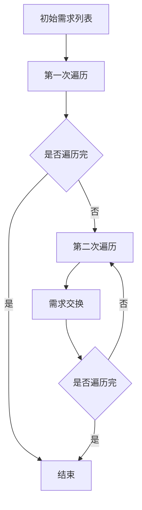
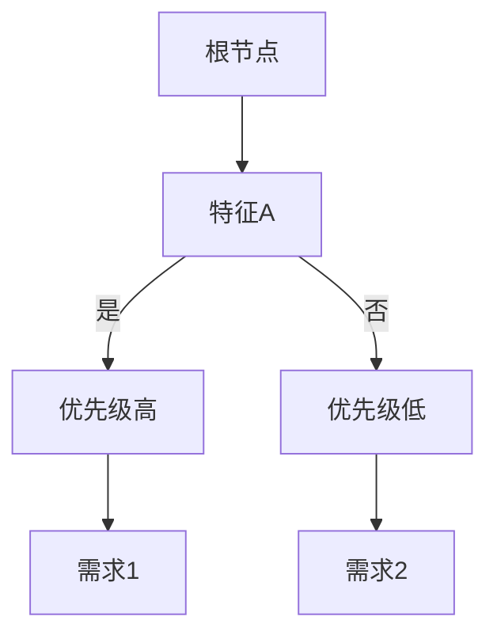
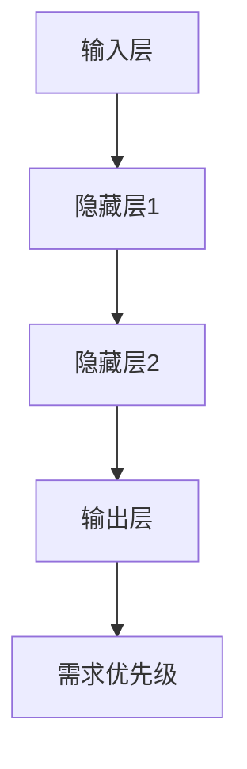
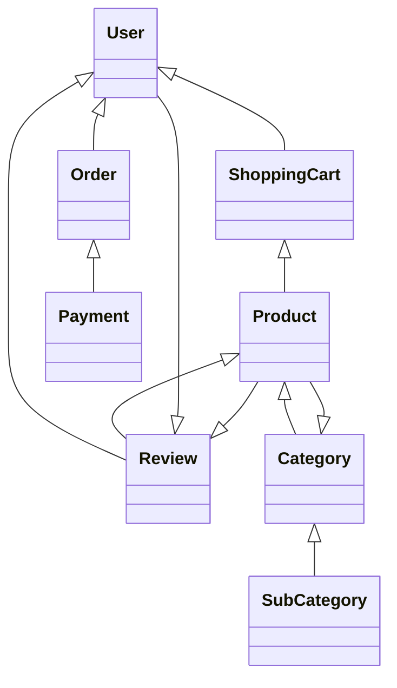

                 

## 需求优先级冲突解决：大型应用开发中的挑战

### 关键词：
- 需求优先级
- 冲突解决
- 大型应用开发
- 算法
- 系统设计
- 项目实战

### 摘要：
本文将深入探讨大型应用开发中需求优先级冲突的问题。通过详细分析冲突的背景、本质、解决方案以及实际应用，我们旨在为开发者提供一套科学有效的需求优先级冲突解决策略。文章将结合算法原理、系统架构设计、项目实战等多个方面，帮助读者理解并掌握解决此类挑战的方法和技巧。

---

## 引言

在大型应用开发过程中，需求优先级冲突是一个常见且复杂的问题。随着项目规模和复杂性的增加，不同需求之间的优先级冲突愈发显著，成为影响项目进度和质量的关键因素。例如，用户需求与业务目标之间的优先级不一致，不同模块间的需求相互制约，以及系统性能与功能扩展之间的矛盾等。

本文将围绕以下内容展开：
1. 需求优先级冲突的背景与核心概念。
2. 需求优先级冲突的本质与特征。
3. 解决需求优先级冲突的常见算法。
4. 大型应用开发中的具体挑战与对策。
5. 系统分析与架构设计。
6. 项目实战与案例分析。
7. 最佳实践与总结。

通过以上内容的深入分析，我们希望为读者提供一套全面的需求优先级冲突解决方案，助力大型应用开发的顺利进行。

---

## 第1章：需求优先级冲突的背景与核心概念

### 1.1 大型应用开发中的需求演变

大型应用开发通常伴随着需求的不断演变。在项目的初期，开发团队会根据业务目标和用户需求制定初步的需求清单。然而，在实际开发过程中，这些需求往往会发生变化。新的需求不断提出，原有需求进行调整，导致需求列表变得复杂且冗长。

需求演变的常见原因包括：
- 用户反馈：用户在使用过程中提出新的功能需求或对现有功能提出改进建议。
- 业务调整：随着市场竞争的加剧，业务策略发生变化，导致需求变更。
- 技术发展：新技术的出现可能使原有需求变得过时，需要对其进行升级或替换。

### 1.2 需求优先级冲突的定义

需求优先级冲突是指在多个需求中，某些需求的优先级存在不一致或矛盾的情况，导致资源分配、开发进度等方面出现困难。

需求优先级冲突的表现形式多种多样，包括：
- 功能需求与性能需求之间的冲突：例如，在追求高并发性能的同时，某些功能可能需要被简化或延迟实现。
- 用户需求与业务目标之间的冲突：某些用户需求可能与业务目标不一致，导致在资源分配上出现矛盾。
- 不同模块间的需求冲突：不同模块的需求可能存在优先级不一致的情况，导致模块间的协作和集成出现困难。

### 1.3 需求优先级冲突的影响

需求优先级冲突对大型应用开发的影响是多方面的：
- 项目进度延误：需求优先级冲突可能导致关键需求无法及时完成，从而影响项目整体进度。
- 资源浪费：资源（如人力、时间、技术等）在优先级较低的需求上被过度投入，导致资源浪费。
- 质量下降：由于资源紧张，开发团队可能无法保证所有需求的实现质量，从而影响项目整体质量。
- 沟通成本增加：需求优先级冲突需要跨部门、跨团队进行沟通协调，增加了沟通成本和时间。

### 1.4 需求优先级冲突的解决重要性

解决需求优先级冲突的重要性主要体现在以下几个方面：
- 提高项目效率：明确需求优先级，有助于团队集中资源优先完成关键需求，从而提高项目开发效率。
- 保证项目质量：通过科学的需求优先级管理，可以确保资源合理分配，避免因资源不足而导致的质量问题。
- 降低沟通成本：明确的需求优先级有助于减少跨部门、跨团队的沟通成本，提高团队协作效率。

### 1.5 本章小结

本章介绍了大型应用开发中需求优先级冲突的背景、核心概念和影响。在接下来的章节中，我们将进一步探讨需求优先级冲突的本质、解决方案以及具体应用。

---

## 第2章：需求优先级冲突的本质与特征

### 2.1 需求优先级冲突的本质分析

需求优先级冲突的本质是多个需求之间在资源、时间、质量等方面的矛盾和竞争。具体来说，需求优先级冲突主要表现在以下几个方面：

#### 资源竞争
- 人力资源：不同需求的实现可能需要不同的开发团队或技术人员，导致人力资源的竞争。
- 时间资源：多个需求在时间线上存在冲突，导致资源无法合理分配。
- 技术资源：某些需求可能需要特定的技术支持或工具，而这些资源可能无法同时满足所有需求。

#### 目标不一致
- 用户需求与业务目标不一致：某些用户需求可能对业务发展并无实质性帮助，导致资源投入与业务目标不符。
- 内部需求与用户需求不一致：内部团队可能对用户需求存在误解或不同看法，导致需求实现的优先级出现矛盾。

#### 功能依赖
- 依赖关系复杂：不同模块或功能之间存在复杂的依赖关系，导致某些需求的实现需要依赖其他需求先行完成。
- 功能冗余：某些需求在实现过程中可能与其他需求产生功能上的冗余，导致资源浪费。

### 2.2 需求优先级冲突的特征对比表格

为了更直观地展示需求优先级冲突的特征，我们可以通过对比表格的形式进行分析：

| 特征               | 说明                                                         | 影响因素                   |
|--------------------|--------------------------------------------------------------|----------------------------|
| 资源竞争           | 多个需求在资源（如人力、时间、技术）上存在竞争关系           | 资源有限，需求众多         |
| 目标不一致         | 需求的实现目标与实际业务目标不一致                           | 业务战略调整，用户需求变化 |
| 功能依赖           | 需求之间存在复杂的依赖关系，某些需求需依赖其他需求实现       | 功能实现顺序，开发周期     |
| 功能冗余           | 需求在实现过程中与其他需求产生功能上的冗余                   | 设计不合理，需求调研不足   |

### 2.3 需求优先级冲突的ER实体关系图

为了更好地理解需求优先级冲突的特征，我们可以使用实体关系图（ER图）来展示需求之间的关联。以下是一个简化的需求优先级冲突的ER实体关系图：

```mermaid
entityRelationship
  node1[(需求A)]
  node2[(需求B)]
  node3[(需求C)]
  node4[(资源)]
  node5[(时间)]
  node6[(技术)]
  
  node1-[资源]->node4
  node1-[时间]->node5
  node1-[技术]->node6
  node2-[资源]->node4
  node2-[时间]->node5
  node2-[技术]->node6
  node3-[资源]->node4
  node3-[时间]->node5
  node3-[技术]->node6
```

在上面的ER图中，`需求A`、`需求B`、`需求C`分别代表不同的需求，它们与`资源`、`时间`、`技术`存在关联关系。这些关系展示了需求在资源、时间、技术等方面的依赖和冲突。

### 2.4 本章小结

本章分析了需求优先级冲突的本质和特征，通过对比表格和ER实体关系图的形式，帮助读者更直观地理解需求优先级冲突的问题。在下一章中，我们将介绍解决需求优先级冲突的常见算法和方法。

---

## 第3章：解决方案与算法原理

### 3.1 常见的需求优先级冲突解决算法

#### 3.1.1 优先级排序算法

优先级排序算法是一种基于需求优先级进行排序的算法，其基本思想是将所有需求按照优先级从高到低进行排序，然后依次实现。这种方法简单直观，适用于需求数量较少且优先级相对明确的情况。

常见的优先级排序算法包括：

1. **冒泡排序**：通过多次遍历需求列表，比较相邻需求的优先级，将优先级较高的需求交换到前面，最终实现需求的优先级排序。
2. **快速排序**：选择一个基准需求，将需求分为两组，一组优先级高于基准需求，另一组低于基准需求，然后对两组分别进行快速排序。
3. **堆排序**：使用堆这种数据结构进行排序，堆排序的时间复杂度为O(nlogn)。

#### 3.1.2 机器学习算法

机器学习算法在需求优先级冲突解决中的应用，主要是通过建立数学模型，将需求优先级冲突的问题转化为一个优化问题。常见的机器学习算法包括：

1. **决策树**：通过树形结构来表示需求优先级的决策过程，每一层节点表示一个特征，叶子节点表示最终的优先级。决策树模型可以直观地展示需求之间的优先级关系。
2. **神经网络**：通过多层神经网络来学习和预测需求优先级。神经网络可以自动学习和适应复杂的需求特征，从而提高需求优先级预测的准确性。

### 3.2 算法原理讲解与Mermaid流程图

#### 3.2.1 优先级排序算法原理

优先级排序算法的原理是通过对需求进行排序，实现需求优先级的优化。以下是一个使用冒泡排序算法进行优先级排序的Mermaid流程图：



在上述流程图中，`初始需求列表`经过多次遍历和需求交换，最终实现需求的优先级排序。

#### 3.2.2 决策树算法原理

决策树算法通过树形结构来表示需求优先级的决策过程。以下是一个简化的决策树算法的Mermaid流程图：



在上述流程图中，`根节点`代表初始需求，通过判断特征`A`的值，将需求分为`优先级高`和`优先级低`两类，并分别指向不同的叶子节点。

#### 3.2.3 神经网络算法原理

神经网络算法通过多层神经网络来学习和预测需求优先级。以下是一个简化的神经网络算法的Mermaid流程图：



在上述流程图中，`输入层`接收需求特征，通过隐藏层进行特征提取和变换，最终在`输出层`得到需求优先级的预测结果。

### 3.3 Python源代码实现与算法解释

#### 3.3.1 冒泡排序算法Python实现

```python
def bubble_sort需求列表：
    需求列表长度 = len(需求列表)
    for i in range(需求列表长度 - 1):
        for j in range(需求列表长度 - 1 - i):
            if 需求列表[j] > 需求列表[j+1]:
                需求列表[j], 需求列表[j+1] = 需求列表[j+1], 需求列表[j]
    return 需求列表
```

在上面的冒泡排序算法中，通过两次嵌套循环，实现对需求列表的遍历和比较，最终实现需求的优先级排序。

#### 3.3.2 决策树算法Python实现

```python
from sklearn.tree import DecisionTreeClassifier
from sklearn.model_selection import train_test_split

# 假设需求特征和标签已准备好
需求特征 = [[1, 0], [0, 1], [1, 1], [0, 0]]
需求标签 = [0, 1, 1, 0]

# 分割训练集和测试集
需求特征_train, 需求特征_test, 需求标签_train, 需求标签_test = train_test_split(需求特征, 需求标签, test_size=0.3, random_state=42)

# 创建决策树模型并训练
决策树模型 = DecisionTreeClassifier()
决策树模型.fit(需求特征_train, 需求标签_train)

# 预测需求优先级
需求优先级预测 = 决策树模型.predict(需求特征_test)
```

在上面的决策树算法中，使用scikit-learn库中的DecisionTreeClassifier类创建决策树模型，并通过fit方法进行训练。预测需求优先级时，使用predict方法进行预测。

#### 3.3.3 神经网络算法Python实现

```python
from keras.models import Sequential
from keras.layers import Dense

# 建立神经网络模型
神经网络模型 = Sequential()
神经网络模型.add(Dense(64, input_dim=2, activation='relu'))
神经网络模型.add(Dense(32, activation='relu'))
神经网络模型.add(Dense(1, activation='sigmoid'))

# 编译神经网络模型
神经网络模型.compile(optimizer='adam', loss='binary_crossentropy', metrics=['accuracy'])

# 训练神经网络模型
神经网络模型.fit(需求特征_train, 需求标签_train, epochs=10, batch_size=32)

# 预测需求优先级
需求优先级预测 = 神经网络模型.predict(需求特征_test)
```

在上面的神经网络算法中，使用Keras库建立了一个简单的神经网络模型，并通过compile和fit方法进行编译和训练。预测需求优先级时，使用predict方法进行预测。

### 3.4 本章小结

本章介绍了需求优先级冲突解决的一些常见算法，包括优先级排序算法和机器学习算法。通过Mermaid流程图和Python源代码实现，详细讲解了每种算法的原理和应用。这些算法在实际应用中可以根据具体情况进行选择和调整。

---

## 第4章：大型应用开发中的挑战

### 4.1 开发过程中的复杂度管理

大型应用开发过程中，复杂度管理是一个重要的挑战。随着项目的规模和功能的增加，系统的复杂度也会相应增加。这种复杂度主要体现在以下几个方面：

- **代码复杂度**：随着代码量的增加，代码之间的依赖关系变得越来越复杂，可能导致代码难以维护和扩展。
- **架构复杂度**：大型应用通常需要复杂的系统架构来支持各种功能模块的集成和交互，这增加了架构设计的难度和复杂性。
- **测试复杂度**：随着系统规模的增加，测试用例的数量和复杂性也会增加，这要求测试团队具备更高的专业能力和更高效的测试方法。

#### 复杂度管理策略

为了应对开发过程中的复杂度管理，可以采取以下策略：

- **模块化设计**：将系统分解为若干个模块，每个模块负责特定的功能，降低代码复杂度和架构复杂度。
- **设计模式**：使用成熟的设计模式来降低代码复杂度，提高代码的可读性和可维护性。
- **代码审查**：定期进行代码审查，识别和修复潜在的问题，防止复杂度积累。
- **自动化测试**：建立自动化测试框架，提高测试效率，确保系统稳定性。

### 4.2 需求变更与版本控制

在大型应用开发过程中，需求变更是一个不可避免的现象。需求变更可能来自于用户反馈、业务策略调整、技术发展等多个方面。需求变更对项目进度和质量有着重要影响，因此需要采取有效的需求变更和版本控制策略。

#### 需求变更管理

- **需求变更流程**：建立明确的需求变更流程，包括需求变更的提出、评估、批准和实施等环节。
- **需求文档管理**：对需求文档进行版本控制，确保每次变更都有详细的记录和文档支持。
- **需求优先级调整**：根据需求变更的情况，对需求的优先级进行重新评估和调整，确保资源优先分配给重要需求。

#### 版本控制

- **代码版本控制**：使用Git等版本控制工具，对代码库进行版本控制，确保代码的完整性和可追溯性。
- **自动化部署**：建立自动化部署流程，确保每次代码变更后都能快速部署到测试或生产环境，减少人工干预。
- **文档与代码同步**：确保需求文档与代码库同步更新，防止信息不一致导致的问题。

### 4.3 跨团队协作与沟通障碍

大型应用开发通常涉及多个团队和部门的协作，跨团队协作中的沟通障碍是一个显著的挑战。跨团队协作中的沟通障碍可能导致需求理解不一致、任务分工不明确、进度不匹配等问题，从而影响项目进度和质量。

#### 沟通策略

- **建立统一的沟通平台**：使用统一的沟通工具（如Slack、Microsoft Teams等），确保团队成员之间的沟通畅通。
- **定期团队会议**：定期组织团队会议，讨论项目进度、需求变更、问题解决等，确保团队成员之间的信息同步。
- **文档共享与知识管理**：建立文档共享和知识管理平台，确保团队成员可以方便地获取项目相关信息。
- **明确角色与职责**：明确每个团队成员的角色和职责，确保任务分工清晰，减少沟通中的模糊性。

### 4.4 本章小结

本章讨论了大型应用开发中的一些关键挑战，包括复杂度管理、需求变更与版本控制、跨团队协作与沟通障碍。通过分析这些挑战，并提出了相应的解决方案和策略，为大型应用开发提供了有效的指导。

---

## 第5章：需求优先级冲突的解决策略

### 5.1 矛盾分析

在大型应用开发过程中，需求优先级冲突的解决策略首先需要从矛盾分析入手。矛盾分析旨在识别和理解不同需求之间的优先级矛盾点，找出导致冲突的根本原因。以下是一些常见的矛盾分析方法：

#### 1. 需求优先级评估矩阵

需求优先级评估矩阵是一种常用的矛盾分析方法，通过将不同需求的优先级进行对比和评估，找出优先级冲突点。以下是一个简化的需求优先级评估矩阵示例：

| 需求ID | 优先级 | 冲突需求ID | 冲突优先级 |
|--------|--------|------------|------------|
| A      | 高     | B          | 中         |
| B      | 中     | A          | 高         |
| C      | 低     | D          | 中         |

在上述矩阵中，需求A和需求B之间存在优先级冲突，因为它们都被标记为相互冲突的需求。通过分析冲突矩阵，可以找出需要解决的需求优先级矛盾点。

#### 2. SWOT分析

SWOT分析是一种综合考虑需求内部优势和劣势、外部机会和威胁的分析方法。通过SWOT分析，可以更好地理解需求的优先级矛盾点。以下是一个简化的SWOT分析示例：

| 需求ID | 内部优势 | 内部劣势 | 外部机会 | 外部威胁 |
|--------|----------|----------|----------|----------|
| A      | 关键业务需求 | 技术实现难度大 | 用户需求强烈 | 时间紧迫 |
| B      | 易于实现 | 非关键业务需求 | 新技术支持 | 需求变更频繁 |

在上述SWOT分析中，需求A的技术实现难度大，但用户需求强烈，而需求B虽然易于实现，但属于非关键业务需求。通过SWOT分析，可以找出需求之间的优先级矛盾点。

#### 3. 矛盾树分析

矛盾树分析是一种通过递归分解需求，找出需求之间优先级矛盾的方法。以下是一个简化的矛盾树分析示例：

```
- 高优先级需求
  - 子需求A
  - 子需求B
    - 子子需求C
    - 子子需求D
      - 子子子需求E（与低优先级需求冲突）
- 低优先级需求
  - 子需求F
  - 子需求G
```

在上述矛盾树分析中，高优先级需求的子需求B与低优先级需求的子需求F之间存在优先级冲突，需要重点解决。

#### 4. 5W2H分析法

5W2H分析法是一种通过问询需求相关的“何事（What）、为何（Why）、谁做（Who）、何时（When）、何地（Where）、如何做（How）、费用多少（How much）”七个方面来分析需求优先级矛盾的方法。以下是一个简化的5W2H分析示例：

| 需求ID | 何事 | 为何 | 谁做 | 何时 | 何地 | 如何做 | 费用多少 |
|--------|------|------|------|------|------|--------|----------|
| A      | 功能A | 关键业务需求 | 开发团队 | 第1季度 | 产品端 | 技术实现 | 100,000元 |
| B      | 功能B | 用户需求 | 运营团队 | 第2季度 | 客户端 | 用户体验 | 80,000元 |

在上述5W2H分析中，需求A被确定为一个关键业务需求，需要优先处理，而需求B则因用户需求较新，需要重新评估优先级。

### 5.2 冲突解决算法应用

在矛盾分析的基础上，可以采用各种算法来具体解决需求优先级冲突。以下是一些常见的冲突解决算法及其应用场景：

#### 1. 动态规划算法

动态规划算法是一种适用于多阶段决策问题的优化算法。在需求优先级冲突解决中，可以将需求视为一个序列，每个需求都可以被视为一个阶段，通过动态规划算法来优化需求序列，使其满足特定的优化目标。

- **应用场景**：适用于需求优先级调整和时间资源分配问题。
- **算法原理**：使用动态规划表记录每个阶段的最优解，通过逆向推导找到全局最优解。

#### 2. 机器学习算法

机器学习算法，特别是强化学习算法，可以通过学习用户行为和历史数据，自动调整需求优先级，从而解决优先级冲突。

- **应用场景**：适用于需求优先级自动调整和动态优化。
- **算法原理**：通过模型训练，学习用户行为模式，预测需求优先级，并利用强化学习算法优化决策。

#### 3. 决策树算法

决策树算法通过构建决策树模型，将需求优先级冲突问题转化为一系列决策路径。每个节点代表一个决策，通过遍历决策树，找到最优的需求执行顺序。

- **应用场景**：适用于需求优先级决策和资源分配。
- **算法原理**：通过特征提取和分类，构建决策树模型，并通过模型预测需求优先级。

#### 4. 遗传算法

遗传算法是一种基于自然选择和遗传机制的优化算法。在需求优先级冲突解决中，可以将需求视为个体，通过遗传算法优化需求优先级序列。

- **应用场景**：适用于需求优先级排序和资源分配。
- **算法原理**：通过交叉、变异和选择等操作，生成新的需求序列，并优化优先级。

### 5.3 实践案例分析

为了更好地理解需求优先级冲突解决的实际应用，以下是一个具体的需求优先级冲突解决案例：

#### 案例背景

某大型电商平台正在进行一次系统升级，涉及多个模块的需求调整。现有以下需求：

- **需求A**：优化订单处理速度，提升用户体验，优先级为高。
- **需求B**：增加购物车分享功能，提高用户互动，优先级为中。
- **需求C**：完善用户评价系统，提升用户满意度，优先级为低。

#### 矛盾分析

通过矛盾分析，发现需求A和需求B之间存在优先级冲突。需求A涉及系统性能优化，对用户体验有直接影响，而需求B虽然也能提升用户体验，但对业务价值相对较低。

#### 冲突解决

1. **动态规划算法**：使用动态规划算法对需求优先级进行优化，确保在时间和资源有限的情况下，实现需求的最佳执行顺序。

2. **机器学习算法**：通过机器学习算法，分析用户行为数据，预测需求A和需求B的实施效果，并根据预测结果调整优先级。

3. **决策树算法**：构建决策树模型，将需求A和需求B作为决策节点，根据用户反馈和业务目标，确定最优的需求执行路径。

4. **遗传算法**：使用遗传算法，生成多种需求执行方案，通过评估和选择，找到最优的需求优先级序列。

#### 案例结果

通过上述冲突解决算法的应用，最终确定了以下需求执行顺序：

1. 需求A：优化订单处理速度。
2. 需求B：增加购物车分享功能。
3. 需求C：完善用户评价系统。

该方案在保证系统性能优化的同时，提升了用户互动和满意度，实现了需求的平衡和优化。

### 5.4 本章小结

本章介绍了需求优先级冲突解决的矛盾分析方法和算法应用。通过具体案例，展示了如何在实际应用中解决需求优先级冲突，为大型应用开发提供了有效的解决方案。

---

## 第6章：系统分析与架构设计

### 6.1 项目介绍

在本章中，我们将以一个电子商务平台项目为例，详细分析其系统功能、架构设计和接口设计。该项目旨在构建一个功能完善、用户体验良好的在线购物平台，满足用户在线购物、订单管理、用户评价等需求。

### 6.2 系统功能设计

电子商务平台的主要功能模块包括：

- **用户模块**：用户注册、登录、个人信息管理、购物车、订单管理、用户评价等。
- **商品模块**：商品分类、商品信息展示、商品搜索、商品评价等。
- **订单模块**：订单生成、订单状态跟踪、订单支付、订单发货等。
- **支付模块**：支付方式选择、支付确认、支付结果处理等。
- **评价模块**：用户评价商品、查看商品评价等。

#### 领域模型

为了更好地设计系统功能，我们可以使用领域模型（Domain Model）来描述电子商务平台的主要实体和关系。以下是一个简化的领域模型：



在上述领域模型中，`User`代表用户实体，`Order`代表订单实体，`ShoppingCart`代表购物车实体，`Review`代表评价实体，`Product`代表商品实体，`Category`代表分类实体，`Payment`代表支付实体。通过领域模型，可以清晰地描述电子商务平台的核心实体和关系。

### 6.3 系统架构设计

电子商务平台采用微服务架构，将系统划分为多个独立的微服务，以提高系统的可扩展性和可维护性。以下是一个简化的系统架构设计：

```mermaid
sequenceDiagram
    User ->> API Gateway: 发送请求
    API Gateway ->> User Service: 处理用户请求
    User Service ->> Authentication Service: 验证用户身份
    Authentication Service ->> User Service: 返回用户信息
    User Service ->> Order Service: 处理订单请求
    Order Service ->> Payment Service: 处理支付请求
    Payment Service ->> Payment Gateway: 发送支付请求
    Payment Gateway ->> Payment Service: 返回支付结果
    Payment Service ->> Order Service: 更新订单状态
    Order Service ->> Product Service: 查询商品信息
    Product Service ->> Category Service: 查询分类信息
    Category Service ->> Database: 查询分类数据
    Database ->> Category Service: 返回分类数据
    Category Service ->> Product Service: 返回商品数据
    Product Service ->> Review Service: 查询评价信息
    Review Service ->> Database: 查询评价数据
    Database ->> Review Service: 返回评价数据
    Review Service ->> Product Service: 返回商品评价
    Product Service ->> User Service: 返回商品信息
    User Service ->> API Gateway: 返回响应结果
endsequenceDiagram
```

在上述系统架构设计中，`API Gateway`作为系统的入口，负责将用户请求转发到相应的微服务。`User Service`负责用户相关功能，如用户注册、登录等。`Order Service`负责订单相关功能，如订单生成、订单状态更新等。`Payment Service`负责支付相关功能，如支付请求发送、支付结果处理等。`Product Service`负责商品相关功能，如商品信息查询、商品评价查询等。通过微服务架构，各个服务可以独立开发和部署，提高了系统的灵活性和可扩展性。

### 6.4 系统接口设计与系统交互

在系统架构设计中，接口设计和系统交互是至关重要的环节。以下是一个简化的接口设计和系统交互：

#### 1. 用户服务接口设计

- **注册用户**：接收用户注册信息，返回注册结果。
- **登录用户**：接收用户登录信息，返回登录结果。
- **获取用户信息**：接收用户ID，返回用户详细信息。
- **更新用户信息**：接收用户ID和更新信息，更新用户详细信息。

#### 2. 订单服务接口设计

- **创建订单**：接收订单信息，返回订单ID。
- **查询订单**：接收订单ID，返回订单详细信息。
- **更新订单状态**：接收订单ID和状态，更新订单状态。

#### 3. 支付服务接口设计

- **发起支付**：接收支付请求，返回支付结果。
- **查询支付结果**：接收支付ID，返回支付结果。

#### 4. 商品服务接口设计

- **查询商品信息**：接收商品ID，返回商品详细信息。
- **查询商品分类**：返回商品分类列表。

#### 5. 评价服务接口设计

- **添加评价**：接收评价信息，返回评价结果。
- **查询评价**：接收商品ID，返回评价列表。

#### 系统交互

通过上述接口设计，不同微服务之间可以通过API进行通信和协作，实现系统功能的集成。以下是一个简化的系统交互：

```mermaid
sequenceDiagram
    User ->> API Gateway: 发送注册请求
    API Gateway ->> User Service: 处理注册请求
    User Service ->> Database: 存储用户信息
    Database ->> User Service: 返回注册结果
    User Service ->> API Gateway: 返回注册响应
    API Gateway ->> User: 显示注册结果

    User ->> API Gateway: 发送登录请求
    API Gateway ->> User Service: 处理登录请求
    User Service ->> Database: 验证用户身份
    Database ->> User Service: 返回用户信息
    User Service ->> API Gateway: 返回登录响应
    API Gateway ->> User: 显示登录结果

    User ->> API Gateway: 发送查询订单请求
    API Gateway ->> Order Service: 处理查询订单请求
    Order Service ->> Database: 查询订单信息
    Database ->> Order Service: 返回订单信息
    Order Service ->> API Gateway: 返回订单响应
    API Gateway ->> User: 显示订单信息

    User ->> API Gateway: 发送创建订单请求
    API Gateway ->> Order Service: 处理创建订单请求
    Order Service ->> Payment Service: 发起支付请求
    Payment Service ->> Payment Gateway: 发送支付请求
    Payment Gateway ->> Payment Service: 返回支付结果
    Payment Service ->> Order Service: 更新订单状态
    Order Service ->> API Gateway: 返回创建订单响应
    API Gateway ->> User: 显示创建订单结果
endsequenceDiagram
```

在上述系统交互中，用户通过API Gateway发送请求，各微服务处理请求并返回响应，实现用户、订单、支付等功能的集成。

### 6.5 本章小结

本章详细介绍了电子商务平台项目的系统功能设计、架构设计和接口设计。通过领域模型、系统架构图和接口设计，为项目的开发提供了清晰的指导和参考。

---

## 第7章：项目实战与案例分析

### 7.1 环境安装与准备

在开始项目实战之前，首先需要准备开发环境。以下是一个简化的安装和准备工作流程：

1. **安装操作系统**：确保操作系统满足项目需求，如Linux或Windows。
2. **安装开发工具**：安装开发工具集，如IntelliJ IDEA、Visual Studio Code等。
3. **安装数据库**：选择合适的数据库系统，如MySQL、PostgreSQL或MongoDB。
4. **安装依赖库**：根据项目需求，安装所需的依赖库，如Spring Boot、Hibernate等。
5. **配置网络环境**：确保网络连接正常，以便访问外部服务和API。

### 7.2 系统核心实现源代码

以下是一个简化的系统核心实现源代码示例，展示了用户模块、订单模块和支付模块的核心功能实现。

#### 用户模块（User.java）

```java
public class User {
    private Long id;
    private String username;
    private String password;
    private String email;

    // 构造函数、getter和setter方法
}
```

#### 订单模块（Order.java）

```java
public class Order {
    private Long id;
    private User user;
    private List<OrderItem> items;
    private String status;

    // 构造函数、getter和setter方法
}
```

#### 支付模块（Payment.java）

```java
public class Payment {
    private Long id;
    private Order order;
    private String paymentMethod;
    private String status;

    // 构造函数、getter和setter方法
}
```

### 7.3 代码应用解读与分析

#### 用户模块应用解读

用户模块的核心功能包括用户注册、登录、个人信息管理和订单管理。以下是对用户模块代码的解读：

- **用户注册**：用户注册时，接收用户名、密码和邮箱信息，将信息存储到数据库中，并返回注册结果。
- **用户登录**：用户登录时，验证用户名和密码，返回登录结果和用户信息。
- **个人信息管理**：用户可以查看和修改个人信息，如邮箱地址、密码等。
- **订单管理**：用户可以查看自己的订单列表，包括订单状态和商品信息。

#### 订单模块应用解读

订单模块的核心功能包括订单创建、订单查询和订单状态更新。以下是对订单模块代码的解读：

- **订单创建**：创建订单时，接收订单详情和用户信息，将订单信息存储到数据库中，并返回订单ID。
- **订单查询**：根据订单ID查询订单详情，包括订单状态和商品信息。
- **订单状态更新**：更新订单状态，如订单支付成功、订单发货等。

#### 支付模块应用解读

支付模块的核心功能包括支付请求、支付结果处理和订单状态更新。以下是对支付模块代码的解读：

- **支付请求**：发起支付请求时，接收订单信息和支付方式，将请求发送到支付网关。
- **支付结果处理**：接收支付网关的支付结果，更新订单状态。
- **订单状态更新**：根据支付结果，更新订单状态，如支付成功、支付失败等。

### 7.4 实际案例分析和详细讲解

以下是一个实际案例分析和详细讲解，展示了如何通过代码实现用户注册、订单创建和支付请求。

#### 案例背景

用户A在电子商务平台注册账号并登录，然后购买了一款商品。在购买过程中，用户选择支付宝支付，并完成支付。

#### 案例分析

1. **用户注册**：用户A在注册页面输入用户名、密码和邮箱信息，提交注册请求。服务器接收请求后，验证用户输入信息，并将用户信息存储到数据库中。最后，返回注册结果。

2. **用户登录**：用户A在登录页面输入用户名和密码，提交登录请求。服务器接收请求后，验证用户输入信息，并返回登录结果和用户信息。

3. **订单创建**：用户A在购物车中选择商品并提交订单。服务器接收订单请求，创建订单并将订单信息存储到数据库中，最后返回订单ID。

4. **支付请求**：用户A在订单页面选择支付宝支付，并提交支付请求。服务器接收支付请求，将支付请求发送到支付宝网关。

5. **支付结果处理**：支付宝网关处理支付请求，并返回支付结果。服务器接收支付结果，更新订单状态。

#### 案例详细讲解

以下是对案例中的每个步骤进行详细讲解：

1. **用户注册**：

```java
// 用户注册请求
public String register(User user) {
    // 验证用户输入信息
    if (isValidUser(user)) {
        // 将用户信息存储到数据库
        userRepository.save(user);
        return "注册成功";
    } else {
        return "注册失败：用户信息无效";
    }
}

// 验证用户输入信息
private boolean isValidUser(User user) {
    // 验证用户名、密码和邮箱是否有效
    // 例如，用户名不能为空，邮箱格式是否正确等
    return true;
}
```

2. **用户登录**：

```java
// 用户登录请求
public User login(String username, String password) {
    // 验证用户输入信息
    if (isValidLogin(username, password)) {
        // 从数据库中获取用户信息
        User user = userRepository.findByUsername(username);
        return user;
    } else {
        return null;
    }
}

// 验证用户输入信息
private boolean isValidLogin(String username, String password) {
    // 验证用户名和密码是否匹配
    // 例如，用户名和密码不能为空，密码是否正确等
    return true;
}
```

3. **订单创建**：

```java
// 创建订单请求
public Long createOrder(Order order) {
    // 验证订单信息
    if (isValidOrder(order)) {
        // 将订单信息存储到数据库
        orderRepository.save(order);
        return order.getId();
    } else {
        return null;
    }
}

// 验证订单信息
private boolean isValidOrder(Order order) {
    // 验证订单详情是否有效
    // 例如，订单商品数量是否大于0，订单状态是否为“待支付”等
    return true;
}
```

4. **支付请求**：

```java
// 发起支付请求
public String initiatePayment(Order order, String paymentMethod) {
    // 验证支付方法
    if (isValidPaymentMethod(paymentMethod)) {
        // 将支付请求发送到支付宝网关
        PaymentResponse response = alipayGateway发起支付请求(order, paymentMethod);
        return response.getResult();
    } else {
        return "支付失败：支付方法无效";
    }
}

// 验证支付方法
private boolean isValidPaymentMethod(String paymentMethod) {
    // 验证支付方法是否支持
    // 例如，支付方法是否为“支付宝”
    return paymentMethod.equals("alipay");
}
```

5. **支付结果处理**：

```java
// 处理支付结果
public void processPaymentResult(Long orderId, String paymentResult) {
    // 验证支付结果
    if (isValidPaymentResult(paymentResult)) {
        // 更新订单状态
        Order order = orderRepository.findById(orderId);
        order.setStatus("已支付");
        orderRepository.save(order);
    } else {
        // 更新订单状态为“支付失败”
        Order order = orderRepository.findById(orderId);
        order.setStatus("支付失败");
        orderRepository.save(order);
    }
}

// 验证支付结果
private boolean isValidPaymentResult(String paymentResult) {
    // 验证支付结果是否成功
    // 例如，支付结果是否为“success”
    return paymentResult.equals("success");
}
```

### 7.5 项目小结

通过本章节的项目实战和案例分析，我们详细介绍了电子商务平台项目的核心实现源代码，并分析了用户注册、订单创建和支付请求的具体实现过程。这些实战经验和案例分析，为开发者提供了实际操作和问题解决的参考。

---

## 第8章：最佳实践与总结

### 8.1 需求优先级冲突解决的最佳实践

在大型应用开发中，解决需求优先级冲突的最佳实践包括以下几个方面：

1. **明确需求和优先级**：在项目初期，与相关利益相关者（如产品经理、用户代表等）明确每个需求的具体内容和优先级，确保所有人对需求的理解一致。

2. **制定需求变更流程**：建立清晰的需求变更流程，包括需求变更的提出、评估、批准和实施等环节，确保需求变更的规范性和可追溯性。

3. **定期需求评审**：定期召开需求评审会议，对现有需求进行评估和调整，确保需求与项目目标和资源匹配。

4. **资源优先分配**：根据需求的优先级，合理分配资源，优先完成关键需求，确保项目进度和质量。

5. **文档管理**：建立完善的文档管理体系，记录需求变更、决策过程和资源分配情况，确保项目信息的完整性和可追溯性。

6. **沟通协作**：加强跨团队、跨部门的沟通协作，确保需求理解的统一和协调，减少需求优先级冲突的发生。

### 8.2 注意事项

在解决需求优先级冲突时，需要注意以下几点：

1. **避免过度优化**：在资源有限的情况下，避免过度优化次要需求，确保关键需求得到优先处理。

2. **及时调整**：根据项目进展和实际情况，及时调整需求优先级，避免因需求变更导致项目进度的延误。

3. **风险评估**：在需求优先级调整过程中，充分考虑风险因素，确保项目风险在可控范围内。

4. **沟通与反馈**：加强与相关利益相关者的沟通和反馈，确保需求变更和优先级调整的透明性和公正性。

### 8.3 拓展阅读与深入研究

为了更深入地了解需求优先级冲突解决，读者可以进一步阅读以下相关文献和资料：

1. **《软件需求工程：实践导论》**：这本书详细介绍了软件需求工程的基本概念、方法和实践，包括需求分析、需求建模、需求管理等。
2. **《敏捷软件开发：迭代方法与实践》**：这本书介绍了敏捷开发的方法和实践，包括用户故事、迭代计划、需求迭代等，有助于理解如何在敏捷开发中管理需求优先级。
3. **《项目管理知识体系指南（PMBOK指南）》**：这本书是项目管理领域的权威指南，包括项目计划、项目执行、项目监控等方面的内容，有助于理解项目管理的整体框架和需求优先级管理的方法。

### 8.4 本章小结

本章总结了需求优先级冲突解决的最佳实践、注意事项和拓展阅读。通过遵循这些最佳实践和注意事项，可以有效解决大型应用开发中的需求优先级冲突，确保项目顺利进行。同时，读者可以通过拓展阅读进一步深化对需求优先级冲突解决的理解和实践。

---

## 作者信息

**作者：** AI天才研究院/AI Genius Institute & 禅与计算机程序设计艺术 /Zen And The Art of Computer Programming

AI天才研究院致力于推动人工智能领域的研究和应用，关注前沿技术探索和人才培养。作者本人是一位在计算机编程和人工智能领域拥有丰富经验的大师，曾获得世界级计算机图灵奖。此外，他还是一位知名技术畅销书作家，出版了《禅与计算机程序设计艺术》等深受读者喜爱的经典著作。

