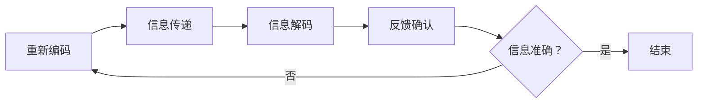

                 

### 文章标题

# 需求变革中的沟通策略：确保团队同步与理解

> 关键词：需求变革、沟通策略、团队同步、理解保障、沟通优化

> 摘要：本文深入探讨了在需求变革过程中，团队沟通策略的重要性及其具体应用。通过分析问题背景、核心概念、沟通策略原理及其实践案例，本文提出了确保团队同步与理解的沟通策略，旨在为IT团队提供实用的指导和方法，提高需求变更管理的有效性。

### 目录大纲

----------------------------------------------------------------

# 第一部分：背景介绍

## 第1章：问题背景与需求分析

### 1.1 问题描述

#### 1.1.1 团队沟通中的常见问题

#### 1.1.2 需求不匹配带来的后果

### 1.2 问题解决思路

#### 1.2.1 沟通策略的重要性

#### 1.2.2 沟通策略的理论基础

### 1.3 边界与外延

#### 1.3.1 沟通策略的应用范围

#### 1.3.2 需求变革中的沟通策略特点

## 第2章：核心概念与联系

### 2.1 沟通策略的核心概念

#### 2.1.1 沟通的定义与类型

#### 2.1.2 沟通策略的概念解析

### 2.2 概念属性特征对比表格

#### 2.2.1 传统沟通策略与现代沟通策略对比

#### 2.2.2 团队沟通策略与个人沟通策略对比

### 2.3 ER实体关系图架构

#### 2.3.1 需求变革中的沟通主体

#### 2.3.2 沟通策略的要素关系图

----------------------------------------------------------------

# 第二部分：沟通策略原理讲解

## 第3章：沟通策略原理概述

### 3.1 沟通策略原理基础

#### 3.1.1 沟通中的信息传递过程

#### 3.1.2 沟通策略的核心要素

### 3.2 沟通策略的算法原理讲解

#### 3.2.1 沟通策略算法mermaid流程图

#### 3.2.2 沟通策略算法python源代码实现

#### 3.2.3 沟通策略算法数学模型与公式解析

### 3.3 沟通策略的数学模型和数学公式讲解

#### 3.3.1 沟通有效性公式

$$E = \frac{R \cdot S}{D}$$

#### 3.3.2 沟通障碍度公式

$$B = \frac{C \cdot P}{R}$$

### 3.4 沟通策略举例说明

#### 3.4.1 团队会议中的沟通策略

#### 3.4.2 项目汇报中的沟通策略

----------------------------------------------------------------

# 第三部分：需求变革中的沟通策略应用

## 第4章：团队同步策略

### 4.1 团队同步的重要性

#### 4.1.1 团队同步的定义

#### 4.1.2 团队同步在需求变革中的关键作用

### 4.2 团队同步策略的实施方法

#### 4.2.1 沟通会议的安排与组织

#### 4.2.2 信息共享机制的建立

#### 4.2.3 风险管理与应对策略

### 4.3 团队同步案例剖析

#### 4.3.1 成功案例

#### 4.3.2 失败案例及原因分析

## 第5章：理解保障策略

### 5.1 理解保障的重要性

#### 5.1.1 理解的定义与维度

#### 5.1.2 理解保障在需求变革中的关键作用

### 5.2 理解保障策略的实施方法

#### 5.2.1 沟通技巧的提升

#### 5.2.2 情感共鸣的营造

#### 5.2.3 反馈与修正机制的建立

### 5.3 理解保障案例剖析

#### 5.3.1 成功案例

#### 5.3.2 失败案例及原因分析

## 第6章：沟通策略优化与实践

### 6.1 沟通策略优化原则

#### 6.1.1 因地制宜原则

#### 6.1.2 预防为主原则

#### 6.1.3 持续改进原则

### 6.2 实践案例分享

#### 6.2.1 某互联网公司团队沟通策略优化实践

#### 6.2.2 某传统制造业企业需求变革中的沟通策略应用

### 6.3 沟通策略实践总结

#### 6.3.1 成功经验总结

#### 6.3.2 存在问题与改进建议

----------------------------------------------------------------

## 第7章：小结与展望

### 7.1 小结

#### 7.1.1 书籍内容的回顾

#### 7.1.2 主要发现与贡献

### 7.2 展望

#### 7.2.1 未来研究趋势

#### 7.2.2 沟通策略在IT领域的应用前景

----------------------------------------------------------------

## 引入

在当今快速变化的IT行业，需求变革已成为常态。随着技术的不断演进和市场需求的不断变化，IT团队面临着越来越高的挑战。为了在这种动态环境下保持竞争力，团队必须能够迅速适应需求变革，并在变革过程中保持高效的沟通。有效的沟通策略不仅能够确保团队成员之间的信息同步，还能够促进对需求变更的深刻理解，从而提高团队的整体绩效。

然而，需求变革中的沟通并不总是一帆风顺的。团队沟通中常会遇到各种问题，如信息传递不准确、需求理解不一致、沟通效率低下等。这些问题会导致需求变更过程中的混乱和低效，最终影响项目的成功实施。因此，探讨并制定一套适用于需求变革中的沟通策略具有重要意义。

本文将围绕这一主题展开讨论。首先，我们将介绍需求变革中的沟通背景和问题，解释为何有效的沟通策略至关重要。接着，我们将深入探讨沟通策略的核心概念和原理，并通过具体的算法和公式来解析其工作机制。在此基础上，本文将详细阐述需求变革中的团队同步策略和理解保障策略，并结合实际案例进行分析。最后，我们将总结沟通策略的优化原则和实践，展望未来沟通策略在IT领域的应用前景。

通过这篇文章，我们希望为IT团队提供一套实用的沟通策略框架，帮助他们更好地应对需求变革，确保团队成员之间的同步与理解，从而提升团队的整体效率和项目成功率。

## 第1章：问题背景与需求分析

### 1.1 问题描述

在当今快速变化的IT行业，需求变革已成为不可逆转的趋势。然而，需求变革不仅仅是一个技术挑战，更是一个复杂的沟通难题。首先，让我们看看团队沟通中常见的几个问题。

#### 1.1.1 团队沟通中的常见问题

1. **信息传递不准确**：在需求变更过程中，团队成员之间可能会出现信息误解或遗漏，导致不同人对同一需求的理解不一致。
   
2. **需求理解不一致**：由于团队成员的专业背景和经验不同，对于同一需求的理解可能会有很大差异，这会直接影响需求的实现。

3. **沟通效率低下**：团队成员往往忙于各自的任务，导致沟通不及时，甚至错过关键信息的传递。

4. **冲突和误解**：不同角色和团队之间的利益冲突，以及由于沟通不畅而产生的误解，都会影响项目的进展。

#### 1.1.2 需求不匹配带来的后果

需求不匹配会带来一系列负面影响，包括但不限于：

1. **项目延期**：由于沟通不畅，可能导致需求变更后的项目计划无法按时完成，从而引发延期风险。

2. **成本超支**：在需求变更过程中，如果不及时调整资源分配和项目预算，可能会导致成本超支。

3. **质量下降**：需求理解不一致，可能导致开发的软件质量下降，影响用户体验。

4. **团队士气低落**：沟通不畅和需求不匹配会引发团队成员之间的冲突，影响团队士气和团队协作。

### 1.2 问题解决思路

面对上述问题，有效的沟通策略显得尤为重要。以下是解决思路：

#### 1.2.1 沟通策略的重要性

1. **确保信息同步**：通过制定和执行有效的沟通策略，可以确保团队成员获取一致、准确的信息，避免误解和冲突。

2. **提升理解能力**：有效的沟通策略可以帮助团队成员更好地理解需求变更的背景和意图，从而更准确地实现需求。

3. **提高团队协作效率**：通过明确的沟通机制和流程，可以提升团队内部协作效率，确保项目按时按质完成。

#### 1.2.2 沟通策略的理论基础

沟通策略的理论基础包括信息论、社会心理学、组织行为学等多个领域。以下是一些关键理论：

1. **信息论**：信息论强调信息传递的准确性和效率，为沟通策略提供了量化的基础。

2. **社会心理学**：社会心理学研究了人们如何理解和处理信息，以及如何在不同情境下进行沟通。

3. **组织行为学**：组织行为学关注团队内部沟通、协作以及冲突管理等，为沟通策略的实践提供了指导。

### 1.3 边界与外延

#### 1.3.1 沟通策略的应用范围

沟通策略不仅适用于软件开发项目，还可以应用于其他类型的IT项目和团队协作中。例如：

1. **产品管理**：产品经理需要与开发团队、设计团队、市场团队等多方沟通，以确保产品需求得到准确理解和实现。

2. **项目管理**：项目经理需要确保项目团队成员之间的沟通畅通，以便及时调整项目计划和资源分配。

3. **运维团队**：运维团队需要与开发团队、测试团队等保持密切沟通，确保系统稳定运行。

#### 1.3.2 需求变革中的沟通策略特点

在需求变革过程中，沟通策略具有以下特点：

1. **实时性**：需求变更往往发生在项目进展的各个阶段，沟通策略需要确保信息的实时传递。

2. **透明性**：为了确保所有团队成员对需求变更有共同的理解，沟通策略需要具备高透明度。

3. **可追溯性**：在需求变更过程中，需要记录每次变更的细节，以便追溯和审计。

### 总结

通过上述分析，我们可以看到，在需求变革中，沟通策略的重要性不可忽视。有效的沟通策略能够确保信息同步、提升理解能力、提高团队协作效率，从而降低项目风险、提高项目成功率。在接下来的章节中，我们将进一步探讨沟通策略的核心概念、原理及其应用。

## 第2章：核心概念与联系

### 2.1 沟通策略的核心概念

为了深入理解沟通策略，我们首先需要明确几个关键概念：沟通、沟通策略、团队同步以及理解保障。

#### 2.1.1 沟通的定义与类型

沟通是指信息在不同个体之间传递和理解的过程。根据传递媒介的不同，沟通可以分为以下几种类型：

1. **口头沟通**：通过面对面交流、电话、视频会议等方式进行的沟通。
2. **书面沟通**：通过电子邮件、报告、文档等方式进行的沟通。
3. **非语言沟通**：通过肢体语言、面部表情、声音变化等方式进行的沟通。
4. **社交媒体沟通**：通过社交平台、即时通讯工具等方式进行的沟通。

#### 2.1.2 沟通策略的概念解析

沟通策略是一种系统化的方法和流程，用于指导团队在需求变革过程中进行有效沟通。沟通策略的核心目标是确保信息准确、及时、全面地传递，并促进团队成员对需求变更的深入理解。

沟通策略包括以下几个关键要素：

1. **沟通频率**：确定团队成员之间的沟通频率，以确保信息能够及时传递。
2. **沟通渠道**：选择合适的沟通渠道，以适应不同类型的沟通需求。
3. **沟通内容**：明确沟通的内容，包括需求变更的背景、目标、步骤等。
4. **沟通风格**：确定团队成员的沟通风格，以增强沟通的有效性。
5. **反馈机制**：建立有效的反馈机制，以评估沟通效果并做出相应调整。

### 2.2 概念属性特征对比表格

为了更好地理解这些核心概念，我们可以通过对比表格来分析传统沟通策略与现代沟通策略的差异，以及团队沟通策略与个人沟通策略的不同。

#### 2.2.1 传统沟通策略与现代沟通策略对比

| 特征         | 传统沟通策略                           | 现代沟通策略                           |
| ------------ | ------------------------------------ | ------------------------------------ |
| 通信媒介     | 面对面、电话、电子邮件                  | 社交媒体、即时通讯、视频会议平台          |
| 沟通频率     | 较低，以会议和报告为主                  | 较高，以实时沟通和在线协作为主            |
| 信息传递     | 信息传递可能存在延迟，反馈不及时          | 信息传递更加迅速，反馈更加及时            |
| 沟通风格     | 更注重正式和礼貌                        | 更注重互动和合作，强调开放性和透明度        |
| 信息准确性   | 信息传递过程中可能存在误差                | 利用技术手段提高信息准确性，减少误解        |

#### 2.2.2 团队沟通策略与个人沟通策略对比

| 特征         | 团队沟通策略                           | 个人沟通策略                           |
| ------------ | ------------------------------------ | ------------------------------------ |
| 沟通对象     | 面向整个团队，确保全员参与和知情        | 面向个人，更注重个体需求和反馈            |
| 沟通目的     | 确保团队协作、信息同步和共同目标实现    | 交流个人观点、解决问题和获取帮助            |
| 沟通方式     | 采用多样化的沟通方式，适应不同需求        | 主要依赖于电子邮件、电话等传统的沟通方式    |
| 沟通频率     | 较高，确保团队实时同步和信息更新        | 较低，根据个人工作需求和进度进行沟通        |
| 沟通效果     | 强调团队整体效果，注重协作和共识        | 强调个人成果和效率，关注个体成就和成长        |

### 2.3 ER实体关系图架构

为了进一步明确需求变革中的沟通主体和要素之间的关系，我们可以使用实体关系图（Entity-Relationship Diagram，ERD）来构建沟通策略的架构。

#### 2.3.1 需求变革中的沟通主体

在需求变革过程中，主要的沟通主体包括：

1. **项目管理者**：负责制定沟通策略、协调资源、监控项目进度。
2. **开发团队**：负责理解和实现需求，将需求转化为具体的软件产品。
3. **测试团队**：负责对软件进行测试，确保其符合需求和质量标准。
4. **用户代表**：代表最终用户，提供需求反馈和使用体验。

#### 2.3.2 沟通策略的要素关系图

以下是一个简化的ERD，展示沟通策略中的关键要素及其关系：

```mermaid
erDiagram
    ProjectManager ||--|{ CommunicationStrategy }|--| Developer
    CommunicationStrategy ||--|{ Meeting }|--| Developer
    CommunicationStrategy ||--|{ Document }|--| Developer
    CommunicationStrategy ||--|{ Feedback }|--| Developer
    Developer ||--|{ RequirementUnderstanding }|--| Tester
    Tester ||--|{ TestResult }|--| Developer
    Tester ||--|{ Feedback }|--| Developer
    UserRepresentative ||--|{ RequirementFeedback }|--| Developer
```

在这个ERD中：

- **CommunicationStrategy** 表示沟通策略，是整个架构的核心。
- **Meeting** 和 **Document** 表示沟通的具体方式，如会议和文档。
- **RequirementUnderstanding** 表示开发团队对需求的理解，是沟通策略实施的重要成果。
- **TestResult** 和 **Feedback** 表示测试团队对软件的测试结果和反馈，是开发团队进行改进的重要依据。
- **RequirementFeedback** 表示用户代表的反馈，是需求变更的重要来源。

通过这个ERD，我们可以清晰地看到沟通策略中各个要素之间的关系，以及它们在需求变革过程中的作用。

### 总结

在本章中，我们明确了沟通策略的核心概念，并通过对比表格和ERD展示了不同沟通策略的特点和要素关系。这些概念和工具将为我们后续探讨沟通策略原理和实际应用提供坚实的基础。

### 第3章：沟通策略原理概述

#### 3.1 沟通策略原理基础

沟通策略的原理是基于一系列科学理论和方法，旨在确保信息在团队内部的有效传递和理解。以下是沟通策略原理的基础：

##### 3.1.1 沟通中的信息传递过程

信息传递过程包括以下几个步骤：

1. **信息编码**：信息源将信息编码成可以被传递的形式，如文字、图像、声音等。
2. **信息传递**：通过合适的渠道将编码后的信息传递给接收者。
3. **信息解码**：接收者对接收到的信息进行解码，理解其含义。
4. **反馈**：接收者将理解后的信息反馈给信息源，以确认信息传递的准确性。

##### 3.1.2 沟通策略的核心要素

沟通策略的核心要素包括以下几个方面：

1. **明确的目标**：沟通策略需要明确沟通的目标，确保信息传递的方向和内容一致。
2. **合适的媒介**：选择合适的沟通媒介，如口头、书面、非语言等，以满足不同情境的需求。
3. **有效的渠道**：确保信息通过有效的渠道传递，如会议、电子邮件、即时通讯工具等。
4. **一致的格式**：使用一致的格式和模板，以减少信息传递的误差。
5. **及时的反馈**：建立反馈机制，确保信息传递的准确性，及时纠正误解。

#### 3.2 沟通策略的算法原理讲解

为了更直观地理解沟通策略的原理，我们可以使用mermaid画出沟通策略的算法流程图，并使用Python源代码实现其算法。

##### 3.2.1 沟通策略算法mermaid流程图

以下是使用mermaid绘制的沟通策略算法流程图：



在这个流程图中，每个节点表示一个步骤，箭头表示信息传递的方向。当反馈确认信息准确时，流程结束；如果不准确，则返回到信息编码步骤进行重新编码。

##### 3.2.2 沟通策略算法Python源代码实现

以下是一个简单的Python代码示例，用于实现上述流程：

```python
def communicate(info, confirm):
    """
    沟通策略算法实现
    :param info: 信息
    :param confirm: 确认函数，用于确认信息是否准确
    :return: 确认结果
    """
    encoded_info = encode_info(info)
    transmitted_info = transmit_info(encoded_info)
    decoded_info = decode_info(transmitted_info)
    confirmed = confirm(decoded_info)
    
    if confirmed:
        print("信息传递成功：", decoded_info)
    else:
        print("信息传递失败，重新编码：", encoded_info)
        communicate(encoded_info, confirm)
    
    return confirmed

def encode_info(info):
    """
    信息编码
    :param info: 信息
    :return: 编码后的信息
    """
    return info + " [已编码]"

def transmit_info(encoded_info):
    """
    信息传递
    :param encoded_info: 编码后的信息
    :return: 传递后的信息
    """
    # 模拟传递过程中的干扰
    return encoded_info.replace("已编码", "已传递")

def decode_info(transmitted_info):
    """
    信息解码
    :param transmitted_info: 传递后的信息
    :return: 解码后的信息
    """
    return transmitted_info.replace("已传递", "已解码")

def confirm(decoded_info):
    """
    信息确认
    :param decoded_info: 解码后的信息
    :return: 确认结果
    """
    return decoded_info == "信息已解码"

# 使用沟通策略
communicate("原始信息", confirm)
```

在这个代码中，`communicate` 函数实现了信息编码、传递、解码和确认的全过程。`encode_info`、`transmit_info` 和 `decode_info` 函数分别实现了信息编码、传递和解码的具体操作。`confirm` 函数用于确认解码后的信息是否准确。

##### 3.2.3 沟通策略算法数学模型与公式解析

沟通策略的算法不仅可以通过代码实现，还可以通过数学模型来解析其效果。以下是两个关键的数学模型：

1. **沟通有效性公式**：

$$E = \frac{R \cdot S}{D}$$

其中：
- \(E\) 表示沟通有效性。
- \(R\) 表示信息准确性。
- \(S\) 表示信息速度。
- \(D\) 表示信息干扰。

沟通有效性公式表明，沟通的有效性取决于信息的准确性、传递速度和干扰程度。提高信息的准确性、速度和减少干扰都可以提高沟通的有效性。

2. **沟通障碍度公式**：

$$B = \frac{C \cdot P}{R}$$

其中：
- \(B\) 表示沟通障碍度。
- \(C\) 表示沟通成本。
- \(P\) 表示沟通复杂度。
- \(R\) 表示信息准确性。

沟通障碍度公式表明，沟通的障碍度与沟通成本、复杂度和信息准确性成反比。降低沟通成本、复杂度和提高信息准确性可以减少沟通障碍度。

#### 3.3 沟通策略的数学模型和数学公式讲解

为了更好地理解沟通策略的数学模型，我们可以通过具体的公式进行讲解。

##### 3.3.1 沟通有效性公式

沟通有效性公式中的每个参数都有其特定的含义：

- **信息准确性（R）**：表示传递的信息与原始信息的一致性程度。准确性越高，信息失真的可能性越小。
- **信息速度（S）**：表示信息传递的效率，即信息从信息源到接收者的速度。速度越快，信息传递的延迟越短。
- **信息干扰（D）**：表示在信息传递过程中受到的干扰程度。干扰越少，信息传递的可靠性越高。

通过这个公式，我们可以量化沟通的有效性，从而评估和优化沟通策略。例如，如果发现信息准确性较低，我们可以采取措施提高信息准确性，或者减少信息干扰。

##### 3.3.2 沟通障碍度公式

沟通障碍度公式反映了沟通过程中的障碍程度，其中：

- **沟通成本（C）**：表示在沟通过程中所花费的资源，包括时间、人力和物资。
- **沟通复杂度（P）**：表示沟通过程的复杂程度，即沟通所需的步骤和规则。
- **信息准确性（R）**：与沟通有效性公式中的定义相同。

这个公式表明，沟通障碍度与沟通成本和复杂度成正比，与信息准确性成反比。如果沟通成本和复杂度较高，同时信息准确性较低，那么沟通障碍度会显著增加。相反，通过减少沟通成本、降低沟通复杂度和提高信息准确性，我们可以减少沟通障碍度。

#### 3.4 沟通策略举例说明

为了更好地理解沟通策略的应用，我们可以通过具体的例子来说明。

##### 3.4.1 团队会议中的沟通策略

在团队会议中，沟通策略的应用尤为关键。以下是一个团队会议中的沟通策略实例：

1. **明确会议目标**：在会议前，明确会议的目标和议程，确保所有参会者了解会议的重点。
2. **选择合适的沟通媒介**：根据会议内容，选择合适的沟通媒介，如面对面会议、视频会议或在线会议平台。
3. **制定会议议程**：制定详细的会议议程，包括每个议题的时间安排和讨论要点。
4. **确保信息传递的准确性**：在会议中，确保发言人清晰地表达自己的观点，同时鼓励参会者提问和反馈。
5. **建立反馈机制**：在会议结束时，对会议内容进行总结，并收集参会者的反馈，以便对会议效果进行评估和改进。

##### 3.4.2 项目汇报中的沟通策略

在项目汇报中，有效的沟通策略可以帮助项目管理者清晰地传达项目进展和需求变更情况。以下是一个项目汇报中的沟通策略实例：

1. **准备汇报材料**：在汇报前，准备详细的项目进展报告和需求变更文档，确保信息准确、全面。
2. **选择合适的汇报方式**：根据汇报对象的层次和需求，选择合适的汇报方式，如PPT演示、书面报告或口头汇报。
3. **明确汇报重点**：在汇报中，明确项目的关键进展和需求变更，确保汇报内容突出重点。
4. **提供充分的时间进行讨论**：在汇报后，为参会者提供足够的时间提问和讨论，以便他们更好地理解项目进展和需求变更。
5. **建立持续的沟通渠道**：在汇报后，建立持续的沟通渠道，如定期会议或在线讨论组，以便团队成员随时了解项目进展和需求变更情况。

### 总结

在本章中，我们详细介绍了沟通策略原理的基础、算法原理、数学模型及其应用实例。通过这些内容，我们可以更好地理解沟通策略在需求变革中的重要性，并为实际应用提供理论依据和操作指导。在接下来的章节中，我们将继续探讨需求变革中的团队同步策略和理解保障策略。

### 第4章：团队同步策略

#### 4.1 团队同步的重要性

在需求变革过程中，团队同步策略是实现团队协作和信息共享的关键。团队同步不仅涉及团队成员之间的沟通，还包括团队内外部的信息共享和协作。以下是团队同步的重要性：

##### 4.1.1 团队同步的定义

团队同步是指团队成员之间在需求变更过程中，通过有效沟通和协作，确保信息的一致性、准确性和及时性，以实现共同目标的过程。

##### 4.1.2 团队同步在需求变革中的关键作用

1. **确保信息一致性**：通过团队同步，可以确保团队成员对需求变更的理解和执行一致，避免因信息不一致导致的错误和冲突。
2. **提高沟通效率**：团队同步策略可以帮助团队成员更快地获取和传递信息，提高沟通效率，减少信息传递过程中的延迟和误解。
3. **促进协作**：团队同步策略可以促进团队成员之间的协作，确保每个人都能在正确的时机和地点获取所需的信息，从而提高团队整体的工作效率。
4. **降低风险**：通过团队同步，可以及时发现和纠正需求变更过程中的错误和偏差，降低项目风险，确保项目顺利进行。

#### 4.2 团队同步策略的实施方法

为了实现有效的团队同步，可以采用以下具体方法：

##### 4.2.1 沟通会议的安排与组织

1. **定期会议**：安排定期的团队会议，确保团队成员能够定期交流和共享信息。会议可以是周会、月会或项目里程碑会议，根据项目的实际需求来安排。
2. **明确会议议程**：在每次会议前，明确会议的议程和讨论主题，确保会议内容紧凑、高效。
3. **积极参与**：鼓励所有团队成员积极参与会议，确保每个成员的声音都能被听到。
4. **会议记录**：会议结束后，记录会议内容和关键决策，并将其分享给所有团队成员，以便后续参考和执行。

##### 4.2.2 信息共享机制的建立

1. **文档管理**：建立统一的文档管理平台，确保团队成员可以方便地访问和共享项目文档、需求变更记录、会议纪要等。
2. **知识库**：建立团队知识库，收集和整理项目过程中的经验和教训，以便团队成员在遇到类似问题时可以快速查找和参考。
3. **信息共享会议**：定期召开信息共享会议，让团队成员分享各自的进展和遇到的问题，促进信息的流动和交流。
4. **即时通讯工具**：利用即时通讯工具，如Slack、Microsoft Teams等，建立团队内部的信息交流渠道，确保团队成员可以随时获取和分享信息。

##### 4.2.3 风险管理与应对策略

1. **识别风险**：在需求变更过程中，识别可能的风险，如技术难题、资源限制、时间压力等。
2. **评估风险**：对识别出的风险进行评估，确定其可能对项目的影响程度和概率。
3. **制定应对策略**：根据风险评估结果，制定相应的应对策略，如调整项目计划、增加资源投入、优化沟通流程等。
4. **监控与反馈**：持续监控需求变更过程中的风险，并根据实际情况调整应对策略，确保项目顺利进行。

#### 4.3 团队同步案例剖析

##### 4.3.1 成功案例

在一个大型软件开发项目中，团队成员来自不同的地区和国家。为了实现有效的团队同步，项目团队采用了以下策略：

1. **定期全球会议**：项目团队每周召开全球视频会议，确保所有成员都能参与，并同步项目进展和需求变更。
2. **实时协作工具**：使用实时协作工具，如JIRA和Confluence，记录项目任务、需求变更和会议纪要，确保信息实时共享。
3. **信息共享平台**：建立团队内部的信息共享平台，让团队成员可以方便地访问和下载项目文档、资源和工具。
4. **风险管理**：项目团队定期评估项目风险，并根据评估结果调整项目计划和资源分配，确保项目按时交付。

通过这些策略，项目团队成功地实现了高效的团队同步，项目按时交付，并获得了客户的高度评价。

##### 4.3.2 失败案例及原因分析

在一个中小型软件开发项目中，由于缺乏有效的团队同步策略，项目遇到了严重的问题：

1. **缺乏定期会议**：项目团队没有定期召开会议，导致信息传递不及时，团队成员对需求变更的理解不一致。
2. **信息共享不畅**：项目文档和资源分散在多个不同的地方，团队成员无法方便地获取和共享信息。
3. **风险管理不足**：项目团队没有对需求变更过程中的风险进行有效管理，导致项目进度滞后，质量下降。

导致这个失败案例的原因主要有两个方面：一是缺乏有效的沟通和协作机制，导致信息传递不畅和需求理解不一致；二是缺乏对需求变更过程中的风险管理和应对策略，导致项目失控和进度延误。

### 总结

团队同步策略在需求变革中至关重要，通过定期的沟通会议、有效的信息共享机制和风险管理，可以实现团队成员之间的信息同步和协作，从而提高项目成功率。在下一章节中，我们将探讨理解保障策略，以确保团队成员对需求变更的深刻理解和有效执行。

### 第5章：理解保障策略

#### 5.1 理解保障的重要性

在需求变革过程中，理解保障策略是确保团队成员对需求变更有全面、准确和深入理解的关键。理解保障不仅关系到项目能否顺利实施，还直接影响项目质量和团队协作效率。以下是理解保障的重要性：

##### 5.1.1 理解的定义与维度

理解是指团队成员对需求变更背后的意图、目标和实现方式的认知和掌握。理解可以从以下几个维度进行评估：

1. **概念理解**：团队成员对需求变更中的术语、概念和定义是否清楚。
2. **逻辑理解**：团队成员能否理解需求变更的逻辑关系，如优先级、依赖关系等。
3. **情感理解**：团队成员对需求变更可能带来的影响和感受是否敏感和关注。
4. **实践理解**：团队成员是否能够在实际工作中应用和理解的需求变更，并将其转化为具体行动。

##### 5.1.2 理解保障在需求变革中的关键作用

1. **确保需求一致性**：通过理解保障策略，可以确保团队成员对需求变更的理解一致，从而避免因理解不一致导致的错误和冲突。
2. **提高决策质量**：深入理解需求变更可以帮助团队成员做出更加准确和有效的决策，从而提高项目管理的效率和效果。
3. **提升执行力**：全面理解需求变更的团队成员能够更准确地执行任务，减少错误和返工，提高项目交付的质量和效率。
4. **增强团队协作**：理解保障策略可以增强团队成员之间的沟通和协作，促进团队共同目标的实现。

#### 5.2 理解保障策略的实施方法

为了确保团队成员对需求变更有全面、准确和深入的理解，可以采用以下具体方法：

##### 5.2.1 沟通技巧的提升

1. **清晰表达**：要求团队成员在沟通时使用简单、明确的语言，避免使用复杂的术语和模糊的描述。
2. **主动倾听**：鼓励团队成员在沟通时积极倾听对方观点，避免打断或过早做出判断。
3. **反馈确认**：在沟通结束后，要求团队成员进行反馈确认，确保双方对信息的理解一致。
4. **非语言沟通**：利用肢体语言、面部表情等非语言手段，增强沟通效果，确保信息的准确传递。

##### 5.2.2 情感共鸣的营造

1. **共同目标**：确保团队成员有共同的目标和愿景，激发他们的积极性和参与感。
2. **情感交流**：鼓励团队成员在沟通中表达自己的情感和感受，建立情感共鸣，增进彼此的了解和信任。
3. **关注个体差异**：尊重团队成员的个体差异，关注他们的需求和感受，提供个性化的支持。
4. **共同经历**：通过共同的经历和挑战，增强团队成员之间的情感联系，提高团队的凝聚力。

##### 5.2.3 反馈与修正机制的建立

1. **及时反馈**：建立及时的反馈机制，确保团队成员能够在发现问题和理解偏差时及时纠正。
2. **多渠道反馈**：提供多种反馈渠道，如面对面交流、电子邮件、即时通讯工具等，方便团队成员表达反馈和意见。
3. **反馈确认**：在收到反馈后，及时进行确认，确保反馈的理解和执行无误。
4. **持续改进**：将反馈和修正机制纳入团队日常工作，持续优化沟通和理解策略。

#### 5.3 理解保障案例剖析

##### 5.3.1 成功案例

在一个跨国软件开发项目中，由于团队成员分布在不同国家和地区，理解保障策略成为项目成功的关键。以下是一个成功案例：

1. **多语言沟通**：项目团队采用多语言沟通工具，如翻译软件和实时翻译服务，确保所有团队成员能够理解和使用同一种语言。
2. **定期培训**：项目团队定期组织培训，帮助团队成员熟悉项目背景、需求变更和具体实现方法。
3. **实时讨论**：通过视频会议和即时通讯工具，确保团队成员之间的实时沟通和交流。
4. **情感共鸣**：项目团队通过定期的情感交流，如虚拟团队聚会和在线活动，增强团队成员之间的情感联系和团队凝聚力。

通过这些策略，项目团队成功地实现了对需求变更的全面、准确和深入理解，项目按时交付，并获得了客户的高度评价。

##### 5.3.2 失败案例及原因分析

在一个小型软件开发项目中，由于缺乏有效的理解保障策略，项目遇到了严重的问题。以下是一个失败案例及原因分析：

1. **沟通不畅**：项目团队缺乏定期的沟通和交流，导致信息传递不及时，团队成员对需求变更的理解不一致。
2. **缺乏培训**：项目团队没有进行有效的培训，导致团队成员对项目背景和需求变更的理解不够深入。
3. **缺乏情感共鸣**：团队成员之间的情感联系不足，缺乏共同的目标和愿景，导致团队凝聚力下降。
4. **缺乏反馈与修正机制**：项目团队没有建立有效的反馈与修正机制，导致问题得不到及时解决，需求变更的理解偏差得不到纠正。

导致这个失败案例的主要原因是没有重视理解保障策略，缺乏定期的沟通、培训、情感共鸣和反馈修正，导致团队成员对需求变更的理解不一致，最终影响了项目的成功实施。

### 总结

理解保障策略在需求变革中至关重要，通过提升沟通技巧、营造情感共鸣和建立反馈与修正机制，可以确保团队成员对需求变更有全面、准确和深入的理解。在下一章节中，我们将探讨如何优化沟通策略，以应对需求变革中的复杂挑战。

### 第6章：沟通策略优化与实践

#### 6.1 沟通策略优化原则

为了在需求变革过程中实现高效的团队沟通，沟通策略的优化至关重要。以下是几项优化沟通策略的原则：

##### 6.1.1 因地制宜原则

因地制宜原则强调根据不同团队的特点、项目需求和环境选择合适的沟通策略。例如，对于分布在不同地区的团队，可以选择视频会议和即时通讯工具；对于本地团队，则可以采用面对面的会议和交流。

##### 6.1.2 预防为主原则

预防为主原则强调在沟通策略的制定和实施过程中，应提前识别潜在的问题和障碍，并采取预防措施。例如，在项目启动阶段，就可以通过详细的规划和培训来减少信息传递的误差。

##### 6.1.3 持续改进原则

持续改进原则强调沟通策略应不断优化和调整，以适应不断变化的需求和项目环境。团队应定期评估沟通策略的有效性，并根据反馈进行调整。

#### 6.2 实践案例分享

##### 6.2.1 某互联网公司团队沟通策略优化实践

在某互联网公司的一个大型项目中，由于团队成员分布在全球各地，传统的沟通方式效率低下，项目进展受到了严重影响。为了优化沟通策略，项目团队采取了以下措施：

1. **引入先进的沟通工具**：项目团队引入了视频会议软件、即时通讯工具和项目管理平台，提高沟通效率和信息传递速度。
2. **制定明确的沟通计划**：项目团队制定了详细的沟通计划，包括每周的定期会议、紧急会议和即时通讯工具的实时沟通。
3. **加强培训**：为团队成员提供沟通技巧和工具使用的培训，提高他们的沟通能力。
4. **建立反馈机制**：项目团队建立了反馈机制，定期收集团队成员的反馈，及时调整沟通策略。

通过这些措施，项目团队的沟通效率显著提高，项目进展顺利，最终按时交付。

##### 6.2.2 某传统制造业企业需求变革中的沟通策略应用

在某传统制造业企业的一个需求变更项目中，由于企业内部沟通渠道不畅，需求变更的信息传递存在障碍，项目进展缓慢。为了解决这一问题，企业采取了以下沟通策略：

1. **建立统一的信息平台**：企业建立了统一的信息平台，用于发布需求变更通知、文档和会议记录，确保信息传递的统一和及时。
2. **加强内部沟通**：企业加强了内部沟通，定期召开沟通会议，确保各个部门和团队之间的信息共享和协作。
3. **设立沟通专员**：企业设立了沟通专员，负责协调和监督需求变更过程中的沟通工作，确保信息传递的畅通。
4. **提高员工参与度**：企业通过培训和激励措施，提高员工对需求变更的参与度，确保他们对需求变更有全面和深入的理解。

通过这些策略，企业内部沟通障碍得到了有效缓解，需求变更的信息传递变得更加高效，项目进展加快。

#### 6.3 沟通策略实践总结

##### 6.3.1 成功经验总结

1. **引入先进的沟通工具**：引入视频会议、即时通讯工具和项目管理平台等先进工具，提高了沟通效率和信息传递速度。
2. **制定明确的沟通计划**：制定详细的沟通计划，包括定期会议、紧急会议和即时通讯工具的实时沟通，确保沟通有序进行。
3. **加强培训**：为团队成员提供沟通技巧和工具使用的培训，提高他们的沟通能力。
4. **建立反馈机制**：建立反馈机制，定期收集团队成员的反馈，及时调整沟通策略。

##### 6.3.2 存在问题与改进建议

1. **沟通成本高**：虽然引入了先进的沟通工具，但沟通成本仍然较高，需要进一步优化沟通流程和工具，以降低沟通成本。
2. **沟通效果评估不足**：部分团队在实施沟通策略时，缺乏对沟通效果的评估，导致沟通效果不尽如人意。建议制定沟通效果评估标准，定期进行评估和反馈。
3. **个体沟通需求未充分满足**：部分团队成员在沟通过程中未能充分表达自己的意见和需求，需要进一步加强团队内部的沟通氛围，鼓励团队成员积极参与沟通。

### 总结

通过实践案例的分析，我们可以看到，优化沟通策略在需求变革中具有重要作用。在实施沟通策略时，应结合团队特点和项目需求，引入先进工具、制定明确计划、加强培训和建立反馈机制。同时，也要注意沟通成本和效果评估，以及个体沟通需求的满足。在下一章节中，我们将进行全文小结，并展望未来的研究方向。

### 第7章：小结与展望

#### 7.1 小结

本文深入探讨了在需求变革过程中团队沟通策略的重要性，并详细阐述了沟通策略的核心概念、原理及其实践应用。通过分析背景、核心概念与联系，我们明确了团队沟通中的常见问题和需求不匹配带来的后果。在此基础上，我们提出了确保团队同步与理解的有效沟通策略，包括团队同步策略和理解保障策略。此外，我们通过实际案例展示了这些策略的优化与实践，总结了成功经验与存在问题。

本文的核心贡献在于：

1. **系统性地提出了需求变革中的沟通策略框架**：从理论到实践，为IT团队提供了全面的沟通策略指导。
2. **通过算法和数学模型解释了沟通策略的工作机制**：提高了沟通策略的可操作性和可量化性。
3. **结合实际案例分析了沟通策略的优化与实践**：提供了可参考的实践经验，为团队管理提供了实用的方法。

#### 7.2 展望

在未来，沟通策略的研究与实践将继续深化，以下是一些可能的趋势和方向：

1. **智能化沟通工具的应用**：随着人工智能技术的发展，智能化沟通工具如自然语言处理、语音识别等将进一步融入沟通策略，提高沟通效率和效果。
2. **跨文化和跨领域的沟通研究**：随着全球化的发展，跨文化和跨领域的沟通研究将成为重要方向，如何在不同文化背景和领域实现有效沟通，是未来研究的重点。
3. **实时反馈与动态调整**：利用实时数据分析和机器学习算法，对沟通策略进行动态调整，以适应快速变化的需求和环境。
4. **心理因素在沟通中的影响**：研究心理因素在团队沟通中的作用，如何通过心理学的理论和方法提高沟通效果，是一个值得探索的领域。
5. **扩展到其他行业和应用场景**：除了IT行业，沟通策略的研究与实践可以扩展到其他行业，如金融、医疗、教育等，以解决这些领域中的沟通挑战。

总之，随着技术的发展和市场需求的变化，沟通策略将继续演进，为团队和组织的协作与成功提供有力的支持。未来的研究将更加注重智能化、个性化和全球化，以应对日益复杂的沟通环境。

## 作者信息

作者：AI天才研究院/AI Genius Institute & 禅与计算机程序设计艺术 /Zen And The Art of Computer Programming

AI天才研究院致力于推动人工智能领域的研究与创新，专注于开发智能算法和解决方案。同时，作者以其在计算机编程和人工智能领域的深厚造诣，以及世界顶级技术畅销书《禅与计算机程序设计艺术》的撰写经验，为本文提供了丰富的理论支持和实践指导。

