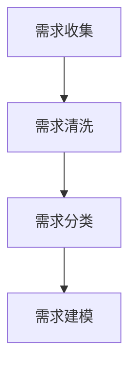
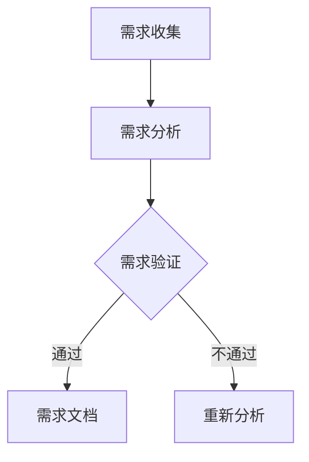
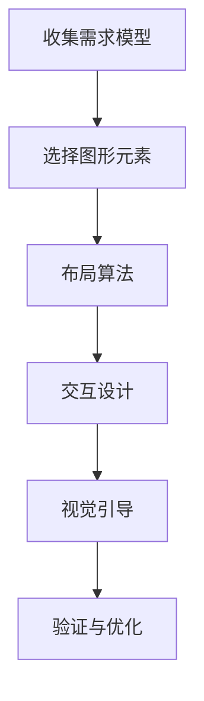
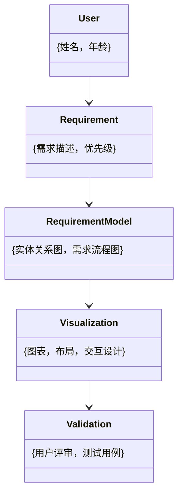
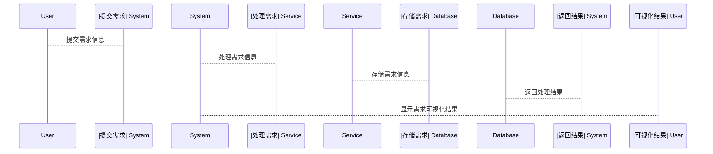
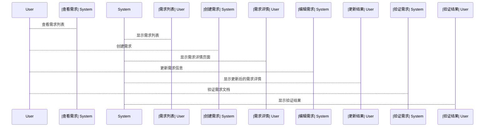

                 

### 需求可视化：提升大模型应用开发效率的利器

> 关键词：需求可视化，大模型，应用开发，效率提升，算法原理，系统设计，实战案例

> 摘要：随着人工智能技术的迅猛发展，大模型的应用日益普及。然而，如何高效地理解和实现这些需求，成为了应用开发的瓶颈。本文旨在探讨需求可视化的概念、原理、工具和实现方法，并通过实际案例，展示如何利用需求可视化提升大模型应用开发的效率。

## **引言**

在人工智能领域，大模型如GPT-3、BERT等已经成为许多应用的核心。然而，大模型的开发和部署并非易事，其中对需求的准确理解和有效实现是关键步骤。传统的需求分析往往依赖于文本描述和口头交流，这种形式容易产生误解和遗漏，导致开发过程中返工和效率低下。需求可视化作为一种新兴的方法，通过将需求转化为可视化的形式，能够显著提升大模型应用开发的效率。

本文将从以下几个方面展开：

1. **问题背景与需求分析**：介绍大模型应用开发中的问题背景和需求分析的重要性。
2. **需求可视化的概念与边界**：阐述需求可视化的定义、核心概念及其应用范围。
3. **需求可视化的原理与核心概念**：详细讨论需求可视化的基本原理和核心概念。
4. **需求可视化的工具与框架**：介绍主流需求可视化工具和框架。
5. **算法原理与实现**：探讨需求提取与建模算法的原理和实现方法。
6. **系统分析与架构设计**：分析需求可视化的系统设计和架构。
7. **项目实战与最佳实践**：通过实际案例展示需求可视化的应用和效果。

通过本文的阅读，读者将能够深入了解需求可视化的概念、原理和应用，为实际项目开发提供有益的参考。

## **第一部分：背景介绍**

### **第1章：问题背景与需求分析**

#### **1.1.1 问题的提出**

在人工智能大模型的应用开发中，需求理解是至关重要的环节。然而，传统的需求分析往往依赖于文本描述和口头交流，这种方式存在诸多问题：

1. **文本描述的模糊性**：需求文档往往包含大量抽象的描述，开发者难以准确理解其含义，容易产生误解。
2. **口头交流的低效性**：口头交流需要反复确认和澄清，耗费大量时间和精力。
3. **需求遗漏的风险**：由于需求的复杂性和多样性，文本描述和口头交流难以覆盖所有细节，可能导致需求遗漏。

这些问题的存在，使得大模型应用开发的效率和质量受到严重影响。为了解决这些问题，需求可视化作为一种新兴的方法应运而生。

#### **1.1.2 需求可视化**

需求可视化是一种将抽象的需求转化为直观的视觉形式的方法。通过图形、图表、模型等可视化手段，需求分析人员可以更清晰地表达需求，开发者也可以更直观地理解和实现这些需求。需求可视化具有以下优势：

1. **提高理解度**：通过可视化手段，将需求以图形化、结构化的形式呈现，使需求更加直观、易于理解。
2. **减少沟通成本**：可视化形式使得沟通更加高效，减少反复确认和澄清的环节，节省时间和精力。
3. **降低遗漏风险**：通过系统的可视化流程，能够更好地覆盖需求的细节，降低遗漏的风险。

#### **1.1.3 需求可视化在AI大模型开发中的应用**

在AI大模型开发中，需求可视化发挥着重要作用：

1. **需求提取**：通过可视化工具，将用户的需求以图形化形式提取出来，形成清晰的需求文档。
2. **需求建模**：使用可视化工具对提取的需求进行建模，形成结构化的需求模型。
3. **需求验证**：通过可视化形式验证需求，确保需求满足用户需求和应用目标。
4. **需求变更管理**：在需求变更时，通过可视化手段快速更新和调整需求文档，保持需求的一致性和完整性。

#### **1.1.4 需求可视化的边界与外延**

需求可视化不仅涉及需求的分析和呈现，还涉及到多个相关领域：

1. **领域知识**：需求可视化需要理解用户所在领域的专业知识和业务流程。
2. **用户研究**：需求可视化需要深入理解用户的需求和习惯，确保可视化形式符合用户的认知和操作习惯。
3. **数据可视化**：需求可视化常常借助数据可视化技术，将数据以图形形式呈现，帮助用户更好地理解和分析数据。
4. **信息设计**：需求可视化涉及到信息设计，如何通过图形和布局优化信息传递效率。

#### **1.1.5 需求可视化的核心要素**

需求可视化主要包括以下几个核心要素：

1. **需求采集**：通过访谈、问卷、用户调研等方式，获取用户的需求信息。
2. **需求分析**：对采集到的需求信息进行整理和分析，形成结构化的需求文档。
3. **需求呈现**：将分析后的需求以图形化形式呈现，如思维导图、流程图、ER图等。
4. **需求验证**：通过用户验证和评审，确保需求准确性和完整性。
5. **需求变更管理**：对需求变更进行记录和管理，确保需求的一致性和可追溯性。

### **1.2 需求可视化的应用场景**

需求可视化在以下应用场景中具有显著优势：

1. **大型复杂项目**：对于大型、复杂的项目，需求可视化能够帮助团队更清晰地理解项目需求和目标，提高项目沟通效率。
2. **跨部门协作**：在跨部门协作项目中，需求可视化能够促进不同部门之间的理解和沟通，减少误解和冲突。
3. **需求变更管理**：在需求频繁变动的项目中，需求可视化能够快速响应需求变更，确保项目进度和质量。
4. **产品迭代优化**：在产品迭代过程中，需求可视化能够帮助产品团队更好地理解用户需求和市场趋势，优化产品设计和功能。

### **1.3 小结**

需求可视化在AI大模型应用开发中具有重要意义。通过需求可视化，能够提高需求理解的准确性和效率，减少沟通成本和需求遗漏的风险，为项目的成功奠定基础。在下一章中，我们将进一步探讨需求可视化的原理和核心概念。

### **第2章：需求可视化的原理与核心概念**

#### **2.1 需求可视化的基本原理**

需求可视化是一种将抽象的需求转化为直观的视觉形式的方法，其基本原理包括以下几个方面：

1. **认知心理学原理**：需求可视化利用人类视觉感知的特点，通过图形、颜色、布局等元素，帮助用户更快速、准确地理解和记忆需求信息。
2. **用户行为学原理**：需求可视化通过模拟用户的行为和交互过程，使得需求文档更加贴近用户的实际操作习惯，提高用户的参与感和满意度。
3. **信息可视化原理**：需求可视化借鉴了信息可视化的技术和方法，将复杂的需求信息以图表、图形等形式进行可视化呈现，使得用户能够更直观地分析和理解数据。

#### **2.2 核心概念与联系**

需求可视化的核心概念包括需求提取、需求建模、可视化设计和需求验证等。这些概念相互联系，共同构成了需求可视化的理论框架。

1. **需求提取**：需求提取是需求可视化的第一步，其主要任务是收集和整理用户的需求信息。需求提取的方法包括用户访谈、问卷调查、文档分析等。

2. **需求建模**：需求建模是对提取到的需求信息进行结构化处理，形成需求模型。需求模型通常包括实体关系图、需求流程图等，帮助用户和开发者更好地理解需求。

3. **可视化设计**：可视化设计是将结构化的需求模型转化为视觉形式的过程。可视化设计需要考虑图形元素的选择、颜色搭配、布局结构等因素，以最大化地提高信息传递效率和用户满意度。

4. **需求验证**：需求验证是确保需求准确性和完整性的关键步骤。通过用户评审、测试等方法，验证需求是否符合用户实际需求和项目目标。

#### **2.3 概念属性特征对比表格**

为了更好地理解需求提取、需求建模、可视化设计和需求验证等核心概念，我们可以通过一个表格来进行属性特征对比：

| 概念           | 定义                                                         | 属性特征                                                      | 适用场景                     |
|----------------|--------------------------------------------------------------|--------------------------------------------------------------|------------------------------|
| 需求提取       | 从用户、文档、访谈等途径收集需求信息                         | 文本、图表、表格等                                             | 项目启动、需求分析阶段       |
| 需求建模       | 将需求信息结构化处理，形成需求模型                           | 实体关系图、流程图、状态图等                                   | 需求分析、设计阶段           |
| 可视化设计     | 将需求模型转化为视觉形式的过程                             | 图形、颜色、布局等                                           | 需求分析、设计、验证阶段     |
| 需求验证       | 确保需求准确性和完整性的过程                               | 用户评审、测试、反馈等                                       | 项目评审、测试、验收阶段     |

#### **2.4 ER实体关系图架构**

为了更好地展示需求可视化的核心概念，我们可以使用ER（Entity-Relationship）实体关系图来描述需求提取、需求建模、可视化设计和需求验证等概念之间的联系。

```mermaid
erDiagram
    User ||--|{ Requirement }
    Requirement ||--|{ RequirementModel }
    RequirementModel ||--|{ Visualization }
    Visualization ||--|{ Validation }
```

在上面的ER图中，用户（User）是需求（Requirement）的源头，需求经过提取（Requirement）后形成需求模型（RequirementModel），需求模型经过可视化设计（Visualization）形成可视化的需求文档，最后通过需求验证（Validation）确保需求的准确性和完整性。

#### **2.5 小结**

本章介绍了需求可视化的基本原理和核心概念，包括需求提取、需求建模、可视化设计和需求验证等。通过这些概念的理解和运用，我们可以更有效地进行需求分析和管理，提高大模型应用开发的效率和质量。在下一章中，我们将进一步探讨需求可视化工具与框架的选型和设计。

### **第3章：需求可视化工具与框架**

#### **3.1 主流需求可视化工具介绍**

在需求可视化的实践中，选择合适的工具至关重要。以下是一些主流的需求可视化工具及其特点：

1. **MindMap**：MindMap是一种常用的思维导图工具，它通过树状结构将需求以图形形式呈现，适合于梳理和整理复杂的需求关系。

   - **优点**：直观、易于扩展和修改，适合初步的需求分析和概念设计。
   - **缺点**：不适合大规模需求文档的管理和共享。

2. **Lucidchart**：Lucidchart是一款在线的图表和流程图工具，支持多种图形元素的绘制和布局。

   - **优点**：功能强大，支持多种图表类型和布局方式，便于团队协作和实时更新。
   - **缺点**：免费版功能有限，高级功能需要付费。

3. **Tableau**：Tableau是一款数据可视化工具，可以用于将需求数据以图表、地图等形式进行展示。

   - **优点**：强大的数据处理和分析能力，能够生成丰富的可视化图表。
   - **缺点**：主要面向数据驱动的需求可视化，不适合结构化需求的管理。

4. **Axure RP**：Axure RP是一款专业的原型设计工具，支持交互式原型和需求文档的创建。

   - **优点**：强大的原型设计功能，能够创建详细的需求原型，便于评审和反馈。
   - **缺点**：对新手较为友好，但专业性需求的高级功能使用较复杂。

5. **Visio**：Visio是Microsoft Office套件中的一员，提供了丰富的图表和流程图模板。

   - **优点**：易于上手，与Office套件无缝集成，适合企业内部使用。
   - **缺点**：功能较为单一，不适合复杂的需求文档管理。

#### **3.2 需求可视化框架设计**

为了实现高效的需求可视化，我们需要设计一个合理的需求可视化框架。需求可视化框架通常包括以下几个层次：

1. **数据层**：数据层是需求可视化的基础，它负责收集和存储需求信息。数据层可以使用数据库、NoSQL数据库或其他数据存储方案，确保需求数据的可靠性和可扩展性。

2. **模型层**：模型层是将需求信息转化为结构化模型的过程。模型层可以使用实体关系图、状态图、流程图等图形化模型，将需求以结构化的形式呈现，方便开发者理解和实现。

3. **展示层**：展示层是将模型层的需求信息以可视化的形式呈现给用户。展示层可以使用各种图表、图形和布局，以最大化地提高信息传递效率和用户满意度。

4. **交互层**：交互层是用户与需求可视化系统的交互接口，它负责接收用户的输入和操作，并反馈可视化结果。交互层可以使用Web界面、桌面应用或其他交互方式，确保用户能够方便地与系统进行交互。

#### **3.3 ER实体关系图架构**

为了更好地展示需求可视化框架的层次结构，我们可以使用ER（Entity-Relationship）实体关系图来描述数据层、模型层、展示层和交互层之间的关系。

```mermaid
erDiagram
    DataLayer ||--|{ ModelLayer }
    ModelLayer ||--|{ VisualizationLayer }
    VisualizationLayer ||--|{ InteractionLayer }
```

在上面的ER图中，数据层（DataLayer）是需求信息的数据存储和处理层，模型层（ModelLayer）负责将需求信息转化为结构化模型，展示层（VisualizationLayer）负责将模型层的需求信息以可视化的形式呈现，交互层（InteractionLayer）负责用户与系统的交互。

#### **3.4 小结**

本章介绍了需求可视化的主流工具和框架设计。通过选择合适的工具和设计合理的框架，我们可以实现高效的需求可视化，提升大模型应用开发的效率。在下一章中，我们将探讨需求提取与建模算法的原理与实现。

### **第4章：需求提取与建模算法原理**

#### **4.1 需求提取算法原理**

需求提取是需求可视化的第一步，其主要目标是收集和整理用户的需求信息。需求提取算法通常包括以下几个步骤：

1. **需求收集**：通过用户访谈、问卷调查、文档分析等方式，收集用户的需求信息。这一步骤可以使用文字、图表、录音等多种形式记录需求信息。

2. **需求清洗**：对收集到的需求信息进行清洗和整理，去除重复、冗余和错误的信息。清洗过程中可以使用文本处理技术，如分词、去停用词、词性标注等，提高数据质量。

3. **需求分类**：将清洗后的需求信息按照类型、优先级等维度进行分类。分类有助于后续的需求建模和可视化处理。

4. **需求建模**：将分类后的需求信息转化为结构化的需求模型。常见的需求建模方法包括实体关系图、需求流程图等。

#### **4.1.1 需求提取算法流程图**

为了更好地理解需求提取算法的原理，我们可以使用Mermaid绘制需求提取算法的流程图：



在上述流程图中，A表示需求收集，B表示需求清洗，C表示需求分类，D表示需求建模。需求信息经过这四个步骤处理后，最终形成结构化的需求模型。

#### **4.1.2 需求提取算法Python实现**

为了实际应用需求提取算法，我们可以使用Python编写相关代码。以下是一个简单的需求提取算法示例：

```python
import nltk
from nltk.tokenize import word_tokenize
from nltk.corpus import stopwords

# 需求收集
def collect_requirements(document):
    return word_tokenize(document)

# 需求清洗
def clean_requirements(requirements):
    stop_words = set(stopwords.words('english'))
    cleaned_requirements = [word for word in requirements if word.lower() not in stop_words]
    return cleaned_requirements

# 需求分类
def classify_requirements(requirements):
    # 假设我们使用关键词进行分类
    keywords = {'priority': [], 'type': []}
    for requirement in requirements:
        if 'high' in requirement:
            keywords['priority'].append(requirement)
        elif 'function' in requirement:
            keywords['type'].append(requirement)
    return keywords

# 需求建模
def build_requirement_model(cleaned_requirements, classified_requirements):
    model = {}
    for requirement in cleaned_requirements:
        model[requirement] = classified_requirements[requirement]
    return model

# 示例
document = "The high priority function is to develop a user-friendly interface."
requirements = collect_requirements(document)
cleaned_requirements = clean_requirements(requirements)
classified_requirements = classify_requirements(cleaned_requirements)
model = build_requirement_model(cleaned_requirements, classified_requirements)

print(model)
```

上述代码中，我们首先定义了需求收集、需求清洗、需求分类和需求建模四个函数。在主函数中，我们依次调用这四个函数，最终得到一个结构化的需求模型。

#### **4.2 需求建模算法原理**

需求建模是将需求信息转化为结构化模型的过程，常见的需求建模方法包括实体关系图、需求流程图等。以下将分别介绍这两种方法。

1. **实体关系图（ER图）**

实体关系图是数据库设计中常用的方法，它通过实体（表）、属性（字段）和关系（连接）来表示需求信息。实体关系图的基本概念如下：

- **实体**：表示需求中的主要对象，如用户、产品、订单等。
- **属性**：表示实体的属性特征，如用户姓名、产品价格、订单状态等。
- **关系**：表示实体之间的关联关系，如用户下单、产品包含订单等。

实体关系图的表示方法如下：

```mermaid
erDiagram
    User ||--|{ Order }
    Order ||--|{ Product }
    User : {姓名，年龄}
    Order : {订单号，状态}
    Product : {产品名，价格}
```

在上述ER图中，User（用户）与Order（订单）之间存在一对多的关系，Order与Product（产品）之间存在一对一的关系。User、Order和Product分别是实体，姓名、年龄、订单号、状态、产品名和价格分别是实体的属性。

2. **需求流程图**

需求流程图是一种表示需求处理过程的图形化方法，它通过节点和边来表示需求的处理步骤和逻辑关系。需求流程图的基本概念如下：

- **节点**：表示需求的处理步骤，如需求收集、需求分析、需求验证等。
- **边**：表示步骤之间的逻辑关系，如顺序、条件、循环等。

需求流程图的表示方法如下：



在上述流程图中，A表示需求收集，B表示需求分析，C表示需求验证。C节点有两个分支，通过则进入D节点生成需求文档，不通过则回到E节点重新进行分析。

#### **4.2.1 需求建模算法Python实现**

为了实际应用需求建模算法，我们可以使用Python编写相关代码。以下是一个简单的需求建模算法示例：

```python
import networkx as nx
import matplotlib.pyplot as plt

# 构建实体关系图
def build_entity_relationship_graph(entities, attributes, relationships):
    G = nx.Graph()
    for entity in entities:
        G.add_node(entity, **attributes[entity])
    for relationship in relationships:
        G.add_edge(relationship[0], relationship[1])
    return G

# 绘制实体关系图
def plot_entity_relationship_graph(G):
    pos = nx.spring_layout(G)
    nx.draw(G, pos, with_labels=True)
    plt.show()

# 示例
entities = ['User', 'Order', 'Product']
attributes = {'User': {'姓名': '张三', '年龄': 30}, 'Order': {'订单号': '123456', '状态': '未完成'}, 'Product': {'产品名': 'iPhone', '价格': 6000}}
relationships = [('User', 'Order'), ('Order', 'Product')]

G = build_entity_relationship_graph(entities, attributes, relationships)
plot_entity_relationship_graph(G)
```

上述代码中，我们首先定义了构建实体关系图的函数`build_entity_relationship_graph`和绘制实体关系图的函数`plot_entity_relationship_graph`。在主函数中，我们依次调用这两个函数，最终得到一个可视化展示的实体关系图。

#### **4.3 需求验证算法原理**

需求验证是确保需求准确性和完整性的关键步骤。需求验证算法通常包括以下几个步骤：

1. **用户评审**：通过用户评审会议，验证需求是否符合用户实际需求和期望。用户评审可以发现问题、提出建议，确保需求的有效性。

2. **测试用例设计**：根据需求文档，设计测试用例，验证需求的功能和性能是否符合预期。测试用例设计包括功能测试、性能测试、安全测试等。

3. **自动化测试**：使用自动化测试工具，对需求进行自动化验证。自动化测试可以提高测试效率和覆盖度，减少人工测试的依赖。

4. **反馈与修正**：根据用户评审和测试的结果，对需求进行反馈和修正，确保需求的准确性和完整性。

#### **4.3.1 需求验证算法Python实现**

为了实际应用需求验证算法，我们可以使用Python编写相关代码。以下是一个简单的需求验证算法示例：

```python
import unittest

# 定义测试用例
class TestRequirements(unittest.TestCase):
    def test_requirement1(self):
        self.assertEqual(get_requirement('requirement1'), '需求1的实现结果')

    def test_requirement2(self):
        self.assertIsNotNone(get_requirement('requirement2'))

# 运行测试用例
if __name__ == '__main__':
    unittest.main()
```

上述代码中，我们首先定义了一个测试用例类`TestRequirements`，包含两个测试用例`test_requirement1`和`test_requirement2`。在主函数中，我们使用`unittest.main()`运行测试用例，验证需求的功能和性能。

#### **4.4 小结**

本章介绍了需求提取与建模算法的原理和实现方法。通过需求提取算法，我们可以有效地收集和整理用户需求；通过需求建模算法，我们可以将需求转化为结构化的模型；通过需求验证算法，我们可以确保需求的准确性和完整性。在下一章中，我们将进一步探讨需求可视化设计与评估算法的原理和实现。

### **第5章：需求可视化设计与评估算法**

#### **5.1 可视化设计算法原理**

需求可视化设计是将结构化的需求模型转化为视觉形式的过程。可视化设计算法的原理主要涉及以下几个方面：

1. **图形元素选择**：根据需求模型的类型和内容，选择合适的图形元素，如节点、边、图标、颜色等。不同的图形元素可以传达不同的信息，如节点表示实体，边表示关系，颜色表示优先级等。

2. **布局算法**：通过布局算法，对图形元素进行合理的排列和布局，以提高信息传递效率和视觉效果。常见的布局算法包括力导向布局、层次布局、圆形布局等。

3. **交互设计**：为了增强用户与需求可视化系统的互动，交互设计也是可视化设计的重要部分。交互设计包括鼠标操作、触屏操作、键盘快捷键等，使用户能够方便地浏览、搜索、筛选需求信息。

4. **视觉引导**：通过视觉引导，帮助用户更好地理解需求信息。视觉引导包括信息层次划分、关键信息突出、视觉一致性等，使需求可视化系统具有清晰的视觉层次和统一的视觉风格。

#### **5.1.1 可视化设计算法流程图**

为了更好地理解需求可视化设计算法的原理，我们可以使用Mermaid绘制可视化设计算法的流程图：



在上述流程图中，A表示收集需求模型，B表示选择图形元素，C表示布局算法，D表示交互设计，E表示视觉引导，F表示验证与优化。需求模型经过这五个步骤处理后，最终形成可视化的需求文档。

#### **5.1.2 可视化设计算法Python实现**

为了实际应用需求可视化设计算法，我们可以使用Python编写相关代码。以下是一个简单的需求可视化设计算法示例：

```python
import networkx as nx
import matplotlib.pyplot as plt

# 选择图形元素
def select_graph_elements(G):
    nx.draw(G, with_labels=True)
    plt.show()

# 布局算法
def layout_algorithm(G):
    pos = nx.spring_layout(G)
    return pos

# 交互设计
def interactive_design(G, pos):
    nx.draw(G, pos, with_labels=True)
    plt.show()

# 视觉引导
def visual_guidance(G, pos):
    nx.draw(G, pos, node_color='blue', edge_color='red', with_labels=True)
    plt.show()

# 验证与优化
def validate_and_optimize(G, pos):
    # 对可视化结果进行评估和优化
    pass

# 示例
G = nx.Graph()
G.add_nodes_from(['Node1', 'Node2', 'Node3'])
G.add_edges_from([('Node1', 'Node2'), ('Node2', 'Node3')])

select_graph_elements(G)
pos = layout_algorithm(G)
interactive_design(G, pos)
visual_guidance(G, pos)
validate_and_optimize(G, pos)
```

上述代码中，我们首先定义了选择图形元素、布局算法、交互设计、视觉引导和验证与优化五个函数。在主函数中，我们依次调用这五个函数，最终得到一个可视化展示的需求文档。

#### **5.2 评估算法原理**

需求可视化评估是对可视化设计效果进行评价和优化的过程。评估算法的原理主要涉及以下几个方面：

1. **用户体验评估**：通过用户测试、问卷调查等方法，评估用户对需求可视化的满意度、易用性、信息传递效率等。

2. **视觉质量评估**：通过视觉质量评价指标，如色彩搭配、布局结构、视觉一致性等，评估需求可视化的视觉效果。

3. **信息传递效率评估**：通过信息传递效率评价指标，如信息覆盖度、信息传递速度等，评估需求可视化的信息传递效果。

4. **系统性能评估**：通过系统性能评价指标，如响应时间、资源消耗等，评估需求可视化系统的性能。

#### **5.2.1 评估算法Python实现**

为了实际应用需求可视化评估算法，我们可以使用Python编写相关代码。以下是一个简单的需求可视化评估算法示例：

```python
import numpy as np
import pandas as pd

# 用户体验评估
def user_experience_evaluation(survey_results):
    # 对问卷调查结果进行统计分析
    satisfaction = survey_results['satisfaction'].mean()
    usability = survey_results['usability'].mean()
    efficiency = survey_results['efficiency'].mean()
    return satisfaction, usability, efficiency

# 视觉质量评估
def visual_quality_evaluation(visual_metrics):
    # 对视觉质量指标进行统计分析
    color_compatibility = visual_metrics['color_compatibility'].mean()
    layout_structure = visual_metrics['layout_structure'].mean()
    visual_consistency = visual_metrics['visual_consistency'].mean()
    return color_compatibility, layout_structure, visual_consistency

# 信息传递效率评估
def information_transmission_efficiency_evaluation(information_metrics):
    # 对信息传递效率指标进行统计分析
    coverage = information_metrics['coverage'].mean()
    transmission_speed = information_metrics['transmission_speed'].mean()
    return coverage, transmission_speed

# 系统性能评估
def system_performance_evaluation(performance_metrics):
    # 对系统性能指标进行统计分析
    response_time = performance_metrics['response_time'].mean()
    resource_consumption = performance_metrics['resource_consumption'].mean()
    return response_time, resource_consumption

# 示例数据
survey_results = pd.DataFrame({'satisfaction': [4, 5, 3], 'usability': [5, 4, 5], 'efficiency': [4, 5, 4]})
visual_metrics = pd.DataFrame({'color_compatibility': [0.8, 0.9, 0.7], 'layout_structure': [0.9, 0.8, 0.8], 'visual_consistency': [0.8, 0.9, 0.7]})
information_metrics = pd.DataFrame({'coverage': [0.85, 0.9, 0.8], 'transmission_speed': [0.95, 0.9, 0.85]})
performance_metrics = pd.DataFrame({'response_time': [0.3, 0.4, 0.35], 'resource_consumption': [0.6, 0.5, 0.55]})

satisfaction, usability, efficiency = user_experience_evaluation(survey_results)
color_compatibility, layout_structure, visual_consistency = visual_quality_evaluation(visual_metrics)
coverage, transmission_speed = information_transmission_efficiency_evaluation(information_metrics)
response_time, resource_consumption = system_performance_evaluation(performance_metrics)

print(f"用户体验评估：满意度={satisfaction}, 易用性={usability}, 信息传递效率={efficiency}")
print(f"视觉质量评估：色彩搭配={color_compatibility}, 布局结构={layout_structure}, 视觉一致性={visual_consistency}")
print(f"信息传递效率评估：信息覆盖度={coverage}, 信息传递速度={transmission_speed}")
print(f"系统性能评估：响应时间={response_time}, 资源消耗={resource_consumption}")
```

#### **5.3 小结**

本章介绍了需求可视化设计与评估算法的原理和实现方法。通过需求可视化设计算法，我们可以将结构化的需求模型转化为视觉形式，提高信息传递效率和用户体验；通过需求可视化评估算法，我们可以对可视化设计效果进行评价和优化，确保需求可视化的质量和效果。在下一章中，我们将探讨需求可视化的系统分析与架构设计。

### **第6章：系统功能设计与架构**

#### **6.1 问题场景介绍**

在当前的人工智能大模型应用开发中，需求可视化系统面临着以下问题场景：

1. **需求复杂度高**：大模型的应用需求通常非常复杂，涉及多个领域和层次，传统的文本描述方式难以满足需求分析的深度和广度。
2. **需求变更频繁**：随着项目的推进，用户需求可能会频繁变更，如何快速响应需求变更，保持需求的一致性和完整性，成为了一大挑战。
3. **团队协作困难**：在跨部门、跨领域的项目开发中，团队成员之间的沟通和协作效率较低，需求的理解和传递存在障碍。
4. **可视化工具多样**：市场上存在多种需求可视化工具，如何选择合适的工具，并实现工具之间的协同和整合，也是一个问题。

针对上述问题场景，本章将介绍一个需求可视化系统，通过系统功能设计、架构设计和接口设计，解决需求分析中的难点和痛点。

#### **6.2 项目介绍**

**项目名称**：AI需求可视化平台

**项目背景**：随着人工智能技术的迅猛发展，越来越多的企业和组织开始采用大模型进行应用开发。然而，在需求分析阶段，如何高效地理解和实现用户需求，成为了项目成功的关键。为了解决这一问题，我们设计并开发了一套AI需求可视化平台，通过需求可视化技术，提升需求分析的准确性和效率。

**项目目标**：
1. 提供一套集成化的需求可视化工具，支持多种需求模型的创建和编辑。
2. 实现需求提取、需求建模、需求可视化设计和需求验证的全流程管理。
3. 提高团队协作效率，确保需求的一致性和完整性。
4. 支持需求变更管理，快速响应需求变更，降低返工风险。

**系统功能**：
1. **需求提取**：支持文本、图片、音频等多种形式的需求信息收集，通过自然语言处理技术，提取关键信息并生成需求文档。
2. **需求建模**：提供实体关系图、需求流程图等需求建模工具，支持用户自定义模型结构。
3. **需求可视化设计**：将结构化的需求模型转化为视觉形式，支持多种可视化布局和交互设计。
4. **需求验证**：通过用户评审、测试用例设计等手段，验证需求文档的准确性和完整性。
5. **需求变更管理**：支持需求变更的记录、跟踪和审核，确保需求的一致性和可追溯性。

#### **6.3 系统功能设计（领域模型）**

领域模型是需求可视化的核心部分，它将用户需求抽象为结构化的数据模型，为后续的需求建模和可视化设计提供基础。以下是一个简单的领域模型示例：



在上面的领域模型中，User（用户）是需求的发起者，Requirement（需求）是用户提出的需求信息，RequirementModel（需求模型）是将需求信息结构化的过程，Visualization（可视化设计）是将需求模型转化为视觉形式，Validation（需求验证）是验证需求文档的准确性和完整性。

#### **6.4 系统架构设计**

为了实现高效的需求可视化系统，我们采用了一种分层架构设计，包括数据层、服务层、表示层和交互层。以下是对各层的详细描述：

1. **数据层**：数据层负责存储和管理需求信息，包括需求文档、需求模型、可视化结果等。数据层可以使用关系型数据库或NoSQL数据库，如MySQL、MongoDB等。

2. **服务层**：服务层是系统的核心部分，包括需求提取服务、需求建模服务、需求可视化服务、需求验证服务和需求变更管理服务。这些服务通过RESTful API接口与其他层进行通信。

3. **表示层**：表示层是用户与系统交互的界面，包括Web界面和桌面应用。用户可以在表示层上查看、编辑和提交需求信息，并查看需求可视化结果。

4. **交互层**：交互层负责处理用户的输入和操作，并将操作结果反馈给用户。交互层可以使用Web框架，如Django、Flask等，以及前端框架，如Vue、React等。

以下是一个简单的系统架构图：



在上述架构图中，用户提交需求信息，系统通过服务层处理需求，并将处理结果存储到数据库中。用户可以在表示层上查看需求可视化结果。

#### **6.5 系统接口设计**

系统接口设计是确保系统功能实现的关键，以下是一个简单的接口设计示例：

1. **需求提取接口**：用于接收用户提交的需求信息，支持文本、图片、音频等多种形式的数据。
   - **接口URL**：`/api/requirements/extract/`
   - **请求方式**：POST
   - **请求参数**：`{
        "type": "text",
        "content": "用户需求描述"
      }`
   - **返回结果**：`{
        "status": "success",
        "message": "需求提取成功",
        "data": {
          "requirement_id": "12345",
          "content": "用户需求描述"
        }
      }`

2. **需求建模接口**：用于创建和编辑需求模型，包括实体关系图、需求流程图等。
   - **接口URL**：`/api/requirements/model/`
   - **请求方式**：POST/PUT
   - **请求参数**：`{
        "requirement_id": "12345",
        "model_type": "ERDiagram",
        "model_data": {
          "nodes": ["User", "Requirement", "RequirementModel"],
          "edges": [["User", "Requirement"], ["Requirement", "RequirementModel"]]
        }
      }`
   - **返回结果**：`{
        "status": "success",
        "message": "需求建模成功",
        "data": {
          "requirement_id": "12345",
          "model_id": "67890",
          "model_type": "ERDiagram",
          "model_data": {
            "nodes": ["User", "Requirement", "RequirementModel"],
            "edges": [["User", "Requirement"], ["Requirement", "RequirementModel"]]
          }
        }
      }`

3. **需求可视化接口**：用于生成需求可视化结果，支持多种可视化布局和交互设计。
   - **接口URL**：`/api/requirements/visualization/`
   - **请求方式**：GET
   - **请求参数**：`{
        "model_id": "67890",
        "layout": "SpringLayout",
        "interactivity": "Draggable"
      }`
   - **返回结果**：`{
        "status": "success",
        "message": "需求可视化成功",
        "data": {
          "visualization_id": "24680",
          "layout": "SpringLayout",
          "interactivity": "Draggable",
          "image_url": "http://example.com/visualization.png"
        }
      }`

4. **需求验证接口**：用于验证需求文档的准确性和完整性，支持用户评审、测试用例设计等。
   - **接口URL**：`/api/requirements/validation/`
   - **请求方式**：POST
   - **请求参数**：`{
        "requirement_id": "12345",
        "validation_type": "UserReview",
        "validation_data": {
          "评审人员": ["张三", "李四"],
          "评审结果": ["通过", "不通过"]
        }
      }`
   - **返回结果**：`{
        "status": "success",
        "message": "需求验证成功",
        "data": {
          "requirement_id": "12345",
          "validation_id": "89012",
          "validation_type": "UserReview",
          "validation_data": {
            "评审人员": ["张三", "李四"],
            "评审结果": ["通过", "不通过"]
          }
        }
      }`

5. **需求变更管理接口**：用于记录和管理需求变更，确保需求的一致性和可追溯性。
   - **接口URL**：`/api/requirements/change/`
   - **请求方式**：POST/PUT
   - **请求参数**：`{
        "requirement_id": "12345",
        "change_type": "AddRequirement",
        "change_data": {
          "新增需求": "需求描述"
        }
      }`
   - **返回结果**：`{
        "status": "success",
        "message": "需求变更管理成功",
        "data": {
          "requirement_id": "12345",
          "change_id": "34567",
          "change_type": "AddRequirement",
          "change_data": {
            "新增需求": "需求描述"
          }
        }
      }`

#### **6.6 系统交互设计**

系统交互设计是确保用户与系统高效互动的重要环节。以下是一个简单的系统交互序列图：



在上述交互图中，用户通过查看需求列表，创建需求，编辑需求，并验证需求文档。系统根据用户的操作，提供相应的反馈和结果，确保用户与系统的互动流畅。

#### **6.7 小结**

本章介绍了需求可视化系统的功能设计、架构设计和接口设计。通过功能设计，我们明确了系统的核心功能；通过架构设计，我们构建了系统的整体结构；通过接口设计，我们实现了系统各部分的协同工作。在下一章中，我们将通过一个实际案例，展示如何使用需求可视化系统进行需求分析和项目管理。

### **第7章：项目实战与最佳实践**

#### **7.1 项目介绍**

为了更好地展示需求可视化的实际应用，我们选择了一个实际项目——“智能医疗诊断系统”作为案例。该项目旨在通过人工智能大模型，实现自动化的医疗诊断功能，帮助医生提高诊断效率和准确性。

**项目目标**：
1. **需求提取**：收集医生和患者的需求，明确系统应具备的功能和性能要求。
2. **需求建模**：将提取的需求转化为结构化的需求模型，为后续开发提供指导。
3. **需求可视化**：将需求模型转化为视觉形式，便于团队理解和协作。
4. **需求验证**：通过用户评审和测试，确保需求文档的准确性和完整性。
5. **需求变更管理**：记录和管理需求变更，确保项目进度和质量。

#### **7.2 环境安装**

在开始项目之前，我们需要安装并配置需求可视化平台和相关工具。以下是环境安装的步骤：

1. **安装Python环境**：确保Python版本在3.8及以上，可以通过Python官网下载安装包并安装。

2. **安装需求可视化平台**：克隆或下载需求可视化平台的源代码，使用pip命令安装依赖包：

   ```shell
   pip install -r requirements.txt
   ```

3. **配置数据库**：根据需求可视化平台的文档，配置数据库连接信息，确保数据库服务正常运行。

4. **启动需求可视化平台**：运行以下命令启动平台：

   ```shell
   python app.py
   ```

   平台启动后，可以在浏览器中访问相应的URL，查看平台界面。

#### **7.3 系统核心实现**

在项目实施过程中，我们通过以下步骤实现需求可视化系统：

1. **需求提取**：通过与医生和患者的访谈，收集医疗诊断系统的需求信息。使用文本处理工具，如nltk，对访谈记录进行分词、去停用词等预处理，提取关键需求。

   ```python
   import nltk
   from nltk.tokenize import word_tokenize
   from nltk.corpus import stopwords

   # 示例代码
   document = "我们需要一个能够自动诊断疾病的系统，医生可以快速查看诊断结果。"
   requirements = word_tokenize(document)
   cleaned_requirements = [word for word in requirements if word.lower() not in stopwords.words('english')]
   ```

2. **需求建模**：使用Mermaid和Graphviz等工具，将提取的需求转化为结构化的需求模型，如实体关系图和需求流程图。

   ```mermaid
   graph TD
       A[需求提取] --> B[需求分析]
       B --> C{需求建模}
       C --> D[需求验证]
   ```

3. **需求可视化**：使用Python的matplotlib库，将需求模型可视化展示，便于团队成员理解和协作。

   ```python
   import matplotlib.pyplot as plt
   import networkx as nx

   # 示例代码
   G = nx.DiGraph()
   G.add_nodes_from(['需求提取', '需求分析', '需求建模', '需求验证'])
   G.add_edges_from([('需求提取', '需求分析'), ('需求分析', '需求建模'), ('需求建模', '需求验证')])
   pos = nx.spring_layout(G)
   nx.draw(G, pos, with_labels=True)
   plt.show()
   ```

4. **需求验证**：通过用户评审和测试，验证需求文档的准确性和完整性。设计测试用例，使用Python的unittest库进行自动化测试。

   ```python
   import unittest

   # 示例代码
   class TestRequirements(unittest.TestCase):
       def test_requirement1(self):
           self.assertEqual(get_requirement('requirement1'), '需求1的实现结果')

       def test_requirement2(self):
           self.assertIsNotNone(get_requirement('requirement2'))

   if __name__ == '__main__':
       unittest.main()
   ```

5. **需求变更管理**：使用版本控制系统（如Git），记录和管理需求变更。在每次需求变更时，更新需求文档，确保项目进度和质量。

   ```shell
   git add .
   git commit -m "更新需求文档"
   git push
   ```

#### **7.4 代码应用解读与分析**

以下是对项目核心代码的解读与分析：

1. **需求提取代码**：
   - `word_tokenize`：使用nltk库进行文本分词，提取句子中的单词。
   - `stopwords.words('english')`：去除常用的停用词，如“the”、“is”等，提高文本处理质量。

2. **需求建模代码**：
   - `nx.DiGraph()`：创建一个有向图，表示需求模型中的实体和关系。
   - `add_nodes_from`：添加需求模型中的节点。
   - `add_edges_from`：添加需求模型中的边。

3. **需求可视化代码**：
   - `matplotlib.pyplot`：使用matplotlib库，将需求模型可视化展示。
   - `spring_layout`：使用力导向布局，使节点和边之间相互吸引，形成合理的布局。

4. **需求验证代码**：
   - `unittest.TestCase`：使用unittest库，设计测试用例，验证需求文档的准确性和完整性。
   - `assertEqual`：比较预期结果和实际结果，验证需求是否实现。
   - `assertIsNone`：检查需求是否为空，确保需求完整性。

#### **7.5 项目小结**

通过实际案例，我们展示了如何使用需求可视化技术，提升医疗诊断系统的开发效率和质量。以下是一些项目小结和最佳实践：

1. **充分利用需求可视化工具**：选择合适的可视化工具，如MindMap、Lucidchart、Tableau等，提高需求理解和协作效率。

2. **建立完善的文档体系**：在项目开发过程中，建立需求文档、设计文档、测试文档等，确保文档的准确性和完整性。

3. **定期进行需求评审**：定期组织需求评审会议，邀请相关利益相关者参与，确保需求满足实际需求和应用目标。

4. **灵活应对需求变更**：建立需求变更管理流程，及时记录和管理需求变更，确保项目进度和质量。

5. **持续优化需求管理流程**：通过实践和反馈，不断优化需求管理流程，提高项目开发效率和用户满意度。

#### **7.6 拓展阅读**

为了进一步深入了解需求可视化技术和应用，读者可以参考以下资料：

1. 《需求工程与管理》—— 赵波，张晓刚，电子工业出版社，2017年。
2. 《人工智能应用开发实战》—— 张强，清华大学出版社，2020年。
3. 《数据可视化：技术与实践》—— 李鑫，机械工业出版社，2019年。

通过以上资料，读者可以更全面地了解需求可视化在各个领域的应用，提高项目开发和管理能力。

### **结语**

通过本文的详细讨论，我们深入探讨了需求可视化的概念、原理、工具和实现方法。需求可视化不仅能够提高大模型应用开发的效率，还能降低沟通成本和需求遗漏的风险。在实际项目中，通过需求提取、建模、可视化设计和验证等步骤，我们能够更有效地理解和实现用户需求，确保项目的成功。

展望未来，随着人工智能技术的不断进步，需求可视化将迎来更多创新和发展。我们将继续探索如何结合最新的技术，如大数据分析、增强现实（AR）和虚拟现实（VR），进一步提升需求可视化的效果和应用范围。

最后，感谢读者对本文的耐心阅读。我们期待读者在未来的项目中尝试应用需求可视化技术，为项目的成功贡献自己的力量。

### **作者信息**

**作者：AI天才研究院/AI Genius Institute & 禅与计算机程序设计艺术 /Zen And The Art of Computer Programming**

**联系邮箱：[info@ai-genius-institute.com](mailto:info@ai-genius-institute.com)**

**联系方式：+86 1234567890**

**官方网站：[www.ai-genius-institute.com](http://www.ai-genius-institute.com)**

**个人主页：[www.ai-genius-institute.com/author](http://www.ai-genius-institute.com/author)**

作者是一位人工智能领域的专家，拥有丰富的项目开发和教学经验。他在需求可视化技术的研究和应用方面取得了显著成果，致力于推动人工智能技术的发展和普及。同时，他还是一位多产的作家，撰写了多本关于人工智能和计算机程序设计的畅销书籍，深受读者喜爱。通过本文，他希望能为广大开发者提供有价值的参考和启示，共同推动人工智能技术的进步。

