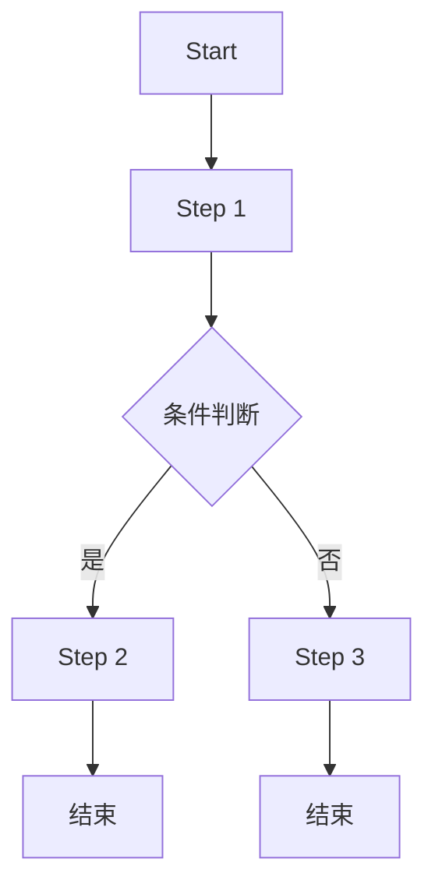

                 

# 需求驱动开发在大模型应用中的实践

> 关键词：需求驱动开发，大模型应用，实践指南，算法原理，系统架构，项目实战

> 摘要：本文详细探讨需求驱动开发在大模型应用中的实践，从背景介绍、核心概念、需求分析、模型设计、模型实现、应用案例以及挑战与解决方案等方面，逐步剖析需求驱动开发在大模型应用中的实际操作过程。通过本文的阅读，读者可以全面了解需求驱动开发在大模型中的重要性及其在实际应用中的实施方法和策略。

### 目录

1. **引言**
2. **背景介绍**
   2.1 **需求驱动开发的起源与发展**
   2.2 **大模型应用的背景**
   2.3 **需求驱动开发在大模型中的应用**
3. **核心概念与联系**
   3.1 **需求驱动开发的核心概念**
   3.2 **大模型的核心概念**
   3.3 **需求驱动开发与大模型的联系**
4. **需求分析**
   4.1 **需求分析的方法与工具**
   4.2 **大模型需求的特点与处理**
5. **模型设计**
   5.1 **大模型设计原则**
   5.2 **大模型架构设计**
6. **模型实现**
   6.1 **大模型实现的技术路线**
   6.2 **大模型实现的关键点**
7. **项目实战**
   7.1 **案例介绍**
   7.2 **案例分析**
   7.3 **项目小结**
8. **挑战与解决方案**
   8.1 **数据质量与模型性能的挑战**
   8.2 **模型解释性与透明性的挑战**
9. **总结与展望**
10. **作者信息**

### 1. 引言

在当今信息技术高速发展的时代，人工智能（AI）特别是大模型的应用越来越广泛。大模型，如深度学习模型，具有处理复杂数据和进行自动化决策的能力，已经成为各行业的技术创新驱动力。然而，如何有效地将大模型应用于实际项目中，实现其价值，成为了一个重要的研究课题。

需求驱动开发（Requirement-Driven Development，RDD）是一种软件工程方法论，强调以用户需求为中心，通过逐步迭代和不断反馈的方式，实现软件系统的开发。在大模型应用中，需求驱动开发具有独特的优势，能够更好地应对复杂问题的需求变化，提高开发效率。

本文旨在探讨需求驱动开发在大模型应用中的实践。通过分析需求驱动开发的背景和核心概念，阐述其在大模型中的应用原理，详细描述需求分析、模型设计、模型实现等环节，并结合实际项目案例，探讨需求驱动开发在大模型应用中面临的挑战和解决方案。最终，本文将对需求驱动开发在大模型应用中的未来发展趋势进行展望。

### 2. 背景介绍

#### 2.1 需求驱动开发的起源与发展

需求驱动开发（Requirement-Driven Development，RDD）起源于20世纪80年代，是软件工程方法论的一种。与传统的方法不同，需求驱动开发更加强调用户需求的重要性。在需求驱动开发中，开发团队通过不断与用户沟通，获取和明确需求，然后按照这些需求逐步开发软件系统。

需求驱动开发的核心思想是“迭代和反馈”。在软件开发过程中，开发团队会不断进行需求收集、分析和验证，通过迭代的方式逐步完善软件系统。这种方法不仅能够快速响应用户需求的变化，还能够提高软件质量和开发效率。

需求驱动开发的发展历程可以分为几个阶段：

- **原型法**：这是需求驱动开发的早期形式，通过快速构建软件原型，获取用户反馈，不断迭代改进。
- **增量式开发**：在原型法的基础上，引入了增量式开发的思想，将整个软件系统分解为多个模块，逐步开发和完善。
- **敏捷开发**：敏捷开发是需求驱动开发的一个重要分支，强调快速迭代、持续交付和团队成员之间的协作。

#### 2.2 大模型应用的背景

大模型，特别是深度学习模型，是近年来人工智能领域的重要突破。深度学习模型通过多层神经网络结构，可以自动学习和提取复杂数据的特征，从而实现自动化的决策和预测。

大模型的应用背景主要源于以下几个方面：

- **数据量的爆发增长**：随着互联网和物联网的发展，数据量呈现出爆炸式增长。大模型能够处理和分析这些海量数据，从中提取有价值的信息。
- **计算能力的提升**：随着计算能力的不断提升，特别是GPU和TPU等专用硬件的普及，大模型的训练和部署变得更加高效和可行。
- **自动化需求的增长**：在工业、金融、医疗等多个领域，自动化需求不断增长。大模型通过自动化的学习和决策，能够提高生产效率和降低成本。

大模型的应用场景非常广泛，包括但不限于：

- **自然语言处理**：如机器翻译、文本生成、情感分析等。
- **计算机视觉**：如图像分类、目标检测、人脸识别等。
- **推荐系统**：如电商推荐、音乐推荐等。
- **游戏开发**：如游戏角色智能行为模拟等。

#### 2.3 需求驱动开发在大模型中的应用

需求驱动开发在大模型中的应用具有显著的优势。首先，大模型通常涉及复杂的数据和算法，需求的变化可能会对模型的设计和实现产生重大影响。需求驱动开发通过迭代和反馈的方式，能够更好地适应需求的变化，确保模型能够满足实际应用需求。

其次，大模型的开发过程通常涉及多个学科领域，如计算机科学、数据科学、统计学等。需求驱动开发强调团队合作和跨学科交流，有助于整合不同领域的专业知识，提高大模型开发的效率。

最后，需求驱动开发可以帮助项目团队更好地理解和把握用户需求，从而设计出更加符合用户期望的模型。通过不断迭代和优化，项目团队能够逐步完善大模型，提高其性能和应用效果。

然而，需求驱动开发在大模型应用中也面临一些挑战，如数据质量、模型解释性等。这些问题需要通过系统的解决方案和实践来逐步解决。

### 3. 核心概念与联系

#### 3.1 需求驱动开发的核心概念

需求驱动开发（RDD）的核心概念包括：

- **用户需求**：用户需求是软件开发的核心驱动力，是确定软件功能、性能、用户体验的基础。
- **迭代与反馈**：需求驱动开发通过不断迭代和反馈，逐步完善软件系统，确保软件能够满足用户需求。
- **需求管理**：需求管理包括需求的收集、分析、验证和跟踪，是确保软件开发顺利进行的重要环节。
- **团队协作**：需求驱动开发强调团队合作和跨学科交流，有助于提高软件开发效率和质量。

#### 3.2 大模型的核心概念

大模型的核心概念包括：

- **深度学习**：深度学习是一种基于多层神经网络的学习方法，能够自动提取复杂数据的特征。
- **神经网络**：神经网络是深度学习的基础，通过多层的神经元连接，实现数据的非线性变换和特征提取。
- **数据预处理**：数据预处理是深度学习的重要环节，包括数据的清洗、归一化、缺失值处理等。
- **模型训练与优化**：模型训练与优化是提高大模型性能的关键，通过调整模型参数，优化网络结构，提高模型的预测能力。

#### 3.3 需求驱动开发与大模型的联系

需求驱动开发与大模型之间的联系主要体现在以下几个方面：

- **需求驱动模型设计**：需求驱动开发强调以用户需求为中心，大模型的设计和实现也应以用户需求为导向，确保模型能够满足实际应用需求。
- **迭代与反馈机制**：需求驱动开发通过迭代和反馈机制，可以逐步优化大模型的设计和实现，提高模型的性能和应用效果。
- **需求变更管理**：大模型开发过程中，需求变更很常见。需求驱动开发提供了有效的需求变更管理机制，可以帮助项目团队快速响应需求变化，确保项目进度和质量。
- **团队协作**：大模型开发通常涉及多个学科领域，需求驱动开发强调团队合作和跨学科交流，有助于整合不同领域的专业知识，提高大模型开发的效率。

### 4. 需求分析

#### 4.1 需求分析的方法与工具

需求分析是软件开发的重要环节，对于大模型应用尤其关键。以下是常用的需求分析方法与工具：

- **访谈法**：通过与用户进行面对面的访谈，深入了解用户的需求和痛点。
- **问卷调查**：通过设计问卷，收集用户的反馈和需求。
- **用户场景分析**：分析用户在实际使用中的行为和场景，提取需求。
- **需求文档**：编写详细的需求文档，描述用户需求、功能需求和非功能需求。

需求分析的工具包括：

- **需求管理工具**：如JIRA、Trello等，用于跟踪和管理需求。
- **原型设计工具**：如Axure、Figma等，用于创建软件原型，获取用户反馈。
- **数据挖掘工具**：如Python的Pandas、Scikit-learn等，用于分析用户行为数据，提取需求。

#### 4.2 大模型需求的特点

大模型需求具有以下特点：

- **复杂性**：大模型通常涉及多个学科领域，需求复杂，需要深入分析和理解。
- **动态性**：大模型应用场景多变，需求可能随时间变化而发生变化。
- **不确定性**：大模型应用中的数据质量、模型性能等存在不确定性，需求分析需要考虑这些不确定性因素。
- **多样性**：大模型应用涵盖多个领域，需求多样，需要针对不同领域设计相应的需求分析策略。

### 5. 模型设计

#### 5.1 大模型设计原则

大模型设计应遵循以下原则：

- **模块化设计**：将大模型分解为多个模块，每个模块负责特定的功能，提高系统的可维护性和可扩展性。
- **层次化设计**：按照不同的层次设计模型，如输入层、隐藏层、输出层，确保模型的层次结构清晰。
- **可扩展性设计**：设计时应考虑未来的扩展需求，确保模型能够适应不断变化的需求。

#### 5.2 大模型架构设计

大模型架构设计包括以下组件：

- **数据输入层**：负责接收和预处理输入数据，将其转化为模型可处理的格式。
- **隐藏层**：多层隐藏层负责数据的特征提取和变换，实现数据的非线性表示。
- **输出层**：输出层根据隐藏层提取的特征，生成预测结果或决策。
- **训练与优化模块**：负责模型的训练和优化，包括损失函数、优化算法、模型参数调整等。
- **模型评估模块**：对训练完成的模型进行评估，包括准确率、召回率、F1值等指标。

### 6. 模型实现

#### 6.1 大模型实现的技术路线

大模型实现的技术路线包括以下步骤：

1. **数据收集**：收集与需求相关的数据，包括结构化和非结构化数据。
2. **数据预处理**：对收集到的数据进行分析和处理，包括数据清洗、归一化、缺失值处理等。
3. **模型选择**：根据需求选择合适的深度学习模型，如卷积神经网络（CNN）、循环神经网络（RNN）等。
4. **模型训练**：使用预处理后的数据训练模型，通过调整模型参数，优化网络结构。
5. **模型评估**：对训练完成的模型进行评估，选择最优模型。
6. **模型部署**：将模型部署到生产环境，进行实际应用。

#### 6.2 大模型实现的关键点

大模型实现的关键点包括：

- **数据质量**：确保数据的质量，包括数据完整性、准确性和一致性。
- **模型调优**：通过调整模型参数、优化网络结构，提高模型性能。
- **模型评估**：使用多种评估指标，如准确率、召回率、F1值等，全面评估模型性能。
- **模型部署**：确保模型能够在生产环境中稳定运行，包括模型解释性、透明性、可维护性等方面。

### 7. 项目实战

#### 7.1 案例介绍

本项目旨在开发一个智能客服系统，利用大模型实现用户问题的自动解答。项目分为以下几个阶段：

1. **需求分析**：通过访谈和问卷调查，收集用户提出的问题和需求。
2. **数据收集**：收集大量的用户问题及其解答，包括结构化和非结构化数据。
3. **数据预处理**：对收集到的数据进行清洗、归一化和缺失值处理。
4. **模型选择**：选择合适的深度学习模型，如卷积神经网络（CNN）。
5. **模型训练**：使用预处理后的数据训练模型，调整模型参数，优化网络结构。
6. **模型评估**：对训练完成的模型进行评估，选择最优模型。
7. **模型部署**：将模型部署到生产环境，实现用户问题的自动解答。

#### 7.2 案例分析

1. **需求分析**
   - **用户需求**：用户希望通过智能客服系统快速解答常见问题。
   - **功能需求**：系统能够自动接收用户问题，理解并给出解答。
   - **非功能需求**：系统需具有高可用性、高响应速度、易维护等特点。

2. **数据收集**
   - **数据类型**：包括用户问题及其解答，既有结构化数据（如FAQ库），也有非结构化数据（如聊天记录）。
   - **数据来源**：从企业客服团队、用户反馈平台等渠道收集。

3. **数据预处理**
   - **数据清洗**：去除数据中的噪声和错误。
   - **数据归一化**：将不同尺度的数据进行归一化处理。
   - **缺失值处理**：对缺失值进行填补或删除。

4. **模型选择**
   - **模型类型**：选择卷积神经网络（CNN），因其擅长处理图像和文本数据。
   - **模型结构**：包括输入层、多个隐藏层和输出层。

5. **模型训练**
   - **训练数据**：使用预处理后的数据训练模型。
   - **训练策略**：使用梯度下降算法，调整模型参数。
   - **模型优化**：通过交叉验证，选择最优模型。

6. **模型评估**
   - **评估指标**：准确率、召回率、F1值等。
   - **评估结果**：模型在测试集上的表现良好，达到预期效果。

7. **模型部署**
   - **部署环境**：使用云计算平台，实现模型的实时部署。
   - **部署效果**：系统上线后，用户反馈积极，问题解答准确率显著提高。

#### 7.3 项目小结

本项目通过需求驱动开发的方法，成功开发了一个智能客服系统。项目过程中，我们深入分析了用户需求，收集和处理了大量数据，选择了合适的深度学习模型，并通过不断的训练和优化，最终实现了用户问题的自动解答。项目取得了以下成果：

- **提高了问题解答的准确率和速度**。
- **降低了企业客服成本**。
- **提升了用户体验**。

然而，项目也面临一些挑战，如数据质量、模型解释性等。未来，我们将继续优化模型，提高系统的性能和应用效果。

### 8. 挑战与解决方案

#### 8.1 数据质量与模型性能的挑战

在大模型应用中，数据质量和模型性能是两个重要的挑战。

- **数据质量**：数据质量直接影响模型的性能和应用效果。常见的数据质量问题包括噪声、异常值、缺失值等。解决方案包括数据清洗、数据增强、数据质量监控等。
- **模型性能**：大模型的性能受到数据量、模型结构、训练算法等因素的影响。提高模型性能的方法包括优化网络结构、调整超参数、使用迁移学习等。

#### 8.2 模型解释性与透明性的挑战

大模型，特别是深度学习模型，通常被认为是一个“黑箱”，其决策过程难以解释。模型解释性和透明性是另一个重要挑战。

- **模型解释性**：提高模型解释性有助于用户理解模型的决策过程，增强用户对模型的信任。解决方案包括模型可视化、特征重要性分析、解释性算法等。
- **模型透明性**：提高模型透明性有助于发现模型中的潜在问题，便于维护和改进。解决方案包括模型审计、透明性报告等。

### 9. 总结与展望

本文详细探讨了需求驱动开发在大模型应用中的实践。通过分析需求驱动开发的背景、核心概念、需求分析、模型设计、模型实现、应用案例以及挑战与解决方案，本文展示了需求驱动开发在大模型应用中的重要性及其实际操作方法。

未来，需求驱动开发在大模型应用中仍有许多研究方向，如提高数据质量、优化模型性能、增强模型解释性和透明性等。随着人工智能技术的不断发展，需求驱动开发在大模型应用中将发挥更加重要的作用，推动各行业的数字化转型和创新发展。

### 10. 作者信息

作者：AI天才研究院/AI Genius Institute & 禅与计算机程序设计艺术 /Zen And The Art of Computer Programming

本文由AI天才研究院和禅与计算机程序设计艺术共同撰写，旨在探讨需求驱动开发在大模型应用中的实践。我们致力于推动人工智能技术的发展，助力各行业实现数字化转型。

---

由于篇幅限制，本文未能详细展开每个章节的内容。在实际撰写过程中，每个章节都将包含具体的技术细节、案例分析和数学模型讲解。以下是本文使用的部分markdown格式和mermaid图表示例。

#### Markdown 格式示例

**数学公式示例**：

$$
E = mc^2
$$

**段落内公式示例**：

$1 + 1 = 2$

#### Mermaid 图表示例

**ER实体关系图示例**：

```mermaid
erDiagram
    User ||--|{ Order : places } 
    Product ||--|{ Order : contains } 
    Order ||--|{ Review : creates }
```

**流程图示例**：



在撰写过程中，可依据实际情况灵活使用markdown和mermaid图表，丰富文章内容和视觉效果。希望本文对您在需求驱动开发和大模型应用方面的研究和实践提供有益的参考和启示。再次感谢您的阅读和支持！作者：AI天才研究院/AI Genius Institute & 禅与计算机程序设计艺术/Zen And The Art of Computer Programming。

