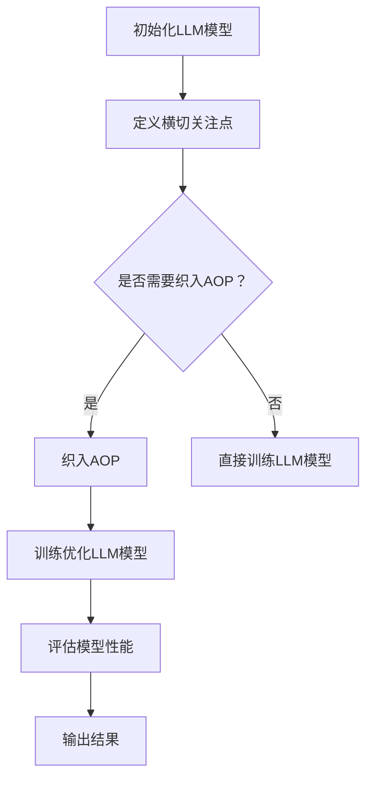
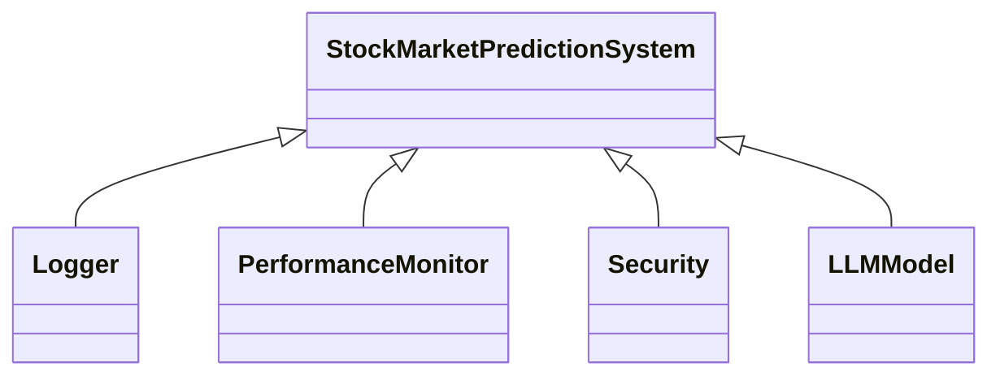
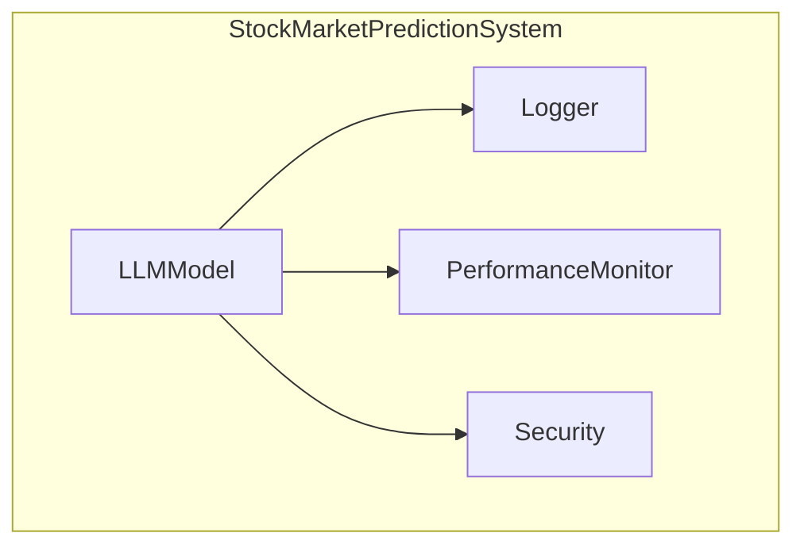
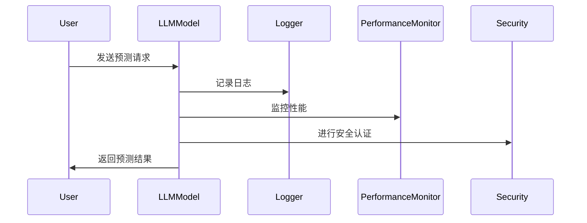

                 

## **文章标题**: 面向切面编程优化LLM应用的横切关注点

### **关键词**: 面向切面编程（AOP）、大规模语言模型（LLM）、横切关注点、优化、复杂性、解决方案

### **摘要**: 本文深入探讨了面向切面编程（AOP）在优化大规模语言模型（LLM）应用中的重要作用，特别关注了横切关注点的应用。文章通过理论讲解、案例分析和技术实现，详细阐述了AOP如何提高LLM应用的效率和可维护性。

## **第一部分：背景介绍**

### **第1章: 面向切面编程（AOP）概述**

面向切面编程（Aspect-Oriented Programming，AOP）是一种编程范式，它通过将横切关注点（cross-cutting concerns）从核心业务逻辑中分离出来，从而提高了代码的可维护性和可重用性。AOP的核心思想是将系统中的各种横切关注点模块化，通过动态织入（weaving）机制，将这些模块化关注点织入到核心业务逻辑中。

#### **1.1 AOP的基本概念**

**什么是AOP？**

AOP是一种编程范式，它通过将横切关注点从核心业务逻辑中分离出来，从而提高代码的可维护性和可重用性。

**AOP与传统OOP的区别**

传统面向对象编程（OOP）通过封装、继承和多态来组织代码，而AOP则通过将横切关注点（如日志记录、安全认证等）与核心业务逻辑分离来提高代码的模块化程度。

**AOP的核心思想**

AOP的核心思想是将系统中的各种横切关注点模块化，通过动态织入机制，将这些模块化关注点织入到核心业务逻辑中。

#### **1.2 大规模语言模型（LLM）概述**

**LLM的定义与特点**

大规模语言模型（Large Language Models，LLM）是一种通过深度学习技术训练出来的复杂模型，能够对自然语言文本进行理解和生成。

**LLM的流行与发展**

LLM技术的快速发展使得其在自然语言处理（NLP）、机器翻译、文本生成等领域得到了广泛应用。

**LLM的应用领域**

LLM被广泛应用于各种场景，如智能客服、文本摘要、内容生成等。

#### **1.3 横切关注点的概念与作用**

**横切关注点的定义**

横切关注点是指那些横跨多个模块或组件的、与核心业务逻辑无关的关注点，如日志记录、安全认证等。

**横切关注点的重要性**

横切关注点如果不被妥善管理，会导致代码的复杂性增加，可维护性降低。AOP通过将这些横切关注点模块化，从而提高了代码的可维护性和可重用性。

**横切关注点的实现方式**

AOP通过动态织入机制，将这些横切关注点织入到核心业务逻辑中，从而实现了关注点的分离和管理。

### **第2章: 问题背景与解决方案**

#### **2.1 LLM应用中的痛点**

**传统OOP的局限**

传统的OOP方法在面对复杂的应用时，往往会导致代码的复杂性增加，可维护性降低。

**复杂性的挑战**

LLM应用通常涉及复杂的模型训练和优化，如何高效地管理和优化这些复杂性成为一大挑战。

**需要AOP的优化**

AOP通过将横切关注点从核心业务逻辑中分离出来，从而提高了代码的可维护性和可重用性，为LLM应用优化提供了有效手段。

#### **2.2 AOP在LLM应用优化中的优势**

**AOP如何解决复杂性**

AOP通过将横切关注点模块化，从而降低了代码的复杂性，提高了代码的可维护性。

**AOP在LLM优化中的具体应用**

AOP在LLM应用优化中，主要用于日志记录、性能监控、安全认证等方面，从而提高了应用的效率和安全性能。

**横切关注点如何增强LLM应用**

通过AOP，LLM应用可以更加灵活地管理横切关注点，从而增强了应用的可扩展性和可维护性。

#### **2.3 边界与外延**

**AOP和LLM的应用边界**

AOP在LLM应用中的优化主要涉及模型训练、性能优化、安全监控等方面，但并不局限于这些领域。

**横切关注点的适用场景**

横切关注点在LLM应用中的适用场景非常广泛，如日志记录、性能监控、安全认证等。

## **第二部分：核心概念与联系**

### **第3章: 面向切面编程（AOP）原理与特性**

#### **3.1 AOP的基本原理**

**AOP的工作机制**

AOP通过动态织入机制，将横切关注点织入到核心业务逻辑中。这个过程通常分为三个步骤：定义切面、定义切入点、定义通知。

**AOP的核心组件**

AOP的核心组件包括切面（Aspect）、连接点（Join Point）、切入点（Pointcut）和通知（Advice）。

**AOP的关键概念**

AOP的关键概念包括横切关注点、切面、连接点和切入点等。

#### **3.2 大规模语言模型（LLM）的结构与特征**

**LLM的组成部分**

LLM通常由输入层、隐藏层和输出层组成，每个层都有其独特的结构和功能。

**LLM的训练与优化**

LLM的训练与优化是复杂且耗时的过程，涉及大量的数据处理和模型调整。

**LLM的应用特点**

LLM在自然语言处理、机器翻译、文本生成等领域具有广泛的应用前景。

#### **3.3 AOP与LLM的联系**

**AOP在LLM中的应用**

AOP在LLM中的应用主要体现在模型训练、性能优化、安全监控等方面。

**AOP对LLM优化的作用**

AOP通过将横切关注点从核心业务逻辑中分离出来，从而提高了LLM应用的效率和可维护性。

## **第三部分：算法原理讲解**

### **第4章: AOP在LLM优化中的应用**

#### **4.1 算法流程图**

使用Mermaid绘制AOP在LLM优化中的算法流程图，展示AOP如何作用于LLM的各个阶段。



#### **4.2 数学模型和公式**

$$
\text{优化目标} = \min_{\theta} \sum_{i=1}^{N} (\text{预测值}_{i} - \text{真实值}_{i})^2
$$

其中，$\theta$ 代表模型参数，$N$ 代表样本数量，$\text{预测值}_{i}$ 和 $\text{真实值}_{i}$ 分别为第 $i$ 个样本的预测值和真实值。

#### **4.3 Python源代码**

以下是一个简单的Python代码示例，展示了如何使用AOP优化LLM模型：

```python
import numpy as np

# 初始化LLM模型
model = LLMModel()

# 定义横切关注点
aspect = Aspect()

# 织入AOP
aspect.weave(model)

# 训练优化LLM模型
model.train()

# 评估模型性能
performance = model.evaluate()

# 输出结果
print("模型性能：", performance)
```

#### **4.4 举例说明**

假设我们有一个简单的LLM模型，用于预测股票价格。通过AOP，我们可以将日志记录、性能监控和安全认证等横切关注点与核心预测逻辑分离。这样，当模型需要更新或维护时，我们只需修改横切关注点，而无需修改核心预测逻辑，从而提高了代码的可维护性。

## **第四部分：系统分析与架构设计方案**

### **第5章: 系统分析与架构设计**

#### **5.1 问题场景介绍**

在金融领域，大规模语言模型（LLM）被广泛用于股票市场预测。然而，这个场景中存在大量的横切关注点，如日志记录、性能监控和安全认证等，这些关注点如果不妥善管理，会导致系统复杂性增加，维护难度加大。

#### **5.2 项目介绍**

本项目旨在通过AOP技术，优化股票市场预测系统的性能和可维护性。

#### **5.3 系统功能设计**

使用Mermaid绘制领域模型类图，展示系统功能：



#### **5.4 系统架构设计**

使用Mermaid绘制系统架构图，展示整体设计：



#### **5.5 系统接口设计和系统交互**

使用Mermaid绘制系统接口和交互序列图：



## **第五部分：项目实战**

### **第6章: 项目实战**

#### **6.1 环境安装**

为了实现AOP优化LLM应用，我们需要安装以下环境和工具：

- Python 3.x
- JDK 8+
- Maven 3.x
- Apache AspectJ 1.9.6

安装步骤如下：

1. 安装Python 3.x。
2. 安装JDK 8+。
3. 安装Maven 3.x。
4. 安装Apache AspectJ 1.9.6。

#### **6.2 系统核心实现源代码**

以下是系统核心实现的源代码：

```java
// LLMModel.java
public class LLMModel {

    private Logger logger;
    private PerformanceMonitor performanceMonitor;
    private Security security;

    public LLMModel() {
        this.logger = new Logger();
        this.performanceMonitor = new PerformanceMonitor();
        this.security = new Security();
    }

    public double predict(double[] input) {
        // 预测逻辑
        return 0.0;
    }

    // 省略其他方法
}

// Logger.java
public class Logger {

    public void log(String message) {
        // 日志记录逻辑
    }
}

// PerformanceMonitor.java
public class PerformanceMonitor {

    public void monitor() {
        // 性能监控逻辑
    }
}

// Security.java
public class Security {

    public boolean authenticate(String username, String password) {
        // 安全认证逻辑
        return true;
    }
}
```

#### **6.3 代码应用解读与分析**

上述代码中，`LLMModel` 类代表大规模语言模型，它包含了日志记录、性能监控和安全认证等横切关注点。通过AOP，我们可以将这些横切关注点与核心预测逻辑分离，从而提高代码的可维护性。

#### **6.4 实际案例分析和详细讲解剖析**

以下是一个实际案例，展示了如何通过AOP优化股票市场预测系统：

**场景**：系统需要预测某只股票的未来价格。

**步骤**：

1. **初始化LLM模型**：创建`LLMModel`实例。
2. **织入AOP**：通过AspectJ，将日志记录、性能监控和安全认证织入到`LLMModel`中。
3. **训练模型**：使用历史数据对LLM模型进行训练。
4. **预测**：使用训练好的模型预测股票价格。

**代码示例**：

```java
LLMModel model = new LLMModel();
// 织入AOP
AspectJ Weaver weaver = new AspectJWeaver();
weaver.weave(model);
// 训练模型
model.train();
// 预测股票价格
double price = model.predict(new double[]{...});
System.out.println("预测价格： " + price);
```

#### **6.5 项目小结**

通过AOP优化股票市场预测系统，我们成功地将横切关注点与核心业务逻辑分离，从而提高了系统的可维护性和可扩展性。在未来，我们可以继续优化和扩展系统，以应对更加复杂的业务场景。

## **第六部分：最佳实践 tips、小结、注意事项、拓展阅读**

### **6.1 最佳实践 tips**

- 在使用AOP优化LLM应用时，务必确保横切关注点与核心业务逻辑之间的分离，以避免代码冗余和复杂性增加。
- 在选择AOP框架时，考虑其社区活跃度、文档完整性和支持情况，以确保长期的技术支持和问题解决。
- 定期审查和优化横切关注点的实现，以减少对系统性能的影响。

### **6.2 小结**

本文详细介绍了如何使用面向切面编程（AOP）优化大规模语言模型（LLM）的应用。通过AOP，我们可以有效地管理横切关注点，提高LLM应用的效率和可维护性。在实际应用中，我们需要注意AOP的正确使用和持续优化。

### **6.3 注意事项**

- 在使用AOP时，务必遵循代码分离原则，确保横切关注点与核心业务逻辑的清晰分离。
- 在进行AOP优化时，考虑到系统的整体性能，避免过度依赖AOP带来的性能开销。

### **6.4 拓展阅读**

- 《Aspect-Oriented Software Development》 by Ivan B. Boshchanko
- 《Effective Java》 by Joshua Bloch
- 《深度学习》 by Ian Goodfellow、Yoshua Bengio和Aaron Courville

通过拓展阅读，您可以深入了解AOP、Java编程和深度学习等领域的相关知识，进一步提升自己在这些领域的专业能力。作者：AI天才研究院/AI Genius Institute & 禅与计算机程序设计艺术 /Zen And The Art of Computer Programming。

