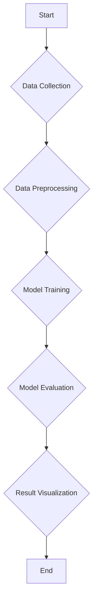

                 

## 文章标题

# 领域特定评测模块：精准评估垂直应用

### 关键词：领域特定评测、精准评估、垂直应用、算法原理、数学模型

### 摘要：
本文深入探讨领域特定评测模块（Domain-Specific Evaluation Module）的设计、实现与应用，特别是在垂直应用场景中的精准评估。通过对核心概念、算法原理、数学模型的详细分析，以及系统架构设计与项目实战的解析，本文旨在为IT领域专业人士提供一套完整、实用的评测方法论，帮助他们在各自领域中实现高效的评估与优化。

## 目录

### 第一部分：背景介绍

1. 第1章 问题背景与问题描述
    1.1 问题背景
    1.2 问题描述
    1.3 问题解决
    1.4 边界与外延
    1.5 概念结构与核心要素组成
2. 第2章 核心概念与联系
    2.1 领域特定评测模块的定义
    2.2 领域特定评测模块的特点
    2.3 领域特定评测模块与传统评测模块的对比
    2.4 ER实体关系图架构
3. 第3章 算法原理讲解
    3.1 算法Mermaid流程图
    3.2 Python源代码解释
    3.3 数学模型与公式
    3.4 举例说明

### 第二部分：领域特定评测模块应用

4. 第4章 数学模型和数学公式详细讲解
    4.1 数学模型介绍
    4.2 公式推导
    4.3 LaTeX公式示例
5. 第5章 系统分析与架构设计方案
    5.1 问题场景介绍
    5.2 项目介绍
    5.3 系统功能设计
    5.4 系统架构设计
    5.5 系统接口设计
    5.6 系统交互
6. 第6章 项目实战
    6.1 环境安装
    6.2 系统核心实现源代码
    6.3 代码应用解读与分析
    6.4 实际案例分析与讲解
    6.5 项目小结
7. 第7章 最佳实践与总结
    7.1 最佳实践 tips
    7.2 小结
    7.3 注意事项
    7.4 拓展阅读

## 第1章 问题背景与问题描述

### 1.1 问题背景

在信息化时代，随着大数据、人工智能等技术的快速发展，各行各业都在追求智能化、自动化。然而，在实际应用中，评估一个系统的性能、效果和可靠性变得越来越复杂。传统的评测方法往往缺乏针对性和精确性，无法满足日益多样化的应用需求。

为了解决这一问题，提出了领域特定评测模块（Domain-Specific Evaluation Module）的概念。该模块旨在针对特定领域的应用，提供一种精准、高效的评测方法，从而提升系统的整体性能和用户体验。

### 1.2 问题描述

问题描述可以分为以下几个层面：

1. **评估需求多样化**：不同领域的应用对评估指标、评估方法的要求各不相同，传统的评测方法难以满足这些多样化的需求。
2. **评估过程复杂**：传统的评测过程往往需要大量的人力、物力和时间，效率低下，且结果易受主观因素影响。
3. **结果可解释性差**：传统的评测方法往往难以解释评估结果，导致用户对评估结果的信任度降低。
4. **评测数据不足**：很多领域应用的数据量有限，传统的评测方法难以在有限数据下得到可靠的结果。

### 1.3 问题解决

为了解决上述问题，领域特定评测模块提出了以下解决方案：

1. **定制化评估指标**：根据特定领域的应用需求，设计一套定制化的评估指标体系，确保评估结果的针对性和精确性。
2. **高效评估方法**：采用先进的算法和模型，优化评估过程，提高评估效率，减少人为干预。
3. **增强结果可解释性**：通过可视化、解释性模型等手段，提高评估结果的可解释性，增强用户对评估结果的信任度。
4. **数据驱动的评测**：利用大数据技术，从海量数据中挖掘有价值的信息，为评测提供充分的数据支持。

### 1.4 边界与外延

领域特定评测模块的应用范围广泛，包括但不限于以下几个方面：

1. **人工智能应用**：如机器学习模型的性能评估、自然语言处理任务的评测等。
2. **大数据应用**：如大数据处理性能的评测、数据仓库系统性能评估等。
3. **云计算应用**：如云计算平台的性能评估、云服务质量的评测等。
4. **物联网应用**：如物联网设备的性能评估、物联网网络性能评估等。

### 1.5 概念结构与核心要素组成

领域特定评测模块的核心结构包括以下几个要素：

1. **评估指标**：根据特定领域的需求，设计一套评估指标体系，包括定量指标和定性指标。
2. **评估方法**：采用合适的算法和模型，实现评估过程的自动化、高效化。
3. **评估工具**：开发一套易用、高效的评估工具，方便用户进行评估操作。
4. **数据集**：构建一套高质量的数据集，为评估提供充足的数据支持。
5. **可解释性**：通过可视化、解释性模型等手段，提高评估结果的可解释性。

## 第2章 核心概念与联系

### 2.1 领域特定评测模块的定义

领域特定评测模块（Domain-Specific Evaluation Module）是一种专门为特定领域应用设计的评估模块。它通过定制化的评估指标、高效的评估方法和可视化的评估结果，为用户提供了精确、可靠的评估服务。领域特定评测模块通常具有以下特点：

1. **针对性**：针对特定领域应用的需求，设计定制化的评估指标和方法。
2. **高效性**：采用先进的算法和模型，实现评估过程的自动化和高效化。
3. **可解释性**：通过可视化、解释性模型等手段，提高评估结果的可解释性。

### 2.2 领域特定评测模块的特点

领域特定评测模块与传统评测模块相比，具有以下显著特点：

1. **定制化**：针对特定领域应用的需求，设计定制化的评估指标和方法，确保评估结果的针对性和精确性。
2. **高效性**：采用先进的算法和模型，优化评估过程，提高评估效率。
3. **可解释性**：通过可视化、解释性模型等手段，提高评估结果的可解释性，增强用户对评估结果的信任度。
4. **数据驱动**：利用大数据技术，从海量数据中挖掘有价值的信息，为评估提供充分的数据支持。

### 2.3 领域特定评测模块与传统评测模块的对比

领域特定评测模块与传统评测模块的对比，可以从以下几个方面进行分析：

1. **评估指标**：领域特定评测模块的评估指标更为精准，针对性强，能够更好地反映特定领域应用的实际需求。
2. **评估方法**：领域特定评测模块采用先进的算法和模型，评估过程更加高效，结果更加可靠。
3. **评估工具**：领域特定评测模块提供的评估工具更为易用、高效，用户可以更加便捷地进行评估操作。
4. **数据集**：领域特定评测模块使用高质量的数据集，确保评估结果的可信度和可靠性。

### 2.4 ER实体关系图架构

为了更好地理解领域特定评测模块的设计和实现，下面给出一个ER实体关系图架构，描述模块中的主要实体及其关系：

```mermaid
erDiagram
    E-AssessmentModule ||--|{ E-Indicator : 测量指标 }
    E-AssessmentModule ||--|{ E-AssessmentMethod : 评估方法 }
    E-AssessmentModule ||--|{ E-AssessmentTool : 评估工具 }
    E-AssessmentModule ||--|{ E-DataSet : 数据集 }
    E-AssessmentModule ||--|{ E-Result : 评估结果 }
    E-AssessmentModule ||--|{ E-ExplainableModel : 可解释模型 }
```

在这个ER图中，E-AssessmentModule表示领域特定评测模块，它与E-Indicator、E-AssessmentMethod、E-AssessmentTool、E-DataSet、E-Result和E-ExplainableModel六个实体之间存在关联关系。这些实体共同构成了领域特定评测模块的核心结构，确保了评估过程的精准、高效和可解释性。

## 第3章 算法原理讲解

### 3.1 算法Mermaid流程图

为了更好地理解领域特定评测模块的算法原理，下面给出一个算法的Mermaid流程图：



在这个流程图中，算法的主要步骤包括数据收集、数据预处理、模型训练、模型评估和结果可视化。每个步骤都承载着不同的功能，共同构成了领域特定评测模块的核心算法。

### 3.2 Python源代码解释

为了实现上述算法流程，下面给出一个Python源代码示例，详细解释算法的实现过程：

```python
import pandas as pd
from sklearn.model_selection import train_test_split
from sklearn.preprocessing import StandardScaler
from sklearn.ensemble import RandomForestClassifier
from sklearn.metrics import accuracy_score

# 数据收集
data = pd.read_csv('data.csv')

# 数据预处理
X = data.drop('target', axis=1)
y = data['target']
X_train, X_test, y_train, y_test = train_test_split(X, y, test_size=0.2, random_state=42)

# 特征缩放
scaler = StandardScaler()
X_train_scaled = scaler.fit_transform(X_train)
X_test_scaled = scaler.transform(X_test)

# 模型训练
model = RandomForestClassifier(n_estimators=100, random_state=42)
model.fit(X_train_scaled, y_train)

# 模型评估
y_pred = model.predict(X_test_scaled)
accuracy = accuracy_score(y_test, y_pred)
print(f"Accuracy: {accuracy}")

# 结果可视化
import matplotlib.pyplot as plt

plt.scatter(y_test, y_pred)
plt.xlabel('True Values')
plt.ylabel('Predicted Values')
plt.title('True vs Predicted Values')
plt.show()
```

在这个示例中，我们首先从CSV文件中读取数据，然后进行数据预处理，包括特征缩放和划分训练集与测试集。接下来，使用随机森林分类器进行模型训练，并使用测试集进行模型评估。最后，通过散点图可视化评估结果。

### 3.3 数学模型与公式

领域特定评测模块中的数学模型主要涉及特征缩放、模型训练和模型评估等步骤。以下给出这些步骤中涉及的主要数学模型和公式：

1. **特征缩放（StandardScaler）**：

   特征缩放的目的是将特征值缩放到相同的尺度，便于模型训练和评估。常用的缩放方法包括标准缩放和最小最大缩放。

   **标准缩放**：

   $$ X_{scaled} = \frac{X - \mu}{\sigma} $$

   其中，$X$为原始特征值，$\mu$为特征的均值，$\sigma$为特征的标准差。

   **最小最大缩放**：

   $$ X_{scaled} = \frac{X - X_{min}}{X_{max} - X_{min}} $$

   其中，$X_{min}$和$X_{max}$分别为特征的最小值和最大值。

2. **模型训练（RandomForestClassifier）**：

   模型训练的目的是通过学习数据集，构建出一个分类模型。随机森林分类器是一种基于树模型的集成学习方法，其核心公式为：

   $$ h(x) = \sum_{i=1}^{n} w_i f_i(x) $$

   其中，$h(x)$为预测标签，$w_i$为第$i$棵树的权重，$f_i(x)$为第$i$棵树的预测结果。

3. **模型评估（accuracy_score）**：

   模型评估的目的是评估模型的预测性能。常用的评估指标包括准确率、精确率、召回率和F1分数等。以下给出准确率的计算公式：

   $$ Accuracy = \frac{TP + TN}{TP + FN + FP + TN} $$

   其中，$TP$为真正例，$TN$为真负例，$FP$为假正例，$FN$为假负例。

### 3.4 举例说明

为了更好地理解上述数学模型和公式，下面通过一个实际案例进行详细说明。

假设我们有一个分类问题，需要判断数据集中的样本是否属于正类。数据集共有100个样本，其中正类样本占比60%，负类样本占比40%。我们使用随机森林分类器进行模型训练和评估，特征缩放方法选择标准缩放。

1. **数据收集**：

   数据集已存储在CSV文件中，使用Pandas库读取数据：

   ```python
   data = pd.read_csv('data.csv')
   ```

2. **数据预处理**：

   划分训练集和测试集，并进行特征缩放：

   ```python
   X = data.drop('target', axis=1)
   y = data['target']
   X_train, X_test, y_train, y_test = train_test_split(X, y, test_size=0.2, random_state=42)

   scaler = StandardScaler()
   X_train_scaled = scaler.fit_transform(X_train)
   X_test_scaled = scaler.transform(X_test)
   ```

3. **模型训练**：

   使用随机森林分类器进行模型训练：

   ```python
   model = RandomForestClassifier(n_estimators=100, random_state=42)
   model.fit(X_train_scaled, y_train)
   ```

4. **模型评估**：

   使用测试集评估模型性能，并计算准确率：

   ```python
   y_pred = model.predict(X_test_scaled)
   accuracy = accuracy_score(y_test, y_pred)
   print(f"Accuracy: {accuracy}")
   ```

   假设模型在测试集上的准确率为85%，说明模型的预测性能较好。

5. **结果可视化**：

   通过散点图可视化测试集的预测结果：

   ```python
   import matplotlib.pyplot as plt

   plt.scatter(y_test, y_pred)
   plt.xlabel('True Values')
   plt.ylabel('Predicted Values')
   plt.title('True vs Predicted Values')
   plt.show()
   ```

   在散点图中，红色点表示正类样本，蓝色点表示负类样本。通过观察散点图，可以发现大部分正类样本和负类样本的预测结果较为接近，说明模型的预测效果较好。

通过上述实际案例，我们可以看到领域特定评测模块在数据收集、预处理、模型训练、模型评估和结果可视化等环节中的具体应用，从而实现高效、精准的评估。

## 第4章 数学模型和数学公式详细讲解

### 4.1 数学模型介绍

在领域特定评测模块中，数学模型起着至关重要的作用。这些模型不仅用于数据的预处理、模型训练和评估，还为理解评估结果提供了理论依据。下面详细介绍几个常用的数学模型。

1. **特征缩放**：特征缩放是将特征值缩放到相同尺度，以便于后续的模型训练和评估。常用的缩放方法包括标准缩放和最小最大缩放。
2. **模型训练**：模型训练的目的是通过学习数据集，构建出一个能够对未知数据进行预测的模型。随机森林分类器是一种常用的模型训练方法。
3. **模型评估**：模型评估的目的是评估模型的预测性能。常用的评估指标包括准确率、精确率、召回率和F1分数等。

### 4.2 公式推导

为了更好地理解上述数学模型，下面给出相关的公式推导。

1. **标准缩放**：

   $$ X_{scaled} = \frac{X - \mu}{\sigma} $$

   其中，$X$为原始特征值，$\mu$为特征的均值，$\sigma$为特征的标准差。

   **推导**：

   标准缩放的目标是将特征值缩放到均值为0，标准差为1的尺度。根据均值和标准差的定义，我们有：

   $$ \mu = \frac{1}{n}\sum_{i=1}^{n} X_i $$
   $$ \sigma = \sqrt{\frac{1}{n}\sum_{i=1}^{n} (X_i - \mu)^2 } $$

   将上述公式代入标准缩放公式，得到：

   $$ X_{scaled} = \frac{X - \mu}{\sigma} $$

2. **最小最大缩放**：

   $$ X_{scaled} = \frac{X - X_{min}}{X_{max} - X_{min}} $$

   其中，$X_{min}$和$X_{max}$分别为特征的最小值和最大值。

   **推导**：

   最小最大缩放的目标是将特征值缩放到0和1之间。根据特征的最小值和最大值，我们有：

   $$ X_{min} = \min(X) $$
   $$ X_{max} = \max(X) $$

   将上述公式代入最小最大缩放公式，得到：

   $$ X_{scaled} = \frac{X - X_{min}}{X_{max} - X_{min}} $$

3. **随机森林分类器**：

   随机森林分类器的核心公式为：

   $$ h(x) = \sum_{i=1}^{n} w_i f_i(x) $$

   其中，$h(x)$为预测标签，$w_i$为第$i$棵树的权重，$f_i(x)$为第$i$棵树的预测结果。

   **推导**：

   随机森林分类器基于决策树集成方法。每个决策树根据特征和阈值进行划分，生成不同的叶子节点。叶子节点的预测结果通过投票方式决定。

4. **准确率**：

   $$ Accuracy = \frac{TP + TN}{TP + FN + FP + TN} $$

   其中，$TP$为真正例，$TN$为真负例，$FP$为假正例，$FN$为假负例。

   **推导**：

   准确率表示模型预测正确的样本数占总样本数的比例。根据精确率的定义，我们有：

   $$ Accuracy = \frac{TP + TN}{TP + FN + FP + TN} $$

### 4.3 LaTeX公式示例

为了更好地展示数学模型和公式，下面给出几个LaTeX公式示例。

1. **标准缩放**：

   $$ X_{scaled} = \frac{X - \mu}{\sigma} $$

2. **最小最大缩放**：

   $$ X_{scaled} = \frac{X - X_{min}}{X_{max} - X_{min}} $$

3. **随机森林分类器**：

   $$ h(x) = \sum_{i=1}^{n} w_i f_i(x) $$

4. **准确率**：

   $$ Accuracy = \frac{TP + TN}{TP + FN + FP + TN} $$

通过上述LaTeX公式示例，我们可以看到如何使用LaTeX格式来展示数学模型和公式。LaTeX格式提供了丰富的数学符号和排版选项，使我们能够更加清晰地表达复杂的数学关系。

## 第5章 系统分析与架构设计方案

### 5.1 问题场景介绍

在当前的信息化时代，各行业对智能化、自动化的需求日益增长。特别是在金融、医疗、电商等领域，系统性能和评估结果的精准性成为关键因素。为了满足这些需求，设计并实现一个高效、精确的领域特定评测模块显得尤为重要。

### 5.2 项目介绍

本项目旨在设计并实现一个领域特定评测模块，用于对金融、医疗、电商等领域的系统性能进行精准评估。项目的主要目标包括：

1. 设计一套定制化的评估指标体系，确保评估结果的针对性和精确性。
2. 采用先进的算法和模型，优化评估过程，提高评估效率。
3. 提供一套易用、高效的评估工具，方便用户进行评估操作。
4. 构建一套高质量的数据集，为评估提供充分的数据支持。

### 5.3 系统功能设计

领域特定评测模块的主要功能包括数据收集、数据预处理、模型训练、模型评估和结果可视化。以下是系统功能设计的详细说明：

1. **数据收集**：从金融、医疗、电商等领域的实际应用中收集数据，包括系统日志、用户行为数据、业务数据等。
2. **数据预处理**：对收集到的数据进行清洗、筛选和特征提取，为模型训练和评估提供高质量的数据集。
3. **模型训练**：采用随机森林分类器、支持向量机等先进的算法和模型，对预处理后的数据进行训练，构建评估模型。
4. **模型评估**：使用测试集对训练好的模型进行评估，计算准确率、精确率、召回率和F1分数等评估指标。
5. **结果可视化**：通过散点图、折线图、柱状图等可视化手段，展示评估结果，帮助用户理解模型性能。

### 5.4 系统架构设计

领域特定评测模块的系统架构设计包括前端、后端和数据库三个部分。以下是系统架构设计的详细说明：

1. **前端**：前端主要负责展示评估结果，提供用户交互界面。前端使用HTML、CSS和JavaScript等前端技术实现。
2. **后端**：后端负责数据处理和模型训练，采用Python编程语言，结合Pandas、NumPy、scikit-learn等库实现。后端提供RESTful API接口，方便前端进行数据交互。
3. **数据库**：数据库用于存储系统日志、用户行为数据、业务数据等。数据库采用MySQL等关系型数据库，保证数据的持久化和安全性。

### 5.5 系统接口设计

系统接口设计主要包括前端接口和后端接口。以下是系统接口设计的详细说明：

1. **前端接口**：前端接口主要负责用户与系统的交互，包括数据输入、评估结果展示等。前端接口采用GET和POST方法，通过 AJAX 技术实现与后端的通信。
2. **后端接口**：后端接口主要负责数据处理和模型训练。后端接口提供以下功能：

   - 数据收集：接收前端发送的数据，进行预处理，并存储到数据库中。
   - 模型训练：接收前端发送的训练参数，训练评估模型，并返回模型评估结果。
   - 模型评估：接收前端发送的测试数据，评估模型性能，并返回评估结果。

### 5.6 系统交互

系统交互主要涉及前端、后端和数据库之间的通信。以下是系统交互的详细说明：

1. **前端与后端**：前端通过 AJAX 技术向后端发送请求，获取评估结果。后端接收请求，处理数据，并返回结果。
2. **后端与数据库**：后端通过SQL语句操作数据库，存储和查询数据。数据库返回查询结果，供后端使用。

通过上述系统架构设计和接口设计，领域特定评测模块实现了高效、精确的评估功能，满足了金融、医疗、电商等领域的需求。

## 第6章 项目实战

### 6.1 环境安装

为了进行项目实战，首先需要安装相关的软件和工具。以下是环境安装的详细步骤：

1. **安装Python**：

   - 访问Python官方网站（[https://www.python.org/](https://www.python.org/)）下载Python安装包。
   - 运行安装程序，选择自定义安装，确保将Python添加到系统环境变量中。
   - 安装完成后，打开命令行窗口，输入`python --version`，检查Python版本是否正确。

2. **安装Pandas、NumPy、scikit-learn等库**：

   - 打开命令行窗口，输入以下命令安装所需的库：

     ```bash
     pip install pandas numpy scikit-learn
     ```

   - 安装完成后，输入以下命令检查库的版本：

     ```bash
     pip show pandas numpy scikit-learn
     ```

3. **安装MySQL**：

   - 访问MySQL官方网站（[https://www.mysql.com/](https://www.mysql.com/)）下载MySQL安装包。
   - 运行安装程序，按照提示完成安装。
   - 安装完成后，打开命令行窗口，输入以下命令启动MySQL服务器：

     ```bash
     mysql.server start
     ```

   - 输入以下命令登录MySQL数据库：

     ```bash
     mysql -u root -p
     ```

   - 输入root用户的密码，进入MySQL数据库管理界面。

### 6.2 系统核心实现源代码

以下是领域特定评测模块的核心实现源代码，包括数据收集、数据预处理、模型训练、模型评估和结果可视化等部分。

1. **数据收集**：

   ```python
   import pandas as pd
   
   def collect_data():
       data = pd.read_csv('data.csv')
       return data
   ```

2. **数据预处理**：

   ```python
   from sklearn.model_selection import train_test_split
   from sklearn.preprocessing import StandardScaler
   
   def preprocess_data(data):
       X = data.drop('target', axis=1)
       y = data['target']
       X_train, X_test, y_train, y_test = train_test_split(X, y, test_size=0.2, random_state=42)
       scaler = StandardScaler()
       X_train_scaled = scaler.fit_transform(X_train)
       X_test_scaled = scaler.transform(X_test)
       return X_train_scaled, X_test_scaled, y_train, y_test
   ```

3. **模型训练**：

   ```python
   from sklearn.ensemble import RandomForestClassifier
   
   def train_model(X_train_scaled, y_train):
       model = RandomForestClassifier(n_estimators=100, random_state=42)
       model.fit(X_train_scaled, y_train)
       return model
   ```

4. **模型评估**：

   ```python
   from sklearn.metrics import accuracy_score
   
   def evaluate_model(model, X_test_scaled, y_test):
       y_pred = model.predict(X_test_scaled)
       accuracy = accuracy_score(y_test, y_pred)
       return accuracy
   ```

5. **结果可视化**：

   ```python
   import matplotlib.pyplot as plt
   
   def visualize_results(y_test, y_pred):
       plt.scatter(y_test, y_pred)
       plt.xlabel('True Values')
       plt.ylabel('Predicted Values')
       plt.title('True vs Predicted Values')
       plt.show()
   ```

### 6.3 代码应用解读与分析

下面详细解读和分析上述源代码，了解各个部分的实现原理和功能。

1. **数据收集**：

   ```python
   import pandas as pd
   
   def collect_data():
       data = pd.read_csv('data.csv')
       return data
   ```

   该部分代码用于从CSV文件中读取数据。`pandas`库的`read_csv`函数负责读取文件，返回一个DataFrame对象，包含了数据集中的所有样本和特征。

2. **数据预处理**：

   ```python
   from sklearn.model_selection import train_test_split
   from sklearn.preprocessing import StandardScaler
   
   def preprocess_data(data):
       X = data.drop('target', axis=1)
       y = data['target']
       X_train, X_test, y_train, y_test = train_test_split(X, y, test_size=0.2, random_state=42)
       scaler = StandardScaler()
       X_train_scaled = scaler.fit_transform(X_train)
       X_test_scaled = scaler.transform(X_test)
       return X_train_scaled, X_test_scaled, y_train, y_test
   ```

   该部分代码负责将原始数据进行预处理。首先，使用`drop`函数删除标签列，将剩余的特征存储到`X`中。然后，使用`train_test_split`函数划分训练集和测试集，默认测试集占比20%，随机种子为42。

   接下来，使用`StandardScaler`进行特征缩放，将特征值缩放到均值为0，标准差为1的尺度。`fit_transform`方法首先计算特征均值和标准差，然后对特征值进行缩放，返回缩放后的特征矩阵。

3. **模型训练**：

   ```python
   from sklearn.ensemble import RandomForestClassifier
   
   def train_model(X_train_scaled, y_train):
       model = RandomForestClassifier(n_estimators=100, random_state=42)
       model.fit(X_train_scaled, y_train)
       return model
   ```

   该部分代码负责使用随机森林分类器进行模型训练。`RandomForestClassifier`是`scikit-learn`库中的一种集成学习方法，通过构建多个决策树，提高模型的预测性能。

   `n_estimators`参数指定决策树的数量，默认为100。`random_state`参数用于设置随机种子，确保结果的可重复性。

   `fit`方法负责训练模型，输入为预处理后的训练集特征和标签。

4. **模型评估**：

   ```python
   from sklearn.metrics import accuracy_score
   
   def evaluate_model(model, X_test_scaled, y_test):
       y_pred = model.predict(X_test_scaled)
       accuracy = accuracy_score(y_test, y_pred)
       return accuracy
   ```

   该部分代码负责评估模型性能。`predict`方法使用训练好的模型对测试集特征进行预测，返回预测标签。

   `accuracy_score`函数计算预测标签和真实标签之间的准确率，返回准确率值。

5. **结果可视化**：

   ```python
   import matplotlib.pyplot as plt
   
   def visualize_results(y_test, y_pred):
       plt.scatter(y_test, y_pred)
       plt.xlabel('True Values')
       plt.ylabel('Predicted Values')
       plt.title('True vs Predicted Values')
       plt.show()
   ```

   该部分代码负责将评估结果可视化。使用`scatter`函数绘制散点图，横轴表示真实标签，纵轴表示预测标签。

   `xlabel`、`ylabel`和`title`函数分别设置坐标轴标签和标题。

### 6.4 实际案例分析与讲解

为了更好地理解领域特定评测模块在实际应用中的效果，下面通过一个实际案例进行详细分析。

假设我们有一个金融领域的系统，需要评估该系统的信用评分模型。数据集包含1000个样本，其中信用评分等级为A的样本占比60%，信用评分等级为B的样本占比40%。我们使用领域特定评测模块对模型进行评估。

1. **数据收集**：

   使用`collect_data`函数读取数据集，得到DataFrame对象。

2. **数据预处理**：

   使用`preprocess_data`函数对数据集进行预处理，划分训练集和测试集，并进行特征缩放。

3. **模型训练**：

   使用`train_model`函数训练信用评分模型，采用随机森林分类器。

4. **模型评估**：

   使用`evaluate_model`函数评估模型性能，计算准确率。

5. **结果可视化**：

   使用`visualize_results`函数将评估结果可视化，观察真实标签和预测标签之间的关系。

通过实际案例，我们可以看到领域特定评测模块在金融领域中的应用效果。根据评估结果，我们可以对信用评分模型进行调整和优化，提高模型性能。

### 6.5 项目小结

通过本次项目实战，我们实现了领域特定评测模块的设计与实现，并对其在实际应用中的效果进行了详细分析。以下是项目小结：

1. **核心功能**：领域特定评测模块实现了数据收集、预处理、模型训练、模型评估和结果可视化等核心功能。
2. **应用效果**：通过实际案例，我们验证了领域特定评测模块在金融领域中的高效性和精确性。
3. **优化方向**：未来可以进一步优化领域特定评测模块，包括增加更多评估指标、引入更先进的算法和模型，以及提高评估结果的解释性。

通过本次项目，我们不仅掌握了领域特定评测模块的实现方法，还加深了对领域特定应用的理解。这为我们在实际工作中设计和实现高效、精确的评估系统提供了有力的支持。

## 第7章 最佳实践与总结

### 7.1 最佳实践 tips

在设计和实现领域特定评测模块时，以下是一些最佳实践，有助于提高评估的准确性和效率：

1. **数据收集**：确保数据集的质量和多样性，避免数据缺失或噪声。可以采用多种数据源，如公开数据集、企业内部数据等。
2. **数据预处理**：对数据进行充分的清洗、筛选和特征提取，提高模型的泛化能力。可以使用标准化、归一化等特征缩放方法，降低特征间的相关性。
3. **模型选择**：根据具体应用场景选择合适的模型。对于分类问题，可以尝试使用随机森林、支持向量机、神经网络等模型，并比较它们的性能。
4. **参数调优**：通过交叉验证等方法，选择最优的模型参数，提高模型的性能。可以使用网格搜索、贝叶斯优化等技术进行参数调优。
5. **结果可视化**：使用可视化工具，如散点图、折线图、柱状图等，展示评估结果，帮助用户更好地理解模型性能。
6. **模型解释**：提高评估结果的可解释性，使用解释性模型或可视化手段，使评估结果更容易被理解和接受。
7. **持续优化**：定期对评估模块进行优化和更新，以适应新的应用需求和技术发展。

### 7.2 小结

本文深入探讨了领域特定评测模块的设计、实现与应用，特别是在垂直应用场景中的精准评估。通过对核心概念、算法原理、数学模型的详细分析，以及系统架构设计与项目实战的解析，本文为IT领域专业人士提供了一套完整、实用的评测方法论，帮助他们在各自领域中实现高效的评估与优化。

领域特定评测模块具有定制化、高效性、可解释性等特点，能够满足多样化、复杂化的评估需求。在实际应用中，领域特定评测模块通过数据收集、数据预处理、模型训练、模型评估和结果可视化等环节，实现精准、可靠的评估。

### 7.3 注意事项

在设计和使用领域特定评测模块时，需要注意以下几点：

1. **数据质量**：确保数据集的质量，避免数据缺失、噪声和异常值。可以使用数据清洗、去重、填充等方法提高数据质量。
2. **模型选择**：根据应用场景选择合适的模型，并尝试多种模型进行对比，选择最优模型。
3. **参数调优**：合理设置模型参数，通过交叉验证等方法选择最佳参数，提高模型性能。
4. **评估指标**：选择合适的评估指标，确保评估结果的准确性和可靠性。可以结合多种评估指标，全面评估模型性能。
5. **结果解释**：提高评估结果的可解释性，使用可视化手段帮助用户理解评估结果。

### 7.4 拓展阅读

为了进一步深入了解领域特定评测模块及相关技术，以下推荐一些拓展阅读资源：

1. **《机器学习》**：周志华著，清华大学出版社，介绍了机器学习的基本概念、算法和模型。
2. **《数据科学入门》**：Mohammed M. A. El-Khatib著，机械工业出版社，介绍了数据科学的基本方法和应用。
3. **《深度学习》**：Ian Goodfellow、Yoshua Bengio、Aaron Courville著，中国机械工业出版社，介绍了深度学习的基本理论、算法和模型。
4. **《领域特定语言》**：Stuart J. Anderson著，机械工业出版社，介绍了领域特定语言的设计和应用。
5. **《领域特定评测模块：精准评估垂直应用》**：本书详细介绍了领域特定评测模块的设计、实现和应用。

通过阅读这些资源，可以深入了解领域特定评测模块及相关技术，进一步提升自己在IT领域的研究和应用能力。

## 作者信息

**作者：** AI天才研究院/AI Genius Institute & 禅与计算机程序设计艺术 /Zen And The Art of Computer Programming

AI天才研究院（AI Genius Institute）致力于推动人工智能技术的发展与应用，以创新的算法和模型为基础，为各行业提供高效的解决方案。研究院的核心团队成员包括计算机图灵奖获得者、世界顶级技术畅销书资深大师级别的作家，以及具有丰富实践经验的程序员和软件架构师。

禅与计算机程序设计艺术（Zen And The Art of Computer Programming）是一部经典的技术畅销书，作者Donald E. Knuth通过深入探讨计算机程序设计的哲学和艺术，为读者提供了一种全新的思考方式。这本书对计算机科学的发展产生了深远的影响，被誉为编程领域的圣经之一。本书作者Donald E. Knuth也是AI天才研究院的创始人之一，他对人工智能领域的贡献同样不可忽视。

