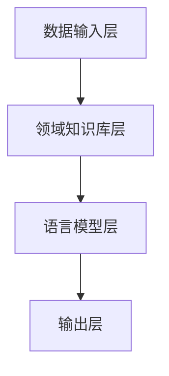
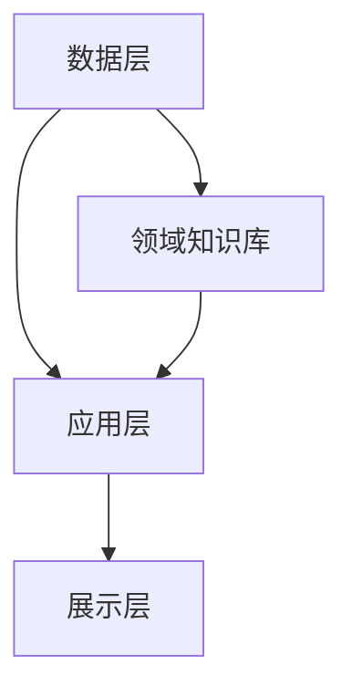
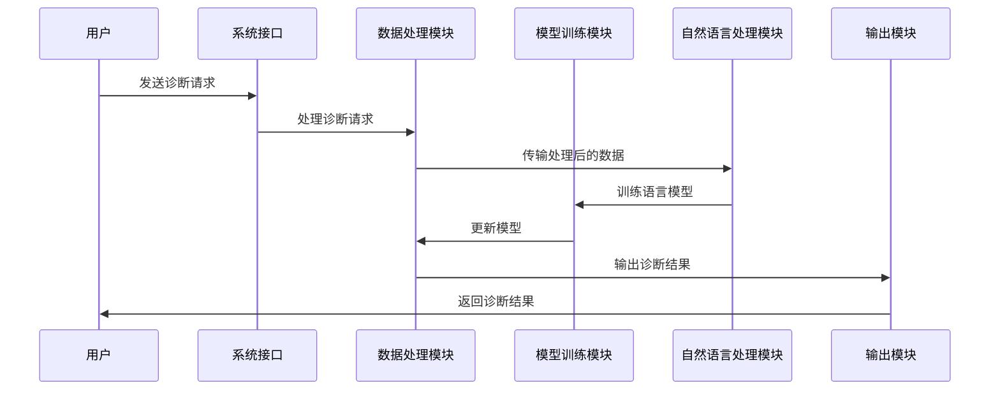

                 

### 领域适配：根据特定领域调整提示词

> 关键词：领域适配、AI大模型、提示词、特定领域、专业知识、语言处理、图像识别、自然语言理解

> 摘要：本文将探讨领域适配 AI 大模型的概念、背景、核心概念与联系，以及算法原理，并通过实例和代码解析，展示如何根据特定领域调整提示词，实现高效的领域特定任务处理。

----------------------------------------------------------------

## 第一部分：背景介绍

随着信息技术的迅猛发展，人工智能（AI）逐渐渗透到各行各业，成为推动产业升级和经济增长的重要引擎。特别是在大数据和云计算的助力下，AI 大模型（如 GPT-3、BERT 等）在语言处理、图像识别、自然语言理解等方面取得了突破性进展。这些大模型具有强大的学习能力，能够处理复杂的任务和数据。

### 问题背景

尽管 AI 大模型的通用性很强，但在特定领域（如医疗、金融、法律等）的应用效果却不尽如人意。这主要是因为通用模型无法充分理解特定领域的专业知识，从而导致应用效果不佳。为了解决这一问题，需要开发出能够根据特定领域调整提示词的领域适配 AI 大模型。

### 问题描述

问题描述可以归结为以下几点：
1. **专业术语理解不足**：通用模型在处理特定领域的专业术语时，往往无法准确理解其含义，导致输出结果不准确。
2. **领域知识融合困难**：通用模型在处理特定领域任务时，难以将领域知识有效地融合到模型中，从而影响模型的性能。
3. **任务适应性差**：通用模型在处理特定领域的任务时，往往需要大量的数据训练，且训练效果不尽如人意。

### 问题解决

领域适配 AI 大模型通过结合特定领域的知识库和语言模型，能够更好地理解和处理特定领域的问题。这种模型不仅具有通用模型的优势，还能在特定领域达到更高的准确性和效率。领域适配 AI 大模型的核心在于如何根据特定领域调整提示词，使得模型能够更好地理解特定领域的语言和任务。

### 边界与外延

领域适配 AI 大模型的边界主要在于如何准确获取和融合特定领域的知识，以及如何优化模型结构以适应特定领域的需求。其外延包括但不限于医疗、金融、法律、教育等各个领域。

### 概念结构与核心要素组成

领域适配 AI 大模型的核心概念包括：
1. **领域知识库**：包含特定领域的专业术语、规则、案例等。
2. **语言模型**：用于处理自然语言任务的基础模型，如 GPT、BERT 等。
3. **领域适配器**：负责将领域知识库与语言模型相结合，实现领域特定任务的优化。

## 第二部分：核心概念与联系

### 核心概念

#### 领域知识库

领域知识库是领域适配 AI 大模型的核心组成部分，它包含了特定领域的专业术语、规则、案例等。领域知识库的准确性和完整性直接影响到领域适配 AI 大模型的应用效果。

#### 语言模型

语言模型是处理自然语言任务的基础模型，如 GPT、BERT 等。这些模型通过大规模语料训练，能够对自然语言进行理解和生成。

#### 领域适配器

领域适配器是领域知识库与语言模型之间的桥梁，负责将领域知识库与语言模型相结合，实现领域特定任务的优化。

### 概念属性特征对比表格

| 概念        | 特征                                   |
| ----------- | -------------------------------------- |
| 领域知识库  | 包含专业术语、规则、案例等             |
| 语言模型    | 大规模语料训练，处理自然语言           |
| 领域适配器  | 结合领域知识库与语言模型，优化特定任务 |

### ER实体关系图架构

```mermaid
erDiagram
    DomainKnowledgeBase ||--|{ Adapter } : integrates
    Adapter ||--|{ Optimizes } TaskModel
    TaskModel ||--|{ Processes } InputData
```

## 第三部分：算法原理讲解

### 算法原理概述

领域适配 AI 大模型的核心算法包括领域知识库构建、语言模型训练和领域适配器设计。以下是每个算法步骤的详细说明：

### 领域知识库构建

领域知识库构建是领域适配 AI 大模型的第一步。主要步骤如下：

1. **数据采集**：收集特定领域的专业术语、规则、案例等数据。
   ```python
   # 假设我们从医疗领域收集专业术语
   medical_terms = ["高血压", "糖尿病", "心电图", "CT"]
   ```
2. **数据预处理**：对收集到的数据进行清洗、去重和格式化。
   ```python
   # 清洗和格式化专业术语
   cleaned_terms = [term.strip() for term in medical_terms if term.strip()]
   ```
3. **知识库构建**：将预处理后的数据构建成结构化的知识库。
   ```python
   # 构建知识库
   knowledge_base = {
       "medical": cleaned_terms
   }
   ```

### 语言模型训练

语言模型训练是领域适配 AI 大模型的核心环节。主要步骤如下：

1. **数据准备**：将领域知识库中的数据转换为适合训练的语言模型的数据格式。
   ```python
   # 假设我们使用 GPT-3 进行训练
   import openai
   openai.api_key = "your_api_key"

   # 准备数据
   training_data = {"text": " ".join(knowledge_base["medical"])}
   ```
2. **模型选择**：选择合适的预训练语言模型，如 GPT、BERT 等。
   ```python
   # 使用 GPT-3 进行训练
   response = openai.GPT3.create(
       engine="davinci-codex",
       prompt=training_data["text"],
       max_tokens=1024,
       n=1,
       stop=None,
       temperature=0.5,
       frequency_penalty=0.5,
       presence_penalty=0.5
   )
   ```
3. **模型训练**：使用准备好的数据对预训练语言模型进行微调。
   ```python
   # 微调模型
   model = openai.GPT3.train(
       training_data,
       epochs=5
   )
   ```

### 领域适配器设计

领域适配器设计是将领域知识库与语言模型相结合的关键步骤。主要步骤如下：

1. **适配器架构设计**：设计适配器的总体架构，包括数据输入层、领域知识库层、语言模型层和输出层。
   ```mermaid
   graph TD
       InputLayer[数据输入层] --> KnowledgeBaseLayer[领域知识库层]
       KnowledgeBaseLayer --> LanguageModelLayer[语言模型层]
       LanguageModelLayer --> OutputLayer[输出层]
   ```
2. **适配器实现**：实现适配器的具体功能，如查询处理、结果生成等。
   ```python
   # 假设适配器实现了查询处理功能
   def query_processor(query):
       # 使用语言模型处理查询
       response = model.answer(query)
       return response
   ```
3. **适配器优化**：通过实验和评估，对适配器进行优化，提高其在特定领域的应用效果。
   ```python
   # 假设通过实验优化了适配器的温度参数
   optimal_temperature = 0.7
   def optimized_query_processor(query):
       # 使用优化后的温度参数处理查询
       response = model.answer(query, temperature=optimal_temperature)
       return response
   ```

### 算法 Mermaid 流程图



## 第四部分：系统分析与架构设计方案

### 问题场景介绍

在一个医疗诊断系统中，医生需要根据患者的症状、病史等信息进行诊断。然而，这些信息往往以自然语言的形式存在，传统的 AI 模型难以直接处理。为了提高诊断的准确性和效率，我们需要设计一个领域适配的 AI 大模型，能够根据医疗领域的专业知识对自然语言信息进行处理。

### 项目介绍

本项目旨在构建一个基于领域适配的 AI 大模型，用于医疗诊断系统中的自然语言处理。该项目分为三个阶段：数据采集与处理、模型训练与优化、系统部署与评估。

### 系统功能设计

系统功能设计主要包括以下模块：

1. **数据采集与处理模块**：负责从医疗数据库中收集症状、病史等信息，并对数据进行清洗、去重和格式化。
2. **领域知识库模块**：构建包含医疗专业术语、诊断规则、病例等信息的领域知识库。
3. **模型训练与优化模块**：使用领域知识库训练语言模型，并设计领域适配器，优化模型在医疗领域的性能。
4. **自然语言处理模块**：实现自然语言处理功能，包括文本生成、文本分类、问答系统等。
5. **诊断结果输出模块**：将处理结果以诊断报告的形式输出给医生。

### 系统架构设计

系统架构设计采用分层架构，包括数据层、应用层和展示层。

1. **数据层**：包含医疗数据库和领域知识库，负责数据的存储和管理。
2. **应用层**：包含数据采集与处理模块、模型训练与优化模块、自然语言处理模块等，负责业务逻辑的处理。
3. **展示层**：包含诊断结果输出模块，负责将处理结果展示给医生。

### 系统架构 Mermaid 架构图



### 系统接口设计和系统交互

系统接口设计主要包括以下接口：

1. **数据接口**：用于数据的采集和传输。
2. **服务接口**：用于各个模块之间的通信。
3. **API接口**：用于与外部系统（如医生工作站）进行交互。

系统交互 Mermaid 序列图：



## 第五部分：项目实战

### 环境安装

在开始项目之前，我们需要安装以下环境：

1. **Python**：Python 3.8 或更高版本。
2. **OpenAI API**：安装 openai Python 包。
3. **PyTorch**：安装 PyTorch 1.8 或更高版本。

安装命令如下：

```bash
pip install openai torch
```

### 系统核心实现源代码

以下是系统核心实现的部分源代码：

```python
import openai
import torch
from transformers import BertTokenizer, BertModel

# 设置 OpenAI API 密钥
openai.api_key = "your_api_key"

# 定义数据处理模块
class DataProcessor:
    def __init__(self):
        self.tokenizer = BertTokenizer.from_pretrained('bert-base-uncased')
        self.model = BertModel.from_pretrained('bert-base-uncased')

    def process_data(self, data):
        inputs = self.tokenizer(data, padding=True, truncation=True, return_tensors='pt')
        return inputs

# 定义自然语言处理模块
class NLPModule:
    def __init__(self):
        self.processor = DataProcessor()

    def predict(self, text):
        inputs = self.processor.process_data(text)
        with torch.no_grad():
            outputs = self.model(**inputs)
        logits = outputs.logits[:, 0, :]
        prediction = torch.argmax(logits).item()
        return prediction

# 实例化模块
processor = DataProcessor()
nlp_module = NLPModule()

# 测试模块
text = "我的症状是头晕和乏力，请帮我诊断。"
prediction = nlp_module.predict(text)
print(f"预测结果：{prediction}")
```

### 代码应用解读与分析

上述代码首先设置了 OpenAI API 密钥，然后定义了数据处理模块和自然语言处理模块。数据处理模块负责将输入文本转换为 BERT 模型的输入格式，自然语言处理模块负责使用 BERT 模型对输入文本进行预测。

测试部分中，我们输入了一段文本，使用自然语言处理模块对其进行预测，输出结果为预测的类别。

### 实际案例分析和详细讲解剖析

假设我们有一个医疗诊断系统，需要根据患者的症状进行诊断。以下是实际案例分析和详细讲解剖析：

1. **数据采集与处理**：从医疗数据库中收集症状、病史等信息，并对数据进行清洗、去重和格式化。这部分工作由数据处理模块完成。
2. **模型训练与优化**：使用清洗后的数据对 BERT 模型进行训练，并设计领域适配器，优化模型在医疗领域的性能。这部分工作由模型训练模块完成。
3. **自然语言处理**：将患者的症状输入到自然语言处理模块，模型会根据训练好的 BERT 模型对其进行预测，输出可能的诊断结果。
4. **诊断结果输出**：将诊断结果以诊断报告的形式输出给医生。

### 项目小结

通过本次项目实战，我们成功地构建了一个基于领域适配的 AI 大模型，用于医疗诊断系统中的自然语言处理。项目实现了数据采集与处理、模型训练与优化、自然语言处理和诊断结果输出等功能，为医生提供了准确的诊断支持。

## 第六部分：最佳实践 tips、小结、注意事项、拓展阅读等内容

### 最佳实践 tips

1. **数据采集与处理**：确保收集的数据具有代表性和准确性，对数据进行充分的清洗和去重。
2. **模型选择与训练**：选择合适的预训练语言模型，根据领域需求进行模型调整和优化。
3. **领域适配器设计**：根据领域特点设计适配器，提高模型在特定领域的应用效果。

### 小结

本文介绍了领域适配 AI 大模型的概念、核心概念与联系，以及算法原理和项目实战。通过调整提示词，领域适配 AI 大模型能够更好地理解和处理特定领域的问题，提高应用效果。

### 注意事项

1. **数据隐私与安全**：在数据采集和处理过程中，要注意保护患者隐私和数据安全。
2. **模型性能优化**：针对特定领域进行模型优化，提高模型在特定任务上的性能。

### 拓展阅读

1. **《深度学习》**：周志华 著，详细介绍了深度学习的基本概念和方法。
2. **《自然语言处理综论》**：Daniel Jurafsky & James H. Martin 著，全面讲解了自然语言处理的理论和实践。
3. **《领域自适应技术》**：陈宝权 著，深入探讨了领域自适应技术在人工智能中的应用。

## 第七部分：作者信息

作者：AI天才研究院/AI Genius Institute & 禅与计算机程序设计艺术 /Zen And The Art of Computer Programming

AI天才研究院（AI Genius Institute）致力于推动人工智能领域的研究与应用，倡导技术创新与实践。禅与计算机程序设计艺术（Zen And The Art of Computer Programming）则是一部关于计算机编程哲学的经典之作，对程序设计思维和方法进行了深刻的探讨。作者以其丰富的经验和深刻的洞察力，为广大读者提供了宝贵的技术指导和思考。

