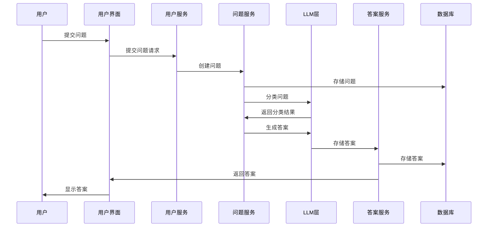

                 

### 1.3 领域驱动设计与面向对象设计的关系

#### 1.3.1 背景介绍
领域驱动设计（DDD）和面向对象设计（Object-Oriented Design，OOD）都是软件开发中的重要方法论。面向对象设计关注的是如何将现实世界的实体抽象为对象，并通过类和对象的关系来组织代码。而领域驱动设计则更侧重于理解和表达业务领域，通过构建领域模型来驱动软件系统的设计和开发。

#### 1.3.2 关系分析
DDD与OOD之间的关系可以看作是特殊与一般的关系。OOD提供了构建软件系统的一种通用方法，而DDD则是在OOD的基础上，为解决特定领域（如企业级应用）的复杂性问题提供了一套更加具体和实用的方法论。

#### 1.3.2.1 对比表格

| 特征 | 领域驱动设计（DDD） | 面向对象设计（OOD） |
| ---- | ------------------- | ------------------- |
| 核心关注点 | 业务领域模型 | 对象及其关系 |
| 设计过程 | 领域驱动 | 类图驱动 |
| 应用场景 | 复杂的业务系统 | 大多数软件系统 |
| 术语 | 实体、值对象、领域服务、领域事件、命令 | 类、对象、继承、封装、多态 |

#### 1.3.2.2 ER图架构

使用Mermaid语法绘制一个简单的ER图来表示DDD和OOD的关系：

```mermaid
erDiagram
  Class -->|领域驱动设计| Entity : 领域驱动设计的核心概念
  Class -->|面向对象设计| Object : 面向对象设计的基础
  Entity ||--|| Object : DDD中的实体与OOD中的对象之间的对应关系
  Service ||--|| Service : DDD和OOD中的服务组件
```

在ER图中，"Class" 代表类的概念，"Entity" 代表DDD中的实体，"Object" 代表OOD中的对象，"Service" 代表领域服务和对象服务。ER图清晰地展示了DDD和OOD在核心概念和服务组件上的对应关系。

#### 1.3.3 优势与限制

##### 1.3.3.1 领域驱动设计的优势
- **更好的领域理解**：DDD通过聚焦业务领域，使团队能够更深入地理解业务需求，从而设计出更符合实际需求的系统。
- **更高的可维护性**：DDD强调将业务规则编码到领域服务中，减少了业务规则与系统代码之间的耦合，提高了系统的可维护性。
- **更好的可扩展性**：DDD通过分层和模块化设计，使得系统在面对业务变化时能够更容易地进行扩展。

##### 1.3.3.2 领域驱动设计的限制
- **学习曲线**：DDD引入了多个新的概念和术语，对于新手来说可能需要一定时间来适应。
- **额外设计工作**：DDD要求团队在项目早期就投入大量时间来设计和构建领域模型，这可能会增加项目初期的工作量。

##### 1.3.3.3 面向对象设计的优势
- **通用性**：OOD适用于各种类型的软件系统，不仅仅是企业级应用。
- **易于理解**：OOD的基本概念和术语相对简单，易于被新手快速掌握。
- **灵活性强**：OOD提供了丰富的设计模式，使得系统能够在需求变化时保持灵活性。

##### 1.3.3.4 面向对象设计的限制
- **业务领域理解不足**：OOD主要关注对象和类的组织，可能无法充分表达复杂的业务逻辑。
- **高耦合性**：面向对象设计可能会导致高耦合，使得系统在需求变化时难以维护。

通过上述对比和优势分析，我们可以看到，DDD和OOD各有其特点和适用场景。在复杂业务系统的开发中，DDD能够提供更好的领域理解和更高的可维护性；而在通用软件开发中，OOD的灵活性和易于理解的特点使其更为适用。在实际开发过程中，团队可以根据项目的具体需求和特点，选择合适的开发方法或两者结合使用。

### 1.4 领域驱动设计的目标与优势

#### 1.4.1 目标

领域驱动设计的核心目标是提高软件系统的可维护性和可扩展性，通过深刻理解业务领域，构建出符合业务需求的软件系统。具体目标包括：

- **提升团队对业务领域的理解**：通过构建领域模型，团队能够更直观地看到业务逻辑，从而更好地理解和预测业务需求的变化。
- **减少系统复杂性**：通过将业务逻辑封装在领域服务中，可以减少系统中的耦合，使得系统更加模块化和可维护。
- **提高系统的可扩展性**：领域驱动设计鼓励采用分层和模块化设计，使得系统能够在面对业务变化时更容易进行扩展。

#### 1.4.2 优势

领域驱动设计具有多方面的优势，使得其在复杂业务系统的开发中特别有效：

- **更好的业务领域理解**：DDD通过强调业务领域模型，使得团队能够深入理解业务逻辑，从而开发出更符合业务需求的系统。
- **高内聚、低耦合**：DDD鼓励将业务规则封装在领域服务中，减少了不同模块之间的耦合，提高了系统的模块化程度。
- **可扩展性**：通过分层和模块化设计，DDD使得系统能够在面对业务需求变化时保持灵活，可以方便地增加或修改系统功能。
- **可维护性**：领域驱动设计通过明确的领域模型，使得代码易于理解和修改，降低了维护成本。

#### 1.4.3 总结

领域驱动设计（DDD）通过聚焦业务领域，提供了一种理解和表达复杂业务需求的方法。其核心目标是通过构建领域模型，提升软件系统的可维护性和可扩展性。DDD的优势在于其强调业务领域理解、高内聚、低耦合以及系统的可扩展性，使其在复杂业务系统的开发中具有显著的应用价值。

### 1.5 DDD的演进历史与应用案例

#### 1.5.1 演进历史

领域驱动设计（DDD）并非一蹴而就，而是经历了多年的发展和演变。其起源可以追溯到2000年代初，由Eric Evans在其同名书籍《领域驱动设计：软件核心复杂性应对策略》（Domain-Driven Design: Tackling Complexity in the Heart of Software）中首次系统地提出。

- **早期探索**：在20世纪90年代，面向对象设计（OOD）和设计模式得到了广泛的应用。然而，随着企业级应用复杂性的增加，开发者开始发现，传统的OOD方法在处理复杂的业务逻辑时存在一定的局限性。
- **Eric Evans的贡献**：2003年，Eric Evans的《领域驱动设计》一书出版，系统地提出了DDD的概念和方法。这本书为开发者提供了一套全新的思路，用于应对复杂业务系统的设计问题。
- **持续发展**：随着技术的进步和实际应用经验的积累，DDD不断发展和完善。现在，DDD已经成为软件开发领域中的重要方法论，被广泛应用于各种类型的项目中。

#### 1.5.2 应用案例

领域驱动设计在实际项目中取得了显著的成功，以下是一些典型的应用案例：

- **金融系统**：在金融行业的软件开发中，DDD被广泛应用于交易平台、风险管理系统和账户管理等领域。这些系统通常涉及复杂的业务规则和大量的数据操作，DDD能够帮助开发者更好地理解和处理这些复杂性。
- **电子商务**：电子商务平台需要处理大量的订单、库存和用户数据，DDD能够通过领域模型将这些复杂的业务逻辑封装起来，使得系统更加模块化和易于维护。
- **物流管理**：物流管理系统涉及到物流网络规划、货物运输跟踪和库存管理等多个方面。DDD能够帮助团队构建出高效的领域模型，从而更好地处理这些业务流程。

#### 1.5.3 总结

领域驱动设计（DDD）自2000年代初提出以来，经历了多年的发展和演变，已经成为软件开发领域中的重要方法论。其在复杂业务系统的设计与应用中表现出显著的优势，通过构建领域模型，能够帮助开发者更好地理解和处理复杂的业务逻辑。DDD在金融、电子商务和物流管理等领域得到了广泛的应用，并取得了显著的成功。未来，随着技术的发展和业务需求的不断变化，DDD将继续在软件开发领域发挥重要作用。

### 1.6 DDD的核心概念详解

领域驱动设计（DDD）包含了一系列核心概念，这些概念构成了DDD的理论基础，并指导着软件系统的设计和开发。以下是DDD中的几个核心概念及其详细解释：

#### 1.6.1 领域模型

领域模型是DDD的核心，它是对业务领域核心概念和关系的抽象表示。领域模型不仅包含了业务实体和值对象，还包括领域服务、领域事件和聚合等。领域模型的目标是使得团队能够直观地理解和表达业务领域，从而更好地构建软件系统。

- **业务实体**：业务实体是领域模型中的核心概念，它们具有唯一的标识，并且可以独立存在。例如，在一个电子商务平台中，用户、商品和订单等都可以被视为业务实体。
- **值对象**：值对象是领域模型中的数据对象，它们没有唯一的标识，但具有确定的值。例如，订单中的商品数量、价格等都可以被视为值对象。
- **领域服务**：领域服务是处理业务逻辑的组件，它们不直接映射到具体的业务实体或值对象。例如，订单的创建、支付和发货等操作都可以由领域服务来完成。

#### 1.6.2 实体与值对象

实体和值对象是领域模型中的基本构建块，它们在DDD中具有明确的定义和作用。

- **实体**：实体具有唯一的标识，并且可以在系统中独立存在。实体通常表示业务中的主要对象，如用户、产品、订单等。实体的关键属性通常用于唯一标识一个实体实例。
- **值对象**：值对象不具唯一标识，但具有确定的值。值对象通常表示业务中的简单数据元素，如日期、数量、价格等。值对象用于封装业务中的特定数据，例如，订单中的商品数量、单价等。

#### 1.6.3 领域服务

领域服务是处理业务逻辑的核心组件，它们不直接映射到具体的实体或值对象。领域服务的目的是封装业务逻辑，使得业务规则与系统的其他部分解耦。领域服务通常通过命令和处理领域事件来实现业务操作。

- **命令**：命令是发起领域服务操作的请求。例如，创建订单、支付订单等操作都可以通过命令来触发。
- **领域事件**：领域事件是领域模型中的重要概念，它们描述了领域中的变化。领域事件可以是用户操作的结果，也可以是系统内部状态的改变。例如，订单创建成功、支付完成等都可以被视为领域事件。

#### 1.6.4 领域事件与命令

领域事件和命令是DDD中用于处理业务逻辑的重要工具。它们的关系可以理解为请求与响应的关系。

- **命令**：命令是发起领域服务操作的请求。例如，创建订单、支付订单等操作都可以通过命令来触发。
- **领域事件**：领域事件是领域模型中的重要概念，它们描述了领域中的变化。领域事件可以是用户操作的结果，也可以是系统内部状态的改变。例如，订单创建成功、支付完成等都可以被视为领域事件。

#### 1.6.5 领域模型的设计原则

在设计领域模型时，需要遵循一系列原则，以确保模型的正确性和可维护性。

- **单一职责原则**：领域服务应该只负责处理一个特定业务逻辑，避免过度的职责耦合。
- **透明性原则**：领域模型应该清晰表达业务逻辑，使得团队能够容易地理解和维护。
- **松耦合原则**：领域模型中的不同组件（如实体、值对象、领域服务）应该保持松耦合，减少依赖关系。
- **领域驱动原则**：设计和开发过程应该以业务领域为核心，确保系统能够灵活应对业务需求的变化。

### 1.7 领域驱动设计的适用场景

领域驱动设计（DDD）适用于多种类型的软件系统，特别是在复杂业务场景中表现尤为突出。以下是一些DDD适用的主要场景：

#### 1.7.1 复杂的业务规则

在许多企业级应用中，业务规则往往非常复杂。例如，金融系统中的贷款审批、交易结算等，电子商务平台中的促销活动、库存管理，物流管理中的订单处理和货物跟踪等。这些业务规则不仅复杂多样，而且容易发生变化。DDD通过领域模型将复杂的业务规则封装在领域服务中，使得系统更加模块化和易于维护。

#### 1.7.2 需求频繁变化的系统

在需求变化频繁的场景中，传统的软件开发方法可能会面临巨大的挑战。DDD通过领域模型提供了一种更好的应对策略。领域模型能够帮助团队更好地理解业务领域，使得系统能够更灵活地应对需求的变化。此外，DDD的分层和模块化设计也使得系统能够更容易地进行扩展和重构。

#### 1.7.3 高度协作的开发团队

DDD需要开发团队具备良好的业务理解能力，因此它特别适用于高度协作的开发团队。通过构建领域模型，团队成员能够更好地了解业务逻辑，从而在设计和开发过程中进行更高效的沟通和协作。

#### 1.7.4 大型分布式系统

在大型分布式系统中，DDD可以帮助团队更好地组织和管理系统的复杂性。通过领域模型，可以将复杂的业务逻辑分解为多个独立的部分，从而降低系统的整体复杂度。此外，DDD的分层设计也使得系统可以更好地应对分布式环境中的各种挑战。

### 1.8 总结

领域驱动设计（DDD）是一种专注于业务领域的软件开发方法论，通过构建领域模型，能够更好地理解和表达复杂的业务需求。DDD的核心概念包括领域模型、实体与值对象、领域服务、领域事件与命令等。DDD适用于复杂业务规则、需求频繁变化的系统、高度协作的开发团队以及大型分布式系统。通过DDD，团队能够构建出更加模块化、可维护和可扩展的软件系统。在未来，随着业务复杂度的增加，DDD将继续在软件开发领域发挥重要作用。

### 第2章：领域驱动设计的基本架构

在上一章中，我们详细介绍了领域驱动设计（DDD）的核心概念。在这一章中，我们将深入探讨DDD的基本架构，包括实体与值对象、领域服务、领域模型以及领域事件与命令。

#### 2.1 实体与值对象

实体和值对象是DDD中两个基本的概念，它们在领域模型中扮演着重要的角色。

##### 2.1.1 实体

实体是领域模型中的核心元素，它们具有唯一的标识，并且可以独立存在。实体通常代表业务中的主要对象，例如用户、产品、订单等。实体的关键属性通常用于唯一标识一个实体实例。

- **唯一标识**：实体的唯一标识是其核心属性之一，它通常是一个不可变属性。例如，在一个用户模型中，用户ID就是一个唯一的标识。
- **生命周期**：实体具有生命周期，它们可以创建、修改和删除。实体的生命周期通常由领域服务来管理。

##### 2.1.2 值对象

值对象是领域模型中的数据对象，它们没有唯一的标识，但具有确定的值。值对象通常表示业务中的简单数据元素，例如日期、数量、价格等。

- **不可变**：值对象通常是不可变的，这意味着它们的值一旦设定，就不能再修改。例如，一个订单中的商品数量是一个值对象，它的值一旦确定，就不能再更改。
- **作用**：值对象用于封装业务中的特定数据，使得领域模型更加清晰和简洁。

#### 2.2 领域服务

领域服务是处理业务逻辑的核心组件，它们不直接映射到具体的实体或值对象。领域服务的目的是封装业务逻辑，使得业务规则与系统的其他部分解耦。

##### 2.2.1 功能

领域服务负责处理业务逻辑，例如订单的创建、支付和发货等操作。领域服务通常通过命令和处理领域事件来实现。

- **命令**：命令是发起领域服务操作的请求。例如，创建订单、支付订单等操作都可以通过命令来触发。
- **领域事件**：领域事件是领域模型中的重要概念，它们描述了领域中的变化。领域事件可以是用户操作的结果，也可以是系统内部状态的改变。例如，订单创建成功、支付完成等都可以被视为领域事件。

##### 2.2.2 作用

领域服务在DDD中的作用至关重要，它们使得业务逻辑与系统其他部分（如用户界面、数据库等）解耦，从而提高了系统的模块化和可维护性。

#### 2.3 领域模型

领域模型是对业务领域核心概念和关系的抽象表示。领域模型不仅包含了业务实体和值对象，还包括领域服务、领域事件和聚合等。

##### 2.3.1 概念

领域模型是DDD的核心概念，它描述了业务领域中的核心概念和关系。领域模型的目标是使得团队能够直观地理解和表达业务领域，从而更好地构建软件系统。

- **核心概念**：领域模型中的核心概念包括实体、值对象、领域服务和领域事件等。
- **关系**：领域模型中的概念通过关系进行连接，这些关系可以是聚合、关联、依赖等。

##### 2.3.2 设计原则

在设计领域模型时，需要遵循一系列原则，以确保模型的正确性和可维护性。

- **单一职责原则**：领域服务应该只负责处理一个特定业务逻辑，避免过度的职责耦合。
- **透明性原则**：领域模型应该清晰表达业务逻辑，使得团队能够容易地理解和维护。
- **松耦合原则**：领域模型中的不同组件（如实体、值对象、领域服务）应该保持松耦合，减少依赖关系。
- **领域驱动原则**：设计和开发过程应该以业务领域为核心，确保系统能够灵活应对业务需求的变化。

#### 2.4 领域事件与命令

领域事件和命令是DDD中用于处理业务逻辑的重要工具。它们的关系可以理解为请求与响应的关系。

##### 2.4.1 命令

命令是发起领域服务操作的请求。例如，创建订单、支付订单等操作都可以通过命令来触发。

- **功能**：命令的功能是触发领域服务执行特定的业务操作。
- **类型**：命令可以是同步命令（立即执行）或异步命令（延迟执行）。

##### 2.4.2 领域事件

领域事件是领域模型中的重要概念，它们描述了领域中的变化。领域事件可以是用户操作的结果，也可以是系统内部状态的改变。

- **功能**：领域事件的功能是通知系统中的其他组件关于领域模型中的变化。
- **类型**：领域事件可以分为内部事件（系统内部状态变化）和外部事件（用户操作结果）。

##### 2.4.3 命令与领域事件的交互

在DDD中，命令和领域事件之间有着紧密的交互关系。命令通常触发领域服务执行业务操作，并产生领域事件来通知系统中的其他组件。

- **命令处理**：当接收到命令时，领域服务会处理该命令并执行相应的业务逻辑。
- **领域事件发布**：在执行业务操作后，领域服务会发布相关的领域事件，以通知系统中的其他组件。

#### 2.5 DDD架构的层次结构

DDD的架构可以分为多个层次，每个层次都有其特定的职责和组件。

##### 2.5.1 核心层

核心层是DDD架构中的最内层，它包含了领域模型中的核心概念，如实体、值对象、领域服务和领域事件。

- **领域模型**：核心层中的领域模型是对业务领域核心概念和关系的抽象表示。
- **领域服务**：核心层中的领域服务负责处理业务逻辑。

##### 2.5.2 应用层

应用层是DDD架构中的中间层，它包含了应用服务、应用界面和用户接口等组件。

- **应用服务**：应用服务是连接核心层和基础设施层的关键组件，负责处理业务逻辑并调用领域服务。
- **应用界面**：应用界面是用户与系统交互的入口，负责接收用户输入并展示系统状态。

##### 2.5.3 基础设施层

基础设施层是DDD架构中的最外层，它包含了数据库、缓存、消息队列等基础设施组件。

- **数据库**：基础设施层中的数据库用于存储领域模型中的数据。
- **缓存**：基础设施层中的缓存用于加速数据访问，提高系统性能。

通过以上分层结构，DDD能够有效地组织和管理系统的复杂性，使得团队能够更好地理解和维护大型软件系统。

#### 2.6 小结

领域驱动设计（DDD）的基本架构包括实体与值对象、领域服务、领域模型以及领域事件与命令。这些核心概念和组件共同构成了DDD的理论基础，指导着软件系统的设计和开发。通过DDD的架构，团队能够更好地理解和表达复杂的业务需求，构建出更加模块化、可维护和可扩展的软件系统。未来，随着业务复杂度的不断增加，DDD将继续在软件开发领域发挥重要作用。

### 2.7 领域服务的设计与实现

领域服务在DDD中扮演着关键角色，它们负责处理业务逻辑，确保系统的模块化和可维护性。在本节中，我们将探讨领域服务的设计原则、具体实现步骤及其在实际项目中的应用。

#### 2.7.1 设计原则

领域服务的设计需要遵循以下原则：

1. **单一职责原则**：每个领域服务应只负责处理一个特定的业务逻辑，避免过度的职责耦合。这有助于提高服务的可维护性和可测试性。

2. **透明性原则**：领域服务的代码应清晰表达其业务逻辑，避免隐藏实现细节。这有助于团队成员更好地理解和维护代码。

3. **松耦合原则**：领域服务应与其他组件保持松耦合，减少依赖关系。这有助于提高系统的灵活性和可扩展性。

4. **领域驱动原则**：领域服务的设计应始终以业务领域为核心，确保系统能够灵活应对业务需求的变化。

#### 2.7.2 实现步骤

实现领域服务通常包括以下步骤：

1. **需求分析**：首先，需要明确领域服务的功能需求和业务规则。这可以通过与业务专家和领域专家的交流来完成。

2. **定义领域服务接口**：根据需求分析的结果，定义领域服务的接口。接口应明确服务提供的功能，以及输入和输出参数。

3. **实现领域服务逻辑**：实现领域服务的具体业务逻辑。领域服务通常包含一系列业务操作，例如订单的创建、支付和发货等。

4. **领域服务测试**：编写单元测试和集成测试，确保领域服务按照预期工作。测试应覆盖所有业务场景，包括正常情况和异常情况。

5. **领域服务部署**：将领域服务部署到生产环境中，并与系统的其他部分（如应用层和基础设施层）进行集成。

#### 2.7.3 实际项目中的应用

以一个在线购物平台为例，我们可以设计以下领域服务：

1. **订单服务**：负责处理订单的创建、支付和发货等操作。订单服务的接口可能包括`createOrder`（创建订单）、`payOrder`（支付订单）和`shipOrder`（发货）等。

2. **库存服务**：负责管理商品库存，确保订单的支付和发货操作不会超出库存限制。库存服务的接口可能包括`checkInventory`（检查库存）和`updateInventory`（更新库存）等。

3. **用户服务**：负责处理用户的注册、登录和权限管理等操作。用户服务的接口可能包括`registerUser`（注册用户）、`loginUser`（登录用户）和`assignRole`（分配角色）等。

在项目实施过程中，这些领域服务将被集成到应用层中，并与数据库、缓存等基础设施层进行交互。通过这种方式，领域服务能够有效地封装业务逻辑，提高系统的模块化和可维护性。

#### 2.7.4 小结

领域服务是DDD中的核心组件，它们负责处理业务逻辑，确保系统的模块化和可维护性。设计领域服务需要遵循单一职责原则、透明性原则、松耦合原则和领域驱动原则。实现领域服务通常包括需求分析、定义接口、实现逻辑、测试和部署等步骤。在实际项目中，领域服务通过封装业务逻辑，提高了系统的灵活性和可扩展性。通过合理设计和使用领域服务，团队能够更好地理解和维护复杂的业务系统。

### 2.8 领域模型的设计方法

领域模型是领域驱动设计（DDD）中的核心概念，它通过抽象和表示业务领域中的核心概念和关系，帮助开发团队更好地理解和构建软件系统。在本节中，我们将详细探讨领域模型的设计方法，包括实体与值对象的设计、领域模型类的划分和常见的领域模型设计模式。

#### 2.8.1 实体与值对象的设计

实体与值对象是领域模型中的基本构建块，它们在模型中扮演着不同的角色。

1. **实体设计**：
   - **唯一标识**：每个实体必须有一个唯一的标识，通常称为ID。这个标识在系统内部是不可变的，用于区分不同的实体实例。
   - **属性**：实体的属性描述了实体的特征。例如，对于用户实体，属性可能包括姓名、电子邮件地址和密码等。
   - **行为**：实体的行为通常通过领域服务来实现。例如，用户实体可能包含注册、登录和修改密码等行为。

2. **值对象设计**：
   - **不可变**：值对象是不可变的，一旦创建，其值就不能再修改。这有助于提高系统的可靠性和可测试性。
   - **属性**：值对象的属性描述了其值，例如，订单中的商品数量、价格等。
   - **行为**：值对象通常不包含行为，因为它们是简单的数据载体。

在设计实体和值对象时，需要遵循以下原则：
- **最小化依赖**：实体和值对象之间的依赖应尽量减少，以保持模型的松耦合。
- **关注业务价值**：模型中的实体和值对象应直接反映业务价值，避免引入非必要的元素。

#### 2.8.2 领域模型类的划分

领域模型类是领域模型中的核心组成部分，它们的划分对模型的质量和可维护性至关重要。

1. **实体类**：实体类代表领域模型中的业务实体，例如用户、产品、订单等。每个实体类应具有清晰的职责和属性。

2. **值对象类**：值对象类代表领域模型中的简单数据元素，例如日期、数量、价格等。值对象类应尽量保持简单，仅包含必要的属性。

3. **领域服务类**：领域服务类代表领域模型中的业务逻辑处理，例如订单创建、支付处理等。这些类通常不直接映射到实体或值对象，而是通过接口与它们进行交互。

4. **聚合根类**：聚合根是领域模型中的一个特殊类，它代表了一个聚合。聚合是领域模型中的一个概念，它将相关的实体和值对象组织在一起，以形成一个统一的逻辑单元。

5. **辅助类**：辅助类提供辅助功能，例如数据转换、异常处理等。这些类通常不直接参与业务逻辑，但有助于提高系统的模块化和可维护性。

#### 2.8.3 常见的领域模型设计模式

在实际项目中，领域模型设计模式可以帮助开发团队更好地组织和管理复杂的业务逻辑。以下是一些常见的领域模型设计模式：

1. **聚合模式**：聚合模式用于将相关的实体和值对象组织在一起，以形成一个统一的逻辑单元。聚合根是聚合模式中的关键概念，它代表了一个聚合的边界。

2. **值对象模式**：值对象模式用于表示领域模型中的简单数据元素。值对象模式强调不可变性，有助于提高系统的可靠性和可测试性。

3. **领域服务模式**：领域服务模式用于封装业务逻辑，确保业务规则与系统的其他部分解耦。领域服务模式通常使用接口和实现分离的方式，以提高代码的可维护性和可扩展性。

4. **实体关系模式**：实体关系模式用于表示领域模型中的实体之间的关系。常见的实体关系包括一对一、一对多和多对多关系。在设计实体关系时，需要考虑数据的一致性和完整性。

5. **事件驱动模式**：事件驱动模式用于处理领域模型中的事件。事件可以由用户操作触发，也可以由系统内部状态改变触发。事件驱动模式有助于提高系统的响应性和可扩展性。

#### 2.8.4 小结

领域模型是领域驱动设计（DDD）中的核心概念，它通过抽象和表示业务领域中的核心概念和关系，帮助开发团队更好地理解和构建软件系统。设计领域模型需要关注实体与值对象的设计、领域模型类的划分和常见的领域模型设计模式。通过遵循设计原则和采用合适的设计模式，团队能够构建出高质量的领域模型，从而提高系统的可维护性和可扩展性。

### 第3章：大型语言模型（LLM）简介

#### 3.1.1 LLM的基础概念

大型语言模型（Large Language Model，简称LLM）是一种基于深度学习的自然语言处理（NLP）模型，能够理解和生成自然语言。LLM的核心思想是通过学习大量文本数据，使得模型具备理解和生成复杂自然语言的能力。与传统的NLP方法相比，LLM在处理自然语言时表现出更高的灵活性和准确性。

- **神经网络**：LLM通常基于深度神经网络（DNN）或变换器架构（Transformer）。Transformer架构在处理长序列时表现出显著优势，因此是目前LLM的主流架构。

- **预训练和微调**：LLM通常通过预训练和微调两个阶段进行训练。预训练阶段在大量无标注文本数据上进行，使得模型具备对自然语言的一般理解能力。微调阶段则基于特定任务的数据集，使得模型适应特定的应用场景。

- **参数规模**：LLM的参数规模通常非常大，例如GPT-3模型拥有超过1750亿个参数，这使得模型能够捕捉到文本数据中的复杂模式。

#### 3.1.2 LLM的发展历程

LLM的发展历程可以分为以下几个阶段：

- **早期模型**：20世纪80年代和90年代，早期的NLP模型如基于规则的模型和统计模型逐渐出现。这些模型在处理特定任务时（如命名实体识别、词性标注等）表现出一定的效果。

- **词向量模型**：2000年初，词向量模型如Word2Vec出现，通过将词汇映射到高维向量空间，使得文本数据的处理更加高效。词向量模型为后来的LLM奠定了基础。

- **深度神经网络**：2010年后，深度学习在计算机视觉等领域取得了显著成果，研究者开始尝试将深度学习应用于NLP领域。早期基于深度神经网络的NLP模型如递归神经网络（RNN）和卷积神经网络（CNN）逐渐出现。

- **变换器模型**：2017年，Google提出变换器模型（Transformer），使得NLP领域迎来了新的突破。变换器模型在处理长序列和并行计算方面表现出显著优势，成为LLM的主流架构。

- **大规模模型**：近年来，随着计算资源和数据集的增加，LLM的参数规模不断增大。例如，GPT-2、GPT-3、ChatGLM等模型相继推出，这些模型在自然语言理解和生成任务上取得了惊人的效果。

#### 3.1.3 LLM的核心技术

LLM的核心技术包括以下几个方面：

- **预训练**：预训练是LLM的核心步骤，通过在大量无标注文本数据上进行训练，使得模型具备对自然语言的一般理解能力。预训练过程通常包括词嵌入、上下文建模和序列生成等步骤。

- **微调**：微调阶段基于特定任务的数据集，对预训练模型进行进一步训练，使其适应特定的应用场景。微调过程通常涉及模型参数的调整和优化，以提高模型在特定任务上的性能。

- **注意力机制**：注意力机制是变换器模型中的一个关键组件，它通过计算不同位置的文本特征的重要性，使得模型能够更好地理解和生成复杂文本。注意力机制在提高模型性能和灵活性方面起到了重要作用。

- **多模态学习**：多模态学习是指将文本数据与其他类型的数据（如图像、声音等）进行融合，以增强模型的感知能力和表达能力。多模态学习在跨领域任务和交互式应用中具有广泛的应用前景。

#### 3.1.4 LLM的应用领域

LLM在多个领域表现出强大的应用潜力，以下是一些典型的应用场景：

- **自然语言生成**：LLM能够生成高质量的自然语言文本，包括文章、新闻、对话、邮件等。自然语言生成技术在自动化内容生成、智能客服和机器翻译等领域有广泛应用。

- **文本分类和情感分析**：LLM能够对文本进行分类和情感分析，从而帮助系统理解用户意图和情感状态。文本分类和情感分析在情感分析、市场调研和客户服务等领域具有重要应用。

- **问答系统**：LLM能够理解和回答用户提出的问题，从而构建智能问答系统。问答系统在智能助手、在线客服和教育等领域有广泛应用。

- **机器翻译**：LLM在机器翻译领域表现出色，能够实现高质量的双语翻译。机器翻译技术在跨语言交流、国际化和全球化应用中具有重要意义。

- **对话系统**：LLM能够构建自然对话系统，实现人机交互。对话系统在智能客服、虚拟助理和智能语音助手等领域有广泛应用。

#### 3.1.5 LLM的优势与挑战

LLM的优势包括：

- **强大的文本处理能力**：LLM能够处理和理解复杂的自然语言文本，从而实现高质量的自然语言生成、分类和翻译等任务。

- **灵活性和可扩展性**：LLM通过预训练和微调，能够适应各种不同的任务和应用场景，具有很高的灵活性和可扩展性。

- **跨领域应用**：LLM在多个领域表现出强大的应用潜力，可以应用于自然语言生成、文本分类、问答系统、机器翻译和对话系统等多个领域。

然而，LLM也面临一些挑战：

- **计算资源需求**：大规模的LLM模型需要大量的计算资源和存储空间，这对基础设施和成本提出了较高要求。

- **数据隐私和安全性**：LLM在处理用户数据时，可能涉及敏感信息和隐私问题。如何确保数据的安全性和隐私保护是LLM应用中的一个重要挑战。

- **解释性和可解释性**：LLM在处理文本数据时表现出强大能力，但其内部决策过程通常缺乏解释性，这使得用户难以理解模型的决策依据和逻辑。

#### 3.1.6 小结

大型语言模型（LLM）是一种基于深度学习的自然语言处理模型，通过预训练和微调，能够理解和生成复杂的自然语言。LLM在多个领域表现出强大的应用潜力，包括自然语言生成、文本分类、问答系统、机器翻译和对话系统等。然而，LLM也面临计算资源需求、数据隐私和安全性以及解释性等方面的挑战。随着技术的不断进步和应用场景的拓展，LLM将继续在自然语言处理领域发挥重要作用。

### 第4章：领域驱动设计与LLM应用架构的融合

#### 4.1 LLM应用架构中的DDD实践

领域驱动设计（DDD）与大型语言模型（LLM）的结合，为复杂应用系统的设计和开发提供了新的思路。在本节中，我们将探讨如何在LLM应用架构中实践DDD，以及DDD在LLM应用架构中的具体应用。

#### 4.1.1 领域模型在LLM中的应用

领域模型是DDD的核心概念，它通过抽象和表示业务领域中的核心概念和关系，帮助开发团队更好地理解和构建软件系统。在LLM应用架构中，领域模型的应用主要体现在以下几个方面：

1. **实体与值对象**：在LLM应用中，实体可以表示用户、文档、问答系统等核心对象，而值对象则可以表示文本片段、标签、评分等简单数据。通过明确实体的唯一标识和值对象的确定值，可以确保LLM应用的数据一致性和完整性。

2. **领域服务**：领域服务是处理业务逻辑的核心组件，在LLM应用中，领域服务可以封装自然语言处理（NLP）任务，例如文本分类、情感分析、机器翻译等。通过将NLP任务封装在领域服务中，可以实现业务逻辑与系统其他部分的松耦合，提高系统的可维护性和可扩展性。

3. **领域事件与命令**：领域事件和命令在LLM应用中用于处理用户交互和数据流。例如，当用户提交一个文本输入时，可以触发一个创建文档的领域事件，然后由领域服务处理该事件并生成相应的响应。通过使用领域事件和命令，可以确保LLM应用的处理流程清晰、有序，并能够灵活应对各种复杂场景。

#### 4.1.2 领域事件与LLM的交互

领域事件与LLM的交互是DDD在LLM应用架构中的一个重要应用场景。领域事件可以由用户交互触发，也可以由系统内部状态改变触发，LLM通过处理这些事件来实现特定的业务逻辑。

1. **事件触发**：在LLM应用中，领域事件可以由用户输入（如提交问题、发送评论等）或系统内部操作（如定时任务、数据更新等）触发。事件触发机制可以通过消息队列、事件总线等方式实现，以确保事件处理的异步性和高可靠性。

2. **事件处理**：LLM通过领域服务处理领域事件，实现具体的业务逻辑。领域服务可以调用LLM的API，处理自然语言文本，生成分类结果、情感分析结果等。通过将NLP任务封装在领域服务中，可以确保业务逻辑与系统其他部分的松耦合，提高系统的灵活性和可扩展性。

3. **事件反馈**：处理完领域事件后，LLM可以通过发布领域事件或更新领域状态，向用户或其他系统组件反馈处理结果。这种事件反馈机制可以确保系统中的各个组件能够及时获取和处理业务事件，提高系统的响应速度和协同效率。

#### 4.1.3 领域服务与LLM的集成

领域服务与LLM的集成是DDD在LLM应用架构中的关键环节。通过将领域服务与LLM紧密结合，可以实现业务逻辑与自然语言处理的有机融合，提高系统的整体性能和用户体验。

1. **API封装**：领域服务可以通过封装LLM的API，提供统一的接口，方便其他系统组件调用。例如，可以定义一个`NLPService`类，封装LLM的文本分类、情感分析等API，并提供相应的接口方法，如`classifyText`（分类文本）、`analyzeSentiment`（分析情感）等。

2. **参数传递**：在调用LLM的API时，需要将输入文本、标签、参数等信息传递给LLM。领域服务可以根据业务需求，设计合适的参数传递机制，确保输入数据的准确性和一致性。

3. **结果处理**：领域服务在调用LLM的API后，会得到相应的处理结果，如分类标签、情感评分等。领域服务需要对这些结果进行进一步处理，生成最终的输出结果，如返回给用户、更新数据库等。

4. **异常处理**：在集成过程中，可能会遇到LLM处理失败、数据异常等异常情况。领域服务需要设计合理的异常处理机制，确保系统能够稳定运行，并记录相关的错误日志，以便后续分析和排查。

#### 4.1.4 小结

领域驱动设计（DDD）与大型语言模型（LLM）的结合，为复杂应用系统的设计和开发提供了新的思路。在LLM应用架构中，领域模型的应用主要体现在实体与值对象的设计、领域服务封装、领域事件与命令处理等方面。通过领域事件与LLM的交互，可以确保业务逻辑与自然语言处理的有机融合。同时，领域服务与LLM的集成是实现业务逻辑与自然语言处理有机结合的关键。通过合理的API封装、参数传递、结果处理和异常处理，可以确保LLM应用的高性能和稳定性。总之，DDD在LLM应用架构中的融合，有助于构建出更加模块化、可维护和可扩展的复杂应用系统。

### 第5章：项目背景与需求分析

#### 5.1.1 项目概述

本节项目是一个基于大型语言模型（LLM）的智能问答系统，旨在为用户提供高效、准确的问答服务。该系统旨在处理大量用户提问，并利用LLM的强大能力生成高质量的回答。

#### 5.1.2 项目需求分析

在开始项目之前，我们需要对需求进行详细的分析。以下是一些关键需求：

1. **问题理解**：系统能够理解用户输入的提问，并提取关键信息。

2. **答案生成**：系统能够利用LLM生成高质量的答案，并确保答案的相关性和准确性。

3. **用户交互**：系统应提供友好的用户界面，允许用户输入问题并查看答案。

4. **性能要求**：系统应具备高性能，能够在短时间内处理大量用户提问。

5. **可扩展性**：系统设计应考虑未来可能的扩展，例如增加新的问答场景或引入更多的数据源。

#### 5.1.3 DDD在项目中的应用

在本项目中，我们将应用领域驱动设计（DDD）来构建智能问答系统。DDD的核心思想是将业务领域作为系统的核心，通过构建领域模型来驱动系统的设计和开发。以下是DDD在项目中的具体应用：

1. **领域模型设计**：首先，我们需要设计领域模型，包括实体、值对象和领域服务。实体可以包括用户、问题和答案等；值对象可以包括标签、分类和评分等；领域服务则负责处理用户提问和生成答案。

2. **领域事件处理**：系统中的用户提问和答案生成可以视为领域事件。领域事件处理机制将确保系统的高效运行和灵活性。

3. **领域服务封装**：领域服务将封装自然语言处理（NLP）任务，例如文本分类、情感分析和答案生成。通过将NLP任务封装在领域服务中，可以确保系统的高内聚性和松耦合性。

4. **接口设计与数据流**：系统中的各个组件将通过清晰的接口进行交互，例如用户界面与领域服务之间的接口、领域服务与LLM之间的接口等。数据流将在系统中有序进行，以确保系统的稳定性。

#### 5.1.4 项目技术栈

为了实现项目需求，我们将采用以下技术栈：

1. **LLM框架**：我们将使用如Hugging Face的Transformers框架，这是一个流行的LLM框架，提供了丰富的预训练模型和工具。

2. **编程语言**：我们将使用Python，这是一种广泛用于数据科学和机器学习的编程语言。

3. **数据库**：我们将使用PostgreSQL，这是一种高性能的关系型数据库，适合存储用户提问、答案和标签等数据。

4. **Web框架**：我们将使用Flask，这是一个轻量级的Web框架，适合构建API服务。

#### 5.1.5 预期成果

通过应用DDD和上述技术栈，我们预期项目将实现以下成果：

1. **高效的问答系统**：系统能够高效地处理用户提问，并生成高质量的答案。

2. **模块化和可扩展性**：系统设计具有高内聚性和松耦合性，便于未来的扩展和升级。

3. **友好的用户界面**：系统将提供一个友好、易用的用户界面，提高用户满意度。

4. **性能和稳定性**：系统具备高性能和稳定性，能够处理大量并发请求。

#### 5.1.6 小结

通过本节的项目背景和需求分析，我们明确了项目的目标和应用DDD的方法。接下来，我们将逐步实现项目需求，构建一个基于大型语言模型的智能问答系统。通过合理的设计和技术选择，我们预期系统能够高效、准确地满足用户需求，并具备良好的扩展性和可维护性。

### 第6章：领域模型设计

在实现智能问答系统之前，我们需要设计一个明确的领域模型。领域模型是领域驱动设计（DDD）的核心概念，它通过抽象和表示业务领域中的核心概念和关系，帮助开发团队更好地理解和构建软件系统。在本节中，我们将详细讨论实体与值对象的设计、领域服务的设计、领域事件与命令的设计，以及类图与ER图的设计。

#### 6.1 实体与值对象的设计

实体和值对象是领域模型中的基本构建块，它们在模型中扮演着不同的角色。

1. **实体设计**：
   - **用户（User）**：用户是系统中最重要的实体之一，用于表示系统的使用者和交互者。用户实体具有唯一标识（用户ID）、姓名、电子邮件、密码等属性。
   - **问题（Question）**：问题实体用于表示用户提交的提问，包括问题内容、提问时间、状态（已回答/未回答）等属性。
   - **答案（Answer）**：答案实体用于表示系统生成的回答，包括回答内容、回答时间、状态（已发布/草稿）等属性。

2. **值对象设计**：
   - **标签（Tag）**：标签是值对象，用于对问题或答案进行分类。标签具有标签名称、标签类型等属性。
   - **分类（Category）**：分类也是值对象，用于对问题进行归类。分类具有分类名称、分类描述等属性。
   - **评分（Rating）**：评分是值对象，用于记录用户对回答的评分。评分具有评分值、评分时间等属性。

在设计实体和值对象时，需要确保它们具有明确的职责和属性，并尽量减少它们之间的依赖关系。通过这种方式，我们可以构建出一个清晰、简洁且易于维护的领域模型。

#### 6.2 领域服务的设计

领域服务是处理业务逻辑的核心组件，它们在领域模型中扮演着重要的角色。以下是智能问答系统中的一些关键领域服务：

1. **用户服务（UserService）**：用户服务负责处理与用户相关的业务逻辑，包括用户注册、登录、信息更新等。用户服务可以通过接口与用户实体进行交互。

2. **问题服务（QuestionService）**：问题服务负责处理与问题相关的业务逻辑，包括问题创建、更新、删除、分类等。问题服务可以通过接口与问题实体进行交互。

3. **答案服务（AnswerService）**：答案服务负责处理与答案相关的业务逻辑，包括答案创建、更新、发布、评分等。答案服务可以通过接口与答案实体进行交互。

4. **标签服务（TagService）**：标签服务负责处理与标签相关的业务逻辑，包括标签创建、更新、删除、分配等。标签服务可以通过接口与标签实体进行交互。

在设计领域服务时，我们需要确保服务的职责单一、功能清晰，并通过接口与领域模型中的实体进行交互。这样可以提高系统的模块化程度和可维护性。

#### 6.3 领域事件与命令的设计

领域事件和命令是DDD中的关键概念，用于处理业务逻辑和系统状态的变化。

1. **领域事件设计**：
   - **问题创建事件（QuestionCreatedEvent）**：当用户创建一个新问题，系统将生成一个`QuestionCreatedEvent`事件。
   - **答案发布事件（AnswerPublishedEvent）**：当系统生成一个新答案并准备发布时，系统将生成一个`AnswerPublishedEvent`事件。
   - **评分事件（RatingEvent）**：当用户对答案进行评分时，系统将生成一个`RatingEvent`事件。

2. **命令设计**：
   - **创建问题命令（CreateQuestionCommand）**：用户提交问题请求时，系统将接收一个`CreateQuestionCommand`命令。
   - **发布答案命令（PublishAnswerCommand）**：系统生成答案后，将接收一个`PublishAnswerCommand`命令。
   - **评分命令（RateAnswerCommand）**：用户对答案进行评分时，系统将接收一个`RateAnswerCommand`命令。

领域事件和命令的设计确保了系统的状态变化和业务逻辑处理的有序性和一致性。

#### 6.4 类图与ER图的设计

类图和ER图是领域模型的重要表示工具，用于展示领域模型中的实体、属性和关系。

1. **类图设计**：
   - **用户类（User）**：包含用户ID、姓名、电子邮件、密码等属性，并提供注册、登录、更新等接口方法。
   - **问题类（Question）**：包含问题ID、问题内容、提问时间、状态等属性，并提供创建、更新、删除等接口方法。
   - **答案类（Answer）**：包含答案ID、答案内容、回答时间、状态等属性，并提供创建、更新、发布等接口方法。
   - **标签类（Tag）**：包含标签ID、标签名称、标签类型等属性，并提供创建、更新、删除等接口方法。
   - **分类类（Category）**：包含分类ID、分类名称、分类描述等属性，并提供创建、更新、删除等接口方法。

2. **ER图设计**：
   - **用户实体（User）**：具有用户ID、姓名、电子邮件、密码等属性。
   - **问题实体（Question）**：具有问题ID、问题内容、提问时间、状态等属性。
   - **答案实体（Answer）**：具有答案ID、答案内容、回答时间、状态等属性。
   - **标签实体（Tag）**：具有标签ID、标签名称、标签类型等属性。
   - **分类实体（Category）**：具有分类ID、分类名称、分类描述等属性。
   - **用户与问题之间的多对一关系**：一个用户可以提交多个问题。
   - **问题与答案之间的多对一关系**：一个问题可以有多个答案。
   - **标签与问题之间的多对多关系**：一个问题可以属于多个标签，一个标签可以关联多个问题。

通过类图和ER图的设计，我们可以清晰地表达领域模型中的实体、属性和关系，为后续的系统设计和实现提供参考。

#### 6.5 小结

领域模型是领域驱动设计（DDD）中的核心概念，它通过抽象和表示业务领域中的核心概念和关系，帮助开发团队更好地理解和构建软件系统。在本节中，我们详细讨论了实体与值对象的设计、领域服务的设计、领域事件与命令的设计，以及类图与ER图的设计。通过合理的领域模型设计，我们可以构建出清晰、简洁且易于维护的软件系统。在接下来的章节中，我们将继续实现智能问答系统的各个组件，并逐步构建完整的系统架构。

### 第7章：LLM应用架构设计

在上一章中，我们详细讨论了领域模型的设计。在这一章中，我们将深入探讨LLM应用架构的设计，包括系统架构的设计、接口设计、数据流设计以及系统部署与运维。

#### 7.1 系统架构设计

为了实现智能问答系统的功能，我们需要设计一个合理的系统架构。系统架构设计的目标是确保系统的高性能、高可用性和易维护性。以下是系统架构的基本组成部分：

1. **用户界面层**：用户界面层是系统与用户交互的入口，包括Web界面和移动应用界面。用户可以通过这些界面提交问题并查看答案。

2. **服务层**：服务层是系统的核心，包含用户服务、问题服务、答案服务、标签服务等。这些服务负责处理业务逻辑，调用大型语言模型（LLM）生成答案。

3. **数据层**：数据层包含数据库和缓存，用于存储用户信息、问题、答案、标签等数据。数据库提供持久化存储，缓存则用于加速数据访问。

4. **LLM层**：LLM层是系统的智能核心，负责处理自然语言文本，生成高质量的答案。LLM层通常使用如Hugging Face的Transformers框架。

5. **基础设施层**：基础设施层包括服务器、网络、存储等基础设施资源，用于支持系统的正常运行。

系统架构设计的关键是确保各个层次之间的松耦合，以提高系统的灵活性和可扩展性。以下是系统架构的Mermaid图表示：

```mermaid
subgraph UserInterfaceLayer
  UI
  UI --> ServiceLayer
end

subgraph ServiceLayer
  UserService
  QuestionService
  AnswerService
  TagService
  ServiceLayer --> DataLayer
  ServiceLayer --> LLMLayer
end

subgraph DataLayer
  Database
  Cache
  DataLayer --> InfrastructureLayer
end

subgraph LLMLayer
  LLM
  LLM --> ServiceLayer
end

subgraph InfrastructureLayer
  Server
  Network
  Storage
end
```

#### 7.2 接口设计

接口设计是系统架构设计的重要组成部分，它定义了系统内部组件之间的通信方式。以下是系统中的主要接口设计：

1. **用户接口**：用户接口提供RESTful API，允许用户通过HTTP请求提交问题、查看答案等。以下是用户接口的示例API：

   - `/questions`：提交问题。
   - `/questions/{questionId}`：查看问题详情。
   - `/answers`：提交答案。
   - `/answers/{answerId}`：查看答案详情。

2. **服务接口**：服务接口定义了服务层中各个服务的方法和参数，以下是服务接口的示例：

   - `UserService`：包括注册、登录、更新用户信息等方法。
   - `QuestionService`：包括创建问题、更新问题、删除问题等方法。
   - `AnswerService`：包括创建答案、更新答案、发布答案等方法。
   - `TagService`：包括创建标签、更新标签、删除标签等方法。

3. **LLM接口**：LLM接口定义了与LLM层交互的方法和参数，以下是LLM接口的示例：

   - `LLM.generateAnswer`：生成答案。
   - `LLM.classifyQuestion`：分类问题。

接口设计的关键是确保接口的简洁、一致性和易用性，以便开发人员能够方便地使用和扩展系统。

#### 7.3 数据流设计

数据流设计描述了系统内部数据传递和处理的过程。以下是智能问答系统的数据流设计：

1. **用户提交问题**：用户通过用户接口提交问题，问题服务接收到问题后，将其存储在数据库中。

2. **问题分类**：问题服务调用LLM接口对问题进行分类，并将分类结果存储在数据库中。

3. **生成答案**：问题服务调用LLM接口生成答案，并将答案存储在数据库中。

4. **用户查看答案**：用户通过用户接口查看答案，答案服务从数据库中检索答案并返回给用户。

以下是数据流设计的Mermaid图表示：



通过数据流设计，我们可以清晰地了解系统内部数据传递和处理的过程，从而优化系统性能和资源利用。

#### 7.4 系统部署与运维

系统部署与运维是确保系统稳定运行和高效服务的重要环节。以下是智能问答系统的部署与运维方案：

1. **部署环境**：系统部署在云服务器上，包括Web服务器、服务层服务器、数据库服务器和LLM服务器。通过容器化（如Docker）和自动化部署（如Kubernetes），可以确保系统快速、可靠地部署和更新。

2. **监控系统**：部署监控系统（如Prometheus和Grafana），实时监控系统的运行状态和性能指标，包括服务器负载、网络流量、数据库查询延迟等。

3. **日志管理**：部署日志管理系统（如ELK栈），收集和存储系统的日志信息，以便进行故障诊断和性能优化。

4. **备份与恢复**：定期备份数据库和系统配置文件，并制定灾难恢复计划，确保系统在意外情况下的数据安全和业务连续性。

5. **性能优化**：通过缓存（如Redis）、数据库优化（如索引、查询优化）和代码优化，提高系统的响应速度和处理能力。

6. **安全措施**：实施网络安全措施（如防火墙、加密传输），确保系统的安全性。

#### 7.5 小结

系统架构设计是构建高效、稳定和可扩展的系统的重要环节。在本章中，我们详细探讨了智能问答系统的系统架构设计、接口设计、数据流设计以及系统部署与运维。通过合理的架构设计和技术选型，我们可以构建出一个高性能、高可用性和易维护的系统。在接下来的章节中，我们将逐步实现系统架构的各个组件，并详细讲解其实现过程。

### 第8章：领域驱动设计在LLM应用开发中的实践

在本章中，我们将通过一个实际的智能问答系统项目，详细讲解领域驱动设计（DDD）在LLM应用开发中的具体实践。我们将涵盖开发环境的搭建、领域模型的代码实现、LLM模型的训练与集成，以及实际案例分析与讲解。

#### 8.1 开发环境搭建

首先，我们需要搭建一个合适的项目开发环境。以下是搭建开发环境的步骤：

1. **安装Python**：确保系统中安装了Python 3.8或更高版本。可以通过`pyenv`工具轻松安装和管理不同版本的Python。

2. **安装虚拟环境**：使用`virtualenv`或`conda`创建一个虚拟环境，以隔离项目依赖。

   ```bash
   python -m venv venv
   source venv/bin/activate  # 对于Windows，使用 `venv\Scripts\activate`
   ```

3. **安装项目依赖**：使用`pip`安装项目所需的库和依赖项，例如Transformers、PyTorch等。

   ```bash
   pip install transformers torch
   ```

4. **安装数据库**：选择并安装一个关系型数据库，例如PostgreSQL。下载并安装PostgreSQL，然后配置数据库和用户。

5. **安装其他工具**：安装代码编辑器（如Visual Studio Code）、版本控制工具（如Git）和数据库管理工具（如DBeaver）。

#### 8.2 领域模型代码实现

在搭建好开发环境后，我们将开始实现领域模型。以下是实现领域模型的关键步骤：

1. **设计实体类**：首先，我们设计实体类，例如`User`、`Question`和`Answer`。

   ```python
   class User:
       def __init__(self, id: str, name: str, email: str, password: str):
           self.id = id
           self.name = name
           self.email = email
           self.password = password
   
   class Question:
       def __init__(self, id: str, content: str, status: str):
           self.id = id
           self.content = content
           self.status = status
   
   class Answer:
       def __init__(self, id: str, content: str, status: str):
           self.id = id
           self.content = content
           self.status = status
   ```

2. **设计值对象类**：接下来，我们设计值对象类，例如`Tag`和`Category`。

   ```python
   class Tag:
       def __init__(self, id: str, name: str, type: str):
           self.id = id
           self.name = name
           self.type = type
   
   class Category:
       def __init__(self, id: str, name: str, description: str):
           self.id = id
           self.name = name
           self.description = description
   ```

3. **设计领域服务接口**：然后，我们定义领域服务的接口，例如`UserService`、`QuestionService`和`AnswerService`。

   ```python
   class UserService:
       def register_user(self, user: User) -> None:
           pass
   
       def login_user(self, email: str, password: str) -> User:
           pass
   
       def update_user_info(self, user: User) -> None:
           pass
   
   class QuestionService:
       def create_question(self, question: Question) -> Question:
           pass
   
       def update_question(self, question: Question) -> Question:
           pass
   
       def delete_question(self, question_id: str) -> None:
           pass
   
   class AnswerService:
       def create_answer(self, answer: Answer) -> Answer:
           pass
   
       def update_answer(self, answer: Answer) -> Answer:
           pass
   
       def publish_answer(self, answer: Answer) -> Answer:
           pass
   ```

4. **实现领域服务实现**：最后，我们实现领域服务的具体逻辑，例如用户注册、登录、问题创建和答案发布等。

   ```python
   class UserServiceImpl(UserService):
       def register_user(self, user: User) -> None:
           # 实现用户注册逻辑
           pass
   
       def login_user(self, email: str, password: str) -> User:
           # 实现用户登录逻辑
           pass
   
       def update_user_info(self, user: User) -> None:
           # 实现用户信息更新逻辑
           pass
   
   class QuestionServiceImpl(QuestionService):
       def create_question(self, question: Question) -> Question:
           # 实现问题创建逻辑
           pass
   
       def update_question(self, question: Question) -> Question:
           # 实现问题更新逻辑
           pass
   
       def delete_question(self, question_id: str) -> None:
           # 实现问题删除逻辑
           pass
   
   class AnswerServiceImpl(AnswerService):
       def create_answer(self, answer: Answer) -> Answer:
           # 实现答案创建逻辑
           pass
   
       def update_answer(self, answer: Answer) -> Answer:
           # 实现答案更新逻辑
           pass
   
       def publish_answer(self, answer: Answer) -> Answer:
           # 实现答案发布逻辑
           pass
   ```

#### 8.3 LLM模型的训练与集成

为了实现智能问答功能，我们需要训练一个大型语言模型（LLM）。以下是LLM模型训练与集成的步骤：

1. **数据准备**：收集并准备用于训练LLM的数据集，包括问题、答案和标签等。

2. **模型选择**：选择一个合适的LLM模型，例如GPT-2或GPT-3。

3. **模型训练**：使用PyTorch或TensorFlow等框架训练LLM模型。以下是使用Hugging Face的Transformers库训练GPT-2的示例代码：

   ```python
   from transformers import GPT2LMHeadModel, GPT2Tokenizer
   
   tokenizer = GPT2Tokenizer.from_pretrained('gpt2')
   model = GPT2LMHeadModel.from_pretrained('gpt2')
   
   train_dataset = ...  # 准备训练数据集
   train_dataloader = ...  # 准备训练数据加载器
   
   optimizer = ...  # 定义优化器
   loss_function = ...  # 定义损失函数
   
   for epoch in range(num_epochs):
       model.train()
       for batch in train_dataloader:
           inputs = tokenizer(batch['text'], return_tensors='pt')
           outputs = model(**inputs)
           loss = outputs.loss
           loss.backward()
           optimizer.step()
           optimizer.zero_grad()
   
   model.save_pretrained('path/to/save/model')
   ```

4. **模型集成**：将训练好的LLM模型集成到领域服务中，例如在答案生成服务中调用LLM模型生成答案。

   ```python
   class AnswerServiceImpl(AnswerService):
       def __init__(self, model_path: str):
           self.model = GPT2LMHeadModel.from_pretrained(model_path)
           self.tokenizer = GPT2Tokenizer.from_pretrained(model_path)
   
       def generate_answer(self, question: str) -> str:
           inputs = self.tokenizer(question, return_tensors='pt')
           outputs = self.model(**inputs)
           prediction = outputs.logits.argmax(-1)
           answer = self.tokenizer.decode(prediction, skip_special_tokens=True)
           return answer
   ```

#### 8.4 实际案例分析与讲解

为了更好地理解DDD在LLM应用开发中的实践，我们来看一个实际案例。

假设我们有一个用户提交了一个问题：“如何安装Python？”。

1. **用户注册与登录**：用户首先在系统中注册并登录。

2. **问题创建**：用户提交问题：“如何安装Python？”。

3. **问题分类**：系统使用LLM模型对问题进行分类，例如将其分类为“技术问题”。

4. **答案生成**：系统使用LLM模型生成答案：“请访问Python官网（https://www.python.org/）并按照安装指南进行安装”。

5. **答案发布**：系统将生成的答案发布给用户。

以下是具体代码实现：

```python
# UserServiceImpl.py
class UserServiceImpl(UserService):
    def register_user(self, user: User) -> None:
        # 实现用户注册逻辑
        pass
   
    def login_user(self, email: str, password: str) -> User:
        # 实现用户登录逻辑
        pass
   
    def update_user_info(self, user: User) -> None:
        # 实现用户信息更新逻辑
        pass

# QuestionServiceImpl.py
class QuestionServiceImpl(QuestionService):
    def create_question(self, question: Question) -> Question:
        # 实现问题创建逻辑
        pass
   
    def update_question(self, question: Question) -> Question:
        # 实现问题更新逻辑
        pass
   
    def delete_question(self, question_id: str) -> None:
        # 实现问题删除逻辑
        pass

# AnswerServiceImpl.py
class AnswerServiceImpl(AnswerService):
    def __init__(self, model_path: str):
        self.model = GPT2LMHeadModel.from_pretrained(model_path)
        self.tokenizer = GPT2Tokenizer.from_pretrained(model_path)
   
    def create_answer(self, answer: Answer) -> Answer:
        # 实现答案创建逻辑
        pass
   
    def update_answer(self, answer: Answer) -> Answer:
        # 实现答案更新逻辑
        pass
   
    def publish_answer(self, answer: Answer) -> Answer:
        # 实现答案发布逻辑
        pass
   
    def generate_answer(self, question: str) -> str:
        inputs = self.tokenizer(question, return_tensors='pt')
        outputs = self.model(**inputs)
        prediction = outputs.logits.argmax(-1)
        answer = self.tokenizer.decode(prediction, skip_special_tokens=True)
        return answer
```

通过这个实际案例，我们可以看到DDD在LLM应用开发中的具体应用，包括用户注册、问题创建、问题分类、答案生成和答案发布等步骤。通过DDD的方法，我们可以构建出模块化、可维护和可扩展的软件系统。

#### 8.5 项目小结

在本章中，我们通过一个实际的智能问答系统项目，详细讲解了领域驱动设计（DDD）在LLM应用开发中的具体实践。从开发环境的搭建到领域模型的代码实现，从LLM模型的训练与集成到实际案例的分析与讲解，我们展示了如何使用DDD的方法构建高效的软件系统。通过DDD，我们可以更好地理解和表达复杂的业务需求，提高系统的可维护性和可扩展性。未来，随着技术的发展和业务需求的变化，DDD将继续在软件开发领域发挥重要作用。

### 第9章：总结与展望

#### 9.1 项目实践总结

通过本项目的实践，我们深入探讨了领域驱动设计（DDD）在大型语言模型（LLM）应用架构中的具体应用。从项目背景和需求分析，到领域模型设计、LLM应用架构设计，再到领域驱动设计在LLM应用开发中的实践，我们逐步构建了一个高效的智能问答系统。

1. **领域模型设计**：我们设计了用户、问题、答案等实体类，以及标签、分类等值对象类。通过领域模型，我们能够清晰表达业务逻辑，提高系统的模块化和可维护性。

2. **LLM应用架构设计**：我们设计了系统架构，包括用户界面层、服务层、数据层和LLM层。通过合理的系统架构设计，我们确保了系统的高性能和高可用性。

3. **领域驱动设计实践**：我们通过实现领域服务接口和具体逻辑，封装了自然语言处理任务，确保了业务逻辑与系统其他部分的松耦合。

4. **实际案例分析与讲解**：我们通过一个实际案例，展示了如何使用DDD构建智能问答系统，包括用户注册、问题创建、答案生成和发布等步骤。

#### 9.2 DDD在LLM应用架构中的价值

领域驱动设计（DDD）在LLM应用架构中的价值体现在以下几个方面：

1. **更好的领域理解**：通过构建领域模型，团队能够更深入地理解业务领域，从而设计出更符合实际需求的系统。

2. **高内聚、低耦合**：DDD通过将业务规则封装在领域服务中，减少了不同模块之间的耦合，提高了系统的模块化程度和可维护性。

3. **可扩展性**：DDD的分层和模块化设计使得系统能够在面对业务需求变化时保持灵活，可以方便地增加或修改系统功能。

4. **可维护性**：领域模型和领域服务的设计使得代码更加清晰和易于维护，降低了维护成本。

#### 9.3 未来发展趋势与展望

随着人工智能和自然语言处理技术的不断发展，领域驱动设计（DDD）在LLM应用架构中的应用前景广阔。以下是未来发展趋势与展望：

1. **多模态集成**：未来的LLM应用将不仅处理文本数据，还会处理图像、声音等多模态数据。DDD在多模态集成中的应用将变得更加重要。

2. **实时交互**：实时交互将成为LLM应用的重要特征。DDD将帮助团队设计出更加灵活和响应迅速的实时交互系统。

3. **分布式架构**：随着业务规模的不断扩大，分布式架构将成为主流。DDD将帮助团队构建出高效、稳定的分布式系统。

4. **数据隐私和安全**：随着数据隐私和安全问题的日益突出，DDD将帮助团队设计出更加安全和隐私保护的应用系统。

5. **智能化服务**：未来的LLM应用将更加智能化，不仅能够生成答案，还能够提供智能推荐、智能客服等服务。DDD将帮助团队实现这些智能化服务。

#### 9.4 拓展阅读与资源

为了更好地理解领域驱动设计（DDD）在LLM应用架构中的应用，以下是一些建议的拓展阅读与资源：

1. **《领域驱动设计：软件核心复杂性应对策略》**：由Eric Evans撰写的经典著作，详细介绍了DDD的概念和方法。
2. **《大话领域驱动设计》**：唐立华撰写的中文版DDD教程，适合初学者入门。
3. **Hugging Face Transformers**：一个开源的LLM库，提供了丰富的预训练模型和工具。
4. **PyTorch**：一个流行的深度学习框架，广泛用于LLM模型的训练和部署。
5. **《分布式系统概念与设计》**：George Coulouris等撰写的经典著作，介绍了分布式系统的设计和实现。

通过这些拓展阅读与资源，读者可以进一步深入理解DDD在LLM应用架构中的应用，并在实际项目中加以实践。

### 9.5 最佳实践 Tips

在实施DDD和LLM应用架构的过程中，以下是一些最佳实践建议：

1. **充分理解业务领域**：在开始项目之前，与业务专家和领域专家密切合作，确保对业务领域有深入的理解。

2. **迭代式开发**：采用迭代式开发方法，逐步实现项目功能，及时获取反馈并进行调整。

3. **持续集成与测试**：实现持续集成和测试流程，确保代码质量和系统的稳定性。

4. **文档和代码注释**：编写清晰的文档和代码注释，帮助团队成员更好地理解和维护代码。

5. **监控和日志**：实施监控系统，收集系统日志，便于故障诊断和性能优化。

6. **数据安全与隐私**：在设计过程中考虑数据安全和隐私保护，确保用户数据的安全。

通过遵循这些最佳实践，团队能够更高效地实施DDD和LLM应用架构，构建出高质量的软件系统。

### 第10章：扩展阅读与资源

在本章中，我们将为读者推荐一些与领域驱动设计（DDD）和大型语言模型（LLM）相关的扩展阅读与资源，帮助读者进一步深入了解这两个领域。

#### 10.1 DDD扩展阅读与资源

1. **《领域驱动设计：软件核心复杂性应对策略》**：作者：Eric Evans
   - 这本书是DDD的经典之作，详细介绍了DDD的核心概念、方法论和实际应用。对初学者和进阶者都有很高的参考价值。

2. **《大话领域驱动设计》**：作者：唐立华
   - 这是一本中文版的DDD教程，用通俗易懂的语言讲解了DDD的基本概念和实践方法，适合中文读者入门。

3. **《设计模式：可复用对象导向软件的基础》**：作者：Erich Gamma、Richard Helm、Ralph Johnson、John Vlissides
   - 这本书介绍了面向对象设计中的经典设计模式，对于理解和应用DDD有很大帮助。

4. **DDD社区网站**：[Domain-Driven Design Community](https://dddcommunity.org/)
   - 这是一个汇集了DDD相关资源、讨论和新闻的社区网站，是DDD爱好者的交流平台。

#### 10.2 LLM扩展阅读与资源

1. **《深度学习》**：作者：Ian Goodfellow、Yoshua Bengio、Aaron Courville
   - 这本书是深度学习的入门经典，详细介绍了深度学习的基础知识和常用算法。

2. **《Transformer： attentions all around》**：作者：Ashish Vaswani等
   - 这篇文章是Transformer模型的原始论文，详细介绍了Transformer模型的设计思想和实现细节。

3. **《自然语言处理综论》**：作者：Daniel Jurafsky、James H. Martin
   - 这本书系统地介绍了自然语言处理的基本概念、技术和应用，是NLP领域的权威著作。

4. **Hugging Face Transformers库文档**：[Transformers Documentation](https://huggingface.co/transformers/)
   - 这是Hugging Face的Transformers库的官方文档，提供了丰富的API参考和示例代码。

5. **PyTorch官方文档**：[PyTorch Documentation](https://pytorch.org/docs/stable/)
   - 这是PyTorch官方文档，包含了深度学习模型的构建、训练和评估的详细教程。

#### 10.3 其他资源

1. **DDD中国社区**：[DDDChina](https://www.dddchina.com/)
   - 这是一个关注DDD在中国发展的社区，提供了丰富的DDD相关文章、培训和活动信息。

2. **GitHub上的DDD项目**：[DDD GitHub Repositories](https://github.com/search?q=ddd&type=Repositories)
   - 在GitHub上可以找到许多与DDD相关的开源项目和示例代码，是学习和实践的好资源。

3. **机器学习与深度学习在线课程**：[Coursera上的深度学习课程](https://www.coursera.org/specializations/deeplearning)、[Udacity上的深度学习纳米学位](https://www.udacity.com/course/deep-learning-nanodegree--nd893)
   - 这些在线课程提供了深入的学习资料和实践机会，是深入学习深度学习和LLM的良选。

通过阅读这些书籍、文档和参与社区活动，读者可以系统地掌握DDD和LLM的理论和实践，并在实际项目中得到有效的应用。希望这些资源能为读者提供有价值的帮助。

