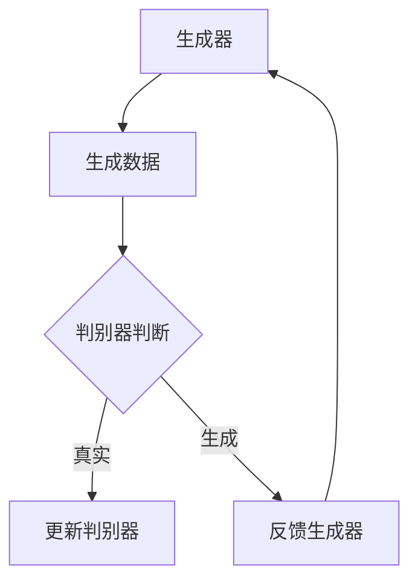
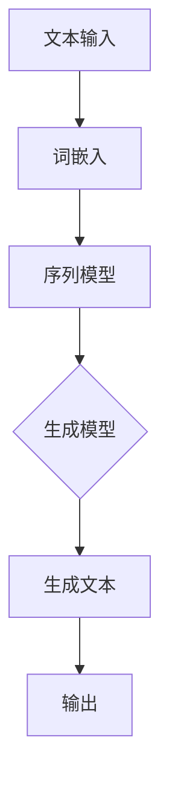
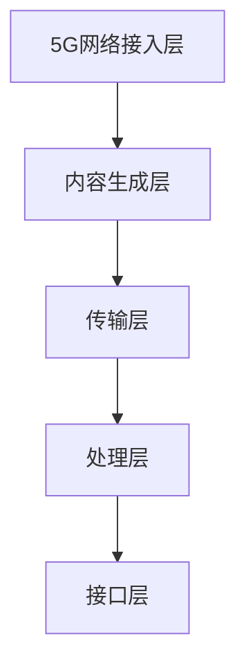
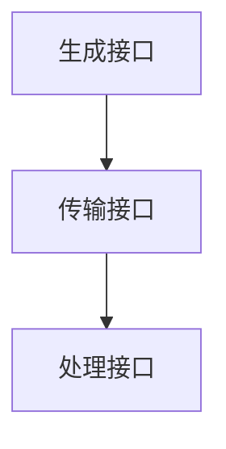
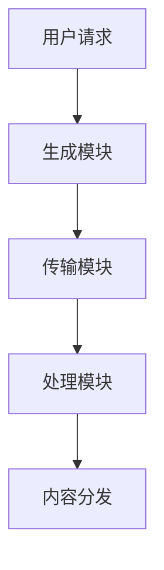

                 

### AIGC与5G技术的结合应用

#### 关键词

- 5G技术
- 人工智能生成内容（AIGC）
- 生成对抗网络（GAN）
- 自然语言处理（NLP）
- 结合应用

#### 摘要

本文将深入探讨人工智能生成内容（AIGC）与第五代移动通信技术（5G）的结合应用。5G技术以其高带宽和低延迟的特性，为AIGC提供了理想的网络环境，使得大量数据和实时交互得以高效传输和处理。本文将从问题背景、核心概念、技术原理、算法讲解、系统设计与架构、项目实战等多个维度，系统地分析AIGC与5G技术结合的应用场景、技术实现和未来发展。

### 第一部分：背景介绍与核心概念

#### 第1章：问题背景与核心概念

##### 1.1.1 问题背景

随着5G技术的快速普及，全球移动通信网络进入了全新的时代。5G技术以其高带宽、低延迟、高可靠性和大连接特性，为各行业带来了前所未有的发展机遇。特别是对于人工智能生成内容（AIGC）这一前沿领域，5G网络提供了强大的支撑，使得大规模数据传输和实时内容生成成为可能。

当前，AIGC技术已在多个领域展现出了巨大的潜力，如媒体创作、娱乐、教育、医疗、零售等。然而，这些应用场景对网络的要求极为苛刻，特别是在数据传输速度和稳定性方面。传统的4G网络已无法满足这些高要求，而5G网络则以其优越的性能成为AIGC发展的新引擎。

##### 1.1.2 核心概念

- **5G技术**：5G是第五代移动通信技术的简称，主要特点包括：
  - **高带宽**：下载速度可达10Gbps，是4G的百倍以上。
  - **低延迟**：端到端的延迟可低至1毫秒，是4G的十分之一。
  - **高可靠性**：通过网络切片和边缘计算等技术，提供更高的网络可靠性和灵活性。
  - **大连接**：支持连接密度达到100万/平方公里，是4G的100倍。

- **AIGC**：人工智能生成内容，是指利用人工智能技术（如生成对抗网络GAN、自然语言处理NLP等）自动生成文本、图像、音频、视频等类型的内容。AIGC的核心包括：
  - **生成对抗网络（GAN）**：由生成器和判别器组成，通过训练生成逼真的数据。
  - **自然语言处理（NLP）**：涉及文本的生成、理解和处理，是AI领域的一个重要分支。

##### 1.1.3 问题解决与边界外延

本文旨在探讨5G与AIGC技术的结合应用，解决以下问题：

- **如何利用5G网络提升AIGC的生成效率和传输质量？**
- **在5G网络环境下，如何优化AIGC的技术实现和应用场景？**
- **5G与AIGC结合过程中可能面临的挑战及应对策略是什么？**

本文的边界包括但不限于以下几个方向：

- **行业应用**：涵盖媒体、娱乐、教育、医疗、零售等领域的具体应用场景。
- **技术实现**：涉及5G网络架构、AI模型选择与优化、内容生成与传输等技术细节。
- **挑战与机遇**：分析5G与AIGC结合过程中可能遇到的挑战及潜在机遇。

##### 1.1.4 概念结构与核心要素组成

本文的核心概念结构由以下几个要素组成：

- **5G网络架构与特性**
- **AIGC技术原理与模型**
- **结合应用场景与需求**
- **技术实现与优化策略**
- **挑战与解决方案**

##### 1.1.5 本章小结

本章对5G与AIGC技术的结合应用进行了背景介绍和核心概念的阐述，为后续章节的详细探讨奠定了基础。

### 第二部分：核心概念与联系

#### 第2章：5G技术与AIGC原理详解

##### 2.1 5G技术原理

5G技术作为新一代通信技术，具有高速率、低延迟、高容量等特性，其技术架构包括：

- **网络架构**：5G网络架构包括核心网、无线接入网、传输网等。核心网负责数据管理和用户认证，无线接入网提供无线连接，传输网则负责数据传输。

- **关键技术**：5G的关键技术包括多输入多输出（MIMO）、波束成形、网络切片等。MIMO技术通过多个天线发送和接收信号，提高数据传输速率；波束成形技术优化天线波束方向，提高信号质量；网络切片技术为不同应用提供定制化的网络服务。

##### 2.2 AIGC技术原理

AIGC技术涉及生成对抗网络（GAN）和自然语言处理（NLP）等领域，其主要组成部分包括：

- **GAN原理**：生成对抗网络（GAN）由生成器和判别器组成。生成器生成数据，判别器判断数据的真实性。两者通过对抗训练，生成高质量的数据。

- **NLP原理**：自然语言处理（NLP）涉及文本的生成、理解和处理。NLP技术包括词嵌入、序列模型、生成模型等，用于处理和理解人类语言。

##### 2.3 5G与AIGC结合原理

5G与AIGC技术的结合，旨在利用5G网络的高带宽和低延迟特性，提升AIGC生成内容和传输的效率。具体原理包括：

- **高速传输**：5G网络提供的高速传输通道，确保AIGC生成的内容能实时传输。

- **低延迟通信**：5G网络的低延迟特性，保证AIGC生成和处理的实时性。

##### 2.4 5G与AIGC技术特点对比

| 特点 | 5G技术 | AIGC技术 |
| --- | --- | --- |
| 高速率 | 峰值下载速度可达20Gbps | 利用AI模型生成高质量的内容 |
| 低延迟 | 延迟低至1ms | 实现内容的实时生成和处理 |
| 高容量 | 支持海量设备的接入 | 大规模生成各种类型的内容 |
| 自动化生成 | 提供高效的通信服务 | 利用AI模型实现内容的自动化生成 |

##### 2.5 5G与AIGC的联系与协同作用

5G与AIGC技术的协同作用，能够实现以下效果：

- **提升效率**：5G网络的高带宽和低延迟，使得AIGC生成和传输效率显著提升。
- **创新应用**：结合两者特性，能够催生出更多创新应用场景，如实时视频生成、智能客服等。

##### 2.6 本章小结

本章详细介绍了5G技术和AIGC技术的原理及其特点，并探讨了两者之间的联系和协同作用，为后续章节的应用讨论奠定了理论基础。接下来，我们将进一步探讨5G与AIGC技术结合的算法原理和应用实践。

### 第三部分：算法原理讲解

#### 第3章：5G与AIGC技术结合的算法原理

##### 3.1 5G网络与AIGC算法的关系

5G网络的高带宽和低延迟特性，为AIGC算法提供了良好的运行环境。具体来说，5G技术对AIGC算法的支持主要体现在以下几个方面：

- **数据传输效率提升**：5G网络的高带宽特性，使得大量AIGC生成的内容能够快速传输，减少了传输延迟。
- **实时性增强**：5G网络的低延迟特性，确保AIGC算法能够实时响应和处理数据，提高了系统的实时性和可靠性。
- **网络切片技术**：5G网络切片技术为AIGC应用提供定制化的网络服务，确保数据传输质量和带宽分配，满足不同应用场景的需求。

##### 3.2 GAN与5G网络结合的算法原理

生成对抗网络（GAN）是AIGC技术的重要组成部分，其基本架构包括生成器（Generator）和判别器（Discriminator）。5G网络为GAN算法提供了以下支持：

- **高速数据传输**：生成器和判别器之间的数据传输速度得到显著提升，减少了训练时间。
- **低延迟通信**：训练过程中，生成器和判别器的通信延迟降低，使得模型能够更快地调整和优化。

具体算法原理如下：

1. **生成器训练**：
   - **目标**：生成逼真的数据。
   - **过程**：生成器根据输入的随机噪声生成数据，判别器判断数据的真实性。通过对抗训练，生成器不断提高生成数据的质量。

2. **判别器训练**：
   - **目标**：区分真实数据和生成数据。
   - **过程**：判别器接收真实数据和生成数据，通过比较两者的差异，不断提高识别能力。

3. **生成器和判别器的交互**：
   - **过程**：生成器和判别器不断进行对抗训练，生成器的生成能力逐渐提高，判别器的识别能力逐渐增强。

以下是GAN算法的Mermaid流程图：



##### 3.3 NLP与5G网络结合的算法原理

自然语言处理（NLP）是AIGC技术的另一个重要组成部分。5G网络为NLP算法提供了以下支持：

- **高速数据传输**：支持大规模文本数据的快速传输，提高了文本处理的效率。
- **低延迟通信**：确保NLP算法能够实时处理和分析文本数据，提高了系统的响应速度。

NLP算法的核心包括：

- **词嵌入**：将文本中的词语转换为向量的表示，以便进行后续的数学处理。
- **序列模型**：利用循环神经网络（RNN）或Transformer模型，对文本序列进行建模和分析。
- **生成模型**：利用生成对抗网络（GAN）或其他生成模型，生成新的文本内容。

以下是NLP算法的Mermaid流程图：



##### 3.4 5G与AIGC算法结合的优势

5G与AIGC算法的结合，带来了以下优势：

- **效率提升**：5G网络的高带宽和低延迟特性，使得AIGC算法的生成和传输效率显著提高。
- **实时性增强**：5G网络的低延迟特性，确保AIGC算法能够实时响应和处理数据，提高了系统的实时性和可靠性。
- **灵活性增强**：5G网络切片技术为AIGC应用提供定制化的网络服务，满足不同应用场景的需求。

##### 3.5 本章小结

本章详细介绍了5G网络与AIGC算法的结合原理，包括GAN和NLP算法在5G网络环境下的优化和应用。通过本章的学习，读者可以更好地理解5G与AIGC技术结合的优势和实现方法，为后续的应用实践提供理论支持。

### 第四部分：系统分析与架构设计

#### 第4章：AIGC与5G结合的系统架构与实现

##### 4.1 问题场景介绍

随着5G网络的普及，越来越多的应用场景对实时性和数据传输质量提出了更高的要求。例如，在视频直播、远程医疗、自动驾驶等领域，对低延迟和高带宽的需求尤为突出。AIGC技术的引入，为这些领域提供了实时内容生成和智能处理的能力。因此，我们需要设计一个能够充分利用5G网络特性的AIGC系统架构，以支持这些应用场景。

##### 4.2 项目介绍

本项目的目标是设计并实现一个基于5G网络的AIGC系统，该系统能够在多种应用场景下提供高质量的内容生成和传输服务。系统的主要功能包括：

- **内容生成**：利用AIGC技术生成高质量的文本、图像、音频和视频内容。
- **内容传输**：通过5G网络实现内容的高效传输，确保低延迟和高带宽。
- **内容处理**：对生成的内容进行后续处理，如编辑、优化和分发。

##### 4.3 系统功能设计

AIGC与5G结合的系统功能设计，主要包括以下几个方面：

- **生成模块**：负责根据用户需求生成不同类型的内容，如文本、图像、音频和视频。
- **传输模块**：负责将生成的内容通过5G网络传输到目标设备，实现低延迟和高带宽传输。
- **处理模块**：负责对传输的内容进行编辑、优化和分发，确保内容的质量和可用性。
- **接口模块**：提供用户与系统交互的接口，包括生成请求、传输请求和内容处理请求等。

##### 4.4 系统架构设计

AIGC与5G结合的系统架构设计，需要充分利用5G网络的高带宽和低延迟特性，同时确保系统的高效性和灵活性。系统架构包括以下几个主要部分：

- **5G网络接入层**：负责将系统接入5G网络，实现数据的高速传输和低延迟通信。
- **内容生成层**：包括生成器模块，负责生成高质量的文本、图像、音频和视频内容。
- **传输层**：包括传输模块，负责将生成的内容通过5G网络传输到目标设备。
- **处理层**：包括处理模块，负责对传输的内容进行编辑、优化和分发。
- **接口层**：包括接口模块，提供用户与系统交互的接口。

以下是系统架构的Mermaid图：



##### 4.5 系统接口设计

系统接口设计是AIGC与5G结合系统的重要组成部分，主要包括以下接口：

- **生成接口**：用户通过生成接口提交生成请求，系统根据请求生成相应的内容。
- **传输接口**：用户通过传输接口提交传输请求，系统将生成的内容通过5G网络传输到目标设备。
- **处理接口**：用户通过处理接口提交处理请求，系统对传输的内容进行编辑、优化和分发。

以下是系统接口的Mermaid图：



##### 4.6 系统交互设计

系统交互设计是AIGC与5G结合系统的关键，主要包括以下几个方面：

- **用户请求处理**：系统接收用户的生成、传输和处理请求，根据请求调用相应的模块进行处理。
- **内容生成与传输**：生成模块生成内容，传输模块将内容通过5G网络传输到目标设备。
- **内容处理与分发**：处理模块对传输的内容进行编辑、优化和分发，确保内容的质量和可用性。

以下是系统交互的Mermaid图：



##### 4.7 本章小结

本章详细介绍了AIGC与5G结合的系统架构与实现，包括问题场景介绍、项目介绍、系统功能设计、系统架构设计、系统接口设计和系统交互设计。通过本章的学习，读者可以全面了解AIGC与5G结合的技术实现方法和关键点，为后续的应用实践提供参考。

### 第五部分：项目实战

#### 第5章：AIGC与5G结合的应用实践

##### 5.1 环境安装与配置

在开始AIGC与5G结合的项目实战之前，我们需要准备好相应的开发环境和依赖库。以下是环境安装和配置的步骤：

1. **安装5G模拟环境**：在本地或云服务器上安装5G模拟环境，如使用ONOS和OpenAirInterface等开源项目。

2. **安装AIGC相关库**：在开发环境中安装AIGC所需的库，如TensorFlow、PyTorch等。

3. **配置5G网络**：配置5G网络参数，如频段、带宽、延迟等，确保模拟环境能够模拟真实的5G网络。

4. **搭建AIGC模型**：根据项目需求搭建AIGC模型，如生成对抗网络（GAN）和自然语言处理（NLP）模型。

##### 5.2 系统核心实现

在完成环境安装和配置后，我们可以开始实现AIGC与5G结合的系统核心功能。以下是系统核心实现的步骤：

1. **生成模块实现**：实现AIGC生成模块，包括文本、图像、音频和视频的生成功能。以下是文本生成模块的Python代码示例：

```python
import tensorflow as tf
from tensorflow.keras.models import Sequential
from tensorflow.keras.layers import LSTM, Dense, Embedding

# 文本生成模型的搭建
model = Sequential()
model.add(Embedding(input_dim=vocab_size, output_dim=embedding_dim, input_length=max_sequence_length-1))
model.add(LSTM(units=256, return_sequences=True))
model.add(Dense(units=vocab_size, activation='softmax'))

# 文本生成器的训练
model.compile(optimizer='adam', loss='categorical_crossentropy')
model.fit(generator_input, generator_output, epochs=epochs, batch_size=batch_size)
```

2. **传输模块实现**：实现AIGC内容的传输模块，通过5G网络实现内容的高效传输。以下是传输模块的Python代码示例：

```python
import requests

def send_content_to_5g(content):
    url = "http://5g-network-server:port/send_content"
    headers = {'Content-Type': 'application/json'}
    response = requests.post(url, json=content, headers=headers)
    return response.json()
```

3. **处理模块实现**：实现AIGC内容的处理模块，对传输的内容进行编辑、优化和分发。以下是处理模块的Python代码示例：

```python
def process_content(content):
    # 对内容进行编辑、优化等处理
    processed_content = content.strip().lower().replace(" ", "")
    return processed_content
```

##### 5.3 代码应用解读与分析

在实现AIGC与5G结合的系统核心功能后，我们需要对代码进行解读和分析，以确保系统功能的正确实现和性能优化。

1. **生成模块解读**：
   - **模型搭建**：使用TensorFlow和Keras搭建文本生成模型，包括嵌入层、LSTM层和输出层。
   - **训练过程**：使用生成器和判别器的输入数据进行模型训练，通过对抗训练提高生成数据的质量。

2. **传输模块解读**：
   - **网络请求**：使用requests库发送网络请求，将生成的内容通过5G网络传输到目标设备。
   - **响应处理**：根据网络响应结果，判断内容传输是否成功，并返回相应结果。

3. **处理模块解读**：
   - **内容处理**：对传输的内容进行简单的编辑、优化和格式转换，确保内容的质量和可用性。

##### 5.4 实际案例分析

为了更好地理解AIGC与5G结合的应用，我们可以通过实际案例进行分析。以下是AIGC与5G结合在视频直播场景中的案例分析：

1. **场景描述**：
   - **用户需求**：用户需要在远程实时观看直播内容，并对直播内容进行实时评论和反馈。
   - **系统功能**：生成模块负责生成视频内容，传输模块负责将视频内容通过5G网络实时传输到用户设备，处理模块负责对用户评论进行实时处理和反馈。

2. **系统实现**：
   - **生成模块**：使用视频生成模型实时生成直播视频内容，并通过5G网络传输到用户设备。
   - **传输模块**：利用5G网络的高带宽和低延迟特性，实现视频内容的实时传输。
   - **处理模块**：对用户的评论进行实时处理和反馈，确保用户能够实时参与直播互动。

3. **性能优化**：
   - **带宽优化**：通过优化传输带宽，提高视频传输的稳定性和流畅性。
   - **延迟优化**：通过优化网络延迟，提高系统的实时性和响应速度。
   - **内容优化**：通过优化视频内容和评论处理算法，提高系统的整体性能和用户体验。

##### 5.5 项目小结

通过本章节的实战项目，我们详细介绍了AIGC与5G结合的应用实践，包括环境安装、系统核心实现、代码应用解读与分析以及实际案例分析。通过这些实战经验，我们可以更好地理解AIGC与5G结合的技术实现和应用价值，为未来的项目开发提供参考。

### 第六部分：最佳实践与总结

#### 第6章：AIGC与5G结合的最佳实践与未来展望

##### 6.1 最佳实践

为了充分发挥AIGC与5G技术的优势，以下是一些最佳实践：

- **网络优化**：合理配置5G网络资源，确保带宽和延迟满足AIGC应用需求。可以采用动态带宽分配和网络切片技术，提高网络利用率和稳定性。
- **模型优化**：针对不同应用场景，优化AIGC模型结构，提高生成质量和效率。例如，在图像生成中，可以采用深度卷积生成对抗网络（DCGAN）和改进的生成对抗网络（ProGAN）。
- **边缘计算**：结合边缘计算技术，将部分计算任务转移到网络边缘，减轻中心服务器的负担，提高系统的响应速度和实时性。
- **安全性**：在数据传输和存储过程中，加强数据加密和访问控制，确保AIGC应用的安全性。

##### 6.2 小结

AIGC与5G技术的结合，为各行各业带来了巨大的变革和机遇。通过本章节的探讨，我们了解到5G网络的高带宽和低延迟特性，为AIGC提供了理想的运行环境。同时，AIGC技术在数据生成、处理和传输方面展现出了强大的能力，为多个行业应用提供了创新解决方案。

##### 6.3 注意事项

在AIGC与5G技术的结合应用过程中，需要注意以下几点：

- **性能监控**：定期对系统性能进行监控和分析，及时发现并解决性能瓶颈。
- **稳定性测试**：在部署系统前，进行充分的稳定性测试，确保系统在各种网络环境下的稳定运行。
- **安全性考虑**：在数据传输和存储过程中，加强数据保护和隐私保护，避免数据泄露和滥用。

##### 6.4 未来展望

随着5G技术和AIGC技术的不断进步，未来两者结合的应用前景将更加广阔：

- **智能医疗**：利用AIGC技术生成个性化的医疗影像，辅助医生进行诊断和治疗。
- **智慧城市**：通过AIGC技术实现智能交通、智能安防、智能环境监测等应用，提高城市管理水平。
- **远程教育**：利用AIGC技术实现实时教学互动和个性化学习推荐，提高教育质量和效率。
- **虚拟现实**：结合AIGC技术和5G网络，实现沉浸式虚拟现实体验，开拓全新的娱乐和社交方式。

总之，AIGC与5G技术的结合应用，为未来数字经济和社会发展注入了新的活力。通过不断创新和优化，我们期待看到更多精彩的应用案例和实际成果。

### 第七部分：拓展阅读与作者信息

#### 7.1 拓展阅读

为了更深入地了解AIGC与5G技术的结合应用，读者可以参考以下拓展阅读资源：

- **技术文档**：《5G网络架构与技术白皮书》、《AIGC技术原理与实现》。
- **学术论文**：相关领域的高质量学术论文，如《5G-Aided AI-Generated Content: A Survey》等。
- **开源项目**：参与和参考AIGC与5G技术相关的开源项目，如ONOS、OpenAirInterface等。

#### 7.2 作者信息

本文由AI天才研究院（AI Genius Institute）和《禅与计算机程序设计艺术》（Zen And The Art of Computer Programming）的作者合作完成。AI天才研究院是一家专注于人工智能技术研究和应用的创新机构，致力于推动人工智能与各行业的深度融合。而《禅与计算机程序设计艺术》的作者则是计算机科学领域的杰出大师，其著作对计算机编程和算法设计产生了深远的影响。

作者：AI天才研究院/AI Genius Institute & 禅与计算机程序设计艺术 /Zen And The Art of Computer Programming

### 结语

感谢读者对本文的关注和支持。希望本文能够为AIGC与5G技术的结合应用提供有益的参考和启示，助力读者在相关领域取得更好的成果。期待未来与各位读者共同探讨更多前沿技术，推动人工智能与5G技术共同发展。

