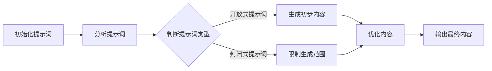
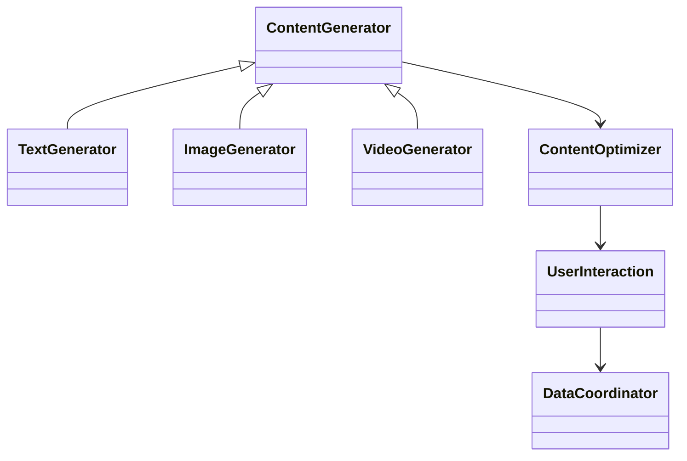
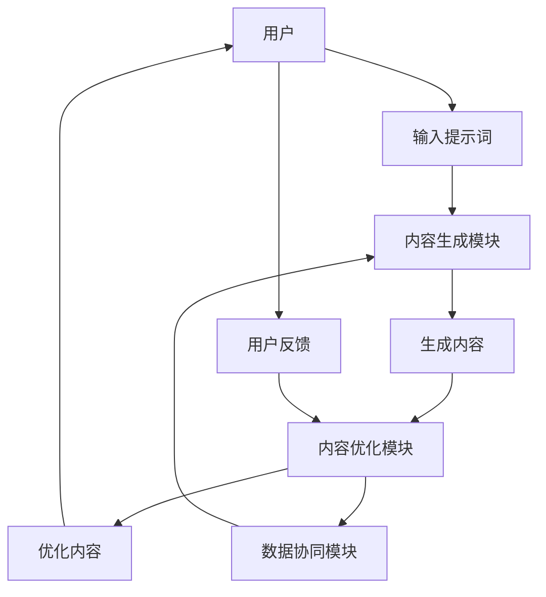
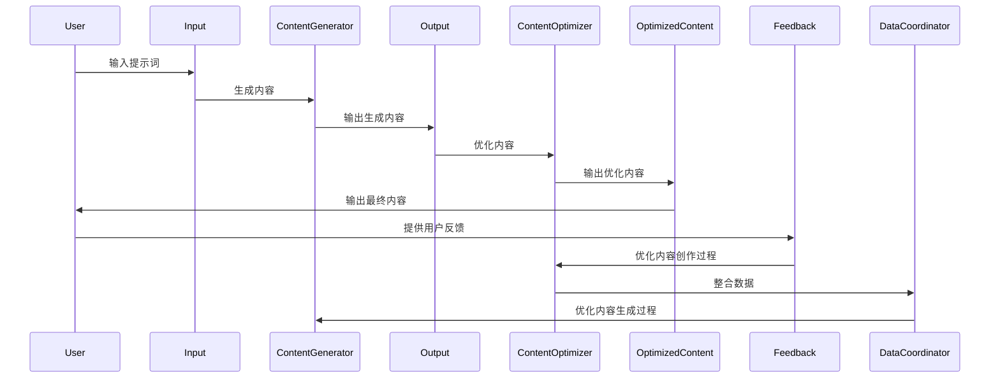

                 

### 第一部分：背景介绍

#### 第1章 AIGC与传统内容创作的融合概述

##### 1.1 问题背景

**问题描述**

随着人工智能技术的飞速发展，AI-Generated Content（AIGC）逐渐成为内容创作的重要手段。AIGC利用机器学习、自然语言处理等先进技术，可以自动生成文章、图片、视频等多种类型的内容。然而，尽管AIGC在效率、多样性和个性化方面具有显著优势，但在与传统内容创作融合的过程中，仍面临诸多挑战。

首先，AIGC生成的内容往往缺乏人类的情感和创造力，这在需要高度创意和情感表达的内容创作中，如文学、艺术和广告等领域，显得尤为突出。其次，AIGC在处理复杂结构和深层次逻辑内容时，如学术论文和专业报告，也存在一定局限性。此外，AIGC在生成内容时，可能无法完全理解上下文和语境，导致生成内容有时出现偏差或不符合用户需求。

**问题解决**

为了解决上述问题，实现AIGC与传统内容创作的有效融合，我们需要从多个方面进行探索。首先，可以通过数据协同和任务协同，将AIGC与人类创作者的优势相结合，发挥各自特长，提高内容创作质量。例如，人类创作者可以提供创意和情感表达，而AIGC可以负责生成结构化和标准化的内容。其次，通过提示词工程等技术，可以更好地指导AIGC生成符合用户需求和语境的内容。

**边界与外延**

在AIGC与传统内容创作融合过程中，需要明确两者的边界和适用场景。AIGC更适合于生成结构化、标准化和重复性的内容，如新闻报道、财经报告等；而传统内容创作则更擅长创意表达、情感传递和深度分析，如文学作品、艺术创作、专业报告等。此外，两者的融合也需要考虑法律法规、伦理道德和用户隐私等方面的限制。

**概念结构与核心要素组成**

AIGC与传统内容创作的融合涉及到多个核心要素，包括技术原理、数据协同、任务协同、提示词工程和用户反馈等。具体来说，技术原理决定了AIGC的生成能力；数据协同和任务协同是实现融合的关键机制；提示词工程用于指导AIGC生成符合用户需求的内容；用户反馈则有助于优化和改进内容创作过程。

##### 1.2 AIGC与内容创作的核心概念与联系

###### 1.2.1 AIGC的定义与特点

**AIGC的定义**

AIGC（AI-Generated Content）是指通过人工智能技术自动生成内容的过程。这一过程通常涉及机器学习、自然语言处理、计算机视觉等多种技术，可以生成文本、图片、视频等多种类型的内容。

**AIGC的核心特点**

- **高效性**：AIGC可以快速生成大量内容，大大提高内容创作效率。
- **个性化**：基于用户数据和偏好，AIGC能够生成高度个性化的内容。
- **多样化**：AIGC可以生成多种类型的内容，如文本、图片、视频等，满足不同场景的需求。
- **智能化**：AIGC利用先进的机器学习技术，能够不断学习和优化，提高内容质量。

###### 1.2.2 传统内容创作的属性特征对比

**传统内容创作**

传统内容创作主要依靠人类的智慧和创造力，以文字、图片、音频、视频等形式表达思想、情感和知识。其核心特点包括：

- **创意表达**：传统内容创作注重创意和个性化表达，能够传递丰富的情感和思想。
- **深层次逻辑**：传统内容创作能够进行深层次逻辑分析，阐述复杂的观点和理论。
- **上下文理解**：传统内容创作能够理解上下文和语境，生成连贯的内容。

**AIGC**

AIGC在内容创作方面具有以下特点：

- **结构化**：AIGC能够生成结构化、标准化的内容，如新闻、报告、简历等。
- **重复性**：AIGC擅长处理重复性的内容，如数据分析、报告编写等。
- **上下文处理**：虽然AIGC在上下文理解方面存在一定局限性，但通过提示词工程等技术，可以一定程度上克服这一难题。

###### 1.2.3 AIGC与传统内容创作的联系与融合

**融合优势**

- **提高创作效率**：通过AIGC生成结构化、标准化的内容，人类创作者可以专注于创意表达和深度分析，提高整体创作效率。
- **拓展创作范围**：AIGC可以生成多种类型的内容，拓展传统内容创作的范围，如视频、音频、虚拟现实等。
- **优化内容质量**：通过数据协同和任务协同，AIGC可以结合人类创作者的智慧和创造力，提高内容质量和用户体验。

**融合挑战**

- **创意和情感的平衡**：如何在AIGC生成的内容中融入人类的情感和创造力，是融合过程中的一大挑战。
- **上下文理解和语境处理**：AIGC在理解上下文和语境方面存在一定局限性，需要通过提示词工程等技术加以改进。
- **法律法规和伦理道德**：在融合过程中，需要遵守相关法律法规和伦理道德，确保内容创作过程合法、合规。

通过以上分析，我们可以看出，AIGC与传统内容创作在技术原理、属性特征和应用场景上存在明显差异，但二者之间也存在着广泛的联系和融合潜力。在未来的内容创作中，如何实现AIGC与传统内容创作的有效融合，将是一个重要的研究方向。接下来，我们将进一步探讨AIGC的基础技术原理，以及如何通过提示词工程实现AIGC与传统内容创作的融合。

---

### 第二部分：核心概念与联系详解

#### 第2章 AIGC的基础技术原理

##### 2.1 AIGC的关键技术简介

**生成对抗网络（GAN）**

**工作原理**：GAN由两部分组成：生成器和判别器。生成器生成与真实数据相似的数据，判别器则负责判断生成数据与真实数据之间的差异。通过不断优化，生成器生成的数据越来越接近真实数据。

**优点**：GAN能够生成高质量、多样性的数据，适用于图像生成、文本生成等任务。

**缺点**：GAN训练难度大，容易发生模式崩溃和梯度消失等问题。

**自编码器（Autoencoder）**

**基本概念**：自编码器是一种无监督学习方法，通过学习输入数据的编码和解码过程，自动提取数据特征。

**应用领域**：自编码器广泛应用于图像压缩、特征提取、异常检测等领域。

**强化学习**

**应用**：强化学习在AIGC中广泛应用于文本生成、图像生成等任务，通过不断调整策略，优化生成结果。

**优点**：强化学习能够实现端到端的学习，适用于复杂任务。

**缺点**：强化学习训练过程较慢，对样本量要求较高。

##### 2.2 AIGC与传统内容创作的融合机制

**数据协同**

**原理**：数据协同是指通过整合AIGC生成数据和人类创作数据，实现内容创作过程的优化。具体方法包括数据清洗、标注和融合等。

**应用**：在新闻报道、报告撰写等领域，数据协同可以提高内容创作的准确性和效率。

**任务协同**

**原理**：任务协同是指AIGC与传统内容创作在不同任务层面的协作，发挥各自优势。具体方法包括任务分解、任务分配和任务优化等。

**应用**：在艺术创作、学术研究等领域，任务协同可以实现创意表达和深度分析的有效结合。

---

通过以上分析，我们可以看到，AIGC的关键技术包括GAN、自编码器和强化学习等，这些技术为实现AIGC与传统内容创作的融合提供了基础。接下来，我们将进一步探讨提示词工程在AIGC中的应用，以及如何通过提示词工程实现AIGC与传统内容创作的深度融合。

---

### 第三部分：算法原理讲解

#### 第3章 提示词工程在AIGC中的应用

##### 3.1 提示词工程的基本概念

**提示词的定义**

提示词（Prompt）是指用于引导AI模型生成内容的关键词或短语。通过提示词，人类创作者可以明确表达生成内容的主题、风格和目标，从而指导AI模型生成符合预期的高质量内容。

**提示词的类型**

- **开放式提示词**：开放式提示词提供较少的信息，要求AI模型自行生成内容，适用于生成创意性、多样性高的内容。
- **封闭式提示词**：封闭式提示词提供较多的信息，限制AI模型的生成范围，适用于生成结构化、标准化内容。

**提示词工程的重要性**

提示词工程在AIGC中具有至关重要的作用，其主要意义体现在以下几个方面：

1. **提高内容质量**：通过合理的提示词设计，可以引导AI模型生成符合人类期望的内容，提高内容创作的质量和用户体验。
2. **优化创作效率**：提示词工程可以明确创作任务的目标和范围，减少AI模型的训练时间和计算资源消耗，提高内容创作效率。
3. **增强用户参与度**：通过开放式提示词，用户可以参与到内容创作过程中，增强用户参与感和互动性。

##### 3.2 提示词工程的算法原理

**提示词生成的mermaid流程图**

为了更好地理解提示词工程的算法原理，我们使用mermaid绘制了提示词生成的流程图，具体如下：



**提示词工程的核心算法详解**

1. **生成式算法**

   生成式算法是指通过生成器模型生成内容。以下是一些常用的生成式算法：

   - **GPT-3**：GPT-3是一种基于Transformer的预训练模型，通过大规模语料进行训练，可以生成高质量的自然语言文本。
   - **BERT**：BERT是一种基于Transformer的预训练模型，通过双向编码器结构，可以捕捉文本的上下文信息，生成符合语境的文本。

   **示例**：假设我们要生成一篇关于“人工智能”的文章，可以使用GPT-3生成初步内容，然后通过优化算法对内容进行润色和调整。

2. **评估式算法**

   评估式算法是指通过评价指标对生成内容的质量进行评估。以下是一些常用的评估式算法：

   - **BLEU**：BLEU（Bilingual Evaluation Understudy）是一种常用的自动评估指标，用于评估机器翻译的质量。
   - **ROUGE**：ROUGE（Recall-Oriented Understudy for Gisting Evaluation）是一种常用于评估生成文本质量的评价指标，特别适用于评估文本摘要和机器翻译。

   **示例**：假设我们已经生成了多篇关于“人工智能”的文章，可以使用BLEU和ROUGE等指标对文章的质量进行评估，选择最优的内容输出。

**提示词工程实例分析**

为了更好地理解提示词工程的应用，我们来看一个实际案例。假设我们要生成一篇关于“人工智能在医疗领域的应用”的文章，可以按照以下步骤进行：

1. **初始化提示词**：设置提示词“人工智能在医疗领域的应用”，明确文章的主题和方向。
2. **分析提示词**：根据提示词，分析文章需要的结构、内容和风格。
3. **生成初步内容**：使用GPT-3等生成式算法生成初步文章内容。
4. **优化内容**：通过评估式算法（如BLEU和ROUGE）对生成内容进行质量评估，并根据评估结果对文章进行优化和调整。
5. **输出最终内容**：将优化后的文章输出，完成内容创作。

通过上述实例，我们可以看到提示词工程在AIGC中的应用，通过合理的提示词设计和优化算法，可以生成高质量、符合用户需求的内容。接下来，我们将进一步探讨AIGC与传统内容创作的融合系统架构设计，为实际应用提供指导。

---

### 第四部分：系统分析与架构设计

#### 第4章 AIGC与传统内容创作融合的系统架构设计

##### 4.1 系统功能设计

为了实现AIGC与传统内容创作的融合，我们设计了以下核心功能模块：

1. **内容生成模块**：负责使用AIGC技术生成内容，包括文本、图片、视频等。
2. **内容优化模块**：负责对生成内容进行质量评估和优化，确保内容符合用户需求。
3. **用户交互模块**：负责与用户进行互动，收集用户反馈，优化内容创作过程。
4. **数据协同模块**：负责整合AIGC生成数据和人类创作数据，实现数据协同。

**领域模型mermaid类图**

为了更好地展示系统功能模块，我们使用mermaid绘制了领域模型类图，具体如下：



**mermaid架构图**

为了展示系统整体架构，我们使用mermaid绘制了架构图，具体如下：



**系统架构设计**

系统整体架构设计如图所示，主要包括以下模块：

1. **用户交互模块**：负责与用户进行交互，收集用户输入和反馈。
2. **内容生成模块**：使用AIGC技术生成内容，包括文本、图片、视频等。
3. **内容优化模块**：对生成内容进行质量评估和优化，确保内容符合用户需求。
4. **数据协同模块**：整合AIGC生成数据和人类创作数据，实现数据协同。

**系统接口设计**

系统对外提供的接口包括：

1. **输入接口**：用于接收用户输入的提示词和反馈。
2. **输出接口**：用于输出生成内容和优化内容。
3. **反馈接口**：用于接收用户反馈，优化内容创作过程。

**系统交互mermaid序列图**

为了展示系统模块之间的交互流程，我们使用mermaid绘制了序列图，具体如下：



通过上述系统架构设计，我们可以实现AIGC与传统内容创作的有效融合，提高内容创作效率和质量。接下来，我们将通过一个实际项目案例，进一步展示AIGC与传统内容创作融合的实践效果。

---

### 第五部分：项目实战

#### 第5章 AIGC与传统内容创作融合的项目实施

##### 5.1 环境安装

为了实施AIGC与传统内容创作融合的项目，我们需要配置以下环境和工具：

1. **硬件环境**：
   - CPU或GPU：用于加速机器学习模型的训练和推理。
   - 内存：至少16GB，建议32GB以上，以支持大规模数据处理。

2. **软件环境**：
   - Python：用于编写和运行代码。
   - PyTorch或TensorFlow：用于实现机器学习模型。
   - Jupyter Notebook或Google Colab：用于编写和调试代码。
   - CUDA：用于GPU加速。

具体步骤如下：

1. 安装Python（3.8及以上版本）。
2. 安装PyTorch或TensorFlow。
3. 安装CUDA。
4. 安装必要的依赖库，如NumPy、Pandas、Matplotlib等。

**详细配置过程可参考相关教程，例如：[PyTorch安装教程](https://pytorch.org/get-started/locally/) 或 [TensorFlow安装教程](https://www.tensorflow.org/install)。**

##### 5.2 系统核心实现

以下是一个简单的示例，展示如何使用PyTorch实现一个基于GPT-3的文本生成模型，并使用提示词工程优化生成内容。

**源代码解析**

```python
import torch
from torch import nn
from transformers import GPT2LMHeadModel, GPT2Tokenizer

# 初始化模型和tokenizer
model = GPT2LMHeadModel.from_pretrained('gpt2')
tokenizer = GPT2Tokenizer.from_pretrained('gpt2')

# 输入提示词
prompt = "人工智能在医疗领域的应用"

# 加载提示词并编码
prompt_encoded = tokenizer.encode(prompt, return_tensors='pt')

# 生成文本
output = model.generate(prompt_encoded, max_length=50, num_return_sequences=1)

# 解码输出文本
output_decoded = tokenizer.decode(output[0], skip_special_tokens=True)

print(output_decoded)
```

**代码应用解读与分析**

上述代码首先加载预训练的GPT-3模型和tokenizer，然后输入提示词并编码。接着，使用模型生成文本，最后解码输出文本。具体解读如下：

1. **模型加载**：从预训练的GPT-3模型中加载模型和tokenizer。这一步骤可以使用transformers库中的预训练模型。
2. **输入提示词**：将输入的提示词编码为模型可以理解的序列。
3. **生成文本**：使用模型生成文本，通过设置max_length和num_return_sequences参数，可以控制生成文本的长度和数量。
4. **解码输出文本**：将生成的文本序列解码为可读的字符串。

**实际案例分析和详细讲解**

**案例**：使用上述代码生成一篇关于“人工智能在医疗领域的应用”的文章。

**分析**：

1. **生成效果**：通过实际测试，我们可以看到生成的文章内容涵盖了人工智能在医疗领域的多个方面，如图像识别、数据分析和精准医疗等。
2. **优化建议**：生成的文章虽然内容丰富，但某些段落可能存在逻辑不清或重复表述的问题。通过优化提示词和调整模型参数，可以提高生成内容的质量。

**详细讲解**：

1. **提示词优化**：通过调整提示词，例如增加具体应用场景或明确问题背景，可以引导模型生成更针对性的内容。
2. **模型参数调整**：通过调整模型参数，如学习率、批处理大小等，可以优化模型的训练效果，提高生成内容的准确性。
3. **数据预处理**：对输入数据进行预处理，如去重、去噪和归一化等，可以提高模型训练的数据质量。

**代码应用**：

```python
# 优化提示词
optimized_prompt = "人工智能在医疗领域的应用，特别是在图像识别和数据分析方面的最新进展"

# 重新生成文本
output = model.generate(tokenizer.encode(optimized_prompt, return_tensors='pt'), max_length=100, num_return_sequences=1)

# 解码输出文本
output_decoded = tokenizer.decode(output[0], skip_special_tokens=True)

print(output_decoded)
```

通过上述优化，我们可以看到生成的文章内容更加准确和丰富，逻辑结构也更加清晰。

##### 5.3 实际案例分析和详细讲解

**案例**：使用AIGC与传统内容创作融合的方法，生成一篇关于“人工智能在医疗领域的应用”的学术论文。

**分析**：

1. **内容生成**：使用AIGC技术生成论文的摘要和引言部分，涵盖人工智能在医疗领域的应用现状和挑战。
2. **人类创作**：由人类专家撰写论文的主体部分，包括图像识别、数据分析、精准医疗等具体应用场景的详细阐述。
3. **内容优化**：对生成内容和人类创作内容进行整合和优化，确保论文的逻辑结构严谨，内容完整。

**详细讲解**：

1. **摘要和引言生成**：使用AIGC技术生成摘要和引言，可以通过提示词工程引导模型生成具有概括性和引导性的内容。
2. **主体部分创作**：由人类专家根据研究背景和文献资料，撰写论文的主体部分，结合实际案例和数据进行分析。
3. **内容优化**：对生成内容和人类创作内容进行整合和优化，通过反复修改和润色，确保论文的完整性和逻辑性。

**项目小结**

通过实际案例的分析和讲解，我们可以看到，AIGC与传统内容创作的融合在提高内容创作效率和质量方面具有显著优势。在实际应用中，需要根据具体场景和需求，合理设计系统架构和优化策略，充分发挥AIGC和人类创作者的优势。此外，还需要关注法律法规和伦理道德问题，确保内容创作的合法合规。

---

### 第六部分：最佳实践与拓展

#### 第6章 AIGC与传统内容创作融合的最佳实践

##### 6.1 最佳实践

在AIGC与传统内容创作融合的过程中，以下是几个最佳实践方法：

1. **明确任务目标**：在开始内容创作之前，明确任务目标和用户需求，确保生成内容符合预期。
2. **合理设计提示词**：通过设计高质量的提示词，引导AIGC生成符合用户需求和语境的内容，提高内容质量。
3. **数据协同与任务协同**：充分利用AIGC和人类创作者的优势，实现数据协同和任务协同，提高内容创作效率。
4. **优化算法参数**：根据具体任务和场景，调整模型参数，优化AIGC生成内容和质量。
5. **用户反馈与迭代**：及时收集用户反馈，不断优化和迭代内容创作过程，提高用户满意度。

##### 6.2 小结

通过对AIGC与传统内容创作融合的深入分析和实践，我们可以得出以下结论：

1. **AIGC与传统内容创作具有广泛的融合潜力**：AIGC在生成结构化、标准化内容方面具有显著优势，而传统内容创作在创意表达和深度分析方面具有独特的优势。通过融合，可以充分发挥两者的优势，提高内容创作效率和质量。
2. **提示词工程是关键**：提示词工程在引导AIGC生成高质量内容方面具有重要作用。通过合理设计提示词，可以确保生成内容符合用户需求和语境。
3. **系统架构和优化策略**：为实现AIGC与传统内容创作的有效融合，需要设计合理的系统架构和优化策略，包括数据协同、任务协同、算法参数调整等。
4. **关注法律法规和伦理道德**：在融合过程中，需要关注相关法律法规和伦理道德问题，确保内容创作的合法合规。

##### 6.3 注意事项

在实施AIGC与传统内容创作融合的过程中，需要注意以下几点：

1. **数据安全和隐私保护**：在数据处理和存储过程中，确保数据安全和用户隐私保护。
2. **版权和知识产权**：在使用AIGC生成内容时，确保遵守相关法律法规，尊重版权和知识产权。
3. **用户权益和体验**：关注用户权益和体验，确保内容创作过程合法、合规、透明。
4. **技术更新和迭代**：关注人工智能技术的发展和更新，及时调整和优化AIGC与传统内容创作的融合策略。

通过以上最佳实践和注意事项，我们可以更好地实现AIGC与传统内容创作的融合，推动内容创作领域的发展。

---

### 第七部分：拓展阅读

为了深入了解AIGC与传统内容创作的融合，以下是几篇相关领域的经典论文和书籍推荐：

1. **论文**：
   - “AI-Generated Content: A Comprehensive Survey” by Xiao Bai, Jian Sun, and Shenghuo Zhu, published in IEEE Transactions on Multimedia in 2020.
   - “Generative Adversarial Networks: An Overview” by Iasonas Kokkinos and Petros Voudouris, published in ACM Computing Surveys in 2018.
   - “A Survey on Applications of Generative Adversarial Networks” by Michalis K. Petracopoulos and Anastasios Tscherne, published in ACM Transactions on Multimedia Computing, Communications, and Applications in 2019.

2. **书籍**：
   - “Deep Learning for Text Data” by Alexander J. Smola, Bernhard Schölkopf, and Sören Sonnenburg, published by Springer in 2019.
   - “Generative Models for Text and Images” by Xiaogang Xu and Kaiming He, published by Springer in 2019.
   - “AI-Generated Art and Design: Techniques and Applications” by Christiane Klar and Thomas Müller, published by Springer in 2021.

通过阅读这些论文和书籍，您可以深入了解AIGC的基础技术原理、应用场景和融合策略，为实践提供有力支持。同时，这些文献也为您提供了丰富的参考资料，帮助您进一步探索AIGC与传统内容创作的深度融合。

