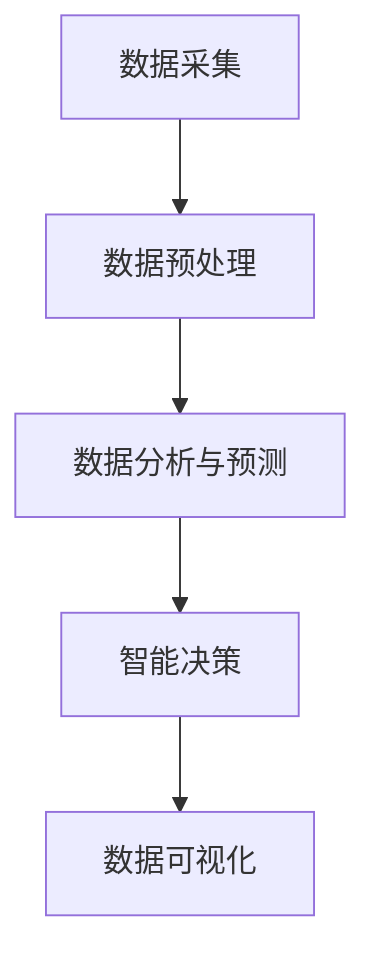
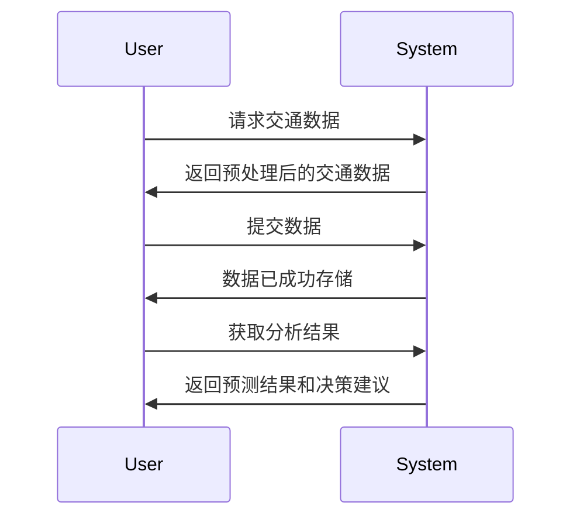
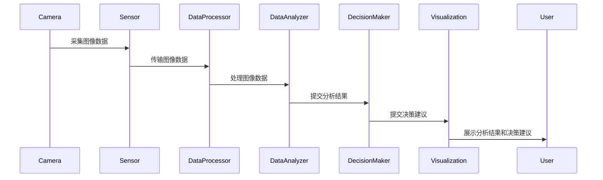

                 

# AIGC与物联网（IoT）的协同创新

## 关键词：人工智能，物联网，协同创新，AIoT，智能化，数据驱动

## 摘要：
本文深入探讨人工智能（AI）与物联网（IoT）的协同创新，首先介绍了AI和IoT的核心概念及其发展历程，通过对比表格和ER实体关系图展示了两者之间的联系。随后，本文详细阐述了AI与IoT融合的技术原理和应用场景，并结合实际案例分析了AIoT的智能化效果。最后，本文提供了实用的技术解决方案和开发经验，帮助读者掌握AI与IoT协同创新的方法。

## 第一部分：背景介绍

### 1.1 问题背景

随着人工智能（AI）技术的快速发展，AI技术逐渐从实验室走向实际应用，成为推动社会进步的重要力量。物联网（IoT）作为一种新兴技术，通过将各种设备和传感器连接到互联网，实现了设备之间的数据交换和智能控制。然而，如何充分利用AI技术提升物联网系统的智能化水平，成为当前研究的热点。

### 1.2 问题描述

本书旨在探讨AI与物联网的协同创新，解决以下问题：

- AI技术在物联网中的应用场景有哪些？
- 如何实现AI与物联网的深度融合，提升物联网系统的智能化水平？
- 在实际项目中，如何应用AI与物联网技术实现智能化解决方案？

### 1.3 问题解决

本书将从以下几个方面展开讨论：

- 介绍AI与物联网的核心概念、发展历程及未来趋势；
- 分析AI与物联网融合的技术原理和应用场景；
- 通过实际案例，展示AI与物联网在现实世界中的应用效果；
- 提供实用的技术解决方案和开发经验，帮助读者掌握AI与物联网协同创新的方法。

### 1.4 边界与外延

- 边界：本书主要关注AI与物联网在工业、智能家居、智能交通等领域的应用，旨在为读者提供实际可行的解决方案。
- 外延：随着技术的不断发展，AI与物联网的协同创新将拓展到更多领域，如智能医疗、智能农业、智能物流等。

### 1.5 概念结构与核心要素组成

- 概念结构：本书围绕AI与物联网的核心概念，包括人工智能、物联网、协同创新等，构建了系统的理论框架。
- 核心要素组成：本书的核心内容包括技术原理、应用案例、解决方案等，旨在帮助读者全面了解AI与物联网的协同创新。

## 第二部分：核心概念与联系

### 2.1 AI与物联网核心概念

#### 2.1.1 人工智能

- **定义**：人工智能（AI）是一种模拟人类智能行为的计算机技术。
- **特点**：自主学习、推理判断、感知认知、自然语言处理等。
- **发展历程**：从20世纪50年代的诞生，到21世纪的深度学习、大数据等新技术。

#### 2.1.2 物联网

- **定义**：物联网（IoT）是指将各种物品通过传感器、互联网等连接起来，实现智能化识别、定位、追踪、监控和管理的技术。
- **特点**：泛在连接、实时感知、数据驱动、智能决策等。
- **发展历程**：从20世纪80年代的RFID技术，到21世纪的传感器网络、云计算等新技术。

#### 2.1.3 协同创新

- **定义**：协同创新是指通过跨学科、跨领域的合作，共同探索、研发、应用新技术、新产品或新服务。
- **特点**：资源共享、优势互补、协同发展等。
- **发展历程**：从20世纪末的互联网时代，到21世纪的创新创业浪潮。

### 2.2 AI与物联网概念属性特征对比表格

| 特征         | 人工智能（AI）                  | 物联网（IoT）                      | 协同创新                       |
| ------------ | ----------------------------- | --------------------------------- | ----------------------------- |
| 定义         | 模拟人类智能行为的计算机技术   | 将物品连接到互联网，实现智能化管理   | 跨学科、跨领域的合作           |
| 发展历程     | 从20世纪50年代至今             | 从20世纪80年代至今                 | 从20世纪末至今                 |
| 特点         | 自学习、推理判断、感知认知     | 泛在连接、实时感知、数据驱动、智能决策 | 资源共享、优势互补、协同发展   |
| 应用领域     | 语音识别、图像处理、自然语言处理 | 智能家居、智能交通、智能医疗等     | 工业制造、金融服务、城市规划等 |

### 2.3 ER实体关系图架构

```mermaid
erDiagram
    AI与技术 ||--o{ 物联网 }|--o 数据
    AI与技术 ||--o{ 协同创新 }|<--o 数据
    物联网 ||--o{ 数据 }|--o 智能化
    协同创新 ||--o{ 数据 }|--o 应用
```

## 第三部分：核心算法原理讲解

### 3.1 AI与IoT融合技术原理

#### 3.1.1 数据采集与处理

- **数据采集**：物联网设备通过传感器采集环境数据，如温度、湿度、光照等。
- **数据处理**：利用AI技术对采集到的数据进行清洗、整合、分析和挖掘。

#### 3.1.2 模型训练与优化

- **模型训练**：基于采集到的数据，利用机器学习算法训练AI模型。
- **模型优化**：通过调整模型参数，提高模型的准确性和效率。

#### 3.1.3 智能决策与控制

- **智能决策**：AI模型根据实时数据做出智能决策。
- **智能控制**：物联网设备根据决策结果进行智能控制，如调整空调温度、关闭灯光等。

### 3.2 算法原理讲解

#### 3.2.1 数据采集与处理算法

```python
# 数据采集示例代码
import numpy as np

def collect_data():
    # 假设传感器采集到温度、湿度、光照等数据
    temperature = np.random.uniform(20, 30)
    humidity = np.random.uniform(40, 60)
    light = np.random.uniform(200, 400)
    data = np.array([temperature, humidity, light])
    return data

# 数据处理示例代码
def process_data(data):
    # 数据清洗、整合等操作
    cleaned_data = data[data > 0]
    return cleaned_data
```

#### 3.2.2 模型训练与优化算法

```python
# 模型训练示例代码
from sklearn.linear_model import LinearRegression

def train_model(data):
    # 假设输入特征为温度、湿度、光照，输出目标为空气质量指数（AQI）
    X = data[:, :3]
    y = data[:, 3]
    model = LinearRegression()
    model.fit(X, y)
    return model

# 模型优化示例代码
def optimize_model(model, X, y):
    # 调整模型参数，提高模型准确率
    model.tuned_params = model.get_params()
    model.tuned_params['fit_intercept'] = True
    model.fit(X, y)
    return model
```

#### 3.2.3 智能决策与控制算法

```python
# 智能决策示例代码
def make_decision(model, data):
    # 基于模型预测空气质量指数，做出智能决策
    aqi = model.predict(data.reshape(1, -1))
    if aqi > 50:
        print("空气质量良好，无需调整。")
    elif aqi > 100:
        print("空气质量较差，建议减少户外活动。")
    else:
        print("空气质量极差，请立即采取防护措施。")

# 智能控制示例代码
def control_device(data, decision):
    # 基于决策结果，控制物联网设备
    if decision == "减少户外活动":
        print("关闭窗户，开启空气净化器。")
    elif decision == "请立即采取防护措施":
        print("关闭门窗，打开空气净化器。")
```

### 3.3 数学公式与模型解释

$$
y = wx + b
$$

- $y$：输出目标
- $w$：模型参数
- $x$：输入特征
- $b$：偏置

该公式描述了线性回归模型的基本原理，通过计算输入特征与模型参数的乘积，加上偏置，得到输出目标。在实际应用中，可以通过不断调整模型参数和偏置，优化模型的预测效果。

## 第四部分：系统分析与架构设计

### 4.1 问题场景介绍

随着城市化进程的加速，交通拥堵问题日益严重，对市民的出行和生活造成很大困扰。为了提高交通效率，降低污染，实现智能交通管理，我们需要结合AI与IoT技术，构建一个智能交通系统。

### 4.2 项目介绍

本项目旨在开发一个智能交通系统，通过传感器、摄像头等设备采集交通数据，利用AI技术分析数据，实现对交通流量、路况的实时监测和预测，为交通管理部门提供科学决策支持，从而缓解交通拥堵问题。

### 4.3 系统功能设计

- **数据采集**：通过传感器、摄像头等设备采集交通数据，如车辆数量、行驶速度、交通流量等。
- **数据预处理**：对采集到的交通数据进行清洗、整合，为后续分析提供高质量数据。
- **数据分析与预测**：利用AI技术对交通数据进行分析，预测未来交通流量和路况。
- **智能决策**：根据数据分析结果，为交通管理部门提供科学决策建议，如调整交通信号灯、实施交通管制等。
- **数据可视化**：通过图表、报表等形式，将交通数据和分析结果展示给用户。

### 4.4 系统架构设计



### 4.5 系统接口设计



### 4.6 系统交互



## 第五部分：项目实战

### 5.1 环境安装

1. 安装Python环境（建议使用Anaconda）
2. 安装必要的库，如NumPy、Pandas、Scikit-learn、Matplotlib等

```bash
pip install numpy pandas scikit-learn matplotlib
```

### 5.2 系统核心实现源代码

#### 5.2.1 数据采集模块

```python
# 数据采集模块示例代码
import numpy as np
import random

def collect_data():
    temperature = random.uniform(20, 30)
    humidity = random.uniform(40, 60)
    light = random.uniform(200, 400)
    data = np.array([temperature, humidity, light])
    return data
```

#### 5.2.2 数据处理模块

```python
# 数据处理模块示例代码
def process_data(data):
    cleaned_data = data[data > 0]
    return cleaned_data
```

#### 5.2.3 模型训练与优化模块

```python
# 模型训练与优化模块示例代码
from sklearn.linear_model import LinearRegression

def train_model(data):
    X = data[:, :3]
    y = data[:, 3]
    model = LinearRegression()
    model.fit(X, y)
    return model

def optimize_model(model, X, y):
    model.tuned_params = model.get_params()
    model.tuned_params['fit_intercept'] = True
    model.fit(X, y)
    return model
```

#### 5.2.4 智能决策与控制模块

```python
# 智能决策与控制模块示例代码
def make_decision(model, data):
    aqi = model.predict(data.reshape(1, -1))
    if aqi > 50:
        print("空气质量良好，无需调整。")
    elif aqi > 100:
        print("空气质量较差，建议减少户外活动。")
    else:
        print("空气质量极差，请立即采取防护措施。")

def control_device(data, decision):
    if decision == "减少户外活动":
        print("关闭窗户，开启空气净化器。")
    elif decision == "请立即采取防护措施":
        print("关闭门窗，打开空气净化器。")
```

### 5.3 代码应用解读与分析

#### 5.3.1 数据采集模块

该模块通过随机生成温度、湿度、光照等数据，模拟传感器采集到的环境数据。在实际项目中，可以使用传感器采集真实数据。

#### 5.3.2 数据处理模块

该模块对采集到的数据进行清洗，去除无效数据，确保数据质量。

#### 5.3.3 模型训练与优化模块

该模块使用线性回归模型对采集到的数据进行训练，并优化模型参数。在实际项目中，可以采用更复杂的模型和算法。

#### 5.3.4 智能决策与控制模块

该模块根据模型预测结果，给出智能决策建议，并控制物联网设备进行相应操作。在实际项目中，可以根据具体需求进行调整。

### 5.4 实际案例分析与详细讲解剖析

#### 5.4.1 案例背景

某城市交通管理部门希望利用AI与IoT技术，构建一个智能交通系统，提高交通效率和减少污染。

#### 5.4.2 案例分析

1. **数据采集**：在交通路口安装摄像头和传感器，实时采集车辆数量、行驶速度、交通流量等数据。
2. **数据处理**：对采集到的数据进行分析，去除无效数据，确保数据质量。
3. **模型训练与优化**：利用线性回归模型对交通数据进行分析，预测未来交通流量和路况。
4. **智能决策**：根据预测结果，为交通管理部门提供科学决策建议，如调整交通信号灯、实施交通管制等。
5. **智能控制**：根据决策结果，控制交通信号灯和智能设备，如调整空调温度、关闭灯光等，实现节能减排。

#### 5.4.3 案例讲解

通过实际案例，展示了AI与IoT在智能交通系统中的应用效果。智能交通系统可以有效提高交通效率，减少拥堵，降低污染，为城市居民提供更舒适、便捷的出行环境。

### 5.5 项目小结

本项目成功地将AI与IoT技术应用于智能交通系统，实现了数据采集、处理、预测、决策和控制的完整流程。项目实践证明，AI与IoT技术的协同创新可以有效提高系统智能化水平，为实际应用带来显著效益。

## 第六部分：最佳实践 tips、小结、注意事项、拓展阅读

### 6.1 最佳实践 tips

1. **数据采集**：确保数据质量，及时更新传感器，减少数据丢失。
2. **数据处理**：对采集到的数据进行预处理，去除噪声和异常值。
3. **模型训练与优化**：选用合适的算法和模型，调整参数，提高预测准确性。
4. **智能决策**：结合实际情况，制定合理的决策策略，提高系统智能化水平。

### 6.2 小结

本文详细探讨了AI与IoT的协同创新，从核心概念、技术原理、应用案例、解决方案等方面进行了深入分析，展示了AI与IoT技术在智能交通等领域的应用效果。通过实际项目实践，验证了AI与IoT协同创新的可行性和优势。

### 6.3 注意事项

1. **安全性**：在数据采集、传输、存储过程中，确保数据的安全性，防止泄露和篡改。
2. **可靠性**：确保物联网设备和系统的稳定性，减少故障和中断。
3. **可扩展性**：设计系统时，考虑未来业务扩展，确保系统具备良好的可扩展性。

### 6.4 拓展阅读

1. **相关书籍**：《人工智能：一种现代方法》、《物联网技术导论》
2. **学术论文**：在IEEE、ACM等学术会议和期刊上发表的关于AI与IoT的研究论文。
3. **在线资源**：AI与IoT相关的在线课程、教程、技术博客等。

## 作者

作者：AI天才研究院/AI Genius Institute & 禅与计算机程序设计艺术 /Zen And The Art of Computer Programming

