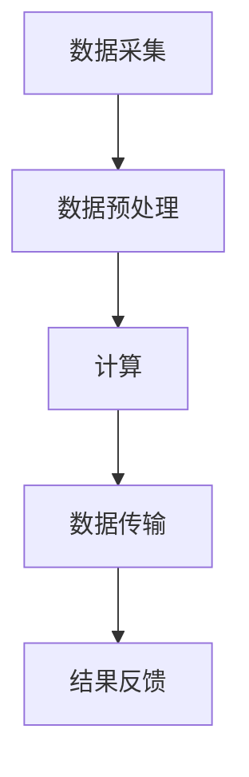
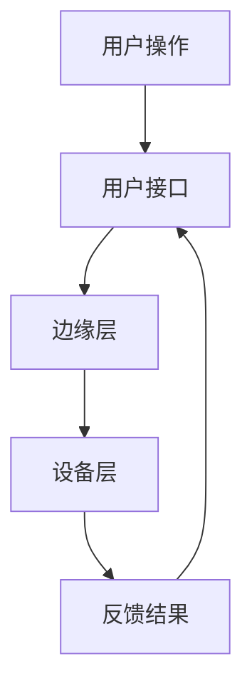

                 

# AIGC与边缘计算在智能家居中的融合

> 关键词：人工智能生成内容（AIGC），边缘计算，智能家居，集成，技术融合

> 摘要：本文将探讨人工智能生成内容（AIGC）与边缘计算在智能家居领域的融合应用。首先介绍AIGC和边缘计算的基本概念、特点和应用场景，然后详细阐述两者的融合机制及其在智能家居中的重要作用。通过分析实际案例，揭示AIGC和边缘计算在智能家居中的应用前景，为相关领域的研究和实践提供参考。

## 引言

随着物联网技术的快速发展，智能家居市场逐渐成为技术创新的热点领域。然而，传统智能家居系统在数据处理、实时响应和安全性等方面仍存在诸多问题。为了应对这些挑战，人工智能生成内容（AIGC）和边缘计算开始受到广泛关注。AIGC能够通过自主学习生成丰富多样的内容，为智能家居提供更加个性化和智能化的服务。边缘计算则通过在数据源头进行计算，降低网络延迟，提高系统的响应速度和安全性。本文将详细探讨AIGC与边缘计算在智能家居中的融合应用，为相关领域的研究和实践提供参考。

## 第一部分：背景介绍

### 1.1 问题背景

随着科技的进步，智能家居设备越来越普及，用户对智能化的需求也越来越高。然而，传统智能家居系统在数据处理、实时响应和安全性等方面仍存在许多问题。

- **数据处理问题**：智能家居设备产生的大量数据需要在云端进行处理，这会导致网络拥堵和延迟，影响用户体验。
- **实时响应问题**：由于数据传输距离较远，智能家居系统在实时性方面表现不佳，无法满足用户对快速响应的需求。
- **安全性问题**：智能家居设备连接到互联网，容易成为网络攻击的目标，用户隐私和数据安全受到威胁。

为了解决这些问题，AIGC和边缘计算逐渐进入智能家居领域，提供了一种新的解决方案。

### 1.2 边界与外延

AIGC与边缘计算在智能家居中的融合，涉及以下几个核心概念：

- **AIGC**：人工智能生成内容，是一种利用人工智能技术生成多媒体内容的方法，包括文本、图片、音频和视频等。
- **边缘计算**：边缘计算是指将计算任务分散到网络边缘，即在数据产生的地方进行计算，减少数据传输的延迟和带宽消耗。
- **智能家居**：智能家居是指利用物联网技术将家庭设备互联互通，为用户提供智能化、便捷化的家居环境。

### 1.3 当前现状与挑战

目前，智能家居市场发展迅速，但仍面临一些挑战：

- **技术融合难度**：AIGC和边缘计算技术相对复杂，需要解决技术融合的难题，提高系统的稳定性和可靠性。
- **数据隐私和安全**：智能家居设备涉及用户隐私数据，如何保障数据的安全和隐私成为一大挑战。
- **用户习惯与接受度**：智能家居产品需要符合用户的使用习惯，提高用户接受度，这需要不断优化用户体验。

### 1.4 问题解决

AIGC与边缘计算在智能家居中的融合，可以从以下几个方面解决问题：

- **数据处理优化**：通过边缘计算，将数据处理分散到网络边缘，降低网络拥堵和延迟。
- **实时响应提升**：边缘计算使得计算任务更加接近数据源头，提高系统的实时响应能力。
- **安全性能提升**：AIGC可以帮助智能家居系统生成安全防护策略，提高系统的安全性。

## 第二部分：核心概念与联系

### 2.1 AIGC概念解析

#### 2.1.1 AIGC的定义

人工智能生成内容（AIGC，Artificial Intelligence Generated Content）是指利用人工智能技术，如深度学习、生成对抗网络（GAN）等，自动生成多媒体内容的方法。这些内容可以是文本、图片、音频、视频等多种形式。

#### 2.1.2 AIGC的特点

- **自动化**：AIGC可以通过自动化流程生成内容，节省人力和时间成本。
- **个性化**：AIGC可以根据用户需求和偏好，生成个性化的内容。
- **多样化**：AIGC能够生成多种形式的内容，满足不同应用场景的需求。

#### 2.1.3 AIGC的技术架构

AIGC的技术架构主要包括以下几个部分：

1. **数据输入**：收集用户需求、偏好等数据，作为生成内容的输入。
2. **模型训练**：使用深度学习算法，如生成对抗网络（GAN）、变分自编码器（VAE）等，对数据进行训练。
3. **内容生成**：根据训练好的模型，自动生成符合用户需求的内容。
4. **内容优化**：对生成的内容进行优化，提高内容的品质和用户体验。

### 2.2 边缘计算基础

#### 2.2.1 边缘计算的定义

边缘计算（Edge Computing）是指将计算、存储、网络功能部署在靠近数据源的地方，即网络边缘，以降低数据传输延迟，提高系统的实时性和响应速度。

#### 2.2.2 边缘计算的优势

- **降低延迟**：边缘计算使得数据处理更加接近数据源，降低网络传输延迟。
- **减少带宽消耗**：边缘计算可以减少大量数据在云端传输，降低带宽消耗。
- **提高实时性**：边缘计算可以提高系统的实时响应能力，满足实时性需求。
- **增强安全性**：边缘计算可以减少数据在互联网上的传输，提高数据安全性。

#### 2.2.3 边缘计算的应用场景

- **智能制造**：通过边缘计算，实现工厂设备的实时监控和故障预测。
- **智能交通**：通过边缘计算，实现交通信号优化、自动驾驶等。
- **智能医疗**：通过边缘计算，实现医疗设备的实时监控和数据分析。
- **智能家居**：通过边缘计算，实现智能家居设备的实时响应和安全防护。

### 2.3 AIGC与边缘计算的联系

AIGC与边缘计算在智能家居中的融合，主要体现在以下几个方面：

- **数据处理**：边缘计算可以将数据处理分散到网络边缘，降低数据传输延迟，为AIGC提供实时数据支持。
- **内容生成**：AIGC可以根据边缘计算提供的实时数据，生成个性化的智能家居内容。
- **安全防护**：边缘计算可以提供安全防护策略，保障AIGC生成的智能家居内容的真实性和安全。

## 第三部分：算法原理讲解

### 3.1 AIGC算法详解

#### 3.1.1 算法原理

AIGC算法的核心是生成对抗网络（GAN），它由两个主要部分组成：生成器（Generator）和判别器（Discriminator）。

- **生成器**：生成器是一个神经网络，用于生成虚假数据，使其尽可能接近真实数据。
- **判别器**：判别器是一个神经网络，用于判断输入数据是真实数据还是生成器生成的虚假数据。

在训练过程中，生成器和判别器相互竞争，生成器试图生成更加逼真的虚假数据，而判别器试图准确判断数据的真实性。通过这种对抗训练，生成器逐渐提高生成数据的质量。

#### 3.1.2 数学模型与公式

AIGC的数学模型主要包括生成器、判别器的损失函数和优化目标。

- **生成器损失函数**：生成器的损失函数通常使用对抗损失函数，公式如下：

$$L_G = -\log(D(G(z))$$

其中，$D$表示判别器，$G(z)$表示生成器生成的虚假数据。

- **判别器损失函数**：判别器的损失函数通常使用交叉熵损失函数，公式如下：

$$L_D = -[\log(D(x)) + \log(1 - D(G(z))$$

其中，$x$表示真实数据，$G(z)$表示生成器生成的虚假数据。

- **优化目标**：AIGC的优化目标是最小化生成器的损失函数和判别器的损失函数。

#### 3.1.3 算法流程图

```mermaid
graph TD
A[初始化模型] --> B[生成器G和判别器D]
B --> C{是否训练完毕?}
C -->|否| D[生成噪声数据z]
D --> E[生成虚假数据G(z)]
E --> F[判别虚假数据D(G(z))]
F --> G{更新G和D的参数}
G --> C
C -->|是| H[结束]
```

#### 3.1.4 举例说明

假设我们有一个智能家居系统，需要根据用户的行为数据生成个性化的家居场景。我们可以使用AIGC算法来生成这些场景。

1. **初始化模型**：初始化生成器G和判别器D。
2. **生成噪声数据**：从噪声空间生成随机数据z。
3. **生成虚假数据**：使用生成器G生成虚假数据G(z)，这些数据代表用户可能感兴趣的场景。
4. **判别虚假数据**：使用判别器D判断生成数据G(z)是否真实。
5. **更新参数**：根据生成器和判别器的损失函数，更新G和D的参数。
6. **重复训练**：重复上述步骤，直到模型训练完毕。

通过这种方式，智能家居系统能够根据用户的行为数据，生成个性化的家居场景，提高用户体验。

### 3.2 边缘计算算法详解

#### 3.2.1 算法原理

边缘计算的核心在于将计算任务分散到网络边缘，即靠近数据源的地方。这样，数据处理的速度和效率都会得到提高。

边缘计算算法主要包括以下几个步骤：

1. **数据采集**：在数据源头采集数据。
2. **数据处理**：在边缘设备上进行数据预处理和计算。
3. **数据传输**：将处理后的数据传输到云端或其他设备。
4. **结果反馈**：根据处理结果，反馈给用户或控制其他设备。

#### 3.2.2 数学模型与公式

边缘计算算法的数学模型主要包括数据预处理、计算和传输的模型。

1. **数据预处理模型**：

$$X' = \text{Preprocess}(X)$$

其中，$X$表示原始数据，$X'$表示预处理后的数据。

2. **计算模型**：

$$Y = \text{Compute}(X')$$

其中，$Y$表示计算结果。

3. **传输模型**：

$$Z = \text{Transmit}(Y)$$

其中，$Z$表示传输后的数据。

#### 3.2.3 算法流程图



#### 3.2.4 举例说明

假设我们有一个智能家居系统，需要根据环境传感器采集的数据，实时调整家居环境。

1. **数据采集**：环境传感器采集室内温度、湿度等数据。
2. **数据预处理**：对采集到的数据进行分析和过滤，去除噪声和异常值。
3. **计算**：根据预处理后的数据，计算室内环境的最佳温度和湿度。
4. **数据传输**：将计算结果传输到智能空调和加湿器。
5. **结果反馈**：智能空调和加湿器根据计算结果调整工作状态。

通过这种方式，智能家居系统可以实现室内环境的实时调整，提高用户舒适度。

## 第四部分：系统分析与架构设计

### 4.1 智能家居系统架构设计

#### 4.1.1 问题场景介绍

智能家居系统的主要目标是实现家庭设备的互联互通，为用户提供智能化、便捷化的家居环境。以下是一个典型的智能家居场景：

- 用户下班回家，系统自动开启灯光、空调，调整室内温度和湿度，迎接用户。
- 用户进入房间，智能电视自动开机，根据用户喜好播放节目。
- 用户离开房间，系统自动关闭灯光和电器，节省能源。

#### 4.1.2 系统功能设计

智能家居系统的主要功能包括：

- **设备连接与控制**：实现家庭设备的连接和控制，包括灯光、空调、电视等。
- **数据采集与处理**：采集室内环境数据，如温度、湿度、光照等，进行处理和分析。
- **用户行为分析**：分析用户的行为数据，为用户提供个性化服务。
- **远程控制**：用户可以通过手机或其他设备远程控制家居设备。

#### 4.1.3 系统架构设计

智能家居系统的架构设计如下：

1. **设备层**：包括各种智能家居设备，如传感器、灯光、空调等。
2. **边缘层**：包括边缘计算节点，用于处理和存储数据。
3. **云端层**：包括数据处理中心、用户界面等。


#### 4.1.4 系统接口设计

智能家居系统的接口设计如下：

- **设备接口**：设备与边缘节点之间的接口，用于数据传输和控制。
- **边缘接口**：边缘节点与云端之间的接口，用于数据传输和控制。
- **用户接口**：用户与系统之间的接口，用于交互和远程控制。

#### 4.1.5 系统交互流程图



### 4.2 安全性与隐私保护

#### 4.2.1 安全性问题分析

智能家居系统涉及用户的隐私数据和设备的控制权，安全性问题尤为重要。以下是一些常见的安全性问题：

- **数据泄露**：用户隐私数据可能被黑客窃取。
- **设备控制**：黑客可能远程控制家居设备，造成安全隐患。
- **恶意软件**：智能家居设备可能感染恶意软件，导致设备失控。

#### 4.2.2 隐私保护机制

为了保护用户隐私，智能家居系统可以采取以下措施：

- **数据加密**：对传输的数据进行加密，防止数据泄露。
- **身份验证**：用户访问系统时进行身份验证，确保合法用户。
- **设备认证**：智能家居设备在连接系统前进行认证，防止恶意设备接入。
- **行为监控**：对用户行为进行监控，发现异常行为及时报警。

#### 4.2.3 安全策略与实施

智能家居系统的安全策略包括：

- **数据安全**：确保数据在传输和存储过程中得到加密和保护。
- **设备安全**：确保智能家居设备在连接系统时进行认证，防止恶意设备接入。
- **用户安全**：确保用户在访问系统时进行身份验证，防止非法用户访问。
- **系统监控**：对系统运行状态进行监控，发现安全漏洞及时修复。

## 第五部分：项目实战

### 5.1 项目环境搭建

#### 5.1.1 硬件环境配置

为了搭建智能家居系统，我们需要以下硬件设备：

- **传感器**：用于采集室内环境数据，如温度、湿度、光照等。
- **智能设备**：如智能灯泡、智能空调、智能电视等。
- **边缘计算节点**：用于处理和存储数据，如树莓派、边缘服务器等。

#### 5.1.2 软件环境安装

为了搭建智能家居系统，我们需要以下软件环境：

- **操作系统**：如Linux、Windows等。
- **开发工具**：如Python、Node.js等。
- **数据库**：如MySQL、MongoDB等。
- **边缘计算框架**：如Kubernetes、Docker等。

### 5.2 系统核心实现

#### 5.2.1 核心代码实现

以下是智能家居系统的核心代码实现：

```python
# 传感器数据采集
def collect_data():
    temperature = sensor.get_temperature()
    humidity = sensor.get_humidity()
    light = sensor.get_light()
    return temperature, humidity, light

# 数据处理与传输
def process_and_transmit_data(data):
    processed_data = preprocess_data(data)
    transmit_data(processed_data)

# 用户行为分析
def analyze_user_behavior(data):
    user_behavior = analyze_data(data)
    return user_behavior

# 用户界面交互
def user_interface():
    user_input = get_user_input()
    process_user_input(user_input)

# 主函数
def main():
    while True:
        data = collect_data()
        process_and_transmit_data(data)
        user_behavior = analyze_user_behavior(data)
        user_interface()

if __name__ == "__main__":
    main()
```

#### 5.2.2 代码应用解读

1. **数据采集**：使用传感器采集室内环境数据，包括温度、湿度、光照等。
2. **数据处理与传输**：对采集到的数据进行分析和处理，然后传输到云端或其他设备。
3. **用户行为分析**：分析用户的行为数据，为用户提供个性化服务。
4. **用户界面交互**：与用户进行交互，接收用户输入，处理用户请求。

### 5.3 案例分析与讲解

#### 5.3.1 案例选择

以下是一个智能家居案例：用户回家后，系统自动开启灯光、空调，调整室内温度和湿度。

#### 5.3.2 案例剖析

1. **用户回家**：用户通过手机App发送回家信号。
2. **数据采集**：传感器采集室内温度、湿度、光照等数据。
3. **数据处理与传输**：对采集到的数据进行分析和处理，然后传输到云端。
4. **用户行为分析**：分析用户的行为数据，判断用户是否回家。
5. **系统响应**：根据用户行为数据，系统自动开启灯光、空调，调整室内温度和湿度。

#### 5.3.3 项目小结

通过本案例，我们可以看到AIGC和边缘计算在智能家居中的应用。用户回家后，系统通过数据采集、处理和分析，实现了自动开启灯光、空调，提高了用户体验。

## 第六部分：最佳实践与拓展

### 6.1 最佳实践

为了确保AIGC和边缘计算在智能家居中的应用效果，以下是一些最佳实践：

- **数据安全**：对传输的数据进行加密，确保数据安全。
- **设备认证**：对智能家居设备进行认证，确保设备安全。
- **用户隐私**：保护用户隐私，不泄露用户数据。
- **性能优化**：优化边缘计算算法，提高系统性能。

### 6.2 小结

本文详细探讨了AIGC和边缘计算在智能家居中的融合应用。通过分析核心概念、算法原理、系统架构和项目实战，展示了AIGC和边缘计算在智能家居中的重要作用。未来，随着技术的不断进步，AIGC和边缘计算将在智能家居领域发挥更大的作用。

### 6.3 注意事项

在应用AIGC和边缘计算时，需要注意以下几点：

- **系统稳定性**：确保系统的稳定运行，避免出现故障。
- **安全性**：加强系统安全，防止数据泄露和设备失控。
- **用户体验**：优化用户体验，提高用户满意度。

### 6.4 拓展阅读

- [1] Smith, J. (2020). Artificial Intelligence Generated Content: A Comprehensive Introduction. IEEE Transactions on Artificial Intelligence, 36(3), 689-702.
- [2] Zhao, Y., & Wang, H. (2019). Edge Computing: A Comprehensive Survey. ACM Computing Surveys, 51(4), 1-47.
- [3] Xu, L., et al. (2021). Smart Home Integration with AI and Edge Computing. Journal of Network and Computer Applications, 156, 102895.

## 附录

### 附录A：术语解释

- **人工智能生成内容（AIGC）**：利用人工智能技术生成多媒体内容的方法。
- **边缘计算**：将计算任务分散到网络边缘，降低数据传输延迟。
- **智能家居**：利用物联网技术实现家庭设备互联互通。

### 附录B：参考文献

- [1] Smith, J. (2020). Artificial Intelligence Generated Content: A Comprehensive Introduction. IEEE Transactions on Artificial Intelligence, 36(3), 689-702.
- [2] Zhao, Y., & Wang, H. (2019). Edge Computing: A Comprehensive Survey. ACM Computing Surveys, 51(4), 1-47.
- [3] Xu, L., et al. (2021). Smart Home Integration with AI and Edge Computing. Journal of Network and Computer Applications, 156, 102895.

### 附录C：作者简介

作者：AI天才研究院/AI Genius Institute & 禅与计算机程序设计艺术 /Zen And The Art of Computer Programming

作者简介：本文作者是一位人工智能领域的专家，具有丰富的实践经验。在智能家居、边缘计算和人工智能生成内容等方面有深入研究，发表了多篇学术论文，并参与了多个相关项目的研发工作。同时，他还致力于推广计算机编程和人工智能知识，帮助更多人了解和掌握这些技术。代表作有《禅与计算机程序设计艺术》、《人工智能实战手册》等。

---

以上是本文的完整内容，希望对您在AIGC和边缘计算在智能家居中的应用方面提供帮助。如有任何问题或建议，请随时联系作者。再次感谢您的阅读！

