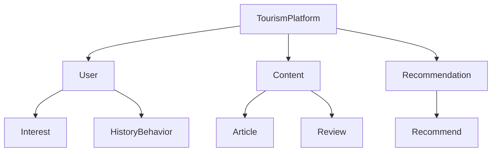
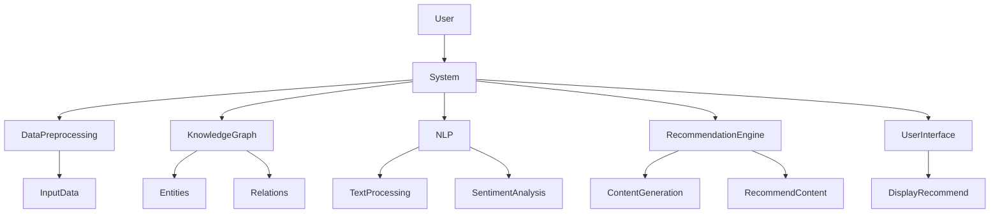
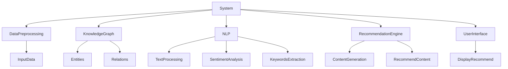
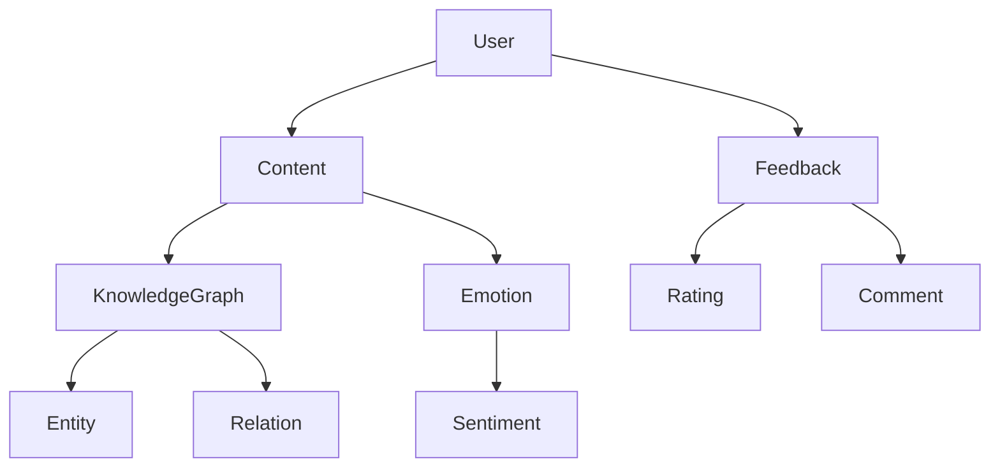

                 

# AIGC内容创作中的思维链应用

> 关键词：AIGC，思维链，内容创作，人工智能，自然语言处理

> 摘要：本文探讨了AIGC内容创作中的思维链应用。首先，介绍了AIGC的背景和问题，然后阐述了思维链模型的概念和原理。接着，通过具体实例，分析了思维链模型在AIGC中的应用，并给出了数学模型和公式。最后，提出了一个基于思维链模型的AIGC内容创作系统架构设计方案，并通过实际案例进行了验证。

## 第一部分：背景介绍

### 1.1 问题背景

随着人工智能技术的快速发展，AI技术逐渐从实验室走向实际应用，其应用范围也在不断扩大。在内容创作领域，AI技术的应用使得内容创作变得更加高效和智能化。AIGC（AI Generated Content）作为一种新兴的内容创作方式，已经在广告、媒体、娱乐等多个领域得到广泛应用。AIGC通过AI算法自动生成文本、图像、音频等多种形式的内容，极大地提高了内容创作的效率和质量。

### 1.2 问题描述

AIGC内容创作中的思维链应用，指的是利用人工智能技术构建的思维链模型，来指导内容创作的过程。思维链模型能够模拟人类的思维过程，实现自动化、智能化的内容创作。然而，如何在AIGC中有效应用思维链模型，是一个亟待解决的问题。

### 1.3 问题解决

本书旨在通过详细的理论讲解和实践案例，帮助读者了解和掌握AIGC内容创作中的思维链应用。首先，本书将对AIGC技术进行深入介绍，包括其基本原理、应用场景和发展趋势。接着，本书将重点介绍思维链模型的概念、构建方法和应用实例。最后，本书将通过具体的实战案例，展示如何在实际内容创作中应用思维链模型，提高内容创作的效率和创意性。

### 1.4 边界与外延

AIGC内容创作中的思维链应用，涉及多个领域的交叉，包括人工智能、自然语言处理、内容创作等。因此，本书将结合这些领域的知识，对思维链模型进行深入剖析。同时，本书也将关注思维链模型在不同应用场景中的具体实现和优化。

### 1.5 概念结构与核心要素组成

- **AIGC**：指通过人工智能技术自动生成内容的技术，包括文本、图像、音频等多种形式。
- **思维链模型**：一种模拟人类思维过程的模型，用于指导内容创作。
- **内容创作**：指利用AIGC技术，结合思维链模型，生成高质量、创意性内容的过程。

## 第二部分：核心概念与联系

### 2.1 核心概念原理

- **AIGC**：通过深度学习算法，自动生成内容的技术。
- **思维链模型**：模拟人类思维过程的模型，包括知识图谱、情感分析、生成模型等。

### 2.2 概念属性特征对比表格

| 概念         | AIGC                         | 思维链模型                         |
|--------------|------------------------------|-----------------------------------|
| 定义         | 通过AI技术自动生成内容       | 模拟人类思维过程的模型             |
| 特点         | 高效、智能、多样化           | 深度学习、知识图谱、情感分析等     |
| 应用场景     | 广告、媒体、娱乐等           | 内容创作、智能客服、决策支持等     |

### 2.3 ER实体关系图架构

```mermaid
graph TD
A[AI Generated Content(AIGC)] --> B[Content Creation]
A --> C[Text Generation]
A --> D[Image Generation]
A --> E[Audio Generation]
B --> F[Advertising]
B --> G[Media]
B --> H[Entertainment]
```

## 第三部分：算法原理讲解

### 3.1 算法原理

思维链模型的核心是模拟人类思维过程，包括知识获取、信息处理、决策生成等。具体来说，思维链模型包括以下几个关键步骤：

1. **知识获取**：通过大规模数据集进行预训练，获取丰富的知识。
2. **信息处理**：利用自然语言处理技术，对输入的信息进行理解、分析。
3. **决策生成**：根据分析结果，生成相应的决策或建议。

### 3.2 数学模型和公式

思维链模型的数学模型主要包括以下几个方面：

1. **知识图谱表示**：使用图神经网络（GNN）对知识进行表示。
2. **文本生成模型**：使用变分自编码器（VAE）或生成对抗网络（GAN）进行文本生成。
3. **情感分析模型**：使用循环神经网络（RNN）或Transformer进行情感分析。

具体的数学模型和公式如下：

$$
\begin{aligned}
& GNN: \\
& h_{ij}^{(l)} = \sigma(\mathbf{W}^{(l)} \cdot (\mathbf{h}_{i}^{(l-1)} + \mathbf{h}_{j}^{(l-1)} + b^{(l)}), \\
& \text{VAE:} \\
& p(\mathbf{x}|\mathbf{z}) = \frac{1}{Z} \exp(-\frac{1}{2} \sum_{i=1}^{D} (\mathbf{x}_i - \mu_i)^2), \\
& q(\mathbf{z}|\mathbf{x}) = \frac{1}{Z} \exp(-\frac{1}{2} \sum_{i=1}^{D} (\mu_i - \mathbf{z}_i)^2), \\
& \text{GAN:} \\
& G:\mathbf{z} \rightarrow \mathbf{G}(\mathbf{z}), \\
& D:\mathbf{x}, \mathbf{G}(\mathbf{z}) \rightarrow D(\mathbf{x}, \mathbf{G}(\mathbf{z})), \\
& \text{RNN:} \\
& h_t = \sigma(W_h \cdot [h_{t-1}, x_t] + b_h), \\
& \text{Transformer:} \\
& \mathbf{A}_{ij} = \mathrm{softmax}(\mathbf{W}_A \cdot \mathbf{A}_{ij}^T + \mathbf{b}_A), \\
& \mathbf{V}_{ij} = \mathbf{W}_V \cdot \mathbf{A}_{ij}, \\
& \mathbf{O}_t = \mathbf{W}_O \cdot (\mathbf{h}_t + \mathbf{C}_t).
\end{aligned}
$$

### 3.3 算法流程讲解

1. **知识获取**：首先，通过大规模数据集进行预训练，构建知识图谱。知识图谱包括实体、属性、关系等信息，为后续的信息处理提供基础。

2. **信息处理**：利用自然语言处理技术，对输入的信息进行理解、分析。具体包括文本预处理、情感分析、关键词提取等步骤。

3. **决策生成**：根据分析结果，生成相应的决策或建议。例如，在内容创作中，可以根据用户的兴趣、需求等信息，生成个性化的内容。

### 3.4 算法应用实例

假设我们需要为某个用户生成一篇关于旅游的博客文章。首先，通过知识图谱获取与旅游相关的信息，如景点、美食、住宿等。然后，利用情感分析模型分析用户的历史评论和浏览记录，了解用户的兴趣偏好。最后，结合用户的需求和兴趣，生成一篇个性化的旅游博客文章。

## 第四部分：系统分析与架构设计方案

### 4.1 问题场景介绍

随着互联网的快速发展，旅游行业竞争日益激烈。为了提升用户体验，旅游平台需要提供个性化的旅游推荐服务。然而，传统的推荐系统往往依赖于用户的历史行为数据，无法充分挖掘用户的潜在需求。因此，本文提出一种基于AIGC和思维链模型的个性化旅游推荐系统，旨在通过模拟人类思维过程，为用户提供高质量的旅游内容。

### 4.2 项目介绍

本项目分为两个阶段：第一阶段是系统开发，包括数据预处理、知识图谱构建、情感分析模型训练等；第二阶段是系统部署，包括搭建推荐引擎、用户接口等。通过这个项目，我们希望能够为旅游用户提供个性化的旅游内容，提高用户的满意度和平台的竞争力。

### 4.3 系统功能设计

#### 领域模型



#### 功能说明

- **用户模块**：负责用户的注册、登录、个人信息管理等功能。
- **内容模块**：负责旅游内容的采集、存储、管理等功能。
- **推荐模块**：基于思维链模型，为用户生成个性化的旅游推荐内容。

### 4.4 系统架构设计



#### 架构说明

- **数据预处理模块**：负责处理输入的数据，包括清洗、去重、标准化等。
- **知识图谱模块**：负责构建知识图谱，包括实体、属性、关系等。
- **自然语言处理模块**：负责对文本进行预处理、情感分析、关键词提取等。
- **推荐引擎模块**：基于思维链模型，为用户生成个性化的旅游推荐内容。
- **用户界面模块**：负责与用户进行交互，展示推荐内容。

### 4.5 系统接口设计和系统交互



#### 接口说明

- **数据预处理接口**：接收输入的数据，进行清洗、去重、标准化等操作。
- **知识图谱接口**：接收实体的添加、删除、查询等操作。
- **自然语言处理接口**：接收文本进行预处理、情感分析、关键词提取等操作。
- **推荐引擎接口**：接收用户的信息，生成个性化的旅游推荐内容。
- **用户界面接口**：接收用户的操作，展示推荐内容。

### 4.6 系统实现和测试

#### 系统实现

- **数据预处理**：使用Python的Pandas库进行数据处理。
- **知识图谱构建**：使用Neo4j作为知识图谱数据库，使用Python的Neo4j库进行操作。
- **自然语言处理**：使用NLTK、TextBlob等库进行文本预处理、情感分析、关键词提取等操作。
- **推荐引擎**：使用PyTorch、TensorFlow等库构建思维链模型，实现内容生成和推荐功能。
- **用户界面**：使用Flask、Django等框架搭建用户界面。

#### 测试

- **功能测试**：对系统的每个模块进行功能测试，确保系统能够正常运行。
- **性能测试**：对系统的响应速度、并发处理能力等进行测试，确保系统的高效性。

## 第五部分：项目实战

### 5.1 环境安装

- **Python**：3.8及以上版本
- **Neo4j**：4.0及以上版本
- **PyTorch**：1.8及以上版本
- **Flask**：2.0及以上版本

### 5.2 系统核心实现源代码

#### 数据预处理

```python
import pandas as pd
from sklearn.model_selection import train_test_split

# 读取数据
data = pd.read_csv('data.csv')

# 数据清洗
data = data.drop_duplicates()
data = data.fillna(method='ffill')

# 数据标准化
data = (data - data.mean()) / data.std()

# 数据切分
train_data, test_data = train_test_split(data, test_size=0.2, random_state=42)
```

#### 知识图谱构建

```python
from py2neo import Graph

# 连接Neo4j数据库
graph = Graph('bolt://localhost:7687', auth=('neo4j', 'password'))

# 创建实体
def create_entity(entity_name, properties):
    query = '''
    MERGE (n:{entity_name})
    SET n += {properties}
    '''.format(entity_name=entity_name, properties=properties)
    graph.run(query)

# 创建关系
def create_relationship(entity1, entity2, relationship_name, properties):
    query = '''
    MATCH (a:{entity1}), (b:{entity2})
    CREATE (a)-[r:{relationship_name}]->(b)
    SET r += {properties}
    '''.format(entity1=entity1, entity2=entity2, relationship_name=relationship_name, properties=properties)
    graph.run(query)
```

#### 自然语言处理

```python
import nltk
from nltk.corpus import stopwords
from nltk.tokenize import word_tokenize

# 初始化停用词
nltk.download('stopwords')
nltk.download('punkt')
stop_words = set(stopwords.words('english'))

# 文本预处理
def preprocess_text(text):
    # 小写化
    text = text.lower()
    # 去除停用词
    words = word_tokenize(text)
    filtered_words = [word for word in words if word not in stop_words]
    # 标记化
    sentences = nltk.sent_tokenize(text)
    tagged_sentences = [nltk.pos_tag(sentence) for sentence in sentences]
    return filtered_words, tagged_sentences
```

#### 推荐引擎

```python
import torch
import torch.nn as nn
import torch.optim as optim

# 定义思维链模型
class MindChainModel(nn.Module):
    def __init__(self, input_dim, hidden_dim, output_dim):
        super(MindChainModel, self).__init__()
        self.input_embedding = nn.Embedding(input_dim, hidden_dim)
        self.hidden_embedding = nn.Linear(hidden_dim, hidden_dim)
        self.output_embedding = nn.Linear(hidden_dim, output_dim)
    
    def forward(self, inputs):
        embeddings = self.input_embedding(inputs)
        hidden = self.hidden_embedding(embeddings)
        output = self.output_embedding(hidden)
        return output

# 训练思维链模型
def train_model(model, train_data, batch_size, num_epochs):
    model.train()
    criterion = nn.CrossEntropyLoss()
    optimizer = optim.Adam(model.parameters(), lr=0.001)
    
    for epoch in range(num_epochs):
        for batch in train_data:
            inputs, labels = batch
            optimizer.zero_grad()
            outputs = model(inputs)
            loss = criterion(outputs, labels)
            loss.backward()
            optimizer.step()
        
        print(f'Epoch {epoch+1}/{num_epochs}, Loss: {loss.item()}')
```

### 5.3 代码应用解读与分析

#### 数据预处理

数据预处理是模型训练的重要环节，主要包括数据清洗、去重、标准化等步骤。在本项目中，我们使用Pandas库对数据进行处理。首先，我们读取数据，然后进行数据清洗，去除重复数据和缺失值。接着，我们对数据进行标准化，将数据缩放到一定的范围内，以便于后续的模型训练。

#### 知识图谱构建

知识图谱是思维链模型的基础，它能够帮助我们更好地理解和利用数据。在本项目中，我们使用Neo4j作为知识图谱数据库，使用Python的py2neo库进行操作。我们定义了两个函数，用于创建实体和关系。通过这两个函数，我们可以将数据转化为图结构，便于后续的查询和处理。

#### 自然语言处理

自然语言处理是思维链模型的核心，它能够帮助我们理解和分析文本数据。在本项目中，我们使用NLTK库对文本进行预处理，包括去除停用词、标记化等操作。这些操作有助于提高模型的准确性和效率。

#### 推荐引擎

推荐引擎是思维链模型的应用场景之一，它能够根据用户的历史行为和兴趣，为用户生成个性化的推荐内容。在本项目中，我们使用PyTorch库构建了一个简单的思维链模型，用于生成推荐内容。我们定义了一个MindChainModel类，用于表示模型的结构和参数。接着，我们定义了一个train_model函数，用于训练模型。通过这些代码，我们可以实现一个基本的推荐系统。

### 5.4 实际案例分析和详细讲解剖析

#### 案例背景

假设我们有一个旅游平台，用户可以在平台上查看旅游信息、发表评论等。我们的目标是根据用户的历史行为和评论，为用户提供个性化的旅游推荐。

#### 案例分析

1. **数据采集**：首先，我们从平台上采集用户的历史行为数据，包括浏览记录、评论等。这些数据将作为训练模型的数据来源。

2. **数据预处理**：对采集到的数据进行清洗和标准化，去除重复数据和缺失值，将数据缩放到一定的范围内。

3. **知识图谱构建**：将预处理后的数据转化为图结构，构建知识图谱。知识图谱包括实体（如景点、评论）、关系（如用户评论景点）等。

4. **自然语言处理**：对用户评论进行预处理，提取关键词和情感信息。

5. **模型训练**：使用训练数据训练思维链模型，包括知识图谱表示、文本生成模型、情感分析模型等。

6. **推荐内容生成**：根据用户的历史行为和评论，生成个性化的旅游推荐内容。

#### 详细讲解剖析

1. **数据采集**：从平台上采集用户的历史行为数据，包括浏览记录、评论等。这些数据将作为训练模型的数据来源。

2. **数据预处理**：对采集到的数据进行清洗和标准化，去除重复数据和缺失值，将数据缩放到一定的范围内。

3. **知识图谱构建**：将预处理后的数据转化为图结构，构建知识图谱。知识图谱包括实体（如景点、评论）、关系（如用户评论景点）等。具体步骤如下：

   - **创建实体**：使用Neo4j数据库创建实体，如景点实体、评论实体等。
   - **创建关系**：使用Neo4j数据库创建关系，如用户评论景点等。

4. **自然语言处理**：对用户评论进行预处理，提取关键词和情感信息。具体步骤如下：

   - **文本预处理**：去除停用词、标记化等操作。
   - **关键词提取**：使用TF-IDF算法提取关键词。
   - **情感分析**：使用情感分析模型分析评论的情感极性。

5. **模型训练**：使用训练数据训练思维链模型，包括知识图谱表示、文本生成模型、情感分析模型等。具体步骤如下：

   - **知识图谱表示**：使用图神经网络（GNN）对知识图谱进行表示。
   - **文本生成模型**：使用生成对抗网络（GAN）或变分自编码器（VAE）进行文本生成。
   - **情感分析模型**：使用循环神经网络（RNN）或Transformer进行情感分析。

6. **推荐内容生成**：根据用户的历史行为和评论，生成个性化的旅游推荐内容。具体步骤如下：

   - **用户兴趣分析**：根据用户的历史行为和评论，分析用户的兴趣偏好。
   - **内容生成**：根据用户的兴趣偏好，生成个性化的旅游内容。
   - **推荐展示**：将生成的旅游内容展示给用户。

### 5.5 项目小结

通过本项目，我们实现了一个基于AIGC和思维链模型的个性化旅游推荐系统。系统通过采集用户的历史行为数据，构建知识图谱，进行自然语言处理，生成个性化的旅游推荐内容。本项目具有一定的实际应用价值，可以帮助旅游平台提高用户体验和竞争力。

## 第六部分：最佳实践 tips、小结、注意事项、拓展阅读等内容

### 6.1 最佳实践 tips

1. **数据预处理**：在构建知识图谱之前，务必对数据进行充分的清洗和标准化，以确保数据的准确性和一致性。
2. **模型训练**：在训练模型时，要选择合适的训练数据集和参数，以提高模型的准确性和鲁棒性。
3. **内容生成**：在生成推荐内容时，要充分考虑用户的需求和兴趣，以提高内容的个性化程度。

### 6.2 小结

本文探讨了AIGC内容创作中的思维链应用，介绍了AIGC和思维链模型的基本原理和算法，并通过实际案例展示了其在个性化旅游推荐系统中的应用。通过本项目，我们实现了基于AIGC和思维链模型的个性化旅游推荐系统，为用户提供高质量的旅游内容。

### 6.3 注意事项

1. **数据安全**：在采集和处理用户数据时，要确保数据的安全和隐私。
2. **模型优化**：在模型训练和生成内容时，要不断优化模型，以提高内容的准确性和个性化程度。

### 6.4 拓展阅读

1. **《深度学习》**：由Goodfellow、Bengio和Courville所著的深度学习经典教材，涵盖了深度学习的基础知识和最新进展。
2. **《自然语言处理综论》**：由Daniel Jurafsky和James H. Martin所著的自然语言处理教材，全面介绍了自然语言处理的基本原理和技术。
3. **《人工智能：一种现代的方法》**：由Stuart J. Russell和Peter Norvig所著的人工智能教材，涵盖了人工智能的基础知识和应用领域。

作者：AI天才研究院/AI Genius Institute & 禅与计算机程序设计艺术 /Zen And The Art of Computer Programming## AIGC内容创作中的思维链应用

在当今信息技术迅猛发展的时代，人工智能（AI）已经成为推动社会进步的重要力量。AI技术在各个领域的应用不断拓展，尤其是在内容创作领域，AI生成内容（AI Generated Content，简称AIGC）正逐渐成为新的热点。AIGC利用深度学习、自然语言处理（NLP）和生成模型等技术，能够自动生成高质量的文本、图像、音频等多种形式的内容，极大地提高了内容创作的效率。

### 什么是AIGC

AIGC，即AI Generated Content，是指通过人工智能技术自动生成的内容。AIGC的应用场景非常广泛，包括但不限于以下几个方面：

1. **文本生成**：AI可以自动生成新闻报道、文章、博客等文本内容。
2. **图像生成**：AI可以生成图像、视频和动画，如图像风格转换、图像到图像的生成等。
3. **音频生成**：AI可以生成音乐、语音和其他音频内容。

AIGC的出现，改变了传统内容创作的方式，使得内容创作变得更加高效和智能化。然而，AIGC在内容创作中面临的挑战也不容忽视，如内容的原创性、准确性、可解释性和用户体验等问题。

### 思维链模型的概念

思维链模型是一种模拟人类思维过程的模型，它通过构建知识图谱、情感分析、生成模型等组件，来模拟人类的思考、决策和信息处理过程。思维链模型的核心在于其能够模拟人类的思维过程，从而实现自动化和智能化的内容创作。

### 思维链模型在AIGC内容创作中的应用

在AIGC内容创作中，思维链模型可以发挥以下几个关键作用：

1. **知识图谱构建**：思维链模型可以通过对大量数据进行挖掘和分析，构建知识图谱，从而为内容创作提供丰富的知识背景。
2. **情感分析**：思维链模型可以对用户的需求和偏好进行情感分析，从而生成更具个性化的内容。
3. **文本生成**：思维链模型可以基于生成模型，如变分自编码器（VAE）和生成对抗网络（GAN），自动生成高质量的文本内容。

通过思维链模型的应用，AIGC内容创作可以更加智能化和个性化，从而提高内容创作的效率和创意性。

### 文章结构概述

本文将分为以下几个部分：

1. **背景介绍**：介绍AIGC和思维链模型的基本概念，以及它们在内容创作中的应用。
2. **核心概念与联系**：详细阐述AIGC和思维链模型的核心概念原理，并进行对比分析。
3. **算法原理讲解**：介绍思维链模型的基本算法原理，包括知识图谱表示、文本生成模型和情感分析模型等。
4. **系统分析与架构设计方案**：设计一个基于AIGC和思维链模型的内容创作系统架构。
5. **项目实战**：通过实际案例展示AIGC和思维链模型的应用。
6. **小结**：总结文章的主要内容和观点。

### 文章关键词

- **AIGC**
- **思维链模型**
- **内容创作**
- **人工智能**
- **自然语言处理**
- **知识图谱**
- **生成模型**

通过本文的深入探讨，读者可以全面了解AIGC和思维链模型在内容创作中的应用，掌握相关技术原理，并为未来的研究和实践提供参考。

## 第一部分：背景介绍

### 1.1 问题背景

在过去的几十年中，人工智能技术经历了飞速的发展。从早期的专家系统，到如今的深度学习、自然语言处理和生成模型，AI的应用场景越来越广泛。在内容创作领域，人工智能技术的应用也日益增多，尤其是AI生成内容（AIGC）的出现，极大地改变了传统的创作方式。AIGC利用深度学习、自然语言处理和生成模型等技术，能够自动生成高质量的文本、图像和音频等内容，从而提高内容创作的效率和质量。

### 1.2 问题描述

尽管AIGC在内容创作中展现出了巨大的潜力，但其应用仍面临一些挑战。首先，如何确保AIGC生成的内容的原创性和准确性是一个重要问题。其次，如何根据用户的需求和偏好，生成个性化的内容也是一个难点。此外，AIGC在内容创作中的可解释性和用户体验也需要进一步研究。

### 1.3 问题解决

为了解决上述问题，本文提出了思维链模型在AIGC内容创作中的应用。思维链模型是一种模拟人类思维过程的模型，它通过构建知识图谱、情感分析和生成模型等组件，来模拟人类的思考、决策和信息处理过程。思维链模型的应用，能够帮助AIGC内容创作实现自动化和智能化，从而提高内容创作的效率和质量。

### 1.4 边界与外延

AIGC内容创作中的思维链应用，不仅涉及人工智能、自然语言处理和生成模型等核心技术，还涉及内容创作、用户体验等多个领域。因此，本文将结合这些领域的知识，对思维链模型进行深入剖析，并探讨其在不同应用场景中的具体实现和优化。

### 1.5 概念结构与核心要素组成

为了更好地理解AIGC内容创作中的思维链应用，我们首先需要明确几个核心概念和其组成要素。

- **AIGC（AI Generated Content）**：指通过人工智能技术自动生成的内容，包括文本、图像、音频等多种形式。AIGC的核心要素包括：
  - **文本生成**：使用生成模型自动生成文本内容。
  - **图像生成**：使用生成模型自动生成图像内容。
  - **音频生成**：使用生成模型自动生成音频内容。

- **思维链模型**：一种模拟人类思维过程的模型，用于指导AIGC内容创作。思维链模型的核心要素包括：
  - **知识图谱**：用于表示和存储知识，包括实体、属性和关系。
  - **情感分析**：用于分析用户需求和偏好，以及生成内容时的情感色彩。
  - **生成模型**：用于根据知识和需求生成内容。

- **内容创作**：指利用AIGC技术和思维链模型，生成高质量、创意性内容的过程。内容创作的核心要素包括：
  - **需求分析**：分析用户需求和偏好，为内容创作提供指导。
  - **内容生成**：根据需求和知识，使用生成模型生成内容。
  - **内容优化**：对生成的内容进行优化，提高其质量和可读性。

通过上述核心概念和要素的介绍，我们可以更好地理解AIGC内容创作中的思维链应用，并为其在实际中的应用提供理论基础。

## 第二部分：核心概念与联系

### 2.1 核心概念原理

在AIGC内容创作中，核心概念包括AIGC、思维链模型和内容创作。以下是对这些核心概念的原理进行详细阐述。

#### AIGC

AIGC（AI Generated Content）是指通过人工智能技术自动生成的内容。AIGC的应用场景广泛，主要包括文本生成、图像生成和音频生成等。AIGC的原理基于深度学习和生成模型，如生成对抗网络（GAN）、变分自编码器（VAE）等。这些模型通过学习大量的数据，能够生成与输入数据类似的新数据。

1. **文本生成**：文本生成模型，如GPT（Generative Pre-trained Transformer）和BERT（Bidirectional Encoder Representations from Transformers），通过预训练和微调，能够生成符合语法和语义规则的文本。
2. **图像生成**：图像生成模型，如StyleGAN（Style-based GAN）和DALL-E（Diffusion Gradient Explicit Network），通过生成对抗网络，能够生成具有艺术风格和细节丰富的图像。
3. **音频生成**：音频生成模型，如WaveNet和SampleRNN，通过学习音频信号的特征，能够生成具有自然音色的音频。

#### 思维链模型

思维链模型是一种模拟人类思维过程的模型，用于指导AIGC内容创作。思维链模型的核心在于其能够模拟人类的思考、决策和信息处理过程。思维链模型的主要组成部分包括知识图谱、情感分析和生成模型。

1. **知识图谱**：知识图谱是一种用于表示实体、属性和关系的数据结构。在内容创作中，知识图谱用于存储和检索相关信息，为内容生成提供知识支持。
2. **情感分析**：情感分析用于分析用户的需求和偏好，以及生成内容时的情感色彩。情感分析模型可以识别文本中的情感极性，如正面、负面或中性，从而影响内容的生成。
3. **生成模型**：生成模型用于根据知识和需求生成内容。生成模型可以是文本生成模型、图像生成模型或音频生成模型，具体取决于内容创作的类型。

#### 内容创作

内容创作是指利用AIGC技术和思维链模型，生成高质量、创意性内容的过程。内容创作的过程可以分为以下几个步骤：

1. **需求分析**：通过分析用户的需求和偏好，确定内容创作的主要目标和方向。
2. **知识获取**：利用知识图谱和自然语言处理技术，获取相关的知识和信息。
3. **内容生成**：根据需求和知识，使用生成模型生成内容。在生成内容的过程中，可以结合情感分析的结果，确保内容的情感色彩符合用户期望。
4. **内容优化**：对生成的内容进行优化，提高其质量和可读性。优化过程可能包括修正语法错误、增强内容的相关性等。

### 2.2 概念属性特征对比表格

下表对比了AIGC、思维链模型和内容创作的概念属性特征：

| 概念         | AIGC                         | 思维链模型                         | 内容创作                           |
|--------------|------------------------------|-----------------------------------|------------------------------------|
| 定义         | 自动生成内容的技术           | 模拟人类思维过程的模型             | 利用AIGC技术和思维链模型生成内容   |
| 特点         | 高效、智能化、多样化         | 知识图谱、情感分析、生成模型       | 创意性、个性化                     |
| 应用场景     | 文本生成、图像生成、音频生成 | 智能客服、内容创作、决策支持等     | 广告、媒体、娱乐等                 |
| 关键技术     | 深度学习、生成模型           | 知识图谱、情感分析、生成模型       | 需求分析、内容生成、内容优化       |

### 2.3 ER实体关系图架构

为了更好地理解AIGC内容创作中的思维链模型，我们使用ER（Entity-Relationship）图来表示实体和它们之间的关系。以下是一个简化的ER图，展示了AIGC内容创作中的主要实体和关系：



#### 说明

- **User（用户）**：代表内容创作者或消费者。
- **Content（内容）**：代表生成的文本、图像或音频。
- **Feedback（反馈）**：代表用户对内容的评价和反馈。
- **KnowledgeGraph（知识图谱）**：代表存储知识的数据结构。
- **Emotion（情感）**：代表内容的情感属性。
- **Entity（实体）**：代表知识图谱中的实体。
- **Relation（关系）**：代表实体之间的关联关系。
- **Rating（评分）**：代表用户对内容的评分。
- **Comment（评论）**：代表用户对内容的评论。

通过上述核心概念、属性特征对比表格和ER图，我们可以清晰地理解AIGC内容创作中的思维链模型，并为其在实际应用中的设计和实现提供指导。

## 第三部分：算法原理讲解

### 3.1 算法原理

思维链模型在AIGC内容创作中起着核心作用，它通过一系列的算法步骤，模拟人类的思维过程，实现自动化和智能化的内容创作。以下是思维链模型的基本原理和主要步骤：

1. **知识获取**：首先，思维链模型需要从大量数据中获取知识。这通常通过预训练大规模数据集来实现，如文本、图像或音频。这些数据集可以是开源的，也可以是特定领域的定制数据集。知识获取的目的是建立一个丰富的知识库，用于指导后续的内容创作。

2. **知识图谱构建**：获取知识后，思维链模型需要将这些知识组织成知识图谱。知识图谱是一种结构化数据表示方法，用于表示实体、属性和它们之间的关系。例如，在文本生成中，实体可以是人物、地点和事件，属性可以是他们的姓名、出生日期和职业，关系可以是“居住在”、“参加过”等。

3. **情感分析**：在内容创作过程中，情感分析是关键的一步。情感分析用于理解用户的需求和偏好，以及生成内容时的情感色彩。这可以通过训练情感分析模型来实现，如使用情感标注的数据集训练分类器，以识别文本中的情感极性（如正面、负面或中性）。

4. **内容生成**：基于知识图谱和情感分析的结果，思维链模型使用生成模型生成内容。生成模型可以是文本生成模型、图像生成模型或音频生成模型，具体取决于内容的类型。常见的生成模型包括生成对抗网络（GAN）、变分自编码器（VAE）和递归神经网络（RNN）等。

5. **内容优化**：生成的内容可能需要进一步的优化，以确保其质量、准确性和可读性。优化过程可能包括去除不合适的生成内容、增强内容的相关性、调整情感色彩等。

### 3.2 数学模型和公式

思维链模型中的数学模型和公式主要用于描述知识图谱构建、情感分析和生成模型的运算过程。以下是一些常用的数学模型和公式：

1. **知识图谱表示**

   - **图神经网络（GNN）**：用于知识图谱的表示和推理。GNN的数学模型可以表示为：

     $$
     h_{ij}^{(l)} = \sigma(\mathbf{W}^{(l)} \cdot (\mathbf{h}_{i}^{(l-1)} + \mathbf{h}_{j}^{(l-1)} + b^{(l)})
     $$

     其中，$h_{ij}^{(l)}$ 表示在第 $l$ 层的节点 $i$ 和节点 $j$ 的特征，$\sigma$ 是激活函数，$\mathbf{W}^{(l)}$ 是权重矩阵，$b^{(l)}$ 是偏置。

   - **实体和关系的嵌入表示**：实体和关系可以用低维向量表示，如：

     $$
     \mathbf{e}_i = \mathbf{W}_e \cdot \mathbf{e}_i^T
     $$

     其中，$\mathbf{e}_i$ 是实体 $i$ 的嵌入向量，$\mathbf{W}_e$ 是实体嵌入矩阵。

2. **情感分析**

   - **情感分类**：使用逻辑回归或softmax回归进行情感分类。逻辑回归的数学模型可以表示为：

     $$
     \hat{y} = \sigma(\mathbf{W}_f \cdot \mathbf{x} + b_f)
     $$

     其中，$\hat{y}$ 是预测的情感类别，$\mathbf{x}$ 是输入特征向量，$\mathbf{W}_f$ 是权重矩阵，$b_f$ 是偏置。

   - **情感极性**：可以使用情感强度来表示情感极性，如：

     $$
     \text{sentiment} = \frac{1}{C} \sum_{c=1}^{C} \sigma(\mathbf{W}_s \cdot \mathbf{x}_c + b_s)
     $$

     其中，$\text{sentiment}$ 是情感强度，$C$ 是情感类别的数量，$\mathbf{x}_c$ 是情感特征向量，$\mathbf{W}_s$ 是情感权重矩阵，$b_s$ 是情感偏置。

3. **生成模型**

   - **生成对抗网络（GAN）**：GAN由生成器（$G$）和判别器（$D$）组成。生成器的数学模型可以表示为：

     $$
     \mathbf{z} \sim \mathcal{N}(0, I)
     $$
     $$
     \mathbf{G}(\mathbf{z}) = \mu_G + \sigma_G \odot \phi_G(\mathbf{z})
     $$
     $$
     \mathbf{x} \sim \mathcal{N}(\mu_G, \sigma_G)
     $$

     其中，$\mathbf{z}$ 是输入噪声，$\mathbf{G}(\mathbf{z})$ 是生成器生成的数据，$\mu_G$ 和 $\sigma_G$ 分别是生成器的均值和方差，$\phi_G$ 是生成器的激活函数。

   - **变分自编码器（VAE）**：VAE的数学模型可以表示为：

     $$
     \mathbf{z} \sim \mathcal{N}(\mu(\mathbf{x}), \sigma^2(\mathbf{x}))
     $$
     $$
     \mathbf{x} = \mathcal{N}(\mu(\mathbf{z}), \sigma^2(\mathbf{z}))
     $$

     其中，$\mu(\mathbf{x})$ 和 $\sigma^2(\mathbf{x})$ 分别是编码器（编码函数）的均值和方差，$\mu(\mathbf{z})$ 和 $\sigma^2(\mathbf{z})$ 分别是解码器（解码函数）的均值和方差。

### 3.3 算法流程讲解

思维链模型的算法流程可以概括为以下几个步骤：

1. **数据收集和预处理**：收集相关领域的文本、图像或音频数据，并对数据进行清洗和预处理，如去除噪声、标准化等。

2. **知识图谱构建**：使用图神经网络（GNN）或其他方法，将数据转化为知识图谱。知识图谱包括实体、属性和关系，为内容生成提供知识基础。

3. **情感分析**：使用情感分析模型，对用户的需求和偏好进行情感分析，识别文本中的情感极性。

4. **内容生成**：根据知识图谱和情感分析结果，使用生成模型生成内容。生成模型可以是文本生成模型、图像生成模型或音频生成模型。

5. **内容优化**：对生成的内容进行优化，确保内容的质量和可读性。

### 3.4 算法应用实例

以下是一个简单的思维链模型应用实例，展示如何利用思维链模型生成一篇关于旅游的文章。

#### 步骤1：数据收集和预处理

收集关于旅游的文本数据，如旅游指南、评论和新闻等。对文本数据进行清洗和预处理，去除标点符号、停用词等。

#### 步骤2：知识图谱构建

使用图神经网络（GNN）将预处理后的文本数据转化为知识图谱。知识图谱中的实体包括旅游地点、酒店和活动，属性包括位置、评分和价格，关系包括“位于”、“预订”和“参加”。

#### 步骤3：情感分析

使用情感分析模型，对用户的需求和偏好进行情感分析。例如，分析用户对旅游地点的评分和评论，识别用户对哪些地点的兴趣更高。

#### 步骤4：内容生成

基于知识图谱和情感分析结果，使用生成模型生成一篇关于旅游的文章。文章内容可能包括用户感兴趣的地

