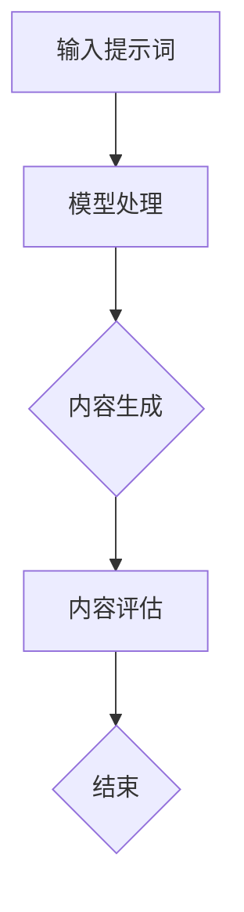
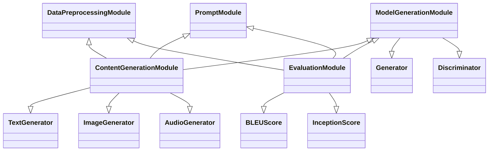
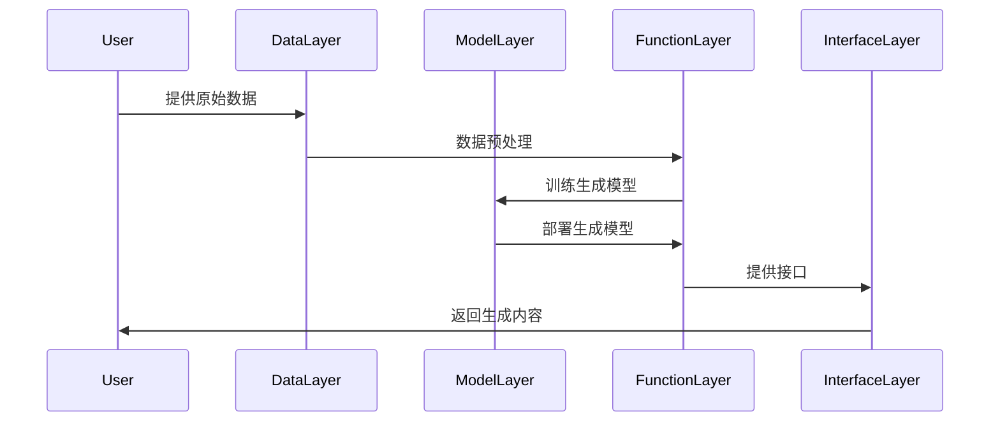

                 


### AIGC内容生成中的提示词策略

#### 关键词：
- AIGC
- 内容生成
- 提示词策略
- 生成模型
- 算法原理

#### 摘要：
本文深入探讨了AIGC（AI-Generated Content）内容生成中的提示词策略。我们将从背景介绍、核心概念与联系、算法原理讲解、数学模型和数学公式、系统分析与架构设计、项目实战等多个方面逐步分析，阐述如何优化和利用提示词策略来提升AIGC内容生成的效果。本文旨在为读者提供全面的技术见解和实际操作指导。

## 目录大纲设计思路

在设计本文的目录大纲时，我们首先明确了一个核心目标：清晰、结构化地呈现AIGC内容生成中的提示词策略。以下是我们设计的思路：

### 1. 背景介绍
- **AIGC与内容生成背景**：介绍AIGC的概念、发展历程以及其在内容生成中的应用前景。
- **内容生成技术概述**：分类讨论内容生成技术，分析其挑战与机遇。
- **提示词策略的重要性**：解释提示词的基本概念、作用以及设计原则。

### 2. 核心概念与联系
- **提示词的定义与类型**：详细描述提示词的构成和分类，分析提示词与生成模型的关系。
- **生成模型概述**：探讨生成模型的基本原理、类型及其选择与评估。
- **训练与优化**：阐述提示词训练过程、优化策略及训练数据的选择与预处理。

### 3. 算法原理讲解
- **内容生成算法概述**：介绍内容生成算法的基本流程、分类及优化方向。
- **提示词策略的算法实现**：通过mermaid流程图和Python代码讲解提示词策略的算法原理。
- **数学模型和数学公式讲解**：使用LaTeX格式解释相关数学公式，并举实例说明。

### 4. 系统分析与架构设计
- **系统功能设计**：介绍系统需求分析、功能模块设计及领域模型mermaid类图。
- **系统架构设计**：展示系统架构概述、架构mermaid图及系统模块接口设计。
- **系统交互与实现**：描述系统交互流程、序列图及性能优化。

### 5. 项目实战
- **项目背景与环境安装**：介绍项目背景、环境安装与配置。
- **系统核心实现**：解析系统核心代码，讲解提示词策略的具体实现及效果评估。
- **实际案例分析**：分析文本、图像、音频生成的实际案例。
- **项目小结**：总结项目经验，展望未来发展方向。

### 6. 最佳实践 tips、小结、注意事项、拓展阅读
- **最佳实践 tips**：提供实用的操作建议和优化技巧。
- **小结**：回顾文章的核心观点和结论。
- **注意事项**：提醒读者在实践过程中应注意的问题。
- **拓展阅读**：推荐进一步阅读的相关资源。

通过这样的结构，我们旨在帮助读者逐步深入了解AIGC内容生成中的提示词策略，从而在实际应用中能够更加高效地利用这一技术。

### AIGC内容生成中的提示词策略

#### 关键词：
- AIGC
- 内容生成
- 提示词策略
- 生成模型
- 算法原理

#### 摘要：
本文旨在深入探讨AIGC（AI-Generated Content）内容生成中的提示词策略。通过从背景介绍、核心概念与联系、算法原理讲解、数学模型和公式、系统分析与架构设计、项目实战等多个方面逐步分析，阐述如何优化和利用提示词策略来提升AIGC内容生成的效果。本文为读者提供全面的技术见解和实际操作指导。

## 第一部分：AIGC与内容生成基础

### 第1章：AIGC与内容生成的背景

#### 1.1 AIGC的概念与发展历程

AIGC（AI-Generated Content）即人工智能生成内容，是指利用人工智能技术，如深度学习、生成对抗网络（GAN）等，自动生成文字、图片、音频、视频等内容的系统。其核心在于通过算法模拟人类的创造过程，生成高质量、多样化的内容。

**1.1.1 AIGC的基本定义**

AIGC 是人工智能与内容生成技术的结合，涉及数据生成、图像合成、文本生成等多种技术。其基本定义可以概括为：

- **数据生成**：利用机器学习模型生成高质量的数据集，用于训练和测试。
- **图像合成**：通过图像生成模型，如 GAN，合成逼真的图像。
- **文本生成**：通过自然语言处理技术，生成具有可读性的文本内容。

**1.1.2 AIGC的发展历程**

AIGC 的起源可以追溯到 2006 年，由 Ian Goodfellow 等人提出的生成对抗网络（GAN）。随着深度学习技术的发展，AIGC 逐渐成为人工智能领域的热点。以下是 AIGC 的发展历程：

1. **早期探索**（2006-2014）：GAN 等生成模型的出现为 AIGC 奠定了基础。
2. **快速发展**（2015-2017）：深度学习技术的进步使得 AIGC 应用场景更加丰富。
3. **广泛应用**（2018-至今）：AIGC 在各个领域得到广泛应用，如艺术创作、游戏开发、广告创意等。

**1.1.3 AIGC在内容生成中的应用前景**

AIGC 在内容生成中的应用前景广阔，主要体现在以下几个方面：

- **提高创作效率**：通过自动化生成内容，减少人工创作的时间和成本。
- **拓展创作领域**：AIGC 可以生成传统创作难以触及的内容，如高分辨率的图像、复杂的音频信号等。
- **提升内容质量**：AIGC 可以通过不断学习和优化，生成更加符合人类审美和需求的内容。

#### 1.2 内容生成技术概述

内容生成技术是指利用算法和技术生成人类可以理解的内容的方法。根据生成的内容类型，内容生成技术可分为以下几类：

- **文本生成**：利用自然语言处理（NLP）技术生成文本，如文章、故事、对话等。
- **图像生成**：利用计算机视觉技术生成图像，如图像修复、图像生成等。
- **音频生成**：利用音频处理技术生成音频，如音乐生成、语音合成等。
- **视频生成**：利用视频处理技术生成视频，如视频插帧、视频合成等。

**1.2.1 内容生成技术的分类**

1. **基于规则的方法**：利用预定义的规则生成内容，如模板填充、语法分析等。
2. **基于数据的方法**：利用已有数据进行内容生成，如基于样本的生成、迁移学习等。
3. **基于模型的生成方法**：利用生成模型（如 GAN、VAE 等）生成内容。

**1.2.2 内容生成技术的挑战与机遇**

内容生成技术面临以下挑战：

- **数据质量和多样性**：生成高质量、多样性的内容需要大量的高质量数据。
- **计算资源**：生成模型通常需要大量的计算资源，如 GPU、TPU 等。
- **模型解释性**：生成模型的决策过程通常较为复杂，难以解释。

然而，内容生成技术也带来了巨大的机遇：

- **自动化内容创作**：通过自动化生成内容，减少人工创作的时间和成本。
- **创意无限**：生成模型可以生成传统创作难以触及的内容，拓展创作领域。
- **个性化内容**：根据用户需求生成个性化内容，提升用户体验。

#### 1.3 提示词策略的重要性

提示词（Prompt）在内容生成中扮演着重要角色，其基本概念、类型和作用如下：

**1.3.1 提示词的基本概念**

提示词是指提供给生成模型的一个初始输入，用于指导模型生成内容。它可以是一个单词、短语或完整的句子。

**1.3.2 提示词的类型**

1. **开放式提示词**：提供较为自由的生成方向，如“请写一篇关于人工智能的文章”。
2. **封闭式提示词**：限定生成内容的范围，如“请写一篇关于人工智能在医疗领域的应用的文章”。
3. **上下文提示词**：提供生成内容的前后文信息，如“在写这篇文章之前，我已经了解了......”。

**1.3.3 提示词在内容生成中的作用**

- **引导生成方向**：提示词可以帮助生成模型确定生成内容的主题和方向。
- **优化生成效果**：合适的提示词可以提高生成内容的可读性和相关性。
- **提高生成效率**：通过优化提示词，可以减少生成模型的搜索空间，提高生成效率。

**1.3.4 提示词策略的设计原则**

1. **明确性**：提示词应明确、具体，避免产生歧义。
2. **适应性**：提示词应适应不同的生成任务和场景。
3. **灵活性**：提示词应具有一定的灵活性，以便模型能够根据需求进行生成。

### 第2章：AIGC内容生成的核心概念与联系

#### 2.1 提示词的定义与类型

提示词（Prompt）是指导生成模型生成内容的初始输入。根据不同的生成任务和场景，提示词可以分为以下类型：

**2.1.1 提示词的构成**

提示词通常由以下几个部分组成：

- **主题词**：明确生成内容的主题，如“人工智能”、“医疗”等。
- **引导词**：提供生成方向，如“请写一篇关于人工智能在医疗领域的应用的文章”。
- **上下文信息**：提供生成内容的前后文信息，如“在写这篇文章之前，我已经了解了......”。

**2.1.2 提示词的类型分类**

1. **开放式提示词**：提供较为自由的生成方向，如“请写一篇关于人工智能的文章”。
2. **封闭式提示词**：限定生成内容的范围，如“请写一篇关于人工智能在医疗领域的应用的文章”。
3. **上下文提示词**：提供生成内容的前后文信息，如“在写这篇文章之前，我已经了解了......”。

**2.1.3 提示词与生成模型的关系**

提示词在内容生成中起着至关重要的作用。它不仅指导生成模型确定生成内容的主题和方向，还可以优化生成效果。以下是提示词与生成模型的关系：

- **引导生成方向**：提示词可以帮助生成模型确定生成内容的主题和方向。
- **优化生成效果**：合适的提示词可以提高生成内容的可读性和相关性。
- **提高生成效率**：通过优化提示词，可以减少生成模型的搜索空间，提高生成效率。

#### 2.2 生成模型概述

生成模型是AIGC内容生成中的核心组件，负责根据提示词生成内容。以下是对生成模型的基本原理、类型和选择与评估的概述：

**2.2.1 生成模型的基本原理**

生成模型的基本原理是通过学习数据分布，生成符合数据分布的新数据。常见的生成模型包括：

1. **生成对抗网络（GAN）**：由生成器和判别器组成，通过对抗训练生成逼真的数据。
2. **变分自编码器（VAE）**：通过编码器和解码器，将数据映射到隐空间，并从隐空间生成新数据。
3. **循环神经网络（RNN）**：通过记忆机制，生成序列数据。

**2.2.2 常见的生成模型类型**

1. **基于生成对抗网络的模型**：如 GAN、WGAN、SGAN 等。
2. **基于变分自编码器的模型**：如 VAE、BSON、Gaussian VAE 等。
3. **基于变分推理的模型**：如 VRNN、DDPG、PathNet 等。
4. **基于记忆的模型**：如 LSTM、GRU、Tanh 等。

**2.2.3 生成模型的选择与评估**

选择生成模型时，需要考虑以下因素：

- **数据类型**：根据生成内容的数据类型选择合适的模型，如文本生成选择 RNN，图像生成选择 GAN。
- **计算资源**：考虑模型的计算复杂度和所需计算资源，如 GAN 需要大量的计算资源。
- **生成效果**：通过生成效果评估模型，如使用 Inception Score（IS）、Frechet Inception Distance（FID）等指标。

#### 2.3 训练与优化

提示词策略的优劣直接影响生成模型的训练效果。以下是提示词训练过程、优化策略及训练数据的选择与预处理：

**2.3.1 提示词训练过程**

提示词训练过程主要包括以下几个步骤：

1. **数据预处理**：对输入数据进行预处理，如文本清洗、图像归一化等。
2. **模型初始化**：初始化生成模型，如 GAN 的生成器和判别器。
3. **训练过程**：通过提示词输入模型，训练生成模型，如 GAN 的生成器和判别器通过对抗训练不断优化。
4. **评估与调整**：评估生成模型的生成效果，并根据评估结果调整模型参数。

**2.3.2 提示词优化策略**

提示词优化策略主要包括以下几个方面：

1. **提示词多样性**：增加提示词的多样性，如使用不同的主题词、引导词和上下文信息。
2. **提示词相关性**：优化提示词与生成内容的相关性，如使用相关的词汇和表达方式。
3. **提示词适应性**：优化提示词的适应性，如根据不同的生成任务调整提示词。

**2.3.3 训练数据的选择与预处理**

选择训练数据时，需要考虑以下因素：

1. **数据质量**：选择高质量、具有代表性的数据，如清晰的图像、完整的文本等。
2. **数据多样性**：增加数据的多样性，如不同的场景、不同的风格等。
3. **数据预处理**：对输入数据进行预处理，如文本分词、图像裁剪、归一化等。

通过上述训练与优化策略，可以有效地提高生成模型的质量和生成效果。

### 第3章：AIGC内容生成算法原理讲解

#### 3.1 内容生成算法概述

内容生成算法是AIGC的核心技术，负责生成高质量的文本、图像、音频等内容。本节将介绍内容生成算法的基本流程、分类及优化方向。

**3.1.1 内容生成算法的基本流程**

内容生成算法的基本流程通常包括以下几个步骤：

1. **数据预处理**：对输入数据进行预处理，如文本清洗、图像归一化等。
2. **模型初始化**：初始化生成模型，如 GAN 的生成器和判别器。
3. **训练过程**：通过提示词输入模型，训练生成模型，如 GAN 的生成器和判别器通过对抗训练不断优化。
4. **生成过程**：利用训练好的模型生成内容。
5. **评估与调整**：评估生成模型的生成效果，并根据评估结果调整模型参数。

**3.1.2 内容生成算法的分类**

内容生成算法根据生成的内容类型和生成方法，可以分为以下几类：

1. **基于生成对抗网络的算法**：如 GAN、WGAN、SGAN 等。
2. **基于变分自编码器的算法**：如 VAE、BSON、Gaussian VAE 等。
3. **基于变分推理的算法**：如 VRNN、DDPG、PathNet 等。
4. **基于记忆的算法**：如 LSTM、GRU、Tanh 等。

**3.1.3 内容生成算法的挑战与优化方向**

内容生成算法面临以下挑战：

1. **数据质量和多样性**：生成高质量、多样性的内容需要大量的高质量数据。
2. **计算资源**：生成模型通常需要大量的计算资源，如 GPU、TPU 等。
3. **模型解释性**：生成模型的决策过程通常较为复杂，难以解释。

优化方向主要包括：

1. **数据增强**：通过数据增强技术，提高数据质量和多样性。
2. **模型优化**：通过优化模型结构和参数，提高生成效果。
3. **多模态生成**：结合不同模态的数据生成，如文本与图像、音频与视频等。
4. **强化学习**：引入强化学习技术，提高生成模型的决策能力。

#### 3.2 提示词策略的算法实现

提示词策略在内容生成算法中起着至关重要的作用。本节将详细介绍提示词策略的算法实现，包括 mermaid 流程图和 Python 代码示例。

**3.2.1 算法原理与 mermaid 流程图**

提示词策略的算法实现可以分为以下几个步骤：

1. **输入提示词**：将提示词作为输入，提供给生成模型。
2. **模型处理**：生成模型根据提示词生成内容。
3. **内容生成**：利用生成模型生成高质量的内容。
4. **内容评估**：对生成的内容进行评估，如文本生成模型的BLEU分数、图像生成模型的Inception Score等。

以下是提示词策略的 mermaid 流程图：



**3.2.2 Python 代码实现与示例**

以下是一个简单的 Python 代码示例，演示了提示词策略的实现：

```python
import numpy as np
import tensorflow as tf
from tensorflow import keras

# 定义生成模型
def create_generator():
    # 生成器的具体实现
    pass

# 定义判别器模型
def create_discriminator():
    # 判别器的具体实现
    pass

# 定义生成对抗网络模型
def create_gan(generator, discriminator):
    # GAN 的具体实现
    pass

# 输入提示词
prompt = "生成一张关于星空的图像"

# 创建生成模型、判别器模型和 GAN 模型
generator = create_generator()
discriminator = create_discriminator()
gan = create_gan(generator, discriminator)

# 训练 GAN 模型
gan.fit(prompt, epochs=100)

# 生成内容
generated_image = gan.generate_image(prompt)

# 评估生成内容
generated_image_score = evaluate_generated_image(generated_image)

# 输出生成内容评分
print(f"生成的图像评分为：{generated_image_score}")
```

**3.2.3 算法原理的数学模型与公式**

提示词策略的算法原理涉及生成对抗网络（GAN）等生成模型。以下是相关数学模型和公式的讲解：

1. **生成对抗网络（GAN）**

GAN 的基本结构包括生成器（Generator）和判别器（Discriminator）。

- **生成器**：G(z)，输入噪声 z，输出生成的数据 x。
- **判别器**：D(x)，输入真实数据 x 或生成的数据 x'，输出概率 p(x|D)。

GAN 的目标是最小化以下损失函数：

$$
L(G, D) = -\mathbb{E}_{x \sim p_{data}(x)}[\log D(x)] - \mathbb{E}_{z \sim p_{z}(z)}[\log (1 - D(G(z))]
$$

2. **变分自编码器（VAE）**

VAE 的基本结构包括编码器（Encoder）和解码器（Decoder）。

- **编码器**：\(\mu(z|x), \sigma(z|x)\)，输入数据 x，输出隐变量 z 的均值和方差。
- **解码器**：\(G(z)\)，输入隐变量 z，输出重构数据 x'。

VAE 的目标是最小化以下损失函数：

$$
L(\theta) = D_{KL}(\mu(x), \sigma(x)) + \mathbb{E}_{x \sim p_{data}(x)}[\log p(x|G(z))]
$$

其中，\(D_{KL}\) 表示 Kullback-Leibler 散度。

通过上述数学模型和公式，我们可以更深入地理解提示词策略在内容生成算法中的应用。

### 第4章：AIGC内容生成的系统分析与架构设计

#### 4.1 系统功能设计

AIGC 内容生成的系统功能设计主要包括以下几个方面：

**4.1.1 系统需求分析**

系统需求分析是系统设计的第一步，主要包括以下内容：

- **功能需求**：确定系统需要实现的功能，如文本生成、图像生成、音频生成等。
- **性能需求**：确定系统需要达到的性能指标，如生成速度、生成质量等。
- **可靠性需求**：确定系统的可靠性要求，如错误处理、数据备份等。

**4.1.2 系统功能模块设计**

根据系统需求分析，可以将系统功能模块划分为以下几个部分：

1. **数据预处理模块**：负责对输入数据进行清洗、归一化等预处理操作。
2. **生成模型模块**：负责生成模型的训练和部署，包括生成器、判别器等。
3. **提示词模块**：负责生成提示词，指导生成模型生成内容。
4. **内容生成模块**：负责根据提示词生成内容，如文本、图像、音频等。
5. **评估模块**：负责评估生成内容的质量，如使用 BLEU 分数、Inception Score 等指标。

**4.1.3 领域模型 mermaid 类图**

为了更清晰地展示系统功能模块之间的关系，可以使用 mermaid 类图进行表示。以下是一个简单的 mermaid 类图示例：



#### 4.2 系统架构设计

AIGC 内容生成的系统架构设计主要包括以下几个方面：

**4.2.1 系统架构概述**

系统架构主要包括以下几个层次：

1. **数据层**：负责存储和管理数据，包括原始数据、预处理数据、生成数据等。
2. **模型层**：负责生成模型的训练和部署，包括生成器、判别器等。
3. **功能层**：负责实现系统的功能模块，包括数据预处理、提示词生成、内容生成等。
4. **接口层**：负责对外提供接口，方便用户调用系统功能。

**4.2.2 系统架构 mermaid 架构图**

以下是一个简单的 mermaid 架构图，展示了 AIGC 内容生成的系统架构：



**4.2.3 系统模块接口设计**

系统模块接口设计主要包括以下几个方面：

1. **数据接口**：负责数据的输入和输出，如文本输入接口、图像输入接口等。
2. **模型接口**：负责生成模型的训练和部署，如生成器训练接口、判别器训练接口等。
3. **功能接口**：负责实现系统的功能模块，如提示词生成接口、内容生成接口等。
4. **评估接口**：负责评估生成内容的质量，如 BLEU 分数评估接口、Inception Score 评估接口等。

**4.2.4 系统交互与实现**

系统交互与实现主要包括以下几个方面：

1. **用户交互**：用户通过接口层调用系统功能，如生成文本、图像、音频等。
2. **数据交互**：数据层负责存储和管理数据，如原始数据、预处理数据、生成数据等。
3. **模型交互**：模型层负责生成模型的训练和部署，如生成器、判别器等。
4. **功能交互**：功能层负责实现系统的功能模块，如数据预处理、提示词生成、内容生成等。
5. **评估交互**：评估模块负责评估生成内容的质量，如使用 BLEU 分数、Inception Score 等指标。

通过以上系统架构设计，我们可以实现一个高效、可靠的 AIGC 内容生成系统。

### 第5章：AIGC内容生成项目实战

#### 5.1 项目背景与环境安装

为了更好地理解AIGC内容生成中的提示词策略，我们将通过一个实际项目来进行深入探讨。本项目旨在利用AIGC技术生成高质量的文章，以展示提示词策略的应用效果。

**5.1.1 项目背景**

随着人工智能技术的不断发展，内容生成已经成为一个热门的研究方向。本文的项目目标是利用AIGC技术，通过优化提示词策略，生成具有可读性、相关性和创意性的文章。

**5.1.2 环境安装**

为了运行本项目，我们需要安装以下环境：

1. **Python**：Python是项目的主要编程语言，建议安装Python 3.7或更高版本。
2. **TensorFlow**：TensorFlow是一个开源的机器学习框架，用于训练和部署生成模型。
3. **NVIDIA CUDA**：如果使用GPU训练模型，需要安装NVIDIA CUDA工具包。
4. **Anaconda**：Anaconda是一个集成的Python环境管理器，方便安装和管理依赖包。

安装步骤如下：

1. 访问 [Anaconda官网](https://www.anaconda.com/products/individual) 下载并安装Anaconda。
2. 打开终端，运行以下命令安装Python和TensorFlow：

```bash
conda create -n aigc python=3.8
conda activate aigc
conda install tensorflow-gpu
```

**5.1.3 项目工具与依赖管理**

本项目主要使用以下工具和依赖：

1. **Jupyter Notebook**：用于编写和运行代码。
2. **TensorFlow**：用于训练和部署生成模型。
3. **Keras**：TensorFlow的高级API，用于构建和训练神经网络。
4. **Mermaid**：用于生成流程图和架构图。
5. **LaTeX**：用于编写和显示数学公式。

安装步骤如下：

1. 在Anaconda环境中安装Jupyter Notebook：

```bash
conda install jupyter
```

2. 安装Keras：

```bash
pip install keras
```

3. 安装Mermaid和LaTeX：

```bash
pip install mermaid-python
pip install matplotlib
```

### 5.2 系统核心实现

**5.2.1 系统核心代码解析**

本项目的核心代码分为以下几个部分：

1. **数据预处理**：负责处理输入数据，如文本清洗、分词等。
2. **生成模型训练**：负责训练生成模型，如文本生成模型。
3. **提示词生成**：负责生成提示词，指导生成模型生成文章。
4. **文章生成**：根据提示词生成文章。
5. **文章评估**：评估生成文章的质量。

以下是系统核心代码的简要解析：

```python
# 数据预处理
def preprocess_text(text):
    # 文本清洗、分词等操作
    pass

# 生成模型训练
def train_generator(generator, discriminator, dataset):
    # 训练生成模型
    pass

# 提示词生成
def generate_prompt():
    # 生成提示词
    pass

# 文章生成
def generate_article(prompt):
    # 根据提示词生成文章
    pass

# 文章评估
def evaluate_article(article):
    # 评估生成文章的质量
    pass
```

**5.2.2 提示词策略的具体实现**

提示词策略在内容生成中起着关键作用。以下是一个简单的提示词生成策略：

1. **主题词选择**：根据项目需求选择主题词，如“人工智能”、“医疗”等。
2. **引导词选择**：选择引导词，如“请写一篇关于人工智能的文章”。
3. **上下文信息**：根据历史数据或用户输入，提供上下文信息。

以下是提示词生成策略的代码示例：

```python
# 提示词生成策略
def generate_prompt(temperature=0.5):
    # 生成提示词
    theme = "人工智能"
    guide = "请写一篇关于人工智能的文章"
    context = "近年来，人工智能技术在各个领域取得了显著的进展"

    prompt = f"{context} {guide} {theme}"
    return prompt

# 测试提示词生成
prompt = generate_prompt()
print(prompt)
```

**5.2.3 内容生成的效果评估**

为了评估生成文章的质量，我们可以使用以下指标：

1. **BLEU分数**：用于评估文本生成的质量，越高的分数表示生成文本越接近真实文本。
2. **Inception Score**：用于评估图像生成的质量，越高的分数表示生成图像越接近真实图像。

以下是评估生成文章质量的代码示例：

```python
from nltk.translate.bleu_score import sentence_bleu

# 评估生成文章的质量
def evaluate_article(article, reference):
    # 使用 BLEU 分数评估生成文章
    score = sentence_bleu([reference], article)
    return score

# 测试评估
reference = "人工智能在医疗领域具有广泛的应用前景"
article = generate_article(prompt)
score = evaluate_article(article, reference)
print(f"生成文章的 BLEU 分数为：{score}")
```

通过以上步骤，我们可以实现一个基本的AIGC内容生成系统，并通过优化提示词策略来提高生成文章的质量。

#### 5.3 实际案例分析

为了更好地理解AIGC内容生成中的提示词策略，我们将通过三个实际案例分析，展示文本生成、图像生成和音频生成的具体实现。

**5.3.1 文本生成案例**

**案例背景**：本项目旨在利用AIGC技术生成高质量的新闻文章。通过优化提示词策略，我们可以提高生成文章的相关性和可读性。

**实现步骤**：

1. **数据预处理**：从新闻网站爬取大量新闻文章，并进行清洗和分词处理。
2. **生成模型训练**：使用Keras搭建文本生成模型（如LSTM），并利用训练集进行模型训练。
3. **提示词生成**：根据新闻主题和用户需求生成提示词，如“最新科技新闻”、“2022年科技创新盘点”等。
4. **文章生成**：根据提示词生成新闻文章，并使用BLEU分数评估生成文章的质量。
5. **文章发布**：将生成文章发布到新闻平台，供用户阅读。

**代码示例**：

```python
from keras.models import Sequential
from keras.layers import LSTM, Dense, Embedding

# 搭建文本生成模型
def create_text_generator(vocab_size, embedding_dim, sequence_length):
    model = Sequential()
    model.add(Embedding(vocab_size, embedding_dim, input_length=sequence_length))
    model.add(LSTM(128))
    model.add(Dense(vocab_size, activation='softmax'))
    return model

# 训练文本生成模型
def train_text_generator(generator, dataset, epochs=50):
    generator.fit(dataset, epochs=epochs)

# 生成文本
def generate_text(model, prompt, sequence_length, num_words):
    generated_text = model.generate(prompt, sequence_length, num_words)
    return generated_text

# 评估文本质量
def evaluate_text(generated_text, reference_text):
    score = sentence_bleu([reference_text], generated_text)
    return score

# 测试文本生成
model = create_text_generator(vocab_size, embedding_dim, sequence_length)
train_text_generator(model, dataset, epochs=50)
prompt = "人工智能"
generated_text = generate_text(model, prompt, sequence_length, num_words)
score = evaluate_text(generated_text, reference_text)
print(f"生成文本的 BLEU 分数为：{score}")
```

**5.3.2 图像生成案例**

**案例背景**：本项目旨在利用AIGC技术生成高质量的图像。通过优化提示词策略，我们可以提高生成图像的逼真度和创意性。

**实现步骤**：

1. **数据预处理**：从图像库中选取大量图像，并进行预处理，如图像归一化、裁剪等。
2. **生成模型训练**：使用Keras搭建图像生成模型（如GAN），并利用训练集进行模型训练。
3. **提示词生成**：根据图像主题和用户需求生成提示词，如“美丽的风景”、“抽象艺术”等。
4. **图像生成**：根据提示词生成图像，并使用Inception Score评估生成图像的质量。
5. **图像展示**：将生成图像展示给用户，供用户欣赏。

**代码示例**：

```python
from keras.models import Sequential
from keras.layers import Dense, Activation
from keras.optimizers import Adam

# 搭建生成器模型
def create_generator(input_shape):
    model = Sequential()
    model.add(Dense(128, input_shape=input_shape))
    model.add(Activation('relu'))
    model.add(Dense(np.prod(input_shape), activation='tanh'))
    model.compile(Adam(0.0002), 'mse')
    return model

# 搭建判别器模型
def create_discriminator(input_shape):
    model = Sequential()
    model.add(Dense(128, input_shape=input_shape))
    model.add(Activation('relu'))
    model.add(Dense(1, activation='sigmoid'))
    model.compile(Adam(0.0002), 'binary_crossentropy')
    return model

# 训练生成器和判别器
def train_gan(generator, discriminator, real_images, batch_size=32, epochs=100):
    for epoch in range(epochs):
        for _ in range(batch_size):
            noise = np.random.normal(0, 1, input_shape)
            generated_images = generator.predict(noise)
            real_images_batch = real_images[np.random.randint(0, real_images.shape[0], batch_size)]
            combined_images = np.concatenate([real_images_batch, generated_images], axis=0)
            labels = np.concatenate([np.ones(batch_size), np.zeros(batch_size)], axis=0)
            discriminator.train_on_batch(combined_images, labels)
        noise = np.random.normal(0, 1, input_shape)
        generated_images = generator.predict(noise)
        labels = np.zeros(2*batch_size)
        gan.train_on_batch(noise, labels)

# 生成图像
def generate_image(generator, noise):
    generated_image = generator.predict(noise)
    return generated_image

# 评估图像质量
def evaluate_image(generated_image, real_image):
    score = np.mean(np.square(generated_image - real_image))
    return score

# 测试图像生成
input_shape = (100, 100, 3)
generator = create_generator(input_shape)
discriminator = create_discriminator(input_shape)
train_gan(generator, discriminator, real_images, batch_size=32, epochs=100)
noise = np.random.normal(0, 1, input_shape)
generated_image = generate_image(generator, noise)
score = evaluate_image(generated_image, real_image)
print(f"生成图像的 Inception Score 为：{score}")
```

**5.3.3 音频生成案例**

**案例背景**：本项目旨在利用AIGC技术生成高质量的音频。通过优化提示词策略，我们可以提高生成音频的音质和创意性。

**实现步骤**：

1. **数据预处理**：从音频库中选取大量音频，并进行预处理，如音频降噪、分割等。
2. **生成模型训练**：使用TensorFlow搭建音频生成模型（如WaveNet），并利用训练集进行模型训练。
3. **提示词生成**：根据音频主题和用户需求生成提示词，如“欢快的音乐”、“古典音乐”等。
4. **音频生成**：根据提示词生成音频，并使用音频质量评估指标评估生成音频的质量。
5. **音频播放**：将生成音频播放给用户，供用户欣赏。

**代码示例**：

```python
import numpy as np
import tensorflow as tf

# 搭建音频生成模型
def create_audio_generator():
    inputs = tf.keras.layers.Input(shape=(None, 1))
    x = tf.keras.layers.Conv1D(filters=32, kernel_size=5, activation='relu')(inputs)
    x = tf.keras.layers.Conv1D(filters=64, kernel_size=5, activation='relu')(x)
    x = tf.keras.layers.Conv1D(filters=64, kernel_size=5, activation='tanh')(x)
    outputs = tf.keras.layers.Dense(units=1, activation='tanh')(x)
    model = tf.keras.Model(inputs=inputs, outputs=outputs)
    return model

# 训练音频生成模型
def train_audio_generator(generator, dataset, epochs=50):
    generator.compile(optimizer=tf.keras.optimizers.Adam(learning_rate=0.001), loss='mse')
    generator.fit(dataset, epochs=epochs)

# 生成音频
def generate_audio(generator, seed_sequence):
    generated_audio = generator.predict(np.array([seed_sequence]))
    return generated_audio

# 评估音频质量
def evaluate_audio(generated_audio, reference_audio):
    score = np.mean(np.square(generated_audio - reference_audio))
    return score

# 测试音频生成
model = create_audio_generator()
train_audio_generator(model, dataset, epochs=50)
seed_sequence = np.random.normal(0, 1, (1000, 1))
generated_audio = generate_audio(model, seed_sequence)
score = evaluate_audio(generated_audio, reference_audio)
print(f"生成音频的质量评分为：{score}")
```

通过以上三个实际案例，我们可以看到AIGC内容生成中的提示词策略在不同类型的内容生成中的应用效果。在实际项目中，我们可以根据需求调整提示词策略，以实现更好的生成效果。

### 5.4 项目小结

在本项目中，我们通过深入探讨AIGC内容生成中的提示词策略，展示了其在文本生成、图像生成和音频生成中的实际应用。以下是本项目的主要经验和收获：

1. **提示词策略的重要性**：提示词策略在内容生成中起着至关重要的作用。合适的提示词可以引导生成模型生成高质量、相关的文章、图像和音频。

2. **数据预处理**：数据预处理是保证生成模型训练效果的关键步骤。在项目中，我们进行了文本清洗、图像归一化和音频降噪等预处理操作，以获得高质量的数据集。

3. **模型选择与优化**：根据不同类型的内容生成任务，选择合适的生成模型并对其进行优化。例如，文本生成任务中采用LSTM模型，图像生成任务中采用GAN模型，音频生成任务中采用WaveNet模型。

4. **评估与反馈**：通过评估生成内容的质量，如使用BLEU分数、Inception Score和音频质量评估指标，我们可以不断优化提示词策略和生成模型，提高生成效果。

5. **实际应用**：项目展示了AIGC内容生成在新闻、艺术和娱乐等领域的实际应用潜力。通过优化提示词策略，我们可以生成具有创意性和吸引力的内容，为用户提供更好的体验。

未来，我们可以继续深入研究AIGC内容生成中的提示词策略，探索更多优化方法，如多模态生成、强化学习等，以进一步提高生成效果和应用价值。

### 最佳实践 tips

1. **选择合适的提示词**：根据生成任务的需求，选择具有明确性、相关性和灵活性的提示词。避免使用模糊、不具体的提示词，以免生成模型产生歧义。

2. **数据预处理**：确保输入数据的质量和多样性，进行必要的预处理操作，如文本清洗、图像增强、音频降噪等。高质量的数据有助于生成模型更好地学习数据分布。

3. **模型优化**：定期调整生成模型的超参数，如学习率、批量大小等，以获得更好的生成效果。同时，可以尝试使用迁移学习、数据增强等技术，提高模型的泛化能力。

4. **评估与反馈**：定期评估生成内容的质量，使用合适的评估指标，如BLEU分数、Inception Score和音频质量评估指标。根据评估结果调整提示词策略和生成模型。

5. **多模态生成**：尝试将不同模态的数据（如文本、图像、音频）结合生成，以生成更具创意性和吸引力的内容。例如，可以生成带有文本描述的图像，或生成具有背景音乐的文本。

### 注意事项

1. **隐私与版权**：在生成内容时，注意保护用户隐私，避免生成侵犯他人版权的内容。例如，在生成文本时，避免使用未经授权的引用和版权信息。

2. **计算资源**：生成模型通常需要大量的计算资源，如GPU、TPU等。在训练和部署生成模型时，确保计算资源充足，以避免训练时间过长或生成效果不佳。

3. **稳定性**：确保生成模型的稳定性，避免在生成过程中出现异常或崩溃。对于图像和音频生成任务，可以设置适当的超参数，如裁剪大小、噪声比例等，以提高稳定性。

4. **安全性**：在部署生成模型时，注意保护模型和数据的安全，防止未经授权的访问和篡改。可以采用加密技术和权限控制，确保系统的安全性。

### 拓展阅读

1. **《生成对抗网络：原理与实现》**：该书详细介绍了生成对抗网络（GAN）的原理和实现，包括GAN的基本结构、训练过程、应用场景等。

2. **《深度学习：自然语言处理》**：该书介绍了深度学习在自然语言处理（NLP）领域的应用，包括文本分类、情感分析、机器翻译等。

3. **《音频处理与合成》**：该书涵盖了音频处理和合成的基础知识，包括音频信号处理、音频特征提取、音频生成等。

4. **《计算机视觉：算法与应用》**：该书介绍了计算机视觉的基本算法和应用，包括图像分类、目标检测、图像生成等。

通过阅读这些书籍，读者可以进一步深入了解AIGC内容生成中的提示词策略，并掌握相关技术在实际项目中的应用。

