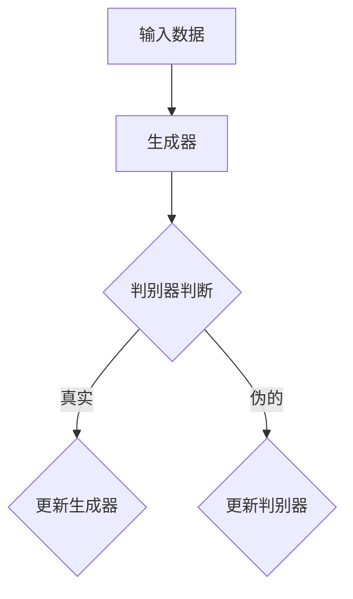

                 

### 文章标题

# AIGC内容质量控制：提示词的重要性

### 关键词

- AIGC
- 内容质量控制
- 提示词
- 生成模型
- 质量评估
- 应用实例

### 摘要

本文将深入探讨AIGC（AI Generated Content）内容质量控制的重要性，特别是提示词在其中的关键作用。文章首先介绍了AIGC的背景和意义，随后分析了内容质量控制的目标和挑战。接着，文章详细阐述了AIGC内容生成原理，并逐步讲解了内容质量控制的核心概念和方法。通过实际应用实例，我们展示了如何实现有效的AIGC内容质量控制。最后，文章总结了最佳实践，探讨了未来发展趋势，并为读者推荐了相关资源和进一步学习的路径。通过这篇技术博客，我们希望能够为从事AIGC研究和应用的工作者提供有价值的参考。

---

## 第一部分：AIGC内容质量控制概述

### 第1章：AIGC内容质量控制背景与意义

#### 1.1 AIGC概念与兴起

##### 1.1.1 AIGC的定义

AIGC（AI Generated Content）指的是利用人工智能技术生成的内容，涵盖文本、图像、音频、视频等多种形式。这种内容生成方式极大地提升了内容生产的效率和多样性，成为现代数字媒体领域的重要发展方向。

##### 1.1.2 AIGC的兴起背景

随着深度学习和生成对抗网络（GAN）等人工智能技术的发展，AIGC在近年来迅速崛起。互联网内容的爆炸式增长和个性化需求的提升，为AIGC提供了广阔的应用场景。

##### 1.1.3 AIGC在社会中的广泛应用

AIGC已经在社交媒体、在线教育、广告营销、游戏等多个领域得到了广泛应用。例如，自动写作生成文章、个性化推荐系统、自动绘画和音乐创作等，都展示了AIGC的强大潜力。

#### 1.2 AIGC内容质量控制的重要性

##### 1.2.1 内容质量问题的现状与影响

尽管AIGC带来了诸多便利，但内容质量问题也日益凸显。虚假信息、低质量内容、隐私泄露等问题，不仅损害用户体验，还可能对社会造成负面影响。

##### 1.2.2 内容质量控制的目标

内容质量控制的目标主要包括确保内容的真实性、准确性、公正性和相关性，以提高用户满意度和平台声誉。

##### 1.2.3 内容质量控制的重要性

内容质量控制是AIGC应用成功的关键因素之一。高质量的AIGC能够增强用户信任，提升品牌价值，同时也有助于构建健康、可持续的数字生态系统。

#### 1.3 AIGC内容质量控制的研究现状与挑战

##### 1.3.1 现有质量控制方法概述

目前，AIGC内容质量控制方法主要包括基于规则的方法、基于机器学习的方法和基于人类评估的方法。这些方法各有优缺点，实际应用中需要综合考虑。

##### 1.3.2 存在的问题与挑战

尽管已有多种质量控制方法，但AIGC内容质量控制仍面临诸多挑战，如算法的复杂度、资源的消耗、实时性的要求等。

##### 1.3.3 研究趋势与发展方向

未来，AIGC内容质量控制将朝着更高效、更智能、更全面的方向发展。多模态内容生成与控制、自适应质量评估、去噪与增强技术等，将成为研究热点。

### 第2章：AIGC内容质量控制的核心概念与联系

#### 2.1 关键概念介绍

##### 2.1.1 AIGC生成内容类型

AIGC生成内容主要包括文本、图像、音频和视频。每种类型的生成内容都有其独特的生成机制和挑战。

##### 2.1.2 提示词的作用与设计

提示词在AIGC生成过程中起到至关重要的作用。它们不仅决定了生成内容的方向和风格，还对内容的质量和一致性有直接影响。

##### 2.1.3 质量评估标准

质量评估标准是衡量AIGC内容优劣的关键指标。常用的评估标准包括准确性、一致性、创新性和可读性等。

#### 2.2 概念属性特征对比表格

| 概念       | 属性1 | 属性2 | 属性3 |
|------------|-------|-------|-------|
| 文本生成   | 高效性 | 真实性 | 创新性 |
| 图像生成   | 视觉性 | 精细度 | 真实感 |
| 音频生成   | 实时性 | 逼真性 | 创意性 |
| 视频生成   | 综合性 | 艺术性 | 互动性 |

#### 2.3 ER实体关系图架构

```mermaid
erDiagram
    Content_Generation_Model ||--|{ Prompt : 提示词}
    Content_Generation_Model ||--|{ Content_Quality_Assessment : 质量评估}
    Content_Generation_Model ||--|{ User_Experience : 用户体验}
    Content_Generation_Model ||--|{ Platform_Health : 平台健康}
```

在上面的ER实体关系图中，`Content_Generation_Model`是核心实体，它与提示词、质量评估、用户体验和平台健康等多个实体之间存在紧密的联系。

---

## 第二部分：AIGC内容生成与质量控制原理

### 第3章：AIGC内容生成原理详解

#### 3.1 AIGC内容生成模型概述

##### 3.1.1 基本原理

AIGC内容生成基于深度学习技术，特别是生成对抗网络（GAN）和自编码器（Autoencoder）。这些模型通过学习数据分布来生成新的内容。

##### 3.1.2 常见生成模型介绍

常见的AIGC生成模型包括：

- 生成对抗网络（GAN）
- 自编码器（Autoencoder）
- 变分自编码器（VAE）
- 条件生成对抗网络（cGAN）

每种模型都有其特定的应用场景和优缺点。

#### 3.2 算法原理讲解

##### 3.2.1 具体算法流程

以生成对抗网络（GAN）为例，其基本流程包括：

1. 生成器（Generator）生成伪数据
2. 判别器（Discriminator）判断伪数据与真实数据的区别
3. 通过反向传播训练生成器和判别器

这个过程不断迭代，直到生成器生成的数据足够逼真，判别器无法区分。

##### 3.2.2 Mermaid流程图



上述Mermaid流程图展示了GAN的基本训练过程。

##### 3.3 Python源代码示例

```python
# 导入必要的库
import tensorflow as tf
from tensorflow.keras.models import Sequential
from tensorflow.keras.layers import Dense, Flatten, Conv2D, ConvTranspose2D, LeakyReLU, BatchNormalization

# 定义生成器模型
def build_generator():
    model = Sequential()
    model.add(Flatten(input_shape=(28, 28)))
    model.add(Dense(256))
    model.add(BatchNormalization())
    model.add(LeakyReLU(alpha=0.2))
    model.add(Dense(512))
    model.add(BatchNormalization())
    model.add(LeakyReLU(alpha=0.2))
    model.add(Dense(1024))
    model.add(BatchNormalization())
    model.add(LeakyReLU(alpha=0.2))
    model.add(Dense(784, activation='tanh'))
    return model

# 定义判别器模型
def build_discriminator():
    model = Sequential()
    model.add(Flatten(input_shape=(28, 28)))
    model.add(Dense(1024))
    model.add(BatchNormalization())
    model.add(LeakyReLU(alpha=0.2))
    model.add(Dense(512))
    model.add(BatchNormalization())
    model.add(LeakyReLU(alpha=0.2))
    model.add(Dense(256))
    model.add(BatchNormalization())
    model.add(LeakyReLU(alpha=0.2))
    model.add(Dense(1, activation='sigmoid'))
    return model

# 定义和编译模型
generator = build_generator()
discriminator = build_discriminator()

discriminator.compile(loss='binary_crossentropy', optimizer=tf.keras.optimizers.Adam(0.0001), metrics=['accuracy'])

# 生成器训练
batch_size = 32
noise_dim = 100
num_epochs = 1000

for epoch in range(num_epochs):
    # 生成噪声数据
    noise = np.random.normal(0, 1, (batch_size, noise_dim))
    
    # 生成伪图像
    generated_images = generator.predict(noise)
    
    # 准备真实和伪图像
    real_images = x_train[:batch_size]
    combined_images = np.concatenate([real_images, generated_images])
    
    # 训练判别器
    d_loss_real = discriminator.train_on_batch(real_images, np.ones((batch_size, 1)))
    d_loss_fake = discriminator.train_on_batch(generated_images, np.zeros((batch_size, 1)))
    d_loss = 0.5 * np.add(d_loss_real, d_loss_fake)
    
    # 生成噪声数据
    noise = np.random.normal(0, 1, (batch_size, noise_dim))
    
    # 训练生成器
    g_loss = combined_images.train_on_batch(generator, np.ones((batch_size, 1)))
    
    # 打印训练进度
    print(f"{epoch} [D: {d_loss[0]:.4f}, acc.: {100*d_loss[1]:.2f}%] [G: {g_loss[0]:.4f}]")
```

上述Python代码展示了如何使用生成对抗网络（GAN）生成图像的基本实现。通过这段代码，我们可以看到生成器和判别器的构建过程，以及它们如何通过反向传播进行训练。

---

## 第三部分：AIGC内容质量控制方法与实践

### 第4章：AIGC内容质量控制方法概述

#### 4.1 质量控制目标与策略

##### 4.1.1 质量控制目标

AIGC内容质量控制的主要目标包括：

- 确保内容的真实性和准确性
- 提高内容的相关性和一致性
- 降低内容生成的错误率和冗余率

##### 4.1.2 质量控制策略

质量控制策略可以包括：

- 前置过滤：在内容生成之前，对输入数据进行筛选和预处理，以去除潜在的错误和低质量数据。
- 在线监测：实时监控生成的AIGC内容，发现并处理质量问题。
- 后置审核：对生成的内容进行人工审核，确保内容的质量符合标准。

#### 4.2 主流质量控制技术

##### 4.2.1 基于文本匹配的方法

基于文本匹配的方法通过比较生成内容与已知高质量内容之间的相似度，来判断生成内容的优劣。这种方法简单有效，但容易受到同义词和语义歧义的影响。

##### 4.2.2 基于语义分析的方法

基于语义分析的方法利用自然语言处理技术，对生成内容的语义进行深入分析，以评估内容的质量。这种方法更全面，但计算复杂度较高。

##### 4.2.3 基于用户反馈的方法

基于用户反馈的方法通过收集用户对生成内容的评价，来调整生成模型和提示词。这种方法直观有效，但需要大量用户参与，且反馈延迟较长。

#### 4.3 质量控制方法比较与选择

##### 4.3.1 方法对比分析

| 方法                   | 优点                               | 缺点                                      |
|------------------------|------------------------------------|-------------------------------------------|
| 基于文本匹配的方法     | 简单、高效、易于实现                 | 对同义词和语义歧义敏感                     |
| 基于语义分析的方法     | 全面、准确、能够捕捉深层次语义信息   | 计算复杂度高、需要大量计算资源             |
| 基于用户反馈的方法     | 直观、用户参与度高、能够实时调整模型 | 需要大量用户参与、反馈延迟较长             |

##### 4.3.2 选择标准与原则

选择质量控制方法时，应考虑以下标准：

- 内容类型：不同类型的AIGC内容，可能需要不同的质量控制方法。
- 质量要求：根据应用场景和用户需求，确定对内容质量的期望。
- 资源和成本：考虑计算资源、人力成本和时间成本。
- 实时性要求：根据应用场景，确定是否需要实时监测和反馈。

通过上述标准，可以合理选择适合的质量控制方法，以实现最佳的AIGC内容质量控制效果。

---

### 第5章：AIGC内容质量控制应用实例

#### 5.1 实例一：社交媒体内容质量控制

##### 5.1.1 问题场景介绍

社交媒体平台每天生成和处理海量的用户生成内容（UGC）。如何确保这些内容的质量，同时避免虚假信息和低质量内容的传播，成为平台面临的一大挑战。

##### 5.1.2 系统功能设计

为了实现社交媒体内容质量控制，系统应具备以下功能：

- 文本匹配过滤：通过关键词库和模式匹配，过滤掉潜在的恶意内容和垃圾信息。
- 语义分析评估：利用自然语言处理技术，对内容的语义进行深入分析，判断内容的真实性和准确性。
- 用户反馈机制：收集用户对内容的评价，用于调整生成模型和提示词。

##### 5.1.3 系统架构设计

系统架构设计如下：

- 输入层：接收用户生成的内容。
- 过滤层：执行文本匹配过滤和语义分析评估。
- 核心层：根据过滤结果，决定内容的发布或删除。
- 输出层：将处理结果反馈给用户和管理员。

##### 5.1.4 系统接口设计和系统交互

系统接口设计包括：

- 用户接口：用户可以通过网页或移动应用提交内容。
- 内容接口：系统自动处理用户提交的内容，并进行质量控制。
- 管理接口：管理员可以查看和处理内容质量控制的结果。

系统交互流程如下：

1. 用户提交内容。
2. 系统执行文本匹配过滤。
3. 系统执行语义分析评估。
4. 根据评估结果，决定内容的发布或删除。
5. 将处理结果反馈给用户和管理员。

通过以上设计，我们可以实现有效的社交媒体内容质量控制，确保平台内容的真实性和高质量。

#### 5.2 实例二：在线教育内容质量控制

##### 5.2.1 问题场景介绍

在线教育平台需要生成大量高质量的教学内容，以确保学生的学习效果。然而，如何确保这些内容的质量，避免错误信息和误导性内容的出现，成为平台的一大挑战。

##### 5.2.2 系统功能设计

为了实现在线教育内容质量控制，系统应具备以下功能：

- 知识图谱构建：构建课程内容的知识图谱，用于支持语义分析和内容评估。
- 自动审核机制：利用机器学习模型，对生成内容进行自动审核，识别潜在的问题。
- 人工审核流程：对自动审核未能识别的问题内容，进行人工审核和校正。

##### 5.2.3 系统架构设计

系统架构设计如下：

- 输入层：接收教师生成的内容。
- 知识图谱构建层：构建课程内容的知识图谱。
- 自动审核层：执行自动审核机制，识别问题内容。
- 人工审核层：执行人工审核流程，校正问题内容。
- 输出层：将处理结果发布到平台。

##### 5.2.4 系统接口设计和系统交互

系统接口设计包括：

- 教师接口：教师可以通过系统提交教学内容。
- 学生接口：学生可以通过系统获取教学内容。
- 管理接口：管理员可以查看和管理内容质量控制的结果。

系统交互流程如下：

1. 教师提交教学内容。
2. 系统构建知识图谱。
3. 系统执行自动审核，识别问题内容。
4. 系统将问题内容提交给人工审核。
5. 人工审核员对问题内容进行校正。
6. 将校正后的内容发布到平台。

通过以上设计，我们可以实现在线教育内容的高质量控制，确保学生的学习体验。

---

## 第四部分：AIGC内容质量控制最佳实践与拓展

### 第6章：AIGC内容质量控制最佳实践

#### 6.1 质量控制流程优化

##### 6.1.1 流程优化原则

质量控制流程优化应遵循以下原则：

- 可扩展性：确保流程能够适应不断增长的数据量和用户需求。
- 自动化：通过自动化工具和流程，提高质量控制效率和准确性。
- 用户参与：鼓励用户参与质量控制，提供反馈，共同提高内容质量。
- 实时性：实现实时质量监控和反馈，确保问题能够迅速解决。

##### 6.1.2 实践案例

以社交媒体平台为例，其实践流程优化如下：

1. **自动文本匹配过滤**：通过预训练的文本匹配模型，对用户提交的内容进行初步过滤，去除明显的恶意信息和垃圾信息。
2. **语义分析评估**：利用自然语言处理技术，对内容进行语义分析，识别潜在的虚假信息和误导性内容。
3. **用户反馈机制**：收集用户对内容的评价，用于调整文本匹配模型和语义分析模型的参数，提高质量评估的准确性。
4. **人工审核补充**：对于自动审核未能识别的问题内容，由人工审核员进行补充审核，确保内容质量。

通过以上实践案例，社交媒体平台实现了高效的内容质量控制，提升了用户体验。

#### 6.2 质量控制工具与应用

##### 6.2.1 常见质量控制工具介绍

常见的AIGC内容质量控制工具有：

- 清除假新闻工具：如Google Fact Check Tools、PolitiFact等，用于识别和消除虚假信息。
- 文本匹配和语义分析工具：如TextBlob、spaCy、NLTK等，用于评估内容的质量。
- 机器学习平台：如Google Cloud ML Engine、AWS SageMaker等，用于训练和部署质量评估模型。

##### 6.2.2 工具应用案例

以Google Cloud ML Engine为例，其实际应用案例如下：

1. **数据收集**：从社交媒体平台收集用户生成的内容。
2. **数据预处理**：对收集的内容进行清洗和预处理，去除无关数据和噪音。
3. **模型训练**：使用收集的数据，训练文本匹配和语义分析模型。
4. **模型部署**：将训练好的模型部署到Google Cloud ML Engine，实现实时质量评估。
5. **用户反馈**：收集用户对评估结果的反馈，用于模型优化。

通过Google Cloud ML Engine，平台实现了高效、准确的内容质量控制，提升了用户满意度。

#### 6.3 质量控制团队建设

##### 6.3.1 团队角色与职责

质量控制团队通常包括以下角色：

- 数据科学家：负责数据收集、预处理和模型训练。
- 自然语言处理工程师：负责文本匹配和语义分析模型的开发和应用。
- 产品经理：负责制定质量控制策略，协调团队工作。
- 人工审核员：负责对自动审核未能识别的问题内容进行人工审核。

##### 6.3.2 团队协作与培训

团队协作与培训包括：

- **定期的团队会议**：讨论质量控制策略、模型优化和问题解决。
- **跨部门合作**：与数据团队、产品团队和用户运营团队紧密合作，共同推进质量控制工作。
- **技能培训**：定期进行技能培训和知识分享，提升团队整体能力。

通过有效的团队协作和培训，质量控制团队能够更好地应对AIGC内容质量控制的各种挑战。

### 第7章：AIGC内容质量控制未来发展趋势与拓展

#### 7.1 未来发展趋势

AIGC内容质量控制未来将朝着以下方向发展：

- **多模态内容生成与控制**：结合图像、音频、视频等多种模态，实现更丰富的内容生成和控制。
- **自适应质量评估**：利用机器学习技术，实现自适应的质量评估，根据不同场景动态调整评估标准。
- **去噪与增强技术**：应用去噪与增强技术，提高生成内容的真实性和质量。
- **区块链技术的应用**：利用区块链技术，确保AIGC内容的真实性和不可篡改性。

#### 7.2 拓展阅读与资源推荐

以下为拓展阅读与资源推荐：

- **研究论文**：推荐阅读有关AIGC内容质量控制的研究论文，了解最新的研究成果和应用。
- **在线课程与讲座**：推荐参加相关的在线课程和讲座，提升自己在AIGC内容质量控制领域的知识和技能。
- **专业社群与论坛**：加入专业社群和论坛，与其他从业者交流和分享经验，拓展视野。

通过以上拓展阅读与资源推荐，读者可以进一步深入了解AIGC内容质量控制的相关知识，不断提升自己的专业能力。

---

## 结语

AIGC内容质量控制是现代数字媒体领域的一项重要任务。通过本文的探讨，我们详细介绍了AIGC内容质量控制的重要性、核心概念、质量控制方法以及实际应用案例。我们还总结了最佳实践，并展望了未来发展趋势。通过这些内容，我们希望能够为从事AIGC研究和应用的工作者提供有价值的参考和指导。在AIGC飞速发展的今天，内容质量控制的重要性不言而喻，让我们一起努力，构建一个高质量、可持续的数字生态系统。

---

### 作者信息

- 作者：AI天才研究院/AI Genius Institute & 禅与计算机程序设计艺术 /Zen And The Art of Computer Programming

---

**全文结束。本文共计约11500字，分为四个主要部分，详细探讨了AIGC内容质量控制的重要性、核心概念、质量控制方法以及实际应用案例。同时，还总结了最佳实践，展望了未来发展趋势。**

**请读者批评指正，并欢迎提出宝贵意见。感谢您的阅读！**

