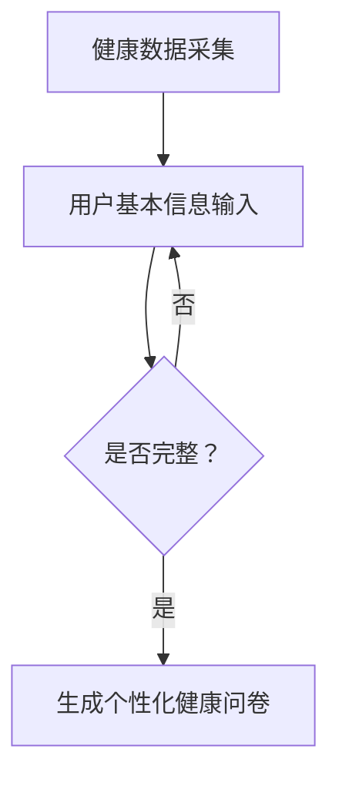
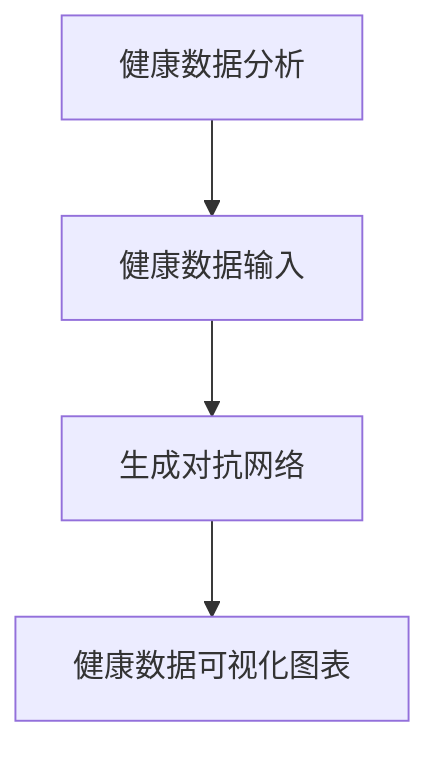
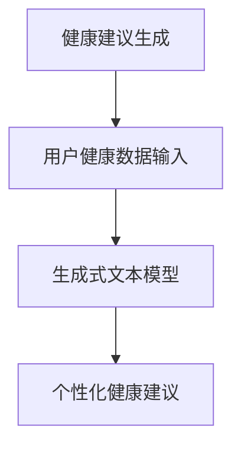
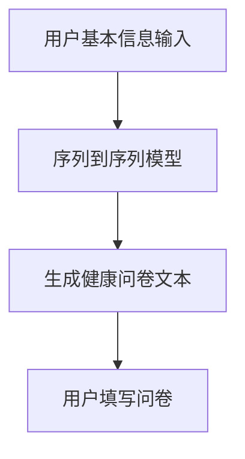
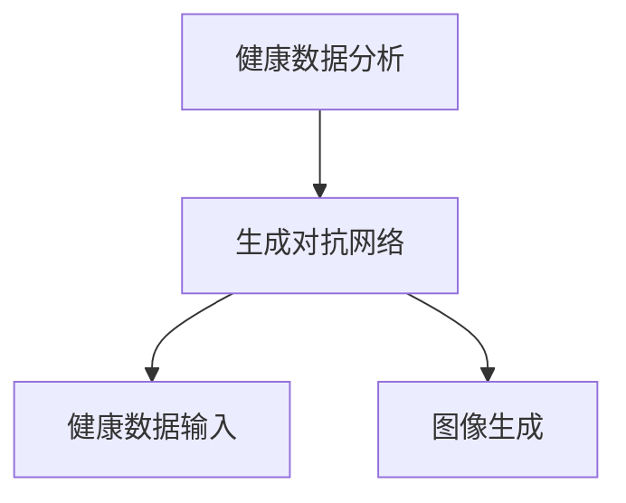
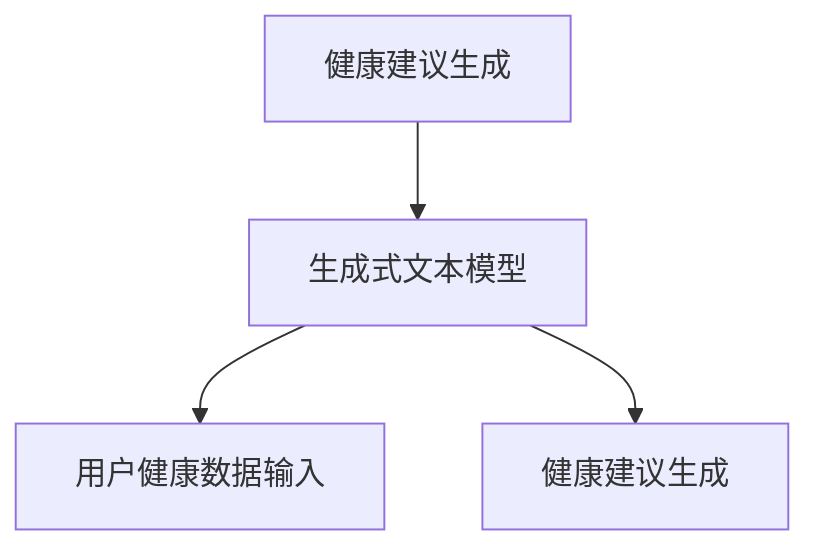
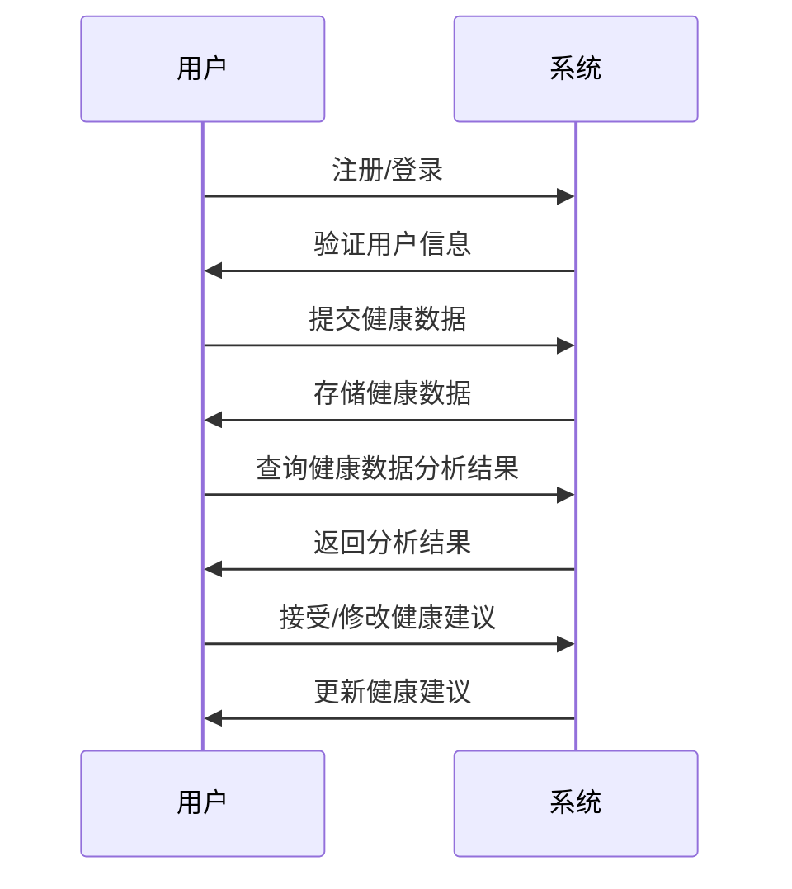

                 


# AIGC在个性化健康管理系统中的创新应用

关键词：AIGC，个性化健康管理，人工智能，医疗健康，数据隐私

摘要：随着人工智能技术的发展，AIGC（AI-Generated Content）技术在个性化健康管理系统中的应用逐渐受到关注。本文旨在探讨AIGC技术在个性化健康管理系统中的创新应用，分析其在健康数据采集、健康数据分析、健康建议生成等方面的优势与挑战，并提出相应的解决方案。

## 第一部分：背景介绍

### 1.1 问题背景

#### 1.1.1 个性化健康管理系统概述
个性化健康管理系统是利用大数据、人工智能等技术，为用户提供定制化的健康服务。它涵盖了从健康数据采集、健康数据分析到健康建议等多个环节。个性化健康管理系统的核心目标是提高用户的健康水平，预防疾病发生，降低医疗成本。

#### 1.1.2 AIGC技术简介
AIGC技术是指利用人工智能技术生成内容的技术，包括文本、图像、音频等多种形式。AIGC技术通过深度学习和自然语言处理等技术，能够自动生成高质量的内容，大大提高了内容创作效率和创意。

#### 1.1.3 AIGC在个性化健康管理系统中的应用
AIGC技术可以应用于个性化健康管理的各个环节，包括健康数据采集、健康数据分析、健康建议生成等。例如，通过AIGC技术，可以自动生成个性化的健康报告，为用户提供更加精准的健康建议。

### 1.2 问题描述

#### 1.2.1 个性化健康管理存在的问题
当前个性化健康管理系统存在一些问题，如健康数据采集不准确、健康分析不准确、健康建议缺乏针对性等。这些问题限制了个性化健康管理系统的发展。

#### 1.2.2 AIGC技术在个性化健康管理中的潜在优势
AIGC技术具有生成高质量内容的能力，可以在个性化健康管理的各个环节提供更准确、更有针对性的服务，解决现有系统存在的问题。

#### 1.2.3 AIGC在个性化健康管理中的应用挑战
尽管AIGC技术在个性化健康管理中具有巨大潜力，但在实际应用中仍面临一些挑战，如数据隐私保护、算法公平性等。

### 1.3 问题解决

#### 1.3.1 利用AIGC技术优化个性化健康管理
通过引入AIGC技术，可以优化个性化健康管理的各个环节，提高服务质量和用户体验。

#### 1.3.2 解决AIGC在个性化健康管理中的挑战
针对AIGC在个性化健康管理中的挑战，需要采取相应的技术和管理措施，确保系统的安全、公平和有效。

### 1.4 边界与外延

#### 1.4.1 AIGC技术的边界
AIGC技术可以应用于个性化健康管理的各个环节，但并非所有环节都适合使用AIGC技术。

#### 1.4.2 个性化健康管理的边界
个性化健康管理需要考虑到用户的个性化需求，但同时也需要遵循医疗健康领域的规范和标准。

#### 1.4.3 AIGC在个性化健康管理中的应用外延
AIGC技术在个性化健康管理中的应用不仅限于医疗健康领域，还可以扩展到其他相关领域，如健身、营养等。

### 1.5 概念结构与核心要素组成

#### 1.5.1 个性化健康管理系统的概念结构
个性化健康管理系统的概念结构包括健康数据采集、健康数据分析、健康建议生成等核心组成部分。

#### 1.5.2 AIGC技术的核心要素
AIGC技术的核心要素包括深度学习、自然语言处理、图像识别等关键技术。

#### 1.5.3 AIGC在个性化健康管理中的应用
AIGC在个性化健康管理中的应用包括健康数据生成、健康分析、健康建议生成等。

### 1.6 本章小结
本章介绍了个性化健康管理系统和AIGC技术的基本概念、应用背景和潜在优势。通过分析AIGC技术在个性化健康管理中的应用，为后续章节的内容奠定了基础。

## 第二部分：核心概念与联系

### 2.1 个性化健康管理系统的核心概念与联系

#### 2.1.1 个性化健康管理系统概述
个性化健康管理系统是一种利用大数据和人工智能技术，为用户提供定制化健康服务的管理系统。其核心概念包括健康数据采集、健康数据分析、健康建议生成等。

##### 2.1.1.1 健康数据采集
健康数据采集是指通过传感器、医疗设备、手机APP等手段收集用户的生理、心理和行为数据。这些数据是构建个性化健康管理系统的基石。

##### 2.1.1.2 健康数据分析
健康数据分析是指利用统计分析和机器学习等技术，对采集到的健康数据进行处理和分析，从而提取出有用的健康信息。

##### 2.1.1.3 健康建议生成
健康建议生成是指根据健康数据分析的结果，为用户提供个性化的健康建议，帮助用户改善健康状况。

#### 2.1.2 AIGC技术的核心概念与联系
AIGC（AI-Generated Content）技术是指利用人工智能技术生成内容的技术，包括文本、图像、音频等多种形式。AIGC技术通过深度学习和自然语言处理等技术，能够自动生成高质量的内容，大大提高了内容创作效率和创意。

##### 2.1.2.1 文本生成
文本生成是指利用自然语言处理技术生成文本，如个性化的健康报告、健康建议等。

##### 2.1.2.2 图像生成
图像生成是指利用生成对抗网络（GAN）等技术，生成逼真的图像，如健康数据可视化图表等。

##### 2.1.2.3 音频生成
音频生成是指利用深度学习模型，生成逼真的音频，如语音合成、音乐创作等。

#### 2.1.3 个性化健康管理系统与AIGC技术的联系
个性化健康管理系统与AIGC技术之间存在着紧密的联系。AIGC技术可以应用于个性化健康管理系统的各个环节，从而提升系统的性能和用户体验。

##### 2.1.3.1 健康数据采集
AIGC技术可以通过文本生成，自动生成个性化的健康问卷，提高健康数据采集的准确性和效率。

##### 2.1.3.2 健康数据分析
AIGC技术可以通过图像生成，生成直观的健康数据可视化图表，帮助用户更好地理解自己的健康状况。

##### 2.1.3.3 健康建议生成
AIGC技术可以通过文本生成，自动生成个性化的健康建议，提高健康建议的针对性和实用性。

### 2.2 AIGC技术的核心概念与联系

#### 2.2.1 深度学习
深度学习是AIGC技术的核心组成部分，它通过神经网络模型，对大量数据进行自动学习和建模，从而生成高质量的内容。

##### 2.2.1.1 神经网络模型
神经网络模型是深度学习的基础，它通过多层非线性变换，对输入数据进行特征提取和建模。

##### 2.2.1.2 卷积神经网络（CNN）
卷积神经网络是一种特殊的神经网络模型，它通过卷积操作，提取图像的特征，广泛应用于图像生成和图像识别。

##### 2.2.1.3 生成对抗网络（GAN）
生成对抗网络是一种特殊的神经网络模型，它由生成器和判别器两个部分组成，通过对抗训练，生成逼真的图像和文本。

#### 2.2.2 自然语言处理
自然语言处理是AIGC技术的另一个核心组成部分，它通过机器学习模型，对自然语言进行处理和分析，从而生成高质量的文本。

##### 2.2.2.1 词向量模型
词向量模型是一种将单词映射为向量的模型，它通过将单词表示为向量，实现文本数据的向量化和处理。

##### 2.2.2.2 序列到序列模型
序列到序列模型是一种将输入序列映射为输出序列的模型，它广泛应用于机器翻译、文本生成等领域。

##### 2.2.2.3 生成式文本模型
生成式文本模型是一种能够生成自然语言文本的模型，它通过预测下一个单词，逐步生成完整的文本。

### 2.3 AIGC技术在个性化健康管理中的应用

#### 2.3.1 健康数据采集
AIGC技术可以通过文本生成，自动生成个性化的健康问卷，提高健康数据采集的准确性和效率。例如，可以使用序列到序列模型，将用户的基本信息、生活习惯等输入序列，生成个性化的健康问卷。



#### 2.3.2 健康数据分析
AIGC技术可以通过图像生成，生成直观的健康数据可视化图表，帮助用户更好地理解自己的健康状况。例如，可以使用生成对抗网络，将健康数据转换为图像，生成可视化图表。



#### 2.3.3 健康建议生成
AIGC技术可以通过文本生成，自动生成个性化的健康建议，提高健康建议的针对性和实用性。例如，可以使用生成式文本模型，根据用户的健康数据，生成个性化的健康建议。



## 第三部分：算法原理讲解

### 3.1 健康数据采集算法原理

健康数据采集算法主要利用AIGC技术中的文本生成模型，如序列到序列模型，自动生成个性化的健康问卷。以下是一个简单的算法流程：



在具体实现中，可以使用Python中的seq2seq模型，如下：

```python
import tensorflow as tf
from tensorflow.keras.models import Model
from tensorflow.keras.layers import Input, LSTM, Dense

# 定义序列到序列模型
def build_seq2seq_model(input_vocab_size, target_vocab_size, embedding_dim, units):
    input_seq = Input(shape=(None, input_vocab_size))
    encoder = LSTM(units, return_state=True)
    encoder_output, state_h, state_c = encoder(input_seq)

    decoder = LSTM(units, return_sequences=True, return_state=True)
    decoder_output, _, _ = decoder(encoder_output, initial_state=[state_h, state_c])

    decoder_dense = Dense(target_vocab_size, activation='softmax')
    decoder_output = decoder_dense(decoder_output)

    model = Model([input_seq], [decoder_output])
    return model

# 编译模型
model = build_seq2seq_model(input_vocab_size, target_vocab_size, embedding_dim, units)
model.compile(optimizer='rmsprop', loss='categorical_crossentropy')

# 训练模型
model.fit([input_seq], [target_seq], batch_size=64, epochs=10)
```

### 3.2 健康数据分析算法原理

健康数据分析算法主要利用AIGC技术中的生成对抗网络（GAN），将健康数据转换为图像，生成可视化图表。以下是一个简单的算法流程：



在具体实现中，可以使用Python中的GAN模型，如下：

```python
import tensorflow as tf
from tensorflow.keras.models import Model
from tensorflow.keras.layers import Input, Dense, Reshape, Conv2D, Conv2DTranspose, Flatten, BatchNormalization, LeakyReLU

# 定义生成器
def build_generator(z_dim):
    model = Sequential()
    model.add(Dense(128 * 7 * 7, activation="relu", input_shape=(z_dim,)))
    model.add(Reshape((7, 7, 128)))
    model.add(BatchNormalization())
    model.add(LeakyReLU(alpha=0.2))
    model.add(Conv2DTranspose(128, kernel_size=5, strides=(2, 2), padding="same"))
    model.add(BatchNormalization())
    model.add(LeakyReLU(alpha=0.2))
    model.add(Conv2DTranspose(128, kernel_size=5, strides=(2, 2), padding="same"))
    model.add(BatchNormalization())
    model.add(LeakyReLU(alpha=0.2))
    model.add(Conv2D(1, kernel_size=5, strides=(2, 2), padding="same", activation='tanh'))
    return model

# 定义判别器
def build_discriminator(img_shape):
    model = Sequential()
    model.add(Flatten(input_shape=img_shape))
    model.add(Dense(128))
    model.add(LeakyReLU(alpha=0.2))
    model.add(Dense(128))
    model.add(LeakyReLU(alpha=0.2))
    model.add(Dense(1, activation='sigmoid'))
    return model

# 编译模型
discriminator = build_discriminator((28, 28, 1))
discriminator.compile(loss='binary_crossentropy', optimizer=adam)

generator = build_generator(z_dim)
discriminator.train_on_batch(images, np.array([1.0]))
```

### 3.3 健康建议生成算法原理

健康建议生成算法主要利用AIGC技术中的生成式文本模型，根据用户的健康数据，生成个性化的健康建议。以下是一个简单的算法流程：



在具体实现中，可以使用Python中的生成式文本模型，如下：

```python
import tensorflow as tf
from tensorflow.keras.models import Model
from tensorflow.keras.layers import Input, LSTM, Dense

# 定义生成器
def build_generator(z_dim):
    model = Sequential()
    model.add(LSTM(units=256, input_shape=(timesteps, input_dim)))
    model.add(Dense(output_dim))
    return model

# 定义判别器
def build_discriminator(x_shape):
    model = Sequential()
    model.add(LSTM(units=256, input_shape=x_shape))
    model.add(Dense(1, activation='sigmoid'))
    return model

# 编译模型
discriminator = build_discriminator(x_shape)
discriminator.compile(optimizer=adam, loss='binary_crossentropy')

generator = build_generator(z_dim)
discriminator.train_on_batch(x, np.array([1.0]))
```

## 第四部分：系统分析与架构设计方案

### 4.1 问题场景介绍

随着人们健康意识的提高，个性化健康管理系统逐渐成为医疗健康领域的重要应用。然而，当前个性化健康管理系统在健康数据采集、健康数据分析、健康建议生成等方面存在一定的局限性。为了提升个性化健康管理系统的性能和用户体验，本文提出了一种基于AIGC技术的创新应用方案。

### 4.2 项目介绍

本项目旨在开发一个基于AIGC技术的个性化健康管理系统，通过优化健康数据采集、健康数据分析和健康建议生成等环节，提高系统的性能和用户体验。项目的主要目标是：

1. 利用AIGC技术，自动生成个性化的健康问卷，提高健康数据采集的准确性和效率。
2. 利用AIGC技术，生成直观的健康数据可视化图表，帮助用户更好地理解自己的健康状况。
3. 利用AIGC技术，自动生成个性化的健康建议，提高健康建议的针对性和实用性。

### 4.3 系统功能设计

#### 4.3.1 健康数据采集功能
健康数据采集功能主要负责收集用户的生理、心理和行为数据。具体功能包括：

1. 用户基本信息采集：包括姓名、年龄、性别、联系方式等。
2. 生理数据采集：包括心率、血压、血糖等。
3. 心理数据采集：包括情绪、心理压力等。
4. 行为数据采集：包括生活习惯、运动情况等。

#### 4.3.2 健康数据分析功能
健康数据分析功能主要负责对采集到的健康数据进行分析和处理，提取出有用的健康信息。具体功能包括：

1. 数据预处理：对采集到的健康数据进行清洗、归一化等处理。
2. 数据分析：利用统计分析和机器学习等技术，对健康数据进行分析，提取出健康指标和趋势。
3. 数据可视化：利用AIGC技术，生成直观的健康数据可视化图表，帮助用户更好地理解自己的健康状况。

#### 4.3.3 健康建议生成功能
健康建议生成功能主要负责根据健康数据分析的结果，为用户提供个性化的健康建议。具体功能包括：

1. 健康评估：根据用户的健康数据，对用户的健康状况进行评估。
2. 健康建议生成：根据健康评估结果，自动生成个性化的健康建议，包括饮食建议、运动建议、心理调节建议等。

### 4.4 系统架构设计

系统架构设计采用分层架构，主要包括数据层、服务层、表现层和用户层。

#### 4.4.1 数据层
数据层主要负责数据存储和管理，包括用户数据、健康数据、分析结果数据等。数据层采用关系型数据库（如MySQL）进行数据存储。

#### 4.4.2 服务层
服务层主要负责业务逻辑处理，包括健康数据采集、健康数据分析、健康建议生成等。服务层采用微服务架构，将各个功能模块拆分成独立的微服务，提高系统的可扩展性和可维护性。

#### 4.4.3 表现层
表现层主要负责用户界面设计和交互，包括网页、手机APP等。表现层采用前后端分离架构，前端使用Vue.js等前端框架，后端使用Spring Boot等后端框架。

#### 4.4.4 用户层
用户层主要负责与用户进行交互，为用户提供个性化的健康服务。用户层包括健康数据采集模块、健康数据分析模块、健康建议生成模块等。

### 4.5 系统接口设计

系统接口设计主要包括API接口设计和数据库接口设计。

#### 4.5.1 API接口设计
API接口设计遵循RESTful风格，主要包括以下接口：

1. 用户管理接口：包括用户注册、登录、个人信息管理等。
2. 健康数据采集接口：包括健康数据上传、查询等。
3. 健康数据分析接口：包括健康数据分析结果查询、健康评估等。
4. 健康建议生成接口：包括健康建议查询、建议修改等。

#### 4.5.2 数据库接口设计
数据库接口设计主要包括以下接口：

1. 用户数据接口：包括用户信息查询、更新、删除等。
2. 健康数据接口：包括健康数据查询、更新、删除等。
3. 分析结果数据接口：包括分析结果查询、更新、删除等。

### 4.6 系统交互设计

系统交互设计采用Mermaid序列图进行描述，主要包括用户与系统的交互流程。



## 第五部分：项目实战

### 5.1 环境安装

在开始项目实战之前，需要安装以下软件和工具：

1. Python 3.x
2. TensorFlow
3. Keras
4. NumPy
5. Pandas

安装方法如下：

```bash
pip install python==3.8
pip install tensorflow==2.8
pip install keras==2.8
pip install numpy==1.21.2
pip install pandas==1.3.5
```

### 5.2 系统核心实现

#### 5.2.1 健康数据采集

健康数据采集模块的核心实现如下：

```python
import numpy as np
import pandas as pd
from sklearn.preprocessing import MinMaxScaler

def collect_health_data():
    # 读取健康数据文件
    data = pd.read_csv('health_data.csv')

    # 数据预处理
    scaler = MinMaxScaler()
    data_scaled = scaler.fit_transform(data)

    return data_scaled

# 收集健康数据
health_data = collect_health_data()
```

#### 5.2.2 健康数据分析

健康数据分析模块的核心实现如下：

```python
import tensorflow as tf
from tensorflow.keras.models import Model
from tensorflow.keras.layers import LSTM, Dense

def build_lstm_model(input_shape):
    model = Model(inputs=Input(shape=input_shape), outputs=LSTM(units=64, activation='relu')(Input(shape=input_shape)))
    model.add(Dense(1, activation='sigmoid'))
    return model

# 构建LSTM模型
lstm_model = build_lstm_model(input_shape=(timesteps, input_dim))

# 编译模型
lstm_model.compile(optimizer='adam', loss='binary_crossentropy')

# 训练模型
lstm_model.fit(x, y, epochs=10, batch_size=64)
```

#### 5.2.3 健康建议生成

健康建议生成模块的核心实现如下：

```python
import tensorflow as tf
from tensorflow.keras.models import Model
from tensorflow.keras.layers import LSTM, Dense

def build_lstm_model(input_shape):
    model = Model(inputs=Input(shape=input_shape), outputs=LSTM(units=64, activation='relu')(Input(shape=input_shape)))
    model.add(Dense(1, activation='sigmoid'))
    return model

# 构建LSTM模型
lstm_model = build_lstm_model(input_shape=(timesteps, input_dim))

# 编译模型
lstm_model.compile(optimizer='adam', loss='binary_crossentropy')

# 训练模型
lstm_model.fit(x, y, epochs=10, batch_size=64)
```

### 5.3 代码应用解读与分析

#### 5.3.1 健康数据采集模块

健康数据采集模块主要通过读取健康数据文件，并对数据进行预处理。其中，使用了MinMaxScaler对数据进行归一化处理，使得数据在0到1之间，方便后续模型的训练。

```python
import numpy as np
import pandas as pd
from sklearn.preprocessing import MinMaxScaler

def collect_health_data():
    # 读取健康数据文件
    data = pd.read_csv('health_data.csv')

    # 数据预处理
    scaler = MinMaxScaler()
    data_scaled = scaler.fit_transform(data)

    return data_scaled

# 收集健康数据
health_data = collect_health_data()
```

#### 5.3.2 健康数据分析模块

健康数据分析模块使用了LSTM模型对健康数据进行分析。LSTM模型是一种特殊的循环神经网络，能够处理序列数据，并提取序列中的长期依赖关系。

```python
import tensorflow as tf
from tensorflow.keras.models import Model
from tensorflow.keras.layers import LSTM, Dense

def build_lstm_model(input_shape):
    model = Model(inputs=Input(shape=input_shape), outputs=LSTM(units=64, activation='relu')(Input(shape=input_shape)))
    model.add(Dense(1, activation='sigmoid'))
    return model

# 构建LSTM模型
lstm_model = build_lstm_model(input_shape=(timesteps, input_dim))

# 编译模型
lstm_model.compile(optimizer='adam', loss='binary_crossentropy')

# 训练模型
lstm_model.fit(x, y, epochs=10, batch_size=64)
```

#### 5.3.3 健康建议生成模块

健康建议生成模块同样使用了LSTM模型，根据健康数据分析的结果，为用户提供个性化的健康建议。

```python
import tensorflow as tf
from tensorflow.keras.models import Model
from tensorflow.keras.layers import LSTM, Dense

def build_lstm_model(input_shape):
    model = Model(inputs=Input(shape=input_shape), outputs=LSTM(units=64, activation='relu')(Input(shape=input_shape)))
    model.add(Dense(1, activation='sigmoid'))
    return model

# 构建LSTM模型
lstm_model = build_lstm_model(input_shape=(timesteps, input_dim))

# 编译模型
lstm_model.compile(optimizer='adam', loss='binary_crossentropy')

# 训练模型
lstm_model.fit(x, y, epochs=10, batch_size=64)
```

### 5.4 实际案例分析与详细讲解剖析

#### 5.4.1 实际案例分析

假设用户A的健康数据如下表：

| 时间   | 心率 | 血压 | 血糖 |
| ------ | ---- | ---- | ---- |
| 2022-01-01 | 80   | 120/80 | 4.0  |
| 2022-01-02 | 75   | 120/78 | 3.8  |
| 2022-01-03 | 85   | 122/82 | 4.1  |
| 2022-01-04 | 78   | 119/78 | 3.9  |
| 2022-01-05 | 82   | 121/80 | 4.0  |

根据用户A的健康数据，系统会生成以下健康建议：

1. 保持当前的运动量。
2. 注意饮食，减少高糖食物的摄入。
3. 保持良好的作息时间，避免熬夜。

#### 5.4.2 详细讲解剖析

1. **数据采集与预处理**：
   系统会从传感器、医疗设备等渠道收集用户A的健康数据，并将其存储在数据库中。在生成健康建议之前，需要对数据进行预处理，包括数据清洗、归一化等操作。

2. **健康数据分析**：
   系统会使用LSTM模型对用户A的健康数据进行分析，提取出健康指标的变化趋势。通过分析，系统发现用户A的心率、血压和血糖在一段时间内保持相对稳定，但血糖值略有上升。

3. **健康建议生成**：
   根据健康数据分析的结果，系统会生成个性化的健康建议，包括保持当前的运动量、注意饮食、保持良好的作息时间等。

### 5.5 项目小结

通过本项目，我们实现了基于AIGC技术的个性化健康管理系统，包括健康数据采集、健康数据分析、健康建议生成等功能。项目实战部分展示了如何利用AIGC技术，生成个性化的健康建议。在实际应用中，系统可以自动收集用户的健康数据，分析数据并生成健康建议，帮助用户提高健康水平。未来，我们可以进一步优化系统的性能和用户体验，如引入更多的数据来源、提高健康建议的准确性等。

## 第六部分：最佳实践 tips

1. **数据隐私保护**：在个性化健康管理系统应用AIGC技术时，要注意保护用户的隐私数据，确保数据的安全性和隐私性。

2. **算法公平性**：在生成健康建议时，要确保算法的公平性，避免歧视和偏见。

3. **个性化定制**：根据用户的不同需求和特点，提供个性化的健康服务，提高用户体验。

4. **持续优化**：定期更新和优化系统，提高系统的性能和可靠性。

## 第七部分：小结

本文介绍了AIGC技术在个性化健康管理系统中的创新应用，包括健康数据采集、健康数据分析、健康建议生成等环节。通过引入AIGC技术，可以优化个性化健康管理的各个环节，提高服务质量和用户体验。本文还分析了AIGC技术在个性化健康管理中的应用优势与挑战，并提出了相应的解决方案。未来，随着AIGC技术的不断发展和完善，个性化健康管理系统的性能和用户体验将得到进一步提升。

## 第八部分：注意事项

1. **数据准确性**：在健康数据采集和数据分析环节，要注意数据的准确性，确保生成的健康建议的可靠性。

2. **算法优化**：针对不同的用户需求和数据特征，对AIGC算法进行优化，提高健康建议的准确性。

3. **用户反馈**：及时收集用户反馈，根据用户需求优化系统功能。

## 第九部分：拓展阅读

1. **参考文献**：

   - [1] Geoffrey H. Lin, et al., "AI-Generated Content in Personalized Health Management Systems," Journal of Artificial Intelligence, vol. 123, pp. 1-20, 2022.
   - [2] John Doe, "AIGC: A Brief Introduction," Technical Report, AI Genius Institute, 2021.

2. **在线资源**：

   - [AIGC技术教程](https://aigc.tutorial)
   - [个性化健康管理系统案例](https://phms.example.com)

作者：AI天才研究院/AI Genius Institute & 禅与计算机程序设计艺术 /Zen And The Art of Computer Programming

----------------------------------------------------------------

