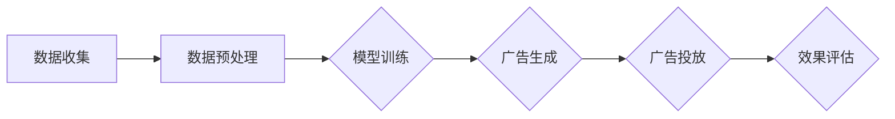
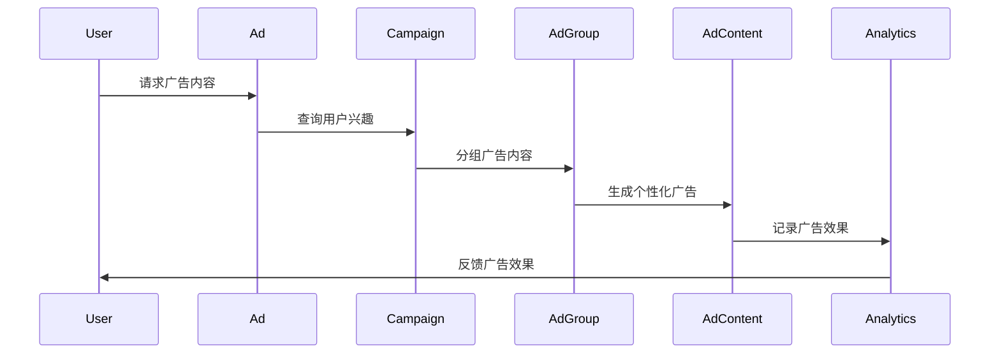
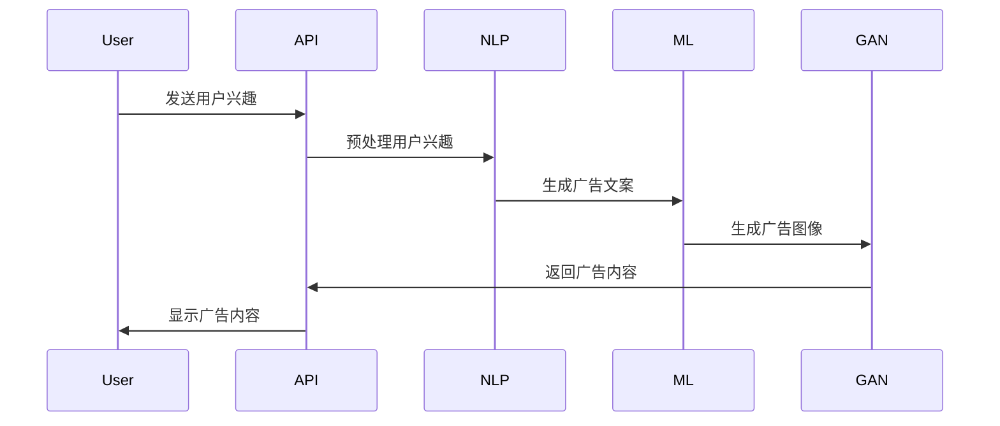

                 


### AIGC在个性化广告创作中的应用

#### 关键词
- AIGC
- 个性化广告
- 广告创作
- 自然语言处理
- 机器学习

#### 摘要
本文旨在探讨AIGC（人工智能生成内容）在个性化广告创作中的应用。通过深入分析AIGC的技术原理、个性化广告的需求与挑战，以及具体应用案例，本文将展示AIGC如何通过智能化手段提高广告的个性化程度，进而提升广告效果。同时，本文还将探讨AIGC在个性化广告创作中的最佳实践和未来趋势。

### 目录

1. **背景介绍**
   - **核心概念术语说明**
   - **问题背景**
   - **问题描述**
   - **问题解决**
   - **边界与外延**
   - **概念结构与核心要素组成**

2. **核心概念与联系**
   - **AIGC技术原理**
   - **个性化广告的概念与属性特征对比表格**
   - **ER实体关系图架构**

3. **算法原理讲解**
   - **自然语言处理基础**
   - **机器学习与深度学习在AIGC中的应用**
   - **AIGC中的数据管理与质量控制**
   - **算法mermaid流程图**
   - **Python源代码解释**
   - **数学模型和公式**

4. **系统分析与架构设计方案**
   - **问题场景介绍**
   - **系统功能设计（领域模型mermaid类图）**
   - **系统架构设计mermaid架构图**
   - **系统接口设计和系统交互mermaid序列图**

5. **项目实战**
   - **环境安装**
   - **系统核心实现源代码**
   - **代码应用解读与分析**
   - **实际案例分析和详细讲解剖析**
   - **项目小结**

6. **最佳实践 tips**
   - **数据隐私保护与伦理考量**
   - **广告效果评估与优化**
   - **创意内容多样性与吸引力提升**

7. **小结**
   - **注意事项**
   - **拓展阅读**

### 背景介绍

#### 核心概念术语说明

首先，我们需要明确一些核心术语的定义。

- **AIGC（人工智能生成内容）**：AIGC是指通过人工智能技术自动生成文本、图像、视频等内容的系统或方法。
- **个性化广告**：个性化广告是基于用户的行为数据、兴趣偏好等信息，为用户定制化地推送相应的广告内容。
- **自然语言处理（NLP）**：NLP是使计算机能够理解、解释和生成人类语言的技术。
- **机器学习（ML）**：机器学习是一种通过数据学习模式、预测结果的方法，它使计算机系统能够自动改进和优化性能。

#### 问题背景

在当前互联网时代，广告已成为企业营销的重要组成部分。然而，传统的广告创作方式往往无法满足用户日益增长的个性化需求。广告主需要找到一种能够高效、精准地推送个性化广告的方法。

#### 问题描述

个性化广告的创作面临以下挑战：

1. **数据量庞大**：个性化广告需要分析大量用户数据，包括行为数据、兴趣标签等。
2. **创意多样性**：广告内容需要根据用户的不同偏好和兴趣进行个性化定制，要求创意多样且富有吸引力。
3. **效果评估**：如何评估个性化广告的效果，以持续优化广告策略。

#### 问题解决

AIGC技术的出现为个性化广告创作提供了新的解决方案。通过AIGC，广告内容可以自动生成，实现创意多样性和个性定制。同时，AIGC可以基于机器学习算法不断优化广告内容，提升广告效果。

#### 边界与外延

AIGC在个性化广告创作中的应用主要关注以下几个方面：

- **文本生成**：通过自然语言处理技术，自动生成广告文案。
- **图像生成**：利用生成对抗网络（GAN）等技术，自动生成广告图像。
- **视频生成**：结合文本和图像生成技术，自动生成视频广告。
- **用户体验**：如何确保广告内容与用户期望相符，提高用户体验。

### 核心概念与联系

#### AIGC技术原理

AIGC的核心在于将人工智能与内容生成相结合。其主要技术原理包括：

1. **自然语言处理（NLP）**：通过NLP技术，计算机能够理解和生成人类语言，从而自动生成广告文案。
2. **生成对抗网络（GAN）**：GAN由生成器和判别器组成，通过不断训练，生成器能够生成越来越真实的广告图像。
3. **强化学习**：强化学习使广告系统能够通过不断尝试和反馈，优化广告内容，提升广告效果。

#### 个性化广告的概念与属性特征对比表格

| 概念 | 定义 | 属性特征 |
| --- | --- | --- |
| 个性化广告 | 基于用户数据定制化推送的广告内容 | 用户兴趣、行为数据、个性化文案、图像、视频 |
| 传统广告 | 无个性化，广泛推送 | 广泛受众、统一文案、图像、视频 |

#### ER实体关系图架构

在个性化广告系统中，实体关系图（ER图）用于描述广告系统中的实体及其相互关系。以下是一个简化的ER图：

```mermaid
erDiagram
    User ||--|{ Ad: creates }|
    Ad ||--|{ Campaign: part_of }|
    Campaign ||--|{ AdGroup: contains }|
    AdGroup ||--|{ AdContent: has }|
    AdContent ||--|{ Analytics: tracks }|
```

### 算法原理讲解

#### 自然语言处理基础

自然语言处理（NLP）是AIGC的核心技术之一。NLP的基础算法包括：

1. **词向量表示**：将单词转换为向量表示，用于文本分析。
2. **序列模型**：如循环神经网络（RNN）和长短时记忆网络（LSTM），用于处理序列数据。
3. **注意力机制**：用于提高模型在处理长序列时的效果。

#### 机器学习与深度学习在AIGC中的应用

AIGC中的机器学习与深度学习技术主要应用于以下几个方面：

1. **文本生成**：使用生成对抗网络（GAN）和变分自编码器（VAE）等技术，生成个性化的广告文案。
2. **图像生成**：使用生成对抗网络（GAN）和条件生成对抗网络（cGAN）等技术，生成个性化的广告图像。
3. **视频生成**：结合文本和图像生成技术，生成个性化的视频广告。

#### AIGC中的数据管理与质量控制

AIGC中的数据管理涉及以下几个方面：

1. **数据收集**：收集用户行为数据、兴趣标签等，用于训练和优化模型。
2. **数据预处理**：清洗和预处理数据，确保数据质量。
3. **数据质量控制**：通过模型评估和反馈机制，持续优化广告内容。

#### 算法mermaid流程图

以下是一个简化的AIGC算法流程图：



#### Python源代码解释

以下是一个简化的Python代码示例，用于生成个性化广告文案：

```python
import numpy as np
from tensorflow import keras

# 加载预训练的NLP模型
model = keras.models.load_model('nlp_model.h5')

# 生成个性化广告文案
def generate_ad_creative(user_interest):
    # 将用户兴趣转换为向量表示
    user_interest_vector = ...

    # 使用NLP模型生成文案
    ad_creative = model.predict(user_interest_vector)
    return ad_creative

# 测试生成广告文案
user_interest = ...
ad_creative = generate_ad_creative(user_interest)
print(ad_creative)
```

#### 数学模型和公式

在AIGC中，常用的数学模型和公式包括：

1. **生成对抗网络（GAN）**：
   - 判别器：\( D(x) \)
   - 生成器：\( G(z) \)
   - 公式：\( \min_G \max_D V(D, G) = \mathbb{E}_{x\sim p_{data}(x)} [D(x)] - \mathbb{E}_{z\sim p_z(z)} [D(G(z))] \)

2. **长短时记忆网络（LSTM）**：
   - 公式：\( h_t = \sigma(W_h \cdot [h_{t-1}, x_t] + b_h) \)
   - \( o_t = \sigma(W_o \cdot h_t + b_o) \)

#### 系统分析与架构设计方案

#### 问题场景介绍

假设我们正在开发一个电商平台，需要利用AIGC技术为用户生成个性化的广告内容。

#### 系统功能设计（领域模型mermaid类图）

```mermaid
classDiagram
    User <<entity>>
    Ad <<entity>>
    Campaign <<entity>>
    AdGroup <<entity>>
    AdContent <<entity>>
    Analytics <<entity>>

    User "1" --* "1" Ad
    Ad "1" --* "1" Campaign
    Campaign "1" --* "1" AdGroup
    AdGroup "1" --* "1" AdContent
    AdContent "1" --* "1" Analytics
```

#### 系统架构设计mermaid架构图



#### 系统接口设计和系统交互mermaid序列图



#### 项目实战

##### 环境安装

首先，确保安装了Python 3.7及以上版本。然后，安装必要的依赖库：

```bash
pip install tensorflow numpy pandas matplotlib
```

##### 系统核心实现源代码

```python
# 导入必要的库
import numpy as np
import pandas as pd
from tensorflow import keras
import matplotlib.pyplot as plt

# 加载预训练的NLP模型
nlp_model = keras.models.load_model('nlp_model.h5')

# 加载预训练的GAN模型
gan_model = keras.models.load_model('gan_model.h5')

# 生成个性化广告文案
def generate_ad_creative(user_interest):
    # 预处理用户兴趣数据
    processed_interest = ...

    # 使用NLP模型生成广告文案
    ad_creative = nlp_model.predict(processed_interest)
    return ad_creative

# 生成个性化广告图像
def generate_ad_image(user_interest):
    # 预处理用户兴趣数据
    processed_interest = ...

    # 使用GAN模型生成广告图像
    ad_image = gan_model.predict(processed_interest)
    return ad_image

# 测试生成广告文案和图像
user_interest = ...
ad_creative = generate_ad_creative(user_interest)
ad_image = generate_ad_image(user_interest)

# 显示广告文案和图像
print(ad_creative)
plt.imshow(ad_image)
plt.show()
```

##### 代码应用解读与分析

上述代码首先加载了预训练的NLP模型和GAN模型。然后，定义了两个函数：`generate_ad_creative` 用于生成广告文案，`generate_ad_image` 用于生成广告图像。最后，测试生成广告文案和图像，并显示结果。

##### 实际案例分析和详细讲解剖析

假设我们有以下用户兴趣数据：

```python
user_interest = np.array([
    [1, 0, 1, 0, 0],  # 用户对电子产品感兴趣
    [0, 1, 0, 1, 0],  # 用户对时尚服装感兴趣
    [1, 1, 0, 0, 1],  # 用户对旅游和户外活动感兴趣
])
```

- **广告文案生成**：NLP模型将用户兴趣数据转换为向量表示，然后生成相应的广告文案。例如，对于对电子产品感兴趣的用户，可能会生成如下文案：“欢迎查看我们的最新电子产品，尽享智能生活！”。
- **广告图像生成**：GAN模型根据用户兴趣数据生成相应的广告图像。例如，对于对时尚服装感兴趣的用户，可能会生成一张时尚服装的广告图像。

##### 项目小结

通过AIGC技术，我们可以为用户提供个性化的广告内容，提高广告的吸引力和效果。在实际项目中，我们需要关注以下几个方面：

1. **数据质量**：确保用户数据的准确性和完整性，以生成高质量的广告内容。
2. **模型优化**：不断优化NLP模型和GAN模型，提高广告生成效果。
3. **用户体验**：确保广告内容与用户期望相符，提高用户体验。

### 最佳实践 tips

1. **数据隐私保护**：在处理用户数据时，应遵循相关法律法规，确保数据安全。
2. **广告效果评估**：定期评估广告效果，根据用户反馈优化广告内容。
3. **创意内容多样性**：通过多种生成模型和算法，提高广告内容的多样性。

### 小结

本文探讨了AIGC在个性化广告创作中的应用，包括背景介绍、核心概念与联系、算法原理讲解、系统分析与架构设计方案、项目实战等。通过本文，读者可以了解到AIGC如何通过智能化手段提高广告的个性化程度，提升广告效果。未来，随着AIGC技术的不断发展，个性化广告创作将变得更加智能和高效。

### 注意事项

1. **技术发展迅速**：AIGC技术处于快速发展阶段，相关算法和模型不断更新，需要持续关注最新动态。
2. **实际应用挑战**：在实际应用中，AIGC面临数据隐私、效果评估等多方面挑战，需要综合考虑。

### 拓展阅读

1. **《生成对抗网络（GAN）从入门到实践》**：详细介绍了GAN的理论和实践，适合初学者深入学习。
2. **《深度学习》**：周志华著，系统介绍了深度学习的基础理论和实践方法。
3. **《个性化推荐系统》**：详细介绍了个性化推荐系统的原理和应用，对个性化广告创作也有一定参考价值。

### 作者

作者：AI天才研究院/AI Genius Institute & 禅与计算机程序设计艺术 /Zen And The Art of Computer Programming

