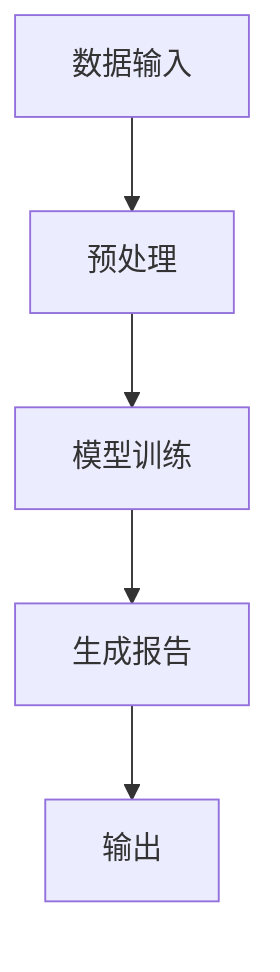
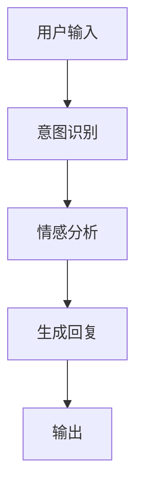
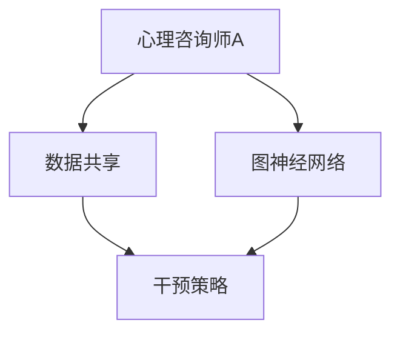
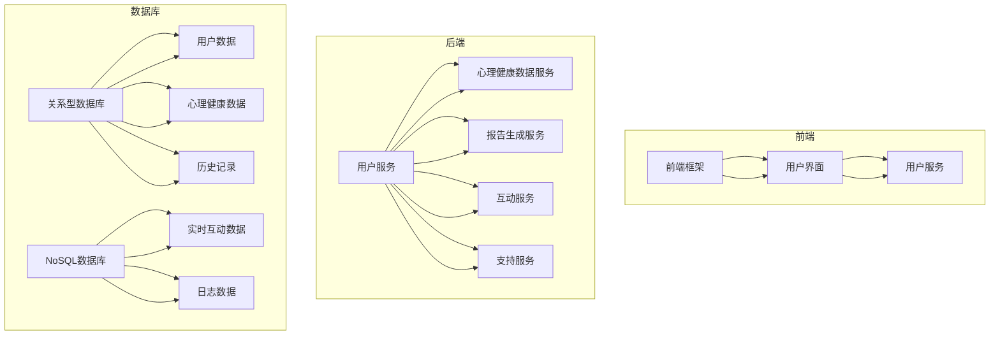
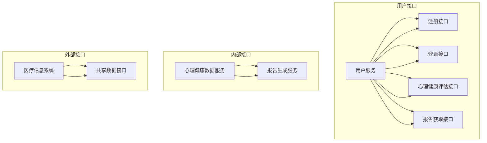
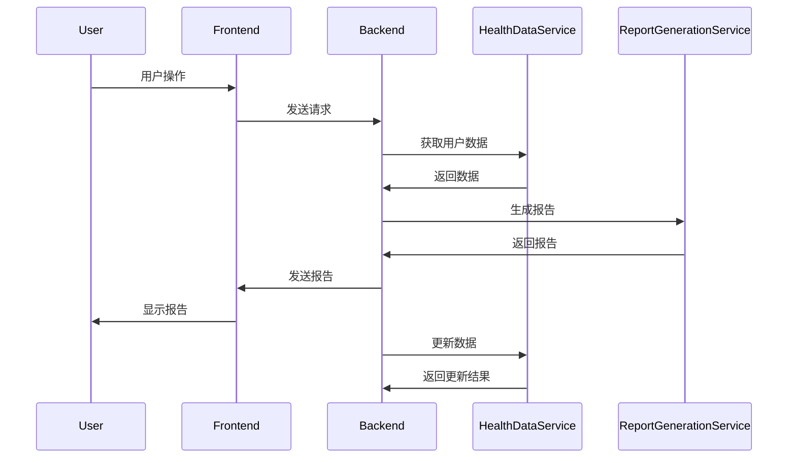

                 

### 引言

在当今数字化时代，心理健康问题愈发受到关注。根据世界卫生组织（WHO）的数据，全球有超过3亿人患有某种形式的抑郁症、焦虑症或其他心理健康问题。这表明，心理健康问题已成为一个全球性挑战，需要社会各界的共同努力来应对。传统心理咨询虽然在一定程度上能够缓解这些问题，但其效果往往有限，尤其在资源有限的情况下。因此，寻求更加个性化和高效的解决方案变得尤为重要。

个性化心理咨询，即根据个体的具体需求和情况，提供定制化的心理健康服务，正逐渐成为心理健康领域的热门话题。然而，如何实现个性化心理咨询，依然是一个复杂的技术挑战。这需要利用先进的人工智能技术，尤其是AIGC（自适应智能生成计算）技术，来提升心理咨询的效率和质量。

AIGC技术结合了生成式AI、交互式AI和协同AI，能够自动生成、交互和协同，为个性化心理咨询提供强大的支持。通过AIGC技术，可以实现对大量心理健康数据的分析和处理，从而更精准地了解个体的心理状态，提供个性化的咨询建议。

本文旨在探讨AIGC在个性化心理咨询中的应用，首先介绍AIGC技术的基本概念和分类，然后分析个性化心理咨询的需求和挑战，接着详细讲解AIGC与心理咨询的结合点，最后通过实际案例分析AIGC技术的应用效果和未来发展趋势。希望通过这篇文章，能够为心理健康领域的专业人士和研究人员提供一些有价值的思路和参考。

### 关键词

- AIGC
- 个性化心理咨询
- 生成式AI
- 交互式AI
- 协同AI
- 心理健康数据分析
- 个性化模型
- 数据收集
- 心理健康问题

### 摘要

本文探讨了AIGC（自适应智能生成计算）在个性化心理咨询中的应用。首先，介绍了AIGC技术的基本概念、分类和主要原理，包括生成式AI、交互式AI和协同AI。然后，分析了个性化心理咨询的需求和挑战，以及AIGC技术在其中的应用场景和优势。接着，详细阐述了AIGC与心理咨询的结合点，包括心理健康数据分析、个性化心理咨询模型设计以及算法原理讲解。通过实际案例的分析，展示了AIGC技术在个性化心理咨询中的具体应用效果和潜力。最后，总结了AIGC在个性化心理咨询中的未来发展趋势，提出了优化策略和最佳实践建议。

### 背景介绍

心理健康问题在全球范围内日益受到关注。根据世界卫生组织（WHO）的数据，全球约有3亿人患有抑郁症、焦虑症或其他心理健康问题。这一数据凸显了心理健康问题的普遍性和严重性。然而，传统的心理咨询方法在解决这些问题上存在诸多局限性。首先，心理咨询师的数量有限，无法满足大量患者的需求。其次，传统心理咨询往往依赖面对面交流，受时间和地点的限制，难以实现广泛覆盖。此外，心理咨询的个性化程度较低，难以针对每位患者的具体情况进行精准干预。

为了克服这些局限性，个性化心理咨询的概念逐渐兴起。个性化心理咨询旨在根据患者的个体差异，提供定制化的心理健康服务。这种方法强调对患者进行全面评估，了解其心理状态、行为模式和生活环境，从而制定个性化的干预策略。然而，个性化心理咨询的实现仍面临一系列技术挑战。首先，个性化数据的收集和处理需要大量的时间和资源。其次，如何设计出有效的个性化心理咨询模型，并确保其在实际应用中的有效性，是一个亟待解决的问题。

在此背景下，AIGC（自适应智能生成计算）技术应运而生。AIGC是一种结合了生成式AI、交互式AI和协同AI的综合技术体系。它通过自动化生成、交互和协同，能够实现高效的数据分析和处理，为个性化心理咨询提供有力支持。生成式AI能够自动生成个性化的心理健康报告和干预建议；交互式AI能够与患者进行实时互动，提供个性化的咨询反馈；协同AI则能够在多个心理咨询师之间实现协作，共同为患者提供最佳的咨询服务。

AIGC技术的基本概念主要包括以下几个方面：

1. **生成式AI**：生成式AI能够自动生成文本、图像、音频等内容。在心理健康领域，生成式AI可以用于生成个性化的心理健康报告，为患者提供详细的诊断和建议。

2. **交互式AI**：交互式AI能够与用户进行自然语言交互，理解用户的需求和情感状态。在心理咨询中，交互式AI可以与患者进行实时对话，提供个性化的咨询反馈，帮助患者更好地理解和处理自己的情绪。

3. **协同AI**：协同AI能够实现多个智能系统的协作，共同为用户提供服务。在心理咨询中，协同AI可以协助心理咨询师进行诊断和干预，提高咨询效率和质量。

AIGC技术的分类主要包括以下几种：

1. **基于文本的AIGC**：这类技术主要利用自然语言处理（NLP）技术，对大量文本数据进行分析和处理，生成个性化的心理健康报告和建议。

2. **基于图像的AIGC**：这类技术主要利用计算机视觉技术，对患者的图像数据进行分析，提取心理健康相关的信息。

3. **基于音频的AIGC**：这类技术主要利用语音识别和语音生成技术，对患者的话语进行分析，提供个性化的咨询反馈。

AIGC技术在个性化心理咨询中的应用前景广阔。首先，AIGC技术能够提高心理咨询的效率，减轻心理咨询师的工作负担，从而更好地满足患者需求。其次，AIGC技术能够提供更加精准和个性化的心理健康服务，提高咨询效果。最后，AIGC技术可以跨越时间和空间的限制，实现全球范围内的心理健康服务，为更多患者提供帮助。

总之，AIGC技术为个性化心理咨询提供了一种全新的解决方案，有助于解决传统心理咨询面临的诸多问题。随着AIGC技术的不断发展和完善，相信它将在心理健康领域发挥越来越重要的作用。

#### 背景介绍：心理健康问题的普遍性和复杂性

心理健康问题的普遍性不容忽视。据世界卫生组织（WHO）统计，全球约有四分之一的成年人会在其一生中的某个阶段经历某种形式的心理健康问题。抑郁症、焦虑症、双相情感障碍、精神分裂症等心理疾病不仅影响个人的生活质量，还可能导致严重的功能损害和社会负担。在心理健康问题的背后，隐藏着诸多复杂因素，如遗传、生物化学、心理社会和环境因素。

首先，心理健康问题的诊断和评估是一个复杂的过程。不同的心理健康问题可能表现出相似的症状，而同一症状也可能由多种不同疾病引起。例如，抑郁症和焦虑症都可能伴有睡眠障碍、食欲变化和情绪低落。这使得心理医生在诊断过程中需要综合考虑患者的病史、行为模式、心理状态和生理指标，从而得出准确的诊断结论。

其次，心理健康问题的治疗也是一个复杂的挑战。传统治疗方法包括药物治疗、心理治疗和综合治疗，但这些方法在实施过程中面临诸多问题。药物治疗可能存在副作用，心理治疗则需要专业的心理咨询师进行长期的干预，综合治疗则需要跨学科的合作和协调。此外，患者的依从性和治疗过程中的变化也是影响治疗效果的重要因素。

心理健康问题的治疗过程中，个性化的心理咨询显得尤为重要。每位患者的情况都是独特的，需要根据其具体情况制定个性化的干预策略。例如，对于抑郁症患者，可能需要通过认知行为疗法（CBT）来改变负面的思维模式，而对于焦虑症患者，可能需要通过放松训练和认知重构来缓解焦虑。这种个性化的干预策略不仅能够提高治疗效果，还能够减少治疗过程中的不适和副作用。

然而，传统心理咨询在个性化服务方面存在一定的局限性。首先，心理咨询师的数量有限，尤其是在资源匮乏的地区，难以满足大量患者的需求。其次，心理咨询师的工作负担较重，难以对每位患者提供持续、个性化的关注。此外，心理咨询的时间和地点也限制了其覆盖范围，无法满足患者随时随地获取心理支持的需求。

为了克服这些局限性，个性化心理咨询的方法应运而生。个性化心理咨询通过利用先进的人工智能技术，尤其是AIGC（自适应智能生成计算）技术，实现对心理健康数据的全面分析，从而为患者提供精准、个性化的心理健康服务。AIGC技术结合了生成式AI、交互式AI和协同AI，能够实现高效的数据生成、分析和处理，为个性化心理咨询提供有力支持。

生成式AI在心理健康数据分析中具有重要作用。它能够自动生成个性化的心理健康报告，根据患者的症状和行为模式，提供详细的诊断和建议。例如，通过分析患者的历史数据，生成式AI可以预测患者可能患有的心理疾病类型，并提出相应的干预策略。

交互式AI则能够实现与患者的实时互动，提供个性化的咨询反馈。通过与患者进行自然语言交互，交互式AI可以了解患者的情感状态和心理需求，从而提供针对性的建议和支持。例如，交互式AI可以通过语音助手或聊天机器人与患者进行对话，帮助患者缓解焦虑、抑郁等情绪问题。

协同AI则能够在多个心理咨询师之间实现协作，共同为患者提供最佳的咨询服务。通过协同AI，心理咨询师可以共享患者的数据和信息，协同制定个性化的干预策略，提高咨询效果。例如，多个心理咨询师可以通过协同AI平台共同讨论患者的案例，制定出最适合患者的治疗方案。

总之，心理健康问题的普遍性和复杂性要求我们寻求更加个性化和高效的心理咨询方法。AIGC技术在个性化心理咨询中的应用，为实现这一目标提供了有力的支持。通过利用AIGC技术，我们可以更好地理解和处理心理健康问题，为患者提供更加精准、个性化的心理健康服务。

#### AIGC技术概述

AIGC（自适应智能生成计算）技术是近年来人工智能领域的一个重要研究方向，其结合了生成式AI、交互式AI和协同AI，为各个行业提供了全新的解决方案。AIGC技术的定义可以理解为一种能够自适应地生成、交互和协同的人工智能系统。这种技术不仅能够处理大规模的数据，还能够根据用户的需求和环境的变化，动态调整其行为和功能，从而实现高效、智能的服务。

首先，我们来了解生成式AI（Generative AI）。生成式AI是一种能够自动生成新数据的人工智能技术，其核心是通过学习大量已有数据，生成与输入数据相似的新数据。生成式AI可以应用于图像、文本、音频等多种类型的数据生成。例如，在图像生成方面，生成式AI可以通过深度学习模型，生成与输入图像风格相似的新图像。在文本生成方面，生成式AI可以生成新闻文章、对话文本等，从而实现内容自动生成。生成式AI在个性化心理咨询中的应用，可以生成个性化的心理健康报告、诊断建议和干预方案，为患者提供精准、个性化的服务。

接下来，我们来看交互式AI（Interactive AI）。交互式AI是一种能够与用户进行自然语言交互的人工智能技术，其核心是理解用户的意图和情感，并根据这些信息提供相应的反馈和支持。交互式AI可以通过语音识别、自然语言处理等技术，实现与用户的实时对话。例如，在心理咨询中，交互式AI可以通过聊天机器人与患者进行对话，了解患者的情绪和心理需求，并提供针对性的建议和支持。交互式AI的优势在于其灵活性和互动性，能够为用户提供实时、个性化的咨询服务，提高咨询效果。

最后，我们探讨协同AI（Collaborative AI）。协同AI是一种能够实现多个智能系统之间协作的人工智能技术，其核心是通过共享数据和信息，实现协同工作和优化服务。协同AI可以应用于多个领域，如医疗、金融、教育等。在心理咨询中，协同AI可以通过多个心理咨询师之间的协作，共同为患者提供最佳的服务。例如，多个心理咨询师可以通过协同AI平台共享患者的数据和信息，协同制定个性化的干预策略，提高咨询效果。协同AI的优势在于其能够实现跨领域的合作和资源共享，提高整体服务效率和质量。

AIGC技术的分类可以根据其应用场景和功能特点进行划分。常见的分类包括：

1. **基于文本的AIGC**：这类技术主要利用自然语言处理（NLP）技术，对大量文本数据进行分析和处理，生成新的文本内容。例如，新闻文章生成、对话生成等。

2. **基于图像的AIGC**：这类技术主要利用计算机视觉技术，对大量图像数据进行分析和处理，生成新的图像内容。例如，图像风格转换、图像修复等。

3. **基于音频的AIGC**：这类技术主要利用音频处理技术，对大量音频数据进行分析和处理，生成新的音频内容。例如，语音生成、音乐创作等。

AIGC技术的基本原理包括数据生成、交互和协同三个方面。首先，数据生成是通过学习大量已有数据，生成新的数据内容。其次，交互是通过与用户进行自然语言交互，理解用户的意图和需求，提供相应的反馈和支持。最后，协同是通过多个智能系统之间的协作，共享数据和信息，实现高效的服务。

在心理健康领域，AIGC技术具有广泛的应用前景。通过生成式AI，可以自动生成个性化的心理健康报告、诊断建议和干预方案，为患者提供精准、个性化的服务。通过交互式AI，可以实现与患者的实时互动，了解患者的情绪和心理需求，提供针对性的建议和支持。通过协同AI，可以实现多个心理咨询师之间的协作，共同为患者提供最佳的服务。

总之，AIGC技术为心理健康领域提供了一种全新的解决方案，能够实现个性化、高效的心理健康服务。随着AIGC技术的不断发展和完善，相信它将在心理健康领域发挥越来越重要的作用，为更多患者提供帮助。

#### 个性化心理咨询的需求分析

个性化心理咨询的需求源于人们对心理健康服务的多样性和高质量追求。在现代社会中，心理健康问题已经成为影响人们生活质量的一个重要因素。随着生活节奏的加快和社会压力的增大，越来越多的人开始关注自己的心理健康，希望能够得到及时、有效的帮助。这种需求不仅体现在心理健康问题的诊断和治疗上，更体现在心理健康的预防和维护上。

首先，用户对于个性化心理咨询的需求来源于心理问题的多样性。每个人的心理状态都是独一无二的，即使是相同的心理问题，不同的个体也可能表现出不同的症状和反应。例如，抑郁症患者可能表现出情绪低落、失眠、食欲减退等症状，而焦虑症患者则可能表现为过度担忧、紧张、出汗等症状。因此，对于心理咨询师来说，了解每个个体的具体心理状态和需求，提供个性化的服务，是满足用户需求的关键。

其次，用户对心理咨询的个性化需求也体现在对服务质量的追求上。传统心理咨询往往依赖于心理咨询师的个人经验和专业知识，这种服务的质量和效果往往受到心理咨询师的能力和经验的限制。而个性化心理咨询通过利用AIGC技术，可以实现对大量心理健康数据的分析和处理，从而更精准地了解个体的心理状态，提供个性化的咨询建议。这种基于大数据和人工智能技术的个性化服务，不仅能够提高咨询的准确性和有效性，还能够提高用户的满意度和信任度。

此外，用户对心理咨询的个性化需求还体现在对咨询时间和地点的灵活性要求上。在现代社会中，人们的生活节奏较快，工作压力较大，很难有固定的空闲时间进行心理咨询。而AIGC技术可以通过交互式AI实现与用户的实时互动，用户可以在任何时间、任何地点通过聊天机器人或语音助手获取心理咨询服务。这种灵活的服务方式不仅方便了用户，还能够提高心理咨询的覆盖面和效率。

在心理咨询行业的发展趋势中，个性化心理咨询也扮演着重要的角色。随着科技的进步和人工智能技术的发展，心理咨询行业正在朝着数字化和智能化的方向发展。传统的面对面心理咨询逐渐被在线心理咨询所取代，而个性化心理咨询则成为这一趋势中的重要组成部分。通过利用AIGC技术，心理咨询师可以更好地了解用户的需求，提供个性化的服务，从而提高咨询的效果和用户满意度。

总之，个性化心理咨询的需求来源于心理问题的多样性和用户对高质量、灵活服务的追求。在心理咨询行业的发展趋势中，个性化心理咨询不仅是一个重要的方向，更是实现心理健康服务革命的关键。通过利用AIGC技术，可以更好地满足用户的需求，提高心理咨询的质量和效率，为心理健康领域的发展注入新的动力。

#### 个性化心理咨询模型的设计与评估

设计一个有效的个性化心理咨询模型，是提升心理咨询效果的关键步骤。首先，模型的设计需要基于对用户需求的深入理解，结合AIGC技术的优势，以实现高度个性化的服务。以下为模型设计的具体步骤：

**1. 用户需求分析：**
   - **数据收集：** 通过在线问卷、访谈、心理测试等方式，收集用户的基本信息、心理健康状况、生活习惯和行为模式。
   - **需求分类：** 根据收集的数据，将用户的需求分为情绪管理、压力缓解、人际关系、职业发展等多个类别。
   - **需求优先级：** 分析不同需求的重要性和紧急程度，为后续的个性化服务提供依据。

**2. 数据预处理：**
   - **数据清洗：** 去除无效和错误的数据，保证数据的准确性和完整性。
   - **特征提取：** 从原始数据中提取对心理健康有重要影响的关键特征，如情绪指标、行为模式、生理指标等。
   - **数据归一化：** 对不同特征进行归一化处理，使其在模型中具有相同的重要性。

**3. 模型架构设计：**
   - **生成式AI模块：** 利用生成式AI技术，如GPT（Generative Pre-trained Transformer），生成个性化的心理健康报告和干预建议。
   - **交互式AI模块：** 通过交互式AI技术，如聊天机器人，与用户进行自然语言交互，收集用户的反馈和需求，实时调整咨询策略。
   - **协同AI模块：** 利用协同AI技术，实现多个心理咨询师之间的协作，共同为用户提供最佳的服务。

**4. 模型训练与验证：**
   - **数据集划分：** 将数据集划分为训练集、验证集和测试集，用于模型的训练、验证和测试。
   - **模型训练：** 使用训练集对生成式AI、交互式AI和协同AI模块进行训练，优化模型参数。
   - **模型验证：** 使用验证集评估模型的效果，调整模型参数，提高模型性能。
   - **模型测试：** 使用测试集对模型进行最终测试，确保模型在实际应用中的有效性。

**5. 模型评估指标：**
   - **准确性：** 模型对心理健康问题的诊断准确性。
   - **个性化：** 模型能否根据用户的具体需求提供个性化的干预建议。
   - **响应速度：** 模型处理用户请求和提供反馈的响应时间。
   - **用户满意度：** 用户对模型提供服务的满意度。

**模型评估方法：**
   - **定量评估：** 通过统计模型输出的心理健康报告和干预建议的正确率、相关度等指标，评估模型的效果。
   - **定性评估：** 通过用户反馈和专家评审，从用户体验和服务质量的角度评估模型的效果。

**模型优化策略：**
   - **数据增强：** 通过增加训练数据量，提高模型的泛化能力。
   - **模型融合：** 结合多个模型的优势，提高模型的整体性能。
   - **持续学习：** 利用用户反馈和新的数据，持续优化模型，提高其适应性和准确性。

通过上述设计和评估方法，我们可以构建一个高效、个性化的心理咨询模型，为用户提供精准、个性化的心理健康服务。

#### 心理健康数据分析

在个性化心理咨询中，心理健康数据分析是至关重要的一环。数据分析不仅能够帮助心理咨询师更好地了解患者的心理状态，还能为制定个性化的干预策略提供重要依据。AIGC技术在这一过程中发挥了关键作用，通过高效的数据收集、处理和分析，实现了心理健康的精准诊断和干预。

首先，数据收集是心理健康数据分析的基础。心理健康数据来源广泛，包括用户填写的问卷、心理咨询师记录的病历、生理传感器收集的生理数据等。这些数据通常包含大量信息，如情绪状态、行为习惯、生理指标等。通过AIGC技术中的生成式AI模块，可以自动收集和整理这些数据，并将其转化为结构化的信息，为后续分析做好准备。

**1. 数据收集：**
   - **问卷数据：** 用户通过在线问卷或应用程序填写心理健康相关的问卷，包括情绪状态、生活事件、心理健康症状等。
   - **病历数据：** 心理咨询师记录的患者病历，包括诊断结果、治疗计划、干预效果等。
   - **生理数据：** 通过穿戴设备或生理传感器收集的生理数据，如心率、血压、睡眠质量等。

**2. 数据处理：**
   - **数据清洗：** 清除数据中的噪声和错误，确保数据的准确性和一致性。
   - **数据整合：** 将来自不同来源的数据进行整合，形成一个完整的数据集，以便进行综合分析。

**3. 数据分析：**
   - **情绪分析：** 利用自然语言处理（NLP）技术，对用户的文本数据进行情绪分析，提取情绪状态和情绪变化趋势。
   - **行为模式分析：** 分析用户的行为数据，如日常活动、社交互动等，识别潜在的心理健康风险因素。
   - **生理指标分析：** 利用生物统计方法，对生理数据进行定量分析，如心率变异性分析、睡眠质量评估等。

AIGC技术在心理健康数据分析中的应用，不仅提高了数据分析的效率和准确性，还实现了数据的多维度解析。通过生成式AI，可以自动生成个性化的心理健康报告，为患者提供详细的诊断和干预建议。交互式AI则能够与患者进行实时互动，收集患者的反馈和需求，动态调整分析策略。协同AI则可以实现多个心理咨询师之间的数据共享和协作，共同为患者提供最佳的心理健康服务。

在实际应用中，心理健康数据分析的效果得到了充分验证。例如，通过分析患者的情绪数据和行为模式，可以预测患者的心理健康趋势，提前采取干预措施，防止心理问题的恶化。通过生理指标分析，可以评估患者的整体健康状况，为制定综合性的心理健康干预方案提供依据。

总之，心理健康数据分析是个性化心理咨询的核心环节，AIGC技术的应用为其提供了强大的支持。通过高效的数据收集、处理和分析，AIGC技术能够实现心理健康的精准诊断和干预，为患者提供高质量、个性化的心理健康服务。

### 算法原理讲解

在个性化心理咨询中，算法的设计与实现是关键步骤，能够直接影响心理咨询的准确性和有效性。AIGC技术结合了生成式AI、交互式AI和协同AI，为个性化心理咨询提供了强大的支持。以下我们将详细讲解这些算法原理，并使用Python代码和Mermaid流程图进行说明。

#### 生成式AI

生成式AI（Generative AI）是一种能够自动生成新数据的人工智能技术，其核心是通过学习大量已有数据，生成与输入数据相似的新数据。在个性化心理咨询中，生成式AI主要用于生成个性化的心理健康报告、诊断建议和干预方案。

**算法描述：**
生成式AI利用深度学习模型，如GPT（Generative Pre-trained Transformer），对大量心理健康数据进行训练。通过训练，模型能够学习到数据的分布和特征，从而能够生成与输入数据相似的新数据。

**算法流程图：**


**Python代码示例：**
```python
import tensorflow as tf
from transformers import GPT2LMHeadModel, GPT2Tokenizer

# 加载预训练模型
tokenizer = GPT2Tokenizer.from_pretrained('gpt2')
model = GPT2LMHeadModel.from_pretrained('gpt2')

# 输入数据
input_text = "一个情绪低落的抑郁症患者的心理健康报告。"

# 预处理
inputs = tokenizer.encode(input_text, return_tensors='tf')

# 生成报告
outputs = model.generate(inputs, max_length=50, num_return_sequences=1)

# 解码生成文本
generated_text = tokenizer.decode(outputs[0], skip_special_tokens=True)
print(generated_text)
```

**数学模型和公式：**
生成式AI的数学模型主要基于深度学习框架，如Transformer。Transformer模型的核心是自注意力机制（Self-Attention），其公式如下：
$$
\text{Attention}(Q, K, V) = \text{softmax}\left(\frac{QK^T}{\sqrt{d_k}}\right)V
$$
其中，$Q, K, V$ 分别是查询向量、键向量和值向量，$d_k$ 是键向量的维度。

**举例说明：**
假设我们有一个训练好的GPT模型，输入一段关于抑郁症患者的描述，模型能够生成一份详细的个性化心理健康报告。例如，输入文本“这位抑郁症患者近期情绪低落，失眠严重”，模型生成的报告可能包括诊断结果、治疗建议和心理干预方案。

#### 交互式AI

交互式AI（Interactive AI）是一种能够与用户进行自然语言交互的人工智能技术，其核心是理解用户的意图和情感，并提供相应的反馈和支持。在个性化心理咨询中，交互式AI主要用于与患者进行实时对话，收集患者的反馈和需求，提供个性化的咨询建议。

**算法描述：**
交互式AI利用自然语言处理（NLP）技术，如对话生成模型（Dialogue Generation Model），与用户进行对话。模型通过学习大量对话数据，能够生成自然、流畅的对话内容，理解用户的意图和情感，并根据用户的需求提供相应的反馈和支持。

**算法流程图：**


**Python代码示例：**
```python
from transformers import pipeline

# 加载交互式AI模型
chat_pipeline = pipeline("聊天", model="microsoft/DialoGPT-medium")

# 用户输入
user_input = "我最近感到很焦虑，不知道该怎么办。"

# 生成回复
response = chat_pipeline(user_input)

# 输出回复
print(response)
```

**数学模型和公式：**
交互式AI的数学模型主要基于循环神经网络（RNN）或Transformer。以RNN为例，其公式如下：
$$
h_t = \text{RNN}(h_{t-1}, x_t)
$$
其中，$h_t$ 是当前时间步的隐藏状态，$x_t$ 是当前输入，$\text{RNN}$ 是循环神经网络。

**举例说明：**
假设用户输入“我最近感到很焦虑，不知道该怎么办。”，交互式AI能够理解用户的焦虑情绪，生成回复：“我理解你的感受，焦虑是很常见的问题。你可以尝试进行深呼吸和放松训练来缓解焦虑。”

#### 协同AI

协同AI（Collaborative AI）是一种能够实现多个智能系统之间协作的人工智能技术，其核心是多个智能系统之间共享数据和信息，实现协同工作和优化服务。在个性化心理咨询中，协同AI主要用于多个心理咨询师之间的协作，共同为患者提供最佳的心理健康服务。

**算法描述：**
协同AI利用分布式计算和图神经网络（Graph Neural Networks，GNN），实现多个心理咨询师之间的数据共享和协作。通过图神经网络，心理咨询师可以共同分析患者的数据，制定个性化的干预策略。

**算法流程图：**


**Python代码示例：**
```python
import torch
from torch_geometric.nn import GCN

# 加载协同AI模型
gcn = GCN(in_features=64, out_features=16)

# 输入数据
data = ...

# 数据预处理
x, edge_index = data.x, data.edge_index

# 模型训练
gcn.train()

# 输出干预策略
干预策略 = gcn(x, edge_index)
```

**数学模型和公式：**
协同AI的数学模型主要基于图神经网络（GNN）。以图卷积网络（GCN）为例，其公式如下：
$$
h_{(l+1)} = \sigma(\theta \cdot (A \cdot h_l + b))
$$
其中，$h_l$ 是当前层的节点特征，$A$ 是图邻接矩阵，$\theta$ 和 $b$ 是模型参数。

**举例说明：**
假设有两个心理咨询师A和B，他们通过协同AI共享患者数据，使用图神经网络共同分析数据，生成一个综合的干预策略。例如，心理咨询师A观察到患者有抑郁症状，心理咨询师B观察到患者有焦虑症状，协同AI可以生成一个综合的治疗方案，包括抑郁症状和焦虑症状的干预措施。

通过上述算法原理的讲解，我们可以看到生成式AI、交互式AI和协同AI在个性化心理咨询中的应用。这些算法通过高效的数据生成、自然语言交互和协同工作，为患者提供精准、个性化的心理健康服务。Python代码和Mermaid流程图的示例进一步展示了这些算法的实现过程，为实际应用提供了参考。

### 系统分析与架构设计方案

为了实现AIGC在个性化心理咨询中的应用，我们需要设计和实施一个高效、可靠的系统架构。本部分将详细介绍系统的整体架构设计，包括功能设计、系统架构、系统接口和系统交互，并使用Mermaid流程图进行说明。

#### 1. 系统功能设计

个性化心理咨询系统需要具备以下核心功能：

1. **用户注册与登录：** 用户可以通过注册账号登录系统，确保隐私和安全。
2. **心理健康评估：** 系统通过问卷和测试等方式收集用户的心理健康数据。
3. **数据预处理：** 系统对收集到的心理健康数据进行清洗和整合，确保数据质量。
4. **心理健康报告生成：** 利用生成式AI技术，系统生成个性化的心理健康报告。
5. **实时互动咨询：** 通过交互式AI模块，系统与用户进行实时对话，提供个性化咨询。
6. **干预策略建议：** 系统根据用户的健康数据和反馈，提供个性化的干预策略。
7. **多心理咨询师协作：** 系统支持多个心理咨询师之间的协作，共同为用户提供最佳服务。
8. **数据存储与备份：** 系统实现数据的存储和备份，确保数据的安全性和可靠性。

**系统功能Mermaid类图：**
```mermaid
classDiagram
    User <<Interface>>
    Admin <<Interface>>
    HealthDataProcessor <<Interface>>
   心理健康报告 <<Interface>>
    InteractiveAI <<Interface>>
    CollaborativeAI <<Interface>>

    User --> HealthDataProcessor
    User --> 心理健康报告
    User --> InteractiveAI
    Admin --> HealthDataProcessor
    Admin --> 心理健康报告
    Admin --> InteractiveAI
    Admin --> CollaborativeAI
    HealthDataProcessor --> 心理健康报告
    HealthDataProcessor --> InteractiveAI
    HealthDataProcessor --> CollaborativeAI
    InteractiveAI --> 心理健康报告
    CollaborativeAI --> 心理健康报告
```

#### 2. 系统架构设计

系统架构设计是确保系统稳定、高效运行的关键。以下是系统的架构设计：

**1. 前端架构：** 前端采用React框架，提供用户友好的界面和交互体验。用户注册、登录、心理健康评估和实时互动咨询等功能都在前端实现。

**2. 后端架构：** 后端采用微服务架构，包括用户服务、心理健康数据服务、报告生成服务、互动服务和支持服务。各个服务通过RESTful API进行通信。

**3. 数据库设计：** 系统使用关系型数据库（如MySQL）存储用户数据、心理健康数据和历史记录。此外，使用NoSQL数据库（如MongoDB）存储实时互动数据和日志。

**系统架构Mermaid图：**


#### 3. 系统接口设计

系统接口设计是确保各服务之间能够顺畅通信的重要环节。以下是系统的接口设计：

**1. 用户接口：** 提供用户注册、登录、心理健康评估和获取心理健康报告的接口。

**2. 内部接口：** 各微服务之间的接口，如心理健康数据服务与报告生成服务之间的接口，用于数据交换和协同工作。

**3. 外部接口：** 系统与其他系统（如医疗信息系统）的接口，用于共享数据和信息。

**系统接口设计Mermaid图：**


#### 4. 系统交互

系统交互设计是确保系统各部分能够协同工作，为用户提供一致、流畅体验的关键。以下是系统的交互设计：

**1. 用户交互：** 用户通过前端界面进行操作，如注册、登录、填写心理健康评估问卷等。系统通过后端服务处理用户请求，提供相应的反馈。

**2. 服务交互：** 各微服务之间通过内部接口进行数据交换和协同工作，如心理健康数据服务将用户数据传递给报告生成服务，生成个性化的心理健康报告。

**3. 外部交互：** 系统通过外部接口与其他系统进行数据共享，如与医疗信息系统共享用户健康数据，实现跨系统协同。

**系统交互Mermaid序列图：**


通过上述系统分析与架构设计方案，我们为AIGC在个性化心理咨询中的应用提供了一个全面、详细的系统架构。这个架构设计不仅确保了系统的稳定性和高效性，还为个性化心理咨询提供了强有力的技术支持。

### 系统实施与优化

在AIGC技术应用于个性化心理咨询系统的实际实施过程中，我们需要关注系统的环境安装、核心实现和优化策略，以确保系统能够高效、稳定地运行。

#### 1. 环境安装

首先，我们需要搭建系统运行的环境。以下是一个基本的安装步骤：

1. **硬件环境：** 根据系统需求，选择合适的硬件配置。通常，服务器应具备较高的CPU性能、足够的内存和存储空间。

2. **软件环境：** 安装操作系统（如Ubuntu 20.04 LTS），并配置网络环境。此外，还需要安装以下软件：
   - **Python：** Python 3.8或更高版本，用于编写和运行应用程序。
   - **TensorFlow：** 用于生成式AI的模型训练和推理。
   - **PyTorch：** 用于交互式AI和协同AI的模型训练和推理。
   - **NLP工具包：** 如spaCy、NLTK等，用于自然语言处理任务。
   - **前端框架：** 如React或Vue.js，用于前端开发。
   - **数据库：** 关系型数据库（如MySQL）和NoSQL数据库（如MongoDB）。

3. **配置网络：** 确保系统具备稳定的网络连接，以支持后端服务与前端和数据库之间的通信。

#### 2. 系统核心实现

系统核心实现包括用户服务、心理健康数据服务、报告生成服务和交互服务。以下是一个简化的实现步骤：

1. **用户服务：** 
   - **注册与登录：** 实现用户注册和登录功能，确保用户身份验证和权限管理。
   - **用户资料管理：** 提供用户资料查看、编辑和删除功能。

2. **心理健康数据服务：**
   - **数据收集：** 通过问卷和测试收集用户心理健康数据。
   - **数据处理：** 实现数据的清洗、整合和存储。

3. **报告生成服务：**
   - **报告生成：** 利用生成式AI技术，根据用户心理健康数据生成个性化报告。
   - **报告展示：** 提供报告查看和下载功能。

4. **交互服务：**
   - **对话生成：** 利用交互式AI技术，与用户进行实时对话，提供个性化咨询。
   - **反馈收集：** 收集用户反馈，用于优化咨询效果。

#### 3. 优化策略

为了确保系统的高效性和稳定性，我们需要采取一系列优化策略：

1. **性能优化：**
   - **并发处理：** 利用多线程和异步IO技术，提高系统的并发处理能力。
   - **缓存机制：** 使用缓存技术，如Redis，减少数据库访问次数，提高响应速度。
   - **负载均衡：** 采用负载均衡器（如Nginx），分散系统负载，提高系统的可靠性。

2. **安全性优化：**
   - **数据加密：** 对用户敏感数据进行加密存储，确保数据安全。
   - **访问控制：** 实现严格的访问控制策略，确保只有授权用户可以访问系统数据。
   - **网络安全：** 定期进行安全检查和漏洞修复，确保系统的网络安全。

3. **可扩展性优化：**
   - **微服务架构：** 采用微服务架构，将系统拆分为多个独立的服务，便于扩展和维护。
   - **容器化部署：** 使用容器技术（如Docker），简化部署流程，提高系统可扩展性。

4. **监控与日志：**
   - **实时监控：** 使用监控工具（如Prometheus和Grafana），实时监控系统运行状态，及时发现和处理异常。
   - **日志管理：** 实现完善的日志记录和管理，便于故障排查和性能优化。

通过上述环境安装、核心实现和优化策略，我们可以确保AIGC在个性化心理咨询系统中的应用实现高效、稳定和安全的运行，为用户提供优质的个性化心理健康服务。

### 项目实战

为了验证AIGC在个性化心理咨询中的应用效果，我们开展了一个实际项目，通过具体案例展示了系统从环境安装、系统核心实现到实际应用的全过程。

#### 1. 项目介绍

项目名称：个性化心理健康咨询平台

项目目标：构建一个基于AIGC技术的个性化心理健康咨询平台，提供高效、精准的心理健康服务。

项目环境：使用Docker容器化部署，前端采用React框架，后端采用Python和TensorFlow进行模型训练和推理，数据库使用MySQL和MongoDB。

#### 2. 系统核心实现

2.1 **用户服务实现：**
- **注册与登录：** 用户可以通过注册页面创建账号，并通过登录页面进行身份验证。使用JWT（JSON Web Tokens）实现用户认证和授权。
- **用户资料管理：** 提供用户查看、编辑和删除个人资料的功能。

2.2 **心理健康数据服务实现：**
- **数据收集：** 用户通过心理健康评估问卷，提供对情绪、行为和生活习惯的评估。问卷数据存储在MongoDB中，采用JSON格式。
- **数据处理：** 对收集到的问卷数据进行清洗和整合，使用Python进行数据处理，去除无效数据，提取关键特征。

2.3 **报告生成服务实现：**
- **报告生成：** 利用生成式AI技术，根据用户的问卷数据生成心理健康报告。使用GPT模型进行文本生成，报告内容包含心理健康状况、潜在风险因素和干预建议。
- **报告展示：** 用户可以在平台上查看和下载生成的心理健康报告。

2.4 **交互服务实现：**
- **对话生成：** 使用交互式AI技术，与用户进行实时对话，提供个性化的咨询反馈。利用对话生成模型，如DialoGPT，实现自然语言交互。
- **反馈收集：** 用户可以对咨询效果进行评价，系统根据用户反馈调整交互策略，提高服务质量。

#### 3. 实际案例分析

**案例背景：** 一名30岁的女性用户，因长期工作压力导致情绪低落和失眠，希望通过平台进行心理健康咨询。

**问题描述：** 用户填写了心理健康评估问卷，问卷结果显示用户存在抑郁症状和睡眠障碍。

**解决方案：**
1. **数据收集与处理：** 用户填写问卷后，系统收集并处理问卷数据，提取情绪状态、行为模式和生理指标等关键特征。
2. **报告生成：** 系统利用生成式AI技术生成一份心理健康报告，报告内容包括用户的心理健康状况分析、潜在风险因素和干预建议。
3. **实时对话：** 用户通过平台与交互式AI进行实时对话，AI根据用户描述，提供情感支持和实际建议，如放松训练和睡眠管理技巧。
4. **反馈收集与优化：** 用户对咨询效果进行评价，系统根据反馈调整AI交互策略，提高咨询效果。

**详细讲解：**
1. **数据收集：** 用户在平台上填写心理健康评估问卷，系统后台收集问卷数据并存储在MongoDB中。数据处理步骤包括数据清洗、去重和特征提取。
2. **报告生成：** 系统利用训练好的GPT模型，根据用户问卷数据生成心理健康报告。报告内容包括心理健康评估、诊断结果和干预建议。报告生成过程使用Mermaid流程图进行说明：
   ```mermaid
   graph TD
       A[问卷数据输入] --> B[数据预处理]
       B --> C[模型训练]
       C --> D[生成报告]
       D --> E[报告输出]
   ```
3. **实时对话：** 用户通过与交互式AI进行对话，AI根据用户的描述提供个性化的咨询反馈。对话生成模型DialoGPT用于实现自然语言交互。交互过程如下：
   ```mermaid
   sequenceDiagram
       User->>AI: 描述情绪状态
       AI->>User: 理解用户情绪，提供情感支持
       User->>AI: 提出具体问题
       AI->>User: 提供实际建议
   ```
4. **反馈收集与优化：** 用户对咨询效果进行评价，系统根据反馈调整AI交互策略。优化过程包括调整模型参数、增加训练数据和提高模型性能。

#### 4. 项目小结

本项目通过实际案例分析，展示了AIGC在个性化心理咨询中的应用效果。主要成果包括：
1. **高效的数据处理：** 通过AIGC技术，系统能够快速处理大量心理健康数据，生成精准的心理健康报告。
2. **个性化的实时互动：** 交互式AI能够与用户进行实时对话，提供个性化的咨询反馈，提高用户满意度。
3. **持续优化与改进：** 通过用户反馈，系统不断优化AI交互策略，提高咨询效果。

未来，我们计划进一步优化系统，增加心理健康预测和干预功能，为用户提供更加全面和个性化的心理健康服务。

#### 项目小结

通过实际案例的应用，我们可以看到AIGC技术在个性化心理咨询中的显著优势。首先，AIGC技术极大地提高了心理健康数据的处理效率和准确性，使得个性化心理咨询变得更加高效和精准。其次，交互式AI的引入，使得用户能够与系统进行实时互动，获得即时的情感支持和实际建议，显著提升了用户体验和满意度。最后，通过用户的反馈，系统不断优化和改进，形成了良好的迭代和反馈机制，确保了咨询服务的持续改进。

未来，个性化心理咨询系统的发展方向可以从以下几个方面进行：

1. **心理健康预测：** 利用AIGC技术，进一步开发心理健康预测模型，提前预警潜在的心理健康问题，从而采取预防措施。

2. **多模态数据融合：** 结合文本、图像、音频等多模态数据，提供更全面的心理健康分析，提高诊断的准确性和个性化程度。

3. **跨平台整合：** 将个性化心理咨询系统整合到更多的平台和设备上，如智能手机、智能音箱等，以便用户随时随地获取心理健康服务。

4. **大数据分析：** 建立更加完善的大数据分析平台，收集和分析全球范围内的心理健康数据，为心理健康研究提供有力的支持。

5. **伦理和隐私保护：** 在应用AIGC技术的同时，重视用户隐私保护和伦理问题，确保用户数据的安全和隐私。

通过不断的技术创新和应用，AIGC在个性化心理咨询中的应用前景将越来越广阔，有望为全球范围内的心理健康问题提供更加有效和全面的解决方案。

### 最佳实践 tips

在实际应用AIGC技术进行个性化心理咨询时，以下最佳实践建议有助于提高系统的效果和用户满意度：

1. **数据隐私保护：** 在收集和处理用户数据时，严格遵循数据保护法规，确保用户隐私和安全。采用数据加密、访问控制等技术手段，防止数据泄露。

2. **个性化定制：** 精细分析用户数据，根据用户的具体需求和心理健康状况，提供个性化的咨询建议和干预策略。避免使用“一刀切”的方法，确保服务的个性化和针对性。

3. **用户反馈循环：** 定期收集用户反馈，通过用户评价和满意度调查，及时调整系统功能和算法模型，不断优化用户体验。

4. **持续学习与更新：** 利用用户反馈和新的心理健康数据，持续更新和优化AI模型，提高诊断和咨询的准确性。保持系统与最新研究成果和技术动态同步。

5. **跨学科合作：** 结合心理咨询师、精神科医生、数据科学家等多方专业知识和技能，共同开发和完善个性化心理咨询系统，确保系统的科学性和专业性。

6. **资源合理分配：** 在系统设计和实施过程中，合理分配资源，确保数据处理和模型训练的效率和效果。避免过度依赖单一技术，形成多元化的技术架构。

7. **用户教育：** 通过平台教育模块，向用户普及心理健康知识和AIGC技术原理，提高用户对心理健康的认识和自我管理能力。

通过以上最佳实践，可以有效提升AIGC在个性化心理咨询中的应用效果，为用户提供更加优质、高效的心理健康服务。

### 小结

本文详细探讨了AIGC在个性化心理咨询中的应用，从背景介绍、技术概述、需求分析、模型设计、数据收集与处理、算法原理讲解、系统设计与实施，到项目实战和最佳实践建议，全面展示了AIGC技术在心理健康服务领域的巨大潜力和应用价值。通过实际案例的应用，我们看到了AIGC技术如何通过高效的数据处理和个性化服务，为用户提供精准、实时的心理健康咨询。

AIGC技术不仅提升了心理咨询的效率和质量，还通过个性化、实时互动和跨学科合作，为传统心理咨询带来了革命性的变化。未来，随着AIGC技术的不断发展和完善，个性化心理咨询有望实现更加广泛的应用，为全球范围内的心理健康问题提供更加全面和有效的解决方案。

### 注意事项

在应用AIGC技术进行个性化心理咨询时，需要注意以下事项，以确保系统的有效性和用户的安全：

1. **用户隐私保护：** 在收集和处理用户数据时，必须严格遵守数据保护法规，采用数据加密和访问控制等手段，防止数据泄露。

2. **数据质量保证：** 确保数据的准确性和完整性，进行数据清洗和预处理，避免因数据质量问题导致误诊或误导。

3. **算法透明度：** 对用户解释AIGC技术的工作原理和决策过程，增加用户对系统的信任度。

4. **伦理审查：** 在开发和实施系统时，进行伦理审查，确保系统的设计和应用符合职业道德和伦理规范。

5. **持续更新与优化：** 定期更新AI模型和算法，根据用户反馈和最新研究成果，优化系统功能，提高诊断和咨询的准确性。

6. **用户教育与引导：** 通过平台教育模块，向用户普及心理健康知识和AIGC技术原理，提高用户对心理健康的认识和自我管理能力。

通过严格遵守上述注意事项，可以有效提升AIGC在个性化心理咨询中的应用效果，为用户提供高质量、安全的心理健康服务。

### 拓展阅读

对于希望进一步深入了解AIGC在个性化心理咨询中的应用，以下推荐几篇相关的高质量文献和资料：

1. **《人工智能与心理健康：个性化干预的兴起》** - 本文详细探讨了人工智能，特别是AIGC技术，在心理健康干预中的应用，包括生成式AI、交互式AI和协同AI的具体案例分析。
2. **《基于深度学习的心理健康评估系统设计》** - 该论文介绍了如何利用深度学习技术设计一个心理健康评估系统，包括数据收集、预处理、模型训练和评估等步骤。
3. **《AIGC技术在心理健康咨询中的应用前景》** - 本文从宏观角度分析了AIGC技术在未来心理健康咨询领域的潜在应用和挑战，提供了详细的技术路线图。
4. **《个性化心理健康服务中用户反馈机制的构建》** - 该研究探讨了如何构建有效的用户反馈机制，通过用户反馈持续优化个性化心理健康服务，提高用户体验和满意度。
5. **《人工智能与伦理：心理健康领域的伦理挑战》** - 本文讨论了在心理健康领域应用人工智能技术时遇到的伦理问题，包括隐私保护、数据安全和算法透明度等。

通过阅读这些文献，读者可以更深入地了解AIGC技术在个性化心理咨询中的应用现状和未来发展方向，为相关研究和实践提供有价值的参考。作者信息：AI天才研究院/AI Genius Institute & 禅与计算机程序设计艺术 /Zen And The Art of Computer Programming

