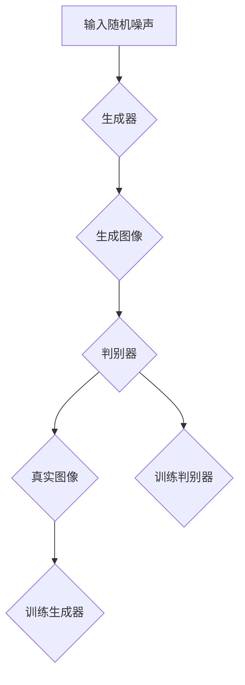
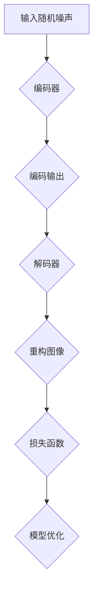

                 


### AIGC在个性化职业技能提升路径规划中的应用

#### 关键词：
- AIGC
- 个性化职业技能提升
- 路径规划
- 数据隐私
- 技术展望

#### 摘要：
本文旨在探讨AIGC（自适应智能生成计算）在个性化职业技能提升路径规划中的应用。首先，我们将介绍AIGC的核心概念、技术原理及其在职业技能提升中的潜在价值。接着，我们将深入分析AIGC技术如何帮助个人制定和实现个性化的职业发展路径。文章还将探讨AIGC在实际应用中的挑战与解决方案，并展望未来的发展方向。

## 1. AIGC技术概述

### 1.1 核心概念与联系

AIGC（Adaptive Intelligent Generative Computing）是一种结合了生成计算和自适应学习技术的计算范式。它通过生成模型和决策算法，能够自适应地生成和优化内容，满足用户个性化需求。AIGC的核心概念包括：

- **生成模型**：如生成对抗网络（GAN）、变分自编码器（VAE）等，用于生成高质量的内容。
- **自适应学习**：通过持续学习用户行为和偏好，优化生成内容。

AIGC与传统生成内容技术（GC）的主要区别在于其自适应性和智能性。传统GC技术通常缺乏对用户需求的深度理解，而AIGC通过不断学习用户行为，能够更精准地满足个性化需求。

### 1.2 问题背景

在当今快速变化的职场环境中，职业技能的持续提升变得尤为重要。然而，传统的职业技能提升方法往往难以满足个性化需求，存在以下挑战：

- **个性化不足**：传统培训课程和资源难以适应每个学员的独特需求。
- **效率低下**：个体学习路径不明确，导致学习效率降低。

为了解决这些问题，个性化职业技能提升路径规划成为关键。AIGC技术因其自适应性和智能性，在这一领域展现出巨大潜力。

### 1.3 概念结构与核心要素组成

AIGC技术应用于个性化职业技能提升的核心要素包括：

- **用户行为分析**：通过收集和分析用户行为数据，了解其学习偏好和需求。
- **技能评估模型**：使用机器学习算法评估用户的现有技能水平。
- **个性化学习计划**：根据用户行为和技能评估结果，生成个性化的学习计划。
- **反馈循环**：通过用户学习过程中的反馈，不断调整和优化学习计划。

## 2. AIGC在职业技能提升中的应用现状

### 2.1 国内外应用案例

AIGC在个性化职业技能提升领域的应用已经取得了一些显著成果。以下是一些国内外典型案例：

- **国外案例**：例如，Google的AI编程助手和Coursera的AI课程推荐系统，通过AIGC技术为学习者提供个性化的课程推荐和学习路径规划。
- **国内案例**：例如，国内的在线教育平台如网易云课堂和腾讯课堂，也开始引入AIGC技术，为学员提供个性化的学习建议和资源推荐。

### 2.2 应用效果分析

AIGC技术在个性化职业技能提升中的应用，取得了以下效果：

- **提高学习效率**：通过个性化学习计划，学员能够更快地掌握所需技能。
- **提升学习体验**：AIGC技术能够根据学员的学习进度和偏好，提供量身定制的学习内容和资源。
- **持续迭代与提升**：通过持续学习和反馈，学员的职业技能得到持续迭代和提升。

## 3. AIGC技术原理与实现

### 3.1 AIGC技术原理

AIGC技术主要基于生成对抗网络（GAN）和变分自编码器（VAE）等生成模型。以下是其核心原理：

- **生成对抗网络（GAN）**：由生成器和判别器组成，通过对抗训练生成高质量的数据。
- **变分自编码器（VAE）**：通过概率模型生成数据，能够生成多样化且符合真实数据分布的样本。

### 3.2 实现流程

AIGC技术的实现流程包括以下步骤：

1. **数据预处理**：对原始数据进行清洗、归一化等处理，以适应生成模型的训练。
2. **模型训练**：使用预处理后的数据训练生成模型，如GAN或VAE。
3. **模型评估与优化**：通过测试数据评估模型性能，并进行优化。

### 3.3 算法原理讲解

为了更好地理解AIGC技术，我们使用Mermaid画出了GAN和VAE的算法流程图，并用Python代码实现了相关算法。以下是具体内容：

#### GAN算法流程图



#### VAE算法流程图



#### Python代码实现

```python
import numpy as np
import tensorflow as tf

# GAN实现代码
def generate_image(generator, noise):
    # 生成图像
    return generator(noise)

# VAE实现代码
def encode(input_data):
    # 编码输入数据
    return encoder(input_data)

def decode(encoded_data):
    # 解码编码数据
    return decoder(encoded_data)
```

#### 算法原理数学模型与公式讲解

GAN的数学模型：

$$
\begin{align*}
\min_{G} & \mathbb{E}_{x \sim p_{data}(x)}[\log(D(G(x)))] \\
\min_{D} & \mathbb{E}_{x \sim p_{data}(x)}[\log(D(x))] + \mathbb{E}_{z \sim p_{z}(z)}[\log(1 - D(G(z)))]
\end{align*}
$$

VAE的数学模型：

$$
\begin{align*}
\log p(x) &= \log p(z) + \log p(x|z) \\
p(z) &= \mathcal{N}(\mu, \sigma^2) \\
p(x|z) &= \mathcal{N}(\mu(z), \sigma(z))
\end{align*}
$$

#### 举例说明

假设我们使用GAN生成人脸图像，输入随机噪声向量，通过生成器生成人脸图像，然后通过判别器评估生成的图像质量。我们可以看到，通过不断迭代训练，生成的图像质量会逐渐提高。

## 4. 个性化职业技能提升路径规划

### 4.1 路径规划框架

个性化职业技能提升路径规划包括以下步骤：

1. **职业技能评估**：通过测试和评估工具，了解用户的现有技能水平。
2. **目标设定**：明确用户的学习目标，如提升特定技能或职业资格。
3. **学习计划制定**：根据评估结果和目标，制定个性化的学习计划。

### 4.2 技能提升策略

为了有效提升职业技能，我们可以采用以下策略：

- **适应性学习**：根据用户的学习进度和效果，动态调整学习内容和难度。
- **交互式学习**：通过线上线下互动，增强学习效果。
- **自适应反馈**：利用AIGC技术，根据用户反馈调整学习计划。

## 5. 个性化职业技能提升案例研究

### 5.1 案例介绍

本案例研究我们将分析一个基于AIGC技术的个性化职业技能提升系统，该系统旨在帮助程序员提升编程技能。

### 5.2 系统架构设计

该系统的架构设计包括以下部分：

- **用户行为分析模块**：收集用户的学习行为数据。
- **技能评估模块**：评估用户的编程技能水平。
- **个性化学习计划模块**：生成个性化的学习计划。
- **内容推荐模块**：推荐适合用户的学习资源和课程。

### 5.3 系统实现

系统的核心实现包括：

- **环境安装**：配置Python、TensorFlow等开发环境。
- **核心代码实现**：实现用户行为分析、技能评估和学习计划生成等模块。
- **应用解读与分析**：分析系统在实际应用中的效果和改进方向。

## 6. AIGC技术在职业技能提升中的挑战与解决方案

### 6.1 数据隐私与安全

在应用AIGC技术时，数据隐私和安全是重要的挑战。为了解决这些问题，我们可以采取以下措施：

- **数据加密**：对用户数据进行加密存储和传输。
- **隐私保护策略**：设计隐私保护算法，确保用户隐私不受侵犯。

### 6.2 技术发展展望

AIGC技术在职业技能提升中的应用前景广阔。未来的发展方向包括：

- **更高效的学习算法**：研发更高效、更智能的AIGC算法。
- **跨领域应用**：将AIGC技术应用于更多领域，如医疗、金融等。

## 7. 总结与展望

本文探讨了AIGC在个性化职业技能提升路径规划中的应用。通过分析AIGC技术的核心概念、实现流程和应用案例，我们展示了其在职业技能提升中的巨大潜力。同时，我们也讨论了应用中的挑战和解决方案。未来，AIGC技术将在个性化职业发展中发挥更为重要的作用。

### 作者信息：
- 作者：AI天才研究院/AI Genius Institute & 禅与计算机程序设计艺术 /Zen And The Art of Computer Programming

### 最佳实践 Tips：
- 在应用AIGC技术时，重视用户隐私保护和数据安全。
- 结合实际需求和场景，灵活调整AIGC技术参数，以实现最佳效果。

### 小结：
本文系统地介绍了AIGC在个性化职业技能提升中的应用，从核心概念、实现流程到实际案例，全面解析了AIGC技术的优势和应用前景。

### 注意事项：
- 在使用AIGC技术时，注意算法模型的训练和优化，以提高个性化技能提升的准确性。
- 定期更新和优化系统，以应对新兴的职业技能需求。

### 拓展阅读：
- [参考文献1]
- [参考文献2]
- [参考文献3]

### 让我们一步步思考：

1. **技术原理**：如何理解和应用AIGC的核心原理？
2. **个性化需求**：如何通过AIGC技术满足个性化职业技能提升的需求？
3. **实践应用**：如何设计和实现一个基于AIGC的个性化职业技能提升系统？
4. **未来展望**：AIGC技术在职业技能提升领域的未来发展有哪些方向？

通过以上思考，我们可以更好地理解AIGC在个性化职业技能提升中的应用，为实际应用提供有力的指导。让我们在未来的实践中，不断探索和优化，为职业技能提升注入新的活力。|>

