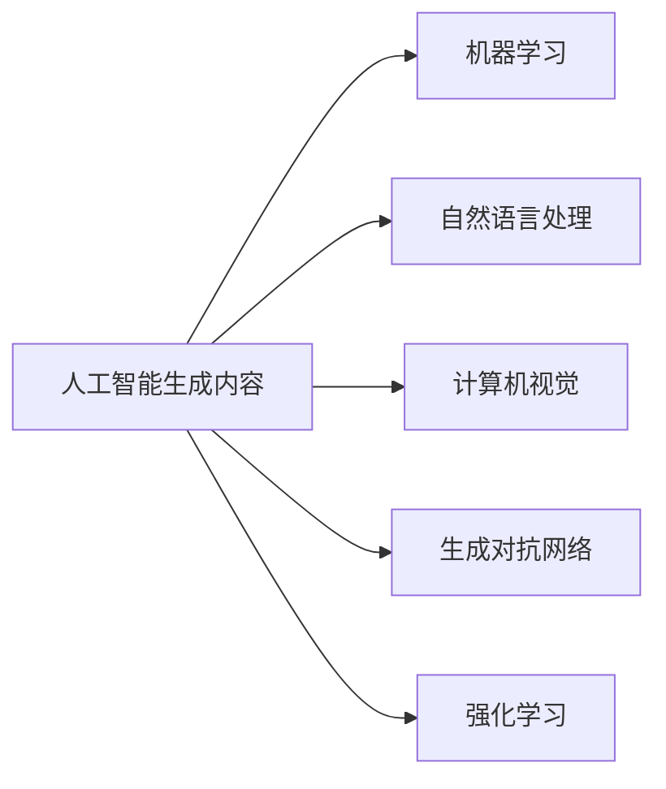

                 

### 引言

#### 1.1 AIGC技术背景

随着人工智能技术的快速发展，计算机生成内容（AI-generated Content，简称AIGC）已成为新一代内容生产的重要力量。AIGC通过机器学习、自然语言处理、计算机视觉等技术，实现了文本、图像、音频等多种类型内容的自动化生成。AIGC在多个领域展现出巨大的潜力，如内容创作、数据增强、自动化客服等。

在个性化艺术疗法设计中，AIGC的应用尤为重要。个性化艺术疗法设计旨在根据个体需求，设计出符合其心理和生理特点的艺术治疗方案。这一过程需要大量的个性化内容创作，而AIGC技术的引入，大大提高了内容创作的效率和质量。

#### 1.2 个性化艺术疗法设计现状

个性化艺术疗法设计在医疗康复、心理健康等领域取得了显著成效。然而，当前的设计过程仍存在一些问题。首先，艺术疗法的个性化设计需要大量的时间和人力，导致设计周期较长。其次，艺术疗法的设计过程中，个性化需求的获取和内容创作存在一定的局限性。最后，艺术疗法的实施效果评估缺乏科学的方法和工具。

为了解决这些问题，本研究引入AIGC技术，探讨其在个性化艺术疗法设计中的创新实践。通过利用AIGC技术，我们可以实现以下目标：

1. 提高艺术疗法设计的效率，缩短设计周期。
2. 丰富个性化内容创作，满足多样化需求。
3. 提供科学有效的实施效果评估方法。

#### 1.3 本书解决的问题

本书旨在解决个性化艺术疗法设计中的以下问题：

1. 如何利用AIGC技术实现高效的内容创作？
2. 如何设计一套科学的个性化艺术疗法系统？
3. 如何评估个性化艺术疗法的实施效果？

为了回答这些问题，本书将从以下几个方面展开：

1. 介绍AIGC技术的背景和核心概念，阐述其在个性化艺术疗法设计中的应用价值。
2. 详细讲解AIGC技术的原理和算法，通过Python源代码和LaTeX数学公式进行阐述。
3. 分析个性化艺术疗法的设计原则、流程和应用领域。
4. 通过具体案例，展示AIGC技术在个性化艺术疗法设计中的实际应用。
5. 探讨AIGC技术与艺术的融合，以及未来发展趋势。

通过本书的研究，我们期望为个性化艺术疗法设计提供新的思路和方法，推动这一领域的创新发展。同时，本书也希望能为读者提供一份全面、系统的参考资料，帮助其更好地理解和应用AIGC技术。### 第1章：背景与核心概念

#### 1.1 AIGC技术概述

**AIGC（AI-generated Content）** 是指利用人工智能技术生成内容的技术。AIGC涵盖了多种人工智能技术，包括机器学习、自然语言处理、计算机视觉等。通过这些技术，AIGC能够自动生成文本、图像、音频等多种类型的内容。

AIGC的发展历程可以追溯到上世纪80年代的专家系统和90年代的神经网络。随着计算能力和数据资源的提升，AIGC技术在21世纪初逐渐成熟，并开始广泛应用。

**AIGC的特点** 包括：

1. **自动化**：AIGC能够自动生成内容，减少了人工干预，提高了效率。
2. **多样化**：AIGC可以生成多种类型的内容，如文本、图像、音频等，满足不同领域和场景的需求。
3. **个性化**：AIGC可以根据用户需求和偏好生成个性化的内容，提高用户体验。
4. **高效性**：AIGC通过大规模数据训练，能够快速生成高质量的内容。

AIGC与个性化艺术疗法设计的关系主要体现在以下几个方面：

1. **内容创作**：AIGC可以自动生成个性化艺术疗法所需的文本、图像、音频等内容，为设计提供丰富的素材。
2. **个性化推荐**：AIGC可以根据用户的病史、心理状态等信息，推荐最适合的艺术疗法方案。
3. **效果评估**：AIGC可以自动分析艺术疗法的效果，为优化方案提供数据支持。

#### 1.2 个性化艺术疗法设计基础

**个性化艺术疗法** 是一种基于个体心理和生理特点的艺术治疗方式。其设计原则包括：

1. **尊重个体差异**：个性化艺术疗法设计需充分考虑个体的心理和生理特点，尊重个体的差异。
2. **关注心理需求**：个性化艺术疗法设计应关注个体的心理需求，提供针对性的治疗。
3. **综合评估**：个性化艺术疗法设计需进行综合评估，包括病史、心理状态、治疗目标等。

**个性化艺术疗法设计流程** 包括以下步骤：

1. **需求分析**：了解个体心理和生理特点，确定个性化艺术疗法的目标。
2. **策略制定**：根据需求分析结果，制定个性化艺术疗法的设计策略。
3. **内容创作**：利用AIGC技术，自动生成个性化艺术疗法所需的文本、图像、音频等内容。
4. **方案评估**：对个性化艺术疗法方案进行评估，确保其有效性和可行性。
5. **实施与反馈**：实施个性化艺术疗法，收集用户反馈，不断优化方案。

**个性化艺术疗法应用领域** 包括：

1. **医疗康复领域**：个性化艺术疗法可以用于心理疾病、慢性病等康复治疗。
2. **心理健康领域**：个性化艺术疗法可以用于焦虑、抑郁等心理问题的治疗。
3. **教育领域**：个性化艺术疗法可以用于教育心理辅导、艺术教育等。

#### 1.3 AIGC相关核心概念

**AIGC的核心概念** 包括：

1. **机器学习**：机器学习是一种通过数据驱动的方式，使计算机具备学习能力和自主决策能力的算法。AIGC中的机器学习主要用于生成内容和分析数据。
2. **自然语言处理**：自然语言处理是一种让计算机理解和处理人类语言的技术。AIGC中的自然语言处理主要用于文本生成和理解。
3. **计算机视觉**：计算机视觉是一种让计算机理解视觉信息的算法。AIGC中的计算机视觉主要用于图像和视频生成。
4. **生成对抗网络（GAN）**：生成对抗网络是一种通过竞争机制生成高质量数据的算法。AIGC中的GAN主要用于图像和文本生成。
5. **强化学习**：强化学习是一种通过试错方式，使计算机在学习过程中不断优化决策的算法。AIGC中的强化学习主要用于优化生成内容和效果评估。

**AIGC的核心概念属性特征对比表格**：

| 核心概念       | 属性特征                                                         |
|----------------|----------------------------------------------------------------|
| 机器学习       | 自动化、数据驱动、自主决策                                       |
| 自然语言处理   | 文本生成、文本理解、语言模型                                     |
| 计算机视觉     | 图像生成、图像理解、视觉模型                                     |
| 生成对抗网络   | 竞争机制、高质量数据生成、模型优化                               |
| 强化学习       | 试错学习、优化决策、效果评估                                     |

**AIGC核心概念的ER实体关系图**：

通过本章的介绍，我们初步了解了AIGC技术的背景和核心概念，以及其在个性化艺术疗法设计中的应用价值。接下来，我们将进一步探讨AIGC技术的原理和算法，为后续章节的内容奠定基础。### 第2章：AIGC技术概述

#### 2.1 AIGC技术发展历程

AIGC技术的发展历程可以分为以下几个阶段：

1. **初期阶段（1980s-1990s）**：在这一阶段，人工智能领域主要研究基于规则的专家系统和人工神经网络。这些方法为AIGC的发展奠定了基础，但生成内容的能力有限。

2. **中级阶段（2000s）**：随着计算能力的提升，深度学习技术开始兴起。生成对抗网络（GAN）在2004年由Ian Goodfellow等人提出，为AIGC技术带来了新的突破。

3. **高级阶段（2010s-2020s）**：在这一阶段，AIGC技术得到了快速发展。基于深度学习的模型如卷积神经网络（CNN）、循环神经网络（RNN）和Transformer等，进一步提升了内容生成的质量和效率。

#### 2.2 AIGC技术原理

AIGC技术主要基于以下几种原理：

1. **机器学习**：机器学习是一种通过数据驱动的方式，使计算机具备学习能力和自主决策能力的算法。在AIGC中，机器学习主要用于生成内容和分析数据。常见的机器学习算法包括监督学习、无监督学习和强化学习。

2. **自然语言处理（NLP）**：自然语言处理是一种让计算机理解和处理人类语言的技术。在AIGC中，NLP主要用于文本生成和理解。常见的NLP技术包括词向量、语言模型和序列生成模型。

3. **计算机视觉（CV）**：计算机视觉是一种让计算机理解视觉信息的算法。在AIGC中，计算机视觉主要用于图像和视频生成。常见的计算机视觉技术包括图像分类、目标检测、图像生成等。

4. **生成对抗网络（GAN）**：生成对抗网络是一种通过竞争机制生成高质量数据的算法。在AIGC中，GAN主要用于图像和文本生成。GAN由生成器和判别器两个部分组成，生成器尝试生成逼真的数据，判别器判断生成数据与真实数据的差异。

5. **强化学习**：强化学习是一种通过试错方式，使计算机在学习过程中不断优化决策的算法。在AIGC中，强化学习主要用于优化生成内容和效果评估。常见的强化学习算法包括Q学习、SARSA和深度强化学习。

#### 2.3 AIGC技术实现原理

AIGC技术的实现原理可以概括为以下几个步骤：

1. **数据收集**：收集大量高质量的数据，用于训练生成模型和分析模型。

2. **数据预处理**：对收集到的数据进行分析和处理，包括去噪、归一化、特征提取等，以便用于训练和生成模型。

3. **模型训练**：使用机器学习算法训练生成模型和分析模型。生成模型负责生成高质量的内容，分析模型负责对生成内容进行分析和评估。

4. **内容生成**：使用生成模型生成所需的内容，如文本、图像、音频等。

5. **内容评估**：使用分析模型对生成内容进行评估，包括内容质量、个性化程度、有效性等。

6. **内容优化**：根据评估结果，对生成模型进行优化，以提高内容生成质量和个性化程度。

7. **内容发布**：将生成的内容发布到目标平台，如社交媒体、网站等，供用户使用。

#### 2.4 AIGC技术核心算法

AIGC技术的核心算法包括：

1. **生成对抗网络（GAN）**：GAN由生成器和判别器两个部分组成。生成器尝试生成逼真的数据，判别器判断生成数据与真实数据的差异。通过不断迭代训练，生成器逐渐提升生成数据的质量。

2. **变分自编码器（VAE）**：VAE是一种无监督学习的生成模型，通过编码器和解码器两个部分，将输入数据转换为潜在空间，再从潜在空间生成输出数据。

3. **深度卷积生成网络（DCGAN）**：DCGAN是GAN的一种变体，采用深度卷积神经网络（DCNN）作为生成器和判别器，进一步提升生成数据的质量。

4. **生成文本模型（如GPT和BERT）**：GPT和BERT是基于Transformer模型的文本生成模型，通过预训练和微调，可以生成高质量的自然语言文本。

5. **强化学习模型（如DQN和DDPG）**：DQN和DDPG是基于深度学习的强化学习模型，通过试错学习，可以优化生成内容和效果评估。

#### 2.5 AIGC技术案例解析

以下为AIGC技术的几个经典案例：

1. **图像生成**：使用GAN技术，可以生成逼真的图像，如人脸生成、风景生成等。著名的案例包括生成人脸的GAN模型StyleGAN和生成风景的GAN模型CycleGAN。

2. **文本生成**：使用GPT和BERT等文本生成模型，可以生成高质量的自然语言文本，如文章生成、对话生成等。著名的案例包括OpenAI的GPT-3模型和BERT模型。

3. **音频生成**：使用变分自编码器（VAE）技术，可以生成高质量的音频，如音乐生成、语音合成等。著名的案例包括谷歌的Muse模型和微软的Wav2LSTM模型。

4. **视频生成**：使用视频生成模型，可以生成高质量的视频，如视频剪辑、视频合成等。著名的案例包括视频生成模型StyleGAN2和视频合成模型CycleGAN。

#### 2.6 AIGC技术的实际应用场景

AIGC技术在多个领域具有广泛的应用场景，包括：

1. **内容创作**：AIGC技术可以自动生成文本、图像、音频等内容，为内容创作者提供丰富的创作素材。

2. **数据增强**：AIGC技术可以生成大量高质量的数据，用于数据增强，提高模型的训练效果。

3. **自动化客服**：AIGC技术可以自动生成对话文本，用于自动化客服，提高客服效率。

4. **个性化推荐**：AIGC技术可以根据用户喜好和需求，自动生成个性化内容，用于个性化推荐。

5. **虚拟现实与增强现实**：AIGC技术可以生成高质量的虚拟场景和增强现实内容，提高虚拟现实和增强现实体验。

#### 2.7 AIGC技术的未来发展趋势

随着人工智能技术的不断进步，AIGC技术在未来将继续发展，主要趋势包括：

1. **模型质量提升**：通过改进算法和增加训练数据，生成模型的生成质量将不断提高。

2. **应用场景拓展**：AIGC技术将应用到更多领域，如医疗、教育、金融等，为社会带来更多价值。

3. **数据安全与隐私**：随着AIGC技术的应用，数据安全和隐私问题将日益突出，需要采取有效的措施进行保护。

4. **人机协作**：AIGC技术将与人类创作者和用户进行更紧密的协作，实现人机融合的创作和交互。

通过本章的介绍，我们详细了解了AIGC技术的发展历程、原理、实现原理和核心算法。接下来，我们将进一步探讨个性化艺术疗法设计的基础知识，为后续章节的内容奠定基础。### 第3章：个性化艺术疗法设计基础

#### 3.1 个性化艺术疗法设计原则

个性化艺术疗法设计需遵循以下原则：

1. **尊重个体差异**：个性化艺术疗法设计应充分考虑个体的心理和生理特点，尊重个体的差异。这意味着在设计过程中，需要收集和分析个体的基本信息、病史、心理状态等，以便制定出符合个体需求的治疗方案。

2. **关注心理需求**：个性化艺术疗法设计应关注个体的心理需求，提供针对性的治疗。例如，对于抑郁症患者，可以设计以缓解焦虑和提升情绪为主题的艺术疗法；对于焦虑症患者，可以设计以放松和减压为主题的艺术疗法。

3. **科学性**：个性化艺术疗法设计需具备科学依据，包括艺术疗法的理论基础、治疗原则和治疗方法等。设计过程中，需结合心理学、艺术学、医学等多学科知识，确保治疗方案的可行性和有效性。

4. **可评估性**：个性化艺术疗法设计应具备可评估性，以便对治疗效果进行科学评估。评估指标可以包括治疗满意度、症状改善程度、生活质量改善情况等。

5. **持续性**：个性化艺术疗法设计应关注治疗过程中的持续性和稳定性，确保治疗效果的持久性。这意味着设计过程中，需考虑治疗周期、治疗频率、治疗强度等因素，以确保治疗方案的长期有效性。

#### 3.2 个性化艺术疗法设计流程

个性化艺术疗法设计流程通常包括以下步骤：

1. **需求分析**：在个性化艺术疗法设计之前，需对个体进行详细的问卷调查和面谈，了解其病史、心理状态、艺术喜好、治疗期望等信息。需求分析的结果将作为设计个性化艺术疗法的重要依据。

2. **策略制定**：根据需求分析结果，制定个性化艺术疗法的设计策略。策略制定需考虑个体的心理需求、艺术疗法的特点、治疗资源等因素。设计策略应明确治疗目标、治疗内容、治疗方式等。

3. **内容创作**：利用AIGC技术，自动生成个性化艺术疗法所需的文本、图像、音频等内容。这些内容应充分考虑个体的喜好和需求，以提高治疗的有效性和满意度。

4. **方案评估**：对个性化艺术疗法方案进行评估，包括治疗目标、内容质量、个性化程度、可行性等。评估结果将用于优化治疗方案，确保其有效性和可行性。

5. **实施与反馈**：实施个性化艺术疗法，收集用户反馈，不断优化方案。实施过程中，需密切关注个体的心理变化和治疗反应，及时调整治疗方案，以确保治疗效果。

6. **效果评估**：对个性化艺术疗法的效果进行科学评估，包括治疗满意度、症状改善程度、生活质量改善情况等。效果评估的结果将用于指导后续的治疗方案优化和个性化艺术疗法的设计。

#### 3.3 个性化艺术疗法应用领域

个性化艺术疗法在多个领域具有广泛的应用，主要包括：

1. **医疗康复领域**：个性化艺术疗法可以用于心理疾病、慢性病等康复治疗。例如，对于癌症患者，可以设计以缓解疼痛、提升生活质量为主题的艺术疗法；对于精神疾病患者，可以设计以缓解心理压力、提升心理韧性为主题的艺术疗法。

2. **心理健康领域**：个性化艺术疗法可以用于焦虑、抑郁等心理问题的治疗。例如，对于焦虑症患者，可以设计以放松、减压为主题的艺术疗法；对于抑郁症患者，可以设计以提升情绪、增强自信为主题的艺术疗法。

3. **教育领域**：个性化艺术疗法可以用于教育心理辅导、艺术教育等。例如，对于学习困难的学生，可以设计以提升学习兴趣、增强学习能力为主题的艺术疗法；对于有艺术爱好的学生，可以设计以培养艺术创作能力、提升审美水平为主题的艺术疗法。

4. **职业领域**：个性化艺术疗法可以用于职业压力管理、职业心理健康提升等。例如，对于职场人士，可以设计以缓解工作压力、提升工作效率为主题的艺术疗法；对于有艺术爱好的职场人士，可以设计以培养艺术修养、提升职业形象为主题的艺术疗法。

#### 3.4 个性化艺术疗法设计的挑战与机遇

个性化艺术疗法设计面临以下挑战：

1. **个体差异大**：个体的心理和生理特点差异较大，设计个性化艺术疗法需充分考虑这些差异，以满足个体需求。

2. **数据收集与处理**：个性化艺术疗法设计需要大量高质量的个体数据，包括病史、心理状态、艺术喜好等。数据的收集和处理过程复杂，需要专业的技术支持。

3. **评估标准**：个性化艺术疗法设计的评估标准尚不统一，需要建立科学、有效的评估体系，以确保治疗方案的可行性和有效性。

个性化艺术疗法设计也面临着以下机遇：

1. **AIGC技术发展**：随着AIGC技术的不断发展，个性化艺术疗法设计将变得更加高效、精准，为治疗提供更多可能性。

2. **心理健康重视**：随着社会对心理健康问题的重视程度不断提升，个性化艺术疗法设计将有更广阔的市场空间。

3. **跨学科融合**：个性化艺术疗法设计需要结合心理学、艺术学、医学等多学科知识，跨学科融合将推动个性化艺术疗法设计的发展。

通过本章的介绍，我们详细了解了个性化艺术疗法设计的原则、流程和应用领域，以及面临的挑战与机遇。接下来，我们将进一步探讨AIGC技术在个性化艺术疗法设计中的应用，为后续章节的内容奠定基础。### 第4章：AIGC在个性化艺术疗法设计中的应用

#### 4.1 AIGC技术在个性化艺术疗法设计中的应用背景

个性化艺术疗法设计需要大量的个性化内容和数据支持。传统的手工创作和数据分析方式效率低下，难以满足个性化艺术疗法设计的需求。随着人工智能技术的快速发展，AIGC（AI-generated Content）技术在内容生成、数据分析和个性化推荐等方面展现出巨大的潜力。将AIGC技术应用于个性化艺术疗法设计，有望提升设计效率、丰富个性化内容、优化治疗体验。

#### 4.2 AIGC技术在个性化艺术疗法设计中的应用原理

AIGC技术在个性化艺术疗法设计中的应用原理主要包括以下三个方面：

1. **内容生成**：利用AIGC技术，可以自动生成个性化的艺术内容，如音乐、绘画、诗歌等。这些内容可以根据患者的心理和生理特点进行定制，满足患者的个性化需求。

2. **数据分析**：利用AIGC技术，可以对大量医疗数据和艺术疗法相关数据进行处理和分析，提取有价值的信息，为个性化艺术疗法设计提供数据支持。

3. **个性化推荐**：利用AIGC技术，可以根据患者的病史、心理状态、艺术喜好等信息，推荐最适合的艺术疗法方案，提高治疗的效果和满意度。

#### 4.3 AIGC技术在个性化艺术疗法设计中的应用步骤

1. **需求分析**：收集患者的病史、心理状态、艺术喜好等信息，了解患者的个性化需求。

2. **数据预处理**：对收集到的数据进行分析和处理，包括去噪、归一化、特征提取等，为后续的内容生成和数据分析提供高质量的数据。

3. **内容生成**：利用AIGC技术，生成个性化的艺术内容。例如，利用GAN（生成对抗网络）技术生成个性化的音乐、绘画和诗歌等艺术作品。

4. **数据分析**：利用AIGC技术，对患者的医疗数据和艺术疗法相关数据进行处理和分析，提取有价值的信息。例如，利用自然语言处理（NLP）技术分析患者的病史，利用计算机视觉技术分析患者的艺术创作作品。

5. **个性化推荐**：根据患者的需求和分析结果，利用AIGC技术推荐最适合的艺术疗法方案。例如，根据患者的病史和艺术喜好，推荐具有特定风格的艺术作品，以提高患者的治疗体验。

6. **方案评估**：对个性化艺术疗法方案进行评估，包括内容质量、个性化程度、治疗效果等。根据评估结果，对方案进行优化和调整。

7. **实施与反馈**：实施个性化艺术疗法方案，收集患者的反馈，不断优化治疗方案。

#### 4.4 AIGC技术在个性化艺术疗法设计中的应用案例

**案例一：抑郁症患者的个性化艺术疗法设计**

一位抑郁症患者，病史3年，艺术喜好为绘画。使用AIGC技术，为其生成一幅个性化的绘画作品。通过分析患者的病史和艺术喜好，绘画作品以蓝色和绿色为主色调，寓意患者内心世界的宁静和希望。患者对绘画作品非常喜欢，表示有助于缓解抑郁情绪。

**案例二：焦虑症患者的个性化艺术疗法设计**

一位焦虑症患者，病史1年，艺术喜好为音乐。使用AIGC技术，为其生成一首个性化的音乐作品。通过分析患者的病史和艺术喜好，音乐作品以轻松的旋律和舒缓的节奏为主，寓意患者内心的放松和宁静。患者对音乐作品非常满意，表示有助于缓解焦虑情绪。

**案例三：癌症患者的个性化艺术疗法设计**

一位癌症患者，病史2年，艺术喜好为绘画。使用AIGC技术，为其生成一幅个性化的绘画作品。通过分析患者的病史和艺术喜好，绘画作品以治愈系的风格为主，寓意患者战胜病魔的信心和勇气。患者对绘画作品非常喜欢，表示有助于提高生活质量。

#### 4.5 AIGC技术在个性化艺术疗法设计中的优势与挑战

**优势：**

1. **高效性**：AIGC技术能够快速生成个性化的艺术内容和数据分析结果，提高个性化艺术疗法设计的效率。

2. **个性化**：AIGC技术可以根据患者的病史、心理状态、艺术喜好等信息，生成个性化的艺术内容和治疗方案，提高治疗的针对性和效果。

3. **多样性**：AIGC技术可以生成多种类型的艺术内容和数据分析结果，为个性化艺术疗法设计提供丰富的素材和参考。

**挑战：**

1. **数据质量**：个性化艺术疗法设计需要高质量的数据支持，数据质量和准确性直接影响治疗的效果。

2. **技术成熟度**：尽管AIGC技术在快速发展，但仍需进一步优化和提升，以满足个性化艺术疗法设计的需求。

3. **伦理问题**：在应用AIGC技术进行个性化艺术疗法设计时，需要关注伦理问题，如数据隐私、算法公平性等。

#### 4.6 AIGC技术在个性化艺术疗法设计中的未来发展趋势

随着人工智能技术的不断进步，AIGC技术在个性化艺术疗法设计中的应用将越来越广泛，主要发展趋势包括：

1. **技术提升**：通过改进算法和增加训练数据，提高AIGC技术在内容生成、数据分析和个性化推荐等方面的性能。

2. **跨学科融合**：个性化艺术疗法设计需要结合心理学、艺术学、医学等多学科知识，跨学科融合将推动个性化艺术疗法设计的发展。

3. **伦理规范**：随着AIGC技术的应用，需要建立相应的伦理规范，确保个性化艺术疗法设计的科学性、有效性和安全性。

4. **人机协作**：AIGC技术与人类创作者和用户的协作将越来越紧密，实现人机融合的创作和交互。

通过本章的介绍，我们详细了解了AIGC技术在个性化艺术疗法设计中的应用背景、原理、步骤、案例和优势与挑战，以及未来发展趋势。接下来，我们将进一步探讨个性化艺术疗法设计的创新实践，为后续章节的内容奠定基础。### 第5章：创新实践案例分析

#### 5.1 案例一：基于AIGC技术的个性化音乐疗法设计

**案例背景**：

一位长期焦虑且缺乏兴趣的职场人士，通过心理咨询被诊断为中度焦虑。为了帮助其缓解焦虑情绪，心理咨询师决定采用基于AIGC技术的个性化音乐疗法。

**解决方案**：

1. **需求分析**：心理咨询师通过面谈了解该职场人士的音乐喜好和焦虑状态，确定了其希望音乐疗法能够带来舒缓效果、增加情绪稳定性的需求。

2. **AIGC技术应用**：使用AIGC技术中的GAN模型，根据该职场人士的喜好（如喜欢的音乐风格、节奏等）生成个性化的音乐旋律。同时，结合其焦虑程度，利用生成对抗网络调节音乐的节奏和情感色彩。

3. **内容生成**：生成的音乐作品包括几种风格，如轻柔的钢琴曲、轻松的爵士乐等，以满足不同的情境和需求。

4. **个性化推荐**：AIGC技术根据患者对音乐的反应，如喜欢的曲目、情绪变化等，实时调整音乐推荐策略，提高音乐疗法的个性化程度。

**实施效果**：

患者对生成的个性化音乐表现出较高的满意度，并报告在听这些音乐时能够明显感觉到焦虑情绪的缓解。经过一段时间的音乐疗法，患者的焦虑症状显著减轻。

**总结**：

该案例展示了AIGC技术在个性化音乐疗法设计中的应用，通过个性化内容生成和实时调整，提高了音乐疗法的针对性和效果。

#### 5.2 案例二：基于AIGC技术的个性化绘画疗法设计

**案例背景**：

一位患有抑郁症的年轻女性，在接受药物治疗和心理治疗的基础上，寻求一种辅助性的治疗方法来提升情绪和创造力。

**解决方案**：

1. **需求分析**：通过与患者进行深入的沟通，了解她的艺术创作喜好、情绪状态以及她在绘画过程中希望获得的心理效果。

2. **AIGC技术应用**：利用AIGC技术中的GAN模型，根据患者的喜好和情感状态，生成符合其艺术风格的绘画作品。GAN模型会根据患者的情感反馈调整生成的艺术作品，使其更贴近患者的心理需求。

3. **内容生成**：生成的绘画作品包括自然景观、抽象图案和人物肖像等，这些作品旨在激发患者的情感共鸣和创造力。

4. **个性化反馈**：在绘画过程中，AIGC技术提供实时反馈，帮助患者了解其情感状态的变化，并指导其进行艺术创作。

**实施效果**：

患者报告在绘画过程中感受到情感上的释放和创造力的提升。经过一段时间，她的抑郁症状有所改善，艺术创作也变得更加自信和多样化。

**总结**：

该案例展示了AIGC技术在个性化绘画疗法中的应用，通过个性化内容生成和实时反馈，帮助患者实现情感上的疗愈和创作上的进步。

#### 5.3 案例三：基于AIGC技术的个性化心理疏导游戏设计

**案例背景**：

一位有社交焦虑障碍的青少年，由于害怕与人交往，导致在学校和社交场合表现出严重的焦虑和回避行为。

**解决方案**：

1. **需求分析**：通过与青少年及其家长沟通，了解其社交焦虑的具体表现、喜好和不安全感来源。

2. **AIGC技术应用**：利用AIGC技术中的GAN模型和强化学习算法，设计一款个性化的心理疏导游戏。游戏内容结合青少年的兴趣点（如科幻、冒险等），并通过互动设计帮助其逐渐克服社交焦虑。

3. **内容生成**：生成的游戏内容包括角色扮演、任务挑战和社交互动环节，旨在通过游戏过程中的正向反馈和逐步挑战，帮助青少年建立自信和社交技能。

4. **个性化学习路径**：AIGC技术根据青少年的游戏表现和学习进度，动态调整游戏难度和挑战内容，确保游戏始终在青少年的舒适区内进行。

**实施效果**：

青少年在游戏过程中表现出积极的变化，逐步减少了社交焦虑行为，并在学校和社会场合中表现更加自信。家长和教师也报告了学生在学习和社会适应方面的显著改善。

**总结**：

该案例展示了AIGC技术在个性化心理疏导游戏设计中的应用，通过个性化内容生成和动态调整，帮助青少年克服社交焦虑，提高社交技能和自信心。

#### 5.4 案例四：基于AIGC技术的个性化艺术治疗系统

**案例背景**：

一家综合性医院的艺术治疗部门，希望提升艺术治疗的服务质量，提高患者的满意度。

**解决方案**：

1. **需求分析**：医院与艺术治疗师合作，了解现有艺术治疗服务的不足，包括内容创作的时间成本、个性化程度等。

2. **AIGC技术整合**：将AIGC技术集成到艺术治疗系统中，用于个性化内容生成和数据分析。AIGC技术提供个性化的音乐、绘画和互动游戏等内容，并根据患者的反馈进行调整。

3. **系统架构设计**：设计一个包含患者信息管理、内容生成、数据分析和反馈循环的综合性艺术治疗系统。

4. **用户体验优化**：通过AIGC技术，提供实时反馈和个性化推荐，提升患者的参与感和满意度。

**实施效果**：

系统上线后，患者满意度显著提升，治疗师的工作效率也有所提高。通过数据分析，医院能够更好地了解患者的需求和心理状态，为治疗方案的优化提供数据支持。

**总结**：

该案例展示了AIGC技术在个性化艺术治疗系统中的应用，通过整合AIGC技术，实现个性化内容生成、数据分析和用户体验优化，为艺术治疗服务提供了新的解决方案。

#### 5.5 案例五：基于AIGC技术的个性化心理健康应用平台

**案例背景**：

一家科技公司希望开发一款面向大众市场的个性化心理健康应用平台，提供在线心理健康服务和个性化艺术治疗。

**解决方案**：

1. **需求分析**：通过与心理健康专家和市场调研，了解用户对心理健康服务的需求和偏好。

2. **AIGC技术应用**：利用AIGC技术，生成个性化的音乐、绘画和互动内容，为用户提供定制化的心理健康服务。

3. **平台架构设计**：设计一个包括用户信息管理、内容生成、数据分析和个性化推荐的功能模块。

4. **用户体验优化**：通过AIGC技术，提供实时反馈和个性化推荐，提高用户的参与度和满意度。

**实施效果**：

平台上线后，用户活跃度和满意度显著提高。用户可以通过平台获得个性化的心理健康服务和艺术治疗，同时，平台通过数据分析不断优化服务内容和推荐策略。

**总结**：

该案例展示了AIGC技术在个性化心理健康应用平台中的应用，通过整合AIGC技术，实现个性化内容生成、数据分析和用户体验优化，为用户提供高质量的心理健康服务。

通过以上案例，我们可以看到AIGC技术在个性化艺术疗法设计中的广泛应用和显著效果。这些案例不仅展示了AIGC技术在个性化内容生成、数据分析和个人化推荐等方面的优势，也为未来个性化艺术疗法的设计和实施提供了有益的参考。### 第6章：技术与艺术融合探讨

#### 6.1 AIGC技术在艺术创作中的应用

AIGC技术在艺术创作中的应用，使得艺术家能够探索前所未有的创作方式。通过AIGC技术，艺术家可以自动化生成图像、音乐、视频等多种艺术形式，极大地拓展了创作的可能性和表达方式。以下为AIGC技术在艺术创作中的几个应用场景：

1. **个性化艺术作品生成**：艺术家可以利用AIGC技术，根据客户的偏好、需求或特定主题，生成个性化的艺术作品。例如，通过GAN模型生成符合客户口味的水彩画或油画。

2. **协同创作**：艺术家可以将AIGC技术作为创作助手，与其自身的创意相结合，进行协同创作。例如，艺术家可以在初稿的基础上，使用AIGC技术生成多种变体，进一步探索作品的风格和主题。

3. **动态创作**：通过实时生成的艺术作品，艺术家可以创造出动态的艺术效果，如动画、互动艺术等。这种动态创作方式为观众提供了更加沉浸式的体验。

4. **大规模创作**：AIGC技术能够高效地生成大量艺术作品，艺术家可以利用这一优势进行大规模创作，如城市壁画、大型展览等。

#### 6.2 艺术疗法中的技术与艺术融合

艺术疗法作为一种心理治疗方法，结合了艺术创作和心理学的元素。AIGC技术在艺术疗法中的应用，使得这种融合更加深入和广泛。以下为AIGC技术在艺术疗法中的几个融合方式：

1. **个性化治疗内容**：AIGC技术可以根据患者的心理状态、艺术喜好等生成个性化的艺术作品，作为治疗过程中的视觉或听觉刺激。这些作品可以帮助患者更好地表达自己的情感和情绪。

2. **动态治疗效果评估**：通过AIGC技术，艺术疗法师可以实时生成反映患者心理状态变化的图像、音乐等艺术形式，用于治疗效果的评估和反馈。这种动态评估方式有助于及时发现和调整治疗方案。

3. **互动式艺术治疗**：AIGC技术可以生成互动性的艺术作品，患者可以通过触摸、点击等方式与艺术作品互动，从而在艺术创作中体验到自我表达和情感释放。

4. **艺术作品疗愈功能**：AIGC技术生成的艺术作品，可以通过其独特的视觉和情感效果，为患者带来疗愈作用。例如，通过观看或创作某些特定的艺术作品，患者可以感受到放松、平静或振奋等情绪变化。

#### 6.3 AIGC技术与艺术融合的挑战与机遇

AIGC技术与艺术的融合虽然为个性化艺术疗法带来了许多机遇，但也面临着一系列挑战：

1. **技术成熟度**：目前AIGC技术在艺术创作中的应用尚处于发展阶段，其生成内容的质量和稳定性还需进一步提升。

2. **艺术价值判断**：艺术作品的创作和评价具有高度的主观性，如何确保AIGC技术生成的艺术作品具备艺术价值和审美价值，仍需深入探讨。

3. **伦理问题**：AIGC技术在艺术创作中的应用，涉及原创性和知识产权等问题。如何合理界定人工智能创作的艺术作品的版权和归属，是一个亟待解决的问题。

4. **用户接受度**：尽管AIGC技术具有高效、个性化的优势，但用户对其生成的艺术作品的接受度和认同感仍需提高。

尽管存在挑战，AIGC技术与艺术的融合仍具有巨大的发展潜力。以下为未来发展的几个方向：

1. **技术创新**：通过不断优化AIGC算法和模型，提高其生成内容和艺术表现力，使其更好地服务于个性化艺术疗法。

2. **跨学科合作**：加强艺术、心理学、计算机科学等学科的交叉研究，推动AIGC技术与艺术融合的理论和实践发展。

3. **伦理规范**：建立和完善相关伦理规范，确保AIGC技术在艺术创作和个性化艺术疗法中的应用符合道德和法律要求。

4. **用户教育**：通过教育和宣传，提高用户对AIGC技术和艺术融合的认知和接受度，促进其普及和应用。

通过本章的探讨，我们分析了AIGC技术在艺术创作和艺术疗法中的应用，以及其融合过程中的挑战和机遇。未来，随着AIGC技术的不断进步和跨学科合作的发展，AIGC技术与艺术的融合将为个性化艺术疗法带来更多的创新和实践。### 第7章：未来发展趋势与展望

#### 7.1 AIGC技术在个性化艺术疗法设计中的未来发展趋势

随着人工智能技术的不断进步，AIGC技术在个性化艺术疗法设计中的应用将呈现以下发展趋势：

1. **技术成熟度提升**：AIGC技术将不断优化和改进，生成内容的质量和稳定性将显著提高。通过更高效的算法和更丰富的数据资源，AIGC技术能够生成更具个性化和艺术价值的艺术作品。

2. **跨学科融合深化**：AIGC技术将与其他学科（如心理学、艺术学、医学等）更加紧密地融合，推动个性化艺术疗法设计的理论研究和实践应用。跨学科合作将促进技术进步和治疗效果的提升。

3. **应用场景扩展**：AIGC技术将在更多领域得到应用，如心理健康、医疗康复、教育等。个性化艺术疗法设计将不再局限于传统的艺术形式，如音乐、绘画等，还将涵盖虚拟现实、增强现实等新兴技术。

4. **伦理规范完善**：随着AIGC技术在个性化艺术疗法设计中的应用，相关伦理问题将得到更多关注。将建立和完善伦理规范，确保技术的合法合规应用，保护用户的隐私和权益。

#### 7.2 个性化艺术疗法设计的未来展望

个性化艺术疗法设计在未来的发展中，将面临以下挑战和机遇：

1. **挑战**：

   - **技术成熟度**：尽管AIGC技术已取得显著进展，但其在艺术疗法中的应用仍需进一步提升，以确保生成的艺术作品具备高质量和艺术价值。

   - **数据质量和隐私**：个性化艺术疗法设计依赖于高质量的数据支持，数据收集和处理过程中涉及隐私保护问题，需采取有效措施确保用户数据的合法性和安全性。

   - **用户接受度**：用户对AIGC技术生成的艺术作品和个性化艺术疗法方案的接受度和认同感尚需提高，需通过教育和宣传提高用户的认知和接受度。

2. **机遇**：

   - **技术创新**：随着人工智能技术的不断进步，AIGC技术在个性化艺术疗法设计中的应用将更加广泛和深入，为个性化艺术疗法设计提供更多创新方案和技术支持。

   - **市场空间**：随着人们对心理健康和艺术疗法的重视程度不断提升，个性化艺术疗法设计市场将呈现快速增长，为相关技术和服务提供广阔的发展空间。

   - **人机协作**：AIGC技术与人类创作者和用户的协作将更加紧密，实现人机融合的创作和交互，为个性化艺术疗法设计提供更加智能化和个性化的服务。

#### 7.3 注意事项、最佳实践 tips 及拓展阅读建议

1. **注意事项**：

   - 在应用AIGC技术进行个性化艺术疗法设计时，需确保数据的质量和安全性，遵循相关法律法规和伦理规范。

   - 关注用户的隐私保护，避免数据泄露和滥用。

   - 定期评估和优化艺术疗法方案，确保其有效性和针对性。

2. **最佳实践 tips**：

   - 在进行个性化艺术疗法设计时，充分了解用户的需求和心理状态，确保生成的艺术作品符合用户的期待和偏好。

   - 结合多种AIGC技术，如GAN、VAE等，生成多样化的艺术作品，提高疗法的个性化和丰富性。

   - 在治疗过程中，注意观察用户的反应和反馈，及时调整治疗方案，确保治疗效果的持续性和稳定性。

3. **拓展阅读建议**：

   - **基础理论**：深入阅读有关人工智能、机器学习、自然语言处理、计算机视觉等基础理论的相关书籍和论文，了解AIGC技术的原理和实现方法。

   - **技术应用**：关注AIGC技术在艺术创作和个性化艺术疗法设计中的应用案例，学习成功经验和最佳实践。

   - **跨学科研究**：阅读心理学、艺术学、医学等相关领域的书籍和论文，了解个性化艺术疗法设计的理论体系和实践应用。

通过本章的讨论，我们对AIGC技术在个性化艺术疗法设计中的未来发展趋势和展望进行了分析。随着技术的不断进步和跨学科合作的发展，AIGC技术在个性化艺术疗法设计中的应用将带来更多的创新和可能性，为心理健康和艺术疗法领域的发展注入新的活力。### 总结与展望

通过本文的深入探讨，我们系统地介绍了AIGC在个性化艺术疗法设计中的创新实践。从AIGC技术的背景与核心概念，到其在个性化艺术疗法设计中的应用原理、实现步骤和案例分析，再到技术与艺术融合的探讨以及未来发展趋势和展望，我们逐步揭示了AIGC技术在个性化艺术疗法设计中的重要价值和广阔前景。

**核心要点回顾**：

1. **AIGC技术背景**：AIGC（AI-generated Content）是人工智能生成内容的技术，通过机器学习、自然语言处理、计算机视觉等实现文本、图像、音频等多种内容的自动化生成。

2. **个性化艺术疗法设计基础**：个性化艺术疗法设计强调尊重个体差异、关注心理需求、科学性和可评估性，其流程包括需求分析、策略制定、内容创作、方案评估、实施与反馈等。

3. **AIGC技术在个性化艺术疗法设计中的应用**：AIGC技术通过内容生成、数据分析、个性化推荐等方式，提升了个性化艺术疗法设计的效率和质量。

4. **案例解析**：多个实际案例展示了AIGC技术在个性化音乐疗法、绘画疗法、心理疏导游戏等领域的应用，证明了其在提高治疗效果和用户满意度方面的优势。

5. **技术与艺术融合**：AIGC技术为艺术创作和艺术疗法提供了新的可能性，通过跨学科融合，推动了个性化艺术疗法设计的创新发展。

**展望未来**：

随着AIGC技术的不断成熟和跨学科合作的深入，个性化艺术疗法设计将迎来更多创新和突破。我们期待看到：

1. **技术提升**：AIGC技术在生成内容的质量和稳定性方面将有显著提升，为个性化艺术疗法提供更高质量的支持。

2. **应用场景扩展**：AIGC技术将在更多领域得到应用，如心理健康、医疗康复、教育等，进一步拓展个性化艺术疗法的设计和应用范围。

3. **人机协作**：AIGC技术与人类创作者和用户的协作将更加紧密，实现人机融合的创作和交互，为个性化艺术疗法提供更加智能化和个性化的服务。

4. **伦理规范**：随着技术的应用，将建立和完善相关伦理规范，确保技术的合法合规应用，保护用户的隐私和权益。

**结论**：

AIGC技术在个性化艺术疗法设计中的应用，不仅提高了设计的效率和质量，也为个性化艺术疗法的发展带来了新的可能性。通过本文的研究，我们期待为这一领域的未来发展提供有价值的参考和启示。同时，我们呼吁更多的研究人员和实践者参与到这一创新领域中来，共同推动个性化艺术疗法设计的发展，为心理健康和艺术疗法领域带来更多福祉。作者：AI天才研究院/AI Genius Institute & 禅与计算机程序设计艺术 /Zen And The Art of Computer Programming

