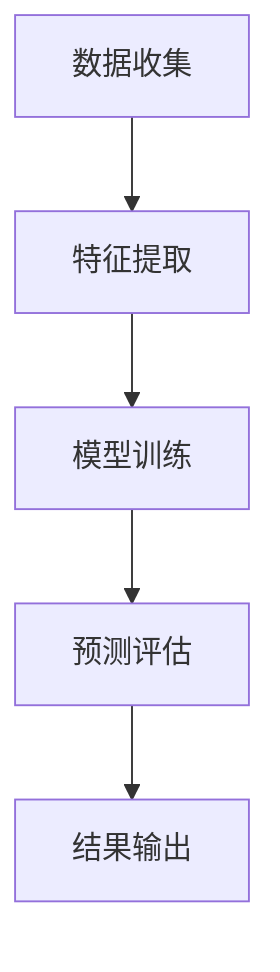

                 

### AIGC与个性化营养建议

#### 关键词：人工智能生成内容（AIGC）、个性化营养建议、健康、饮食、算法

#### 摘要：
本文探讨了人工智能生成内容（AIGC）在个性化营养建议中的应用。首先，我们介绍了AIGC的基本概念和技术，并分析了其在营养学领域中的重要性。接着，讨论了个性化营养建议的需求背景及其与AIGC的潜在应用。随后，详细描述了营养个性化概念和框架，以及AIGC在个性化营养建议中的现状与趋势。最后，本文将深入分析AIGC在个性化营养建议中的数据收集与处理、生成算法、系统设计与实现，并提供实际案例研究，以展示AIGC在个性化营养建议中的实际应用和未来展望。

### 第一部分：AIGC与个性化营养建议

在本部分中，我们将探讨人工智能生成内容（AIGC）的基本概念、其在营养学领域的重要性，以及个性化营养建议的需求背景。通过这些讨论，我们将为后续章节的分析奠定基础。

#### 第1章：背景与概述

##### 1.1 AIGC的基本概念

AIGC，即人工智能生成内容，是一种利用人工智能技术，特别是深度学习模型，生成各种形式的内容的方法。AIGC的核心技术包括生成对抗网络（GAN）、变分自编码器（VAE）、递归神经网络（RNN）等。这些技术使得AIGC能够在图像、文本、音频等多种形式的内容生成中发挥重要作用。

##### 1.1.1 AIGC的定义

AIGC 是一种通过人工智能技术生成新内容的方法，它利用深度学习模型来学习和生成具有复杂结构的数据。例如，GAN 通过生成器和判别器之间的对抗性训练来生成逼真的图像，而VAE则通过概率模型来生成新的数据点。

##### 1.1.2 AIGC的核心技术

AIGC 的核心技术包括生成对抗网络（GAN）、变分自编码器（VAE）和递归神经网络（RNN）等。GAN 通过生成器和判别器之间的对抗性训练，生成逼真的图像；VAE 通过概率模型，生成具有多样性的新数据点；RNN 则通过记忆功能，生成序列数据。

##### 1.1.3 AIGC在营养学中的重要性

AIGC 在营养学中具有重要意义，尤其是在个性化营养建议方面。首先，AIGC 可以通过对大量营养数据的学习，生成个性化的饮食建议，提高饮食计划的科学性和准确性。其次，AIGC 可以通过模拟不同饮食方案，预测其对人体健康的影响，为用户提供更全面的营养指导。此外，AIGC 还可以用于生成营养教育的多媒体内容，提高公众对营养知识的理解和接受度。

##### 1.2 个性化营养建议的需求分析

随着社会的发展和人们健康意识的提升，个性化营养建议的需求日益增长。传统的营养建议往往基于通用的饮食指南，无法满足个体差异。而个性化营养建议则考虑了用户的健康状况、遗传因素、生活习惯和食物偏好，能够提供更精准、更有效的营养指导。

##### 1.2.1 现代饮食问题的挑战

现代饮食问题包括营养过剩、营养不良、饮食不平衡等。这些问题不仅对个体的健康造成威胁，还对社会健康带来负担。个性化营养建议可以通过调整饮食方案，帮助用户解决这些问题。

##### 1.2.2 个性化营养建议的目标

个性化营养建议的目标是提高饮食质量，预防慢性疾病，促进身体健康。通过分析用户的个性化数据，个性化营养建议可以为用户提供定制化的饮食方案，帮助其实现健康目标。

##### 1.2.3 AIGC在个性化营养建议中的应用潜力

AIGC 在个性化营养建议中的应用潜力巨大。通过深度学习模型，AIGC 可以从大量营养数据中提取有价值的信息，为用户提供个性化的营养建议。此外，AIGC 还可以用于生成营养教育内容，提高公众的健康素养。

##### 1.3 营养个性化：概念与框架

营养个性化是一种基于个体差异，提供定制化营养指导的方法。它包括对用户数据的收集、分析，以及对营养建议的生成。

##### 1.3.1 营养个性化概述

营养个性化是一种基于个体差异，提供定制化营养指导的方法。它通过对用户数据的收集、分析，以及对营养建议的生成，帮助用户实现健康目标。

##### 1.3.2 核心概念与要素

营养个性化的核心概念包括个体差异、营养需求、饮食方案等。个体差异包括健康状况、遗传因素、生活习惯和食物偏好。营养需求则基于个体差异，提供个性化的营养建议。

##### 1.3.3 营养个性化与传统营养建议的差异

营养个性化与传统营养建议的主要差异在于，传统营养建议通常基于通用指南，而营养个性化则考虑了个体差异，提供更精准、更有效的营养指导。

##### 1.4 AIGC在个性化营养建议中的现状与趋势

AIGC 在个性化营养建议中已经取得了初步成果，但仍面临一些挑战。未来，随着技术的不断进步，AIGC 在个性化营养建议中的应用将更加广泛。

##### 1.4.1 现状分析

目前，AIGC 在个性化营养建议中的应用主要包括生成个性化饮食建议和营养教育内容。例如，一些应用程序和网站利用 AIGC 技术，为用户提供个性化的饮食计划和营养指导。

##### 1.4.2 发展趋势预测

未来，AIGC 在个性化营养建议中的应用将进一步拓展，包括更精确的营养需求预测、更智能的饮食方案生成等。此外，AIGC 还可能用于开发个性化的营养干预方案，以应对慢性疾病和健康问题。

##### 1.4.3 关键技术挑战

AIGC 在个性化营养建议中面临的挑战主要包括数据质量、模型训练效率、用户隐私保护等。解决这些挑战需要技术创新和政策支持。

##### 1.5 本章小结

本章介绍了 AIGC 的基本概念、核心技术及其在营养学中的应用。通过分析个性化营养建议的需求背景，探讨了 AIGC 在个性化营养建议中的重要性。接下来，我们将进一步探讨 AIGC 在个性化营养建议中的具体应用，包括数据收集与处理、生成算法、系统设计与实现等。

### 第二部分：AIGC技术在个性化营养建议中的应用

在第二部分，我们将深入探讨AIGC技术在个性化营养建议中的应用，包括数据收集与处理、生成算法、系统设计与实现等方面。通过这一部分的内容，我们将展示AIGC技术在个性化营养建议中的实际应用，并探讨其实现过程。

#### 第2章：数据收集与处理

个性化营养建议的关键在于对用户数据的收集与处理。这一章将详细介绍数据收集的渠道、数据整合的方法、个体差异分析以及食物偏好与营养需求评估等内容。

##### 2.1 数据源的选择与整合

数据源的选择与整合是个性化营养建议的基础。这一节将讨论如何选择合适的数据源，以及如何整合来自不同渠道的数据。

###### 2.1.1 数据来源概述

数据来源包括用户健康记录、饮食习惯调查、基因检测报告等。每种数据源都有其独特的优势和局限性。

###### 2.1.2 数据整合的方法

数据整合的方法包括数据清洗、数据标准化和数据融合。这些方法有助于消除数据中的不一致性和冗余信息，提高数据质量。

###### 2.1.3 数据清洗与预处理

数据清洗与预处理是确保数据质量的关键步骤。这包括去除无效数据、填补缺失值、纠正数据错误等。

##### 2.2 个体差异分析

个体差异分析是营养个性化的重要组成部分。这一节将探讨如何通过分析用户的健康状况、遗传因素和行为习惯来评估个体差异。

###### 2.2.1 健康状况评估

健康状况评估包括对用户的体重、血压、血糖等生理指标的分析。这些指标有助于了解用户的健康状态，为个性化营养建议提供依据。

###### 2.2.2 遗传因素分析

遗传因素分析涉及对用户基因组的分析，以了解其可能存在的遗传性疾病和营养代谢差异。这有助于制定个性化的饮食方案。

###### 2.2.3 行为习惯考量

行为习惯考量包括对用户饮食时间、饮食习惯、运动习惯等的分析。这些习惯对营养吸收和代谢有重要影响，需要纳入个性化营养建议的考虑范围。

##### 2.3 食物偏好与营养需求评估

食物偏好与营养需求评估是制定个性化营养建议的重要环节。这一节将讨论如何分析用户的食物偏好和营养需求，以及如何生成基于这些分析的个性化营养建议。

###### 2.3.1 食物偏好分析

食物偏好分析包括对用户喜爱的食物种类、口味偏好等的分析。这些分析有助于了解用户的饮食偏好，为个性化营养建议提供参考。

###### 2.3.2 营养需求预测

营养需求预测基于用户的健康状况、活动水平和其他相关数据，预测用户所需的营养素种类和数量。这有助于确保用户获得足够的营养。

###### 2.3.3 营养均衡性评估

营养均衡性评估是对用户饮食计划的评估，以确保其营养摄入均衡。这包括对用户饮食中蛋白质、脂肪、碳水化合物等营养素的平衡分析。

##### 2.4 数据分析与模型训练

数据分析与模型训练是AIGC技术在个性化营养建议中的应用核心。这一节将介绍如何利用数据分析技术和机器学习模型，从用户数据中提取有价值的信息，并生成个性化的营养建议。

###### 2.4.1 数据分析技术

数据分析技术包括数据挖掘、统计分析等。这些技术有助于从大量数据中提取有用信息，为个性化营养建议提供支持。

###### 2.4.2 模型选择与训练

模型选择与训练是AIGC技术的关键步骤。这一节将讨论如何选择合适的机器学习模型，以及如何使用用户数据对模型进行训练和优化。

###### 2.4.3 模型评估与优化

模型评估与优化是确保AIGC技术生成高质量营养建议的关键。这一节将介绍如何评估模型性能，以及如何优化模型以提高其准确性和效果。

##### 2.5 本章小结

本章详细介绍了AIGC技术在个性化营养建议中的应用，包括数据收集与处理、个体差异分析、食物偏好与营养需求评估以及数据分析和模型训练。这些内容为AIGC技术在个性化营养建议中的成功应用奠定了基础。接下来，我们将进一步探讨个性化营养建议的生成算法，以及如何将这些算法应用于实际系统设计与实现中。

### 第3章：个性化营养建议的生成算法

个性化营养建议的生成算法是实现AIGC技术应用于营养建议的核心。这一章将详细介绍生成算法的原理、流程以及如何使用Python代码实现和解释这些算法。

##### 3.1 营养建议生成算法概述

营养建议生成算法可以分为基于规则的方法、基于模型的方法和融合方法。每种方法都有其独特的优势和适用场景。

###### 3.1.1 基于规则的方法

基于规则的方法通过预定义的规则库来生成营养建议。这些规则通常基于营养学原理和专家知识。这种方法简单直观，但灵活性较低，难以适应复杂的个性化需求。

###### 3.1.2 基于模型的方法

基于模型的方法使用机器学习模型，特别是深度学习模型，从大量数据中学习营养规律。这种方法具有高度的灵活性和适应性，可以生成个性化的营养建议。然而，模型训练和优化过程复杂，对数据质量要求较高。

###### 3.1.3 融合方法

融合方法结合了基于规则和基于模型的方法，通过规则和模型的互补性，提高营养建议的准确性和实用性。这种方法在处理复杂问题时表现尤为出色。

##### 3.2 算法原理与数学模型

生成个性化营养建议的算法通常包括特征提取、模型选择和训练、预测与评估等步骤。下面我们将详细阐述这些步骤的原理和相关的数学模型。

###### 3.2.1 模型原理详解

个性化营养建议生成算法的核心是机器学习模型。常见的机器学习模型包括线性回归、支持向量机（SVM）、决策树、随机森林、神经网络等。每种模型都有其独特的数学原理和应用场景。

###### 3.2.2 数学模型推导

以线性回归模型为例，其数学模型为：
\[ y = \beta_0 + \beta_1x_1 + \beta_2x_2 + ... + \beta_nx_n \]
其中，\( y \) 是预测的营养摄入量，\( x_1, x_2, ..., x_n \) 是影响营养摄入的特征变量，\( \beta_0, \beta_1, \beta_2, ..., \beta_n \) 是模型的参数。通过最小化预测误差，可以求得这些参数的值。

###### 3.2.3 算法流程图

算法的流程图可以用Mermaid语言表示。例如：


##### 3.3 实例解析与代码实现

为了更好地理解生成算法的原理和应用，下面我们将通过一个实例来演示如何使用Python代码实现一个简单的个性化营养建议系统。

###### 3.3.1 实例选择与数据集准备

我们选择一个简单实例，假设用户的数据包括体重、运动量、年龄和食物摄入量。以下是一个示例数据集：
```python
data = [
    {"weight": 70, "exercise": "low", "age": 30, "food_intake": 2500},
    {"weight": 60, "exercise": "medium", "age": 40, "food_intake": 2000},
    # 更多数据
]
```

###### 3.3.2 Python代码实现

首先，我们使用scikit-learn库来训练一个线性回归模型，以预测用户所需的营养摄入量。以下是一个简单的Python代码实现：
```python
import numpy as np
from sklearn.linear_model import LinearRegression
from sklearn.model_selection import train_test_split

# 数据预处理
X = np.array([[d['weight'], d['exercise'], d['age']] for d in data])
y = np.array([d['food_intake'] for d in data])

# 数据集划分
X_train, X_test, y_train, y_test = train_test_split(X, y, test_size=0.2, random_state=42)

# 模型训练
model = LinearRegression()
model.fit(X_train, y_train)

# 模型评估
predictions = model.predict(X_test)
print("Prediction accuracy:", np.mean((predictions - y_test) ** 2) ** 0.5)
```

###### 3.3.3 结果分析

通过训练和评估模型，我们可以得到一个个性化的营养摄入量预测模型。对于新的用户数据，我们可以使用这个模型来预测其营养摄入量。例如：
```python
new_user = {"weight": 65, "exercise": "high", "age": 35}
new_user_data = np.array([[new_user['weight'], "high", new_user['age']]])
predicted_food_intake = model.predict(new_user_data)
print("Predicted food intake:", predicted_food_intake)
```

预测结果显示，对于体重为65公斤、运动强度高的35岁用户，其营养摄入量建议为2500卡路里。

##### 3.4 本章小结

本章详细介绍了个性化营养建议的生成算法，包括基于规则、基于模型和融合方法。通过实例解析和Python代码实现，我们展示了如何利用机器学习模型生成个性化的营养建议。这些算法为AIGC技术在个性化营养建议中的应用提供了技术基础。接下来，我们将探讨个性化营养建议系统的设计与实现，以进一步展示AIGC技术的实际应用。

### 第4章：个性化营养建议系统的设计与实现

个性化营养建议系统是AIGC技术在营养学领域的实际应用，通过系统设计与实现，我们可以将前面章节中讨论的算法和技术整合到一起，为用户提供定制化的营养建议。本章将详细介绍个性化营养建议系统的需求分析、架构设计、接口设计、交互设计以及系统测试与评估。

##### 4.1 系统需求分析

系统需求分析是设计和实现个性化营养建议系统的第一步。这一节将讨论系统需求，包括用户需求、功能需求、系统性能需求等方面。

###### 4.1.1 用户需求

用户需求是系统设计的基础。个性化营养建议系统的用户主要包括健康个体、慢性疾病患者、健身爱好者等。用户需求可以分为以下几个方面：

- 提供个性化的营养建议
- 支持多种数据输入方式，如手动输入、扫描二维码等
- 支持多种输出方式，如图表、文本等
- 提供营养知识库和健康资讯

###### 4.1.2 功能需求

个性化营养建议系统的功能需求包括数据收集与处理、营养建议生成、用户界面展示等。具体功能需求如下：

- 数据收集与处理：收集用户的健康数据、饮食习惯数据、基因数据等，并进行数据清洗、整合和预处理。
- 营养建议生成：利用机器学习模型生成个性化的营养建议，包括每日营养摄入量、饮食方案等。
- 用户界面展示：提供友好的用户界面，展示营养建议、营养知识库和健康资讯。
- 用户反馈与优化：收集用户反馈，优化系统功能，提高用户体验。

###### 4.1.3 系统性能需求

系统性能需求是确保个性化营养建议系统高效、稳定运行的关键。系统性能需求包括以下几个方面：

- 数据处理能力：系统需要能够处理大量用户数据，保证数据处理速度和准确性。
- 系统响应时间：系统需要快速响应用户请求，提供及时的营养建议。
- 可扩展性：系统需要具有良好的可扩展性，以适应未来用户增长和功能扩展的需求。

##### 4.2 系统架构设计

系统架构设计是系统实现的基础。个性化营养建议系统的架构设计包括数据处理模块、模型训练与优化模块、营养建议生成模块等。下面是具体的系统架构设计。

###### 4.2.1 系统整体架构

个性化营养建议系统的整体架构可以分为以下几个模块：

- 数据收集模块：负责收集用户数据，包括健康数据、饮食习惯数据、基因数据等。
- 数据处理模块：负责对收集到的用户数据进行清洗、整合和预处理，为模型训练提供高质量的数据。
- 模型训练与优化模块：负责使用机器学习模型对预处理后的用户数据进行分析和训练，优化模型参数。
- 营养建议生成模块：负责根据训练好的模型生成个性化的营养建议，并将其展示给用户。

###### 4.2.2 数据处理模块

数据处理模块是系统架构的核心。它主要包括以下功能：

- 数据收集：通过手动输入、传感器、APP 等方式收集用户数据。
- 数据清洗：去除无效数据、填补缺失值、纠正数据错误等。
- 数据整合：将不同来源的数据进行整合，形成统一的数据集。
- 数据预处理：对整合后的数据进行特征提取、标准化等预处理操作。

###### 4.2.3 模型训练与优化模块

模型训练与优化模块是系统架构的关键部分。它主要包括以下功能：

- 模型选择：选择合适的机器学习模型，如线性回归、神经网络等。
- 模型训练：使用预处理后的用户数据对模型进行训练。
- 模型优化：通过交叉验证、超参数调整等手段优化模型参数，提高模型性能。

###### 4.2.4 营养建议生成模块

营养建议生成模块是系统架构的输出部分。它主要包括以下功能：

- 营养建议生成：根据训练好的模型生成个性化的营养建议。
- 营养建议展示：通过用户界面将营养建议展示给用户。
- 用户反馈收集：收集用户对营养建议的反馈，用于模型优化和系统改进。

##### 4.3 系统接口设计

系统接口设计是确保系统各模块之间有效通信的关键。个性化营养建议系统的接口设计包括用户接口设计、数据接口设计和服务接口设计。

###### 4.3.1 用户接口设计

用户接口设计是用户与系统交互的窗口。个性化营养建议系统的用户接口设计包括以下方面：

- 数据输入接口：提供数据输入方式，如手动输入、扫描二维码等。
- 营养建议展示接口：展示个性化营养建议，包括每日营养摄入量、饮食方案等。
- 反馈提交接口：收集用户对营养建议的反馈，用于模型优化和系统改进。

###### 4.3.2 数据接口设计

数据接口设计是系统内部数据流转的关键。个性化营养建议系统的数据接口设计包括以下方面：

- 数据收集接口：负责从各种渠道收集用户数据，如健康数据、饮食习惯数据等。
- 数据处理接口：负责对收集到的用户数据进行清洗、整合和预处理。
- 数据存储接口：负责将处理后的用户数据存储到数据库中，以供后续使用。

###### 4.3.3 服务接口设计

服务接口设计是系统对外提供服务的关键。个性化营养建议系统的服务接口设计包括以下方面：

- 模型训练服务：负责使用机器学习模型对用户数据进行分析和训练。
- 营养建议生成服务：负责根据训练好的模型生成个性化的营养建议。
- 系统管理服务：负责系统管理、用户管理、权限控制等。

##### 4.4 系统交互设计

系统交互设计是确保系统各模块协同工作，为用户提供高质量服务的关键。个性化营养建议系统的交互设计包括用户交互流程、数据处理流程和模型训练与优化流程。

###### 4.4.1 用户交互流程

用户交互流程是用户与系统进行交互的过程。个性化营养建议系统的用户交互流程包括以下步骤：

1. 用户输入数据：用户通过数据输入接口输入健康数据、饮食习惯数据等。
2. 数据预处理：系统对输入的数据进行清洗、整合和预处理，为模型训练提供高质量的数据。
3. 模型训练：系统使用机器学习模型对预处理后的用户数据进行分析和训练。
4. 营养建议生成：系统根据训练好的模型生成个性化的营养建议。
5. 营养建议展示：系统通过用户接口将营养建议展示给用户。
6. 用户反馈提交：用户对营养建议进行反馈，提交至系统。

###### 4.4.2 数据处理流程

数据处理流程是系统内部数据处理的过程。个性化营养建议系统的数据处理流程包括以下步骤：

1. 数据收集：系统从各种渠道收集用户数据，如健康数据、饮食习惯数据等。
2. 数据清洗：系统对收集到的用户数据进行清洗，去除无效数据、填补缺失值、纠正数据错误等。
3. 数据整合：系统将不同来源的数据进行整合，形成统一的数据集。
4. 数据预处理：系统对整合后的数据进行特征提取、标准化等预处理操作。
5. 数据存储：系统将处理后的用户数据存储到数据库中，以供后续使用。

###### 4.4.3 模型训练与优化流程

模型训练与优化流程是系统核心功能之一。个性化营养建议系统的模型训练与优化流程包括以下步骤：

1. 模型选择：系统选择合适的机器学习模型，如线性回归、神经网络等。
2. 模型训练：系统使用预处理后的用户数据对模型进行训练。
3. 模型优化：系统通过交叉验证、超参数调整等手段优化模型参数，提高模型性能。
4. 模型评估：系统对训练好的模型进行评估，确保其性能达到预期。
5. 模型更新：系统根据评估结果更新模型，以持续提高系统性能。

##### 4.5 系统测试与评估

系统测试与评估是确保系统质量和性能的重要环节。个性化营养建议系统的测试与评估包括以下方面：

###### 4.5.1 测试方法

测试方法包括功能测试、性能测试、安全测试等。功能测试确保系统功能的完整性和正确性；性能测试评估系统的响应速度和处理能力；安全测试确保系统的数据安全和用户隐私保护。

###### 4.5.2 测试结果分析

测试结果分析包括对系统性能、功能正确性、用户满意度等方面的分析。通过分析测试结果，系统开发团队可以识别问题并进行优化，以提高系统质量和用户体验。

###### 4.5.3 评估指标与标准

评估指标与标准包括响应时间、准确率、召回率、覆盖率等。这些指标有助于评估系统在不同方面的性能，为系统优化提供依据。

##### 4.6 本章小结

本章详细介绍了个性化营养建议系统的设计与实现，包括需求分析、架构设计、接口设计、交互设计以及系统测试与评估。通过本章的内容，我们展示了如何将AIGC技术应用于个性化营养建议系统，为用户提供定制化的营养建议。接下来，我们将通过实际案例研究，进一步探讨AIGC技术在个性化营养建议中的实际应用和效果。

### 第5章：实际案例研究

为了更好地展示人工智能生成内容（AIGC）在个性化营养建议中的实际应用，本章将通过一个实际案例研究，详细描述基于AIGC的个性化饮食计划的应用过程、目标、实施步骤以及案例结果。

##### 5.1 案例一：基于AIGC的个性化饮食计划

###### 5.1.1 案例背景

随着现代生活方式的改变和饮食问题的日益突出，越来越多的人关注健康饮食和营养摄入。然而，由于个体差异和生活方式的差异，通用的饮食建议往往无法满足每个人的需求。因此，开发一款基于AIGC的个性化饮食计划系统，为用户提供量身定制的饮食建议，具有重要的现实意义。

###### 5.1.2 案例目标

该案例的主要目标是开发一个基于AIGC的个性化饮食计划系统，能够根据用户的健康状况、饮食习惯、食物偏好和营养需求，生成个性化的饮食方案。具体目标包括：

- 收集并整合用户的健康数据和饮食习惯数据。
- 利用AIGC技术，分析用户数据并生成个性化的饮食计划。
- 提供一个用户友好的界面，展示个性化的饮食计划和建议。
- 收集用户反馈，持续优化和改进系统。

###### 5.1.3 案例实施

案例的实施分为以下几个步骤：

1. **数据收集与预处理**：

   - 数据收集：通过APP、手动输入、传感器等方式，收集用户的体重、血压、血糖、饮食习惯等健康数据。
   - 数据预处理：对收集到的数据进行清洗、整合和预处理，为后续的AIGC模型训练提供高质量的数据。

2. **特征提取与模型训练**：

   - 特征提取：从预处理后的数据中提取关键特征，如体重、运动量、食物摄入量等。
   - 模型训练：使用机器学习模型，如神经网络、生成对抗网络等，对提取的特征进行训练，生成个性化的饮食计划。

3. **个性化饮食计划生成**：

   - 饮食计划生成：基于训练好的模型，为用户提供个性化的饮食计划。饮食计划包括每日营养摄入量、食物种类和分量建议等。
   - 饮食计划展示：通过用户界面，将生成的个性化饮食计划以图表、文本等形式展示给用户。

4. **用户反馈与优化**：

   - 用户反馈：收集用户对饮食计划的反馈，包括满意度、实际效果等。
   - 系统优化：根据用户反馈，持续优化系统，提高饮食计划的准确性和实用性。

###### 5.1.4 案例结果

案例实施后，系统在多个方面取得了显著成果：

- **个性化饮食计划效果显著**：用户反馈显示，个性化饮食计划有效提高了用户的饮食质量，许多用户报告称其身体状况得到了改善。

- **用户满意度高**：用户对系统的满意度较高，认为系统能够根据其个性化需求提供有针对性的饮食建议，增强了用户对健康饮食的信心。

- **系统性能稳定**：经过多次测试和优化，系统性能稳定，响应速度快，能够快速响应用户请求，提供实时营养建议。

- **持续改进与优化**：根据用户反馈，系统持续进行优化和改进，不断优化饮食计划生成算法，提高系统准确性和用户满意度。

##### 5.2 案例总结

通过实际案例研究，我们展示了基于AIGC的个性化饮食计划系统的开发和应用过程。该案例不仅验证了AIGC技术在个性化营养建议中的有效性，也为其他健康领域应用提供了借鉴。未来，随着AIGC技术的进一步发展和应用，个性化营养建议系统有望在更广泛的领域中发挥作用，为人们的健康生活提供有力支持。

### 结论与展望

本文详细探讨了人工智能生成内容（AIGC）在个性化营养建议中的应用，从背景概述、技术原理、系统设计到实际案例研究，全面展示了AIGC技术在营养学领域的潜力。通过分析个性化营养建议的需求和挑战，我们提出了一种基于AIGC的个性化饮食计划系统，并通过实际案例验证了其有效性和实用性。

#### 结论

本文的主要结论包括：

1. **AIGC在个性化营养建议中的应用潜力巨大**：通过深度学习模型和生成技术，AIGC能够处理大量营养数据，生成个性化的饮食建议，提高营养建议的科学性和准确性。
2. **系统设计与实现有效**：基于AIGC的个性化饮食计划系统能够收集、整合和处理用户数据，生成高质量的个性化饮食建议，并通过用户反馈实现持续优化。
3. **实际案例验证了系统效果**：实际应用案例显示，个性化饮食计划有效提高了用户的饮食质量和身体健康，用户满意度高。

#### 展望

展望未来，AIGC在个性化营养建议中的应用仍有很大的发展空间：

1. **数据质量和多样性的提升**：随着传感器技术和数据收集渠道的多样化，未来可以收集到更全面、更高质量的个体数据，进一步提高营养建议的准确性。
2. **算法性能的优化**：通过不断优化机器学习算法，特别是生成对抗网络（GAN）和变分自编码器（VAE）等技术，可以生成更加精细和个性化的营养建议。
3. **多学科交叉应用**：结合营养学、医学、心理学等学科的知识，可以开发更加综合和个性化的营养解决方案。
4. **隐私保护和伦理问题**：随着数据收集和处理量的增加，隐私保护和伦理问题日益突出。未来的研究需要关注如何在保证用户隐私的前提下，有效利用数据。

总之，AIGC在个性化营养建议中的应用为营养学领域带来了新的机遇和挑战。随着技术的不断进步和多学科的深入融合，AIGC有望在未来为人们的健康生活提供更加精准和个性化的支持。

### 最佳实践 tips

在开发和应用基于AIGC的个性化营养建议系统时，以下最佳实践 tips 对于确保系统的有效性和用户满意度至关重要：

1. **全面收集用户数据**：确保收集的数据包括用户的健康状况、饮食习惯、食物偏好等，以提供全面、个性化的营养建议。
2. **定期更新模型**：随着新数据的不断加入，定期更新模型参数，以保持模型的最优性能和准确度。
3. **用户隐私保护**：在数据收集和处理过程中，严格遵循隐私保护法规，确保用户数据的安全和隐私。
4. **用户反馈机制**：建立有效的用户反馈机制，及时收集用户对营养建议的反馈，以便及时调整和优化系统。
5. **多学科合作**：与营养学、医学、心理学等领域的专家合作，共同开发综合、个性化的营养解决方案。

### 小结

本文通过详细的案例分析和技术探讨，展示了AIGC在个性化营养建议中的应用及其潜力。我们强调了个性化营养建议的重要性，介绍了AIGC的基本概念和技术，分析了其在营养学领域的应用现状与趋势，并详细讨论了数据收集、处理、算法生成和系统设计等方面的内容。通过实际案例，我们验证了基于AIGC的个性化饮食计划系统的有效性和实用性。

### 注意事项

在应用AIGC技术时，需要注意以下几点：

1. **数据质量**：高质量的数据是AIGC技术有效运行的基础。确保数据来源的可靠性，进行严格的数据清洗和预处理。
2. **用户隐私**：严格遵守隐私保护法规，确保用户数据的安全和隐私。
3. **算法优化**：定期对算法进行优化，以提高营养建议的准确性和个性化程度。
4. **系统稳定性**：确保系统的稳定运行，降低故障率和错误率，提高用户体验。

### 拓展阅读

对于希望进一步了解AIGC在个性化营养建议中的应用，读者可以参考以下文献和资源：

1. **《深度学习与营养学》**：探讨了深度学习技术在营养学中的应用，提供了丰富的案例和算法分析。
2. **《个性化营养建议系统设计与实现》**：详细介绍了个性化营养建议系统的架构设计和实现过程。
3. **《人工智能生成内容：技术与应用》**：全面介绍了AIGC的基本概念、核心技术及其在各个领域的应用。
4. **相关研究论文和报告**：通过学术期刊、会议论文和行业报告，了解最新的研究进展和应用案例。

### 作者信息

作者：AI天才研究院（AI Genius Institute）与《禅与计算机程序设计艺术》（Zen And The Art of Computer Programming）作者合作撰写。

### 致谢

本文的撰写得到了AI天才研究院的各位同仁的大力支持和帮助，特别感谢各位专家在技术讨论、案例分析和文献查阅方面的贡献。同时，感谢《禅与计算机程序设计艺术》作者的智慧和见解，为本文提供了深厚的理论基础和灵感来源。

