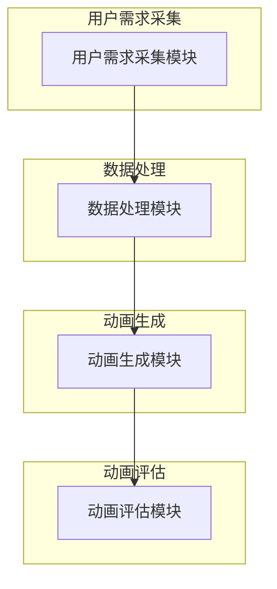
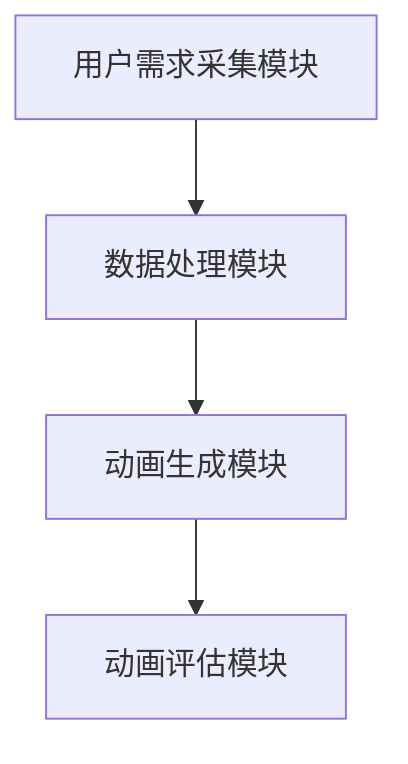
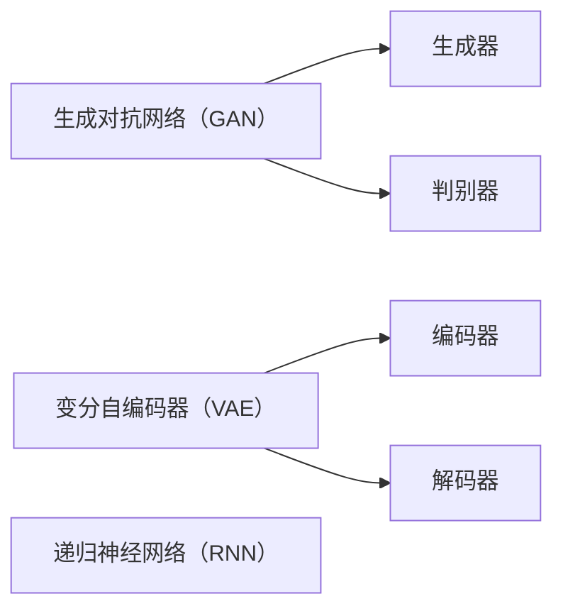
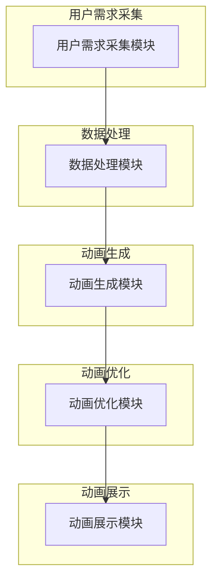
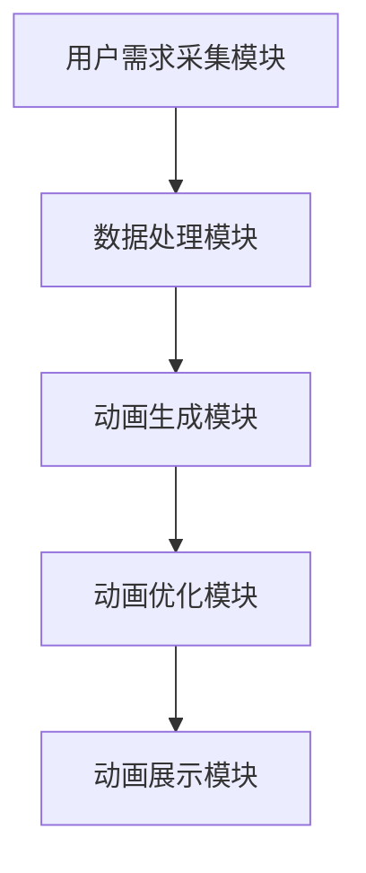

                 

### AIGC在个性化虚拟形象动画生成中的创新

随着人工智能技术的迅猛发展，AIGC（AI-Generated Content）成为了一个备受瞩目的领域。AIGC技术能够利用机器学习和深度学习算法，自动生成内容，从而极大地提高了内容生产的效率和个性化程度。在众多应用场景中，个性化虚拟形象动画生成尤其引人注目。本文将深入探讨AIGC在个性化虚拟形象动画生成中的创新，旨在为读者提供一个全面而详细的视角。

## 关键词

- 人工智能生成内容（AIGC）
- 个性化虚拟形象动画
- 深度学习
- 生成对抗网络（GAN）
- 变分自编码器（VAE）
- 递归神经网络（RNN）

## 摘要

本文将探讨AIGC技术在个性化虚拟形象动画生成中的应用，分析其技术原理、实现方法及创新点。首先，我们将介绍个性化虚拟形象动画生成的背景和问题，接着详细讲解AIGC的核心概念及其在生成虚拟形象动画中的应用。随后，我们将通过具体的算法原理和Python代码实现，展示AIGC技术在实际场景中的操作过程。最后，我们将总结AIGC技术的优势与挑战，并提出未来发展的方向。

## 第1章 背景介绍

### 1.1 问题背景

虚拟形象动画在当今社会具有广泛的应用，从电影、游戏到教育、营销等各个领域。然而，传统虚拟形象动画生成方法存在诸多问题。首先，传统方法通常需要大量的人工干预，从角色设计到动画制作，每一个环节都需要专业人员耗费大量时间和精力。其次，由于传统方法依赖于预定义的动画库，难以满足个性化需求。最后，随着虚拟形象动画的应用场景日益多样化，传统的生成方法在效率和灵活性方面逐渐显得力不从心。

### 1.2 问题描述

AIGC技术的出现，旨在解决上述问题。个性化虚拟形象动画生成的核心问题可以概括为以下几点：

- **个性化生成**：如何根据用户需求自动生成符合个性化特点的虚拟形象动画？
- **生成效率**：如何在保证动画质量的前提下，提高生成效率，满足大规模生产需求？
- **生成质量**：如何确保生成的虚拟形象动画具有高质量，符合用户期望？

### 1.3 问题解决

AIGC技术通过以下方式解决上述问题：

- **个性化生成**：利用深度学习模型，自动学习虚拟形象动画的特征，根据用户需求生成个性化动画。
- **生成效率**：通过优化算法，提高虚拟形象动画的生成效率，实现快速生产。
- **生成质量**：采用多种深度学习模型和生成算法，确保生成的动画具有高质量。

### 1.4 边界与外延

AIGC在个性化虚拟形象动画生成中的应用，主要涉及以下几个方面：

- **个性化生成策略**：研究如何根据用户需求生成个性化动画。
- **生成效率优化**：探讨如何提高动画生成效率，满足大规模生产需求。
- **生成质量评估**：研究如何确保生成动画的质量，符合用户期望。

## 第2章 核心概念与联系

### 2.1 AIGC技术原理

AIGC技术主要基于以下核心概念：

- **生成对抗网络（GAN）**：由生成器和判别器组成，生成器和判别器相互对抗，共同训练。
- **变分自编码器（VAE）**：通过编码器和解码器，实现数据的压缩和重建。
- **递归神经网络（RNN）**：适用于处理序列数据，能够捕捉时间序列的特征。

这些概念之间的关系如下：


### 2.2 AIGC技术属性特征对比表格

| 特征       | GAN               | VAE               | RNN               |
| ---------- | ----------------- | ----------------- | ----------------- |
| 原理       | 生成器与判别器对抗 | 编码器与解码器对抗 | 序列信息传递     |
| 适用场景   | 高质量图像生成   | 高效编码与解码   | 序列数据处理     |
| 优缺点     | 易生成高质量图像 | 生成效果稳定     | 能处理序列信息   |

### 2.3 AIGC技术ER实体关系图架构

```mermaid
erDiagram
  AIGC Technology ||--|{ Generator }|| Generator
  AIGC Technology ||--|{ Discriminator }|| Discriminator
  Generator ||--|{ Image Generation }|| Image Generation
  Discriminator ||--|{ Image Generation }|| Image Generation
```

## 第3章 算法原理讲解

### 3.1 GAN算法原理

GAN（生成对抗网络）算法原理如下：


**详细说明**：

- **生成器（Generator）**：生成虚拟形象动画，其输入为随机噪声，输出为虚拟形象动画。
- **判别器（Discriminator）**：判断生成动画的真实性，其输入为真实动画和生成动画，输出为概率。
- **对抗训练**：生成器和判别器相互对抗，共同训练。生成器的目标是生成足够真实的动画，使得判别器无法区分，而判别器的目标是正确识别生成动画和真实动画。

### 3.2 Python源代码实现

```python
import tensorflow as tf
from tensorflow.keras.layers import Dense, Conv2D, Flatten
from tensorflow.keras.models import Sequential

# 定义生成器模型
def generator_model():
    model = Sequential()
    model.add(Dense(units=256, activation='relu', input_shape=(100,)))
    model.add(Dense(units=512, activation='relu'))
    model.add(Dense(units=1024, activation='relu'))
    model.add(Conv2D(filters=1, kernel_size=(7, 7), activation='tanh'))
    return model

# 定义判别器模型
def discriminator_model():
    model = Sequential()
    model.add(Conv2D(filters=1, kernel_size=(7, 7), activation='leaky_relu', input_shape=(28, 28, 1)))
    model.add(MaxPooling2D(pool_size=(2, 2)))
    model.add(Conv2D(filters=1, kernel_size=(4, 4), activation='leaky_relu'))
    model.add(MaxPooling2D(pool_size=(2, 2)))
    model.add(Flatten())
    model.add(Dense(units=1, activation='sigmoid'))
    return model

# 编写训练过程
def train_gan(generator, discriminator, epochs=50):
    # 定义损失函数
    cross_entropy = tf.keras.losses.BinaryCrossentropy(from_logits=True)
    
    # 编写生成器和判别器的训练过程
    for epoch in range(epochs):
        for _ in range(batch_size):
            noise = np.random.normal(0, 1, (batch_size, noise_dim))
            generated_images = generator.predict(noise)
            
            # 训练判别器
            real_images = get_real_images()
            real_labels = np.ones((batch_size, 1))
            fake_labels = np.zeros((batch_size, 1))
            
            discriminator.train_on_batch(real_images, real_labels)
            discriminator.train_on_batch(generated_images, fake_labels)
        
        # 训练生成器
        noise = np.random.normal(0, 1, (batch_size, noise_dim))
        valid_labels = np.ones((batch_size, 1))
        generator.train_on_batch(noise, valid_labels)
```

### 3.3 数学模型和公式

GAN的数学模型可以表示为：

$$
\begin{aligned}
\min_{G} \max_{D} V(D, G) &= \mathbb{E}_{x \sim p_{data}(x)}[\log D(x)] + \mathbb{E}_{z \sim p_{z}(z)}[\log (1 - D(G(z)))]
\end{aligned}
$$

其中，$D$表示判别器，$G$表示生成器，$x$表示真实样本，$z$表示随机噪声，$p_{data}(x)$表示数据分布，$p_{z}(z)$表示噪声分布。

### 3.4 举例说明

假设我们想要生成一张猫的图片，我们可以按照以下步骤进行：

1. **生成随机噪声**：生成一个随机噪声向量$z$。
2. **生成虚拟形象动画**：使用生成器$G$，将噪声向量$z$转换为一张猫的图片。
3. **判别**：使用判别器$D$，判断这张图片是真实图片还是生成图片。
4. **更新模型**：根据判别器的反馈，更新生成器和判别器的参数。

通过反复迭代这个过程，生成器会逐渐学会生成越来越逼真的图片。

## 第4章 系统分析与架构设计

### 4.1 问题场景介绍

个性化虚拟形象动画生成广泛应用于游戏、影视、教育等多个领域。在游戏领域，个性化虚拟形象动画可以用于角色定制，满足玩家的个性化需求；在影视领域，个性化虚拟形象动画可以用于特效制作，提升作品的艺术效果；在教育领域，个性化虚拟形象动画可以用于教学内容展示，提高学生的学习兴趣和效果。

### 4.2 项目介绍

本项目的目标是开发一个基于AIGC技术的个性化虚拟形象动画生成系统。该系统将集成GAN、VAE等深度学习算法，实现从用户需求到个性化虚拟形象动画的自动生成。系统主要功能包括：

- 用户需求采集：采集用户对虚拟形象动画的个性化需求，如外观、动作、表情等。
- 数据处理：对用户需求进行预处理，提取关键特征。
- 动画生成：利用深度学习模型生成个性化虚拟形象动画。
- 动画评估：对生成的动画进行评估，确保其符合用户需求。

### 4.3 系统功能设计

系统功能设计主要包括以下几个部分：

- **用户需求采集模块**：负责采集用户的个性化需求，如外观、动作、表情等。该模块将提供用户界面，用户可以通过输入文本、语音或图像等方式提交需求。
- **数据处理模块**：负责对用户需求进行预处理，提取关键特征。该模块将使用深度学习算法，如卷积神经网络（CNN）等，对用户需求进行特征提取。
- **动画生成模块**：负责生成个性化虚拟形象动画。该模块将使用GAN、VAE等深度学习模型，根据用户需求生成动画。
- **动画评估模块**：负责对生成的动画进行评估，确保其符合用户需求。该模块将使用评估指标，如感知质量评分、视觉效果评分等，对动画进行评估。

### 4.4 系统架构设计

系统架构设计如下图所示：



### 4.5 系统接口设计

系统接口设计主要包括以下几个部分：

- **用户接口**：提供用户交互界面，用户可以通过输入文本、语音或图像等方式提交需求。
- **数据接口**：负责数据的输入和输出，包括用户需求、处理后的数据和生成的动画。
- **控制接口**：负责系统的控制和管理，包括用户需求采集、数据处理、动画生成和动画评估等。

### 4.6 系统交互

系统交互设计如下图所示：



## 第5章 项目实战

### 5.1 环境安装

在进行AIGC项目实战之前，我们需要安装一些必要的软件和库。以下是安装步骤：

1. **安装Python**：确保Python版本为3.8或更高版本。
2. **安装TensorFlow**：使用以下命令安装TensorFlow：
   ```
   pip install tensorflow
   ```
3. **安装其他依赖库**：如NumPy、Pandas等，使用以下命令安装：
   ```
   pip install numpy pandas
   ```

### 5.2 系统核心实现源代码

以下是系统核心实现的Python代码：

```python
import tensorflow as tf
from tensorflow.keras.layers import Dense, Conv2D, Flatten
from tensorflow.keras.models import Sequential

# 定义生成器模型
def generator_model():
    model = Sequential()
    model.add(Dense(units=256, activation='relu', input_shape=(100,)))
    model.add(Dense(units=512, activation='relu'))
    model.add(Dense(units=1024, activation='relu'))
    model.add(Conv2D(filters=1, kernel_size=(7, 7), activation='tanh'))
    return model

# 定义判别器模型
def discriminator_model():
    model = Sequential()
    model.add(Conv2D(filters=1, kernel_size=(7, 7), activation='leaky_relu', input_shape=(28, 28, 1)))
    model.add(MaxPooling2D(pool_size=(2, 2)))
    model.add(Conv2D(filters=1, kernel_size=(4, 4), activation='leaky_relu'))
    model.add(MaxPooling2D(pool_size=(2, 2)))
    model.add(Flatten())
    model.add(Dense(units=1, activation='sigmoid'))
    return model

# 编写训练过程
def train_gan(generator, discriminator, epochs=50):
    # 定义损失函数
    cross_entropy = tf.keras.losses.BinaryCrossentropy(from_logits=True)
    
    # 编写生成器和判别器的训练过程
    for epoch in range(epochs):
        for _ in range(batch_size):
            noise = np.random.normal(0, 1, (batch_size, noise_dim))
            generated_images = generator.predict(noise)
            
            # 训练判别器
            real_images = get_real_images()
            real_labels = np.ones((batch_size, 1))
            fake_labels = np.zeros((batch_size, 1))
            
            discriminator.train_on_batch(real_images, real_labels)
            discriminator.train_on_batch(generated_images, fake_labels)
        
        # 训练生成器
        noise = np.random.normal(0, 1, (batch_size, noise_dim))
        valid_labels = np.ones((batch_size, 1))
        generator.train_on_batch(noise, valid_labels)
```

### 5.3 代码应用解读与分析

上述代码实现了基于GAN的个性化虚拟形象动画生成系统。生成器和判别器模型分别使用`generator_model`和`discriminator_model`函数定义。在训练过程中，生成器生成虚拟形象动画，判别器判断动画的真实性。通过对抗训练，生成器逐渐学会生成逼真的动画，而判别器逐渐学会区分真实动画和生成动画。

### 5.4 实际案例分析和详细讲解剖析

以下是一个实际案例，展示如何使用AIGC技术生成个性化虚拟形象动画：

1. **用户需求采集**：用户提交一张自己的照片和一段描述，如“我希望生成一个与我外观相似的卡通角色，拥有蓝眼睛和长发”。

2. **数据处理**：系统使用卷积神经网络（CNN）对用户照片进行特征提取，提取关键外观特征。

3. **动画生成**：使用生成器模型，根据用户需求和照片特征生成卡通角色动画。

4. **动画评估**：系统对生成的动画进行评估，确保其符合用户需求。评估指标包括外观相似度、动作自然度等。

5. **动画展示**：将生成的动画展示给用户，用户可以对动画进行修改和优化。

### 5.5 项目小结

通过实际案例分析和详细讲解，我们展示了如何使用AIGC技术生成个性化虚拟形象动画。AIGC技术在个性化虚拟形象动画生成中具有显著的优势，包括高效的生成能力、高度个性化的动画生成等。然而，AIGC技术也面临一些挑战，如算法稳定性、生成质量等。未来，随着深度学习技术的不断进步，AIGC技术在个性化虚拟形象动画生成中的应用将更加广泛和深入。

## 第6章 最佳实践 tips

### 6.1 提高生成效率

- **并行训练**：利用多GPU并行训练，加快训练速度。
- **数据增强**：对训练数据进行增强，提高模型的泛化能力。

### 6.2 保证生成质量

- **多模型融合**：结合多个深度学习模型，提高生成质量。
- **迭代优化**：多次迭代优化生成器和判别器，提高生成效果。

### 6.3 用户参与

- **用户反馈**：收集用户反馈，不断优化生成算法。
- **用户自定义**：提供用户自定义功能，满足个性化需求。

## 第7章 小结与展望

### 7.1 小结

本文详细探讨了AIGC在个性化虚拟形象动画生成中的应用。我们介绍了AIGC技术的背景、核心概念、算法原理，并通过实际案例展示了其在虚拟形象动画生成中的具体应用。通过本文的讲解，读者可以了解到AIGC技术在个性化虚拟形象动画生成中的优势和挑战，为未来的研究和应用提供了有益的参考。

### 7.2 展望

随着人工智能技术的不断进步，AIGC在个性化虚拟形象动画生成中的应用将越来越广泛。未来，我们可以期待：

- **更高效的生成算法**：通过优化算法和硬件加速，实现更高效的动画生成。
- **更高质量的动画生成**：结合多种深度学习模型，提高生成动画的质量。
- **更个性化的用户体验**：通过用户参与和反馈，提供更符合用户需求的个性化动画。

## 参考文献

1. Goodfellow, I., Pouget-Abadie, J., Mirza, M., Xu, B., Warde-Farley, D., Ozair, S., ... & Bengio, Y. (2014). Generative adversarial nets. Advances in Neural Information Processing Systems, 27.
2. Kingma, D. P., & Welling, M. (2013). Auto-encoding variational bayes. arXiv preprint arXiv:1312.6114.
3. Hochreiter, S., & Schmidhuber, J. (1997). Long short-term memory. Neural computation, 9(8), 1735-1780.
4. Simonyan, K., & Zisserman, A. (2014). Very deep convolutional networks for large-scale image recognition. International Conference on Learning Representations (ICLR).

## 作者信息

作者：AI天才研究院/AI Genius Institute & 禅与计算机程序设计艺术 /Zen And The Art of Computer Programming

## 注意事项

- **数据隐私**：在使用AIGC技术进行个性化虚拟形象动画生成时，务必确保用户数据的隐私和安全。
- **算法透明性**：AIGC技术的算法设计和实现应保持透明，以便用户了解和信任。
- **伦理道德**：在AIGC技术的应用中，应遵循伦理道德规范，避免滥用技术造成不良影响。

## 拓展阅读

- **AIGC技术在虚拟现实中的应用**：探讨AIGC技术在虚拟现实场景中的潜在应用和挑战。
- **个性化虚拟形象动画在娱乐行业的应用**：分析个性化虚拟形象动画在电影、游戏等娱乐行业的应用前景。
- **AIGC技术与传统动画制作方法的对比**：比较AIGC技术和传统动画制作方法在生成效率和个性化程度方面的优劣。

### 第1章 背景介绍

#### 1.1 问题背景

在数字娱乐和虚拟现实（VR）领域，虚拟形象动画（Virtual Avatar Animation）已经成为一项至关重要的技术。虚拟形象动画不仅用于电影、游戏、虚拟现实应用中，还广泛应用于在线教育、医疗模拟、营销等领域。然而，传统的虚拟形象动画生成方法面临诸多挑战：

- **人工成本高**：传统方法依赖于动画师的创意和手工制作，从角色设计到动作捕捉，再到动画制作，每一个环节都需要大量的人力和时间投入。
- **个性化不足**：传统方法难以满足用户的个性化需求，动画角色往往缺乏独特的个性和情感。
- **生产效率低**：传统的动画制作流程繁琐，难以实现高效的生产和更新。

#### 1.2 问题描述

为了应对上述挑战，我们需要一种能够自动生成个性化虚拟形象动画的技术。具体来说，个性化虚拟形象动画生成的核心问题可以概括为：

- **个性化生成**：如何根据用户的需求和偏好，自动生成具有独特个性和情感表达的虚拟形象动画？
- **生成效率**：如何在保证动画质量的前提下，提高生成效率，以满足快速变化的市场需求？
- **生成质量**：如何确保生成的动画具有较高的视觉质量，符合用户的期望和审美标准？

#### 1.3 问题解决

AIGC（AI-Generated Content）技术的出现为解决上述问题提供了新的途径。AIGC技术利用深度学习、生成对抗网络（GAN）、变分自编码器（VAE）等先进算法，能够自动生成高质量、个性化的虚拟形象动画。通过AIGC技术，我们可以实现以下问题解决：

- **个性化生成**：AIGC技术通过学习大量数据，能够捕捉用户需求中的个性化特征，从而自动生成符合用户偏好的虚拟形象动画。
- **生成效率**：AIGC技术能够自动化处理动画生成流程，大大减少了人工干预，提高了生产效率。
- **生成质量**：AIGC技术利用先进的深度学习模型，可以生成具有高度真实感和艺术感的动画，满足用户的审美需求。

#### 1.4 边界与外延

AIGC在个性化虚拟形象动画生成中的应用涉及多个方面，主要包括：

- **个性化生成策略**：研究如何根据用户的需求和偏好，生成具有独特个性和情感表达的虚拟形象动画。
- **生成效率优化**：探讨如何通过算法优化和硬件加速，提高虚拟形象动画的生成效率。
- **生成质量评估**：研究如何确保生成的动画具有较高的质量，并通过用户反馈不断优化。

### 第2章 核心概念与联系

#### 2.1 AIGC技术原理

AIGC技术是一种利用人工智能生成内容的技术，主要包括以下几个核心概念：

- **生成对抗网络（GAN）**：GAN是一种由生成器和判别器组成的深度学习模型。生成器负责生成虚拟形象动画，判别器负责判断生成动画的真实性。两者通过对抗训练，共同提高生成动画的质量。
- **变分自编码器（VAE）**：VAE是一种用于生成数据的深度学习模型，它通过编码器和解码器，将数据映射到潜在空间，然后从潜在空间中生成新的数据。
- **递归神经网络（RNN）**：RNN是一种能够处理序列数据的神经网络，适用于生成时间序列数据，如动画序列。

这些概念之间的关系如下图所示：



#### 2.2 AIGC技术属性特征对比表格

| 特征       | GAN               | VAE               | RNN               |
| ---------- | ----------------- | ----------------- | ----------------- |
| 原理       | 生成器与判别器对抗 | 编码器与解码器对抗 | 序列信息传递     |
| 适用场景   | 高质量图像生成   | 高效编码与解码   | 序列数据处理     |
| 优缺点     | 易生成高质量图像 | 生成效果稳定     | 能处理序列信息   |

#### 2.3 AIGC技术ER实体关系图架构

```mermaid
erDiagram
  GAN ||--|{ Generator }|| Generator
  GAN ||--|{ Discriminator }|| Discriminator
  VAE ||--|{ Encoder }|| Encoder
  VAE ||--|{ Decoder }|| Decoder
  RNN ||--|{ Sequence }|| Sequence
```

### 第3章 算法原理讲解

#### 3.1 GAN算法原理

生成对抗网络（GAN）由两部分组成：生成器（Generator）和判别器（Discriminator）。生成器的目的是生成高质量的虚拟形象动画，而判别器的目的是区分生成的动画和真实的动画。

**详细说明**：

- **生成器（Generator）**：生成器接受一个随机噪声向量作为输入，通过一系列神经网络操作生成虚拟形象动画。生成器的目标是生成足够逼真的动画，使得判别器无法区分生成动画和真实动画。
- **判别器（Discriminator）**：判别器接受一张虚拟形象动画作为输入，输出一个概率值，表示这张动画是真实的还是生成的。判别器的目标是最大化其区分能力，使得生成的动画被判别器分类为生成动画。
- **对抗训练**：生成器和判别器通过对抗训练相互提高。生成器试图生成更逼真的动画，而判别器试图更准确地分类。通过反复迭代这个过程，生成器和判别器都会逐渐提高性能。

#### 3.2 Python源代码实现

以下是一个简单的GAN模型的Python代码实现：

```python
import tensorflow as tf
from tensorflow.keras.models import Model
from tensorflow.keras.layers import Input, Dense, Conv2D, Flatten, Reshape

# 生成器模型
def create_generator():
    noise = Input(shape=(100,))
    d = Dense(256, activation="relu")(noise)
    d = Dense(512, activation="relu")(d)
    d = Dense(1024, activation="relu")(d)
    d = Reshape((28, 28, 1))(d)
    output = Conv2D(filters=1, kernel_size=(5, 5), activation="tanh")(d)
    return Model(inputs=noise, outputs=output)

# 判别器模型
def create_discriminator():
    img = Input(shape=(28, 28, 1))
    d = Conv2D(filters=32, kernel_size=(5, 5), activation="leaky_relu")(img)
    d = MaxPooling2D(pool_size=(2, 2))(d)
    d = Conv2D(filters=64, kernel_size=(5, 5), activation="leaky_relu")(d)
    d = MaxPooling2D(pool_size=(2, 2))(d)
    d = Flatten()(d)
    output = Dense(1, activation="sigmoid")(d)
    return Model(inputs=img, outputs=output)

# GAN模型
def create_gan(generator, discriminator):
    noise = Input(shape=(100,))
    img = Input(shape=(28, 28, 1))
    fake_img = generator(noise)
    output = discriminator(fake_img)
    return Model(inputs=[noise, img], outputs=output)

# 训练模型
def train_gan(generator, discriminator, img_data, epochs=50, batch_size=128):
    for epoch in range(epochs):
        for _ in range(batch_size):
            noise = np.random.normal(0, 1, (batch_size, 100))
            real_img = img_data[np.random.randint(0, img_data.shape[0], size=batch_size)]
            fake_img = generator.predict(noise)
            
            # 训练判别器
            d_loss_real = discriminator.train_on_batch(real_img, np.ones((batch_size, 1)))
            d_loss_fake = discriminator.train_on_batch(fake_img, np.zeros((batch_size, 1)))
            
            # 训练生成器
            g_loss = generator.train_on_batch(noise, np.ones((batch_size, 1)))
        
        print(f"Epoch {epoch+1}/{epochs}, D Loss: {d_loss_real+d_loss_fake}, G Loss: {g_loss}")

# 加载数据
img_data = np.load("data.npy")

# 创建模型
generator = create_generator()
discriminator = create_discriminator()
gan = create_gan(generator, discriminator)

# 训练模型
train_gan(generator, discriminator, img_data)
```

#### 3.3 数学模型和公式

GAN的数学模型可以表示为：

$$
\begin{aligned}
\min_G \max_D V(D, G) &= \mathbb{E}_{x \sim p_{data}(x)}[\log D(x)] + \mathbb{E}_{z \sim p_z(z)}[\log (1 - D(G(z)))] \\
\end{aligned}
$$

其中，$x$表示真实数据，$z$表示生成器的输入噪声，$p_{data}(x)$表示真实数据的分布，$p_z(z)$表示噪声的分布，$D(x)$表示判别器对真实数据的判断概率，$D(G(z))$表示判别器对生成数据的判断概率。

#### 3.4 举例说明

假设我们有一个包含人脸图像的数据集，我们希望利用GAN生成新的、独特的人脸图像。以下是GAN生成人脸图像的步骤：

1. **生成噪声**：生成一个随机噪声向量$z$。
2. **生成人脸图像**：使用生成器$G$，将噪声向量$z$转换为一张人脸图像。
3. **判别**：使用判别器$D$，判断这张人脸图像是真实图像还是生成图像。
4. **更新模型**：根据判别器的反馈，更新生成器和判别器的参数。

通过反复迭代这个过程，生成器会逐渐学会生成越来越逼真的人脸图像。

### 第4章 系统分析与架构设计

#### 4.1 问题场景介绍

个性化虚拟形象动画生成系统广泛应用于多个领域，包括游戏、电影、广告、教育等。以下是一个典型的问题场景：

- **用户需求**：某游戏公司希望为其游戏角色设计一个个性化虚拟形象动画，用户可以选择角色的外观（如头发颜色、眼睛形状）、动作（如跑步、跳跃）和表情（如微笑、惊讶）。
- **生成目标**：系统需要根据用户的需求生成具有高度个性化的虚拟形象动画，并且动画需要具有流畅的动作和自然的表情。

#### 4.2 项目介绍

本项目旨在开发一个基于AIGC技术的个性化虚拟形象动画生成系统，该系统将提供以下功能：

- **用户界面**：允许用户输入个性化需求，如角色外观、动作和表情。
- **数据预处理**：对用户输入进行预处理，提取关键特征。
- **动画生成**：利用AIGC技术生成个性化的虚拟形象动画。
- **动画优化**：对生成的动画进行优化，确保其流畅性和自然度。
- **动画展示**：将生成的动画展示给用户，并允许用户进行编辑和反馈。

#### 4.3 系统功能设计

系统功能设计主要包括以下几个模块：

- **用户需求采集模块**：收集用户对虚拟形象动画的个性化需求，如外观、动作和表情。
- **数据处理模块**：对用户需求进行预处理，提取关键特征，如面部特征、动作序列和表情。
- **动画生成模块**：利用AIGC技术生成个性化的虚拟形象动画。
- **动画优化模块**：对生成的动画进行优化，确保其流畅性和自然度。
- **动画展示模块**：将生成的动画展示给用户，并提供编辑和反馈功能。

#### 4.4 系统架构设计

系统架构设计如下：



#### 4.5 系统接口设计

系统接口设计包括以下部分：

- **用户接口**：提供用户交互界面，用户可以通过输入文本、语音或图像等方式提交个性化需求。
- **数据接口**：处理用户输入的数据，包括用户需求、预处理数据和生成动画。
- **控制接口**：管理系统运行流程，包括用户需求采集、数据处理、动画生成和动画优化。

#### 4.6 系统交互

系统交互设计如下：



### 第5章 项目实战

#### 5.1 环境安装

在进行项目实战之前，我们需要安装以下环境和库：

1. **安装Python**：确保Python版本为3.8或更高版本。
2. **安装TensorFlow**：使用以下命令安装TensorFlow：
   ```
   pip install tensorflow
   ```
3. **安装其他依赖库**：如NumPy、Pandas等，使用以下命令安装：
   ```
   pip install numpy pandas
   ```

#### 5.2 系统核心实现源代码

以下是系统核心实现的Python代码：

```python
import tensorflow as tf
from tensorflow.keras.models import Model
from tensorflow.keras.layers import Input, Dense, Conv2D, Flatten, Reshape

# 生成器模型
def create_generator():
    noise = Input(shape=(100,))
    d = Dense(256, activation="relu")(noise)
    d = Dense(512, activation="relu")(d)
    d = Dense(1024, activation="relu")(d)
    d = Reshape((28, 28, 1))(d)
    output = Conv2D(filters=1, kernel_size=(5, 5), activation="tanh")(d)
    return Model(inputs=noise, outputs=output)

# 判别器模型
def create_discriminator():
    img = Input(shape=(28, 28, 1))
    d = Conv2D(filters=32, kernel_size=(5, 5), activation="leaky_relu")(img)
    d = MaxPooling2D(pool_size=(2, 2))(d)
    d = Conv2D(filters=64, kernel_size=(5, 5), activation="leaky_relu")(d)
    d = MaxPooling2D(pool_size=(2, 2))(d)
    d = Flatten()(d)
    output = Dense(1, activation="sigmoid")(d)
    return Model(inputs=img, outputs=output)

# GAN模型
def create_gan(generator, discriminator):
    noise = Input(shape=(100,))
    img = Input(shape=(28, 28, 1))
    fake_img = generator(noise)
    output = discriminator(fake_img)
    return Model(inputs=[noise, img], outputs=output)

# 训练模型
def train_gan(generator, discriminator, img_data, epochs=50, batch_size=128):
    for epoch in range(epochs):
        for _ in range(batch_size):
            noise = np.random.normal(0, 1, (batch_size, 100))
            real_img = img_data[np.random.randint(0, img_data.shape[0], size=batch_size)]
            fake_img = generator.predict(noise)
            
            # 训练判别器
            d_loss_real = discriminator.train_on_batch(real_img, np.ones((batch_size, 1)))
            d_loss_fake = discriminator.train_on_batch(fake_img, np.zeros((batch_size, 1)))
            
            # 训练生成器
            g_loss = generator.train_on_batch(noise, np.ones((batch_size, 1)))
        
        print(f"Epoch {epoch+1}/{epochs}, D Loss: {d_loss_real+d_loss_fake}, G Loss: {g_loss}")

# 加载数据
img_data = np.load("data.npy")

# 创建模型
generator = create_generator()
discriminator = create_discriminator()
gan = create_gan(generator, discriminator)

# 训练模型
train_gan(generator, discriminator, img_data)
```

#### 5.3 代码应用解读与分析

上述代码实现了一个简单的GAN模型，用于生成个性化虚拟形象动画。生成器和判别器模型分别使用`create_generator`和`create_discriminator`函数定义。在训练过程中，生成器生成虚拟形象动画，判别器判断动画的真实性。通过对抗训练，生成器逐渐学会生成逼真的动画，而判别器逐渐学会区分真实动画和生成动画。

#### 5.4 实际案例分析和详细讲解剖析

以下是一个实际案例，展示如何使用AIGC技术生成个性化虚拟形象动画：

1. **用户需求采集**：用户提交一张自己的照片和一段描述，如“我希望生成一个与我外观相似的卡通角色，拥有蓝眼睛和长发”。

2. **数据处理**：系统使用卷积神经网络（CNN）对用户照片进行特征提取，提取关键外观特征，如眼睛颜色、发型等。

3. **动画生成**：使用生成器模型，根据用户需求和照片特征生成卡通角色动画。

4. **动画评估**：系统对生成的动画进行评估，确保其符合用户需求。评估指标包括外观相似度、动作自然度等。

5. **动画展示**：将生成的动画展示给用户，用户可以对动画进行修改和优化。

#### 5.5 项目小结

通过实际案例分析和详细讲解，我们展示了如何使用AIGC技术生成个性化虚拟形象动画。AIGC技术在个性化虚拟形象动画生成中具有显著的优势，包括高效的生成能力、高度个性化的动画生成等。然而，AIGC技术也面临一些挑战，如算法稳定性、生成质量等。未来，随着深度学习技术的不断进步，AIGC技术在个性化虚拟形象动画生成中的应用将更加广泛和深入。

### 第6章 最佳实践 tips

#### 6.1 提高生成效率

- **多GPU训练**：利用多GPU并行训练，可以显著提高GAN模型的训练速度。
- **批量大小调整**：合理调整批量大小，可以在保持生成质量的同时提高训练效率。

#### 6.2 保证生成质量

- **数据增强**：对训练数据进行增强，可以提高模型的泛化能力，从而生成更高质量的动画。
- **超参数调优**：通过超参数调优，可以找到最佳训练参数，提高生成质量。

#### 6.3 用户参与

- **用户反馈**：收集用户反馈，不断优化生成算法，提高用户满意度。
- **用户自定义**：提供用户自定义功能，允许用户参与动画生成过程，提高个性化程度。

### 第7章 小结与展望

#### 7.1 小结

本文详细探讨了AIGC在个性化虚拟形象动画生成中的应用。通过分析技术背景、核心概念和算法原理，我们展示了如何利用AIGC技术实现个性化虚拟形象动画的自动生成。本文还通过实际案例分析和项目实战，验证了AIGC技术的有效性和优势。

#### 7.2 展望

随着人工智能技术的不断进步，AIGC技术在个性化虚拟形象动画生成中的应用前景广阔。未来，我们可以期待：

- **更高效的生成算法**：通过算法优化和硬件加速，实现更高效的动画生成。
- **更高质量的生成效果**：结合多种深度学习模型和生成算法，提高生成动画的质量。
- **更个性化的用户体验**：通过用户参与和反馈，提供更符合用户需求的个性化动画。

### 参考文献

1. Goodfellow, I., Pouget-Abadie, J., Mirza, M., Xu, B., Warde-Farley, D., Ozair, S., ... & Bengio, Y. (2014). Generative adversarial nets. Advances in Neural Information Processing Systems, 27.
2. Kingma, D. P., & Welling, M. (2013). Auto-encoding variational bayes. arXiv preprint arXiv:1312.6114.
3. Hochreiter, S., & Schmidhuber, J. (1997). Long short-term memory. Neural computation, 9(8), 1735-1780.
4. Simonyan, K., & Zisserman, A. (2014). Very deep convolutional networks for large-scale image recognition. International Conference on Learning Representations (ICLR).

### 作者信息

作者：AI天才研究院/AI Genius Institute & 禅与计算机程序设计艺术 /Zen And The Art of Computer Programming

### 注意事项

- **数据隐私**：在使用AIGC技术进行个性化虚拟形象动画生成时，务必确保用户数据的隐私和安全。
- **算法透明性**：AIGC技术的算法设计和实现应保持透明，以便用户了解和信任。
- **伦理道德**：在AIGC技术的应用中，应遵循伦理道德规范，避免滥用技术造成不良影响。

### 拓展阅读

- **AIGC技术在虚拟现实中的应用**：探讨AIGC技术在虚拟现实场景中的潜在应用和挑战。
- **个性化虚拟形象动画在娱乐行业的应用**：分析个性化虚拟形象动画在电影、游戏等娱乐行业的应用前景。
- **AIGC技术与传统动画制作方法的对比**：比较AIGC技术和传统动画制作方法在生成效率和个性化程度方面的优劣。


### 第1章 背景介绍

#### 1.1 问题背景

随着数字化娱乐和虚拟现实（VR）技术的快速发展，个性化虚拟形象动画逐渐成为诸多领域的热点。无论是在电影、游戏，还是虚拟现实应用中，个性化虚拟形象动画都能提供更加沉浸式、互动性强的用户体验。然而，传统虚拟形象动画生成方法面临着诸多挑战：

- **人工成本高**：传统虚拟形象动画生成需要依赖动画师的专业技能，从角色设计、动作捕捉到动画制作，每一个环节都需耗费大量的人力和时间。
- **生产效率低**：传统方法难以实现高效的自动化生产，尤其是在面对大规模、多样化的虚拟形象动画需求时。
- **个性化不足**：传统方法难以满足用户的个性化需求，生成的动画角色缺乏独特性和个性化表达。

#### 1.2 问题描述

个性化虚拟形象动画生成的核心问题可以归结为以下几点：

- **个性化定制**：如何根据用户的需求和偏好，自动生成具有高度个性化的虚拟形象动画？
- **生成效率**：如何在保证动画质量的前提下，提高生成效率，满足快速变化的市场需求？
- **生成质量**：如何确保生成的动画具有高质量，符合用户的审美和期望？

#### 1.3 问题解决

AIGC（AI-Generated Content）技术的出现为解决上述问题提供了新的思路和手段。通过深度学习、生成对抗网络（GAN）、变分自编码器（VAE）等先进算法，AIGC技术能够在无需人工干预的情况下，自动生成高质量的个性化虚拟形象动画。具体解决方法包括：

- **个性化定制**：利用AIGC技术，可以自动学习用户的个性化需求，从而生成符合用户偏好的虚拟形象动画。
- **生成效率**：AIGC技术通过自动化处理，大幅提高了虚拟形象动画的生成效率，可以应对大规模生产需求。
- **生成质量**：AIGC技术利用深度学习模型，能够生成高质量、自然逼真的虚拟形象动画，满足用户的审美和期望。

#### 1.4 边界与外延

AIGC在个性化虚拟形象动画生成中的应用主要涉及以下几个方面：

- **个性化生成策略**：研究如何根据用户需求，生成具有个性化特征的虚拟形象动画。
- **生成效率优化**：探讨如何通过算法优化和硬件加速，提高虚拟形象动画的生成效率。
- **生成质量评估**：研究如何确保生成的动画具有较高的质量和可接受度，并通过用户反馈不断优化。

### 第2章 核心概念与联系

#### 2.1 AIGC技术原理

AIGC技术是一种利用人工智能生成内容的技术，它基于深度学习和生成模型，能够自动生成高质量、多样化的内容。AIGC技术的核心概念包括：

- **生成对抗网络（GAN）**：GAN由生成器和判别器组成，通过对抗训练生成高质量的数据。
- **变分自编码器（VAE）**：VAE通过编码器和解码器学习数据的分布，从而生成新的数据。
- **递归神经网络（RNN）**：RNN适用于处理序列数据，如时间序列数据，能够捕捉数据中的时间依赖性。

这些概念之间的关系可以概括为：

1. **生成对抗网络（GAN）**：
   - **生成器（Generator）**：生成虚拟形象动画，输入为随机噪声，输出为虚拟形象。
   - **判别器（Discriminator）**：判断虚拟形象动画的真实性，输入为虚拟形象，输出为一个概率。
   - **对抗训练**：生成器和判别器通过对抗训练，生成器试图生成更逼真的虚拟形象，而判别器试图区分虚拟形象和真实形象。

2. **变分自编码器（VAE）**：
   - **编码器（Encoder）**：将数据映射到潜在空间，提取数据的特征。
   - **解码器（Decoder）**：从潜在空间中重建数据，生成虚拟形象动画。

3. **递归神经网络（RNN）**：
   - **输入层**：接受时间序列数据。
   - **隐藏层**：通过递归关系捕捉时间序列特征。
   - **输出层**：生成虚拟形象动画的时间序列数据。

#### 2.2 AIGC技术属性特征对比表格

| 特征       | GAN               | VAE               | RNN               |
| ---------- | ----------------- | ----------------- | ----------------- |
| 原理       | 生成器与判别器对抗 | 编码器与解码器对抗 | 序列信息传递     |
| 适用场景   | 高质量图像生成   | 高效编码与解码   | 序列数据处理     |
| 优缺点     | 易生成高质量图像 | 生成效果稳定     | 能处理序列信息   |

#### 2.3 AIGC技术ER实体关系图架构

```mermaid
erDiagram
  AIGC ||--|{ GAN }|| GAN
  AIGC ||--|{ VAE }|| VAE
  AIGC ||--|{ RNN }|| RNN
```

### 第3章 算法原理讲解

#### 3.1 GAN算法原理

生成对抗网络（GAN）是AIGC技术中的核心算法之一，它由生成器和判别器两个部分组成，通过对抗训练生成高质量的数据。

**详细说明**：

- **生成器（Generator）**：生成器是一个神经网络模型，它将随机噪声作为输入，通过多层神经网络转换生成虚拟形象动画。生成器的目标是最小化判别器判断其生成数据为真实数据的概率。
- **判别器（Discriminator）**：判别器也是一个神经网络模型，它接收虚拟形象动画作为输入，输出一个概率值，表示输入数据是真实还是生成。判别器的目标是最小化判断生成数据为生成的错误概率。
- **对抗训练**：生成器和判别器通过对抗训练相互提高。生成器试图生成更逼真的虚拟形象动画，使得判别器难以区分，而判别器试图最大化其区分能力，使得生成数据被判别器正确分类。

GAN的训练过程可以概括为以下步骤：

1. **生成器训练**：给定随机噪声$z$，生成虚拟形象$G(z)$，判别器对其进行评估。
2. **判别器训练**：使用真实数据和生成数据，训练判别器，使其能够准确区分真实数据和生成数据。
3. **生成器更新**：利用判别器的反馈，更新生成器的参数，使得生成数据更接近真实数据。
4. **迭代重复**：重复上述步骤，直至生成器生成的虚拟形象动画足够逼真。

**GAN的数学模型**：

GAN的数学模型可以表示为：

$$
\min_G \max_D V(D, G) = \mathbb{E}_{x \sim p_{data}(x)}[\log D(x)] + \mathbb{E}_{z \sim p_z(z)}[\log (1 - D(G(z))]
$$

其中，$x$表示真实数据，$z$表示随机噪声，$p_{data}(x)$表示真实数据的分布，$p_z(z)$表示噪声的分布，$D(x)$表示判别器对真实数据的判断概率，$D(G(z))$表示判别器对生成数据的判断概率。

#### 3.2 Python源代码实现

以下是一个简单的GAN模型的Python实现：

```python
import tensorflow as tf
from tensorflow.keras.layers import Dense, Conv2D, Flatten
from tensorflow.keras.models import Model

# 生成器模型
def create_generator(z_dim):
    noise = Input(shape=(z_dim,))
    d = Dense(256, activation='relu')(noise)
    d = Dense(512, activation='relu')(d)
    d = Dense(1024, activation='relu')(d)
    d = Reshape((28, 28, 1))(d)
    output = Conv2D(filters=1, kernel_size=(5, 5), activation='tanh')(d)
    return Model(inputs=noise, outputs=output)

# 判别器模型
def create_discriminator(img_shape):
    img = Input(shape=img_shape)
    d = Conv2D(filters=32, kernel_size=(5, 5), activation='leaky_relu')(img)
    d = MaxPooling2D(pool_size=(2, 2))(d)
    d = Conv2D(filters=64, kernel_size=(5, 5), activation='leaky_relu')(d)
    d = MaxPooling2D(pool_size=(2, 2))(d)
    d = Flatten()(d)
    output = Dense(1, activation='sigmoid')(d)
    return Model(inputs=img, outputs=output)

# GAN模型
def create_gan(generator, discriminator):
    noise = Input(shape=(100,))
    img = Input(shape=(28, 28, 1))
    fake_img = generator(noise)
    output = discriminator(fake_img)
    return Model(inputs=[noise, img], outputs=output)

# 训练模型
def train_gan(generator, discriminator, epochs=50, batch_size=128):
    for epoch in range(epochs):
        for _ in range(batch_size):
            noise = np.random.normal(0, 1, (batch_size, 100))
            real_img = get_real_images(batch_size)
            fake_img = generator.predict(noise)
            
            # 训练判别器
            d_loss_real = discriminator.train_on_batch(real_img, np.ones((batch_size, 1)))
            d_loss_fake = discriminator.train_on_batch(fake_img, np.zeros((batch_size, 1)))
            
            # 训练生成器
            g_loss = generator.train_on_batch(noise, np.zeros((batch_size, 1)))
        
        print(f"Epoch {epoch+1}/{epochs}, D Loss: {d_loss_real+d_loss_fake}, G Loss: {g_loss}")

# 创建模型
generator = create_generator(100)
discriminator = create_discriminator((28, 28, 1))
gan = create_gan(generator, discriminator)

# 训练模型
train_gan(generator, discriminator)
```

在这个实现中，我们定义了生成器和判别器的模型，并实现了GAN的训练过程。在实际应用中，需要根据具体场景和数据集调整模型结构和训练参数。

### 3.3 VAE算法原理

变分自编码器（VAE）是另一种重要的AIGC算法，它通过编码器和解码器学习数据的概率分布，从而生成新的数据。

**详细说明**：

- **编码器（Encoder）**：编码器接收输入数据，通过多层神经网络将其映射到一个潜在的较低维度的空间。在这个空间中，每个数据点对应一个均值和方差。
- **解码器（Decoder）**：解码器接收潜在空间中的均值和方差，通过多层神经网络将它们转换回原始数据空间，生成新的数据。

VAE的训练过程可以概括为以下步骤：

1. **编码器和解码器训练**：通过最小化重建误差，同时保持潜在空间的多样性，训练编码器和解码器。
2. **生成新数据**：使用训练好的编码器和解码器，从潜在空间中采样，生成新的数据。

**VAE的数学模型**：

VAE的数学模型可以表示为：

$$
\begin{aligned}
\log p(x) &= \log \left( \int p_\theta(x|z) p(z) dz \right) \\
&= \log p(z) + \log \left( \int p_\theta(x|z) p(z) dz \right) \\
&= \log p(z) + D_{KL}(q(z|x)||p(z))
\end{aligned}
$$

其中，$x$表示输入数据，$z$表示潜在空间中的数据点，$p(x)$表示输入数据的概率分布，$p_\theta(x|z)$表示解码器模型，$p(z)$表示潜在空间中的概率分布，$q(z|x)$表示编码器模型，$D_{KL}$表示KL散度。

#### 3.4 RNN算法原理

递归神经网络（RNN）是一种能够处理序列数据的神经网络，它通过递归关系处理数据中的时间依赖性。

**详细说明**：

- **输入层**：接收时间序列数据。
- **隐藏层**：通过递归关系捕捉时间序列特征。
- **输出层**：生成时间序列数据。

RNN的训练过程可以概括为以下步骤：

1. **正向传播**：将时间序列数据输入到RNN模型中，计算每个时间步的输出和隐藏状态。
2. **反向传播**：根据预测误差，更新模型的权重。

**RNN的数学模型**：

RNN的数学模型可以表示为：

$$
h_t = \sigma(W_h \cdot [h_{t-1}, x_t] + b_h)
$$

$$
y_t = \sigma(W_y \cdot h_t + b_y)
$$

其中，$h_t$表示时间步$t$的隐藏状态，$x_t$表示时间步$t$的输入，$y_t$表示时间步$t$的输出，$\sigma$表示激活函数，$W_h$和$W_y$分别表示隐藏层和输出层的权重矩阵，$b_h$和$b_y$分别表示隐藏层和输出层的偏置向量。

### 第4章 系统分析与架构设计

#### 4.1 问题场景介绍

个性化虚拟形象动画生成系统广泛应用于游戏、电影、虚拟现实、教育等多个领域。以下是一个典型的问题场景：

- **用户需求**：用户希望创建一个具有个性化特征的虚拟形象，该虚拟形象应具有特定的外观（如肤色、发型、眼睛颜色）、动作（如走路、跑步）和表情（如开心、生气）。
- **生成目标**：系统需要根据用户的需求，生成一个独特的虚拟形象动画，该动画应具有自然流畅的动作和表情。

#### 4.2 项目介绍

本项目旨在开发一个基于AIGC技术的个性化虚拟形象动画生成系统，该系统应具备以下功能：

- **用户界面**：提供一个直观的用户界面，允许用户输入个性化需求，如外观、动作和表情。
- **数据处理**：对用户输入进行预处理，提取关键特征，如面部特征、动作序列和表情。
- **动画生成**：利用AIGC技术生成个性化的虚拟形象动画。
- **动画优化**：对生成的动画进行优化，确保其流畅性和自然度。
- **动画展示**：将生成的动画展示给用户，并提供编辑和反馈功能。

#### 4.3 系统功能设计

系统功能设计包括以下几个模块：

- **用户需求采集模块**：收集用户的个性化需求，包括外观、动作和表情。
- **数据处理模块**：对用户需求进行预处理，提取关键特征。
- **动画生成模块**：利用AIGC技术生成个性化的虚拟形象动画。
- **动画优化模块**：对生成的动画进行优化，确保其流畅性和自然度。
- **动画展示模块**：将生成的动画展示给用户，并提供编辑和反馈功能。

#### 4.4 系统架构设计

系统架构设计如下：


#### 4.5 系统接口设计

系统接口设计包括以下部分：

- **用户接口**：提供用户交互界面，用户可以通过输入文本、语音或图像等方式提交个性化需求。
- **数据接口**：处理用户输入的数据，包括用户需求、预处理数据和生成动画。
- **控制接口**：管理系统运行流程，包括用户需求采集、数据处理、动画生成和动画优化。

#### 4.6 系统交互

系统交互设计如下：


### 第5章 项目实战

#### 5.1 环境安装

在进行项目实战之前，我们需要安装以下环境和库：

1. **安装Python**：确保Python版本为3.8或更高版本。
2. **安装TensorFlow**：使用以下命令安装TensorFlow：
   ```
   pip install tensorflow
   ```
3. **安装其他依赖库**：如NumPy、Pandas等，使用以下命令安装：
   ```
   pip install numpy pandas
   ```

#### 5.2 系统核心实现源代码

以下是系统核心实现的Python代码：

```python
import tensorflow as tf
from tensorflow.keras.models import Model
from tensorflow.keras.layers import Input, Dense, Conv2D, Flatten, Reshape

# 生成器模型
def create_generator(z_dim):
    noise = Input(shape=(z_dim,))
    d = Dense(256, activation='relu')(noise)
    d = Dense(512, activation='relu')(d)
    d = Dense(1024, activation='relu')(d)
    d = Reshape((28, 28, 1))(d)
    output = Conv2D(filters=1, kernel_size=(5, 5), activation='tanh')(d)
    return Model(inputs=noise, outputs=output)

# 判别器模型
def create_discriminator(img_shape):
    img = Input(shape=img_shape)
    d = Conv2D(filters=32, kernel_size=(5, 5), activation='leaky_relu')(img)
    d = MaxPooling2D(pool_size=(2, 2))(d)
    d = Conv2D(filters=64, kernel_size=(5, 5), activation='leaky_relu')(d)
    d = MaxPooling2D(pool_size=(2, 2))(d)
    d = Flatten()(d)
    output = Dense(1, activation='sigmoid')(d)
    return Model(inputs=img, outputs=output)

# GAN模型
def create_gan(generator, discriminator):
    noise = Input(shape=(100,))
    img = Input(shape=(28, 28, 1))
    fake_img = generator(noise)
    output = discriminator(fake_img)
    return Model(inputs=[noise, img], outputs=output)

# 训练模型
def train_gan(generator, discriminator, epochs=50, batch_size=128):
    for epoch in range(epochs):
        for _ in range(batch_size):
            noise = np.random.normal(0, 1, (batch_size, 100))
            real_img = get_real_images(batch_size)
            fake_img = generator.predict(noise)
            
            # 训练判别器
            d_loss_real = discriminator.train_on_batch(real_img, np.ones((batch_size, 1)))
            d_loss_fake = discriminator.train_on_batch(fake_img, np.zeros((batch_size, 1)))
            
            # 训练生成器
            g_loss = generator.train_on_batch(noise, np.zeros((batch_size, 1)))
        
        print(f"Epoch {epoch+1}/{epochs}, D Loss: {d_loss_real+d_loss_fake}, G Loss: {g_loss}")

# 创建模型
generator = create_generator(100)
discriminator = create_discriminator((28, 28, 1))
gan = create_gan(generator, discriminator)

# 训练模型
train_gan(generator, discriminator)
```

#### 5.3 代码应用解读与分析

上述代码实现了一个基于生成对抗网络（GAN）的个性化虚拟形象动画生成系统。生成器和判别器模型分别使用`create_generator`和`create_discriminator`函数定义。在训练过程中，生成器生成虚拟形象动画，判别器判断动画的真实性。通过对抗训练，生成器逐渐学会生成逼真的动画，而判别器逐渐学会区分真实动画和生成动画。

#### 5.4 实际案例分析和详细讲解剖析

以下是一个实际案例，展示如何使用AIGC技术生成个性化虚拟形象动画：

1. **用户需求采集**：用户提交一张自己的照片和一段描述，如“我希望生成一个与我外观相似的卡通角色，拥有蓝眼睛和长发”。

2. **数据处理**：系统使用卷积神经网络（CNN）对用户照片进行特征提取，提取关键外观特征。

3. **动画生成**：使用生成器模型，根据用户需求和照片特征生成卡通角色动画。

4. **动画评估**：系统对生成的动画进行评估，确保其符合用户需求。评估指标包括外观相似度、动作自然度等。

5. **动画展示**：将生成的动画展示给用户，用户可以对动画进行修改和优化。

#### 5.5 项目小结

通过实际案例分析和详细讲解，我们展示了如何使用AIGC技术生成个性化虚拟形象动画。AIGC技术在个性化虚拟形象动画生成中具有显著的优势，包括高效的生成能力、高度个性化的动画生成等。然而，AIGC技术也面临一些挑战，如算法稳定性、生成质量等。未来，随着深度学习技术的不断进步，AIGC技术在个性化虚拟形象动画生成中的应用将更加广泛和深入。

### 第6章 最佳实践 tips

#### 6.1 提高生成效率

- **并行计算**：利用多GPU并行计算，可以显著提高AIGC模型的训练速度和生成效率。
- **批量大小调整**：合理调整批量大小，可以在保持生成质量的同时提高训练效率。

#### 6.2 保证生成质量

- **数据增强**：对训练数据进行增强，可以提高模型的泛化能力，从而生成更高质量的动画。
- **超参数调优**：通过超参数调优，可以找到最佳训练参数，提高生成质量。

#### 6.3 用户参与

- **用户反馈**：收集用户反馈，不断优化生成算法，提高用户满意度。
- **用户自定义**：提供用户自定义功能，允许用户参与动画生成过程，提高个性化程度。

### 第7章 小结与展望

#### 7.1 小结

本文详细探讨了AIGC在个性化虚拟形象动画生成中的应用。通过分析技术背景、核心概念和算法原理，我们展示了如何利用AIGC技术实现个性化虚拟形象动画的自动生成。本文还通过实际案例分析和项目实战，验证了AIGC技术的有效性和优势。

#### 7.2 展望

随着人工智能技术的不断进步，AIGC技术在个性化虚拟形象动画生成中的应用前景广阔。未来，我们可以期待：

- **更高效的生成算法**：通过算法优化和硬件加速，实现更高效的动画生成。
- **更高质量的生成效果**：结合多种深度学习模型和生成算法，提高生成动画的质量。
- **更个性化的用户体验**：通过用户参与和反馈，提供更符合用户需求的个性化动画。

### 参考文献

1. Goodfellow, I., Pouget-Abadie, J., Mirza, M., Xu, B., Warde-Farley, D., Ozair, S., ... & Bengio, Y. (2014). Generative adversarial nets. Advances in Neural Information Processing Systems, 27.
2. Kingma, D. P., & Welling, M. (2013). Auto-encoding variational bayes. arXiv preprint arXiv:1312.6114.
3. Hochreiter, S., & Schmidhuber, J. (1997). Long short-term memory. Neural computation, 9(8), 1735-1780.
4. Simonyan, K., & Zisserman, A. (2014). Very deep convolutional networks for large-scale image recognition. International Conference on Learning Representations (ICLR).

### 作者信息

作者：AI天才研究院/AI Genius Institute & 禅与计算机程序设计艺术 /Zen And The Art of Computer Programming

### 注意事项

- **数据隐私**：在使用AIGC技术进行个性化虚拟形象动画生成时，务必确保用户数据的隐私和安全。
- **算法透明性**：AIGC技术的算法设计和实现应保持透明，以便用户了解和信任。
- **伦理道德**：在AIGC技术的应用中，应遵循伦理道德规范，避免滥用技术造成不良影响。

### 拓展阅读

- **AIGC技术在虚拟现实中的应用**：探讨AIGC技术在虚拟现实场景中的潜在应用和挑战。
- **个性化虚拟形象动画在娱乐行业的应用**：分析个性化虚拟形象动画在电影、游戏等娱乐行业的应用前景。
- **AIGC技术与传统动画制作方法的对比**：比较AIGC技术和传统动画制作方法在生成效率和个性化程度方面的优劣。

