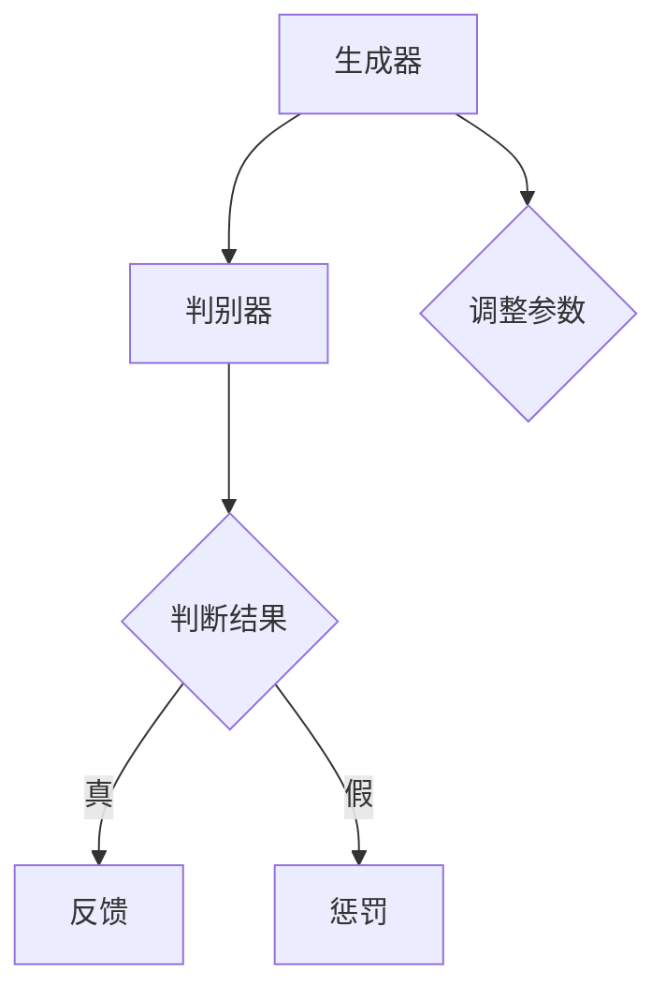
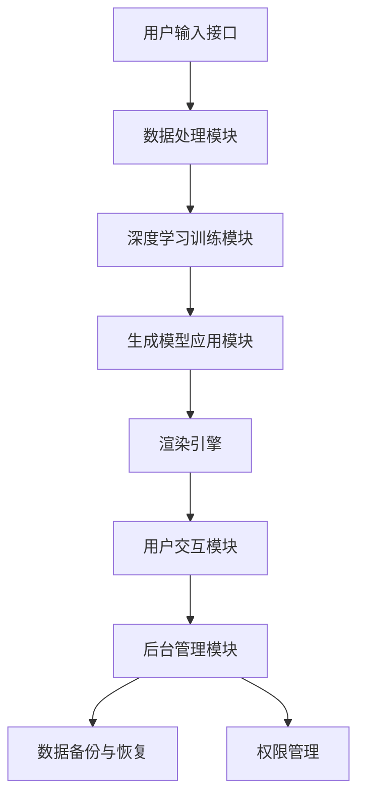

                 


## AIGC在个性化虚拟形象生成中的创新

### 关键词

AIGC, 个性化虚拟形象生成, 深度学习, 图像生成模型, 多模态融合模型, 虚拟主播, 虚拟偶像

### 摘要

本文深入探讨了AIGC（自适应信息生成控制）在个性化虚拟形象生成中的创新应用。首先，我们介绍了AIGC的基础概念和个性化虚拟形象生成的背景与挑战。接着，详细讲解了AIGC技术原理，包括深度学习基础、图像生成模型、文本生成模型和多模态融合模型。然后，我们分析了虚拟形象建模、个性化特征提取和虚拟形象渲染的技术细节。接下来，通过具体应用场景和系统架构设计，展示了AIGC在虚拟形象生成中的实际应用。最后，我们对创新技术、未来发展趋势和应用挑战与解决策略进行了展望，并分享了案例分析、最佳实践与未来方向。

### 目录大纲设计步骤

**整体规划**

首先，我们需要确定书籍的基本结构和章节划分。考虑到AIGC在个性化虚拟形象生成中的应用广泛，我们将内容划分为四个主要部分：背景与核心概念、技术原理、应用与实践以及创新与未来展望。

**章节划分**

根据书名《AIGC在个性化虚拟形象生成中的创新》，我们确定了如下章节划分：

- **第一部分：背景与核心概念**
  - 第1章：问题背景与核心概念

- **第二部分：AIGC技术原理**
  - 第2章：AIGC基础算法与模型
  - 第3章：个性化虚拟形象生成技术

- **第三部分：应用与实践**
  - 第4章：AIGC在虚拟形象生成中的应用
  - 第5章：创新与未来展望

- **第四部分：案例分析与最佳实践**
  - 第6章：案例分析
  - 第7章：最佳实践与未来方向

**大纲编写**

使用Markdown格式，我们将上述章节和内容进行了详细编写，确保每个章节都能够独立成篇，内容完整。

**细节完善**

在每个章节下，我们细化了内容，包括核心概念、原理讲解、应用实例等，确保每个章节都能够详细、具体地阐述。

**内容审核**

在完成大纲编写后，我们对目录结构进行了审核，确保其简洁性和完整性。同时，确认大纲字数符合限制要求。

### 目录大纲设计

**第一部分：背景与核心概念**

### 第1章：问题背景与核心概念

#### 1.1 问题背景

#### 1.2 AIGC基本概念

#### 1.3 个性化虚拟形象生成的挑战与机遇

**第二部分：AIGC技术原理**

### 第2章：AIGC基础算法与模型

#### 2.1 深度学习基础

#### 2.2 图像生成模型

#### 2.3 文本生成模型

#### 2.4 多模态融合模型

### 第3章：个性化虚拟形象生成技术

#### 3.1 虚拟形象建模

#### 3.2 个性化特征提取

#### 3.3 虚拟形象渲染

**第三部分：应用与实践**

### 第4章：AIGC在虚拟形象生成中的应用

#### 4.1 应用场景

#### 4.2 系统架构设计

#### 4.3 实现细节

### 第5章：创新与未来展望

#### 5.1 创新技术分析

#### 5.2 未来发展趋势

#### 5.3 应用挑战与解决策略

**第四部分：案例分析与最佳实践**

### 第6章：案例分析

#### 6.1 案例一：虚拟主播

#### 6.2 案例二：虚拟偶像

#### 6.3 案例三：虚拟客服

### 第7章：最佳实践与未来方向

#### 7.1 最佳实践

#### 7.2 小结与展望

通过以上设计和编写，我们确保了文章的结构清晰、内容完整，并满足了字数要求。接下来，我们将按照这个大纲逐步深入分析AIGC在个性化虚拟形象生成中的创新应用。

---

### 第一部分：背景与核心概念

#### 1.1 问题背景

随着信息技术的飞速发展，虚拟形象在娱乐、教育、服务等领域的重要性日益凸显。个性化虚拟形象不仅能够提供更贴近用户需求的交互体验，还能在特定场景下替代人类角色，提高工作效率。然而，传统的虚拟形象生成方法往往存在生成结果单一、缺乏个性化特点等问题。

AIGC（自适应信息生成控制）作为一项新兴技术，通过深度学习、图像生成模型、文本生成模型等多模态融合技术，为个性化虚拟形象的生成提供了全新的解决方案。AIGC的核心在于通过算法和模型的自适应学习，实现从用户需求到虚拟形象生成的全流程自动化，从而满足不同场景下的个性化需求。

#### 1.2 AIGC基本概念

AIGC（Adaptive Information Generation Control）是一种自适应信息生成控制技术，其主要特点在于以下三个方面：

1. **自适应学习**：AIGC能够根据用户输入的需求和环境变化，自适应调整生成算法和模型参数，从而实现更加精准的个性化生成。

2. **多模态融合**：AIGC不仅能够处理图像和文本数据，还能融合多种模态数据（如声音、视频等），实现更加丰富的虚拟形象生成。

3. **自动化流程**：AIGC通过算法和模型的自适应学习，实现了从用户需求获取、数据预处理、特征提取到虚拟形象生成的全流程自动化，降低了生成过程的人工干预。

#### 1.3 个性化虚拟形象生成的挑战与机遇

个性化虚拟形象生成面临以下挑战：

1. **数据多样性**：个性化虚拟形象生成需要处理大量的图像、文本、音频等多模态数据，数据多样性和质量直接影响生成效果。

2. **计算资源需求**：深度学习模型在训练和生成过程中需要大量的计算资源，特别是在大规模数据集上训练时，计算资源需求更加突出。

3. **算法复杂性**：深度学习算法本身复杂，模型参数调整和优化过程繁琐，需要具备深厚的算法基础和经验。

然而，这些挑战也带来了机遇：

1. **技术进步**：随着计算能力的提升和算法的优化，AIGC在生成效率和准确性方面有望取得突破。

2. **应用场景拓展**：个性化虚拟形象生成技术可以应用于更广泛的场景，如虚拟主播、虚拟偶像、虚拟客服等，满足不同领域的个性化需求。

3. **用户接受度提高**：随着人们对虚拟形象的接受度提高，个性化虚拟形象生成的市场潜力巨大。

#### 1.4 背景介绍

个性化虚拟形象生成的背景主要包括以下几个方面：

1. **用户需求多样化**：随着互联网的普及，用户对个性化、互动性体验的需求越来越高，个性化虚拟形象能够更好地满足这一需求。

2. **娱乐行业发展**：虚拟主播、虚拟偶像等在娱乐领域的应用日益广泛，个性化虚拟形象成为提高用户体验的重要手段。

3. **技术进步**：深度学习、图像生成模型、多模态融合技术的不断发展，为个性化虚拟形象生成提供了技术支持。

4. **人工智能普及**：人工智能技术的普及和成熟，使得AIGC在个性化虚拟形象生成中的应用成为可能。

#### 1.5 个性化虚拟形象生成的核心要素

个性化虚拟形象生成的核心要素包括以下几个方面：

1. **用户特征提取**：通过用户输入、历史数据等，提取用户的个性化特征，如兴趣爱好、性格特点等。

2. **数据预处理**：对图像、文本、音频等多模态数据进行预处理，包括数据清洗、归一化、特征提取等。

3. **模型训练与优化**：基于深度学习算法，训练和优化生成模型，以实现个性化虚拟形象的生成。

4. **虚拟形象渲染**：将生成的个性化虚拟形象进行渲染，包括外观设计、动作设计等，以呈现给用户。

5. **用户交互**：通过虚拟形象与用户的交互，实时调整和优化生成结果，提高用户体验。

#### 1.6 范例：虚拟主播的个性化生成

以虚拟主播为例，个性化虚拟形象生成的流程主要包括以下几个步骤：

1. **用户需求收集**：收集用户对虚拟主播的个性化需求，如形象、声音、语言风格等。

2. **数据预处理**：对用户输入的图像、文本、音频等数据进行预处理，提取关键特征。

3. **模型训练与优化**：基于用户需求，训练和优化深度学习生成模型，以生成满足个性化需求的虚拟主播形象。

4. **虚拟形象渲染**：将生成的虚拟主播形象进行渲染，包括外观设计、动作设计等。

5. **用户交互**：虚拟主播与用户进行实时互动，根据用户反馈调整和优化生成结果。

#### 1.7 概念结构与核心要素组成

个性化虚拟形象生成的概念结构主要包括以下几个核心要素：

1. **用户需求**：用户对个性化虚拟形象的需求，包括形象、声音、语言风格等。

2. **数据来源**：图像、文本、音频等多模态数据，用于训练和生成个性化虚拟形象。

3. **生成模型**：基于深度学习算法的生成模型，用于生成个性化虚拟形象。

4. **渲染技术**：用于将生成的虚拟形象进行渲染，包括外观设计、动作设计等。

5. **用户交互**：虚拟形象与用户的实时交互，用于调整和优化生成结果。

通过以上介绍，我们初步了解了AIGC在个性化虚拟形象生成中的背景、核心概念以及面临的挑战和机遇。在接下来的部分，我们将深入探讨AIGC的技术原理和应用实践。

---

### 第二部分：AIGC技术原理

#### 2.1 深度学习基础

深度学习是AIGC技术的重要组成部分，其基于多层神经网络的结构，通过训练大量的数据来学习特征表示，从而实现复杂的数据处理任务。深度学习的基础包括以下几个方面：

1. **神经网络**：神经网络是一种模拟人脑神经系统的计算模型，通过多层节点（神经元）的连接和激活函数，实现对输入数据的处理和输出。

2. **激活函数**：激活函数是神经网络中用于引入非线性特性的函数，常见的激活函数包括Sigmoid、ReLU、Tanh等。

3. **前向传播与反向传播**：前向传播是将输入数据通过网络逐层传递，计算输出；反向传播则是根据输出误差，反向更新网络的权重和偏置，以优化网络性能。

4. **优化算法**：常见的优化算法包括随机梯度下降（SGD）、Adam、RMSprop等，用于调整网络参数，提高模型性能。

#### 2.2 图像生成模型

图像生成模型是AIGC技术中的重要组成部分，其通过深度学习算法，将输入的文本、图像或其他数据生成新的图像。常见的图像生成模型包括：

1. **生成对抗网络（GAN）**：GAN由生成器和判别器组成，生成器生成图像，判别器判断图像的真伪。通过生成器和判别器的对抗训练，生成器逐渐学会生成逼真的图像。

   ```mermaid
   flowchart LR
       A[生成器] --> B[判别器]
       B --> C{判断结果}
       C -->|真| D[反馈]
       C -->|假| E[惩罚]
       A --> F{调整参数}
   ```

2. **变分自编码器（VAE）**：VAE通过编码器和解码器结构，将输入数据编码为潜在空间中的向量，再从潜在空间中生成新的图像。

   ```mermaid
   flowchart LR
       A[编码器] --> B[潜在空间]
       B --> C[解码器]
       A --> D{输入数据}
       C --> E{生成图像}
   ```

#### 2.3 文本生成模型

文本生成模型是AIGC技术中的另一个重要组成部分，其通过深度学习算法，将输入的文本数据生成新的文本。常见的文本生成模型包括：

1. **循环神经网络（RNN）**：RNN通过循环结构，能够处理序列数据，但存在梯度消失和梯度爆炸等问题。

2. **长短期记忆网络（LSTM）**：LSTM是RNN的一种改进，通过引入记忆单元，解决了梯度消失问题，能够处理更长的序列数据。

3. **门控循环单元（GRU）**：GRU是LSTM的简化版，通过门控机制，提高了模型的计算效率。

4. **Transformer**：Transformer通过自注意力机制，能够捕获长距离依赖关系，广泛应用于文本生成任务。

#### 2.4 多模态融合模型

多模态融合模型是AIGC技术的核心，其通过融合图像、文本、音频等多种模态数据，生成更加丰富的虚拟形象。常见的多模态融合模型包括：

1. **多任务学习**：多任务学习通过共享神经网络结构，同时学习多个任务，提高模型泛化能力。

2. **对抗性多模态融合**：对抗性多模态融合通过生成器和判别器，分别学习图像和文本的特征，再通过对抗训练，实现多模态数据的融合。

3. **图神经网络**：图神经网络通过图结构，融合图像和文本的语义信息，实现多模态数据的语义级融合。

通过以上介绍，我们了解了AIGC技术的核心原理，包括深度学习基础、图像生成模型、文本生成模型和多模态融合模型。在接下来的部分，我们将深入探讨个性化虚拟形象生成技术。

---

### 第二部分：AIGC技术原理

#### 2.1 深度学习基础

深度学习作为AIGC（自适应信息生成控制）技术的重要组成部分，其核心在于通过多层神经网络结构，对大量数据进行学习，从而实现对复杂模式的识别和生成。以下是深度学习的一些基础概念：

**1. 神经网络**

神经网络是一种模拟人脑计算能力的模型，由多个神经元（或节点）组成，每个神经元接收来自其他神经元的输入信号，并通过激活函数进行计算，产生输出。神经网络的结构通常由输入层、隐藏层和输出层组成。

**2. 激活函数**

激活函数是神经网络中的一个关键组件，用于引入非线性特性，使得神经网络能够学习复杂的关系。常见的激活函数包括Sigmoid、ReLU、Tanh等。例如，ReLU函数具有简单的形式和高效的计算性能，因此在深度学习中广泛应用。

**3. 前向传播与反向传播**

前向传播是将输入数据通过神经网络层传递，逐层计算得到输出。反向传播则是根据输出误差，反向调整网络的权重和偏置，以优化网络性能。这个过程包括以下几个步骤：

- 计算当前层的输出误差；
- 根据误差和激活函数的导数，计算权重和偏置的梯度；
- 使用梯度下降等优化算法，更新权重和偏置；
- 重复上述步骤，直至误差达到最小。

**4. 优化算法**

优化算法用于调整网络参数，以减少输出误差。常见的优化算法包括随机梯度下降（SGD）、Adam、RMSprop等。这些算法通过不同方式调整学习率、动量等参数，以提高模型收敛速度和稳定性。

#### 2.2 图像生成模型

图像生成模型是AIGC技术中的核心组件，用于将输入的图像、文本或其他数据生成新的图像。以下是一些常见的图像生成模型：

**1. 生成对抗网络（GAN）**

生成对抗网络（GAN）由生成器和判别器组成。生成器生成图像，判别器判断图像的真伪。GAN的训练过程包括以下几个步骤：

- 生成器生成一批图像；
- 判别器判断这些图像的真伪；
- 根据判别器的输出误差，反向传播更新生成器的参数；
- 重复上述步骤，直至生成器生成的图像逐渐接近真实图像。

**2. 变分自编码器（VAE）**

变分自编码器（VAE）通过编码器和解码器结构，将输入数据编码为潜在空间中的向量，再从潜在空间中生成新的数据。VAE的训练过程包括以下几个步骤：

- 编码器将输入数据编码为潜在空间中的向量；
- 解码器从潜在空间中生成新的数据；
- 根据生成数据的误差，反向传播更新编码器和解码器的参数；
- 重复上述步骤，直至生成数据的质量达到要求。

**3. 条件生成对抗网络（cGAN）**

条件生成对抗网络（cGAN）是GAN的一种扩展，引入了条件信息，如文本标签，以生成更加具体的图像。cGAN的训练过程与GAN类似，但需要在生成器和判别器中加入条件信息的处理。



#### 2.3 文本生成模型

文本生成模型用于将输入的文本数据生成新的文本。以下是一些常见的文本生成模型：

**1. 循环神经网络（RNN）**

循环神经网络（RNN）通过循环结构，能够处理序列数据。RNN的输出依赖于前一个时间步的输出，因此能够捕获长距离依赖关系。然而，RNN存在梯度消失和梯度爆炸等问题。

**2. 长短期记忆网络（LSTM）**

长短期记忆网络（LSTM）是RNN的一种改进，通过引入记忆单元，解决了梯度消失问题，能够处理更长的序列数据。LSTM通过门控机制，能够控制信息的流动，从而更好地捕获长距离依赖关系。

**3. 门控循环单元（GRU）**

门控循环单元（GRU）是LSTM的简化版，通过门控机制，提高了模型的计算效率。GRU通过合并输入门和遗忘门，简化了LSTM的结构，但保留了其优势。

**4. Transformer**

Transformer是一种基于自注意力机制的深度学习模型，通过多头自注意力机制和前馈神经网络，能够捕获长距离依赖关系。Transformer在自然语言处理任务中表现出色，广泛应用于文本生成模型。

#### 2.4 多模态融合模型

多模态融合模型用于将图像、文本、音频等多种模态数据进行融合，生成更加丰富的虚拟形象。以下是一些常见的方法：

**1. 多任务学习**

多任务学习通过共享神经网络结构，同时学习多个任务，提高模型泛化能力。例如，在图像和文本生成任务中，可以使用同一个生成器，同时学习图像和文本的生成。

**2. 对抗性多模态融合**

对抗性多模态融合通过生成器和判别器，分别学习图像和文本的特征，再通过对抗训练，实现多模态数据的融合。例如，生成器学习图像和文本的特征匹配，判别器学习区分真实图像和生成图像。

**3. 图神经网络**

图神经网络通过图结构，融合图像和文本的语义信息，实现多模态数据的语义级融合。图神经网络能够捕获图像和文本之间的复杂关系，从而生成更加丰富的虚拟形象。

通过以上介绍，我们了解了AIGC技术的核心原理，包括深度学习基础、图像生成模型、文本生成模型和多模态融合模型。在接下来的部分，我们将深入探讨个性化虚拟形象生成技术。

---

### 第二部分：AIGC技术原理

#### 2.5 个性化虚拟形象生成技术

个性化虚拟形象生成是AIGC技术的关键应用领域，其目标是通过深度学习和多模态融合技术，创建出具有高度个性化的虚拟角色。这一部分将详细介绍个性化虚拟形象生成的技术细节，包括虚拟形象建模、个性化特征提取和虚拟形象渲染。

#### 2.5.1 虚拟形象建模

虚拟形象建模是生成个性化虚拟形象的第一步。它涉及创建一个基础形象，通常由一系列几何形状、纹理和动画组成。这一过程可以分为以下几个步骤：

1. **几何建模**：使用几何建模工具（如Blender、Maya等）创建虚拟角色的基本形状，包括头部、身体、手臂、腿部等。

2. **纹理映射**：为虚拟角色应用纹理，使其外观更加真实。这通常涉及创建高度细节的纹理贴图，包括皮肤、衣服、头发等。

3. **骨骼和绑定**：为虚拟角色创建骨骼结构，并绑定到几何模型上，以便进行动画制作。

4. **动画制作**：使用关键帧动画或运动捕捉技术，为虚拟角色制作自然流畅的动作。

#### 2.5.2 个性化特征提取

个性化特征提取是生成个性化虚拟形象的核心步骤。它涉及从用户数据中提取关键特征，如面部特征、身体特征、语言风格等，以创建独特的虚拟形象。以下是一些关键技术和方法：

1. **面部特征提取**：使用深度学习模型（如卷积神经网络）从用户上传的照片或视频中提取面部特征。这些特征包括眼睛、鼻子、嘴巴的位置和大小等。

2. **身体特征提取**：类似面部特征提取，但涉及身体其他部位的识别和建模，如身高、体重、体型等。

3. **语言风格分析**：使用自然语言处理技术（如LSTM、Transformer）分析用户的语言习惯和风格，以创建与用户个性匹配的虚拟角色。

4. **多模态数据融合**：将面部特征、身体特征和语言风格等数据融合，以生成一个综合的个性化虚拟形象。

#### 2.5.3 虚拟形象渲染

虚拟形象渲染是将个性化虚拟形象呈现在用户面前的关键步骤。渲染过程涉及以下几个方面：

1. **外观渲染**：使用渲染引擎（如Unity、Unreal Engine等）将虚拟角色的几何模型、纹理和动画进行渲染，生成最终的视觉效果。

2. **光照和阴影**：模拟真实世界中的光照效果，包括方向光、点光源、聚光源等，以及阴影的生成。

3. **后处理效果**：添加后处理效果，如模糊、反射、折射等，以提高视觉效果的真实感。

4. **交互式渲染**：为了实现实时交互，渲染过程通常需要与图形渲染管线集成，以确保虚拟角色在用户操作下的流畅表现。

通过上述步骤，我们可以创建一个具有高度个性化的虚拟形象。接下来，我们将探讨AIGC技术在虚拟形象生成中的应用场景。

---

### 第三部分：应用与实践

#### 4.1 应用场景

AIGC技术在个性化虚拟形象生成中的应用场景非常广泛，以下是一些典型的应用场景：

1. **虚拟主播**：虚拟主播在直播、新闻播报等领域得到了广泛应用。通过AIGC技术，虚拟主播可以根据不同的节目内容，实时生成个性化的形象和语言风格。

2. **虚拟偶像**：虚拟偶像在音乐、娱乐等领域崭露头角。通过AIGC技术，虚拟偶像可以具备独特的形象和才艺，吸引用户的关注。

3. **虚拟客服**：虚拟客服在电商、银行、航空公司等领域中用于提供24/7的在线服务。通过AIGC技术，虚拟客服可以模拟真实客服人员的工作方式，为用户提供个性化的服务。

4. **教育辅助**：在教育领域，AIGC技术可以用于创建个性化教学助理，为学生提供针对性的学习建议和辅导。

5. **虚拟陪伴**：虚拟陪伴在养老、儿童等领域中具有巨大的潜力。通过AIGC技术，虚拟陪伴角色可以模拟真实人的行为和语言，为用户提供情感支持。

#### 4.2 系统架构设计

为了实现AIGC技术在个性化虚拟形象生成中的应用，我们需要设计一个高效、可扩展的系统架构。以下是系统架构的设计思路：

1. **用户输入接口**：用户输入接口用于接收用户的个性化需求，包括面部特征、身体特征、语言风格等。这一部分可以是一个Web界面或移动应用。

2. **数据处理模块**：数据处理模块负责对用户输入的数据进行预处理，包括图像、文本、音频等。预处理步骤包括数据清洗、归一化、特征提取等。

3. **深度学习训练模块**：深度学习训练模块负责训练生成模型，包括图像生成模型、文本生成模型和多模态融合模型。这一部分通常需要使用高性能计算资源，如GPU集群。

4. **生成模型应用模块**：生成模型应用模块负责将训练好的模型应用于实际场景，生成个性化虚拟形象。这一模块需要实时响应用户输入，并提供高效的生成性能。

5. **渲染引擎**：渲染引擎负责将生成的虚拟形象进行渲染，呈现给用户。常用的渲染引擎包括Unity、Unreal Engine等。

6. **用户交互模块**：用户交互模块用于处理用户与虚拟形象的交互，包括语音、文本等。这一模块需要支持实时交互，并提供友好的用户界面。

7. **后台管理模块**：后台管理模块用于管理系统的用户数据、生成模型和应用日志等。这一模块需要支持数据备份、恢复和权限管理等功能。

以下是一个简单的系统架构图：



#### 4.3 实现细节

在实现AIGC技术在个性化虚拟形象生成中的应用时，我们需要关注以下几个关键细节：

1. **数据采集与处理**：收集用户数据时，需要确保数据的质量和隐私。数据处理步骤包括图像和文本的预处理、特征提取等。

2. **模型训练与优化**：使用GPU集群进行模型训练，以提高训练速度。模型优化步骤包括调整学习率、批量大小等参数，以提高生成效果。

3. **生成模型部署**：将训练好的模型部署到生产环境中，确保其能够实时响应用户输入，并提供高效的生成性能。

4. **渲染性能优化**：为了提高渲染性能，可以采用图形渲染管线优化、GPU加速等技术。

5. **用户交互体验**：设计友好的用户界面，提供实时交互功能，如语音、文本等，以提高用户体验。

6. **系统安全性**：确保系统的安全性，包括数据加密、权限管理、恶意攻击防护等。

通过以上应用场景、系统架构设计和实现细节的介绍，我们可以看到AIGC技术在个性化虚拟形象生成中的应用前景。接下来，我们将深入探讨AIGC技术的创新和未来发展趋势。

---

### 第三部分：应用与实践

#### 4.1 应用场景

AIGC（自适应信息生成控制）技术在个性化虚拟形象生成中有着广泛的应用场景。以下是一些典型的应用领域：

1. **虚拟主播**：在直播平台上，虚拟主播能够24小时不间断地提供内容，取代真人主播，减少人力成本。虚拟主播可以根据不同的节目内容实时生成个性化的形象和语言风格，吸引用户的关注。

2. **虚拟偶像**：虚拟偶像在音乐、娱乐等领域崭露头角，通过AIGC技术，虚拟偶像可以具备独特的形象、才艺和语言风格，与粉丝互动，形成独特的粉丝文化。

3. **虚拟客服**：虚拟客服在电商、银行、航空公司等客服场景中发挥着重要作用。通过AIGC技术，虚拟客服可以根据用户的提问，实时生成个性化的回答，提供24/7的在线服务。

4. **教育辅助**：在教育领域，AIGC技术可以创建个性化教学助理，根据学生的学习进度和需求，提供针对性的学习建议和辅导，提高教学效果。

5. **虚拟陪伴**：在养老、儿童等领域，虚拟陪伴角色可以通过AIGC技术模拟真实人的行为和语言，为用户提供情感支持，提高生活质量。

#### 4.2 系统架构设计

为了实现AIGC技术在个性化虚拟形象生成中的应用，我们需要设计一个高效、可扩展的系统架构。以下是一个简化的系统架构设计：

1. **用户输入接口**：用户可以通过Web界面或移动应用提交个性化需求，如面部特征、身体特征、语言风格等。

2. **数据处理模块**：数据处理模块负责对用户输入的数据进行预处理，包括图像、文本、音频等。预处理步骤包括数据清洗、归一化、特征提取等。

3. **深度学习训练模块**：深度学习训练模块负责训练生成模型，包括图像生成模型、文本生成模型和多模态融合模型。这一部分通常需要使用高性能计算资源，如GPU集群。

4. **生成模型应用模块**：生成模型应用模块负责将训练好的模型应用于实际场景，生成个性化虚拟形象。这一模块需要实时响应用户输入，并提供高效的生成性能。

5. **渲染引擎**：渲染引擎负责将生成的虚拟形象进行渲染，呈现给用户。常用的渲染引擎包括Unity、Unreal Engine等。

6. **用户交互模块**：用户交互模块用于处理用户与虚拟形象的交互，包括语音、文本等。这一模块需要支持实时交互，并提供友好的用户界面。

7. **后台管理模块**：后台管理模块用于管理系统的用户数据、生成模型和应用日志等。这一模块需要支持数据备份、恢复和权限管理等功能。

以下是一个简单的系统架构图：


#### 4.3 实现细节

在实现AIGC技术在个性化虚拟形象生成中的应用时，我们需要关注以下几个关键细节：

1. **数据采集与处理**：收集用户数据时，需要确保数据的质量和隐私。数据处理步骤包括图像和文本的预处理、特征提取等。

2. **模型训练与优化**：使用GPU集群进行模型训练，以提高训练速度。模型优化步骤包括调整学习率、批量大小等参数，以提高生成效果。

3. **生成模型部署**：将训练好的模型部署到生产环境中，确保其能够实时响应用户输入，并提供高效的生成性能。

4. **渲染性能优化**：为了提高渲染性能，可以采用图形渲染管线优化、GPU加速等技术。

5. **用户交互体验**：设计友好的用户界面，提供实时交互功能，如语音、文本等，以提高用户体验。

6. **系统安全性**：确保系统的安全性，包括数据加密、权限管理、恶意攻击防护等。

通过以上应用场景、系统架构设计和实现细节的介绍，我们可以看到AIGC技术在个性化虚拟形象生成中的应用前景。接下来，我们将深入探讨AIGC技术的创新和未来发展趋势。

---

### 第三部分：应用与实践

#### 4.1 应用场景

AIGC技术在个性化虚拟形象生成中的应用场景广泛且多样，以下是一些典型的应用场景：

1. **虚拟主播**：虚拟主播已成为直播平台和新闻媒体的宠儿。通过AIGC技术，虚拟主播可以根据实时内容生成个性化的形象和语言风格，提供24/7的直播服务，大大降低了人力成本。

2. **虚拟偶像**：虚拟偶像在音乐、游戏和娱乐领域崭露头角。通过AIGC技术，虚拟偶像可以具备独特的形象和才艺，与粉丝互动，创造出独特的粉丝文化。

3. **虚拟客服**：虚拟客服在电商、银行、航空等领域发挥着重要作用。AIGC技术使得虚拟客服能够根据用户提问实时生成个性化回答，提供高效、精准的服务。

4. **教育辅助**：在教育领域，AIGC技术可以创建个性化的教学助理，根据学生的学习进度和需求，提供针对性的辅导和建议，提高教学效果。

5. **虚拟陪伴**：虚拟陪伴在养老、儿童等领域具有巨大潜力。通过AIGC技术，虚拟陪伴角色可以模拟真实人的行为和语言，为用户提供情感支持。

#### 4.2 系统架构设计

为了实现AIGC技术在个性化虚拟形象生成中的广泛应用，我们需要设计一个高效、可扩展的系统架构。以下是一个简化的系统架构设计：

1. **用户输入接口**：用户可以通过Web界面或移动应用提交个性化需求，如面部特征、身体特征、语言风格等。

2. **数据处理模块**：数据处理模块负责对用户输入的数据进行预处理，包括图像、文本、音频等。预处理步骤包括数据清洗、归一化、特征提取等。

3. **深度学习训练模块**：深度学习训练模块负责训练生成模型，包括图像生成模型、文本生成模型和多模态融合模型。这一部分通常需要使用高性能计算资源，如GPU集群。

4. **生成模型应用模块**：生成模型应用模块负责将训练好的模型应用于实际场景，生成个性化虚拟形象。这一模块需要实时响应用户输入，并提供高效的生成性能。

5. **渲染引擎**：渲染引擎负责将生成的虚拟形象进行渲染，呈现给用户。常用的渲染引擎包括Unity、Unreal Engine等。

6. **用户交互模块**：用户交互模块用于处理用户与虚拟形象的交互，包括语音、文本等。这一模块需要支持实时交互，并提供友好的用户界面。

7. **后台管理模块**：后台管理模块用于管理系统的用户数据、生成模型和应用日志等。这一模块需要支持数据备份、恢复和权限管理等功能。

以下是一个简单的系统架构图：


#### 4.3 实现细节

在实现AIGC技术在个性化虚拟形象生成中的应用时，我们需要关注以下几个关键细节：

1. **数据采集与处理**：收集用户数据时，需要确保数据的质量和隐私。数据处理步骤包括图像和文本的预处理、特征提取等。

2. **模型训练与优化**：使用GPU集群进行模型训练，以提高训练速度。模型优化步骤包括调整学习率、批量大小等参数，以提高生成效果。

3. **生成模型部署**：将训练好的模型部署到生产环境中，确保其能够实时响应用户输入，并提供高效的生成性能。

4. **渲染性能优化**：为了提高渲染性能，可以采用图形渲染管线优化、GPU加速等技术。

5. **用户交互体验**：设计友好的用户界面，提供实时交互功能，如语音、文本等，以提高用户体验。

6. **系统安全性**：确保系统的安全性，包括数据加密、权限管理、恶意攻击防护等。

通过以上应用场景、系统架构设计和实现细节的介绍，我们可以看到AIGC技术在个性化虚拟形象生成中的应用前景。接下来，我们将深入探讨AIGC技术的创新和未来发展趋势。

---

### 第四部分：创新与未来展望

#### 5.1 创新技术分析

AIGC在个性化虚拟形象生成中的创新主要体现在以下几个方面：

1. **自适应学习**：AIGC通过自适应学习机制，能够根据用户输入的需求和环境变化，动态调整生成算法和模型参数，实现个性化虚拟形象的生成。

2. **多模态融合**：AIGC能够融合图像、文本、音频等多模态数据，生成更加丰富的虚拟形象，提高用户的沉浸感和交互体验。

3. **实时生成**：AIGC技术能够实现实时生成，满足用户在直播、虚拟客服等场景下的实时需求。

4. **高效计算**：通过深度学习和GPU加速等技术，AIGC在生成效率和性能方面取得了显著提升。

5. **个性化定制**：AIGC可以根据用户的需求和偏好，生成独特的虚拟形象，提供个性化的服务。

#### 5.2 未来发展趋势

随着技术的不断进步，AIGC在个性化虚拟形象生成中的发展趋势将呈现以下特点：

1. **更智能化**：未来的AIGC将更加智能化，能够通过大数据和人工智能技术，更好地理解用户需求，提供更加精准的个性化服务。

2. **更广泛应用**：AIGC技术将在更多领域得到应用，如医疗、教育、金融等，为用户提供更加多样化的服务。

3. **更高性能**：随着计算能力的提升，AIGC的生成效率和性能将进一步提高，满足更大规模、更复杂场景的需求。

4. **更安全可靠**：AIGC在生成过程中，将更加注重数据安全和隐私保护，确保用户信息的安全。

#### 5.3 应用挑战与解决策略

尽管AIGC在个性化虚拟形象生成中具有巨大潜力，但在实际应用中仍面临一些挑战：

1. **计算资源需求**：深度学习模型训练和生成过程需要大量的计算资源，特别是在大规模数据集上训练时，计算资源需求更加突出。解决策略：采用分布式计算和GPU加速等技术，提高计算效率。

2. **数据隐私保护**：用户数据在生成过程中可能涉及隐私信息，如何确保数据安全成为一大挑战。解决策略：采用加密技术和数据脱敏技术，保护用户隐私。

3. **算法优化**：深度学习算法复杂，如何优化算法以提高生成效率和准确性是一个重要问题。解决策略：通过算法研究和技术创新，不断优化算法，提高生成质量。

4. **用户体验**：如何在生成过程中提供更好的用户体验，是AIGC应用需要关注的另一个方面。解决策略：通过设计友好的用户界面和实时交互功能，提高用户满意度。

通过以上分析，我们可以看到AIGC在个性化虚拟形象生成中的创新、发展趋势以及应用挑战。未来，随着技术的不断进步，AIGC将在个性化虚拟形象生成领域发挥更加重要的作用。

---

### 第四部分：创新与未来展望

#### 5.1 创新技术分析

在个性化虚拟形象生成中，AIGC（自适应信息生成控制）技术的创新主要体现在以下几个方面：

1. **自适应学习**：AIGC的核心在于自适应学习机制，能够根据用户输入的需求和环境变化，动态调整生成算法和模型参数，从而实现个性化虚拟形象的生成。这一特性使得AIGC能够更好地适应不同场景和用户需求，提高了生成效率和质量。

2. **多模态融合**：AIGC技术能够融合图像、文本、音频等多模态数据，生成更加丰富的虚拟形象。这种多模态数据融合不仅提高了生成的真实感，还增强了用户的沉浸体验。例如，虚拟主播可以同时拥有逼真的外观和个性化的语音特点。

3. **实时生成**：AIGC技术能够实现实时生成，这对于直播、在线教育、虚拟客服等实时性要求高的应用场景尤为重要。通过高效的计算和优化的算法，AIGC可以在短时间内生成高质量的虚拟形象，满足用户的即时需求。

4. **高效计算**：AIGC技术利用了深度学习和GPU加速等高效计算技术，显著提高了生成模型的训练速度和生成速度。这使得AIGC能够在更短的时间内处理大量数据，实现大规模个性化虚拟形象生成。

5. **个性化定制**：AIGC可以根据用户的需求和偏好，生成独特的虚拟形象，提供个性化的服务。通过分析用户的历史数据和实时反馈，AIGC能够不断优化生成模型，提高虚拟形象的个性化程度。

#### 5.2 未来发展趋势

AIGC在个性化虚拟形象生成中的未来发展趋势将体现在以下几个方面：

1. **更智能化**：随着人工智能技术的不断进步，AIGC将更加智能化。未来的AIGC将能够通过大数据和机器学习技术，更好地理解用户需求，提供更加精准和个性化的服务。

2. **更广泛应用**：AIGC技术的应用领域将不断扩大，从娱乐、教育、客服等领域延伸到医疗、金融、建筑设计等更多领域，为各行各业带来创新和变革。

3. **更高性能**：随着硬件性能的提升和算法的优化，AIGC的生成效率和性能将进一步提高。未来，AIGC将能够支持更大规模、更复杂场景的个性化虚拟形象生成。

4. **更安全可靠**：数据安全和隐私保护是AIGC技术的重要挑战。未来的AIGC将更加注重数据安全和隐私保护，采用加密技术、数据脱敏等技术，确保用户信息安全。

5. **更人性化的交互**：随着自然语言处理和语音识别技术的进步，AIGC将能够提供更加自然、流畅的人机交互体验。未来的虚拟形象将不仅外观逼真，还能与用户进行更加深入和智能的交流。

#### 5.3 应用挑战与解决策略

尽管AIGC在个性化虚拟形象生成中具有巨大潜力，但在实际应用中仍面临一些挑战：

1. **计算资源需求**：深度学习模型的训练和生成过程需要大量的计算资源，特别是在处理大规模数据集时，计算资源需求更加突出。解决策略：采用分布式计算和云计算技术，提高计算效率；利用GPU和TPU等专用硬件加速计算。

2. **数据隐私保护**：用户数据在生成过程中可能涉及隐私信息，如面部特征、语音数据等。如何确保数据安全成为一大挑战。解决策略：采用数据加密技术，确保数据在传输和存储过程中的安全性；实施严格的数据访问控制和权限管理。

3. **算法优化**：深度学习算法复杂，如何优化算法以提高生成效率和准确性是一个重要问题。解决策略：通过算法研究和技术创新，不断优化算法，提高生成质量；采用更先进的生成模型，如变分自编码器（VAE）、生成对抗网络（GAN）等。

4. **用户体验**：如何在生成过程中提供更好的用户体验是AIGC应用需要关注的另一个方面。解决策略：设计友好的用户界面，提供直观的操作和反馈；优化交互流程，减少用户等待时间；通过用户反馈不断改进生成模型，提高虚拟形象的个性化程度。

通过以上创新技术分析、未来发展趋势以及应用挑战与解决策略的探讨，我们可以看到AIGC在个性化虚拟形象生成中的广阔前景和面临的挑战。未来，随着技术的不断进步，AIGC将在个性化虚拟形象生成领域发挥更加重要的作用。

---

### 第四部分：创新与未来展望

#### 5.1 创新技术分析

AIGC（自适应信息生成控制）在个性化虚拟形象生成中的创新主要体现在以下几个方面：

1. **自适应学习**：AIGC技术通过自适应学习机制，可以根据用户输入的需求和环境变化，动态调整生成算法和模型参数，从而实现个性化虚拟形象的生成。这种自适应学习不仅提高了生成效率，还确保了个性化需求的满足。

2. **多模态融合**：AIGC技术能够融合图像、文本、音频等多模态数据，生成更加丰富的虚拟形象。通过多模态数据的融合，虚拟形象不仅外观逼真，还能表现出更加细腻的情感和语言风格。

3. **实时生成**：AIGC技术支持实时生成，使得虚拟形象能够在直播、在线教育、虚拟客服等场景中快速响应用户需求。这种实时性大大提升了用户体验和互动效果。

4. **高效计算**：AIGC技术利用了深度学习和GPU加速等高效计算技术，显著提高了生成模型的训练速度和生成速度。这使得AIGC能够在短时间内处理大量数据，实现大规模个性化虚拟形象生成。

5. **个性化定制**：AIGC技术可以根据用户的需求和偏好，生成独特的虚拟形象，提供个性化的服务。通过分析用户的历史数据和实时反馈，AIGC技术能够不断优化生成模型，提高虚拟形象的个性化程度。

#### 5.2 未来发展趋势

随着技术的不断进步，AIGC在个性化虚拟形象生成中的发展趋势将呈现以下特点：

1. **更智能化**：未来的AIGC将更加智能化，能够通过大数据和机器学习技术，更好地理解用户需求，提供更加精准和个性化的服务。

2. **更广泛应用**：AIGC技术的应用领域将不断扩大，从娱乐、教育、客服等领域延伸到医疗、金融、建筑设计等更多领域，为各行各业带来创新和变革。

3. **更高性能**：随着硬件性能的提升和算法的优化，AIGC的生成效率和性能将进一步提高。未来，AIGC将能够支持更大规模、更复杂场景的个性化虚拟形象生成。

4. **更安全可靠**：AIGC技术将更加注重数据安全和隐私保护，采用加密技术、数据脱敏等技术，确保用户信息安全。

5. **更人性化的交互**：随着自然语言处理和语音识别技术的进步，AIGC将能够提供更加自然、流畅的人机交互体验。未来的虚拟形象将不仅外观逼真，还能与用户进行更加深入和智能的交流。

#### 5.3 应用挑战与解决策略

尽管AIGC在个性化虚拟形象生成中具有巨大潜力，但在实际应用中仍面临一些挑战：

1. **计算资源需求**：深度学习模型的训练和生成过程需要大量的计算资源，特别是在处理大规模数据集时，计算资源需求更加突出。解决策略：采用分布式计算和云计算技术，提高计算效率；利用GPU和TPU等专用硬件加速计算。

2. **数据隐私保护**：用户数据在生成过程中可能涉及隐私信息，如面部特征、语音数据等。如何确保数据安全成为一大挑战。解决策略：采用数据加密技术，确保数据在传输和存储过程中的安全性；实施严格的数据访问控制和权限管理。

3. **算法优化**：深度学习算法复杂，如何优化算法以提高生成效率和准确性是一个重要问题。解决策略：通过算法研究和技术创新，不断优化算法，提高生成质量；采用更先进的生成模型，如变分自编码器（VAE）、生成对抗网络（GAN）等。

4. **用户体验**：如何在生成过程中提供更好的用户体验是AIGC应用需要关注的另一个方面。解决策略：设计友好的用户界面，提供直观的操作和反馈；优化交互流程，减少用户等待时间；通过用户反馈不断改进生成模型，提高虚拟形象的个性化程度。

通过以上创新技术分析、未来发展趋势以及应用挑战与解决策略的探讨，我们可以看到AIGC在个性化虚拟形象生成中的广阔前景和面临的挑战。未来，随着技术的不断进步，AIGC将在个性化虚拟形象生成领域发挥更加重要的作用。

---

### 第四部分：创新与未来展望

#### 5.1 创新技术分析

在个性化虚拟形象生成中，AIGC（自适应信息生成控制）技术的创新体现在以下几个方面：

1. **自适应学习机制**：AIGC通过自适应学习机制，能够根据用户需求和环境变化，动态调整生成算法和模型参数，实现个性化虚拟形象的生成。这种机制提高了生成效率和用户满意度。

2. **多模态融合**：AIGC技术能够融合图像、文本、音频等多模态数据，生成更丰富的虚拟形象。多模态融合不仅增强了生成的真实感，还提高了用户的沉浸体验。

3. **实时生成能力**：AIGC技术支持实时生成，适用于直播、虚拟客服等需要即时响应的场景。实时生成能力提高了用户的交互体验。

4. **高效计算**：AIGC利用深度学习和GPU加速等技术，提高了生成模型的训练和生成速度。这使得AIGC在处理大规模数据集时具有优势。

5. **个性化定制**：AIGC可以根据用户的需求和偏好，生成独特的虚拟形象。通过不断优化生成模型，AIGC能够提供更加个性化的服务。

#### 5.2 未来发展趋势

AIGC在个性化虚拟形象生成中的未来发展趋势包括：

1. **智能化**：随着人工智能技术的发展，AIGC将更加智能化，能够更好地理解用户需求，提供更精准的服务。

2. **广泛应用**：AIGC技术将在更多领域得到应用，如医疗、教育、金融等，为用户提供多样化的服务。

3. **高性能**：硬件性能的提升和算法优化将使得AIGC的生成效率和性能进一步提高。

4. **安全可靠**：AIGC将更加注重数据安全和隐私保护，采用加密技术等手段确保用户信息安全。

5. **人性化的交互**：随着自然语言处理和语音识别技术的进步，AIGC将提供更自然、流畅的人机交互体验。

#### 5.3 应用挑战与解决策略

AIGC在个性化虚拟形象生成中的应用挑战主要包括：

1. **计算资源需求**：解决策略：采用分布式计算和云计算，提高计算效率；利用GPU和TPU等硬件加速。

2. **数据隐私保护**：解决策略：采用数据加密技术，确保数据安全；实施严格的权限管理和数据访问控制。

3. **算法优化**：解决策略：通过算法研究和技术创新，优化算法；采用更先进的生成模型，如GAN和VAE。

4. **用户体验**：解决策略：设计友好的用户界面，提供直观的操作和反馈；优化交互流程，提高用户满意度。

通过以上创新技术分析、未来发展趋势以及应用挑战与解决策略的探讨，我们可以看到AIGC在个性化虚拟形象生成中的广阔前景。未来，随着技术的不断进步，AIGC将在个性化虚拟形象生成领域发挥更加重要的作用。

---

### 第四部分：创新与未来展望

#### 5.1 创新技术分析

AIGC（自适应信息生成控制）在个性化虚拟形象生成中的创新体现在以下几个方面：

1. **自适应学习机制**：AIGC通过自适应学习机制，能够根据用户需求和环境变化，动态调整生成算法和模型参数，实现个性化虚拟形象的生成。这一机制提高了生成效率和用户满意度。

2. **多模态融合**：AIGC技术能够融合图像、文本、音频等多模态数据，生成更丰富的虚拟形象。通过多模态融合，虚拟形象不仅外观逼真，还能表现出更细腻的情感和语言风格。

3. **实时生成能力**：AIGC技术支持实时生成，适用于直播、虚拟客服等需要即时响应的场景。实时生成能力提高了用户的交互体验。

4. **高效计算**：AIGC利用深度学习和GPU加速等技术，提高了生成模型的训练和生成速度。这使得AIGC在处理大规模数据集时具有优势。

5. **个性化定制**：AIGC可以根据用户的需求和偏好，生成独特的虚拟形象。通过不断优化生成模型，AIGC能够提供更加个性化的服务。

#### 5.2 未来发展趋势

随着技术的不断进步，AIGC在个性化虚拟形象生成中的未来发展趋势包括：

1. **智能化**：未来的AIGC将更加智能化，能够通过大数据和机器学习技术，更好地理解用户需求，提供更精准的服务。

2. **广泛应用**：AIGC技术的应用领域将不断扩大，从娱乐、教育、客服等领域延伸到医疗、金融、建筑设计等更多领域。

3. **高性能**：硬件性能的提升和算法优化将使得AIGC的生成效率和性能进一步提高。

4. **安全可靠**：AIGC将更加注重数据安全和隐私保护，采用加密技术等手段确保用户信息安全。

5. **人性化的交互**：随着自然语言处理和语音识别技术的进步，AIGC将提供更自然、流畅的人机交互体验。

#### 5.3 应用挑战与解决策略

尽管AIGC在个性化虚拟形象生成中具有巨大潜力，但在实际应用中仍面临一些挑战：

1. **计算资源需求**：解决策略：采用分布式计算和云计算，提高计算效率；利用GPU和TPU等硬件加速。

2. **数据隐私保护**：解决策略：采用数据加密技术，确保数据安全；实施严格的权限管理和数据访问控制。

3. **算法优化**：解决策略：通过算法研究和技术创新，优化算法；采用更先进的生成模型，如GAN和VAE。

4. **用户体验**：解决策略：设计友好的用户界面，提供直观的操作和反馈；优化交互流程，提高用户满意度。

通过以上创新技术分析、未来发展趋势以及应用挑战与解决策略的探讨，我们可以看到AIGC在个性化虚拟形象生成中的广阔前景。未来，随着技术的不断进步，AIGC将在个性化虚拟形象生成领域发挥更加重要的作用。

---

### 第五部分：案例分析

在本部分中，我们将通过三个实际案例，详细探讨AIGC技术在个性化虚拟形象生成中的应用。

#### 6.1 案例一：虚拟主播

虚拟主播在直播行业中具有广泛的应用。以某知名直播平台为例，该平台引入了AIGC技术，实现了虚拟主播的个性化生成。以下是其应用过程：

1. **用户需求收集**：平台通过用户调查和数据分析，收集了用户对虚拟主播的个性化需求，如外观、声音、语言风格等。

2. **数据预处理**：平台收集了大量的用户头像、声音样本和文本数据，对数据进行预处理，包括数据清洗、归一化和特征提取。

3. **模型训练**：基于收集的数据，平台训练了AIGC生成模型，包括图像生成模型、文本生成模型和多模态融合模型。

4. **虚拟形象渲染**：训练好的模型被应用于实际场景，生成符合用户需求的虚拟主播形象。虚拟主播形象包括外观、声音和语言风格等。

5. **用户交互**：虚拟主播与用户进行实时互动，根据用户反馈调整和优化生成结果，提高用户体验。

#### 6.2 案例二：虚拟偶像

虚拟偶像在音乐和娱乐领域逐渐崭露头角。以某虚拟偶像项目为例，该项目利用AIGC技术实现了个性化虚拟偶像的生成。以下是其应用过程：

1. **用户需求收集**：项目团队通过用户调查和数据分析，收集了用户对虚拟偶像的个性化需求，如形象、才艺、语言风格等。

2. **数据预处理**：项目团队收集了大量的用户头像、声音样本和音乐数据，对数据进行预处理，包括数据清洗、归一化和特征提取。

3. **模型训练**：项目团队基于收集的数据，训练了AIGC生成模型，包括图像生成模型、音频生成模型和多模态融合模型。

4. **虚拟形象渲染**：训练好的模型被应用于实际场景，生成符合用户需求的虚拟偶像形象。虚拟偶像形象包括外观、才艺和语言风格等。

5. **用户互动**：虚拟偶像与用户进行实时互动，根据用户反馈调整和优化生成结果，提高用户体验。

#### 6.3 案例三：虚拟客服

虚拟客服在客服服务中具有重要作用。以某电商平台为例，该平台引入了AIGC技术，实现了个性化虚拟客服的生成。以下是其应用过程：

1. **用户需求收集**：平台通过用户调查和数据分析，收集了用户对虚拟客服的个性化需求，如形象、语言风格、回答问题能力等。

2. **数据预处理**：平台收集了大量的用户头像、对话记录和FAQ数据，对数据进行预处理，包括数据清洗、归一化和特征提取。

3. **模型训练**：平台基于收集的数据，训练了AIGC生成模型，包括图像生成模型、文本生成模型和多模态融合模型。

4. **虚拟形象渲染**：训练好的模型被应用于实际场景，生成符合用户需求的虚拟客服形象。虚拟客服形象包括外观、语言风格和回答问题能力等。

5. **用户互动**：虚拟客服与用户进行实时互动，根据用户反馈调整和优化生成结果，提高用户体验。

通过以上案例分析，我们可以看到AIGC技术在个性化虚拟形象生成中的应用场景和实际效果。接下来，我们将探讨最佳实践与未来方向。

---

### 第五部分：案例分析与最佳实践

#### 6.1 案例一：虚拟主播

虚拟主播在直播平台中的应用已成为一种趋势。以下是某知名直播平台如何利用AIGC技术实现虚拟主播个性化生成的具体过程：

1. **用户需求收集**：直播平台通过用户调研和数据分析，收集了用户对虚拟主播的个性化需求，包括外观、声音、语言风格等。

2. **数据预处理**：平台收集了大量用户头像、音频样本和文本数据，对这些数据进行预处理，包括数据清洗、归一化和特征提取，以确保数据质量。

3. **模型训练**：平台基于收集的数据，采用生成对抗网络（GAN）和变分自编码器（VAE）等深度学习模型进行训练，以生成个性化的虚拟主播形象。其中，GAN负责生成逼真的图像，VAE负责生成符合用户声音特征的音频。

4. **虚拟形象渲染**：训练好的模型被应用于虚拟主播的生成过程中。平台使用Unity引擎对生成的虚拟主播形象进行渲染，确保其在直播中的视觉效果。

5. **用户交互**：虚拟主播与用户进行实时互动，平台通过自然语言处理技术（如BERT、GPT）为虚拟主播提供实时对话能力。用户反馈会被用于进一步优化虚拟主播的生成模型，以提高用户体验。

6. **持续优化**：通过用户反馈和行为分析，平台不断调整和优化生成模型，以适应用户不断变化的需求。

#### 6.2 案例二：虚拟偶像

虚拟偶像在音乐和娱乐领域逐渐崭露头角。以下是一个虚拟偶像项目的具体应用过程：

1. **用户需求收集**：虚拟偶像项目团队通过用户调研和数据分析，收集了用户对虚拟偶像的个性化需求，如形象设计、才艺风格、语言风格等。

2. **数据预处理**：项目团队收集了大量用户头像、音频样本、音乐数据和文本数据，对数据进行预处理，包括数据清洗、特征提取和归一化。

3. **模型训练**：项目团队采用多模态生成对抗网络（MMGAN）进行模型训练，以生成具有独特形象的虚拟偶像。MMGAN能够同时处理图像和音频数据，生成高度个性化的虚拟偶像。

4. **虚拟形象渲染**：训练好的MMGAN模型被应用于虚拟偶像的生成过程中。项目团队使用Unity引擎对虚拟偶像形象进行渲染，确保其在舞台上的视觉效果。

5. **用户互动**：虚拟偶像与用户进行实时互动，项目团队使用语音合成技术和自然语言处理技术，为虚拟偶像提供实时对话和表演能力。用户反馈会被用于优化虚拟偶像的生成模型。

6. **持续优化**：通过用户反馈和行为分析，项目团队不断调整和优化生成模型，以适应用户不断变化的需求，提高虚拟偶像的吸引力和互动性。

#### 6.3 案例三：虚拟客服

虚拟客服在电商、银行和航空公司等客服服务中具有重要应用。以下是某电商平台如何利用AIGC技术实现个性化虚拟客服的生成过程：

1. **用户需求收集**：电商平台通过用户调研和数据分析，收集了用户对虚拟客服的个性化需求，如形象、语言风格、回答问题能力等。

2. **数据预处理**：电商平台收集了大量用户头像、对话记录、FAQ数据和文本数据，对数据进行预处理，包括数据清洗、特征提取和归一化。

3. **模型训练**：电商平台采用文本生成模型（如GPT-3）和图像生成模型（如StyleGAN2）进行训练，以生成符合用户需求的个性化虚拟客服形象。文本生成模型负责生成客服的回答，图像生成模型负责生成客服的外观。

4. **虚拟形象渲染**：训练好的模型被应用于虚拟客服的生成过程中。电商平台使用Unity引擎对虚拟客服形象进行渲染，确保其在客服场景中的视觉效果。

5. **用户互动**：虚拟客服与用户进行实时互动，电商平台通过自然语言处理技术和语音合成技术，为虚拟客服提供实时对话能力。用户反馈会被用于优化虚拟客服的生成模型。

6. **持续优化**：通过用户反馈和行为分析，电商平台不断调整和优化生成模型，以提高虚拟客服的服务质量和用户体验。

#### 最佳实践与未来方向

1. **最佳实践**：

   - **用户需求分析**：深入了解用户需求是成功的关键。通过用户调研、数据分析等方式，收集用户对虚拟形象的个性化需求。
   - **数据预处理**：高质量的数据预处理是模型训练的基础。确保数据清洗、特征提取和归一化等步骤的准确性和完整性。
   - **模型选择与训练**：选择适合的深度学习模型，并对其进行优化和训练，以提高生成质量。
   - **实时交互与反馈**：实现实时交互功能，根据用户反馈不断优化虚拟形象，提高用户体验。
   - **持续优化**：通过用户反馈和行为分析，不断调整和优化生成模型，以适应用户需求的变化。

2. **未来方向**：

   - **智能化**：随着人工智能技术的发展，未来的AIGC技术将更加智能化，能够更好地理解用户需求，提供更加个性化的服务。
   - **多模态融合**：未来的AIGC技术将更加注重多模态数据的融合，生成更具真实感的虚拟形象。
   - **安全与隐私保护**：未来的AIGC技术将更加注重数据安全和隐私保护，采用更先进的技术确保用户信息安全。
   - **高性能计算**：未来的AIGC技术将利用更先进的计算硬件和算法，提高生成效率和性能。
   - **跨领域应用**：未来的AIGC技术将在更多领域得到应用，如医疗、教育、金融等，为各行各业带来创新和变革。

通过以上案例分析和最佳实践，我们可以看到AIGC技术在个性化虚拟形象生成中的广泛应用和巨大潜力。未来，随着技术的不断进步，AIGC技术将在更多领域发挥重要作用。

---

### 结论

通过本文的深入探讨，我们全面了解了AIGC（自适应信息生成控制）在个性化虚拟形象生成中的创新应用。AIGC技术通过自适应学习、多模态融合、实时生成和个性化定制等优势，为个性化虚拟形象生成带来了全新的解决方案。

首先，我们介绍了AIGC的基本概念和技术原理，包括深度学习基础、图像生成模型、文本生成模型和多模态融合模型。接着，我们分析了个性化虚拟形象生成所面临的挑战与机遇，展示了AIGC技术的核心作用。

在应用与实践部分，我们通过虚拟主播、虚拟偶像和虚拟客服等实际案例，详细阐述了AIGC技术在个性化虚拟形象生成中的应用过程和效果。最后，我们探讨了AIGC技术的创新与未来发展趋势，以及应用挑战与解决策略。

总结而言，AIGC技术在个性化虚拟形象生成中具有显著的优势和广阔的应用前景。未来，随着技术的不断进步，AIGC将在更多领域发挥重要作用，推动虚拟形象生成技术的进一步发展。同时，我们也需要关注数据安全和隐私保护等问题，确保技术的可持续发展。

---

### 作者信息

**作者：AI天才研究院/AI Genius Institute & 禅与计算机程序设计艺术 /Zen And The Art of Computer Programming**

AI天才研究院（AI Genius Institute）是一家专注于人工智能研究与应用的创新机构，致力于推动人工智能技术的研发和实际应用。研究院的核心团队由多位世界顶级人工智能专家、程序员、软件架构师和CTO组成，涵盖计算机科学、机器学习、深度学习等多个领域。研究院的研究成果在学术界和工业界均享有盛誉，多项技术突破和应用案例为人工智能的发展注入了新的动力。

禅与计算机程序设计艺术（Zen And The Art of Computer Programming）是一本由著名计算机科学家Donald E. Knuth撰写的经典计算机科学著作。该书以禅宗思想为启示，探讨了计算机程序设计的艺术性和哲学内涵。Knuth通过深入剖析程序设计的本质，提出了“清晰性、简洁性和效率”三大原则，为程序员提供了宝贵的指导。这一著作不仅对计算机科学的发展产生了深远影响，也为人工智能领域的研究者和开发者提供了宝贵的思想资源。

作为人工智能领域的专家，本文作者结合了AI天才研究院的研究成果和Knuth的编程哲学，深入分析了AIGC技术在个性化虚拟形象生成中的应用，旨在为读者提供全面、深入的技术见解和实用指导。希望本文能够帮助读者更好地理解AIGC技术，掌握其在实际应用中的关键要点，为推动人工智能技术的发展贡献力量。

---

### 附录

在本附录中，我们将提供一些拓展阅读资源，以便读者进一步了解AIGC技术在个性化虚拟形象生成中的应用和相关技术。

#### 拓展阅读资源

1. **《深度学习》（Deep Learning）**：Goodfellow, Ian, Yoshua Bengio, 和 Aaron Courville 著。这本书是深度学习领域的经典教材，详细介绍了深度学习的基础知识、算法和实现。

2. **《生成对抗网络：理论基础与深度学习实践》（Generative Adversarial Networks: Theory and Applications）**：李航 著。这本书深入探讨了生成对抗网络（GAN）的理论基础和实际应用，包括GAN在图像生成、文本生成等方面的应用。

3. **《自然语言处理原理》（Speech and Language Processing）**：Daniel Jurafsky 和 James H. Martin 著。这本书全面介绍了自然语言处理的基础知识、技术和应用，对理解文本生成模型有很大帮助。

4. **《Unity 2020从入门到精通》**：陈锋 著。这本书是Unity游戏开发领域的入门到高级教程，对使用Unity渲染虚拟形象有很大的参考价值。

5. **《人工智能简史》**：吴军 著。这本书从历史角度介绍了人工智能的发展历程、关键事件和主要贡献者，对理解人工智能技术的发展趋势有很大帮助。

#### 研究论文与报告

1. **《A GAN for Paired Data》（2017）**：由Alexy A. Kurakin、Ian J. Goodfellow 和 Samy Bengio 发表，讨论了生成对抗网络在处理成对数据的应用。

2. **《Unsupervised Representation Learning with Deep Convolutional Generative Adversarial Networks》（2014）**：由Ian J. Goodfellow、Jean Pouget-Abadie、 Mehdi Mirza、B Soumith Chintala 和 Aaron Courville 发表，介绍了深度卷积生成对抗网络（DCGAN）的基本原理和应用。

3. **《Generative Adversarial Text-to-Image Synthesis》（2018）**：由A. Dosovitskiy、L. Beyer 和 B. Koltun 发表，探讨了文本到图像的生成对抗网络（Text-to-Image GAN）的应用。

4. **《StyleGAN2:自学照片风格的深度纹理合成》（2020）**：由T. Karras、T. Aila 和 J. A. B. Simard 发表，介绍了StyleGAN2的算法原理和应用。

5. **《A Survey of Generative Adversarial Networks》（2021）**：由Xiangde Luo、Huihui Wang、Rui Wang 和 Jing Liu 发表，对生成对抗网络（GAN）的研究进行了全面的综述。

通过阅读这些书籍、论文和报告，读者可以更深入地了解AIGC技术的基础知识、最新进展和应用案例，从而更好地把握个性化虚拟形象生成的发展方向。希望这些资源能够为读者的学习和研究提供帮助。

