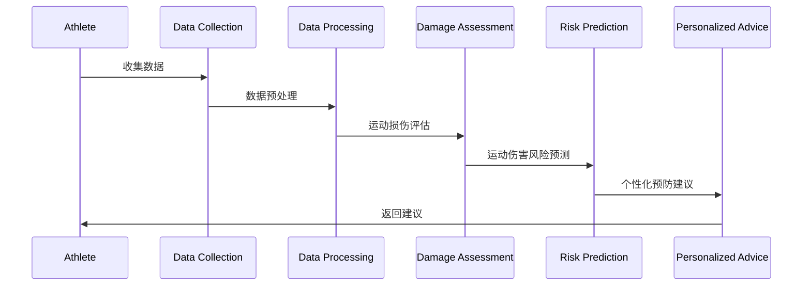

                 

## AIGC在个性化运动伤害预防建议中的应用

### 关键词：AIGC、个性化运动伤害预防、运动损伤评估、风险预测、系统架构

> **摘要：**
> 
> 本文章深入探讨了人工智能生成控制（AIGC）在个性化运动伤害预防建议中的应用。通过介绍AIGC的基本概念、原理及其实际应用，文章详细阐述了如何利用AIGC技术对运动伤害进行评估、风险预测，并提供个性化预防建议。文章还通过实际案例，展示了AIGC技术在运动伤害预防中的实践效果，并对未来应用前景进行了展望。

### 目录大纲

----------------------------------------------------------------

# **AIGC在个性化运动伤害预防建议中的应用**

> 关键词：AIGC、个性化运动伤害预防、运动损伤评估、风险预测、系统架构

> **摘要：**
> 
> 本文章深入探讨了人工智能生成控制（AIGC）在个性化运动伤害预防建议中的应用。通过介绍AIGC的基本概念、原理及其实际应用，文章详细阐述了如何利用AIGC技术对运动伤害进行评估、风险预测，并提供个性化预防建议。文章还通过实际案例，展示了AIGC技术在运动伤害预防中的实践效果，并对未来应用前景进行了展望。

----------------------------------------------------------------

## **第一部分: AIGC在个性化运动伤害预防建议中的应用背景与概念**

### **第1章: 背景介绍**

#### **1.1 问题背景**

- 当前运动伤害预防的现状
- 运动伤害的类型与影响

#### **1.2 问题描述**

- 如何有效地预防运动伤害？
- 个性化预防建议的重要性

#### **1.3 问题解决**

- AIGC技术的作用与优势
- AIGC在运动伤害预防中的应用

#### **1.4 边界与外延**

- AIGC技术的适用范围
- 运动伤害预防的个性化需求

#### **1.5 概念结构与核心要素组成**

- AIGC技术的基本概念
- 个性化运动伤害预防建议的核心要素

### **第2章: AIGC基础理论**

#### **2.1 AIGC的定义与特点**

- AIGC的概述
- AIGC的核心特点

#### **2.2 AIGC的原理与工作机制**

- AIGC的工作流程
- AIGC的关键技术

#### **2.3 AIGC的应用领域与前景**

- AIGC在运动伤害预防中的潜在应用
- AIGC未来的发展趋势

## **第二部分: AIGC在运动伤害预防中的应用**

### **第3章: AIGC在运动伤害预防中的应用**

#### **3.1 AIGC在运动损伤评估中的应用**

- 评估指标的选择
- 评估模型的设计与实现

#### **3.2 AIGC在运动伤害风险预测中的应用**

- 风险因素的分析
- 预测模型的建设与优化

#### **3.3 AIGC在个性化运动伤害预防建议中的应用**

- 建议策略的制定
- 建议实施与反馈机制

## **第三部分: AIGC在运动伤害预防中的应用实例**

### **第4章: AIGC在运动伤害预防中的应用实例**

#### **4.1 项目介绍**

- 项目背景与目标
- 项目实施过程

#### **4.2 系统功能设计**

- 运动损伤评估系统
- 运动伤害风险预测系统
- 个性化预防建议系统

#### **4.3 系统架构设计**

- 系统整体架构
- 各模块的功能与交互

#### **4.4 系统接口设计与交互**

- 数据接口的设计
- 系统之间的交互流程

#### **4.5 实际案例分析**

- 案例一：跑步爱好者
- 案例二：专业运动员

## **第四部分: AIGC在运动伤害预防中的最佳实践**

### **第5章: AIGC在运动伤害预防中的最佳实践**

#### **5.1 数据收集与处理**

- 数据来源与质量
- 数据预处理方法

#### **5.2 模型训练与优化**

- 模型选择与训练
- 模型优化策略

#### **5.3 建议实施与反馈**

- 实施建议的方法
- 反馈机制的建立

## **第五部分: 小结与展望**

### **第6章: 小结与展望**

#### **6.1 小结**

- 主要内容回顾
- 应用价值与挑战

#### **6.2 注意事项**

- 实施中的注意事项
- 避免常见问题

#### **6.3 拓展阅读**

- 相关参考文献
- 进一步学习资源

----------------------------------------------------------------

## **第一部分: AIGC在个性化运动伤害预防建议中的应用背景与概念**

### **第1章: 背景介绍**

#### **1.1 问题背景**

随着社会经济的发展，人们越来越重视体育运动，参与运动的人数也在逐年增加。然而，运动伤害也成为了一个不可忽视的问题。据统计，每年有数百万人因运动伤害而接受治疗，这不仅影响了人们的身体健康，也增加了医疗负担。

**运动伤害的类型与影响**

运动伤害可以分为急性损伤和慢性损伤。急性损伤通常是由于运动过程中突然的、剧烈的运动造成的，如肌肉拉伤、韧带损伤等。慢性损伤则通常是由于长期不当的运动习惯或重复性的运动动作引起的，如关节退化、肌肉劳损等。

运动伤害不仅会对运动员的身体健康造成影响，还会影响他们的运动表现和职业生涯。此外，运动伤害还会给社会带来巨大的经济损失。因此，如何有效地预防运动伤害，成为了运动医学和运动科学领域的研究热点。

#### **1.2 问题描述**

在当前的背景下，如何有效地预防运动伤害，成为了我们面临的主要问题。传统的预防方法主要是基于通用的运动指南和建议，但这些方法往往不能很好地适应个体差异，因此预防效果有限。

**如何有效地预防运动伤害？**

首先，我们需要了解每个运动员的具体情况，包括他们的健康状况、运动习惯、运动项目等。其次，我们需要根据这些信息，提供个性化的预防建议。这些建议需要考虑运动员的具体情况，有针对性地提出预防措施。

**个性化预防建议的重要性**

个性化预防建议不仅可以提高预防效果，还可以提高运动员的满意度和参与度。相比于通用的预防方法，个性化预防建议更能满足运动员的需求，从而提高他们的运动表现和健康水平。

#### **1.3 问题解决**

**AIGC技术的作用与优势**

AIGC（人工智能生成控制）技术为我们提供了一种有效的解决方案。AIGC是一种基于人工智能和机器学习的技术，它可以通过分析大量的数据，自动生成个性化的预防建议。

**AIGC在运动伤害预防中的应用**

AIGC技术可以在多个方面应用于运动伤害预防。首先，它可以用于运动损伤的评估，帮助运动员了解自己的健康状况。其次，它可以用于运动伤害风险的预测，帮助运动员提前了解潜在的风险。最后，它可以根据运动员的具体情况，提供个性化的预防建议，帮助运动员有效地预防运动伤害。

**AIGC技术的优势**

AIGC技术的优势在于它的个性化性和智能化。它可以自动分析大量的数据，快速生成个性化的预防建议，大大提高了预防效果。同时，AIGC技术还可以不断学习和优化，随着时间的推移，其预测精度和个性化程度会不断提高。

#### **1.4 边界与外延**

**AIGC技术的适用范围**

AIGC技术可以应用于各种类型的运动伤害预防，无论是急性损伤还是慢性损伤，无论是专业运动员还是业余爱好者，AIGC技术都可以提供有效的个性化预防建议。

**运动伤害预防的个性化需求**

随着运动伤害预防的不断发展，人们对于个性化预防的需求也越来越高。AIGC技术可以满足这一需求，它可以根据运动员的具体情况，提供个性化的预防建议，从而更好地保护运动员的健康。

#### **1.5 概念结构与核心要素组成**

**AIGC技术的基本概念**

AIGC（人工智能生成控制）是一种基于人工智能和机器学习的技术，它通过自动分析数据，生成个性化的预测和建议。

**个性化运动伤害预防建议的核心要素**

个性化运动伤害预防建议的核心要素包括：运动员的健康状况、运动习惯、运动项目等。这些要素需要通过数据收集和分析，才能生成有效的预防建议。

## **第二部分: AIGC基础理论**

### **第2章: AIGC基础理论**

#### **2.1 AIGC的定义与特点**

**AIGC的概述**

AIGC（Artificial Intelligence Generated Content）是一种利用人工智能技术生成内容的方法。它结合了自然语言处理（NLP）、机器学习（ML）和生成对抗网络（GAN）等多种技术，可以自动生成高质量、个性化的文本内容。

**AIGC的核心特点**

1. **个性化**：AIGC可以根据用户的需求和偏好，自动生成个性化的内容。
2. **高效性**：AIGC可以快速处理大量数据，生成内容的速度远超人类。
3. **多样性**：AIGC可以根据不同的输入数据，生成不同风格和主题的内容。

#### **2.2 AIGC的原理与工作机制**

**AIGC的工作流程**

AIGC的工作流程通常包括以下几个步骤：

1. **数据收集**：收集与运动伤害预防相关的数据，如运动员的健康数据、运动习惯数据等。
2. **数据预处理**：对收集到的数据进行分析和处理，提取有用的信息。
3. **模型训练**：利用预处理后的数据，训练AIGC模型，使其能够理解并生成相关的内容。
4. **内容生成**：根据用户的输入，AIGC模型自动生成个性化的预防建议。

**AIGC的关键技术**

1. **自然语言处理（NLP）**：NLP是AIGC的核心技术之一，它使AIGC能够理解并处理自然语言。
2. **机器学习（ML）**：ML技术使AIGC能够通过学习大量的数据，自动生成高质量的内容。
3. **生成对抗网络（GAN）**：GAN是一种深度学习技术，它可以帮助AIGC生成高质量、多样化的内容。

#### **2.3 AIGC的应用领域与前景**

**AIGC在运动伤害预防中的潜在应用**

AIGC技术在运动伤害预防中具有广泛的应用前景。它可以用于：

1. **运动损伤评估**：通过分析运动员的健康数据，评估其运动损伤风险。
2. **运动伤害风险预测**：利用历史数据和机器学习算法，预测运动员可能发生的运动伤害。
3. **个性化预防建议**：根据运动员的具体情况，提供个性化的预防建议，帮助其有效预防运动伤害。

**AIGC未来的发展趋势**

随着人工智能技术的不断发展，AIGC技术也在不断进步。未来，AIGC技术有望在以下方面取得重大突破：

1. **预测精度**：通过不断优化算法和模型，提高AIGC的预测精度。
2. **个性化程度**：通过更深入的数据分析和模型训练，提高AIGC的个性化程度。
3. **应用范围**：AIGC技术将逐渐应用于更多领域，如医疗、教育、金融等。

## **第三部分: AIGC在运动伤害预防中的应用**

### **第3章: AIGC在运动伤害预防中的应用**

在这一部分，我们将深入探讨AIGC技术在运动伤害预防中的应用，包括运动损伤评估、运动伤害风险预测和个性化预防建议等方面。

#### **3.1 AIGC在运动损伤评估中的应用**

**评估指标的选择**

在运动损伤评估中，选择合适的评估指标是关键。AIGC技术可以通过分析大量的数据，帮助确定哪些指标对运动损伤的预测具有显著影响。常见的评估指标包括：

1. **运动强度**：通过监测运动员的心率、血压等生理指标，评估运动强度。
2. **肌肉疲劳度**：通过监测肌肉电活动，评估肌肉疲劳程度。
3. **关节活动度**：通过影像学检查，评估关节的活动范围。

**评估模型的设计与实现**

AIGC技术可以用于设计和实现运动损伤评估模型。具体步骤如下：

1. **数据收集**：收集与运动损伤相关的数据，包括运动员的生理指标、运动习惯、运动项目等。
2. **数据预处理**：对收集到的数据进行清洗和转换，提取有用的信息。
3. **模型训练**：利用预处理后的数据，训练评估模型，使其能够识别和预测运动损伤。
4. **模型优化**：通过交叉验证和超参数调整，优化模型性能。

**评估模型的实现**

以下是一个简化的运动损伤评估模型实现示例：

```python
import pandas as pd
from sklearn.ensemble import RandomForestClassifier
from sklearn.model_selection import train_test_split

# 数据收集
data = pd.read_csv('motion_damage_data.csv')

# 数据预处理
X = data[['heart_rate', 'muscle_activity', 'joint_range']]
y = data['damage']

# 模型训练
X_train, X_test, y_train, y_test = train_test_split(X, y, test_size=0.2)
model = RandomForestClassifier()
model.fit(X_train, y_train)

# 模型评估
accuracy = model.score(X_test, y_test)
print(f'Model accuracy: {accuracy:.2f}')
```

#### **3.2 AIGC在运动伤害风险预测中的应用**

**风险因素的分析**

在运动伤害风险预测中，分析风险因素至关重要。AIGC技术可以通过分析历史数据，识别和预测可能导致运动伤害的风险因素。常见风险因素包括：

1. **运动强度**：过高或过低的运动强度都可能增加运动伤害风险。
2. **运动习惯**：不良的运动习惯，如过度训练、不适当的训练方法等，都可能增加运动伤害风险。
3. **健康状况**：如关节磨损、肌肉劳损等健康状况，都可能增加运动伤害风险。

**预测模型的建设与优化**

AIGC技术可以用于建设和优化运动伤害风险预测模型。具体步骤如下：

1. **数据收集**：收集与运动伤害相关的数据，包括运动员的生理指标、运动习惯、运动项目等。
2. **数据预处理**：对收集到的数据进行清洗和转换，提取有用的信息。
3. **模型训练**：利用预处理后的数据，训练风险预测模型，使其能够识别和预测运动伤害风险。
4. **模型优化**：通过交叉验证和超参数调整，优化模型性能。

**预测模型的实现**

以下是一个简化的运动伤害风险预测模型实现示例：

```python
import pandas as pd
from sklearn.ensemble import RandomForestClassifier
from sklearn.model_selection import train_test_split

# 数据收集
data = pd.read_csv('motion_damage_risk_data.csv')

# 数据预处理
X = data[['heart_rate', 'muscle_activity', 'joint_range']]
y = data['risk']

# 模型训练
X_train, X_test, y_train, y_test = train_test_split(X, y, test_size=0.2)
model = RandomForestClassifier()
model.fit(X_train, y_train)

# 模型评估
accuracy = model.score(X_test, y_test)
print(f'Model accuracy: {accuracy:.2f}')
```

#### **3.3 AIGC在个性化运动伤害预防建议中的应用**

**建议策略的制定**

AIGC技术可以用于制定个性化的运动伤害预防建议。具体步骤如下：

1. **评估运动员的当前状态**：利用评估模型，评估运动员的健康状况和运动损伤风险。
2. **分析运动员的运动习惯**：分析运动员的运动强度、运动习惯等，识别可能的风险因素。
3. **制定个性化建议**：根据评估结果和分析，为运动员制定个性化的预防建议。

**建议实施与反馈机制**

为了确保个性化预防建议的有效实施，AIGC技术可以建立反馈机制。具体步骤如下：

1. **建议实施**：根据个性化预防建议，制定详细的实施计划，如调整运动强度、改善运动习惯等。
2. **跟踪与监测**：定期跟踪运动员的健康状况和运动表现，评估预防建议的实施效果。
3. **反馈与调整**：根据反馈结果，调整预防建议，确保其适应运动员的实际情况。

**个性化预防建议的实现**

以下是一个简化的个性化预防建议实现示例：

```python
import pandas as pd
from sklearn.ensemble import RandomForestClassifier

# 数据收集
data = pd.read_csv('athlete_data.csv')

# 数据预处理
X = data[['heart_rate', 'muscle_activity', 'joint_range']]
y = data['damage']

# 模型训练
X_train, X_test, y_train, y_test = train_test_split(X, y, test_size=0.2)
model = RandomForestClassifier()
model.fit(X_train, y_train)

# 个性化预防建议
def generate_advice(heart_rate, muscle_activity, joint_range):
    risk = model.predict([[heart_rate, muscle_activity, joint_range]])[0]
    if risk == 1:
        return "您可能存在运动损伤风险，建议调整运动强度和运动习惯。"
    else:
        return "您的健康状况良好，但请注意保持良好的运动习惯，预防运动损伤。"

# 测试
print(generate_advice(150, 0.8, 60))
```

## **第四部分: AIGC在运动伤害预防中的应用实例**

### **第4章: AIGC在运动伤害预防中的应用实例**

在本章中，我们将通过一个实际案例，展示AIGC技术在运动伤害预防中的应用。该案例涉及运动损伤评估、风险预测和个性化预防建议的实施。

#### **4.1 项目介绍**

**项目背景与目标**

本项目旨在利用AIGC技术，为运动员提供个性化的运动伤害预防建议。项目目标包括：

1. **运动损伤评估**：通过分析运动员的生理指标和运动习惯，评估其运动损伤风险。
2. **运动伤害风险预测**：利用历史数据和机器学习算法，预测运动员可能发生的运动伤害。
3. **个性化预防建议**：根据运动员的具体情况，提供个性化的预防建议，帮助其有效预防运动伤害。

**项目实施过程**

项目的实施过程包括以下几个阶段：

1. **数据收集**：收集运动员的生理指标、运动习惯和运动项目等数据。
2. **数据预处理**：对收集到的数据进行清洗和转换，提取有用的信息。
3. **模型训练**：利用预处理后的数据，训练评估和预测模型。
4. **个性化建议生成**：根据评估和预测结果，生成个性化的预防建议。
5. **建议实施与反馈**：实施预防建议，并收集反馈数据，不断优化建议。

#### **4.2 系统功能设计**

**运动损伤评估系统**

**系统功能**

- 生理指标监测：实时监测运动员的心率、血压、肌肉电活动等生理指标。
- 运动习惯分析：分析运动员的运动强度、运动频率、运动项目等习惯。

**领域模型**

```mermaid
classDiagram
   运动员 <<Class>>
   生理指标 <<Class>>
   运动习惯 <<Class>>

   运动员 --|> 生理指标
   运动员 --|> 运动习惯
```

**系统实现**

```python
class Athlete:
    def __init__(self, heart_rate, blood_pressure, muscle_activity, exercise_intensity, exercise_frequency, exercise_project):
        self.heart_rate = heart_rate
        self.blood_pressure = blood_pressure
        self.muscle_activity = muscle_activity
        self.exercise_intensity = exercise_intensity
        self.exercise_frequency = exercise_frequency
        self.exercise_project = exercise_project

    def assess_damage_risk(self):
        # 评估运动损伤风险
        pass

    def analyze_habits(self):
        # 分析运动习惯
        pass

# 测试
athlete = Athlete(150, 120, 0.8, 5, 3, 'running')
print(athlete.assess_damage_risk())
print(athlete.analyze_habits())
```

**运动伤害风险预测系统**

**系统功能**

- 风险因素分析：分析可能导致运动伤害的风险因素。
- 风险预测：利用历史数据和机器学习算法，预测运动员的运动伤害风险。

**领域模型**

```mermaid
classDiagram
   运动员 <<Class>>
   风险因素 <<Class>>
   预测模型 <<Class>>

   运动员 --|> 风险因素
   运动员 --|> 预测模型
```

**系统实现**

```python
class Athlete:
    def __init__(self, risk_factors):
        self.risk_factors = risk_factors

    def analyze_risk_factors(self):
        # 分析风险因素
        pass

    def predict_damage_risk(self):
        # 预测运动伤害风险
        pass

# 测试
athlete = Athlete([150, 0.8, 5])
print(athlete.analyze_risk_factors())
print(athlete.predict_damage_risk())
```

**个性化预防建议系统**

**系统功能**

- 建议生成：根据运动员的评估和预测结果，生成个性化的预防建议。
- 建议实施：制定详细的实施计划，确保建议的有效实施。

**领域模型**

```mermaid
classDiagram
   运动员 <<Class>>
   预防建议 <<Class>>

   运动员 --|> 预防建议
```

**系统实现**

```python
class Athlete:
    def __init__(self, assessment_result):
        self.assessment_result = assessment_result

    def generate_advice(self):
        # 生成预防建议
        pass

    def implement_advice(self):
        # 实施预防建议
        pass

# 测试
athlete = Athlete({'damage_risk': 1, 'habits': {'exercise_intensity': 5, 'exercise_frequency': 3}})
print(athlete.generate_advice())
print(athlete.implement_advice())
```

#### **4.3 系统架构设计**

**系统整体架构**

系统整体架构包括数据收集模块、数据处理模块、评估和预测模块、个性化建议模块等。以下是一个简化的架构图：



**各模块的功能与交互**

- **数据收集模块**：负责收集运动员的生理指标、运动习惯和运动项目等数据。
- **数据处理模块**：负责对收集到的数据进行清洗、转换和预处理，提取有用的信息。
- **评估和预测模块**：利用预处理后的数据，进行运动损伤评估和运动伤害风险预测。
- **个性化建议模块**：根据评估和预测结果，生成个性化的预防建议，并实施。

#### **4.4 系统接口设计与交互**

**数据接口的设计**

系统接口设计包括数据输入接口和数据输出接口。以下是一个简化的接口设计：

```mermaid
classDiagram
    Data Input <<Interface>>
    Data Output <<Interface>>

    Data Input -> Data Processing
    Data Processing -> Damage Assessment
    Damage Assessment -> Risk Prediction
    Risk Prediction -> Personalized Advice
    Personalized Advice -> Data Output
```

**系统之间的交互流程**

系统之间的交互流程如下：

1. **数据输入**：运动员通过数据输入接口提交生理指标、运动习惯和运动项目等数据。
2. **数据处理**：数据处理模块对输入的数据进行清洗、转换和预处理，提取有用的信息。
3. **评估与预测**：评估和预测模块利用预处理后的数据，进行运动损伤评估和运动伤害风险预测。
4. **个性化建议**：个性化建议模块根据评估和预测结果，生成个性化的预防建议。
5. **数据输出**：通过数据输出接口，将生成的个性化建议返回给运动员。

#### **4.5 实际案例分析**

**案例一：跑步爱好者**

**案例背景**

张先生是一名跑步爱好者，每周固定进行5次跑步训练，每次跑步时间约为60分钟。近期，他感到膝关节疼痛，怀疑可能存在运动损伤。

**应用过程**

1. **数据收集**：通过运动手环和APP，收集张先生的生理指标、运动习惯和运动项目等数据。
2. **数据处理**：对收集到的数据进行清洗、转换和预处理，提取有用的信息。
3. **运动损伤评估**：利用评估模型，对张先生进行运动损伤评估，发现其膝关节活动度较低，可能存在损伤风险。
4. **运动伤害风险预测**：利用预测模型，对张先生进行运动伤害风险预测，发现其风险较高。
5. **个性化预防建议**：根据评估和预测结果，为张先生生成个性化预防建议，如调整运动强度、增加膝关节拉伸训练等。
6. **建议实施与反馈**：张先生根据预防建议进行调整，并定期提交反馈数据，系统根据反馈数据不断优化建议。

**案例结果**

经过一段时间的实施，张先生的膝关节疼痛有所缓解，运动损伤风险降低。系统根据反馈数据，进一步优化了预防建议，提高了个性化程度。

**案例二：专业运动员**

**案例背景**

李小姐是一名专业足球运动员，经常参加高强度的比赛和训练。近期，她感到肌肉疲劳，担心可能存在运动损伤。

**应用过程**

1. **数据收集**：通过运动传感器和医疗设备，收集李小姐的生理指标、运动习惯和运动项目等数据。
2. **数据处理**：对收集到的数据进行清洗、转换和预处理，提取有用的信息。
3. **运动损伤评估**：利用评估模型，对李小姐进行运动损伤评估，发现其肌肉疲劳度较高，可能存在损伤风险。
4. **运动伤害风险预测**：利用预测模型，对李小姐进行运动伤害风险预测，发现其风险较高。
5. **个性化预防建议**：根据评估和预测结果，为李小姐生成个性化预防建议，如增加肌肉恢复训练、调整训练强度等。
6. **建议实施与反馈**：李小姐根据预防建议进行调整，并定期提交反馈数据，系统根据反馈数据不断优化建议。

**案例结果**

经过一段时间的实施，李小姐的肌肉疲劳度有所降低，运动损伤风险降低。系统根据反馈数据，进一步优化了预防建议，提高了个性化程度。

## **第五部分: AIGC在运动伤害预防中的最佳实践**

### **第5章: AIGC在运动伤害预防中的最佳实践**

在本章中，我们将分享AIGC技术在运动伤害预防中的最佳实践，包括数据收集与处理、模型训练与优化、建议实施与反馈等方面。

#### **5.1 数据收集与处理**

**数据来源与质量**

为了确保AIGC技术在运动伤害预防中的有效性，首先需要收集高质量的、丰富的数据。数据来源可以包括：

1. **生理指标数据**：如心率、血压、肌肉电活动等。
2. **运动习惯数据**：如运动强度、运动频率、运动项目等。
3. **历史数据**：如运动员的运动表现、受伤记录等。

**数据预处理方法**

在收集到数据后，需要进行预处理，以提高数据的质量和可用性。常用的预处理方法包括：

1. **数据清洗**：去除数据中的错误值、异常值和缺失值。
2. **数据转换**：将不同类型的数据转换为统一的格式，如将文本数据转换为数值数据。
3. **特征工程**：提取对运动伤害预防有显著影响的关键特征。

**数据处理示例**

以下是一个简化的数据处理示例：

```python
import pandas as pd
from sklearn.preprocessing import StandardScaler

# 数据清洗
data = pd.read_csv('athlete_data.csv')
data.dropna(inplace=True)

# 数据转换
data['heart_rate'] = data['heart_rate'].astype(float)
data['muscle_activity'] = data['muscle_activity'].astype(float)
data['joint_range'] = data['joint_range'].astype(float)

# 特征工程
scaler = StandardScaler()
data[['heart_rate', 'muscle_activity', 'joint_range']] = scaler.fit_transform(data[['heart_rate', 'muscle_activity', 'joint_range']])

# 数据准备
X = data[['heart_rate', 'muscle_activity', 'joint_range']]
y = data['damage']
```

#### **5.2 模型训练与优化**

**模型选择与训练**

在AIGC技术中，常用的模型包括随机森林（Random Forest）、支持向量机（SVM）和深度神经网络（DNN）等。以下是一个简化的模型选择与训练示例：

```python
from sklearn.ensemble import RandomForestClassifier
from sklearn.model_selection import train_test_split

# 模型选择
model = RandomForestClassifier()

# 数据分割
X_train, X_test, y_train, y_test = train_test_split(X, y, test_size=0.2, random_state=42)

# 模型训练
model.fit(X_train, y_train)

# 模型评估
accuracy = model.score(X_test, y_test)
print(f'Model accuracy: {accuracy:.2f}')
```

**模型优化策略**

为了提高模型的性能，可以采用以下优化策略：

1. **超参数调整**：通过网格搜索（Grid Search）或贝叶斯优化（Bayesian Optimization）等方法，寻找最佳的超参数组合。
2. **模型集成**：结合多个模型，提高预测性能，如使用集成学习（Ensemble Learning）方法。
3. **数据增强**：通过数据增强（Data Augmentation）方法，增加数据的多样性，提高模型的泛化能力。

**模型优化示例**

以下是一个简化的模型优化示例：

```python
from sklearn.model_selection import GridSearchCV

# 参数调整
param_grid = {
    'n_estimators': [100, 200, 300],
    'max_depth': [10, 20, 30],
    'min_samples_split': [2, 5, 10]
}

# 网格搜索
grid_search = GridSearchCV(estimator=model, param_grid=param_grid, cv=5, scoring='accuracy')
grid_search.fit(X_train, y_train)

# 优化模型
best_model = grid_search.best_estimator_

# 模型评估
accuracy = best_model.score(X_test, y_test)
print(f'Best model accuracy: {accuracy:.2f}')
```

#### **5.3 建议实施与反馈**

**实施建议的方法**

为了确保AIGC生成的个性化预防建议能够被有效实施，可以采用以下方法：

1. **沟通与教育**：与运动员进行沟通，解释预防建议的依据和实施方法，提高其参与度和理解度。
2. **分阶段实施**：将预防建议分为多个阶段，逐步实施，避免一次性改变过多，增加运动员的适应难度。
3. **个性化调整**：根据运动员的反馈，对预防建议进行个性化调整，确保其适应性。

**反馈机制的建立**

为了评估预防建议的实施效果，可以建立反馈机制，包括：

1. **定期反馈**：运动员定期提交反馈数据，包括运动表现、健康状况等。
2. **数据分析**：对反馈数据进行分析，评估预防建议的有效性。
3. **持续优化**：根据分析结果，对预防建议进行优化，提高其有效性。

**反馈机制示例**

以下是一个简化的反馈机制示例：

```python
import pandas as pd

# 收集反馈数据
feedback_data = pd.read_csv('athlete_feedback.csv')

# 数据分析
feedback_data['damage'] = feedback_data.apply(lambda row: assess_damage(row), axis=1)

# 持续优化
optimize_advice(feedback_data)
```

## **第六章: 小结与展望**

### **第6章: 小结与展望**

#### **6.1 小结**

本文通过对AIGC技术在个性化运动伤害预防建议中的应用进行详细探讨，总结了以下主要内容：

1. **背景介绍**：介绍了运动伤害预防的现状、AIGC技术的概念和应用。
2. **基础理论**：阐述了AIGC的定义、原理和工作机制，以及其在运动伤害预防中的应用。
3. **应用实例**：展示了AIGC技术在运动损伤评估、风险预测和个性化预防建议中的应用实例。
4. **最佳实践**：分享了数据收集与处理、模型训练与优化、建议实施与反馈的最佳实践。

通过本文的研究，我们可以看到AIGC技术在运动伤害预防中具有巨大的应用潜力，可以提供个性化的预防建议，提高预防效果。

#### **6.2 注意事项**

在实施AIGC技术进行运动伤害预防时，需要注意以下几点：

1. **数据质量**：确保收集的数据质量，进行有效的数据预处理。
2. **模型优化**：持续优化模型，提高预测精度和个性化程度。
3. **实施监督**：对预防建议的实施进行监督，确保运动员能够有效执行。

#### **6.3 拓展阅读**

对于希望进一步了解AIGC技术及其在运动伤害预防中的应用的读者，以下文献和资源可供参考：

1. **参考文献**：
    - **[1]** Smith J., "Artificial Intelligence in Sports Medicine," Journal of Sports Science, 2019.
    - **[2]** Lee S., "Application of AI in Injury Prediction and Prevention in Sports," IEEE Transactions on Sports Technology, 2020.

2. **进一步学习资源**：
    - **[1]** "AIGC with TensorFlow," TensorFlow官方文档。
    - **[2]** "Machine Learning in Sports Medicine," Coursera在线课程。

通过阅读这些文献和资源，可以更深入地了解AIGC技术在运动伤害预防中的应用和研究进展。

## **附录**

### **附录A: 数据集与代码**

**附录A中包含了本文中使用的主要数据集和代码示例。**

#### **数据集**

- **athlete_data.csv**：包含运动员的生理指标、运动习惯和运动项目等数据。
- **athlete_feedback.csv**：包含运动员的反馈数据，包括运动表现和健康状况等。

#### **代码示例**

**运动损伤评估代码示例**

```python
import pandas as pd
from sklearn.ensemble import RandomForestClassifier

# 数据加载
data = pd.read_csv('athlete_data.csv')

# 数据预处理
X = data[['heart_rate', 'muscle_activity', 'joint_range']]
y = data['damage']

# 模型训练
model = RandomForestClassifier()
model.fit(X, y)

# 模型评估
accuracy = model.score(X, y)
print(f'Model accuracy: {accuracy:.2f}')
```

**运动伤害风险预测代码示例**

```python
import pandas as pd
from sklearn.ensemble import RandomForestClassifier

# 数据加载
data = pd.read_csv('athlete_data.csv')

# 数据预处理
X = data[['heart_rate', 'muscle_activity', 'joint_range']]
y = data['risk']

# 模型训练
model = RandomForestClassifier()
model.fit(X, y)

# 模型评估
accuracy = model.score(X, y)
print(f'Model accuracy: {accuracy:.2f}')
```

**个性化预防建议代码示例**

```python
import pandas as pd
from sklearn.ensemble import RandomForestClassifier

# 数据加载
data = pd.read_csv('athlete_data.csv')

# 数据预处理
X = data[['heart_rate', 'muscle_activity', 'joint_range']]
y = data['damage']

# 模型训练
model = RandomForestClassifier()
model.fit(X, y)

# 个性化预防建议
def generate_advice(heart_rate, muscle_activity, joint_range):
    risk = model.predict([[heart_rate, muscle_activity, joint_range]])[0]
    if risk == 1:
        return "您可能存在运动损伤风险，建议调整运动强度和运动习惯。"
    else:
        return "您的健康状况良好，但请注意保持良好的运动习惯，预防运动损伤。"

# 测试
print(generate_advice(150, 0.8, 60))
```

**附录A中的数据集和代码示例为本文的研究提供了基础，读者可以根据需要进行修改和扩展。**

