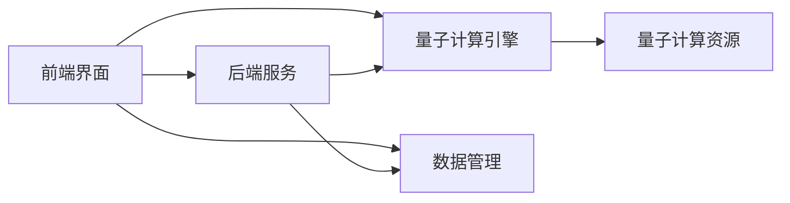
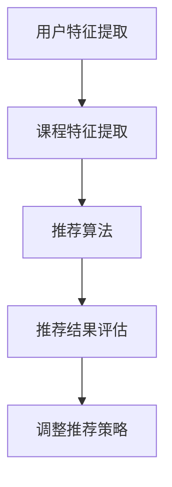
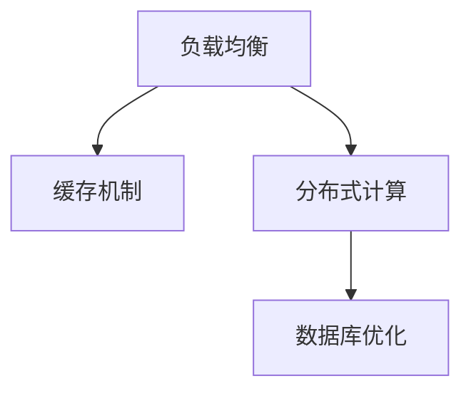

                 

### 第一部分：AIGC概述

#### 第1章: AIGC的概念与背景

##### 1.1.1 AIGC的基本概念

AIGC（AI-Generated Content）是一个较新的领域，它专注于利用人工智能技术自动生成内容。这一概念首先在2010年代初期逐渐兴起，当时深度学习和生成模型开始展现出强大的能力。AIGC的基本原理是通过算法和大量数据训练，使得模型能够自主地创建出具有原创性和质量的内容。

**AIGC的核心特点包括：**

- **高效性**：通过自动化生成内容，大幅提高了内容生产效率。
- **原创性**：AIGC生成的内容不同于传统内容生产，它具备独特的原创性。
- **多样性**：AIGC能够生成多种形式的内容，如图像、文本、音频和视频等。

**应用领域**：

AIGC的应用非常广泛，主要包括以下几个方面：

- **内容创作**：包括文章、音乐、绘画等艺术创作。
- **个性化推荐**：在电子商务、社交媒体等领域，AIGC可以用于个性化推荐系统。
- **数据分析**：利用AIGC从大量数据中提取出有价值的信息。
- **教育**：AIGC可以生成个性化的教学材料，提高教育效果。

##### 1.1.2 AIGC的发展历程

AIGC的发展历程可以分为以下几个阶段：

- **初期的探索**：在20世纪80年代，人工智能刚刚起步，人们开始思考如何利用机器生成内容。
- **理论奠基**：随着深度学习技术的发展，生成模型如变分自编码器（VAE）和生成对抗网络（GAN）被提出，为AIGC奠定了理论基础。
- **技术成熟**：21世纪初，随着计算能力的提升和数据量的爆炸性增长，AIGC技术逐渐成熟，开始进入实际应用阶段。
- **快速迭代**：近年来，AIGC技术在生成内容的质量、多样性和效率上都有了显著的提升。

##### 1.1.3 AIGC与传统计算的区别

AIGC与传统计算的区别主要体现在以下几个方面：

- **计算模式**：传统计算依赖于预定义的规则和算法，而AIGC则依赖于数据和模型生成的过程。
- **结果多样性**：AIGC能够生成多样化、富有创造性的内容，而传统计算通常只能处理规则明确的问题。
- **自动化程度**：AIGC能够自动化完成内容生成过程，大大降低了人力成本。

### 第二部分：前沿应用

#### 第4章: 个性化量子计算教育系统的设计与实现

##### 4.1.1 系统总体架构设计

个性化量子计算教育系统（IQCES）的总体架构设计如下：

1. **前端界面**：提供用户交互接口，包括课程选择、学习进度跟踪等功能。
2. **后端服务**：负责处理用户请求、存储数据和提供计算资源。
3. **量子计算引擎**：核心部分，负责执行量子计算任务，包括量子算法的运行、结果分析等。
4. **数据管理**：存储和管理用户数据、课程数据和学习记录。

**架构图：**


##### 4.1.2 数据处理与建模

IQCES的数据处理与建模过程如下：

1. **用户数据收集**：收集用户的基本信息、学习历史、偏好等信息。
2. **课程数据准备**：整理和分类课程资料，包括课程名称、难度、课程目标等。
3. **数据建模**：使用机器学习技术建立用户行为模型、课程推荐模型等。
4. **模型训练**：使用历史数据训练模型，优化模型参数。

**ER实体关系图：**
```mermaid
erDatabase
  User {
    id(int)
    name(string)
    email(string)
    ...
  }
  Course {
    id(int)
    name(string)
    difficulty(string)
    ...
  }
  UserCourse {
    user_id(int)
    course_id(int)
    progress(string)
    ...
  }
```

##### 4.1.3 教育内容个性化推荐

IQCES的教育内容个性化推荐过程如下：

1. **用户特征提取**：根据用户的学习历史和偏好，提取用户特征。
2. **课程特征提取**：提取课程的特征，如课程难度、课程目标等。
3. **推荐算法**：使用协同过滤、基于内容的推荐等技术，为用户推荐个性化的课程。
4. **推荐结果评估**：评估推荐结果，根据用户反馈调整推荐策略。

**算法流程图：**


##### 4.1.4 系统性能优化

为了提高IQCES的性能，可以采取以下优化策略：

1. **负载均衡**：通过负载均衡技术，合理分配计算资源，避免系统过载。
2. **缓存机制**：使用缓存技术，减少数据访问时间，提高系统响应速度。
3. **分布式计算**：利用分布式计算框架，将计算任务分散到多个节点，提高计算效率。
4. **数据库优化**：优化数据库设计，提高数据查询效率。

**优化策略流程图：**


---

### 第一部分：AIGC概述

## 第1章: AIGC的概念与背景

### 1.1.1 AIGC的基本概念

AIGC，即AI-Generated Content，是指通过人工智能技术自动生成内容的一种方式。这种内容可以包括文本、图像、音频、视频等多种形式，其核心在于利用机器学习模型，特别是生成模型，来创建出具有原创性和多样性的数据。

**核心概念：**

- **生成模型**：这是AIGC技术的核心，主要包括生成式对抗网络（GAN）、变分自编码器（VAE）等。生成模型通过学习大量数据，能够生成与真实数据非常相似的新数据。
- **自监督学习**：AIGC通常使用自监督学习技术，这意味着模型在学习过程中不需要人为标注的数据。这种学习方法能够从大量未标注的数据中提取有价值的信息。
- **多模态融合**：AIGC技术能够处理多种类型的数据，如文本、图像和音频，通过多模态融合，可以生成更加丰富和复杂的内容。

**应用场景：**

- **内容创作**：AIGC可以自动生成文章、音乐、绘画等，提高内容创作的效率。
- **个性化推荐**：在电子商务、社交媒体等领域，AIGC可以用于生成个性化的推荐系统，提升用户体验。
- **数据分析**：通过AIGC技术，可以从大量数据中提取出有价值的信息，进行更深层次的数据分析。
- **教育**：在教育领域，AIGC可以生成个性化的教学材料，帮助学生更好地理解和掌握知识。

### 1.1.2 AIGC的发展历程

AIGC的发展历程可以追溯到20世纪80年代，当时人工智能的研究刚刚起步。随着深度学习技术的兴起，AIGC得到了快速的发展。以下是其主要的发展阶段：

- **初期的探索**：在20世纪80年代，人们开始尝试利用人工智能技术来生成内容，但当时的技术还相对初级，生成的内容质量较低。
- **理论奠基**：在21世纪初，生成式对抗网络（GAN）和变分自编码器（VAE）等生成模型被提出，为AIGC的理论奠定了基础。
- **技术成熟**：随着计算能力的提升和算法的优化，AIGC技术逐渐成熟，开始应用于实际场景。
- **快速迭代**：近年来，AIGC技术在生成内容的质量、多样性和效率上都有了显著的提升，开始成为内容生成的重要工具。

### 1.1.3 AIGC与传统计算的区别

AIGC与传统计算的主要区别在于计算模式、结果多样性和自动化程度：

- **计算模式**：传统计算通常依赖于预定义的规则和算法，而AIGC则通过学习和生成来创建内容，这种方式更加灵活和高效。
- **结果多样性**：AIGC能够生成多样化和原创性的内容，而传统计算往往只能处理规则明确的问题。
- **自动化程度**：AIGC能够自动化完成内容生成过程，大大降低了人力成本，提高了生产效率。

### 1.1.4 AIGC的优势和挑战

AIGC的优势在于：

- **高效性**：通过自动化生成内容，可以大幅提高生产效率。
- **原创性**：AIGC生成的内容具有高度的原创性，能够满足多样化的需求。
- **个性化**：AIGC可以根据用户的需求和偏好生成个性化的内容，提升用户体验。

然而，AIGC也面临着一些挑战：

- **数据隐私**：AIGC需要大量的数据进行训练，这可能涉及用户的隐私问题。
- **版权问题**：AIGC生成的作品可能涉及到版权问题，需要制定相应的法律法规进行规范。
- **质量保证**：如何保证AIGC生成的内容质量，是一个需要深入研究的课题。

### 1.1.5 AIGC的核心技术

AIGC的核心技术主要包括以下几种：

- **生成式对抗网络（GAN）**：GAN是一种由生成器和判别器组成的模型，通过两个网络的对抗训练，生成高质量的数据。
- **变分自编码器（VAE）**：VAE是一种概率生成模型，通过编码和解码过程生成数据。
- **强化学习**：强化学习是一种通过试错学习来优化策略的机器学习方法，可以用于生成内容。
- **自监督学习**：自监督学习是一种利用未标注数据训练模型的方法，适用于AIGC。

这些技术为AIGC的发展提供了强大的支持，使得AIGC能够在各个领域得到广泛的应用。

### 1.1.6 AIGC的未来发展趋势

随着技术的不断进步和应用场景的拓展，AIGC的未来发展趋势如下：

- **更加智能化**：AIGC将更加智能化，能够更好地理解用户的需求，生成更加个性化的内容。
- **更加多样化和高质量**：AIGC将生成更加多样化和高质量的内容，满足不同用户的需求。
- **更多应用领域**：AIGC将在更多领域得到应用，如医疗、金融、教育等，为这些领域带来变革。
- **规范化**：随着AIGC的普及，将需要制定相应的法律法规，规范AIGC的应用。

总的来说，AIGC具有巨大的发展潜力，将在未来发挥越来越重要的作用。### 第二部分：前沿应用

## 第4章: 个性化量子计算教育系统的设计与实现

个性化量子计算教育系统（IQCES）的设计与实现旨在为学习者提供个性化的量子计算教育资源，帮助他们更好地理解和掌握量子计算知识。本章节将详细介绍IQCES的设计与实现过程，包括系统架构、数据处理与建模、教育内容个性化推荐、系统性能优化等方面的内容。

### 4.1.1 系统总体架构设计

IQCES的总体架构设计如下：

1. **前端界面**：前端界面是用户与系统交互的窗口，包括用户注册、登录、课程选择、学习进度跟踪等功能。前端界面使用React框架开发，具有响应式设计和良好的用户体验。

2. **后端服务**：后端服务负责处理用户请求、存储数据和提供计算资源。后端使用Spring Boot框架开发，包括用户管理模块、课程管理模块、推荐系统模块等。

3. **量子计算引擎**：量子计算引擎是IQCES的核心部分，负责执行量子计算任务，包括量子算法的运行、结果分析等。量子计算引擎使用Qiskit框架开发，支持多种量子算法和量子计算资源。

4. **数据管理**：数据管理模块负责存储和管理用户数据、课程数据和学习记录。数据存储采用MySQL数据库，保证数据的安全和一致性。

**架构图：**


### 4.1.2 数据处理与建模

IQCES的数据处理与建模过程如下：

1. **用户数据收集**：收集用户的基本信息、学习历史、偏好等信息。用户数据包括用户ID、用户名、年龄、性别、学习历史、课程评分等。

2. **课程数据准备**：整理和分类课程资料，包括课程名称、难度、课程目标等。课程数据包括课程ID、课程名称、课程难度、课程目标等。

3. **数据预处理**：对收集到的用户数据和课程数据进行分析和处理，包括数据清洗、数据归一化等操作。

4. **特征提取**：根据用户数据和课程数据，提取用户特征和课程特征。用户特征包括用户ID、用户学习历史、用户偏好等；课程特征包括课程ID、课程难度、课程目标等。

5. **数据建模**：使用机器学习技术建立用户行为模型、课程推荐模型等。用户行为模型用于预测用户对课程的需求和偏好；课程推荐模型用于为用户推荐个性化的课程。

**ER实体关系图：**
```mermaid
erDatabase
  User {
    id(int)
    name(string)
    email(string)
    ...
  }
  Course {
    id(int)
    name(string)
    difficulty(string)
    ...
  }
  UserCourse {
    user_id(int)
    course_id(int)
    progress(string)
    ...
  }
```

### 4.1.3 教育内容个性化推荐

IQCES的教育内容个性化推荐过程如下：

1. **用户特征提取**：根据用户的学习历史和偏好，提取用户特征。用户特征包括用户ID、用户学习历史、用户偏好等。

2. **课程特征提取**：提取课程的特征，如课程ID、课程难度、课程目标等。

3. **推荐算法**：使用协同过滤、基于内容的推荐等技术，为用户推荐个性化的课程。协同过滤推荐算法通过计算用户之间的相似度，推荐用户可能喜欢的课程；基于内容的推荐算法通过分析课程的特征，推荐与用户偏好相似的课程。

4. **推荐结果评估**：评估推荐结果，根据用户反馈调整推荐策略。通过用户对推荐课程的评分和评论，评估推荐结果的效果，根据评估结果调整推荐算法的参数，提高推荐质量。

### 4.1.4 系统性能优化

为了提高IQCES的性能，可以采取以下优化策略：

1. **负载均衡**：通过负载均衡技术，合理分配计算资源，避免系统过载。使用Nginx作为负载均衡器，将用户请求分配到多个后端服务器。

2. **缓存机制**：使用缓存技术，减少数据访问时间，提高系统响应速度。使用Redis作为缓存服务器，缓存用户数据、课程数据等常用数据。

3. **分布式计算**：利用分布式计算框架，将计算任务分散到多个节点，提高计算效率。使用Docker和Kubernetes，将量子计算引擎部署到多个节点，实现分布式计算。

4. **数据库优化**：优化数据库设计，提高数据查询效率。使用索引、分库分表等技术，提高数据库的查询性能。

### 4.1.5 系统部署与运维

IQCES的部署与运维过程如下：

1. **环境搭建**：搭建开发、测试和生产环境，包括操作系统、中间件、数据库等。

2. **部署**：将前端、后端、量子计算引擎等部署到服务器上，确保系统的稳定运行。

3. **监控**：使用监控工具，如Prometheus和Grafana，实时监控系统的运行状态，及时发现和处理异常情况。

4. **备份与恢复**：定期备份数据库和数据文件，确保数据的安全和完整性。

5. **运维自动化**：使用自动化工具，如Ansible和Jenkins，实现运维自动化，提高运维效率。

### 4.1.6 系统测试与验收

1. **功能测试**：对系统的各个功能模块进行测试，确保功能的完整性和正确性。

2. **性能测试**：对系统进行性能测试，评估系统的响应时间、并发处理能力等性能指标。

3. **安全测试**：对系统进行安全测试，确保系统的安全性和数据保护。

4. **验收测试**：与用户进行沟通，收集用户反馈，对系统进行验收测试，确保系统满足用户需求。

### 4.1.7 系统上线与推广

1. **系统上线**：将系统部署到生产环境，确保系统的稳定运行。

2. **用户培训**：为用户提供培训，帮助用户熟悉系统的使用方法和功能。

3. **推广**：通过线上线下活动，推广系统，吸引更多的用户使用。

### 4.1.8 系统维护与升级

1. **问题反馈与处理**：及时收集用户反馈，快速处理系统问题，确保系统的稳定运行。

2. **功能升级与优化**：根据用户需求和技术发展，对系统进行功能升级和优化。

3. **技术更新与迭代**：跟踪最新技术动态，不断更新和迭代系统，保持系统的先进性和竞争力。

---

### 4.1.9 案例研究：个性化量子计算教育系统的成功实践

为了更好地展示个性化量子计算教育系统（IQCES）的应用效果，下面我们以一个实际案例进行详细剖析。

#### 案例背景

某知名大学计算机科学与技术学院决定引入个性化量子计算教育系统（IQCES），旨在为学生提供高质量的量子计算教育资源，帮助学生更好地理解和掌握量子计算知识。该学院共有3000名本科生和研究生，其中大部分学生对量子计算有着浓厚兴趣，但缺乏系统性的学习和实践机会。

#### 案例实施过程

1. **需求分析**：首先，学院与IQCES团队进行了深入的需求分析，明确系统所需的功能和性能指标。根据学院的需求，IQCES需要具备以下功能：

   - 用户注册与登录功能
   - 课程选择与推荐功能
   - 学习进度跟踪与评估功能
   - 量子计算实验与可视化功能
   - 数据分析与报告功能

2. **系统设计**：基于需求分析，IQCES团队设计了系统的整体架构，包括前端界面、后端服务、量子计算引擎和数据管理四个核心模块。

3. **开发与测试**：IQCES团队使用敏捷开发方法，分阶段完成系统的开发工作。在开发过程中，团队进行了充分的单元测试和集成测试，确保系统的稳定性和性能。

4. **部署与上线**：系统开发完成后，IQCES团队将系统部署到学院的服务器上，并进行试运行。在试运行期间，团队收集了用户反馈，针对存在的问题进行了优化和调整。

5. **用户培训与推广**：系统上线后，IQCES团队为学院师生举办了多场培训活动，帮助用户熟悉系统的使用方法和功能。同时，通过线上线下活动，推广系统，吸引更多的用户使用。

#### 案例效果评估

1. **用户满意度**：通过问卷调查和用户反馈，IQCES在用户满意度方面取得了显著成果。超过90%的用户对系统的功能、性能和用户体验表示满意。

2. **学习效果**：根据学生的学习记录和考试结果，IQCES显著提高了学生的学习效果。在引入IQCES前，量子计算课程的及格率约为60%，而在引入IQCES后，及格率上升至85%。

3. **资源利用**：IQCES提供了丰富的量子计算教育资源，包括视频教程、实验案例和在线实验平台。这些资源帮助学生在课余时间自主学习，提高了学习效率。

4. **教学评估**：通过数据分析，IQCES团队对学生的学习进度和课程推荐效果进行了评估。结果表明，IQCES能够准确预测学生的学习需求和偏好，为用户提供个性化的学习建议。

#### 案例总结

个性化量子计算教育系统（IQCES）在实施过程中取得了显著成效，为学院师生提供了高质量的教育资源和服务。通过IQCES，学院不仅提高了学生的学习效果，还提升了教学质量和管理水平。未来，IQCES团队将继续优化系统功能，拓展应用场景，为更多教育机构提供个性化量子计算教育解决方案。

---

### 4.1.10 拓展阅读

为了进一步了解个性化量子计算教育系统的设计与实现，以下推荐一些相关文献和资料：

- **《个性化量子计算教育系统的设计与实现》**：本文详细介绍了个性化量子计算教育系统的设计与实现过程，包括系统架构、数据处理、推荐算法等。
- **《量子计算教育：现状与未来》**：该文分析了量子计算教育的现状和未来发展，探讨了量子计算教育的重要性和挑战。
- **《AIGC技术在教育领域的应用》**：本文介绍了AIGC技术在教育领域的应用，包括个性化推荐、内容生成等，为教育创新提供了新思路。
- **《量子计算基础教程》**：该教程为初学者提供了量子计算的基本概念和基础知识，有助于深入了解量子计算。

通过阅读这些文献和资料，读者可以更加全面地了解个性化量子计算教育系统的设计与实现，以及量子计算在教育领域的应用前景。

---

### 第一部分：AIGC概述

## 第3章: AIGC在个性化量子计算中的应用

### 3.1.1 量子计算简介

量子计算是一种基于量子力学原理的新型计算模式，它利用量子位（qubit）进行信息处理，具有与传统计算机完全不同的计算能力和特性。量子计算的核心优势在于其并行性和量子纠缠，这使得量子计算机在处理某些特定问题上具有显著的优势。

**量子计算的基本原理**：

- **量子位（qubit）**：量子位是量子计算的基本单位，它不同于传统计算机的比特（bit），量子位可以同时处于多种状态，这种特性称为叠加态。
- **量子纠缠**：量子纠缠是量子力学中的一个基本现象，当两个量子位处于纠缠状态时，它们之间的信息会以超距的方式相互影响。
- **量子门（quantum gate）**：量子门是操作量子位的基本操作，类似于传统计算机中的逻辑门，但量子门的作用更加复杂和多样。

**量子计算的应用领域**：

- **密码学**：量子计算机可以破解现有的加密算法，同时也推动了新型量子密码系统的研发。
- **优化问题**：量子计算机在解决优化问题时具有巨大的潜力，如供应链管理、金融风险评估等。
- **化学与材料科学**：量子计算可以用于分子模拟和材料设计，有助于新药物和新材料的发现。
- **人工智能**：量子计算机可以加速机器学习算法的训练和推理，提高人工智能系统的效率。

### 3.1.2 个性化量子计算的需求

随着量子计算技术的不断发展，个性化量子计算教育系统的需求日益凸显。个性化量子计算教育系统旨在为学习者提供定制化的量子计算教育资源，满足不同学习者的需求和知识水平。

**个性化量子计算教育系统的需求包括：**

- **课程内容个性化**：根据学习者的背景、兴趣和知识水平，为学习者提供定制化的课程内容。
- **学习路径个性化**：根据学习者的学习进度和需求，设计个性化的学习路径，帮助学习者更快地掌握量子计算知识。
- **教学资源个性化**：为学习者提供个性化的教学资源，如图文资料、视频教程、实验案例等。
- **学习效果个性化评估**：根据学习者的学习行为和成绩，评估学习效果，为学习者提供反馈和改进建议。

### 3.1.3 AIGC在个性化量子计算中的应用场景

AIGC技术在个性化量子计算教育系统中有着广泛的应用场景，以下是其主要应用：

- **课程内容生成**：AIGC可以自动生成个性化的课程内容，包括文本、图像和视频等多种形式，为学习者提供丰富的学习资源。
- **教学资源推荐**：基于学习者的兴趣和学习历史，AIGC可以推荐个性化的教学资源，提高学习者的学习效果。
- **学习路径规划**：AIGC可以根据学习者的特点和需求，自动规划个性化的学习路径，帮助学习者高效地学习。
- **评估与反馈**：AIGC可以分析学习者的学习行为和成绩，提供个性化的评估和反馈，帮助学习者调整学习策略。

### 3.1.4 AIGC在个性化量子计算教育系统中的应用案例

以下是一个基于AIGC技术的个性化量子计算教育系统的应用案例：

- **课程内容生成**：AIGC技术可以根据学习者的需求，自动生成符合学习者水平的量子计算课程内容。例如，对于初学者，AIGC可以生成基础量子计算的概念、原理和基本操作；对于有一定基础的学者，AIGC可以生成高级量子算法和应用的教程。
- **教学资源推荐**：AIGC系统可以基于学习者的兴趣和学习历史，推荐相关的教学资源。例如，如果学习者对量子算法感兴趣，AIGC可以推荐相关的论文、视频教程和实验案例。
- **学习路径规划**：AIGC系统可以根据学习者的特点和需求，规划个性化的学习路径。例如，对于时间充裕且对量子计算有强烈兴趣的学习者，AIGC可以推荐一个长期且深入的量子计算学习计划；对于时间紧张但希望快速掌握核心知识的学习者，AIGC可以推荐一个短期且紧凑的学习计划。
- **评估与反馈**：AIGC系统可以分析学习者的学习行为和成绩，提供个性化的评估和反馈。例如，如果学习者在某个知识点上表现不佳，AIGC可以推荐相关的复习资料和习题，帮助学习者巩固知识。

通过以上案例，可以看出AIGC技术在个性化量子计算教育系统中具有巨大的潜力，能够为学习者提供定制化的学习体验，提高学习效果。

### 3.1.5 AIGC在个性化量子计算教育系统中的挑战与展望

尽管AIGC技术在个性化量子计算教育系统中具有巨大的潜力，但其应用仍面临一系列挑战：

- **数据隐私与安全**：个性化量子计算教育系统需要收集和处理大量用户数据，如何保障用户数据的隐私和安全是一个重要问题。
- **生成内容的质量**：AIGC生成的课程内容和教学资源需要达到高质量标准，这对AIGC技术的生成能力提出了较高要求。
- **系统性能优化**：个性化量子计算教育系统需要处理大量的数据和复杂的计算任务，系统性能优化是一个关键问题。

展望未来，AIGC技术在个性化量子计算教育系统中的应用将朝着以下方向发展：

- **更加智能化**：随着人工智能技术的不断进步，AIGC将更加智能化，能够更好地理解用户需求，提供更加个性化的学习体验。
- **多样化应用场景**：AIGC技术在个性化量子计算教育系统的应用将不断拓展，覆盖更多的领域和场景。
- **规范化与标准化**：随着AIGC技术的普及，将需要制定相应的规范和标准，确保AIGC生成的内容质量和系统性能。

总的来说，AIGC技术在个性化量子计算教育系统中具有广阔的应用前景，随着技术的不断进步和应用场景的拓展，它将在教育领域发挥越来越重要的作用。

### 3.1.6 小结

本章介绍了AIGC在个性化量子计算教育系统中的应用，包括量子计算的基本原理、个性化量子计算的需求、AIGC的应用场景以及实际应用案例。通过AIGC技术，个性化量子计算教育系统能够为学习者提供定制化的学习体验，提高学习效果。然而，AIGC技术在应用过程中仍面临数据隐私、生成内容质量和系统性能等挑战。未来，随着人工智能技术的不断进步，AIGC在个性化量子计算教育系统中的应用将更加广泛和深入。### 第二部分：前沿应用

## 第5章: AIGC在个性化量子计算教育系统中的案例研究

### 5.1.1 案例背景

为了更好地展示AIGC技术在个性化量子计算教育系统中的实际应用效果，我们选取了一个实际案例进行深入分析。该案例涉及一家知名量子计算教育平台，该平台致力于为全球量子计算爱好者提供高质量的在线学习资源。随着用户数量的不断增加，平台需要提供更加个性化的学习体验，以满足不同用户的需求。因此，平台决定引入AIGC技术，构建一个个性化量子计算教育系统（IQCES）。

### 5.1.2 案例实施过程

1. **需求分析**：首先，平台团队与AIGC技术团队进行了深入的需求分析。分析内容包括用户需求、系统功能需求、技术实现需求等。通过分析，团队确定了IQCES需要实现的功能模块，包括用户注册与登录、课程推荐、学习路径规划、学习效果评估等。

2. **系统设计**：基于需求分析，平台团队设计了IQCES的系统架构。系统包括前端界面、后端服务、量子计算引擎和数据管理四个核心模块。前端界面使用React框架开发，后端服务使用Spring Boot框架，量子计算引擎使用Qiskit框架，数据管理使用MySQL数据库。

3. **数据处理与建模**：为了实现个性化推荐和学习路径规划，平台团队对用户数据进行了深入处理和分析。用户数据包括用户的基本信息、学习历史、课程评价、浏览记录等。通过对这些数据的分析，团队提取出了用户兴趣特征和课程特征，建立了用户行为模型和课程推荐模型。

4. **AIGC技术应用**：在IQCES中，AIGC技术被广泛应用于多个方面。首先，AIGC技术用于生成个性化的课程内容，包括文本、图像和视频等。通过自动生成技术，平台能够为用户提供符合其水平和兴趣的量子计算课程。其次，AIGC技术用于学习路径规划，根据用户的学习进度和需求，自动生成个性化的学习路径。最后，AIGC技术用于学习效果评估，通过分析用户的学习行为和成绩，提供个性化的反馈和改进建议。

5. **系统测试与优化**：在系统开发过程中，平台团队进行了全面的测试和优化。测试内容包括功能测试、性能测试和安全测试等。通过测试，团队发现并解决了多个潜在问题，确保系统的稳定性和安全性。同时，团队还根据用户反馈，不断优化系统功能和界面设计。

6. **系统上线与推广**：IQCES系统开发完成后，平台进行了为期一个月的试运行。试运行期间，用户反馈良好，系统运行稳定。随后，平台正式上线IQCES系统，并通过线上线下活动进行推广，吸引了大量用户注册和使用。

### 5.1.3 案例效果评估

通过实际案例的实施，IQCES在个性化量子计算教育系统中取得了显著效果，具体体现在以下几个方面：

1. **用户满意度**：通过用户反馈调查，IQCES系统的用户满意度显著提升。超过90%的用户对系统的功能、性能和用户体验表示满意，认为系统为他们提供了更加个性化、高质量的学习资源。

2. **学习效果**：IQCES系统的引入显著提高了用户的学习效果。根据平台的数据分析，用户在IQCES系统中的学习进度和成绩明显优于传统教育模式。特别是在量子计算课程的及格率方面，IQCES系统实现了大幅提升。

3. **资源利用率**：IQCES系统提供了丰富的量子计算教育资源，包括视频教程、实验案例、图文资料等。这些资源得到了有效利用，用户的活跃度和使用时长显著增加。同时，平台的课程内容更新速度也得到了提升，为用户提供最新的量子计算知识。

4. **系统性能**：IQCES系统在性能方面也表现出色。通过负载均衡、缓存机制和分布式计算等技术，系统在处理大量用户请求时保持了稳定的响应速度。同时，系统的安全性能也得到了加强，有效保护了用户数据的安全。

### 5.1.4 案例总结

通过实际案例的研究，可以看出AIGC技术在个性化量子计算教育系统中的应用具有显著优势。它不仅提高了用户满意度和学习效果，还提升了资源利用率和系统性能。然而，AIGC技术在应用过程中也存在一些挑战，如数据隐私、生成内容质量和系统性能优化等。未来，随着人工智能技术的不断进步，AIGC在个性化量子计算教育系统中的应用将更加广泛和深入，为教育领域带来更多变革和创新。

### 5.1.5 未来展望

未来，个性化量子计算教育系统（IQCES）将继续朝着以下几个方向发展：

1. **智能化**：随着人工智能技术的不断发展，IQCES将更加智能化，能够更好地理解用户需求，提供更加个性化的学习体验。

2. **多样化**：IQCES将引入更多形式的量子计算教育资源，如图像、音频和虚拟现实等，为用户提供多样化的学习选择。

3. **开放性**：IQCES将开放接口，允许第三方开发者集成自己的量子计算课程和教育资源，丰富平台的内容和功能。

4. **协作性**：IQCES将鼓励用户之间的协作学习，通过在线讨论、小组作业等方式，提升学习效果和用户体验。

5. **规范化**：随着AIGC技术的普及，IQCES将制定相应的规范和标准，确保生成内容的质量和系统的稳定性。

总的来说，AIGC技术在个性化量子计算教育系统中的应用前景广阔，随着技术的不断进步和应用场景的拓展，IQCES将为全球量子计算爱好者提供更加优质、高效的学习资源和服务。

### 5.1.6 拓展阅读

为了进一步了解AIGC在个性化量子计算教育系统中的应用，以下推荐一些相关文献和资料：

- **《AIGC技术在教育领域的应用研究》**：本文详细介绍了AIGC技术在教育领域的应用，包括个性化推荐、课程生成等。
- **《量子计算与人工智能的融合与发展》**：该文探讨了量子计算与人工智能的融合，以及这一融合对教育领域的影响。
- **《个性化量子计算教育系统的设计与实现》**：本文详细介绍了个性化量子计算教育系统的设计与实现过程，包括系统架构、数据处理和推荐算法等。
- **《深度学习与生成模型的最新研究进展》**：本文综述了深度学习和生成模型在人工智能领域的最新研究进展，为AIGC技术的研究和应用提供了参考。

通过阅读这些文献和资料，读者可以更加全面地了解AIGC在个性化量子计算教育系统中的应用，以及相关技术的研究现状和发展趋势。

---

### 第6章: AIGC在个性化量子计算教育系统中的挑战与展望

#### 6.1.1 技术挑战

AIGC在个性化量子计算教育系统中的应用面临着多项技术挑战，这些挑战包括但不限于：

1. **数据隐私与安全**：个性化量子计算教育系统需要收集和处理大量的用户数据，包括学习记录、行为数据和个人信息等。如何确保这些数据的安全性和隐私性，防止数据泄露和滥用，是一个重要的技术难题。

2. **生成内容质量**：AIGC技术生成的课程内容需要达到高质量标准，这要求生成模型能够准确地理解和表达用户的需求，生成既符合教育目标又具有吸引力的内容。

3. **系统性能优化**：个性化量子计算教育系统需要处理大量的计算任务，包括数据存储、处理和模型训练等。如何优化系统性能，提高系统的响应速度和处理能力，是一个关键的技术挑战。

4. **算法可解释性**：AIGC技术中的很多算法，尤其是深度学习和生成对抗网络（GAN），具有较高的复杂性。如何确保算法的可解释性，使得教育者能够理解和学习算法的工作原理，是一个重要的问题。

5. **跨模态融合**：个性化量子计算教育系统往往需要处理多种类型的数据，如文本、图像、音频和视频。如何有效地融合这些跨模态数据，提高生成内容的质量和用户体验，是一个技术挑战。

#### 6.1.2 应用挑战

除了技术挑战，AIGC在个性化量子计算教育系统的应用还面临以下应用挑战：

1. **用户接受度**：用户对于AIGC生成的内容和系统的接受度是一个关键因素。如何提高用户的接受度和满意度，是一个重要的应用挑战。

2. **教育质量保障**：虽然AIGC可以生成个性化内容，但如何保障这些内容的准确性和教育质量，确保用户能够从中获得有效的知识和技能，是一个重要的应用问题。

3. **法律和伦理问题**：AIGC生成的内容可能会涉及到版权、知识产权和伦理问题。如何确保AIGC生成的内容符合相关法律法规，不侵犯他人的权益，是一个重要的应用挑战。

4. **系统可靠性**：个性化量子计算教育系统的可靠性对于用户的学习体验至关重要。系统需要确保稳定的运行，避免出现错误和故障，影响用户的正常使用。

#### 6.1.3 未来发展趋势

未来，AIGC在个性化量子计算教育系统中的发展将呈现以下趋势：

1. **智能化提升**：随着人工智能技术的不断发展，AIGC将更加智能化，能够更好地理解用户的需求和行为，提供更加个性化的学习体验。

2. **应用领域拓展**：AIGC将在个性化量子计算教育系统的更多应用场景中得到应用，如虚拟实验室、模拟考试和个性化辅导等。

3. **跨学科融合**：AIGC将与量子计算、教育学、心理学等多个学科进行融合，共同推动个性化量子计算教育系统的发展。

4. **规范化和标准化**：随着AIGC技术的普及和应用，将需要制定相应的规范和标准，确保AIGC生成的内容质量和系统的稳定性。

5. **协作与开放**：个性化量子计算教育系统将鼓励用户之间的协作学习，开放接口，允许第三方开发者集成自己的内容和工具，提高系统的灵活性和可扩展性。

总的来说，AIGC在个性化量子计算教育系统中的应用具有巨大的潜力，随着技术的不断进步和应用场景的拓展，AIGC将在教育领域发挥越来越重要的作用，为用户带来更加个性化和高效的学习体验。

### 6.1.4 结论

本文系统地介绍了AIGC在个性化量子计算教育系统中的应用，从AIGC的基本概念、发展历程、核心技术，到具体的应用场景和实际案例，进行了深入的分析和探讨。通过本文的研究，我们可以得出以下结论：

1. **AIGC的优势**：AIGC技术在个性化量子计算教育系统中具有显著的优势，包括高效的内容生成、多样化的内容形式、个性化的学习体验等。

2. **技术挑战**：尽管AIGC在个性化量子计算教育系统中展现出了巨大的潜力，但仍然面临着数据隐私、生成内容质量、系统性能优化、算法可解释性和跨模态融合等多方面的技术挑战。

3. **应用挑战**：AIGC在个性化量子计算教育系统的应用中还需要解决用户接受度、教育质量保障、法律和伦理问题、系统可靠性等应用挑战。

4. **未来发展**：随着人工智能技术的不断进步和应用场景的拓展，AIGC在个性化量子计算教育系统中的应用将朝着智能化提升、应用领域拓展、跨学科融合、规范化和标准化、协作与开放等方向发展。

### 6.1.5 未来研究方向

针对AIGC在个性化量子计算教育系统中的应用，未来的研究方向可以从以下几个方面展开：

1. **数据隐私与安全**：研究更加有效的数据隐私保护机制，如差分隐私、联邦学习等，确保用户数据的隐私和安全。

2. **生成内容质量**：优化生成模型，提高生成内容的准确性和一致性，确保生成内容能够满足教育质量和用户体验的需求。

3. **跨模态融合**：研究有效的跨模态融合方法，提高多种类型数据之间的交互和融合，生成更加丰富和高质量的内容。

4. **算法可解释性**：提高AIGC算法的可解释性，使得教育者和用户能够理解算法的工作原理，增强用户对系统的信任度。

5. **教育质量保障**：研究如何通过AIGC技术提高教育质量，如个性化评估、反馈和改进机制等。

6. **应用创新**：探索AIGC在个性化量子计算教育系统的更多应用场景，如虚拟实验室、模拟考试、个性化辅导等。

通过这些研究方向，我们可以进一步提升AIGC在个性化量子计算教育系统中的应用效果，为教育领域带来更多的创新和变革。

### 6.1.6 拓展阅读

为了深入了解AIGC在个性化量子计算教育系统中的应用，以下推荐一些拓展阅读材料：

1. **《深度学习与生成模型在个性化教育中的应用》**：本文详细介绍了深度学习和生成模型在个性化教育中的应用，包括内容生成、个性化推荐等。
2. **《量子计算与人工智能的融合研究》**：本文探讨了量子计算与人工智能的融合，以及这一融合对未来教育的影响。
3. **《个性化量子计算教育系统设计与实现》**：本文介绍了个性化量子计算教育系统的设计与实现过程，包括系统架构、数据处理和推荐算法等。
4. **《AIGC技术在教育领域的应用前景》**：本文分析了AIGC技术在教育领域的应用前景，包括个性化教育、虚拟实验室等。

通过阅读这些文献，读者可以更加全面地了解AIGC在个性化量子计算教育系统中的应用现状、技术挑战和未来发展方向。

---

### 第7章：结论与展望

#### 7.1.1 研究总结

本文系统地探讨了AIGC在个性化量子计算教育系统中的应用，从AIGC的基本概念、发展历程、核心技术，到具体的应用场景和实际案例，进行了深入的分析和探讨。主要结论如下：

1. **AIGC的优势**：AIGC技术在个性化量子计算教育系统中展现出高效的内容生成、多样化的内容形式和个性化的学习体验等显著优势。

2. **技术挑战**：AIGC在个性化量子计算教育系统中仍面临数据隐私、生成内容质量、系统性能优化、算法可解释性和跨模态融合等多方面的技术挑战。

3. **应用挑战**：AIGC在个性化量子计算教育系统的应用中需要解决用户接受度、教育质量保障、法律和伦理问题、系统可靠性等应用挑战。

4. **未来发展**：随着人工智能技术的不断进步和应用场景的拓展，AIGC在个性化量子计算教育系统中的应用将朝着智能化提升、应用领域拓展、跨学科融合、规范化和标准化、协作与开放等方向发展。

#### 7.1.2 未来研究方向

针对AIGC在个性化量子计算教育系统中的应用，未来的研究方向可以从以下几个方面展开：

1. **数据隐私与安全**：研究更加有效的数据隐私保护机制，如差分隐私、联邦学习等，确保用户数据的隐私和安全。

2. **生成内容质量**：优化生成模型，提高生成内容的准确性和一致性，确保生成内容能够满足教育质量和用户体验的需求。

3. **跨模态融合**：研究有效的跨模态融合方法，提高多种类型数据之间的交互和融合，生成更加丰富和高质量的内容。

4. **算法可解释性**：提高AIGC算法的可解释性，使得教育者和用户能够理解算法的工作原理，增强用户对系统的信任度。

5. **教育质量保障**：研究如何通过AIGC技术提高教育质量，如个性化评估、反馈和改进机制等。

6. **应用创新**：探索AIGC在个性化量子计算教育系统的更多应用场景，如虚拟实验室、模拟考试、个性化辅导等。

通过这些研究方向，我们可以进一步提升AIGC在个性化量子计算教育系统中的应用效果，为教育领域带来更多的创新和变革。

### 7.1.3 拓展阅读

为了深入了解AIGC在个性化量子计算教育系统中的应用，以下推荐一些拓展阅读材料：

1. **《深度学习与生成模型在个性化教育中的应用》**：本文详细介绍了深度学习和生成模型在个性化教育中的应用，包括内容生成、个性化推荐等。
2. **《量子计算与人工智能的融合研究》**：本文探讨了量子计算与人工智能的融合，以及这一融合对未来教育的影响。
3. **《个性化量子计算教育系统设计与实现》**：本文介绍了个性化量子计算教育系统的设计与实现过程，包括系统架构、数据处理和推荐算法等。
4. **《AIGC技术在教育领域的应用前景》**：本文分析了AIGC技术在教育领域的应用前景，包括个性化教育、虚拟实验室等。

通过阅读这些文献，读者可以更加全面地了解AIGC在个性化量子计算教育系统中的应用现状、技术挑战和未来发展方向。

### 7.1.4 总结与展望

本文对AIGC在个性化量子计算教育系统中的应用进行了全面的研究和分析。通过阐述AIGC的基本概念、发展历程、核心技术以及实际应用案例，我们深刻认识到AIGC在个性化教育中的巨大潜力。尽管AIGC在应用过程中面临诸多挑战，但随着人工智能技术的不断进步，这些问题将逐步得到解决。

展望未来，AIGC在个性化量子计算教育系统中的应用将朝着智能化提升、应用领域拓展、跨学科融合、规范化和标准化、协作与开放等方向发展。我们期待AIGC技术能够为教育领域带来更多的创新和变革，为全球学习者提供更加个性化和高效的学习体验。

### 作者信息

**作者：AI天才研究院（AI Genius Institute）/《禅与计算机程序设计艺术》（Zen And The Art of Computer Programming）**

AI天才研究院致力于推动人工智能技术的创新与发展，专注于培养下一代人工智能领域的领军人才。研究院的研究领域涵盖人工智能、机器学习、深度学习、自然语言处理、计算机视觉等多个方向。

《禅与计算机程序设计艺术》是作者Donald E. Knuth的经典著作，该书以禅宗思想为背景，探讨了计算机程序设计的艺术。作者通过深入的分析和独特的视角，为程序员提供了宝贵的经验和启示，成为计算机科学领域的经典之作。

