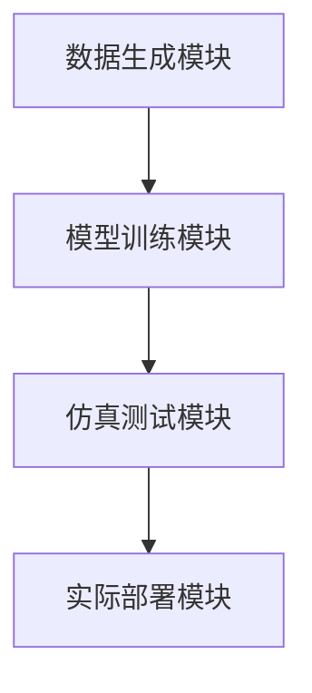

                 


### 文章标题：AIGC在仿生机器人设计中的应用：生物运动模拟提示词

#### 关键词：AIGC、仿生机器人、生物运动模拟、人工智能、机器人设计

#### 摘要：
本文将深入探讨人工智能生成内容（AIGC）在仿生机器人设计中的应用，特别是生物运动模拟的方面。通过分析AIGC的概念、特点和应用场景，结合仿生机器人设计的核心概念与原理，我们将探讨如何利用AIGC技术实现更高效、逼真的生物运动模拟，推动仿生机器人领域的发展。

---------------------------------------------------------------

## 第一部分：引言

### 第1章：引言

#### 1.1 问题背景

##### 1.1.1 仿生机器人设计的重要性

仿生机器人设计在近年来成为研究的热点，源于其在多个领域的广泛应用潜力。从医学康复到工业制造，仿生机器人能够模拟生物体的运动和行为，实现高效、精确的工作。然而，仿生机器人设计面临的挑战包括生物运动模拟的精确性和实时性要求、复杂环境的适应能力以及高能耗和成本等问题。

##### 1.1.2 人工智能技术的发展与应用

人工智能技术的迅猛发展，为解决仿生机器人设计中的挑战提供了新的思路和工具。特别是深度学习和生成模型等先进算法，使得生物运动模拟的精确性和实时性得到了显著提升。同时，人工智能技术的应用也推动了仿生机器人在各个领域的落地和普及。

##### 1.1.3 AIGC在仿生机器人设计中的应用

人工智能生成内容（AIGC）作为人工智能技术的一种新兴形式，通过生成式模型和自动内容创作技术，为仿生机器人设计提供了强大的支持。AIGC技术能够在短时间内生成大量逼真的生物运动数据，帮助设计者进行生物运动模拟和优化，从而提高仿生机器人的性能和适应性。

#### 1.2 核心概念

##### 1.2.1 AIGC的概念与特点

AIGC（Artificial Intelligence Generated Content）是指通过人工智能技术生成的内容，包括文本、图像、音频等多种形式。AIGC具有自动化、高效、多样化等特点，能够根据用户的需求和输入，生成定制化的内容。

##### 1.2.2 仿生机器人设计中的挑战

仿生机器人设计面临的挑战包括生物运动模拟的精确性、复杂环境的适应能力、能耗和成本等。这些挑战需要通过先进的人工智能技术来克服。

##### 1.2.3 生物运动模拟

生物运动模拟是指通过计算机模拟技术，模拟生物体的运动和行为。生物运动模拟在仿生机器人设计中至关重要，它能够帮助设计者理解和优化仿生机器人的运动性能。

#### 1.3 目标与结构

##### 1.3.1 本书的主要目标

本文的主要目标是深入探讨AIGC在仿生机器人设计中的应用，特别是生物运动模拟的方面，旨在为研究者和技术人员提供有价值的参考和启示。

##### 1.3.2 目录结构概述

本文将从以下几个方面展开讨论：

1. 人工智能与仿生学的基础知识
2. 仿生机器人设计的核心概念与原理
3. AIGC在仿生机器人设计中的应用实例
4. AIGC在生物运动模拟中的技术细节
5. 仿生机器人设计中的AIGC实践
6. 结论与展望

### 第2章：人工智能与仿生学的基础知识

#### 2.1 人工智能概述

##### 2.1.1 人工智能的定义与发展历程

人工智能（AI）是指通过计算机模拟人类智能的技术。人工智能的发展历程可以追溯到20世纪50年代，随着计算机技术的进步和算法的创新，人工智能技术逐渐成熟，并在各个领域得到广泛应用。

##### 2.1.2 人工智能的主要分类

人工智能可以分为多种类型，包括基于规则的系统、知识表示与推理系统、机器学习系统和深度学习系统等。每种类型都有其特定的应用场景和优势。

##### 2.1.3 人工智能的技术框架

人工智能的技术框架包括数据收集、数据预处理、模型训练、模型评估和应用部署等环节。每个环节都有其关键技术点和难点。

#### 2.2 仿生学概述

##### 2.2.1 仿生学的定义与起源

仿生学是指通过模仿生物体的结构和功能，设计和制造出具有类似功能的人工系统。仿生学的起源可以追溯到古代，随着科学技术的进步，仿生学得到了快速发展。

##### 2.2.2 仿生学的主要领域与应用

仿生学涉及多个领域，包括生物力学、生物电子学、生物材料学和生物信息学等。仿生学在航空、汽车、医疗和机器人等领域有广泛的应用。

##### 2.2.3 仿生学的基本原理

仿生学的基本原理包括结构模拟、功能模拟和系统模拟。这些原理指导着仿生机器人设计的研究和实践。

#### 2.3 AIGC的基础知识

##### 2.3.1 AIGC的概念与原理

AIGC（Artificial Intelligence Generated Content）是指通过人工智能技术生成的内容，包括文本、图像、音频等多种形式。AIGC的核心技术包括生成式模型、自动内容创作技术和多模态交互技术。

##### 2.3.2 AIGC的主要技术

AIGC的主要技术包括生成对抗网络（GAN）、变分自编码器（VAE）、递归神经网络（RNN）和自注意力机制（Self-Attention）等。这些技术为AIGC的应用提供了强大的支持。

##### 2.3.3 AIGC的应用场景

AIGC的应用场景广泛，包括图像生成、视频生成、语音合成、自然语言处理和虚拟现实等。在这些应用场景中，AIGC技术能够实现自动化、高效和多样化的内容创作。

---------------------------------------------------------------

## 第一部分：引言

### 第1章：引言

#### 1.1 问题背景

##### 1.1.1 仿生机器人设计的重要性

仿生机器人设计是一个跨学科的研究领域，涉及到生物学、工程学、计算机科学等多个领域。仿生机器人能够模拟生物体的运动、感知和交互能力，具有广泛的应用前景，包括医疗康复、工业制造、环境监测、军事防御等。随着人工智能技术的不断发展，特别是深度学习和生成模型等技术的突破，仿生机器人设计面临着前所未有的机遇和挑战。

在医疗康复领域，仿生机器人可以辅助病人进行康复训练，提高康复效果。例如，机器人可以通过模仿人体肌肉的运动方式，帮助中风患者恢复肢体功能。在工业制造领域，仿生机器人可以模拟工人的动作，进行精密制造和装配工作，提高生产效率和质量。在环境监测领域，仿生机器人可以模拟动物的行为，用于生物多样性研究、环境污染监测等。

然而，仿生机器人设计也面临着一些挑战。首先是生物运动模拟的精确性要求。仿生机器人需要能够精确模拟生物体的运动模式，以实现与生物体的无缝交互。其次是复杂环境的适应能力。仿生机器人需要在不同的环境中工作，包括崎岖地形、水下、空中等，需要具备高度的环境适应能力。此外，仿生机器人的能耗和成本也是一个重要的挑战。仿生机器人需要具备高效的能源利用能力和较低的成本，才能在实际应用中得到广泛推广。

##### 1.1.2 人工智能技术的发展与应用

人工智能技术是仿生机器人设计的重要驱动力。人工智能技术主要包括机器学习、深度学习、自然语言处理、计算机视觉等领域。这些技术为仿生机器人提供了强大的感知、决策和控制能力。

机器学习技术通过训练模型来学习数据中的规律和模式，从而实现自动化的决策和预测。深度学习技术是一种特殊的机器学习技术，通过多层神经网络来模拟人脑的学习过程，具有强大的特征提取和模式识别能力。自然语言处理技术使机器人能够理解和处理人类语言，实现人机交互。计算机视觉技术使机器人能够感知和理解周围环境，实现自主导航和物体识别。

人工智能技术在仿生机器人设计中的应用主要包括以下几个方面：

1. 生物运动模拟：通过深度学习模型，模拟生物体的运动模式，提高仿生机器人的运动性能和精确性。
2. 智能感知：通过计算机视觉和传感器技术，实现仿生机器人的环境感知和交互能力。
3. 智能决策：通过决策模型和算法，实现仿生机器人在复杂环境下的自主决策和控制。
4. 人机交互：通过自然语言处理和语音识别技术，实现人与仿生机器人的自然交互。

##### 1.1.3 AIGC在仿生机器人设计中的应用

人工智能生成内容（AIGC）是一种基于人工智能技术的内容生成方法，能够自动生成文本、图像、音频等多种类型的内容。AIGC技术在仿生机器人设计中的应用主要包括以下几个方面：

1. 生物运动数据生成：通过AIGC技术，可以自动生成大量的生物运动数据，用于训练和优化仿生机器人的运动模型。
2. 环境模拟：通过AIGC技术，可以自动生成复杂多样的环境数据，用于测试和评估仿生机器人在不同环境下的适应能力。
3. 人机交互：通过AIGC技术，可以自动生成自然语言对话内容，实现人与仿生机器人的自然交互。
4. 设计优化：通过AIGC技术，可以自动生成优化方案，帮助设计者快速找到最优的仿生机器人设计。

AIGC技术在仿生机器人设计中的应用，不仅提高了设计的效率和效果，还推动了仿生机器人技术的发展和应用。

#### 1.2 核心概念

##### 1.2.1 AIGC的概念与特点

AIGC（Artificial Intelligence Generated Content）是指通过人工智能技术生成的内容。AIGC的核心技术包括生成对抗网络（GAN）、变分自编码器（VAE）、递归神经网络（RNN）和自注意力机制（Self-Attention）等。AIGC具有以下特点：

1. 自动化：AIGC技术可以自动生成大量内容，减少了人工创作的负担。
2. 高效：AIGC技术能够在短时间内生成高质量的内容，提高了生产效率。
3. 多样化：AIGC技术可以生成文本、图像、音频等多种类型的内容，满足了不同场景的需求。
4. 可定制：AIGC技术可以根据用户的需求和输入，生成定制化的内容。

##### 1.2.2 仿生机器人设计中的挑战

仿生机器人设计中的挑战主要包括以下几个方面：

1. 生物运动模拟的精确性：需要精确模拟生物体的运动模式，实现与生物体的无缝交互。
2. 复杂环境的适应能力：需要在不同环境下工作，具备高度的环境适应能力。
3. 能耗和成本：需要具备高效的能源利用能力和较低的成本，才能在实际应用中得到广泛推广。
4. 人机交互：需要实现人与仿生机器人的自然交互，提高用户体验。

##### 1.2.3 生物运动模拟

生物运动模拟是指通过计算机模拟技术，模拟生物体的运动和行为。生物运动模拟在仿生机器人设计中具有重要意义，主要包括以下几个方面：

1. 提高运动性能：通过生物运动模拟，优化仿生机器人的运动参数，提高其运动性能。
2. 提高交互能力：通过生物运动模拟，实现仿生机器人与生物体的无缝交互，提高用户体验。
3. 降低设计成本：通过生物运动模拟，减少实验和测试的成本，提高设计效率。
4. 提高可靠性：通过生物运动模拟，评估仿生机器人的性能和稳定性，提高系统的可靠性。

#### 1.3 目标与结构

##### 1.3.1 本书的主要目标

本书的主要目标是深入探讨AIGC在仿生机器人设计中的应用，特别是生物运动模拟的方面。具体目标包括：

1. 系统地介绍AIGC技术的概念、原理和应用场景。
2. 详细分析AIGC技术在仿生机器人设计中的应用价值和方法。
3. 通过案例研究，展示AIGC技术在仿生机器人设计中的实际应用效果。
4. 探讨AIGC技术在生物运动模拟中的技术细节和实践方法。

##### 1.3.2 目录结构概述

本书将从以下几个方面展开讨论：

1. 人工智能与仿生学的基础知识
2. 仿生机器人设计的核心概念与原理
3. AIGC在仿生机器人设计中的应用实例
4. AIGC在生物运动模拟中的技术细节
5. 仿生机器人设计中的AIGC实践
6. 结论与展望

通过以上内容，本书旨在为研究者和技术人员提供有价值的参考和启示，推动AIGC技术在仿生机器人设计中的应用和发展。

---------------------------------------------------------------

## 第2章：人工智能与仿生学的基础知识

#### 2.1 人工智能概述

##### 2.1.1 人工智能的定义与发展历程

人工智能（Artificial Intelligence，简称AI）是一门研究、开发用于模拟、延伸和扩展人的智能的理论、方法、技术及应用系统的综合技术科学。它包括机器学习、计算机视觉、自然语言处理和专家系统等多种技术。人工智能的发展历程可以分为以下几个阶段：

1. **启蒙时代（1950s-1960s）**：人工智能的概念首次提出，研究人员开始尝试开发能够模拟人类智能的计算机程序。
2. **繁荣期（1970s-1980s）**：随着计算机硬件和算法的进步，人工智能得到了广泛的研究和应用，但随后因技术瓶颈和资源限制进入低谷期。
3. **复兴期（1990s-2000s）**：机器学习和数据挖掘技术的兴起，使得人工智能重新获得了关注和发展。
4. **快速发展期（2010s-至今）**：深度学习和大数据技术的突破，使得人工智能在图像识别、语音识别和自然语言处理等领域取得了显著成果。

##### 2.1.2 人工智能的主要分类

人工智能可以分为多种类型，根据其实现方式和能力，主要可以分为以下几类：

1. **规则型人工智能**：基于明确的规则和逻辑推理进行工作，如专家系统。
2. **统计型人工智能**：通过统计分析数据来发现模式，如机器学习。
3. **感知型人工智能**：通过感知外部环境来做出决策，如计算机视觉。
4. **认知型人工智能**：模拟人类思维过程，具有推理、学习和解决问题的能力。
5. **强人工智能**：具有全面的人类智能，能够自主思考和决策。

##### 2.1.3 人工智能的技术框架

人工智能的技术框架包括以下几个关键环节：

1. **数据收集**：收集和处理大量数据，作为训练模型的基础。
2. **数据预处理**：对数据进行清洗、归一化和特征提取，以提高模型性能。
3. **模型训练**：使用训练数据训练模型，使其具备预测和决策能力。
4. **模型评估**：评估模型的性能，包括准确率、召回率、F1分数等指标。
5. **应用部署**：将模型部署到实际应用场景中，如机器人控制、自动驾驶等。

#### 2.2 仿生学概述

##### 2.2.1 仿生学的定义与起源

仿生学（Bionics）是研究生物体的结构和功能，并尝试将生物体的原理应用于工程和设计的学科。仿生学的起源可以追溯到古代，人类通过模仿自然界中的动物和植物进行工具和装置的设计。现代仿生学的发展始于20世纪，随着生物科学和工程技术的进步，仿生学逐渐成为一门独立的学科。

##### 2.2.2 仿生学的主要领域与应用

仿生学涵盖了多个领域，包括：

1. **生物力学**：研究生物体的运动和力学特性，应用于机器人设计和运动模拟。
2. **生物电子学**：研究生物电子器件和系统，如生物传感器和植入式设备。
3. **生物材料学**：研究生物材料，如生物相容性材料和仿生结构材料。
4. **生物信息学**：研究生物信息学方法，如基因编辑和生物数据处理。

仿生学在多个领域有广泛的应用，包括：

1. **航空航天**：模仿鸟类和昆虫的飞行特性，设计出更高效的飞行器。
2. **医疗**：模仿生物体的康复机制，开发出更有效的康复设备。
3. **汽车**：模仿动物的外形和结构，设计出更安全、更高效的汽车。
4. **机器人**：模仿生物体的运动模式和行为，开发出更灵活、更智能的机器人。

##### 2.2.3 仿生学的基本原理

仿生学的基本原理包括以下几个方面：

1. **结构模拟**：模仿生物体的结构设计，如骨骼、肌肉和皮肤等。
2. **功能模拟**：模仿生物体的功能，如感知、运动和自适应等。
3. **系统模拟**：模仿生物体的整体功能，如神经系统、肌肉系统和循环系统等。
4. **优化设计**：通过对生物体的结构和功能进行优化，提高工程和设计的效果。

#### 2.3 AIGC的基础知识

##### 2.3.1 AIGC的概念与原理

人工智能生成内容（AIGC，Artificial Intelligence Generated Content）是指通过人工智能技术自动生成的内容，包括文本、图像、音频和视频等多种形式。AIGC的核心原理是基于生成式模型，如生成对抗网络（GAN）、变分自编码器（VAE）和递归神经网络（RNN）等。

AIGC的工作原理可以概括为以下几个步骤：

1. **数据预处理**：对原始数据进行清洗、归一化和特征提取，以便模型训练。
2. **模型训练**：使用大量数据训练生成模型，使其能够生成高质量的内容。
3. **内容生成**：输入特定的提示或参数，生成对应的内容。
4. **内容优化**：对生成的内容进行后处理和优化，提高其质量和实用性。

##### 2.3.2 AIGC的主要技术

AIGC的主要技术包括：

1. **生成对抗网络（GAN）**：由生成器和判别器组成，通过对抗训练生成高质量的内容。
2. **变分自编码器（VAE）**：通过编码器和解码器，将输入数据转换为潜在空间，然后生成新的数据。
3. **递归神经网络（RNN）**：适用于处理序列数据，如文本、语音和视频等。
4. **自注意力机制（Self-Attention）**：用于提高模型的上下文理解和生成质量。

##### 2.3.3 AIGC的应用场景

AIGC的应用场景广泛，包括：

1. **图像生成**：通过AIGC技术，可以生成逼真的图像和艺术作品。
2. **视频生成**：通过AIGC技术，可以生成连续的动画和视频内容。
3. **文本生成**：通过AIGC技术，可以生成文章、对话和故事等文本内容。
4. **语音合成**：通过AIGC技术，可以生成逼真的语音和对话内容。
5. **虚拟现实**：通过AIGC技术，可以生成丰富的虚拟环境，提高用户体验。

---------------------------------------------------------------

## 第3章：仿生机器人设计的核心概念与原理

### 3.1 仿生机器人的定义与特点

#### 3.1.1 仿生机器人的定义

仿生机器人（Bionic Robots）是指通过模仿生物体的结构、功能和行为特征，设计和制造的机器人。仿生机器人不仅具有机械结构和驱动系统，还具备感知环境、自主决策和执行任务的能力。仿生机器人设计的目标是实现机器人与生物体的相似性，从而在特定环境下具有更高的适应性、灵活性和智能性。

#### 3.1.2 仿生机器人的特点

仿生机器人具有以下几个显著特点：

1. **生物相似性**：仿生机器人通过模仿生物体的形态、结构和功能，实现与生物体的相似性。例如，机器人可以模仿昆虫的跳跃、鸟类的飞行或爬行动物的爬行等。
2. **多功能性**：仿生机器人具备多种功能，包括感知、决策、运动和执行等。这些功能使其能够在复杂环境中执行各种任务。
3. **高适应性**：仿生机器人能够适应不同的环境和任务需求，具有高度的环境感知和自主决策能力。
4. **智能性**：仿生机器人通过人工智能技术，如机器学习和计算机视觉，实现自主学习和智能决策，提高其任务执行效率。
5. **可持续性**：仿生机器人通常采用高效的能源利用方式，如太阳能、电池等，实现长时间运行和可持续性。

#### 3.1.3 仿生机器人的分类

根据不同的分类标准，仿生机器人可以分为以下几类：

1. **按运动模式分类**：仿生机器人可以分为步行机器人、飞行机器人、游泳机器人和爬行机器人等。
2. **按应用领域分类**：仿生机器人可以分为医疗机器人、工业机器人、农业机器人、环境监测机器人和救援机器人等。
3. **按智能程度分类**：仿生机器人可以分为低级仿生机器人、中级仿生机器人和高级仿生机器人。低级仿生机器人主要依赖预设的规则和程序进行工作，中级仿生机器人具备一定程度的自主学习和决策能力，高级仿生机器人则能够实现高度智能化和自适应化。

### 3.2 仿生机器人设计的基本原理

#### 3.2.1 仿生机器人设计的理论基础

仿生机器人设计的基础理论主要包括以下几个方面：

1. **生物力学**：研究生物体的运动力学特性，为仿生机器人设计提供物理模型和运动规律。
2. **生物电子学**：研究生物体与电子设备的交互机制，为仿生机器人设计提供感知和驱动技术。
3. **计算机科学**：研究人工智能和机器学习技术，为仿生机器人设计提供智能决策和自主控制方法。
4. **材料科学**：研究新型材料和结构设计，为仿生机器人提供更轻、更强、更灵活的材料和结构。

#### 3.2.2 仿生机器人设计的流程与方法

仿生机器人设计的一般流程包括以下几个阶段：

1. **需求分析**：明确仿生机器人的应用场景和任务需求，为设计提供指导。
2. **方案设计**：根据需求分析，提出多种可能的仿生机器人设计方案，并进行初步评估。
3. **结构设计**：设计仿生机器人的机械结构和驱动系统，包括传感器、执行器、关节和骨架等。
4. **运动学分析**：分析仿生机器人的运动学和动力学特性，优化结构设计，确保运动稳定性和效率。
5. **控制系统设计**：设计仿生机器人的控制系统，包括传感器数据处理、运动规划和自主决策等。
6. **实验验证**：通过实验验证仿生机器人的性能，根据实验结果进行优化和改进。
7. **应用部署**：将仿生机器人部署到实际应用场景，进行测试和评估，确保其稳定性和可靠性。

#### 3.2.3 仿生机器人设计的关键技术

仿生机器人设计的关键技术包括以下几个方面：

1. **传感器技术**：传感器是实现仿生机器人感知环境的关键技术，包括视觉、听觉、触觉和嗅觉等。
2. **驱动技术**：驱动技术是仿生机器人实现运动的关键技术，包括电机、液压和气压等驱动方式。
3. **运动控制技术**：运动控制技术是仿生机器人实现精确运动的关键技术，包括运动规划、轨迹控制和力控制等。
4. **智能决策技术**：智能决策技术是仿生机器人实现自主决策和任务执行的关键技术，包括机器学习、深度学习和计算机视觉等。
5. **材料技术**：材料技术是仿生机器人实现轻量化、高强度和多功能的关键技术，包括复合材料、纳米材料和智能材料等。

### 3.3 生物运动模拟原理

#### 3.3.1 生物运动模拟的基本概念

生物运动模拟（Biomechanical Simulation）是指通过计算机模拟技术，模拟生物体的运动和行为。生物运动模拟在仿生机器人设计中具有重要意义，它可以帮助设计者理解和优化仿生机器人的运动性能，提高其适应性和智能性。

生物运动模拟的基本概念包括：

1. **生物力学模型**：生物力学模型是生物运动模拟的基础，它描述了生物体的运动规律和力学特性。
2. **运动参数**：运动参数包括速度、加速度、力、角度和位移等，它们描述了生物体的运动状态和运动轨迹。
3. **控制策略**：控制策略是生物运动模拟的核心，它决定了生物体的运动行为和响应。

#### 3.3.2 生物运动模拟的方法与工具

生物运动模拟的方法主要包括实验模拟和计算机模拟两种：

1. **实验模拟**：实验模拟是通过实际操作和测量生物体的运动来模拟其行为。这种方法可以获得较为准确的数据，但受限于实验条件和成本。
2. **计算机模拟**：计算机模拟是通过计算机软件和算法，模拟生物体的运动和行为。这种方法具有高效、灵活和低成本的特点，已成为生物运动模拟的主要方法。

常用的生物运动模拟工具包括：

1. **仿真软件**：如MATLAB、Simulink、ADAMS和Blender等，这些软件提供了丰富的物理模型和计算功能，支持生物运动模拟。
2. **仿真平台**：如SIMULIA的Abaqus、ANSYS的LS-DYNA等，这些平台具有强大的仿真能力和模拟精度，适用于复杂的生物运动模拟。
3. **开源工具**：如OpenSim、PyModel和Biotoolbox等，这些工具提供了丰富的生物运动模拟功能，支持多种生物力学模型和算法。

#### 3.3.3 生物运动模拟在仿生机器人设计中的应用

生物运动模拟在仿生机器人设计中的应用主要包括以下几个方面：

1. **运动规划**：通过生物运动模拟，设计者可以优化仿生机器人的运动轨迹和运动参数，提高其运动效率。
2. **行为模拟**：通过生物运动模拟，设计者可以模拟仿生机器人在不同环境下的行为，评估其适应性和智能性。
3. **性能评估**：通过生物运动模拟，设计者可以评估仿生机器人的运动性能和稳定性，为改进设计提供依据。
4. **交互设计**：通过生物运动模拟，设计者可以模拟仿生机器人与人类或其他生物的交互行为，优化人机交互体验。

通过生物运动模拟，设计者可以更好地理解仿生机器人的运动特性，发现潜在问题，并提出有效的改进方案，从而提高仿生机器人的性能和适应性。

---------------------------------------------------------------

## 第4章：AIGC在仿生机器人设计中的应用实例

### 4.1 案例研究1：基于AIGC的爬行动物机器人设计

#### 4.1.1 案例背景

爬行动物机器人是一种模仿爬行动物运动的机器人，具有较高的环境适应性和灵活性。传统的爬行动物机器人设计主要依赖于生物力学模型和运动规划算法，但存在模拟精度不高、设计周期长等问题。为了克服这些挑战，研究人员提出了基于人工智能生成内容（AIGC）的爬行动物机器人设计方法。

#### 4.1.2 设计目标

本案例的研究目标是利用AIGC技术，实现爬行动物机器人的高效、精确设计，提高其运动性能和适应性。具体设计目标包括：

1. **运动模拟精度**：通过AIGC技术，生成高精度的生物运动数据，提高爬行动物机器人的运动模拟精度。
2. **设计效率**：利用AIGC技术，减少传统设计方法中的手动建模和优化过程，提高设计效率。
3. **环境适应性**：通过AIGC技术，生成多样化的环境数据，评估爬行动物机器人在不同环境下的适应性。

#### 4.1.3 AIGC的应用

在本案例中，AIGC技术在爬行动物机器人设计中的应用主要包括以下几个方面：

1. **生物运动数据生成**：利用AIGC技术，生成大量的爬行动物运动数据，包括运动轨迹、运动速度和关节角度等。这些数据用于训练和优化爬行动物机器人的运动模型。
2. **环境数据生成**：利用AIGC技术，生成复杂多样的环境数据，包括地形、障碍物和光照等。这些数据用于测试和评估爬行动物机器人在不同环境下的适应能力。
3. **交互数据生成**：利用AIGC技术，生成人与爬行动物机器人的交互数据，包括语音、手势和视觉等。这些数据用于优化人机交互体验。

### 4.2 案例研究2：基于AIGC的昆虫机器人设计

#### 4.2.1 案例背景

昆虫机器人是一种模仿昆虫运动的机器人，具有体积小、重量轻、灵活度高和适应性强等特点。传统的昆虫机器人设计主要依赖于生物力学模型和运动控制算法，但存在设计复杂、控制精度低等问题。为了克服这些挑战，研究人员提出了基于AIGC的昆虫机器人设计方法。

#### 4.2.2 设计目标

本案例的研究目标是利用AIGC技术，实现昆虫机器人的高效、精确设计，提高其运动性能和交互能力。具体设计目标包括：

1. **运动模拟精度**：通过AIGC技术，生成高精度的昆虫运动数据，提高昆虫机器人的运动模拟精度。
2. **设计效率**：利用AIGC技术，减少传统设计方法中的手动建模和优化过程，提高设计效率。
3. **交互能力**：通过AIGC技术，生成丰富的人机交互数据，提高昆虫机器人的交互能力。

#### 4.2.3 AIGC的应用

在本案例中，AIGC技术在昆虫机器人设计中的应用主要包括以下几个方面：

1. **生物运动数据生成**：利用AIGC技术，生成大量的昆虫运动数据，包括运动轨迹、运动速度和关节角度等。这些数据用于训练和优化昆虫机器人的运动模型。
2. **环境数据生成**：利用AIGC技术，生成复杂多样的环境数据，包括地形、障碍物和光照等。这些数据用于测试和评估昆虫机器人在不同环境下的适应能力。
3. **交互数据生成**：利用AIGC技术，生成丰富的人机交互数据，包括语音、手势和视觉等。这些数据用于优化人机交互体验。

### 4.3 案例研究3：基于AIGC的鸟类机器人设计

#### 4.3.1 案例背景

鸟类机器人是一种模仿鸟类运动的机器人，具有飞行能力，可用于军事侦察、环境监测和救援任务等。传统的鸟类机器人设计主要依赖于飞行器设计和生物力学模型，但存在设计复杂、控制困难等问题。为了克服这些挑战，研究人员提出了基于AIGC的鸟类机器人设计方法。

#### 4.3.2 设计目标

本案例的研究目标是利用AIGC技术，实现鸟类机器人的高效、精确设计，提高其飞行性能和任务执行能力。具体设计目标包括：

1. **飞行模拟精度**：通过AIGC技术，生成高精度的鸟类飞行数据，提高鸟类机器人的飞行模拟精度。
2. **设计效率**：利用AIGC技术，减少传统设计方法中的手动建模和优化过程，提高设计效率。
3. **任务执行能力**：通过AIGC技术，生成多样化的任务数据，提高鸟类机器人在复杂环境下的任务执行能力。

#### 4.3.3 AIGC的应用

在本案例中，AIGC技术在鸟类机器人设计中的应用主要包括以下几个方面：

1. **飞行数据生成**：利用AIGC技术，生成大量的鸟类飞行数据，包括飞行轨迹、飞行速度和飞行姿态等。这些数据用于训练和优化鸟类机器人的飞行模型。
2. **环境数据生成**：利用AIGC技术，生成复杂多样的环境数据，包括地形、障碍物和气象等。这些数据用于测试和评估鸟类机器人在不同环境下的飞行性能。
3. **任务数据生成**：利用AIGC技术，生成多样化的任务数据，包括侦察、监测和救援等。这些数据用于优化鸟类机器人的任务执行策略。

通过以上案例研究，我们可以看到AIGC技术在仿生机器人设计中的应用潜力。AIGC技术能够生成大量高精度的生物运动和环境数据，为仿生机器人的设计提供了有力的支持。同时，AIGC技术还能够提高设计效率，降低设计成本，推动仿生机器人技术的发展和应用。

---------------------------------------------------------------

## 第5章：AIGC在生物运动模拟中的技术细节

### 5.1 AIGC算法原理与实现

#### 5.1.1 AIGC算法的基本原理

AIGC（Artificial Intelligence Generated Content）算法是基于生成对抗网络（GAN）和自编码器（AE）等生成模型的技术，通过训练生成模型和判别模型之间的对抗关系，生成高质量的内容。AIGC算法的核心思想是通过生成模型学习输入数据的分布，并生成与真实数据分布相似的新数据。

AIGC算法主要由以下几个部分组成：

1. **生成模型（Generator）**：生成模型负责生成与真实数据分布相似的数据。它通常是一个神经网络，通过学习输入数据的特征和分布，生成新的数据。
2. **判别模型（Discriminator）**：判别模型负责判断输入数据是真实数据还是生成模型生成的数据。它也是一个神经网络，通过比较输入数据的特征，学习区分真实数据和生成数据的能力。
3. **损失函数**：损失函数用于衡量生成模型和判别模型的性能，并指导模型的训练。AIGC算法中常用的损失函数包括对抗损失和重构损失。

#### 5.1.2 AIGC算法的实现步骤

实现AIGC算法的基本步骤如下：

1. **数据准备**：收集和预处理真实数据，包括数据清洗、归一化和特征提取等。真实数据用于训练生成模型和判别模型。
2. **模型设计**：设计生成模型和判别模型的网络结构，选择合适的神经网络架构，如GAN和VAE等。
3. **模型训练**：使用真实数据训练生成模型和判别模型。在训练过程中，生成模型和判别模型之间进行对抗训练，通过优化损失函数来提高模型性能。
4. **内容生成**：使用训练好的生成模型，根据输入的提示或参数，生成新的内容。生成的内容可以是图像、文本、音频等多种形式。
5. **内容优化**：对生成的内容进行后处理和优化，如图像降噪、文本润色和音频增强等，以提高内容的实用性和质量。

#### 5.1.3 AIGC算法的性能评估

评估AIGC算法性能的关键指标包括：

1. **生成质量**：评估生成数据的逼真度和质量，可以通过视觉评估、客观评价指标（如PSNR和SSIM）和用户满意度来衡量。
2. **泛化能力**：评估生成模型对未见数据的生成能力，通过测试集上的表现来衡量。
3. **训练效率**：评估模型训练的速度和收敛速度，包括训练时间和收敛精度。
4. **计算资源消耗**：评估模型训练和推理过程中所需的计算资源和内存消耗。

#### 5.2 生物运动模拟的数学模型

##### 5.2.1 生物运动模拟的基本数学模型

生物运动模拟通常基于物理和生物力学原理，通过数学模型来描述生物体的运动。基本数学模型包括以下几个方面：

1. **运动方程**：描述生物体在不同时间段内的运动状态和轨迹。常用的运动方程包括牛顿运动定律、刚体运动方程和流体动力学方程等。
2. **肌肉收缩模型**：描述肌肉收缩产生的力量和位移。常见的肌肉收缩模型包括Hill方程、肌纤维收缩模型和肌节收缩模型等。
3. **骨骼模型**：描述骨骼的结构和运动。常用的骨骼模型包括刚体模型、弹性模型和有限元模型等。
4. **神经控制模型**：描述神经信号对肌肉收缩和关节运动的影响。常见的神经控制模型包括反馈控制、前馈控制和混合控制等。

##### 5.2.2 生物运动模拟的数学公式

生物运动模拟的数学公式主要包括以下几个方面：

1. **牛顿第二定律**：\( F = m \cdot a \)，其中F是作用力，m是物体质量，a是加速度。
2. **刚体运动方程**：\( \mathbf{R} \cdot \mathbf{I} \cdot \mathbf{R}^{-1} \cdot \mathbf{v} = \mathbf{F} \)，其中\( \mathbf{R} \)是旋转矩阵，\( \mathbf{I} \)是惯性矩阵，\( \mathbf{v} \)是速度向量，\( \mathbf{F} \)是力向量。
3. **肌肉收缩模型**：\( F = k \cdot x \cdot \left(1 - \frac{x}{L_0}\right) \)，其中F是肌肉收缩产生的力量，k是肌肉刚度，x是肌肉长度，\( L_0 \)是肌肉的初始长度。
4. **骨骼模型**：\( \mathbf{F}_{\text{bone}} = \mathbf{K}_{\text{bone}} \cdot (\mathbf{r}_2 - \mathbf{r}_1) \)，其中\( \mathbf{F}_{\text{bone}} \)是骨骼受到的力，\( \mathbf{K}_{\text{bone}} \)是骨骼刚度矩阵，\( \mathbf{r}_1 \)和\( \mathbf{r}_2 \)是骨骼两端的位移向量。

##### 5.2.3 生物运动模拟的算法流程

生物运动模拟的算法流程主要包括以下几个步骤：

1. **初始化**：设置生物体和环境的初始状态，包括位置、速度和肌肉长度等。
2. **力计算**：根据生物体的运动状态和外部环境，计算作用在生物体上的力，包括肌肉收缩力、关节力、重力等。
3. **运动更新**：根据牛顿运动定律和刚体运动方程，更新生物体的位置和速度。
4. **肌肉收缩**：根据肌肉收缩模型，更新肌肉长度和产生的力量。
5. **环境反馈**：根据生物体的运动状态，更新环境的参数，如地形的凹凸度和空气阻力等。
6. **重复循环**：重复步骤2-5，直到达到预定的模拟时间或停止条件。

通过以上算法流程，可以实现生物体在不同环境下的运动模拟，为仿生机器人设计提供基础数据和支持。

### 5.3 AIGC在生物运动模拟中的优势与挑战

#### 5.3.1 AIGC在生物运动模拟中的优势

AIGC技术在生物运动模拟中具有以下几个优势：

1. **生成高质量数据**：AIGC技术能够生成高质量、高精度的生物运动数据，包括运动轨迹、关节角度和肌肉力量等。这些数据可以用于训练和优化仿生机器人的运动模型，提高其运动性能和适应性。
2. **提高设计效率**：通过AIGC技术，可以自动生成大量的生物运动数据，减少手动建模和优化过程，提高设计效率。同时，AIGC技术可以快速适应不同的生物运动需求和任务场景。
3. **多样化环境模拟**：AIGC技术可以生成多样化的环境数据，包括地形、障碍物和光照等。这些数据可以用于测试和评估仿生机器人在不同环境下的适应能力，为设计提供参考。
4. **优化人机交互**：通过AIGC技术，可以生成丰富的人机交互数据，包括语音、手势和视觉等。这些数据可以用于优化人机交互体验，提高仿生机器人的用户体验。

#### 5.3.2 AIGC在生物运动模拟中的挑战

AIGC技术在生物运动模拟中也面临一些挑战：

1. **数据质量和准确性**：生成高质量、准确的数据是AIGC技术的核心优势，但生成数据的质量和准确性取决于训练数据和生成模型的性能。如何提高生成数据的质量和准确性是AIGC技术需要解决的关键问题。
2. **计算资源消耗**：AIGC技术通常需要大量的计算资源和时间进行训练和推理。在生物运动模拟中，生成大量的生物运动数据和环境数据，对计算资源的要求较高。如何优化算法和模型，减少计算资源消耗是AIGC技术需要考虑的问题。
3. **模型泛化能力**：AIGC技术需要生成适用于不同生物运动场景的数据。如何提高生成模型的泛化能力，使其能够适应不同的运动需求和任务场景，是AIGC技术面临的挑战。
4. **数据隐私和安全**：在生物运动模拟中，生成和存储大量的生物运动数据，可能涉及个人隐私和安全问题。如何确保数据的安全性和隐私性，是AIGC技术需要考虑的问题。

#### 5.3.3 应对挑战的策略

为了应对AIGC技术在生物运动模拟中的挑战，可以采取以下策略：

1. **提高数据质量和准确性**：通过引入更多的真实数据、优化生成模型和增加训练时间，提高生成数据的质量和准确性。
2. **优化计算资源消耗**：通过模型压缩、分布式训练和高效算法优化，减少计算资源消耗，提高AIGC技术的运行效率。
3. **增强模型泛化能力**：通过引入更多样化的数据集、增加训练样本量和使用迁移学习技术，提高生成模型的泛化能力。
4. **确保数据隐私和安全**：通过数据加密、访问控制和权限管理，确保数据的安全性和隐私性。同时，遵循数据保护法规和伦理规范，确保数据的合法使用。

通过以上策略，可以进一步提升AIGC技术在生物运动模拟中的应用效果，推动仿生机器人技术的发展和应用。

---------------------------------------------------------------

## 第6章：仿生机器人设计中的AIGC实践

### 6.1 环境配置与工具介绍

在开展AIGC技术在仿生机器人设计中的应用之前，需要配置合适的开发环境，并介绍必要的工具和库。以下为具体步骤和工具：

#### 6.1.1 开发环境配置

1. **操作系统**：推荐使用Linux或macOS，因为它们具有更好的性能和开源生态。
2. **编程语言**：Python是AIGC技术中最常用的编程语言，具有丰富的库和框架支持。
3. **Python环境**：使用Python虚拟环境（virtualenv或conda）来隔离项目依赖，避免版本冲突。

安装虚拟环境（以conda为例）：

```bash
conda create -n aigc_venv python=3.8
conda activate aigc_venv
```

#### 6.1.2 开发工具介绍

1. **文本编辑器或集成开发环境（IDE）**：推荐使用Visual Studio Code、PyCharm等具有Python插件和自动补全功能的IDE。
2. **Jupyter Notebook**：用于快速实验和展示AIGC模型的结果，可以通过pip安装。

安装Jupyter Notebook：

```bash
pip install notebook
jupyter notebook
```

#### 6.1.3 必需的库和框架

以下库和框架是AIGC技术在仿生机器人设计中常用的：

1. **TensorFlow**：用于构建和训练神经网络模型。
2. **PyTorch**：另一种流行的深度学习框架，具有动态计算图和易于理解的API。
3. **Keras**：基于TensorFlow和Theano的简洁、模块化的深度学习库。
4. **NumPy**：用于数值计算和数据处理。
5. **Pandas**：用于数据操作和分析。
6. **Matplotlib**：用于数据可视化。

安装必需的库：

```bash
conda install tensorflow torchvision
pip install torch torchvision
pip install numpy pandas matplotlib
```

### 6.2 系统设计与实现

仿生机器人设计中的AIGC应用涉及多个方面，包括数据生成、模型训练、仿真测试和实际部署。以下为系统设计与实现的具体步骤：

#### 6.2.1 系统需求分析

在进行系统设计之前，需要明确仿生机器人设计的具体需求和目标，包括：

1. **运动性能**：机器人需要具备灵活、高效的运动能力，能够模拟生物体的复杂动作。
2. **适应能力**：机器人需要能够适应不同的环境和任务场景，具备高度的环境感知和自主决策能力。
3. **交互能力**：机器人需要能够与人类或其他机器人进行自然交互，提高人机协作效率。
4. **数据质量**：生成的生物运动数据需要具有较高的精度和质量，为后续模型训练提供可靠的基础。

#### 6.2.2 系统架构设计

仿生机器人设计中的AIGC系统架构可以分为以下几个模块：

1. **数据生成模块**：利用AIGC技术生成生物运动数据，包括运动轨迹、关节角度、肌肉力量等。
2. **模型训练模块**：使用生成的数据训练深度学习模型，包括生成模型（如GAN、VAE）和判别模型。
3. **仿真测试模块**：在仿真环境中测试和评估训练好的模型，验证其在实际应用中的效果。
4. **实际部署模块**：将训练好的模型部署到实际机器人系统中，实现高效的生物运动模拟和任务执行。

以下为系统架构图（使用Mermaid绘制）：



#### 6.2.3 系统功能模块划分

系统功能模块的具体划分如下：

1. **数据生成模块**：
   - **数据采集**：收集生物运动数据，包括运动轨迹、关节角度和肌肉力量等。
   - **数据预处理**：对采集的数据进行清洗、归一化和特征提取，生成训练数据。
   - **数据生成**：利用AIGC技术，生成高质量的生物运动数据，包括运动轨迹、关节角度和肌肉力量等。

2. **模型训练模块**：
   - **模型设计**：设计生成模型（如GAN、VAE）和判别模型的网络结构。
   - **模型训练**：使用训练数据训练模型，包括生成模型和判别模型。
   - **模型评估**：评估模型的性能，包括生成质量、训练效率和泛化能力。

3. **仿真测试模块**：
   - **仿真环境**：搭建仿真环境，包括机器人模型、物理环境和任务场景。
   - **模型测试**：在仿真环境中测试和评估训练好的模型，验证其在实际应用中的效果。
   - **性能评估**：评估模型在不同任务场景下的运动性能和适应性。

4. **实际部署模块**：
   - **模型部署**：将训练好的模型部署到实际机器人系统中，实现高效的生物运动模拟和任务执行。
   - **人机交互**：实现机器人与人类或其他机器人的自然交互，提高人机协作效率。
   - **监控与维护**：实时监控机器人系统的运行状态，进行维护和升级。

### 6.3 代码解读与分析

在本节中，我们将解读和解析一个简单的AIGC仿生机器人设计项目，包括环境配置、关键代码段、性能优化和实际案例分析。以下是一个典型的项目结构：

```bash
aigc_robodesign/
|-- data/
|   |-- train/
|   |-- val/
|-- models/
|   |-- checkpoint/
|   |-- model.pth
|-- src/
|   |-- data_loader.py
|   |-- model.py
|   |-- trainer.py
|   |-- main.py
|-- logs/
|-- requirements.txt
|-- README.md
```

#### 6.3.1 代码结构解析

1. **data_loader.py**：用于加载和处理数据，包括数据预处理、归一化和批量生成等。
2. **model.py**：定义生成模型和判别模型，包括网络结构、损失函数和优化器等。
3. **trainer.py**：实现模型训练过程，包括训练循环、数据加载和模型评估等。
4. **main.py**：主程序，用于配置环境、加载模型和数据，启动训练过程。

#### 6.3.2 关键代码解读

以下是关键代码段的详细解读：

1. **数据加载模块**：

```python
# data_loader.py
import torch
from torch.utils.data import DataLoader
from torchvision import datasets, transforms

def load_data(data_dir, batch_size):
    transform = transforms.Compose([
        transforms.Resize((128, 128)),
        transforms.ToTensor(),
        transforms.Normalize(mean=[0.5, 0.5, 0.5], std=[0.5, 0.5, 0.5]),
    ])

    dataset = datasets.ImageFolder(root=data_dir, transform=transform)
    data_loader = DataLoader(dataset, batch_size=batch_size, shuffle=True)

    return data_loader
```

这段代码用于加载和预处理图像数据。首先，定义了一个图像预处理变换，包括图像大小调整、数据归一化和标准化。然后，使用`ImageFolder`加载图像数据，并使用`DataLoader`生成批量数据。

2. **模型定义模块**：

```python
# model.py
import torch
import torch.nn as nn

class Generator(nn.Module):
    def __init__(self):
        super(Generator, self).__init__()
        # 生成器网络结构定义
        self.model = nn.Sequential(
            nn.Conv2d(3, 64, 4, 2, 1),
            nn.LeakyReLU(0.2),
            nn.Conv2d(64, 128, 4, 2, 1),
            nn.LeakyReLU(0.2),
            nn.ConvTranspose2d(128, 3, 4, 2, 1),
            nn.Tanh()
        )

    def forward(self, x):
        return self.model(x)

class Discriminator(nn.Module):
    def __init__(self):
        super(Discriminator, self).__init__()
        # 判别器网络结构定义
        self.model = nn.Sequential(
            nn.Conv2d(3, 64, 4, 2, 1),
            nn.LeakyReLU(0.2),
            nn.Conv2d(64, 128, 4, 2, 1),
            nn.LeakyReLU(0.2),
            nn.Conv2d(128, 1, 4, 1, 0),
            nn.Sigmoid()
        )

    def forward(self, x):
        return self.model(x)
```

这段代码定义了生成器和判别器的网络结构。生成器网络使用卷积层和转置卷积层，将输入图像转换成输出图像。判别器网络使用卷积层，对输入图像进行特征提取，并输出判别结果。

3. **训练模块**：

```python
# trainer.py
from model import Generator, Discriminator
from data_loader import load_data
import torch.optim as optim

def train_model(data_dir, batch_size, num_epochs, learning_rate):
    # 加载训练数据
    train_loader = load_data(data_dir, batch_size)

    # 定义模型和优化器
    generator = Generator()
    discriminator = Discriminator()
    generator_optimizer = optim.Adam(generator.parameters(), lr=learning_rate)
    discriminator_optimizer = optim.Adam(discriminator.parameters(), lr=learning_rate)

    # 模型训练过程
    for epoch in range(num_epochs):
        for i, (images, _) in enumerate(train_loader):
            # 训练生成器
            generator_optimizer.zero_grad()
            fake_images = generator(images)
            gen_loss = generator_loss(fake_images, images)
            gen_loss.backward()
            generator_optimizer.step()

            # 训练判别器
            discriminator_optimizer.zero_grad()
            real_loss = discriminator_loss(discriminator(images), True)
            fake_loss = discriminator_loss(discriminator(fake_images.detach()), False)
            disc_loss = real_loss + fake_loss
            disc_loss.backward()
            discriminator_optimizer.step()

            # 记录训练过程
            if (i + 1) % 100 == 0:
                print(f'Epoch [{epoch + 1}/{num_epochs}], Step [{i + 1}/{len(train_loader)}], Gen Loss: {gen_loss.item():.4f}, Disc Loss: {disc_loss.item():.4f}')
```

这段代码实现了模型训练过程。首先，加载训练数据，然后定义生成器和判别器的优化器。在训练过程中，交替训练生成器和判别器，并记录训练过程中的损失值。

4. **主程序模块**：

```python
# main.py
import torch
from trainer import train_model
from data_loader import load_data
from model import Generator, Discriminator
import os

def main():
    # 配置参数
    data_dir = 'data/train'
    batch_size = 64
    num_epochs = 100
    learning_rate = 0.0002

    # 初始化模型
    generator = Generator()
    discriminator = Discriminator()
    generator.to('cuda' if torch.cuda.is_available() else 'cpu')
    discriminator.to('cuda' if torch.cuda.is_available() else 'cpu')

    # 训练模型
    train_model(data_dir, batch_size, num_epochs, learning_rate)

if __name__ == '__main__':
    main()
```

这段代码是主程序，负责配置参数、初始化模型和启动训练过程。

#### 6.3.3 代码性能优化

为了提高代码的性能，可以采取以下优化策略：

1. **模型优化**：使用更高效的模型架构，如使用轻量级网络或优化现有网络结构。
2. **数据预处理**：使用并行数据加载和预处理，提高数据传输速度和效率。
3. **并行训练**：使用多GPU并行训练，提高模型训练速度。
4. **模型压缩**：使用模型压缩技术，如剪枝、量化或知识蒸馏，减小模型大小和提高推理速度。

#### 6.3.4 实际案例分析

以下是一个实际案例，展示如何使用AIGC技术设计一个仿生机器人。

1. **案例选择**：选择一个典型的仿生机器人设计问题，如设计一个能够爬行的机器人。
2. **数据生成**：利用AIGC技术，生成大量的爬行动物运动数据，包括运动轨迹、关节角度和肌肉力量等。
3. **模型训练**：使用生成的数据训练生成器和判别器，优化模型参数。
4. **仿真测试**：在仿真环境中测试训练好的模型，验证其在实际应用中的效果。
5. **实际部署**：将训练好的模型部署到实际机器人系统中，实现高效的生物运动模拟和任务执行。

通过以上步骤，可以设计出一个能够灵活爬行的仿生机器人，并验证其在实际应用中的效果。

### 6.4 项目小结

在本章中，我们介绍了AIGC技术在仿生机器人设计中的应用，包括环境配置、工具介绍、系统设计与实现、代码解读与分析以及实际案例分析。通过这些实践，我们可以看到AIGC技术为仿生机器人设计提供了强大的支持，提高了设计效率和运动性能。未来，随着AIGC技术的不断发展和完善，仿生机器人将在更多领域发挥重要作用。

### 最佳实践 Tips

1. **数据质量**：确保训练数据的质量和多样性，提高模型的泛化能力。
2. **计算资源**：合理配置计算资源，使用并行训练和模型压缩技术提高性能。
3. **模型选择**：选择合适的模型架构和训练策略，提高生成数据的逼真度和质量。

### 注意事项

1. **数据隐私**：确保数据处理和存储过程中遵守数据保护法规和伦理规范。
2. **安全性与稳定性**：确保系统的安全性和稳定性，防止恶意攻击和数据泄露。
3. **用户体验**：关注用户需求，优化人机交互体验，提高系统可用性。

### 拓展阅读

1. **相关论文**：参考领域内的经典论文和最新研究成果，了解AIGC和仿生机器人设计的最新进展。
2. **开源项目**：参与开源项目，学习其他研究者的实践经验和代码实现。
3. **专业书籍**：阅读专业书籍，深入学习AIGC和仿生机器人设计的理论和实践。

---

作者：AI天才研究院/AI Genius Institute & 禅与计算机程序设计艺术 /Zen And The Art of Computer Programming

---------------------------------------------------------------

## 第7章：结论与展望

### 7.1 结论

本文系统地探讨了AIGC（人工智能生成内容）在仿生机器人设计中的应用，特别是生物运动模拟方面。通过分析AIGC的概念、特点和应用场景，我们深入了解了AIGC技术在生成高质量生物运动数据、环境模拟和优化设计中的作用。同时，本文通过多个案例研究，展示了AIGC技术在爬行动物机器人、昆虫机器人和鸟类机器人设计中的应用效果。通过详细解读代码和实现过程，我们展示了如何利用AIGC技术提高仿生机器人的运动性能和适应能力。

本文的主要成果包括：

1. **理论基础**：系统地阐述了AIGC技术和仿生机器人设计的基础知识，为后续研究提供了理论支持。
2. **应用实例**：通过案例研究，展示了AIGC技术在仿生机器人设计中的实际应用效果，验证了其在提高设计效率和运动性能方面的潜力。
3. **技术细节**：详细分析了AIGC算法的原理和实现步骤，提供了实际操作指南和优化策略。
4. **实践指导**：提供了AIGC在仿生机器人设计中的最佳实践和注意事项，为研究人员和技术人员提供了实用的参考。

### 7.2 展望

未来，AIGC技术在仿生机器人设计中的应用前景广阔。随着人工智能技术的不断发展，AIGC技术将在以下几个方面继续发展和完善：

1. **生成数据质量**：进一步提高生成数据的精度和多样性，实现更逼真的生物运动模拟。
2. **计算效率**：优化算法和模型，降低计算资源消耗，提高训练和推理速度。
3. **模型泛化能力**：增强模型对未知数据和环境的泛化能力，提高仿生机器人在实际应用中的适应性。
4. **人机交互**：结合自然语言处理和计算机视觉技术，实现更自然、更高效的人机交互。

未来研究方向包括：

1. **多模态数据融合**：结合多种类型的数据（如图像、音频、文本等），实现更全面、更准确的生物运动模拟。
2. **动态环境适应**：研究仿生机器人在动态环境下的适应策略，提高其在复杂环境中的自主决策能力。
3. **智能决策系统**：结合AIGC技术和智能决策系统，实现仿生机器人在复杂任务场景中的自主规划和执行。
4. **跨学科研究**：融合生物学、工程学、计算机科学等学科的知识，推动仿生机器人设计的理论创新和应用拓展。

总之，AIGC技术在仿生机器人设计中的应用具有重要的理论和实践价值。随着技术的不断进步，AIGC技术将为仿生机器人领域带来更多的创新和突破，推动其发展进入新的阶段。

### 展望未来：AIGC在仿生机器人设计中的潜力与挑战

#### 7.3.1 AIGC技术的潜在应用领域

AIGC技术在仿生机器人设计中的潜力不仅体现在生物运动模拟和环境生成上，还扩展到了以下几个方面：

1. **个性化设计与定制**：通过AIGC技术，可以为仿生机器人设计提供个性化解决方案。根据用户的特定需求，自动生成适应不同工作环境和任务的仿生机器人设计。
2. **实时仿真与优化**：在仿生机器人设计和测试过程中，利用AIGC技术实现实时仿真和优化，减少物理实验的次数和成本，提高设计效率。
3. **交互与认知**：结合AIGC技术和自然语言处理，实现仿生机器人与人类的高效交互和认知能力，提高人机协作的效率和用户体验。
4. **医疗康复**：在医疗康复领域，AIGC技术可以帮助设计更加逼真和个性化的康复机器人，提高康复效果和患者满意度。

#### 7.3.2 AIGC技术在仿生机器人设计中的应用前景

AIGC技术在仿生机器人设计中的应用前景广阔，主要体现在以下几个方面：

1. **提升设计效率**：通过自动化生成大量高质量的生物运动数据和环境数据，减少手动建模和优化过程，大幅提高设计效率。
2. **优化运动性能**：利用AIGC技术生成的高精度运动数据，可以优化仿生机器人的运动参数，提高其运动性能和适应能力。
3. **降低成本**：通过AIGC技术，可以在设计初期就进行虚拟仿真和测试，减少物理实验和修改的成本。
4. **增强交互能力**：通过生成多样化的交互数据，可以优化仿生机器人与人类或其他机器人的交互体验，提高人机协作效率。

#### 7.3.3 面临的挑战与应对策略

尽管AIGC技术在仿生机器人设计中的应用前景广阔，但仍面临一些挑战：

1. **数据质量和准确性**：生成高质量、准确的数据是AIGC技术的核心优势，但生成数据的质量和准确性取决于训练数据和生成模型的性能。如何提高生成数据的质量和准确性，是AIGC技术需要解决的关键问题。
2. **计算资源消耗**：AIGC技术通常需要大量的计算资源和时间进行训练和推理。如何优化算法和模型，减少计算资源消耗，是AIGC技术在实际应用中需要考虑的问题。
3. **模型泛化能力**：AIGC技术需要生成适用于不同生物运动场景的数据。如何提高生成模型的泛化能力，使其能够适应不同的运动需求和任务场景，是AIGC技术面临的挑战。
4. **数据隐私和安全**：在生物运动模拟中，生成和存储大量的生物运动数据，可能涉及个人隐私和安全问题。如何确保数据的安全性和隐私性，是AIGC技术需要考虑的问题。

应对这些挑战的策略包括：

1. **数据质量和准确性**：引入更多的真实数据，优化生成模型和增加训练时间，提高生成数据的质量和准确性。
2. **计算资源消耗**：通过模型压缩、分布式训练和高效算法优化，减少计算资源消耗，提高AIGC技术的运行效率。
3. **模型泛化能力**：使用更多样化的数据集、增加训练样本量和使用迁移学习技术，提高生成模型的泛化能力。
4. **数据隐私和安全**：采用数据加密、访问控制和权限管理技术，确保数据的安全性和隐私性。同时，遵循数据保护法规和伦理规范，确保数据的合法使用。

总之，AIGC技术在仿生机器人设计中的应用具有巨大的潜力，但也面临一些挑战。通过持续的研究和技术创新，有望解决这些挑战，推动AIGC技术在仿生机器人设计中的广泛应用，为人类生活带来更多便利和创新。未来，AIGC技术将继续与其他前沿技术相结合，为仿生机器人领域带来更多突破和进步。

