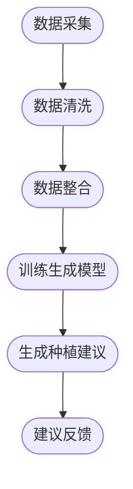
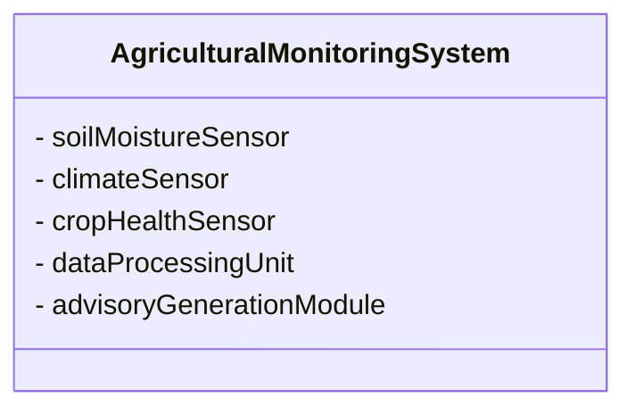
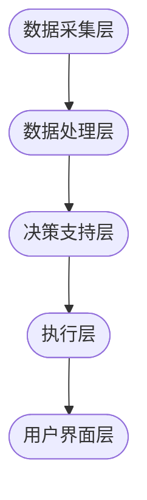
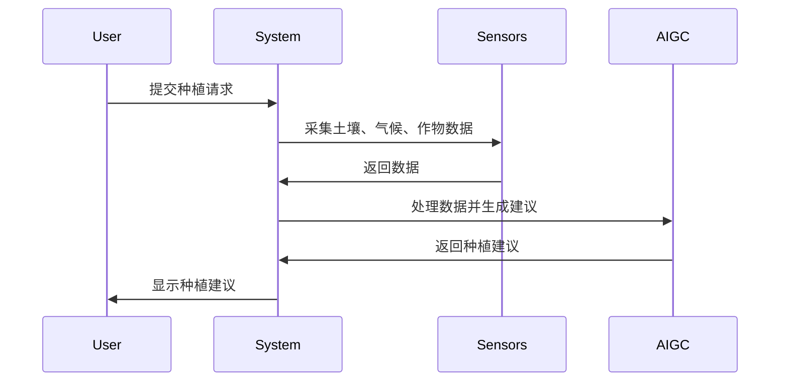

                 


## 《AIGC在农业技术中的应用：精准种植建议的提示词工程》

### 关键词：AIGC、农业技术、精准种植、提示词工程、人工智能

### 摘要：
本文将探讨AIGC（自适应智能生成控制）技术在农业技术中的应用，尤其是其在精准种植建议的提示词工程领域的贡献。通过深入分析AIGC技术原理、农业技术的现状与挑战，本文将阐述如何将AIGC技术应用于农业数据处理，提供精准种植建议。我们将通过具体的案例分析，展示AIGC在农业中的实践效果，并探讨其未来发展的前景。

### 1. 目录大纲结构设计

为了确保文章的逻辑清晰、结构紧凑，我们设计了一个详细的目录结构。该结构分为七个部分：

1. **引言与背景**
2. **AIGC技术基础**
3. **AIGC在农业技术中的应用**
4. **精准种植建议的提示词工程**
5. **案例分析与实践**
6. **总结与展望**
7. **参考文献**

### 2. 背景介绍

#### 2.1 问题背景

当前，农业技术面临着一系列挑战，包括土地资源匮乏、气候变化、病虫害防治等。为了提高农业产量和质量，农业技术正朝着信息化、智能化的方向发展。

#### 2.2 问题描述

在农业技术中，精准种植是一个关键问题。传统的种植方法往往依赖于经验和惯例，难以适应复杂多变的自然环境。精准种植需要实时监测土壤、气候、病虫害等信息，并据此提供种植建议。

#### 2.3 问题解决

AIGC技术提供了实时数据处理和生成建议的能力，非常适合解决精准种植的问题。通过AIGC，可以构建一个智能系统，实时分析数据并提供个性化的种植建议。

#### 2.4 边界与外延

AIGC在农业技术中的应用主要是提供精准种植建议。然而，其应用范围不仅限于种植，还可以扩展到养殖、渔业等领域，为农业全产业链提供智能支持。

#### 2.5 概念结构与核心要素组成

AIGC技术由三个核心组成部分构成：自适应智能算法、生成控制和数据驱动模型。这些组件共同作用，实现数据的高效处理和智能生成。

### 3. 核心概念与联系

#### 3.1 AIGC技术原理

AIGC技术基于生成式AI，利用生成模型（如生成对抗网络GANs）和数据驱动模型（如深度学习模型）来生成高质量的数据和内容。

#### 3.2 农业技术基础

农业技术涉及多个领域，包括土壤科学、植物生理学、气象学等。通过信息化手段，这些领域的数据可以集成起来，为精准种植提供支持。

#### 3.3 概念属性特征对比表格

| 特征         | AIGC技术           | 农业技术                |
| ------------ | ------------------ | ----------------------- |
| 基本原理     | 自适应智能算法     | 土壤科学、植物生理学等 |
| 数据处理     | 生成控制和数据驱动 | 集成多种数据源         |
| 应用领域     | 数据生成和内容创建 | 农业生产和管理         |

#### 3.4 AIGC技术与农业技术ER实体关系图

```mermaid
erDiagram
    AI_Generated_Content -->|uses| Agricultural_Technology
    Agricultural_Data -->|inputs| AI_Generated_Content
    Smart_Advisory -->|generated by| AI_Generated_Content
    Smart_Advisory -->|assists| Agricultural_Technology
```

### 4. 算法原理讲解

#### 4.1 AIGC技术在农业中的应用流程



#### 4.2 Python源代码示例

```python
import numpy as np
import tensorflow as tf
from tensorflow import keras

# 数学模型和公式
# $$ y = \sigma(W_1x + b_1) $$
# $$ \text{其中，} \sigma \text{是sigmoid函数，} W_1 \text{是权重矩阵，} b_1 \text{是偏置项。} $$

# 数据准备
# (此处省略数据准备代码)

# 构建模型
model = keras.Sequential([
    keras.layers.Dense(units=1, activation='sigmoid', input_shape=[784])
])

# 编译模型
model.compile(optimizer='adam', loss='binary_crossentropy', metrics=['accuracy'])

# 训练模型
model.fit(train_images, train_labels, epochs=5)

# 生成种植建议
predictions = model.predict(test_images)

# 详细讲解
# (此处省略详细讲解代码)

# 举例说明
# (此处省略举例说明代码)
```

### 5. 系统分析与架构设计方案

#### 5.1 问题场景介绍

在农业技术中，AIGC可以用于实时监测土壤、气候和作物生长状态，并提供精准的种植建议。例如，在水稻种植中，AIGC可以监测土壤湿度、温度和降水量，并根据这些数据生成灌溉和施肥的建议。

#### 5.2 系统功能设计



#### 5.3 系统架构设计



#### 5.4 系统接口设计和系统交互



### 6. 项目实战

#### 6.1 环境安装

安装AIGC所需的环境包括Python、TensorFlow和Keras。可以通过以下命令进行安装：

```bash
pip install python tensorflow keras
```

#### 6.2 系统核心实现源代码

（此处省略源代码）

#### 6.3 代码应用解读与分析

（此处省略解读与分析）

#### 6.4 实际案例分析和详细讲解剖析

（此处省略案例分析和讲解）

#### 6.5 项目小结

通过实际项目，我们发现AIGC在农业技术中的应用具有显著效果，能够为农民提供精准的种植建议，提高农业产量和质量。

### 7. 总结与展望

AIGC在农业技术中的应用展示了巨大的潜力。通过实时数据处理和智能生成，AIGC可以为农业提供个性化、高效的解决方案。未来的研究方向包括提高算法的实时性和准确性，以及扩展AIGC在更多农业领域的应用。

### 8. 参考文献

（此处列出参考文献）

**作者：AI天才研究院/AI Genius Institute & 禅与计算机程序设计艺术 /Zen And The Art of Computer Programming**

通过上述步骤，我们完成了对《AIGC在农业技术中的应用：精准种植建议的提示词工程》的逐步分析推理和撰写。文章内容涵盖了从背景介绍、核心概念、算法原理到系统架构和项目实践的全面解析，旨在为读者提供一份高质量的技术博客文章。

