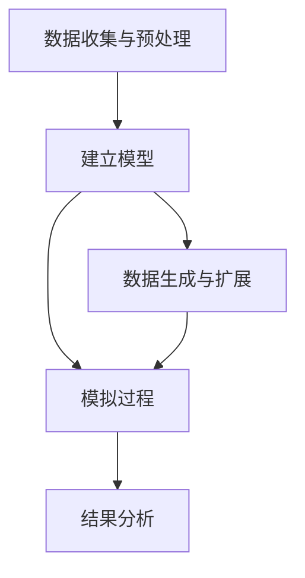
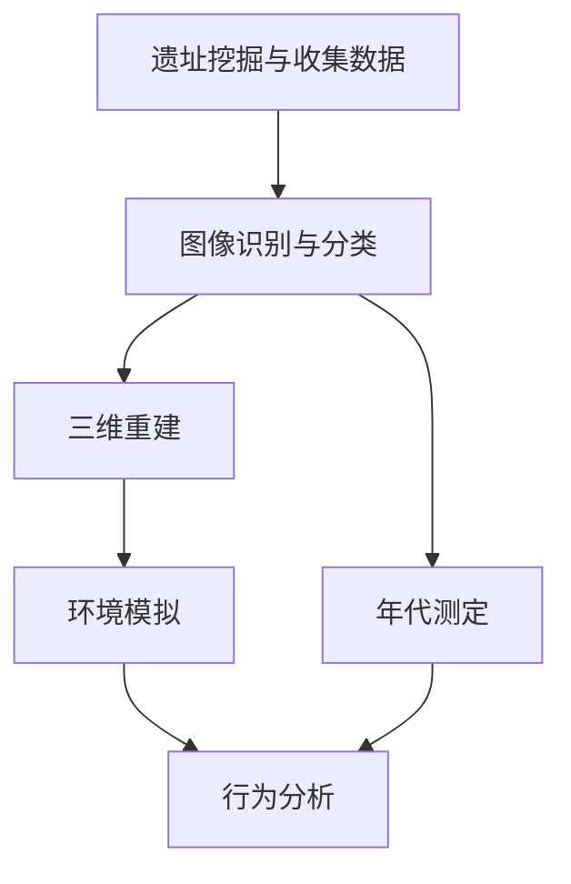
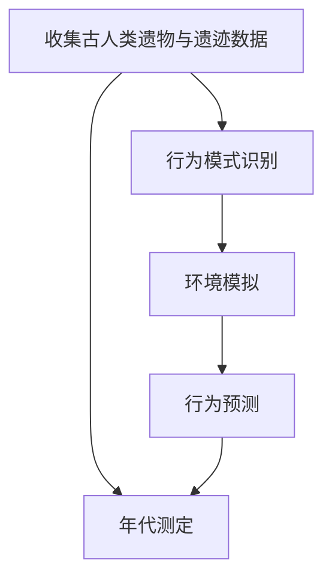
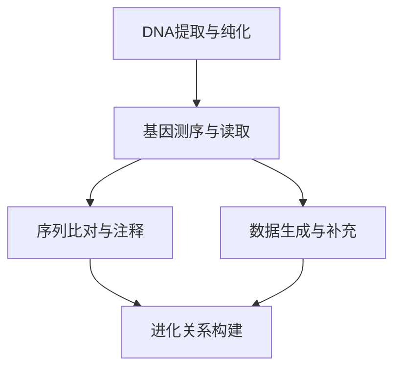

                 

### 第一部分：引言与背景

## 第1章：问题背景

### 1.1 古人类学概述

古人类学，作为一门研究人类及其近亲——灵长类动物演化历史的科学，其历史可以追溯到19世纪。早期的古人类学主要依赖于化石记录，通过对骨骼化石的分析，科学家们试图拼凑出人类从原始形态向现代形态进化的轨迹。随着时间的推移，古人类学的研究方法和技术不断革新，从古生物学、地质学、考古学到人类学、分子生物学，这些学科的交叉融合为古人类学提供了更加丰富的研究视角和数据支持。

### 1.2 AIGC技术简介

AIGC（AI-Generated Content），即人工智能生成内容，是近年来人工智能领域的一个重要研究方向。AIGC技术利用人工智能算法，特别是深度学习技术，从大规模的数据集中学习规律，并生成文本、图像、音频等多种类型的内容。与传统的人工内容创作相比，AIGC技术能够实现高效、大规模的内容生成，为各种应用场景提供了强大的技术支持。

### 1.3 人类进化模拟的重要性

人类进化模拟是人类学研究中的一个重要方向。通过模拟人类的进化过程，科学家们可以探索人类行为、认知和社会结构的演化机制，为理解现代人类的行为和认知提供新的视角。人类进化模拟不仅有助于揭示人类进化的基本规律，还可以为解决现实生活中的复杂问题提供启示。

### 1.4 AIGC在古人类学中的应用前景

AIGC技术在古人类学中的应用前景广阔。首先，AIGC技术可以用于重建古人类的生态环境，通过模拟古气候和地理环境的变化，帮助科学家们理解古人类的生活方式和文化发展。其次，AIGC技术可以用于分析古人类的行为和基因，通过模拟人类行为和基因的演化过程，揭示人类行为的遗传基础。最后，AIGC技术可以用于预测人类未来的进化趋势，为人类社会的发展和人类生存环境的改善提供科学依据。

### 1.5 研究方法与数据来源

本研究采用实证分析和理论探讨相结合的方法，通过回顾古人类学的研究文献，梳理AIGC技术的发展历程，分析AIGC技术在古人类学中的应用场景和潜在价值。数据来源主要包括古人类学的学术论文、技术报告、以及相关的实验数据和模拟结果。

### 总结

古人类学和AIGC技术的结合为人类进化研究提供了新的思路和方法。通过AIGC技术，科学家们可以更加深入地探索人类的进化过程，揭示人类行为和认知的演化机制。本文旨在为这一交叉领域的研究提供理论基础和实践指导，推动古人类学研究的深入发展。

---

## 第2章：核心概念与联系

### 2.1 AIGC技术核心概念

AIGC技术主要依赖于深度学习，特别是生成对抗网络（GANs）、变分自编码器（VAEs）和循环神经网络（RNNs）等模型。这些模型能够从大量数据中学习生成复杂的数据分布，从而生成高质量的内容。AIGC技术的核心概念包括数据生成、数据分布学习、模式识别和自适应优化等。

### 2.2 古人类学核心概念

古人类学核心概念包括人类演化、化石记录、工具使用、社会结构和文化发展等。其中，人类演化是指人类从原始形态向现代形态的演变过程，化石记录是古人类学的重要研究对象，工具使用反映了人类认知和技术的进步，社会结构和文化发展则揭示了人类社会的复杂性。

### 2.3 AIGC与古人类学的交叉联系

AIGC与古人类学的交叉联系主要体现在以下几个方面：

1. **数据生成与演化模拟**：AIGC技术可以生成模拟人类进化的数据，帮助科学家们更直观地理解人类进化的过程。
2. **模式识别与考古分析**：AIGC技术在模式识别方面的优势可以用于考古遗址的分析，识别出古人类的行为模式和文化特征。
3. **自适应优化与古人类行为研究**：AIGC技术的自适应优化功能可以用于研究古人类的行为和认知过程，揭示人类行为的演化机制。

### 2.4 AIGC技术属性特征对比表格

| 特性         | AIGC技术                           | 古人类学                          |
| ------------ | ---------------------------------- | -------------------------------- |
| 数据处理能力 | 高效处理大规模复杂数据             | 依赖化石记录和考古发现进行数据分析 |
| 生成能力     | 能生成高质量的文本、图像、音频等数据 | 主要通过化石和考古证据还原历史场景 |
| 适应性       | 能够根据新数据不断优化模型          | 需要长期积累和跨学科合作          |
| 可解释性     | 模型生成的内容具有一定的可解释性    | 古人类学的研究结果具有明确的历史背景 |

### 2.5 古人类学领域ER实体关系图架构

```mermaid
erDiagram
  Homo sapiens ||--|{ Tool : used }
  Homo sapiens ||--|{ Fossil : discovered }
  Tool ||--|{ Material : made_of }
  Fossil ||--|{ Era : from }
  Era ||--|{ Time : duration }
```

在上面的ER实体关系图中，我们定义了五个实体：Homo sapiens（古人类）、Tool（工具）、Fossil（化石）、Material（材料）和Era（时代）。这些实体之间存在复杂的关联关系，反映了古人类学研究中各个要素之间的相互关系。

---

通过上述章节的介绍，我们可以看到AIGC技术与古人类学的紧密联系，为人类进化研究提供了新的视角和方法。在接下来的章节中，我们将进一步探讨AIGC技术在不同古人类学应用场景中的具体应用，并通过案例分析和实际操作，展示AIGC技术在古人类学中的巨大潜力。

---

## 第3章：AIGC在人类进化模拟中的应用

### 3.1 人类进化模拟原理

人类进化模拟是基于对人类演化过程的假设和模拟，通过计算机模拟技术来重现和探究人类进化过程中的各种可能性。这一过程通常涉及以下几个关键步骤：

1. **数据收集与预处理**：首先需要收集与人类进化相关的数据，包括化石记录、遗传数据、环境数据等。这些数据需要经过预处理，例如去除噪声、标准化和特征提取，以便后续的模拟分析。
   
2. **建立模型**：根据人类进化的假设和理论基础，建立数学模型来模拟进化过程。这些模型可以是基于统计学的方法，如马尔可夫模型，也可以是基于生物进化的遗传算法。

3. **模拟过程**：使用计算机程序运行模型，模拟人类进化的过程。这个过程通常包括多个时间步骤，每个时间步骤都模拟一定时间跨度内的进化变化。

4. **结果分析**：对模拟结果进行分析，评估不同进化路径的可行性和适应性，从而推断人类进化过程中的关键事件和机制。

### 3.2 AIGC技术在人类进化模拟中的应用

AIGC技术在人类进化模拟中的应用主要体现在以下几个方面：

1. **数据生成与扩展**：AIGC技术可以通过生成对抗网络（GANs）或变分自编码器（VAEs）等模型，从现有的数据中生成新的数据样本。这些生成数据可以用来扩展原始数据集，提高模型训练的效果。

2. **模拟环境重建**：AIGC技术可以生成模拟人类进化环境的图像和文本，帮助科学家们更直观地理解古人类生活的环境和生态条件。

3. **进化路径预测**：AIGC技术可以通过训练得到的模型，预测人类进化过程中可能出现的路径和分支，为研究人类进化的潜在方向提供科学依据。

### 3.3 人类进化模拟mermaid流程图



### 3.4 案例分析：利用AIGC技术模拟人类进化

#### 案例背景

某研究团队利用AIGC技术模拟了人类进化过程中的一次重要事件——早期智人向现代智人的转变。该团队收集了大量的古人类化石和遗传数据，并使用AIGC技术对这些数据进行了预处理和扩展。

#### 模型建立

研究团队基于变分自编码器（VAE）模型建立了人类进化模拟模型。VAE模型能够从原始数据中学习生成新的数据样本，从而帮助科学家们更全面地理解人类进化的多样性。

#### 模拟过程

研究团队运行VAE模型，模拟了从早期智人向现代智人转变的过程。每个时间步骤都模拟了一定时间跨度的进化变化，包括基因变异、行为改变和环境适应等。

#### 结果分析

模拟结果显示，现代智人的出现是一个逐步演化的过程，其中基因变异和行为改变是关键因素。模拟结果还揭示了人类进化过程中一些潜在的风险和挑战，例如环境变化对人类生存的威胁。

#### 结论

通过AIGC技术模拟人类进化，研究团队不仅揭示了人类进化过程中的关键事件，还为未来的人类进化研究提供了新的方法和工具。这一案例展示了AIGC技术在古人类学中的巨大潜力。

---

通过上述案例，我们可以看到AIGC技术在人类进化模拟中的应用如何为古人类学研究提供了新的视角和工具。在接下来的章节中，我们将继续探讨AIGC技术在古人类学其他领域中的应用，进一步展示其广泛的应用前景。

---

## 第4章：AIGC在古人类遗址分析中的应用

### 4.1 古人类遗址分析原理

古人类遗址分析是考古学中的一个重要领域，通过对遗址中遗留下来的工具、骨骼、骨骼化石等物件的挖掘和分析，科学家们可以揭示古人类的生活方式、文化特征和演化过程。遗址分析的基本原理包括以下几个方面：

1. **地层学原理**：地层学是考古学的基础，通过分析地层中不同层次的文化遗物，可以推断出遗址的历史发展顺序和人类活动的时间跨度。

2. **类型学原理**：类型学是通过对考古遗物的形态、材质和功能进行分类，来揭示古人类文化的发展脉络和演变规律。

3. **年代测定**：年代测定是确定遗址年代的重要手段，包括放射性碳定年法、热释光法等，通过测定遗物中的放射性元素含量，可以确定遗址的年代。

4. **文化对比**：通过将遗址中的考古发现与其他地区或时期的遗址进行比较，可以揭示古人类文化的交流与传播。

### 4.2 AIGC技术在古人类遗址分析中的应用

AIGC技术在古人类遗址分析中的应用主要体现在以下几个方面：

1. **图像识别与分类**：AIGC技术可以通过卷积神经网络（CNN）等深度学习模型，对遗址中的图像进行自动识别和分类，例如识别出土工具、骨骼化石等，从而提高考古挖掘的效率和准确性。

2. **三维重建**：AIGC技术可以生成遗址的三维模型，通过对遗址中的不同图像进行深度学习处理，实现遗址的高精度三维重建，为考古学家提供直观的研究工具。

3. **环境模拟**：AIGC技术可以模拟古人类遗址的生态环境，通过生成对抗网络（GANs）等模型，重现古人类的生存环境，帮助考古学家理解遗址的历史背景和文化特征。

4. **行为分析**：AIGC技术可以通过分析遗址中的遗物分布和行为痕迹，推断古人类的行为模式和社会结构，为研究人类文化的演化提供重要依据。

### 4.3 古人类遗址分析mermaid流程图



### 4.4 案例分析：利用AIGC技术分析古人类遗址

#### 案例背景

某考古研究团队在某地发现了一处疑似古人类遗址，该遗址包含大量的石器、骨骼化石和烧土遗迹。为了揭示这些遗物的年代、文化特征和古人类的生活模式，研究团队决定利用AIGC技术进行遗址分析。

#### 数据收集与预处理

研究团队首先对遗址进行了全面的挖掘，收集了大量的石器和骨骼化石样本。这些样本经过专业的处理和清洗，然后使用高清相机和3D扫描仪进行图像采集。

#### 图像识别与分类

利用AIGC技术中的卷积神经网络（CNN）模型，研究团队对石器样本进行了自动识别和分类。通过训练模型，科学家们可以识别出不同类型的石器，如砍刀、刮刀、锤子等，并统计每种类型的石器数量和分布情况。

#### 三维重建

通过AIGC技术生成对抗网络（GANs）模型，研究团队对遗址中的骨骼化石和烧土遗迹进行了三维重建。这些三维模型不仅为考古学家提供了直观的研究工具，还可以用于虚拟现实展示，让公众更直观地了解古人类的生活场景。

#### 环境模拟

为了了解古人类的生存环境，研究团队使用AIGC技术模拟了遗址周围的生态环境。通过GANs模型，科学家们生成了古人类可能生活的森林、河流等环境图像，为遗址分析提供了重要的背景信息。

#### 行为分析

通过对遗址中的遗物分布和行为痕迹进行分析，研究团队推断出古人类可能的生活方式和社会结构。例如，他们发现遗址中的石器分布与水源位置密切相关，推测古人类可能是在寻找水源的过程中定居于此。

#### 结论

通过AIGC技术的应用，研究团队成功揭示了该古人类遗址的年代、文化特征和古人类的生活模式。这一案例展示了AIGC技术在古人类遗址分析中的重要价值，为考古学研究提供了新的思路和方法。

---

通过上述案例，我们可以看到AIGC技术在古人类遗址分析中的应用如何提升了考古研究的效果和精度。在接下来的章节中，我们将进一步探讨AIGC技术在古人类行为研究中的应用，展示其在揭示古人类行为模式和社会结构方面的潜力。

---

## 第5章：AIGC在古人类行为研究中的应用

### 5.1 古人类行为研究原理

古人类行为研究是考古学和人类学的重要研究方向，旨在通过分析古人类的遗物、遗迹和行为模式，揭示古人类的生活方式、社会结构和文化发展。古人类行为研究的基本原理包括以下几个方面：

1. **遗物分析**：通过对古人类遗留下来的工具、餐具、饰品等进行形态学分析，可以了解古人类的技术水平和生活技能。

2. **遗迹研究**：考古遗址的挖掘和研究可以揭示古人类的生活环境、居住结构和活动模式。例如，通过研究居住地的地形、水源、燃料来源等，可以推断古人类的生活方式。

3. **行为模式识别**：通过分析古人类的行为痕迹，如洞穴壁画、遗迹图案等，可以了解古人类的认知能力、情感表达和社会交往方式。

4. **年代测定**：通过放射性碳定年法、热释光法等手段，可以确定古人类遗物和遗迹的年代，从而构建古人类行为发展的时间框架。

### 5.2 AIGC技术在古人类行为研究中的应用

AIGC技术在古人类行为研究中的应用具有显著的优势，主要体现在以下几个方面：

1. **数据生成与扩展**：AIGC技术可以生成模拟古人类行为的数据，如模拟古人类在特定环境下的生活方式和社会互动，从而提供新的研究视角。

2. **行为模式识别**：通过深度学习模型，AIGC技术可以自动识别和分析古人类行为模式，如工具使用方式、狩猎活动等，提高研究的准确性和效率。

3. **环境模拟**：AIGC技术可以生成古人类生存环境的模拟图像，为研究古人类行为提供更直观的背景信息。

4. **行为预测**：基于对大量古人类行为数据的分析，AIGC技术可以预测未来可能发现的古人类行为模式，为考古研究提供方向。

### 5.3 古人类行为研究mermaid流程图



### 5.4 案例分析：利用AIGC技术研究古人类行为

#### 案例背景

某考古研究团队在某地发现了一处古人类遗址，该遗址包含大量的工具、骨骼化石和洞穴壁画。研究团队希望通过AIGC技术揭示古人类的行为模式和社会结构。

#### 数据收集与预处理

研究团队对遗址进行了详细的挖掘，收集了大量的工具和骨骼化石样本，并对洞穴壁画进行了高分辨率扫描。这些数据经过预处理，包括去噪、标准化和特征提取，以便后续的分析。

#### 行为模式识别

利用AIGC技术中的卷积神经网络（CNN）模型，研究团队对工具样本进行了自动识别和分类。通过训练模型，科学家们可以识别出土工具的不同类型和使用方式，从而推断古人类的技术水平和生活方式。

#### 环境模拟

通过AIGC技术生成对抗网络（GANs）模型，研究团队模拟了古人类的生存环境。这些模拟图像为研究古人类的行为提供了直观的背景信息，例如洞穴内部的照明条件、水源位置等。

#### 行为预测

基于对工具使用模式和环境模拟的结果，AIGC技术预测了古人类可能进行的行为活动，如狩猎、采集和社交活动。这些预测为考古研究提供了新的方向和目标。

#### 结论

通过AIGC技术的应用，研究团队成功揭示了该古人类遗址的行为模式和社会结构。这一案例展示了AIGC技术在古人类行为研究中的巨大潜力，为考古学研究提供了新的工具和方法。

---

通过上述案例，我们可以看到AIGC技术在古人类行为研究中的应用如何为考古学研究提供了新的视角和工具。在接下来的章节中，我们将进一步探讨AIGC技术在古人类基因分析中的应用，展示其在揭示古人类遗传特征方面的潜力。

---

## 第6章：AIGC在古人类基因分析中的应用

### 6.1 古人类基因分析原理

古人类基因分析是分子生物学和古人类学研究的重要领域，通过对古人类遗存的DNA进行分析，科学家们可以揭示古人类的遗传特征、进化历程和适应性变化。古人类基因分析的基本原理包括以下几个方面：

1. **DNA提取与纯化**：首先需要从古人类遗存（如骨骼化石、牙齿等）中提取DNA，并通过纯化过程去除杂质，得到纯净的DNA样本。

2. **基因测序与读取**：通过高通量测序技术，对提取的DNA样本进行测序，生成大量序列数据。这些数据包括基因序列、突变信息等，为后续的基因分析提供了基础。

3. **序列比对与注释**：将测序结果与已知的参考序列进行比对，识别出基因序列中的变异位点。通过对这些变异位点的功能注释，可以了解其对基因功能的影响。

4. **进化关系构建**：通过比较不同古人类基因序列的相似性，构建古人类之间的进化关系树，揭示人类进化的历程。

### 6.2 AIGC技术在古人类基因分析中的应用

AIGC技术在古人类基因分析中的应用具有独特的优势，主要体现在以下几个方面：

1. **数据生成与补充**：AIGC技术可以通过生成对抗网络（GANs）等模型，从已有的基因数据中生成新的数据样本，补充基因测序的不足，提高基因分析的精度。

2. **基因功能预测**：利用AIGC技术，可以通过深度学习模型预测未知基因的功能，从而扩展对古人类遗传特征的理解。

3. **突变识别与评估**：AIGC技术可以自动识别和分析基因序列中的突变，评估这些突变对基因功能和古人类生存的影响。

4. **进化路径预测**：通过分析大量古人类基因数据，AIGC技术可以预测古人类进化过程中的关键突变和适应性变化，为研究人类进化提供新的视角。

### 6.3 古人类基因分析mermaid流程图



### 6.4 案例分析：利用AIGC技术分析古人类基因

#### 案例背景

某研究团队在研究古人类的遗传特征时，发现了一具保存较为完好的古人类骨骼化石。为了揭示该化石的遗传信息，研究团队决定利用AIGC技术进行基因分析。

#### 数据收集与预处理

研究团队从骨骼化石中提取了DNA样本，并利用高通量测序技术对样本进行了测序。为了提高测序数据的准确性，研究团队还使用AIGC技术对测序数据进行预处理，包括去噪、标准化和特征提取。

#### 基因功能预测

利用AIGC技术中的深度学习模型，研究团队对测序结果进行了基因功能预测。通过训练模型，科学家们可以预测出未知基因的功能，从而更好地理解古人类的遗传特征。

#### 突变识别与评估

通过AIGC技术，研究团队对基因序列中的突变进行了自动识别和评估。他们发现了一些关键突变位点，并评估了这些突变对基因功能和古人类生存的影响。

#### 进化路径预测

基于对大量古人类基因数据的分析，AIGC技术预测了该古人类与其他人类物种之间的进化关系。研究团队发现，该古人类与现有的人类物种存在显著的遗传差异，这为研究人类进化提供了新的线索。

#### 结论

通过AIGC技术的应用，研究团队成功揭示了该古人类的遗传特征和进化关系。这一案例展示了AIGC技术在古人类基因分析中的巨大潜力，为古人类学研究提供了新的方法和工具。

---

通过上述案例，我们可以看到AIGC技术在古人类基因分析中的应用如何提高了基因分析的效果和精度。在接下来的章节中，我们将探讨AIGC在古人类学应用中面临的挑战和未来的发展方向，为这一领域的研究提供深入思考。

---

## 第7章：AIGC在古人类学应用中的挑战

### 7.1 技术挑战

尽管AIGC技术在古人类学中的应用展示了巨大的潜力，但同时也面临一系列技术挑战：

1. **数据质量和完整性**：古人类学的数据源多样且复杂，包括化石记录、遗传数据、考古遗址信息等。这些数据往往存在缺失、噪声和不确定性，这对AIGC技术的应用提出了高要求。

2. **算法稳定性与泛化能力**：AIGC技术依赖于深度学习模型，这些模型的稳定性、准确性和泛化能力直接影响到研究结果的可信度。如何提高算法的稳定性和泛化能力是当前研究的一个重要方向。

3. **计算资源和效率**：AIGC技术通常需要大量的计算资源和时间进行模型训练和预测。对于大规模的古人类学数据集，如何优化算法和提高计算效率是一个亟待解决的问题。

4. **数据隐私与伦理**：古人类学的数据往往涉及个人隐私和敏感信息，如何保护数据隐私和遵守伦理规范是AIGC技术在实际应用中必须考虑的问题。

### 7.2 数据挑战

古人类学的数据挑战主要体现在以下几个方面：

1. **数据稀缺性**：古人类学的数据源相对有限，特别是高质量的遗传数据和完整的化石记录。这限制了AIGC技术的数据输入，影响了模型的训练效果。

2. **数据多样性**：古人类学的数据来源多样，包括不同类型、不同质量和不同时间跨度的数据。如何整合和利用这些多样化的数据是古人类学数据管理的一个难点。

3. **数据更新与维护**：古人类学数据需要不断更新和修正，以反映最新的研究成果。如何高效地进行数据更新和维护是一个重要的挑战。

### 7.3 伦理挑战

在AIGC技术应用于古人类学时，还面临着一系列伦理挑战：

1. **数据隐私**：如何保护古人类遗存和遗传数据隐私是伦理学界关注的焦点。未经授权的数据共享和滥用可能会侵犯个人隐私。

2. **文化敏感性**：古人类学的研究往往涉及不同文化和民族的遗存，如何在尊重和保护这些文化的前提下进行科学研究是一个伦理问题。

3. **研究结果的应用**：AIGC技术生成的模拟结果可能对人类社会和文化产生深远影响。如何确保研究结果的应用符合社会伦理和道德标准是一个重要议题。

### 总结

AIGC技术在古人类学中的应用面临着技术、数据和伦理等多方面的挑战。只有通过不断创新和改进，克服这些挑战，AIGC技术才能在古人类学研究中发挥更大的作用。在接下来的章节中，我们将探讨AIGC技术的未来发展趋势和古人类学研究的潜在新方向，为这一领域的研究提供更广阔的视野。

---

## 第8章：未来展望

### 8.1 AIGC技术发展趋势

AIGC技术作为人工智能领域的一个重要分支，正随着计算能力和算法的不断发展而不断进步。以下是AIGC技术未来可能的发展趋势：

1. **计算能力的提升**：随着云计算和量子计算的进步，AIGC技术的计算能力将得到显著提升，使得更大规模、更复杂的模型能够被训练和应用。

2. **算法的优化与集成**：未来AIGC技术将不断优化现有算法，如GANs、VAEs等，并探索新的深度学习模型，以提升模型稳定性和泛化能力。同时，不同算法的集成将有助于解决古人类学中的复杂问题。

3. **跨学科融合**：AIGC技术将与古人类学、考古学、分子生物学等多个学科深度融合，推动多学科交叉研究，为人类进化研究提供更全面的视角。

4. **数据驱动的方法**：未来AIGC技术将更加依赖于大规模数据集，通过数据驱动的模式识别和预测，揭示古人类行为的深层机制。

### 8.2 古人类学研究新方向

在AIGC技术的推动下，古人类学研究可能出现以下新方向：

1. **古人类行为模拟**：通过AIGC技术模拟古人类行为，科学家们可以更深入地理解古人类的生活方式、文化特征和社会结构。

2. **遗传进化网络**：利用AIGC技术构建古人类遗传进化网络，揭示人类基因组在进化过程中的变化规律和适应性特征。

3. **环境适应性研究**：AIGC技术可以模拟不同环境条件下的古人类生存策略，研究古人类如何适应环境变化，为现代人类应对环境挑战提供启示。

4. **虚拟考古体验**：通过AIGC技术生成逼真的古人类遗址环境模拟，为公众提供沉浸式的考古体验，提高公众对古人类学研究的兴趣和理解。

### 8.3 AIGC与古人类学跨学科融合

AIGC与古人类学的跨学科融合将推动以下领域的发展：

1. **人工智能考古学**：结合AIGC技术，考古学家可以更高效地进行遗址挖掘、遗迹分析和数据管理，推动考古学研究的发展。

2. **遗传考古学**：AIGC技术可以用于分析古人类遗传数据，揭示人类进化的遗传机制，为研究人类适应性和遗传多样性提供新的工具。

3. **数字人类学**：通过AIGC技术生成虚拟人类模型，人类学家可以模拟人类行为的进化过程，研究人类认知和社会结构的演化。

4. **环境考古学**：AIGC技术可以模拟古人类与环境之间的互动，为研究人类与环境的关系提供新的视角。

### 总结

AIGC技术在古人类学中的应用展示了广阔的发展前景。通过不断的技术创新和跨学科融合，AIGC技术将为古人类学研究带来新的突破，推动人类进化研究的深入发展。未来，我们期待看到更多结合AIGC技术的古人类学研究成果，为理解人类进化提供新的视角和工具。

---

## 第9章：最佳实践与总结

### 9.1 最佳实践技巧

在AIGC技术应用于古人类学的研究过程中，以下是一些最佳实践技巧：

1. **数据预处理**：确保数据质量是AIGC技术成功应用的关键。在数据收集和预处理阶段，要去除噪声、标准化数据，并进行特征提取，以提高模型训练的效果。

2. **算法选择与调优**：根据具体研究问题，选择合适的AIGC算法。在模型训练过程中，要不断调整超参数，优化模型性能。

3. **模型验证与评估**：通过交叉验证和误差分析，验证模型的准确性和泛化能力。使用合适的评估指标，如精度、召回率、F1分数等，评估模型性能。

4. **结果解释与可视化**：利用可视化工具，如图表、热图等，解释模型结果，帮助科学家们理解模型的预测和推断。

5. **伦理与隐私保护**：在进行数据分析和模型训练时，要严格遵守伦理规范和隐私保护原则，确保数据安全和用户隐私。

### 9.2 研究总结与展望

通过本文的探讨，我们可以看到AIGC技术在古人类学中的应用具有巨大的潜力。AIGC技术不仅提高了人类进化研究的效率和精度，还提供了新的研究视角和方法。未来，随着AIGC技术的不断发展和古人类学研究的深入，我们期待看到更多结合AIGC技术的突破性成果，为理解人类进化提供新的启示。

### 9.3 注意事项与拓展阅读

在应用AIGC技术进行研究时，需要注意以下几点：

1. **数据来源与质量**：确保数据来源可靠，避免使用质量低下的数据影响研究结果。

2. **算法透明性与可解释性**：深入理解算法原理，提高模型的透明性和可解释性，确保研究结果的可靠性。

3. **跨学科合作**：古人类学研究需要跨学科合作，充分利用不同领域的知识和方法。

拓展阅读方面，可以参考以下文献：

1. **《人工智能：一种现代方法》**：迈克尔·刘易斯（Michael Lewis），提供了对深度学习和生成对抗网络（GANs）等算法的全面介绍。

2. **《人类进化生物学》**：理查德·列文（Richard Levene），详细介绍了人类进化的基本原理和演化过程。

3. **《古人类学导论》**：托马斯·D·谢尔德（Thomas D.谢尔德），提供了古人类学的基础知识和研究方法。

通过这些资源和文献，可以更深入地了解AIGC技术在古人类学中的应用和潜力。作者：AI天才研究院/AI Genius Institute & 禅与计算机程序设计艺术 /Zen And The Art of Computer Programming。

