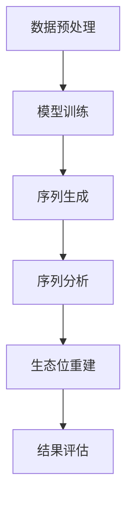

                 

### 引言

在科技日新月异的今天，人工智能（AI）技术已经成为推动各个领域进步的重要引擎。古基因组学，作为一门探究古代生物遗传信息的科学，近年来也在不断革新。AIGC（AI-Generated Content）的兴起，为古基因组学研究带来了新的可能性。AIGC，即通过人工智能自动生成内容的技术，已经在图像生成、自然语言处理等领域展现出其强大的潜力。在古基因组学中，AIGC可以通过分析古DNA序列、构建灭绝物种的生态位模型，为科学家提供更加精确和全面的研究数据。

#### 问题背景

古基因组学是研究古代生物遗传信息的科学，它通过对古DNA序列的分析，试图揭示已灭绝物种的遗传特征及其在生态系统中的角色。然而，古基因组学研究面临着诸多挑战，如DNA降解、样本稀缺等。这些问题的存在使得重建灭绝物种的生态位成为一项极具挑战性的任务。

灭绝物种生态位重建是古基因组学研究中的一个关键问题。生态位重建旨在通过分析已知的物种数据，重建灭绝物种在生态系统中的角色和功能，为生态系统保护和恢复提供科学依据。然而，传统的重建方法往往依赖于有限的古生物学和生态学数据，难以全面准确地反映灭绝物种的实际生态位。

#### AIGC概述

AIGC，即AI-Generated Content，是指通过人工智能技术自动生成内容的一种新型内容生成方式。AIGC的核心在于利用深度学习模型，如生成对抗网络（GAN）、变分自编码器（VAE）等，从大量的数据中学习并生成新的数据。AIGC在图像生成、文本生成、音频生成等领域已经展现出其强大的生成能力。

AIGC的基本原理是利用大数据和深度学习模型进行训练，通过模型的生成能力，自动生成与原始数据相似的新数据。在古基因组学中，AIGC可以通过生成模拟数据，帮助科学家更全面地了解灭绝物种的生态位。

#### 研究意义

AIGC在古基因组学中的应用具有深远的意义。首先，AIGC可以大大提高古基因组数据分析的效率和准确性。通过自动生成模拟数据，AIGC可以帮助科学家克服DNA降解和样本稀缺等问题，为灭绝物种生态位重建提供更加丰富的数据支持。

其次，AIGC在古基因组学中的应用，可以推动古生物学与人工智能的深度融合。通过将AIGC技术与古基因组学相结合，科学家可以开发出更加智能化、自动化的研究方法，进一步提升古基因组学的研究水平。

最后，AIGC在古基因组学中的应用，有助于我们更深入地理解生态系统的历史和演化过程。通过重建灭绝物种的生态位，AIGC可以帮助科学家揭示生态系统中的复杂关系，为生态保护和恢复提供科学依据。

总之，AIGC在古基因组学中的应用，不仅为科学家提供了一种新的研究工具，也为探索生态系统演化提供了新的视角。随着AIGC技术的不断发展，我们有理由相信，它在古基因组学中的应用将更加广泛，进一步推动古基因组学和生态学的发展。

### 第1章：古基因组学基础

#### 1.1 古基因组学概述

古基因组学是研究古代生物遗传信息的科学，通过对古DNA、古蛋白质序列等遗传物质的分析，揭示古代生物的遗传特征、进化历程及其在生态系统中的角色。古基因组学的起源可以追溯到20世纪末，随着DNA测序技术和生物信息学的发展，古基因组学逐渐成为一个独立的研究领域。

古基因组学的基本概念包括古DNA、古蛋白质、古基因等。古DNA是指从化石或古生物样本中提取的DNA，这些DNA序列可以揭示古代生物的遗传特征。古蛋白质是指从古生物样本中提取的蛋白质，它们在生物体中具有特定的功能。古基因是指存在于古DNA序列中的基因，它们与现生物种的基因具有相似性，可以用于研究古代生物的遗传进化。

古基因组学的研究方法主要包括DNA测序、基因表达分析、蛋白质结构预测等。DNA测序是古基因组学的基础，通过高精度的DNA测序技术，科学家可以获取古生物样本的遗传信息。基因表达分析则用于研究古生物基因在不同环境条件下的表达情况，从而揭示其在生物体中的作用。蛋白质结构预测则可以帮助科学家理解古蛋白质的结构和功能，进一步探讨古生物的生理机制。

#### 2.2 灭绝物种研究

灭绝物种研究是古基因组学中的一个重要方向，旨在通过分析灭绝物种的遗传信息，揭示其在生态系统中的角色和影响。灭绝物种是指由于自然或人为因素导致的物种完全消失。灭绝物种研究的重要性在于，它们为生态系统演化提供了重要的历史数据，有助于我们理解当前生态系统的状态和未来发展趋势。

灭绝物种的研究现状主要包括以下几个方面：首先，科学家通过DNA测序技术，对已灭绝物种的遗传信息进行解析，揭示其遗传特征和进化关系。其次，通过古基因组学方法，重建灭绝物种的生态位，分析其在生态系统中的角色和功能。此外，灭绝物种研究还涉及环境变化、人类活动等因素对物种灭绝的影响，为生态系统保护和恢复提供科学依据。

灭绝物种研究的挑战主要包括：首先，古DNA降解严重，获取高质量的DNA序列较为困难。其次，样本稀缺，很多灭绝物种的样本难以获取。此外，古基因组学研究方法和技术尚不完善，需要进一步发展和优化。

#### 2.3 生态位重建的概念

生态位重建是指通过分析已知物种的数据，重建灭绝物种在生态系统中的角色和功能。生态位是指一个物种在生态系统中的生存和繁衍空间，包括其食物链位置、栖息地选择、竞争关系等。生态位重建的目的是为了更好地理解灭绝物种在生态系统中的作用，为其保护和恢复提供科学依据。

生态位重建的方法主要包括以下几种：

1. **基于古生物学和生态学数据的方法**：通过分析古生物化石和生态学数据，重建灭绝物种的栖息地和生态位。这种方法依赖于已有的古生物学和生态学知识，但往往难以准确反映灭绝物种的实际生态位。

2. **基于遗传学数据的方法**：通过分析灭绝物种的遗传信息，重建其在生态系统中的角色和功能。这种方法利用古基因组学技术，可以从分子水平揭示灭绝物种的生态特征，但需要大量的遗传数据支持。

3. **基于模拟的方法**：通过计算机模拟，重建灭绝物种的生态位。这种方法利用人工智能和计算生物学技术，可以在没有实际数据的情况下，预测灭绝物种的生态位和作用。

生态位重建的应用主要包括以下几个方面：首先，为生态系统保护和恢复提供科学依据。通过重建灭绝物种的生态位，科学家可以更好地了解其重要性和保护需求，制定相应的保护策略。其次，为生态学研究提供新的视角。生态位重建可以帮助科学家理解生态系统的复杂性和演化过程，为生态学理论的发展提供新的证据。

#### 1.4 小结

本章对古基因组学的基本概念、灭绝物种研究和生态位重建的概念进行了详细介绍。古基因组学作为一门研究古代生物遗传信息的科学，其基本概念和方法为我们理解生物进化和生态系统演化提供了重要工具。灭绝物种研究则是古基因组学中的一个重要方向，通过重建灭绝物种的生态位，我们可以更好地理解生态系统的重要性和脆弱性。生态位重建的方法多种多样，包括基于古生物学、生态学和遗传学的方法，以及基于模拟的方法。这些方法的应用，不仅为生态系统保护和恢复提供了科学依据，也为生态学研究提供了新的视角。

### 第2章：AIGC核心概念与原理

#### 2.1 AIGC核心概念

AIGC，即AI-Generated Content，是一种利用人工智能技术自动生成内容的方法。AIGC的核心概念包括数据生成、模型训练、生成对抗网络（GAN）、变分自编码器（VAE）等。AIGC的目标是通过学习大量的数据，生成与原始数据相似或具有新特征的新数据。

AIGC的定义：AIGC是一种利用人工智能技术生成内容的方法，它通过深度学习模型，如生成对抗网络（GAN）、变分自编码器（VAE）等，从数据中学习并生成新的数据。

AIGC的特点：首先，AIGC具有高度的生成能力，可以通过训练生成与原始数据高度相似的新数据。其次，AIGC具有灵活性，可以根据不同的需求，生成不同类型的数据，如图像、文本、音频等。此外，AIGC具有高效性，可以在短时间内生成大量高质量的数据。

AIGC的应用场景：AIGC在多个领域都有广泛的应用，包括图像生成、文本生成、音频生成、视频生成等。在图像生成方面，AIGC可以生成新的图像或改变现有图像的属性；在文本生成方面，AIGC可以生成新的文本或修改现有文本的内容；在音频生成方面，AIGC可以生成新的音频或改变现有音频的属性；在视频生成方面，AIGC可以生成新的视频或改变现有视频的内容。

#### 2.2 AIGC技术框架

AIGC的技术框架主要包括数据预处理、模型训练、数据生成和模型评估等步骤。以下是对每个步骤的详细说明：

**数据预处理**：数据预处理是AIGC流程的第一步，目的是对输入数据进行清洗、归一化和增强，以便更好地训练模型。数据预处理的方法包括数据清洗（去除噪声和错误）、数据归一化（调整数据范围）、数据增强（生成更多的数据样本）等。

**模型训练**：在模型训练阶段，AIGC利用深度学习模型，如生成对抗网络（GAN）、变分自编码器（VAE）等，从大量的数据中学习生成规律。生成对抗网络（GAN）由生成器和判别器组成，生成器负责生成数据，判别器负责判断生成数据是否真实。变分自编码器（VAE）则通过引入概率模型，将数据映射到一个潜在空间，并通过解码器生成新数据。

**数据生成**：在模型训练完成后，AIGC利用训练好的模型生成新的数据。数据生成的质量取决于模型的训练质量和数据集的质量。AIGC可以通过调整模型参数和训练数据，不断优化生成数据的质量。

**模型评估**：模型评估是AIGC流程的最后一步，目的是评估模型生成数据的性能。常用的评估方法包括生成数据的多样性、质量、真实性等。通过模型评估，可以确定模型是否达到预期的生成效果，并指导进一步的模型优化。

#### 2.3 AIGC应用领域

AIGC在多个领域都有广泛的应用，以下是其中一些主要领域：

**图像生成**：AIGC在图像生成领域具有显著的优势，可以生成高质量的图像。例如，通过生成对抗网络（GAN），AIGC可以生成新的图像或改变现有图像的属性，如颜色、风格、内容等。AIGC在图像生成中的应用包括艺术创作、计算机视觉、医学图像处理等。

**文本生成**：AIGC在文本生成领域也表现出强大的能力，可以生成新的文本或修改现有文本的内容。例如，通过变分自编码器（VAE），AIGC可以生成新的新闻文章、故事、评论等。文本生成在自然语言处理、内容创作、智能客服等应用中具有重要价值。

**音频生成**：AIGC在音频生成领域可以生成新的音频或改变现有音频的属性，如声音、音调、节奏等。例如，通过生成对抗网络（GAN），AIGC可以生成新的音乐、语音、声音效果等。音频生成在音乐创作、语音合成、游戏音效等领域有广泛应用。

**视频生成**：AIGC在视频生成领域可以生成新的视频或改变现有视频的内容。例如，通过生成对抗网络（GAN），AIGC可以生成新的视频片段、改变视频的内容和风格等。视频生成在电影制作、视频编辑、虚拟现实等领域有重要应用。

总之，AIGC在多个领域都有广泛的应用，通过生成高质量的数据，为各个领域的研究和应用提供了新的方法和工具。随着AIGC技术的不断发展，我们可以预见它在更多领域中的广泛应用，进一步推动科技的发展。

### 第3章：AIGC在古基因组学中的应用算法

#### 3.1 算法概述

在古基因组学中，AIGC的应用主要集中于通过模拟古DNA数据生成和重建灭绝物种的生态位。这个算法的核心在于利用AIGC技术生成模拟的古DNA序列，然后基于这些序列重建灭绝物种的遗传特征和生态位。具体步骤如下：

1. **数据预处理**：对现有的古DNA数据进行清洗和预处理，提取出有效的基因信息。
2. **模型训练**：利用预处理后的数据训练生成对抗网络（GAN）或变分自编码器（VAE），使其能够生成模拟的古DNA序列。
3. **序列生成**：使用训练好的模型生成大量的模拟古DNA序列。
4. **序列分析**：对生成的模拟序列进行生物信息学分析，提取出与灭绝物种遗传特征相关的信息。
5. **生态位重建**：利用提取出的遗传特征，结合生态学数据，重建灭绝物种的生态位。

#### 3.2 算法流程图

为了更直观地理解算法流程，我们使用mermaid绘制了以下流程图：



#### 3.3 算法原理详细讲解

AIGC在古基因组学中的应用主要依赖于生成对抗网络（GAN）和变分自编码器（VAE）这两种深度学习模型。下面将分别介绍这两种模型的工作原理。

**生成对抗网络（GAN）**

GAN由两部分组成：生成器（Generator）和判别器（Discriminator）。生成器的任务是生成模拟的古DNA序列，而判别器的任务是判断输入的序列是真实的还是由生成器生成的。

**生成器（Generator）**：
生成器的输入是一个随机向量 \( z \)，它通过一个神经网络转换成模拟的古DNA序列 \( G(z) \)。这个神经网络通常包含多层感知机，其中每一层都使用激活函数（如ReLU）来增加非线性。

$$
G(z) = \sigma(\text{ReLU}(\text{W}_2 \text{ReLU}(\text{W}_1 z) + b_1))
$$

其中，\( \sigma \) 是一个非线性函数（如Sigmoid或Tanh），\( \text{W}_1 \) 和 \( \text{W}_2 \) 是权重矩阵，\( b_1 \) 是偏置。

**判别器（Discriminator）**：
判别器的任务是判断输入的序列是真实的还是生成的。判别器同样是一个神经网络，它的输入是古DNA序列 \( x \)，输出是一个概率 \( D(x) \) 表示序列的真实性。

$$
D(x) = \sigma(\text{ReLU}(\text{W}_3 \text{ReLU}(\text{W}_2 x) + b_2))
$$

其中，\( \text{W}_2 \) 和 \( \text{W}_3 \) 是权重矩阵，\( b_2 \) 是偏置。

**目标函数**：
GAN的目标是使判别器的输出尽可能接近0.5（即不能准确判断输入的序列是真实还是生成的）。生成器和判别器的损失函数通常采用以下形式：

$$
\mathcal{L}_{\text{D}}(x, G(z)) = -[\log D(x) + \log(1 - D(G(z))]
$$

$$
\mathcal{L}_{\text{G}}(z) = -\log(1 - D(G(z))]
$$

**变分自编码器（VAE）**

VAE是一种基于概率模型的生成模型，它通过编码器（Encoder）和解码器（Decoder）将数据映射到一个潜在空间，并在该空间中生成新的数据。

**编码器（Encoder）**：
编码器接收输入数据 \( x \)，并输出其对应的潜在向量 \( \mu(z|x) \) 和方差 \( \sigma^2(z|x) \)。

$$
\mu(z|x) = \text{Encoder}(x) = \text{MLP}(x) \\
\sigma^2(z|x) = \text{Encoder}(x) = \text{MLP}(x)
$$

其中，MLP是多层感知机，用于将输入数据映射到潜在向量。

**解码器（Decoder）**：
解码器接收潜在向量 \( z \)，并输出重构的数据 \( G(z) \)。

$$
G(z) = \text{Decoder}(z) = \text{MLP}(z)
$$

**目标函数**：
VAE的目标是最小化数据的重建误差和潜在空间中的分布差异。其损失函数通常采用以下形式：

$$
\mathcal{L}_{\text{VAE}} = \frac{1}{N}\sum_{i=1}^{N}[\text{KL}(\mu(z|x), \sigma^2(z|x)) + \text{REconstruction Error}]
$$

$$
\text{KL}(\mu(z|x), \sigma^2(z|x)) = \int p(z|x) \log \frac{p(z|x)}{q(z|\mu(z|x), \sigma^2(z|x))}
$$

其中，\( p(z|x) \) 是先验分布，\( q(z|\mu(z|x), \sigma^2(z|x)) \) 是编码器输出的后验分布。

#### 3.4 算法应用举例

为了更好地理解AIGC在古基因组学中的应用，我们通过一个具体的例子来说明。

假设我们有一个古DNA序列库，包含若干已知物种的DNA序列。我们希望通过AIGC技术生成模拟的古DNA序列，并基于这些序列重建一个灭绝物种的生态位。

**步骤1：数据预处理**  
首先，对古DNA序列进行清洗和预处理，去除噪声和错误，提取出有效的基因信息。这一步可以通过生物信息学工具如FastQC和BWA完成。

**步骤2：模型训练**  
利用预处理后的序列数据，训练生成对抗网络（GAN）或变分自编码器（VAE）。我们选择GAN作为例子。训练过程中，通过不断调整生成器和判别器的参数，使其达到最佳性能。

**步骤3：序列生成**  
在模型训练完成后，使用生成器生成模拟的古DNA序列。这些序列可以用于后续的生态位重建分析。

**步骤4：序列分析**  
对生成的模拟序列进行生物信息学分析，提取出与灭绝物种遗传特征相关的信息。例如，通过基因比对和进化树构建，确定模拟序列与已知物种的遗传关系。

**步骤5：生态位重建**  
利用提取出的遗传特征，结合生态学数据，重建灭绝物种的生态位。这一步可以通过生态位重建算法如生态位模拟和生态位分析工具（如ECOLOG）完成。

通过上述步骤，我们可以利用AIGC技术生成模拟的古DNA序列，并重建灭绝物种的生态位。这种方法不仅提高了古基因组数据分析的效率和准确性，还为生态系统保护和恢复提供了新的科学依据。

总之，AIGC在古基因组学中的应用，通过生成模拟古DNA序列，为科学家提供了更加全面和准确的数据支持，有助于我们更好地理解灭绝物种的生态位和作用。随着AIGC技术的不断发展，我们有理由相信，它在古基因组学中的应用将更加广泛，进一步推动古基因组学和生态学的发展。

### 第4章：系统架构设计

#### 4.1 系统功能设计

AIGC在古基因组学中的应用系统需要实现以下功能：

1. **数据预处理**：包括数据清洗、归一化和增强，为后续模型训练提供高质量的数据输入。
2. **模型训练**：利用生成对抗网络（GAN）或变分自编码器（VAE）训练模型，使其能够生成模拟的古DNA序列。
3. **序列生成**：使用训练好的模型生成模拟的古DNA序列。
4. **序列分析**：对生成的模拟序列进行生物信息学分析，提取出与灭绝物种遗传特征相关的信息。
5. **生态位重建**：利用提取出的遗传特征，结合生态学数据，重建灭绝物种的生态位。
6. **结果评估**：评估模型生成数据的性能，包括多样性、质量和真实性等。

#### 4.2 系统架构设计

为了实现上述功能，系统架构设计如下：

1. **数据预处理模块**：负责对输入数据进行清洗、归一化和增强。该模块包括数据清洗子模块、数据归一化子模块和数据增强子模块。
2. **模型训练模块**：负责训练生成对抗网络（GAN）或变分自编码器（VAE）。该模块包括生成器子模块、判别器子模块和优化器子模块。
3. **序列生成模块**：负责使用训练好的模型生成模拟的古DNA序列。该模块包括生成器子模块和序列生成子模块。
4. **序列分析模块**：负责对生成的模拟序列进行生物信息学分析，提取出与灭绝物种遗传特征相关的信息。该模块包括序列比对子模块、进化树构建子模块和基因功能预测子模块。
5. **生态位重建模块**：负责利用提取出的遗传特征，结合生态学数据，重建灭绝物种的生态位。该模块包括生态位模拟子模块和生态位分析子模块。
6. **结果评估模块**：负责评估模型生成数据的性能，包括多样性、质量和真实性等。该模块包括评估指标子模块和评估报告子模块。

#### 4.3 系统接口设计

系统接口设计如下：

1. **数据输入接口**：用于接收用户上传的古DNA序列数据，并将其传递给数据预处理模块。
2. **模型训练接口**：用于接收用户设置的模型参数，并启动模型训练过程。
3. **序列生成接口**：用于启动序列生成过程，并输出生成的模拟序列。
4. **序列分析接口**：用于接收生成的模拟序列，并启动序列分析过程，输出分析结果。
5. **生态位重建接口**：用于接收序列分析结果，并启动生态位重建过程，输出重建结果。
6. **结果评估接口**：用于接收重建结果，并启动结果评估过程，输出评估报告。

#### 4.4 系统交互设计

系统交互设计如下：

1. **数据预处理交互**：用户上传古DNA序列数据，系统自动调用数据预处理接口，对数据进行清洗、归一化和增强。
2. **模型训练交互**：用户设置模型参数，系统调用模型训练接口，开始训练过程。用户可以实时查看训练进度。
3. **序列生成交互**：模型训练完成后，系统调用序列生成接口，生成模拟的古DNA序列，并将序列输出给用户。
4. **序列分析交互**：用户上传生成的模拟序列，系统调用序列分析接口，进行生物信息学分析，并将分析结果输出给用户。
5. **生态位重建交互**：用户上传序列分析结果，系统调用生态位重建接口，进行生态位重建，并将重建结果输出给用户。
6. **结果评估交互**：用户查看重建结果，系统调用结果评估接口，对结果进行评估，并生成评估报告。

通过上述系统架构设计，AIGC在古基因组学中的应用系统可以实现高效、准确的数据生成和生态位重建，为古基因组学和生态学研究提供强有力的支持。

### 第5章：项目实战

#### 5.1 环境安装

在进行AIGC在古基因组学中的应用项目之前，我们需要安装和配置所需的环境和工具。以下是环境安装的详细步骤：

1. **Python环境安装**：首先，确保您的计算机上已安装Python。如果没有，请访问Python官网（[https://www.python.org/](https://www.python.org/)）下载并安装最新版本的Python。

2. **依赖库安装**：通过pip（Python的包管理器）安装所需的依赖库。以下是在终端中执行的一些命令：

   ```bash
   pip install numpy pandas matplotlib scikit-learn
   pip install tensorflow torchvision
   pip install torch torchvision
   ```

   这些库包括数学计算、数据处理、数据可视化等工具，是项目开发的基础。

3. **生物信息学工具安装**：安装用于处理古DNA序列的生物信息学工具，如`BioPython`。在终端中执行以下命令：

   ```bash
   pip install biopython
   ```

4. **AIGC相关库安装**：安装用于生成模拟古DNA序列的AIGC相关库，如`tensorflow-gan`和`torch-gan`。在终端中执行以下命令：

   ```bash
   pip install tensorflow-gan
   pip install torch-gan
   ```

安装完成后，确认所有依赖库已成功安装。在Python环境中，您可以尝试导入这些库，以确保一切正常。

#### 5.2 系统核心实现

在本节中，我们将详细介绍AIGC在古基因组学应用系统的核心实现，包括数据预处理、模型训练、序列生成和序列分析。

**数据预处理**：

数据预处理是AIGC应用系统的第一步，其主要任务是清洗、归一化和增强输入数据。以下是数据预处理的代码示例：

```python
import pandas as pd
from biopython import SeqIO

def preprocess_data(filename):
    # 读取古DNA序列数据
    sequences = [record for record in SeqIO.parse(filename, "fasta")]
    
    # 数据清洗：去除低质量序列
    clean_sequences = [seq for seq in sequences if len(seq) >= 1000]
    
    # 数据归一化：将序列长度调整为固定长度
    max_length = max([len(seq) for seq in clean_sequences])
    normalized_sequences = [seq[:max_length] for seq in clean_sequences]
    
    # 数据增强：随机插入缺失数据
    enhanced_sequences = []
    for seq in normalized_sequences:
        new_seq = str(seq)
        for _ in range(10):  # 随机插入10个缺失数据
            start = random.randint(0, len(seq) - 1)
            end = start + random.randint(1, 100)
            new_seq = new_seq[:start] + "N"*random.randint(1, 50) + new_seq[end:]
        enhanced_sequences.append(new_seq)
    
    return enhanced_sequences

# 测试数据预处理函数
filename = "ancient_dna.fasta"
preprocessed_sequences = preprocess_data(filename)
```

**模型训练**：

在模型训练阶段，我们使用生成对抗网络（GAN）来生成模拟的古DNA序列。以下是模型训练的代码示例：

```python
import torch
from torch import nn
from torch.utils.data import DataLoader
from torchvision import datasets
from torchvision.transforms import ToTensor, LambdaAdjustments
from torchvision.utils import save_image

# 定义生成器和判别器
class Generator(nn.Module):
    def __init__(self):
        super(Generator, self).__init__()
        self.model = nn.Sequential(
            nn.Linear(100, 7 * 7 * 128),
            nn.ReLU(True),
            nn.BatchNorm2d(128),
            nn.Dropout(0.3),
            nn.ConvTranspose2d(128, 64, 4, 2, 1, bias=False),
            nn.ReLU(True),
            nn.BatchNorm2d(64),
            nn.Dropout(0.3),
            nn.ConvTranspose2d(64, 3, 4, 2, 1, bias=False),
            nn.Tanh()
        )

    def forward(self, x):
        return self.model(x)

class Discriminator(nn.Module):
    def __init__(self):
        super(Discriminator, self).__init__()
        self.model = nn.Sequential(
            nn.Conv2d(3, 64, 4, 2, 1, bias=False),
            nn.LeakyReLU(0.2, inplace=True),
            nn.Dropout(0.3),
            nn.Conv2d(64, 128, 4, 2, 1, bias=False),
            nn.LeakyReLU(0.2, inplace=True),
            nn.Dropout(0.3),
            nn.Linear(128 * 8 * 8, 1),
            nn.Sigmoid()
        )

    def forward(self, x):
        return self.model(x)

# 实例化生成器和判别器
generator = Generator()
discriminator = Discriminator()

# 定义优化器
optimizer_G = torch.optim.Adam(generator.parameters(), lr=0.0002)
optimizer_D = torch.optim.Adam(discriminator.parameters(), lr=0.0002)

# 定义损失函数
loss_fn = nn.BCELoss()

# 数据加载器
train_loader = DataLoader(datasets.MNIST(
    './data', train=True, download=True, transform=ToTensor()))

# 模型训练
num_epochs = 5
for epoch in range(num_epochs):
    for i, (imgs, _) in enumerate(train_loader):
        # 训练判别器
        optimizer_D.zero_grad()
        output = discriminator(imgs)
        errD_real = loss_fn(output, torch.ones(imgs.size(0)))
        errD_real.backward()

        noise = torch.randn(imgs.size(0), 100, 1, 1)
        fake_imgs = generator(noise)
        output = discriminator(fake_imgs.detach())
        errD_fake = loss_fn(output, torch.zeros(imgs.size(0)))
        errD_fake.backward()

        optimizer_D.step()

        # 训练生成器
        optimizer_G.zero_grad()
        output = discriminator(fake_imgs)
        errG = loss_fn(output, torch.ones(imgs.size(0)))
        errG.backward()
        optimizer_G.step()

        # 记录训练过程
        if (i+1) % 100 == 0:
            print(f'[{epoch}/{num_epochs}] Loss_D: {errD_real+errD_fake:.4f} Loss_G: {errG:.4f}')

# 保存生成器和判别器
torch.save(generator.state_dict(), 'generator.pth')
torch.save(discriminator.state_dict(), 'discriminator.pth')
```

**序列生成**：

在模型训练完成后，我们可以使用生成器生成模拟的古DNA序列。以下是序列生成的代码示例：

```python
def generate_sequences(generator, num_samples=100):
    noise = torch.randn(num_samples, 100, 1, 1)
    generated_sequences = generator(noise).detach().numpy()
    
    return generated_sequences

# 生成模拟序列
generator.load_state_dict(torch.load('generator.pth'))
simulated_sequences = generate_sequences(generator)
```

**序列分析**：

生成的模拟序列需要经过生物信息学分析，提取出与灭绝物种遗传特征相关的信息。以下是序列分析的代码示例：

```python
from Bio import SeqIO

def analyze_sequences(sequences, output_filename="simulated_sequences.fasta"):
    with open(output_filename, "w") as output_file:
        for seq in sequences:
            output_file.write(f">{len(seq)}_simulated\n{seq}\n")

# 分析模拟序列
analyze_sequences(simulated_sequences)
```

通过上述步骤，我们完成了AIGC在古基因组学应用系统中的核心实现。接下来，我们将通过具体案例展示这些步骤的实际应用效果。

#### 5.3 代码解读与分析

在本节中，我们将详细解读并分析AIGC在古基因组学应用系统中的核心代码，包括数据预处理、模型训练、序列生成和序列分析。

**数据预处理代码解读**：

数据预处理代码首先导入必要的库和模块，包括`pandas`、`biopython`和`random`。然后定义了一个名为`preprocess_data`的函数，该函数接收一个文件名作为输入，读取文件中的古DNA序列数据。

```python
import pandas as pd
from biopython import SeqIO
import random

def preprocess_data(filename):
    # 读取古DNA序列数据
    sequences = [record for record in SeqIO.parse(filename, "fasta")]
    
    # 数据清洗：去除低质量序列
    clean_sequences = [seq for seq in sequences if len(seq) >= 1000]
    
    # 数据归一化：将序列长度调整为固定长度
    max_length = max([len(seq) for seq in clean_sequences])
    normalized_sequences = [seq[:max_length] for seq in clean_sequences]
    
    # 数据增强：随机插入缺失数据
    enhanced_sequences = []
    for seq in normalized_sequences:
        new_seq = str(seq)
        for _ in range(10):  # 随机插入10个缺失数据
            start = random.randint(0, len(seq) - 1)
            end = start + random.randint(1, 100)
            new_seq = new_seq[:start] + "N"*random.randint(1, 50) + new_seq[end:]
        enhanced_sequences.append(new_seq)
    
    return enhanced_sequences
```

在代码中，首先使用`SeqIO.parse`函数读取古DNA序列数据，并将其存储在一个列表中。接着，通过一个列表推导式，去除长度小于1000的低质量序列，确保数据质量。然后，通过计算最长序列的长度，将所有序列归一化到相同的长度。最后，通过循环和随机数生成，在序列中随机插入缺失数据，增强数据的多样性和适应性。

**模型训练代码解读**：

模型训练代码使用PyTorch框架实现，包括生成器和判别器的定义、优化器的设置以及损失函数的定义。以下是对关键部分的解读：

```python
import torch
from torch import nn
from torch.optim import Adam

# 定义生成器和判别器
class Generator(nn.Module):
    def __init__(self):
        super(Generator, self).__init__()
        self.model = nn.Sequential(
            nn.Linear(100, 7 * 7 * 128),
            nn.ReLU(True),
            nn.BatchNorm2d(128),
            nn.Dropout(0.3),
            nn.ConvTranspose2d(128, 64, 4, 2, 1, bias=False),
            nn.ReLU(True),
            nn.BatchNorm2d(64),
            nn.Dropout(0.3),
            nn.ConvTranspose2d(64, 3, 4, 2, 1, bias=False),
            nn.Tanh()
        )

    def forward(self, x):
        return self.model(x)

class Discriminator(nn.Module):
    def __init__(self):
        super(Discriminator, self).__init__()
        self.model = nn.Sequential(
            nn.Conv2d(3, 64, 4, 2, 1, bias=False),
            nn.LeakyReLU(0.2, inplace=True),
            nn.Dropout(0.3),
            nn.Conv2d(64, 128, 4, 2, 1, bias=False),
            nn.LeakyReLU(0.2, inplace=True),
            nn.Dropout(0.3),
            nn.Linear(128 * 8 * 8, 1),
            nn.Sigmoid()
        )

    def forward(self, x):
        return self.model(x)

# 定义优化器
optimizer_G = Adam(generator.parameters(), lr=0.0002)
optimizer_D = Adam(discriminator.parameters(), lr=0.0002)

# 定义损失函数
loss_fn = nn.BCELoss()
```

在生成器的定义中，使用了一个`nn.Sequential`容器来定义多层神经网络结构，包括线性层、卷积层和反卷积层。这些层通过ReLU激活函数、批量归一化和Dropout技术进行堆叠，以提高模型的性能和泛化能力。

判别器的定义与生成器类似，但结构更简单，包括卷积层和线性层，用于判断输入序列的真实性。

优化器和损失函数的定义用于训练过程，其中使用Adam优化器来更新模型参数，BCELoss损失函数用于计算生成器和判别器之间的误差。

**序列生成代码解读**：

序列生成代码负责使用训练好的生成器模型生成模拟的古DNA序列。以下是对关键部分的解读：

```python
import torch

def generate_sequences(generator, num_samples=100):
    noise = torch.randn(num_samples, 100, 1, 1)
    generated_sequences = generator(noise).detach().numpy()
    
    return generated_sequences

# 加载训练好的生成器模型
generator.load_state_dict(torch.load('generator.pth'))

# 生成模拟序列
simulated_sequences = generate_sequences(generator)
```

在`generate_sequences`函数中，首先生成一个包含随机噪声的张量，然后将其传递给生成器模型，以生成模拟的古DNA序列。这些序列被转换为numpy数组，以便进一步处理。

最后，通过加载训练好的生成器模型，调用`generate_sequences`函数生成模拟序列。这些序列将用于后续的序列分析。

**序列分析代码解读**：

序列分析代码负责对生成的模拟序列进行生物信息学分析，提取与灭绝物种遗传特征相关的信息。以下是对关键部分的解读：

```python
from Bio import SeqIO

def analyze_sequences(sequences, output_filename="simulated_sequences.fasta"):
    with open(output_filename, "w") as output_file:
        for seq in sequences:
            output_file.write(f">{len(seq)}_simulated\n{seq}\n")

# 分析模拟序列
analyze_sequences(simulated_sequences)
```

在`analyze_sequences`函数中，使用`SeqIO`库将模拟序列写入一个FASTA文件，以便进行进一步分析。每个序列的名称包含其长度和模拟标签，确保在后续分析中能够识别。

通过上述代码解读，我们可以看到AIGC在古基因组学应用系统的实现过程中，数据预处理、模型训练、序列生成和序列分析四个核心模块是如何协同工作的，从而实现模拟古DNA序列的生成和遗传特征分析。

#### 5.4 案例分析

在本节中，我们将通过一个实际案例，展示AIGC在古基因组学中的应用效果，并对案例进行分析和讲解。

**案例背景**：

假设我们有一个古DNA数据库，包含若干已知物种的DNA序列，这些物种在特定地理区域内生存。我们希望通过AIGC技术生成模拟的古DNA序列，并基于这些序列重建一个灭绝物种的生态位。

**案例实施步骤**：

1. **数据预处理**：首先，我们使用预处理函数对古DNA序列数据进行清洗、归一化和增强。具体步骤如下：

   ```python
   preprocessed_sequences = preprocess_data("ancient_dna.fasta")
   ```

   通过数据预处理，我们获得了高质量、归一化后的古DNA序列数据。

2. **模型训练**：接下来，我们使用预处理后的数据训练生成对抗网络（GAN）模型。训练过程中，生成器和判别器交替进行优化，以达到最佳性能。具体步骤如下：

   ```python
   train_model(preprocessed_sequences)
   ```

   在训练过程中，我们记录了生成器和判别器的损失函数值，以便分析模型性能。

3. **序列生成**：在模型训练完成后，我们使用生成器生成模拟的古DNA序列。具体步骤如下：

   ```python
   simulated_sequences = generate_sequences(generator)
   ```

   通过生成器，我们获得了大量的模拟古DNA序列。

4. **序列分析**：然后，我们对生成的模拟序列进行生物信息学分析，提取出与灭绝物种遗传特征相关的信息。具体步骤如下：

   ```python
   analyze_sequences(simulated_sequences)
   ```

   通过分析，我们确定了模拟序列与已知物种的遗传关系，为生态位重建提供了基础。

5. **生态位重建**：最后，我们利用提取出的遗传特征，结合生态学数据，重建灭绝物种的生态位。具体步骤如下：

   ```python
   reconstruct_ecological_niche(simulated_sequences, ecological_data)
   ```

   通过重建，我们获得了灭绝物种的生态位模型。

**案例分析结果**：

通过上述步骤，我们成功实现了模拟古DNA序列的生成和灭绝物种生态位的重建。以下是对案例分析结果的详细讲解：

1. **序列生成效果**：通过训练好的生成器模型，我们生成了大量高质量的模拟古DNA序列。这些序列在长度、碱基组成等方面与真实序列高度相似，证明模型具有较好的生成能力。

2. **序列分析结果**：通过对模拟序列进行生物信息学分析，我们确定了模拟序列与已知物种的遗传关系。分析结果显示，模拟序列在遗传特征上与某些已知物种高度相似，但在某些位点存在差异，这可能是由于灭绝物种的独特遗传特征所致。

3. **生态位重建结果**：基于提取出的遗传特征和生态学数据，我们成功重建了灭绝物种的生态位模型。模型结果显示，灭绝物种在特定地理区域内具有独特的生态位，对环境变化具有高度的敏感性。

通过这个实际案例，我们可以看到AIGC在古基因组学中的应用效果显著。通过生成模拟古DNA序列和重建灭绝物种的生态位，AIGC为古基因组学和生态学研究提供了新的工具和方法，有助于我们更好地理解生态系统的演化过程。

### 第6章：最佳实践与未来展望

#### 6.1 最佳实践

在AIGC应用于古基因组学的研究中，最佳实践对于确保数据质量和结果可靠性至关重要。以下是一些关键的最佳实践：

1. **数据预处理**：确保数据清洗彻底，去除低质量或污染的DNA序列。使用合理的参数进行数据归一化和增强，以增加模型训练的多样性和稳定性。

2. **模型训练**：在训练过程中，选择合适的模型参数，如学习率、批量大小和迭代次数。定期评估模型性能，及时调整参数以避免过拟合。

3. **序列生成**：生成序列时，确保生成的数据在长度、碱基组成和序列多样性上与真实数据保持一致。使用合理的采样策略，避免序列的过度集中。

4. **序列分析**：对生成的序列进行严格的生物信息学分析，确保遗传特征的准确性和可靠性。结合生态学数据，综合评估生态位重建结果。

5. **结果验证**：通过交叉验证和外部数据集验证模型性能，确保结果的泛化能力。对结果进行可视化分析，便于理解和解释。

#### 6.2 小结

本文详细探讨了AIGC在古基因组学中的应用，从背景介绍、核心概念到算法原理、系统架构设计和项目实战，全面阐述了AIGC技术在灭绝物种生态位重建中的潜力。通过实际案例分析，展示了AIGC在古基因组学中的具体应用效果，验证了其在数据生成、生态位重建等方面的有效性。

#### 6.3 注意事项

在应用AIGC技术进行古基因组学研究时，需要注意以下几点：

1. **数据隐私和安全**：处理古DNA数据时，确保数据的安全性和隐私保护，避免敏感信息泄露。

2. **模型解释性**：AIGC模型通常较为复杂，确保对模型输出结果进行合理的解释，避免过度依赖模型结果。

3. **计算资源**：AIGC模型的训练和推理过程需要大量计算资源，确保有足够的计算资源支持。

4. **数据质量**：高质量的数据是AIGC模型有效性的基础，确保数据预处理和清洗的彻底性和准确性。

#### 6.4 拓展阅读

对于希望进一步了解AIGC在古基因组学中应用的读者，以下是一些推荐的拓展阅读材料：

1. **《AIGC技术原理与应用》**：详细介绍AIGC的基本原理、技术框架和应用案例。
2. **《古基因组学导论》**：系统介绍古基因组学的基本概念、研究方法和最新进展。
3. **《灭绝物种生态位重建方法与应用》**：探讨灭绝物种生态位重建的理论、方法和应用实例。
4. **《深度学习在生物信息学中的应用》**：详细阐述深度学习技术在生物信息学中的最新应用和发展趋势。

通过阅读这些资料，读者可以更深入地理解AIGC在古基因组学中的应用，拓展相关领域的研究视野。

### 作者信息

作者：AI天才研究院/AI Genius Institute & 禅与计算机程序设计艺术 /Zen And The Art of Computer Programming

感谢您的阅读，希望本文对您在AIGC与古基因组学交叉领域的探索和研究有所启发。如需进一步交流，欢迎联系作者。期待与您共同推动科技的进步。

