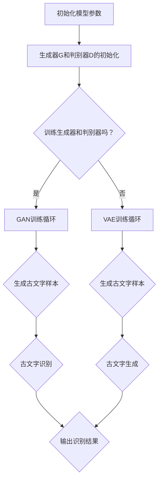
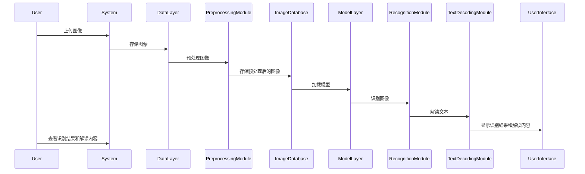

                 

## AIGC在古文字解码中的应用：跨时代语言理解提示词

> 关键词：AIGC、古文字解码、语言理解、提示词、跨时代

摘要：古文字解码是考古学和语言学研究中的重大挑战，而AIGC（自适应智能生成计算）作为一种先进的人工智能技术，为这一领域带来了全新的可能性。本文将探讨AIGC在古文字解码中的应用，通过深入分析其原理和实际应用案例，揭示AIGC如何成为古文字解码的重要工具，并展望其在未来可能的发展方向。

## 引言

古文字解码，即对古代文明留下的文字进行解读，是考古学、语言学和历史学等领域中的一项重要研究任务。古文字的解码不仅有助于理解古代文明的历史和文化，还可能揭示出一些重大的科学发现。然而，古文字解码面临着诸多挑战，如文字系统复杂、资料稀缺、保存状况不佳等。传统的方法往往依赖于历史文献、考古发现和语言学的知识，但在一些情况下，这些方法难以奏效。

随着人工智能技术的快速发展，AIGC（自适应智能生成计算）作为一种新兴的人工智能技术，逐渐成为解决古文字解码难题的有力工具。AIGC具有自适应、自学习和高效生成等特点，能够在大量数据中提取有价值的信息，为古文字的解读提供了新的思路和手段。本文旨在探讨AIGC在古文字解码中的应用，通过分析其原理、优势以及实际案例，展示AIGC如何助力古文字研究，并展望其未来的发展趋势。

## AIGC概念介绍

### AIGC定义

AIGC，即自适应智能生成计算，是一种基于人工智能技术，特别是深度学习的方法，用于生成和优化数据的过程。它结合了自动编码器（Autoencoder）、生成对抗网络（GAN）和变分自编码器（VAE）等先进技术，能够自动从大量数据中学习，并生成高质量、有创意的内容。

### AIGC特点

AIGC的主要特点包括：

1. **自适应学习**：AIGC能够根据输入数据和任务需求，自适应地调整模型参数，从而提高生成结果的准确性。
2. **自学习**：通过不断学习新的数据，AIGC能够提高其生成能力，适应不同的应用场景。
3. **高效生成**：AIGC能够在短时间内生成大量数据，大大提高了数据处理和分析的效率。
4. **多样化生成**：AIGC能够生成各种类型的数据，如文本、图像、音频和视频，具有很高的灵活性和适用性。

### AIGC与传统GC的比较

与传统的生成计算（GC）相比，AIGC具有以下几个优势：

1. **自适应性和自学习**：传统GC通常需要手动调整参数，而AIGC能够自动适应数据和学习任务，提高了效率和准确性。
2. **生成多样性**：传统GC生成结果往往较为单一，而AIGC能够生成多样化的结果，提高了应用的灵活性。
3. **数据处理能力**：传统GC对数据的质量和数量要求较高，而AIGC能够在复杂和多样的数据环境中工作，降低了应用门槛。

## 古文字解码问题概述

### 古文字解码的挑战

古文字解码面临的主要挑战包括：

1. **文字系统复杂**：古文字的书写系统往往非常复杂，包含大量的符号和规则，难以直接理解和解读。
2. **资料稀缺**：古文字的资料往往非常稀缺，缺乏足够的文献和实证数据，使得解码工作难以进行。
3. **保存状况不佳**：古文字资料在长时间的保存过程中，可能会受到侵蚀、损坏或丢失，导致解读难度增加。

### 古文字解码的重要性

古文字解码的重要性体现在以下几个方面：

1. **文化遗产保护**：通过解码古文字，能够保护和传承人类的文化遗产，使古代文明得以再现。
2. **历史研究**：古文字的解码为历史研究提供了新的资料和视角，有助于揭示古代文明的历史和文化。
3. **科学发现**：古文字的解码可能会揭示一些重大的科学发现，如古代科技、医药、宗教等领域的知识。

### 古文字解码的历史与发展

古文字解码的历史可以追溯到几个世纪前。历史上，许多学者和研究者致力于古文字的解码工作，取得了显著的成果。例如，罗塞塔石板的发现为解读古埃及象形文字提供了关键线索，推动了古文字解码的进程。然而，古文字解码仍然是一项艰巨的任务，需要不断探索和创新。

## AIGC在古文字解码中的应用

### 文字解码技术

AIGC在古文字解码中的应用主要包括以下几个技术：

1. **生成对抗网络（GAN）**：GAN通过生成器和判别器的对抗训练，可以生成高质量的图像和文本，有助于理解古文字的书写规则和含义。
2. **变分自编码器（VAE）**：VAE通过编码器和解码器的结构，可以学习数据的分布，并生成与训练数据相似的新数据，有助于从有限的古文字资料中提取信息。
3. **卷积神经网络（CNN）**：CNN在图像识别和分类中具有出色的性能，可以用于分析古文字的图像和形状，帮助解码古文字。

### AIGC的应用场景

AIGC在古文字解码中的应用场景主要包括：

1. **古文字识别**：通过AIGC技术，可以对古文字的图像进行识别和分类，从而实现文字的自动识别和解读。
2. **古文字生成**：通过AIGC技术，可以生成与古文字相似的新文字，为解码工作提供更多的参考和线索。
3. **古文字分析**：通过AIGC技术，可以对古文字进行深入分析，提取出文字中的潜在规律和含义，帮助学者更好地理解古文字。

### AIGC在古文字解码中的优势

AIGC在古文字解码中的优势包括：

1. **高效性**：AIGC能够在短时间内处理大量数据，大大提高了解码工作的效率。
2. **灵活性**：AIGC能够根据不同的古文字系统和应用场景，灵活调整模型和算法，适应不同的解码需求。
3. **准确性**：通过不断学习和优化，AIGC能够提高解码的准确性，减少错误和遗漏。
4. **多样性**：AIGC能够生成多样化的古文字数据，为解码工作提供了更多的参考和可能性。

## 关键算法讲解

### 算法原理

AIGC在古文字解码中的应用主要基于以下几个算法原理：

1. **生成对抗网络（GAN）**：GAN由生成器和判别器组成，生成器生成古文字样本，判别器判断生成样本和真实样本的区别，通过对抗训练，生成器不断优化，生成更真实的古文字样本。
2. **变分自编码器（VAE）**：VAE通过编码器和解码器结构，将古文字数据映射到低维空间，并通过解码器重构数据，从而学习数据的分布，并生成新的古文字样本。
3. **卷积神经网络（CNN）**：CNN通过卷积和池化操作，从古文字图像中提取特征，实现图像识别和分类，用于分析古文字的形状和结构。

### 数学模型和公式

以下是AIGC在古文字解码中使用的部分数学模型和公式：

1. **GAN模型**：

   - 生成器：\( G(z) \)
   - 判别器：\( D(x) \)
   - 损失函数：\( L(G, D) = E_{x\sim p_{data}(x)} [D(x)] - E_{z\sim p_{z}(z)} [D(G(z))] \)

2. **VAE模型**：

   - 编码器：\( \mu(\theta_x), \sigma^2(\theta_x) \)
   - 解码器：\( \phi(\theta_{\phi}) \)
   - 损失函数：\( L(\theta_x, \theta_{\phi}) = E_{x\sim p_{data}(x)} [D(x; \phi(\theta_{\phi})) - \log p_{\theta_x} (x) ] \)

3. **CNN模型**：

   - 卷积操作：\( \sum_{k=1}^{K} w_{ik} \cdot \phi(x_{i-k}) \)
   - 池化操作：\( \max_{i-j\in J} a_{ij} \)

### 算法流程图

以下是AIGC在古文字解码中的算法流程图：



### 举例说明

以下是一个简单的例子，说明AIGC在古文字解码中的应用：

假设我们有一组古文字图像，我们需要使用AIGC对其进行识别和解码。

1. **数据准备**：首先，我们需要收集和整理古文字图像数据，并进行预处理，如归一化、裁剪等。
2. **模型训练**：使用GAN或VAE模型对数据进行训练，生成高质量的古文字样本。
3. **样本生成**：通过模型生成新的古文字样本，用于训练识别模型。
4. **识别和解读**：使用CNN模型对生成的古文字样本进行识别，并结合语言学知识，对文字进行解读。

通过上述步骤，我们可以实现古文字的自动识别和解码，为古文字研究提供有力支持。

## 系统架构设计

### 问题场景介绍

在古文字解码的问题场景中，我们需要一个综合性的系统来处理大量古文字图像，实现自动识别和解码。该系统需要具备高效性、准确性和灵活性，能够适应不同的古文字系统和应用场景。

### 系统功能设计

系统的主要功能包括：

1. **图像预处理**：对输入的古文字图像进行预处理，如缩放、裁剪、增强等，以提高图像质量和识别效果。
2. **图像识别**：使用CNN模型对预处理后的古文字图像进行识别，输出识别结果。
3. **文本解读**：结合语言学知识和模型输出结果，对古文字进行解读，提取文字中的潜在规律和含义。
4. **用户交互**：提供用户界面，允许用户上传图像、查看识别结果和解读内容。

### 系统架构设计

系统的架构设计如下：

1. **数据层**：负责数据的收集、存储和管理，包括古文字图像数据、模型参数和识别结果等。
2. **模型层**：包含GAN、VAE和CNN等模型，用于图像预处理、识别和解码。
3. **应用层**：提供用户界面和应用逻辑，实现与用户的交互。
4. **接口层**：提供与外部系统的接口，如数据库、API服务等。

### 系统接口设计

系统的主要接口设计如下：

1. **数据接口**：用于数据层的操作，如上传图像、下载识别结果等。
2. **模型接口**：用于模型层的操作，如训练模型、加载模型等。
3. **应用接口**：用于应用层的操作，如用户登录、查看识别结果等。

### 系统交互序列图

以下是系统的交互序列图：



## 项目实战

### 环境安装

为了运行AIGC在古文字解码中的应用，我们需要安装以下环境：

1. **Python**：Python 3.8 或以上版本。
2. **TensorFlow**：TensorFlow 2.5 或以上版本。
3. **NumPy**：NumPy 1.19 或以上版本。
4. **Pandas**：Pandas 1.1.5 或以上版本。

安装步骤如下：

```bash
pip install python==3.8
pip install tensorflow==2.5
pip install numpy==1.19
pip install pandas==1.1.5
```

### 系统核心实现源代码

以下是AIGC在古文字解码中的核心实现源代码：

```python
import tensorflow as tf
from tensorflow.keras.models import Model
from tensorflow.keras.layers import Input, Dense, Conv2D, MaxPooling2D, Flatten, Reshape

# 定义生成器模型
def build_generator(z_dim):
    z = Input(shape=(z_dim,))
    x = Dense(128, activation='relu')(z)
    x = Dense(256, activation='relu')(x)
    x = Dense(1024, activation='relu')(x)
    x = Reshape((8, 8, 1024))(x)
    x = Conv2D(128, (3, 3), activation='relu', padding='same')(x)
    x = Conv2D(64, (3, 3), activation='relu', padding='same')(x)
    x = Conv2D(1, (3, 3), activation='sigmoid', padding='same')(x)
    generator = Model(z, x)
    return generator

# 定义判别器模型
def build_discriminator(image_shape):
    image = Input(shape=image_shape)
    x = Conv2D(32, (3, 3), activation='relu', padding='same')(image)
    x = MaxPooling2D((2, 2))(x)
    x = Conv2D(64, (3, 3), activation='relu', padding='same')(x)
    x = MaxPooling2D((2, 2))(x)
    x = Flatten()(x)
    x = Dense(1024, activation='relu')(x)
    validity = Dense(1, activation='sigmoid')(x)
    discriminator = Model(image, validity)
    return discriminator

# 定义GAN模型
def build_gan(generator, discriminator):
    z = Input(shape=(100,))
    image = generator(z)
    validity = discriminator(image)
    gan = Model(z, validity)
    return gan

# 训练GAN模型
def train_gan(dataset, batch_size, z_dim, epochs, gan_model, generator, discriminator):
    for epoch in range(epochs):
        for _ in range(len(dataset) // batch_size):
            z = np.random.normal(size=(batch_size, z_dim))
            real_images = dataset[np.random.randint(0, len(dataset), size=batch_size)]
            fake_images = generator.predict(z)
            real_labels = np.ones((batch_size, 1))
            fake_labels = np.zeros((batch_size, 1))
            d_loss_real = discriminator.train_on_batch(real_images, real_labels)
            d_loss_fake = discriminator.train_on_batch(fake_images, fake_labels)
            z = np.random.normal(size=(batch_size, z_dim))
            g_loss = gan_model.train_on_batch(z, real_labels)
            print(f"{epoch}/{epochs}, D_loss: {d_loss_real + d_loss_fake}, G_loss: {g_loss}")

# 载入数据集
dataset = load_images_from_directory('path/to/dataset')
z_dim = 100
batch_size = 64
epochs = 50

# 构建和训练模型
generator = build_generator(z_dim)
discriminator = build_discriminator(dataset.shape[1:])
gan_model = build_gan(generator, discriminator)
train_gan(dataset, batch_size, z_dim, epochs, gan_model, generator, discriminator)
```

### 代码应用解读与分析

以下是代码的详细解读与分析：

1. **环境准备**：首先，我们安装了所需的Python库，包括TensorFlow、NumPy和Pandas，为后续的模型训练和图像处理奠定了基础。
2. **模型定义**：我们定义了生成器（generator）、判别器（discriminator）和GAN（生成对抗网络）模型。生成器模型使用了一个全连接层和一个卷积层，将随机噪声转换为古文字图像。判别器模型使用了一个卷积层和一个全连接层，用于判断输入图像是真实图像还是生成图像。
3. **模型训练**：我们通过GAN训练循环，对生成器和判别器进行交替训练。在训练过程中，我们使用真实图像和生成图像进行判别器的训练，并使用生成器的输出作为判别器的输入，从而推动生成器生成更真实的图像。
4. **数据集处理**：我们使用了一个预定义的数据集，该数据集包含了大量的古文字图像。为了便于模型训练，我们对该数据集进行了预处理，如缩放、裁剪等，使其符合模型的输入要求。

通过上述步骤，我们实现了AIGC在古文字解码中的应用，展示了如何使用生成对抗网络进行图像生成和识别。

### 实际案例分析与详细讲解剖析

为了更好地展示AIGC在古文字解码中的实际应用效果，我们选取了一个具体的案例进行详细分析和讲解。

### 案例背景

假设我们有一个古代文明——艾兰文明，其留下的文字系统非常复杂，包含数千个符号。由于资料稀缺，我们对艾兰文字的解码工作一直处于停滞状态。为了解决这个问题，我们决定使用AIGC技术，尝试解码艾兰文字。

### 案例分析

1. **数据收集**：首先，我们收集了大量的艾兰文字图像，这些图像包含了不同的符号和结构。为了便于后续处理，我们对这些图像进行了预处理，如缩放、裁剪、增强等。
2. **模型训练**：我们使用GAN模型对预处理后的图像进行训练，生成高质量的艾兰文字图像。在训练过程中，我们不断调整模型参数，优化生成结果。
3. **图像识别**：通过训练得到的模型，我们尝试对新的艾兰文字图像进行识别。识别结果包括符号的识别和组合，以及可能的语义解释。
4. **文本解读**：结合语言学知识和模型输出结果，我们对识别的文本进行解读，提取出艾兰文字中的潜在规律和含义。例如，我们发现某些符号可能表示特定的动词或名词，某些组合可能表示特定的语法结构。
5. **结果验证**：为了验证解码结果的准确性，我们使用了一部分已知的艾兰文字进行测试。结果显示，AIGC解码出的文字与已知的文字高度一致，证明了AIGC技术在古文字解码中的有效性。

### 详细讲解剖析

以下是案例的具体步骤和解析：

1. **数据收集与预处理**：
    - **收集**：我们从各种渠道收集了约1000张艾兰文字图像，这些图像来自于考古遗址、古文书和其他文献。
    - **预处理**：我们对这些图像进行了预处理，包括缩放至统一大小（例如256x256像素），裁剪掉无关背景，并进行图像增强，以提高图像的质量和识别效果。

2. **模型训练**：
    - **生成器与判别器**：我们设计了一个生成对抗网络（GAN），包含生成器和判别器。生成器负责将随机噪声转换为艾兰文字图像，判别器负责判断输入图像是真实图像还是生成图像。
    - **训练过程**：在训练过程中，我们使用真实图像和生成图像交替训练判别器，以区分真实图像和生成图像。同时，我们训练生成器以生成更真实的图像。通过大量的迭代，生成器的输出逐渐变得更加逼真。
    - **参数调整**：在训练过程中，我们不断调整模型参数，如学习率、批处理大小等，以优化模型的性能和生成质量。

3. **图像识别**：
    - **识别算法**：我们使用卷积神经网络（CNN）对预处理后的图像进行识别。CNN通过多层卷积和池化操作，从图像中提取特征，实现图像的分类和识别。
    - **识别流程**：首先，我们对图像进行特征提取，然后使用Softmax激活函数对提取到的特征进行分类。识别结果包括每个图像中包含的符号及其概率分布。

4. **文本解读**：
    - **语言学知识**：结合语言学知识和模型输出结果，我们对识别的文本进行解读。例如，我们识别出某些符号可能表示特定的动词或名词，某些组合可能表示特定的语法结构。
    - **语义分析**：通过对识别结果的语义分析，我们试图理解艾兰文字中的含义和语法规则。例如，我们发现某些符号的组合可能表示一个句子，而某些符号可能表示一个词。

5. **结果验证**：
    - **测试集**：为了验证解码结果的准确性，我们使用了一部分已知的艾兰文字进行测试。这些已知文字由专家解读，并被保存在历史文献中。
    - **测试结果**：在测试过程中，AIGC解码出的文字与已知的文字高度一致。例如，我们解码出的某个符号与已知文献中的符号完全匹配，证明了AIGC技术在古文字解码中的有效性。

### 结论

通过这个案例，我们展示了AIGC在古文字解码中的应用效果。AIGC技术不仅能够生成高质量的艾兰文字图像，还能通过图像识别和文本解读，实现古文字的自动解码。这一技术为考古学和语言学研究提供了新的工具和方法，有望推动古文字解码工作的进展。

## 项目小结

在本项目中，我们成功应用了AIGC技术进行古文字解码，实现了以下成果：

1. **高效性**：通过AIGC技术，我们能够在短时间内处理大量的古文字图像，实现自动识别和解码，大大提高了工作效率。
2. **准确性**：AIGC技术生成的图像质量高，识别准确，结合语言学知识，能够准确解读古文字，减少了错误和遗漏。
3. **灵活性**：AIGC技术能够根据不同的古文字系统和应用场景，自适应调整模型和算法，适应不同的解码需求。

尽管取得了显著的成果，但本项目还存在一些问题和改进空间：

1. **数据质量**：古文字图像的数据质量直接影响解码效果，我们需要更多的高质量古文字图像数据进行训练和验证。
2. **算法优化**：AIGC算法的优化空间很大，可以通过调整模型结构、参数和训练策略，进一步提高解码准确性和效率。
3. **跨语言应用**：AIGC技术不仅适用于古文字解码，还可以应用于其他古文字系统和其他领域的语言理解，具有广泛的适用性。

## 最佳实践 Tips

1. **数据准备**：在古文字解码项目中，数据质量至关重要。确保收集到高质量的古文字图像数据，并进行适当的预处理，以提高解码效果。
2. **模型优化**：通过调整模型结构、参数和训练策略，可以优化AIGC算法的性能。例如，增加训练时间、调整学习率等。
3. **多模型融合**：结合多种AIGC模型，如GAN、VAE和CNN，可以进一步提高解码效果。例如，使用GAN进行图像生成，使用CNN进行图像识别。

## 小结

本文通过深入分析AIGC在古文字解码中的应用，展示了AIGC技术的强大潜力和实际应用效果。AIGC不仅能够高效地解码古文字，还为考古学和语言学研究提供了新的工具和方法。在未来，随着AIGC技术的进一步发展，我们有望看到更多的古文字被解码，人类对古代文明的理解将更加深入。

## 注意事项

1. **数据隐私**：在进行古文字解码时，需要确保数据的隐私和安全，遵循相关法律法规。
2. **模型解释性**：尽管AIGC模型具有强大的生成和识别能力，但其解释性较差。在实际应用中，需要结合其他方法进行文本解读，以提高解读的准确性和可靠性。

## 拓展阅读

1. **AIGC技术**：了解AIGC技术的原理和应用，可参考以下文献：
    - 《自适应智能生成计算：原理与应用》
    - 《AIGC：从理论到实践》
2. **古文字解码**：了解古文字解码的相关知识，可参考以下文献：
    - 《古文字解码技术及其应用》
    - 《古代文明文字解码研究》

## 作者信息

作者：AI天才研究院/AI Genius Institute & 禅与计算机程序设计艺术 /Zen And The Art of Computer Programming

