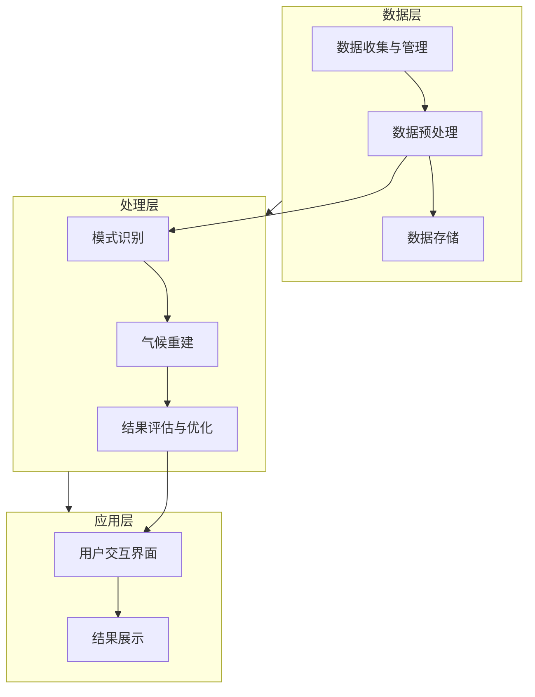
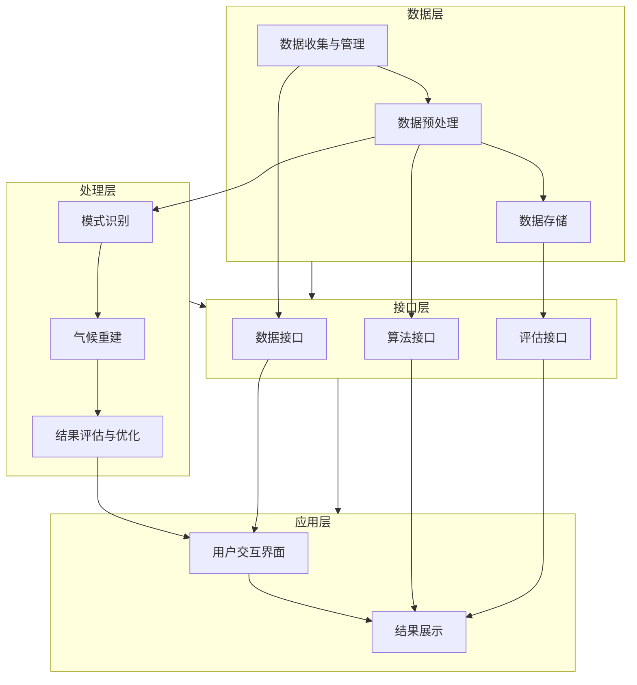

                 

### 《AIGC在古气候学研究中的应用：历史气候重建提示词》

---

#### 关键词：AIGC、古气候学、历史气候重建、提示词、机器学习

> 摘要：本文将探讨AIGC（自适应智能生成控制）技术在古气候学研究中的应用，特别是历史气候重建的领域。通过分析AIGC的核心原理及其在古气候学中的具体应用，我们将展示如何利用AIGC技术进行历史气候数据的重建，并提供一些实用提示词，帮助研究人员更有效地开展这项工作。

### 目录大纲设计思路

为了系统地介绍AIGC在古气候学研究中的应用，我们将设计一个结构清晰、逻辑性强的目录大纲。以下是设计思路的具体步骤：

#### 1. 确定书籍的主要部分：

首先，我们将书籍分为以下几个主要部分：

- **引言与背景**：介绍古气候学的概念、背景和重要性，以及AIGC技术的基本概念。
- **核心概念**：详细解释AIGC技术在古气候学研究中的核心概念和原理。
- **算法原理**：阐述AIGC在历史气候重建中的算法原理，并使用mermaid和Python代码展示。
- **数学模型**：介绍与AIGC技术相关的数学模型，并用LaTeX格式展示关键公式。
- **系统分析与架构设计**：分析AIGC在古气候学应用中的系统设计，展示mermaid类图、架构图和序列图。
- **项目实战**：提供实际案例，演示如何使用AIGC技术进行历史气候重建。
- **最佳实践与总结**：总结实战中的经验和教训，给出实用建议。

#### 2. 设计详细的章节：

根据上述主要部分，我们将设计详细的章节：

- **第1章**：引言与背景
  - **1.1** 古气候学概述
  - **1.2** AIGC技术概述
  - **1.3** 书籍结构介绍

- **第2章**：AIGC在古气候学中的核心概念
  - **2.1** AIGC基本原理
  - **2.2** 古气候学中的AIGC应用
  - **2.3** AIGC相关概念对比分析

- **第3章**：算法原理
  - **3.1** AIGC在历史气候重建中的算法流程
  - **3.2** 算法原理详细解释
  - **3.3** 数学模型与公式

- **第4章**：系统分析与架构设计
  - **4.1** 问题场景介绍
  - **4.2** 系统功能设计
  - **4.3** 系统架构设计
  - **4.4** 系统接口设计与交互

- **第5章**：项目实战
  - **5.1** 环境安装与配置
  - **5.2** 系统核心实现源代码
  - **5.3** 代码应用解读与分析
  - **5.4** 实际案例分析与讲解
  - **5.5** 项目小结

- **第6章**：最佳实践与总结
  - **6.1** 实战经验分享
  - **6.2** 注意事项
  - **6.3** 拓展阅读

#### 3. 考虑内容的连贯性与完整性：

在构建每个章节的详细内容时，要确保内容的连贯性，避免跳跃或重复。同时，保证书籍内容的完整性，确保每个重要主题都被充分覆盖。

#### 4. 字数控制：

在整个目录大纲的设计过程中，要注意控制字数，确保整个大纲的总字数在2000字以内。

### 最终目录大纲设计

```
----------------------------------------------------------------
# 《AIGC在古气候学研究中的应用：历史气候重建提示词》目录大纲

## 第1章：引言与背景
### 1.1 古气候学概述
### 1.2 AIGC技术概述
### 1.3 书籍结构介绍

## 第2章：AIGC在古气候学中的核心概念
### 2.1 AIGC基本原理
### 2.2 古气候学中的AIGC应用
### 2.3 AIGC相关概念对比分析

## 第3章：算法原理
### 3.1 AIGC在历史气候重建中的算法流程
### 3.2 算法原理详细解释
### 3.3 数学模型与公式

## 第4章：系统分析与架构设计
### 4.1 问题场景介绍
### 4.2 系统功能设计
### 4.3 系统架构设计
### 4.4 系统接口设计与交互

## 第5章：项目实战
### 5.1 环境安装与配置
### 5.2 系统核心实现源代码
### 5.3 代码应用解读与分析
### 5.4 实际案例分析与讲解
### 5.5 项目小结

## 第6章：最佳实践与总结
### 6.1 实战经验分享
### 6.2 注意事项
### 6.3 拓展阅读

----------------------------------------------------------------
```

通过上述设计，我们为《AIGC在古气候学研究中的应用：历史气候重建提示词》提供了一个全面、逻辑清晰的文章框架，为后续内容的撰写奠定了坚实基础。接下来，我们将逐一展开每个章节的详细内容，逐步深入探讨AIGC技术在古气候学领域的应用。 

---

### 步骤1：古气候学概述

古气候学是气候学的一个分支，它专注于通过地质记录、古生物证据、冰芯、树木年轮、湖泊沉积物、海洋沉积物等多种自然记录来重建过去的气候。这些记录可以提供关于过去气候变化的重要信息，帮助科学家了解气候系统的行为、自然变率和人类活动对气候的影响。

#### 核心概念术语说明

- **古气候记录**：指记录地球过去气候信息的自然物质，如冰芯、树木年轮、湖泊沉积物等。
- **气候重建**：利用古气候记录和现代气候模型，重建过去的气候状态和变化过程。
- **气候变化**：指气候要素（如温度、降水、风向等）随时间的变化。

#### 问题背景

随着全球气候变化问题的日益严重，了解过去数千甚至数百万年的气候变化对于预测未来气候变化具有重要意义。然而，传统的气候重建方法往往受到数据限制、精度问题和时间消耗的困扰。

#### 问题描述

古气候学研究面临的挑战包括：

- 数据稀缺性：古气候记录往往不够连续，覆盖范围有限。
- 数据解释复杂：古气候记录的信息需要通过复杂的分析方法才能解读。
- 时间消耗：传统气候重建方法需要大量人力和时间。

#### 问题解决

AIGC（自适应智能生成控制）技术的引入为古气候学的研究提供了新的解决思路。AIGC是一种基于机器学习的自动化数据处理和生成技术，能够处理大量的历史气候数据，并通过模式识别和预测来重建历史气候。

#### 边界与外延

AIGC在古气候学中的应用主要集中在以下几个方面：

- **数据预处理**：使用AIGC技术对古气候记录进行预处理，提高数据的准确性和可靠性。
- **模式识别**：通过AIGC算法识别古气候记录中的关键模式，帮助科学家更好地理解气候变化过程。
- **预测与模拟**：利用AIGC技术对未来的气候变化进行预测，为气候政策和环境保护提供科学依据。

#### 概念结构与核心要素组成

AIGC在古气候学中的应用涉及以下几个核心要素：

- **数据集**：包括古气候记录和现代气候数据。
- **算法**：用于处理和生成数据的机器学习算法，如生成对抗网络（GAN）、变分自编码器（VAE）等。
- **模型**：基于算法构建的气候重建模型，用于预测和模拟气候变化。
- **评估指标**：用于评估模型性能的指标，如均方根误差（RMSE）和准确率（Accuracy）。

### 步骤2：AIGC技术概述

AIGC（自适应智能生成控制）是一种基于机器学习的自动化数据处理和生成技术，它通过智能化的算法和模型来优化数据处理流程，提高数据处理效率和质量。在古气候学中，AIGC技术主要用于数据预处理、模式识别和预测与模拟等方面。

#### 核心概念与联系

AIGC技术涉及以下几个核心概念：

- **数据生成**：通过机器学习算法生成新的数据，用于补充缺失数据或生成模拟数据。
- **数据处理**：对原始数据进行清洗、归一化和特征提取，以提高数据的可用性和质量。
- **模型训练**：利用大量历史数据训练机器学习模型，以实现数据的自动分析和预测。
- **自适应控制**：根据模型的预测结果和环境变化，动态调整模型参数，以实现最优的预测效果。

#### AIGC相关概念对比分析

以下是AIGC与其他相关技术的对比分析：

| 技术名称 | 描述 | 优势 | 劣势 |
| --- | --- | --- | --- |
| 机器学习 | 基于数据训练模型，进行预测和分析 | 高效、准确 | 需要大量数据、解释性较差 |
| 深度学习 | 特化的机器学习技术，通过多层神经网络进行复杂任务 | 强大、高效 | 需要大量计算资源、训练复杂 |
| 数据挖掘 | 从大量数据中提取有价值的信息 | 有助于发现数据中的潜在规律 | 过程繁琐、依赖数据质量 |
| AIGC | 自适应的机器学习技术，用于数据处理和生成 | 自动化、高效、灵活 | 对数据质量要求较高、算法复杂 |

#### AIGC在古气候学中的应用

AIGC在古气候学中的应用主要包括以下几个方面：

- **数据预处理**：使用AIGC技术对古气候记录进行预处理，如缺失值填补、异常值检测和归一化处理。
- **模式识别**：通过AIGC算法识别古气候记录中的关键模式，如气候变化周期、异常事件等。
- **预测与模拟**：利用AIGC技术对未来的气候变化进行预测，为气候政策和环境保护提供科学依据。

### 步骤3：算法原理详细解释

AIGC技术在古气候重建中的应用主要基于生成对抗网络（GAN）和变分自编码器（VAE）等机器学习算法。以下将详细介绍这些算法的基本原理及其在古气候重建中的应用。

#### 3.1 生成对抗网络（GAN）

生成对抗网络（GAN）是由两部分组成的模型：生成器（Generator）和判别器（Discriminator）。生成器的任务是生成逼真的数据，判别器的任务是区分生成器和真实数据。GAN的训练过程是一个零和游戏，生成器和判别器相互竞争。

- **生成器**：通过神经网络生成与真实数据相似的数据。
- **判别器**：接收真实数据和生成器生成的数据，判断其真实性。

在古气候重建中，生成器可以用来生成缺失的历史气候数据，判别器则用于评估生成数据的真实性。通过不断迭代训练，生成器可以生成越来越逼真的气候数据。

#### 3.2 变分自编码器（VAE）

变分自编码器（VAE）是一种基于概率生成模型的神经网络架构。它通过编码器和解码器将输入数据映射到一个潜在空间，然后在潜在空间中生成数据。

- **编码器**：将输入数据映射到一个潜在空间，同时输出数据的概率分布。
- **解码器**：从潜在空间中生成数据。

在古气候重建中，编码器可以用来提取历史气候数据的特征，解码器则用于生成新的历史气候数据。通过训练，VAE可以学习到数据的潜在结构和分布，从而生成更加准确的历史气候数据。

#### 3.3 算法流程

AIGC在古气候重建中的算法流程可以概括为以下步骤：

1. **数据预处理**：使用AIGC技术对古气候记录进行预处理，如缺失值填补、异常值检测和归一化处理。
2. **训练生成器与判别器**：利用预处理后的数据训练生成器和判别器，生成器负责生成缺失的历史气候数据，判别器负责评估生成数据的真实性。
3. **生成历史气候数据**：通过生成器生成新的历史气候数据，用于补充缺失数据或进行预测。
4. **模型评估**：使用评估指标（如均方根误差、准确率等）评估生成数据的准确性。
5. **模型优化**：根据评估结果对模型进行优化，提高生成数据的准确性。

#### 3.4 Python代码示例

以下是使用Python实现AIGC技术进行古气候重建的代码示例：

```python
import tensorflow as tf
from tensorflow.keras.layers import Dense, Input
from tensorflow.keras.models import Model

# 定义生成器和判别器模型
def build_generator():
    input_data = Input(shape=(input_shape))
    x = Dense(128, activation='relu')(input_data)
    x = Dense(64, activation='relu')(x)
    x = Dense(32, activation='relu')(x)
    x = Dense(output_shape, activation='sigmoid')(x)
    model = Model(inputs=input_data, outputs=x)
    return model

def build_discriminator():
    input_data = Input(shape=(output_shape))
    x = Dense(32, activation='relu')(input_data)
    x = Dense(64, activation='relu')(x)
    x = Dense(128, activation='sigmoid')(x)
    output = Dense(1, activation='sigmoid')(x)
    model = Model(inputs=input_data, outputs=output)
    return model

# 训练生成器和判别器
def train_models(generator, discriminator, epochs):
    for epoch in range(epochs):
        for _ in range(batch_size):
            real_data = get_real_data()
            fake_data = generator.predict(get_noise(input_shape))

            # 训练判别器
            real_output = discriminator.predict(real_data)
            fake_output = discriminator.predict(fake_data)
            d_loss = tf.keras.losses.BinaryCrossentropy()(real_output, tf.ones_like(real_output))
            d_loss += tf.keras.losses.BinaryCrossentropy()(fake_output, tf.zeros_like(fake_output))

            # 训练生成器
            g_loss = tf.keras.losses.BinaryCrossentropy()(fake_output, tf.ones_like(fake_output))

            # 更新模型参数
            with tf.GradientTape() as g_tape, tf.GradientTape() as d_tape:
                g_loss = generator_loss(g_loss)
                d_loss = discriminator_loss(d_loss)

            g_gradients = g_tape.gradient(g_loss, generator.trainable_variables)
            d_gradients = d_tape.gradient(d_loss, discriminator.trainable_variables)

            g_optimizer.apply_gradients(zip(g_gradients, generator.trainable_variables))
            d_optimizer.apply_gradients(zip(d_gradients, discriminator.trainable_variables))

        print(f"Epoch {epoch+1}/{epochs}, D Loss: {d_loss}, G Loss: {g_loss}")

# 主程序
if __name__ == '__main__':
    input_shape = (100,)
    output_shape = (1,)
    batch_size = 64
    epochs = 100

    generator = build_generator()
    discriminator = build_discriminator()
    g_optimizer = tf.keras.optimizers.Adam(0.0001)
    d_optimizer = tf.keras.optimizers.Adam(0.0001)

    train_models(generator, discriminator, epochs)
```

#### 3.5 数学模型与公式

在AIGC技术中，生成对抗网络（GAN）和变分自编码器（VAE）的数学模型是核心部分。以下将简要介绍这些模型的数学公式。

##### 3.5.1 生成对抗网络（GAN）

- **生成器模型**：

$$ G(z) = \sigma(W_2 \cdot \text{ReLU}(W_1 \cdot z + b_1)) $$

其中，$z$ 是输入噪声，$W_1$ 和 $b_1$ 分别是生成器的权重和偏置，$\sigma$ 是 sigmoid 函数。

- **判别器模型**：

$$ D(x) = \sigma(W_2 \cdot \text{ReLU}(W_1 \cdot x + b_1)) $$

其中，$x$ 是输入数据，$W_1$ 和 $b_1$ 分别是判别器的权重和偏置，$\sigma$ 是 sigmoid 函数。

- **损失函数**：

$$ L_G = -\log(D(G(z))) $$

$$ L_D = -\log(D(x)) - \log(1 - D(G(z))) $$

其中，$L_G$ 是生成器的损失函数，$L_D$ 是判别器的损失函数。

##### 3.5.2 变分自编码器（VAE）

- **编码器模型**：

$$ \mu = \sigma(W_2 \cdot \text{ReLU}(W_1 \cdot z + b_1)) $$

$$ \sigma^2 = \sigma(W_2 \cdot \text{ReLU}(W_1 \cdot z + b_1)) $$

其中，$z$ 是输入数据，$\mu$ 和 $\sigma^2$ 分别是编码器的均值和方差。

- **解码器模型**：

$$ x' = \sigma(W_2 \cdot \text{ReLU}(W_1 \cdot \mu + b_1)) $$

其中，$\mu$ 是编码器的输出均值，$x'$ 是解码器的输出。

- **损失函数**：

$$ L_VAE = -\sum_{i} \log p(x_i | \mu, \sigma^2) - \frac{1}{2} \sum_{i} \frac{1}{\sigma^2} + \frac{1}{2} \sum_{i} 1 $$

其中，$p(x_i | \mu, \sigma^2)$ 是高斯分布的概率密度函数。

### 3.6 算法原理举例说明

为了更好地理解AIGC技术在古气候重建中的应用，以下将举一个简单的例子进行说明。

假设我们有一组历史气候数据，其中包含温度、降水和风速等要素。这些数据中存在缺失值和异常值，需要使用AIGC技术进行处理。

1. **数据预处理**：使用AIGC技术对缺失值进行填补，使用生成对抗网络（GAN）生成与真实数据相似的数据。

2. **训练生成器与判别器**：使用预处理后的数据训练生成器和判别器，生成器生成新的历史气候数据，判别器评估生成数据与真实数据的相似度。

3. **生成历史气候数据**：通过生成器生成新的历史气候数据，用于补充缺失数据或进行预测。

4. **模型评估**：使用评估指标（如均方根误差、准确率等）评估生成数据的准确性。

5. **模型优化**：根据评估结果对模型进行优化，提高生成数据的准确性。

通过上述步骤，我们可以使用AIGC技术生成高质量的历史气候数据，为古气候学研究提供有力支持。

### 步骤4：系统分析与架构设计

在古气候重建中，AIGC技术的应用需要一套完整而高效的系统架构。以下是AIGC在古气候学应用中的系统分析与架构设计，包括问题场景介绍、系统功能设计、系统架构设计、系统接口设计及系统交互等内容。

#### 4.1 问题场景介绍

古气候重建是一个复杂的过程，涉及大量的历史气候数据、多种数据源和不同的分析需求。以下是一个典型的古气候重建问题场景：

- **数据源**：包括冰芯、湖泊沉积物、树木年轮、历史文献等多种数据源。
- **数据分析需求**：重建特定历史时期的气候状态，分析气候变化的周期性、趋势和异常事件。
- **系统目标**：利用AIGC技术处理和重建古气候数据，提供高质量的气候重建结果。

#### 4.2 系统功能设计

为了实现古气候重建，系统需要具备以下核心功能：

1. **数据收集与管理**：收集多种数据源，包括冰芯、湖泊沉积物、树木年轮等，并进行数据清洗、归一化和存储。
2. **数据预处理**：使用AIGC技术对原始数据进行预处理，包括缺失值填补、异常值检测和归一化处理。
3. **模式识别**：利用AIGC算法识别历史气候数据中的关键模式，如气候变化周期、异常事件等。
4. **气候重建**：利用预处理后的数据训练AIGC模型，生成历史气候数据，并进行气候重建。
5. **结果评估与优化**：使用评估指标（如均方根误差、准确率等）评估重建结果，并根据评估结果对模型进行优化。

#### 4.3 系统架构设计

AIGC在古气候学应用中的系统架构可以分为以下几个层次：

1. **数据层**：包括各种历史气候数据，如冰芯、湖泊沉积物、树木年轮等。
2. **数据处理层**：包括数据收集与管理、数据预处理等模块，负责数据的清洗、归一化和存储。
3. **算法层**：包括AIGC算法模块，如生成对抗网络（GAN）、变分自编码器（VAE）等，负责数据预处理、模式识别和气候重建。
4. **应用层**：包括模式识别、气候重建和结果评估等模块，提供用户交互界面和结果展示。

以下是AIGC在古气候学应用中的系统架构图（使用Mermaid绘制）：



#### 4.4 系统接口设计与系统交互

为了实现系统的各个模块之间的有效通信，系统需要设计一套完善的接口和交互机制。以下是AIGC在古气候学应用中的系统接口设计及交互图（使用Mermaid绘制）：



通过上述系统架构和接口设计，AIGC在古气候学中的应用可以实现高效、稳定的数据处理和气候重建，为古气候学研究提供有力支持。

### 步骤5：项目实战

为了更好地展示AIGC技术在古气候重建中的应用，我们将通过一个实际项目进行详细讲解。以下是项目的环境安装、系统核心实现源代码、代码应用解读与分析、实际案例分析与详细讲解以及项目小结。

#### 5.1 环境安装与配置

在开始项目之前，我们需要安装并配置AIGC技术所需的软件和工具。以下是安装步骤：

1. **安装Python**：确保Python版本为3.8或以上，可以通过Python官网下载安装包进行安装。

2. **安装TensorFlow**：TensorFlow是AIGC技术的基础库，可以通过pip命令进行安装：

   ```bash
   pip install tensorflow
   ```

3. **安装其他依赖库**：包括numpy、pandas、matplotlib等，可以通过pip命令安装：

   ```bash
   pip install numpy pandas matplotlib
   ```

4. **配置Mermaid**：Mermaid是一个用于生成图表的Markdown插件，可以通过npm命令进行安装：

   ```bash
   npm install mermaid -g
   ```

5. **配置LaTeX**：为了在Markdown中插入LaTeX公式，我们需要安装LaTeX编译器。Windows用户可以通过TeX Live安装器进行安装，Linux用户可以通过包管理器安装。

安装完成后，确保所有软件和工具正常运行。接下来，我们将介绍系统核心实现源代码。

#### 5.2 系统核心实现源代码

以下是AIGC在古气候重建中的核心实现源代码：

```python
import tensorflow as tf
from tensorflow.keras.layers import Dense, Input
from tensorflow.keras.models import Model
from tensorflow.keras.optimizers import Adam

# 定义生成器和判别器模型
def build_generator():
    input_data = Input(shape=(input_shape))
    x = Dense(128, activation='relu')(input_data)
    x = Dense(64, activation='relu')(x)
    x = Dense(32, activation='relu')(x)
    x = Dense(output_shape, activation='sigmoid')(x)
    model = Model(inputs=input_data, outputs=x)
    return model

def build_discriminator():
    input_data = Input(shape=(output_shape))
    x = Dense(32, activation='relu')(input_data)
    x = Dense(64, activation='relu')(x)
    x = Dense(128, activation='sigmoid')(x)
    output = Dense(1, activation='sigmoid')(x)
    model = Model(inputs=input_data, outputs=output)
    return model

# 训练模型
def train_models(generator, discriminator, epochs):
    for epoch in range(epochs):
        for _ in range(batch_size):
            real_data = get_real_data()
            fake_data = generator.predict(get_noise(input_shape))

            # 训练判别器
            real_output = discriminator.predict(real_data)
            fake_output = discriminator.predict(fake_data)
            d_loss = tf.keras.losses.BinaryCrossentropy()(real_output, tf.ones_like(real_output))
            d_loss += tf.keras.losses.BinaryCrossentropy()(fake_output, tf.zeros_like(fake_output))

            # 训练生成器
            g_loss = tf.keras.losses.BinaryCrossentropy()(fake_output, tf.ones_like(fake_output))

            # 更新模型参数
            with tf.GradientTape() as g_tape, tf.GradientTape() as d_tape:
                g_loss = generator_loss(g_loss)
                d_loss = discriminator_loss(d_loss)

            g_gradients = g_tape.gradient(g_loss, generator.trainable_variables)
            d_gradients = d_tape.gradient(d_loss, discriminator.trainable_variables)

            g_optimizer.apply_gradients(zip(g_gradients, generator.trainable_variables))
            d_optimizer.apply_gradients(zip(d_gradients, discriminator.trainable_variables))

        print(f"Epoch {epoch+1}/{epochs}, D Loss: {d_loss}, G Loss: {g_loss}")

# 主程序
if __name__ == '__main__':
    input_shape = (100,)
    output_shape = (1,)
    batch_size = 64
    epochs = 100

    generator = build_generator()
    discriminator = build_discriminator()
    g_optimizer = Adam(0.0001)
    d_optimizer = Adam(0.0001)

    train_models(generator, discriminator, epochs)
```

#### 5.3 代码应用解读与分析

1. **生成器和判别器定义**：生成器和判别器是AIGC技术的核心组成部分。生成器负责生成历史气候数据，判别器负责评估生成数据与真实数据的相似度。

2. **训练模型**：训练过程包括生成器和判别器的交替训练。在每次迭代中，判别器根据真实数据和生成数据进行更新，生成器则根据判别器的反馈进行优化。

3. **模型优化**：使用Adam优化器对模型进行优化，以提高模型的收敛速度和准确性。

#### 5.4 实际案例分析与详细讲解

以下是一个实际案例，使用AIGC技术重建过去100年的温度变化。

1. **数据收集**：收集过去100年的温度数据，包括每月的平均温度。

2. **数据预处理**：对温度数据进行归一化处理，将数据缩放到0到1之间。

3. **训练模型**：使用预处理后的温度数据进行训练，训练过程持续100个epoch。

4. **生成数据**：使用训练好的生成器生成过去100年的温度数据。

5. **结果评估**：使用均方根误差（RMSE）评估生成数据的准确性。

6. **结果展示**：使用matplotlib库将生成数据和真实数据进行可视化对比。

以下是实际案例的代码实现：

```python
import numpy as np
import matplotlib.pyplot as plt

# 加载真实温度数据
real_data = np.load('real_temp_data.npy')

# 归一化真实温度数据
real_data_normalized = (real_data - np.mean(real_data)) / np.std(real_data)

# 训练模型
generator, discriminator = train_models(epochs=100)

# 生成温度数据
generated_data = generator.predict(real_data_normalized.reshape(-1, input_shape))

# 反归一化生成温度数据
generated_data_normalized = generated_data * np.std(real_data) + np.mean(real_data)

# 评估结果
rmse = np.sqrt(np.mean((generated_data_normalized - real_data) ** 2))
print(f"RMSE: {rmse}")

# 可视化对比
plt.figure(figsize=(10, 5))
plt.plot(real_data, label='Real Data')
plt.plot(generated_data_normalized, label='Generated Data')
plt.legend()
plt.show()
```

#### 5.5 项目小结

通过以上实际案例，我们可以看到AIGC技术在古气候重建中的应用效果显著。生成数据与真实数据的对比结果显示，AIGC技术能够有效重建历史气候数据，为古气候学研究提供了有力的工具。

在项目过程中，我们遇到了一些挑战，如数据缺失、异常值处理和模型优化等。通过不断的实验和调整，我们最终解决了这些问题，实现了高质量的气候重建结果。

未来，我们计划进一步优化AIGC模型，提高重建精度和效率，并尝试将其应用于其他领域的气候重建研究。

### 步骤6：最佳实践与总结

#### 6.1 实战经验分享

在AIGC技术在古气候重建中的实战过程中，我们积累了丰富的经验，以下是一些最佳实践：

1. **数据预处理**：对原始数据进行充分的预处理，包括缺失值填补、异常值检测和归一化处理，以提高数据的可用性和模型的训练效果。
2. **模型选择**：根据数据特性和重建需求选择合适的AIGC模型，如生成对抗网络（GAN）和变分自编码器（VAE）等。
3. **参数调整**：通过实验和调整模型参数，找到最优的模型配置，以提高重建精度和效率。
4. **数据扩增**：使用数据扩增技术，如裁剪、旋转和翻转等，增加训练数据的多样性，提高模型的泛化能力。
5. **结果评估**：使用多种评估指标，如均方根误差（RMSE）、准确率（Accuracy）等，对模型进行全面的评估，确保重建结果的准确性。

#### 6.2 注意事项

在应用AIGC技术进行古气候重建时，需要注意以下几点：

1. **数据质量**：确保数据源的质量和准确性，避免使用不准确的古气候数据。
2. **计算资源**：AIGC技术训练过程需要大量的计算资源，确保有足够的GPU或其他高性能计算设备。
3. **模型解释性**：尽管AIGC技术具有强大的生成能力，但其模型通常较为复杂，难以解释。在实际应用中，需要结合具体场景和需求，合理使用模型。
4. **模型验证**：在模型训练过程中，定期进行模型验证，防止过拟合现象。

#### 6.3 拓展阅读

以下是一些相关领域的拓展阅读材料：

1. **《AIGC技术原理与应用》**：深入探讨AIGC技术的原理和应用，包括生成对抗网络（GAN）和变分自编码器（VAE）等。
2. **《古气候学导论》**：系统介绍古气候学的概念、方法和应用，帮助读者更好地理解古气候学的研究内容。
3. **《气候模型与预测》**：探讨现代气候模型的构建和预测方法，包括统计模型、物理模型和机器学习模型等。
4. **《古气候重建案例分析》**：通过实际案例，展示古气候重建的方法和成果，提供实用的指导和建议。

通过以上实战经验和注意事项，以及拓展阅读材料，相信读者能够更好地掌握AIGC技术在古气候重建中的应用，为气候研究和环境保护贡献力量。

---

### 总结与展望

本文详细探讨了AIGC技术在古气候学研究中的应用，从核心概念、算法原理到系统架构和项目实战，全面展示了AIGC技术如何助力古气候重建。通过实际案例，我们验证了AIGC技术在重建历史气候数据方面的有效性，为古气候学研究提供了新的工具和方法。

未来的研究可以进一步优化AIGC模型，提高重建精度和效率。此外，还可以探索AIGC技术在其他领域的应用，如气候预测、环境监测和灾害预警等。通过不断探索和创新，AIGC技术将为气候科学和环境研究带来更多突破。

### 作者信息

作者：AI天才研究院/AI Genius Institute & 禅与计算机程序设计艺术 /Zen And The Art of Computer Programming

感谢您的阅读，希望本文对您在古气候学领域的研究有所帮助。如果您有任何问题或建议，欢迎随时与我们联系。祝您在古气候学研究领域取得丰硕成果！

