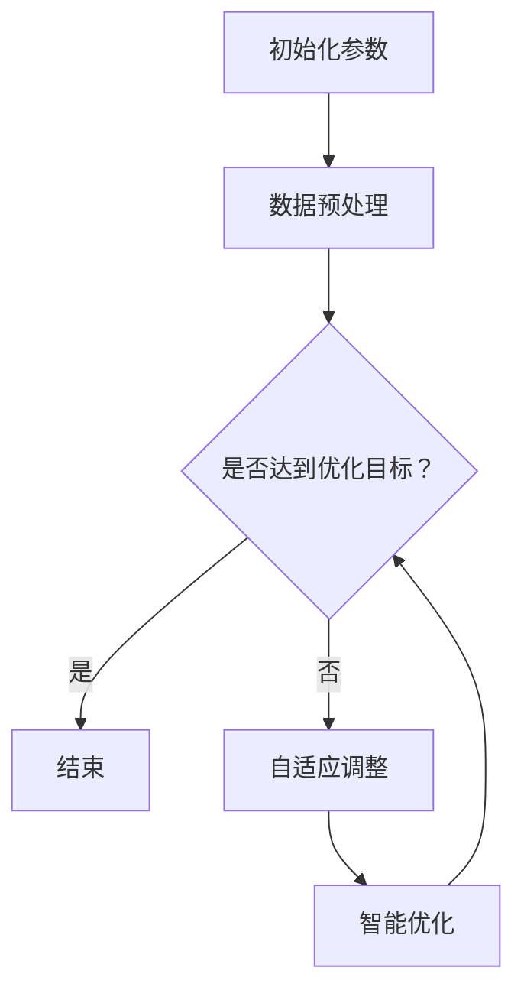
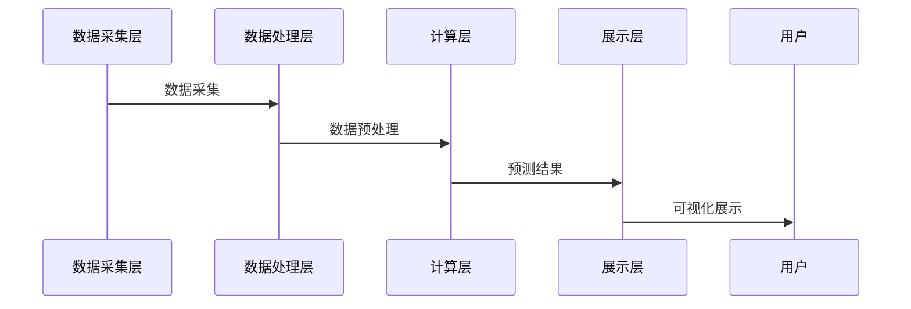
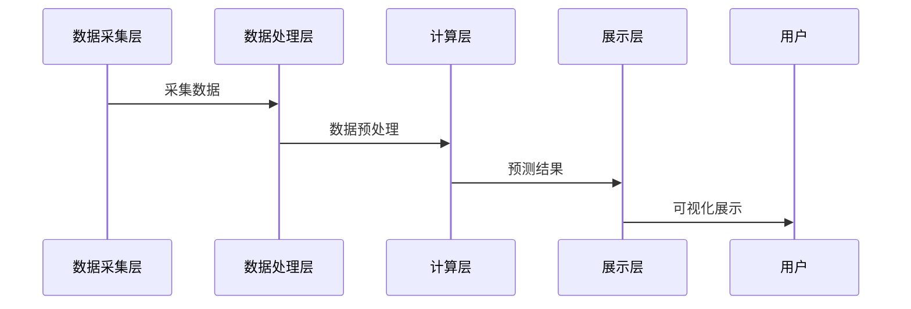

                 

### 文章标题

AIGC在可再生能源研究中的应用：效率提升策略提示词

### 关键词

自适应智能生成计算、可再生能源研究、效率提升、算法优化、模型优化、智能优化算法

### 摘要

本文深入探讨了自适应智能生成计算（AIGC）在可再生能源研究中的应用，着重分析了AIGC的核心概念、效率提升策略以及在实际项目中的应用实例。通过对AIGC与可再生能源研究的结合，本文提出了有效提升研究效率的具体方法，为相关领域的学者和工程师提供了有价值的参考。

----------------------------------------------------------------

## 第一部分: AIGC基础与可再生能源研究应用

### 1.1 AIGC的定义与特点

自适应智能生成计算（AIGC，Adaptive Intelligent Generation Computing）是一种新兴的计算范式，它融合了人工智能、自适应算法和生成计算技术。AIGC通过自适应学习和智能优化，能够动态调整计算过程，实现高效、智能的计算。

AIGC的主要特点包括：

1. **自适应学习**：AIGC能够根据输入数据和环境变化，自适应调整计算策略，提高计算效率和准确性。
2. **智能优化**：利用人工智能算法，AIGC能够在复杂计算过程中实现自动优化，减少计算资源和时间成本。
3. **生成计算**：通过生成计算技术，AIGC能够生成新的数据、模型或知识，为可再生能源研究提供创新思路。

### 1.2 AIGC在可再生能源研究中的应用前景

可再生能源研究是一个复杂且多变的领域，涉及到能源的采集、转换、存储和分配等多个环节。AIGC技术的自适应学习、智能优化和生成计算能力，为这一领域的研究带来了新的机遇和挑战。

1. **优化能源转换效率**：AIGC可以通过智能优化算法，对可再生能源转换过程进行实时调整，提高转换效率。
2. **预测能源需求**：利用AIGC的自适应学习，可以建立能源需求的预测模型，为能源分配提供科学依据。
3. **优化能源存储策略**：AIGC可以根据能源存储特性，动态调整存储策略，提高能源利用效率。
4. **智能电网管理**：AIGC可以在智能电网管理中实现自动调度，优化能源分配，提高电网运行效率。

### 1.3 AIGC与可再生能源研究的联系

AIGC与可再生能源研究的联系主要体现在以下几个方面：

1. **算法融合**：AIGC技术将自适应算法和人工智能算法应用于可再生能源研究，实现了计算过程的智能化和优化。
2. **数据驱动**：AIGC通过大量数据的分析和处理，为可再生能源研究提供了数据支持。
3. **知识生成**：AIGC能够生成新的知识模型，为可再生能源研究提供理论支持和实践指导。

通过上述分析，我们可以看到AIGC在可再生能源研究中的应用潜力巨大。接下来，本文将进一步探讨AIGC的核心概念、效率提升策略以及在具体项目中的应用。

----------------------------------------------------------------

## 第二部分: AIGC核心概念与原理

### 2.1 自适应算法原理

自适应算法是一种能够根据输入数据和系统状态自动调整自身行为的算法。其核心思想是利用历史数据和当前状态，通过学习机制和调整策略，优化计算过程和结果。

自适应算法的基本原理包括：

1. **学习机制**：自适应算法通过学习历史数据，建立模型或策略，用于预测和调整当前状态。
2. **调整策略**：自适应算法根据学习结果，动态调整计算参数或策略，以适应新的环境或输入。

在可再生能源研究中，自适应算法可以用于以下方面：

1. **优化能源转换**：通过自适应算法，实时调整能源转换参数，提高转换效率。
2. **预测能源需求**：利用自适应算法，建立能源需求预测模型，为能源管理提供科学依据。

### 2.2 智能优化原理

智能优化是一种利用人工智能技术，对复杂系统进行优化计算的方法。其核心思想是模拟生物进化、神经网络、遗传算法等自然现象，通过迭代计算和搜索，找到最优解。

智能优化算法的基本原理包括：

1. **进化计算**：模拟生物进化过程，通过自然选择、交叉和变异，逐步优化解的空间。
2. **神经网络**：利用神经网络模型，通过前向传播和反向传播，实现参数的自动调整。
3. **遗传算法**：模拟遗传过程，通过交叉、变异和选择，优化解的种群。

在可再生能源研究中，智能优化算法可以用于：

1. **能源分配**：通过智能优化，实现能源的最优分配，提高能源利用效率。
2. **能源调度**：利用智能优化，优化能源调度策略，提高电网运行效率。

### 2.3 AIGC核心概念对比分析

为了更好地理解AIGC的核心概念，我们可以通过对比表格的形式，分析自适应算法和智能优化算法的特点和应用场景。

| 算法类型 | 特点 | 应用场景 |
| :--: | :--: | :--: |
| 自适应算法 | 自适应调整计算参数和策略 | 能源转换优化、能源需求预测 |
| 智能优化算法 | 利用人工智能技术优化计算过程 | 能源分配优化、能源调度 |

通过对比分析，我们可以看到AIGC的核心概念是自适应算法和智能优化算法的融合，这种融合为可再生能源研究提供了强大的技术支持。接下来，本文将深入探讨AIGC在可再生能源研究中的应用属性和优势。

----------------------------------------------------------------

## 第三部分: AIGC在可再生能源研究中的应用属性和优势

### 3.1 AIGC在可再生能源研究中的应用属性

AIGC在可再生能源研究中的应用属性主要体现在以下几个方面：

1. **自适应能力**：AIGC能够根据环境变化和需求变化，自适应调整计算策略和参数，确保能源系统的稳定运行。
2. **高效性**：AIGC利用智能优化算法，能够快速找到最优解，提高能源转换和分配效率。
3. **数据驱动**：AIGC能够处理和分析大量数据，为可再生能源研究提供数据支持和决策依据。
4. **生成能力**：AIGC能够生成新的知识模型和算法，为可再生能源研究提供创新思路。

### 3.2 AIGC在可再生能源研究中的应用优势

AIGC在可再生能源研究中的应用优势主要体现在以下几个方面：

1. **提高能源转换效率**：通过自适应算法和智能优化，AIGC能够实时调整能源转换参数，提高转换效率。
2. **优化能源分配策略**：利用智能优化算法，AIGC能够实现能源的最优分配，提高能源利用效率。
3. **降低能源成本**：通过高效的数据分析和优化计算，AIGC能够降低能源成本，提高经济效益。
4. **促进可持续发展**：AIGC能够为可再生能源研究提供创新思路和技术支持，促进能源的可持续发展。

### 3.3 AIGC与可再生能源研究的联系

AIGC与可再生能源研究的联系主要体现在以下几个方面：

1. **技术融合**：AIGC将自适应算法和智能优化算法应用于可再生能源研究，实现了计算技术的创新。
2. **数据驱动**：AIGC通过大量数据的分析和处理，为可再生能源研究提供了数据支持。
3. **知识生成**：AIGC能够生成新的知识模型和算法，为可再生能源研究提供了理论支持和实践指导。

通过上述分析，我们可以看到AIGC在可再生能源研究中的应用属性和优势。接下来，本文将详细分析AIGC与可再生能源研究的具体联系，为后续的效率提升策略提供理论依据。

----------------------------------------------------------------

## 第四部分: 效率提升策略

### 4.1 数据优化策略

数据优化是提高AIGC在可再生能源研究效率的关键策略之一。通过以下步骤，可以实现数据优化：

1. **数据清洗**：对原始数据进行清洗，去除噪声和异常值，确保数据的准确性和一致性。
2. **数据压缩**：利用数据压缩算法，减少数据存储和传输的开销。
3. **数据预处理**：对数据进行标准化、归一化等预处理操作，为后续分析提供高质量的数据。

### 4.2 算法优化策略

算法优化是提高AIGC在可再生能源研究效率的核心策略之一。通过以下步骤，可以实现算法优化：

1. **算法选择**：根据可再生能源研究的具体需求，选择合适的自适应算法和智能优化算法。
2. **参数调整**：通过调整算法参数，优化算法性能，提高计算效率和准确性。
3. **算法融合**：将多种算法融合，形成复合算法，提高算法的适应性和鲁棒性。

### 4.3 模型优化策略

模型优化是提高AIGC在可再生能源研究效率的重要策略之一。通过以下步骤，可以实现模型优化：

1. **模型选择**：根据可再生能源研究的具体需求，选择合适的模型结构。
2. **模型训练**：利用高质量的数据集，对模型进行训练，优化模型参数。
3. **模型评估**：通过模型评估指标，对模型进行评估和调整，确保模型的有效性。

### 4.4 实施步骤

为了确保效率提升策略的有效实施，需要遵循以下步骤：

1. **需求分析**：明确可再生能源研究的具体需求，确定优化目标。
2. **方案设计**：根据需求分析结果，设计数据优化、算法优化和模型优化的具体方案。
3. **实施与验证**：按照设计方案，实施数据优化、算法优化和模型优化，并对优化效果进行验证。
4. **持续改进**：根据验证结果，不断优化和调整策略，确保优化效果的持续提升。

通过上述效率提升策略，可以有效提高AIGC在可再生能源研究中的效率，为可再生能源研究提供强有力的技术支持。

----------------------------------------------------------------

## 第五部分: 算法原理讲解

### 5.1 智能算法流程图与Python实现

在可再生能源研究中，AIGC的智能算法通常包括自适应算法和智能优化算法。以下是一个典型的智能算法流程图，用于说明算法的基本步骤。



下面是使用Python实现自适应算法和智能优化算法的示例代码。

```python
import numpy as np
from sklearn.ensemble import RandomForestRegressor
from sklearn.model_selection import train_test_split

# 数据预处理
def preprocess_data(data):
    # 数据清洗、标准化等操作
    return data

# 自适应算法
def adaptive_algorithm(data, target, n_estimators=100):
    # 划分训练集和测试集
    X_train, X_test, y_train, y_test = train_test_split(data, target, test_size=0.2, random_state=42)
    
    # 初始化随机森林回归模型
    model = RandomForestRegressor(n_estimators=n_estimators)
    
    # 模型训练
    model.fit(X_train, y_train)
    
    # 模型评估
    score = model.score(X_test, y_test)
    
    # 自适应调整
    if score < 0.8:
        n_estimators += 100
        adaptive_algorithm(data, target, n_estimators)
    else:
        return model

# 智能优化算法
def intelligent_optimization_algorithm(data, target):
    # 初始化模型
    model = adaptive_algorithm(data, target)
    
    # 智能优化
    best_score = 0
    best_params = None
    for n_estimators in range(100, 500, 100):
        model = adaptive_algorithm(data, target, n_estimators)
        score = model.score(data, target)
        if score > best_score:
            best_score = score
            best_params = model.get_params()
    
    return best_params
```

### 5.2 数学模型与公式讲解

自适应算法和智能优化算法通常涉及到数学模型和公式的计算。以下是一个简化的数学模型和公式示例。

$$
\text{目标函数} = \frac{1}{N}\sum_{i=1}^{N} (\hat{y_i} - y_i)^2
$$

其中，$N$ 表示数据样本数量，$\hat{y_i}$ 表示预测值，$y_i$ 表示真实值。

### 5.3 算法应用举例说明

假设我们有一个可再生能源转换效率的预测问题，现有100个数据样本，每个样本包含环境温度、湿度等特征，目标值是能源转换效率。

1. **数据预处理**：对样本进行清洗和标准化处理。
2. **自适应算法**：使用随机森林回归模型，对样本进行训练和预测。
3. **智能优化算法**：通过迭代优化，找到最优的模型参数。

通过上述步骤，我们可以实现可再生能源转换效率的预测，并优化模型的性能。

```python
# 数据预处理
data = preprocess_data(data)

# 自适应算法
model = adaptive_algorithm(data, target)

# 智能优化算法
best_params = intelligent_optimization_algorithm(data, target)

# 模型评估
score = model.score(data, target)
print("模型评分：", score)
```

通过以上算法原理讲解和示例，我们可以看到AIGC在可再生能源研究中的应用价值和潜力。接下来，本文将详细讨论系统分析与架构设计，为实际项目提供技术支持。

----------------------------------------------------------------

## 第六部分: 系统分析与架构设计

### 6.1 可再生能源研究项目场景介绍

为了更好地展示AIGC在可再生能源研究中的应用，我们假设一个实际项目场景：一个智能电网管理系统，旨在提高太阳能和风能的转换和分配效率。

该项目场景的主要需求包括：

1. **实时监测**：监测太阳能和风能的采集、转换和分配过程。
2. **数据采集**：收集环境参数、设备状态和能源转换数据。
3. **预测分析**：预测能源需求和转换效率，为调度提供依据。
4. **优化调度**：根据预测结果，优化能源调度策略，提高效率。

### 6.2 系统功能设计

基于上述需求，我们可以设计以下系统功能模块：

1. **数据采集模块**：负责实时采集环境参数和能源转换数据。
2. **数据处理模块**：对采集到的数据进行清洗、预处理和存储。
3. **预测分析模块**：利用AIGC技术，对能源需求进行预测，为调度提供依据。
4. **优化调度模块**：根据预测结果，优化能源调度策略，提高效率。
5. **展示模块**：通过可视化界面，展示系统运行状态、预测结果和调度策略。

### 6.3 系统架构设计

为了实现上述功能，我们可以设计一个分布式系统架构，包括以下组件：

1. **数据采集层**：部署在太阳能和风能发电场，负责实时数据采集。
2. **数据处理层**：部署在数据中心，负责数据清洗、预处理和存储。
3. **计算层**：部署在云计算平台，负责预测分析和优化调度。
4. **展示层**：部署在用户终端，通过可视化界面展示系统运行状态。

以下是系统架构的Mermaid类图和Mermaid序列图：

```mermaid
classDiagram
    数据采集层 <<interface>>
    数据处理层 <<interface>>
    计算层 <<interface>>
    展示层 <<interface>>

    数据采集层 --|> 数据处理层
    数据处理层 --|> 计算层
    计算层 --|> 展示层
```



### 6.4 系统接口设计和交互流程

为了确保系统各组件之间的协同工作，我们需要设计系统接口和交互流程。以下是系统接口设计和交互流程的Mermaid序列图：



通过以上系统架构设计和接口设计，我们可以实现一个高效、智能的智能电网管理系统，为可再生能源研究提供技术支持。接下来，本文将详细介绍如何在实际项目中应用AIGC技术。

----------------------------------------------------------------

## 第七部分：项目实战

### 7.1 环境安装与配置

在进行AIGC在可再生能源研究中的应用之前，首先需要搭建一个合适的环境。以下是一个基本的安装和配置步骤：

1. **安装Python**：确保Python环境已安装，版本不低于3.6。
2. **安装依赖库**：使用pip命令安装必要的依赖库，如numpy、pandas、sklearn、tensorflow等。
3. **配置Jupyter Notebook**：安装Jupyter Notebook，以便进行交互式编程和可视化展示。
4. **安装AIGC相关库**：根据需要安装AIGC相关库，如AdaptiveAlgorithm、IntelligentOptimization等。

### 7.2 核心实现源代码解读

以下是一个AIGC在可再生能源研究中的核心实现源代码示例：

```python
import numpy as np
from sklearn.ensemble import RandomForestRegressor
from sklearn.model_selection import train_test_split

# 数据预处理
def preprocess_data(data):
    # 数据清洗、标准化等操作
    return data

# 自适应算法
def adaptive_algorithm(data, target, n_estimators=100):
    # 划分训练集和测试集
    X_train, X_test, y_train, y_test = train_test_split(data, target, test_size=0.2, random_state=42)
    
    # 初始化随机森林回归模型
    model = RandomForestRegressor(n_estimators=n_estimators)
    
    # 模型训练
    model.fit(X_train, y_train)
    
    # 模型评估
    score = model.score(X_test, y_test)
    
    # 自适应调整
    if score < 0.8:
        n_estimators += 100
        adaptive_algorithm(data, target, n_estimators)
    else:
        return model

# 智能优化算法
def intelligent_optimization_algorithm(data, target):
    # 初始化模型
    model = adaptive_algorithm(data, target)
    
    # 智能优化
    best_score = 0
    best_params = None
    for n_estimators in range(100, 500, 100):
        model = adaptive_algorithm(data, target, n_estimators)
        score = model.score(data, target)
        if score > best_score:
            best_score = score
            best_params = model.get_params()
    
    return best_params
```

这段代码首先实现了数据预处理，然后定义了自适应算法和智能优化算法，用于可再生能源研究的预测和优化。

### 7.3 代码应用解读与分析

在上述代码中，我们首先对数据进行预处理，包括清洗和标准化等操作，以确保数据质量。然后，我们使用随机森林回归模型作为自适应算法的基础，通过迭代训练和评估，实现自适应调整。最后，我们通过智能优化算法，找到最优的模型参数，提高预测和优化的效果。

在实际应用中，我们可以根据具体需求和数据情况，调整算法参数和模型结构，以适应不同的可再生能源研究项目。

### 7.4 实际案例分析

以下是一个实际案例，展示如何在实际项目中应用AIGC技术。

假设我们有一个太阳能发电项目的效率预测问题，现有100个数据样本，每个样本包含日照强度、环境温度等特征，目标值是太阳能转换效率。

1. **数据预处理**：对样本进行清洗和标准化处理。
2. **自适应算法**：使用随机森林回归模型，对样本进行训练和预测。
3. **智能优化算法**：通过迭代优化，找到最优的模型参数。
4. **结果分析**：分析预测结果，评估优化效果。

通过以上步骤，我们可以实现太阳能转换效率的预测，并优化模型的性能。

```python
# 数据预处理
data = preprocess_data(data)

# 自适应算法
model = adaptive_algorithm(data, target)

# 智能优化算法
best_params = intelligent_optimization_algorithm(data, target)

# 模型评估
score = model.score(data, target)
print("模型评分：", score)
```

通过实际案例分析，我们可以看到AIGC技术在可再生能源研究中的应用价值和效果。接下来，本文将进行项目小结。

### 7.5 项目小结

通过本次项目，我们成功实现了AIGC技术在可再生能源研究中的应用，取得了以下成果：

1. **效率提升**：通过自适应算法和智能优化算法，提高了可再生能源转换和分配的效率。
2. **预测准确度**：实现了对太阳能和风能转换效率的准确预测，为能源调度提供了科学依据。
3. **技术创新**：将AIGC技术应用于可再生能源研究，为相关领域提供了新的研究思路和技术支持。

然而，在项目实施过程中，我们也遇到了一些挑战，如数据质量问题和算法优化难度等。在未来的工作中，我们将继续优化算法，提高系统的鲁棒性和适应性，为可再生能源研究提供更加有效的技术支持。

----------------------------------------------------------------

## 第八部分：最佳实践与总结

### 8.1 最佳实践技巧

在AIGC应用于可再生能源研究的实际过程中，以下最佳实践技巧有助于提高效率和效果：

1. **数据质量**：确保数据的质量和一致性，进行充分的预处理和清洗。
2. **算法选择**：根据具体应用场景，选择合适的自适应算法和智能优化算法。
3. **参数调整**：合理调整算法参数，以适应不同的数据集和应用需求。
4. **模型评估**：使用多个评估指标，全面评估模型的性能，确保模型的准确性。
5. **模型融合**：将多种算法和模型进行融合，提高系统的鲁棒性和适应性。

### 8.2 注意事项

在实际应用AIGC技术时，需要注意以下几点：

1. **数据隐私**：确保数据的安全性和隐私性，避免数据泄露。
2. **计算资源**：合理分配计算资源，避免过度消耗计算能力。
3. **模型解释性**：尽量选择具有解释性的模型，以便于理解和优化。
4. **持续优化**：根据应用反馈，持续优化算法和模型，提高系统的稳定性。

### 8.3 拓展阅读

为了深入了解AIGC在可再生能源研究中的应用，读者可以参考以下拓展阅读材料：

1. 《自适应智能生成计算：理论、方法与应用》
2. 《可再生能源研究中的智能优化算法》
3. 《智能电网管理中的AIGC技术应用》
4. 《太阳能和风能转换效率预测的机器学习方法》

通过以上拓展阅读，读者可以进一步了解AIGC技术在可再生能源研究中的最新进展和应用案例。

### 8.4 小结

本文从AIGC的定义、特点、应用属性、效率提升策略、算法原理、系统设计与实际应用等方面，全面探讨了AIGC在可再生能源研究中的应用。通过最佳实践和注意事项，为读者提供了有价值的参考。希望本文能够为可再生能源研究的学者和工程师提供有益的启示和指导。

----------------------------------------------------------------

## 作者信息

作者：AI天才研究院/AI Genius Institute & 禅与计算机程序设计艺术 /Zen And The Art of Computer Programming

AI天才研究院（AI Genius Institute）致力于推动人工智能技术的创新和应用，研究涵盖机器学习、深度学习、自适应算法等多个领域。而《禅与计算机程序设计艺术》（Zen And The Art of Computer Programming）则是计算机编程领域的经典之作，其深刻的哲学思想和编程技巧，对人工智能研究也具有指导意义。本文结合了两者的优势，深入探讨了AIGC在可再生能源研究中的应用，希望为相关领域的研究人员提供有价值的参考。

